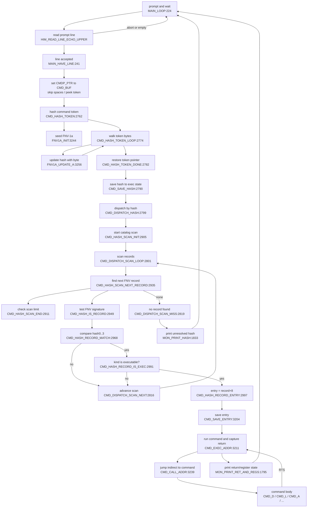

# R-YORS Command Flow Map
<!-- AUTO-GENERATED by SRC/tools/gen_docs.ps1. Do not hand-edit. -->

Generated: 2026-05-25T21:48-05:00

Scope: operational HIMON/STR8 source plus ROM support; excludes harnesses, proof apps, games, ACIA/PIA, and local generated-language images.

Scope: current HIMON command dispatch/resolve/run/return flow. This is a source-derived guide map for the hashed command path in `HIMON/himon.asm`, not a full call graph of every command body.

## Return Contract

- The resolved command entry is the current inline HIMON command body at `record+8` for `kind=$00` records.
- `CMD_EXEC_ADDR` calls `CMD_CALL_ADDR`; `CMD_CALL_ADDR` performs `JMP (CMDP_ADDR_LO)` into the command body.
- The command body returns with `RTS`, landing back inside `CMD_EXEC_ADDR` after the original `JSR CMD_CALL_ADDR`.
- `CMD_EXEC_ADDR` captures A/X/Y/P/S and the saved command entry, calls `MON_PRINT_RET_AND_REGS`, then returns to `CMD_DISPATCH_HASH`, which jumps back to `MAIN_LOOP`.
- If the scan misses, HIMON prints the unresolved hash and returns to `MAIN_LOOP` without entering `CMD_UNKNOWN`.

## Source Labels

- `MAIN_LOOP`: HIMON/himon.asm:224
- `MAIN_HAVE_LINE`: HIMON/himon.asm:241
- `CMD_HASH_TOKEN`: HIMON/himon.asm:2762
- `CMD_HASH_TOKEN_LOOP`: HIMON/himon.asm:2774
- `CMD_HASH_TOKEN_DONE`: HIMON/himon.asm:2782
- `FNV1A_INIT`: HIMON/himon.asm:3244
- `FNV1A_UPDATE_A`: HIMON/himon.asm:3256
- `CMD_SAVE_HASH`: HIMON/himon.asm:2790
- `CMD_DISPATCH_HASH`: HIMON/himon.asm:2799
- `CMD_DISPATCH_SCAN_LOOP`: HIMON/himon.asm:2801
- `CMD_HASH_SCAN_INIT`: HIMON/himon.asm:2905
- `CMD_HASH_SCAN_NEXT_RECORD`: HIMON/himon.asm:2935
- `CMD_HASH_SCAN_END`: HIMON/himon.asm:2911
- `CMD_HASH_IS_RECORD`: HIMON/himon.asm:2949
- `CMD_HASH_RECORD_MATCH`: HIMON/himon.asm:2968
- `CMD_HASH_RECORD_IS_EXEC`: HIMON/himon.asm:2991
- `CMD_HASH_RECORD_ENTRY`: HIMON/himon.asm:2997
- `CMD_SAVE_ENTRY`: HIMON/himon.asm:3204
- `CMD_EXEC_ADDR`: HIMON/himon.asm:3211
- `CMD_CALL_ADDR`: HIMON/himon.asm:3239
- `CMD_DISPATCH_SCAN_NEXT`: HIMON/himon.asm:2816
- `CMD_DISPATCH_SCAN_MISS`: HIMON/himon.asm:2819
- `MON_PRINT_HASH`: HIMON/himon.asm:1833
- `MON_PRINT_RET_AND_REGS`: HIMON/himon.asm:1795
- `CMD_UNKNOWN`: HIMON/himon.asm:253
