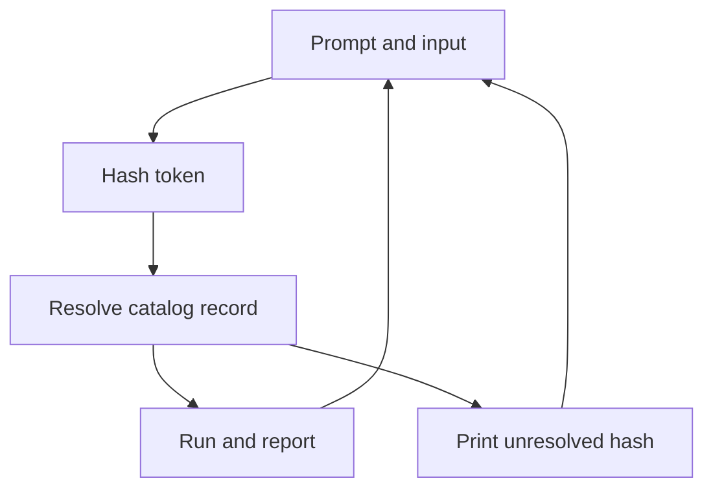
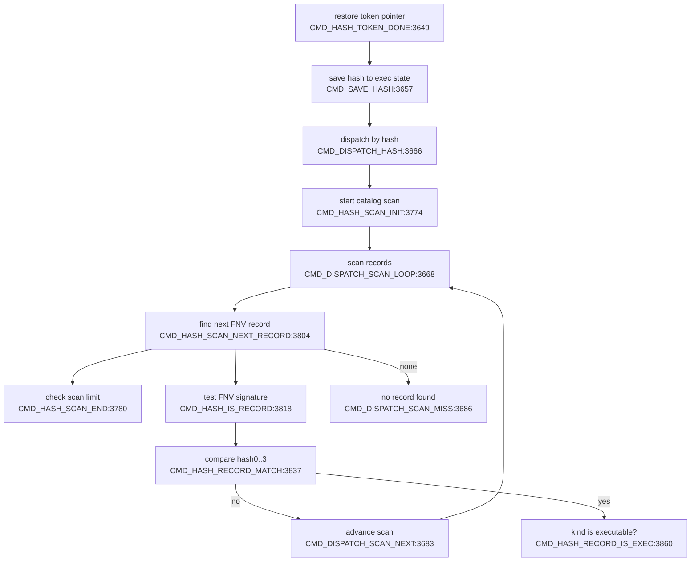

# R-YORS Command Flow Map
<!-- AUTO-GENERATED by SRC/tools/gen_docs.ps1. Do not hand-edit. -->

Generated: 2026-08-13T05:58-05:00

Scope: operational HIMON source plus ROM support; excludes external STR8-N source, harnesses, proof apps, games, ACIA/PIA, and local generated-language images.

Scope: current HIMON command dispatch/resolve/run/return flow. This is a source-derived guide map for the hashed command path in `HIMON/himon.asm`, not a full call graph of every command body.

## Top-Level Stages

```mermaid
flowchart TD
    PROMPT["Prompt and input"] --> HASHSTAGE["Hash token"]
    HASHSTAGE --> RESOLVE["Resolve catalog record"]
    RESOLVE --> RUNSTAGE["Run and report"]
    RESOLVE --> MISSSTAGE["Print unresolved hash"]
    RUNSTAGE --> PROMPT
    MISSSTAGE --> PROMPT
```

## 1. Prompt And Hash

```mermaid
flowchart TD
    LOOP["prompt and wait<br/>MAIN_LOOP:350"] --> READ["read prompt line<br/>HIM_READ_LINE_ECHO_UPPER"]
    READ --> HAVE["line accepted<br/>MAIN_HAVE_LINE:367"]
    READ -->|abort or empty| LOOP
    HAVE --> PREP["set CMDP_PTR to CMD_BUF<br/>skip spaces / peek token"]
    PREP --> HASH["hash command token<br/>CMD_HASH_TOKEN:3629"]
    HASH --> FNVINIT["seed FNV-1a<br/>FNV1A_INIT:4136"]
    HASH --> HASHLOOP["walk token bytes<br/>CMD_HASH_TOKEN_LOOP:3641"]
    HASHLOOP --> UPDATE["update hash with byte<br/>FNV1A_UPDATE_A:4148"]
    UPDATE --> HASHLOOP
    HASHLOOP --> DONE["restore token pointer<br/>CMD_HASH_TOKEN_DONE:3649"]
```

## 2. Resolve The Catalog Record

```mermaid
flowchart TD
    DONE["restore token pointer<br/>CMD_HASH_TOKEN_DONE:3649"] --> SAVEHASH["save hash to exec state<br/>CMD_SAVE_HASH:3657"]
    SAVEHASH --> DISPATCH["dispatch by hash<br/>CMD_DISPATCH_HASH:3666"]
    DISPATCH --> SCANINIT["start catalog scan<br/>CMD_HASH_SCAN_INIT:3774"]
    SCANINIT --> SCANLOOP["scan records<br/>CMD_DISPATCH_SCAN_LOOP:3668"]
    SCANLOOP --> NEXTREC["find next FNV record<br/>CMD_HASH_SCAN_NEXT_RECORD:3804"]
    NEXTREC --> ENDCHK["check scan limit<br/>CMD_HASH_SCAN_END:3780"]
    NEXTREC --> ISREC["test FNV signature<br/>CMD_HASH_IS_RECORD:3818"]
    NEXTREC -->|none| MISS["no record found<br/>CMD_DISPATCH_SCAN_MISS:3686"]
    ISREC --> MATCH["compare hash0..3<br/>CMD_HASH_RECORD_MATCH:3837"]
    MATCH -->|no| ADV["advance scan<br/>CMD_DISPATCH_SCAN_NEXT:3683"]
    ADV --> SCANLOOP
    MATCH -->|yes| EXECOK["kind is executable?<br/>CMD_HASH_RECORD_IS_EXEC:3860"]
```

## 3. Run, Return, Or Miss

```mermaid
flowchart TD
    EXECOK["kind is executable?"] -->|no| ADV["advance scan"]
    EXECOK -->|yes| ENTRY["entry = record+8<br/>CMD_HASH_RECORD_ENTRY:3866"]
    ENTRY --> SAVEENTRY["save entry<br/>CMD_SAVE_ENTRY:4074"]
    SAVEENTRY --> RUN["run command and capture return<br/>CMD_EXEC_ADDR:4081"]
    RUN --> CALL["jump indirect to command<br/>CMD_CALL_ADDR:4119"]
    CALL --> BODY["command body<br/>CMD_D / CMD_L / CMD_Q / ..."]
    BODY -->|RTS| RUN
    RUN --> RETPRINT["print return/register state<br/>MON_PRINT_RET_AND_REGS:1429"]
    RETPRINT --> LOOP["prompt and wait"]
    MISS["no record found"] --> PRHASH["print unresolved hash<br/>MON_PRINT_HASH:1461"]
    PRHASH --> LOOP
```

## Return Contract

- The resolved command entry is the current inline HIMON command body at `record+8` for `kind=$00` records.
- `CMD_EXEC_ADDR` calls `CMD_CALL_ADDR`; `CMD_CALL_ADDR` performs `JMP (CMDP_ADDR_LO)` into the command body.
- The command body returns with `RTS`, landing back inside `CMD_EXEC_ADDR` after the original `JSR CMD_CALL_ADDR`.
- `CMD_EXEC_ADDR` captures A/X/Y/P/S and the saved command entry, calls `MON_PRINT_RET_AND_REGS`, then returns to `CMD_DISPATCH_HASH`, which jumps back to `MAIN_LOOP`.
- If the scan misses, HIMON prints the unresolved hash and returns to `MAIN_LOOP` without entering `CMD_UNKNOWN`.

## Source Labels

- `MAIN_LOOP`: HIMON/himon.asm:350
- `MAIN_HAVE_LINE`: HIMON/himon.asm:367
- `CMD_HASH_TOKEN`: HIMON/himon.asm:3629
- `CMD_HASH_TOKEN_LOOP`: HIMON/himon.asm:3641
- `CMD_HASH_TOKEN_DONE`: HIMON/himon.asm:3649
- `FNV1A_INIT`: HIMON/himon.asm:4136
- `FNV1A_UPDATE_A`: HIMON/himon.asm:4148
- `CMD_SAVE_HASH`: HIMON/himon.asm:3657
- `CMD_DISPATCH_HASH`: HIMON/himon.asm:3666
- `CMD_DISPATCH_SCAN_LOOP`: HIMON/himon.asm:3668
- `CMD_HASH_SCAN_INIT`: HIMON/himon.asm:3774
- `CMD_HASH_SCAN_NEXT_RECORD`: HIMON/himon.asm:3804
- `CMD_HASH_SCAN_END`: HIMON/himon.asm:3780
- `CMD_HASH_IS_RECORD`: HIMON/himon.asm:3818
- `CMD_HASH_RECORD_MATCH`: HIMON/himon.asm:3837
- `CMD_HASH_RECORD_IS_EXEC`: HIMON/himon.asm:3860
- `CMD_HASH_RECORD_ENTRY`: HIMON/himon.asm:3866
- `CMD_SAVE_ENTRY`: HIMON/himon.asm:4074
- `CMD_EXEC_ADDR`: HIMON/himon.asm:4081
- `CMD_CALL_ADDR`: HIMON/himon.asm:4119
- `CMD_DISPATCH_SCAN_NEXT`: HIMON/himon.asm:3683
- `CMD_DISPATCH_SCAN_MISS`: HIMON/himon.asm:3686
- `MON_PRINT_HASH`: HIMON/himon.asm:1461
- `MON_PRINT_RET_AND_REGS`: HIMON/himon.asm:1429
- `CMD_UNKNOWN`: HIMON/himon.asm:379
