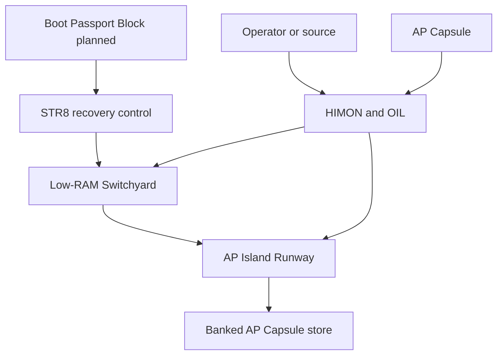
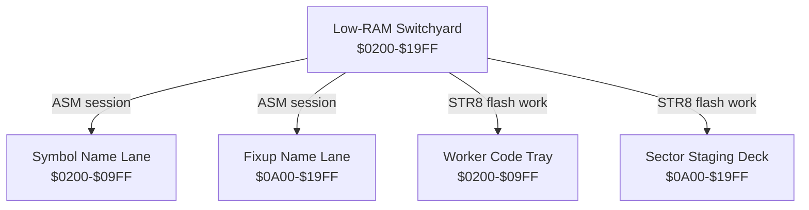
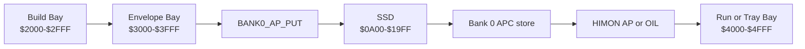
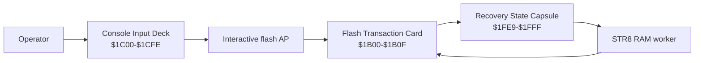
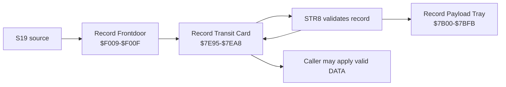

# R-YORS Control Deck Map
<!-- AUTO-GENERATED by SRC/tools/gen_docs.ps1. Do not hand-edit. -->

Generated: 2026-07-20T21:26-05:00

Scope: operational HIMON/STR8 source plus ROM support; excludes harnesses, proof apps, games, ACIA/PIA, and local generated-language images.

Scope: generated Deck Plan atlas for the current control blocks, phase-owned RAM areas, record transit service, AP Capsule route, interactive flash tools, and planned selected-bank passport. The formal address authority remains [GUIDES/MEMORY/MEMORY_MAP.md](../GUIDES/MEMORY/MEMORY_MAP.md).

This atlas intentionally uses a top-down breakdown. Each Mermaid view has one job and a small number of edges; follow the links and the address table instead of trying to read the whole machine from one diagram.

## Deck Plan Legend

| Name | Address or scope | Owner/phase | Practical meaning |
| --- | --- | --- | --- |
| AP Capsule (APC) | RAM, visible flash, or banked flash | OIL transport | Serialized AP envelope; it is data until loaded into RAM. |
| Low-RAM Switchyard (LRS) | `$0200-$19FF` | ASM or STR8, never both | ASM names change over to worker code and a staged sector. |
| Symbol/Fixup Name Lanes (SNL/FNL) | `$0200-$09FF` / `$0A00-$19FF` | ASM session | Low name tables used for assembly and reporting. |
| Worker Code Tray / Sector Staging Deck (WCT/SSD) | `$0200-$09FF` / `$0A00-$19FF` | STR8 flash/banked AP work | RAM worker code plus one full 4K staged sector. |
| Flash Transaction Card / Console Input Deck (FTC/CID) | `$1B00-$1B0F` / `$1C00-$1CFE` | Interactive flash AP | Request/result, CRC, write arm, and safe line input. |
| Record Payload Tray / Record Transit Card (RPT/RTC) | `$7B00-$7BFB` / `$7E95-$7EA8` | STR8 record service | Decoded S19 bytes and their frozen request/result descriptor. |
| Record Frontdoor (RFD) | `$F009-$F00F` | STR8 record service | Fixed jump entry plus `SR/01` signature and capability bytes. |
| Recovery State Capsule (RSC) | `$1FE9-$1FFF` | STR8 | Compact bank/sector/copy/update control state. |
| AP Island Runway (AIR) | `$2000-$4FFF` | AP lifecycle | Build Bay `$2000`, Envelope Bay `$3000`, Run/Tray Bay `$4000`. |
| ASM Work Hold / Safe / Volatile decks (AWH/SOD/VOD) | `$5000-$61A9` / `$61AA-$79FF` / `$7A00-$7DFF` | ASM/HIMON | Current UDATA, safe upper output, then volatile command/monitor work. |
| High Service Deck / I/O Bulkhead (HSD/IOB) | `$7E00-$7EFF` / `$7F00-$7FFF` | HIMON/STR8 / devices | Published service state, including RTC, and side-effectful device boundary. |
| Boot Passport Block (BPB) | planned `$F010-$F01F` | future STR8 selected-bank launch | `S8B1` identity, entry, CRC, tag, and commit-last seal. |
| Reporter Rebase Table (RBT) | movable reporter BODY-relative | session reporter | Private `SR/01` rows that rebase internal addresses; not an AP Capsule ABI field. |

## 1. Control Plane Overview

## 2. Low-RAM Switchyard

The Switchyard Rule is the crucial ownership rule: an ASM session and a STR8/banked-AP operation do not own these lanes at the same time.

## 3. AP Capsule Route Through The AIR

The Capsule Rule says storage is not execution. The Runway Rule says the `$4000-$4FFF` Run/Tray Bay has one occupant: a sector tray, a loaded AP, or the movable reporter.

## 4. Interactive Flash Card

The Card Rule keeps an erase/program action tied to the exact request and sector image that were preflighted.

## 5. Selected-Bank Passport Gate

This is planned behavior, not a current STR8 command. The Passport Rule says the BPB must be fully validated in RAM before a selected bank is entered.

## 6. Validated Record Transit

The Transit Rule keeps the decoded RPT bytes and their RTC descriptor together. This is a current service, unlike the planned passport gate.

## Use At The Bench

- Before an `AP B0` load, record which AIR bay contains the Capsule and which will receive the BODY.
- Before a destructive flash action, identify the FTC request, the Run/Tray Bay image, and the RSC worker state that will be consumed.
- Before reporting an ASM session, obey the Switchyard Rule: preload the reporter, finish the session, then run the resident reporter without another banked `AP`.
- Before applying an S19 DATA record, identify the RFD, the matching RTC descriptor, and the RPT payload tray; parse again if either transient area was reused.
- Before future selected-bank launch, treat the BPB as an untrusted passport until all Passport Rule checks pass.
