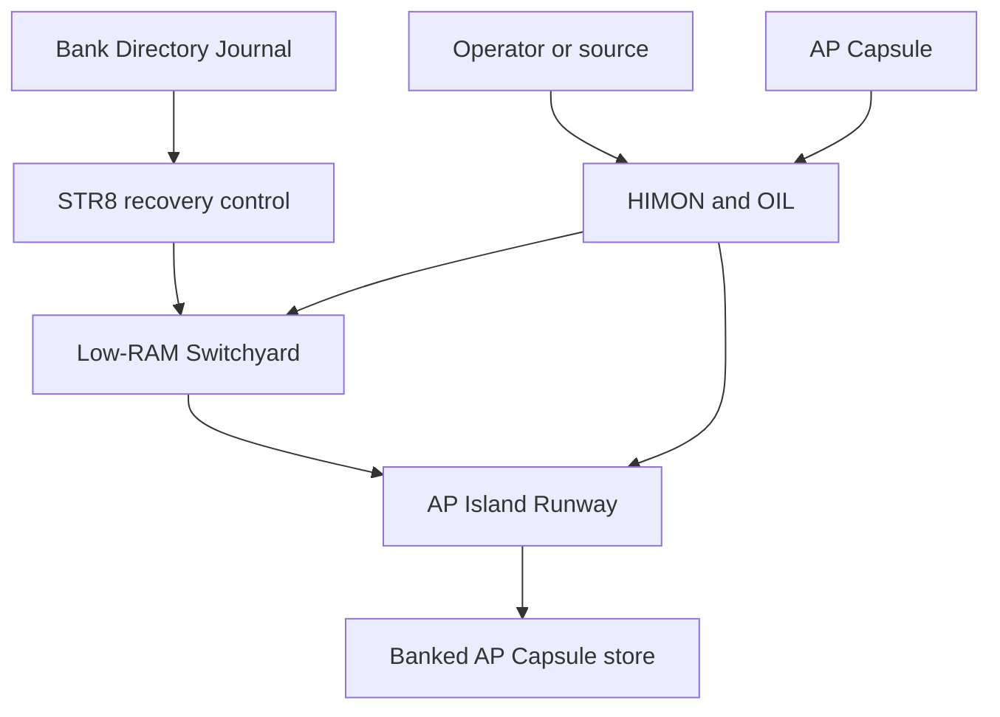
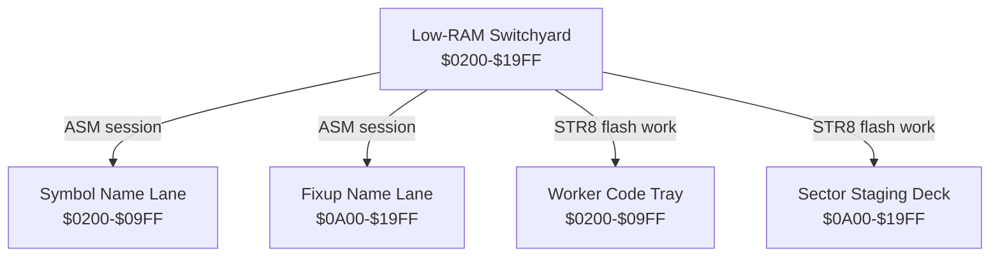
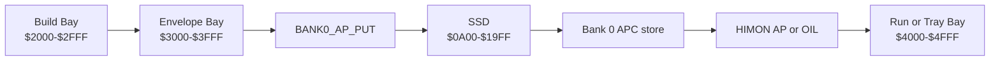
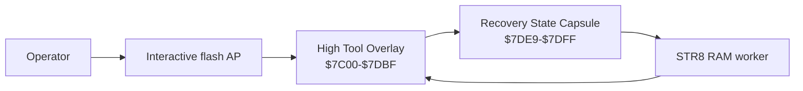
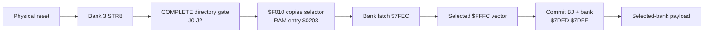
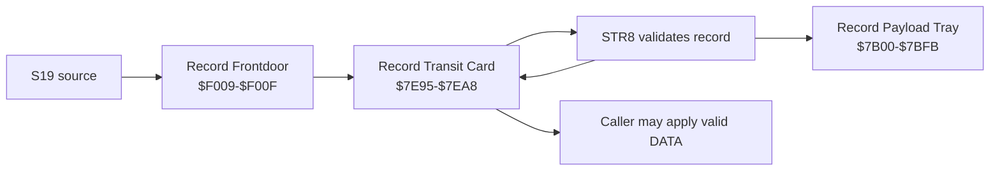

# R-YORS Control Deck Map
<!-- AUTO-GENERATED by SRC/tools/gen_docs.ps1. Do not hand-edit. -->

Generated: 2026-09-08T00:46-05:00

Scope: operational HIMON source plus ROM support; excludes external STR8-N source, harnesses, proof apps, games, ACIA/PIA, and local generated-language images.

Scope: generated Deck Plan atlas for the current control blocks, phase-owned RAM areas, record transit service, AP Capsule route, interactive flash tools, and selected-bank handoff. The formal address authority remains [GUIDES/MEMORY/MEMORY_MAP.md](../GUIDES/MEMORY/MEMORY_MAP.md).

This atlas intentionally uses a top-down breakdown. Each Mermaid view has one job and a small number of edges; follow the links and the address table instead of trying to read the whole machine from one diagram.

## Deck Plan Legend

| Name | Address or scope | Owner/phase | Practical meaning |
| --- | --- | --- | --- |
| AP Capsule (APC) | RAM, visible flash, or banked flash | OIL transport | Serialized AP envelope; it is data until loaded into RAM. |
| Low-RAM Switchyard (LRS) | `$0200-$19FF` | ASM or STR8, never both | ASM names change over to worker code and a staged sector. |
| Symbol/Fixup Name Lanes (SNL/FNL) | `$0200-$09FF` / `$0A00-$19FF` | ASM session | Low name tables used for assembly and reporting. |
| Worker Code Tray / Sector Staging Deck (WCT/SSD) | `$0200-$09FF` / `$0A00-$19FF` | STR8 flash/banked AP work | RAM worker code plus one full 4K staged sector. |
| High Tool Overlay (HTO) | `$7C00-$7DBF` | One foreground RAM tool | Request/result, bounded input, directory staging, and tool tables. |
| Record Payload Tray / Record Transit Card (RPT/RTC) | `$7B00-$7BFB` / `$7E95-$7EA8` | STR8 record service | Decoded S19 bytes and their frozen request/result descriptor. |
| Record Frontdoor (RFD) | `$F009-$F00F` | STR8 record service | Fixed jump entry plus `SR/02` signature, version, and capability bytes. |
| APMAN Command Shadow / User Low RAM | `$1A00-$1AFF` / `$1B00-$1FFF` | APMAN phase / user | Command shadow is transient while AP/APS/INSTALL delegates; the upper 1280 bytes remain user/free outside another phase owner. |
| Recovery State Capsule (RSC) | `$7DE9-$7DFF` | STR8 | Compact bank/sector/copy/update control state plus the published Bank Jump Record at `$7DFD-$7DFF`. |
| AP Island Runway (AIR) | `$2000-$4FFF` | AP lifecycle | Build Bay `$2000`, Envelope Bay `$3000`, Run/Tray Bay `$4000`. |
| ASM Work Hold / Safe / Volatile decks (AWH/SOD/VOD) | `$5000-$6D6D` / `$6D6E-$6FFF` / `$7000-$7CFF` | ASM/HIMON/APMAN | Current ASM UDATA, small application headroom, then phase-owned APMAN/loader/tool space below the protected `$7Dxx` page. |
| High Service Deck / I/O Bulkhead (HSD/IOB) | `$7E00-$7EFF` / `$7F00-$7FFF` | HIMON/STR8-N / devices | Published service state, including RTC, and side-effectful device boundary. |
| Bank Directory Journal / Bank Select Door (BDJ/BSD) | `$FFB0-$FFEF` / `$F010` then RAM `$0203` | STR8-N | COMPLETE records authorize J0-J2; the resident door copies and enters the return-capable RAM selector. |
| Reporter Rebase Table (RBT) | movable reporter BODY-relative | session reporter | Private `SR/01` rows that rebase internal addresses; not an AP Capsule ABI field. |

## 1. Control Plane Overview

```mermaid
flowchart TD
    OP["Operator or source"] --> HIM["HIMON and OIL"]
    APC["AP Capsule"] --> HIM
    STR8["STR8 recovery control"] --> LRS["Low-RAM Switchyard"]
    HIM --> LRS
    LRS --> AIR["AP Island Runway"]
    HIM --> AIR
    AIR --> STORE["Banked AP Capsule store"]
    BDJ["Bank Directory Journal"] --> STR8
```

## 2. Low-RAM Switchyard

The Switchyard Rule is the crucial ownership rule: an ASM session and a STR8/banked-AP operation do not own these lanes at the same time.

```mermaid
flowchart TD
    LRS["Low-RAM Switchyard<br/>$0200-$19FF"] -->|ASM session| SNL["Symbol Name Lane<br/>$0200-$09FF"]
    LRS -->|ASM session| FNL["Fixup Name Lane<br/>$0A00-$19FF"]
    LRS -->|STR8 flash work| WCT["Worker Code Tray<br/>$0200-$09FF"]
    LRS -->|STR8 flash work| SSD["Sector Staging Deck<br/>$0A00-$19FF"]
```

## 3. AP Capsule Route Through The AIR

The Capsule Rule says storage is not execution. The Runway Rule says the `$4000-$4FFF` Run/Tray Bay has one occupant: a sector tray, a loaded AP, or the movable reporter.

```mermaid
flowchart LR
    BB["Build Bay<br/>$2000-$2FFF"] --> EB["Envelope Bay<br/>$3000-$3FFF"]
    EB --> PUT["BANK0_AP_PUT"]
    PUT --> SSD["SSD<br/>$0A00-$19FF"]
    SSD --> B0["Bank 0 APC store"]
    B0 --> OIL["HIMON AP or OIL"]
    OIL --> RTB["Run or Tray Bay<br/>$4000-$4FFF"]
```

## 4. Interactive Flash Card

The Card Rule keeps an erase/program action tied to the exact request and sector image that were preflighted.

```mermaid
flowchart LR
    OP["Operator"] --> AP["Interactive flash AP"]
    AP --> HTO["High Tool Overlay<br/>$7C00-$7DBF"]
    HTO --> RSC["Recovery State Capsule<br/>$7DE9-$7DFF"]
    RSC --> W["STR8 RAM worker"]
    W --> HTO
```

## 5. Selected-Bank Handoff Gate

This is current `J0`-`J3` behavior. J0-J2 require a COMPLETE Bank-3 directory record; J3 is the local exception. The bank switch and RESET-vector validation execute from RAM, and the Bank Jump Record is committed only after validation.

```mermaid
flowchart LR
    RESET["Physical reset"] --> B3["Bank 3 STR8"]
    B3 --> DIR["COMPLETE directory gate<br/>J0-J2"]
    DIR --> RAMP["$F010 copies selector<br/>RAM entry $0203"]
    RAMP --> LATCH["Bank latch $7FEC"]
    LATCH --> VECTOR["Selected $FFFC vector"]
    VECTOR --> BJR["Commit BJ + bank<br/>$7DFD-$7DFF"]
    BJR --> GUEST["Selected-bank payload"]
```

## 6. Validated Record Transit

The Transit Rule keeps the decoded RPT bytes and their RTC descriptor together. STR8-N owns record validation; each caller owns destination and execution policy.

```mermaid
flowchart LR
    SRC["S19 source"] --> RFD["Record Frontdoor<br/>$F009-$F00F"]
    RFD --> RTC["Record Transit Card<br/>$7E95-$7EA8"]
    RTC --> PARSE["STR8 validates record"]
    PARSE --> RPT["Record Payload Tray<br/>$7B00-$7BFB"]
    PARSE --> RTC
    RTC --> APPLY["Caller may apply valid DATA"]
```

## Use At The Bench

- Before an `AP B0` load, record which AIR bay contains the Capsule and which will receive the BODY.
- Before a destructive flash action, identify the FTC request, the Run/Tray Bay image, and the RSC worker state that will be consumed.
- Before reporting an ASM session, obey the Switchyard Rule: preload the reporter, finish the session, then run the resident reporter without another banked `AP`.
- Before applying an S19 DATA record, identify the RFD, the matching RTC descriptor, and the RPT payload tray; parse again if either transient area was reused.
- Before selected-bank launch, require the directory/RESET-vector gate and treat `$7DFD-$7DFF` as authoritative only after the validated handoff commits `BJ` plus bank.
