# R-YORS Hash Routine Map
<!-- AUTO-GENERATED by SRC/tools/gen_docs.ps1. Do not hand-edit. -->

Generated: 2026-05-07 19:51:47 -05:00

Scope: operational HIMON/STR8 source plus ROM support; excludes harnesses, proof apps, games, ACIA/PIA, and local generated-language images.

Scope: current source-derived hash path. This includes `CMD_HASH*`, `FNV1A_*`, `MATH_*HASH*`, `MON_PRINT_HASH`, `CMD_SAVE_HASH`, and `CMD_DISPATCH_HASH` labels plus their direct call neighbors. Routine header `[HASH:...]` IDs alone do not make a routine part of this map.

```mermaid
flowchart LR
    N_CMD_HASH_PRINT_FNV[CMD_HASH_PRINT_FNV] -->|4| N_SYS_WRITE_HEX_BYTE[SYS_WRITE_HEX_BYTE]
    N_CMD_HASH_PRINT_RECORD_HASH[CMD_HASH_PRINT_RECORD_HASH] -->|4| N_SYS_WRITE_HEX_BYTE[SYS_WRITE_HEX_BYTE]
    N_FNV1A_MUL_PRIME[FNV1A_MUL_PRIME] -->|4| N_MATH_SHLADD_TERM_N[MATH_SHLADD_TERM_N]
    N_MON_PRINT_HASH[MON_PRINT_HASH] -->|4| N_SYS_WRITE_HEX_BYTE[SYS_WRITE_HEX_BYTE]
    N_CMD_HASH_INFO_FOUND[CMD_HASH_INFO_FOUND] -->|2| N_HIM_WRITE_HBSTRING[HIM_WRITE_HBSTRING]
    N_CMD_HASH_PRINT_ENTRY[CMD_HASH_PRINT_ENTRY] -->|2| N_SYS_WRITE_HEX_BYTE[SYS_WRITE_HEX_BYTE]
    N_CMD_HASH_PRINT_ROW[CMD_HASH_PRINT_ROW] -->|2| N_CMD_HASH_SPACE[CMD_HASH_SPACE]
    N_MON_PRINT_HASH[MON_PRINT_HASH] -->|2| N_BIO_FTDI_WRITE_BYTE_BLOCK[BIO_FTDI_WRITE_BYTE_BLOCK]
    N_CMD_DISPATCH_HASH[CMD_DISPATCH_HASH] -->|1| N_CMD_HASH_SCAN_INIT[CMD_HASH_SCAN_INIT]
    N_CMD_DISPATCH_SCAN_LOOP[CMD_DISPATCH_SCAN_LOOP] -->|1| N_CMD_HASH_RECORD_ENTRY[CMD_HASH_RECORD_ENTRY]
    N_CMD_DISPATCH_SCAN_LOOP[CMD_DISPATCH_SCAN_LOOP] -->|1| N_CMD_HASH_RECORD_IS_EXEC[CMD_HASH_RECORD_IS_EXEC]
    N_CMD_DISPATCH_SCAN_LOOP[CMD_DISPATCH_SCAN_LOOP] -->|1| N_CMD_HASH_RECORD_MATCH[CMD_HASH_RECORD_MATCH]
    N_CMD_DISPATCH_SCAN_LOOP[CMD_DISPATCH_SCAN_LOOP] -->|1| N_CMD_HASH_SCAN_NEXT_RECORD[CMD_HASH_SCAN_NEXT_RECORD]
    N_CMD_DISPATCH_SCAN_MISS[CMD_DISPATCH_SCAN_MISS] -->|1| N_MON_PRINT_HASH[MON_PRINT_HASH]
    N_CMD_DISPATCH_SCAN_NEXT[CMD_DISPATCH_SCAN_NEXT] -->|1| N_CMD_HASH_SCAN_ADV[CMD_HASH_SCAN_ADV]
    N_CMD_HASH_FIND[CMD_HASH_FIND] -->|1| N_CMD_HASH_SCAN_INIT[CMD_HASH_SCAN_INIT]
    N_CMD_HASH_FIND_LOOP[CMD_HASH_FIND_LOOP] -->|1| N_CMD_HASH_RECORD_ENTRY[CMD_HASH_RECORD_ENTRY]
    N_CMD_HASH_FIND_LOOP[CMD_HASH_FIND_LOOP] -->|1| N_CMD_HASH_RECORD_MATCH[CMD_HASH_RECORD_MATCH]
    N_CMD_HASH_FIND_LOOP[CMD_HASH_FIND_LOOP] -->|1| N_CMD_HASH_SCAN_NEXT_RECORD[CMD_HASH_SCAN_NEXT_RECORD]
    N_CMD_HASH_FIND_NEXT[CMD_HASH_FIND_NEXT] -->|1| N_CMD_HASH_SCAN_ADV[CMD_HASH_SCAN_ADV]
    N_CMD_HASH_INFO[CMD_HASH_INFO] -->|1| N_CMD_ADV_PTR[CMD_ADV_PTR]
    N_CMD_HASH_INFO[CMD_HASH_INFO] -->|1| N_CMD_HASH_FIND[CMD_HASH_FIND]
    N_CMD_HASH_INFO[CMD_HASH_INFO] -->|1| N_CMD_HASH_PRINT_FNV[CMD_HASH_PRINT_FNV]
    N_CMD_HASH_INFO[CMD_HASH_INFO] -->|1| N_CMD_HASH_PRINT_TOKEN[CMD_HASH_PRINT_TOKEN]
    N_CMD_HASH_INFO[CMD_HASH_INFO] -->|1| N_CMD_HASH_TOKEN[CMD_HASH_TOKEN]
    N_CMD_HASH_INFO[CMD_HASH_INFO] -->|1| N_CMD_PEEK[CMD_PEEK]
    N_CMD_HASH_INFO[CMD_HASH_INFO] -->|1| N_CMD_SKIP_SPACES[CMD_SKIP_SPACES]
    N_CMD_HASH_INFO[CMD_HASH_INFO] -->|1| N_HIM_WRITE_HBSTRING[HIM_WRITE_HBSTRING]
    N_CMD_HASH_INFO[CMD_HASH_INFO] -->|1| N_SYS_WRITE_CRLF[SYS_WRITE_CRLF]
    N_CMD_HASH_INFO_FOUND[CMD_HASH_INFO_FOUND] -->|1| N_CMD_HASH_PRINT_ENTRY[CMD_HASH_PRINT_ENTRY]
    N_CMD_HASH_INFO_FOUND[CMD_HASH_INFO_FOUND] -->|1| N_CMD_HASH_PRINT_KIND[CMD_HASH_PRINT_KIND]
    N_CMD_HASH_INFO_FOUND[CMD_HASH_INFO_FOUND] -->|1| N_CMD_HASH_PRINT_TOKEN[CMD_HASH_PRINT_TOKEN]
    N_CMD_HASH_INFO_FOUND[CMD_HASH_INFO_FOUND] -->|1| N_SYS_WRITE_CRLF[SYS_WRITE_CRLF]
    N_CMD_HASH_LIST[CMD_HASH_LIST] -->|1| N_CMD_HASH_SCAN_INIT[CMD_HASH_SCAN_INIT]
    N_CMD_HASH_LIST[CMD_HASH_LIST] -->|1| N_HIM_WRITE_HBSTRING[HIM_WRITE_HBSTRING]
    N_CMD_HASH_LIST[CMD_HASH_LIST] -->|1| N_SYS_WRITE_CRLF[SYS_WRITE_CRLF]
    N_CMD_HASH_LIST_LOOP[CMD_HASH_LIST_LOOP] -->|1| N_CMD_HASH_PRINT_ROW[CMD_HASH_PRINT_ROW]
    N_CMD_HASH_LIST_LOOP[CMD_HASH_LIST_LOOP] -->|1| N_CMD_HASH_SCAN_ADV[CMD_HASH_SCAN_ADV]
    N_CMD_HASH_LIST_LOOP[CMD_HASH_LIST_LOOP] -->|1| N_CMD_HASH_SCAN_NEXT_RECORD[CMD_HASH_SCAN_NEXT_RECORD]
    N_CMD_HASH_LIST_LOOP[CMD_HASH_LIST_LOOP] -->|1| N_HIM_CHECK_CTRL_C[HIM_CHECK_CTRL_C]
    N_CMD_HASH_PRINT_KIND[CMD_HASH_PRINT_KIND] -->|1| N_SYS_WRITE_HEX_BYTE[SYS_WRITE_HEX_BYTE]
    N_CMD_HASH_PRINT_ROW[CMD_HASH_PRINT_ROW] -->|1| N_CMD_HASH_PRINT_ENTRY[CMD_HASH_PRINT_ENTRY]
    N_CMD_HASH_PRINT_ROW[CMD_HASH_PRINT_ROW] -->|1| N_CMD_HASH_PRINT_KIND[CMD_HASH_PRINT_KIND]
    N_CMD_HASH_PRINT_ROW[CMD_HASH_PRINT_ROW] -->|1| N_CMD_HASH_PRINT_RECORD_HASH[CMD_HASH_PRINT_RECORD_HASH]
    N_CMD_HASH_PRINT_ROW[CMD_HASH_PRINT_ROW] -->|1| N_CMD_HASH_RECORD_ENTRY[CMD_HASH_RECORD_ENTRY]
    N_CMD_HASH_PRINT_ROW[CMD_HASH_PRINT_ROW] -->|1| N_SYS_WRITE_CRLF[SYS_WRITE_CRLF]
    N_CMD_HASH_PRINT_TOKEN[CMD_HASH_PRINT_TOKEN] -->|1| N_CMD_HASH_SPACE[CMD_HASH_SPACE]
    N_CMD_HASH_PRINT_TOKEN_LOOP[CMD_HASH_PRINT_TOKEN_LOOP] -->|1| N_BIO_FTDI_WRITE_BYTE_BLOCK[BIO_FTDI_WRITE_BYTE_BLOCK]
    N_CMD_HASH_PRINT_TOKEN_LOOP[CMD_HASH_PRINT_TOKEN_LOOP] -->|1| N_CMD_IS_DELIM_OR_NUL[CMD_IS_DELIM_OR_NUL]
    N_CMD_HASH_SCAN_NEXT_RECORD[CMD_HASH_SCAN_NEXT_RECORD] -->|1| N_CMD_HASH_IS_RECORD[CMD_HASH_IS_RECORD]
    N_CMD_HASH_SCAN_NEXT_RECORD[CMD_HASH_SCAN_NEXT_RECORD] -->|1| N_CMD_HASH_SCAN_ADV[CMD_HASH_SCAN_ADV]
    N_CMD_HASH_SCAN_NEXT_RECORD[CMD_HASH_SCAN_NEXT_RECORD] -->|1| N_CMD_HASH_SCAN_END[CMD_HASH_SCAN_END]
    N_CMD_HASH_SPACE[CMD_HASH_SPACE] -->|1| N_BIO_FTDI_WRITE_BYTE_BLOCK[BIO_FTDI_WRITE_BYTE_BLOCK]
    N_CMD_HASH_TOKEN[CMD_HASH_TOKEN] -->|1| N_FNV1A_INIT[FNV1A_INIT]
    N_CMD_HASH_TOKEN_DONE[CMD_HASH_TOKEN_DONE] -->|1| N_CMD_SAVE_HASH[CMD_SAVE_HASH]
    N_CMD_HASH_TOKEN_LOOP[CMD_HASH_TOKEN_LOOP] -->|1| N_CMD_ADV_PTR[CMD_ADV_PTR]
    N_CMD_HASH_TOKEN_LOOP[CMD_HASH_TOKEN_LOOP] -->|1| N_CMD_IS_DELIM_OR_NUL[CMD_IS_DELIM_OR_NUL]
    N_CMD_HASH_TOKEN_LOOP[CMD_HASH_TOKEN_LOOP] -->|1| N_CMD_PEEK[CMD_PEEK]
    N_CMD_HASH_TOKEN_LOOP[CMD_HASH_TOKEN_LOOP] -->|1| N_FNV1A_UPDATE_A[FNV1A_UPDATE_A]
    N_FNV1A_MUL_PRIME[FNV1A_MUL_PRIME] -->|1| N_MATH_ADD_TERM1_TO_HASH3[MATH_ADD_TERM1_TO_HASH3]
    N_FNV1A_MUL_PRIME[FNV1A_MUL_PRIME] -->|1| N_MATH_COPY_HASH_TO_TERM[MATH_COPY_HASH_TO_TERM]
    N_FNV1A_UPDATE_A[FNV1A_UPDATE_A] -->|1| N_FNV1A_MUL_PRIME[FNV1A_MUL_PRIME]
    N_MAIN_HAVE_LINE[MAIN_HAVE_LINE] -->|1| N_CMD_DISPATCH_HASH[CMD_DISPATCH_HASH]
    N_MAIN_HAVE_LINE[MAIN_HAVE_LINE] -->|1| N_CMD_HASH_TOKEN[CMD_HASH_TOKEN]
    N_MATH_SHLADD_TERM_N[MATH_SHLADD_TERM_N] -->|1| N_MATH_ADD_TERM_TO_HASH[MATH_ADD_TERM_TO_HASH]
    N_MON_PRINT_EXEC_ID[MON_PRINT_EXEC_ID] -->|1| N_MON_PRINT_HASH[MON_PRINT_HASH]
    N_FNV1A_FOLD8_XY_A[FNV1A_FOLD8_XY_A]
    N_FNV1A_FOLD16_XY_A8[FNV1A_FOLD16_XY_A8]
    N_FNV1A_FOLD32_XY[FNV1A_FOLD32_XY]
    N_CMD_HASH_INFO_FNV[CMD_HASH_INFO_FNV]
    N_CMD_HASH_LIST_DONE[CMD_HASH_LIST_DONE]
    N_CMD_HASH_FIND_FAIL[CMD_HASH_FIND_FAIL]
    N_CMD_HASH_SCAN_NOT_END[CMD_HASH_SCAN_NOT_END]
    N_CMD_HASH_SCAN_AT_END[CMD_HASH_SCAN_AT_END]
    N_CMD_HASH_SCAN_ADV_SAME[CMD_HASH_SCAN_ADV_SAME]
    N_CMD_HASH_SCAN_NEXT_RECORD_FOUND[CMD_HASH_SCAN_NEXT_RECORD_FOUND]
    N_CMD_HASH_SCAN_NEXT_RECORD_FAIL[CMD_HASH_SCAN_NEXT_RECORD_FAIL]
    N_CMD_HASH_IS_RECORD_NO[CMD_HASH_IS_RECORD_NO]
    N_CMD_HASH_RECORD_MATCH_NO[CMD_HASH_RECORD_MATCH_NO]
    N_CMD_HASH_RECORD_IS_EXEC_YES[CMD_HASH_RECORD_IS_EXEC_YES]
    N_CMD_HASH_PRINT_TOKEN_DONE[CMD_HASH_PRINT_TOKEN_DONE]
    N_FNV1A_INIT_LOOP[FNV1A_INIT_LOOP]
    N_FNV1A_OFFSET_BASIS[FNV1A_OFFSET_BASIS]
    N_MATH_COPY_HASH_LOOP[MATH_COPY_HASH_LOOP]
```

## Hash Labels

- `FNV1A_FOLD8_XY_A`: HIMON/fnv1a-fold.asm:27
- `FNV1A_FOLD16_XY_A8`: HIMON/fnv1a-fold.asm:61
- `FNV1A_FOLD32_XY`: HIMON/fnv1a-fold.asm:94
- `CMD_HASH_INFO_FNV`: HIMON/himon.asm:193
- `CMD_HASH_INFO`: HIMON/himon.asm:195
- `CMD_HASH_INFO_FOUND`: HIMON/himon.asm:210
- `CMD_HASH_LIST`: HIMON/himon.asm:223
- `CMD_HASH_LIST_LOOP`: HIMON/himon.asm:229
- `CMD_HASH_LIST_DONE`: HIMON/himon.asm:237
- `MON_PRINT_HASH`: HIMON/himon.asm:1066
- `CMD_HASH_TOKEN`: HIMON/himon.asm:1857
- `CMD_HASH_TOKEN_LOOP`: HIMON/himon.asm:1863
- `CMD_HASH_TOKEN_DONE`: HIMON/himon.asm:1871
- `CMD_SAVE_HASH`: HIMON/himon.asm:1879
- `CMD_DISPATCH_HASH`: HIMON/himon.asm:1888
- `CMD_HASH_FIND`: HIMON/himon.asm:1913
- `CMD_HASH_FIND_LOOP`: HIMON/himon.asm:1915
- `CMD_HASH_FIND_NEXT`: HIMON/himon.asm:1923
- `CMD_HASH_FIND_FAIL`: HIMON/himon.asm:1926
- `CMD_HASH_SCAN_INIT`: HIMON/himon.asm:1930
- `CMD_HASH_SCAN_END`: HIMON/himon.asm:1936
- `CMD_HASH_SCAN_NOT_END`: HIMON/himon.asm:1943
- `CMD_HASH_SCAN_AT_END`: HIMON/himon.asm:1946
- `CMD_HASH_SCAN_ADV`: HIMON/himon.asm:1950
- `CMD_HASH_SCAN_ADV_SAME`: HIMON/himon.asm:1956
- `CMD_HASH_SCAN_NEXT_RECORD`: HIMON/himon.asm:1960
- `CMD_HASH_SCAN_NEXT_RECORD_FOUND`: HIMON/himon.asm:1967
- `CMD_HASH_SCAN_NEXT_RECORD_FAIL`: HIMON/himon.asm:1970
- `CMD_HASH_IS_RECORD`: HIMON/himon.asm:1974
- `CMD_HASH_IS_RECORD_NO`: HIMON/himon.asm:1989
- `CMD_HASH_RECORD_MATCH`: HIMON/himon.asm:1993
- `CMD_HASH_RECORD_MATCH_NO`: HIMON/himon.asm:2012
- `CMD_HASH_RECORD_IS_EXEC`: HIMON/himon.asm:2016
- `CMD_HASH_RECORD_IS_EXEC_YES`: HIMON/himon.asm:2022
- `CMD_HASH_RECORD_ENTRY`: HIMON/himon.asm:2026
- `CMD_HASH_PRINT_ROW`: HIMON/himon.asm:2036
- `CMD_HASH_PRINT_FNV`: HIMON/himon.asm:2046
- `CMD_HASH_PRINT_RECORD_HASH`: HIMON/himon.asm:2057
- `CMD_HASH_PRINT_ENTRY`: HIMON/himon.asm:2072
- `CMD_HASH_PRINT_KIND`: HIMON/himon.asm:2079
- `CMD_HASH_PRINT_TOKEN`: HIMON/himon.asm:2085
- `CMD_HASH_PRINT_TOKEN_LOOP`: HIMON/himon.asm:2088
- `CMD_HASH_PRINT_TOKEN_DONE`: HIMON/himon.asm:2096
- `CMD_HASH_SPACE`: HIMON/himon.asm:2099
- `FNV1A_INIT`: HIMON/himon.asm:2130
- `FNV1A_INIT_LOOP`: HIMON/himon.asm:2132
- `FNV1A_OFFSET_BASIS`: HIMON/himon.asm:2139
- `FNV1A_UPDATE_A`: HIMON/himon.asm:2142
- `FNV1A_MUL_PRIME`: HIMON/himon.asm:2147
- `MATH_COPY_HASH_TO_TERM`: HIMON/himon.asm:2159
- `MATH_COPY_HASH_LOOP`: HIMON/himon.asm:2161
- `MATH_ADD_TERM_TO_HASH`: HIMON/himon.asm:2181
- `MATH_ADD_TERM1_TO_HASH3`: HIMON/himon.asm:2197

## Routine Headers

- `FNV1A_FOLD8_XY_A` [HASH:632A38DD]: HIMON/fnv1a-fold.asm:21
- `FNV1A_FOLD16_XY_A8` [HASH:E52B90E6]: HIMON/fnv1a-fold.asm:54
- `FNV1A_FOLD32_XY` [HASH:9F48B1D8]: HIMON/fnv1a-fold.asm:88

## Direct Edges

- `CMD_HASH_PRINT_FNV` -> `SYS_WRITE_HEX_BYTE`: 4
- `CMD_HASH_PRINT_RECORD_HASH` -> `SYS_WRITE_HEX_BYTE`: 4
- `FNV1A_MUL_PRIME` -> `MATH_SHLADD_TERM_N`: 4
- `MON_PRINT_HASH` -> `SYS_WRITE_HEX_BYTE`: 4
- `CMD_HASH_INFO_FOUND` -> `HIM_WRITE_HBSTRING`: 2
- `CMD_HASH_PRINT_ENTRY` -> `SYS_WRITE_HEX_BYTE`: 2
- `CMD_HASH_PRINT_ROW` -> `CMD_HASH_SPACE`: 2
- `MON_PRINT_HASH` -> `BIO_FTDI_WRITE_BYTE_BLOCK`: 2
- `CMD_DISPATCH_HASH` -> `CMD_HASH_SCAN_INIT`: 1
- `CMD_DISPATCH_SCAN_LOOP` -> `CMD_HASH_RECORD_ENTRY`: 1
- `CMD_DISPATCH_SCAN_LOOP` -> `CMD_HASH_RECORD_IS_EXEC`: 1
- `CMD_DISPATCH_SCAN_LOOP` -> `CMD_HASH_RECORD_MATCH`: 1
- `CMD_DISPATCH_SCAN_LOOP` -> `CMD_HASH_SCAN_NEXT_RECORD`: 1
- `CMD_DISPATCH_SCAN_MISS` -> `MON_PRINT_HASH`: 1
- `CMD_DISPATCH_SCAN_NEXT` -> `CMD_HASH_SCAN_ADV`: 1
- `CMD_HASH_FIND` -> `CMD_HASH_SCAN_INIT`: 1
- `CMD_HASH_FIND_LOOP` -> `CMD_HASH_RECORD_ENTRY`: 1
- `CMD_HASH_FIND_LOOP` -> `CMD_HASH_RECORD_MATCH`: 1
- `CMD_HASH_FIND_LOOP` -> `CMD_HASH_SCAN_NEXT_RECORD`: 1
- `CMD_HASH_FIND_NEXT` -> `CMD_HASH_SCAN_ADV`: 1
- `CMD_HASH_INFO` -> `CMD_ADV_PTR`: 1
- `CMD_HASH_INFO` -> `CMD_HASH_FIND`: 1
- `CMD_HASH_INFO` -> `CMD_HASH_PRINT_FNV`: 1
- `CMD_HASH_INFO` -> `CMD_HASH_PRINT_TOKEN`: 1
- `CMD_HASH_INFO` -> `CMD_HASH_TOKEN`: 1
- `CMD_HASH_INFO` -> `CMD_PEEK`: 1
- `CMD_HASH_INFO` -> `CMD_SKIP_SPACES`: 1
- `CMD_HASH_INFO` -> `HIM_WRITE_HBSTRING`: 1
- `CMD_HASH_INFO` -> `SYS_WRITE_CRLF`: 1
- `CMD_HASH_INFO_FOUND` -> `CMD_HASH_PRINT_ENTRY`: 1
- `CMD_HASH_INFO_FOUND` -> `CMD_HASH_PRINT_KIND`: 1
- `CMD_HASH_INFO_FOUND` -> `CMD_HASH_PRINT_TOKEN`: 1
- `CMD_HASH_INFO_FOUND` -> `SYS_WRITE_CRLF`: 1
- `CMD_HASH_LIST` -> `CMD_HASH_SCAN_INIT`: 1
- `CMD_HASH_LIST` -> `HIM_WRITE_HBSTRING`: 1
- `CMD_HASH_LIST` -> `SYS_WRITE_CRLF`: 1
- `CMD_HASH_LIST_LOOP` -> `CMD_HASH_PRINT_ROW`: 1
- `CMD_HASH_LIST_LOOP` -> `CMD_HASH_SCAN_ADV`: 1
- `CMD_HASH_LIST_LOOP` -> `CMD_HASH_SCAN_NEXT_RECORD`: 1
- `CMD_HASH_LIST_LOOP` -> `HIM_CHECK_CTRL_C`: 1
- `CMD_HASH_PRINT_KIND` -> `SYS_WRITE_HEX_BYTE`: 1
- `CMD_HASH_PRINT_ROW` -> `CMD_HASH_PRINT_ENTRY`: 1
- `CMD_HASH_PRINT_ROW` -> `CMD_HASH_PRINT_KIND`: 1
- `CMD_HASH_PRINT_ROW` -> `CMD_HASH_PRINT_RECORD_HASH`: 1
- `CMD_HASH_PRINT_ROW` -> `CMD_HASH_RECORD_ENTRY`: 1
- `CMD_HASH_PRINT_ROW` -> `SYS_WRITE_CRLF`: 1
- `CMD_HASH_PRINT_TOKEN` -> `CMD_HASH_SPACE`: 1
- `CMD_HASH_PRINT_TOKEN_LOOP` -> `BIO_FTDI_WRITE_BYTE_BLOCK`: 1
- `CMD_HASH_PRINT_TOKEN_LOOP` -> `CMD_IS_DELIM_OR_NUL`: 1
- `CMD_HASH_SCAN_NEXT_RECORD` -> `CMD_HASH_IS_RECORD`: 1
- `CMD_HASH_SCAN_NEXT_RECORD` -> `CMD_HASH_SCAN_ADV`: 1
- `CMD_HASH_SCAN_NEXT_RECORD` -> `CMD_HASH_SCAN_END`: 1
- `CMD_HASH_SPACE` -> `BIO_FTDI_WRITE_BYTE_BLOCK`: 1
- `CMD_HASH_TOKEN` -> `FNV1A_INIT`: 1
- `CMD_HASH_TOKEN_DONE` -> `CMD_SAVE_HASH`: 1
- `CMD_HASH_TOKEN_LOOP` -> `CMD_ADV_PTR`: 1
- `CMD_HASH_TOKEN_LOOP` -> `CMD_IS_DELIM_OR_NUL`: 1
- `CMD_HASH_TOKEN_LOOP` -> `CMD_PEEK`: 1
- `CMD_HASH_TOKEN_LOOP` -> `FNV1A_UPDATE_A`: 1
- `FNV1A_MUL_PRIME` -> `MATH_ADD_TERM1_TO_HASH3`: 1
- `FNV1A_MUL_PRIME` -> `MATH_COPY_HASH_TO_TERM`: 1
- `FNV1A_UPDATE_A` -> `FNV1A_MUL_PRIME`: 1
- `MAIN_HAVE_LINE` -> `CMD_DISPATCH_HASH`: 1
- `MAIN_HAVE_LINE` -> `CMD_HASH_TOKEN`: 1
- `MATH_SHLADD_TERM_N` -> `MATH_ADD_TERM_TO_HASH`: 1
- `MON_PRINT_EXEC_ID` -> `MON_PRINT_HASH`: 1
