# R-YORS Hash Routine Map
<!-- AUTO-GENERATED by SRC/tools/gen_docs.ps1. Do not hand-edit. -->

Generated: 2026-06-10T22:13-05:00

Scope: operational HIMON/STR8 source plus ROM support; excludes harnesses, proof apps, games, ACIA/PIA, and local generated-language images.

Scope: current source-derived hash path. This includes `CMD_HASH*`, `FNV1A_*`, `MATH_*HASH*`, `MON_PRINT_HASH`, `CMD_SAVE_HASH`, and `CMD_DISPATCH_HASH` labels plus their direct call neighbors. Routine header `[HASH:...]` IDs alone do not make a routine part of this map.

```mermaid
flowchart LR
    N_CMD_HASH_PRINT_FNV[CMD_HASH_PRINT_FNV] -->|4| N_SYS_WRITE_HEX_BYTE[SYS_WRITE_HEX_BYTE]
    N_CMD_HASH_PRINT_RECORD_HASH[CMD_HASH_PRINT_RECORD_HASH] -->|4| N_SYS_WRITE_HEX_BYTE[SYS_WRITE_HEX_BYTE]
    N_FNV1A_MUL_PRIME[FNV1A_MUL_PRIME] -->|4| N_MATH_SHLADD_TERM_N[MATH_SHLADD_TERM_N]
    N_FNV1A_MUL_PRIME_FAST[FNV1A_MUL_PRIME_FAST] -->|4| N_MATH_ADD_TERM_TO_HASH[MATH_ADD_TERM_TO_HASH]
    N_MON_PRINT_HASH[MON_PRINT_HASH] -->|4| N_SYS_WRITE_HEX_BYTE[SYS_WRITE_HEX_BYTE]
    N_CMD_HASH_CONFIRM_ADDR[CMD_HASH_CONFIRM_ADDR] -->|3| N_HIM_WRITE_HBSTRING[HIM_WRITE_HBSTRING]
    N_CMD_HASH_CONFIRM_ASK[CMD_HASH_CONFIRM_ASK] -->|2| N_HIM_WRITE_HBSTRING[HIM_WRITE_HBSTRING]
    N_CMD_HASH_INFO_FOUND[CMD_HASH_INFO_FOUND] -->|2| N_HIM_WRITE_HBSTRING[HIM_WRITE_HBSTRING]
    N_CMD_HASH_PRINT_ENTRY[CMD_HASH_PRINT_ENTRY] -->|2| N_SYS_WRITE_HEX_BYTE[SYS_WRITE_HEX_BYTE]
    N_CMD_HASH_PRINT_ROW[CMD_HASH_PRINT_ROW] -->|2| N_CMD_HASH_SPACE[CMD_HASH_SPACE]
    N_MON_PRINT_HASH[MON_PRINT_HASH] -->|2| N_BIO_FTDI_WRITE_BYTE_BLOCK[BIO_FTDI_WRITE_BYTE_BLOCK]
    N_CMD_DISPATCH_HASH[CMD_DISPATCH_HASH] -->|1| N_CMD_HASH_SCAN_INIT[CMD_HASH_SCAN_INIT]
    N_CMD_DISPATCH_SCAN_LOOP[CMD_DISPATCH_SCAN_LOOP] -->|1| N_CMD_HASH_CONFIRM_EXEC[CMD_HASH_CONFIRM_EXEC]
    N_CMD_DISPATCH_SCAN_LOOP[CMD_DISPATCH_SCAN_LOOP] -->|1| N_CMD_HASH_RECORD_ENTRY[CMD_HASH_RECORD_ENTRY]
    N_CMD_DISPATCH_SCAN_LOOP[CMD_DISPATCH_SCAN_LOOP] -->|1| N_CMD_HASH_RECORD_IS_EXEC[CMD_HASH_RECORD_IS_EXEC]
    N_CMD_DISPATCH_SCAN_LOOP[CMD_DISPATCH_SCAN_LOOP] -->|1| N_CMD_HASH_RECORD_MATCH[CMD_HASH_RECORD_MATCH]
    N_CMD_DISPATCH_SCAN_LOOP[CMD_DISPATCH_SCAN_LOOP] -->|1| N_CMD_HASH_SCAN_NEXT_RECORD[CMD_HASH_SCAN_NEXT_RECORD]
    N_CMD_DISPATCH_SCAN_MISS[CMD_DISPATCH_SCAN_MISS] -->|1| N_MON_PRINT_HASH[MON_PRINT_HASH]
    N_CMD_DISPATCH_SCAN_NEXT[CMD_DISPATCH_SCAN_NEXT] -->|1| N_CMD_HASH_SCAN_ADV[CMD_HASH_SCAN_ADV]
    N_CMD_HASH_CONFIRM_ADDR[CMD_HASH_CONFIRM_ADDR] -->|1| N_CMD_HASH_PRINT_ENTRY[CMD_HASH_PRINT_ENTRY]
    N_CMD_HASH_CONFIRM_ADDR[CMD_HASH_CONFIRM_ADDR] -->|1| N_CMD_HASH_PRINT_KIND[CMD_HASH_PRINT_KIND]
    N_CMD_HASH_CONFIRM_ADDR[CMD_HASH_CONFIRM_ADDR] -->|1| N_HIM_CHAR_TO_UPPER[HIM_CHAR_TO_UPPER]
    N_CMD_HASH_CONFIRM_ADDR[CMD_HASH_CONFIRM_ADDR] -->|1| N_SYS_READ_CHAR_ECHO[SYS_READ_CHAR_ECHO]
    N_CMD_HASH_CONFIRM_ADDR[CMD_HASH_CONFIRM_ADDR] -->|1| N_SYS_WRITE_CRLF[SYS_WRITE_CRLF]
    N_CMD_HASH_CONFIRM_ASK[CMD_HASH_CONFIRM_ASK] -->|1| N_CMD_HASH_RECORD_EXTRA[CMD_HASH_RECORD_EXTRA]
    N_CMD_HASH_CONFIRM_TOKEN[CMD_HASH_CONFIRM_TOKEN] -->|1| N_CMD_HASH_PRINT_TOKEN_RAW[CMD_HASH_PRINT_TOKEN_RAW]
    N_CMD_HASH_FIND[CMD_HASH_FIND] -->|1| N_CMD_HASH_SCAN_INIT[CMD_HASH_SCAN_INIT]
    N_CMD_HASH_FIND_LOOP[CMD_HASH_FIND_LOOP] -->|1| N_CMD_HASH_RECORD_ENTRY[CMD_HASH_RECORD_ENTRY]
    N_CMD_HASH_FIND_LOOP[CMD_HASH_FIND_LOOP] -->|1| N_CMD_HASH_RECORD_EXTRA[CMD_HASH_RECORD_EXTRA]
    N_CMD_HASH_FIND_LOOP[CMD_HASH_FIND_LOOP] -->|1| N_CMD_HASH_RECORD_MATCH[CMD_HASH_RECORD_MATCH]
    N_CMD_HASH_FIND_LOOP[CMD_HASH_FIND_LOOP] -->|1| N_CMD_HASH_SCAN_NEXT_RECORD[CMD_HASH_SCAN_NEXT_RECORD]
    N_CMD_HASH_FIND_NEXT[CMD_HASH_FIND_NEXT] -->|1| N_CMD_HASH_SCAN_ADV[CMD_HASH_SCAN_ADV]
    N_CMD_HASH_INFO[CMD_HASH_INFO] -->|1| N_CMD_ADV_PTR[CMD_ADV_PTR]
    N_CMD_HASH_INFO[CMD_HASH_INFO] -->|1| N_CMD_PEEK[CMD_PEEK]
    N_CMD_HASH_INFO[CMD_HASH_INFO] -->|1| N_CMD_SKIP_SPACES[CMD_SKIP_SPACES]
    N_CMD_HASH_INFO_FOUND[CMD_HASH_INFO_FOUND] -->|1| N_CMD_HASH_PRINT_ENTRY[CMD_HASH_PRINT_ENTRY]
    N_CMD_HASH_INFO_FOUND[CMD_HASH_INFO_FOUND] -->|1| N_CMD_HASH_PRINT_EXTRA[CMD_HASH_PRINT_EXTRA]
    N_CMD_HASH_INFO_FOUND[CMD_HASH_INFO_FOUND] -->|1| N_CMD_HASH_PRINT_KIND[CMD_HASH_PRINT_KIND]
    N_CMD_HASH_INFO_FOUND[CMD_HASH_INFO_FOUND] -->|1| N_CMD_HASH_PRINT_TOKEN[CMD_HASH_PRINT_TOKEN]
    N_CMD_HASH_INFO_FOUND[CMD_HASH_INFO_FOUND] -->|1| N_SYS_WRITE_CRLF[SYS_WRITE_CRLF]
    N_CMD_HASH_INFO_K_FILTER[CMD_HASH_INFO_K_FILTER] -->|1| N_CMD_ADV_PTR[CMD_ADV_PTR]
    N_CMD_HASH_INFO_K_FILTER[CMD_HASH_INFO_K_FILTER] -->|1| N_CMD_PEEK[CMD_PEEK]
    N_CMD_HASH_INFO_K_FILTER[CMD_HASH_INFO_K_FILTER] -->|1| N_CMD_SKIP_SPACES[CMD_SKIP_SPACES]
    N_CMD_HASH_INFO_K_HAVE_OP[CMD_HASH_INFO_K_HAVE_OP] -->|1| N_CMD_ADV_PTR[CMD_ADV_PTR]
    N_CMD_HASH_INFO_K_HAVE_OP[CMD_HASH_INFO_K_HAVE_OP] -->|1| N_CMD_PARSE_HEX_BYTE_TOKEN[CMD_PARSE_HEX_BYTE_TOKEN]
    N_CMD_HASH_INFO_K_HAVE_OP[CMD_HASH_INFO_K_HAVE_OP] -->|1| N_CMD_REQUIRE_EOL[CMD_REQUIRE_EOL]
    N_CMD_HASH_INFO_LOOKUP[CMD_HASH_INFO_LOOKUP] -->|1| N_CMD_HASH_PRINT_FNV[CMD_HASH_PRINT_FNV]
    N_CMD_HASH_INFO_LOOKUP[CMD_HASH_INFO_LOOKUP] -->|1| N_CMD_HASH_PRINT_TOKEN[CMD_HASH_PRINT_TOKEN]
    N_CMD_HASH_INFO_LOOKUP[CMD_HASH_INFO_LOOKUP] -->|1| N_CMD_HASH_TOKEN[CMD_HASH_TOKEN]
    N_CMD_HASH_INFO_LOOKUP[CMD_HASH_INFO_LOOKUP] -->|1| N_HIM_WRITE_HBSTRING[HIM_WRITE_HBSTRING]
    N_CMD_HASH_INFO_LOOKUP[CMD_HASH_INFO_LOOKUP] -->|1| N_SYS_WRITE_CRLF[SYS_WRITE_CRLF]
    N_CMD_HASH_INFO_LOOKUP[CMD_HASH_INFO_LOOKUP] -->|1| N_THE_JOIN_FIND[THE_JOIN_FIND]
    N_CMD_HASH_LIST_LOOP[CMD_HASH_LIST_LOOP] -->|1| N_CMD_HASH_PRINT_ROW[CMD_HASH_PRINT_ROW]
    N_CMD_HASH_LIST_LOOP[CMD_HASH_LIST_LOOP] -->|1| N_CMD_HASH_RECORD_IN_FILTER[CMD_HASH_RECORD_IN_FILTER]
    N_CMD_HASH_LIST_LOOP[CMD_HASH_LIST_LOOP] -->|1| N_CMD_HASH_SCAN_NEXT_RECORD[CMD_HASH_SCAN_NEXT_RECORD]
    N_CMD_HASH_LIST_LOOP[CMD_HASH_LIST_LOOP] -->|1| N_HIM_CHECK_CTRL_C[HIM_CHECK_CTRL_C]
    N_CMD_HASH_LIST_SKIP[CMD_HASH_LIST_SKIP] -->|1| N_CMD_HASH_SCAN_ADV[CMD_HASH_SCAN_ADV]
    N_CMD_HASH_LIST_WITH_FILTER[CMD_HASH_LIST_WITH_FILTER] -->|1| N_CMD_HASH_SCAN_INIT[CMD_HASH_SCAN_INIT]
    N_CMD_HASH_LIST_WITH_FILTER[CMD_HASH_LIST_WITH_FILTER] -->|1| N_HIM_WRITE_HBSTRING[HIM_WRITE_HBSTRING]
    N_CMD_HASH_LIST_WITH_FILTER[CMD_HASH_LIST_WITH_FILTER] -->|1| N_SYS_WRITE_CRLF[SYS_WRITE_CRLF]
    N_CMD_HASH_PRINT_EXTRA[CMD_HASH_PRINT_EXTRA] -->|1| N_CMD_HASH_RECORD_EXTRA[CMD_HASH_RECORD_EXTRA]
    N_CMD_HASH_PRINT_EXTRA[CMD_HASH_PRINT_EXTRA] -->|1| N_CMD_HASH_SPACE[CMD_HASH_SPACE]
    N_CMD_HASH_PRINT_EXTRA[CMD_HASH_PRINT_EXTRA] -->|1| N_HIM_WRITE_HBSTRING[HIM_WRITE_HBSTRING]
    N_CMD_HASH_PRINT_KIND[CMD_HASH_PRINT_KIND] -->|1| N_SYS_WRITE_HEX_BYTE[SYS_WRITE_HEX_BYTE]
    N_CMD_HASH_PRINT_ROW[CMD_HASH_PRINT_ROW] -->|1| N_CMD_HASH_PRINT_ENTRY[CMD_HASH_PRINT_ENTRY]
    N_CMD_HASH_PRINT_ROW[CMD_HASH_PRINT_ROW] -->|1| N_CMD_HASH_PRINT_EXTRA[CMD_HASH_PRINT_EXTRA]
    N_CMD_HASH_PRINT_ROW[CMD_HASH_PRINT_ROW] -->|1| N_CMD_HASH_PRINT_KIND[CMD_HASH_PRINT_KIND]
    N_CMD_HASH_PRINT_ROW[CMD_HASH_PRINT_ROW] -->|1| N_CMD_HASH_PRINT_RECORD_HASH[CMD_HASH_PRINT_RECORD_HASH]
    N_CMD_HASH_PRINT_ROW[CMD_HASH_PRINT_ROW] -->|1| N_CMD_HASH_RECORD_ENTRY[CMD_HASH_RECORD_ENTRY]
    N_CMD_HASH_PRINT_ROW[CMD_HASH_PRINT_ROW] -->|1| N_SYS_WRITE_CRLF[SYS_WRITE_CRLF]
    N_CMD_HASH_PRINT_TOKEN[CMD_HASH_PRINT_TOKEN] -->|1| N_CMD_HASH_SPACE[CMD_HASH_SPACE]
    N_CMD_HASH_PRINT_TOKEN_LOOP[CMD_HASH_PRINT_TOKEN_LOOP] -->|1| N_BIO_FTDI_WRITE_BYTE_BLOCK[BIO_FTDI_WRITE_BYTE_BLOCK]
    N_CMD_HASH_PRINT_TOKEN_LOOP[CMD_HASH_PRINT_TOKEN_LOOP] -->|1| N_CMD_IS_DELIM_OR_NUL[CMD_IS_DELIM_OR_NUL]
    N_CMD_HASH_SCAN_NEXT_RECORD[CMD_HASH_SCAN_NEXT_RECORD] -->|1| N_CMD_HASH_IS_RECORD[CMD_HASH_IS_RECORD]
    N_CMD_HASH_SCAN_NEXT_RECORD[CMD_HASH_SCAN_NEXT_RECORD] -->|1| N_CMD_HASH_SCAN_ADV[CMD_HASH_SCAN_ADV]
    N_CMD_HASH_SCAN_NEXT_RECORD[CMD_HASH_SCAN_NEXT_RECORD] -->|1| N_CMD_HASH_SCAN_END[CMD_HASH_SCAN_END]
    N_CMD_HASH_SPACE[CMD_HASH_SPACE] -->|1| N_BIO_FTDI_WRITE_BYTE_BLOCK[BIO_FTDI_WRITE_BYTE_BLOCK]
    N_CMD_HASH_TOKEN[CMD_HASH_TOKEN] -->|1| N_CMD_PEEK[CMD_PEEK]
    N_CMD_HASH_TOKEN[CMD_HASH_TOKEN] -->|1| N_FNV1A_INIT[FNV1A_INIT]
    N_CMD_HASH_TOKEN[CMD_HASH_TOKEN] -->|1| N_FNV1A_UPDATE_A_FAST[FNV1A_UPDATE_A_FAST]
    N_CMD_HASH_TOKEN_DONE[CMD_HASH_TOKEN_DONE] -->|1| N_CMD_SAVE_HASH[CMD_SAVE_HASH]
    N_CMD_HASH_TOKEN_LOOP[CMD_HASH_TOKEN_LOOP] -->|1| N_CMD_ADV_PTR[CMD_ADV_PTR]
    N_CMD_HASH_TOKEN_LOOP[CMD_HASH_TOKEN_LOOP] -->|1| N_CMD_IS_DELIM_OR_NUL[CMD_IS_DELIM_OR_NUL]
    N_CMD_HASH_TOKEN_LOOP[CMD_HASH_TOKEN_LOOP] -->|1| N_CMD_PEEK[CMD_PEEK]
    N_CMD_HASH_TOKEN_LOOP[CMD_HASH_TOKEN_LOOP] -->|1| N_FNV1A_UPDATE_A_FAST[FNV1A_UPDATE_A_FAST]
    N_CMD_HASH_USAGE[CMD_HASH_USAGE] -->|1| N_HIM_WRITE_HBSTRING[HIM_WRITE_HBSTRING]
    N_CMD_HASH_USAGE[CMD_HASH_USAGE] -->|1| N_SYS_WRITE_CRLF[SYS_WRITE_CRLF]
    N_CMD_QUOTE_HASH_BYTE[CMD_QUOTE_HASH_BYTE] -->|1| N_FNV1A_UPDATE_A_FAST[FNV1A_UPDATE_A_FAST]
    N_CMD_QUOTE_HASH_DONE[CMD_QUOTE_HASH_DONE] -->|1| N_CMD_SAVE_HASH[CMD_SAVE_HASH]
    N_CMD_QUOTE_HASH_DONE[CMD_QUOTE_HASH_DONE] -->|1| N_MON_PRINT_HASH[MON_PRINT_HASH]
    N_CMD_QUOTE_HASH_RANGE[CMD_QUOTE_HASH_RANGE] -->|1| N_FNV1A_INIT[FNV1A_INIT]
    N_FNV1A_MUL_PRIME[FNV1A_MUL_PRIME] -->|1| N_MATH_ADD_TERM1_TO_HASH3[MATH_ADD_TERM1_TO_HASH3]
    N_FNV1A_MUL_PRIME[FNV1A_MUL_PRIME] -->|1| N_MATH_COPY_HASH_TO_TERM[MATH_COPY_HASH_TO_TERM]
    N_FNV1A_MUL_PRIME_FAST[FNV1A_MUL_PRIME_FAST] -->|1| N_MATH_ADD_TERM1_TO_HASH3[MATH_ADD_TERM1_TO_HASH3]
    N_FNV1A_MUL_PRIME_FAST[FNV1A_MUL_PRIME_FAST] -->|1| N_MATH_COPY_HASH_TO_TERM[MATH_COPY_HASH_TO_TERM]
    N_FNV1A_UPDATE_A[FNV1A_UPDATE_A] -->|1| N_FNV1A_MUL_PRIME[FNV1A_MUL_PRIME]
    N_FNV1A_UPDATE_A_FAST[FNV1A_UPDATE_A_FAST] -->|1| N_FNV1A_MUL_PRIME_FAST[FNV1A_MUL_PRIME_FAST]
    N_MAIN_HAVE_LINE[MAIN_HAVE_LINE] -->|1| N_CMD_DISPATCH_HASH[CMD_DISPATCH_HASH]
    N_MAIN_HAVE_LINE[MAIN_HAVE_LINE] -->|1| N_CMD_HASH_TOKEN[CMD_HASH_TOKEN]
    N_MATH_SHLADD_TERM_N[MATH_SHLADD_TERM_N] -->|1| N_MATH_ADD_TERM_TO_HASH[MATH_ADD_TERM_TO_HASH]
    N_MON_PRINT_EXEC_ID[MON_PRINT_EXEC_ID] -->|1| N_MON_PRINT_HASH[MON_PRINT_HASH]
    N_THE_JOIN_EXEC[THE_JOIN_EXEC] -->|1| N_CMD_HASH_SCAN_INIT[CMD_HASH_SCAN_INIT]
    N_THE_JOIN_EXEC_LOOP[THE_JOIN_EXEC_LOOP] -->|1| N_CMD_HASH_RECORD_ENTRY[CMD_HASH_RECORD_ENTRY]
    N_THE_JOIN_EXEC_LOOP[THE_JOIN_EXEC_LOOP] -->|1| N_CMD_HASH_RECORD_EXTRA[CMD_HASH_RECORD_EXTRA]
    N_THE_JOIN_EXEC_LOOP[THE_JOIN_EXEC_LOOP] -->|1| N_CMD_HASH_RECORD_IS_EXEC[CMD_HASH_RECORD_IS_EXEC]
    N_THE_JOIN_EXEC_LOOP[THE_JOIN_EXEC_LOOP] -->|1| N_CMD_HASH_RECORD_MATCH[CMD_HASH_RECORD_MATCH]
    N_THE_JOIN_EXEC_LOOP[THE_JOIN_EXEC_LOOP] -->|1| N_CMD_HASH_SCAN_NEXT_RECORD[CMD_HASH_SCAN_NEXT_RECORD]
    N_THE_JOIN_EXEC_NEXT[THE_JOIN_EXEC_NEXT] -->|1| N_CMD_HASH_SCAN_ADV[CMD_HASH_SCAN_ADV]
    N_FNV1A_FOLD8_XY_A[FNV1A_FOLD8_XY_A]
    N_FNV1A_FOLD16_XY_A8[FNV1A_FOLD16_XY_A8]
    N_FNV1A_FOLD32_XY[FNV1A_FOLD32_XY]
    N_CMD_HASH_INFO_FNV[CMD_HASH_INFO_FNV]
    N_CMD_HASH_INFO_RESTORE_LOOKUP[CMD_HASH_INFO_RESTORE_LOOKUP]
    N_CMD_HASH_LIST[CMD_HASH_LIST]
    N_CMD_HASH_LIST_DONE[CMD_HASH_LIST_DONE]
    N_CMD_HASH_FIND_FAIL[CMD_HASH_FIND_FAIL]
    N_CMD_HASH_SCAN_NOT_END[CMD_HASH_SCAN_NOT_END]
    N_CMD_HASH_SCAN_AT_END[CMD_HASH_SCAN_AT_END]
    N_CMD_HASH_SCAN_ADV_SAME[CMD_HASH_SCAN_ADV_SAME]
    N_CMD_HASH_SCAN_NEXT_RECORD_FOUND[CMD_HASH_SCAN_NEXT_RECORD_FOUND]
    N_CMD_HASH_SCAN_NEXT_RECORD_FAIL[CMD_HASH_SCAN_NEXT_RECORD_FAIL]
    N_CMD_HASH_IS_RECORD_NO[CMD_HASH_IS_RECORD_NO]
    N_CMD_HASH_RECORD_MATCH_NO[CMD_HASH_RECORD_MATCH_NO]
    N_CMD_HASH_RECORD_ENTRY_PTR[CMD_HASH_RECORD_ENTRY_PTR]
    N_CMD_HASH_RECORD_EXTRA_PTR[CMD_HASH_RECORD_EXTRA_PTR]
    N_CMD_HASH_RECORD_EXTRA_DONE[CMD_HASH_RECORD_EXTRA_DONE]
    N_CMD_HASH_RECORD_FILTER_YES[CMD_HASH_RECORD_FILTER_YES]
    N_CMD_HASH_RECORD_FILTER_EQ[CMD_HASH_RECORD_FILTER_EQ]
    N_CMD_HASH_RECORD_FILTER_LT[CMD_HASH_RECORD_FILTER_LT]
    N_CMD_HASH_RECORD_FILTER_GT[CMD_HASH_RECORD_FILTER_GT]
    N_CMD_HASH_RECORD_FILTER_NO[CMD_HASH_RECORD_FILTER_NO]
    N_CMD_HASH_CONFIRM_YES[CMD_HASH_CONFIRM_YES]
    N_CMD_HASH_PRINT_EXTRA_DONE[CMD_HASH_PRINT_EXTRA_DONE]
    N_CMD_HASH_PRINT_TOKEN_DONE[CMD_HASH_PRINT_TOKEN_DONE]
    N_FNV1A_INIT_FNV[FNV1A_INIT_FNV]
    N_FNV1A_INIT_LOOP[FNV1A_INIT_LOOP]
    N_FNV1A_OFFSET_BASIS[FNV1A_OFFSET_BASIS]
    N_MATH_COPY_HASH_LOOP[MATH_COPY_HASH_LOOP]
    N_FNV1A_UPDATE_A_FAST_FNV[FNV1A_UPDATE_A_FAST_FNV]
```

## Hash Labels

- `FNV1A_FOLD8_XY_A`: HIMON/fnv1a-fold.asm:27
- `FNV1A_FOLD16_XY_A8`: HIMON/fnv1a-fold.asm:61
- `FNV1A_FOLD32_XY`: HIMON/fnv1a-fold.asm:94
- `CMD_HASH_INFO_FNV`: HIMON/himon.asm:279
- `CMD_HASH_INFO`: HIMON/himon.asm:281
- `CMD_HASH_INFO_LOOKUP`: HIMON/himon.asm:292
- `CMD_HASH_INFO_FOUND`: HIMON/himon.asm:303
- `CMD_HASH_INFO_K_FILTER`: HIMON/himon.asm:317
- `CMD_HASH_INFO_K_HAVE_OP`: HIMON/himon.asm:327
- `CMD_HASH_INFO_RESTORE_LOOKUP`: HIMON/himon.asm:336
- `CMD_HASH_USAGE`: HIMON/himon.asm:342
- `CMD_HASH_LIST`: HIMON/himon.asm:349
- `CMD_HASH_LIST_WITH_FILTER`: HIMON/himon.asm:351
- `CMD_HASH_LIST_LOOP`: HIMON/himon.asm:357
- `CMD_HASH_LIST_SKIP`: HIMON/himon.asm:365
- `CMD_HASH_LIST_DONE`: HIMON/himon.asm:368
- `MON_PRINT_HASH`: HIMON/himon.asm:1845
- `CMD_HASH_TOKEN`: HIMON/himon.asm:2774
- `CMD_HASH_TOKEN_LOOP`: HIMON/himon.asm:2786
- `CMD_HASH_TOKEN_DONE`: HIMON/himon.asm:2794
- `CMD_SAVE_HASH`: HIMON/himon.asm:2802
- `CMD_DISPATCH_HASH`: HIMON/himon.asm:2811
- `CMD_HASH_FIND`: HIMON/himon.asm:2894
- `CMD_HASH_FIND_LOOP`: HIMON/himon.asm:2897
- `CMD_HASH_FIND_NEXT`: HIMON/himon.asm:2909
- `CMD_HASH_FIND_FAIL`: HIMON/himon.asm:2913
- `CMD_HASH_SCAN_INIT`: HIMON/himon.asm:2919
- `CMD_HASH_SCAN_END`: HIMON/himon.asm:2925
- `CMD_HASH_SCAN_NOT_END`: HIMON/himon.asm:2932
- `CMD_HASH_SCAN_AT_END`: HIMON/himon.asm:2935
- `CMD_HASH_SCAN_ADV`: HIMON/himon.asm:2939
- `CMD_HASH_SCAN_ADV_SAME`: HIMON/himon.asm:2945
- `CMD_HASH_SCAN_NEXT_RECORD`: HIMON/himon.asm:2949
- `CMD_HASH_SCAN_NEXT_RECORD_FOUND`: HIMON/himon.asm:2956
- `CMD_HASH_SCAN_NEXT_RECORD_FAIL`: HIMON/himon.asm:2959
- `CMD_HASH_IS_RECORD`: HIMON/himon.asm:2963
- `CMD_HASH_IS_RECORD_NO`: HIMON/himon.asm:2978
- `CMD_HASH_RECORD_MATCH`: HIMON/himon.asm:2982
- `CMD_HASH_RECORD_MATCH_NO`: HIMON/himon.asm:3001
- `CMD_HASH_RECORD_IS_EXEC`: HIMON/himon.asm:3005
- `CMD_HASH_RECORD_ENTRY`: HIMON/himon.asm:3011
- `CMD_HASH_RECORD_ENTRY_PTR`: HIMON/himon.asm:3026
- `CMD_HASH_RECORD_EXTRA`: HIMON/himon.asm:3035
- `CMD_HASH_RECORD_EXTRA_PTR`: HIMON/himon.asm:3044
- `CMD_HASH_RECORD_EXTRA_DONE`: HIMON/himon.asm:3051
- `CMD_HASH_RECORD_IN_FILTER`: HIMON/himon.asm:3054
- `CMD_HASH_RECORD_FILTER_YES`: HIMON/himon.asm:3067
- `CMD_HASH_RECORD_FILTER_EQ`: HIMON/himon.asm:3070
- `CMD_HASH_RECORD_FILTER_LT`: HIMON/himon.asm:3076
- `CMD_HASH_RECORD_FILTER_GT`: HIMON/himon.asm:3082
- `CMD_HASH_RECORD_FILTER_NO`: HIMON/himon.asm:3087
- `CMD_HASH_CONFIRM_EXEC`: HIMON/himon.asm:3091
- `CMD_HASH_CONFIRM_ASK`: HIMON/himon.asm:3098
- `CMD_HASH_CONFIRM_TOKEN`: HIMON/himon.asm:3110
- `CMD_HASH_CONFIRM_ADDR`: HIMON/himon.asm:3112
- `CMD_HASH_CONFIRM_YES`: HIMON/himon.asm:3133
- `CMD_HASH_PRINT_ROW`: HIMON/himon.asm:3137
- `CMD_HASH_PRINT_FNV`: HIMON/himon.asm:3148
- `CMD_HASH_PRINT_RECORD_HASH`: HIMON/himon.asm:3159
- `CMD_HASH_PRINT_ENTRY`: HIMON/himon.asm:3174
- `CMD_HASH_PRINT_KIND`: HIMON/himon.asm:3181
- `CMD_HASH_PRINT_EXTRA`: HIMON/himon.asm:3187
- `CMD_HASH_PRINT_EXTRA_DONE`: HIMON/himon.asm:3196
- `CMD_HASH_PRINT_TOKEN`: HIMON/himon.asm:3199
- `CMD_HASH_PRINT_TOKEN_RAW`: HIMON/himon.asm:3201
- `CMD_HASH_PRINT_TOKEN_LOOP`: HIMON/himon.asm:3203
- `CMD_HASH_PRINT_TOKEN_DONE`: HIMON/himon.asm:3211
- `CMD_HASH_SPACE`: HIMON/himon.asm:3214
- `FNV1A_INIT_FNV`: HIMON/himon.asm:3256
- `FNV1A_INIT`: HIMON/himon.asm:3260
- `FNV1A_INIT_LOOP`: HIMON/himon.asm:3262
- `FNV1A_OFFSET_BASIS`: HIMON/himon.asm:3269
- `FNV1A_UPDATE_A`: HIMON/himon.asm:3272
- `FNV1A_MUL_PRIME`: HIMON/himon.asm:3277
- `MATH_COPY_HASH_TO_TERM`: HIMON/himon.asm:3289
- `MATH_COPY_HASH_LOOP`: HIMON/himon.asm:3291
- `MATH_ADD_TERM_TO_HASH`: HIMON/himon.asm:3311
- `MATH_ADD_TERM1_TO_HASH3`: HIMON/himon.asm:3327
- `FNV1A_UPDATE_A_FAST_FNV`: HIMON/himon.asm:3337
- `FNV1A_UPDATE_A_FAST`: HIMON/himon.asm:3341
- `FNV1A_MUL_PRIME_FAST`: HIMON/himon.asm:3346

## Routine Headers

- `FNV1A_FOLD8_XY_A` [HASH:632A38DD]: HIMON/fnv1a-fold.asm:21
- `FNV1A_FOLD16_XY_A8` [HASH:E52B90E6]: HIMON/fnv1a-fold.asm:54
- `FNV1A_FOLD32_XY` [HASH:9F48B1D8]: HIMON/fnv1a-fold.asm:88

## Direct Edges

- `CMD_HASH_PRINT_FNV` -> `SYS_WRITE_HEX_BYTE`: 4
- `CMD_HASH_PRINT_RECORD_HASH` -> `SYS_WRITE_HEX_BYTE`: 4
- `FNV1A_MUL_PRIME` -> `MATH_SHLADD_TERM_N`: 4
- `FNV1A_MUL_PRIME_FAST` -> `MATH_ADD_TERM_TO_HASH`: 4
- `MON_PRINT_HASH` -> `SYS_WRITE_HEX_BYTE`: 4
- `CMD_HASH_CONFIRM_ADDR` -> `HIM_WRITE_HBSTRING`: 3
- `CMD_HASH_CONFIRM_ASK` -> `HIM_WRITE_HBSTRING`: 2
- `CMD_HASH_INFO_FOUND` -> `HIM_WRITE_HBSTRING`: 2
- `CMD_HASH_PRINT_ENTRY` -> `SYS_WRITE_HEX_BYTE`: 2
- `CMD_HASH_PRINT_ROW` -> `CMD_HASH_SPACE`: 2
- `MON_PRINT_HASH` -> `BIO_FTDI_WRITE_BYTE_BLOCK`: 2
- `CMD_DISPATCH_HASH` -> `CMD_HASH_SCAN_INIT`: 1
- `CMD_DISPATCH_SCAN_LOOP` -> `CMD_HASH_CONFIRM_EXEC`: 1
- `CMD_DISPATCH_SCAN_LOOP` -> `CMD_HASH_RECORD_ENTRY`: 1
- `CMD_DISPATCH_SCAN_LOOP` -> `CMD_HASH_RECORD_IS_EXEC`: 1
- `CMD_DISPATCH_SCAN_LOOP` -> `CMD_HASH_RECORD_MATCH`: 1
- `CMD_DISPATCH_SCAN_LOOP` -> `CMD_HASH_SCAN_NEXT_RECORD`: 1
- `CMD_DISPATCH_SCAN_MISS` -> `MON_PRINT_HASH`: 1
- `CMD_DISPATCH_SCAN_NEXT` -> `CMD_HASH_SCAN_ADV`: 1
- `CMD_HASH_CONFIRM_ADDR` -> `CMD_HASH_PRINT_ENTRY`: 1
- `CMD_HASH_CONFIRM_ADDR` -> `CMD_HASH_PRINT_KIND`: 1
- `CMD_HASH_CONFIRM_ADDR` -> `HIM_CHAR_TO_UPPER`: 1
- `CMD_HASH_CONFIRM_ADDR` -> `SYS_READ_CHAR_ECHO`: 1
- `CMD_HASH_CONFIRM_ADDR` -> `SYS_WRITE_CRLF`: 1
- `CMD_HASH_CONFIRM_ASK` -> `CMD_HASH_RECORD_EXTRA`: 1
- `CMD_HASH_CONFIRM_TOKEN` -> `CMD_HASH_PRINT_TOKEN_RAW`: 1
- `CMD_HASH_FIND` -> `CMD_HASH_SCAN_INIT`: 1
- `CMD_HASH_FIND_LOOP` -> `CMD_HASH_RECORD_ENTRY`: 1
- `CMD_HASH_FIND_LOOP` -> `CMD_HASH_RECORD_EXTRA`: 1
- `CMD_HASH_FIND_LOOP` -> `CMD_HASH_RECORD_MATCH`: 1
- `CMD_HASH_FIND_LOOP` -> `CMD_HASH_SCAN_NEXT_RECORD`: 1
- `CMD_HASH_FIND_NEXT` -> `CMD_HASH_SCAN_ADV`: 1
- `CMD_HASH_INFO` -> `CMD_ADV_PTR`: 1
- `CMD_HASH_INFO` -> `CMD_PEEK`: 1
- `CMD_HASH_INFO` -> `CMD_SKIP_SPACES`: 1
- `CMD_HASH_INFO_FOUND` -> `CMD_HASH_PRINT_ENTRY`: 1
- `CMD_HASH_INFO_FOUND` -> `CMD_HASH_PRINT_EXTRA`: 1
- `CMD_HASH_INFO_FOUND` -> `CMD_HASH_PRINT_KIND`: 1
- `CMD_HASH_INFO_FOUND` -> `CMD_HASH_PRINT_TOKEN`: 1
- `CMD_HASH_INFO_FOUND` -> `SYS_WRITE_CRLF`: 1
- `CMD_HASH_INFO_K_FILTER` -> `CMD_ADV_PTR`: 1
- `CMD_HASH_INFO_K_FILTER` -> `CMD_PEEK`: 1
- `CMD_HASH_INFO_K_FILTER` -> `CMD_SKIP_SPACES`: 1
- `CMD_HASH_INFO_K_HAVE_OP` -> `CMD_ADV_PTR`: 1
- `CMD_HASH_INFO_K_HAVE_OP` -> `CMD_PARSE_HEX_BYTE_TOKEN`: 1
- `CMD_HASH_INFO_K_HAVE_OP` -> `CMD_REQUIRE_EOL`: 1
- `CMD_HASH_INFO_LOOKUP` -> `CMD_HASH_PRINT_FNV`: 1
- `CMD_HASH_INFO_LOOKUP` -> `CMD_HASH_PRINT_TOKEN`: 1
- `CMD_HASH_INFO_LOOKUP` -> `CMD_HASH_TOKEN`: 1
- `CMD_HASH_INFO_LOOKUP` -> `HIM_WRITE_HBSTRING`: 1
- `CMD_HASH_INFO_LOOKUP` -> `SYS_WRITE_CRLF`: 1
- `CMD_HASH_INFO_LOOKUP` -> `THE_JOIN_FIND`: 1
- `CMD_HASH_LIST_LOOP` -> `CMD_HASH_PRINT_ROW`: 1
- `CMD_HASH_LIST_LOOP` -> `CMD_HASH_RECORD_IN_FILTER`: 1
- `CMD_HASH_LIST_LOOP` -> `CMD_HASH_SCAN_NEXT_RECORD`: 1
- `CMD_HASH_LIST_LOOP` -> `HIM_CHECK_CTRL_C`: 1
- `CMD_HASH_LIST_SKIP` -> `CMD_HASH_SCAN_ADV`: 1
- `CMD_HASH_LIST_WITH_FILTER` -> `CMD_HASH_SCAN_INIT`: 1
- `CMD_HASH_LIST_WITH_FILTER` -> `HIM_WRITE_HBSTRING`: 1
- `CMD_HASH_LIST_WITH_FILTER` -> `SYS_WRITE_CRLF`: 1
- `CMD_HASH_PRINT_EXTRA` -> `CMD_HASH_RECORD_EXTRA`: 1
- `CMD_HASH_PRINT_EXTRA` -> `CMD_HASH_SPACE`: 1
- `CMD_HASH_PRINT_EXTRA` -> `HIM_WRITE_HBSTRING`: 1
- `CMD_HASH_PRINT_KIND` -> `SYS_WRITE_HEX_BYTE`: 1
- `CMD_HASH_PRINT_ROW` -> `CMD_HASH_PRINT_ENTRY`: 1
- `CMD_HASH_PRINT_ROW` -> `CMD_HASH_PRINT_EXTRA`: 1
- `CMD_HASH_PRINT_ROW` -> `CMD_HASH_PRINT_KIND`: 1
- `CMD_HASH_PRINT_ROW` -> `CMD_HASH_PRINT_RECORD_HASH`: 1
- `CMD_HASH_PRINT_ROW` -> `CMD_HASH_RECORD_ENTRY`: 1
- `CMD_HASH_PRINT_ROW` -> `SYS_WRITE_CRLF`: 1
- `CMD_HASH_PRINT_TOKEN` -> `CMD_HASH_SPACE`: 1
- `CMD_HASH_PRINT_TOKEN_LOOP` -> `BIO_FTDI_WRITE_BYTE_BLOCK`: 1
- `CMD_HASH_PRINT_TOKEN_LOOP` -> `CMD_IS_DELIM_OR_NUL`: 1
- `CMD_HASH_SCAN_NEXT_RECORD` -> `CMD_HASH_IS_RECORD`: 1
- `CMD_HASH_SCAN_NEXT_RECORD` -> `CMD_HASH_SCAN_ADV`: 1
- `CMD_HASH_SCAN_NEXT_RECORD` -> `CMD_HASH_SCAN_END`: 1
- `CMD_HASH_SPACE` -> `BIO_FTDI_WRITE_BYTE_BLOCK`: 1
- `CMD_HASH_TOKEN` -> `CMD_PEEK`: 1
- `CMD_HASH_TOKEN` -> `FNV1A_INIT`: 1
- `CMD_HASH_TOKEN` -> `FNV1A_UPDATE_A_FAST`: 1
- `CMD_HASH_TOKEN_DONE` -> `CMD_SAVE_HASH`: 1
- `CMD_HASH_TOKEN_LOOP` -> `CMD_ADV_PTR`: 1
- `CMD_HASH_TOKEN_LOOP` -> `CMD_IS_DELIM_OR_NUL`: 1
- `CMD_HASH_TOKEN_LOOP` -> `CMD_PEEK`: 1
- `CMD_HASH_TOKEN_LOOP` -> `FNV1A_UPDATE_A_FAST`: 1
- `CMD_HASH_USAGE` -> `HIM_WRITE_HBSTRING`: 1
- `CMD_HASH_USAGE` -> `SYS_WRITE_CRLF`: 1
- `CMD_QUOTE_HASH_BYTE` -> `FNV1A_UPDATE_A_FAST`: 1
- `CMD_QUOTE_HASH_DONE` -> `CMD_SAVE_HASH`: 1
- `CMD_QUOTE_HASH_DONE` -> `MON_PRINT_HASH`: 1
- `CMD_QUOTE_HASH_RANGE` -> `FNV1A_INIT`: 1
- `FNV1A_MUL_PRIME` -> `MATH_ADD_TERM1_TO_HASH3`: 1
- `FNV1A_MUL_PRIME` -> `MATH_COPY_HASH_TO_TERM`: 1
- `FNV1A_MUL_PRIME_FAST` -> `MATH_ADD_TERM1_TO_HASH3`: 1
- `FNV1A_MUL_PRIME_FAST` -> `MATH_COPY_HASH_TO_TERM`: 1
- `FNV1A_UPDATE_A` -> `FNV1A_MUL_PRIME`: 1
- `FNV1A_UPDATE_A_FAST` -> `FNV1A_MUL_PRIME_FAST`: 1
- `MAIN_HAVE_LINE` -> `CMD_DISPATCH_HASH`: 1
- `MAIN_HAVE_LINE` -> `CMD_HASH_TOKEN`: 1
- `MATH_SHLADD_TERM_N` -> `MATH_ADD_TERM_TO_HASH`: 1
- `MON_PRINT_EXEC_ID` -> `MON_PRINT_HASH`: 1
- `THE_JOIN_EXEC` -> `CMD_HASH_SCAN_INIT`: 1
- `THE_JOIN_EXEC_LOOP` -> `CMD_HASH_RECORD_ENTRY`: 1
- `THE_JOIN_EXEC_LOOP` -> `CMD_HASH_RECORD_EXTRA`: 1
- `THE_JOIN_EXEC_LOOP` -> `CMD_HASH_RECORD_IS_EXEC`: 1
- `THE_JOIN_EXEC_LOOP` -> `CMD_HASH_RECORD_MATCH`: 1
- `THE_JOIN_EXEC_LOOP` -> `CMD_HASH_SCAN_NEXT_RECORD`: 1
- `THE_JOIN_EXEC_NEXT` -> `CMD_HASH_SCAN_ADV`: 1
