# R-YORS Hash Routine Map
<!-- AUTO-GENERATED by SRC/tools/gen_docs.ps1. Do not hand-edit. -->

Generated: 2026-07-18T20:10-05:00

Scope: operational HIMON/STR8 source plus ROM support; excludes harnesses, proof apps, games, ACIA/PIA, and local generated-language images.

Scope: current source-derived hash path. This includes `CMD_HASH*`, `FNV1A_*`, `MATH_*HASH*`, `MON_PRINT_HASH`, `CMD_SAVE_HASH`, and `CMD_DISPATCH_HASH` labels plus their direct call neighbors. Routine header `[HASH:...]` IDs alone do not make a routine part of this map.

Renderable graph is capped to the strongest 40 hash-path edges; the Direct Edges section below lists the complete source-derived set.

```mermaid
flowchart LR
    N_CMD_HASH_PRINT_FNV[CMD_HASH_PRINT_FNV] -->|4| N_SYS_WRITE_HEX_BYTE[SYS_WRITE_HEX_BYTE]
    N_CMD_HASH_PRINT_RECORD_HASH[CMD_HASH_PRINT_RECORD_HASH] -->|4| N_SYS_WRITE_HEX_BYTE[SYS_WRITE_HEX_BYTE]
    N_FNV1A_MUL_PRIME[FNV1A_MUL_PRIME] -->|4| N_MATH_SHLADD_TERM_N[MATH_SHLADD_TERM_N]
    N_FNV1A_MUL_PRIME_FAST[FNV1A_MUL_PRIME_FAST] -->|4| N_MATH_ADD_TERM_TO_HASH[MATH_ADD_TERM_TO_HASH]
    N_MON_PRINT_HASH[MON_PRINT_HASH] -->|4| N_SYS_WRITE_HEX_BYTE[SYS_WRITE_HEX_BYTE]
    N_CMD_HASH_CONFIRM_ADDR[CMD_HASH_CONFIRM_ADDR] -->|3| N_HIM_WRITE_HBSTRING[HIM_WRITE_HBSTRING]
    N_CMD_HASH_CONFIRM_ASK[CMD_HASH_CONFIRM_ASK] -->|2| N_HIM_WRITE_HBSTRING[HIM_WRITE_HBSTRING]
    N_CMD_HASH_INFO_FOUND[CMD_HASH_INFO_FOUND] -->|2| N_HIM_WRITE_HBSTRING[HIM_WRITE_HBSTRING]
    N_CMD_HASH_PRINT_ENTRY[CMD_HASH_PRINT_ENTRY] -->|2| N_SYS_WRITE_HEX_BYTE[SYS_WRITE_HEX_BYTE]
    N_CMD_HASH_PRINT_ROW[CMD_HASH_PRINT_ROW] -->|2| N_CMD_HASH_SPACE[CMD_HASH_SPACE]
    N_MON_PRINT_HASH[MON_PRINT_HASH] -->|2| N_BIO_FTDI_WRITE_BYTE_BLOCK[BIO_FTDI_WRITE_BYTE_BLOCK]
    N_CMD_DISPATCH_HASH[CMD_DISPATCH_HASH] -->|1| N_CMD_HASH_SCAN_INIT[CMD_HASH_SCAN_INIT]
    N_CMD_DISPATCH_SCAN_LOOP[CMD_DISPATCH_SCAN_LOOP] -->|1| N_CMD_HASH_CONFIRM_EXEC[CMD_HASH_CONFIRM_EXEC]
    N_CMD_DISPATCH_SCAN_LOOP[CMD_DISPATCH_SCAN_LOOP] -->|1| N_CMD_HASH_RECORD_ENTRY[CMD_HASH_RECORD_ENTRY]
    N_CMD_DISPATCH_SCAN_LOOP[CMD_DISPATCH_SCAN_LOOP] -->|1| N_CMD_HASH_RECORD_IS_EXEC[CMD_HASH_RECORD_IS_EXEC]
    N_CMD_DISPATCH_SCAN_LOOP[CMD_DISPATCH_SCAN_LOOP] -->|1| N_CMD_HASH_RECORD_MATCH[CMD_HASH_RECORD_MATCH]
    N_CMD_DISPATCH_SCAN_LOOP[CMD_DISPATCH_SCAN_LOOP] -->|1| N_CMD_HASH_SCAN_NEXT_RECORD[CMD_HASH_SCAN_NEXT_RECORD]
    N_CMD_DISPATCH_SCAN_MISS[CMD_DISPATCH_SCAN_MISS] -->|1| N_MON_PRINT_HASH[MON_PRINT_HASH]
    N_CMD_DISPATCH_SCAN_NEXT[CMD_DISPATCH_SCAN_NEXT] -->|1| N_CMD_HASH_SCAN_ADV[CMD_HASH_SCAN_ADV]
    N_CMD_EXEC_PRINT_FAIL[CMD_EXEC_PRINT_FAIL] -->|1| N_MON_PRINT_HASH[MON_PRINT_HASH]
    N_CMD_HASH_CONFIRM_ADDR[CMD_HASH_CONFIRM_ADDR] -->|1| N_BIO_FTDI_WRITE_BYTE_BLOCK[BIO_FTDI_WRITE_BYTE_BLOCK]
    N_CMD_HASH_CONFIRM_ADDR[CMD_HASH_CONFIRM_ADDR] -->|1| N_CMD_HASH_PRINT_ENTRY[CMD_HASH_PRINT_ENTRY]
    N_CMD_HASH_CONFIRM_ADDR[CMD_HASH_CONFIRM_ADDR] -->|1| N_CMD_HASH_PRINT_KIND[CMD_HASH_PRINT_KIND]
    N_CMD_HASH_CONFIRM_ADDR[CMD_HASH_CONFIRM_ADDR] -->|1| N_HIM_CHAR_TO_UPPER[HIM_CHAR_TO_UPPER]
    N_CMD_HASH_CONFIRM_ADDR[CMD_HASH_CONFIRM_ADDR] -->|1| N_HIM_READ_BYTE_BLOCK[HIM_READ_BYTE_BLOCK]
    N_CMD_HASH_CONFIRM_ADDR[CMD_HASH_CONFIRM_ADDR] -->|1| N_SYS_WRITE_CRLF[SYS_WRITE_CRLF]
    N_CMD_HASH_CONFIRM_ASK[CMD_HASH_CONFIRM_ASK] -->|1| N_CMD_HASH_RECORD_EXTRA[CMD_HASH_RECORD_EXTRA]
    N_CMD_HASH_CONFIRM_TOKEN[CMD_HASH_CONFIRM_TOKEN] -->|1| N_CMD_HASH_PRINT_TOKEN_RAW[CMD_HASH_PRINT_TOKEN_RAW]
    N_CMD_HASH_FIND[CMD_HASH_FIND] -->|1| N_CMD_HASH_SCAN_INIT[CMD_HASH_SCAN_INIT]
    N_CMD_HASH_FIND_LOOP[CMD_HASH_FIND_LOOP] -->|1| N_CMD_HASH_RECORD_ENTRY[CMD_HASH_RECORD_ENTRY]
    N_CMD_HASH_FIND_LOOP[CMD_HASH_FIND_LOOP] -->|1| N_CMD_HASH_RECORD_EXTRA[CMD_HASH_RECORD_EXTRA]
    N_CMD_HASH_FIND_LOOP[CMD_HASH_FIND_LOOP] -->|1| N_CMD_HASH_RECORD_MATCH[CMD_HASH_RECORD_MATCH]
    N_CMD_HASH_FIND_LOOP[CMD_HASH_FIND_LOOP] -->|1| N_CMD_HASH_SCAN_NEXT_RECORD[CMD_HASH_SCAN_NEXT_RECORD]
    N_CMD_HASH_FIND_NEXT[CMD_HASH_FIND_NEXT] -->|1| N_CMD_HASH_SCAN_ADV[CMD_HASH_SCAN_ADV]
    N_CMD_HASH_INFO[CMD_HASH_INFO] -->|1| N_CMD_ADV_PTR[CMD_ADV_PTR]
    N_CMD_HASH_INFO[CMD_HASH_INFO] -->|1| N_CMD_PEEK[CMD_PEEK]
    N_CMD_HASH_INFO[CMD_HASH_INFO] -->|1| N_CMD_SKIP_SPACES[CMD_SKIP_SPACES]
    N_CMD_HASH_INFO_FOUND[CMD_HASH_INFO_FOUND] -->|1| N_CMD_HASH_PRINT_ENTRY[CMD_HASH_PRINT_ENTRY]
    N_CMD_HASH_INFO_FOUND[CMD_HASH_INFO_FOUND] -->|1| N_CMD_HASH_PRINT_EXTRA[CMD_HASH_PRINT_EXTRA]
    N_CMD_HASH_INFO_FOUND[CMD_HASH_INFO_FOUND] -->|1| N_CMD_HASH_PRINT_KIND[CMD_HASH_PRINT_KIND]
    N_FNV1A_FOLD8_XY_A[FNV1A_FOLD8_XY_A]
    N_FNV1A_FOLD16_XY_A8[FNV1A_FOLD16_XY_A8]
    N_FNV1A_FOLD32_XY[FNV1A_FOLD32_XY]
    N_CMD_HASH_INFO_FNV[CMD_HASH_INFO_FNV]
    N_CMD_HASH_INFO_RESTORE_LOOKUP[CMD_HASH_INFO_RESTORE_LOOKUP]
    N_CMD_HASH_LIST[CMD_HASH_LIST]
    N_CMD_HASH_LIST_DONE[CMD_HASH_LIST_DONE]
    N_CMD_HASH_FIND_FAIL[CMD_HASH_FIND_FAIL]
    N_CMD_HASH_SCAN_NOT_END[CMD_HASH_SCAN_NOT_END]
    N_CMD_HASH_SCAN_AT_END[CMD_HASH_SCAN_AT_END]
    N_CMD_HASH_SCAN_ADV_SAME[CMD_HASH_SCAN_ADV_SAME]
    N_CMD_HASH_SCAN_NEXT_RECORD_FOUND[CMD_HASH_SCAN_NEXT_RECORD_FOUND]
    N_CMD_HASH_SCAN_NEXT_RECORD_FAIL[CMD_HASH_SCAN_NEXT_RECORD_FAIL]
    N_CMD_HASH_IS_RECORD_NO[CMD_HASH_IS_RECORD_NO]
    N_CMD_HASH_RECORD_MATCH_NO[CMD_HASH_RECORD_MATCH_NO]
    N_CMD_HASH_RECORD_ENTRY_PTR[CMD_HASH_RECORD_ENTRY_PTR]
    N_CMD_HASH_RECORD_EXTRA_PTR[CMD_HASH_RECORD_EXTRA_PTR]
    N_CMD_HASH_RECORD_EXTRA_DONE[CMD_HASH_RECORD_EXTRA_DONE]
    N_CMD_HASH_RECORD_FILTER_YES[CMD_HASH_RECORD_FILTER_YES]
    N_CMD_HASH_RECORD_FILTER_EQ[CMD_HASH_RECORD_FILTER_EQ]
    N_CMD_HASH_RECORD_FILTER_LT[CMD_HASH_RECORD_FILTER_LT]
    N_CMD_HASH_RECORD_FILTER_GT[CMD_HASH_RECORD_FILTER_GT]
    N_CMD_HASH_RECORD_FILTER_NO[CMD_HASH_RECORD_FILTER_NO]
    N_CMD_HASH_CONFIRM_YES[CMD_HASH_CONFIRM_YES]
    N_CMD_HASH_PRINT_EXTRA_DONE[CMD_HASH_PRINT_EXTRA_DONE]
    N_CMD_HASH_PRINT_TOKEN_DONE[CMD_HASH_PRINT_TOKEN_DONE]
    N_FNV1A_INIT_FNV[FNV1A_INIT_FNV]
    N_FNV1A_INIT_LOOP[FNV1A_INIT_LOOP]
    N_FNV1A_OFFSET_BASIS[FNV1A_OFFSET_BASIS]
    N_MATH_COPY_HASH_LOOP[MATH_COPY_HASH_LOOP]
    N_FNV1A_UPDATE_A_FAST_FNV[FNV1A_UPDATE_A_FAST_FNV]
```

## Hash Labels

- `FNV1A_FOLD8_XY_A`: HIMON/fnv1a-fold.asm:27
- `FNV1A_FOLD16_XY_A8`: HIMON/fnv1a-fold.asm:61
- `FNV1A_FOLD32_XY`: HIMON/fnv1a-fold.asm:94
- `CMD_HASH_INFO_FNV`: HIMON/himon.asm:390
- `CMD_HASH_INFO`: HIMON/himon.asm:392
- `CMD_HASH_INFO_LOOKUP`: HIMON/himon.asm:403
- `CMD_HASH_INFO_FOUND`: HIMON/himon.asm:414
- `CMD_HASH_INFO_K_FILTER`: HIMON/himon.asm:428
- `CMD_HASH_INFO_K_HAVE_OP`: HIMON/himon.asm:438
- `CMD_HASH_INFO_RESTORE_LOOKUP`: HIMON/himon.asm:447
- `CMD_HASH_USAGE`: HIMON/himon.asm:453
- `CMD_HASH_LIST`: HIMON/himon.asm:460
- `CMD_HASH_LIST_WITH_FILTER`: HIMON/himon.asm:462
- `CMD_HASH_LIST_LOOP`: HIMON/himon.asm:468
- `CMD_HASH_LIST_SKIP`: HIMON/himon.asm:476
- `CMD_HASH_LIST_DONE`: HIMON/himon.asm:479
- `MON_PRINT_HASH`: HIMON/himon.asm:1557
- `CMD_HASH_TOKEN`: HIMON/himon.asm:3875
- `CMD_HASH_TOKEN_LOOP`: HIMON/himon.asm:3887
- `CMD_HASH_TOKEN_DONE`: HIMON/himon.asm:3895
- `CMD_SAVE_HASH`: HIMON/himon.asm:3903
- `CMD_DISPATCH_HASH`: HIMON/himon.asm:3912
- `CMD_HASH_FIND`: HIMON/himon.asm:3995
- `CMD_HASH_FIND_LOOP`: HIMON/himon.asm:3998
- `CMD_HASH_FIND_NEXT`: HIMON/himon.asm:4010
- `CMD_HASH_FIND_FAIL`: HIMON/himon.asm:4014
- `CMD_HASH_SCAN_INIT`: HIMON/himon.asm:4020
- `CMD_HASH_SCAN_END`: HIMON/himon.asm:4026
- `CMD_HASH_SCAN_NOT_END`: HIMON/himon.asm:4033
- `CMD_HASH_SCAN_AT_END`: HIMON/himon.asm:4036
- `CMD_HASH_SCAN_ADV`: HIMON/himon.asm:4040
- `CMD_HASH_SCAN_ADV_SAME`: HIMON/himon.asm:4046
- `CMD_HASH_SCAN_NEXT_RECORD`: HIMON/himon.asm:4050
- `CMD_HASH_SCAN_NEXT_RECORD_FOUND`: HIMON/himon.asm:4057
- `CMD_HASH_SCAN_NEXT_RECORD_FAIL`: HIMON/himon.asm:4060
- `CMD_HASH_IS_RECORD`: HIMON/himon.asm:4064
- `CMD_HASH_IS_RECORD_NO`: HIMON/himon.asm:4079
- `CMD_HASH_RECORD_MATCH`: HIMON/himon.asm:4083
- `CMD_HASH_RECORD_MATCH_NO`: HIMON/himon.asm:4102
- `CMD_HASH_RECORD_IS_EXEC`: HIMON/himon.asm:4106
- `CMD_HASH_RECORD_ENTRY`: HIMON/himon.asm:4112
- `CMD_HASH_RECORD_ENTRY_PTR`: HIMON/himon.asm:4127
- `CMD_HASH_RECORD_EXTRA`: HIMON/himon.asm:4136
- `CMD_HASH_RECORD_EXTRA_PTR`: HIMON/himon.asm:4145
- `CMD_HASH_RECORD_EXTRA_DONE`: HIMON/himon.asm:4152
- `CMD_HASH_RECORD_IN_FILTER`: HIMON/himon.asm:4155
- `CMD_HASH_RECORD_FILTER_YES`: HIMON/himon.asm:4168
- `CMD_HASH_RECORD_FILTER_EQ`: HIMON/himon.asm:4171
- `CMD_HASH_RECORD_FILTER_LT`: HIMON/himon.asm:4177
- `CMD_HASH_RECORD_FILTER_GT`: HIMON/himon.asm:4183
- `CMD_HASH_RECORD_FILTER_NO`: HIMON/himon.asm:4188
- `CMD_HASH_CONFIRM_EXEC`: HIMON/himon.asm:4192
- `CMD_HASH_CONFIRM_ASK`: HIMON/himon.asm:4199
- `CMD_HASH_CONFIRM_TOKEN`: HIMON/himon.asm:4211
- `CMD_HASH_CONFIRM_ADDR`: HIMON/himon.asm:4213
- `CMD_HASH_CONFIRM_YES`: HIMON/himon.asm:4235
- `CMD_HASH_PRINT_ROW`: HIMON/himon.asm:4239
- `CMD_HASH_PRINT_FNV`: HIMON/himon.asm:4250
- `CMD_HASH_PRINT_RECORD_HASH`: HIMON/himon.asm:4261
- `CMD_HASH_PRINT_ENTRY`: HIMON/himon.asm:4276
- `CMD_HASH_PRINT_KIND`: HIMON/himon.asm:4283
- `CMD_HASH_PRINT_EXTRA`: HIMON/himon.asm:4289
- `CMD_HASH_PRINT_EXTRA_DONE`: HIMON/himon.asm:4298
- `CMD_HASH_PRINT_TOKEN`: HIMON/himon.asm:4301
- `CMD_HASH_PRINT_TOKEN_RAW`: HIMON/himon.asm:4303
- `CMD_HASH_PRINT_TOKEN_LOOP`: HIMON/himon.asm:4305
- `CMD_HASH_PRINT_TOKEN_DONE`: HIMON/himon.asm:4313
- `CMD_HASH_SPACE`: HIMON/himon.asm:4316
- `FNV1A_INIT_FNV`: HIMON/himon.asm:4378
- `FNV1A_INIT`: HIMON/himon.asm:4382
- `FNV1A_INIT_LOOP`: HIMON/himon.asm:4384
- `FNV1A_OFFSET_BASIS`: HIMON/himon.asm:4391
- `FNV1A_UPDATE_A`: HIMON/himon.asm:4394
- `FNV1A_MUL_PRIME`: HIMON/himon.asm:4399
- `MATH_COPY_HASH_TO_TERM`: HIMON/himon.asm:4411
- `MATH_COPY_HASH_LOOP`: HIMON/himon.asm:4413
- `MATH_ADD_TERM_TO_HASH`: HIMON/himon.asm:4433
- `MATH_ADD_TERM1_TO_HASH3`: HIMON/himon.asm:4449
- `FNV1A_UPDATE_A_FAST_FNV`: HIMON/himon.asm:4459
- `FNV1A_UPDATE_A_FAST`: HIMON/himon.asm:4463
- `FNV1A_MUL_PRIME_FAST`: HIMON/himon.asm:4468

## Routine Headers

- `FNV1A_FOLD8_XY_A` [HASH:632A38DD]: HIMON/fnv1a-fold.asm:21
- `FNV1A_FOLD16_XY_A8` [HASH:E52B90E6]: HIMON/fnv1a-fold.asm:54
- `FNV1A_FOLD32_XY` [HASH:9F48B1D8]: HIMON/fnv1a-fold.asm:88

## Direct Edges

- `CMD_HASH_PRINT_FNV` -> `SYS_WRITE_HEX_BYTE`: 4
- `CMD_HASH_PRINT_RECORD_HASH` -> `SYS_WRITE_HEX_BYTE`: 4
- `FNV1A_MUL_PRIME` -> `MATH_SHLADD_TERM_N`: 4
- `FNV1A_MUL_PRIME_FAST` -> `MATH_ADD_TERM_TO_HASH`: 4
- `MON_PRINT_HASH` -> `SYS_WRITE_HEX_BYTE`: 4
- `CMD_HASH_CONFIRM_ADDR` -> `HIM_WRITE_HBSTRING`: 3
- `CMD_HASH_CONFIRM_ASK` -> `HIM_WRITE_HBSTRING`: 2
- `CMD_HASH_INFO_FOUND` -> `HIM_WRITE_HBSTRING`: 2
- `CMD_HASH_PRINT_ENTRY` -> `SYS_WRITE_HEX_BYTE`: 2
- `CMD_HASH_PRINT_ROW` -> `CMD_HASH_SPACE`: 2
- `MON_PRINT_HASH` -> `BIO_FTDI_WRITE_BYTE_BLOCK`: 2
- `CMD_DISPATCH_HASH` -> `CMD_HASH_SCAN_INIT`: 1
- `CMD_DISPATCH_SCAN_LOOP` -> `CMD_HASH_CONFIRM_EXEC`: 1
- `CMD_DISPATCH_SCAN_LOOP` -> `CMD_HASH_RECORD_ENTRY`: 1
- `CMD_DISPATCH_SCAN_LOOP` -> `CMD_HASH_RECORD_IS_EXEC`: 1
- `CMD_DISPATCH_SCAN_LOOP` -> `CMD_HASH_RECORD_MATCH`: 1
- `CMD_DISPATCH_SCAN_LOOP` -> `CMD_HASH_SCAN_NEXT_RECORD`: 1
- `CMD_DISPATCH_SCAN_MISS` -> `MON_PRINT_HASH`: 1
- `CMD_DISPATCH_SCAN_NEXT` -> `CMD_HASH_SCAN_ADV`: 1
- `CMD_EXEC_PRINT_FAIL` -> `MON_PRINT_HASH`: 1
- `CMD_HASH_CONFIRM_ADDR` -> `BIO_FTDI_WRITE_BYTE_BLOCK`: 1
- `CMD_HASH_CONFIRM_ADDR` -> `CMD_HASH_PRINT_ENTRY`: 1
- `CMD_HASH_CONFIRM_ADDR` -> `CMD_HASH_PRINT_KIND`: 1
- `CMD_HASH_CONFIRM_ADDR` -> `HIM_CHAR_TO_UPPER`: 1
- `CMD_HASH_CONFIRM_ADDR` -> `HIM_READ_BYTE_BLOCK`: 1
- `CMD_HASH_CONFIRM_ADDR` -> `SYS_WRITE_CRLF`: 1
- `CMD_HASH_CONFIRM_ASK` -> `CMD_HASH_RECORD_EXTRA`: 1
- `CMD_HASH_CONFIRM_TOKEN` -> `CMD_HASH_PRINT_TOKEN_RAW`: 1
- `CMD_HASH_FIND` -> `CMD_HASH_SCAN_INIT`: 1
- `CMD_HASH_FIND_LOOP` -> `CMD_HASH_RECORD_ENTRY`: 1
- `CMD_HASH_FIND_LOOP` -> `CMD_HASH_RECORD_EXTRA`: 1
- `CMD_HASH_FIND_LOOP` -> `CMD_HASH_RECORD_MATCH`: 1
- `CMD_HASH_FIND_LOOP` -> `CMD_HASH_SCAN_NEXT_RECORD`: 1
- `CMD_HASH_FIND_NEXT` -> `CMD_HASH_SCAN_ADV`: 1
- `CMD_HASH_INFO` -> `CMD_ADV_PTR`: 1
- `CMD_HASH_INFO` -> `CMD_PEEK`: 1
- `CMD_HASH_INFO` -> `CMD_SKIP_SPACES`: 1
- `CMD_HASH_INFO_FOUND` -> `CMD_HASH_PRINT_ENTRY`: 1
- `CMD_HASH_INFO_FOUND` -> `CMD_HASH_PRINT_EXTRA`: 1
- `CMD_HASH_INFO_FOUND` -> `CMD_HASH_PRINT_KIND`: 1
- `CMD_HASH_INFO_FOUND` -> `CMD_HASH_PRINT_TOKEN`: 1
- `CMD_HASH_INFO_FOUND` -> `SYS_WRITE_CRLF`: 1
- `CMD_HASH_INFO_K_FILTER` -> `CMD_ADV_PTR`: 1
- `CMD_HASH_INFO_K_FILTER` -> `CMD_PEEK`: 1
- `CMD_HASH_INFO_K_FILTER` -> `CMD_SKIP_SPACES`: 1
- `CMD_HASH_INFO_K_HAVE_OP` -> `CMD_ADV_PTR`: 1
- `CMD_HASH_INFO_K_HAVE_OP` -> `CMD_PARSE_HEX_BYTE_TOKEN`: 1
- `CMD_HASH_INFO_K_HAVE_OP` -> `CMD_REQUIRE_EOL`: 1
- `CMD_HASH_INFO_LOOKUP` -> `CMD_HASH_PRINT_FNV`: 1
- `CMD_HASH_INFO_LOOKUP` -> `CMD_HASH_PRINT_TOKEN`: 1
- `CMD_HASH_INFO_LOOKUP` -> `CMD_HASH_TOKEN`: 1
- `CMD_HASH_INFO_LOOKUP` -> `HIM_WRITE_HBSTRING`: 1
- `CMD_HASH_INFO_LOOKUP` -> `SYS_WRITE_CRLF`: 1
- `CMD_HASH_INFO_LOOKUP` -> `THE_JOIN_FIND`: 1
- `CMD_HASH_LIST_LOOP` -> `CMD_HASH_PRINT_ROW`: 1
- `CMD_HASH_LIST_LOOP` -> `CMD_HASH_RECORD_IN_FILTER`: 1
- `CMD_HASH_LIST_LOOP` -> `CMD_HASH_SCAN_NEXT_RECORD`: 1
- `CMD_HASH_LIST_LOOP` -> `HIM_CHECK_CTRL_C`: 1
- `CMD_HASH_LIST_SKIP` -> `CMD_HASH_SCAN_ADV`: 1
- `CMD_HASH_LIST_WITH_FILTER` -> `CMD_HASH_SCAN_INIT`: 1
- `CMD_HASH_LIST_WITH_FILTER` -> `HIM_WRITE_HBSTRING`: 1
- `CMD_HASH_LIST_WITH_FILTER` -> `SYS_WRITE_CRLF`: 1
- `CMD_HASH_PRINT_EXTRA` -> `CMD_HASH_RECORD_EXTRA`: 1
- `CMD_HASH_PRINT_EXTRA` -> `CMD_HASH_SPACE`: 1
- `CMD_HASH_PRINT_EXTRA` -> `HIM_WRITE_HBSTRING`: 1
- `CMD_HASH_PRINT_KIND` -> `SYS_WRITE_HEX_BYTE`: 1
- `CMD_HASH_PRINT_ROW` -> `CMD_HASH_PRINT_ENTRY`: 1
- `CMD_HASH_PRINT_ROW` -> `CMD_HASH_PRINT_EXTRA`: 1
- `CMD_HASH_PRINT_ROW` -> `CMD_HASH_PRINT_KIND`: 1
- `CMD_HASH_PRINT_ROW` -> `CMD_HASH_PRINT_RECORD_HASH`: 1
- `CMD_HASH_PRINT_ROW` -> `CMD_HASH_RECORD_ENTRY`: 1
- `CMD_HASH_PRINT_ROW` -> `SYS_WRITE_CRLF`: 1
- `CMD_HASH_PRINT_TOKEN` -> `CMD_HASH_SPACE`: 1
- `CMD_HASH_PRINT_TOKEN_LOOP` -> `BIO_FTDI_WRITE_BYTE_BLOCK`: 1
- `CMD_HASH_PRINT_TOKEN_LOOP` -> `CMD_IS_DELIM_OR_NUL`: 1
- `CMD_HASH_SCAN_NEXT_RECORD` -> `CMD_HASH_IS_RECORD`: 1
- `CMD_HASH_SCAN_NEXT_RECORD` -> `CMD_HASH_SCAN_ADV`: 1
- `CMD_HASH_SCAN_NEXT_RECORD` -> `CMD_HASH_SCAN_END`: 1
- `CMD_HASH_SPACE` -> `BIO_FTDI_WRITE_BYTE_BLOCK`: 1
- `CMD_HASH_TOKEN` -> `CMD_PEEK`: 1
- `CMD_HASH_TOKEN` -> `FNV1A_INIT`: 1
- `CMD_HASH_TOKEN` -> `FNV1A_UPDATE_A_FAST`: 1
- `CMD_HASH_TOKEN_DONE` -> `CMD_SAVE_HASH`: 1
- `CMD_HASH_TOKEN_LOOP` -> `CMD_ADV_PTR`: 1
- `CMD_HASH_TOKEN_LOOP` -> `CMD_IS_DELIM_OR_NUL`: 1
- `CMD_HASH_TOKEN_LOOP` -> `CMD_PEEK`: 1
- `CMD_HASH_TOKEN_LOOP` -> `FNV1A_UPDATE_A_FAST`: 1
- `CMD_HASH_USAGE` -> `HIM_WRITE_HBSTRING`: 1
- `CMD_HASH_USAGE` -> `SYS_WRITE_CRLF`: 1
- `FNV1A_MUL_PRIME` -> `MATH_ADD_TERM1_TO_HASH3`: 1
- `FNV1A_MUL_PRIME` -> `MATH_COPY_HASH_TO_TERM`: 1
- `FNV1A_MUL_PRIME_FAST` -> `MATH_ADD_TERM1_TO_HASH3`: 1
- `FNV1A_MUL_PRIME_FAST` -> `MATH_COPY_HASH_TO_TERM`: 1
- `FNV1A_UPDATE_A` -> `FNV1A_MUL_PRIME`: 1
- `FNV1A_UPDATE_A_FAST` -> `FNV1A_MUL_PRIME_FAST`: 1
- `HIM_AP_LINK_HASH_CODE_UPDATE` -> `FNV1A_UPDATE_A_FAST`: 1
- `HIM_AP_LINK_HASH_PACK_PTR_OK` -> `FNV1A_INIT`: 1
- `MAIN_HAVE_LINE` -> `CMD_DISPATCH_HASH`: 1
- `MAIN_HAVE_LINE` -> `CMD_HASH_TOKEN`: 1
- `MATH_SHLADD_TERM_N` -> `MATH_ADD_TERM_TO_HASH`: 1
- `MON_PRINT_EXEC_ID` -> `MON_PRINT_HASH`: 1
- `THE_JOIN_EXEC` -> `CMD_HASH_SCAN_INIT`: 1
- `THE_JOIN_EXEC_LOOP` -> `CMD_HASH_RECORD_ENTRY`: 1
- `THE_JOIN_EXEC_LOOP` -> `CMD_HASH_RECORD_EXTRA`: 1
- `THE_JOIN_EXEC_LOOP` -> `CMD_HASH_RECORD_IS_EXEC`: 1
- `THE_JOIN_EXEC_LOOP` -> `CMD_HASH_RECORD_MATCH`: 1
- `THE_JOIN_EXEC_LOOP` -> `CMD_HASH_SCAN_NEXT_RECORD`: 1
- `THE_JOIN_EXEC_NEXT` -> `CMD_HASH_SCAN_ADV`: 1
