# HIMON Edge Dump

Generated-style edge dump for `HIMON/himon.asm`.

For the readable subsystem/capability view, see
[HIMON_MAP.md](../GUIDES/HIMON/HIMON_MAP.md).

Scope: direct `JSR target` and `JMP target` edges only. Relative branches, fallthrough, data labels, indirect calls, and computed jumps are not included. Source is the nearest preceding global label.

## Summary

```text
source file:     HIMON/himon.asm
global labels:   681
raw call sites:  619
unique edges:    546
external targets:21
```

## Mermaid Direct-Edge Atlas

Every unique direct edge is present in this atlas. Source routines are grouped by command/subsystem stem, then split into independent Mermaid panels of at most 12 edges. The text sections below remain the complete audit-oriented evidence.

### Family Overview (part 1 of 4)


```mermaid
flowchart TD
    EDGE_ATLAS_ROOT_0["HIMON Edge Dump<br/>546 unique edges"] --> EDGE_FAMILY_0_0["CMD / AP<br/>18 edges / 2 panels"]
    EDGE_ATLAS_ROOT_0["HIMON Edge Dump<br/>546 unique edges"] --> EDGE_FAMILY_0_1["CMD / APS<br/>9 edges / 1 panel"]
    EDGE_ATLAS_ROOT_0["HIMON Edge Dump<br/>546 unique edges"] --> EDGE_FAMILY_0_2["CMD / D<br/>10 edges / 1 panel"]
    EDGE_ATLAS_ROOT_0["HIMON Edge Dump<br/>546 unique edges"] --> EDGE_FAMILY_0_3["CMD / DISPATCH<br/>14 edges / 2 panels"]
    EDGE_ATLAS_ROOT_0["HIMON Edge Dump<br/>546 unique edges"] --> EDGE_FAMILY_0_4["CMD / EXEC<br/>7 edges / 1 panel"]
    EDGE_ATLAS_ROOT_0["HIMON Edge Dump<br/>546 unique edges"] --> EDGE_FAMILY_0_5["CMD / G<br/>7 edges / 1 panel"]
    EDGE_ATLAS_ROOT_0["HIMON Edge Dump<br/>546 unique edges"] --> EDGE_FAMILY_0_6["CMD / HASH<br/>79 edges / 7 panels"]
    EDGE_ATLAS_ROOT_0["HIMON Edge Dump<br/>546 unique edges"] --> EDGE_FAMILY_0_7["CMD / HELP<br/>2 edges / 1 panel"]
    EDGE_ATLAS_ROOT_0["HIMON Edge Dump<br/>546 unique edges"] --> EDGE_FAMILY_0_8["CMD / L<br/>21 edges / 2 panels"]
    EDGE_ATLAS_ROOT_0["HIMON Edge Dump<br/>546 unique edges"] --> EDGE_FAMILY_0_9["CMD / M<br/>7 edges / 1 panel"]
    EDGE_ATLAS_ROOT_0["HIMON Edge Dump<br/>546 unique edges"] --> EDGE_FAMILY_0_10["CMD / MICROCHESS<br/>1 edge / 1 panel"]
    EDGE_ATLAS_ROOT_0["HIMON Edge Dump<br/>546 unique edges"] --> EDGE_FAMILY_0_11["CMD / PARSE<br/>16 edges / 2 panels"]
```

### Family Overview (part 2 of 4)


```mermaid
flowchart TD
    EDGE_ATLAS_ROOT_1["HIMON Edge Dump<br/>546 unique edges"] --> EDGE_FAMILY_1_0["CMD / R<br/>4 edges / 1 panel"]
    EDGE_ATLAS_ROOT_1["HIMON Edge Dump<br/>546 unique edges"] --> EDGE_FAMILY_1_1["CMD / REQUIRE<br/>2 edges / 1 panel"]
    EDGE_ATLAS_ROOT_1["HIMON Edge Dump<br/>546 unique edges"] --> EDGE_FAMILY_1_2["CMD / SKIP<br/>4 edges / 1 panel"]
    EDGE_ATLAS_ROOT_1["HIMON Edge Dump<br/>546 unique edges"] --> EDGE_FAMILY_1_3["CMD / UNKNOWN<br/>3 edges / 1 panel"]
    EDGE_ATLAS_ROOT_1["HIMON Edge Dump<br/>546 unique edges"] --> EDGE_FAMILY_1_4["CMD / USAGE<br/>16 edges / 2 panels"]
    EDGE_ATLAS_ROOT_1["HIMON Edge Dump<br/>546 unique edges"] --> EDGE_FAMILY_1_5["CMD / X<br/>7 edges / 1 panel"]
    EDGE_ATLAS_ROOT_1["HIMON Edge Dump<br/>546 unique edges"] --> EDGE_FAMILY_1_6["ENTRY / unprefixed<br/>1 edge / 1 panel"]
    EDGE_ATLAS_ROOT_1["HIMON Edge Dump<br/>546 unique edges"] --> EDGE_FAMILY_1_7["FNV1A<br/>4 edges / 1 panel"]
    EDGE_ATLAS_ROOT_1["HIMON Edge Dump<br/>546 unique edges"] --> EDGE_FAMILY_1_8["HIM / AP<br/>126 edges / 11 panels"]
    EDGE_ATLAS_ROOT_1["HIMON Edge Dump<br/>546 unique edges"] --> EDGE_FAMILY_1_9["HIM / APMAN<br/>5 edges / 1 panel"]
    EDGE_ATLAS_ROOT_1["HIMON Edge Dump<br/>546 unique edges"] --> EDGE_FAMILY_1_10["HIM / APS<br/>10 edges / 1 panel"]
    EDGE_ATLAS_ROOT_1["HIMON Edge Dump<br/>546 unique edges"] --> EDGE_FAMILY_1_11["HIM / CHECK<br/>2 edges / 1 panel"]
```

### Family Overview (part 3 of 4)


```mermaid
flowchart TD
    EDGE_ATLAS_ROOT_2["HIMON Edge Dump<br/>546 unique edges"] --> EDGE_FAMILY_2_0["HIM / FLASH<br/>3 edges / 1 panel"]
    EDGE_ATLAS_ROOT_2["HIMON Edge Dump<br/>546 unique edges"] --> EDGE_FAMILY_2_1["HIM / IO<br/>10 edges / 1 panel"]
    EDGE_ATLAS_ROOT_2["HIMON Edge Dump<br/>546 unique edges"] --> EDGE_FAMILY_2_2["HIM / PACK40<br/>3 edges / 1 panel"]
    EDGE_ATLAS_ROOT_2["HIMON Edge Dump<br/>546 unique edges"] --> EDGE_FAMILY_2_3["HIM / READ<br/>10 edges / 1 panel"]
    EDGE_ATLAS_ROOT_2["HIMON Edge Dump<br/>546 unique edges"] --> EDGE_FAMILY_2_4["HIM / WRITE<br/>3 edges / 1 panel"]
    EDGE_ATLAS_ROOT_2["HIMON Edge Dump<br/>546 unique edges"] --> EDGE_FAMILY_2_5["HIMON<br/>4 edges / 1 panel"]
    EDGE_ATLAS_ROOT_2["HIMON Edge Dump<br/>546 unique edges"] --> EDGE_FAMILY_2_6["L<br/>6 edges / 1 panel"]
    EDGE_ATLAS_ROOT_2["HIMON Edge Dump<br/>546 unique edges"] --> EDGE_FAMILY_2_7["MAIN<br/>6 edges / 1 panel"]
    EDGE_ATLAS_ROOT_2["HIMON Edge Dump<br/>546 unique edges"] --> EDGE_FAMILY_2_8["MON / AFTER<br/>1 edge / 1 panel"]
    EDGE_ATLAS_ROOT_2["HIMON Edge Dump<br/>546 unique edges"] --> EDGE_FAMILY_2_9["MON / BRK<br/>3 edges / 1 panel"]
    EDGE_ATLAS_ROOT_2["HIMON Edge Dump<br/>546 unique edges"] --> EDGE_FAMILY_2_10["MON / CLEAR<br/>1 edge / 1 panel"]
    EDGE_ATLAS_ROOT_2["HIMON Edge Dump<br/>546 unique edges"] --> EDGE_FAMILY_2_11["MON / COLD<br/>1 edge / 1 panel"]
```

### Family Overview (part 4 of 4)


```mermaid
flowchart TD
    EDGE_ATLAS_ROOT_3["HIMON Edge Dump<br/>546 unique edges"] --> EDGE_FAMILY_3_0["MON / CTX<br/>27 edges / 3 panels"]
    EDGE_ATLAS_ROOT_3["HIMON Edge Dump<br/>546 unique edges"] --> EDGE_FAMILY_3_1["MON / INIT<br/>7 edges / 1 panel"]
    EDGE_ATLAS_ROOT_3["HIMON Edge Dump<br/>546 unique edges"] --> EDGE_FAMILY_3_2["MON / MODIFY<br/>11 edges / 1 panel"]
    EDGE_ATLAS_ROOT_3["HIMON Edge Dump<br/>546 unique edges"] --> EDGE_FAMILY_3_3["MON / NMI<br/>3 edges / 1 panel"]
    EDGE_ATLAS_ROOT_3["HIMON Edge Dump<br/>546 unique edges"] --> EDGE_FAMILY_3_4["MON / PARSE<br/>2 edges / 1 panel"]
    EDGE_ATLAS_ROOT_3["HIMON Edge Dump<br/>546 unique edges"] --> EDGE_FAMILY_3_5["MON / PRINT<br/>52 edges / 5 panels"]
    EDGE_ATLAS_ROOT_3["HIMON Edge Dump<br/>546 unique edges"] --> EDGE_FAMILY_3_6["MON / REENTER<br/>2 edges / 1 panel"]
    EDGE_ATLAS_ROOT_3["HIMON Edge Dump<br/>546 unique edges"] --> EDGE_FAMILY_3_7["MON / START<br/>4 edges / 1 panel"]
    EDGE_ATLAS_ROOT_3["HIMON Edge Dump<br/>546 unique edges"] --> EDGE_FAMILY_3_8["SYS<br/>4 edges / 1 panel"]
    EDGE_ATLAS_ROOT_3["HIMON Edge Dump<br/>546 unique edges"] --> EDGE_FAMILY_3_9["THE / JOIN<br/>8 edges / 1 panel"]
```

### Family Detail

#### CMD / AP

Panel 1 of 2: `CMD_AP` through `CMD_AP_LOAD_REQUEST`.

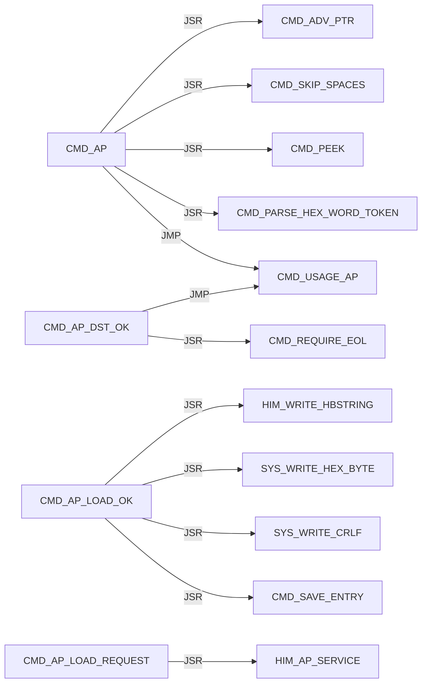
```mermaid
flowchart LR
    N0["CMD_AP"] -->|JSR| N1["CMD_ADV_PTR"]
    N0["CMD_AP"] -->|JSR| N2["CMD_SKIP_SPACES"]
    N0["CMD_AP"] -->|JSR| N3["CMD_PEEK"]
    N0["CMD_AP"] -->|JSR| N4["CMD_PARSE_HEX_WORD_TOKEN"]
    N0["CMD_AP"] -->|JMP| N5["CMD_USAGE_AP"]
    N6["CMD_AP_DST_OK"] -->|JSR| N7["CMD_REQUIRE_EOL"]
    N6["CMD_AP_DST_OK"] -->|JMP| N5["CMD_USAGE_AP"]
    N8["CMD_AP_LOAD_OK"] -->|JSR| N9["HIM_WRITE_HBSTRING"]
    N8["CMD_AP_LOAD_OK"] -->|JSR| N10["SYS_WRITE_HEX_BYTE"]
    N8["CMD_AP_LOAD_OK"] -->|JSR| N11["SYS_WRITE_CRLF"]
    N8["CMD_AP_LOAD_OK"] -->|JSR| N12["CMD_SAVE_ENTRY"]
    N13["CMD_AP_LOAD_REQUEST"] -->|JSR| N14["HIM_AP_SERVICE"]
```

Panel 2 of 2: `CMD_AP_LOAD_REQUEST` through `CMD_AP_SRC_OK`.

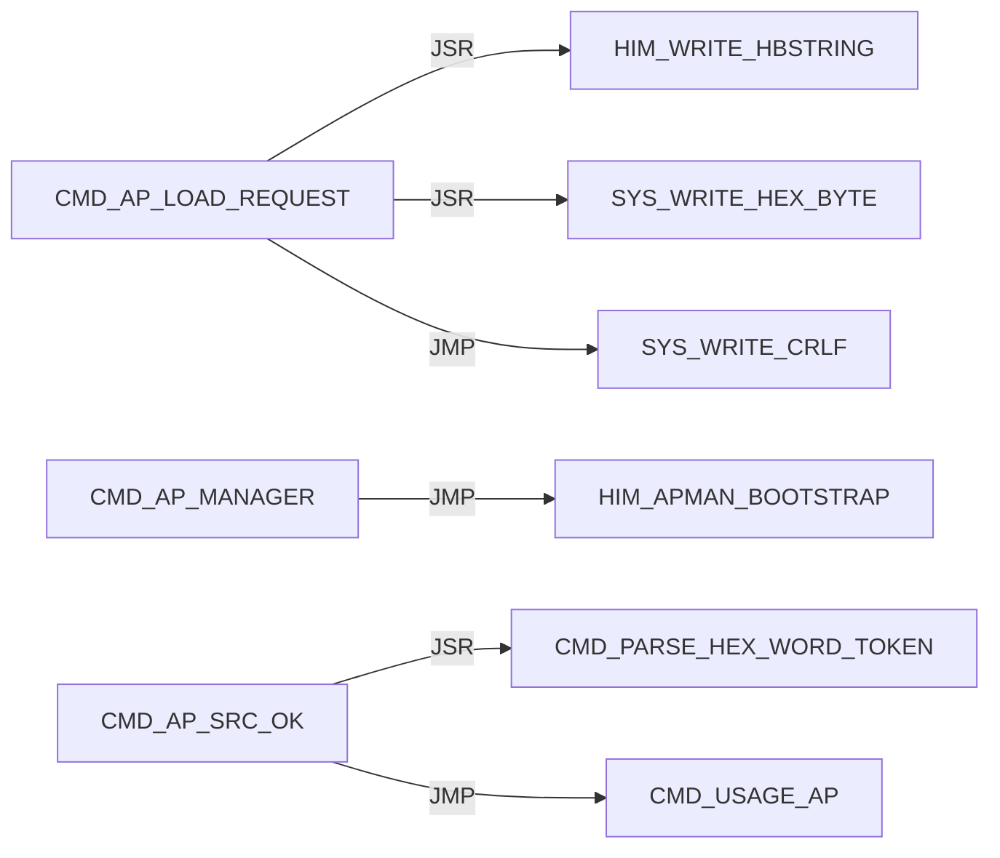
```mermaid
flowchart LR
    N0["CMD_AP_LOAD_REQUEST"] -->|JSR| N1["HIM_WRITE_HBSTRING"]
    N0["CMD_AP_LOAD_REQUEST"] -->|JSR| N2["SYS_WRITE_HEX_BYTE"]
    N0["CMD_AP_LOAD_REQUEST"] -->|JMP| N3["SYS_WRITE_CRLF"]
    N4["CMD_AP_MANAGER"] -->|JMP| N5["HIM_APMAN_BOOTSTRAP"]
    N6["CMD_AP_SRC_OK"] -->|JSR| N7["CMD_PARSE_HEX_WORD_TOKEN"]
    N6["CMD_AP_SRC_OK"] -->|JMP| N8["CMD_USAGE_AP"]
```

#### CMD / APS

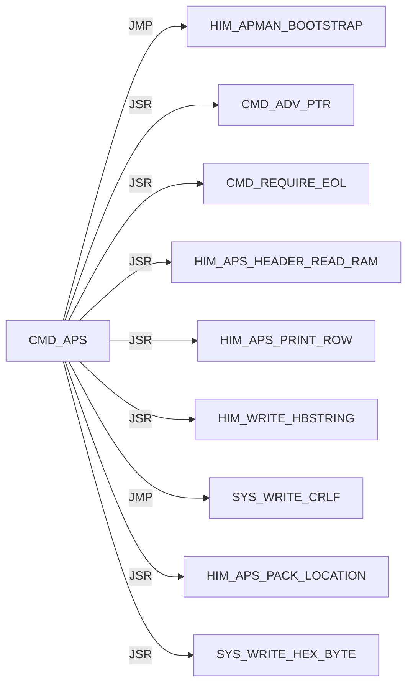
```mermaid
flowchart LR
    N0["CMD_APS"] -->|JMP| N1["HIM_APMAN_BOOTSTRAP"]
    N0["CMD_APS"] -->|JSR| N2["CMD_ADV_PTR"]
    N0["CMD_APS"] -->|JSR| N3["CMD_REQUIRE_EOL"]
    N0["CMD_APS"] -->|JSR| N4["HIM_APS_HEADER_READ_RAM"]
    N0["CMD_APS"] -->|JSR| N5["HIM_APS_PRINT_ROW"]
    N0["CMD_APS"] -->|JSR| N6["HIM_WRITE_HBSTRING"]
    N0["CMD_APS"] -->|JMP| N7["SYS_WRITE_CRLF"]
    N0["CMD_APS"] -->|JSR| N8["HIM_APS_PACK_LOCATION"]
    N0["CMD_APS"] -->|JSR| N9["SYS_WRITE_HEX_BYTE"]
```

#### CMD / D

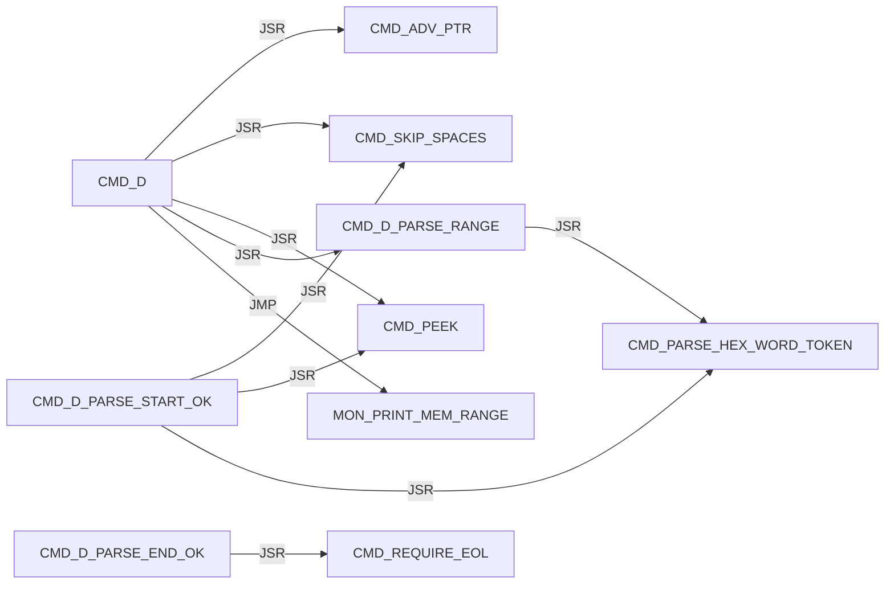
```mermaid
flowchart LR
    N0["CMD_D"] -->|JSR| N1["CMD_ADV_PTR"]
    N0["CMD_D"] -->|JSR| N2["CMD_SKIP_SPACES"]
    N0["CMD_D"] -->|JSR| N3["CMD_PEEK"]
    N0["CMD_D"] -->|JSR| N4["CMD_D_PARSE_RANGE"]
    N0["CMD_D"] -->|JMP| N5["MON_PRINT_MEM_RANGE"]
    N6["CMD_D_PARSE_END_OK"] -->|JSR| N7["CMD_REQUIRE_EOL"]
    N4["CMD_D_PARSE_RANGE"] -->|JSR| N8["CMD_PARSE_HEX_WORD_TOKEN"]
    N9["CMD_D_PARSE_START_OK"] -->|JSR| N2["CMD_SKIP_SPACES"]
    N9["CMD_D_PARSE_START_OK"] -->|JSR| N3["CMD_PEEK"]
    N9["CMD_D_PARSE_START_OK"] -->|JSR| N8["CMD_PARSE_HEX_WORD_TOKEN"]
```

#### CMD / DISPATCH

Panel 1 of 2: `CMD_DISPATCH_DONE` through `CMD_DISPATCH_SCAN_MISS`.

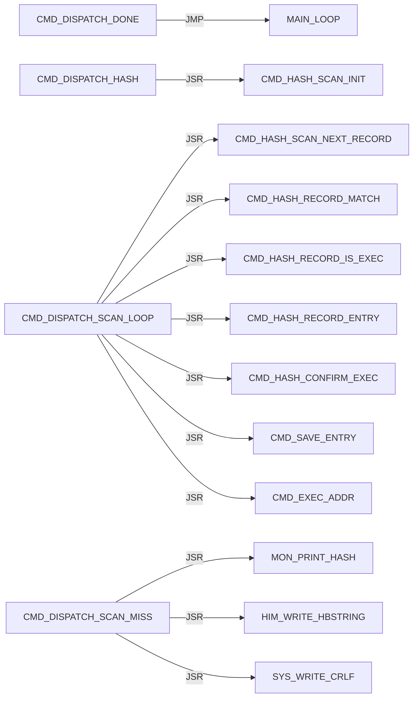
```mermaid
flowchart LR
    N0["CMD_DISPATCH_DONE"] -->|JMP| N1["MAIN_LOOP"]
    N2["CMD_DISPATCH_HASH"] -->|JSR| N3["CMD_HASH_SCAN_INIT"]
    N4["CMD_DISPATCH_SCAN_LOOP"] -->|JSR| N5["CMD_HASH_SCAN_NEXT_RECORD"]
    N4["CMD_DISPATCH_SCAN_LOOP"] -->|JSR| N6["CMD_HASH_RECORD_MATCH"]
    N4["CMD_DISPATCH_SCAN_LOOP"] -->|JSR| N7["CMD_HASH_RECORD_IS_EXEC"]
    N4["CMD_DISPATCH_SCAN_LOOP"] -->|JSR| N8["CMD_HASH_RECORD_ENTRY"]
    N4["CMD_DISPATCH_SCAN_LOOP"] -->|JSR| N9["CMD_HASH_CONFIRM_EXEC"]
    N4["CMD_DISPATCH_SCAN_LOOP"] -->|JSR| N10["CMD_SAVE_ENTRY"]
    N4["CMD_DISPATCH_SCAN_LOOP"] -->|JSR| N11["CMD_EXEC_ADDR"]
    N12["CMD_DISPATCH_SCAN_MISS"] -->|JSR| N13["MON_PRINT_HASH"]
    N12["CMD_DISPATCH_SCAN_MISS"] -->|JSR| N14["HIM_WRITE_HBSTRING"]
    N12["CMD_DISPATCH_SCAN_MISS"] -->|JSR| N15["SYS_WRITE_CRLF"]
```

Panel 2 of 2: `CMD_DISPATCH_SCAN_MISS` through `CMD_DISPATCH_SCAN_NEXT`.

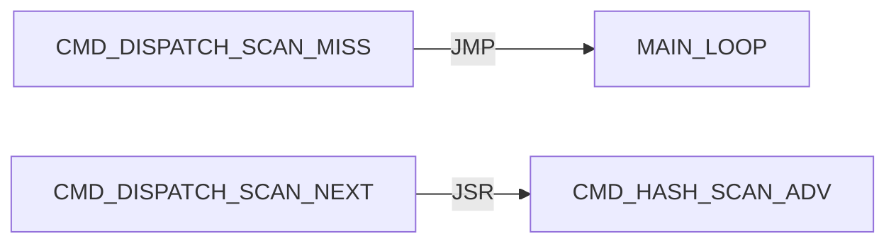
```mermaid
flowchart LR
    N0["CMD_DISPATCH_SCAN_MISS"] -->|JMP| N1["MAIN_LOOP"]
    N2["CMD_DISPATCH_SCAN_NEXT"] -->|JSR| N3["CMD_HASH_SCAN_ADV"]
```

#### CMD / EXEC

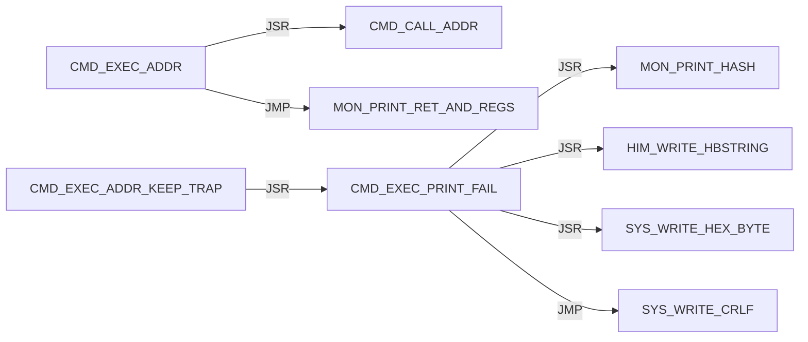
```mermaid
flowchart LR
    N0["CMD_EXEC_ADDR"] -->|JSR| N1["CMD_CALL_ADDR"]
    N0["CMD_EXEC_ADDR"] -->|JMP| N2["MON_PRINT_RET_AND_REGS"]
    N3["CMD_EXEC_ADDR_KEEP_TRAP"] -->|JSR| N4["CMD_EXEC_PRINT_FAIL"]
    N4["CMD_EXEC_PRINT_FAIL"] -->|JSR| N5["MON_PRINT_HASH"]
    N4["CMD_EXEC_PRINT_FAIL"] -->|JSR| N6["HIM_WRITE_HBSTRING"]
    N4["CMD_EXEC_PRINT_FAIL"] -->|JSR| N7["SYS_WRITE_HEX_BYTE"]
    N4["CMD_EXEC_PRINT_FAIL"] -->|JMP| N8["SYS_WRITE_CRLF"]
```

#### CMD / G

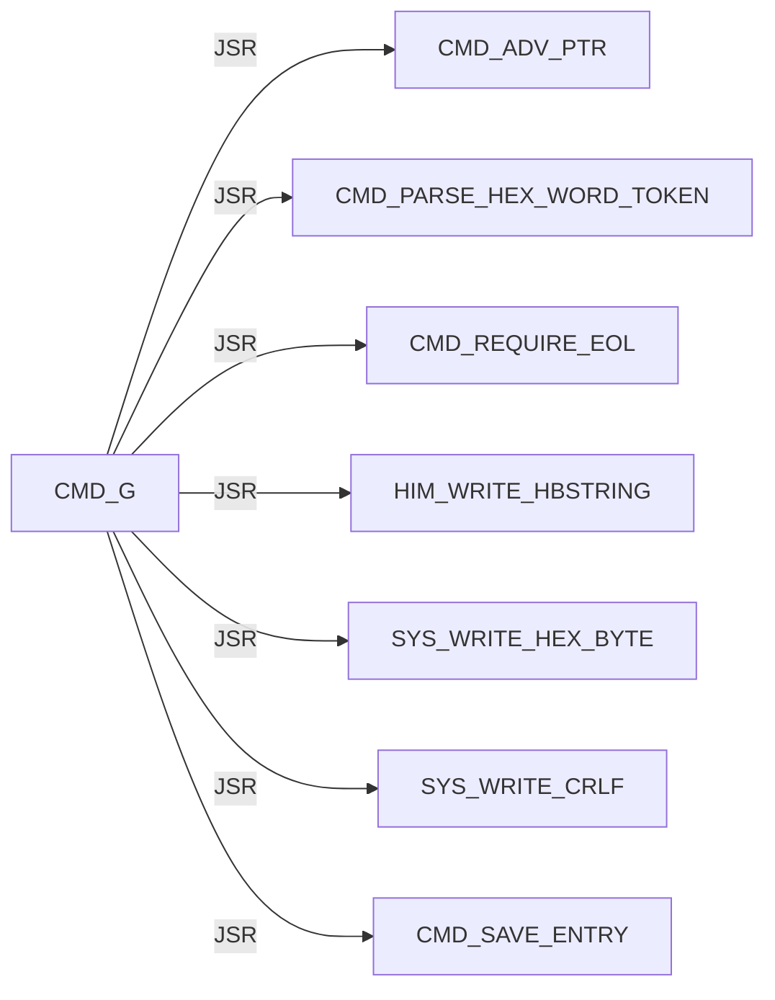
```mermaid
flowchart LR
    N0["CMD_G"] -->|JSR| N1["CMD_ADV_PTR"]
    N0["CMD_G"] -->|JSR| N2["CMD_PARSE_HEX_WORD_TOKEN"]
    N0["CMD_G"] -->|JSR| N3["CMD_REQUIRE_EOL"]
    N0["CMD_G"] -->|JSR| N4["HIM_WRITE_HBSTRING"]
    N0["CMD_G"] -->|JSR| N5["SYS_WRITE_HEX_BYTE"]
    N0["CMD_G"] -->|JSR| N6["SYS_WRITE_CRLF"]
    N0["CMD_G"] -->|JSR| N7["CMD_SAVE_ENTRY"]
```

#### CMD / HASH

Panel 1 of 7: `CMD_HASH_CONFIRM_ADDR` through `CMD_HASH_FIND_LOOP`.

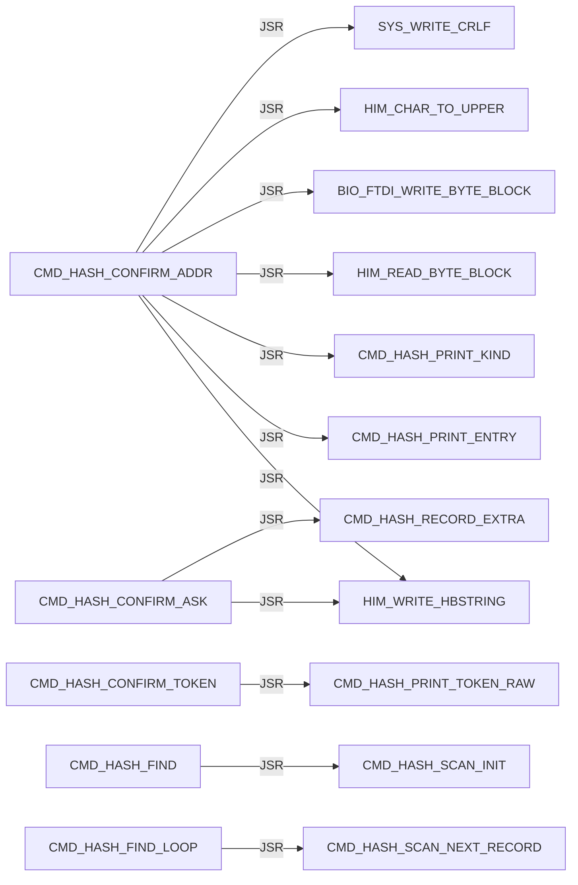
```mermaid
flowchart LR
    N0["CMD_HASH_CONFIRM_ADDR"] -->|JSR| N1["HIM_WRITE_HBSTRING"]
    N0["CMD_HASH_CONFIRM_ADDR"] -->|JSR| N2["CMD_HASH_PRINT_ENTRY"]
    N0["CMD_HASH_CONFIRM_ADDR"] -->|JSR| N3["CMD_HASH_PRINT_KIND"]
    N0["CMD_HASH_CONFIRM_ADDR"] -->|JSR| N4["HIM_READ_BYTE_BLOCK"]
    N0["CMD_HASH_CONFIRM_ADDR"] -->|JSR| N5["BIO_FTDI_WRITE_BYTE_BLOCK"]
    N0["CMD_HASH_CONFIRM_ADDR"] -->|JSR| N6["HIM_CHAR_TO_UPPER"]
    N0["CMD_HASH_CONFIRM_ADDR"] -->|JSR| N7["SYS_WRITE_CRLF"]
    N8["CMD_HASH_CONFIRM_ASK"] -->|JSR| N1["HIM_WRITE_HBSTRING"]
    N8["CMD_HASH_CONFIRM_ASK"] -->|JSR| N9["CMD_HASH_RECORD_EXTRA"]
    N10["CMD_HASH_CONFIRM_TOKEN"] -->|JSR| N11["CMD_HASH_PRINT_TOKEN_RAW"]
    N12["CMD_HASH_FIND"] -->|JSR| N13["CMD_HASH_SCAN_INIT"]
    N14["CMD_HASH_FIND_LOOP"] -->|JSR| N15["CMD_HASH_SCAN_NEXT_RECORD"]
```

Panel 2 of 7: `CMD_HASH_FIND_LOOP` through `CMD_HASH_INFO_FOUND`.

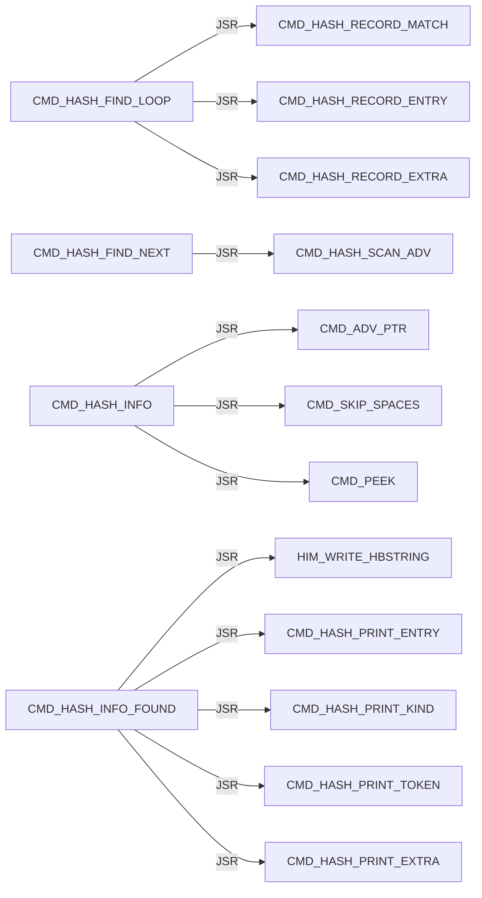
```mermaid
flowchart LR
    N0["CMD_HASH_FIND_LOOP"] -->|JSR| N1["CMD_HASH_RECORD_MATCH"]
    N0["CMD_HASH_FIND_LOOP"] -->|JSR| N2["CMD_HASH_RECORD_ENTRY"]
    N0["CMD_HASH_FIND_LOOP"] -->|JSR| N3["CMD_HASH_RECORD_EXTRA"]
    N4["CMD_HASH_FIND_NEXT"] -->|JSR| N5["CMD_HASH_SCAN_ADV"]
    N6["CMD_HASH_INFO"] -->|JSR| N7["CMD_ADV_PTR"]
    N6["CMD_HASH_INFO"] -->|JSR| N8["CMD_SKIP_SPACES"]
    N6["CMD_HASH_INFO"] -->|JSR| N9["CMD_PEEK"]
    N10["CMD_HASH_INFO_FOUND"] -->|JSR| N11["HIM_WRITE_HBSTRING"]
    N10["CMD_HASH_INFO_FOUND"] -->|JSR| N12["CMD_HASH_PRINT_ENTRY"]
    N10["CMD_HASH_INFO_FOUND"] -->|JSR| N13["CMD_HASH_PRINT_KIND"]
    N10["CMD_HASH_INFO_FOUND"] -->|JSR| N14["CMD_HASH_PRINT_TOKEN"]
    N10["CMD_HASH_INFO_FOUND"] -->|JSR| N15["CMD_HASH_PRINT_EXTRA"]
```

Panel 3 of 7: `CMD_HASH_INFO_FOUND` through `CMD_HASH_INFO_LOOKUP`.

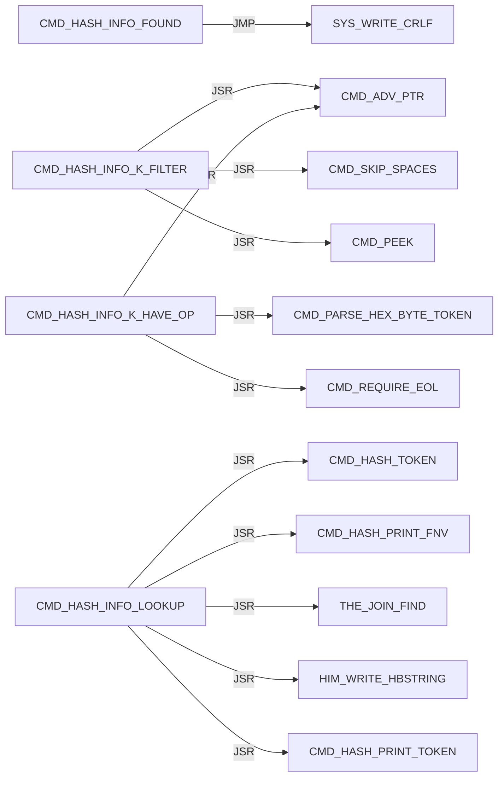
```mermaid
flowchart LR
    N0["CMD_HASH_INFO_FOUND"] -->|JMP| N1["SYS_WRITE_CRLF"]
    N2["CMD_HASH_INFO_K_FILTER"] -->|JSR| N3["CMD_ADV_PTR"]
    N2["CMD_HASH_INFO_K_FILTER"] -->|JSR| N4["CMD_SKIP_SPACES"]
    N2["CMD_HASH_INFO_K_FILTER"] -->|JSR| N5["CMD_PEEK"]
    N6["CMD_HASH_INFO_K_HAVE_OP"] -->|JSR| N3["CMD_ADV_PTR"]
    N6["CMD_HASH_INFO_K_HAVE_OP"] -->|JSR| N7["CMD_PARSE_HEX_BYTE_TOKEN"]
    N6["CMD_HASH_INFO_K_HAVE_OP"] -->|JSR| N8["CMD_REQUIRE_EOL"]
    N9["CMD_HASH_INFO_LOOKUP"] -->|JSR| N10["CMD_HASH_TOKEN"]
    N9["CMD_HASH_INFO_LOOKUP"] -->|JSR| N11["CMD_HASH_PRINT_FNV"]
    N9["CMD_HASH_INFO_LOOKUP"] -->|JSR| N12["THE_JOIN_FIND"]
    N9["CMD_HASH_INFO_LOOKUP"] -->|JSR| N13["HIM_WRITE_HBSTRING"]
    N9["CMD_HASH_INFO_LOOKUP"] -->|JSR| N14["CMD_HASH_PRINT_TOKEN"]
```

Panel 4 of 7: `CMD_HASH_INFO_LOOKUP` through `CMD_HASH_PRINT_EXTRA`.

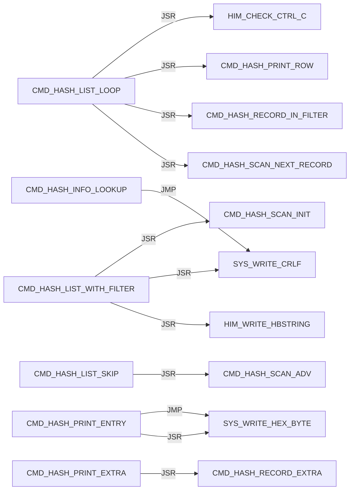
```mermaid
flowchart LR
    N0["CMD_HASH_INFO_LOOKUP"] -->|JMP| N1["SYS_WRITE_CRLF"]
    N2["CMD_HASH_LIST_LOOP"] -->|JSR| N3["CMD_HASH_SCAN_NEXT_RECORD"]
    N2["CMD_HASH_LIST_LOOP"] -->|JSR| N4["CMD_HASH_RECORD_IN_FILTER"]
    N2["CMD_HASH_LIST_LOOP"] -->|JSR| N5["CMD_HASH_PRINT_ROW"]
    N2["CMD_HASH_LIST_LOOP"] -->|JSR| N6["HIM_CHECK_CTRL_C"]
    N7["CMD_HASH_LIST_SKIP"] -->|JSR| N8["CMD_HASH_SCAN_ADV"]
    N9["CMD_HASH_LIST_WITH_FILTER"] -->|JSR| N10["HIM_WRITE_HBSTRING"]
    N9["CMD_HASH_LIST_WITH_FILTER"] -->|JSR| N1["SYS_WRITE_CRLF"]
    N9["CMD_HASH_LIST_WITH_FILTER"] -->|JSR| N11["CMD_HASH_SCAN_INIT"]
    N12["CMD_HASH_PRINT_ENTRY"] -->|JSR| N13["SYS_WRITE_HEX_BYTE"]
    N12["CMD_HASH_PRINT_ENTRY"] -->|JMP| N13["SYS_WRITE_HEX_BYTE"]
    N14["CMD_HASH_PRINT_EXTRA"] -->|JSR| N15["CMD_HASH_RECORD_EXTRA"]
```

Panel 5 of 7: `CMD_HASH_PRINT_EXTRA` through `CMD_HASH_PRINT_ROW`.

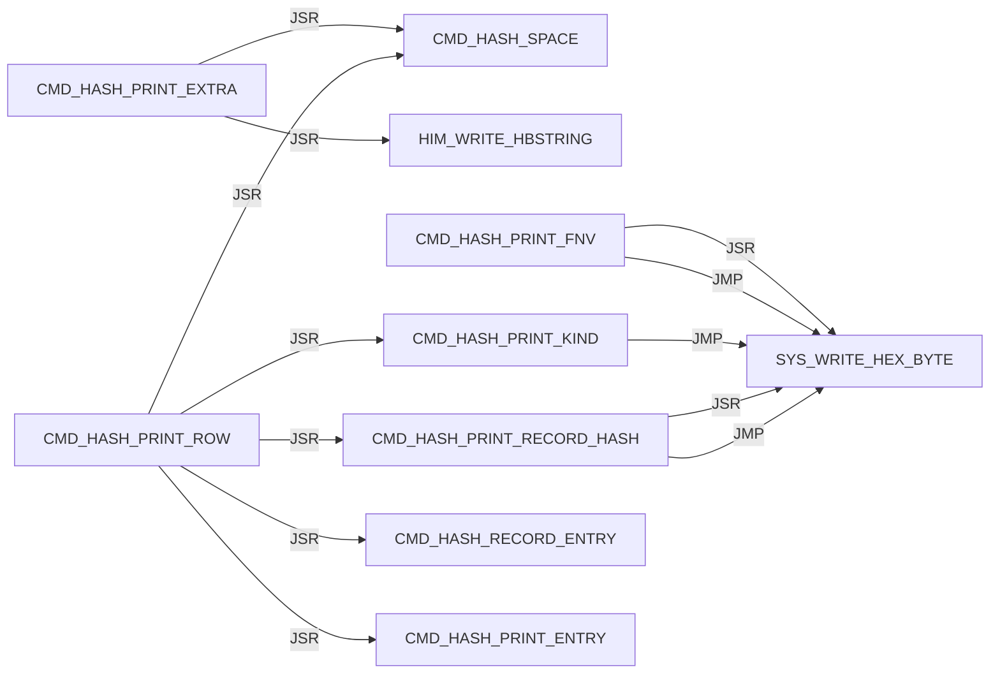
```mermaid
flowchart LR
    N0["CMD_HASH_PRINT_EXTRA"] -->|JSR| N1["CMD_HASH_SPACE"]
    N0["CMD_HASH_PRINT_EXTRA"] -->|JSR| N2["HIM_WRITE_HBSTRING"]
    N3["CMD_HASH_PRINT_FNV"] -->|JSR| N4["SYS_WRITE_HEX_BYTE"]
    N3["CMD_HASH_PRINT_FNV"] -->|JMP| N4["SYS_WRITE_HEX_BYTE"]
    N5["CMD_HASH_PRINT_KIND"] -->|JMP| N4["SYS_WRITE_HEX_BYTE"]
    N6["CMD_HASH_PRINT_RECORD_HASH"] -->|JSR| N4["SYS_WRITE_HEX_BYTE"]
    N6["CMD_HASH_PRINT_RECORD_HASH"] -->|JMP| N4["SYS_WRITE_HEX_BYTE"]
    N7["CMD_HASH_PRINT_ROW"] -->|JSR| N6["CMD_HASH_PRINT_RECORD_HASH"]
    N7["CMD_HASH_PRINT_ROW"] -->|JSR| N1["CMD_HASH_SPACE"]
    N7["CMD_HASH_PRINT_ROW"] -->|JSR| N8["CMD_HASH_RECORD_ENTRY"]
    N7["CMD_HASH_PRINT_ROW"] -->|JSR| N9["CMD_HASH_PRINT_ENTRY"]
    N7["CMD_HASH_PRINT_ROW"] -->|JSR| N5["CMD_HASH_PRINT_KIND"]
```

Panel 6 of 7: `CMD_HASH_PRINT_ROW` through `CMD_HASH_TOKEN`.

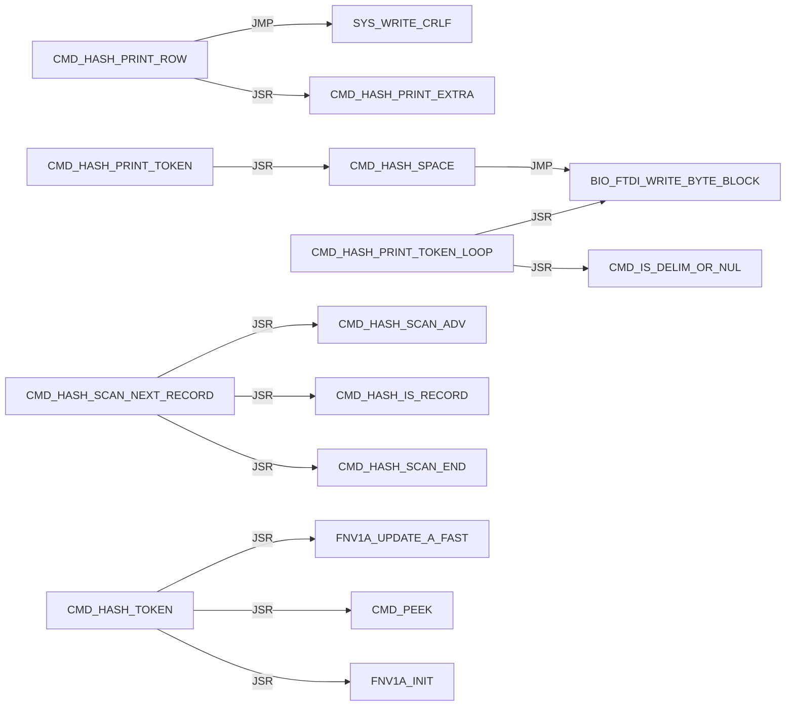
```mermaid
flowchart LR
    N0["CMD_HASH_PRINT_ROW"] -->|JSR| N1["CMD_HASH_PRINT_EXTRA"]
    N0["CMD_HASH_PRINT_ROW"] -->|JMP| N2["SYS_WRITE_CRLF"]
    N3["CMD_HASH_PRINT_TOKEN"] -->|JSR| N4["CMD_HASH_SPACE"]
    N5["CMD_HASH_PRINT_TOKEN_LOOP"] -->|JSR| N6["CMD_IS_DELIM_OR_NUL"]
    N5["CMD_HASH_PRINT_TOKEN_LOOP"] -->|JSR| N7["BIO_FTDI_WRITE_BYTE_BLOCK"]
    N8["CMD_HASH_SCAN_NEXT_RECORD"] -->|JSR| N9["CMD_HASH_SCAN_END"]
    N8["CMD_HASH_SCAN_NEXT_RECORD"] -->|JSR| N10["CMD_HASH_IS_RECORD"]
    N8["CMD_HASH_SCAN_NEXT_RECORD"] -->|JSR| N11["CMD_HASH_SCAN_ADV"]
    N4["CMD_HASH_SPACE"] -->|JMP| N7["BIO_FTDI_WRITE_BYTE_BLOCK"]
    N12["CMD_HASH_TOKEN"] -->|JSR| N13["FNV1A_INIT"]
    N12["CMD_HASH_TOKEN"] -->|JSR| N14["CMD_PEEK"]
    N12["CMD_HASH_TOKEN"] -->|JSR| N15["FNV1A_UPDATE_A_FAST"]
```

Panel 7 of 7: `CMD_HASH_TOKEN_DONE` through `CMD_HASH_USAGE`.

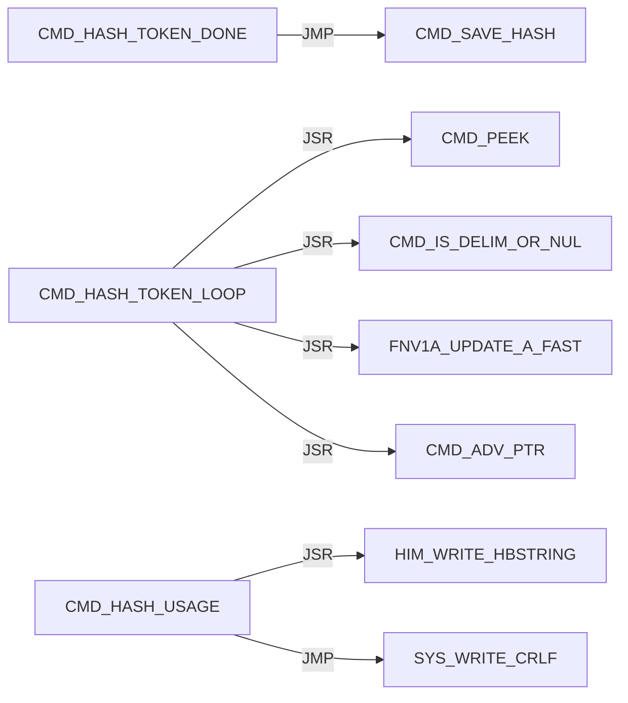
```mermaid
flowchart LR
    N0["CMD_HASH_TOKEN_DONE"] -->|JMP| N1["CMD_SAVE_HASH"]
    N2["CMD_HASH_TOKEN_LOOP"] -->|JSR| N3["CMD_PEEK"]
    N2["CMD_HASH_TOKEN_LOOP"] -->|JSR| N4["CMD_IS_DELIM_OR_NUL"]
    N2["CMD_HASH_TOKEN_LOOP"] -->|JSR| N5["FNV1A_UPDATE_A_FAST"]
    N2["CMD_HASH_TOKEN_LOOP"] -->|JSR| N6["CMD_ADV_PTR"]
    N7["CMD_HASH_USAGE"] -->|JSR| N8["HIM_WRITE_HBSTRING"]
    N7["CMD_HASH_USAGE"] -->|JMP| N9["SYS_WRITE_CRLF"]
```

#### CMD / HELP

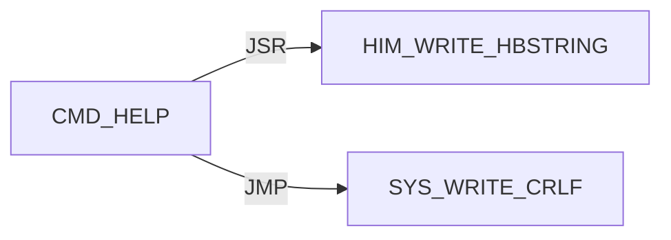
```mermaid
flowchart LR
    N0["CMD_HELP"] -->|JSR| N1["HIM_WRITE_HBSTRING"]
    N0["CMD_HELP"] -->|JMP| N2["SYS_WRITE_CRLF"]
```

#### CMD / L

Panel 1 of 2: `CMD_L` through `CMD_L_PARSE_OK`.

```mermaid
flowchart LR
    N0["CMD_L"] -->|JSR| N1["CMD_ADV_PTR"]
    N0["CMD_L"] -->|JSR| N2["CMD_REQUIRE_EOL"]
    N0["CMD_L"] -->|JMP| N3["CMD_USAGE_L"]
    N4["CMD_L_ARGS_OK"] -->|JSR| N5["DBG_CLEAR_ALL"]
    N4["CMD_L_ARGS_OK"] -->|JSR| N6["L_STR8_REQUIRE_SERVICE"]
    N4["CMD_L_ARGS_OK"] -->|JSR| N7["CMD_L_PRINT_FAIL"]
    N8["CMD_L_HAVE_LINE"] -->|JSR| N9["CMD_PEEK"]
    N8["CMD_L_HAVE_LINE"] -->|JSR| N10["L_PARSE_RECORD_STR8"]
    N8["CMD_L_HAVE_LINE"] -->|JSR| N7["CMD_L_PRINT_FAIL"]
    N11["CMD_L_PARSE_OK"] -->|JSR| N12["HIM_WRITE_HBSTRING"]
    N11["CMD_L_PARSE_OK"] -->|JSR| N13["SYS_WRITE_HEX_BYTE"]
    N11["CMD_L_PARSE_OK"] -->|JSR| N14["SYS_WRITE_CRLF"]
```

Panel 2 of 2: `CMD_L_PRINT_FAIL` through `CMD_L_SERVICE_OK`.

```mermaid
flowchart LR
    N0["CMD_L_PRINT_FAIL"] -->|JSR| N1["HIM_WRITE_HBSTRING"]
    N0["CMD_L_PRINT_FAIL"] -->|JSR| N2["SYS_WRITE_HEX_BYTE"]
    N0["CMD_L_PRINT_FAIL"] -->|JMP| N3["SYS_WRITE_CRLF"]
    N4["CMD_L_READ_LOOP"] -->|JSR| N5["HIM_READ_LINE_UPPER"]
    N4["CMD_L_READ_LOOP"] -->|JSR| N1["HIM_WRITE_HBSTRING"]
    N4["CMD_L_READ_LOOP"] -->|JSR| N2["SYS_WRITE_HEX_BYTE"]
    N4["CMD_L_READ_LOOP"] -->|JSR| N3["SYS_WRITE_CRLF"]
    N6["CMD_L_SERVICE_OK"] -->|JSR| N1["HIM_WRITE_HBSTRING"]
    N6["CMD_L_SERVICE_OK"] -->|JSR| N3["SYS_WRITE_CRLF"]
```

#### CMD / M

```mermaid
flowchart LR
    N0["CMD_M"] -->|JSR| N1["CMD_ADV_PTR"]
    N0["CMD_M"] -->|JSR| N2["CMD_PARSE_RANGE_REQUIRED"]
    N0["CMD_M"] -->|JSR| N3["MON_MODIFY_RANGE_WRITABLE"]
    N0["CMD_M"] -->|JMP| N4["MON_MODIFY_RANGE"]
    N5["CMD_M_PROTECT"] -->|JSR| N6["HIM_WRITE_HBSTRING"]
    N5["CMD_M_PROTECT"] -->|JSR| N7["SYS_WRITE_HEX_BYTE"]
    N5["CMD_M_PROTECT"] -->|JMP| N8["SYS_WRITE_CRLF"]
```

#### CMD / MICROCHESS

```mermaid
flowchart LR
    N0["CMD_MICROCHESS_COPY"] -->|JMP| N1["CMD_AP"]
```

#### CMD / PARSE

Panel 1 of 2: `CMD_PARSE_HEX_BYTE_TOKEN` through `CMD_PARSE_RANGE_REQUIRED`.

```mermaid
flowchart LR
    N0["CMD_PARSE_HEX_BYTE_TOKEN"] -->|JSR| N1["CMD_PARSE_HEX_WORD_TOKEN"]
    N2["CMD_PARSE_HEX_WORD_DONE"] -->|JSR| N3["CMD_PEEK"]
    N2["CMD_PARSE_HEX_WORD_DONE"] -->|JSR| N4["CMD_IS_DELIM_OR_NUL"]
    N5["CMD_PARSE_HEX_WORD_LOOP"] -->|JSR| N3["CMD_PEEK"]
    N5["CMD_PARSE_HEX_WORD_LOOP"] -->|JSR| N6["CMD_HEX_ASCII_TO_NIBBLE"]
    N5["CMD_PARSE_HEX_WORD_LOOP"] -->|JSR| N7["CMD_ADV_PTR"]
    N1["CMD_PARSE_HEX_WORD_TOKEN"] -->|JSR| N8["CMD_SKIP_SPACES"]
    N1["CMD_PARSE_HEX_WORD_TOKEN"] -->|JSR| N9["CMD_SKIP_OPTIONAL_DOLLAR"]
    N10["CMD_PARSE_RANGE_HAVE_END"] -->|JSR| N11["CMD_REQUIRE_EOL"]
    N12["CMD_PARSE_RANGE_PLUS"] -->|JSR| N7["CMD_ADV_PTR"]
    N12["CMD_PARSE_RANGE_PLUS"] -->|JSR| N1["CMD_PARSE_HEX_WORD_TOKEN"]
    N13["CMD_PARSE_RANGE_REQUIRED"] -->|JSR| N1["CMD_PARSE_HEX_WORD_TOKEN"]
```

Panel 2 of 2: `CMD_PARSE_RANGE_REQUIRED` through `CMD_PARSE_RANGE_START_OK`.

```mermaid
flowchart LR
    N0["CMD_PARSE_RANGE_REQUIRED"] -->|JMP| N1["CMD_PARSE_RANGE_FAIL"]
    N2["CMD_PARSE_RANGE_START_OK"] -->|JSR| N3["CMD_SKIP_SPACES"]
    N2["CMD_PARSE_RANGE_START_OK"] -->|JSR| N4["CMD_PEEK"]
    N2["CMD_PARSE_RANGE_START_OK"] -->|JSR| N5["CMD_PARSE_HEX_WORD_TOKEN"]
```

#### CMD / R

```mermaid
flowchart LR
    N0["CMD_R"] -->|JSR| N1["MON_CTX_REQUIRE_VALID"]
    N2["CMD_R_HAVE_CTX"] -->|JSR| N3["CMD_ADV_PTR"]
    N2["CMD_R_HAVE_CTX"] -->|JSR| N4["MON_CTX_PARSE_ASSIGN_LIST"]
    N2["CMD_R_HAVE_CTX"] -->|JMP| N5["MON_PRINT_STOP_AND_REGS"]
```

#### CMD / REQUIRE

```mermaid
flowchart LR
    N0["CMD_REQUIRE_EOL"] -->|JSR| N1["CMD_SKIP_SPACES"]
    N0["CMD_REQUIRE_EOL"] -->|JSR| N2["CMD_PEEK"]
```

#### CMD / SKIP

```mermaid
flowchart LR
    N0["CMD_SKIP_OPTIONAL_DOLLAR"] -->|JSR| N1["CMD_PEEK"]
    N0["CMD_SKIP_OPTIONAL_DOLLAR"] -->|JSR| N2["CMD_ADV_PTR"]
    N3["CMD_SKIP_SPACES"] -->|JSR| N1["CMD_PEEK"]
    N4["CMD_SKIP_SPACES_ADV"] -->|JSR| N2["CMD_ADV_PTR"]
```

#### CMD / UNKNOWN

```mermaid
flowchart LR
    N0["CMD_UNKNOWN"] -->|JSR| N1["HIM_WRITE_HBSTRING"]
    N0["CMD_UNKNOWN"] -->|JSR| N2["SYS_WRITE_CRLF"]
    N0["CMD_UNKNOWN"] -->|JMP| N3["MAIN_LOOP"]
```

#### CMD / USAGE

Panel 1 of 2: `CMD_USAGE_AP` through `CMD_USAGE_M`.

```mermaid
flowchart LR
    N0["CMD_USAGE_AP"] -->|JSR| N1["HIM_WRITE_HBSTRING"]
    N0["CMD_USAGE_AP"] -->|JMP| N2["SYS_WRITE_CRLF"]
    N3["CMD_USAGE_APS"] -->|JSR| N1["HIM_WRITE_HBSTRING"]
    N3["CMD_USAGE_APS"] -->|JMP| N2["SYS_WRITE_CRLF"]
    N4["CMD_USAGE_D"] -->|JSR| N1["HIM_WRITE_HBSTRING"]
    N4["CMD_USAGE_D"] -->|JMP| N2["SYS_WRITE_CRLF"]
    N5["CMD_USAGE_G"] -->|JSR| N1["HIM_WRITE_HBSTRING"]
    N5["CMD_USAGE_G"] -->|JMP| N2["SYS_WRITE_CRLF"]
    N6["CMD_USAGE_L"] -->|JSR| N1["HIM_WRITE_HBSTRING"]
    N6["CMD_USAGE_L"] -->|JMP| N2["SYS_WRITE_CRLF"]
    N7["CMD_USAGE_M"] -->|JSR| N1["HIM_WRITE_HBSTRING"]
    N7["CMD_USAGE_M"] -->|JMP| N2["SYS_WRITE_CRLF"]
```

Panel 2 of 2: `CMD_USAGE_R` through `CMD_USAGE_X`.

```mermaid
flowchart LR
    N0["CMD_USAGE_R"] -->|JSR| N1["HIM_WRITE_HBSTRING"]
    N0["CMD_USAGE_R"] -->|JMP| N2["SYS_WRITE_CRLF"]
    N3["CMD_USAGE_X"] -->|JSR| N1["HIM_WRITE_HBSTRING"]
    N3["CMD_USAGE_X"] -->|JMP| N2["SYS_WRITE_CRLF"]
```

#### CMD / X

```mermaid
flowchart LR
    N0["CMD_X"] -->|JSR| N1["MON_CTX_REQUIRE_VALID"]
    N2["CMD_X_HAVE_CTX"] -->|JSR| N3["CMD_ADV_PTR"]
    N2["CMD_X_HAVE_CTX"] -->|JSR| N4["MON_CTX_PARSE_ASSIGN_LIST"]
    N2["CMD_X_HAVE_CTX"] -->|JSR| N5["HIM_WRITE_HBSTRING"]
    N2["CMD_X_HAVE_CTX"] -->|JSR| N6["SYS_WRITE_HEX_BYTE"]
    N2["CMD_X_HAVE_CTX"] -->|JSR| N7["SYS_WRITE_CRLF"]
    N2["CMD_X_HAVE_CTX"] -->|JMP| N8["MON_CTX_RESUME_RTI"]
```

#### ENTRY / unprefixed

```mermaid
flowchart LR
    N0["START"] -->|JMP| N1["HIMON_START_BODY"]
```

#### FNV1A

```mermaid
flowchart LR
    N0["FNV1A_MUL_PRIME_FAST"] -->|JSR| N1["MATH_COPY_HASH_TO_TERM"]
    N0["FNV1A_MUL_PRIME_FAST"] -->|JSR| N2["MATH_ADD_TERM_TO_HASH"]
    N0["FNV1A_MUL_PRIME_FAST"] -->|JMP| N3["MATH_ADD_TERM1_TO_HASH3"]
    N4["FNV1A_UPDATE_A_FAST"] -->|JMP| N0["FNV1A_MUL_PRIME_FAST"]
```

#### HIM / AP

Panel 1 of 11: `HIM_AP_ADVANCE_A` through `HIM_AP_CHECK_RELOC_SHAPE_BAD`.

```mermaid
flowchart LR
    N0["HIM_AP_ADVANCE_A"] -->|JSR| N1["HIM_AP_NEED_A"]
    N2["HIM_AP_ADVANCE_TMP"] -->|JSR| N3["HIM_AP_NEED_TMP"]
    N4["HIM_AP_BANK_STAGE_CODE"] -->|JSR| N5["STR8_BANK_SELECT_SERVICE"]
    N4["HIM_AP_BANK_STAGE_CODE"] -->|JSR| N6["STR8_BANK_SELECT_RAM"]
    N7["HIM_AP_CHECK_PUBLIC_COUNT_OK"] -->|JSR| N8["HIM_AP_CHECK_PUBLIC_ADVANCE_A"]
    N7["HIM_AP_CHECK_PUBLIC_COUNT_OK"] -->|JMP| N9["HIM_AP_CHECK_PUBLIC_FAIL"]
    N9["HIM_AP_CHECK_PUBLIC_FAIL"] -->|JMP| N10["HIM_AP_BAD_LINE"]
    N11["HIM_AP_CHECK_PUBLIC_REC"] -->|JMP| N9["HIM_AP_CHECK_PUBLIC_FAIL"]
    N12["HIM_AP_CHECK_PUBLIC_ROW_READY"] -->|JSR| N8["HIM_AP_CHECK_PUBLIC_ADVANCE_A"]
    N13["HIM_AP_CHECK_RELOC_KIND_LOOP"] -->|JSR| N14["HIM_AP_RELOC_KIND_X"]
    N15["HIM_AP_CHECK_RELOC_REC"] -->|JMP| N10["HIM_AP_BAD_LINE"]
    N16["HIM_AP_CHECK_RELOC_SHAPE_BAD"] -->|JMP| N10["HIM_AP_BAD_LINE"]
```

Panel 2 of 11: `HIM_AP_FIND_HOLE_LOOP` through `HIM_AP_LINK_PATCH`.

```mermaid
flowchart LR
    N0["HIM_AP_FIND_HOLE_LOOP"] -->|JSR| N1["HIM_AP_HOLE_AT_SCAN"]
    N2["HIM_AP_FIND_HOLE_NEXT"] -->|JMP| N3["HIM_AP_BAD_RANGE"]
    N4["HIM_AP_IMPORT_LINK"] -->|JSR| N5["HIM_AP_LINK_RELOAD_REL_PTR"]
    N6["HIM_AP_LINK_CAPTURE_ROW_X"] -->|JSR| N7["HIM_AP_RELOC_KIND_X"]
    N6["HIM_AP_LINK_CAPTURE_ROW_X"] -->|JSR| N8["HIM_AP_RELOC_SITE_LO_X"]
    N6["HIM_AP_LINK_CAPTURE_ROW_X"] -->|JSR| N9["HIM_AP_RELOC_SITE_HI_X"]
    N10["HIM_AP_LINK_DONE"] -->|JSR| N11["HIM_AP_LINK_RESTORE_COUNTS"]
    N12["HIM_AP_LINK_FAIL"] -->|JSR| N11["HIM_AP_LINK_RESTORE_COUNTS"]
    N13["HIM_AP_LINK_IMPORT_ROW_LOOP"] -->|JSR| N14["HIM_AP_LINK_IMPORT_ROW_BYTES_A"]
    N15["HIM_AP_LINK_PATCH"] -->|JSR| N5["HIM_AP_LINK_RELOAD_REL_PTR"]
    N15["HIM_AP_LINK_PATCH"] -->|JSR| N7["HIM_AP_RELOC_KIND_X"]
    N15["HIM_AP_LINK_PATCH"] -->|JSR| N16["HIM_AP_IMPORT_KIND_A"]
```

Panel 3 of 11: `HIM_AP_LINK_PATCH` through `HIM_AP_LINK_VALIDATE`.

```mermaid
flowchart LR
    N0["HIM_AP_LINK_PATCH"] -->|JSR| N1["HIM_AP_LINK_CAPTURE_ROW_X"]
    N0["HIM_AP_LINK_PATCH"] -->|JSR| N2["HIM_AP_LINK_RESOLVE_ROW_X"]
    N0["HIM_AP_LINK_PATCH"] -->|JSR| N3["HIM_AP_LINK_PATCH_CAPTURED"]
    N2["HIM_AP_LINK_RESOLVE_ROW_X"] -->|JSR| N4["HIM_AP_RELOC_TARGET_LO_X"]
    N2["HIM_AP_LINK_RESOLVE_ROW_X"] -->|JSR| N5["HIM_AP_LINK_RESOLVE_SLOT_X"]
    N2["HIM_AP_LINK_RESOLVE_ROW_X"] -->|JSR| N6["HIM_AP_LINK_RELOAD_REL_PTR"]
    N2["HIM_AP_LINK_RESOLVE_ROW_X"] -->|JSR| N7["HIM_AP_RELOC_TARGET_HI_X"]
    N5["HIM_AP_LINK_RESOLVE_SLOT_X"] -->|JSR| N8["HIM_AP_LINK_IMPORT_ROW_PTR_X"]
    N5["HIM_AP_LINK_RESOLVE_SLOT_X"] -->|JSR| N9["THE_JOIN_FIND"]
    N10["HIM_AP_LINK_VALIDATE"] -->|JSR| N6["HIM_AP_LINK_RELOAD_REL_PTR"]
    N10["HIM_AP_LINK_VALIDATE"] -->|JSR| N11["HIM_AP_RELOC_KIND_X"]
    N10["HIM_AP_LINK_VALIDATE"] -->|JSR| N12["HIM_AP_IMPORT_KIND_A"]
```

Panel 4 of 11: `HIM_AP_LINK_VALIDATE` through `HIM_AP_LOAD_PATCH_LOOP`.

```mermaid
flowchart LR
    N0["HIM_AP_LINK_VALIDATE"] -->|JSR| N1["HIM_AP_RELOC_SITE_OK_X"]
    N0["HIM_AP_LINK_VALIDATE"] -->|JSR| N2["HIM_AP_LINK_RESOLVE_ROW_X"]
    N3["HIM_AP_LOAD_BASE_BAD"] -->|JMP| N4["HIM_AP_BAD_RANGE"]
    N5["HIM_AP_LOAD_BASE_LT_50"] -->|JMP| N4["HIM_AP_BAD_RANGE"]
    N6["HIM_AP_LOAD_LAST_NO_CARRY"] -->|JMP| N4["HIM_AP_BAD_RANGE"]
    N7["HIM_AP_LOAD_LEN_NONZERO"] -->|JMP| N4["HIM_AP_BAD_RANGE"]
    N8["HIM_AP_LOAD_NO_OVERLAP"] -->|JSR| N9["HIM_AP_COPY_BODY_TO_DST"]
    N8["HIM_AP_LOAD_NO_OVERLAP"] -->|JSR| N10["HIM_AP_IMPORT_LINK"]
    N11["HIM_AP_LOAD_OVERLAP_BAD"] -->|JMP| N4["HIM_AP_BAD_RANGE"]
    N12["HIM_AP_LOAD_PARSED"] -->|JSR| N13["HIM_AP_LOAD_RANGE_OK"]
    N14["HIM_AP_LOAD_PATCH_LOOP"] -->|JSR| N15["HIM_AP_RELOC_KIND_X"]
    N14["HIM_AP_LOAD_PATCH_LOOP"] -->|JSR| N16["HIM_AP_INTERNAL_KIND_A"]
```

Panel 5 of 11: `HIM_AP_LOAD_PATCH_LOOP` through `HIM_AP_PARSE_BODY_LEFT_OK`.

```mermaid
flowchart LR
    N0["HIM_AP_LOAD_PATCH_LOOP"] -->|JSR| N1["HIM_AP_IMPORT_KIND_A"]
    N0["HIM_AP_LOAD_PATCH_LOOP"] -->|JMP| N2["HIM_AP_BAD_FIX"]
    N3["HIM_AP_LOAD_PATCH_ROW"] -->|JSR| N4["HIM_AP_RELOC_SITE_OK_X"]
    N5["HIM_AP_LOAD_PATCH_SITE_OK"] -->|JSR| N6["HIM_AP_RELOC_PATCH_ROW_X"]
    N7["HIM_AP_LOAD_RANGE_OK"] -->|JMP| N8["HIM_AP_BAD_RANGE"]
    N9["HIM_AP_LOAD_TOOL_LAST"] -->|JMP| N8["HIM_AP_BAD_RANGE"]
    N10["HIM_AP_NEED_A"] -->|JMP| N8["HIM_AP_BAD_RANGE"]
    N11["HIM_AP_NEED_TMP_FAIL"] -->|JMP| N8["HIM_AP_BAD_RANGE"]
    N12["HIM_AP_PARSE_BODY"] -->|JSR| N10["HIM_AP_NEED_A"]
    N13["HIM_AP_PARSE_BODY_HDR_ROOM"] -->|JMP| N14["HIM_AP_BAD_LINE"]
    N15["HIM_AP_PARSE_BODY_LEFT_LO_OK"] -->|JMP| N14["HIM_AP_BAD_LINE"]
    N16["HIM_AP_PARSE_BODY_LEFT_OK"] -->|JMP| N14["HIM_AP_BAD_LINE"]
```

Panel 6 of 11: `HIM_AP_PARSE_BODY_NONZERO` through `HIM_AP_PARSE_IMPORT_ROOM_OK`.

```mermaid
flowchart LR
    N0["HIM_AP_PARSE_BODY_NONZERO"] -->|JSR| N1["HIM_AP_VERIFY_SEAL_BODY"]
    N2["HIM_AP_PARSE_BODY_SAVE"] -->|JMP| N3["HIM_AP_BAD_LINE"]
    N4["HIM_AP_PARSE_BODY_TAG_OK"] -->|JSR| N5["HIM_AP_ADVANCE_A"]
    N6["HIM_AP_PARSE_EXPORT"] -->|JSR| N7["HIM_AP_TAG_LEN"]
    N8["HIM_AP_PARSE_EXPORT_LEN_OK"] -->|JSR| N9["HIM_AP_NEED_TMP"]
    N8["HIM_AP_PARSE_EXPORT_LEN_OK"] -->|JSR| N10["HIM_AP_CHECK_EXPORT_REC"]
    N8["HIM_AP_PARSE_EXPORT_LEN_OK"] -->|JSR| N11["HIM_AP_ADVANCE_TMP"]
    N12["HIM_AP_PARSE_EXPORT_TAG_OK"] -->|JMP| N3["HIM_AP_BAD_LINE"]
    N13["HIM_AP_PARSE_HEADER_RANGE"] -->|JMP| N3["HIM_AP_BAD_LINE"]
    N14["HIM_AP_PARSE_IMPORT"] -->|JSR| N7["HIM_AP_TAG_LEN"]
    N15["HIM_AP_PARSE_IMPORT_LEN_OK"] -->|JSR| N9["HIM_AP_NEED_TMP"]
    N16["HIM_AP_PARSE_IMPORT_ROOM_OK"] -->|JSR| N17["HIM_AP_CHECK_IMPORT_REC"]
```

Panel 7 of 11: `HIM_AP_PARSE_IMPORT_ROOM_OK` through `HIM_AP_PARSE_SEAL_BAD`.

```mermaid
flowchart LR
    N0["HIM_AP_PARSE_IMPORT_ROOM_OK"] -->|JSR| N1["HIM_AP_ADVANCE_TMP"]
    N2["HIM_AP_PARSE_IMPORT_TAG_OK"] -->|JMP| N3["HIM_AP_BAD_LINE"]
    N4["HIM_AP_PARSE_LEN_NONZERO"] -->|JSR| N5["HIM_AP_SOURCE_RANGE_OK"]
    N6["HIM_AP_PARSE_MIN"] -->|JSR| N5["HIM_AP_SOURCE_RANGE_OK"]
    N7["HIM_AP_PARSE_RANGE_SAFE"] -->|JMP| N3["HIM_AP_BAD_LINE"]
    N8["HIM_AP_PARSE_RELOC"] -->|JSR| N9["HIM_AP_TAG_LEN"]
    N10["HIM_AP_PARSE_RELOC_LEN_OK"] -->|JSR| N11["HIM_AP_NEED_TMP"]
    N12["HIM_AP_PARSE_RELOC_ROOM_OK"] -->|JSR| N13["HIM_AP_CHECK_RELOC_REC"]
    N14["HIM_AP_PARSE_RELOC_SHAPE_OK"] -->|JSR| N1["HIM_AP_ADVANCE_TMP"]
    N15["HIM_AP_PARSE_RELOC_TAG_OK"] -->|JMP| N3["HIM_AP_BAD_LINE"]
    N16["HIM_AP_PARSE_SEAL"] -->|JSR| N9["HIM_AP_TAG_LEN"]
    N17["HIM_AP_PARSE_SEAL_BAD"] -->|JMP| N3["HIM_AP_BAD_LINE"]
```

Panel 8 of 11: `HIM_AP_PARSE_SEAL_LEN_BAD` through `HIM_AP_RELOC_SITE_HAVE_ADD`.

```mermaid
flowchart LR
    N0["HIM_AP_PARSE_SEAL_LEN_BAD"] -->|JMP| N1["HIM_AP_BAD_LINE"]
    N2["HIM_AP_PARSE_SEAL_LEN_OK"] -->|JMP| N1["HIM_AP_BAD_LINE"]
    N3["HIM_AP_PARSE_SEAL_SHAPE_OK"] -->|JSR| N4["HIM_AP_ADVANCE_TMP"]
    N5["HIM_AP_PARSE_SIG0_OK"] -->|JMP| N1["HIM_AP_BAD_LINE"]
    N6["HIM_AP_PARSE_SIG1_OK"] -->|JMP| N1["HIM_AP_BAD_LINE"]
    N7["HIM_AP_PARSE_VER_OK"] -->|JMP| N1["HIM_AP_BAD_LINE"]
    N8["HIM_AP_RELOC_PATCH_ROW_X"] -->|JSR| N9["HIM_AP_RELOC_SITE_LO_X"]
    N8["HIM_AP_RELOC_PATCH_ROW_X"] -->|JSR| N10["HIM_AP_RELOC_SITE_HI_X"]
    N8["HIM_AP_RELOC_PATCH_ROW_X"] -->|JSR| N11["HIM_AP_RELOC_TARGET_LO_X"]
    N8["HIM_AP_RELOC_PATCH_ROW_X"] -->|JSR| N12["HIM_AP_RELOC_TARGET_HI_X"]
    N13["HIM_AP_RELOC_SITE_HAVE_ADD"] -->|JSR| N9["HIM_AP_RELOC_SITE_LO_X"]
    N13["HIM_AP_RELOC_SITE_HAVE_ADD"] -->|JSR| N10["HIM_AP_RELOC_SITE_HI_X"]
```

Panel 9 of 11: `HIM_AP_RELOC_SITE_HAVE_ADD` through `HIM_AP_SERVICE_SUGGEST`.

```mermaid
flowchart LR
    N0["HIM_AP_RELOC_SITE_HAVE_ADD"] -->|JMP| N1["HIM_AP_BAD_FIX"]
    N2["HIM_AP_RELOC_SITE_HI_EQ"] -->|JMP| N1["HIM_AP_BAD_FIX"]
    N3["HIM_AP_RELOC_SITE_NO_CARRY"] -->|JMP| N1["HIM_AP_BAD_FIX"]
    N4["HIM_AP_RELOC_SITE_OK_X"] -->|JSR| N5["HIM_AP_RELOC_KIND_X"]
    N6["HIM_AP_SERVICE"] -->|JMP| N7["HIM_AP_SERVICE_SUGGEST"]
    N8["HIM_AP_SERVICE_BAD_OP"] -->|JMP| N9["HIM_AP_BAD_LINE"]
    N10["HIM_AP_SERVICE_CHECK_LINK"] -->|JMP| N11["HIM_AP_SERVICE_LINK"]
    N12["HIM_AP_SERVICE_CHECK_MANAGER"] -->|JMP| N13["HIM_APMAN_BOOTSTRAP"]
    N11["HIM_AP_SERVICE_LINK"] -->|JMP| N14["HIM_AP_IMPORT_LINK"]
    N15["HIM_AP_SERVICE_LOAD"] -->|JSR| N16["HIM_AP_PARSE_MIN"]
    N17["HIM_AP_SERVICE_PARSE"] -->|JMP| N16["HIM_AP_PARSE_MIN"]
    N7["HIM_AP_SERVICE_SUGGEST"] -->|JSR| N16["HIM_AP_PARSE_MIN"]
```

Panel 10 of 11: `HIM_AP_SOURCE_BASE_BAD` through `HIM_AP_SUGGEST_PARSED`.

```mermaid
flowchart LR
    N0["HIM_AP_SOURCE_BASE_BAD"] -->|JMP| N1["HIM_AP_BAD_RANGE"]
    N2["HIM_AP_SOURCE_BASE_GE_20"] -->|JMP| N1["HIM_AP_BAD_RANGE"]
    N3["HIM_AP_SOURCE_BASE_GE_80"] -->|JMP| N1["HIM_AP_BAD_RANGE"]
    N4["HIM_AP_SOURCE_BASE_SAFE"] -->|JMP| N1["HIM_AP_BAD_RANGE"]
    N5["HIM_AP_SOURCE_LAST_NO_CARRY"] -->|JMP| N1["HIM_AP_BAD_RANGE"]
    N6["HIM_AP_SOURCE_LEN_NONZERO"] -->|JSR| N7["HIM_AP_SOURCE_BASE_OK"]
    N8["HIM_AP_SOURCE_RAM_RANGE"] -->|JMP| N1["HIM_AP_BAD_RANGE"]
    N9["HIM_AP_SOURCE_RANGE_OK"] -->|JMP| N1["HIM_AP_BAD_RANGE"]
    N10["HIM_AP_SOURCE_STAGE_RANGE"] -->|JMP| N1["HIM_AP_BAD_RANGE"]
    N11["HIM_AP_STAGE_BANK_BAD"] -->|JMP| N1["HIM_AP_BAD_RANGE"]
    N12["HIM_AP_STAGE_BANK_SOURCE"] -->|JSR| N13["HIM_AP_BANK_STAGE_RAM"]
    N14["HIM_AP_SUGGEST_PARSED"] -->|JSR| N15["HIM_AP_FIND_HOLE"]
```

Panel 11 of 11: `HIM_AP_TAG_LEN` through `HIM_AP_VERIFY_SEAL_LOOP`.

```mermaid
flowchart LR
    N0["HIM_AP_TAG_LEN"] -->|JSR| N1["HIM_AP_NEED_A"]
    N2["HIM_AP_TAG_LEN_ROOM_OK"] -->|JMP| N3["HIM_AP_BAD_LINE"]
    N4["HIM_AP_TAG_LEN_TAG_OK"] -->|JMP| N5["HIM_AP_ADVANCE_A"]
    N6["HIM_AP_VERIFY_SEAL_BAD"] -->|JMP| N3["HIM_AP_BAD_LINE"]
    N7["HIM_AP_VERIFY_SEAL_BODY"] -->|JSR| N8["FNV1A_INIT"]
    N9["HIM_AP_VERIFY_SEAL_LOOP"] -->|JSR| N10["FNV1A_UPDATE_A_FAST"]
```

#### HIM / APMAN

```mermaid
flowchart LR
    N0["HIM_APMAN_BOOTSTRAP"] -->|JSR| N1["HIM_AP_STAGE_BANK_SOURCE"]
    N0["HIM_APMAN_BOOTSTRAP"] -->|JSR| N2["HIM_AP_SERVICE"]
    N0["HIM_APMAN_BOOTSTRAP"] -->|JMP| N3["APMAN_ENTRY"]
    N0["HIM_APMAN_BOOTSTRAP"] -->|JSR| N4["HIM_WRITE_HBSTRING"]
    N0["HIM_APMAN_BOOTSTRAP"] -->|JMP| N5["SYS_WRITE_CRLF"]
```

#### HIM / APS

```mermaid
flowchart LR
    N0["HIM_APS_CLASSIFY_HEADER"] -->|JSR| N1["FNV1A_INIT"]
    N0["HIM_APS_CLASSIFY_HEADER"] -->|JSR| N2["FNV1A_UPDATE_A_FAST"]
    N3["HIM_APS_HEADER_READ_CODE"] -->|JSR| N4["STR8_BANK_SELECT_SERVICE"]
    N3["HIM_APS_HEADER_READ_CODE"] -->|JSR| N5["STR8_BANK_SELECT_RAM"]
    N6["HIM_APS_PRINT_ROW"] -->|JSR| N7["HIM_APS_PACK_LOCATION"]
    N6["HIM_APS_PRINT_ROW"] -->|JSR| N8["HIM_WRITE_HBSTRING"]
    N6["HIM_APS_PRINT_ROW"] -->|JSR| N9["SYS_WRITE_HEX_BYTE"]
    N6["HIM_APS_PRINT_ROW"] -->|JSR| N10["BIO_FTDI_WRITE_BYTE_BLOCK"]
    N6["HIM_APS_PRINT_ROW"] -->|JSR| N0["HIM_APS_CLASSIFY_HEADER"]
    N6["HIM_APS_PRINT_ROW"] -->|JMP| N11["SYS_WRITE_CRLF"]
```

#### HIM / CHECK

```mermaid
flowchart LR
    N0["HIM_CHECK_CTRL_C"] -->|JSR| N1["BIO_FTDI_READ_BYTE_NONBLOCK"]
    N0["HIM_CHECK_CTRL_C"] -->|JSR| N2["HIM_IO_RX_ACTIVITY_A"]
```

#### HIM / FLASH

```mermaid
flowchart LR
    N0["HIM_FLASH_INSTALL_BAD_JMP"] -->|JMP| N1["HIM_FLASH_INSTALL_BAD"]
    N2["HIM_FLASH_INSTALL_LOOP"] -->|JSR| N3["L_FLASH_SET_PTR"]
    N2["HIM_FLASH_INSTALL_LOOP"] -->|JSR| N4["FLASH_WRITE_BYTE_AXY"]
```

#### HIM / IO

```mermaid
flowchart LR
    N0["HIM_IO_PUBLISH_INPUT_WAIT"] -->|JSR| N1["SYS_CHECK_ENUMERATED"]
    N2["HIM_IO_REFRESH_INPUT_WAIT"] -->|JSR| N1["SYS_CHECK_ENUMERATED"]
    N3["HIM_IO_WRITE_BYTE_ACTIVITY"] -->|JSR| N4["HIM_IO_TX_ACTIVITY_A"]
    N3["HIM_IO_WRITE_BYTE_ACTIVITY"] -->|JMP| N5["BIO_FTDI_WRITE_BYTE_BLOCK"]
    N6["HIM_IO_WRITE_CRLF_ACTIVITY"] -->|JSR| N4["HIM_IO_TX_ACTIVITY_A"]
    N6["HIM_IO_WRITE_CRLF_ACTIVITY"] -->|JMP| N7["SYS_WRITE_CRLF"]
    N8["HIM_IO_WRITE_CSTRING_ACTIVITY"] -->|JSR| N4["HIM_IO_TX_ACTIVITY_A"]
    N8["HIM_IO_WRITE_CSTRING_ACTIVITY"] -->|JMP| N9["SYS_WRITE_CSTRING"]
    N10["HIM_IO_WRITE_HEX_BYTE_ACTIVITY"] -->|JSR| N4["HIM_IO_TX_ACTIVITY_A"]
    N10["HIM_IO_WRITE_HEX_BYTE_ACTIVITY"] -->|JMP| N11["SYS_WRITE_HEX_BYTE"]
```

#### HIM / PACK40

```mermaid
flowchart LR
    N0["HIM_PACK40_ASCII_TO_CODE"] -->|JSR| N1["HIM_CHAR_TO_UPPER"]
    N2["HIM_PACK40_PACK3"] -->|JSR| N3["HIM_PACK40_MUL40"]
    N2["HIM_PACK40_PACK3"] -->|JSR| N4["HIM_PACK40_ADD_A"]
```

#### HIM / READ

```mermaid
flowchart LR
    N0["HIM_READ_BYTE_HW"] -->|JSR| N1["BIO_FTDI_READ_BYTE_NONBLOCK"]
    N0["HIM_READ_BYTE_HW"] -->|JSR| N2["HIM_IO_REFRESH_INPUT_WAIT"]
    N3["HIM_READ_LINE_ABORT"] -->|JSR| N4["HIM_IO_WRITE_CRLF_ACTIVITY"]
    N5["HIM_READ_LINE_BS_DEC"] -->|JSR| N6["BIO_FTDI_WRITE_BYTE_BLOCK"]
    N7["HIM_READ_LINE_DONE"] -->|JSR| N4["HIM_IO_WRITE_CRLF_ACTIVITY"]
    N8["HIM_READ_LINE_KEEP_CASE"] -->|JSR| N9["CMD_ADV_PTR"]
    N8["HIM_READ_LINE_KEEP_CASE"] -->|JSR| N6["BIO_FTDI_WRITE_BYTE_BLOCK"]
    N10["HIM_READ_LINE_LOOP"] -->|JSR| N11["HIM_READ_BYTE_BLOCK"]
    N10["HIM_READ_LINE_LOOP"] -->|JSR| N12["HIM_CHAR_TO_UPPER"]
    N13["HIM_READ_LINE_SET_MODE"] -->|JSR| N14["HIM_IO_PUBLISH_INPUT_WAIT"]
```

#### HIM / WRITE

```mermaid
flowchart LR
    N0["HIM_WRITE_HBSTRING"] -->|JSR| N1["HIM_IO_TX_ACTIVITY_A"]
    N2["HIM_WRITE_HBSTRING_LAST"] -->|JMP| N3["BIO_FTDI_WRITE_BYTE_BLOCK"]
    N4["HIM_WRITE_HBSTRING_LOOP"] -->|JSR| N3["BIO_FTDI_WRITE_BYTE_BLOCK"]
```

#### HIMON

```mermaid
flowchart LR
    N0["HIMON_START_BODY"] -->|JSR| N1["HIMON_START_SIG_CHECK"]
    N0["HIMON_START_BODY"] -->|JMP| N2["HIMON_WARM_START_BODY"]
    N2["HIMON_WARM_START_BODY"] -->|JSR| N3["DBG_CLEAR_ALL"]
    N2["HIMON_WARM_START_BODY"] -->|JMP| N4["MON_START_INIT"]
```

#### L

```mermaid
flowchart LR
    N0["L_NOTE_S1_ADDR_PRINT"] -->|JSR| N1["BIO_FTDI_WRITE_BYTE_BLOCK"]
    N0["L_NOTE_S1_ADDR_PRINT"] -->|JSR| N2["SYS_WRITE_HEX_BYTE"]
    N0["L_NOTE_S1_ADDR_PRINT"] -->|JSR| N3["SYS_WRITE_CRLF"]
    N4["L_PARSE_RECORD_STR8"] -->|JSR| N5["STR8_RECORD_SERVICE"]
    N6["L_PARSE_RECORD_STR8_DATA"] -->|JSR| N7["L_VALIDATE_RAM_SPAN"]
    N6["L_PARSE_RECORD_STR8_DATA"] -->|JSR| N8["L_NOTE_S1_ADDR"]
```

#### MAIN

```mermaid
flowchart LR
    N0["MAIN_HAVE_LINE"] -->|JSR| N1["CMD_SKIP_SPACES"]
    N0["MAIN_HAVE_LINE"] -->|JSR| N2["CMD_PEEK"]
    N0["MAIN_HAVE_LINE"] -->|JSR| N3["CMD_HASH_TOKEN"]
    N0["MAIN_HAVE_LINE"] -->|JMP| N4["CMD_DISPATCH_HASH"]
    N5["MAIN_LOOP"] -->|JSR| N6["HIM_WRITE_HBSTRING"]
    N5["MAIN_LOOP"] -->|JSR| N7["HIM_READ_LINE_ECHO_UPPER"]
```

#### MON / AFTER

```mermaid
flowchart LR
    N0["MON_AFTER_BANNER"] -->|JSR| N1["MON_PRINT_STOP_AND_REGS"]
```

#### MON / BRK

```mermaid
flowchart LR
    N0["MON_BRK_TRAP"] -->|JSR| N1["DBG_HANDLE_BRK"]
    N0["MON_BRK_TRAP"] -->|JMP| N2["MON_REENTER"]
    N3["MON_BRK_TRAP_NORMAL"] -->|JMP| N2["MON_REENTER"]
```

#### MON / CLEAR

```mermaid
flowchart LR
    N0["MON_CLEAR_RAM_ZP"] -->|JMP| N1["MON_START_INIT"]
```

#### MON / COLD

```mermaid
flowchart LR
    N0["MON_COLD_RESET"] -->|JMP| N1["MON_CLEAR_RAM"]
```

#### MON / CTX

Panel 1 of 3: `MON_CTX_PARSE_A` through `MON_CTX_PARSE_P_OR_PC`.

```mermaid
flowchart LR
    N0["MON_CTX_PARSE_A"] -->|JSR| N1["CMD_ADV_PTR"]
    N0["MON_CTX_PARSE_A"] -->|JSR| N2["MON_PARSE_EQ"]
    N0["MON_CTX_PARSE_A"] -->|JSR| N3["CMD_PARSE_HEX_BYTE_TOKEN"]
    N4["MON_CTX_PARSE_ASSIGN"] -->|JSR| N5["CMD_PEEK"]
    N6["MON_CTX_PARSE_ASSIGN_LIST"] -->|JSR| N7["CMD_SKIP_SPACES"]
    N6["MON_CTX_PARSE_ASSIGN_LIST"] -->|JSR| N5["CMD_PEEK"]
    N8["MON_CTX_PARSE_ASSIGN_LOOP"] -->|JSR| N4["MON_CTX_PARSE_ASSIGN"]
    N8["MON_CTX_PARSE_ASSIGN_LOOP"] -->|JSR| N7["CMD_SKIP_SPACES"]
    N8["MON_CTX_PARSE_ASSIGN_LOOP"] -->|JSR| N5["CMD_PEEK"]
    N9["MON_CTX_PARSE_P_OR_PC"] -->|JSR| N1["CMD_ADV_PTR"]
    N9["MON_CTX_PARSE_P_OR_PC"] -->|JSR| N5["CMD_PEEK"]
    N9["MON_CTX_PARSE_P_OR_PC"] -->|JSR| N2["MON_PARSE_EQ"]
```

Panel 2 of 3: `MON_CTX_PARSE_P_OR_PC` through `MON_CTX_PARSE_Y`.

```mermaid
flowchart LR
    N0["MON_CTX_PARSE_P_OR_PC"] -->|JSR| N1["CMD_PARSE_HEX_BYTE_TOKEN"]
    N2["MON_CTX_PARSE_PC"] -->|JSR| N3["CMD_ADV_PTR"]
    N2["MON_CTX_PARSE_PC"] -->|JSR| N4["MON_PARSE_EQ"]
    N2["MON_CTX_PARSE_PC"] -->|JSR| N5["CMD_PARSE_HEX_WORD_TOKEN"]
    N6["MON_CTX_PARSE_S"] -->|JSR| N3["CMD_ADV_PTR"]
    N6["MON_CTX_PARSE_S"] -->|JSR| N4["MON_PARSE_EQ"]
    N6["MON_CTX_PARSE_S"] -->|JSR| N1["CMD_PARSE_HEX_BYTE_TOKEN"]
    N7["MON_CTX_PARSE_X"] -->|JSR| N3["CMD_ADV_PTR"]
    N7["MON_CTX_PARSE_X"] -->|JSR| N4["MON_PARSE_EQ"]
    N7["MON_CTX_PARSE_X"] -->|JSR| N1["CMD_PARSE_HEX_BYTE_TOKEN"]
    N8["MON_CTX_PARSE_Y"] -->|JSR| N3["CMD_ADV_PTR"]
    N8["MON_CTX_PARSE_Y"] -->|JSR| N4["MON_PARSE_EQ"]
```

Panel 3 of 3: `MON_CTX_PARSE_Y` through `MON_CTX_REQUIRE_VALID`.

```mermaid
flowchart LR
    N0["MON_CTX_PARSE_Y"] -->|JSR| N1["CMD_PARSE_HEX_BYTE_TOKEN"]
    N2["MON_CTX_REQUIRE_VALID"] -->|JSR| N3["HIM_WRITE_HBSTRING"]
    N2["MON_CTX_REQUIRE_VALID"] -->|JSR| N4["SYS_WRITE_CRLF"]
```

#### MON / INIT

```mermaid
flowchart LR
    N0["MON_INIT_COMMON"] -->|JSR| N1["MON_INIT_SIGNATURE"]
    N0["MON_INIT_COMMON"] -->|JSR| N2["MON_INIT_SERVICE_VECTORS"]
    N0["MON_INIT_COMMON"] -->|JSR| N3["SYS_INIT"]
    N0["MON_INIT_COMMON"] -->|JSR| N4["SYS_FLUSH_RX"]
    N0["MON_INIT_COMMON"] -->|JSR| N5["SYS_VEC_SET_NMI_XY"]
    N0["MON_INIT_COMMON"] -->|JSR| N6["SYS_VEC_SET_IRQ_BRK_XY"]
    N0["MON_INIT_COMMON"] -->|JMP| N7["SYS_VEC_SET_IRQ_NONBRK_XY"]
```

#### MON / MODIFY

```mermaid
flowchart LR
    N0["MON_MODIFY_BAD"] -->|JSR| N1["HIM_WRITE_HBSTRING"]
    N0["MON_MODIFY_BAD"] -->|JSR| N2["SYS_WRITE_CRLF"]
    N3["MON_MODIFY_LOOP"] -->|JSR| N4["MON_CURR_GT_END"]
    N3["MON_MODIFY_LOOP"] -->|JSR| N5["SYS_WRITE_HEX_BYTE"]
    N3["MON_MODIFY_LOOP"] -->|JSR| N6["BIO_FTDI_WRITE_BYTE_BLOCK"]
    N3["MON_MODIFY_LOOP"] -->|JSR| N7["HIM_READ_LINE_ECHO_UPPER"]
    N3["MON_MODIFY_LOOP"] -->|JSR| N8["CMD_SKIP_SPACES"]
    N3["MON_MODIFY_LOOP"] -->|JSR| N9["CMD_PEEK"]
    N3["MON_MODIFY_LOOP"] -->|JSR| N10["CMD_PARSE_HEX_BYTE_TOKEN"]
    N3["MON_MODIFY_LOOP"] -->|JSR| N11["CMD_REQUIRE_EOL"]
    N12["MON_MODIFY_NEXT"] -->|JSR| N13["CMD_INC_RANGE_TMP"]
```

#### MON / NMI

```mermaid
flowchart LR
    N0["MON_NMI_TRAP"] -->|JMP| N1["MON_REENTER"]
    N2["MON_NMI_TRAP_DEBOUNCE_CAPTURE"] -->|JSR| N3["MON_NMI_DEBOUNCE_DELAY"]
    N2["MON_NMI_TRAP_DEBOUNCE_CAPTURE"] -->|JMP| N1["MON_REENTER"]
```

#### MON / PARSE

```mermaid
flowchart LR
    N0["MON_PARSE_EQ"] -->|JSR| N1["CMD_PEEK"]
    N0["MON_PARSE_EQ"] -->|JSR| N2["CMD_ADV_PTR"]
```

#### MON / PRINT

Panel 1 of 5: `MON_PRINT_BOX` through `MON_PRINT_MEM_ASCII`.

```mermaid
flowchart LR
    N0["MON_PRINT_BOX"] -->|JSR| N1["BIO_FTDI_WRITE_BYTE_BLOCK"]
    N0["MON_PRINT_BOX"] -->|JSR| N2["HIM_WRITE_HBSTRING"]
    N0["MON_PRINT_BOX"] -->|JMP| N1["BIO_FTDI_WRITE_BYTE_BLOCK"]
    N3["MON_PRINT_EXEC_ID"] -->|JMP| N4["MON_PRINT_HASH"]
    N5["MON_PRINT_FLAG_OUT"] -->|JMP| N1["BIO_FTDI_WRITE_BYTE_BLOCK"]
    N6["MON_PRINT_FLAGS"] -->|JSR| N7["MON_PRINT_FLAG_CHAR"]
    N6["MON_PRINT_FLAGS"] -->|JSR| N1["BIO_FTDI_WRITE_BYTE_BLOCK"]
    N4["MON_PRINT_HASH"] -->|JSR| N1["BIO_FTDI_WRITE_BYTE_BLOCK"]
    N4["MON_PRINT_HASH"] -->|JSR| N8["SYS_WRITE_HEX_BYTE"]
    N4["MON_PRINT_HASH"] -->|JMP| N1["BIO_FTDI_WRITE_BYTE_BLOCK"]
    N9["MON_PRINT_MEM_ABORT"] -->|JSR| N10["SYS_WRITE_CRLF"]
    N11["MON_PRINT_MEM_ASCII"] -->|JSR| N1["BIO_FTDI_WRITE_BYTE_BLOCK"]
```

Panel 2 of 5: `MON_PRINT_MEM_ASCII_OUT` through `MON_PRINT_MEM_NOT_END`.

```mermaid
flowchart LR
    N0["MON_PRINT_MEM_ASCII_OUT"] -->|JSR| N1["BIO_FTDI_WRITE_BYTE_BLOCK"]
    N2["MON_PRINT_MEM_IO_SKIP"] -->|JSR| N3["MON_CURR_IS_IO"]
    N4["MON_PRINT_MEM_IO_SKIP_YES"] -->|JSR| N5["SYS_PRINT_IO_SLOT_SKIP"]
    N6["MON_PRINT_MEM_LAST_LINE"] -->|JSR| N7["MON_PRINT_MEM_ASCII"]
    N8["MON_PRINT_MEM_LINE_LOOP"] -->|JSR| N9["HIM_CHECK_CTRL_C"]
    N8["MON_PRINT_MEM_LINE_LOOP"] -->|JSR| N10["MON_CURR_GT_END"]
    N8["MON_PRINT_MEM_LINE_LOOP"] -->|JSR| N3["MON_CURR_IS_IO"]
    N8["MON_PRINT_MEM_LINE_LOOP"] -->|JSR| N7["MON_PRINT_MEM_ASCII"]
    N8["MON_PRINT_MEM_LINE_LOOP"] -->|JSR| N11["SYS_WRITE_CRLF"]
    N12["MON_PRINT_MEM_NEXT_LINE"] -->|JSR| N10["MON_CURR_GT_END"]
    N12["MON_PRINT_MEM_NEXT_LINE"] -->|JMP| N13["MON_PRINT_MEM_DONE"]
    N14["MON_PRINT_MEM_NOT_END"] -->|JSR| N15["CMD_INC_RANGE_TMP"]
```

Panel 3 of 5: `MON_PRINT_MEM_NOT_END` through `MON_PRINT_REGS_BODY`.

```mermaid
flowchart LR
    N0["MON_PRINT_MEM_NOT_END"] -->|JSR| N1["MON_PRINT_MEM_ASCII"]
    N0["MON_PRINT_MEM_NOT_END"] -->|JSR| N2["SYS_WRITE_CRLF"]
    N0["MON_PRINT_MEM_NOT_END"] -->|JMP| N3["MON_PRINT_MEM_NEXT_LINE"]
    N4["MON_PRINT_MEM_RANGE_ACTIVE"] -->|JSR| N5["MON_PRINT_MEM_IO_SKIP"]
    N4["MON_PRINT_MEM_RANGE_ACTIVE"] -->|JSR| N6["SYS_WRITE_HEX_BYTE"]
    N4["MON_PRINT_MEM_RANGE_ACTIVE"] -->|JSR| N7["BIO_FTDI_WRITE_BYTE_BLOCK"]
    N8["MON_PRINT_MEM_READ_BYTE"] -->|JSR| N7["BIO_FTDI_WRITE_BYTE_BLOCK"]
    N9["MON_PRINT_MEM_SPACE"] -->|JSR| N7["BIO_FTDI_WRITE_BYTE_BLOCK"]
    N9["MON_PRINT_MEM_SPACE"] -->|JSR| N6["SYS_WRITE_HEX_BYTE"]
    N10["MON_PRINT_REGS"] -->|JSR| N2["SYS_WRITE_CRLF"]
    N11["MON_PRINT_REGS_BODY"] -->|JSR| N12["HIM_WRITE_HBSTRING"]
    N11["MON_PRINT_REGS_BODY"] -->|JSR| N6["SYS_WRITE_HEX_BYTE"]
```

Panel 4 of 5: `MON_PRINT_REGS_BODY` through `MON_PRINT_STOP_BRK`.

```mermaid
flowchart LR
    N0["MON_PRINT_REGS_BODY"] -->|JSR| N1["BIO_FTDI_WRITE_BYTE_BLOCK"]
    N0["MON_PRINT_REGS_BODY"] -->|JSR| N2["MON_PRINT_FLAGS"]
    N0["MON_PRINT_REGS_BODY"] -->|JMP| N3["SYS_WRITE_CRLF"]
    N4["MON_PRINT_RET_AND_REGS"] -->|JSR| N3["SYS_WRITE_CRLF"]
    N4["MON_PRINT_RET_AND_REGS"] -->|JSR| N5["MON_PRINT_EXEC_ID"]
    N4["MON_PRINT_RET_AND_REGS"] -->|JSR| N6["HIM_WRITE_HBSTRING"]
    N4["MON_PRINT_RET_AND_REGS"] -->|JSR| N7["SYS_WRITE_HEX_BYTE"]
    N4["MON_PRINT_RET_AND_REGS"] -->|JMP| N0["MON_PRINT_REGS_BODY"]
    N8["MON_PRINT_STOP_AND_REGS"] -->|JSR| N3["SYS_WRITE_CRLF"]
    N8["MON_PRINT_STOP_AND_REGS"] -->|JSR| N6["HIM_WRITE_HBSTRING"]
    N9["MON_PRINT_STOP_BRK"] -->|JSR| N6["HIM_WRITE_HBSTRING"]
    N9["MON_PRINT_STOP_BRK"] -->|JSR| N7["SYS_WRITE_HEX_BYTE"]
```

Panel 5 of 5: `MON_PRINT_STOP_DBG` through `MON_PRINT_STOP_PC`.

```mermaid
flowchart LR
    N0["MON_PRINT_STOP_DBG"] -->|JSR| N1["BIO_FTDI_WRITE_BYTE_BLOCK"]
    N0["MON_PRINT_STOP_DBG"] -->|JSR| N2["SYS_WRITE_HEX_BYTE"]
    N0["MON_PRINT_STOP_DBG"] -->|JMP| N3["MON_PRINT_REGS_BODY"]
    N4["MON_PRINT_STOP_PC"] -->|JSR| N2["SYS_WRITE_HEX_BYTE"]
```

#### MON / REENTER

```mermaid
flowchart LR
    N0["MON_REENTER"] -->|JSR| N1["MON_INIT_COMMON"]
    N0["MON_REENTER"] -->|JMP| N2["MON_AFTER_BANNER"]
```

#### MON / START

```mermaid
flowchart LR
    N0["MON_START_INIT"] -->|JSR| N1["MON_INIT_COMMON"]
    N0["MON_START_INIT"] -->|JSR| N2["MON_BOOTLOG_RESET"]
    N0["MON_START_INIT"] -->|JSR| N3["HIM_WRITE_HBSTRING"]
    N0["MON_START_INIT"] -->|JSR| N4["SYS_WRITE_CRLF"]
```

#### SYS

```mermaid
flowchart LR
    N0["SYS_PRINT_IO_SLOT_SKIP"] -->|JSR| N1["SYS_WRITE_HEX_BYTE"]
    N0["SYS_PRINT_IO_SLOT_SKIP"] -->|JSR| N2["BIO_FTDI_WRITE_BYTE_BLOCK"]
    N0["SYS_PRINT_IO_SLOT_SKIP"] -->|JSR| N3["HIM_WRITE_HBSTRING"]
    N0["SYS_PRINT_IO_SLOT_SKIP"] -->|JMP| N4["SYS_WRITE_CRLF"]
```

#### THE / JOIN

```mermaid
flowchart LR
    N0["THE_JOIN_EXEC"] -->|JSR| N1["CMD_HASH_SCAN_INIT"]
    N2["THE_JOIN_EXEC_LOOP"] -->|JSR| N3["CMD_HASH_SCAN_NEXT_RECORD"]
    N2["THE_JOIN_EXEC_LOOP"] -->|JSR| N4["CMD_HASH_RECORD_MATCH"]
    N2["THE_JOIN_EXEC_LOOP"] -->|JSR| N5["CMD_HASH_RECORD_IS_EXEC"]
    N2["THE_JOIN_EXEC_LOOP"] -->|JSR| N6["CMD_HASH_RECORD_ENTRY"]
    N2["THE_JOIN_EXEC_LOOP"] -->|JSR| N7["CMD_HASH_RECORD_EXTRA"]
    N8["THE_JOIN_EXEC_NEXT"] -->|JSR| N9["CMD_HASH_SCAN_ADV"]
    N10["THE_JOIN_EXEC_XY"] -->|JSR| N11["THE_JOIN_LOAD_HASH_XY"]
```

## External Targets

These targets are not labels in this source file; most are `XREF` providers from sibling ROM modules.

```text
APMAN_ENTRY
BIO_FTDI_READ_BYTE_NONBLOCK
BIO_FTDI_WRITE_BYTE_BLOCK
DBG_CLEAR_ALL
DBG_HANDLE_BRK
FLASH_WRITE_BYTE_AXY
HIM_AP_BANK_STAGE_RAM
HIM_APS_HEADER_READ_RAM
MON_BOOTLOG_RESET
STR8_BANK_SELECT_RAM
STR8_BANK_SELECT_SERVICE
STR8_RECORD_SERVICE
SYS_CHECK_ENUMERATED
SYS_FLUSH_RX
SYS_INIT
SYS_VEC_SET_IRQ_BRK_XY
SYS_VEC_SET_IRQ_NONBRK_XY
SYS_VEC_SET_NMI_XY
SYS_WRITE_CRLF
SYS_WRITE_CSTRING
SYS_WRITE_HEX_BYTE
```

## Unique Direct Edges By Source Label

Each block is one source label. Indented lines are outgoing direct edges.
Blank lines are source-level breaks; they do not imply call depth.

```text
CMD_AP
    JSR CMD_ADV_PTR
    JSR CMD_SKIP_SPACES
    JSR CMD_PEEK
    JSR CMD_PARSE_HEX_WORD_TOKEN
    JMP CMD_USAGE_AP

CMD_AP_DST_OK
    JSR CMD_REQUIRE_EOL
    JMP CMD_USAGE_AP

CMD_AP_LOAD_OK
    JSR HIM_WRITE_HBSTRING
    JSR SYS_WRITE_HEX_BYTE
    JSR SYS_WRITE_CRLF
    JSR CMD_SAVE_ENTRY

CMD_AP_LOAD_REQUEST
    JSR HIM_AP_SERVICE
    JSR HIM_WRITE_HBSTRING
    JSR SYS_WRITE_HEX_BYTE
    JMP SYS_WRITE_CRLF

CMD_AP_MANAGER
    JMP HIM_APMAN_BOOTSTRAP

CMD_AP_SRC_OK
    JSR CMD_PARSE_HEX_WORD_TOKEN
    JMP CMD_USAGE_AP

CMD_APS
    JMP HIM_APMAN_BOOTSTRAP
    JSR CMD_ADV_PTR
    JSR CMD_REQUIRE_EOL
    JSR HIM_APS_HEADER_READ_RAM
    JSR HIM_APS_PRINT_ROW
    JSR HIM_WRITE_HBSTRING
    JMP SYS_WRITE_CRLF
    JSR HIM_APS_PACK_LOCATION
    JSR SYS_WRITE_HEX_BYTE

CMD_D
    JSR CMD_ADV_PTR
    JSR CMD_SKIP_SPACES
    JSR CMD_PEEK
    JSR CMD_D_PARSE_RANGE
    JMP MON_PRINT_MEM_RANGE

CMD_D_PARSE_END_OK
    JSR CMD_REQUIRE_EOL

CMD_D_PARSE_RANGE
    JSR CMD_PARSE_HEX_WORD_TOKEN

CMD_D_PARSE_START_OK
    JSR CMD_SKIP_SPACES
    JSR CMD_PEEK
    JSR CMD_PARSE_HEX_WORD_TOKEN

CMD_DISPATCH_DONE
    JMP MAIN_LOOP

CMD_DISPATCH_HASH
    JSR CMD_HASH_SCAN_INIT

CMD_DISPATCH_SCAN_LOOP
    JSR CMD_HASH_SCAN_NEXT_RECORD
    JSR CMD_HASH_RECORD_MATCH
    JSR CMD_HASH_RECORD_IS_EXEC
    JSR CMD_HASH_RECORD_ENTRY
    JSR CMD_HASH_CONFIRM_EXEC
    JSR CMD_SAVE_ENTRY
    JSR CMD_EXEC_ADDR

CMD_DISPATCH_SCAN_MISS
    JSR MON_PRINT_HASH
    JSR HIM_WRITE_HBSTRING
    JSR SYS_WRITE_CRLF
    JMP MAIN_LOOP

CMD_DISPATCH_SCAN_NEXT
    JSR CMD_HASH_SCAN_ADV

CMD_EXEC_ADDR
    JSR CMD_CALL_ADDR
    JMP MON_PRINT_RET_AND_REGS

CMD_EXEC_ADDR_KEEP_TRAP
    JSR CMD_EXEC_PRINT_FAIL

CMD_EXEC_PRINT_FAIL
    JSR MON_PRINT_HASH
    JSR HIM_WRITE_HBSTRING
    JSR SYS_WRITE_HEX_BYTE
    JMP SYS_WRITE_CRLF

CMD_G
    JSR CMD_ADV_PTR
    JSR CMD_PARSE_HEX_WORD_TOKEN
    JSR CMD_REQUIRE_EOL
    JSR HIM_WRITE_HBSTRING
    JSR SYS_WRITE_HEX_BYTE
    JSR SYS_WRITE_CRLF
    JSR CMD_SAVE_ENTRY

CMD_HASH_CONFIRM_ADDR
    JSR HIM_WRITE_HBSTRING
    JSR CMD_HASH_PRINT_ENTRY
    JSR CMD_HASH_PRINT_KIND
    JSR HIM_READ_BYTE_BLOCK
    JSR BIO_FTDI_WRITE_BYTE_BLOCK
    JSR HIM_CHAR_TO_UPPER
    JSR SYS_WRITE_CRLF

CMD_HASH_CONFIRM_ASK
    JSR HIM_WRITE_HBSTRING
    JSR CMD_HASH_RECORD_EXTRA

CMD_HASH_CONFIRM_TOKEN
    JSR CMD_HASH_PRINT_TOKEN_RAW

CMD_HASH_FIND
    JSR CMD_HASH_SCAN_INIT

CMD_HASH_FIND_LOOP
    JSR CMD_HASH_SCAN_NEXT_RECORD
    JSR CMD_HASH_RECORD_MATCH
    JSR CMD_HASH_RECORD_ENTRY
    JSR CMD_HASH_RECORD_EXTRA

CMD_HASH_FIND_NEXT
    JSR CMD_HASH_SCAN_ADV

CMD_HASH_INFO
    JSR CMD_ADV_PTR
    JSR CMD_SKIP_SPACES
    JSR CMD_PEEK

CMD_HASH_INFO_FOUND
    JSR HIM_WRITE_HBSTRING
    JSR CMD_HASH_PRINT_ENTRY
    JSR CMD_HASH_PRINT_KIND
    JSR CMD_HASH_PRINT_TOKEN
    JSR CMD_HASH_PRINT_EXTRA
    JMP SYS_WRITE_CRLF

CMD_HASH_INFO_K_FILTER
    JSR CMD_ADV_PTR
    JSR CMD_SKIP_SPACES
    JSR CMD_PEEK

CMD_HASH_INFO_K_HAVE_OP
    JSR CMD_ADV_PTR
    JSR CMD_PARSE_HEX_BYTE_TOKEN
    JSR CMD_REQUIRE_EOL

CMD_HASH_INFO_LOOKUP
    JSR CMD_HASH_TOKEN
    JSR CMD_HASH_PRINT_FNV
    JSR THE_JOIN_FIND
    JSR HIM_WRITE_HBSTRING
    JSR CMD_HASH_PRINT_TOKEN
    JMP SYS_WRITE_CRLF

CMD_HASH_LIST_LOOP
    JSR CMD_HASH_SCAN_NEXT_RECORD
    JSR CMD_HASH_RECORD_IN_FILTER
    JSR CMD_HASH_PRINT_ROW
    JSR HIM_CHECK_CTRL_C

CMD_HASH_LIST_SKIP
    JSR CMD_HASH_SCAN_ADV

CMD_HASH_LIST_WITH_FILTER
    JSR HIM_WRITE_HBSTRING
    JSR SYS_WRITE_CRLF
    JSR CMD_HASH_SCAN_INIT

CMD_HASH_PRINT_ENTRY
    JSR SYS_WRITE_HEX_BYTE
    JMP SYS_WRITE_HEX_BYTE

CMD_HASH_PRINT_EXTRA
    JSR CMD_HASH_RECORD_EXTRA
    JSR CMD_HASH_SPACE
    JSR HIM_WRITE_HBSTRING

CMD_HASH_PRINT_FNV
    JSR SYS_WRITE_HEX_BYTE
    JMP SYS_WRITE_HEX_BYTE

CMD_HASH_PRINT_KIND
    JMP SYS_WRITE_HEX_BYTE

CMD_HASH_PRINT_RECORD_HASH
    JSR SYS_WRITE_HEX_BYTE
    JMP SYS_WRITE_HEX_BYTE

CMD_HASH_PRINT_ROW
    JSR CMD_HASH_PRINT_RECORD_HASH
    JSR CMD_HASH_SPACE
    JSR CMD_HASH_RECORD_ENTRY
    JSR CMD_HASH_PRINT_ENTRY
    JSR CMD_HASH_PRINT_KIND
    JSR CMD_HASH_PRINT_EXTRA
    JMP SYS_WRITE_CRLF

CMD_HASH_PRINT_TOKEN
    JSR CMD_HASH_SPACE

CMD_HASH_PRINT_TOKEN_LOOP
    JSR CMD_IS_DELIM_OR_NUL
    JSR BIO_FTDI_WRITE_BYTE_BLOCK

CMD_HASH_SCAN_NEXT_RECORD
    JSR CMD_HASH_SCAN_END
    JSR CMD_HASH_IS_RECORD
    JSR CMD_HASH_SCAN_ADV

CMD_HASH_SPACE
    JMP BIO_FTDI_WRITE_BYTE_BLOCK

CMD_HASH_TOKEN
    JSR FNV1A_INIT
    JSR CMD_PEEK
    JSR FNV1A_UPDATE_A_FAST

CMD_HASH_TOKEN_DONE
    JMP CMD_SAVE_HASH

CMD_HASH_TOKEN_LOOP
    JSR CMD_PEEK
    JSR CMD_IS_DELIM_OR_NUL
    JSR FNV1A_UPDATE_A_FAST
    JSR CMD_ADV_PTR

CMD_HASH_USAGE
    JSR HIM_WRITE_HBSTRING
    JMP SYS_WRITE_CRLF

CMD_HELP
    JSR HIM_WRITE_HBSTRING
    JMP SYS_WRITE_CRLF

CMD_L
    JSR CMD_ADV_PTR
    JSR CMD_REQUIRE_EOL
    JMP CMD_USAGE_L

CMD_L_ARGS_OK
    JSR DBG_CLEAR_ALL
    JSR L_STR8_REQUIRE_SERVICE
    JSR CMD_L_PRINT_FAIL

CMD_L_HAVE_LINE
    JSR CMD_PEEK
    JSR L_PARSE_RECORD_STR8
    JSR CMD_L_PRINT_FAIL

CMD_L_PARSE_OK
    JSR HIM_WRITE_HBSTRING
    JSR SYS_WRITE_HEX_BYTE
    JSR SYS_WRITE_CRLF

CMD_L_PRINT_FAIL
    JSR HIM_WRITE_HBSTRING
    JSR SYS_WRITE_HEX_BYTE
    JMP SYS_WRITE_CRLF

CMD_L_READ_LOOP
    JSR HIM_READ_LINE_UPPER
    JSR HIM_WRITE_HBSTRING
    JSR SYS_WRITE_HEX_BYTE
    JSR SYS_WRITE_CRLF

CMD_L_SERVICE_OK
    JSR HIM_WRITE_HBSTRING
    JSR SYS_WRITE_CRLF

CMD_M
    JSR CMD_ADV_PTR
    JSR CMD_PARSE_RANGE_REQUIRED
    JSR MON_MODIFY_RANGE_WRITABLE
    JMP MON_MODIFY_RANGE

CMD_M_PROTECT
    JSR HIM_WRITE_HBSTRING
    JSR SYS_WRITE_HEX_BYTE
    JMP SYS_WRITE_CRLF

CMD_MICROCHESS_COPY
    JMP CMD_AP

CMD_PARSE_HEX_BYTE_TOKEN
    JSR CMD_PARSE_HEX_WORD_TOKEN

CMD_PARSE_HEX_WORD_DONE
    JSR CMD_PEEK
    JSR CMD_IS_DELIM_OR_NUL

CMD_PARSE_HEX_WORD_LOOP
    JSR CMD_PEEK
    JSR CMD_HEX_ASCII_TO_NIBBLE
    JSR CMD_ADV_PTR

CMD_PARSE_HEX_WORD_TOKEN
    JSR CMD_SKIP_SPACES
    JSR CMD_SKIP_OPTIONAL_DOLLAR

CMD_PARSE_RANGE_HAVE_END
    JSR CMD_REQUIRE_EOL

CMD_PARSE_RANGE_PLUS
    JSR CMD_ADV_PTR
    JSR CMD_PARSE_HEX_WORD_TOKEN

CMD_PARSE_RANGE_REQUIRED
    JSR CMD_PARSE_HEX_WORD_TOKEN
    JMP CMD_PARSE_RANGE_FAIL

CMD_PARSE_RANGE_START_OK
    JSR CMD_SKIP_SPACES
    JSR CMD_PEEK
    JSR CMD_PARSE_HEX_WORD_TOKEN

CMD_R
    JSR MON_CTX_REQUIRE_VALID

CMD_R_HAVE_CTX
    JSR CMD_ADV_PTR
    JSR MON_CTX_PARSE_ASSIGN_LIST
    JMP MON_PRINT_STOP_AND_REGS

CMD_REQUIRE_EOL
    JSR CMD_SKIP_SPACES
    JSR CMD_PEEK

CMD_SKIP_OPTIONAL_DOLLAR
    JSR CMD_PEEK
    JSR CMD_ADV_PTR

CMD_SKIP_SPACES
    JSR CMD_PEEK

CMD_SKIP_SPACES_ADV
    JSR CMD_ADV_PTR

CMD_UNKNOWN
    JSR HIM_WRITE_HBSTRING
    JSR SYS_WRITE_CRLF
    JMP MAIN_LOOP

CMD_USAGE_AP
    JSR HIM_WRITE_HBSTRING
    JMP SYS_WRITE_CRLF

CMD_USAGE_APS
    JSR HIM_WRITE_HBSTRING
    JMP SYS_WRITE_CRLF

CMD_USAGE_D
    JSR HIM_WRITE_HBSTRING
    JMP SYS_WRITE_CRLF

CMD_USAGE_G
    JSR HIM_WRITE_HBSTRING
    JMP SYS_WRITE_CRLF

CMD_USAGE_L
    JSR HIM_WRITE_HBSTRING
    JMP SYS_WRITE_CRLF

CMD_USAGE_M
    JSR HIM_WRITE_HBSTRING
    JMP SYS_WRITE_CRLF

CMD_USAGE_R
    JSR HIM_WRITE_HBSTRING
    JMP SYS_WRITE_CRLF

CMD_USAGE_X
    JSR HIM_WRITE_HBSTRING
    JMP SYS_WRITE_CRLF

CMD_X
    JSR MON_CTX_REQUIRE_VALID

CMD_X_HAVE_CTX
    JSR CMD_ADV_PTR
    JSR MON_CTX_PARSE_ASSIGN_LIST
    JSR HIM_WRITE_HBSTRING
    JSR SYS_WRITE_HEX_BYTE
    JSR SYS_WRITE_CRLF
    JMP MON_CTX_RESUME_RTI

FNV1A_MUL_PRIME_FAST
    JSR MATH_COPY_HASH_TO_TERM
    JSR MATH_ADD_TERM_TO_HASH
    JMP MATH_ADD_TERM1_TO_HASH3

FNV1A_UPDATE_A_FAST
    JMP FNV1A_MUL_PRIME_FAST

HIM_AP_ADVANCE_A
    JSR HIM_AP_NEED_A

HIM_AP_ADVANCE_TMP
    JSR HIM_AP_NEED_TMP

HIM_AP_BANK_STAGE_CODE
    JSR STR8_BANK_SELECT_SERVICE
    JSR STR8_BANK_SELECT_RAM

HIM_AP_CHECK_PUBLIC_COUNT_OK
    JSR HIM_AP_CHECK_PUBLIC_ADVANCE_A
    JMP HIM_AP_CHECK_PUBLIC_FAIL

HIM_AP_CHECK_PUBLIC_FAIL
    JMP HIM_AP_BAD_LINE

HIM_AP_CHECK_PUBLIC_REC
    JMP HIM_AP_CHECK_PUBLIC_FAIL

HIM_AP_CHECK_PUBLIC_ROW_READY
    JSR HIM_AP_CHECK_PUBLIC_ADVANCE_A

HIM_AP_CHECK_RELOC_KIND_LOOP
    JSR HIM_AP_RELOC_KIND_X

HIM_AP_CHECK_RELOC_REC
    JMP HIM_AP_BAD_LINE

HIM_AP_CHECK_RELOC_SHAPE_BAD
    JMP HIM_AP_BAD_LINE

HIM_AP_FIND_HOLE_LOOP
    JSR HIM_AP_HOLE_AT_SCAN

HIM_AP_FIND_HOLE_NEXT
    JMP HIM_AP_BAD_RANGE

HIM_AP_IMPORT_LINK
    JSR HIM_AP_LINK_RELOAD_REL_PTR

HIM_AP_LINK_CAPTURE_ROW_X
    JSR HIM_AP_RELOC_KIND_X
    JSR HIM_AP_RELOC_SITE_LO_X
    JSR HIM_AP_RELOC_SITE_HI_X

HIM_AP_LINK_DONE
    JSR HIM_AP_LINK_RESTORE_COUNTS

HIM_AP_LINK_FAIL
    JSR HIM_AP_LINK_RESTORE_COUNTS

HIM_AP_LINK_IMPORT_ROW_LOOP
    JSR HIM_AP_LINK_IMPORT_ROW_BYTES_A

HIM_AP_LINK_PATCH
    JSR HIM_AP_LINK_RELOAD_REL_PTR
    JSR HIM_AP_RELOC_KIND_X
    JSR HIM_AP_IMPORT_KIND_A
    JSR HIM_AP_LINK_CAPTURE_ROW_X
    JSR HIM_AP_LINK_RESOLVE_ROW_X
    JSR HIM_AP_LINK_PATCH_CAPTURED

HIM_AP_LINK_RESOLVE_ROW_X
    JSR HIM_AP_RELOC_TARGET_LO_X
    JSR HIM_AP_LINK_RESOLVE_SLOT_X
    JSR HIM_AP_LINK_RELOAD_REL_PTR
    JSR HIM_AP_RELOC_TARGET_HI_X

HIM_AP_LINK_RESOLVE_SLOT_X
    JSR HIM_AP_LINK_IMPORT_ROW_PTR_X
    JSR THE_JOIN_FIND

HIM_AP_LINK_VALIDATE
    JSR HIM_AP_LINK_RELOAD_REL_PTR
    JSR HIM_AP_RELOC_KIND_X
    JSR HIM_AP_IMPORT_KIND_A
    JSR HIM_AP_RELOC_SITE_OK_X
    JSR HIM_AP_LINK_RESOLVE_ROW_X

HIM_AP_LOAD_BASE_BAD
    JMP HIM_AP_BAD_RANGE

HIM_AP_LOAD_BASE_LT_50
    JMP HIM_AP_BAD_RANGE

HIM_AP_LOAD_LAST_NO_CARRY
    JMP HIM_AP_BAD_RANGE

HIM_AP_LOAD_LEN_NONZERO
    JMP HIM_AP_BAD_RANGE

HIM_AP_LOAD_NO_OVERLAP
    JSR HIM_AP_COPY_BODY_TO_DST
    JSR HIM_AP_IMPORT_LINK

HIM_AP_LOAD_OVERLAP_BAD
    JMP HIM_AP_BAD_RANGE

HIM_AP_LOAD_PARSED
    JSR HIM_AP_LOAD_RANGE_OK

HIM_AP_LOAD_PATCH_LOOP
    JSR HIM_AP_RELOC_KIND_X
    JSR HIM_AP_INTERNAL_KIND_A
    JSR HIM_AP_IMPORT_KIND_A
    JMP HIM_AP_BAD_FIX

HIM_AP_LOAD_PATCH_ROW
    JSR HIM_AP_RELOC_SITE_OK_X

HIM_AP_LOAD_PATCH_SITE_OK
    JSR HIM_AP_RELOC_PATCH_ROW_X

HIM_AP_LOAD_RANGE_OK
    JMP HIM_AP_BAD_RANGE

HIM_AP_LOAD_TOOL_LAST
    JMP HIM_AP_BAD_RANGE

HIM_AP_NEED_A
    JMP HIM_AP_BAD_RANGE

HIM_AP_NEED_TMP_FAIL
    JMP HIM_AP_BAD_RANGE

HIM_AP_PARSE_BODY
    JSR HIM_AP_NEED_A

HIM_AP_PARSE_BODY_HDR_ROOM
    JMP HIM_AP_BAD_LINE

HIM_AP_PARSE_BODY_LEFT_LO_OK
    JMP HIM_AP_BAD_LINE

HIM_AP_PARSE_BODY_LEFT_OK
    JMP HIM_AP_BAD_LINE

HIM_AP_PARSE_BODY_NONZERO
    JSR HIM_AP_VERIFY_SEAL_BODY

HIM_AP_PARSE_BODY_SAVE
    JMP HIM_AP_BAD_LINE

HIM_AP_PARSE_BODY_TAG_OK
    JSR HIM_AP_ADVANCE_A

HIM_AP_PARSE_EXPORT
    JSR HIM_AP_TAG_LEN

HIM_AP_PARSE_EXPORT_LEN_OK
    JSR HIM_AP_NEED_TMP
    JSR HIM_AP_CHECK_EXPORT_REC
    JSR HIM_AP_ADVANCE_TMP

HIM_AP_PARSE_EXPORT_TAG_OK
    JMP HIM_AP_BAD_LINE

HIM_AP_PARSE_HEADER_RANGE
    JMP HIM_AP_BAD_LINE

HIM_AP_PARSE_IMPORT
    JSR HIM_AP_TAG_LEN

HIM_AP_PARSE_IMPORT_LEN_OK
    JSR HIM_AP_NEED_TMP

HIM_AP_PARSE_IMPORT_ROOM_OK
    JSR HIM_AP_CHECK_IMPORT_REC
    JSR HIM_AP_ADVANCE_TMP

HIM_AP_PARSE_IMPORT_TAG_OK
    JMP HIM_AP_BAD_LINE

HIM_AP_PARSE_LEN_NONZERO
    JSR HIM_AP_SOURCE_RANGE_OK

HIM_AP_PARSE_MIN
    JSR HIM_AP_SOURCE_RANGE_OK

HIM_AP_PARSE_RANGE_SAFE
    JMP HIM_AP_BAD_LINE

HIM_AP_PARSE_RELOC
    JSR HIM_AP_TAG_LEN

HIM_AP_PARSE_RELOC_LEN_OK
    JSR HIM_AP_NEED_TMP

HIM_AP_PARSE_RELOC_ROOM_OK
    JSR HIM_AP_CHECK_RELOC_REC

HIM_AP_PARSE_RELOC_SHAPE_OK
    JSR HIM_AP_ADVANCE_TMP

HIM_AP_PARSE_RELOC_TAG_OK
    JMP HIM_AP_BAD_LINE

HIM_AP_PARSE_SEAL
    JSR HIM_AP_TAG_LEN

HIM_AP_PARSE_SEAL_BAD
    JMP HIM_AP_BAD_LINE

HIM_AP_PARSE_SEAL_LEN_BAD
    JMP HIM_AP_BAD_LINE

HIM_AP_PARSE_SEAL_LEN_OK
    JMP HIM_AP_BAD_LINE

HIM_AP_PARSE_SEAL_SHAPE_OK
    JSR HIM_AP_ADVANCE_TMP

HIM_AP_PARSE_SIG0_OK
    JMP HIM_AP_BAD_LINE

HIM_AP_PARSE_SIG1_OK
    JMP HIM_AP_BAD_LINE

HIM_AP_PARSE_VER_OK
    JMP HIM_AP_BAD_LINE

HIM_AP_RELOC_PATCH_ROW_X
    JSR HIM_AP_RELOC_SITE_LO_X
    JSR HIM_AP_RELOC_SITE_HI_X
    JSR HIM_AP_RELOC_TARGET_LO_X
    JSR HIM_AP_RELOC_TARGET_HI_X

HIM_AP_RELOC_SITE_HAVE_ADD
    JSR HIM_AP_RELOC_SITE_LO_X
    JSR HIM_AP_RELOC_SITE_HI_X
    JMP HIM_AP_BAD_FIX

HIM_AP_RELOC_SITE_HI_EQ
    JMP HIM_AP_BAD_FIX

HIM_AP_RELOC_SITE_NO_CARRY
    JMP HIM_AP_BAD_FIX

HIM_AP_RELOC_SITE_OK_X
    JSR HIM_AP_RELOC_KIND_X

HIM_AP_SERVICE
    JMP HIM_AP_SERVICE_SUGGEST

HIM_AP_SERVICE_BAD_OP
    JMP HIM_AP_BAD_LINE

HIM_AP_SERVICE_CHECK_LINK
    JMP HIM_AP_SERVICE_LINK

HIM_AP_SERVICE_CHECK_MANAGER
    JMP HIM_APMAN_BOOTSTRAP

HIM_AP_SERVICE_LINK
    JMP HIM_AP_IMPORT_LINK

HIM_AP_SERVICE_LOAD
    JSR HIM_AP_PARSE_MIN

HIM_AP_SERVICE_PARSE
    JMP HIM_AP_PARSE_MIN

HIM_AP_SERVICE_SUGGEST
    JSR HIM_AP_PARSE_MIN

HIM_AP_SOURCE_BASE_BAD
    JMP HIM_AP_BAD_RANGE

HIM_AP_SOURCE_BASE_GE_20
    JMP HIM_AP_BAD_RANGE

HIM_AP_SOURCE_BASE_GE_80
    JMP HIM_AP_BAD_RANGE

HIM_AP_SOURCE_BASE_SAFE
    JMP HIM_AP_BAD_RANGE

HIM_AP_SOURCE_LAST_NO_CARRY
    JMP HIM_AP_BAD_RANGE

HIM_AP_SOURCE_LEN_NONZERO
    JSR HIM_AP_SOURCE_BASE_OK

HIM_AP_SOURCE_RAM_RANGE
    JMP HIM_AP_BAD_RANGE

HIM_AP_SOURCE_RANGE_OK
    JMP HIM_AP_BAD_RANGE

HIM_AP_SOURCE_STAGE_RANGE
    JMP HIM_AP_BAD_RANGE

HIM_AP_STAGE_BANK_BAD
    JMP HIM_AP_BAD_RANGE

HIM_AP_STAGE_BANK_SOURCE
    JSR HIM_AP_BANK_STAGE_RAM

HIM_AP_SUGGEST_PARSED
    JSR HIM_AP_FIND_HOLE

HIM_AP_TAG_LEN
    JSR HIM_AP_NEED_A

HIM_AP_TAG_LEN_ROOM_OK
    JMP HIM_AP_BAD_LINE

HIM_AP_TAG_LEN_TAG_OK
    JMP HIM_AP_ADVANCE_A

HIM_AP_VERIFY_SEAL_BAD
    JMP HIM_AP_BAD_LINE

HIM_AP_VERIFY_SEAL_BODY
    JSR FNV1A_INIT

HIM_AP_VERIFY_SEAL_LOOP
    JSR FNV1A_UPDATE_A_FAST

HIM_APMAN_BOOTSTRAP
    JSR HIM_AP_STAGE_BANK_SOURCE
    JSR HIM_AP_SERVICE
    JMP APMAN_ENTRY
    JSR HIM_WRITE_HBSTRING
    JMP SYS_WRITE_CRLF

HIM_APS_CLASSIFY_HEADER
    JSR FNV1A_INIT
    JSR FNV1A_UPDATE_A_FAST

HIM_APS_HEADER_READ_CODE
    JSR STR8_BANK_SELECT_SERVICE
    JSR STR8_BANK_SELECT_RAM

HIM_APS_PRINT_ROW
    JSR HIM_APS_PACK_LOCATION
    JSR HIM_WRITE_HBSTRING
    JSR SYS_WRITE_HEX_BYTE
    JSR BIO_FTDI_WRITE_BYTE_BLOCK
    JSR HIM_APS_CLASSIFY_HEADER
    JMP SYS_WRITE_CRLF

HIM_CHECK_CTRL_C
    JSR BIO_FTDI_READ_BYTE_NONBLOCK
    JSR HIM_IO_RX_ACTIVITY_A

HIM_FLASH_INSTALL_BAD_JMP
    JMP HIM_FLASH_INSTALL_BAD

HIM_FLASH_INSTALL_LOOP
    JSR L_FLASH_SET_PTR
    JSR FLASH_WRITE_BYTE_AXY

HIM_IO_PUBLISH_INPUT_WAIT
    JSR SYS_CHECK_ENUMERATED

HIM_IO_REFRESH_INPUT_WAIT
    JSR SYS_CHECK_ENUMERATED

HIM_IO_WRITE_BYTE_ACTIVITY
    JSR HIM_IO_TX_ACTIVITY_A
    JMP BIO_FTDI_WRITE_BYTE_BLOCK

HIM_IO_WRITE_CRLF_ACTIVITY
    JSR HIM_IO_TX_ACTIVITY_A
    JMP SYS_WRITE_CRLF

HIM_IO_WRITE_CSTRING_ACTIVITY
    JSR HIM_IO_TX_ACTIVITY_A
    JMP SYS_WRITE_CSTRING

HIM_IO_WRITE_HEX_BYTE_ACTIVITY
    JSR HIM_IO_TX_ACTIVITY_A
    JMP SYS_WRITE_HEX_BYTE

HIM_PACK40_ASCII_TO_CODE
    JSR HIM_CHAR_TO_UPPER

HIM_PACK40_PACK3
    JSR HIM_PACK40_MUL40
    JSR HIM_PACK40_ADD_A

HIM_READ_BYTE_HW
    JSR BIO_FTDI_READ_BYTE_NONBLOCK
    JSR HIM_IO_REFRESH_INPUT_WAIT

HIM_READ_LINE_ABORT
    JSR HIM_IO_WRITE_CRLF_ACTIVITY

HIM_READ_LINE_BS_DEC
    JSR BIO_FTDI_WRITE_BYTE_BLOCK

HIM_READ_LINE_DONE
    JSR HIM_IO_WRITE_CRLF_ACTIVITY

HIM_READ_LINE_KEEP_CASE
    JSR CMD_ADV_PTR
    JSR BIO_FTDI_WRITE_BYTE_BLOCK

HIM_READ_LINE_LOOP
    JSR HIM_READ_BYTE_BLOCK
    JSR HIM_CHAR_TO_UPPER

HIM_READ_LINE_SET_MODE
    JSR HIM_IO_PUBLISH_INPUT_WAIT

HIM_WRITE_HBSTRING
    JSR HIM_IO_TX_ACTIVITY_A

HIM_WRITE_HBSTRING_LAST
    JMP BIO_FTDI_WRITE_BYTE_BLOCK

HIM_WRITE_HBSTRING_LOOP
    JSR BIO_FTDI_WRITE_BYTE_BLOCK

HIMON_START_BODY
    JSR HIMON_START_SIG_CHECK
    JMP HIMON_WARM_START_BODY

HIMON_WARM_START_BODY
    JSR DBG_CLEAR_ALL
    JMP MON_START_INIT

L_NOTE_S1_ADDR_PRINT
    JSR BIO_FTDI_WRITE_BYTE_BLOCK
    JSR SYS_WRITE_HEX_BYTE
    JSR SYS_WRITE_CRLF

L_PARSE_RECORD_STR8
    JSR STR8_RECORD_SERVICE

L_PARSE_RECORD_STR8_DATA
    JSR L_VALIDATE_RAM_SPAN
    JSR L_NOTE_S1_ADDR

MAIN_HAVE_LINE
    JSR CMD_SKIP_SPACES
    JSR CMD_PEEK
    JSR CMD_HASH_TOKEN
    JMP CMD_DISPATCH_HASH

MAIN_LOOP
    JSR HIM_WRITE_HBSTRING
    JSR HIM_READ_LINE_ECHO_UPPER

MON_AFTER_BANNER
    JSR MON_PRINT_STOP_AND_REGS

MON_BRK_TRAP
    JSR DBG_HANDLE_BRK
    JMP MON_REENTER

MON_BRK_TRAP_NORMAL
    JMP MON_REENTER

MON_CLEAR_RAM_ZP
    JMP MON_START_INIT

MON_COLD_RESET
    JMP MON_CLEAR_RAM

MON_CTX_PARSE_A
    JSR CMD_ADV_PTR
    JSR MON_PARSE_EQ
    JSR CMD_PARSE_HEX_BYTE_TOKEN

MON_CTX_PARSE_ASSIGN
    JSR CMD_PEEK

MON_CTX_PARSE_ASSIGN_LIST
    JSR CMD_SKIP_SPACES
    JSR CMD_PEEK

MON_CTX_PARSE_ASSIGN_LOOP
    JSR MON_CTX_PARSE_ASSIGN
    JSR CMD_SKIP_SPACES
    JSR CMD_PEEK

MON_CTX_PARSE_P_OR_PC
    JSR CMD_ADV_PTR
    JSR CMD_PEEK
    JSR MON_PARSE_EQ
    JSR CMD_PARSE_HEX_BYTE_TOKEN

MON_CTX_PARSE_PC
    JSR CMD_ADV_PTR
    JSR MON_PARSE_EQ
    JSR CMD_PARSE_HEX_WORD_TOKEN

MON_CTX_PARSE_S
    JSR CMD_ADV_PTR
    JSR MON_PARSE_EQ
    JSR CMD_PARSE_HEX_BYTE_TOKEN

MON_CTX_PARSE_X
    JSR CMD_ADV_PTR
    JSR MON_PARSE_EQ
    JSR CMD_PARSE_HEX_BYTE_TOKEN

MON_CTX_PARSE_Y
    JSR CMD_ADV_PTR
    JSR MON_PARSE_EQ
    JSR CMD_PARSE_HEX_BYTE_TOKEN

MON_CTX_REQUIRE_VALID
    JSR HIM_WRITE_HBSTRING
    JSR SYS_WRITE_CRLF

MON_INIT_COMMON
    JSR MON_INIT_SIGNATURE
    JSR MON_INIT_SERVICE_VECTORS
    JSR SYS_INIT
    JSR SYS_FLUSH_RX
    JSR SYS_VEC_SET_NMI_XY
    JSR SYS_VEC_SET_IRQ_BRK_XY
    JMP SYS_VEC_SET_IRQ_NONBRK_XY

MON_MODIFY_BAD
    JSR HIM_WRITE_HBSTRING
    JSR SYS_WRITE_CRLF

MON_MODIFY_LOOP
    JSR MON_CURR_GT_END
    JSR SYS_WRITE_HEX_BYTE
    JSR BIO_FTDI_WRITE_BYTE_BLOCK
    JSR HIM_READ_LINE_ECHO_UPPER
    JSR CMD_SKIP_SPACES
    JSR CMD_PEEK
    JSR CMD_PARSE_HEX_BYTE_TOKEN
    JSR CMD_REQUIRE_EOL

MON_MODIFY_NEXT
    JSR CMD_INC_RANGE_TMP

MON_NMI_TRAP
    JMP MON_REENTER

MON_NMI_TRAP_DEBOUNCE_CAPTURE
    JSR MON_NMI_DEBOUNCE_DELAY
    JMP MON_REENTER

MON_PARSE_EQ
    JSR CMD_PEEK
    JSR CMD_ADV_PTR

MON_PRINT_BOX
    JSR BIO_FTDI_WRITE_BYTE_BLOCK
    JSR HIM_WRITE_HBSTRING
    JMP BIO_FTDI_WRITE_BYTE_BLOCK

MON_PRINT_EXEC_ID
    JMP MON_PRINT_HASH

MON_PRINT_FLAG_OUT
    JMP BIO_FTDI_WRITE_BYTE_BLOCK

MON_PRINT_FLAGS
    JSR MON_PRINT_FLAG_CHAR
    JSR BIO_FTDI_WRITE_BYTE_BLOCK

MON_PRINT_HASH
    JSR BIO_FTDI_WRITE_BYTE_BLOCK
    JSR SYS_WRITE_HEX_BYTE
    JMP BIO_FTDI_WRITE_BYTE_BLOCK

MON_PRINT_MEM_ABORT
    JSR SYS_WRITE_CRLF

MON_PRINT_MEM_ASCII
    JSR BIO_FTDI_WRITE_BYTE_BLOCK

MON_PRINT_MEM_ASCII_OUT
    JSR BIO_FTDI_WRITE_BYTE_BLOCK

MON_PRINT_MEM_IO_SKIP
    JSR MON_CURR_IS_IO

MON_PRINT_MEM_IO_SKIP_YES
    JSR SYS_PRINT_IO_SLOT_SKIP

MON_PRINT_MEM_LAST_LINE
    JSR MON_PRINT_MEM_ASCII

MON_PRINT_MEM_LINE_LOOP
    JSR HIM_CHECK_CTRL_C
    JSR MON_CURR_GT_END
    JSR MON_CURR_IS_IO
    JSR MON_PRINT_MEM_ASCII
    JSR SYS_WRITE_CRLF

MON_PRINT_MEM_NEXT_LINE
    JSR MON_CURR_GT_END
    JMP MON_PRINT_MEM_DONE

MON_PRINT_MEM_NOT_END
    JSR CMD_INC_RANGE_TMP
    JSR MON_PRINT_MEM_ASCII
    JSR SYS_WRITE_CRLF
    JMP MON_PRINT_MEM_NEXT_LINE

MON_PRINT_MEM_RANGE_ACTIVE
    JSR MON_PRINT_MEM_IO_SKIP
    JSR SYS_WRITE_HEX_BYTE
    JSR BIO_FTDI_WRITE_BYTE_BLOCK

MON_PRINT_MEM_READ_BYTE
    JSR BIO_FTDI_WRITE_BYTE_BLOCK

MON_PRINT_MEM_SPACE
    JSR BIO_FTDI_WRITE_BYTE_BLOCK
    JSR SYS_WRITE_HEX_BYTE

MON_PRINT_REGS
    JSR SYS_WRITE_CRLF

MON_PRINT_REGS_BODY
    JSR HIM_WRITE_HBSTRING
    JSR SYS_WRITE_HEX_BYTE
    JSR BIO_FTDI_WRITE_BYTE_BLOCK
    JSR MON_PRINT_FLAGS
    JMP SYS_WRITE_CRLF

MON_PRINT_RET_AND_REGS
    JSR SYS_WRITE_CRLF
    JSR MON_PRINT_EXEC_ID
    JSR HIM_WRITE_HBSTRING
    JSR SYS_WRITE_HEX_BYTE
    JMP MON_PRINT_REGS_BODY

MON_PRINT_STOP_AND_REGS
    JSR SYS_WRITE_CRLF
    JSR HIM_WRITE_HBSTRING

MON_PRINT_STOP_BRK
    JSR HIM_WRITE_HBSTRING
    JSR SYS_WRITE_HEX_BYTE

MON_PRINT_STOP_DBG
    JSR BIO_FTDI_WRITE_BYTE_BLOCK
    JSR SYS_WRITE_HEX_BYTE
    JMP MON_PRINT_REGS_BODY

MON_PRINT_STOP_PC
    JSR SYS_WRITE_HEX_BYTE

MON_REENTER
    JSR MON_INIT_COMMON
    JMP MON_AFTER_BANNER

MON_START_INIT
    JSR MON_INIT_COMMON
    JSR MON_BOOTLOG_RESET
    JSR HIM_WRITE_HBSTRING
    JSR SYS_WRITE_CRLF

START
    JMP HIMON_START_BODY

SYS_PRINT_IO_SLOT_SKIP
    JSR SYS_WRITE_HEX_BYTE
    JSR BIO_FTDI_WRITE_BYTE_BLOCK
    JSR HIM_WRITE_HBSTRING
    JMP SYS_WRITE_CRLF

THE_JOIN_EXEC
    JSR CMD_HASH_SCAN_INIT

THE_JOIN_EXEC_LOOP
    JSR CMD_HASH_SCAN_NEXT_RECORD
    JSR CMD_HASH_RECORD_MATCH
    JSR CMD_HASH_RECORD_IS_EXEC
    JSR CMD_HASH_RECORD_ENTRY
    JSR CMD_HASH_RECORD_EXTRA

THE_JOIN_EXEC_NEXT
    JSR CMD_HASH_SCAN_ADV

THE_JOIN_EXEC_XY
    JSR THE_JOIN_LOAD_HASH_XY

```

## Raw Direct Edge Sites By Source Label

Each line is a direct call/jump site with source line number.

```text
CMD_AP
      715  JSR CMD_ADV_PTR
      716  JSR CMD_ADV_PTR
      717  JSR CMD_SKIP_SPACES
      718  JSR CMD_PEEK
      725  JSR CMD_PARSE_HEX_WORD_TOKEN
      727  JMP CMD_USAGE_AP

CMD_AP_DST_OK
      737  JSR CMD_REQUIRE_EOL
      739  JMP CMD_USAGE_AP

CMD_AP_LOAD_OK
      761  JSR HIM_WRITE_HBSTRING
      763  JSR SYS_WRITE_HEX_BYTE
      765  JSR SYS_WRITE_HEX_BYTE
      766  JSR SYS_WRITE_CRLF
      767  JSR CMD_SAVE_ENTRY

CMD_AP_LOAD_REQUEST
      748  JSR HIM_AP_SERVICE
      752  JSR HIM_WRITE_HBSTRING
      754  JSR SYS_WRITE_HEX_BYTE
      755  JMP SYS_WRITE_CRLF

CMD_AP_MANAGER
      777  JMP HIM_APMAN_BOOTSTRAP

CMD_AP_SRC_OK
      733  JSR CMD_PARSE_HEX_WORD_TOKEN
      735  JMP CMD_USAGE_AP

CMD_APS
      794  JMP HIM_APMAN_BOOTSTRAP
      797  JSR CMD_ADV_PTR
      798  JSR CMD_ADV_PTR
      799  JSR CMD_ADV_PTR
      800  JSR CMD_REQUIRE_EOL
      814  JSR HIM_APS_HEADER_READ_RAM
      816  JSR HIM_APS_PRINT_ROW
      831  JSR HIM_WRITE_HBSTRING
      832  JMP SYS_WRITE_CRLF
      833  JSR HIM_APS_PACK_LOCATION
      837  JSR HIM_WRITE_HBSTRING
      839  JSR SYS_WRITE_HEX_BYTE
      840  JMP SYS_WRITE_CRLF

CMD_D
      513  JSR CMD_ADV_PTR
      514  JSR CMD_SKIP_SPACES
      515  JSR CMD_PEEK
      517  JSR CMD_D_PARSE_RANGE
      519  JMP MON_PRINT_MEM_RANGE

CMD_D_PARSE_END_OK
      544  JSR CMD_REQUIRE_EOL

CMD_D_PARSE_RANGE
      522  JSR CMD_PARSE_HEX_WORD_TOKEN

CMD_D_PARSE_START_OK
      534  JSR CMD_SKIP_SPACES
      535  JSR CMD_PEEK
      537  JSR CMD_PARSE_HEX_WORD_TOKEN

CMD_DISPATCH_DONE
     4226  JMP MAIN_LOOP

CMD_DISPATCH_HASH
     4211  JSR CMD_HASH_SCAN_INIT

CMD_DISPATCH_SCAN_LOOP
     4213  JSR CMD_HASH_SCAN_NEXT_RECORD
     4215  JSR CMD_HASH_RECORD_MATCH
     4217  JSR CMD_HASH_RECORD_IS_EXEC
     4219  JSR CMD_HASH_RECORD_ENTRY
     4220  JSR CMD_HASH_CONFIRM_EXEC
     4222  JSR CMD_SAVE_ENTRY
     4224  JSR CMD_EXEC_ADDR

CMD_DISPATCH_SCAN_MISS
     4231  JSR MON_PRINT_HASH
     4234  JSR HIM_WRITE_HBSTRING
     4235  JSR SYS_WRITE_CRLF
     4236  JMP MAIN_LOOP

CMD_DISPATCH_SCAN_NEXT
     4228  JSR CMD_HASH_SCAN_ADV

CMD_EXEC_ADDR
     4621  JSR CMD_CALL_ADDR
     4641  JMP MON_PRINT_RET_AND_REGS

CMD_EXEC_ADDR_KEEP_TRAP
     4653  JSR CMD_EXEC_PRINT_FAIL

CMD_EXEC_PRINT_FAIL
     4662  JSR MON_PRINT_HASH
     4665  JSR HIM_WRITE_HBSTRING
     4667  JSR SYS_WRITE_HEX_BYTE
     4668  JMP SYS_WRITE_CRLF

CMD_G
      660  JSR CMD_ADV_PTR
      661  JSR CMD_PARSE_HEX_WORD_TOKEN
      663  JSR CMD_REQUIRE_EOL
      667  JSR HIM_WRITE_HBSTRING
      669  JSR SYS_WRITE_HEX_BYTE
      671  JSR SYS_WRITE_HEX_BYTE
      672  JSR SYS_WRITE_CRLF
      673  JSR CMD_SAVE_ENTRY

CMD_HASH_CONFIRM_ADDR
     4514  JSR HIM_WRITE_HBSTRING
     4515  JSR CMD_HASH_PRINT_ENTRY
     4518  JSR HIM_WRITE_HBSTRING
     4519  JSR CMD_HASH_PRINT_KIND
     4522  JSR HIM_WRITE_HBSTRING
     4523  JSR HIM_READ_BYTE_BLOCK
     4524  JSR BIO_FTDI_WRITE_BYTE_BLOCK
     4525  JSR HIM_CHAR_TO_UPPER
     4528  JSR SYS_WRITE_CRLF

CMD_HASH_CONFIRM_ASK
     4500  JSR HIM_WRITE_HBSTRING
     4501  JSR CMD_HASH_RECORD_EXTRA
     4507  JSR HIM_WRITE_HBSTRING

CMD_HASH_CONFIRM_TOKEN
     4510  JSR CMD_HASH_PRINT_TOKEN_RAW

CMD_HASH_FIND
     4294  JSR CMD_HASH_SCAN_INIT

CMD_HASH_FIND_LOOP
     4297  JSR CMD_HASH_SCAN_NEXT_RECORD
     4299  JSR CMD_HASH_RECORD_MATCH
     4301  JSR CMD_HASH_RECORD_ENTRY
     4302  JSR CMD_HASH_RECORD_EXTRA

CMD_HASH_FIND_NEXT
     4309  JSR CMD_HASH_SCAN_ADV

CMD_HASH_INFO
      419  JSR CMD_ADV_PTR
      420  JSR CMD_SKIP_SPACES
      425  JSR CMD_PEEK

CMD_HASH_INFO_FOUND
      442  JSR HIM_WRITE_HBSTRING
      443  JSR CMD_HASH_PRINT_ENTRY
      446  JSR HIM_WRITE_HBSTRING
      447  JSR CMD_HASH_PRINT_KIND
      448  JSR CMD_HASH_PRINT_TOKEN
      449  JSR CMD_HASH_PRINT_EXTRA
      450  JMP SYS_WRITE_CRLF

CMD_HASH_INFO_K_FILTER
      453  JSR CMD_ADV_PTR
      454  JSR CMD_SKIP_SPACES
      455  JSR CMD_PEEK

CMD_HASH_INFO_K_HAVE_OP
      464  JSR CMD_ADV_PTR
      465  JSR CMD_PARSE_HEX_BYTE_TOKEN
      468  JSR CMD_REQUIRE_EOL

CMD_HASH_INFO_LOOKUP
      430  JSR CMD_HASH_TOKEN
      431  JSR CMD_HASH_PRINT_FNV
      432  JSR THE_JOIN_FIND
      436  JSR HIM_WRITE_HBSTRING
      437  JSR CMD_HASH_PRINT_TOKEN
      438  JMP SYS_WRITE_CRLF

CMD_HASH_LIST_LOOP
      492  JSR CMD_HASH_SCAN_NEXT_RECORD
      494  JSR CMD_HASH_RECORD_IN_FILTER
      496  JSR CMD_HASH_PRINT_ROW
      497  JSR HIM_CHECK_CTRL_C

CMD_HASH_LIST_SKIP
      500  JSR CMD_HASH_SCAN_ADV

CMD_HASH_LIST_WITH_FILTER
      488  JSR HIM_WRITE_HBSTRING
      489  JSR SYS_WRITE_CRLF
      490  JSR CMD_HASH_SCAN_INIT

CMD_HASH_PRINT_ENTRY
     4573  JSR SYS_WRITE_HEX_BYTE
     4575  JMP SYS_WRITE_HEX_BYTE

CMD_HASH_PRINT_EXTRA
     4583  JSR CMD_HASH_RECORD_EXTRA
     4587  JSR CMD_HASH_SPACE
     4590  JSR HIM_WRITE_HBSTRING

CMD_HASH_PRINT_FNV
     4549  JSR SYS_WRITE_HEX_BYTE
     4551  JSR SYS_WRITE_HEX_BYTE
     4553  JSR SYS_WRITE_HEX_BYTE
     4555  JMP SYS_WRITE_HEX_BYTE

CMD_HASH_PRINT_KIND
     4580  JMP SYS_WRITE_HEX_BYTE

CMD_HASH_PRINT_RECORD_HASH
     4560  JSR SYS_WRITE_HEX_BYTE
     4563  JSR SYS_WRITE_HEX_BYTE
     4566  JSR SYS_WRITE_HEX_BYTE
     4569  JMP SYS_WRITE_HEX_BYTE

CMD_HASH_PRINT_ROW
     4538  JSR CMD_HASH_PRINT_RECORD_HASH
     4539  JSR CMD_HASH_SPACE
     4540  JSR CMD_HASH_RECORD_ENTRY
     4541  JSR CMD_HASH_PRINT_ENTRY
     4542  JSR CMD_HASH_SPACE
     4543  JSR CMD_HASH_PRINT_KIND
     4544  JSR CMD_HASH_PRINT_EXTRA
     4545  JMP SYS_WRITE_CRLF

CMD_HASH_PRINT_TOKEN
     4595  JSR CMD_HASH_SPACE

CMD_HASH_PRINT_TOKEN_LOOP
     4600  JSR CMD_IS_DELIM_OR_NUL
     4603  JSR BIO_FTDI_WRITE_BYTE_BLOCK

CMD_HASH_SCAN_NEXT_RECORD
     4349  JSR CMD_HASH_SCAN_END
     4351  JSR CMD_HASH_IS_RECORD
     4353  JSR CMD_HASH_SCAN_ADV

CMD_HASH_SPACE
     4611  JMP BIO_FTDI_WRITE_BYTE_BLOCK

CMD_HASH_TOKEN
     4179  JSR FNV1A_INIT
     4180  JSR CMD_PEEK
     4184  JSR FNV1A_UPDATE_A_FAST

CMD_HASH_TOKEN_DONE
     4199  JMP CMD_SAVE_HASH

CMD_HASH_TOKEN_LOOP
     4187  JSR CMD_PEEK
     4188  JSR CMD_IS_DELIM_OR_NUL
     4191  JSR FNV1A_UPDATE_A_FAST
     4192  JSR CMD_ADV_PTR

CMD_HASH_USAGE
      480  JSR HIM_WRITE_HBSTRING
      481  JMP SYS_WRITE_CRLF

CMD_HELP
      410  JSR HIM_WRITE_HBSTRING
      411  JMP SYS_WRITE_CRLF

CMD_L
      990  JSR CMD_ADV_PTR
      991  JSR CMD_REQUIRE_EOL
      993  JMP CMD_USAGE_L

CMD_L_ARGS_OK
      995  JSR DBG_CLEAR_ALL
     1004  JSR L_STR8_REQUIRE_SERVICE
     1008  JSR CMD_L_PRINT_FAIL

CMD_L_HAVE_LINE
     1043  JSR CMD_PEEK
     1048  JSR L_PARSE_RECORD_STR8
     1050  JSR CMD_L_PRINT_FAIL

CMD_L_PARSE_OK
     1061  JSR HIM_WRITE_HBSTRING
     1063  JSR SYS_WRITE_HEX_BYTE
     1065  JSR SYS_WRITE_HEX_BYTE
     1068  JSR HIM_WRITE_HBSTRING
     1070  JSR SYS_WRITE_HEX_BYTE
     1072  JSR SYS_WRITE_HEX_BYTE
     1073  JSR SYS_WRITE_CRLF

CMD_L_PRINT_FAIL
     4166  JSR HIM_WRITE_HBSTRING
     4168  JSR SYS_WRITE_HEX_BYTE
     4169  JMP SYS_WRITE_CRLF

CMD_L_READ_LOOP
     1020  JSR HIM_READ_LINE_UPPER
     1027  JSR HIM_WRITE_HBSTRING
     1029  JSR SYS_WRITE_HEX_BYTE
     1030  JSR SYS_WRITE_CRLF

CMD_L_SERVICE_OK
     1014  JSR HIM_WRITE_HBSTRING
     1015  JSR SYS_WRITE_CRLF

CMD_M
      581  JSR CMD_ADV_PTR
      582  JSR CMD_PARSE_RANGE_REQUIRED
      584  JSR MON_MODIFY_RANGE_WRITABLE
      586  JMP MON_MODIFY_RANGE

CMD_M_PROTECT
      597  JSR HIM_WRITE_HBSTRING
      599  JSR SYS_WRITE_HEX_BYTE
      601  JSR SYS_WRITE_HEX_BYTE
      602  JMP SYS_WRITE_CRLF

CMD_MICROCHESS_COPY
      708  JMP CMD_AP

CMD_PARSE_HEX_BYTE_TOKEN
     4856  JSR CMD_PARSE_HEX_WORD_TOKEN

CMD_PARSE_HEX_WORD_DONE
     4842  JSR CMD_PEEK
     4843  JSR CMD_IS_DELIM_OR_NUL
     4845  JSR CMD_PEEK

CMD_PARSE_HEX_WORD_LOOP
     4816  JSR CMD_PEEK
     4817  JSR CMD_HEX_ASCII_TO_NIBBLE
     4837  JSR CMD_ADV_PTR

CMD_PARSE_HEX_WORD_TOKEN
     4810  JSR CMD_SKIP_SPACES
     4811  JSR CMD_SKIP_OPTIONAL_DOLLAR

CMD_PARSE_RANGE_HAVE_END
     2169  JSR CMD_REQUIRE_EOL

CMD_PARSE_RANGE_PLUS
     2139  JSR CMD_ADV_PTR
     2140  JSR CMD_PARSE_HEX_WORD_TOKEN

CMD_PARSE_RANGE_REQUIRED
     2100  JSR CMD_PARSE_HEX_WORD_TOKEN
     2102  JMP CMD_PARSE_RANGE_FAIL

CMD_PARSE_RANGE_START_OK
     2113  JSR CMD_SKIP_SPACES
     2114  JSR CMD_PEEK
     2119  JSR CMD_PARSE_HEX_WORD_TOKEN

CMD_R
      610  JSR MON_CTX_REQUIRE_VALID

CMD_R_HAVE_CTX
      614  JSR CMD_ADV_PTR
      615  JSR MON_CTX_PARSE_ASSIGN_LIST
      617  JMP MON_PRINT_STOP_AND_REGS

CMD_REQUIRE_EOL
     4777  JSR CMD_SKIP_SPACES
     4778  JSR CMD_PEEK

CMD_SKIP_OPTIONAL_DOLLAR
     4868  JSR CMD_PEEK
     4871  JSR CMD_ADV_PTR

CMD_SKIP_SPACES
     4787  JSR CMD_PEEK

CMD_SKIP_SPACES_ADV
     4794  JSR CMD_ADV_PTR

CMD_UNKNOWN
      390  JSR HIM_WRITE_HBSTRING
      391  JSR SYS_WRITE_CRLF
      392  JMP MAIN_LOOP

CMD_USAGE_AP
      782  JSR HIM_WRITE_HBSTRING
      783  JMP SYS_WRITE_CRLF

CMD_USAGE_APS
      845  JSR HIM_WRITE_HBSTRING
      846  JMP SYS_WRITE_CRLF

CMD_USAGE_D
      572  JSR HIM_WRITE_HBSTRING
      573  JMP SYS_WRITE_CRLF

CMD_USAGE_G
      685  JSR HIM_WRITE_HBSTRING
      686  JMP SYS_WRITE_CRLF

CMD_USAGE_L
     1098  JSR HIM_WRITE_HBSTRING
     1099  JMP SYS_WRITE_CRLF

CMD_USAGE_M
      591  JSR HIM_WRITE_HBSTRING
      592  JMP SYS_WRITE_CRLF

CMD_USAGE_R
      622  JSR HIM_WRITE_HBSTRING
      623  JMP SYS_WRITE_CRLF

CMD_USAGE_X
      651  JSR HIM_WRITE_HBSTRING
      652  JMP SYS_WRITE_CRLF

CMD_X
      631  JSR MON_CTX_REQUIRE_VALID

CMD_X_HAVE_CTX
      635  JSR CMD_ADV_PTR
      636  JSR MON_CTX_PARSE_ASSIGN_LIST
      640  JSR HIM_WRITE_HBSTRING
      642  JSR SYS_WRITE_HEX_BYTE
      644  JSR SYS_WRITE_HEX_BYTE
      645  JSR SYS_WRITE_CRLF
      646  JMP MON_CTX_RESUME_RTI

FNV1A_MUL_PRIME_FAST
     4730  JSR MATH_COPY_HASH_TO_TERM
     4736  JSR MATH_ADD_TERM_TO_HASH
     4750  JSR MATH_ADD_TERM_TO_HASH
     4764  JSR MATH_ADD_TERM_TO_HASH
     4770  JSR MATH_ADD_TERM_TO_HASH
     4771  JMP MATH_ADD_TERM1_TO_HASH3

FNV1A_UPDATE_A_FAST
     4727  JMP FNV1A_MUL_PRIME_FAST

HIM_AP_ADVANCE_A
     3401  JSR HIM_AP_NEED_A

HIM_AP_ADVANCE_TMP
     3363  JSR HIM_AP_NEED_TMP

HIM_AP_BANK_STAGE_CODE
     2656  JSR STR8_BANK_SELECT_SERVICE
     2676  JSR STR8_BANK_SELECT_RAM

HIM_AP_CHECK_PUBLIC_COUNT_OK
     3232  JSR HIM_AP_CHECK_PUBLIC_ADVANCE_A
     3234  JMP HIM_AP_CHECK_PUBLIC_FAIL

HIM_AP_CHECK_PUBLIC_FAIL
     3310  JMP HIM_AP_BAD_LINE

HIM_AP_CHECK_PUBLIC_REC
     3226  JMP HIM_AP_CHECK_PUBLIC_FAIL

HIM_AP_CHECK_PUBLIC_ROW_READY
     3299  JSR HIM_AP_CHECK_PUBLIC_ADVANCE_A

HIM_AP_CHECK_RELOC_KIND_LOOP
     3189  JSR HIM_AP_RELOC_KIND_X

HIM_AP_CHECK_RELOC_REC
     3157  JMP HIM_AP_BAD_LINE

HIM_AP_CHECK_RELOC_SHAPE_BAD
     3183  JMP HIM_AP_BAD_LINE

HIM_AP_FIND_HOLE_LOOP
     4051  JSR HIM_AP_HOLE_AT_SCAN

HIM_AP_FIND_HOLE_NEXT
     4060  JMP HIM_AP_BAD_RANGE

HIM_AP_IMPORT_LINK
     3804  JSR HIM_AP_LINK_RELOAD_REL_PTR

HIM_AP_LINK_CAPTURE_ROW_X
     3999  JSR HIM_AP_RELOC_KIND_X
     4001  JSR HIM_AP_RELOC_SITE_LO_X
     4003  JSR HIM_AP_RELOC_SITE_HI_X

HIM_AP_LINK_DONE
     3847  JSR HIM_AP_LINK_RESTORE_COUNTS

HIM_AP_LINK_FAIL
     3852  JSR HIM_AP_LINK_RESTORE_COUNTS

HIM_AP_LINK_IMPORT_ROW_LOOP
     3961  JSR HIM_AP_LINK_IMPORT_ROW_BYTES_A

HIM_AP_LINK_PATCH
     3834  JSR HIM_AP_LINK_RELOAD_REL_PTR
     3835  JSR HIM_AP_RELOC_KIND_X
     3836  JSR HIM_AP_IMPORT_KIND_A
     3838  JSR HIM_AP_LINK_CAPTURE_ROW_X
     3839  JSR HIM_AP_LINK_RESOLVE_ROW_X
     3841  JSR HIM_AP_LINK_PATCH_CAPTURED

HIM_AP_LINK_RESOLVE_ROW_X
     3873  JSR HIM_AP_RELOC_TARGET_LO_X
     3877  JSR HIM_AP_LINK_RESOLVE_SLOT_X
     3880  JSR HIM_AP_LINK_RELOAD_REL_PTR
     3881  JSR HIM_AP_RELOC_TARGET_HI_X

HIM_AP_LINK_RESOLVE_SLOT_X
     3904  JSR HIM_AP_LINK_IMPORT_ROW_PTR_X
     3922  JSR THE_JOIN_FIND

HIM_AP_LINK_VALIDATE
     3815  JSR HIM_AP_LINK_RELOAD_REL_PTR
     3816  JSR HIM_AP_RELOC_KIND_X
     3817  JSR HIM_AP_IMPORT_KIND_A
     3819  JSR HIM_AP_RELOC_SITE_OK_X
     3821  JSR HIM_AP_LINK_RESOLVE_ROW_X

HIM_AP_LOAD_BASE_BAD
     3526  JMP HIM_AP_BAD_RANGE

HIM_AP_LOAD_BASE_LT_50
     3542  JMP HIM_AP_BAD_RANGE

HIM_AP_LOAD_LAST_NO_CARRY
     3551  JMP HIM_AP_BAD_RANGE

HIM_AP_LOAD_LEN_NONZERO
     3517  JMP HIM_AP_BAD_RANGE

HIM_AP_LOAD_NO_OVERLAP
     2790  JSR HIM_AP_COPY_BODY_TO_DST
     2791  JSR HIM_AP_IMPORT_LINK

HIM_AP_LOAD_OVERLAP_BAD
     2788  JMP HIM_AP_BAD_RANGE

HIM_AP_LOAD_PARSED
     2758  JSR HIM_AP_LOAD_RANGE_OK

HIM_AP_LOAD_PATCH_LOOP
     2803  JSR HIM_AP_RELOC_KIND_X
     2804  JSR HIM_AP_INTERNAL_KIND_A
     2806  JSR HIM_AP_IMPORT_KIND_A
     2808  JMP HIM_AP_BAD_FIX

HIM_AP_LOAD_PATCH_ROW
     2810  JSR HIM_AP_RELOC_SITE_OK_X

HIM_AP_LOAD_PATCH_SITE_OK
     2814  JSR HIM_AP_RELOC_PATCH_ROW_X

HIM_AP_LOAD_RANGE_OK
     3512  JMP HIM_AP_BAD_RANGE

HIM_AP_LOAD_TOOL_LAST
     3555  JMP HIM_AP_BAD_RANGE

HIM_AP_NEED_A
     3429  JMP HIM_AP_BAD_RANGE

HIM_AP_NEED_TMP_FAIL
     3397  JMP HIM_AP_BAD_RANGE

HIM_AP_PARSE_BODY
     3042  JSR HIM_AP_NEED_A

HIM_AP_PARSE_BODY_HDR_ROOM
     3050  JMP HIM_AP_BAD_LINE

HIM_AP_PARSE_BODY_LEFT_LO_OK
     3071  JMP HIM_AP_BAD_LINE

HIM_AP_PARSE_BODY_LEFT_OK
     3066  JMP HIM_AP_BAD_LINE

HIM_AP_PARSE_BODY_NONZERO
     3082  JSR HIM_AP_VERIFY_SEAL_BODY

HIM_AP_PARSE_BODY_SAVE
     3076  JMP HIM_AP_BAD_LINE

HIM_AP_PARSE_BODY_TAG_OK
     3059  JSR HIM_AP_ADVANCE_A

HIM_AP_PARSE_EXPORT
     2993  JSR HIM_AP_TAG_LEN

HIM_AP_PARSE_EXPORT_LEN_OK
     3002  JSR HIM_AP_NEED_TMP
     3004  JSR HIM_AP_CHECK_EXPORT_REC
     3006  JSR HIM_AP_ADVANCE_TMP

HIM_AP_PARSE_EXPORT_TAG_OK
     3000  JMP HIM_AP_BAD_LINE

HIM_AP_PARSE_HEADER_RANGE
     2868  JMP HIM_AP_BAD_LINE

HIM_AP_PARSE_IMPORT
     3013  JSR HIM_AP_TAG_LEN

HIM_AP_PARSE_IMPORT_LEN_OK
     3022  JSR HIM_AP_NEED_TMP

HIM_AP_PARSE_IMPORT_ROOM_OK
     3033  JSR HIM_AP_CHECK_IMPORT_REC
     3035  JSR HIM_AP_ADVANCE_TMP

HIM_AP_PARSE_IMPORT_TAG_OK
     3020  JMP HIM_AP_BAD_LINE

HIM_AP_PARSE_LEN_NONZERO
     2892  JSR HIM_AP_SOURCE_RANGE_OK

HIM_AP_PARSE_MIN
     2856  JSR HIM_AP_SOURCE_RANGE_OK

HIM_AP_PARSE_RANGE_SAFE
     2911  JMP HIM_AP_BAD_LINE

HIM_AP_PARSE_RELOC
     2966  JSR HIM_AP_TAG_LEN

HIM_AP_PARSE_RELOC_LEN_OK
     2975  JSR HIM_AP_NEED_TMP

HIM_AP_PARSE_RELOC_ROOM_OK
     2983  JSR HIM_AP_CHECK_RELOC_REC

HIM_AP_PARSE_RELOC_SHAPE_OK
     2987  JSR HIM_AP_ADVANCE_TMP

HIM_AP_PARSE_RELOC_TAG_OK
     2973  JMP HIM_AP_BAD_LINE

HIM_AP_PARSE_SEAL
     2915  JSR HIM_AP_TAG_LEN

HIM_AP_PARSE_SEAL_BAD
     2958  JMP HIM_AP_BAD_LINE

HIM_AP_PARSE_SEAL_LEN_BAD
     2925  JMP HIM_AP_BAD_LINE

HIM_AP_PARSE_SEAL_LEN_OK
     2931  JMP HIM_AP_BAD_LINE

HIM_AP_PARSE_SEAL_SHAPE_OK
     2960  JSR HIM_AP_ADVANCE_TMP

HIM_AP_PARSE_SIG0_OK
     2874  JMP HIM_AP_BAD_LINE

HIM_AP_PARSE_SIG1_OK
     2880  JMP HIM_AP_BAD_LINE

HIM_AP_PARSE_VER_OK
     2890  JMP HIM_AP_BAD_LINE

HIM_AP_RELOC_PATCH_ROW_X
     3745  JSR HIM_AP_RELOC_SITE_LO_X
     3747  JSR HIM_AP_RELOC_SITE_HI_X
     3756  JSR HIM_AP_RELOC_TARGET_LO_X
     3758  JSR HIM_AP_RELOC_TARGET_HI_X

HIM_AP_RELOC_SITE_HAVE_ADD
     3717  JSR HIM_AP_RELOC_SITE_LO_X
     3719  JSR HIM_AP_RELOC_SITE_HI_X
     3728  JMP HIM_AP_BAD_FIX

HIM_AP_RELOC_SITE_HI_EQ
     3739  JMP HIM_AP_BAD_FIX

HIM_AP_RELOC_SITE_NO_CARRY
     3734  JMP HIM_AP_BAD_FIX

HIM_AP_RELOC_SITE_OK_X
     3705  JSR HIM_AP_RELOC_KIND_X

HIM_AP_SERVICE
     2733  JMP HIM_AP_SERVICE_SUGGEST

HIM_AP_SERVICE_BAD_OP
     2743  JMP HIM_AP_BAD_LINE

HIM_AP_SERVICE_CHECK_LINK
     2737  JMP HIM_AP_SERVICE_LINK

HIM_AP_SERVICE_CHECK_MANAGER
     2741  JMP HIM_APMAN_BOOTSTRAP

HIM_AP_SERVICE_LINK
     2751  JMP HIM_AP_IMPORT_LINK

HIM_AP_SERVICE_LOAD
     2754  JSR HIM_AP_PARSE_MIN

HIM_AP_SERVICE_PARSE
     2746  JMP HIM_AP_PARSE_MIN

HIM_AP_SERVICE_SUGGEST
     2827  JSR HIM_AP_PARSE_MIN

HIM_AP_SOURCE_BASE_BAD
     3493  JMP HIM_AP_BAD_RANGE

HIM_AP_SOURCE_BASE_GE_20
     3499  JMP HIM_AP_BAD_RANGE

HIM_AP_SOURCE_BASE_GE_80
     3503  JMP HIM_AP_BAD_RANGE

HIM_AP_SOURCE_BASE_SAFE
     3458  JMP HIM_AP_BAD_RANGE

HIM_AP_SOURCE_LAST_NO_CARRY
     3469  JMP HIM_AP_BAD_RANGE

HIM_AP_SOURCE_LEN_NONZERO
     3440  JSR HIM_AP_SOURCE_BASE_OK

HIM_AP_SOURCE_RAM_RANGE
     3479  JMP HIM_AP_BAD_RANGE

HIM_AP_SOURCE_RANGE_OK
     3438  JMP HIM_AP_BAD_RANGE

HIM_AP_SOURCE_STAGE_RANGE
     3474  JMP HIM_AP_BAD_RANGE

HIM_AP_STAGE_BANK_BAD
     2647  JMP HIM_AP_BAD_RANGE

HIM_AP_STAGE_BANK_SOURCE
     2635  JSR HIM_AP_BANK_STAGE_RAM

HIM_AP_SUGGEST_PARSED
     2831  JSR HIM_AP_FIND_HOLE

HIM_AP_TAG_LEN
     3343  JSR HIM_AP_NEED_A

HIM_AP_TAG_LEN_ROOM_OK
     3351  JMP HIM_AP_BAD_LINE

HIM_AP_TAG_LEN_TAG_OK
     3360  JMP HIM_AP_ADVANCE_A

HIM_AP_VERIFY_SEAL_BAD
     3149  JMP HIM_AP_BAD_LINE

HIM_AP_VERIFY_SEAL_BODY
     3111  JSR FNV1A_INIT

HIM_AP_VERIFY_SEAL_LOOP
     3118  JSR FNV1A_UPDATE_A_FAST

HIM_APMAN_BOOTSTRAP
     2569  JSR HIM_AP_STAGE_BANK_SOURCE
     2573  JSR HIM_AP_SERVICE
     2606  JSR HIM_AP_SERVICE
     2608  JMP APMAN_ENTRY
     2618  JSR HIM_WRITE_HBSTRING
     2619  JMP SYS_WRITE_CRLF

HIM_APS_CLASSIFY_HEADER
      939  JSR FNV1A_INIT
      942  JSR FNV1A_UPDATE_A_FAST

HIM_APS_HEADER_READ_CODE
     2695  JSR STR8_BANK_SELECT_SERVICE
     2711  JSR STR8_BANK_SELECT_RAM

HIM_APS_PRINT_ROW
      849  JSR HIM_APS_PACK_LOCATION
      853  JSR HIM_WRITE_HBSTRING
      855  JSR SYS_WRITE_HEX_BYTE
      857  JSR BIO_FTDI_WRITE_BYTE_BLOCK
      858  JSR HIM_APS_CLASSIFY_HEADER
      866  JSR HIM_WRITE_HBSTRING
      874  JSR HIM_WRITE_HBSTRING
      876  JSR SYS_WRITE_HEX_BYTE
      878  JSR SYS_WRITE_HEX_BYTE
      879  JMP SYS_WRITE_CRLF

HIM_CHECK_CTRL_C
     1975  JSR BIO_FTDI_READ_BYTE_NONBLOCK
     1977  JSR HIM_IO_RX_ACTIVITY_A

HIM_FLASH_INSTALL_BAD_JMP
     2372  JMP HIM_FLASH_INSTALL_BAD

HIM_FLASH_INSTALL_LOOP
     2409  JSR L_FLASH_SET_PTR
     2417  JSR FLASH_WRITE_BYTE_AXY
     2419  JSR L_FLASH_SET_PTR

HIM_IO_PUBLISH_INPUT_WAIT
     1387  JSR SYS_CHECK_ENUMERATED

HIM_IO_REFRESH_INPUT_WAIT
     1398  JSR SYS_CHECK_ENUMERATED

HIM_IO_WRITE_BYTE_ACTIVITY
     1426  JSR HIM_IO_TX_ACTIVITY_A
     1427  JMP BIO_FTDI_WRITE_BYTE_BLOCK

HIM_IO_WRITE_CRLF_ACTIVITY
     1438  JSR HIM_IO_TX_ACTIVITY_A
     1439  JMP SYS_WRITE_CRLF

HIM_IO_WRITE_CSTRING_ACTIVITY
     1430  JSR HIM_IO_TX_ACTIVITY_A
     1431  JMP SYS_WRITE_CSTRING

HIM_IO_WRITE_HEX_BYTE_ACTIVITY
     1434  JSR HIM_IO_TX_ACTIVITY_A
     1435  JMP SYS_WRITE_HEX_BYTE

HIM_PACK40_ASCII_TO_CODE
     2448  JSR HIM_CHAR_TO_UPPER

HIM_PACK40_PACK3
     2504  JSR HIM_PACK40_MUL40
     2506  JSR HIM_PACK40_ADD_A
     2507  JSR HIM_PACK40_MUL40
     2509  JSR HIM_PACK40_ADD_A

HIM_READ_BYTE_HW
     1374  JSR BIO_FTDI_READ_BYTE_NONBLOCK
     1376  JSR HIM_IO_REFRESH_INPUT_WAIT

HIM_READ_LINE_ABORT
     1351  JSR HIM_IO_WRITE_CRLF_ACTIVITY

HIM_READ_LINE_BS_DEC
     1331  JSR BIO_FTDI_WRITE_BYTE_BLOCK
     1333  JSR BIO_FTDI_WRITE_BYTE_BLOCK
     1335  JSR BIO_FTDI_WRITE_BYTE_BLOCK

HIM_READ_LINE_DONE
     1344  JSR HIM_IO_WRITE_CRLF_ACTIVITY

HIM_READ_LINE_KEEP_CASE
     1311  JSR CMD_ADV_PTR
     1316  JSR BIO_FTDI_WRITE_BYTE_BLOCK

HIM_READ_LINE_LOOP
     1289  JSR HIM_READ_BYTE_BLOCK
     1302  JSR HIM_CHAR_TO_UPPER

HIM_READ_LINE_SET_MODE
     1287  JSR HIM_IO_PUBLISH_INPUT_WAIT

HIM_WRITE_HBSTRING
     1452  JSR HIM_IO_TX_ACTIVITY_A

HIM_WRITE_HBSTRING_LAST
     1466  JMP BIO_FTDI_WRITE_BYTE_BLOCK

HIM_WRITE_HBSTRING_LOOP
     1459  JSR BIO_FTDI_WRITE_BYTE_BLOCK

HIMON_START_BODY
      213  JSR HIMON_START_SIG_CHECK
      214  JMP HIMON_WARM_START_BODY

HIMON_WARM_START_BODY
      247  JSR DBG_CLEAR_ALL
      252  JMP MON_START_INIT

L_NOTE_S1_ADDR_PRINT
     4148  JSR BIO_FTDI_WRITE_BYTE_BLOCK
     4150  JSR BIO_FTDI_WRITE_BYTE_BLOCK
     4152  JSR BIO_FTDI_WRITE_BYTE_BLOCK
     4154  JSR SYS_WRITE_HEX_BYTE
     4156  JSR SYS_WRITE_HEX_BYTE
     4157  JSR SYS_WRITE_CRLF

L_PARSE_RECORD_STR8
     2225  JSR STR8_RECORD_SERVICE

L_PARSE_RECORD_STR8_DATA
     2278  JSR L_VALIDATE_RAM_SPAN
     2280  JSR L_NOTE_S1_ADDR

MAIN_HAVE_LINE
      381  JSR CMD_SKIP_SPACES
      382  JSR CMD_PEEK
      384  JSR CMD_HASH_TOKEN
      385  JMP CMD_DISPATCH_HASH

MAIN_LOOP
      361  JSR HIM_WRITE_HBSTRING
      367  JSR HIM_READ_LINE_ECHO_UPPER

MON_AFTER_BANNER
      356  JSR MON_PRINT_STOP_AND_REGS

MON_BRK_TRAP
     1197  JSR DBG_HANDLE_BRK
     1199  JMP MON_REENTER

MON_BRK_TRAP_NORMAL
     1212  JMP MON_REENTER

MON_CLEAR_RAM_ZP
     1266  JMP MON_START_INIT

MON_COLD_RESET
      233  JMP MON_CLEAR_RAM

MON_CTX_PARSE_A
     1518  JSR CMD_ADV_PTR
     1519  JSR MON_PARSE_EQ
     1521  JSR CMD_PARSE_HEX_BYTE_TOKEN

MON_CTX_PARSE_ASSIGN
     1503  JSR CMD_PEEK

MON_CTX_PARSE_ASSIGN_LIST
     1486  JSR CMD_SKIP_SPACES
     1487  JSR CMD_PEEK

MON_CTX_PARSE_ASSIGN_LOOP
     1490  JSR MON_CTX_PARSE_ASSIGN
     1492  JSR CMD_SKIP_SPACES
     1493  JSR CMD_PEEK

MON_CTX_PARSE_P_OR_PC
     1558  JSR CMD_ADV_PTR
     1559  JSR CMD_PEEK
     1562  JSR MON_PARSE_EQ
     1564  JSR CMD_PARSE_HEX_BYTE_TOKEN

MON_CTX_PARSE_PC
     1571  JSR CMD_ADV_PTR
     1572  JSR MON_PARSE_EQ
     1574  JSR CMD_PARSE_HEX_WORD_TOKEN

MON_CTX_PARSE_S
     1548  JSR CMD_ADV_PTR
     1549  JSR MON_PARSE_EQ
     1551  JSR CMD_PARSE_HEX_BYTE_TOKEN

MON_CTX_PARSE_X
     1528  JSR CMD_ADV_PTR
     1529  JSR MON_PARSE_EQ
     1531  JSR CMD_PARSE_HEX_BYTE_TOKEN

MON_CTX_PARSE_Y
     1538  JSR CMD_ADV_PTR
     1539  JSR MON_PARSE_EQ
     1541  JSR CMD_PARSE_HEX_BYTE_TOKEN

MON_CTX_REQUIRE_VALID
     1477  JSR HIM_WRITE_HBSTRING
     1478  JSR SYS_WRITE_CRLF

MON_INIT_COMMON
      264  JSR MON_INIT_SIGNATURE
      265  JSR MON_INIT_SERVICE_VECTORS
      266  JSR SYS_INIT
      267  JSR SYS_FLUSH_RX
      272  JSR SYS_VEC_SET_NMI_XY
      275  JSR SYS_VEC_SET_IRQ_BRK_XY
      278  JMP SYS_VEC_SET_IRQ_NONBRK_XY

MON_MODIFY_BAD
     2038  JSR HIM_WRITE_HBSTRING
     2039  JSR SYS_WRITE_CRLF

MON_MODIFY_LOOP
     1993  JSR MON_CURR_GT_END
     1996  JSR SYS_WRITE_HEX_BYTE
     1998  JSR SYS_WRITE_HEX_BYTE
     2000  JSR BIO_FTDI_WRITE_BYTE_BLOCK
     2002  JSR BIO_FTDI_WRITE_BYTE_BLOCK
     2005  JSR SYS_WRITE_HEX_BYTE
     2007  JSR BIO_FTDI_WRITE_BYTE_BLOCK
     2011  JSR HIM_READ_LINE_ECHO_UPPER
     2017  JSR CMD_SKIP_SPACES
     2018  JSR CMD_PEEK
     2022  JSR CMD_PARSE_HEX_BYTE_TOKEN
     2025  JSR CMD_REQUIRE_EOL

MON_MODIFY_NEXT
     2032  JSR CMD_INC_RANGE_TMP

MON_NMI_TRAP
     1128  JMP MON_REENTER

MON_NMI_TRAP_DEBOUNCE_CAPTURE
     1161  JSR MON_NMI_DEBOUNCE_DELAY
     1163  JMP MON_REENTER

MON_PARSE_EQ
     1588  JSR CMD_PEEK
     1591  JSR CMD_ADV_PTR

MON_PRINT_BOX
     1719  JSR BIO_FTDI_WRITE_BYTE_BLOCK
     1720  JSR HIM_WRITE_HBSTRING
     1722  JMP BIO_FTDI_WRITE_BYTE_BLOCK

MON_PRINT_EXEC_ID
     1713  JMP MON_PRINT_HASH

MON_PRINT_FLAG_OUT
     1807  JMP BIO_FTDI_WRITE_BYTE_BLOCK

MON_PRINT_FLAGS
     1742  JSR MON_PRINT_FLAG_CHAR
     1748  JSR MON_PRINT_FLAG_CHAR
     1750  JSR BIO_FTDI_WRITE_BYTE_BLOCK
     1758  JSR MON_PRINT_FLAG_CHAR
     1767  JSR MON_PRINT_FLAG_CHAR
     1777  JSR MON_PRINT_FLAG_CHAR
     1788  JSR MON_PRINT_FLAG_CHAR

MON_PRINT_HASH
     1726  JSR BIO_FTDI_WRITE_BYTE_BLOCK
     1728  JSR SYS_WRITE_HEX_BYTE
     1730  JSR SYS_WRITE_HEX_BYTE
     1732  JSR SYS_WRITE_HEX_BYTE
     1734  JSR SYS_WRITE_HEX_BYTE
     1736  JMP BIO_FTDI_WRITE_BYTE_BLOCK

MON_PRINT_MEM_ABORT
     1875  JSR SYS_WRITE_CRLF

MON_PRINT_MEM_ASCII
     1881  JSR BIO_FTDI_WRITE_BYTE_BLOCK
     1883  JSR BIO_FTDI_WRITE_BYTE_BLOCK
     1885  JSR BIO_FTDI_WRITE_BYTE_BLOCK

MON_PRINT_MEM_ASCII_OUT
     1900  JSR BIO_FTDI_WRITE_BYTE_BLOCK

MON_PRINT_MEM_IO_SKIP
     1917  JSR MON_CURR_IS_IO

MON_PRINT_MEM_IO_SKIP_YES
     1923  JSR SYS_PRINT_IO_SLOT_SKIP

MON_PRINT_MEM_LAST_LINE
     1873  JSR MON_PRINT_MEM_ASCII

MON_PRINT_MEM_LINE_LOOP
     1830  JSR HIM_CHECK_CTRL_C
     1832  JSR MON_CURR_GT_END
     1834  JSR MON_CURR_IS_IO
     1838  JSR MON_PRINT_MEM_ASCII
     1839  JSR SYS_WRITE_CRLF

MON_PRINT_MEM_NEXT_LINE
     1811  JSR MON_CURR_GT_END
     1813  JMP MON_PRINT_MEM_DONE

MON_PRINT_MEM_NOT_END
     1864  JSR CMD_INC_RANGE_TMP
     1868  JSR MON_PRINT_MEM_ASCII
     1869  JSR SYS_WRITE_CRLF
     1870  JMP MON_PRINT_MEM_NEXT_LINE

MON_PRINT_MEM_RANGE_ACTIVE
     1815  JSR MON_PRINT_MEM_IO_SKIP
     1818  JSR SYS_WRITE_HEX_BYTE
     1820  JSR SYS_WRITE_HEX_BYTE
     1822  JSR BIO_FTDI_WRITE_BYTE_BLOCK

MON_PRINT_MEM_READ_BYTE
     1847  JSR BIO_FTDI_WRITE_BYTE_BLOCK
     1849  JSR BIO_FTDI_WRITE_BYTE_BLOCK

MON_PRINT_MEM_SPACE
     1852  JSR BIO_FTDI_WRITE_BYTE_BLOCK
     1855  JSR SYS_WRITE_HEX_BYTE

MON_PRINT_REGS
     1650  JSR SYS_WRITE_CRLF

MON_PRINT_REGS_BODY
     1654  JSR HIM_WRITE_HBSTRING
     1656  JSR SYS_WRITE_HEX_BYTE
     1659  JSR HIM_WRITE_HBSTRING
     1661  JSR SYS_WRITE_HEX_BYTE
     1664  JSR HIM_WRITE_HBSTRING
     1666  JSR SYS_WRITE_HEX_BYTE
     1669  JSR HIM_WRITE_HBSTRING
     1671  JSR SYS_WRITE_HEX_BYTE
     1674  JSR HIM_WRITE_HBSTRING
     1676  JSR SYS_WRITE_HEX_BYTE
     1678  JSR BIO_FTDI_WRITE_BYTE_BLOCK
     1679  JSR MON_PRINT_FLAGS
     1680  JMP SYS_WRITE_CRLF

MON_PRINT_RET_AND_REGS
     1694  JSR SYS_WRITE_CRLF
     1695  JSR MON_PRINT_EXEC_ID
     1698  JSR HIM_WRITE_HBSTRING
     1700  JSR SYS_WRITE_HEX_BYTE
     1702  JSR SYS_WRITE_HEX_BYTE
     1703  JSR SYS_WRITE_CRLF
     1706  JSR HIM_WRITE_HBSTRING
     1707  JMP MON_PRINT_REGS_BODY

MON_PRINT_STOP_AND_REGS
     1624  JSR SYS_WRITE_CRLF
     1632  JSR HIM_WRITE_HBSTRING

MON_PRINT_STOP_BRK
     1637  JSR HIM_WRITE_HBSTRING
     1639  JSR SYS_WRITE_HEX_BYTE
     1642  JSR HIM_WRITE_HBSTRING

MON_PRINT_STOP_DBG
     1684  JSR BIO_FTDI_WRITE_BYTE_BLOCK
     1686  JSR SYS_WRITE_HEX_BYTE
     1688  JSR SYS_WRITE_HEX_BYTE
     1690  JSR BIO_FTDI_WRITE_BYTE_BLOCK
     1691  JMP MON_PRINT_REGS_BODY

MON_PRINT_STOP_PC
     1645  JSR SYS_WRITE_HEX_BYTE
     1647  JSR SYS_WRITE_HEX_BYTE

MON_REENTER
      259  JSR MON_INIT_COMMON
      260  JMP MON_AFTER_BANNER

MON_START_INIT
      344  JSR MON_INIT_COMMON
      345  JSR MON_BOOTLOG_RESET
      349  JSR HIM_WRITE_HBSTRING
      350  JSR SYS_WRITE_CRLF

START
      203  JMP HIMON_START_BODY

SYS_PRINT_IO_SLOT_SKIP
     1948  JSR SYS_WRITE_HEX_BYTE
     1950  JSR SYS_WRITE_HEX_BYTE
     1952  JSR BIO_FTDI_WRITE_BYTE_BLOCK
     1954  JSR BIO_FTDI_WRITE_BYTE_BLOCK
     1966  JSR HIM_WRITE_HBSTRING
     1969  JSR HIM_WRITE_HBSTRING
     1970  JMP SYS_WRITE_CRLF

THE_JOIN_EXEC
     4253  JSR CMD_HASH_SCAN_INIT

THE_JOIN_EXEC_LOOP
     4255  JSR CMD_HASH_SCAN_NEXT_RECORD
     4257  JSR CMD_HASH_RECORD_MATCH
     4259  JSR CMD_HASH_RECORD_IS_EXEC
     4261  JSR CMD_HASH_RECORD_ENTRY
     4262  JSR CMD_HASH_RECORD_EXTRA

THE_JOIN_EXEC_NEXT
     4268  JSR CMD_HASH_SCAN_ADV

THE_JOIN_EXEC_XY
     4251  JSR THE_JOIN_LOAD_HASH_XY

```
