# HIMON Edge Dump

Generated-style edge dump for `HIMON/himon.asm`.

For the readable subsystem/capability view, see
[HIMON_MAP.md](../GUIDES/HIMON/HIMON_MAP.md).

Scope: direct `JSR target` and `JMP target` edges only. Relative branches, fallthrough, data labels, indirect calls, and computed jumps are not included. Source is the nearest preceding global label.

## Summary

```text
source file:     HIMON/himon.asm
global labels:   666
raw call sites:  613
unique edges:    537
external targets:20
```

## Mermaid Direct-Edge Atlas

Every unique direct edge is present in this atlas. Source routines are grouped by command/subsystem stem, then split into independent Mermaid panels of at most 12 edges. The text sections below remain the complete audit-oriented evidence.

### Family Overview (part 1 of 4)


```mermaid
flowchart TD
    EDGE_ATLAS_ROOT_0["HIMON Edge Dump<br/>537 unique edges"] --> EDGE_FAMILY_0_0["CMD / AP<br/>18 edges / 2 panels"]
    EDGE_ATLAS_ROOT_0["HIMON Edge Dump<br/>537 unique edges"] --> EDGE_FAMILY_0_1["CMD / APS<br/>9 edges / 1 panel"]
    EDGE_ATLAS_ROOT_0["HIMON Edge Dump<br/>537 unique edges"] --> EDGE_FAMILY_0_2["CMD / D<br/>10 edges / 1 panel"]
    EDGE_ATLAS_ROOT_0["HIMON Edge Dump<br/>537 unique edges"] --> EDGE_FAMILY_0_3["CMD / DISPATCH<br/>14 edges / 2 panels"]
    EDGE_ATLAS_ROOT_0["HIMON Edge Dump<br/>537 unique edges"] --> EDGE_FAMILY_0_4["CMD / EXEC<br/>7 edges / 1 panel"]
    EDGE_ATLAS_ROOT_0["HIMON Edge Dump<br/>537 unique edges"] --> EDGE_FAMILY_0_5["CMD / G<br/>7 edges / 1 panel"]
    EDGE_ATLAS_ROOT_0["HIMON Edge Dump<br/>537 unique edges"] --> EDGE_FAMILY_0_6["CMD / HASH<br/>79 edges / 7 panels"]
    EDGE_ATLAS_ROOT_0["HIMON Edge Dump<br/>537 unique edges"] --> EDGE_FAMILY_0_7["CMD / HELP<br/>2 edges / 1 panel"]
    EDGE_ATLAS_ROOT_0["HIMON Edge Dump<br/>537 unique edges"] --> EDGE_FAMILY_0_8["CMD / L<br/>21 edges / 2 panels"]
    EDGE_ATLAS_ROOT_0["HIMON Edge Dump<br/>537 unique edges"] --> EDGE_FAMILY_0_9["CMD / M<br/>7 edges / 1 panel"]
    EDGE_ATLAS_ROOT_0["HIMON Edge Dump<br/>537 unique edges"] --> EDGE_FAMILY_0_10["CMD / PARSE<br/>16 edges / 2 panels"]
    EDGE_ATLAS_ROOT_0["HIMON Edge Dump<br/>537 unique edges"] --> EDGE_FAMILY_0_11["CMD / R<br/>4 edges / 1 panel"]
```

### Family Overview (part 2 of 4)


```mermaid
flowchart TD
    EDGE_ATLAS_ROOT_1["HIMON Edge Dump<br/>537 unique edges"] --> EDGE_FAMILY_1_0["CMD / REQUIRE<br/>2 edges / 1 panel"]
    EDGE_ATLAS_ROOT_1["HIMON Edge Dump<br/>537 unique edges"] --> EDGE_FAMILY_1_1["CMD / SKIP<br/>4 edges / 1 panel"]
    EDGE_ATLAS_ROOT_1["HIMON Edge Dump<br/>537 unique edges"] --> EDGE_FAMILY_1_2["CMD / UNKNOWN<br/>3 edges / 1 panel"]
    EDGE_ATLAS_ROOT_1["HIMON Edge Dump<br/>537 unique edges"] --> EDGE_FAMILY_1_3["CMD / USAGE<br/>16 edges / 2 panels"]
    EDGE_ATLAS_ROOT_1["HIMON Edge Dump<br/>537 unique edges"] --> EDGE_FAMILY_1_4["CMD / X<br/>7 edges / 1 panel"]
    EDGE_ATLAS_ROOT_1["HIMON Edge Dump<br/>537 unique edges"] --> EDGE_FAMILY_1_5["ENTRY / unprefixed<br/>1 edge / 1 panel"]
    EDGE_ATLAS_ROOT_1["HIMON Edge Dump<br/>537 unique edges"] --> EDGE_FAMILY_1_6["FNV1A<br/>8 edges / 1 panel"]
    EDGE_ATLAS_ROOT_1["HIMON Edge Dump<br/>537 unique edges"] --> EDGE_FAMILY_1_7["HIM / AP<br/>126 edges / 11 panels"]
    EDGE_ATLAS_ROOT_1["HIMON Edge Dump<br/>537 unique edges"] --> EDGE_FAMILY_1_8["HIM / APMAN<br/>5 edges / 1 panel"]
    EDGE_ATLAS_ROOT_1["HIMON Edge Dump<br/>537 unique edges"] --> EDGE_FAMILY_1_9["HIM / APS<br/>10 edges / 1 panel"]
    EDGE_ATLAS_ROOT_1["HIMON Edge Dump<br/>537 unique edges"] --> EDGE_FAMILY_1_10["HIM / CHECK<br/>1 edge / 1 panel"]
    EDGE_ATLAS_ROOT_1["HIMON Edge Dump<br/>537 unique edges"] --> EDGE_FAMILY_1_11["HIM / FLASH<br/>3 edges / 1 panel"]
```

### Family Overview (part 3 of 4)


```mermaid
flowchart TD
    EDGE_ATLAS_ROOT_2["HIMON Edge Dump<br/>537 unique edges"] --> EDGE_FAMILY_2_0["HIM / PACK40<br/>3 edges / 1 panel"]
    EDGE_ATLAS_ROOT_2["HIMON Edge Dump<br/>537 unique edges"] --> EDGE_FAMILY_2_1["HIM / READ<br/>8 edges / 1 panel"]
    EDGE_ATLAS_ROOT_2["HIMON Edge Dump<br/>537 unique edges"] --> EDGE_FAMILY_2_2["HIM / WRITE<br/>2 edges / 1 panel"]
    EDGE_ATLAS_ROOT_2["HIMON Edge Dump<br/>537 unique edges"] --> EDGE_FAMILY_2_3["HIMON<br/>4 edges / 1 panel"]
    EDGE_ATLAS_ROOT_2["HIMON Edge Dump<br/>537 unique edges"] --> EDGE_FAMILY_2_4["L<br/>6 edges / 1 panel"]
    EDGE_ATLAS_ROOT_2["HIMON Edge Dump<br/>537 unique edges"] --> EDGE_FAMILY_2_5["MAIN<br/>6 edges / 1 panel"]
    EDGE_ATLAS_ROOT_2["HIMON Edge Dump<br/>537 unique edges"] --> EDGE_FAMILY_2_6["MATH<br/>2 edges / 1 panel"]
    EDGE_ATLAS_ROOT_2["HIMON Edge Dump<br/>537 unique edges"] --> EDGE_FAMILY_2_7["MON / AFTER<br/>1 edge / 1 panel"]
    EDGE_ATLAS_ROOT_2["HIMON Edge Dump<br/>537 unique edges"] --> EDGE_FAMILY_2_8["MON / BRK<br/>3 edges / 1 panel"]
    EDGE_ATLAS_ROOT_2["HIMON Edge Dump<br/>537 unique edges"] --> EDGE_FAMILY_2_9["MON / CLEAR<br/>1 edge / 1 panel"]
    EDGE_ATLAS_ROOT_2["HIMON Edge Dump<br/>537 unique edges"] --> EDGE_FAMILY_2_10["MON / COLD<br/>1 edge / 1 panel"]
    EDGE_ATLAS_ROOT_2["HIMON Edge Dump<br/>537 unique edges"] --> EDGE_FAMILY_2_11["MON / CTX<br/>27 edges / 3 panels"]
```

### Family Overview (part 4 of 4)


```mermaid
flowchart TD
    EDGE_ATLAS_ROOT_3["HIMON Edge Dump<br/>537 unique edges"] --> EDGE_FAMILY_3_0["MON / INIT<br/>7 edges / 1 panel"]
    EDGE_ATLAS_ROOT_3["HIMON Edge Dump<br/>537 unique edges"] --> EDGE_FAMILY_3_1["MON / MODIFY<br/>11 edges / 1 panel"]
    EDGE_ATLAS_ROOT_3["HIMON Edge Dump<br/>537 unique edges"] --> EDGE_FAMILY_3_2["MON / NMI<br/>3 edges / 1 panel"]
    EDGE_ATLAS_ROOT_3["HIMON Edge Dump<br/>537 unique edges"] --> EDGE_FAMILY_3_3["MON / PARSE<br/>2 edges / 1 panel"]
    EDGE_ATLAS_ROOT_3["HIMON Edge Dump<br/>537 unique edges"] --> EDGE_FAMILY_3_4["MON / PRINT<br/>52 edges / 5 panels"]
    EDGE_ATLAS_ROOT_3["HIMON Edge Dump<br/>537 unique edges"] --> EDGE_FAMILY_3_5["MON / REENTER<br/>2 edges / 1 panel"]
    EDGE_ATLAS_ROOT_3["HIMON Edge Dump<br/>537 unique edges"] --> EDGE_FAMILY_3_6["MON / START<br/>4 edges / 1 panel"]
    EDGE_ATLAS_ROOT_3["HIMON Edge Dump<br/>537 unique edges"] --> EDGE_FAMILY_3_7["SYS<br/>4 edges / 1 panel"]
    EDGE_ATLAS_ROOT_3["HIMON Edge Dump<br/>537 unique edges"] --> EDGE_FAMILY_3_8["THE / JOIN<br/>8 edges / 1 panel"]
```

### Family Detail

#### CMD / AP

Panel 1 of 2: `CMD_AP` through `CMD_AP_LOAD_REQUEST`.

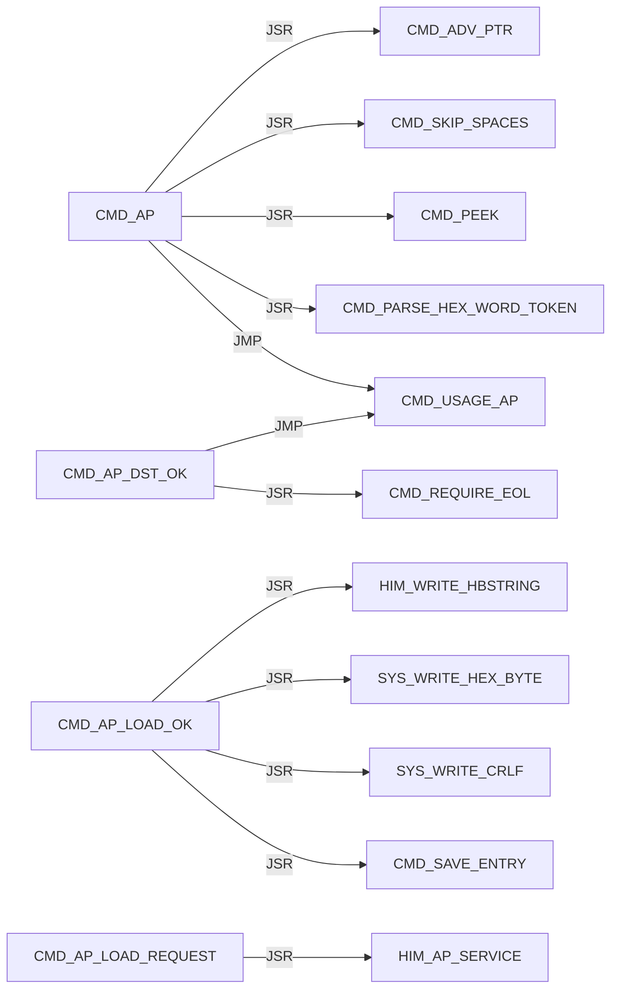
```mermaid
flowchart LR
    N0["CMD_AP"] -->|JSR| N1["CMD_ADV_PTR"]
    N0["CMD_AP"] -->|JSR| N2["CMD_SKIP_SPACES"]
    N0["CMD_AP"] -->|JSR| N3["CMD_PEEK"]
    N0["CMD_AP"] -->|JSR| N4["CMD_PARSE_HEX_WORD_TOKEN"]
    N0["CMD_AP"] -->|JMP| N5["CMD_USAGE_AP"]
    N6["CMD_AP_DST_OK"] -->|JSR| N7["CMD_REQUIRE_EOL"]
    N6["CMD_AP_DST_OK"] -->|JMP| N5["CMD_USAGE_AP"]
    N8["CMD_AP_LOAD_OK"] -->|JSR| N9["HIM_WRITE_HBSTRING"]
    N8["CMD_AP_LOAD_OK"] -->|JSR| N10["SYS_WRITE_HEX_BYTE"]
    N8["CMD_AP_LOAD_OK"] -->|JSR| N11["SYS_WRITE_CRLF"]
    N8["CMD_AP_LOAD_OK"] -->|JSR| N12["CMD_SAVE_ENTRY"]
    N13["CMD_AP_LOAD_REQUEST"] -->|JSR| N14["HIM_AP_SERVICE"]
```

Panel 2 of 2: `CMD_AP_LOAD_REQUEST` through `CMD_AP_SRC_OK`.

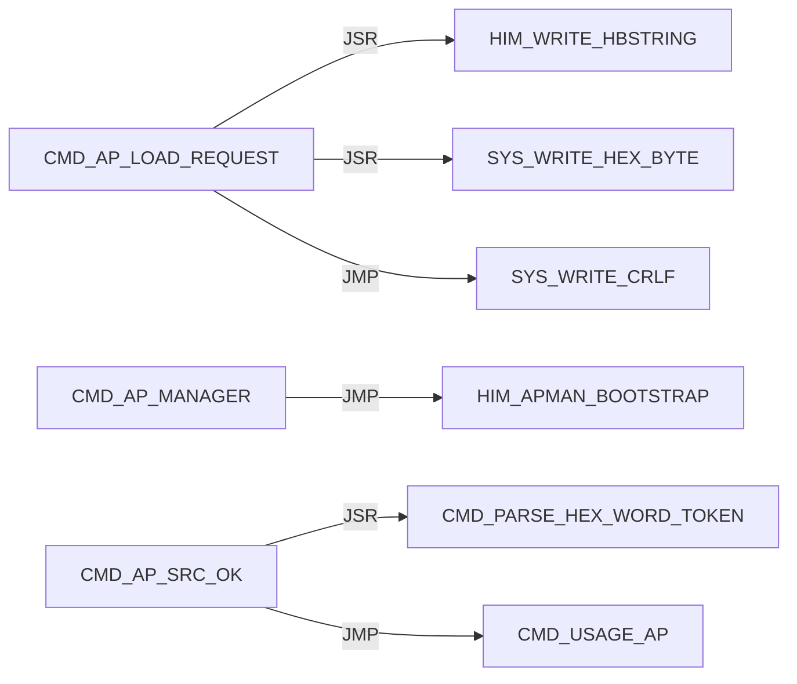
```mermaid
flowchart LR
    N0["CMD_AP_LOAD_REQUEST"] -->|JSR| N1["HIM_WRITE_HBSTRING"]
    N0["CMD_AP_LOAD_REQUEST"] -->|JSR| N2["SYS_WRITE_HEX_BYTE"]
    N0["CMD_AP_LOAD_REQUEST"] -->|JMP| N3["SYS_WRITE_CRLF"]
    N4["CMD_AP_MANAGER"] -->|JMP| N5["HIM_APMAN_BOOTSTRAP"]
    N6["CMD_AP_SRC_OK"] -->|JSR| N7["CMD_PARSE_HEX_WORD_TOKEN"]
    N6["CMD_AP_SRC_OK"] -->|JMP| N8["CMD_USAGE_AP"]
```

#### CMD / APS

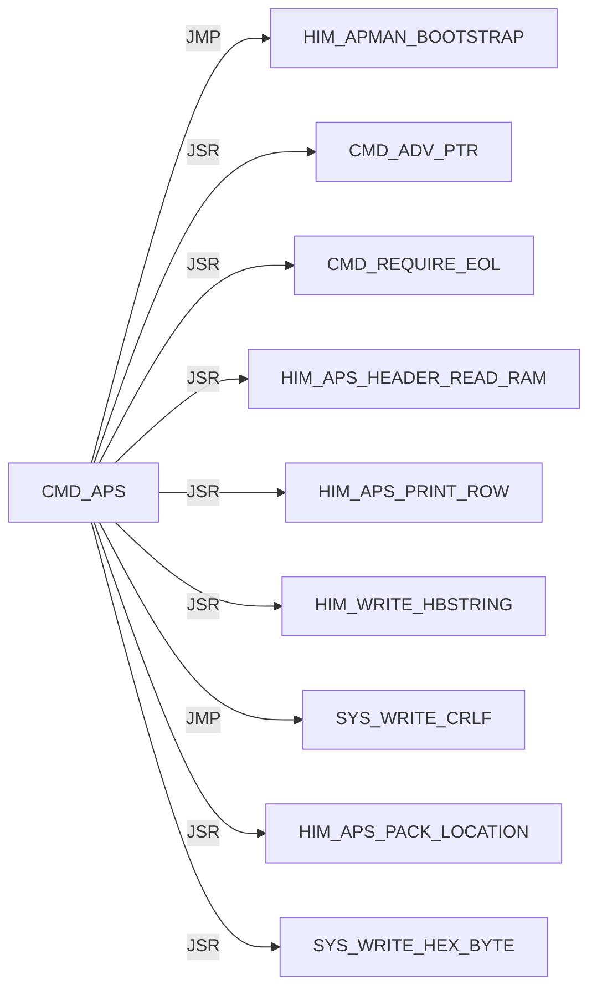
```mermaid
flowchart LR
    N0["CMD_APS"] -->|JMP| N1["HIM_APMAN_BOOTSTRAP"]
    N0["CMD_APS"] -->|JSR| N2["CMD_ADV_PTR"]
    N0["CMD_APS"] -->|JSR| N3["CMD_REQUIRE_EOL"]
    N0["CMD_APS"] -->|JSR| N4["HIM_APS_HEADER_READ_RAM"]
    N0["CMD_APS"] -->|JSR| N5["HIM_APS_PRINT_ROW"]
    N0["CMD_APS"] -->|JSR| N6["HIM_WRITE_HBSTRING"]
    N0["CMD_APS"] -->|JMP| N7["SYS_WRITE_CRLF"]
    N0["CMD_APS"] -->|JSR| N8["HIM_APS_PACK_LOCATION"]
    N0["CMD_APS"] -->|JSR| N9["SYS_WRITE_HEX_BYTE"]
```

#### CMD / D

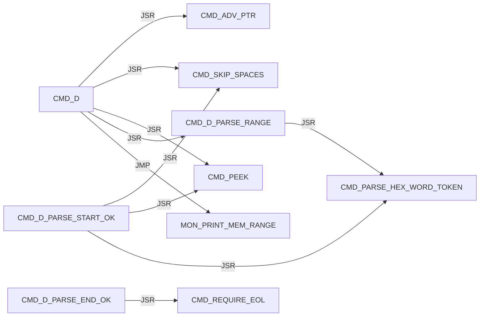
```mermaid
flowchart LR
    N0["CMD_D"] -->|JSR| N1["CMD_ADV_PTR"]
    N0["CMD_D"] -->|JSR| N2["CMD_SKIP_SPACES"]
    N0["CMD_D"] -->|JSR| N3["CMD_PEEK"]
    N0["CMD_D"] -->|JSR| N4["CMD_D_PARSE_RANGE"]
    N0["CMD_D"] -->|JMP| N5["MON_PRINT_MEM_RANGE"]
    N6["CMD_D_PARSE_END_OK"] -->|JSR| N7["CMD_REQUIRE_EOL"]
    N4["CMD_D_PARSE_RANGE"] -->|JSR| N8["CMD_PARSE_HEX_WORD_TOKEN"]
    N9["CMD_D_PARSE_START_OK"] -->|JSR| N2["CMD_SKIP_SPACES"]
    N9["CMD_D_PARSE_START_OK"] -->|JSR| N3["CMD_PEEK"]
    N9["CMD_D_PARSE_START_OK"] -->|JSR| N8["CMD_PARSE_HEX_WORD_TOKEN"]
```

#### CMD / DISPATCH

Panel 1 of 2: `CMD_DISPATCH_DONE` through `CMD_DISPATCH_SCAN_MISS`.

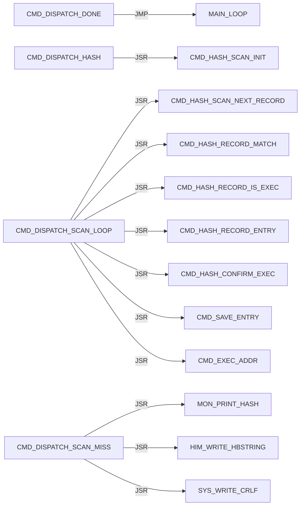
```mermaid
flowchart LR
    N0["CMD_DISPATCH_DONE"] -->|JMP| N1["MAIN_LOOP"]
    N2["CMD_DISPATCH_HASH"] -->|JSR| N3["CMD_HASH_SCAN_INIT"]
    N4["CMD_DISPATCH_SCAN_LOOP"] -->|JSR| N5["CMD_HASH_SCAN_NEXT_RECORD"]
    N4["CMD_DISPATCH_SCAN_LOOP"] -->|JSR| N6["CMD_HASH_RECORD_MATCH"]
    N4["CMD_DISPATCH_SCAN_LOOP"] -->|JSR| N7["CMD_HASH_RECORD_IS_EXEC"]
    N4["CMD_DISPATCH_SCAN_LOOP"] -->|JSR| N8["CMD_HASH_RECORD_ENTRY"]
    N4["CMD_DISPATCH_SCAN_LOOP"] -->|JSR| N9["CMD_HASH_CONFIRM_EXEC"]
    N4["CMD_DISPATCH_SCAN_LOOP"] -->|JSR| N10["CMD_SAVE_ENTRY"]
    N4["CMD_DISPATCH_SCAN_LOOP"] -->|JSR| N11["CMD_EXEC_ADDR"]
    N12["CMD_DISPATCH_SCAN_MISS"] -->|JSR| N13["MON_PRINT_HASH"]
    N12["CMD_DISPATCH_SCAN_MISS"] -->|JSR| N14["HIM_WRITE_HBSTRING"]
    N12["CMD_DISPATCH_SCAN_MISS"] -->|JSR| N15["SYS_WRITE_CRLF"]
```

Panel 2 of 2: `CMD_DISPATCH_SCAN_MISS` through `CMD_DISPATCH_SCAN_NEXT`.

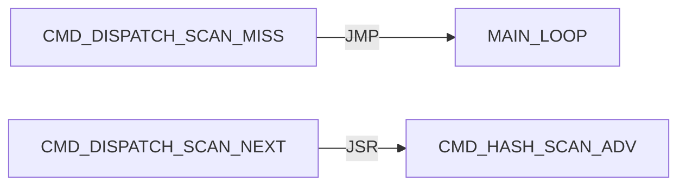
```mermaid
flowchart LR
    N0["CMD_DISPATCH_SCAN_MISS"] -->|JMP| N1["MAIN_LOOP"]
    N2["CMD_DISPATCH_SCAN_NEXT"] -->|JSR| N3["CMD_HASH_SCAN_ADV"]
```

#### CMD / EXEC

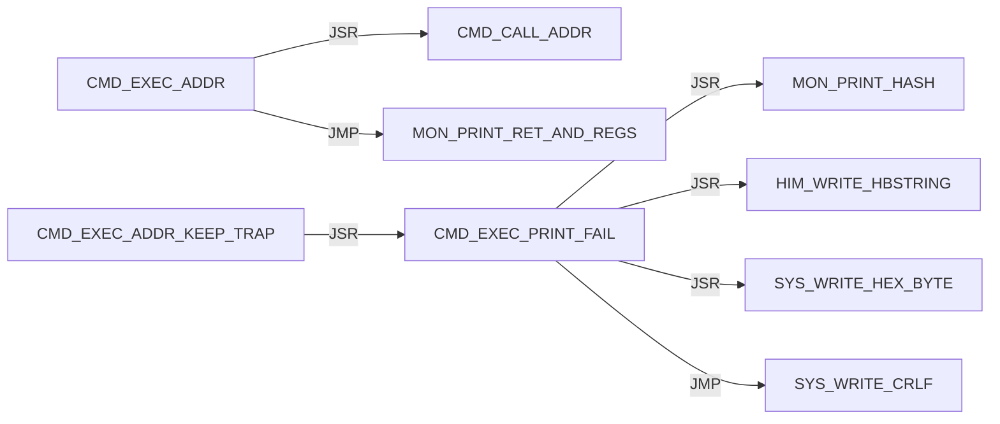
```mermaid
flowchart LR
    N0["CMD_EXEC_ADDR"] -->|JSR| N1["CMD_CALL_ADDR"]
    N0["CMD_EXEC_ADDR"] -->|JMP| N2["MON_PRINT_RET_AND_REGS"]
    N3["CMD_EXEC_ADDR_KEEP_TRAP"] -->|JSR| N4["CMD_EXEC_PRINT_FAIL"]
    N4["CMD_EXEC_PRINT_FAIL"] -->|JSR| N5["MON_PRINT_HASH"]
    N4["CMD_EXEC_PRINT_FAIL"] -->|JSR| N6["HIM_WRITE_HBSTRING"]
    N4["CMD_EXEC_PRINT_FAIL"] -->|JSR| N7["SYS_WRITE_HEX_BYTE"]
    N4["CMD_EXEC_PRINT_FAIL"] -->|JMP| N8["SYS_WRITE_CRLF"]
```

#### CMD / G

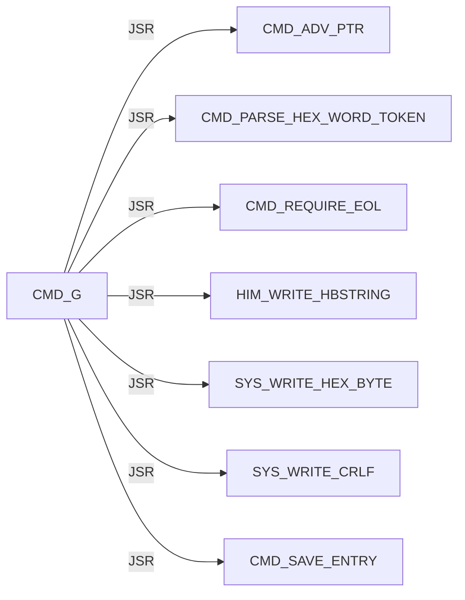
```mermaid
flowchart LR
    N0["CMD_G"] -->|JSR| N1["CMD_ADV_PTR"]
    N0["CMD_G"] -->|JSR| N2["CMD_PARSE_HEX_WORD_TOKEN"]
    N0["CMD_G"] -->|JSR| N3["CMD_REQUIRE_EOL"]
    N0["CMD_G"] -->|JSR| N4["HIM_WRITE_HBSTRING"]
    N0["CMD_G"] -->|JSR| N5["SYS_WRITE_HEX_BYTE"]
    N0["CMD_G"] -->|JSR| N6["SYS_WRITE_CRLF"]
    N0["CMD_G"] -->|JSR| N7["CMD_SAVE_ENTRY"]
```

#### CMD / HASH

Panel 1 of 7: `CMD_HASH_CONFIRM_ADDR` through `CMD_HASH_FIND_LOOP`.

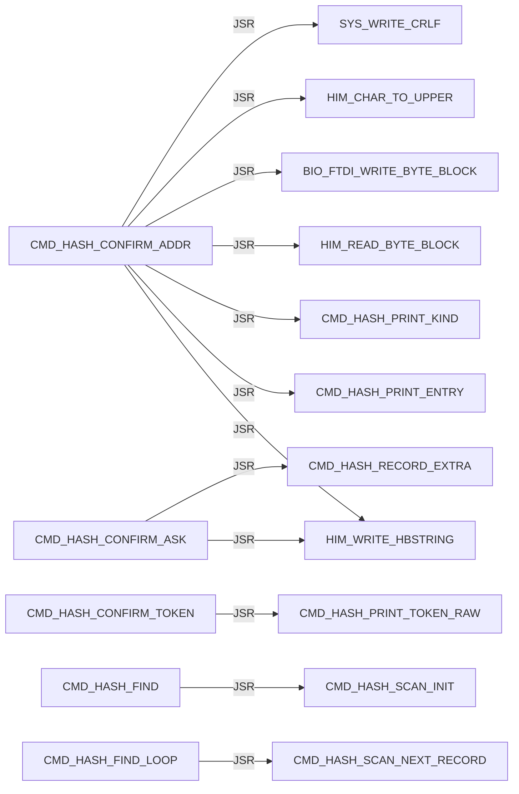
```mermaid
flowchart LR
    N0["CMD_HASH_CONFIRM_ADDR"] -->|JSR| N1["HIM_WRITE_HBSTRING"]
    N0["CMD_HASH_CONFIRM_ADDR"] -->|JSR| N2["CMD_HASH_PRINT_ENTRY"]
    N0["CMD_HASH_CONFIRM_ADDR"] -->|JSR| N3["CMD_HASH_PRINT_KIND"]
    N0["CMD_HASH_CONFIRM_ADDR"] -->|JSR| N4["HIM_READ_BYTE_BLOCK"]
    N0["CMD_HASH_CONFIRM_ADDR"] -->|JSR| N5["BIO_FTDI_WRITE_BYTE_BLOCK"]
    N0["CMD_HASH_CONFIRM_ADDR"] -->|JSR| N6["HIM_CHAR_TO_UPPER"]
    N0["CMD_HASH_CONFIRM_ADDR"] -->|JSR| N7["SYS_WRITE_CRLF"]
    N8["CMD_HASH_CONFIRM_ASK"] -->|JSR| N1["HIM_WRITE_HBSTRING"]
    N8["CMD_HASH_CONFIRM_ASK"] -->|JSR| N9["CMD_HASH_RECORD_EXTRA"]
    N10["CMD_HASH_CONFIRM_TOKEN"] -->|JSR| N11["CMD_HASH_PRINT_TOKEN_RAW"]
    N12["CMD_HASH_FIND"] -->|JSR| N13["CMD_HASH_SCAN_INIT"]
    N14["CMD_HASH_FIND_LOOP"] -->|JSR| N15["CMD_HASH_SCAN_NEXT_RECORD"]
```

Panel 2 of 7: `CMD_HASH_FIND_LOOP` through `CMD_HASH_INFO_FOUND`.

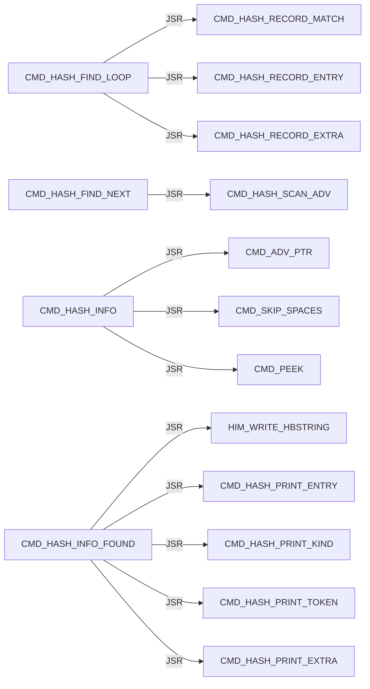
```mermaid
flowchart LR
    N0["CMD_HASH_FIND_LOOP"] -->|JSR| N1["CMD_HASH_RECORD_MATCH"]
    N0["CMD_HASH_FIND_LOOP"] -->|JSR| N2["CMD_HASH_RECORD_ENTRY"]
    N0["CMD_HASH_FIND_LOOP"] -->|JSR| N3["CMD_HASH_RECORD_EXTRA"]
    N4["CMD_HASH_FIND_NEXT"] -->|JSR| N5["CMD_HASH_SCAN_ADV"]
    N6["CMD_HASH_INFO"] -->|JSR| N7["CMD_ADV_PTR"]
    N6["CMD_HASH_INFO"] -->|JSR| N8["CMD_SKIP_SPACES"]
    N6["CMD_HASH_INFO"] -->|JSR| N9["CMD_PEEK"]
    N10["CMD_HASH_INFO_FOUND"] -->|JSR| N11["HIM_WRITE_HBSTRING"]
    N10["CMD_HASH_INFO_FOUND"] -->|JSR| N12["CMD_HASH_PRINT_ENTRY"]
    N10["CMD_HASH_INFO_FOUND"] -->|JSR| N13["CMD_HASH_PRINT_KIND"]
    N10["CMD_HASH_INFO_FOUND"] -->|JSR| N14["CMD_HASH_PRINT_TOKEN"]
    N10["CMD_HASH_INFO_FOUND"] -->|JSR| N15["CMD_HASH_PRINT_EXTRA"]
```

Panel 3 of 7: `CMD_HASH_INFO_FOUND` through `CMD_HASH_INFO_LOOKUP`.

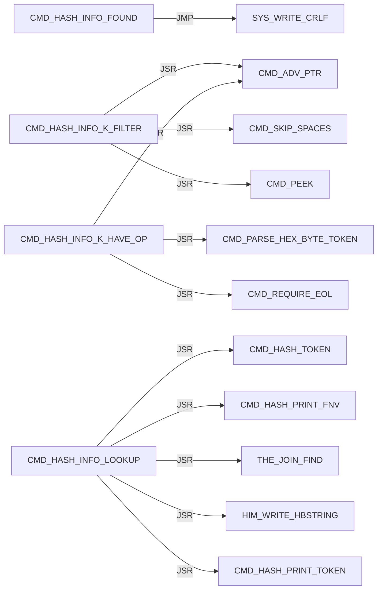
```mermaid
flowchart LR
    N0["CMD_HASH_INFO_FOUND"] -->|JMP| N1["SYS_WRITE_CRLF"]
    N2["CMD_HASH_INFO_K_FILTER"] -->|JSR| N3["CMD_ADV_PTR"]
    N2["CMD_HASH_INFO_K_FILTER"] -->|JSR| N4["CMD_SKIP_SPACES"]
    N2["CMD_HASH_INFO_K_FILTER"] -->|JSR| N5["CMD_PEEK"]
    N6["CMD_HASH_INFO_K_HAVE_OP"] -->|JSR| N3["CMD_ADV_PTR"]
    N6["CMD_HASH_INFO_K_HAVE_OP"] -->|JSR| N7["CMD_PARSE_HEX_BYTE_TOKEN"]
    N6["CMD_HASH_INFO_K_HAVE_OP"] -->|JSR| N8["CMD_REQUIRE_EOL"]
    N9["CMD_HASH_INFO_LOOKUP"] -->|JSR| N10["CMD_HASH_TOKEN"]
    N9["CMD_HASH_INFO_LOOKUP"] -->|JSR| N11["CMD_HASH_PRINT_FNV"]
    N9["CMD_HASH_INFO_LOOKUP"] -->|JSR| N12["THE_JOIN_FIND"]
    N9["CMD_HASH_INFO_LOOKUP"] -->|JSR| N13["HIM_WRITE_HBSTRING"]
    N9["CMD_HASH_INFO_LOOKUP"] -->|JSR| N14["CMD_HASH_PRINT_TOKEN"]
```

Panel 4 of 7: `CMD_HASH_INFO_LOOKUP` through `CMD_HASH_PRINT_EXTRA`.

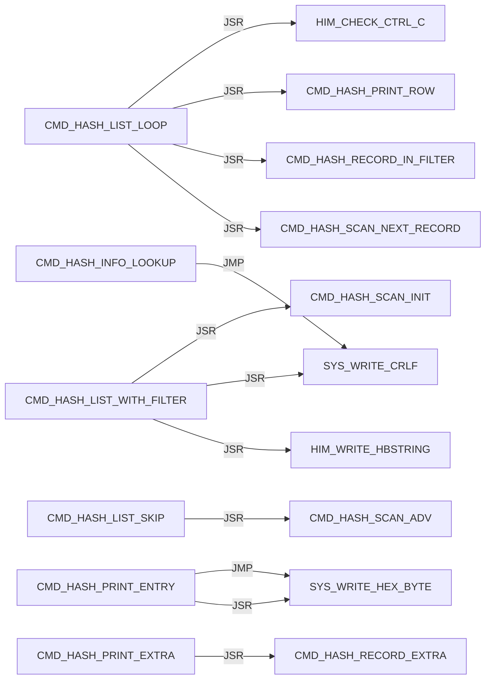
```mermaid
flowchart LR
    N0["CMD_HASH_INFO_LOOKUP"] -->|JMP| N1["SYS_WRITE_CRLF"]
    N2["CMD_HASH_LIST_LOOP"] -->|JSR| N3["CMD_HASH_SCAN_NEXT_RECORD"]
    N2["CMD_HASH_LIST_LOOP"] -->|JSR| N4["CMD_HASH_RECORD_IN_FILTER"]
    N2["CMD_HASH_LIST_LOOP"] -->|JSR| N5["CMD_HASH_PRINT_ROW"]
    N2["CMD_HASH_LIST_LOOP"] -->|JSR| N6["HIM_CHECK_CTRL_C"]
    N7["CMD_HASH_LIST_SKIP"] -->|JSR| N8["CMD_HASH_SCAN_ADV"]
    N9["CMD_HASH_LIST_WITH_FILTER"] -->|JSR| N10["HIM_WRITE_HBSTRING"]
    N9["CMD_HASH_LIST_WITH_FILTER"] -->|JSR| N1["SYS_WRITE_CRLF"]
    N9["CMD_HASH_LIST_WITH_FILTER"] -->|JSR| N11["CMD_HASH_SCAN_INIT"]
    N12["CMD_HASH_PRINT_ENTRY"] -->|JSR| N13["SYS_WRITE_HEX_BYTE"]
    N12["CMD_HASH_PRINT_ENTRY"] -->|JMP| N13["SYS_WRITE_HEX_BYTE"]
    N14["CMD_HASH_PRINT_EXTRA"] -->|JSR| N15["CMD_HASH_RECORD_EXTRA"]
```

Panel 5 of 7: `CMD_HASH_PRINT_EXTRA` through `CMD_HASH_PRINT_ROW`.

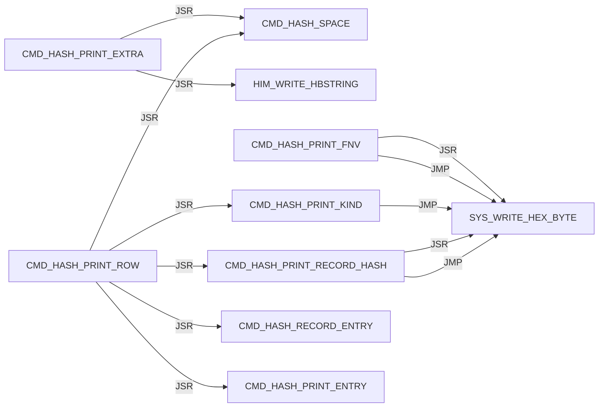
```mermaid
flowchart LR
    N0["CMD_HASH_PRINT_EXTRA"] -->|JSR| N1["CMD_HASH_SPACE"]
    N0["CMD_HASH_PRINT_EXTRA"] -->|JSR| N2["HIM_WRITE_HBSTRING"]
    N3["CMD_HASH_PRINT_FNV"] -->|JSR| N4["SYS_WRITE_HEX_BYTE"]
    N3["CMD_HASH_PRINT_FNV"] -->|JMP| N4["SYS_WRITE_HEX_BYTE"]
    N5["CMD_HASH_PRINT_KIND"] -->|JMP| N4["SYS_WRITE_HEX_BYTE"]
    N6["CMD_HASH_PRINT_RECORD_HASH"] -->|JSR| N4["SYS_WRITE_HEX_BYTE"]
    N6["CMD_HASH_PRINT_RECORD_HASH"] -->|JMP| N4["SYS_WRITE_HEX_BYTE"]
    N7["CMD_HASH_PRINT_ROW"] -->|JSR| N6["CMD_HASH_PRINT_RECORD_HASH"]
    N7["CMD_HASH_PRINT_ROW"] -->|JSR| N1["CMD_HASH_SPACE"]
    N7["CMD_HASH_PRINT_ROW"] -->|JSR| N8["CMD_HASH_RECORD_ENTRY"]
    N7["CMD_HASH_PRINT_ROW"] -->|JSR| N9["CMD_HASH_PRINT_ENTRY"]
    N7["CMD_HASH_PRINT_ROW"] -->|JSR| N5["CMD_HASH_PRINT_KIND"]
```

Panel 6 of 7: `CMD_HASH_PRINT_ROW` through `CMD_HASH_TOKEN`.

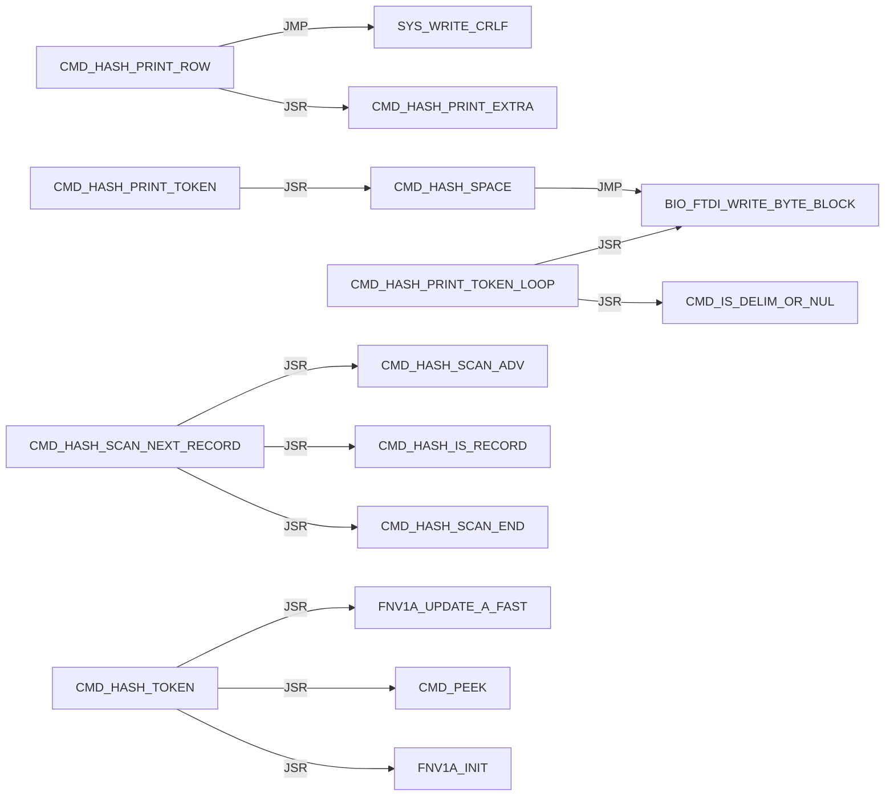
```mermaid
flowchart LR
    N0["CMD_HASH_PRINT_ROW"] -->|JSR| N1["CMD_HASH_PRINT_EXTRA"]
    N0["CMD_HASH_PRINT_ROW"] -->|JMP| N2["SYS_WRITE_CRLF"]
    N3["CMD_HASH_PRINT_TOKEN"] -->|JSR| N4["CMD_HASH_SPACE"]
    N5["CMD_HASH_PRINT_TOKEN_LOOP"] -->|JSR| N6["CMD_IS_DELIM_OR_NUL"]
    N5["CMD_HASH_PRINT_TOKEN_LOOP"] -->|JSR| N7["BIO_FTDI_WRITE_BYTE_BLOCK"]
    N8["CMD_HASH_SCAN_NEXT_RECORD"] -->|JSR| N9["CMD_HASH_SCAN_END"]
    N8["CMD_HASH_SCAN_NEXT_RECORD"] -->|JSR| N10["CMD_HASH_IS_RECORD"]
    N8["CMD_HASH_SCAN_NEXT_RECORD"] -->|JSR| N11["CMD_HASH_SCAN_ADV"]
    N4["CMD_HASH_SPACE"] -->|JMP| N7["BIO_FTDI_WRITE_BYTE_BLOCK"]
    N12["CMD_HASH_TOKEN"] -->|JSR| N13["FNV1A_INIT"]
    N12["CMD_HASH_TOKEN"] -->|JSR| N14["CMD_PEEK"]
    N12["CMD_HASH_TOKEN"] -->|JSR| N15["FNV1A_UPDATE_A_FAST"]
```

Panel 7 of 7: `CMD_HASH_TOKEN_DONE` through `CMD_HASH_USAGE`.

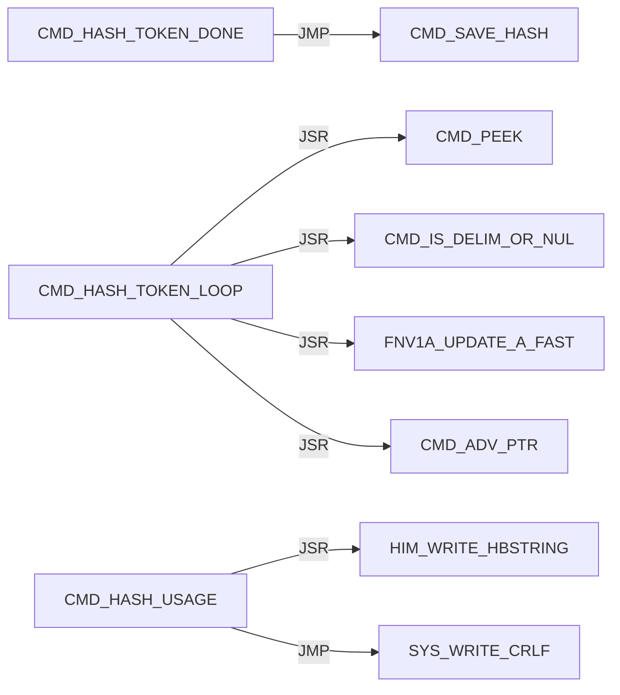
```mermaid
flowchart LR
    N0["CMD_HASH_TOKEN_DONE"] -->|JMP| N1["CMD_SAVE_HASH"]
    N2["CMD_HASH_TOKEN_LOOP"] -->|JSR| N3["CMD_PEEK"]
    N2["CMD_HASH_TOKEN_LOOP"] -->|JSR| N4["CMD_IS_DELIM_OR_NUL"]
    N2["CMD_HASH_TOKEN_LOOP"] -->|JSR| N5["FNV1A_UPDATE_A_FAST"]
    N2["CMD_HASH_TOKEN_LOOP"] -->|JSR| N6["CMD_ADV_PTR"]
    N7["CMD_HASH_USAGE"] -->|JSR| N8["HIM_WRITE_HBSTRING"]
    N7["CMD_HASH_USAGE"] -->|JMP| N9["SYS_WRITE_CRLF"]
```

#### CMD / HELP

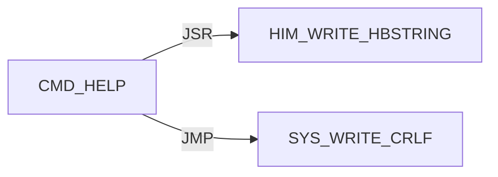
```mermaid
flowchart LR
    N0["CMD_HELP"] -->|JSR| N1["HIM_WRITE_HBSTRING"]
    N0["CMD_HELP"] -->|JMP| N2["SYS_WRITE_CRLF"]
```

#### CMD / L

Panel 1 of 2: `CMD_L` through `CMD_L_PARSE_OK`.

```mermaid
flowchart LR
    N0["CMD_L"] -->|JSR| N1["CMD_ADV_PTR"]
    N0["CMD_L"] -->|JSR| N2["CMD_REQUIRE_EOL"]
    N0["CMD_L"] -->|JMP| N3["CMD_USAGE_L"]
    N4["CMD_L_ARGS_OK"] -->|JSR| N5["DBG_CLEAR_ALL"]
    N4["CMD_L_ARGS_OK"] -->|JSR| N6["L_STR8_REQUIRE_SERVICE"]
    N4["CMD_L_ARGS_OK"] -->|JSR| N7["CMD_L_PRINT_FAIL"]
    N8["CMD_L_HAVE_LINE"] -->|JSR| N9["CMD_PEEK"]
    N8["CMD_L_HAVE_LINE"] -->|JSR| N10["L_PARSE_RECORD_STR8"]
    N8["CMD_L_HAVE_LINE"] -->|JSR| N7["CMD_L_PRINT_FAIL"]
    N11["CMD_L_PARSE_OK"] -->|JSR| N12["HIM_WRITE_HBSTRING"]
    N11["CMD_L_PARSE_OK"] -->|JSR| N13["SYS_WRITE_HEX_BYTE"]
    N11["CMD_L_PARSE_OK"] -->|JSR| N14["SYS_WRITE_CRLF"]
```

Panel 2 of 2: `CMD_L_PRINT_FAIL` through `CMD_L_SERVICE_OK`.

```mermaid
flowchart LR
    N0["CMD_L_PRINT_FAIL"] -->|JSR| N1["HIM_WRITE_HBSTRING"]
    N0["CMD_L_PRINT_FAIL"] -->|JSR| N2["SYS_WRITE_HEX_BYTE"]
    N0["CMD_L_PRINT_FAIL"] -->|JMP| N3["SYS_WRITE_CRLF"]
    N4["CMD_L_READ_LOOP"] -->|JSR| N5["HIM_READ_LINE_UPPER"]
    N4["CMD_L_READ_LOOP"] -->|JSR| N1["HIM_WRITE_HBSTRING"]
    N4["CMD_L_READ_LOOP"] -->|JSR| N2["SYS_WRITE_HEX_BYTE"]
    N4["CMD_L_READ_LOOP"] -->|JSR| N3["SYS_WRITE_CRLF"]
    N6["CMD_L_SERVICE_OK"] -->|JSR| N1["HIM_WRITE_HBSTRING"]
    N6["CMD_L_SERVICE_OK"] -->|JSR| N3["SYS_WRITE_CRLF"]
```

#### CMD / M

```mermaid
flowchart LR
    N0["CMD_M"] -->|JSR| N1["CMD_ADV_PTR"]
    N0["CMD_M"] -->|JSR| N2["CMD_PARSE_RANGE_REQUIRED"]
    N0["CMD_M"] -->|JSR| N3["MON_MODIFY_RANGE_WRITABLE"]
    N0["CMD_M"] -->|JMP| N4["MON_MODIFY_RANGE"]
    N5["CMD_M_PROTECT"] -->|JSR| N6["HIM_WRITE_HBSTRING"]
    N5["CMD_M_PROTECT"] -->|JSR| N7["SYS_WRITE_HEX_BYTE"]
    N5["CMD_M_PROTECT"] -->|JMP| N8["SYS_WRITE_CRLF"]
```

#### CMD / PARSE

Panel 1 of 2: `CMD_PARSE_HEX_BYTE_TOKEN` through `CMD_PARSE_RANGE_REQUIRED`.

```mermaid
flowchart LR
    N0["CMD_PARSE_HEX_BYTE_TOKEN"] -->|JSR| N1["CMD_PARSE_HEX_WORD_TOKEN"]
    N2["CMD_PARSE_HEX_WORD_DONE"] -->|JSR| N3["CMD_PEEK"]
    N2["CMD_PARSE_HEX_WORD_DONE"] -->|JSR| N4["CMD_IS_DELIM_OR_NUL"]
    N5["CMD_PARSE_HEX_WORD_LOOP"] -->|JSR| N3["CMD_PEEK"]
    N5["CMD_PARSE_HEX_WORD_LOOP"] -->|JSR| N6["CMD_HEX_ASCII_TO_NIBBLE"]
    N5["CMD_PARSE_HEX_WORD_LOOP"] -->|JSR| N7["CMD_ADV_PTR"]
    N1["CMD_PARSE_HEX_WORD_TOKEN"] -->|JSR| N8["CMD_SKIP_SPACES"]
    N1["CMD_PARSE_HEX_WORD_TOKEN"] -->|JSR| N9["CMD_SKIP_OPTIONAL_DOLLAR"]
    N10["CMD_PARSE_RANGE_HAVE_END"] -->|JSR| N11["CMD_REQUIRE_EOL"]
    N12["CMD_PARSE_RANGE_PLUS"] -->|JSR| N7["CMD_ADV_PTR"]
    N12["CMD_PARSE_RANGE_PLUS"] -->|JSR| N1["CMD_PARSE_HEX_WORD_TOKEN"]
    N13["CMD_PARSE_RANGE_REQUIRED"] -->|JSR| N1["CMD_PARSE_HEX_WORD_TOKEN"]
```

Panel 2 of 2: `CMD_PARSE_RANGE_REQUIRED` through `CMD_PARSE_RANGE_START_OK`.

```mermaid
flowchart LR
    N0["CMD_PARSE_RANGE_REQUIRED"] -->|JMP| N1["CMD_PARSE_RANGE_FAIL"]
    N2["CMD_PARSE_RANGE_START_OK"] -->|JSR| N3["CMD_SKIP_SPACES"]
    N2["CMD_PARSE_RANGE_START_OK"] -->|JSR| N4["CMD_PEEK"]
    N2["CMD_PARSE_RANGE_START_OK"] -->|JSR| N5["CMD_PARSE_HEX_WORD_TOKEN"]
```

#### CMD / R

```mermaid
flowchart LR
    N0["CMD_R"] -->|JSR| N1["MON_CTX_REQUIRE_VALID"]
    N2["CMD_R_HAVE_CTX"] -->|JSR| N3["CMD_ADV_PTR"]
    N2["CMD_R_HAVE_CTX"] -->|JSR| N4["MON_CTX_PARSE_ASSIGN_LIST"]
    N2["CMD_R_HAVE_CTX"] -->|JMP| N5["MON_PRINT_STOP_AND_REGS"]
```

#### CMD / REQUIRE

```mermaid
flowchart LR
    N0["CMD_REQUIRE_EOL"] -->|JSR| N1["CMD_SKIP_SPACES"]
    N0["CMD_REQUIRE_EOL"] -->|JSR| N2["CMD_PEEK"]
```

#### CMD / SKIP

```mermaid
flowchart LR
    N0["CMD_SKIP_OPTIONAL_DOLLAR"] -->|JSR| N1["CMD_PEEK"]
    N0["CMD_SKIP_OPTIONAL_DOLLAR"] -->|JSR| N2["CMD_ADV_PTR"]
    N3["CMD_SKIP_SPACES"] -->|JSR| N1["CMD_PEEK"]
    N4["CMD_SKIP_SPACES_ADV"] -->|JSR| N2["CMD_ADV_PTR"]
```

#### CMD / UNKNOWN

```mermaid
flowchart LR
    N0["CMD_UNKNOWN"] -->|JSR| N1["HIM_WRITE_HBSTRING"]
    N0["CMD_UNKNOWN"] -->|JSR| N2["SYS_WRITE_CRLF"]
    N0["CMD_UNKNOWN"] -->|JMP| N3["MAIN_LOOP"]
```

#### CMD / USAGE

Panel 1 of 2: `CMD_USAGE_AP` through `CMD_USAGE_M`.

```mermaid
flowchart LR
    N0["CMD_USAGE_AP"] -->|JSR| N1["HIM_WRITE_HBSTRING"]
    N0["CMD_USAGE_AP"] -->|JMP| N2["SYS_WRITE_CRLF"]
    N3["CMD_USAGE_APS"] -->|JSR| N1["HIM_WRITE_HBSTRING"]
    N3["CMD_USAGE_APS"] -->|JMP| N2["SYS_WRITE_CRLF"]
    N4["CMD_USAGE_D"] -->|JSR| N1["HIM_WRITE_HBSTRING"]
    N4["CMD_USAGE_D"] -->|JMP| N2["SYS_WRITE_CRLF"]
    N5["CMD_USAGE_G"] -->|JSR| N1["HIM_WRITE_HBSTRING"]
    N5["CMD_USAGE_G"] -->|JMP| N2["SYS_WRITE_CRLF"]
    N6["CMD_USAGE_L"] -->|JSR| N1["HIM_WRITE_HBSTRING"]
    N6["CMD_USAGE_L"] -->|JMP| N2["SYS_WRITE_CRLF"]
    N7["CMD_USAGE_M"] -->|JSR| N1["HIM_WRITE_HBSTRING"]
    N7["CMD_USAGE_M"] -->|JMP| N2["SYS_WRITE_CRLF"]
```

Panel 2 of 2: `CMD_USAGE_R` through `CMD_USAGE_X`.

```mermaid
flowchart LR
    N0["CMD_USAGE_R"] -->|JSR| N1["HIM_WRITE_HBSTRING"]
    N0["CMD_USAGE_R"] -->|JMP| N2["SYS_WRITE_CRLF"]
    N3["CMD_USAGE_X"] -->|JSR| N1["HIM_WRITE_HBSTRING"]
    N3["CMD_USAGE_X"] -->|JMP| N2["SYS_WRITE_CRLF"]
```

#### CMD / X

```mermaid
flowchart LR
    N0["CMD_X"] -->|JSR| N1["MON_CTX_REQUIRE_VALID"]
    N2["CMD_X_HAVE_CTX"] -->|JSR| N3["CMD_ADV_PTR"]
    N2["CMD_X_HAVE_CTX"] -->|JSR| N4["MON_CTX_PARSE_ASSIGN_LIST"]
    N2["CMD_X_HAVE_CTX"] -->|JSR| N5["HIM_WRITE_HBSTRING"]
    N2["CMD_X_HAVE_CTX"] -->|JSR| N6["SYS_WRITE_HEX_BYTE"]
    N2["CMD_X_HAVE_CTX"] -->|JSR| N7["SYS_WRITE_CRLF"]
    N2["CMD_X_HAVE_CTX"] -->|JMP| N8["MON_CTX_RESUME_RTI"]
```

#### ENTRY / unprefixed

```mermaid
flowchart LR
    N0["START"] -->|JMP| N1["HIMON_START_BODY"]
```

#### FNV1A

```mermaid
flowchart LR
    N0["FNV1A_MUL_PRIME"] -->|JSR| N1["MATH_COPY_HASH_TO_TERM"]
    N0["FNV1A_MUL_PRIME"] -->|JSR| N2["MATH_SHLADD_TERM_N"]
    N0["FNV1A_MUL_PRIME"] -->|JMP| N3["MATH_ADD_TERM1_TO_HASH3"]
    N4["FNV1A_MUL_PRIME_FAST"] -->|JSR| N1["MATH_COPY_HASH_TO_TERM"]
    N4["FNV1A_MUL_PRIME_FAST"] -->|JSR| N5["MATH_ADD_TERM_TO_HASH"]
    N4["FNV1A_MUL_PRIME_FAST"] -->|JMP| N3["MATH_ADD_TERM1_TO_HASH3"]
    N6["FNV1A_UPDATE_A"] -->|JMP| N0["FNV1A_MUL_PRIME"]
    N7["FNV1A_UPDATE_A_FAST"] -->|JMP| N4["FNV1A_MUL_PRIME_FAST"]
```

#### HIM / AP

Panel 1 of 11: `HIM_AP_ADVANCE_A` through `HIM_AP_CHECK_RELOC_SHAPE_BAD`.

```mermaid
flowchart LR
    N0["HIM_AP_ADVANCE_A"] -->|JSR| N1["HIM_AP_NEED_A"]
    N2["HIM_AP_ADVANCE_TMP"] -->|JSR| N3["HIM_AP_NEED_TMP"]
    N4["HIM_AP_BANK_STAGE_CODE"] -->|JSR| N5["STR8_BANK_SELECT_SERVICE"]
    N4["HIM_AP_BANK_STAGE_CODE"] -->|JSR| N6["STR8_BANK_SELECT_RAM"]
    N7["HIM_AP_CHECK_PUBLIC_COUNT_OK"] -->|JSR| N8["HIM_AP_CHECK_PUBLIC_ADVANCE_A"]
    N7["HIM_AP_CHECK_PUBLIC_COUNT_OK"] -->|JMP| N9["HIM_AP_CHECK_PUBLIC_FAIL"]
    N9["HIM_AP_CHECK_PUBLIC_FAIL"] -->|JMP| N10["HIM_AP_BAD_LINE"]
    N11["HIM_AP_CHECK_PUBLIC_REC"] -->|JMP| N9["HIM_AP_CHECK_PUBLIC_FAIL"]
    N12["HIM_AP_CHECK_PUBLIC_ROW_READY"] -->|JSR| N8["HIM_AP_CHECK_PUBLIC_ADVANCE_A"]
    N13["HIM_AP_CHECK_RELOC_KIND_LOOP"] -->|JSR| N14["HIM_AP_RELOC_KIND_X"]
    N15["HIM_AP_CHECK_RELOC_REC"] -->|JMP| N10["HIM_AP_BAD_LINE"]
    N16["HIM_AP_CHECK_RELOC_SHAPE_BAD"] -->|JMP| N10["HIM_AP_BAD_LINE"]
```

Panel 2 of 11: `HIM_AP_FIND_HOLE_LOOP` through `HIM_AP_LINK_PATCH`.

```mermaid
flowchart LR
    N0["HIM_AP_FIND_HOLE_LOOP"] -->|JSR| N1["HIM_AP_HOLE_AT_SCAN"]
    N2["HIM_AP_FIND_HOLE_NEXT"] -->|JMP| N3["HIM_AP_BAD_RANGE"]
    N4["HIM_AP_IMPORT_LINK"] -->|JSR| N5["HIM_AP_LINK_RELOAD_REL_PTR"]
    N6["HIM_AP_LINK_CAPTURE_ROW_X"] -->|JSR| N7["HIM_AP_RELOC_KIND_X"]
    N6["HIM_AP_LINK_CAPTURE_ROW_X"] -->|JSR| N8["HIM_AP_RELOC_SITE_LO_X"]
    N6["HIM_AP_LINK_CAPTURE_ROW_X"] -->|JSR| N9["HIM_AP_RELOC_SITE_HI_X"]
    N10["HIM_AP_LINK_DONE"] -->|JSR| N11["HIM_AP_LINK_RESTORE_COUNTS"]
    N12["HIM_AP_LINK_FAIL"] -->|JSR| N11["HIM_AP_LINK_RESTORE_COUNTS"]
    N13["HIM_AP_LINK_IMPORT_ROW_LOOP"] -->|JSR| N14["HIM_AP_LINK_IMPORT_ROW_BYTES_A"]
    N15["HIM_AP_LINK_PATCH"] -->|JSR| N5["HIM_AP_LINK_RELOAD_REL_PTR"]
    N15["HIM_AP_LINK_PATCH"] -->|JSR| N7["HIM_AP_RELOC_KIND_X"]
    N15["HIM_AP_LINK_PATCH"] -->|JSR| N16["HIM_AP_IMPORT_KIND_A"]
```

Panel 3 of 11: `HIM_AP_LINK_PATCH` through `HIM_AP_LINK_VALIDATE`.

```mermaid
flowchart LR
    N0["HIM_AP_LINK_PATCH"] -->|JSR| N1["HIM_AP_LINK_CAPTURE_ROW_X"]
    N0["HIM_AP_LINK_PATCH"] -->|JSR| N2["HIM_AP_LINK_RESOLVE_ROW_X"]
    N0["HIM_AP_LINK_PATCH"] -->|JSR| N3["HIM_AP_LINK_PATCH_CAPTURED"]
    N2["HIM_AP_LINK_RESOLVE_ROW_X"] -->|JSR| N4["HIM_AP_RELOC_TARGET_LO_X"]
    N2["HIM_AP_LINK_RESOLVE_ROW_X"] -->|JSR| N5["HIM_AP_LINK_RESOLVE_SLOT_X"]
    N2["HIM_AP_LINK_RESOLVE_ROW_X"] -->|JSR| N6["HIM_AP_LINK_RELOAD_REL_PTR"]
    N2["HIM_AP_LINK_RESOLVE_ROW_X"] -->|JSR| N7["HIM_AP_RELOC_TARGET_HI_X"]
    N5["HIM_AP_LINK_RESOLVE_SLOT_X"] -->|JSR| N8["HIM_AP_LINK_IMPORT_ROW_PTR_X"]
    N5["HIM_AP_LINK_RESOLVE_SLOT_X"] -->|JSR| N9["THE_JOIN_FIND"]
    N10["HIM_AP_LINK_VALIDATE"] -->|JSR| N6["HIM_AP_LINK_RELOAD_REL_PTR"]
    N10["HIM_AP_LINK_VALIDATE"] -->|JSR| N11["HIM_AP_RELOC_KIND_X"]
    N10["HIM_AP_LINK_VALIDATE"] -->|JSR| N12["HIM_AP_IMPORT_KIND_A"]
```

Panel 4 of 11: `HIM_AP_LINK_VALIDATE` through `HIM_AP_LOAD_PATCH_LOOP`.

```mermaid
flowchart LR
    N0["HIM_AP_LINK_VALIDATE"] -->|JSR| N1["HIM_AP_RELOC_SITE_OK_X"]
    N0["HIM_AP_LINK_VALIDATE"] -->|JSR| N2["HIM_AP_LINK_RESOLVE_ROW_X"]
    N3["HIM_AP_LOAD_BASE_BAD"] -->|JMP| N4["HIM_AP_BAD_RANGE"]
    N5["HIM_AP_LOAD_BASE_LT_50"] -->|JMP| N4["HIM_AP_BAD_RANGE"]
    N6["HIM_AP_LOAD_LAST_NO_CARRY"] -->|JMP| N4["HIM_AP_BAD_RANGE"]
    N7["HIM_AP_LOAD_LEN_NONZERO"] -->|JMP| N4["HIM_AP_BAD_RANGE"]
    N8["HIM_AP_LOAD_NO_OVERLAP"] -->|JSR| N9["HIM_AP_COPY_BODY_TO_DST"]
    N8["HIM_AP_LOAD_NO_OVERLAP"] -->|JSR| N10["HIM_AP_IMPORT_LINK"]
    N11["HIM_AP_LOAD_OVERLAP_BAD"] -->|JMP| N4["HIM_AP_BAD_RANGE"]
    N12["HIM_AP_LOAD_PARSED"] -->|JSR| N13["HIM_AP_LOAD_RANGE_OK"]
    N14["HIM_AP_LOAD_PATCH_LOOP"] -->|JSR| N15["HIM_AP_RELOC_KIND_X"]
    N14["HIM_AP_LOAD_PATCH_LOOP"] -->|JSR| N16["HIM_AP_INTERNAL_KIND_A"]
```

Panel 5 of 11: `HIM_AP_LOAD_PATCH_LOOP` through `HIM_AP_PARSE_BODY_LEFT_OK`.

```mermaid
flowchart LR
    N0["HIM_AP_LOAD_PATCH_LOOP"] -->|JSR| N1["HIM_AP_IMPORT_KIND_A"]
    N0["HIM_AP_LOAD_PATCH_LOOP"] -->|JMP| N2["HIM_AP_BAD_FIX"]
    N3["HIM_AP_LOAD_PATCH_ROW"] -->|JSR| N4["HIM_AP_RELOC_SITE_OK_X"]
    N5["HIM_AP_LOAD_PATCH_SITE_OK"] -->|JSR| N6["HIM_AP_RELOC_PATCH_ROW_X"]
    N7["HIM_AP_LOAD_RANGE_OK"] -->|JMP| N8["HIM_AP_BAD_RANGE"]
    N9["HIM_AP_LOAD_TOOL_LAST"] -->|JMP| N8["HIM_AP_BAD_RANGE"]
    N10["HIM_AP_NEED_A"] -->|JMP| N8["HIM_AP_BAD_RANGE"]
    N11["HIM_AP_NEED_TMP_FAIL"] -->|JMP| N8["HIM_AP_BAD_RANGE"]
    N12["HIM_AP_PARSE_BODY"] -->|JSR| N10["HIM_AP_NEED_A"]
    N13["HIM_AP_PARSE_BODY_HDR_ROOM"] -->|JMP| N14["HIM_AP_BAD_LINE"]
    N15["HIM_AP_PARSE_BODY_LEFT_LO_OK"] -->|JMP| N14["HIM_AP_BAD_LINE"]
    N16["HIM_AP_PARSE_BODY_LEFT_OK"] -->|JMP| N14["HIM_AP_BAD_LINE"]
```

Panel 6 of 11: `HIM_AP_PARSE_BODY_NONZERO` through `HIM_AP_PARSE_IMPORT_ROOM_OK`.

```mermaid
flowchart LR
    N0["HIM_AP_PARSE_BODY_NONZERO"] -->|JSR| N1["HIM_AP_VERIFY_SEAL_BODY"]
    N2["HIM_AP_PARSE_BODY_SAVE"] -->|JMP| N3["HIM_AP_BAD_LINE"]
    N4["HIM_AP_PARSE_BODY_TAG_OK"] -->|JSR| N5["HIM_AP_ADVANCE_A"]
    N6["HIM_AP_PARSE_EXPORT"] -->|JSR| N7["HIM_AP_TAG_LEN"]
    N8["HIM_AP_PARSE_EXPORT_LEN_OK"] -->|JSR| N9["HIM_AP_NEED_TMP"]
    N8["HIM_AP_PARSE_EXPORT_LEN_OK"] -->|JSR| N10["HIM_AP_CHECK_EXPORT_REC"]
    N8["HIM_AP_PARSE_EXPORT_LEN_OK"] -->|JSR| N11["HIM_AP_ADVANCE_TMP"]
    N12["HIM_AP_PARSE_EXPORT_TAG_OK"] -->|JMP| N3["HIM_AP_BAD_LINE"]
    N13["HIM_AP_PARSE_HEADER_RANGE"] -->|JMP| N3["HIM_AP_BAD_LINE"]
    N14["HIM_AP_PARSE_IMPORT"] -->|JSR| N7["HIM_AP_TAG_LEN"]
    N15["HIM_AP_PARSE_IMPORT_LEN_OK"] -->|JSR| N9["HIM_AP_NEED_TMP"]
    N16["HIM_AP_PARSE_IMPORT_ROOM_OK"] -->|JSR| N17["HIM_AP_CHECK_IMPORT_REC"]
```

Panel 7 of 11: `HIM_AP_PARSE_IMPORT_ROOM_OK` through `HIM_AP_PARSE_SEAL_BAD`.

```mermaid
flowchart LR
    N0["HIM_AP_PARSE_IMPORT_ROOM_OK"] -->|JSR| N1["HIM_AP_ADVANCE_TMP"]
    N2["HIM_AP_PARSE_IMPORT_TAG_OK"] -->|JMP| N3["HIM_AP_BAD_LINE"]
    N4["HIM_AP_PARSE_LEN_NONZERO"] -->|JSR| N5["HIM_AP_SOURCE_RANGE_OK"]
    N6["HIM_AP_PARSE_MIN"] -->|JSR| N5["HIM_AP_SOURCE_RANGE_OK"]
    N7["HIM_AP_PARSE_RANGE_SAFE"] -->|JMP| N3["HIM_AP_BAD_LINE"]
    N8["HIM_AP_PARSE_RELOC"] -->|JSR| N9["HIM_AP_TAG_LEN"]
    N10["HIM_AP_PARSE_RELOC_LEN_OK"] -->|JSR| N11["HIM_AP_NEED_TMP"]
    N12["HIM_AP_PARSE_RELOC_ROOM_OK"] -->|JSR| N13["HIM_AP_CHECK_RELOC_REC"]
    N14["HIM_AP_PARSE_RELOC_SHAPE_OK"] -->|JSR| N1["HIM_AP_ADVANCE_TMP"]
    N15["HIM_AP_PARSE_RELOC_TAG_OK"] -->|JMP| N3["HIM_AP_BAD_LINE"]
    N16["HIM_AP_PARSE_SEAL"] -->|JSR| N9["HIM_AP_TAG_LEN"]
    N17["HIM_AP_PARSE_SEAL_BAD"] -->|JMP| N3["HIM_AP_BAD_LINE"]
```

Panel 8 of 11: `HIM_AP_PARSE_SEAL_LEN_BAD` through `HIM_AP_RELOC_SITE_HAVE_ADD`.

```mermaid
flowchart LR
    N0["HIM_AP_PARSE_SEAL_LEN_BAD"] -->|JMP| N1["HIM_AP_BAD_LINE"]
    N2["HIM_AP_PARSE_SEAL_LEN_OK"] -->|JMP| N1["HIM_AP_BAD_LINE"]
    N3["HIM_AP_PARSE_SEAL_SHAPE_OK"] -->|JSR| N4["HIM_AP_ADVANCE_TMP"]
    N5["HIM_AP_PARSE_SIG0_OK"] -->|JMP| N1["HIM_AP_BAD_LINE"]
    N6["HIM_AP_PARSE_SIG1_OK"] -->|JMP| N1["HIM_AP_BAD_LINE"]
    N7["HIM_AP_PARSE_VER_OK"] -->|JMP| N1["HIM_AP_BAD_LINE"]
    N8["HIM_AP_RELOC_PATCH_ROW_X"] -->|JSR| N9["HIM_AP_RELOC_SITE_LO_X"]
    N8["HIM_AP_RELOC_PATCH_ROW_X"] -->|JSR| N10["HIM_AP_RELOC_SITE_HI_X"]
    N8["HIM_AP_RELOC_PATCH_ROW_X"] -->|JSR| N11["HIM_AP_RELOC_TARGET_LO_X"]
    N8["HIM_AP_RELOC_PATCH_ROW_X"] -->|JSR| N12["HIM_AP_RELOC_TARGET_HI_X"]
    N13["HIM_AP_RELOC_SITE_HAVE_ADD"] -->|JSR| N9["HIM_AP_RELOC_SITE_LO_X"]
    N13["HIM_AP_RELOC_SITE_HAVE_ADD"] -->|JSR| N10["HIM_AP_RELOC_SITE_HI_X"]
```

Panel 9 of 11: `HIM_AP_RELOC_SITE_HAVE_ADD` through `HIM_AP_SERVICE_SUGGEST`.

```mermaid
flowchart LR
    N0["HIM_AP_RELOC_SITE_HAVE_ADD"] -->|JMP| N1["HIM_AP_BAD_FIX"]
    N2["HIM_AP_RELOC_SITE_HI_EQ"] -->|JMP| N1["HIM_AP_BAD_FIX"]
    N3["HIM_AP_RELOC_SITE_NO_CARRY"] -->|JMP| N1["HIM_AP_BAD_FIX"]
    N4["HIM_AP_RELOC_SITE_OK_X"] -->|JSR| N5["HIM_AP_RELOC_KIND_X"]
    N6["HIM_AP_SERVICE"] -->|JMP| N7["HIM_AP_SERVICE_SUGGEST"]
    N8["HIM_AP_SERVICE_BAD_OP"] -->|JMP| N9["HIM_AP_BAD_LINE"]
    N10["HIM_AP_SERVICE_CHECK_LINK"] -->|JMP| N11["HIM_AP_SERVICE_LINK"]
    N12["HIM_AP_SERVICE_CHECK_MANAGER"] -->|JMP| N13["HIM_APMAN_BOOTSTRAP"]
    N11["HIM_AP_SERVICE_LINK"] -->|JMP| N14["HIM_AP_IMPORT_LINK"]
    N15["HIM_AP_SERVICE_LOAD"] -->|JSR| N16["HIM_AP_PARSE_MIN"]
    N17["HIM_AP_SERVICE_PARSE"] -->|JMP| N16["HIM_AP_PARSE_MIN"]
    N7["HIM_AP_SERVICE_SUGGEST"] -->|JSR| N16["HIM_AP_PARSE_MIN"]
```

Panel 10 of 11: `HIM_AP_SOURCE_BASE_BAD` through `HIM_AP_SUGGEST_PARSED`.

```mermaid
flowchart LR
    N0["HIM_AP_SOURCE_BASE_BAD"] -->|JMP| N1["HIM_AP_BAD_RANGE"]
    N2["HIM_AP_SOURCE_BASE_GE_20"] -->|JMP| N1["HIM_AP_BAD_RANGE"]
    N3["HIM_AP_SOURCE_BASE_GE_80"] -->|JMP| N1["HIM_AP_BAD_RANGE"]
    N4["HIM_AP_SOURCE_BASE_SAFE"] -->|JMP| N1["HIM_AP_BAD_RANGE"]
    N5["HIM_AP_SOURCE_LAST_NO_CARRY"] -->|JMP| N1["HIM_AP_BAD_RANGE"]
    N6["HIM_AP_SOURCE_LEN_NONZERO"] -->|JSR| N7["HIM_AP_SOURCE_BASE_OK"]
    N8["HIM_AP_SOURCE_RAM_RANGE"] -->|JMP| N1["HIM_AP_BAD_RANGE"]
    N9["HIM_AP_SOURCE_RANGE_OK"] -->|JMP| N1["HIM_AP_BAD_RANGE"]
    N10["HIM_AP_SOURCE_STAGE_RANGE"] -->|JMP| N1["HIM_AP_BAD_RANGE"]
    N11["HIM_AP_STAGE_BANK_BAD"] -->|JMP| N1["HIM_AP_BAD_RANGE"]
    N12["HIM_AP_STAGE_BANK_SOURCE"] -->|JSR| N13["HIM_AP_BANK_STAGE_RAM"]
    N14["HIM_AP_SUGGEST_PARSED"] -->|JSR| N15["HIM_AP_FIND_HOLE"]
```

Panel 11 of 11: `HIM_AP_TAG_LEN` through `HIM_AP_VERIFY_SEAL_LOOP`.

```mermaid
flowchart LR
    N0["HIM_AP_TAG_LEN"] -->|JSR| N1["HIM_AP_NEED_A"]
    N2["HIM_AP_TAG_LEN_ROOM_OK"] -->|JMP| N3["HIM_AP_BAD_LINE"]
    N4["HIM_AP_TAG_LEN_TAG_OK"] -->|JMP| N5["HIM_AP_ADVANCE_A"]
    N6["HIM_AP_VERIFY_SEAL_BAD"] -->|JMP| N3["HIM_AP_BAD_LINE"]
    N7["HIM_AP_VERIFY_SEAL_BODY"] -->|JSR| N8["FNV1A_INIT"]
    N9["HIM_AP_VERIFY_SEAL_LOOP"] -->|JSR| N10["FNV1A_UPDATE_A_FAST"]
```

#### HIM / APMAN

```mermaid
flowchart LR
    N0["HIM_APMAN_BOOTSTRAP"] -->|JSR| N1["HIM_AP_STAGE_BANK_SOURCE"]
    N0["HIM_APMAN_BOOTSTRAP"] -->|JSR| N2["HIM_AP_SERVICE"]
    N0["HIM_APMAN_BOOTSTRAP"] -->|JMP| N3["APMAN_ENTRY"]
    N0["HIM_APMAN_BOOTSTRAP"] -->|JSR| N4["HIM_WRITE_HBSTRING"]
    N0["HIM_APMAN_BOOTSTRAP"] -->|JMP| N5["SYS_WRITE_CRLF"]
```

#### HIM / APS

```mermaid
flowchart LR
    N0["HIM_APS_CLASSIFY_HEADER"] -->|JSR| N1["FNV1A_INIT"]
    N0["HIM_APS_CLASSIFY_HEADER"] -->|JSR| N2["FNV1A_UPDATE_A_FAST"]
    N3["HIM_APS_HEADER_READ_CODE"] -->|JSR| N4["STR8_BANK_SELECT_SERVICE"]
    N3["HIM_APS_HEADER_READ_CODE"] -->|JSR| N5["STR8_BANK_SELECT_RAM"]
    N6["HIM_APS_PRINT_ROW"] -->|JSR| N7["HIM_APS_PACK_LOCATION"]
    N6["HIM_APS_PRINT_ROW"] -->|JSR| N8["HIM_WRITE_HBSTRING"]
    N6["HIM_APS_PRINT_ROW"] -->|JSR| N9["SYS_WRITE_HEX_BYTE"]
    N6["HIM_APS_PRINT_ROW"] -->|JSR| N10["BIO_FTDI_WRITE_BYTE_BLOCK"]
    N6["HIM_APS_PRINT_ROW"] -->|JSR| N0["HIM_APS_CLASSIFY_HEADER"]
    N6["HIM_APS_PRINT_ROW"] -->|JMP| N11["SYS_WRITE_CRLF"]
```

#### HIM / CHECK

```mermaid
flowchart LR
    N0["HIM_CHECK_CTRL_C"] -->|JSR| N1["BIO_FTDI_READ_BYTE_NONBLOCK"]
```

#### HIM / FLASH

```mermaid
flowchart LR
    N0["HIM_FLASH_INSTALL_BAD_JMP"] -->|JMP| N1["HIM_FLASH_INSTALL_BAD"]
    N2["HIM_FLASH_INSTALL_LOOP"] -->|JSR| N3["L_FLASH_SET_PTR"]
    N2["HIM_FLASH_INSTALL_LOOP"] -->|JSR| N4["FLASH_WRITE_BYTE_AXY"]
```

#### HIM / PACK40

```mermaid
flowchart LR
    N0["HIM_PACK40_ASCII_TO_CODE"] -->|JSR| N1["HIM_CHAR_TO_UPPER"]
    N2["HIM_PACK40_PACK3"] -->|JSR| N3["HIM_PACK40_MUL40"]
    N2["HIM_PACK40_PACK3"] -->|JSR| N4["HIM_PACK40_ADD_A"]
```

#### HIM / READ

```mermaid
flowchart LR
    N0["HIM_READ_BYTE_HW"] -->|JMP| N1["BIO_FTDI_READ_BYTE_BLOCK"]
    N2["HIM_READ_LINE_ABORT"] -->|JSR| N3["SYS_WRITE_CRLF"]
    N4["HIM_READ_LINE_BS_DEC"] -->|JSR| N5["BIO_FTDI_WRITE_BYTE_BLOCK"]
    N6["HIM_READ_LINE_DONE"] -->|JSR| N3["SYS_WRITE_CRLF"]
    N7["HIM_READ_LINE_KEEP_CASE"] -->|JSR| N8["CMD_ADV_PTR"]
    N7["HIM_READ_LINE_KEEP_CASE"] -->|JSR| N5["BIO_FTDI_WRITE_BYTE_BLOCK"]
    N9["HIM_READ_LINE_LOOP"] -->|JSR| N10["HIM_READ_BYTE_BLOCK"]
    N9["HIM_READ_LINE_LOOP"] -->|JSR| N11["HIM_CHAR_TO_UPPER"]
```

#### HIM / WRITE

```mermaid
flowchart LR
    N0["HIM_WRITE_HBSTRING_LAST"] -->|JMP| N1["BIO_FTDI_WRITE_BYTE_BLOCK"]
    N2["HIM_WRITE_HBSTRING_LOOP"] -->|JSR| N1["BIO_FTDI_WRITE_BYTE_BLOCK"]
```

#### HIMON

```mermaid
flowchart LR
    N0["HIMON_START_BODY"] -->|JSR| N1["HIMON_START_SIG_CHECK"]
    N0["HIMON_START_BODY"] -->|JMP| N2["HIMON_WARM_START_BODY"]
    N2["HIMON_WARM_START_BODY"] -->|JSR| N3["DBG_CLEAR_ALL"]
    N2["HIMON_WARM_START_BODY"] -->|JMP| N4["MON_START_INIT"]
```

#### L

```mermaid
flowchart LR
    N0["L_NOTE_S1_ADDR_PRINT"] -->|JSR| N1["BIO_FTDI_WRITE_BYTE_BLOCK"]
    N0["L_NOTE_S1_ADDR_PRINT"] -->|JSR| N2["SYS_WRITE_HEX_BYTE"]
    N0["L_NOTE_S1_ADDR_PRINT"] -->|JSR| N3["SYS_WRITE_CRLF"]
    N4["L_PARSE_RECORD_STR8"] -->|JSR| N5["STR8_RECORD_SERVICE"]
    N6["L_PARSE_RECORD_STR8_DATA"] -->|JSR| N7["L_VALIDATE_RAM_SPAN"]
    N6["L_PARSE_RECORD_STR8_DATA"] -->|JSR| N8["L_NOTE_S1_ADDR"]
```

#### MAIN

```mermaid
flowchart LR
    N0["MAIN_HAVE_LINE"] -->|JSR| N1["CMD_SKIP_SPACES"]
    N0["MAIN_HAVE_LINE"] -->|JSR| N2["CMD_PEEK"]
    N0["MAIN_HAVE_LINE"] -->|JSR| N3["CMD_HASH_TOKEN"]
    N0["MAIN_HAVE_LINE"] -->|JMP| N4["CMD_DISPATCH_HASH"]
    N5["MAIN_LOOP"] -->|JSR| N6["HIM_WRITE_HBSTRING"]
    N5["MAIN_LOOP"] -->|JSR| N7["HIM_READ_LINE_ECHO_UPPER"]
```

#### MATH

```mermaid
flowchart LR
    N0["MATH_SHLADD_TERM_N"] -->|JSR| N1["MATH_SHL_TERM_N"]
    N0["MATH_SHLADD_TERM_N"] -->|JMP| N2["MATH_ADD_TERM_TO_HASH"]
```

#### MON / AFTER

```mermaid
flowchart LR
    N0["MON_AFTER_BANNER"] -->|JSR| N1["MON_PRINT_STOP_AND_REGS"]
```

#### MON / BRK

```mermaid
flowchart LR
    N0["MON_BRK_TRAP"] -->|JSR| N1["DBG_HANDLE_BRK"]
    N0["MON_BRK_TRAP"] -->|JMP| N2["MON_REENTER"]
    N3["MON_BRK_TRAP_NORMAL"] -->|JMP| N2["MON_REENTER"]
```

#### MON / CLEAR

```mermaid
flowchart LR
    N0["MON_CLEAR_RAM_ZP"] -->|JMP| N1["MON_START_INIT"]
```

#### MON / COLD

```mermaid
flowchart LR
    N0["MON_COLD_RESET"] -->|JMP| N1["MON_CLEAR_RAM"]
```

#### MON / CTX

Panel 1 of 3: `MON_CTX_PARSE_A` through `MON_CTX_PARSE_P_OR_PC`.

```mermaid
flowchart LR
    N0["MON_CTX_PARSE_A"] -->|JSR| N1["CMD_ADV_PTR"]
    N0["MON_CTX_PARSE_A"] -->|JSR| N2["MON_PARSE_EQ"]
    N0["MON_CTX_PARSE_A"] -->|JSR| N3["CMD_PARSE_HEX_BYTE_TOKEN"]
    N4["MON_CTX_PARSE_ASSIGN"] -->|JSR| N5["CMD_PEEK"]
    N6["MON_CTX_PARSE_ASSIGN_LIST"] -->|JSR| N7["CMD_SKIP_SPACES"]
    N6["MON_CTX_PARSE_ASSIGN_LIST"] -->|JSR| N5["CMD_PEEK"]
    N8["MON_CTX_PARSE_ASSIGN_LOOP"] -->|JSR| N4["MON_CTX_PARSE_ASSIGN"]
    N8["MON_CTX_PARSE_ASSIGN_LOOP"] -->|JSR| N7["CMD_SKIP_SPACES"]
    N8["MON_CTX_PARSE_ASSIGN_LOOP"] -->|JSR| N5["CMD_PEEK"]
    N9["MON_CTX_PARSE_P_OR_PC"] -->|JSR| N1["CMD_ADV_PTR"]
    N9["MON_CTX_PARSE_P_OR_PC"] -->|JSR| N5["CMD_PEEK"]
    N9["MON_CTX_PARSE_P_OR_PC"] -->|JSR| N2["MON_PARSE_EQ"]
```

Panel 2 of 3: `MON_CTX_PARSE_P_OR_PC` through `MON_CTX_PARSE_Y`.

```mermaid
flowchart LR
    N0["MON_CTX_PARSE_P_OR_PC"] -->|JSR| N1["CMD_PARSE_HEX_BYTE_TOKEN"]
    N2["MON_CTX_PARSE_PC"] -->|JSR| N3["CMD_ADV_PTR"]
    N2["MON_CTX_PARSE_PC"] -->|JSR| N4["MON_PARSE_EQ"]
    N2["MON_CTX_PARSE_PC"] -->|JSR| N5["CMD_PARSE_HEX_WORD_TOKEN"]
    N6["MON_CTX_PARSE_S"] -->|JSR| N3["CMD_ADV_PTR"]
    N6["MON_CTX_PARSE_S"] -->|JSR| N4["MON_PARSE_EQ"]
    N6["MON_CTX_PARSE_S"] -->|JSR| N1["CMD_PARSE_HEX_BYTE_TOKEN"]
    N7["MON_CTX_PARSE_X"] -->|JSR| N3["CMD_ADV_PTR"]
    N7["MON_CTX_PARSE_X"] -->|JSR| N4["MON_PARSE_EQ"]
    N7["MON_CTX_PARSE_X"] -->|JSR| N1["CMD_PARSE_HEX_BYTE_TOKEN"]
    N8["MON_CTX_PARSE_Y"] -->|JSR| N3["CMD_ADV_PTR"]
    N8["MON_CTX_PARSE_Y"] -->|JSR| N4["MON_PARSE_EQ"]
```

Panel 3 of 3: `MON_CTX_PARSE_Y` through `MON_CTX_REQUIRE_VALID`.

```mermaid
flowchart LR
    N0["MON_CTX_PARSE_Y"] -->|JSR| N1["CMD_PARSE_HEX_BYTE_TOKEN"]
    N2["MON_CTX_REQUIRE_VALID"] -->|JSR| N3["HIM_WRITE_HBSTRING"]
    N2["MON_CTX_REQUIRE_VALID"] -->|JSR| N4["SYS_WRITE_CRLF"]
```

#### MON / INIT

```mermaid
flowchart LR
    N0["MON_INIT_COMMON"] -->|JSR| N1["MON_INIT_SIGNATURE"]
    N0["MON_INIT_COMMON"] -->|JSR| N2["MON_INIT_SERVICE_VECTORS"]
    N0["MON_INIT_COMMON"] -->|JSR| N3["SYS_INIT"]
    N0["MON_INIT_COMMON"] -->|JSR| N4["SYS_FLUSH_RX"]
    N0["MON_INIT_COMMON"] -->|JSR| N5["SYS_VEC_SET_NMI_XY"]
    N0["MON_INIT_COMMON"] -->|JSR| N6["SYS_VEC_SET_IRQ_BRK_XY"]
    N0["MON_INIT_COMMON"] -->|JMP| N7["SYS_VEC_SET_IRQ_NONBRK_XY"]
```

#### MON / MODIFY

```mermaid
flowchart LR
    N0["MON_MODIFY_BAD"] -->|JSR| N1["HIM_WRITE_HBSTRING"]
    N0["MON_MODIFY_BAD"] -->|JSR| N2["SYS_WRITE_CRLF"]
    N3["MON_MODIFY_LOOP"] -->|JSR| N4["MON_CURR_GT_END"]
    N3["MON_MODIFY_LOOP"] -->|JSR| N5["SYS_WRITE_HEX_BYTE"]
    N3["MON_MODIFY_LOOP"] -->|JSR| N6["BIO_FTDI_WRITE_BYTE_BLOCK"]
    N3["MON_MODIFY_LOOP"] -->|JSR| N7["HIM_READ_LINE_ECHO_UPPER"]
    N3["MON_MODIFY_LOOP"] -->|JSR| N8["CMD_SKIP_SPACES"]
    N3["MON_MODIFY_LOOP"] -->|JSR| N9["CMD_PEEK"]
    N3["MON_MODIFY_LOOP"] -->|JSR| N10["CMD_PARSE_HEX_BYTE_TOKEN"]
    N3["MON_MODIFY_LOOP"] -->|JSR| N11["CMD_REQUIRE_EOL"]
    N12["MON_MODIFY_NEXT"] -->|JSR| N13["CMD_INC_RANGE_TMP"]
```

#### MON / NMI

```mermaid
flowchart LR
    N0["MON_NMI_TRAP"] -->|JMP| N1["MON_REENTER"]
    N2["MON_NMI_TRAP_DEBOUNCE_CAPTURE"] -->|JSR| N3["MON_NMI_DEBOUNCE_DELAY"]
    N2["MON_NMI_TRAP_DEBOUNCE_CAPTURE"] -->|JMP| N1["MON_REENTER"]
```

#### MON / PARSE

```mermaid
flowchart LR
    N0["MON_PARSE_EQ"] -->|JSR| N1["CMD_PEEK"]
    N0["MON_PARSE_EQ"] -->|JSR| N2["CMD_ADV_PTR"]
```

#### MON / PRINT

Panel 1 of 5: `MON_PRINT_BOX` through `MON_PRINT_MEM_ASCII`.

```mermaid
flowchart LR
    N0["MON_PRINT_BOX"] -->|JSR| N1["BIO_FTDI_WRITE_BYTE_BLOCK"]
    N0["MON_PRINT_BOX"] -->|JSR| N2["HIM_WRITE_HBSTRING"]
    N0["MON_PRINT_BOX"] -->|JMP| N1["BIO_FTDI_WRITE_BYTE_BLOCK"]
    N3["MON_PRINT_EXEC_ID"] -->|JMP| N4["MON_PRINT_HASH"]
    N5["MON_PRINT_FLAG_OUT"] -->|JMP| N1["BIO_FTDI_WRITE_BYTE_BLOCK"]
    N6["MON_PRINT_FLAGS"] -->|JSR| N7["MON_PRINT_FLAG_CHAR"]
    N6["MON_PRINT_FLAGS"] -->|JSR| N1["BIO_FTDI_WRITE_BYTE_BLOCK"]
    N4["MON_PRINT_HASH"] -->|JSR| N1["BIO_FTDI_WRITE_BYTE_BLOCK"]
    N4["MON_PRINT_HASH"] -->|JSR| N8["SYS_WRITE_HEX_BYTE"]
    N4["MON_PRINT_HASH"] -->|JMP| N1["BIO_FTDI_WRITE_BYTE_BLOCK"]
    N9["MON_PRINT_MEM_ABORT"] -->|JSR| N10["SYS_WRITE_CRLF"]
    N11["MON_PRINT_MEM_ASCII"] -->|JSR| N1["BIO_FTDI_WRITE_BYTE_BLOCK"]
```

Panel 2 of 5: `MON_PRINT_MEM_ASCII_OUT` through `MON_PRINT_MEM_NOT_END`.

```mermaid
flowchart LR
    N0["MON_PRINT_MEM_ASCII_OUT"] -->|JSR| N1["BIO_FTDI_WRITE_BYTE_BLOCK"]
    N2["MON_PRINT_MEM_IO_SKIP"] -->|JSR| N3["MON_CURR_IS_IO"]
    N4["MON_PRINT_MEM_IO_SKIP_YES"] -->|JSR| N5["SYS_PRINT_IO_SLOT_SKIP"]
    N6["MON_PRINT_MEM_LAST_LINE"] -->|JSR| N7["MON_PRINT_MEM_ASCII"]
    N8["MON_PRINT_MEM_LINE_LOOP"] -->|JSR| N9["HIM_CHECK_CTRL_C"]
    N8["MON_PRINT_MEM_LINE_LOOP"] -->|JSR| N10["MON_CURR_GT_END"]
    N8["MON_PRINT_MEM_LINE_LOOP"] -->|JSR| N3["MON_CURR_IS_IO"]
    N8["MON_PRINT_MEM_LINE_LOOP"] -->|JSR| N7["MON_PRINT_MEM_ASCII"]
    N8["MON_PRINT_MEM_LINE_LOOP"] -->|JSR| N11["SYS_WRITE_CRLF"]
    N12["MON_PRINT_MEM_NEXT_LINE"] -->|JSR| N10["MON_CURR_GT_END"]
    N12["MON_PRINT_MEM_NEXT_LINE"] -->|JMP| N13["MON_PRINT_MEM_DONE"]
    N14["MON_PRINT_MEM_NOT_END"] -->|JSR| N15["CMD_INC_RANGE_TMP"]
```

Panel 3 of 5: `MON_PRINT_MEM_NOT_END` through `MON_PRINT_REGS_BODY`.

```mermaid
flowchart LR
    N0["MON_PRINT_MEM_NOT_END"] -->|JSR| N1["MON_PRINT_MEM_ASCII"]
    N0["MON_PRINT_MEM_NOT_END"] -->|JSR| N2["SYS_WRITE_CRLF"]
    N0["MON_PRINT_MEM_NOT_END"] -->|JMP| N3["MON_PRINT_MEM_NEXT_LINE"]
    N4["MON_PRINT_MEM_RANGE_ACTIVE"] -->|JSR| N5["MON_PRINT_MEM_IO_SKIP"]
    N4["MON_PRINT_MEM_RANGE_ACTIVE"] -->|JSR| N6["SYS_WRITE_HEX_BYTE"]
    N4["MON_PRINT_MEM_RANGE_ACTIVE"] -->|JSR| N7["BIO_FTDI_WRITE_BYTE_BLOCK"]
    N8["MON_PRINT_MEM_READ_BYTE"] -->|JSR| N7["BIO_FTDI_WRITE_BYTE_BLOCK"]
    N9["MON_PRINT_MEM_SPACE"] -->|JSR| N7["BIO_FTDI_WRITE_BYTE_BLOCK"]
    N9["MON_PRINT_MEM_SPACE"] -->|JSR| N6["SYS_WRITE_HEX_BYTE"]
    N10["MON_PRINT_REGS"] -->|JSR| N2["SYS_WRITE_CRLF"]
    N11["MON_PRINT_REGS_BODY"] -->|JSR| N12["HIM_WRITE_HBSTRING"]
    N11["MON_PRINT_REGS_BODY"] -->|JSR| N6["SYS_WRITE_HEX_BYTE"]
```

Panel 4 of 5: `MON_PRINT_REGS_BODY` through `MON_PRINT_STOP_BRK`.

```mermaid
flowchart LR
    N0["MON_PRINT_REGS_BODY"] -->|JSR| N1["BIO_FTDI_WRITE_BYTE_BLOCK"]
    N0["MON_PRINT_REGS_BODY"] -->|JSR| N2["MON_PRINT_FLAGS"]
    N0["MON_PRINT_REGS_BODY"] -->|JMP| N3["SYS_WRITE_CRLF"]
    N4["MON_PRINT_RET_AND_REGS"] -->|JSR| N3["SYS_WRITE_CRLF"]
    N4["MON_PRINT_RET_AND_REGS"] -->|JSR| N5["MON_PRINT_EXEC_ID"]
    N4["MON_PRINT_RET_AND_REGS"] -->|JSR| N6["HIM_WRITE_HBSTRING"]
    N4["MON_PRINT_RET_AND_REGS"] -->|JSR| N7["SYS_WRITE_HEX_BYTE"]
    N4["MON_PRINT_RET_AND_REGS"] -->|JMP| N0["MON_PRINT_REGS_BODY"]
    N8["MON_PRINT_STOP_AND_REGS"] -->|JSR| N3["SYS_WRITE_CRLF"]
    N8["MON_PRINT_STOP_AND_REGS"] -->|JSR| N6["HIM_WRITE_HBSTRING"]
    N9["MON_PRINT_STOP_BRK"] -->|JSR| N6["HIM_WRITE_HBSTRING"]
    N9["MON_PRINT_STOP_BRK"] -->|JSR| N7["SYS_WRITE_HEX_BYTE"]
```

Panel 5 of 5: `MON_PRINT_STOP_DBG` through `MON_PRINT_STOP_PC`.

```mermaid
flowchart LR
    N0["MON_PRINT_STOP_DBG"] -->|JSR| N1["BIO_FTDI_WRITE_BYTE_BLOCK"]
    N0["MON_PRINT_STOP_DBG"] -->|JSR| N2["SYS_WRITE_HEX_BYTE"]
    N0["MON_PRINT_STOP_DBG"] -->|JMP| N3["MON_PRINT_REGS_BODY"]
    N4["MON_PRINT_STOP_PC"] -->|JSR| N2["SYS_WRITE_HEX_BYTE"]
```

#### MON / REENTER

```mermaid
flowchart LR
    N0["MON_REENTER"] -->|JSR| N1["MON_INIT_COMMON"]
    N0["MON_REENTER"] -->|JMP| N2["MON_AFTER_BANNER"]
```

#### MON / START

```mermaid
flowchart LR
    N0["MON_START_INIT"] -->|JSR| N1["MON_INIT_COMMON"]
    N0["MON_START_INIT"] -->|JSR| N2["MON_BOOTLOG_RESET"]
    N0["MON_START_INIT"] -->|JSR| N3["HIM_WRITE_HBSTRING"]
    N0["MON_START_INIT"] -->|JSR| N4["SYS_WRITE_CRLF"]
```

#### SYS

```mermaid
flowchart LR
    N0["SYS_PRINT_IO_SLOT_SKIP"] -->|JSR| N1["SYS_WRITE_HEX_BYTE"]
    N0["SYS_PRINT_IO_SLOT_SKIP"] -->|JSR| N2["BIO_FTDI_WRITE_BYTE_BLOCK"]
    N0["SYS_PRINT_IO_SLOT_SKIP"] -->|JSR| N3["HIM_WRITE_HBSTRING"]
    N0["SYS_PRINT_IO_SLOT_SKIP"] -->|JMP| N4["SYS_WRITE_CRLF"]
```

#### THE / JOIN

```mermaid
flowchart LR
    N0["THE_JOIN_EXEC"] -->|JSR| N1["CMD_HASH_SCAN_INIT"]
    N2["THE_JOIN_EXEC_LOOP"] -->|JSR| N3["CMD_HASH_SCAN_NEXT_RECORD"]
    N2["THE_JOIN_EXEC_LOOP"] -->|JSR| N4["CMD_HASH_RECORD_MATCH"]
    N2["THE_JOIN_EXEC_LOOP"] -->|JSR| N5["CMD_HASH_RECORD_IS_EXEC"]
    N2["THE_JOIN_EXEC_LOOP"] -->|JSR| N6["CMD_HASH_RECORD_ENTRY"]
    N2["THE_JOIN_EXEC_LOOP"] -->|JSR| N7["CMD_HASH_RECORD_EXTRA"]
    N8["THE_JOIN_EXEC_NEXT"] -->|JSR| N9["CMD_HASH_SCAN_ADV"]
    N10["THE_JOIN_EXEC_XY"] -->|JSR| N11["THE_JOIN_LOAD_HASH_XY"]
```

## External Targets

These targets are not labels in this source file; most are `XREF` providers from sibling ROM modules.

```text
APMAN_ENTRY
BIO_FTDI_READ_BYTE_BLOCK
BIO_FTDI_READ_BYTE_NONBLOCK
BIO_FTDI_WRITE_BYTE_BLOCK
DBG_CLEAR_ALL
DBG_HANDLE_BRK
FLASH_WRITE_BYTE_AXY
HIM_AP_BANK_STAGE_RAM
HIM_APS_HEADER_READ_RAM
MON_BOOTLOG_RESET
STR8_BANK_SELECT_RAM
STR8_BANK_SELECT_SERVICE
STR8_RECORD_SERVICE
SYS_FLUSH_RX
SYS_INIT
SYS_VEC_SET_IRQ_BRK_XY
SYS_VEC_SET_IRQ_NONBRK_XY
SYS_VEC_SET_NMI_XY
SYS_WRITE_CRLF
SYS_WRITE_HEX_BYTE
```

## Unique Direct Edges By Source Label

Each block is one source label. Indented lines are outgoing direct edges.
Blank lines are source-level breaks; they do not imply call depth.

```text
CMD_AP
    JSR CMD_ADV_PTR
    JSR CMD_SKIP_SPACES
    JSR CMD_PEEK
    JSR CMD_PARSE_HEX_WORD_TOKEN
    JMP CMD_USAGE_AP

CMD_AP_DST_OK
    JSR CMD_REQUIRE_EOL
    JMP CMD_USAGE_AP

CMD_AP_LOAD_OK
    JSR HIM_WRITE_HBSTRING
    JSR SYS_WRITE_HEX_BYTE
    JSR SYS_WRITE_CRLF
    JSR CMD_SAVE_ENTRY

CMD_AP_LOAD_REQUEST
    JSR HIM_AP_SERVICE
    JSR HIM_WRITE_HBSTRING
    JSR SYS_WRITE_HEX_BYTE
    JMP SYS_WRITE_CRLF

CMD_AP_MANAGER
    JMP HIM_APMAN_BOOTSTRAP

CMD_AP_SRC_OK
    JSR CMD_PARSE_HEX_WORD_TOKEN
    JMP CMD_USAGE_AP

CMD_APS
    JMP HIM_APMAN_BOOTSTRAP
    JSR CMD_ADV_PTR
    JSR CMD_REQUIRE_EOL
    JSR HIM_APS_HEADER_READ_RAM
    JSR HIM_APS_PRINT_ROW
    JSR HIM_WRITE_HBSTRING
    JMP SYS_WRITE_CRLF
    JSR HIM_APS_PACK_LOCATION
    JSR SYS_WRITE_HEX_BYTE

CMD_D
    JSR CMD_ADV_PTR
    JSR CMD_SKIP_SPACES
    JSR CMD_PEEK
    JSR CMD_D_PARSE_RANGE
    JMP MON_PRINT_MEM_RANGE

CMD_D_PARSE_END_OK
    JSR CMD_REQUIRE_EOL

CMD_D_PARSE_RANGE
    JSR CMD_PARSE_HEX_WORD_TOKEN

CMD_D_PARSE_START_OK
    JSR CMD_SKIP_SPACES
    JSR CMD_PEEK
    JSR CMD_PARSE_HEX_WORD_TOKEN

CMD_DISPATCH_DONE
    JMP MAIN_LOOP

CMD_DISPATCH_HASH
    JSR CMD_HASH_SCAN_INIT

CMD_DISPATCH_SCAN_LOOP
    JSR CMD_HASH_SCAN_NEXT_RECORD
    JSR CMD_HASH_RECORD_MATCH
    JSR CMD_HASH_RECORD_IS_EXEC
    JSR CMD_HASH_RECORD_ENTRY
    JSR CMD_HASH_CONFIRM_EXEC
    JSR CMD_SAVE_ENTRY
    JSR CMD_EXEC_ADDR

CMD_DISPATCH_SCAN_MISS
    JSR MON_PRINT_HASH
    JSR HIM_WRITE_HBSTRING
    JSR SYS_WRITE_CRLF
    JMP MAIN_LOOP

CMD_DISPATCH_SCAN_NEXT
    JSR CMD_HASH_SCAN_ADV

CMD_EXEC_ADDR
    JSR CMD_CALL_ADDR
    JMP MON_PRINT_RET_AND_REGS

CMD_EXEC_ADDR_KEEP_TRAP
    JSR CMD_EXEC_PRINT_FAIL

CMD_EXEC_PRINT_FAIL
    JSR MON_PRINT_HASH
    JSR HIM_WRITE_HBSTRING
    JSR SYS_WRITE_HEX_BYTE
    JMP SYS_WRITE_CRLF

CMD_G
    JSR CMD_ADV_PTR
    JSR CMD_PARSE_HEX_WORD_TOKEN
    JSR CMD_REQUIRE_EOL
    JSR HIM_WRITE_HBSTRING
    JSR SYS_WRITE_HEX_BYTE
    JSR SYS_WRITE_CRLF
    JSR CMD_SAVE_ENTRY

CMD_HASH_CONFIRM_ADDR
    JSR HIM_WRITE_HBSTRING
    JSR CMD_HASH_PRINT_ENTRY
    JSR CMD_HASH_PRINT_KIND
    JSR HIM_READ_BYTE_BLOCK
    JSR BIO_FTDI_WRITE_BYTE_BLOCK
    JSR HIM_CHAR_TO_UPPER
    JSR SYS_WRITE_CRLF

CMD_HASH_CONFIRM_ASK
    JSR HIM_WRITE_HBSTRING
    JSR CMD_HASH_RECORD_EXTRA

CMD_HASH_CONFIRM_TOKEN
    JSR CMD_HASH_PRINT_TOKEN_RAW

CMD_HASH_FIND
    JSR CMD_HASH_SCAN_INIT

CMD_HASH_FIND_LOOP
    JSR CMD_HASH_SCAN_NEXT_RECORD
    JSR CMD_HASH_RECORD_MATCH
    JSR CMD_HASH_RECORD_ENTRY
    JSR CMD_HASH_RECORD_EXTRA

CMD_HASH_FIND_NEXT
    JSR CMD_HASH_SCAN_ADV

CMD_HASH_INFO
    JSR CMD_ADV_PTR
    JSR CMD_SKIP_SPACES
    JSR CMD_PEEK

CMD_HASH_INFO_FOUND
    JSR HIM_WRITE_HBSTRING
    JSR CMD_HASH_PRINT_ENTRY
    JSR CMD_HASH_PRINT_KIND
    JSR CMD_HASH_PRINT_TOKEN
    JSR CMD_HASH_PRINT_EXTRA
    JMP SYS_WRITE_CRLF

CMD_HASH_INFO_K_FILTER
    JSR CMD_ADV_PTR
    JSR CMD_SKIP_SPACES
    JSR CMD_PEEK

CMD_HASH_INFO_K_HAVE_OP
    JSR CMD_ADV_PTR
    JSR CMD_PARSE_HEX_BYTE_TOKEN
    JSR CMD_REQUIRE_EOL

CMD_HASH_INFO_LOOKUP
    JSR CMD_HASH_TOKEN
    JSR CMD_HASH_PRINT_FNV
    JSR THE_JOIN_FIND
    JSR HIM_WRITE_HBSTRING
    JSR CMD_HASH_PRINT_TOKEN
    JMP SYS_WRITE_CRLF

CMD_HASH_LIST_LOOP
    JSR CMD_HASH_SCAN_NEXT_RECORD
    JSR CMD_HASH_RECORD_IN_FILTER
    JSR CMD_HASH_PRINT_ROW
    JSR HIM_CHECK_CTRL_C

CMD_HASH_LIST_SKIP
    JSR CMD_HASH_SCAN_ADV

CMD_HASH_LIST_WITH_FILTER
    JSR HIM_WRITE_HBSTRING
    JSR SYS_WRITE_CRLF
    JSR CMD_HASH_SCAN_INIT

CMD_HASH_PRINT_ENTRY
    JSR SYS_WRITE_HEX_BYTE
    JMP SYS_WRITE_HEX_BYTE

CMD_HASH_PRINT_EXTRA
    JSR CMD_HASH_RECORD_EXTRA
    JSR CMD_HASH_SPACE
    JSR HIM_WRITE_HBSTRING

CMD_HASH_PRINT_FNV
    JSR SYS_WRITE_HEX_BYTE
    JMP SYS_WRITE_HEX_BYTE

CMD_HASH_PRINT_KIND
    JMP SYS_WRITE_HEX_BYTE

CMD_HASH_PRINT_RECORD_HASH
    JSR SYS_WRITE_HEX_BYTE
    JMP SYS_WRITE_HEX_BYTE

CMD_HASH_PRINT_ROW
    JSR CMD_HASH_PRINT_RECORD_HASH
    JSR CMD_HASH_SPACE
    JSR CMD_HASH_RECORD_ENTRY
    JSR CMD_HASH_PRINT_ENTRY
    JSR CMD_HASH_PRINT_KIND
    JSR CMD_HASH_PRINT_EXTRA
    JMP SYS_WRITE_CRLF

CMD_HASH_PRINT_TOKEN
    JSR CMD_HASH_SPACE

CMD_HASH_PRINT_TOKEN_LOOP
    JSR CMD_IS_DELIM_OR_NUL
    JSR BIO_FTDI_WRITE_BYTE_BLOCK

CMD_HASH_SCAN_NEXT_RECORD
    JSR CMD_HASH_SCAN_END
    JSR CMD_HASH_IS_RECORD
    JSR CMD_HASH_SCAN_ADV

CMD_HASH_SPACE
    JMP BIO_FTDI_WRITE_BYTE_BLOCK

CMD_HASH_TOKEN
    JSR FNV1A_INIT
    JSR CMD_PEEK
    JSR FNV1A_UPDATE_A_FAST

CMD_HASH_TOKEN_DONE
    JMP CMD_SAVE_HASH

CMD_HASH_TOKEN_LOOP
    JSR CMD_PEEK
    JSR CMD_IS_DELIM_OR_NUL
    JSR FNV1A_UPDATE_A_FAST
    JSR CMD_ADV_PTR

CMD_HASH_USAGE
    JSR HIM_WRITE_HBSTRING
    JMP SYS_WRITE_CRLF

CMD_HELP
    JSR HIM_WRITE_HBSTRING
    JMP SYS_WRITE_CRLF

CMD_L
    JSR CMD_ADV_PTR
    JSR CMD_REQUIRE_EOL
    JMP CMD_USAGE_L

CMD_L_ARGS_OK
    JSR DBG_CLEAR_ALL
    JSR L_STR8_REQUIRE_SERVICE
    JSR CMD_L_PRINT_FAIL

CMD_L_HAVE_LINE
    JSR CMD_PEEK
    JSR L_PARSE_RECORD_STR8
    JSR CMD_L_PRINT_FAIL

CMD_L_PARSE_OK
    JSR HIM_WRITE_HBSTRING
    JSR SYS_WRITE_HEX_BYTE
    JSR SYS_WRITE_CRLF

CMD_L_PRINT_FAIL
    JSR HIM_WRITE_HBSTRING
    JSR SYS_WRITE_HEX_BYTE
    JMP SYS_WRITE_CRLF

CMD_L_READ_LOOP
    JSR HIM_READ_LINE_UPPER
    JSR HIM_WRITE_HBSTRING
    JSR SYS_WRITE_HEX_BYTE
    JSR SYS_WRITE_CRLF

CMD_L_SERVICE_OK
    JSR HIM_WRITE_HBSTRING
    JSR SYS_WRITE_CRLF

CMD_M
    JSR CMD_ADV_PTR
    JSR CMD_PARSE_RANGE_REQUIRED
    JSR MON_MODIFY_RANGE_WRITABLE
    JMP MON_MODIFY_RANGE

CMD_M_PROTECT
    JSR HIM_WRITE_HBSTRING
    JSR SYS_WRITE_HEX_BYTE
    JMP SYS_WRITE_CRLF

CMD_PARSE_HEX_BYTE_TOKEN
    JSR CMD_PARSE_HEX_WORD_TOKEN

CMD_PARSE_HEX_WORD_DONE
    JSR CMD_PEEK
    JSR CMD_IS_DELIM_OR_NUL

CMD_PARSE_HEX_WORD_LOOP
    JSR CMD_PEEK
    JSR CMD_HEX_ASCII_TO_NIBBLE
    JSR CMD_ADV_PTR

CMD_PARSE_HEX_WORD_TOKEN
    JSR CMD_SKIP_SPACES
    JSR CMD_SKIP_OPTIONAL_DOLLAR

CMD_PARSE_RANGE_HAVE_END
    JSR CMD_REQUIRE_EOL

CMD_PARSE_RANGE_PLUS
    JSR CMD_ADV_PTR
    JSR CMD_PARSE_HEX_WORD_TOKEN

CMD_PARSE_RANGE_REQUIRED
    JSR CMD_PARSE_HEX_WORD_TOKEN
    JMP CMD_PARSE_RANGE_FAIL

CMD_PARSE_RANGE_START_OK
    JSR CMD_SKIP_SPACES
    JSR CMD_PEEK
    JSR CMD_PARSE_HEX_WORD_TOKEN

CMD_R
    JSR MON_CTX_REQUIRE_VALID

CMD_R_HAVE_CTX
    JSR CMD_ADV_PTR
    JSR MON_CTX_PARSE_ASSIGN_LIST
    JMP MON_PRINT_STOP_AND_REGS

CMD_REQUIRE_EOL
    JSR CMD_SKIP_SPACES
    JSR CMD_PEEK

CMD_SKIP_OPTIONAL_DOLLAR
    JSR CMD_PEEK
    JSR CMD_ADV_PTR

CMD_SKIP_SPACES
    JSR CMD_PEEK

CMD_SKIP_SPACES_ADV
    JSR CMD_ADV_PTR

CMD_UNKNOWN
    JSR HIM_WRITE_HBSTRING
    JSR SYS_WRITE_CRLF
    JMP MAIN_LOOP

CMD_USAGE_AP
    JSR HIM_WRITE_HBSTRING
    JMP SYS_WRITE_CRLF

CMD_USAGE_APS
    JSR HIM_WRITE_HBSTRING
    JMP SYS_WRITE_CRLF

CMD_USAGE_D
    JSR HIM_WRITE_HBSTRING
    JMP SYS_WRITE_CRLF

CMD_USAGE_G
    JSR HIM_WRITE_HBSTRING
    JMP SYS_WRITE_CRLF

CMD_USAGE_L
    JSR HIM_WRITE_HBSTRING
    JMP SYS_WRITE_CRLF

CMD_USAGE_M
    JSR HIM_WRITE_HBSTRING
    JMP SYS_WRITE_CRLF

CMD_USAGE_R
    JSR HIM_WRITE_HBSTRING
    JMP SYS_WRITE_CRLF

CMD_USAGE_X
    JSR HIM_WRITE_HBSTRING
    JMP SYS_WRITE_CRLF

CMD_X
    JSR MON_CTX_REQUIRE_VALID

CMD_X_HAVE_CTX
    JSR CMD_ADV_PTR
    JSR MON_CTX_PARSE_ASSIGN_LIST
    JSR HIM_WRITE_HBSTRING
    JSR SYS_WRITE_HEX_BYTE
    JSR SYS_WRITE_CRLF
    JMP MON_CTX_RESUME_RTI

FNV1A_MUL_PRIME
    JSR MATH_COPY_HASH_TO_TERM
    JSR MATH_SHLADD_TERM_N
    JMP MATH_ADD_TERM1_TO_HASH3

FNV1A_MUL_PRIME_FAST
    JSR MATH_COPY_HASH_TO_TERM
    JSR MATH_ADD_TERM_TO_HASH
    JMP MATH_ADD_TERM1_TO_HASH3

FNV1A_UPDATE_A
    JMP FNV1A_MUL_PRIME

FNV1A_UPDATE_A_FAST
    JMP FNV1A_MUL_PRIME_FAST

HIM_AP_ADVANCE_A
    JSR HIM_AP_NEED_A

HIM_AP_ADVANCE_TMP
    JSR HIM_AP_NEED_TMP

HIM_AP_BANK_STAGE_CODE
    JSR STR8_BANK_SELECT_SERVICE
    JSR STR8_BANK_SELECT_RAM

HIM_AP_CHECK_PUBLIC_COUNT_OK
    JSR HIM_AP_CHECK_PUBLIC_ADVANCE_A
    JMP HIM_AP_CHECK_PUBLIC_FAIL

HIM_AP_CHECK_PUBLIC_FAIL
    JMP HIM_AP_BAD_LINE

HIM_AP_CHECK_PUBLIC_REC
    JMP HIM_AP_CHECK_PUBLIC_FAIL

HIM_AP_CHECK_PUBLIC_ROW_READY
    JSR HIM_AP_CHECK_PUBLIC_ADVANCE_A

HIM_AP_CHECK_RELOC_KIND_LOOP
    JSR HIM_AP_RELOC_KIND_X

HIM_AP_CHECK_RELOC_REC
    JMP HIM_AP_BAD_LINE

HIM_AP_CHECK_RELOC_SHAPE_BAD
    JMP HIM_AP_BAD_LINE

HIM_AP_FIND_HOLE_LOOP
    JSR HIM_AP_HOLE_AT_SCAN

HIM_AP_FIND_HOLE_NEXT
    JMP HIM_AP_BAD_RANGE

HIM_AP_IMPORT_LINK
    JSR HIM_AP_LINK_RELOAD_REL_PTR

HIM_AP_LINK_CAPTURE_ROW_X
    JSR HIM_AP_RELOC_KIND_X
    JSR HIM_AP_RELOC_SITE_LO_X
    JSR HIM_AP_RELOC_SITE_HI_X

HIM_AP_LINK_DONE
    JSR HIM_AP_LINK_RESTORE_COUNTS

HIM_AP_LINK_FAIL
    JSR HIM_AP_LINK_RESTORE_COUNTS

HIM_AP_LINK_IMPORT_ROW_LOOP
    JSR HIM_AP_LINK_IMPORT_ROW_BYTES_A

HIM_AP_LINK_PATCH
    JSR HIM_AP_LINK_RELOAD_REL_PTR
    JSR HIM_AP_RELOC_KIND_X
    JSR HIM_AP_IMPORT_KIND_A
    JSR HIM_AP_LINK_CAPTURE_ROW_X
    JSR HIM_AP_LINK_RESOLVE_ROW_X
    JSR HIM_AP_LINK_PATCH_CAPTURED

HIM_AP_LINK_RESOLVE_ROW_X
    JSR HIM_AP_RELOC_TARGET_LO_X
    JSR HIM_AP_LINK_RESOLVE_SLOT_X
    JSR HIM_AP_LINK_RELOAD_REL_PTR
    JSR HIM_AP_RELOC_TARGET_HI_X

HIM_AP_LINK_RESOLVE_SLOT_X
    JSR HIM_AP_LINK_IMPORT_ROW_PTR_X
    JSR THE_JOIN_FIND

HIM_AP_LINK_VALIDATE
    JSR HIM_AP_LINK_RELOAD_REL_PTR
    JSR HIM_AP_RELOC_KIND_X
    JSR HIM_AP_IMPORT_KIND_A
    JSR HIM_AP_RELOC_SITE_OK_X
    JSR HIM_AP_LINK_RESOLVE_ROW_X

HIM_AP_LOAD_BASE_BAD
    JMP HIM_AP_BAD_RANGE

HIM_AP_LOAD_BASE_LT_50
    JMP HIM_AP_BAD_RANGE

HIM_AP_LOAD_LAST_NO_CARRY
    JMP HIM_AP_BAD_RANGE

HIM_AP_LOAD_LEN_NONZERO
    JMP HIM_AP_BAD_RANGE

HIM_AP_LOAD_NO_OVERLAP
    JSR HIM_AP_COPY_BODY_TO_DST
    JSR HIM_AP_IMPORT_LINK

HIM_AP_LOAD_OVERLAP_BAD
    JMP HIM_AP_BAD_RANGE

HIM_AP_LOAD_PARSED
    JSR HIM_AP_LOAD_RANGE_OK

HIM_AP_LOAD_PATCH_LOOP
    JSR HIM_AP_RELOC_KIND_X
    JSR HIM_AP_INTERNAL_KIND_A
    JSR HIM_AP_IMPORT_KIND_A
    JMP HIM_AP_BAD_FIX

HIM_AP_LOAD_PATCH_ROW
    JSR HIM_AP_RELOC_SITE_OK_X

HIM_AP_LOAD_PATCH_SITE_OK
    JSR HIM_AP_RELOC_PATCH_ROW_X

HIM_AP_LOAD_RANGE_OK
    JMP HIM_AP_BAD_RANGE

HIM_AP_LOAD_TOOL_LAST
    JMP HIM_AP_BAD_RANGE

HIM_AP_NEED_A
    JMP HIM_AP_BAD_RANGE

HIM_AP_NEED_TMP_FAIL
    JMP HIM_AP_BAD_RANGE

HIM_AP_PARSE_BODY
    JSR HIM_AP_NEED_A

HIM_AP_PARSE_BODY_HDR_ROOM
    JMP HIM_AP_BAD_LINE

HIM_AP_PARSE_BODY_LEFT_LO_OK
    JMP HIM_AP_BAD_LINE

HIM_AP_PARSE_BODY_LEFT_OK
    JMP HIM_AP_BAD_LINE

HIM_AP_PARSE_BODY_NONZERO
    JSR HIM_AP_VERIFY_SEAL_BODY

HIM_AP_PARSE_BODY_SAVE
    JMP HIM_AP_BAD_LINE

HIM_AP_PARSE_BODY_TAG_OK
    JSR HIM_AP_ADVANCE_A

HIM_AP_PARSE_EXPORT
    JSR HIM_AP_TAG_LEN

HIM_AP_PARSE_EXPORT_LEN_OK
    JSR HIM_AP_NEED_TMP
    JSR HIM_AP_CHECK_EXPORT_REC
    JSR HIM_AP_ADVANCE_TMP

HIM_AP_PARSE_EXPORT_TAG_OK
    JMP HIM_AP_BAD_LINE

HIM_AP_PARSE_HEADER_RANGE
    JMP HIM_AP_BAD_LINE

HIM_AP_PARSE_IMPORT
    JSR HIM_AP_TAG_LEN

HIM_AP_PARSE_IMPORT_LEN_OK
    JSR HIM_AP_NEED_TMP

HIM_AP_PARSE_IMPORT_ROOM_OK
    JSR HIM_AP_CHECK_IMPORT_REC
    JSR HIM_AP_ADVANCE_TMP

HIM_AP_PARSE_IMPORT_TAG_OK
    JMP HIM_AP_BAD_LINE

HIM_AP_PARSE_LEN_NONZERO
    JSR HIM_AP_SOURCE_RANGE_OK

HIM_AP_PARSE_MIN
    JSR HIM_AP_SOURCE_RANGE_OK

HIM_AP_PARSE_RANGE_SAFE
    JMP HIM_AP_BAD_LINE

HIM_AP_PARSE_RELOC
    JSR HIM_AP_TAG_LEN

HIM_AP_PARSE_RELOC_LEN_OK
    JSR HIM_AP_NEED_TMP

HIM_AP_PARSE_RELOC_ROOM_OK
    JSR HIM_AP_CHECK_RELOC_REC

HIM_AP_PARSE_RELOC_SHAPE_OK
    JSR HIM_AP_ADVANCE_TMP

HIM_AP_PARSE_RELOC_TAG_OK
    JMP HIM_AP_BAD_LINE

HIM_AP_PARSE_SEAL
    JSR HIM_AP_TAG_LEN

HIM_AP_PARSE_SEAL_BAD
    JMP HIM_AP_BAD_LINE

HIM_AP_PARSE_SEAL_LEN_BAD
    JMP HIM_AP_BAD_LINE

HIM_AP_PARSE_SEAL_LEN_OK
    JMP HIM_AP_BAD_LINE

HIM_AP_PARSE_SEAL_SHAPE_OK
    JSR HIM_AP_ADVANCE_TMP

HIM_AP_PARSE_SIG0_OK
    JMP HIM_AP_BAD_LINE

HIM_AP_PARSE_SIG1_OK
    JMP HIM_AP_BAD_LINE

HIM_AP_PARSE_VER_OK
    JMP HIM_AP_BAD_LINE

HIM_AP_RELOC_PATCH_ROW_X
    JSR HIM_AP_RELOC_SITE_LO_X
    JSR HIM_AP_RELOC_SITE_HI_X
    JSR HIM_AP_RELOC_TARGET_LO_X
    JSR HIM_AP_RELOC_TARGET_HI_X

HIM_AP_RELOC_SITE_HAVE_ADD
    JSR HIM_AP_RELOC_SITE_LO_X
    JSR HIM_AP_RELOC_SITE_HI_X
    JMP HIM_AP_BAD_FIX

HIM_AP_RELOC_SITE_HI_EQ
    JMP HIM_AP_BAD_FIX

HIM_AP_RELOC_SITE_NO_CARRY
    JMP HIM_AP_BAD_FIX

HIM_AP_RELOC_SITE_OK_X
    JSR HIM_AP_RELOC_KIND_X

HIM_AP_SERVICE
    JMP HIM_AP_SERVICE_SUGGEST

HIM_AP_SERVICE_BAD_OP
    JMP HIM_AP_BAD_LINE

HIM_AP_SERVICE_CHECK_LINK
    JMP HIM_AP_SERVICE_LINK

HIM_AP_SERVICE_CHECK_MANAGER
    JMP HIM_APMAN_BOOTSTRAP

HIM_AP_SERVICE_LINK
    JMP HIM_AP_IMPORT_LINK

HIM_AP_SERVICE_LOAD
    JSR HIM_AP_PARSE_MIN

HIM_AP_SERVICE_PARSE
    JMP HIM_AP_PARSE_MIN

HIM_AP_SERVICE_SUGGEST
    JSR HIM_AP_PARSE_MIN

HIM_AP_SOURCE_BASE_BAD
    JMP HIM_AP_BAD_RANGE

HIM_AP_SOURCE_BASE_GE_20
    JMP HIM_AP_BAD_RANGE

HIM_AP_SOURCE_BASE_GE_80
    JMP HIM_AP_BAD_RANGE

HIM_AP_SOURCE_BASE_SAFE
    JMP HIM_AP_BAD_RANGE

HIM_AP_SOURCE_LAST_NO_CARRY
    JMP HIM_AP_BAD_RANGE

HIM_AP_SOURCE_LEN_NONZERO
    JSR HIM_AP_SOURCE_BASE_OK

HIM_AP_SOURCE_RAM_RANGE
    JMP HIM_AP_BAD_RANGE

HIM_AP_SOURCE_RANGE_OK
    JMP HIM_AP_BAD_RANGE

HIM_AP_SOURCE_STAGE_RANGE
    JMP HIM_AP_BAD_RANGE

HIM_AP_STAGE_BANK_BAD
    JMP HIM_AP_BAD_RANGE

HIM_AP_STAGE_BANK_SOURCE
    JSR HIM_AP_BANK_STAGE_RAM

HIM_AP_SUGGEST_PARSED
    JSR HIM_AP_FIND_HOLE

HIM_AP_TAG_LEN
    JSR HIM_AP_NEED_A

HIM_AP_TAG_LEN_ROOM_OK
    JMP HIM_AP_BAD_LINE

HIM_AP_TAG_LEN_TAG_OK
    JMP HIM_AP_ADVANCE_A

HIM_AP_VERIFY_SEAL_BAD
    JMP HIM_AP_BAD_LINE

HIM_AP_VERIFY_SEAL_BODY
    JSR FNV1A_INIT

HIM_AP_VERIFY_SEAL_LOOP
    JSR FNV1A_UPDATE_A_FAST

HIM_APMAN_BOOTSTRAP
    JSR HIM_AP_STAGE_BANK_SOURCE
    JSR HIM_AP_SERVICE
    JMP APMAN_ENTRY
    JSR HIM_WRITE_HBSTRING
    JMP SYS_WRITE_CRLF

HIM_APS_CLASSIFY_HEADER
    JSR FNV1A_INIT
    JSR FNV1A_UPDATE_A_FAST

HIM_APS_HEADER_READ_CODE
    JSR STR8_BANK_SELECT_SERVICE
    JSR STR8_BANK_SELECT_RAM

HIM_APS_PRINT_ROW
    JSR HIM_APS_PACK_LOCATION
    JSR HIM_WRITE_HBSTRING
    JSR SYS_WRITE_HEX_BYTE
    JSR BIO_FTDI_WRITE_BYTE_BLOCK
    JSR HIM_APS_CLASSIFY_HEADER
    JMP SYS_WRITE_CRLF

HIM_CHECK_CTRL_C
    JSR BIO_FTDI_READ_BYTE_NONBLOCK

HIM_FLASH_INSTALL_BAD_JMP
    JMP HIM_FLASH_INSTALL_BAD

HIM_FLASH_INSTALL_LOOP
    JSR L_FLASH_SET_PTR
    JSR FLASH_WRITE_BYTE_AXY

HIM_PACK40_ASCII_TO_CODE
    JSR HIM_CHAR_TO_UPPER

HIM_PACK40_PACK3
    JSR HIM_PACK40_MUL40
    JSR HIM_PACK40_ADD_A

HIM_READ_BYTE_HW
    JMP BIO_FTDI_READ_BYTE_BLOCK

HIM_READ_LINE_ABORT
    JSR SYS_WRITE_CRLF

HIM_READ_LINE_BS_DEC
    JSR BIO_FTDI_WRITE_BYTE_BLOCK

HIM_READ_LINE_DONE
    JSR SYS_WRITE_CRLF

HIM_READ_LINE_KEEP_CASE
    JSR CMD_ADV_PTR
    JSR BIO_FTDI_WRITE_BYTE_BLOCK

HIM_READ_LINE_LOOP
    JSR HIM_READ_BYTE_BLOCK
    JSR HIM_CHAR_TO_UPPER

HIM_WRITE_HBSTRING_LAST
    JMP BIO_FTDI_WRITE_BYTE_BLOCK

HIM_WRITE_HBSTRING_LOOP
    JSR BIO_FTDI_WRITE_BYTE_BLOCK

HIMON_START_BODY
    JSR HIMON_START_SIG_CHECK
    JMP HIMON_WARM_START_BODY

HIMON_WARM_START_BODY
    JSR DBG_CLEAR_ALL
    JMP MON_START_INIT

L_NOTE_S1_ADDR_PRINT
    JSR BIO_FTDI_WRITE_BYTE_BLOCK
    JSR SYS_WRITE_HEX_BYTE
    JSR SYS_WRITE_CRLF

L_PARSE_RECORD_STR8
    JSR STR8_RECORD_SERVICE

L_PARSE_RECORD_STR8_DATA
    JSR L_VALIDATE_RAM_SPAN
    JSR L_NOTE_S1_ADDR

MAIN_HAVE_LINE
    JSR CMD_SKIP_SPACES
    JSR CMD_PEEK
    JSR CMD_HASH_TOKEN
    JMP CMD_DISPATCH_HASH

MAIN_LOOP
    JSR HIM_WRITE_HBSTRING
    JSR HIM_READ_LINE_ECHO_UPPER

MATH_SHLADD_TERM_N
    JSR MATH_SHL_TERM_N
    JMP MATH_ADD_TERM_TO_HASH

MON_AFTER_BANNER
    JSR MON_PRINT_STOP_AND_REGS

MON_BRK_TRAP
    JSR DBG_HANDLE_BRK
    JMP MON_REENTER

MON_BRK_TRAP_NORMAL
    JMP MON_REENTER

MON_CLEAR_RAM_ZP
    JMP MON_START_INIT

MON_COLD_RESET
    JMP MON_CLEAR_RAM

MON_CTX_PARSE_A
    JSR CMD_ADV_PTR
    JSR MON_PARSE_EQ
    JSR CMD_PARSE_HEX_BYTE_TOKEN

MON_CTX_PARSE_ASSIGN
    JSR CMD_PEEK

MON_CTX_PARSE_ASSIGN_LIST
    JSR CMD_SKIP_SPACES
    JSR CMD_PEEK

MON_CTX_PARSE_ASSIGN_LOOP
    JSR MON_CTX_PARSE_ASSIGN
    JSR CMD_SKIP_SPACES
    JSR CMD_PEEK

MON_CTX_PARSE_P_OR_PC
    JSR CMD_ADV_PTR
    JSR CMD_PEEK
    JSR MON_PARSE_EQ
    JSR CMD_PARSE_HEX_BYTE_TOKEN

MON_CTX_PARSE_PC
    JSR CMD_ADV_PTR
    JSR MON_PARSE_EQ
    JSR CMD_PARSE_HEX_WORD_TOKEN

MON_CTX_PARSE_S
    JSR CMD_ADV_PTR
    JSR MON_PARSE_EQ
    JSR CMD_PARSE_HEX_BYTE_TOKEN

MON_CTX_PARSE_X
    JSR CMD_ADV_PTR
    JSR MON_PARSE_EQ
    JSR CMD_PARSE_HEX_BYTE_TOKEN

MON_CTX_PARSE_Y
    JSR CMD_ADV_PTR
    JSR MON_PARSE_EQ
    JSR CMD_PARSE_HEX_BYTE_TOKEN

MON_CTX_REQUIRE_VALID
    JSR HIM_WRITE_HBSTRING
    JSR SYS_WRITE_CRLF

MON_INIT_COMMON
    JSR MON_INIT_SIGNATURE
    JSR MON_INIT_SERVICE_VECTORS
    JSR SYS_INIT
    JSR SYS_FLUSH_RX
    JSR SYS_VEC_SET_NMI_XY
    JSR SYS_VEC_SET_IRQ_BRK_XY
    JMP SYS_VEC_SET_IRQ_NONBRK_XY

MON_MODIFY_BAD
    JSR HIM_WRITE_HBSTRING
    JSR SYS_WRITE_CRLF

MON_MODIFY_LOOP
    JSR MON_CURR_GT_END
    JSR SYS_WRITE_HEX_BYTE
    JSR BIO_FTDI_WRITE_BYTE_BLOCK
    JSR HIM_READ_LINE_ECHO_UPPER
    JSR CMD_SKIP_SPACES
    JSR CMD_PEEK
    JSR CMD_PARSE_HEX_BYTE_TOKEN
    JSR CMD_REQUIRE_EOL

MON_MODIFY_NEXT
    JSR CMD_INC_RANGE_TMP

MON_NMI_TRAP
    JMP MON_REENTER

MON_NMI_TRAP_DEBOUNCE_CAPTURE
    JSR MON_NMI_DEBOUNCE_DELAY
    JMP MON_REENTER

MON_PARSE_EQ
    JSR CMD_PEEK
    JSR CMD_ADV_PTR

MON_PRINT_BOX
    JSR BIO_FTDI_WRITE_BYTE_BLOCK
    JSR HIM_WRITE_HBSTRING
    JMP BIO_FTDI_WRITE_BYTE_BLOCK

MON_PRINT_EXEC_ID
    JMP MON_PRINT_HASH

MON_PRINT_FLAG_OUT
    JMP BIO_FTDI_WRITE_BYTE_BLOCK

MON_PRINT_FLAGS
    JSR MON_PRINT_FLAG_CHAR
    JSR BIO_FTDI_WRITE_BYTE_BLOCK

MON_PRINT_HASH
    JSR BIO_FTDI_WRITE_BYTE_BLOCK
    JSR SYS_WRITE_HEX_BYTE
    JMP BIO_FTDI_WRITE_BYTE_BLOCK

MON_PRINT_MEM_ABORT
    JSR SYS_WRITE_CRLF

MON_PRINT_MEM_ASCII
    JSR BIO_FTDI_WRITE_BYTE_BLOCK

MON_PRINT_MEM_ASCII_OUT
    JSR BIO_FTDI_WRITE_BYTE_BLOCK

MON_PRINT_MEM_IO_SKIP
    JSR MON_CURR_IS_IO

MON_PRINT_MEM_IO_SKIP_YES
    JSR SYS_PRINT_IO_SLOT_SKIP

MON_PRINT_MEM_LAST_LINE
    JSR MON_PRINT_MEM_ASCII

MON_PRINT_MEM_LINE_LOOP
    JSR HIM_CHECK_CTRL_C
    JSR MON_CURR_GT_END
    JSR MON_CURR_IS_IO
    JSR MON_PRINT_MEM_ASCII
    JSR SYS_WRITE_CRLF

MON_PRINT_MEM_NEXT_LINE
    JSR MON_CURR_GT_END
    JMP MON_PRINT_MEM_DONE

MON_PRINT_MEM_NOT_END
    JSR CMD_INC_RANGE_TMP
    JSR MON_PRINT_MEM_ASCII
    JSR SYS_WRITE_CRLF
    JMP MON_PRINT_MEM_NEXT_LINE

MON_PRINT_MEM_RANGE_ACTIVE
    JSR MON_PRINT_MEM_IO_SKIP
    JSR SYS_WRITE_HEX_BYTE
    JSR BIO_FTDI_WRITE_BYTE_BLOCK

MON_PRINT_MEM_READ_BYTE
    JSR BIO_FTDI_WRITE_BYTE_BLOCK

MON_PRINT_MEM_SPACE
    JSR BIO_FTDI_WRITE_BYTE_BLOCK
    JSR SYS_WRITE_HEX_BYTE

MON_PRINT_REGS
    JSR SYS_WRITE_CRLF

MON_PRINT_REGS_BODY
    JSR HIM_WRITE_HBSTRING
    JSR SYS_WRITE_HEX_BYTE
    JSR BIO_FTDI_WRITE_BYTE_BLOCK
    JSR MON_PRINT_FLAGS
    JMP SYS_WRITE_CRLF

MON_PRINT_RET_AND_REGS
    JSR SYS_WRITE_CRLF
    JSR MON_PRINT_EXEC_ID
    JSR HIM_WRITE_HBSTRING
    JSR SYS_WRITE_HEX_BYTE
    JMP MON_PRINT_REGS_BODY

MON_PRINT_STOP_AND_REGS
    JSR SYS_WRITE_CRLF
    JSR HIM_WRITE_HBSTRING

MON_PRINT_STOP_BRK
    JSR HIM_WRITE_HBSTRING
    JSR SYS_WRITE_HEX_BYTE

MON_PRINT_STOP_DBG
    JSR BIO_FTDI_WRITE_BYTE_BLOCK
    JSR SYS_WRITE_HEX_BYTE
    JMP MON_PRINT_REGS_BODY

MON_PRINT_STOP_PC
    JSR SYS_WRITE_HEX_BYTE

MON_REENTER
    JSR MON_INIT_COMMON
    JMP MON_AFTER_BANNER

MON_START_INIT
    JSR MON_INIT_COMMON
    JSR MON_BOOTLOG_RESET
    JSR HIM_WRITE_HBSTRING
    JSR SYS_WRITE_CRLF

START
    JMP HIMON_START_BODY

SYS_PRINT_IO_SLOT_SKIP
    JSR SYS_WRITE_HEX_BYTE
    JSR BIO_FTDI_WRITE_BYTE_BLOCK
    JSR HIM_WRITE_HBSTRING
    JMP SYS_WRITE_CRLF

THE_JOIN_EXEC
    JSR CMD_HASH_SCAN_INIT

THE_JOIN_EXEC_LOOP
    JSR CMD_HASH_SCAN_NEXT_RECORD
    JSR CMD_HASH_RECORD_MATCH
    JSR CMD_HASH_RECORD_IS_EXEC
    JSR CMD_HASH_RECORD_ENTRY
    JSR CMD_HASH_RECORD_EXTRA

THE_JOIN_EXEC_NEXT
    JSR CMD_HASH_SCAN_ADV

THE_JOIN_EXEC_XY
    JSR THE_JOIN_LOAD_HASH_XY

```

## Raw Direct Edge Sites By Source Label

Each line is a direct call/jump site with source line number.

```text
CMD_AP
      682  JSR CMD_ADV_PTR
      683  JSR CMD_ADV_PTR
      684  JSR CMD_SKIP_SPACES
      685  JSR CMD_PEEK
      690  JSR CMD_PARSE_HEX_WORD_TOKEN
      692  JMP CMD_USAGE_AP

CMD_AP_DST_OK
      702  JSR CMD_REQUIRE_EOL
      704  JMP CMD_USAGE_AP

CMD_AP_LOAD_OK
      726  JSR HIM_WRITE_HBSTRING
      728  JSR SYS_WRITE_HEX_BYTE
      730  JSR SYS_WRITE_HEX_BYTE
      731  JSR SYS_WRITE_CRLF
      732  JSR CMD_SAVE_ENTRY

CMD_AP_LOAD_REQUEST
      713  JSR HIM_AP_SERVICE
      717  JSR HIM_WRITE_HBSTRING
      719  JSR SYS_WRITE_HEX_BYTE
      720  JMP SYS_WRITE_CRLF

CMD_AP_MANAGER
      742  JMP HIM_APMAN_BOOTSTRAP

CMD_AP_SRC_OK
      698  JSR CMD_PARSE_HEX_WORD_TOKEN
      700  JMP CMD_USAGE_AP

CMD_APS
      759  JMP HIM_APMAN_BOOTSTRAP
      762  JSR CMD_ADV_PTR
      763  JSR CMD_ADV_PTR
      764  JSR CMD_ADV_PTR
      765  JSR CMD_REQUIRE_EOL
      779  JSR HIM_APS_HEADER_READ_RAM
      781  JSR HIM_APS_PRINT_ROW
      796  JSR HIM_WRITE_HBSTRING
      797  JMP SYS_WRITE_CRLF
      798  JSR HIM_APS_PACK_LOCATION
      802  JSR HIM_WRITE_HBSTRING
      804  JSR SYS_WRITE_HEX_BYTE
      805  JMP SYS_WRITE_CRLF

CMD_D
      500  JSR CMD_ADV_PTR
      501  JSR CMD_SKIP_SPACES
      502  JSR CMD_PEEK
      504  JSR CMD_D_PARSE_RANGE
      506  JMP MON_PRINT_MEM_RANGE

CMD_D_PARSE_END_OK
      531  JSR CMD_REQUIRE_EOL

CMD_D_PARSE_RANGE
      509  JSR CMD_PARSE_HEX_WORD_TOKEN

CMD_D_PARSE_START_OK
      521  JSR CMD_SKIP_SPACES
      522  JSR CMD_PEEK
      524  JSR CMD_PARSE_HEX_WORD_TOKEN

CMD_DISPATCH_DONE
     4131  JMP MAIN_LOOP

CMD_DISPATCH_HASH
     4116  JSR CMD_HASH_SCAN_INIT

CMD_DISPATCH_SCAN_LOOP
     4118  JSR CMD_HASH_SCAN_NEXT_RECORD
     4120  JSR CMD_HASH_RECORD_MATCH
     4122  JSR CMD_HASH_RECORD_IS_EXEC
     4124  JSR CMD_HASH_RECORD_ENTRY
     4125  JSR CMD_HASH_CONFIRM_EXEC
     4127  JSR CMD_SAVE_ENTRY
     4129  JSR CMD_EXEC_ADDR

CMD_DISPATCH_SCAN_MISS
     4136  JSR MON_PRINT_HASH
     4139  JSR HIM_WRITE_HBSTRING
     4140  JSR SYS_WRITE_CRLF
     4141  JMP MAIN_LOOP

CMD_DISPATCH_SCAN_NEXT
     4133  JSR CMD_HASH_SCAN_ADV

CMD_EXEC_ADDR
     4526  JSR CMD_CALL_ADDR
     4546  JMP MON_PRINT_RET_AND_REGS

CMD_EXEC_ADDR_KEEP_TRAP
     4558  JSR CMD_EXEC_PRINT_FAIL

CMD_EXEC_PRINT_FAIL
     4567  JSR MON_PRINT_HASH
     4570  JSR HIM_WRITE_HBSTRING
     4572  JSR SYS_WRITE_HEX_BYTE
     4573  JMP SYS_WRITE_CRLF

CMD_G
      647  JSR CMD_ADV_PTR
      648  JSR CMD_PARSE_HEX_WORD_TOKEN
      650  JSR CMD_REQUIRE_EOL
      654  JSR HIM_WRITE_HBSTRING
      656  JSR SYS_WRITE_HEX_BYTE
      658  JSR SYS_WRITE_HEX_BYTE
      659  JSR SYS_WRITE_CRLF
      660  JSR CMD_SAVE_ENTRY

CMD_HASH_CONFIRM_ADDR
     4419  JSR HIM_WRITE_HBSTRING
     4420  JSR CMD_HASH_PRINT_ENTRY
     4423  JSR HIM_WRITE_HBSTRING
     4424  JSR CMD_HASH_PRINT_KIND
     4427  JSR HIM_WRITE_HBSTRING
     4428  JSR HIM_READ_BYTE_BLOCK
     4429  JSR BIO_FTDI_WRITE_BYTE_BLOCK
     4430  JSR HIM_CHAR_TO_UPPER
     4433  JSR SYS_WRITE_CRLF

CMD_HASH_CONFIRM_ASK
     4405  JSR HIM_WRITE_HBSTRING
     4406  JSR CMD_HASH_RECORD_EXTRA
     4412  JSR HIM_WRITE_HBSTRING

CMD_HASH_CONFIRM_TOKEN
     4415  JSR CMD_HASH_PRINT_TOKEN_RAW

CMD_HASH_FIND
     4199  JSR CMD_HASH_SCAN_INIT

CMD_HASH_FIND_LOOP
     4202  JSR CMD_HASH_SCAN_NEXT_RECORD
     4204  JSR CMD_HASH_RECORD_MATCH
     4206  JSR CMD_HASH_RECORD_ENTRY
     4207  JSR CMD_HASH_RECORD_EXTRA

CMD_HASH_FIND_NEXT
     4214  JSR CMD_HASH_SCAN_ADV

CMD_HASH_INFO
      406  JSR CMD_ADV_PTR
      407  JSR CMD_SKIP_SPACES
      412  JSR CMD_PEEK

CMD_HASH_INFO_FOUND
      429  JSR HIM_WRITE_HBSTRING
      430  JSR CMD_HASH_PRINT_ENTRY
      433  JSR HIM_WRITE_HBSTRING
      434  JSR CMD_HASH_PRINT_KIND
      435  JSR CMD_HASH_PRINT_TOKEN
      436  JSR CMD_HASH_PRINT_EXTRA
      437  JMP SYS_WRITE_CRLF

CMD_HASH_INFO_K_FILTER
      440  JSR CMD_ADV_PTR
      441  JSR CMD_SKIP_SPACES
      442  JSR CMD_PEEK

CMD_HASH_INFO_K_HAVE_OP
      451  JSR CMD_ADV_PTR
      452  JSR CMD_PARSE_HEX_BYTE_TOKEN
      455  JSR CMD_REQUIRE_EOL

CMD_HASH_INFO_LOOKUP
      417  JSR CMD_HASH_TOKEN
      418  JSR CMD_HASH_PRINT_FNV
      419  JSR THE_JOIN_FIND
      423  JSR HIM_WRITE_HBSTRING
      424  JSR CMD_HASH_PRINT_TOKEN
      425  JMP SYS_WRITE_CRLF

CMD_HASH_LIST_LOOP
      479  JSR CMD_HASH_SCAN_NEXT_RECORD
      481  JSR CMD_HASH_RECORD_IN_FILTER
      483  JSR CMD_HASH_PRINT_ROW
      484  JSR HIM_CHECK_CTRL_C

CMD_HASH_LIST_SKIP
      487  JSR CMD_HASH_SCAN_ADV

CMD_HASH_LIST_WITH_FILTER
      475  JSR HIM_WRITE_HBSTRING
      476  JSR SYS_WRITE_CRLF
      477  JSR CMD_HASH_SCAN_INIT

CMD_HASH_PRINT_ENTRY
     4478  JSR SYS_WRITE_HEX_BYTE
     4480  JMP SYS_WRITE_HEX_BYTE

CMD_HASH_PRINT_EXTRA
     4488  JSR CMD_HASH_RECORD_EXTRA
     4492  JSR CMD_HASH_SPACE
     4495  JSR HIM_WRITE_HBSTRING

CMD_HASH_PRINT_FNV
     4454  JSR SYS_WRITE_HEX_BYTE
     4456  JSR SYS_WRITE_HEX_BYTE
     4458  JSR SYS_WRITE_HEX_BYTE
     4460  JMP SYS_WRITE_HEX_BYTE

CMD_HASH_PRINT_KIND
     4485  JMP SYS_WRITE_HEX_BYTE

CMD_HASH_PRINT_RECORD_HASH
     4465  JSR SYS_WRITE_HEX_BYTE
     4468  JSR SYS_WRITE_HEX_BYTE
     4471  JSR SYS_WRITE_HEX_BYTE
     4474  JMP SYS_WRITE_HEX_BYTE

CMD_HASH_PRINT_ROW
     4443  JSR CMD_HASH_PRINT_RECORD_HASH
     4444  JSR CMD_HASH_SPACE
     4445  JSR CMD_HASH_RECORD_ENTRY
     4446  JSR CMD_HASH_PRINT_ENTRY
     4447  JSR CMD_HASH_SPACE
     4448  JSR CMD_HASH_PRINT_KIND
     4449  JSR CMD_HASH_PRINT_EXTRA
     4450  JMP SYS_WRITE_CRLF

CMD_HASH_PRINT_TOKEN
     4500  JSR CMD_HASH_SPACE

CMD_HASH_PRINT_TOKEN_LOOP
     4505  JSR CMD_IS_DELIM_OR_NUL
     4508  JSR BIO_FTDI_WRITE_BYTE_BLOCK

CMD_HASH_SCAN_NEXT_RECORD
     4254  JSR CMD_HASH_SCAN_END
     4256  JSR CMD_HASH_IS_RECORD
     4258  JSR CMD_HASH_SCAN_ADV

CMD_HASH_SPACE
     4516  JMP BIO_FTDI_WRITE_BYTE_BLOCK

CMD_HASH_TOKEN
     4084  JSR FNV1A_INIT
     4085  JSR CMD_PEEK
     4089  JSR FNV1A_UPDATE_A_FAST

CMD_HASH_TOKEN_DONE
     4104  JMP CMD_SAVE_HASH

CMD_HASH_TOKEN_LOOP
     4092  JSR CMD_PEEK
     4093  JSR CMD_IS_DELIM_OR_NUL
     4096  JSR FNV1A_UPDATE_A_FAST
     4097  JSR CMD_ADV_PTR

CMD_HASH_USAGE
      467  JSR HIM_WRITE_HBSTRING
      468  JMP SYS_WRITE_CRLF

CMD_HELP
      397  JSR HIM_WRITE_HBSTRING
      398  JMP SYS_WRITE_CRLF

CMD_L
      955  JSR CMD_ADV_PTR
      956  JSR CMD_REQUIRE_EOL
      958  JMP CMD_USAGE_L

CMD_L_ARGS_OK
      960  JSR DBG_CLEAR_ALL
      969  JSR L_STR8_REQUIRE_SERVICE
      973  JSR CMD_L_PRINT_FAIL

CMD_L_HAVE_LINE
     1008  JSR CMD_PEEK
     1013  JSR L_PARSE_RECORD_STR8
     1015  JSR CMD_L_PRINT_FAIL

CMD_L_PARSE_OK
     1026  JSR HIM_WRITE_HBSTRING
     1028  JSR SYS_WRITE_HEX_BYTE
     1030  JSR SYS_WRITE_HEX_BYTE
     1033  JSR HIM_WRITE_HBSTRING
     1035  JSR SYS_WRITE_HEX_BYTE
     1037  JSR SYS_WRITE_HEX_BYTE
     1038  JSR SYS_WRITE_CRLF

CMD_L_PRINT_FAIL
     4071  JSR HIM_WRITE_HBSTRING
     4073  JSR SYS_WRITE_HEX_BYTE
     4074  JMP SYS_WRITE_CRLF

CMD_L_READ_LOOP
      985  JSR HIM_READ_LINE_UPPER
      992  JSR HIM_WRITE_HBSTRING
      994  JSR SYS_WRITE_HEX_BYTE
      995  JSR SYS_WRITE_CRLF

CMD_L_SERVICE_OK
      979  JSR HIM_WRITE_HBSTRING
      980  JSR SYS_WRITE_CRLF

CMD_M
      568  JSR CMD_ADV_PTR
      569  JSR CMD_PARSE_RANGE_REQUIRED
      571  JSR MON_MODIFY_RANGE_WRITABLE
      573  JMP MON_MODIFY_RANGE

CMD_M_PROTECT
      584  JSR HIM_WRITE_HBSTRING
      586  JSR SYS_WRITE_HEX_BYTE
      588  JSR SYS_WRITE_HEX_BYTE
      589  JMP SYS_WRITE_CRLF

CMD_PARSE_HEX_BYTE_TOKEN
     4792  JSR CMD_PARSE_HEX_WORD_TOKEN

CMD_PARSE_HEX_WORD_DONE
     4778  JSR CMD_PEEK
     4779  JSR CMD_IS_DELIM_OR_NUL
     4781  JSR CMD_PEEK

CMD_PARSE_HEX_WORD_LOOP
     4752  JSR CMD_PEEK
     4753  JSR CMD_HEX_ASCII_TO_NIBBLE
     4773  JSR CMD_ADV_PTR

CMD_PARSE_HEX_WORD_TOKEN
     4746  JSR CMD_SKIP_SPACES
     4747  JSR CMD_SKIP_OPTIONAL_DOLLAR

CMD_PARSE_RANGE_HAVE_END
     2063  JSR CMD_REQUIRE_EOL

CMD_PARSE_RANGE_PLUS
     2033  JSR CMD_ADV_PTR
     2034  JSR CMD_PARSE_HEX_WORD_TOKEN

CMD_PARSE_RANGE_REQUIRED
     1994  JSR CMD_PARSE_HEX_WORD_TOKEN
     1996  JMP CMD_PARSE_RANGE_FAIL

CMD_PARSE_RANGE_START_OK
     2007  JSR CMD_SKIP_SPACES
     2008  JSR CMD_PEEK
     2013  JSR CMD_PARSE_HEX_WORD_TOKEN

CMD_R
      597  JSR MON_CTX_REQUIRE_VALID

CMD_R_HAVE_CTX
      601  JSR CMD_ADV_PTR
      602  JSR MON_CTX_PARSE_ASSIGN_LIST
      604  JMP MON_PRINT_STOP_AND_REGS

CMD_REQUIRE_EOL
     4713  JSR CMD_SKIP_SPACES
     4714  JSR CMD_PEEK

CMD_SKIP_OPTIONAL_DOLLAR
     4804  JSR CMD_PEEK
     4807  JSR CMD_ADV_PTR

CMD_SKIP_SPACES
     4723  JSR CMD_PEEK

CMD_SKIP_SPACES_ADV
     4730  JSR CMD_ADV_PTR

CMD_UNKNOWN
      388  JSR HIM_WRITE_HBSTRING
      389  JSR SYS_WRITE_CRLF
      390  JMP MAIN_LOOP

CMD_USAGE_AP
      747  JSR HIM_WRITE_HBSTRING
      748  JMP SYS_WRITE_CRLF

CMD_USAGE_APS
      810  JSR HIM_WRITE_HBSTRING
      811  JMP SYS_WRITE_CRLF

CMD_USAGE_D
      559  JSR HIM_WRITE_HBSTRING
      560  JMP SYS_WRITE_CRLF

CMD_USAGE_G
      672  JSR HIM_WRITE_HBSTRING
      673  JMP SYS_WRITE_CRLF

CMD_USAGE_L
     1063  JSR HIM_WRITE_HBSTRING
     1064  JMP SYS_WRITE_CRLF

CMD_USAGE_M
      578  JSR HIM_WRITE_HBSTRING
      579  JMP SYS_WRITE_CRLF

CMD_USAGE_R
      609  JSR HIM_WRITE_HBSTRING
      610  JMP SYS_WRITE_CRLF

CMD_USAGE_X
      638  JSR HIM_WRITE_HBSTRING
      639  JMP SYS_WRITE_CRLF

CMD_X
      618  JSR MON_CTX_REQUIRE_VALID

CMD_X_HAVE_CTX
      622  JSR CMD_ADV_PTR
      623  JSR MON_CTX_PARSE_ASSIGN_LIST
      627  JSR HIM_WRITE_HBSTRING
      629  JSR SYS_WRITE_HEX_BYTE
      631  JSR SYS_WRITE_HEX_BYTE
      632  JSR SYS_WRITE_CRLF
      633  JMP MON_CTX_RESUME_RTI

FNV1A_MUL_PRIME
     4597  JSR MATH_COPY_HASH_TO_TERM
     4599  JSR MATH_SHLADD_TERM_N
     4601  JSR MATH_SHLADD_TERM_N
     4603  JSR MATH_SHLADD_TERM_N
     4605  JSR MATH_SHLADD_TERM_N
     4606  JMP MATH_ADD_TERM1_TO_HASH3

FNV1A_MUL_PRIME_FAST
     4666  JSR MATH_COPY_HASH_TO_TERM
     4672  JSR MATH_ADD_TERM_TO_HASH
     4686  JSR MATH_ADD_TERM_TO_HASH
     4700  JSR MATH_ADD_TERM_TO_HASH
     4706  JSR MATH_ADD_TERM_TO_HASH
     4707  JMP MATH_ADD_TERM1_TO_HASH3

FNV1A_UPDATE_A
     4594  JMP FNV1A_MUL_PRIME

FNV1A_UPDATE_A_FAST
     4663  JMP FNV1A_MUL_PRIME_FAST

HIM_AP_ADVANCE_A
     3306  JSR HIM_AP_NEED_A

HIM_AP_ADVANCE_TMP
     3268  JSR HIM_AP_NEED_TMP

HIM_AP_BANK_STAGE_CODE
     2550  JSR STR8_BANK_SELECT_SERVICE
     2570  JSR STR8_BANK_SELECT_RAM

HIM_AP_CHECK_PUBLIC_COUNT_OK
     3137  JSR HIM_AP_CHECK_PUBLIC_ADVANCE_A
     3139  JMP HIM_AP_CHECK_PUBLIC_FAIL

HIM_AP_CHECK_PUBLIC_FAIL
     3215  JMP HIM_AP_BAD_LINE

HIM_AP_CHECK_PUBLIC_REC
     3131  JMP HIM_AP_CHECK_PUBLIC_FAIL

HIM_AP_CHECK_PUBLIC_ROW_READY
     3204  JSR HIM_AP_CHECK_PUBLIC_ADVANCE_A

HIM_AP_CHECK_RELOC_KIND_LOOP
     3094  JSR HIM_AP_RELOC_KIND_X

HIM_AP_CHECK_RELOC_REC
     3062  JMP HIM_AP_BAD_LINE

HIM_AP_CHECK_RELOC_SHAPE_BAD
     3088  JMP HIM_AP_BAD_LINE

HIM_AP_FIND_HOLE_LOOP
     3956  JSR HIM_AP_HOLE_AT_SCAN

HIM_AP_FIND_HOLE_NEXT
     3965  JMP HIM_AP_BAD_RANGE

HIM_AP_IMPORT_LINK
     3709  JSR HIM_AP_LINK_RELOAD_REL_PTR

HIM_AP_LINK_CAPTURE_ROW_X
     3904  JSR HIM_AP_RELOC_KIND_X
     3906  JSR HIM_AP_RELOC_SITE_LO_X
     3908  JSR HIM_AP_RELOC_SITE_HI_X

HIM_AP_LINK_DONE
     3752  JSR HIM_AP_LINK_RESTORE_COUNTS

HIM_AP_LINK_FAIL
     3757  JSR HIM_AP_LINK_RESTORE_COUNTS

HIM_AP_LINK_IMPORT_ROW_LOOP
     3866  JSR HIM_AP_LINK_IMPORT_ROW_BYTES_A

HIM_AP_LINK_PATCH
     3739  JSR HIM_AP_LINK_RELOAD_REL_PTR
     3740  JSR HIM_AP_RELOC_KIND_X
     3741  JSR HIM_AP_IMPORT_KIND_A
     3743  JSR HIM_AP_LINK_CAPTURE_ROW_X
     3744  JSR HIM_AP_LINK_RESOLVE_ROW_X
     3746  JSR HIM_AP_LINK_PATCH_CAPTURED

HIM_AP_LINK_RESOLVE_ROW_X
     3778  JSR HIM_AP_RELOC_TARGET_LO_X
     3782  JSR HIM_AP_LINK_RESOLVE_SLOT_X
     3785  JSR HIM_AP_LINK_RELOAD_REL_PTR
     3786  JSR HIM_AP_RELOC_TARGET_HI_X

HIM_AP_LINK_RESOLVE_SLOT_X
     3809  JSR HIM_AP_LINK_IMPORT_ROW_PTR_X
     3827  JSR THE_JOIN_FIND

HIM_AP_LINK_VALIDATE
     3720  JSR HIM_AP_LINK_RELOAD_REL_PTR
     3721  JSR HIM_AP_RELOC_KIND_X
     3722  JSR HIM_AP_IMPORT_KIND_A
     3724  JSR HIM_AP_RELOC_SITE_OK_X
     3726  JSR HIM_AP_LINK_RESOLVE_ROW_X

HIM_AP_LOAD_BASE_BAD
     3431  JMP HIM_AP_BAD_RANGE

HIM_AP_LOAD_BASE_LT_50
     3447  JMP HIM_AP_BAD_RANGE

HIM_AP_LOAD_LAST_NO_CARRY
     3456  JMP HIM_AP_BAD_RANGE

HIM_AP_LOAD_LEN_NONZERO
     3422  JMP HIM_AP_BAD_RANGE

HIM_AP_LOAD_NO_OVERLAP
     2684  JSR HIM_AP_COPY_BODY_TO_DST
     2685  JSR HIM_AP_IMPORT_LINK

HIM_AP_LOAD_OVERLAP_BAD
     2682  JMP HIM_AP_BAD_RANGE

HIM_AP_LOAD_PARSED
     2652  JSR HIM_AP_LOAD_RANGE_OK

HIM_AP_LOAD_PATCH_LOOP
     2697  JSR HIM_AP_RELOC_KIND_X
     2698  JSR HIM_AP_INTERNAL_KIND_A
     2700  JSR HIM_AP_IMPORT_KIND_A
     2702  JMP HIM_AP_BAD_FIX

HIM_AP_LOAD_PATCH_ROW
     2704  JSR HIM_AP_RELOC_SITE_OK_X

HIM_AP_LOAD_PATCH_SITE_OK
     2708  JSR HIM_AP_RELOC_PATCH_ROW_X

HIM_AP_LOAD_RANGE_OK
     3417  JMP HIM_AP_BAD_RANGE

HIM_AP_LOAD_TOOL_LAST
     3460  JMP HIM_AP_BAD_RANGE

HIM_AP_NEED_A
     3334  JMP HIM_AP_BAD_RANGE

HIM_AP_NEED_TMP_FAIL
     3302  JMP HIM_AP_BAD_RANGE

HIM_AP_PARSE_BODY
     2936  JSR HIM_AP_NEED_A

HIM_AP_PARSE_BODY_HDR_ROOM
     2944  JMP HIM_AP_BAD_LINE

HIM_AP_PARSE_BODY_LEFT_LO_OK
     2965  JMP HIM_AP_BAD_LINE

HIM_AP_PARSE_BODY_LEFT_OK
     2960  JMP HIM_AP_BAD_LINE

HIM_AP_PARSE_BODY_NONZERO
     2976  JSR HIM_AP_VERIFY_SEAL_BODY

HIM_AP_PARSE_BODY_SAVE
     2970  JMP HIM_AP_BAD_LINE

HIM_AP_PARSE_BODY_TAG_OK
     2953  JSR HIM_AP_ADVANCE_A

HIM_AP_PARSE_EXPORT
     2887  JSR HIM_AP_TAG_LEN

HIM_AP_PARSE_EXPORT_LEN_OK
     2896  JSR HIM_AP_NEED_TMP
     2898  JSR HIM_AP_CHECK_EXPORT_REC
     2900  JSR HIM_AP_ADVANCE_TMP

HIM_AP_PARSE_EXPORT_TAG_OK
     2894  JMP HIM_AP_BAD_LINE

HIM_AP_PARSE_HEADER_RANGE
     2762  JMP HIM_AP_BAD_LINE

HIM_AP_PARSE_IMPORT
     2907  JSR HIM_AP_TAG_LEN

HIM_AP_PARSE_IMPORT_LEN_OK
     2916  JSR HIM_AP_NEED_TMP

HIM_AP_PARSE_IMPORT_ROOM_OK
     2927  JSR HIM_AP_CHECK_IMPORT_REC
     2929  JSR HIM_AP_ADVANCE_TMP

HIM_AP_PARSE_IMPORT_TAG_OK
     2914  JMP HIM_AP_BAD_LINE

HIM_AP_PARSE_LEN_NONZERO
     2786  JSR HIM_AP_SOURCE_RANGE_OK

HIM_AP_PARSE_MIN
     2750  JSR HIM_AP_SOURCE_RANGE_OK

HIM_AP_PARSE_RANGE_SAFE
     2805  JMP HIM_AP_BAD_LINE

HIM_AP_PARSE_RELOC
     2860  JSR HIM_AP_TAG_LEN

HIM_AP_PARSE_RELOC_LEN_OK
     2869  JSR HIM_AP_NEED_TMP

HIM_AP_PARSE_RELOC_ROOM_OK
     2877  JSR HIM_AP_CHECK_RELOC_REC

HIM_AP_PARSE_RELOC_SHAPE_OK
     2881  JSR HIM_AP_ADVANCE_TMP

HIM_AP_PARSE_RELOC_TAG_OK
     2867  JMP HIM_AP_BAD_LINE

HIM_AP_PARSE_SEAL
     2809  JSR HIM_AP_TAG_LEN

HIM_AP_PARSE_SEAL_BAD
     2852  JMP HIM_AP_BAD_LINE

HIM_AP_PARSE_SEAL_LEN_BAD
     2819  JMP HIM_AP_BAD_LINE

HIM_AP_PARSE_SEAL_LEN_OK
     2825  JMP HIM_AP_BAD_LINE

HIM_AP_PARSE_SEAL_SHAPE_OK
     2854  JSR HIM_AP_ADVANCE_TMP

HIM_AP_PARSE_SIG0_OK
     2768  JMP HIM_AP_BAD_LINE

HIM_AP_PARSE_SIG1_OK
     2774  JMP HIM_AP_BAD_LINE

HIM_AP_PARSE_VER_OK
     2784  JMP HIM_AP_BAD_LINE

HIM_AP_RELOC_PATCH_ROW_X
     3650  JSR HIM_AP_RELOC_SITE_LO_X
     3652  JSR HIM_AP_RELOC_SITE_HI_X
     3661  JSR HIM_AP_RELOC_TARGET_LO_X
     3663  JSR HIM_AP_RELOC_TARGET_HI_X

HIM_AP_RELOC_SITE_HAVE_ADD
     3622  JSR HIM_AP_RELOC_SITE_LO_X
     3624  JSR HIM_AP_RELOC_SITE_HI_X
     3633  JMP HIM_AP_BAD_FIX

HIM_AP_RELOC_SITE_HI_EQ
     3644  JMP HIM_AP_BAD_FIX

HIM_AP_RELOC_SITE_NO_CARRY
     3639  JMP HIM_AP_BAD_FIX

HIM_AP_RELOC_SITE_OK_X
     3610  JSR HIM_AP_RELOC_KIND_X

HIM_AP_SERVICE
     2627  JMP HIM_AP_SERVICE_SUGGEST

HIM_AP_SERVICE_BAD_OP
     2637  JMP HIM_AP_BAD_LINE

HIM_AP_SERVICE_CHECK_LINK
     2631  JMP HIM_AP_SERVICE_LINK

HIM_AP_SERVICE_CHECK_MANAGER
     2635  JMP HIM_APMAN_BOOTSTRAP

HIM_AP_SERVICE_LINK
     2645  JMP HIM_AP_IMPORT_LINK

HIM_AP_SERVICE_LOAD
     2648  JSR HIM_AP_PARSE_MIN

HIM_AP_SERVICE_PARSE
     2640  JMP HIM_AP_PARSE_MIN

HIM_AP_SERVICE_SUGGEST
     2721  JSR HIM_AP_PARSE_MIN

HIM_AP_SOURCE_BASE_BAD
     3398  JMP HIM_AP_BAD_RANGE

HIM_AP_SOURCE_BASE_GE_20
     3404  JMP HIM_AP_BAD_RANGE

HIM_AP_SOURCE_BASE_GE_80
     3408  JMP HIM_AP_BAD_RANGE

HIM_AP_SOURCE_BASE_SAFE
     3363  JMP HIM_AP_BAD_RANGE

HIM_AP_SOURCE_LAST_NO_CARRY
     3374  JMP HIM_AP_BAD_RANGE

HIM_AP_SOURCE_LEN_NONZERO
     3345  JSR HIM_AP_SOURCE_BASE_OK

HIM_AP_SOURCE_RAM_RANGE
     3384  JMP HIM_AP_BAD_RANGE

HIM_AP_SOURCE_RANGE_OK
     3343  JMP HIM_AP_BAD_RANGE

HIM_AP_SOURCE_STAGE_RANGE
     3379  JMP HIM_AP_BAD_RANGE

HIM_AP_STAGE_BANK_BAD
     2541  JMP HIM_AP_BAD_RANGE

HIM_AP_STAGE_BANK_SOURCE
     2529  JSR HIM_AP_BANK_STAGE_RAM

HIM_AP_SUGGEST_PARSED
     2725  JSR HIM_AP_FIND_HOLE

HIM_AP_TAG_LEN
     3248  JSR HIM_AP_NEED_A

HIM_AP_TAG_LEN_ROOM_OK
     3256  JMP HIM_AP_BAD_LINE

HIM_AP_TAG_LEN_TAG_OK
     3265  JMP HIM_AP_ADVANCE_A

HIM_AP_VERIFY_SEAL_BAD
     3054  JMP HIM_AP_BAD_LINE

HIM_AP_VERIFY_SEAL_BODY
     3011  JSR FNV1A_INIT

HIM_AP_VERIFY_SEAL_LOOP
     3018  JSR FNV1A_UPDATE_A_FAST

HIM_APMAN_BOOTSTRAP
     2463  JSR HIM_AP_STAGE_BANK_SOURCE
     2467  JSR HIM_AP_SERVICE
     2500  JSR HIM_AP_SERVICE
     2502  JMP APMAN_ENTRY
     2512  JSR HIM_WRITE_HBSTRING
     2513  JMP SYS_WRITE_CRLF

HIM_APS_CLASSIFY_HEADER
      904  JSR FNV1A_INIT
      907  JSR FNV1A_UPDATE_A_FAST

HIM_APS_HEADER_READ_CODE
     2589  JSR STR8_BANK_SELECT_SERVICE
     2605  JSR STR8_BANK_SELECT_RAM

HIM_APS_PRINT_ROW
      814  JSR HIM_APS_PACK_LOCATION
      818  JSR HIM_WRITE_HBSTRING
      820  JSR SYS_WRITE_HEX_BYTE
      822  JSR BIO_FTDI_WRITE_BYTE_BLOCK
      823  JSR HIM_APS_CLASSIFY_HEADER
      831  JSR HIM_WRITE_HBSTRING
      839  JSR HIM_WRITE_HBSTRING
      841  JSR SYS_WRITE_HEX_BYTE
      843  JSR SYS_WRITE_HEX_BYTE
      844  JMP SYS_WRITE_CRLF

HIM_CHECK_CTRL_C
     1870  JSR BIO_FTDI_READ_BYTE_NONBLOCK

HIM_FLASH_INSTALL_BAD_JMP
     2266  JMP HIM_FLASH_INSTALL_BAD

HIM_FLASH_INSTALL_LOOP
     2303  JSR L_FLASH_SET_PTR
     2311  JSR FLASH_WRITE_BYTE_AXY
     2313  JSR L_FLASH_SET_PTR

HIM_PACK40_ASCII_TO_CODE
     2342  JSR HIM_CHAR_TO_UPPER

HIM_PACK40_PACK3
     2398  JSR HIM_PACK40_MUL40
     2400  JSR HIM_PACK40_ADD_A
     2401  JSR HIM_PACK40_MUL40
     2403  JSR HIM_PACK40_ADD_A

HIM_READ_BYTE_HW
     1335  JMP BIO_FTDI_READ_BYTE_BLOCK

HIM_READ_LINE_ABORT
     1313  JSR SYS_WRITE_CRLF

HIM_READ_LINE_BS_DEC
     1293  JSR BIO_FTDI_WRITE_BYTE_BLOCK
     1295  JSR BIO_FTDI_WRITE_BYTE_BLOCK
     1297  JSR BIO_FTDI_WRITE_BYTE_BLOCK

HIM_READ_LINE_DONE
     1306  JSR SYS_WRITE_CRLF

HIM_READ_LINE_KEEP_CASE
     1273  JSR CMD_ADV_PTR
     1278  JSR BIO_FTDI_WRITE_BYTE_BLOCK

HIM_READ_LINE_LOOP
     1251  JSR HIM_READ_BYTE_BLOCK
     1264  JSR HIM_CHAR_TO_UPPER

HIM_WRITE_HBSTRING_LAST
     1361  JMP BIO_FTDI_WRITE_BYTE_BLOCK

HIM_WRITE_HBSTRING_LOOP
     1354  JSR BIO_FTDI_WRITE_BYTE_BLOCK

HIMON_START_BODY
      211  JSR HIMON_START_SIG_CHECK
      212  JMP HIMON_WARM_START_BODY

HIMON_WARM_START_BODY
      245  JSR DBG_CLEAR_ALL
      250  JMP MON_START_INIT

L_NOTE_S1_ADDR_PRINT
     4053  JSR BIO_FTDI_WRITE_BYTE_BLOCK
     4055  JSR BIO_FTDI_WRITE_BYTE_BLOCK
     4057  JSR BIO_FTDI_WRITE_BYTE_BLOCK
     4059  JSR SYS_WRITE_HEX_BYTE
     4061  JSR SYS_WRITE_HEX_BYTE
     4062  JSR SYS_WRITE_CRLF

L_PARSE_RECORD_STR8
     2119  JSR STR8_RECORD_SERVICE

L_PARSE_RECORD_STR8_DATA
     2172  JSR L_VALIDATE_RAM_SPAN
     2174  JSR L_NOTE_S1_ADDR

MAIN_HAVE_LINE
      379  JSR CMD_SKIP_SPACES
      380  JSR CMD_PEEK
      382  JSR CMD_HASH_TOKEN
      383  JMP CMD_DISPATCH_HASH

MAIN_LOOP
      359  JSR HIM_WRITE_HBSTRING
      365  JSR HIM_READ_LINE_ECHO_UPPER

MATH_SHLADD_TERM_N
     4618  JSR MATH_SHL_TERM_N
     4619  JMP MATH_ADD_TERM_TO_HASH

MON_AFTER_BANNER
      354  JSR MON_PRINT_STOP_AND_REGS

MON_BRK_TRAP
     1162  JSR DBG_HANDLE_BRK
     1164  JMP MON_REENTER

MON_BRK_TRAP_NORMAL
     1177  JMP MON_REENTER

MON_CLEAR_RAM_ZP
     1231  JMP MON_START_INIT

MON_COLD_RESET
      231  JMP MON_CLEAR_RAM

MON_CTX_PARSE_A
     1413  JSR CMD_ADV_PTR
     1414  JSR MON_PARSE_EQ
     1416  JSR CMD_PARSE_HEX_BYTE_TOKEN

MON_CTX_PARSE_ASSIGN
     1398  JSR CMD_PEEK

MON_CTX_PARSE_ASSIGN_LIST
     1381  JSR CMD_SKIP_SPACES
     1382  JSR CMD_PEEK

MON_CTX_PARSE_ASSIGN_LOOP
     1385  JSR MON_CTX_PARSE_ASSIGN
     1387  JSR CMD_SKIP_SPACES
     1388  JSR CMD_PEEK

MON_CTX_PARSE_P_OR_PC
     1453  JSR CMD_ADV_PTR
     1454  JSR CMD_PEEK
     1457  JSR MON_PARSE_EQ
     1459  JSR CMD_PARSE_HEX_BYTE_TOKEN

MON_CTX_PARSE_PC
     1466  JSR CMD_ADV_PTR
     1467  JSR MON_PARSE_EQ
     1469  JSR CMD_PARSE_HEX_WORD_TOKEN

MON_CTX_PARSE_S
     1443  JSR CMD_ADV_PTR
     1444  JSR MON_PARSE_EQ
     1446  JSR CMD_PARSE_HEX_BYTE_TOKEN

MON_CTX_PARSE_X
     1423  JSR CMD_ADV_PTR
     1424  JSR MON_PARSE_EQ
     1426  JSR CMD_PARSE_HEX_BYTE_TOKEN

MON_CTX_PARSE_Y
     1433  JSR CMD_ADV_PTR
     1434  JSR MON_PARSE_EQ
     1436  JSR CMD_PARSE_HEX_BYTE_TOKEN

MON_CTX_REQUIRE_VALID
     1372  JSR HIM_WRITE_HBSTRING
     1373  JSR SYS_WRITE_CRLF

MON_INIT_COMMON
      262  JSR MON_INIT_SIGNATURE
      263  JSR MON_INIT_SERVICE_VECTORS
      264  JSR SYS_INIT
      265  JSR SYS_FLUSH_RX
      270  JSR SYS_VEC_SET_NMI_XY
      273  JSR SYS_VEC_SET_IRQ_BRK_XY
      276  JMP SYS_VEC_SET_IRQ_NONBRK_XY

MON_MODIFY_BAD
     1932  JSR HIM_WRITE_HBSTRING
     1933  JSR SYS_WRITE_CRLF

MON_MODIFY_LOOP
     1887  JSR MON_CURR_GT_END
     1890  JSR SYS_WRITE_HEX_BYTE
     1892  JSR SYS_WRITE_HEX_BYTE
     1894  JSR BIO_FTDI_WRITE_BYTE_BLOCK
     1896  JSR BIO_FTDI_WRITE_BYTE_BLOCK
     1899  JSR SYS_WRITE_HEX_BYTE
     1901  JSR BIO_FTDI_WRITE_BYTE_BLOCK
     1905  JSR HIM_READ_LINE_ECHO_UPPER
     1911  JSR CMD_SKIP_SPACES
     1912  JSR CMD_PEEK
     1916  JSR CMD_PARSE_HEX_BYTE_TOKEN
     1919  JSR CMD_REQUIRE_EOL

MON_MODIFY_NEXT
     1926  JSR CMD_INC_RANGE_TMP

MON_NMI_TRAP
     1093  JMP MON_REENTER

MON_NMI_TRAP_DEBOUNCE_CAPTURE
     1126  JSR MON_NMI_DEBOUNCE_DELAY
     1128  JMP MON_REENTER

MON_PARSE_EQ
     1483  JSR CMD_PEEK
     1486  JSR CMD_ADV_PTR

MON_PRINT_BOX
     1614  JSR BIO_FTDI_WRITE_BYTE_BLOCK
     1615  JSR HIM_WRITE_HBSTRING
     1617  JMP BIO_FTDI_WRITE_BYTE_BLOCK

MON_PRINT_EXEC_ID
     1608  JMP MON_PRINT_HASH

MON_PRINT_FLAG_OUT
     1702  JMP BIO_FTDI_WRITE_BYTE_BLOCK

MON_PRINT_FLAGS
     1637  JSR MON_PRINT_FLAG_CHAR
     1643  JSR MON_PRINT_FLAG_CHAR
     1645  JSR BIO_FTDI_WRITE_BYTE_BLOCK
     1653  JSR MON_PRINT_FLAG_CHAR
     1662  JSR MON_PRINT_FLAG_CHAR
     1672  JSR MON_PRINT_FLAG_CHAR
     1683  JSR MON_PRINT_FLAG_CHAR

MON_PRINT_HASH
     1621  JSR BIO_FTDI_WRITE_BYTE_BLOCK
     1623  JSR SYS_WRITE_HEX_BYTE
     1625  JSR SYS_WRITE_HEX_BYTE
     1627  JSR SYS_WRITE_HEX_BYTE
     1629  JSR SYS_WRITE_HEX_BYTE
     1631  JMP BIO_FTDI_WRITE_BYTE_BLOCK

MON_PRINT_MEM_ABORT
     1770  JSR SYS_WRITE_CRLF

MON_PRINT_MEM_ASCII
     1776  JSR BIO_FTDI_WRITE_BYTE_BLOCK
     1778  JSR BIO_FTDI_WRITE_BYTE_BLOCK
     1780  JSR BIO_FTDI_WRITE_BYTE_BLOCK

MON_PRINT_MEM_ASCII_OUT
     1795  JSR BIO_FTDI_WRITE_BYTE_BLOCK

MON_PRINT_MEM_IO_SKIP
     1812  JSR MON_CURR_IS_IO

MON_PRINT_MEM_IO_SKIP_YES
     1818  JSR SYS_PRINT_IO_SLOT_SKIP

MON_PRINT_MEM_LAST_LINE
     1768  JSR MON_PRINT_MEM_ASCII

MON_PRINT_MEM_LINE_LOOP
     1725  JSR HIM_CHECK_CTRL_C
     1727  JSR MON_CURR_GT_END
     1729  JSR MON_CURR_IS_IO
     1733  JSR MON_PRINT_MEM_ASCII
     1734  JSR SYS_WRITE_CRLF

MON_PRINT_MEM_NEXT_LINE
     1706  JSR MON_CURR_GT_END
     1708  JMP MON_PRINT_MEM_DONE

MON_PRINT_MEM_NOT_END
     1759  JSR CMD_INC_RANGE_TMP
     1763  JSR MON_PRINT_MEM_ASCII
     1764  JSR SYS_WRITE_CRLF
     1765  JMP MON_PRINT_MEM_NEXT_LINE

MON_PRINT_MEM_RANGE_ACTIVE
     1710  JSR MON_PRINT_MEM_IO_SKIP
     1713  JSR SYS_WRITE_HEX_BYTE
     1715  JSR SYS_WRITE_HEX_BYTE
     1717  JSR BIO_FTDI_WRITE_BYTE_BLOCK

MON_PRINT_MEM_READ_BYTE
     1742  JSR BIO_FTDI_WRITE_BYTE_BLOCK
     1744  JSR BIO_FTDI_WRITE_BYTE_BLOCK

MON_PRINT_MEM_SPACE
     1747  JSR BIO_FTDI_WRITE_BYTE_BLOCK
     1750  JSR SYS_WRITE_HEX_BYTE

MON_PRINT_REGS
     1545  JSR SYS_WRITE_CRLF

MON_PRINT_REGS_BODY
     1549  JSR HIM_WRITE_HBSTRING
     1551  JSR SYS_WRITE_HEX_BYTE
     1554  JSR HIM_WRITE_HBSTRING
     1556  JSR SYS_WRITE_HEX_BYTE
     1559  JSR HIM_WRITE_HBSTRING
     1561  JSR SYS_WRITE_HEX_BYTE
     1564  JSR HIM_WRITE_HBSTRING
     1566  JSR SYS_WRITE_HEX_BYTE
     1569  JSR HIM_WRITE_HBSTRING
     1571  JSR SYS_WRITE_HEX_BYTE
     1573  JSR BIO_FTDI_WRITE_BYTE_BLOCK
     1574  JSR MON_PRINT_FLAGS
     1575  JMP SYS_WRITE_CRLF

MON_PRINT_RET_AND_REGS
     1589  JSR SYS_WRITE_CRLF
     1590  JSR MON_PRINT_EXEC_ID
     1593  JSR HIM_WRITE_HBSTRING
     1595  JSR SYS_WRITE_HEX_BYTE
     1597  JSR SYS_WRITE_HEX_BYTE
     1598  JSR SYS_WRITE_CRLF
     1601  JSR HIM_WRITE_HBSTRING
     1602  JMP MON_PRINT_REGS_BODY

MON_PRINT_STOP_AND_REGS
     1519  JSR SYS_WRITE_CRLF
     1527  JSR HIM_WRITE_HBSTRING

MON_PRINT_STOP_BRK
     1532  JSR HIM_WRITE_HBSTRING
     1534  JSR SYS_WRITE_HEX_BYTE
     1537  JSR HIM_WRITE_HBSTRING

MON_PRINT_STOP_DBG
     1579  JSR BIO_FTDI_WRITE_BYTE_BLOCK
     1581  JSR SYS_WRITE_HEX_BYTE
     1583  JSR SYS_WRITE_HEX_BYTE
     1585  JSR BIO_FTDI_WRITE_BYTE_BLOCK
     1586  JMP MON_PRINT_REGS_BODY

MON_PRINT_STOP_PC
     1540  JSR SYS_WRITE_HEX_BYTE
     1542  JSR SYS_WRITE_HEX_BYTE

MON_REENTER
      257  JSR MON_INIT_COMMON
      258  JMP MON_AFTER_BANNER

MON_START_INIT
      342  JSR MON_INIT_COMMON
      343  JSR MON_BOOTLOG_RESET
      347  JSR HIM_WRITE_HBSTRING
      348  JSR SYS_WRITE_CRLF

START
      201  JMP HIMON_START_BODY

SYS_PRINT_IO_SLOT_SKIP
     1843  JSR SYS_WRITE_HEX_BYTE
     1845  JSR SYS_WRITE_HEX_BYTE
     1847  JSR BIO_FTDI_WRITE_BYTE_BLOCK
     1849  JSR BIO_FTDI_WRITE_BYTE_BLOCK
     1861  JSR HIM_WRITE_HBSTRING
     1864  JSR HIM_WRITE_HBSTRING
     1865  JMP SYS_WRITE_CRLF

THE_JOIN_EXEC
     4158  JSR CMD_HASH_SCAN_INIT

THE_JOIN_EXEC_LOOP
     4160  JSR CMD_HASH_SCAN_NEXT_RECORD
     4162  JSR CMD_HASH_RECORD_MATCH
     4164  JSR CMD_HASH_RECORD_IS_EXEC
     4166  JSR CMD_HASH_RECORD_ENTRY
     4167  JSR CMD_HASH_RECORD_EXTRA

THE_JOIN_EXEC_NEXT
     4173  JSR CMD_HASH_SCAN_ADV

THE_JOIN_EXEC_XY
     4156  JSR THE_JOIN_LOAD_HASH_XY

```
