# R-YORS HIMON Routine Tree
<!-- AUTO-GENERATED by SRC/tools/gen_docs.ps1. Do not hand-edit. -->

Generated: 2026-07-09T20:29-05:00

Scope: operational HIMON/STR8 source plus ROM support; excludes harnesses, proof apps, games, ACIA/PIA, and local generated-language images.

Tree scope: current HIMON source only (`HIMON/himon.asm` and HIMON include files).

Renderable graph is capped to the strongest 40 direct edges. Use `DOC/GUIDES/HIMON/HIMON_EDGE_DUMP.md` for the full edge listing.

```mermaid
flowchart LR
    N_CMD_L_PRINT_FLASH_FAIL_DONE[CMD_L_PRINT_FLASH_FAIL_DONE] -->|7| N_SYS_WRITE_HEX_BYTE[SYS_WRITE_HEX_BYTE]
    N_MON_PRINT_FLAGS[MON_PRINT_FLAGS] -->|6| N_MON_PRINT_FLAG_CHAR[MON_PRINT_FLAG_CHAR]
    N_MON_PRINT_REGS_BODY[MON_PRINT_REGS_BODY] -->|5| N_HIM_WRITE_HBSTRING[HIM_WRITE_HBSTRING]
    N_MON_PRINT_REGS_BODY[MON_PRINT_REGS_BODY] -->|5| N_SYS_WRITE_HEX_BYTE[SYS_WRITE_HEX_BYTE]
    N_CMD_HASH_PRINT_FNV[CMD_HASH_PRINT_FNV] -->|4| N_SYS_WRITE_HEX_BYTE[SYS_WRITE_HEX_BYTE]
    N_CMD_HASH_PRINT_RECORD_HASH[CMD_HASH_PRINT_RECORD_HASH] -->|4| N_SYS_WRITE_HEX_BYTE[SYS_WRITE_HEX_BYTE]
    N_CMD_L_DONE_PRINT[CMD_L_DONE_PRINT] -->|4| N_SYS_WRITE_HEX_BYTE[SYS_WRITE_HEX_BYTE]
    N_CMD_L_PRINT_FLASH_FAIL_DONE[CMD_L_PRINT_FLASH_FAIL_DONE] -->|4| N_HIM_WRITE_HBSTRING[HIM_WRITE_HBSTRING]
    N_FNV1A_MUL_PRIME[FNV1A_MUL_PRIME] -->|4| N_MATH_SHLADD_TERM_N[MATH_SHLADD_TERM_N]
    N_FNV1A_MUL_PRIME_FAST[FNV1A_MUL_PRIME_FAST] -->|4| N_MATH_ADD_TERM_TO_HASH[MATH_ADD_TERM_TO_HASH]
    N_MON_PRINT_HASH[MON_PRINT_HASH] -->|4| N_SYS_WRITE_HEX_BYTE[SYS_WRITE_HEX_BYTE]
    N_CMD_HASH_CONFIRM_ADDR[CMD_HASH_CONFIRM_ADDR] -->|3| N_HIM_WRITE_HBSTRING[HIM_WRITE_HBSTRING]
    N_CMD_L_PRINT_FAIL_ERASE[CMD_L_PRINT_FAIL_ERASE] -->|3| N_HIM_WRITE_HBSTRING[HIM_WRITE_HBSTRING]
    N_CMD_L_PRINT_FAIL_WRITE[CMD_L_PRINT_FAIL_WRITE] -->|3| N_HIM_WRITE_HBSTRING[HIM_WRITE_HBSTRING]
    N_DBG_LIST_BP_LOOP[DBG_LIST_BP_LOOP] -->|3| N_SYS_WRITE_HEX_BYTE[SYS_WRITE_HEX_BYTE]
    N_DBG_PRINT_STEP_INFO[DBG_PRINT_STEP_INFO] -->|3| N_SYS_WRITE_HEX_BYTE[SYS_WRITE_HEX_BYTE]
    N_DBG_PRINT_STEP_NO_BRK_SIG[DBG_PRINT_STEP_NO_BRK_SIG] -->|3| N_SYS_WRITE_HEX_BYTE[SYS_WRITE_HEX_BYTE]
    N_HIM_READ_LINE_BS_DEC[HIM_READ_LINE_BS_DEC] -->|3| N_BIO_FTDI_WRITE_BYTE_BLOCK[BIO_FTDI_WRITE_BYTE_BLOCK]
    N_L_NOTE_S1_ADDR_PRINT[L_NOTE_S1_ADDR_PRINT] -->|3| N_BIO_FTDI_WRITE_BYTE_BLOCK[BIO_FTDI_WRITE_BYTE_BLOCK]
    N_MON_MODIFY_LOOP[MON_MODIFY_LOOP] -->|3| N_BIO_FTDI_WRITE_BYTE_BLOCK[BIO_FTDI_WRITE_BYTE_BLOCK]
    N_MON_MODIFY_LOOP[MON_MODIFY_LOOP] -->|3| N_SYS_WRITE_HEX_BYTE[SYS_WRITE_HEX_BYTE]
    N_MON_PRINT_MEM_ASCII[MON_PRINT_MEM_ASCII] -->|3| N_BIO_FTDI_WRITE_BYTE_BLOCK[BIO_FTDI_WRITE_BYTE_BLOCK]
    N_CMD_AP[CMD_AP] -->|2| N_CMD_ADV_PTR[CMD_ADV_PTR]
    N_CMD_AP_BANKED[CMD_AP_BANKED] -->|2| N_CMD_ADV_PTR[CMD_ADV_PTR]
    N_CMD_AP_BANKED[CMD_AP_BANKED] -->|2| N_CMD_PARSE_HEX_WORD_TOKEN[CMD_PARSE_HEX_WORD_TOKEN]
    N_CMD_AP_LOAD_OK[CMD_AP_LOAD_OK] -->|2| N_SYS_WRITE_HEX_BYTE[SYS_WRITE_HEX_BYTE]
    N_CMD_D_PRINT_HIT[CMD_D_PRINT_HIT] -->|2| N_SYS_WRITE_HEX_BYTE[SYS_WRITE_HEX_BYTE]
    N_CMD_G[CMD_G] -->|2| N_SYS_WRITE_HEX_BYTE[SYS_WRITE_HEX_BYTE]
    N_CMD_HASH_CONFIRM_ASK[CMD_HASH_CONFIRM_ASK] -->|2| N_HIM_WRITE_HBSTRING[HIM_WRITE_HBSTRING]
    N_CMD_HASH_INFO_FOUND[CMD_HASH_INFO_FOUND] -->|2| N_HIM_WRITE_HBSTRING[HIM_WRITE_HBSTRING]
    N_CMD_HASH_PRINT_ENTRY[CMD_HASH_PRINT_ENTRY] -->|2| N_SYS_WRITE_HEX_BYTE[SYS_WRITE_HEX_BYTE]
    N_CMD_HASH_PRINT_ROW[CMD_HASH_PRINT_ROW] -->|2| N_CMD_HASH_SPACE[CMD_HASH_SPACE]
    N_CMD_L_DONE_PRINT[CMD_L_DONE_PRINT] -->|2| N_HIM_WRITE_HBSTRING[HIM_WRITE_HBSTRING]
    N_CMD_L_PRINT_FAIL_ERASE[CMD_L_PRINT_FAIL_ERASE] -->|2| N_SYS_WRITE_HEX_BYTE[SYS_WRITE_HEX_BYTE]
    N_CMD_L_PRINT_FAIL_WRITE[CMD_L_PRINT_FAIL_WRITE] -->|2| N_SYS_WRITE_HEX_BYTE[SYS_WRITE_HEX_BYTE]
    N_CMD_L_PRINT_LOAD_DST[CMD_L_PRINT_LOAD_DST] -->|2| N_SYS_WRITE_HEX_BYTE[SYS_WRITE_HEX_BYTE]
    N_CMD_M_PROTECT[CMD_M_PROTECT] -->|2| N_SYS_WRITE_HEX_BYTE[SYS_WRITE_HEX_BYTE]
    N_CMD_N_HAVE_CTX[CMD_N_HAVE_CTX] -->|2| N_SYS_WRITE_HEX_BYTE[SYS_WRITE_HEX_BYTE]
    N_CMD_PARSE_HEX_WORD_DONE[CMD_PARSE_HEX_WORD_DONE] -->|2| N_CMD_PEEK[CMD_PEEK]
    N_CMD_X_HAVE_CTX[CMD_X_HAVE_CTX] -->|2| N_SYS_WRITE_HEX_BYTE[SYS_WRITE_HEX_BYTE]
```

