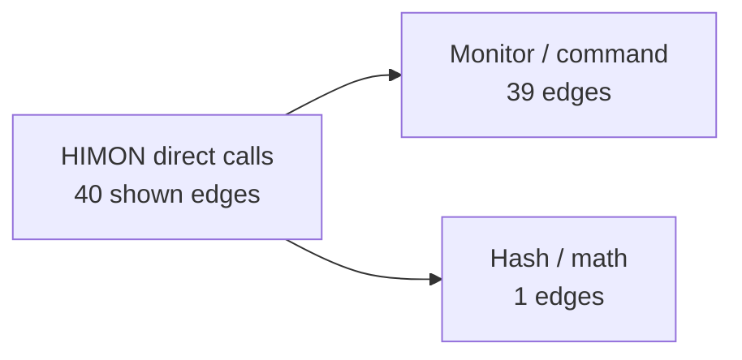
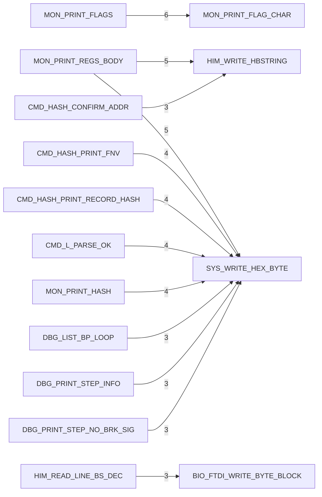
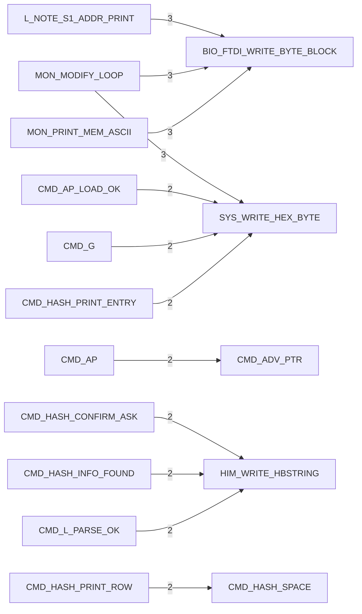
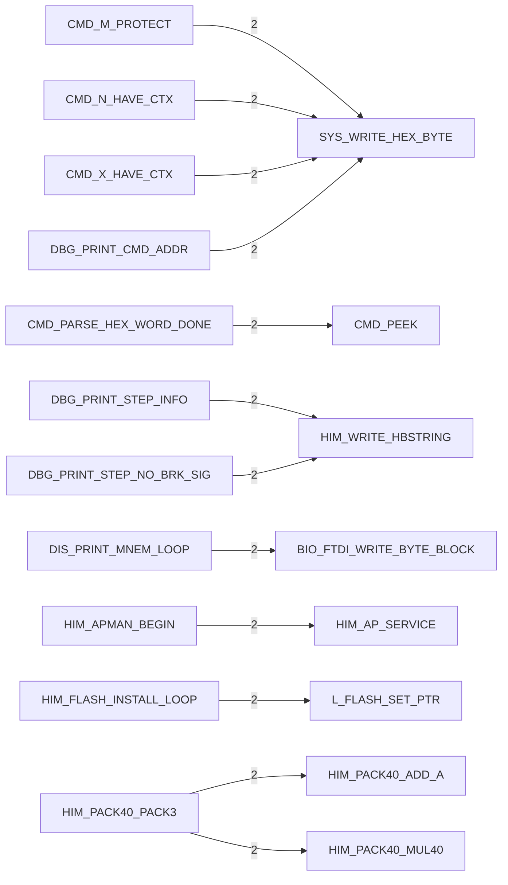
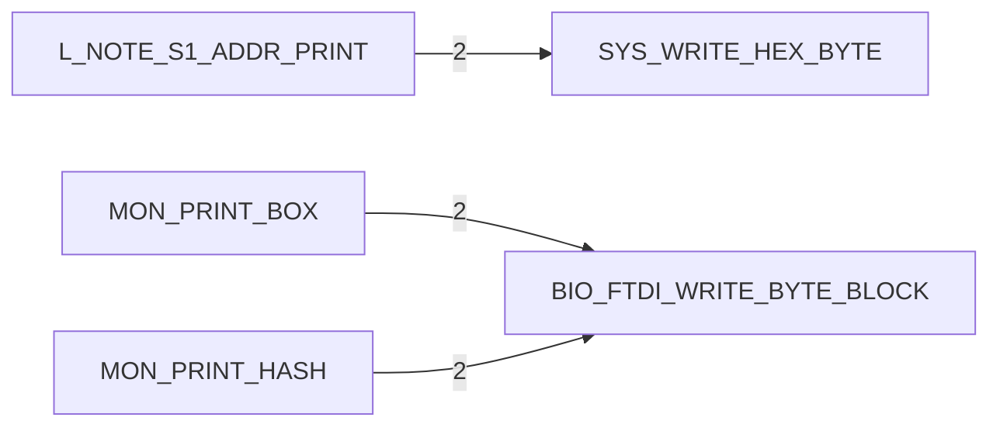

# R-YORS HIMON Routine Tree
<!-- AUTO-GENERATED by SRC/tools/gen_docs.ps1. Do not hand-edit. -->

Generated: 2026-09-16T11:10-05:00

Scope: operational HIMON source plus ROM support; excludes external STR8-N source, harnesses, proof apps, games, ACIA/PIA, and local generated-language images.

Tree scope: current HIMON source only (`HIMON/himon.asm`, HIMON includes, and resident `AP/*.inc`).

The 40 strongest direct edges are shown as a top-down family overview and short detail panels. Use `DOC/GENERATED/HIMON_EDGE_DUMP.md` for the full edge listing.

## Top-Down Overview

The overview groups the HIMON direct calls edges by source family. The detail panels retain every shown edge, with no Mermaid panel exceeding 12 edges.

```mermaid
flowchart LR
    MAP_ROOT_HIMON_DIRECT_CALLS["HIMON direct calls<br/>40 shown edges"] --> MAP_FAMILY_MONITOR___COMMAND["Monitor / command<br/>39 edges"]
    MAP_ROOT_HIMON_DIRECT_CALLS["HIMON direct calls<br/>40 shown edges"] --> MAP_FAMILY_HASH___MATH["Hash / math<br/>1 edges"]
```

## Family Detail

### Monitor / command (part 1 of 4)

```mermaid
flowchart LR
    N_MON_PRINT_FLAGS[MON_PRINT_FLAGS] -->|6| N_MON_PRINT_FLAG_CHAR[MON_PRINT_FLAG_CHAR]
    N_MON_PRINT_REGS_BODY[MON_PRINT_REGS_BODY] -->|5| N_HIM_WRITE_HBSTRING[HIM_WRITE_HBSTRING]
    N_MON_PRINT_REGS_BODY[MON_PRINT_REGS_BODY] -->|5| N_SYS_WRITE_HEX_BYTE[SYS_WRITE_HEX_BYTE]
    N_CMD_HASH_PRINT_FNV[CMD_HASH_PRINT_FNV] -->|4| N_SYS_WRITE_HEX_BYTE[SYS_WRITE_HEX_BYTE]
    N_CMD_HASH_PRINT_RECORD_HASH[CMD_HASH_PRINT_RECORD_HASH] -->|4| N_SYS_WRITE_HEX_BYTE[SYS_WRITE_HEX_BYTE]
    N_CMD_L_PARSE_OK[CMD_L_PARSE_OK] -->|4| N_SYS_WRITE_HEX_BYTE[SYS_WRITE_HEX_BYTE]
    N_MON_PRINT_HASH[MON_PRINT_HASH] -->|4| N_SYS_WRITE_HEX_BYTE[SYS_WRITE_HEX_BYTE]
    N_CMD_HASH_CONFIRM_ADDR[CMD_HASH_CONFIRM_ADDR] -->|3| N_HIM_WRITE_HBSTRING[HIM_WRITE_HBSTRING]
    N_DBG_LIST_BP_LOOP[DBG_LIST_BP_LOOP] -->|3| N_SYS_WRITE_HEX_BYTE[SYS_WRITE_HEX_BYTE]
    N_DBG_PRINT_STEP_INFO[DBG_PRINT_STEP_INFO] -->|3| N_SYS_WRITE_HEX_BYTE[SYS_WRITE_HEX_BYTE]
    N_DBG_PRINT_STEP_NO_BRK_SIG[DBG_PRINT_STEP_NO_BRK_SIG] -->|3| N_SYS_WRITE_HEX_BYTE[SYS_WRITE_HEX_BYTE]
    N_HIM_READ_LINE_BS_DEC[HIM_READ_LINE_BS_DEC] -->|3| N_BIO_FTDI_WRITE_BYTE_BLOCK[BIO_FTDI_WRITE_BYTE_BLOCK]
```

### Monitor / command (part 2 of 4)

```mermaid
flowchart LR
    N_L_NOTE_S1_ADDR_PRINT[L_NOTE_S1_ADDR_PRINT] -->|3| N_BIO_FTDI_WRITE_BYTE_BLOCK[BIO_FTDI_WRITE_BYTE_BLOCK]
    N_MON_MODIFY_LOOP[MON_MODIFY_LOOP] -->|3| N_BIO_FTDI_WRITE_BYTE_BLOCK[BIO_FTDI_WRITE_BYTE_BLOCK]
    N_MON_MODIFY_LOOP[MON_MODIFY_LOOP] -->|3| N_SYS_WRITE_HEX_BYTE[SYS_WRITE_HEX_BYTE]
    N_MON_PRINT_MEM_ASCII[MON_PRINT_MEM_ASCII] -->|3| N_BIO_FTDI_WRITE_BYTE_BLOCK[BIO_FTDI_WRITE_BYTE_BLOCK]
    N_CMD_AP[CMD_AP] -->|2| N_CMD_ADV_PTR[CMD_ADV_PTR]
    N_CMD_AP_LOAD_OK[CMD_AP_LOAD_OK] -->|2| N_SYS_WRITE_HEX_BYTE[SYS_WRITE_HEX_BYTE]
    N_CMD_G[CMD_G] -->|2| N_SYS_WRITE_HEX_BYTE[SYS_WRITE_HEX_BYTE]
    N_CMD_HASH_CONFIRM_ASK[CMD_HASH_CONFIRM_ASK] -->|2| N_HIM_WRITE_HBSTRING[HIM_WRITE_HBSTRING]
    N_CMD_HASH_INFO_FOUND[CMD_HASH_INFO_FOUND] -->|2| N_HIM_WRITE_HBSTRING[HIM_WRITE_HBSTRING]
    N_CMD_HASH_PRINT_ENTRY[CMD_HASH_PRINT_ENTRY] -->|2| N_SYS_WRITE_HEX_BYTE[SYS_WRITE_HEX_BYTE]
    N_CMD_HASH_PRINT_ROW[CMD_HASH_PRINT_ROW] -->|2| N_CMD_HASH_SPACE[CMD_HASH_SPACE]
    N_CMD_L_PARSE_OK[CMD_L_PARSE_OK] -->|2| N_HIM_WRITE_HBSTRING[HIM_WRITE_HBSTRING]
```

### Monitor / command (part 3 of 4)

```mermaid
flowchart LR
    N_CMD_M_PROTECT[CMD_M_PROTECT] -->|2| N_SYS_WRITE_HEX_BYTE[SYS_WRITE_HEX_BYTE]
    N_CMD_N_HAVE_CTX[CMD_N_HAVE_CTX] -->|2| N_SYS_WRITE_HEX_BYTE[SYS_WRITE_HEX_BYTE]
    N_CMD_PARSE_HEX_WORD_DONE[CMD_PARSE_HEX_WORD_DONE] -->|2| N_CMD_PEEK[CMD_PEEK]
    N_CMD_X_HAVE_CTX[CMD_X_HAVE_CTX] -->|2| N_SYS_WRITE_HEX_BYTE[SYS_WRITE_HEX_BYTE]
    N_DBG_PRINT_CMD_ADDR[DBG_PRINT_CMD_ADDR] -->|2| N_SYS_WRITE_HEX_BYTE[SYS_WRITE_HEX_BYTE]
    N_DBG_PRINT_STEP_INFO[DBG_PRINT_STEP_INFO] -->|2| N_HIM_WRITE_HBSTRING[HIM_WRITE_HBSTRING]
    N_DBG_PRINT_STEP_NO_BRK_SIG[DBG_PRINT_STEP_NO_BRK_SIG] -->|2| N_HIM_WRITE_HBSTRING[HIM_WRITE_HBSTRING]
    N_DIS_PRINT_MNEM_LOOP[DIS_PRINT_MNEM_LOOP] -->|2| N_BIO_FTDI_WRITE_BYTE_BLOCK[BIO_FTDI_WRITE_BYTE_BLOCK]
    N_HIM_APMAN_BEGIN[HIM_APMAN_BEGIN] -->|2| N_HIM_AP_SERVICE[HIM_AP_SERVICE]
    N_HIM_FLASH_INSTALL_LOOP[HIM_FLASH_INSTALL_LOOP] -->|2| N_L_FLASH_SET_PTR[L_FLASH_SET_PTR]
    N_HIM_PACK40_PACK3[HIM_PACK40_PACK3] -->|2| N_HIM_PACK40_ADD_A[HIM_PACK40_ADD_A]
    N_HIM_PACK40_PACK3[HIM_PACK40_PACK3] -->|2| N_HIM_PACK40_MUL40[HIM_PACK40_MUL40]
```

### Monitor / command (part 4 of 4)

```mermaid
flowchart LR
    N_L_NOTE_S1_ADDR_PRINT[L_NOTE_S1_ADDR_PRINT] -->|2| N_SYS_WRITE_HEX_BYTE[SYS_WRITE_HEX_BYTE]
    N_MON_PRINT_BOX[MON_PRINT_BOX] -->|2| N_BIO_FTDI_WRITE_BYTE_BLOCK[BIO_FTDI_WRITE_BYTE_BLOCK]
    N_MON_PRINT_HASH[MON_PRINT_HASH] -->|2| N_BIO_FTDI_WRITE_BYTE_BLOCK[BIO_FTDI_WRITE_BYTE_BLOCK]
```

### Hash / math

```mermaid
flowchart LR
    N_FNV1A_MUL_PRIME_FAST[FNV1A_MUL_PRIME_FAST] -->|4| N_MATH_ADD_TERM_TO_HASH[MATH_ADD_TERM_TO_HASH]
```
