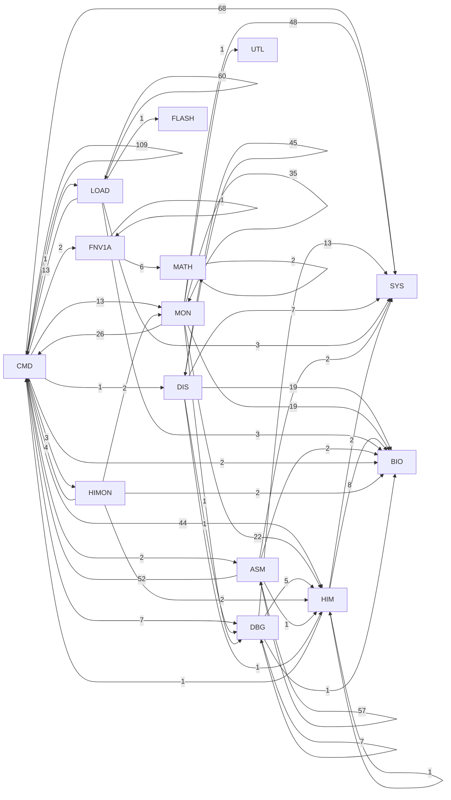

# R-YORS HIMON Support Map
<!-- AUTO-GENERATED by SRC/tools/gen_docs.ps1. Do not hand-edit. -->

Generated: 2026-05-05 23:55:20 -05:00

Scope: operational HIMON/STR8 source plus ROM support; excludes harnesses, proof apps, games, ACIA/PIA, and local generated-language images.

HIMON-only dependency map. This rolls current compatibility labels into HIMON and shows which support layers the monitor leans on.

