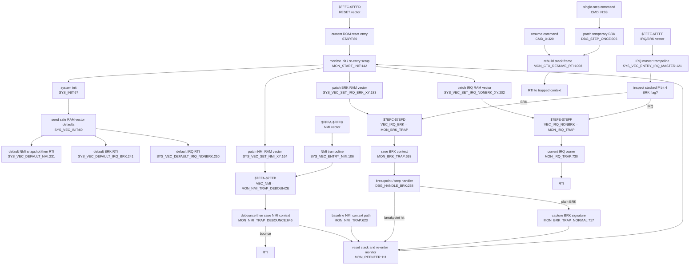

# R-YORS Interrupt Vector Map
<!-- AUTO-GENERATED by SRC/tools/gen_docs.ps1. Do not hand-edit. -->

Generated: 2026-05-15T14:47-05:00

Scope: operational HIMON/STR8 source plus ROM support; excludes harnesses, proof apps, games, ACIA/PIA, and local generated-language images.

Scope: current source-derived interrupt, vector trampoline, trap, resume, and on-the-fly vector patching map. This describes current HIMON plus the SYS vector layer; future STR8 vector ownership is design direction, not the current ROM behavior.

## Current Hardware Vector Policy

```text
$FFFA-$FFFB  NMI      -> SYS_VEC_ENTRY_NMI
$FFFC-$FFFD  RESET    -> START
$FFFE-$FFFF  IRQ/BRK  -> SYS_VEC_ENTRY_IRQ_MASTER

$7EF8-$7EF9  VEC_RESET target cell
$7EFA-$7EFB  VEC_NMI target cell
$7EFC-$7EFD  VEC_IRQ_BRK target cell
$7EFE-$7EFF  VEC_IRQ_NONBRK target cell
```

## Flow



## On-The-Fly Patch Contract

- `SYS_VEC_SET_*_XY` takes `X/Y = target low/high` and patches the matching RAM vector cell.
- The patch routines use `PHP`, `SEI`, write low/high bytes, then `PLP`; this makes the write atomic against normal IRQ arrival and restores the caller flags.
- `SEI` does not mask NMI. Do not patch the NMI target while an NMI can be asserted unless the board/system policy makes that safe.
- `SYS_VEC_ENTRY_IRQ_MASTER` preserves interrupted A/X while it checks stacked status bit 4 to split BRK from non-BRK IRQ.
- Current HIMON installs `MON_NMI_TRAP_DEBOUNCE`, `MON_BRK_TRAP`, and `MON_IRQ_TRAP` during `MON_START_INIT` after `SYS_INIT` seeds safe defaults. `MON_NMI_TRAP` remains the baseline non-debounced NMI path.
- Current non-BRK IRQ handling is intentionally tiny: `MON_IRQ_TRAP` just `RTI`s until a real IRQ owner patches the non-BRK vector.

## Source Labels

- `START`: HIMON/himon.asm:80
- `SYS_INIT`: ROM/dev/dev-adapter-core.asm:67
- `SYS_VEC_INIT`: ROM/dev/dev-adapter-vectors.asm:60
- `SYS_VEC_ENTRY_RESET`: ROM/dev/dev-adapter-vectors.asm:95
- `SYS_VEC_ENTRY_NMI`: ROM/dev/dev-adapter-vectors.asm:106
- `SYS_VEC_ENTRY_IRQ_MASTER`: ROM/dev/dev-adapter-vectors.asm:121
- `SYS_VEC_IRQ_MASTER_NONBRK`: ROM/dev/dev-adapter-vectors.asm:131
- `SYS_VEC_SET_RESET_XY`: ROM/dev/dev-adapter-vectors.asm:145
- `SYS_VEC_SET_NMI_XY`: ROM/dev/dev-adapter-vectors.asm:164
- `SYS_VEC_SET_IRQ_BRK_XY`: ROM/dev/dev-adapter-vectors.asm:183
- `SYS_VEC_SET_IRQ_NONBRK_XY`: ROM/dev/dev-adapter-vectors.asm:202
- `SYS_VEC_DEFAULT_RESET`: ROM/dev/dev-adapter-vectors.asm:220
- `SYS_VEC_DEFAULT_NMI`: ROM/dev/dev-adapter-vectors.asm:231
- `SYS_VEC_DEFAULT_IRQ_BRK`: ROM/dev/dev-adapter-vectors.asm:241
- `SYS_VEC_DEFAULT_IRQ_NONBRK`: ROM/dev/dev-adapter-vectors.asm:250
- `MON_REENTER`: HIMON/himon.asm:111
- `MON_START_INIT`: HIMON/himon.asm:142
- `MON_NMI_TRAP_DEBOUNCE`: HIMON/himon.asm:646
- `MON_NMI_DEBOUNCE_DELAY`: HIMON/himon.asm:681
- `MON_NMI_TRAP`: HIMON/himon.asm:623
- `MON_BRK_TRAP`: HIMON/himon.asm:693
- `MON_BRK_TRAP_NORMAL`: HIMON/himon.asm:717
- `MON_IRQ_TRAP`: HIMON/himon.asm:730
- `MON_CTX_RESUME_RTI`: HIMON/himon.asm:1008
- `DBG_HANDLE_BRK`: HIMON/himon-debug.inc:238
- `DBG_HANDLE_BRK_HIT`: HIMON/himon-debug.inc:291
- `DBG_HANDLE_BRK_NONE`: HIMON/himon-debug.inc:302
- `DBG_STEP_ONCE`: HIMON/himon-debug.inc:306
- `CMD_X`: HIMON/himon.asm:320
- `CMD_N`: HIMON/himon-debug.inc:98

## Routine Headers

- `SYS_INIT` [HASH:0683DF55]: ROM/dev/dev-adapter-core.asm:57 - Device-neutral initialization entry point.
- `SYS_VEC_INIT` [HASH:C5FE6C62]: ROM/dev/dev-adapter-vectors.asm:50 - Seed patchable vector cells with safe default handlers.
- `SYS_VEC_ENTRY_RESET` [HASH:4EA53CFC]: ROM/dev/dev-adapter-vectors.asm:88 - RESET vector entry stub. Jumps through patchable RESET target.
- `SYS_VEC_ENTRY_NMI` [HASH:F8F789CB]: ROM/dev/dev-adapter-vectors.asm:99 - NMI vector entry stub. Jumps through patchable NMI target.
- `SYS_VEC_ENTRY_IRQ_MASTER` [HASH:72D99F9C]: ROM/dev/dev-adapter-vectors.asm:110 - IRQ master dispatch. Splits BRK vs non-BRK and jumps via patchable
- `SYS_VEC_SET_RESET_XY` [HASH:90CB06AA]: ROM/dev/dev-adapter-vectors.asm:137 - Atomically patch RESET target vector.
- `SYS_VEC_SET_NMI_XY` [HASH:2EEF6FC3]: ROM/dev/dev-adapter-vectors.asm:156 - Atomically patch NMI target vector.
- `SYS_VEC_SET_IRQ_BRK_XY` [HASH:0DFCEEC3]: ROM/dev/dev-adapter-vectors.asm:175 - Atomically patch IRQ BRK breakout target vector.
- `SYS_VEC_SET_IRQ_NONBRK_XY` [HASH:14E4B2B4]: ROM/dev/dev-adapter-vectors.asm:194 - Atomically patch IRQ non-BRK breakout target vector.
- `SYS_VEC_DEFAULT_RESET` [HASH:DE3C6189]: ROM/dev/dev-adapter-vectors.asm:213 - Fail-safe default RESET target until board-specific patching.
- `SYS_VEC_DEFAULT_NMI` [HASH:B589D492]: ROM/dev/dev-adapter-vectors.asm:226 - Default NMI target: enter debug snapshot, then return from NMI.
- `SYS_VEC_DEFAULT_IRQ_BRK` [HASH:BC9E454E]: ROM/dev/dev-adapter-vectors.asm:236 - Default BRK breakout target: return until monitor patch is installed.
- `SYS_VEC_DEFAULT_IRQ_NONBRK` [HASH:777DCE1D]: ROM/dev/dev-adapter-vectors.asm:245 - Default non-BRK IRQ breakout target: return until IRQ owner patches.
