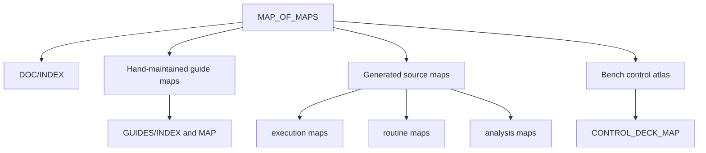
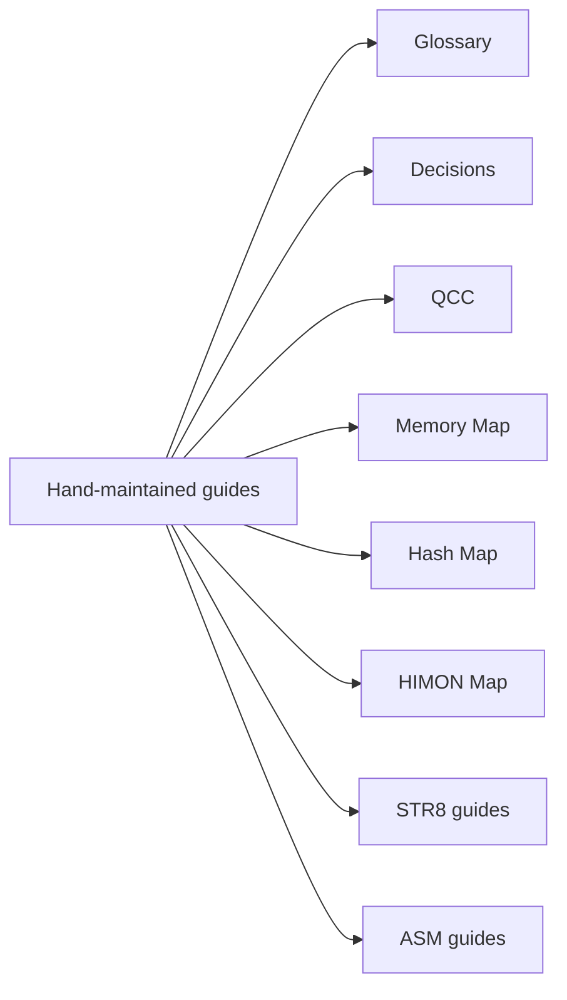
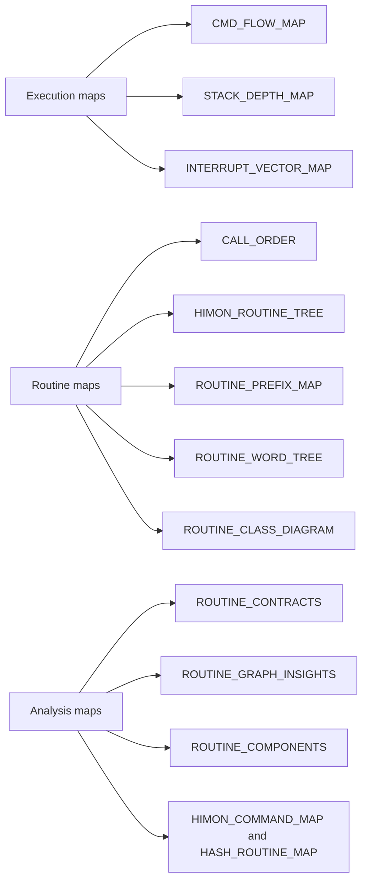

# R-YORS Map Of Maps
<!-- AUTO-GENERATED by SRC/tools/gen_docs.ps1. Do not hand-edit. -->

Generated: 2026-07-20T21:26-05:00

Scope: operational HIMON/STR8 source plus ROM support; excludes harnesses, proof apps, games, ACIA/PIA, and local generated-language images.

Scope: atlas for map-shaped R-YORS documentation. Guide maps are hand-maintained design/navigation maps; generated maps are source-derived and refreshed by `make -C SRC docs`.

## Quick Choice

| Need | Open | Why |
| --- | --- | --- |
| Start reading | [DOC/INDEX.md](../INDEX.md), [GUIDES/INDEX.md](../GUIDES/INDEX.md), [GUIDES/TOC.md](../GUIDES/TOC.md) | Entry points and reading order. |
| See where documents fit | [GUIDES/MAP.md](../GUIDES/MAP.md) | Hand-maintained guide/system map. |
| Check vocabulary before naming something | [GUIDES/GLOSSARY.md](../GUIDES/GLOSSARY.md) | Project terminology contract. |
| Check settled calls | [GUIDES/DECISIONS.md](../GUIDES/DECISIONS.md) | Decisions that should not reopen accidentally. |
| Explore unsettled design thinking | [GUIDES/QCC.md](../GUIDES/QCC/INDEX.md) | Questions, Comments, Concerns index. |
| Understand memory and flash ranges | [GUIDES/MEMORY_MAP.md](../GUIDES/MEMORY/MEMORY_MAP.md) | Current RAM/ROM/flash ownership. |
| Follow active control blocks and AP working areas | [CONTROL_DECK_MAP.md](./CONTROL_DECK_MAP.md) | Deck Plan: LRS, AIR, FTC, RFD/RTC/RPT, RSC, and planned BPB. |
| Understand hash meanings | [GUIDES/HASH_MAP.md](../GUIDES/HASH/HASH_MAP.md) | Hash concepts, widths, records, and catalog direction. |
| Understand HIMON subsystems | [GUIDES/HIMON_MAP.md](../GUIDES/HIMON/HIMON_MAP.md) | Curated monitor capability and subsystem maps. |
| Understand command dispatch flow | [CMD_FLOW_MAP.md](./CMD_FLOW_MAP.md) | Prompt, hash, resolve, run, return. |
| Check stack depth by command/routine | [STACK_DEPTH_MAP.md](./STACK_DEPTH_MAP.md) | Source-derived HIMON and STR8 stack high-water paths. |
| Understand interrupts and vector patching | [INTERRUPT_VECTOR_MAP.md](./INTERRUPT_VECTOR_MAP.md) | Reset/NMI/IRQ/BRK trampolines, RAM vectors, traps, and `RTI` resume. |
| See hash-involved source labels | [HASH_ROUTINE_MAP.md](./HASH_ROUTINE_MAP.md) | `CMD_HASH*`, `FNV1A_*`, and related edges. |
| See command/debug/load/ASM calls | [HIMON_COMMAND_MAP.md](./HIMON_COMMAND_MAP.md) | Compact source-derived HIMON command map. |
| See whole HIMON call tree | [HIMON_ROUTINE_TREE.md](./HIMON_ROUTINE_TREE.md) | Current HIMON source-only direct edge tree. |
| See support-layer dependencies | [HIMON_SUPPORT_MAP.md](./HIMON_SUPPORT_MAP.md) | HIMON-only prefix dependency map. |
| See all operational prefix groups | [ROUTINE_PREFIX_MAP.md](./ROUTINE_PREFIX_MAP.md) | Operational source prefix map with counts. |
| See underscore-word routine hierarchy | [ROUTINE_WORD_TREE.md](./ROUTINE_WORD_TREE.md) | Callable-ish symbols grouped by name words between `_`. |
| See class-level call shape | [ROUTINE_CLASS_DIAGRAM.md](./ROUTINE_CLASS_DIAGRAM.md) | Compact prefix/class edge diagram. |
| See routine inventory and contracts | [CALL_ORDER.md](./CALL_ORDER.md), [ROUTINE_CONTRACTS.md](./ROUTINE_CONTRACTS.md) | Source order and routine contracts. |
| See graph statistics | [ROUTINE_GRAPH_INSIGHTS.md](./ROUTINE_GRAPH_INSIGHTS.md), [ROUTINE_COMPONENTS.md](./ROUTINE_COMPONENTS.md) | Hot callees, busy callers, component counts. |

## Map Families: Top Level

### Guide Map Family

### Generated Source Map Family

## Freshness

- Generated maps are refreshed by `make -C SRC docs`.
- Individual generated maps can be refreshed with targets such as `make -C SRC control-deck-map`, `make -C SRC stack-depth-map`, `make -C SRC cmd-flow-map`, `make -C SRC hash-routine-map`, `make -C SRC routine-prefix-map`, or `make -C SRC routine-word-tree`.
- Guide maps are design/reference documents. They should be updated when terminology, policy, or document roles change.

## Boundaries

- Generated source maps use the operational HIMON/STR8 source set and ROM support code.
- Legacy demos, harnesses, games, ACIA/PIA, and local generated-language images stay out of generated operational maps.
- A map may mention a compatibility label when the source still uses it, but map-facing vocabulary should prefer current HIMON/STR8/R-YORS terms.
