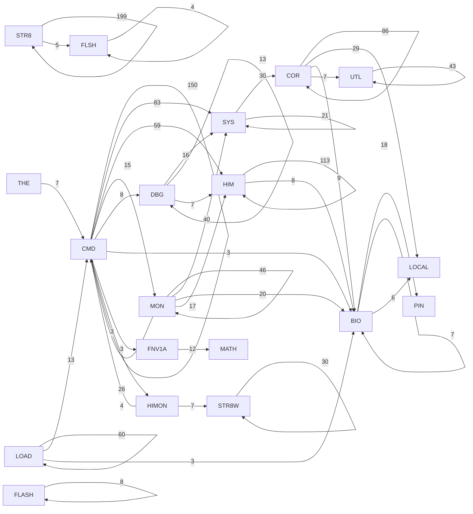

# R-YORS Routine Class Diagram
<!-- AUTO-GENERATED by SRC/tools/gen_docs.ps1. Do not hand-edit. -->

Generated: 2026-07-18T20:10-05:00

Scope: operational HIMON/STR8 source plus ROM support; excludes harnesses, proof apps, games, ACIA/PIA, and local generated-language images.

Renderable graph is capped to the strongest 40 prefix edges. Use `ROUTINE_GRAPH_INSIGHTS.md` and the raw edge dumps for the complete graph.

