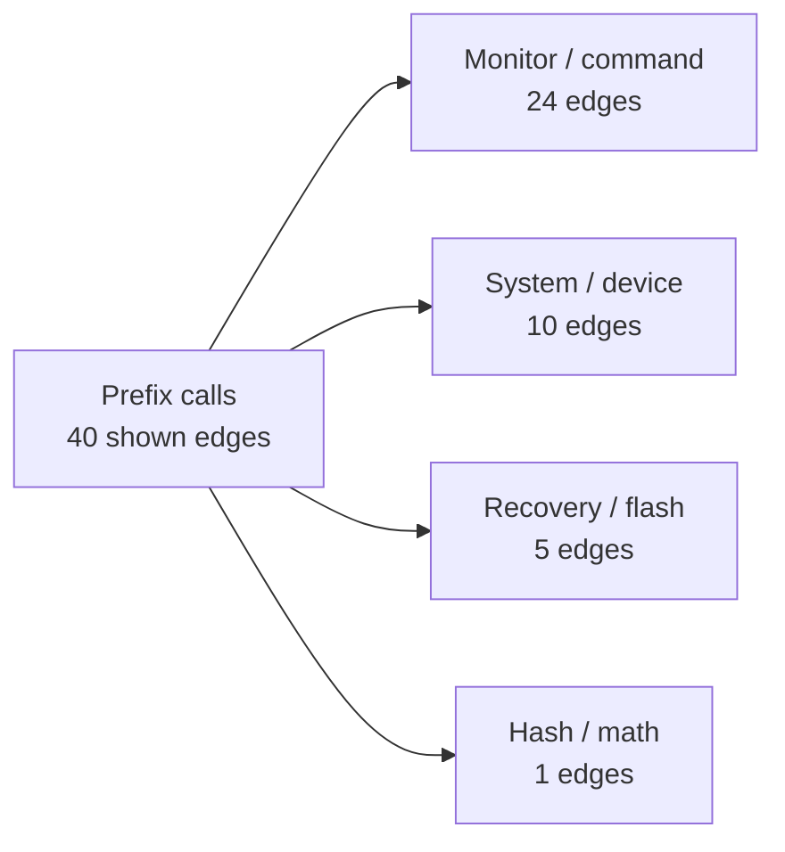
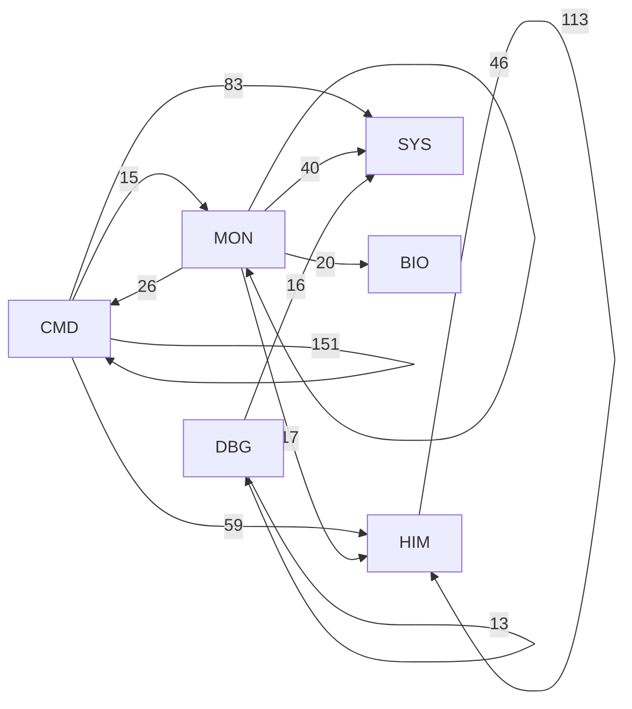
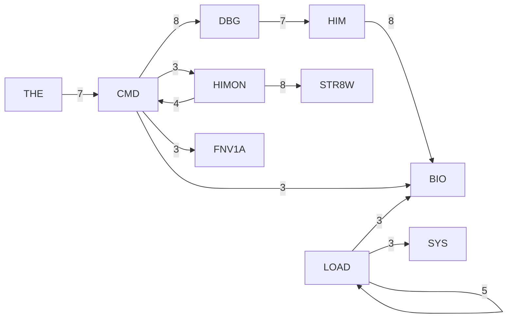
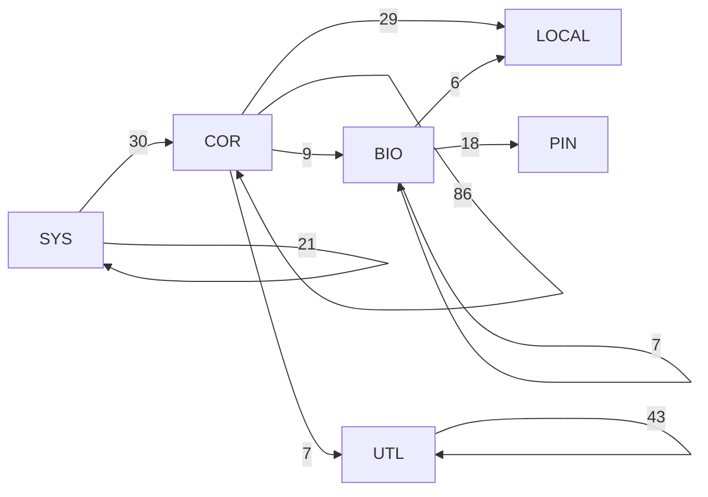
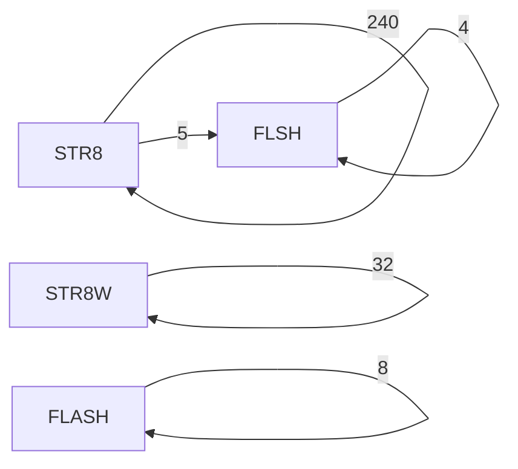
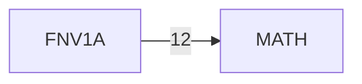

# R-YORS Routine Class Diagram
<!-- AUTO-GENERATED by SRC/tools/gen_docs.ps1. Do not hand-edit. -->

Generated: 2026-07-20T21:26-05:00

Scope: operational HIMON/STR8 source plus ROM support; excludes harnesses, proof apps, games, ACIA/PIA, and local generated-language images.

The 40 strongest prefix edges are shown as a top-down family overview and short detail panels. Use `ROUTINE_GRAPH_INSIGHTS.md` and the raw edge dumps for the complete graph.

## Top-Down Overview

The overview groups the Prefix calls edges by source family. The detail panels retain every shown edge, with no Mermaid panel exceeding 12 edges.

## Family Detail

### Monitor / command (part 1 of 2)

### Monitor / command (part 2 of 2)

### System / device

### Recovery / flash

### Hash / math

