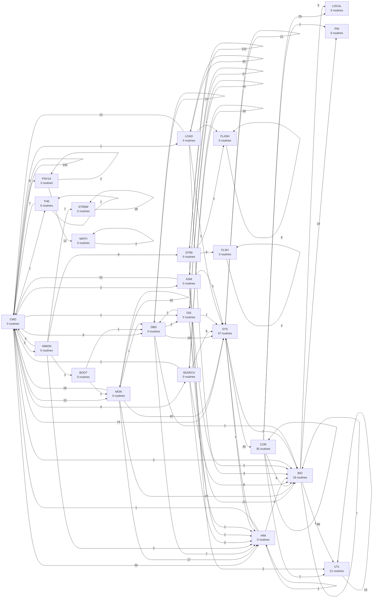

# R-YORS Routine Prefix Map
<!-- AUTO-GENERATED by SRC/tools/gen_docs.ps1. Do not hand-edit. -->

Generated: 2026-05-25T20:39-05:00

Scope: operational HIMON/STR8 source plus ROM support; excludes harnesses, proof apps, games, ACIA/PIA, and local generated-language images.

Prefix map over the operational source set. Node counts are routine headers; edge counts are direct `JSR`/`JMP` sites grouped by prefix.

