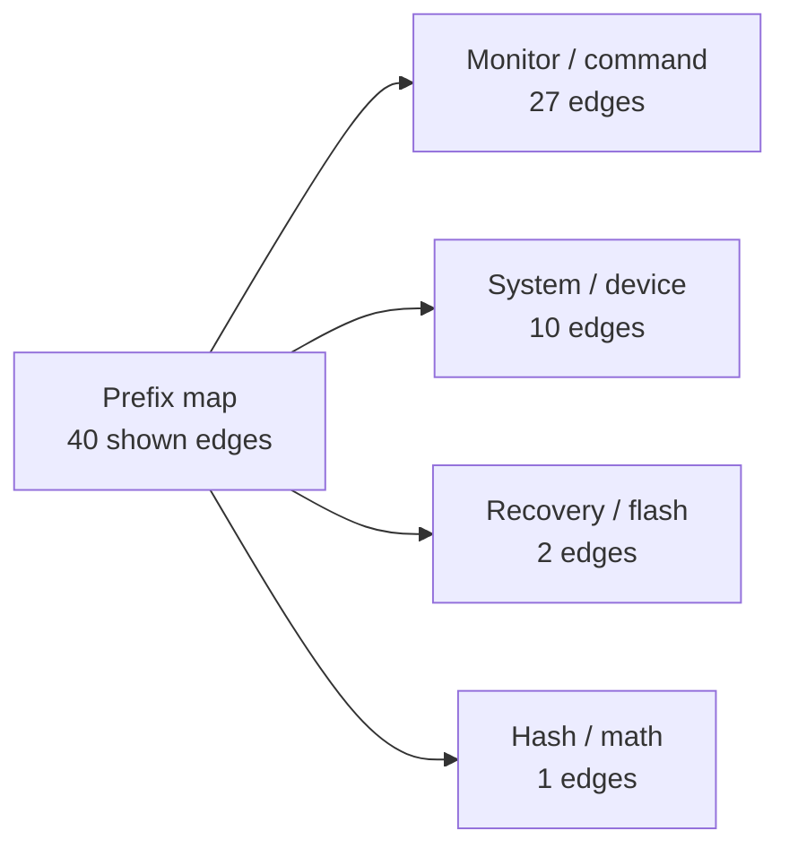
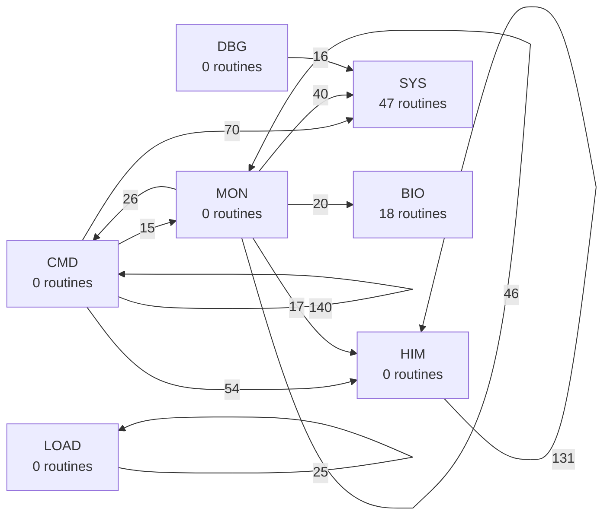
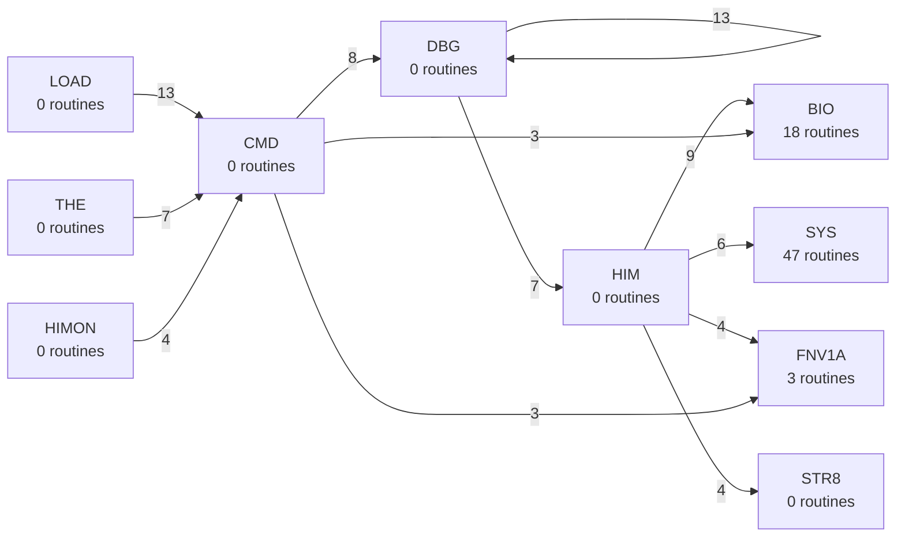
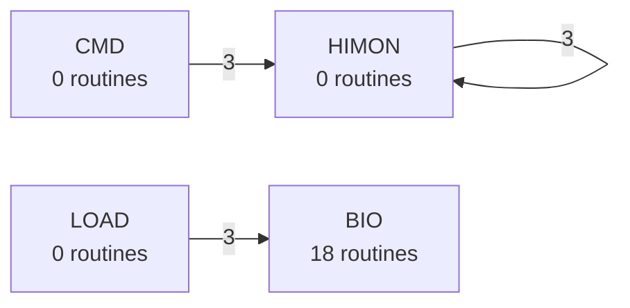
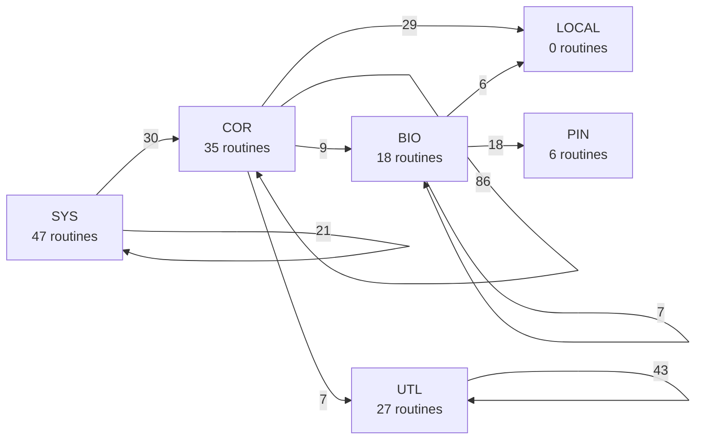
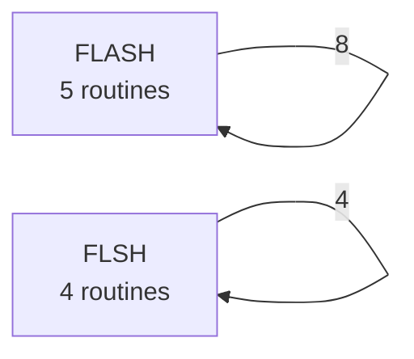
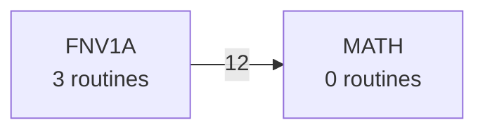

# R-YORS Routine Prefix Map
<!-- AUTO-GENERATED by SRC/tools/gen_docs.ps1. Do not hand-edit. -->

Generated: 2026-08-20T19:39-05:00

Scope: operational HIMON source plus ROM support; excludes external STR8-N source, harnesses, proof apps, games, ACIA/PIA, and local generated-language images.

Prefix map over the operational source set. Node counts are routine headers; edge counts are direct `JSR`/`JMP` sites grouped by prefix.

The 40 strongest prefix edges are shown as a top-down family overview and short detail panels.

## Top-Down Overview

The overview groups the Prefix map edges by source family. The detail panels retain every shown edge, with no Mermaid panel exceeding 12 edges.

```mermaid
flowchart LR
    MAP_ROOT_PREFIX_MAP["Prefix map<br/>40 shown edges"] --> MAP_FAMILY_MONITOR___COMMAND["Monitor / command<br/>27 edges"]
    MAP_ROOT_PREFIX_MAP["Prefix map<br/>40 shown edges"] --> MAP_FAMILY_SYSTEM___DEVICE["System / device<br/>10 edges"]
    MAP_ROOT_PREFIX_MAP["Prefix map<br/>40 shown edges"] --> MAP_FAMILY_RECOVERY___FLASH["Recovery / flash<br/>2 edges"]
    MAP_ROOT_PREFIX_MAP["Prefix map<br/>40 shown edges"] --> MAP_FAMILY_HASH___MATH["Hash / math<br/>1 edges"]
```

## Family Detail

### Monitor / command (part 1 of 3)

```mermaid
flowchart LR
    P_CMD["CMD<br/>0 routines"] -->|140| P_CMD["CMD<br/>0 routines"]
    P_HIM["HIM<br/>0 routines"] -->|131| P_HIM["HIM<br/>0 routines"]
    P_CMD["CMD<br/>0 routines"] -->|70| P_SYS["SYS<br/>47 routines"]
    P_CMD["CMD<br/>0 routines"] -->|54| P_HIM["HIM<br/>0 routines"]
    P_MON["MON<br/>0 routines"] -->|46| P_MON["MON<br/>0 routines"]
    P_MON["MON<br/>0 routines"] -->|40| P_SYS["SYS<br/>47 routines"]
    P_MON["MON<br/>0 routines"] -->|26| P_CMD["CMD<br/>0 routines"]
    P_LOAD["LOAD<br/>0 routines"] -->|25| P_LOAD["LOAD<br/>0 routines"]
    P_MON["MON<br/>0 routines"] -->|20| P_BIO["BIO<br/>18 routines"]
    P_MON["MON<br/>0 routines"] -->|17| P_HIM["HIM<br/>0 routines"]
    P_DBG["DBG<br/>0 routines"] -->|16| P_SYS["SYS<br/>47 routines"]
    P_CMD["CMD<br/>0 routines"] -->|15| P_MON["MON<br/>0 routines"]
```

### Monitor / command (part 2 of 3)

```mermaid
flowchart LR
    P_DBG["DBG<br/>0 routines"] -->|13| P_DBG["DBG<br/>0 routines"]
    P_LOAD["LOAD<br/>0 routines"] -->|13| P_CMD["CMD<br/>0 routines"]
    P_HIM["HIM<br/>0 routines"] -->|9| P_BIO["BIO<br/>18 routines"]
    P_CMD["CMD<br/>0 routines"] -->|8| P_DBG["DBG<br/>0 routines"]
    P_DBG["DBG<br/>0 routines"] -->|7| P_HIM["HIM<br/>0 routines"]
    P_THE["THE<br/>0 routines"] -->|7| P_CMD["CMD<br/>0 routines"]
    P_HIM["HIM<br/>0 routines"] -->|6| P_SYS["SYS<br/>47 routines"]
    P_HIM["HIM<br/>0 routines"] -->|4| P_FNV1A["FNV1A<br/>3 routines"]
    P_HIM["HIM<br/>0 routines"] -->|4| P_STR8["STR8<br/>0 routines"]
    P_HIMON["HIMON<br/>0 routines"] -->|4| P_CMD["CMD<br/>0 routines"]
    P_CMD["CMD<br/>0 routines"] -->|3| P_BIO["BIO<br/>18 routines"]
    P_CMD["CMD<br/>0 routines"] -->|3| P_FNV1A["FNV1A<br/>3 routines"]
```

### Monitor / command (part 3 of 3)

```mermaid
flowchart LR
    P_CMD["CMD<br/>0 routines"] -->|3| P_HIMON["HIMON<br/>0 routines"]
    P_HIMON["HIMON<br/>0 routines"] -->|3| P_HIMON["HIMON<br/>0 routines"]
    P_LOAD["LOAD<br/>0 routines"] -->|3| P_BIO["BIO<br/>18 routines"]
```

### System / device

```mermaid
flowchart LR
    P_COR["COR<br/>35 routines"] -->|86| P_COR["COR<br/>35 routines"]
    P_UTL["UTL<br/>27 routines"] -->|43| P_UTL["UTL<br/>27 routines"]
    P_SYS["SYS<br/>47 routines"] -->|30| P_COR["COR<br/>35 routines"]
    P_COR["COR<br/>35 routines"] -->|29| P_LOCAL["LOCAL<br/>0 routines"]
    P_SYS["SYS<br/>47 routines"] -->|21| P_SYS["SYS<br/>47 routines"]
    P_BIO["BIO<br/>18 routines"] -->|18| P_PIN["PIN<br/>6 routines"]
    P_COR["COR<br/>35 routines"] -->|9| P_BIO["BIO<br/>18 routines"]
    P_BIO["BIO<br/>18 routines"] -->|7| P_BIO["BIO<br/>18 routines"]
    P_COR["COR<br/>35 routines"] -->|7| P_UTL["UTL<br/>27 routines"]
    P_BIO["BIO<br/>18 routines"] -->|6| P_LOCAL["LOCAL<br/>0 routines"]
```

### Recovery / flash

```mermaid
flowchart LR
    P_FLASH["FLASH<br/>5 routines"] -->|8| P_FLASH["FLASH<br/>5 routines"]
    P_FLSH["FLSH<br/>4 routines"] -->|4| P_FLSH["FLSH<br/>4 routines"]
```

### Hash / math

```mermaid
flowchart LR
    P_FNV1A["FNV1A<br/>3 routines"] -->|12| P_MATH["MATH<br/>0 routines"]
```
