# R-YORS Routine Word Tree
<!-- AUTO-GENERATED by SRC/tools/gen_docs.ps1. Do not hand-edit. -->

Generated: 2026-05-25T23:49-05:00

Scope: operational HIMON/STR8 source plus ROM support; excludes harnesses, proof apps, games, ACIA/PIA, and local generated-language images.

Hierarchy over callable-ish source symbols, split on `_`. Symbols come from routine headers and direct `JSR`/`JMP` source/target names in the operational source set.

The Mermaid graph keeps branches with at least two symbols, plus all root words. Edges are name containment, not call edges.

```mermaid
flowchart TD
    RW_ROOT["ROUTINES<br/>679 symbols"]
    RW_ROOT --> RW_CMD["CMD<br/>135"]
    RW_ROOT --> RW_STR8["STR8<br/>91"]
    RW_ROOT --> RW_ASM["ASM<br/>68"]
    RW_ROOT --> RW_MON["MON<br/>61"]
    RW_ROOT --> RW_SYS["SYS<br/>55"]
    RW_ROOT --> RW_L["L<br/>41"]
    RW_ROOT --> RW_COR["COR<br/>35"]
    RW_ROOT --> RW_DIS["DIS<br/>32"]
    RW_ROOT --> RW_SEARCH["SEARCH<br/>31"]
    RW_ROOT --> RW_DBG["DBG<br/>22"]
    RW_ROOT --> RW_UTL["UTL<br/>21"]
    RW_ROOT --> RW_BIO["BIO<br/>18"]
    RW_ROOT --> RW_STR8W["STR8W<br/>18"]
    RW_ROOT --> RW_HIM["HIM<br/>11"]
    RW_ROOT --> RW_FLASH["FLASH<br/>8"]
    RW_ROOT --> RW_FNV1A["FNV1A<br/>8"]
    RW_ROOT --> RW_PIN["PIN<br/>6"]
    RW_ROOT --> RW_THE["THE<br/>6"]
    RW_ROOT --> RW_MATH["MATH<br/>5"]
    RW_ROOT --> RW_FLSH["FLSH<br/>3"]
    RW_ROOT --> RW_MAIN["MAIN<br/>2"]
    RW_ROOT --> RW_BOOT["BOOT<br/>1"]
    RW_ROOT --> RW_START["START<br/>1"]
    RW_ASM --> RW_ASM_ACCEPT["ACCEPT<br/>32"]
    RW_ASM --> RW_ASM_PARSE["PARSE<br/>22"]
    RW_ASM --> RW_ASM_EMIT["EMIT<br/>4"]
    RW_ASM --> RW_ASM_FIND["FIND<br/>3"]
    RW_ASM --> RW_ASM_READ["READ<br/>3"]
    RW_BIO --> RW_BIO_FTDI["FTDI<br/>16"]
    RW_BIO --> RW_BIO_WRITE["WRITE<br/>2"]
    RW_CMD --> RW_CMD_HASH["HASH<br/>39"]
    RW_CMD --> RW_CMD_L["L<br/>19"]
    RW_CMD --> RW_CMD_USAGE["USAGE<br/>13"]
    RW_CMD --> RW_CMD_PARSE["PARSE<br/>10"]
    RW_CMD --> RW_CMD_D["D<br/>7"]
    RW_CMD --> RW_CMD_QUOTE["QUOTE<br/>7"]
    RW_CMD --> RW_CMD_B["B<br/>5"]
    RW_CMD --> RW_CMD_DISPATCH["DISPATCH<br/>5"]
    RW_CMD --> RW_CMD_SKIP["SKIP<br/>3"]
    RW_CMD --> RW_CMD_A["A<br/>2"]
    RW_CMD --> RW_CMD_N["N<br/>2"]
    RW_CMD --> RW_CMD_R["R<br/>2"]
    RW_CMD --> RW_CMD_SAVE["SAVE<br/>2"]
    RW_CMD --> RW_CMD_SEARCH["SEARCH<br/>2"]
    RW_CMD --> RW_CMD_U["U<br/>2"]
    RW_CMD --> RW_CMD_X["X<br/>2"]
    RW_COR --> RW_COR_FTDI["FTDI<br/>35"]
    RW_DBG --> RW_DBG_PRINT["PRINT<br/>4"]
    RW_DBG --> RW_DBG_STEP["STEP<br/>4"]
    RW_DBG --> RW_DBG_CLEAR["CLEAR<br/>3"]
    RW_DBG --> RW_DBG_FIND["FIND<br/>2"]
    RW_DBG --> RW_DBG_HANDLE["HANDLE<br/>2"]
    RW_DBG --> RW_DBG_LIST["LIST<br/>2"]
    RW_DBG --> RW_DBG_REQUIRE["REQUIRE<br/>2"]
    RW_DIS --> RW_DIS_OPER["OPER<br/>21"]
    RW_DIS --> RW_DIS_PRINT["PRINT<br/>8"]
    RW_DIS --> RW_DIS_WRITE["WRITE<br/>3"]
    RW_FLASH --> RW_FLASH_SECTOR["SECTOR<br/>2"]
    RW_FLASH --> RW_FLASH_WRITE["WRITE<br/>2"]
    RW_FLSH --> RW_FLSH_BANK["BANK<br/>2"]
    RW_FNV1A --> RW_FNV1A_MUL["MUL<br/>2"]
    RW_FNV1A --> RW_FNV1A_UPDATE["UPDATE<br/>2"]
    RW_HIM --> RW_HIM_READ["READ<br/>6"]
    RW_HIM --> RW_HIM_WRITE["WRITE<br/>3"]
    RW_L --> RW_L_PARSE["PARSE<br/>28"]
    RW_L --> RW_L_WRITE["WRITE<br/>7"]
    RW_L --> RW_L_NOTE["NOTE<br/>2"]
    RW_MATH --> RW_MATH_ADD["ADD<br/>2"]
    RW_MON --> RW_MON_PRINT["PRINT<br/>27"]
    RW_MON --> RW_MON_CTX["CTX<br/>11"]
    RW_MON --> RW_MON_BOOTLOG["BOOTLOG<br/>4"]
    RW_MON --> RW_MON_MODIFY["MODIFY<br/>4"]
    RW_MON --> RW_MON_NMI["NMI<br/>3"]
    RW_MON --> RW_MON_BRK["BRK<br/>2"]
    RW_MON --> RW_MON_CLEAR["CLEAR<br/>2"]
    RW_MON --> RW_MON_CURR["CURR<br/>2"]
    RW_PIN --> RW_PIN_FTDI["FTDI<br/>6"]
    RW_SEARCH --> RW_SEARCH_SCAN["SCAN<br/>5"]
    RW_SEARCH --> RW_SEARCH_PARSE["PARSE<br/>4"]
    RW_SEARCH --> RW_SEARCH_PATTERN["PATTERN<br/>4"]
    RW_SEARCH --> RW_SEARCH_PRINT["PRINT<br/>4"]
    RW_SEARCH --> RW_SEARCH_MATCH["MATCH<br/>3"]
    RW_SEARCH --> RW_SEARCH_ROW["ROW<br/>3"]
    RW_SEARCH --> RW_SEARCH_SKIP["SKIP<br/>2"]
    RW_STR8 --> RW_STR8_CMD["CMD<br/>16"]
    RW_STR8 --> RW_STR8_PRINT["PRINT<br/>13"]
    RW_STR8 --> RW_STR8_S19["S19<br/>7"]
    RW_STR8 --> RW_STR8_CON["CON<br/>6"]
    RW_STR8 --> RW_STR8_COPY["COPY<br/>5"]
    RW_STR8 --> RW_STR8_IVY["IVY<br/>5"]
    RW_STR8 --> RW_STR8_READ["READ<br/>4"]
    RW_STR8 --> RW_STR8_STAGE["STAGE<br/>4"]
    RW_STR8 --> RW_STR8_WRITE["WRITE<br/>4"]
    RW_STR8 --> RW_STR8_PROGRAM["PROGRAM<br/>3"]
    RW_STR8 --> RW_STR8_BOOT["BOOT<br/>2"]
    RW_STR8 --> RW_STR8_CFG["CFG<br/>2"]
    RW_STR8 --> RW_STR8_ENTER["ENTER<br/>2"]
    RW_STR8W --> RW_STR8W_ACTIVE["ACTIVE<br/>2"]
    RW_STR8W --> RW_STR8W_COPY["COPY<br/>2"]
    RW_STR8W --> RW_STR8W_FLASH["FLASH<br/>2"]
    RW_STR8W --> RW_STR8W_PROGRAM["PROGRAM<br/>2"]
    RW_SYS --> RW_SYS_READ["READ<br/>14"]
    RW_SYS --> RW_SYS_VEC["VEC<br/>13"]
    RW_SYS --> RW_SYS_WRITE["WRITE<br/>11"]
    RW_SYS --> RW_SYS_RCCE["RCCE<br/>6"]
    RW_SYS --> RW_SYS_POLL["POLL<br/>2"]
    RW_SYS --> RW_SYS_PRINT["PRINT<br/>2"]
    RW_SYS --> RW_SYS_RD["RD<br/>2"]
    RW_THE --> RW_THE_JOIN["JOIN<br/>6"]
    RW_UTL --> RW_UTL_CHAR["CHAR<br/>10"]
    RW_UTL --> RW_UTL_HEX["HEX<br/>4"]
    RW_UTL --> RW_UTL_ADDR16["ADDR16<br/>2"]
    RW_UTL --> RW_UTL_FIND["FIND<br/>2"]
    RW_UTL --> RW_UTL_GET["GET<br/>2"]
    RW_ASM_ACCEPT --> RW_ASM_ACCEPT_ZP["ZP<br/>7"]
    RW_ASM_ACCEPT --> RW_ASM_ACCEPT_ABS["ABS<br/>4"]
    RW_ASM_ACCEPT --> RW_ASM_ACCEPT_ABSX["ABSX<br/>4"]
    RW_ASM_ACCEPT --> RW_ASM_ACCEPT_ZPX["ZPX<br/>4"]
    RW_ASM_ACCEPT --> RW_ASM_ACCEPT_ABSY["ABSY<br/>2"]
    RW_ASM_ACCEPT --> RW_ASM_ACCEPT_BRK["BRK<br/>2"]
    RW_ASM_ACCEPT --> RW_ASM_ACCEPT_FAIL["FAIL<br/>2"]
    RW_ASM_ACCEPT --> RW_ASM_ACCEPT_OK["OK<br/>2"]
    RW_ASM_ACCEPT --> RW_ASM_ACCEPT_REL["REL<br/>2"]
    RW_ASM_ACCEPT --> RW_ASM_ACCEPT_ZPY["ZPY<br/>2"]
    RW_ASM_FIND --> RW_ASM_FIND_OPCODE["OPCODE<br/>2"]
    RW_ASM_PARSE --> RW_ASM_PARSE_PAREN["PAREN<br/>8"]
    RW_ASM_PARSE --> RW_ASM_PARSE_NUM["NUM<br/>6"]
    RW_ASM_PARSE --> RW_ASM_PARSE_HEX["HEX<br/>3"]
    RW_ASM_PARSE --> RW_ASM_PARSE_IMM["IMM<br/>2"]
    RW_ASM_READ --> RW_ASM_READ_MNEM["MNEM<br/>3"]
    RW_BIO_FTDI --> RW_BIO_FTDI_READ["READ<br/>3"]
    RW_BIO_FTDI --> RW_BIO_FTDI_WRITE["WRITE<br/>3"]
    RW_BIO_FTDI --> RW_BIO_FTDI_FLUSH["FLUSH<br/>2"]
    RW_BIO_FTDI --> RW_BIO_FTDI_POLL["POLL<br/>2"]
    RW_CMD_D --> RW_CMD_D_SAVE["SAVE<br/>2"]
    RW_CMD_DISPATCH --> RW_CMD_DISPATCH_SCAN["SCAN<br/>3"]
    RW_CMD_HASH --> RW_CMD_HASH_PRINT["PRINT<br/>9"]
    RW_CMD_HASH --> RW_CMD_HASH_INFO["INFO<br/>5"]
    RW_CMD_HASH --> RW_CMD_HASH_RECORD["RECORD<br/>5"]
    RW_CMD_HASH --> RW_CMD_HASH_CONFIRM["CONFIRM<br/>4"]
    RW_CMD_HASH --> RW_CMD_HASH_SCAN["SCAN<br/>4"]
    RW_CMD_HASH --> RW_CMD_HASH_FIND["FIND<br/>3"]
    RW_CMD_HASH --> RW_CMD_HASH_LIST["LIST<br/>3"]
    RW_CMD_HASH --> RW_CMD_HASH_TOKEN["TOKEN<br/>3"]
    RW_CMD_L --> RW_CMD_L_PRINT["PRINT<br/>7"]
    RW_CMD_L --> RW_CMD_L_ARG["ARG<br/>2"]
    RW_CMD_PARSE --> RW_CMD_PARSE_RANGE["RANGE<br/>6"]
    RW_CMD_PARSE --> RW_CMD_PARSE_HEX["HEX<br/>4"]
    RW_CMD_QUOTE --> RW_CMD_QUOTE_HASH["HASH<br/>6"]
    RW_CMD_SKIP --> RW_CMD_SKIP_SPACES["SPACES<br/>2"]
    RW_CMD_USAGE --> RW_CMD_USAGE_L["L<br/>2"]
    RW_COR_FTDI --> RW_COR_FTDI_READ["READ<br/>17"]
    RW_COR_FTDI --> RW_COR_FTDI_WRITE["WRITE<br/>9"]
    RW_COR_FTDI --> RW_COR_FTDI_DEBUG["DEBUG<br/>3"]
    RW_COR_FTDI --> RW_COR_FTDI_POLL["POLL<br/>2"]
    RW_DBG_CLEAR --> RW_DBG_CLEAR_ALL["ALL<br/>2"]
    RW_DBG_FIND --> RW_DBG_FIND_BP["BP<br/>2"]
    RW_DBG_HANDLE --> RW_DBG_HANDLE_BRK["BRK<br/>2"]
    RW_DBG_LIST --> RW_DBG_LIST_BP["BP<br/>2"]
    RW_DBG_PRINT --> RW_DBG_PRINT_STEP["STEP<br/>3"]
    RW_DBG_REQUIRE --> RW_DBG_REQUIRE_PATCHABLE["PATCHABLE<br/>2"]
    RW_DIS_OPER --> RW_DIS_OPER_ZP["ZP<br/>5"]
    RW_DIS_OPER --> RW_DIS_OPER_ABS["ABS<br/>4"]
    RW_DIS_OPER --> RW_DIS_OPER_ABSX["ABSX<br/>4"]
    RW_DIS_OPER --> RW_DIS_OPER_ABSY["ABSY<br/>2"]
    RW_DIS_OPER --> RW_DIS_OPER_ZPX["ZPX<br/>2"]
    RW_DIS_PRINT --> RW_DIS_PRINT_MNEM["MNEM<br/>2"]
    RW_DIS_WRITE --> RW_DIS_WRITE_COMMA["COMMA<br/>2"]
    RW_FLASH_SECTOR --> RW_FLASH_SECTOR_ERASE["ERASE<br/>2"]
    RW_FLASH_WRITE --> RW_FLASH_WRITE_BYTE["BYTE<br/>2"]
    RW_FLSH_BANK --> RW_FLSH_BANK_SELECT["SELECT<br/>2"]
    RW_FNV1A_MUL --> RW_FNV1A_MUL_PRIME["PRIME<br/>2"]
    RW_FNV1A_UPDATE --> RW_FNV1A_UPDATE_A["A<br/>2"]
    RW_HIM_READ --> RW_HIM_READ_LINE["LINE<br/>6"]
    RW_HIM_WRITE --> RW_HIM_WRITE_HBSTRING["HBSTRING<br/>3"]
    RW_L_NOTE --> RW_L_NOTE_S1["S1<br/>2"]
    RW_L_PARSE --> RW_L_PARSE_S1["S1<br/>9"]
    RW_L_PARSE --> RW_L_PARSE_S0["S0<br/>8"]
    RW_L_PARSE --> RW_L_PARSE_S9["S9<br/>5"]
    RW_L_PARSE --> RW_L_PARSE_RECORD["RECORD<br/>4"]
    RW_L_WRITE --> RW_L_WRITE_DATA["DATA<br/>7"]
    RW_MON_BRK --> RW_MON_BRK_TRAP["TRAP<br/>2"]
    RW_MON_CLEAR --> RW_MON_CLEAR_RAM["RAM<br/>2"]
    RW_MON_CTX --> RW_MON_CTX_PARSE["PARSE<br/>9"]
    RW_MON_NMI --> RW_MON_NMI_TRAP["TRAP<br/>2"]
    RW_MON_PRINT --> RW_MON_PRINT_MEM["MEM<br/>14"]
    RW_MON_PRINT --> RW_MON_PRINT_STOP["STOP<br/>4"]
    RW_MON_PRINT --> RW_MON_PRINT_FLAG["FLAG<br/>2"]
    RW_MON_PRINT --> RW_MON_PRINT_REGS["REGS<br/>2"]
    RW_PIN_FTDI --> RW_PIN_FTDI_POLL["POLL<br/>2"]
    RW_SEARCH_PATTERN --> RW_SEARCH_PATTERN_TEXT["TEXT<br/>3"]
    RW_SEARCH_PRINT --> RW_SEARCH_PRINT_ROW["ROW<br/>2"]
    RW_SEARCH_ROW --> RW_SEARCH_ROW_BYTE["BYTE<br/>2"]
    RW_STR8_BOOT --> RW_STR8_BOOT_KEY["KEY<br/>2"]
    RW_STR8_CMD --> RW_STR8_CMD_UPDATE["UPDATE<br/>3"]
    RW_STR8_CON --> RW_STR8_CON_READ["READ<br/>2"]
    RW_STR8_CON --> RW_STR8_CON_WRITE["WRITE<br/>2"]
    RW_STR8_COPY --> RW_STR8_COPY_FULL["FULL<br/>3"]
    RW_STR8_ENTER --> RW_STR8_ENTER_HIMON["HIMON<br/>2"]
    RW_STR8_IVY --> RW_STR8_IVY_ENTRY["ENTRY<br/>2"]
    RW_STR8_PRINT --> RW_STR8_PRINT_MAP["MAP<br/>4"]
    RW_STR8_PRINT --> RW_STR8_PRINT_COPY["COPY<br/>2"]
    RW_STR8_PROGRAM --> RW_STR8_PROGRAM_HIMON["HIMON<br/>2"]
    RW_STR8_S19 --> RW_STR8_S19_PARSE["PARSE<br/>2"]
    RW_STR8_S19 --> RW_STR8_S19_READ["READ<br/>2"]
    RW_STR8_STAGE --> RW_STR8_STAGE_HIMON["HIMON<br/>2"]
    RW_STR8_WRITE --> RW_STR8_WRITE_HEX["HEX<br/>2"]
    RW_STR8W_ACTIVE --> RW_STR8W_ACTIVE_BUF["BUF<br/>2"]
    RW_SYS_PRINT --> RW_SYS_PRINT_IO["IO<br/>2"]
    RW_SYS_READ --> RW_SYS_READ_CSTRING["CSTRING<br/>9"]
    RW_SYS_READ --> RW_SYS_READ_CHAR["CHAR<br/>5"]
    RW_SYS_VEC --> RW_SYS_VEC_DEFAULT["DEFAULT<br/>4"]
    RW_SYS_VEC --> RW_SYS_VEC_SET["SET<br/>4"]
    RW_SYS_VEC --> RW_SYS_VEC_ENTRY["ENTRY<br/>3"]
    RW_SYS_WRITE --> RW_SYS_WRITE_CHAR["CHAR<br/>3"]
    RW_SYS_WRITE --> RW_SYS_WRITE_LINE["LINE<br/>2"]
    RW_THE_JOIN --> RW_THE_JOIN_EXEC["EXEC<br/>4"]
    RW_UTL_ADDR16 --> RW_UTL_ADDR16_GET["GET<br/>2"]
    RW_UTL_CHAR --> RW_UTL_CHAR_IS["IS<br/>7"]
    RW_UTL_CHAR --> RW_UTL_CHAR_TO["TO<br/>2"]
    RW_UTL_FIND --> RW_UTL_FIND_CHAR["CHAR<br/>2"]
    RW_UTL_GET --> RW_UTL_GET_CALLSITE["CALLSITE<br/>2"]
    RW_UTL_HEX --> RW_UTL_HEX_ASCII["ASCII<br/>2"]
    RW_ASM_ACCEPT_ABS --> RW_ASM_ACCEPT_ABS_IND["IND<br/>2"]
    RW_ASM_ACCEPT_ABSX --> RW_ASM_ACCEPT_ABSX_IND["IND<br/>2"]
    RW_ASM_ACCEPT_ZP --> RW_ASM_ACCEPT_ZP_IND["IND<br/>4"]
    RW_ASM_ACCEPT_ZP --> RW_ASM_ACCEPT_ZP_REL["REL<br/>2"]
    RW_ASM_ACCEPT_ZPX --> RW_ASM_ACCEPT_ZPX_IND["IND<br/>2"]
    RW_ASM_PARSE_HEX --> RW_ASM_PARSE_HEX_WORD["WORD<br/>2"]
    RW_ASM_PARSE_PAREN --> RW_ASM_PARSE_PAREN_X["X<br/>2"]
    RW_BIO_FTDI_FLUSH --> RW_BIO_FTDI_FLUSH_RX["RX<br/>2"]
    RW_BIO_FTDI_READ --> RW_BIO_FTDI_READ_BYTE["BYTE<br/>3"]
    RW_BIO_FTDI_WRITE --> RW_BIO_FTDI_WRITE_BYTE["BYTE<br/>3"]
    RW_CMD_HASH_INFO --> RW_CMD_HASH_INFO_K["K<br/>2"]
    RW_CMD_HASH_PRINT --> RW_CMD_HASH_PRINT_TOKEN["TOKEN<br/>3"]
    RW_CMD_L_PRINT --> RW_CMD_L_PRINT_FAIL["FAIL<br/>5"]
    RW_CMD_PARSE_HEX --> RW_CMD_PARSE_HEX_WORD["WORD<br/>3"]
    RW_COR_FTDI_DEBUG --> RW_COR_FTDI_DEBUG_WRITE["WRITE<br/>2"]
    RW_COR_FTDI_READ --> RW_COR_FTDI_READ_CSTRING["CSTRING<br/>12"]
    RW_COR_FTDI_READ --> RW_COR_FTDI_READ_CHAR["CHAR<br/>5"]
    RW_COR_FTDI_WRITE --> RW_COR_FTDI_WRITE_CHAR["CHAR<br/>3"]
    RW_DBG_PRINT_STEP --> RW_DBG_PRINT_STEP_NO["NO<br/>2"]
    RW_DBG_REQUIRE_PATCHABLE --> RW_DBG_REQUIRE_PATCHABLE_ADDR["ADDR<br/>2"]
    RW_DIS_OPER_ABS --> RW_DIS_OPER_ABS_IND["IND<br/>2"]
    RW_DIS_OPER_ABSX --> RW_DIS_OPER_ABSX_IND["IND<br/>2"]
    RW_DIS_OPER_ZP --> RW_DIS_OPER_ZP_IND["IND<br/>3"]
    RW_DIS_OPER_ZP --> RW_DIS_OPER_ZP_REL["REL<br/>2"]
    RW_L_NOTE_S1 --> RW_L_NOTE_S1_ADDR["ADDR<br/>2"]
    RW_L_WRITE_DATA --> RW_L_WRITE_DATA_BYTE["BYTE<br/>7"]
    RW_MON_CTX_PARSE --> RW_MON_CTX_PARSE_ASSIGN["ASSIGN<br/>3"]
    RW_MON_PRINT_MEM --> RW_MON_PRINT_MEM_ASCII["ASCII<br/>2"]
    RW_MON_PRINT_MEM --> RW_MON_PRINT_MEM_IO["IO<br/>2"]
    RW_MON_PRINT_MEM --> RW_MON_PRINT_MEM_RANGE["RANGE<br/>2"]
    RW_STR8_BOOT_KEY --> RW_STR8_BOOT_KEY_POLL["POLL<br/>2"]
    RW_STR8_CON_READ --> RW_STR8_CON_READ_BYTE["BYTE<br/>2"]
    RW_STR8_CON_WRITE --> RW_STR8_CON_WRITE_BYTE["BYTE<br/>2"]
    RW_SYS_PRINT_IO --> RW_SYS_PRINT_IO_SLOT["SLOT<br/>2"]
    RW_SYS_READ_CSTRING --> RW_SYS_READ_CSTRING_SILENT["SILENT<br/>3"]
    RW_SYS_READ_CSTRING --> RW_SYS_READ_CSTRING_ECHO["ECHO<br/>2"]
    RW_SYS_READ_CSTRING --> RW_SYS_READ_CSTRING_EDIT["EDIT<br/>2"]
```

## Largest Branches

| Path | Symbols | Examples |
| --- | ---: | --- |
| `CMD_HASH` | 39 | `CMD_HASH_CONFIRM_ADDR`, `CMD_HASH_CONFIRM_ASK`, `CMD_HASH_CONFIRM_EXEC`, `CMD_HASH_CONFIRM_TOKEN`, `CMD_HASH_FIND` |
| `COR_FTDI` | 35 | `COR_FTDI_CHECK_ENUMERATED`, `COR_FTDI_DEBUG_JSR_SNAPSHOT`, `COR_FTDI_DEBUG_WRITE_FLAGS_A`, `COR_FTDI_DEBUG_WRITE_STR`, `COR_FTDI_FLUSH_RX` |
| `ASM_ACCEPT` | 32 | `ASM_ACCEPT_ABS`, `ASM_ACCEPT_ABS_IND`, `ASM_ACCEPT_ABS_IND_J`, `ASM_ACCEPT_ABS_J`, `ASM_ACCEPT_ABSX` |
| `L_PARSE` | 28 | `L_PARSE_FAIL`, `L_PARSE_HEX_BYTE_STRICT`, `L_PARSE_RECORD`, `L_PARSE_RECORD_S0`, `L_PARSE_RECORD_S1` |
| `MON_PRINT` | 27 | `MON_PRINT_BOX`, `MON_PRINT_EXEC_ID`, `MON_PRINT_FLAG_CHAR`, `MON_PRINT_FLAG_OUT`, `MON_PRINT_FLAGS` |
| `ASM_PARSE` | 22 | `ASM_PARSE_ACC`, `ASM_PARSE_FAIL`, `ASM_PARSE_HEX_BYTE_LOOSE`, `ASM_PARSE_HEX_WORD_LOOSE`, `ASM_PARSE_HEX_WORD_LOOSE_LOOP` |
| `DIS_OPER` | 21 | `DIS_OPER_ABS`, `DIS_OPER_ABS_IND`, `DIS_OPER_ABS_IND_J`, `DIS_OPER_ABS_J`, `DIS_OPER_ABSX` |
| `CMD_L` | 19 | `CMD_L`, `CMD_L_ARG_F`, `CMD_L_ARG_G`, `CMD_L_ARGS_OK`, `CMD_L_DONE_PRINT` |
| `COR_FTDI_READ` | 17 | `COR_FTDI_READ_CHAR`, `COR_FTDI_READ_CHAR_COOKED_ECHO`, `COR_FTDI_READ_CHAR_SPINCOUNT`, `COR_FTDI_READ_CHAR_TIMEOUT`, `COR_FTDI_READ_CHAR_TIMEOUT_SPINDOWN` |
| `BIO_FTDI` | 16 | `BIO_FTDI_CHECK_ENUMERATED`, `BIO_FTDI_DRAIN_RX_MAX`, `BIO_FTDI_FLUSH_RX`, `BIO_FTDI_FLUSH_RX_COUNT`, `BIO_FTDI_GET_CTRL_C` |
| `STR8_CMD` | 16 | `STR8_CMD_ABORT`, `STR8_CMD_BACKUP`, `STR8_CMD_CFG_FAIL`, `STR8_CMD_COPY_FAIL`, `STR8_CMD_ENROLL_B0` |
| `SYS_READ` | 14 | `SYS_READ_CHAR`, `SYS_READ_CHAR_COOKED_ECHO`, `SYS_READ_CHAR_ECHO`, `SYS_READ_CHAR_SPINCOUNT`, `SYS_READ_CHAR_TIMEOUT_SPINDOWN` |
| `MON_PRINT_MEM` | 14 | `MON_PRINT_MEM_ABORT`, `MON_PRINT_MEM_ASCII`, `MON_PRINT_MEM_ASCII_OUT`, `MON_PRINT_MEM_DONE`, `MON_PRINT_MEM_IO_SKIP` |
| `CMD_USAGE` | 13 | `CMD_USAGE_A`, `CMD_USAGE_B`, `CMD_USAGE_BC`, `CMD_USAGE_BL`, `CMD_USAGE_D` |
| `STR8_PRINT` | 13 | `STR8_PRINT_B0_STATE`, `STR8_PRINT_BANNER`, `STR8_PRINT_COPY_FAIL`, `STR8_PRINT_COPY_PAIR`, `STR8_PRINT_COUNTDOWN_A` |
| `SYS_VEC` | 13 | `SYS_VEC_DEFAULT_IRQ_BRK`, `SYS_VEC_DEFAULT_IRQ_NONBRK`, `SYS_VEC_DEFAULT_NMI`, `SYS_VEC_DEFAULT_RESET`, `SYS_VEC_ENTRY_IRQ_MASTER` |
| `COR_FTDI_READ_CSTRING` | 12 | `COR_FTDI_READ_CSTRING_CORE`, `COR_FTDI_READ_CSTRING_ECHO`, `COR_FTDI_READ_CSTRING_ECHO_LOWER`, `COR_FTDI_READ_CSTRING_ECHO_UPPER`, `COR_FTDI_READ_CSTRING_EDIT_ECHO` |
| `MON_CTX` | 11 | `MON_CTX_PARSE_A`, `MON_CTX_PARSE_ASSIGN`, `MON_CTX_PARSE_ASSIGN_LIST`, `MON_CTX_PARSE_ASSIGN_LOOP`, `MON_CTX_PARSE_P_OR_PC` |
| `SYS_WRITE` | 11 | `SYS_WRITE_BYTES_AXY`, `SYS_WRITE_CHAR`, `SYS_WRITE_CHAR_PLUS_CRLF`, `SYS_WRITE_CHAR_REPEAT`, `SYS_WRITE_CRLF` |
| `CMD_PARSE` | 10 | `CMD_PARSE_HEX_BYTE_TOKEN`, `CMD_PARSE_HEX_WORD_DONE`, `CMD_PARSE_HEX_WORD_LOOP`, `CMD_PARSE_HEX_WORD_TOKEN`, `CMD_PARSE_RANGE_COUNT_OK` |
| `UTL_CHAR` | 10 | `UTL_CHAR_IN_RANGE`, `UTL_CHAR_IS_ALPHA`, `UTL_CHAR_IS_CONTROL`, `UTL_CHAR_IS_DIGIT`, `UTL_CHAR_IS_LOWER` |
| `CMD_HASH_PRINT` | 9 | `CMD_HASH_PRINT_ENTRY`, `CMD_HASH_PRINT_EXTRA`, `CMD_HASH_PRINT_FNV`, `CMD_HASH_PRINT_KIND`, `CMD_HASH_PRINT_RECORD_HASH` |
| `COR_FTDI_WRITE` | 9 | `COR_FTDI_WRITE_BYTES_AXY`, `COR_FTDI_WRITE_CHAR`, `COR_FTDI_WRITE_CHAR_PLUS_CRLF`, `COR_FTDI_WRITE_CHAR_REPEAT`, `COR_FTDI_WRITE_CRLF` |
| `L_PARSE_S1` | 9 | `L_PARSE_S1`, `L_PARSE_S1_C0`, `L_PARSE_S1_C1`, `L_PARSE_S1_C2`, `L_PARSE_S1_CHK` |
| `MON_CTX_PARSE` | 9 | `MON_CTX_PARSE_A`, `MON_CTX_PARSE_ASSIGN`, `MON_CTX_PARSE_ASSIGN_LIST`, `MON_CTX_PARSE_ASSIGN_LOOP`, `MON_CTX_PARSE_P_OR_PC` |
| `SYS_READ_CSTRING` | 9 | `SYS_READ_CSTRING`, `SYS_READ_CSTRING_ECHO_LOWER`, `SYS_READ_CSTRING_ECHO_UPPER`, `SYS_READ_CSTRING_EDIT_ECHO_UPPER`, `SYS_READ_CSTRING_EDIT_MODE` |
| `DIS_PRINT` | 8 | `DIS_PRINT_ABS_OPER`, `DIS_PRINT_BYTE_OPER`, `DIS_PRINT_DONE`, `DIS_PRINT_MNEM_ID`, `DIS_PRINT_MNEM_LOOP` |
| `ASM_PARSE_PAREN` | 8 | `ASM_PARSE_PAREN`, `ASM_PARSE_PAREN_COMMA`, `ASM_PARSE_PAREN_POST_COMMA`, `ASM_PARSE_PAREN_RPAREN_OK`, `ASM_PARSE_PAREN_WORD_OK` |
| `L_PARSE_S0` | 8 | `L_PARSE_S0`, `L_PARSE_S0_C0`, `L_PARSE_S0_C1`, `L_PARSE_S0_C2`, `L_PARSE_S0_CHK` |
| `CMD_D` | 7 | `CMD_D`, `CMD_D_CONTINUE`, `CMD_D_EXPLICIT_RANGE`, `CMD_D_RANGE_OK`, `CMD_D_REPEAT_RANGE` |
| `CMD_QUOTE` | 7 | `CMD_QUOTE_FIND_END`, `CMD_QUOTE_HASH`, `CMD_QUOTE_HASH_BYTE`, `CMD_QUOTE_HASH_CRLF`, `CMD_QUOTE_HASH_DONE` |
| `L_WRITE` | 7 | `L_WRITE_DATA_BYTE`, `L_WRITE_DATA_BYTE_ERASE`, `L_WRITE_DATA_BYTE_FLASH`, `L_WRITE_DATA_BYTE_FLASH_ACTIVE`, `L_WRITE_DATA_BYTE_PROTECT` |
| `STR8_S19` | 7 | `STR8_S19_BEGIN_COUNT`, `STR8_S19_PARSE_S1`, `STR8_S19_PARSE_SKIP`, `STR8_S19_READ_START`, `STR8_S19_READ_SUM_BYTE` |
| `ASM_ACCEPT_ZP` | 7 | `ASM_ACCEPT_ZP`, `ASM_ACCEPT_ZP_IND`, `ASM_ACCEPT_ZP_IND_J`, `ASM_ACCEPT_ZP_IND_Y`, `ASM_ACCEPT_ZP_IND_Y_J` |
| `CMD_L_PRINT` | 7 | `CMD_L_PRINT_FAIL`, `CMD_L_PRINT_FAIL_ERASE`, `CMD_L_PRINT_FAIL_NEED_FLASH`, `CMD_L_PRINT_FAIL_PROTECT`, `CMD_L_PRINT_FAIL_WRITE` |
| `L_WRITE_DATA` | 7 | `L_WRITE_DATA_BYTE`, `L_WRITE_DATA_BYTE_ERASE`, `L_WRITE_DATA_BYTE_FLASH`, `L_WRITE_DATA_BYTE_FLASH_ACTIVE`, `L_WRITE_DATA_BYTE_PROTECT` |
| `UTL_CHAR_IS` | 7 | `UTL_CHAR_IS_ALPHA`, `UTL_CHAR_IS_CONTROL`, `UTL_CHAR_IS_DIGIT`, `UTL_CHAR_IS_LOWER`, `UTL_CHAR_IS_PRINTABLE` |
| `L_WRITE_DATA_BYTE` | 7 | `L_WRITE_DATA_BYTE`, `L_WRITE_DATA_BYTE_ERASE`, `L_WRITE_DATA_BYTE_FLASH`, `L_WRITE_DATA_BYTE_FLASH_ACTIVE`, `L_WRITE_DATA_BYTE_PROTECT` |
| `HIM_READ` | 6 | `HIM_READ_LINE_ABORT`, `HIM_READ_LINE_BS_DEC`, `HIM_READ_LINE_DONE`, `HIM_READ_LINE_ECHO_UPPER`, `HIM_READ_LINE_LOOP` |
| `PIN_FTDI` | 6 | `PIN_FTDI_CHECK_ENUMERATED`, `PIN_FTDI_INIT`, `PIN_FTDI_POLL_RX_READY`, `PIN_FTDI_POLL_TX_READY`, `PIN_FTDI_READ_BYTE_NONBLOCK` |
