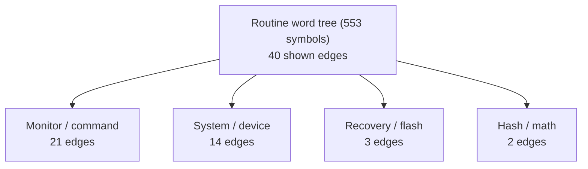
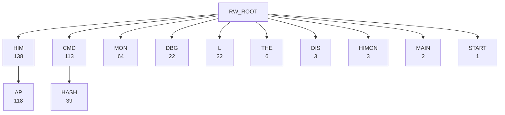
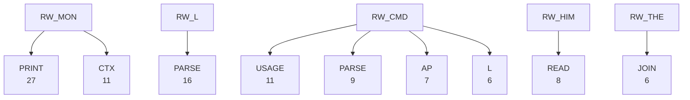
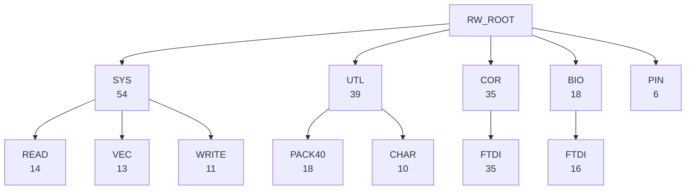
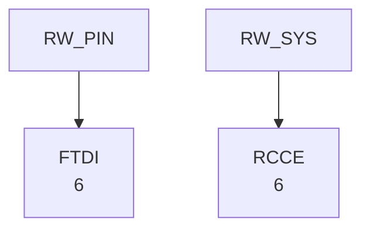
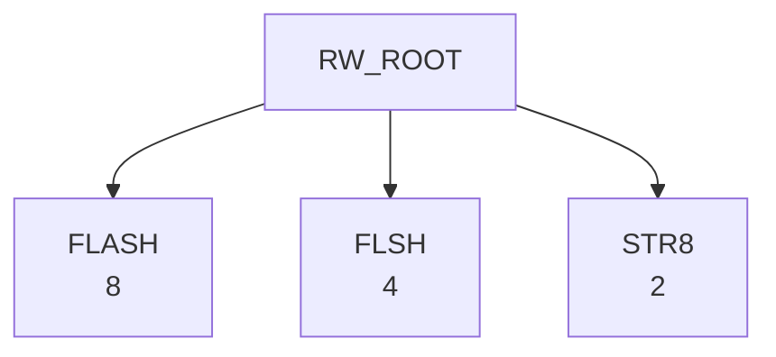
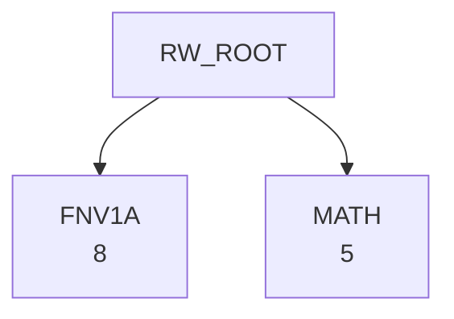

# R-YORS Routine Word Tree
<!-- AUTO-GENERATED by SRC/tools/gen_docs.ps1. Do not hand-edit. -->

Generated: 2026-08-14T15:08-05:00

Scope: operational HIMON source plus ROM support; excludes external STR8-N source, harnesses, proof apps, games, ACIA/PIA, and local generated-language images.

Hierarchy over callable-ish source symbols, split on `_`. Symbols come from routine headers and direct `JSR`/`JMP` source/target names in the operational source set.

The strongest 40 name branches are split into a top-down family overview and short detail panels. Edges are name containment, not call edges.

## Top-Down Overview

The overview groups the Routine word tree (553 symbols) edges by source family. The detail panels retain every shown edge, with no Mermaid panel exceeding 12 edges.

```mermaid
flowchart TD
    MAP_ROOT_ROUTINE_WORD_TREE__553_SYMBOLS_["Routine word tree (553 symbols)<br/>40 shown edges"] --> MAP_FAMILY_MONITOR___COMMAND["Monitor / command<br/>21 edges"]
    MAP_ROOT_ROUTINE_WORD_TREE__553_SYMBOLS_["Routine word tree (553 symbols)<br/>40 shown edges"] --> MAP_FAMILY_SYSTEM___DEVICE["System / device<br/>14 edges"]
    MAP_ROOT_ROUTINE_WORD_TREE__553_SYMBOLS_["Routine word tree (553 symbols)<br/>40 shown edges"] --> MAP_FAMILY_RECOVERY___FLASH["Recovery / flash<br/>3 edges"]
    MAP_ROOT_ROUTINE_WORD_TREE__553_SYMBOLS_["Routine word tree (553 symbols)<br/>40 shown edges"] --> MAP_FAMILY_HASH___MATH["Hash / math<br/>2 edges"]
```

## Family Detail

### Monitor / command (part 1 of 2)

```mermaid
flowchart TD
    RW_ROOT --> RW_HIM["HIM<br/>138"]
    RW_ROOT --> RW_CMD["CMD<br/>113"]
    RW_ROOT --> RW_MON["MON<br/>64"]
    RW_ROOT --> RW_DBG["DBG<br/>22"]
    RW_ROOT --> RW_L["L<br/>22"]
    RW_ROOT --> RW_THE["THE<br/>6"]
    RW_ROOT --> RW_DIS["DIS<br/>3"]
    RW_ROOT --> RW_HIMON["HIMON<br/>3"]
    RW_ROOT --> RW_MAIN["MAIN<br/>2"]
    RW_ROOT --> RW_START["START<br/>1"]
    RW_HIM --> RW_HIM_AP["AP<br/>118"]
    RW_CMD --> RW_CMD_HASH["HASH<br/>39"]
```

### Monitor / command (part 2 of 2)

```mermaid
flowchart TD
    RW_MON --> RW_MON_PRINT["PRINT<br/>27"]
    RW_L --> RW_L_PARSE["PARSE<br/>16"]
    RW_CMD --> RW_CMD_USAGE["USAGE<br/>11"]
    RW_MON --> RW_MON_CTX["CTX<br/>11"]
    RW_CMD --> RW_CMD_PARSE["PARSE<br/>9"]
    RW_HIM --> RW_HIM_READ["READ<br/>8"]
    RW_CMD --> RW_CMD_AP["AP<br/>7"]
    RW_CMD --> RW_CMD_L["L<br/>6"]
    RW_THE --> RW_THE_JOIN["JOIN<br/>6"]
```

### System / device (part 1 of 2)

```mermaid
flowchart TD
    RW_ROOT --> RW_SYS["SYS<br/>54"]
    RW_ROOT --> RW_UTL["UTL<br/>39"]
    RW_ROOT --> RW_COR["COR<br/>35"]
    RW_ROOT --> RW_BIO["BIO<br/>18"]
    RW_ROOT --> RW_PIN["PIN<br/>6"]
    RW_COR --> RW_COR_FTDI["FTDI<br/>35"]
    RW_UTL --> RW_UTL_PACK40["PACK40<br/>18"]
    RW_BIO --> RW_BIO_FTDI["FTDI<br/>16"]
    RW_SYS --> RW_SYS_READ["READ<br/>14"]
    RW_SYS --> RW_SYS_VEC["VEC<br/>13"]
    RW_SYS --> RW_SYS_WRITE["WRITE<br/>11"]
    RW_UTL --> RW_UTL_CHAR["CHAR<br/>10"]
```

### System / device (part 2 of 2)

```mermaid
flowchart TD
    RW_PIN --> RW_PIN_FTDI["FTDI<br/>6"]
    RW_SYS --> RW_SYS_RCCE["RCCE<br/>6"]
```

### Recovery / flash

```mermaid
flowchart TD
    RW_ROOT --> RW_FLASH["FLASH<br/>8"]
    RW_ROOT --> RW_FLSH["FLSH<br/>4"]
    RW_ROOT --> RW_STR8["STR8<br/>2"]
```

### Hash / math

```mermaid
flowchart TD
    RW_ROOT --> RW_FNV1A["FNV1A<br/>8"]
    RW_ROOT --> RW_MATH["MATH<br/>5"]
```

## Largest Branches

| Path | Symbols | Examples |
| --- | ---: | --- |
| `HIM_AP` | 118 | `HIM_AP_ADVANCE_A`, `HIM_AP_ADVANCE_TMP`, `HIM_AP_BAD_FIX`, `HIM_AP_BAD_LINE`, `HIM_AP_BAD_RANGE` |
| `CMD_HASH` | 39 | `CMD_HASH_CONFIRM_ADDR`, `CMD_HASH_CONFIRM_ASK`, `CMD_HASH_CONFIRM_EXEC`, `CMD_HASH_CONFIRM_TOKEN`, `CMD_HASH_FIND` |
| `COR_FTDI` | 35 | `COR_FTDI_CHECK_ENUMERATED`, `COR_FTDI_DEBUG_JSR_SNAPSHOT`, `COR_FTDI_DEBUG_WRITE_FLAGS_A`, `COR_FTDI_DEBUG_WRITE_STR`, `COR_FTDI_FLUSH_RX` |
| `HIM_AP_PARSE` | 31 | `HIM_AP_PARSE_BODY`, `HIM_AP_PARSE_BODY_HDR_ROOM`, `HIM_AP_PARSE_BODY_LEFT_LO_OK`, `HIM_AP_PARSE_BODY_LEFT_OK`, `HIM_AP_PARSE_BODY_NONZERO` |
| `MON_PRINT` | 27 | `MON_PRINT_BOX`, `MON_PRINT_EXEC_ID`, `MON_PRINT_FLAG_CHAR`, `MON_PRINT_FLAG_OUT`, `MON_PRINT_FLAGS` |
| `UTL_PACK40` | 18 | `UTL_PACK40_ADD_A`, `UTL_PACK40_ASCII_TO_CODE`, `UTL_PACK40_CODE_TO_ASCII`, `UTL_PACK40_INC_DST`, `UTL_PACK40_INC_SRC` |
| `COR_FTDI_READ` | 17 | `COR_FTDI_READ_CHAR`, `COR_FTDI_READ_CHAR_COOKED_ECHO`, `COR_FTDI_READ_CHAR_SPINCOUNT`, `COR_FTDI_READ_CHAR_TIMEOUT`, `COR_FTDI_READ_CHAR_TIMEOUT_SPINDOWN` |
| `BIO_FTDI` | 16 | `BIO_FTDI_CHECK_ENUMERATED`, `BIO_FTDI_DRAIN_RX_MAX`, `BIO_FTDI_FLUSH_RX`, `BIO_FTDI_FLUSH_RX_COUNT`, `BIO_FTDI_GET_CTRL_C` |
| `L_PARSE` | 16 | `L_PARSE_FAIL`, `L_PARSE_HEADER`, `L_PARSE_HEX_BYTE_STRICT`, `L_PARSE_RECORD`, `L_PARSE_RECORD_BAD_KIND` |
| `SYS_READ` | 14 | `SYS_READ_CHAR`, `SYS_READ_CHAR_COOKED_ECHO`, `SYS_READ_CHAR_ECHO`, `SYS_READ_CHAR_SPINCOUNT`, `SYS_READ_CHAR_TIMEOUT_SPINDOWN` |
| `MON_PRINT_MEM` | 14 | `MON_PRINT_MEM_ABORT`, `MON_PRINT_MEM_ASCII`, `MON_PRINT_MEM_ASCII_OUT`, `MON_PRINT_MEM_DONE`, `MON_PRINT_MEM_IO_SKIP` |
| `SYS_VEC` | 13 | `SYS_VEC_DEFAULT_IRQ_BRK`, `SYS_VEC_DEFAULT_IRQ_NONBRK`, `SYS_VEC_DEFAULT_NMI`, `SYS_VEC_DEFAULT_RESET`, `SYS_VEC_ENTRY_IRQ_MASTER` |
| `HIM_AP_LINK` | 13 | `HIM_AP_LINK_CAPTURE_ROW_X`, `HIM_AP_LINK_DONE`, `HIM_AP_LINK_FAIL`, `HIM_AP_LINK_IMPORT_ROW_BYTES_A`, `HIM_AP_LINK_IMPORT_ROW_LOOP` |
| `COR_FTDI_READ_CSTRING` | 12 | `COR_FTDI_READ_CSTRING_CORE`, `COR_FTDI_READ_CSTRING_ECHO`, `COR_FTDI_READ_CSTRING_ECHO_LOWER`, `COR_FTDI_READ_CSTRING_ECHO_UPPER`, `COR_FTDI_READ_CSTRING_EDIT_ECHO` |
| `CMD_USAGE` | 11 | `CMD_USAGE_AP`, `CMD_USAGE_B`, `CMD_USAGE_BC`, `CMD_USAGE_BL`, `CMD_USAGE_D` |
| `MON_CTX` | 11 | `MON_CTX_PARSE_A`, `MON_CTX_PARSE_ASSIGN`, `MON_CTX_PARSE_ASSIGN_LIST`, `MON_CTX_PARSE_ASSIGN_LOOP`, `MON_CTX_PARSE_P_OR_PC` |
| `SYS_WRITE` | 11 | `SYS_WRITE_BYTES_AXY`, `SYS_WRITE_CHAR`, `SYS_WRITE_CHAR_PLUS_CRLF`, `SYS_WRITE_CHAR_REPEAT`, `SYS_WRITE_CRLF` |
| `HIM_AP_LOAD` | 11 | `HIM_AP_LOAD_BASE_GE_20`, `HIM_AP_LOAD_BASE_LT_50`, `HIM_AP_LOAD_LAST_NO_CARRY`, `HIM_AP_LOAD_LEN_NONZERO`, `HIM_AP_LOAD_NO_OVERLAP` |
| `UTL_CHAR` | 10 | `UTL_CHAR_IN_RANGE`, `UTL_CHAR_IS_ALPHA`, `UTL_CHAR_IS_CONTROL`, `UTL_CHAR_IS_DIGIT`, `UTL_CHAR_IS_LOWER` |
| `HIM_AP_CHECK` | 10 | `HIM_AP_CHECK_EXPORT_REC`, `HIM_AP_CHECK_IMPORT_REC`, `HIM_AP_CHECK_PUBLIC_ADVANCE_A`, `HIM_AP_CHECK_PUBLIC_COUNT_OK`, `HIM_AP_CHECK_PUBLIC_FAIL` |
| `HIM_AP_RELOC` | 10 | `HIM_AP_RELOC_KIND_X`, `HIM_AP_RELOC_PATCH_ROW_X`, `HIM_AP_RELOC_SITE_HAVE_ADD`, `HIM_AP_RELOC_SITE_HI_EQ`, `HIM_AP_RELOC_SITE_HI_X` |
| `HIM_AP_SOURCE` | 10 | `HIM_AP_SOURCE_BASE_BAD`, `HIM_AP_SOURCE_BASE_GE_20`, `HIM_AP_SOURCE_BASE_GE_80`, `HIM_AP_SOURCE_BASE_OK`, `HIM_AP_SOURCE_BASE_SAFE` |
| `CMD_PARSE` | 9 | `CMD_PARSE_HEX_BYTE_TOKEN`, `CMD_PARSE_HEX_WORD_DONE`, `CMD_PARSE_HEX_WORD_LOOP`, `CMD_PARSE_HEX_WORD_TOKEN`, `CMD_PARSE_RANGE_FAIL` |
| `CMD_HASH_PRINT` | 9 | `CMD_HASH_PRINT_ENTRY`, `CMD_HASH_PRINT_EXTRA`, `CMD_HASH_PRINT_FNV`, `CMD_HASH_PRINT_KIND`, `CMD_HASH_PRINT_RECORD_HASH` |
| `COR_FTDI_WRITE` | 9 | `COR_FTDI_WRITE_BYTES_AXY`, `COR_FTDI_WRITE_CHAR`, `COR_FTDI_WRITE_CHAR_PLUS_CRLF`, `COR_FTDI_WRITE_CHAR_REPEAT`, `COR_FTDI_WRITE_CRLF` |
| `MON_CTX_PARSE` | 9 | `MON_CTX_PARSE_A`, `MON_CTX_PARSE_ASSIGN`, `MON_CTX_PARSE_ASSIGN_LIST`, `MON_CTX_PARSE_ASSIGN_LOOP`, `MON_CTX_PARSE_P_OR_PC` |
| `SYS_READ_CSTRING` | 9 | `SYS_READ_CSTRING`, `SYS_READ_CSTRING_ECHO_LOWER`, `SYS_READ_CSTRING_ECHO_UPPER`, `SYS_READ_CSTRING_EDIT_ECHO_UPPER`, `SYS_READ_CSTRING_EDIT_MODE` |
| `HIM_READ` | 8 | `HIM_READ_BYTE_BLOCK`, `HIM_READ_BYTE_HW`, `HIM_READ_LINE_ABORT`, `HIM_READ_LINE_BS_DEC`, `HIM_READ_LINE_DONE` |
| `CMD_AP` | 7 | `CMD_AP`, `CMD_AP_BANK_STAGE_FAIL`, `CMD_AP_BANKED`, `CMD_AP_DST_OK`, `CMD_AP_LOAD_OK` |
| `UTL_CHAR_IS` | 7 | `UTL_CHAR_IS_ALPHA`, `UTL_CHAR_IS_CONTROL`, `UTL_CHAR_IS_DIGIT`, `UTL_CHAR_IS_LOWER`, `UTL_CHAR_IS_PRINTABLE` |
| `HIM_AP_PARSE_BODY` | 7 | `HIM_AP_PARSE_BODY`, `HIM_AP_PARSE_BODY_HDR_ROOM`, `HIM_AP_PARSE_BODY_LEFT_LO_OK`, `HIM_AP_PARSE_BODY_LEFT_OK`, `HIM_AP_PARSE_BODY_NONZERO` |
| `CMD_L` | 6 | `CMD_L`, `CMD_L_ARGS_OK`, `CMD_L_HAVE_LINE`, `CMD_L_PARSE_OK`, `CMD_L_PRINT_FAIL` |
| `PIN_FTDI` | 6 | `PIN_FTDI_CHECK_ENUMERATED`, `PIN_FTDI_INIT`, `PIN_FTDI_POLL_RX_READY`, `PIN_FTDI_POLL_TX_READY`, `PIN_FTDI_READ_BYTE_NONBLOCK` |
| `SYS_RCCE` | 6 | `SYS_RCCE_ABORT`, `SYS_RCCE_DONE`, `SYS_RCCE_FULL`, `SYS_RCCE_LOOP`, `SYS_RCCE_STORE_CHAR` |
| `THE_JOIN` | 6 | `THE_JOIN_EXEC`, `THE_JOIN_EXEC_LOOP`, `THE_JOIN_EXEC_NEXT`, `THE_JOIN_EXEC_XY`, `THE_JOIN_FIND` |
| `HIM_AP_SERVICE` | 6 | `HIM_AP_SERVICE`, `HIM_AP_SERVICE_BAD_OP`, `HIM_AP_SERVICE_LINK`, `HIM_AP_SERVICE_LOAD`, `HIM_AP_SERVICE_PARSE` |
| `HIM_READ_LINE` | 6 | `HIM_READ_LINE_ABORT`, `HIM_READ_LINE_BS_DEC`, `HIM_READ_LINE_DONE`, `HIM_READ_LINE_ECHO_UPPER`, `HIM_READ_LINE_LOOP` |
| `L_PARSE_RECORD` | 6 | `L_PARSE_RECORD`, `L_PARSE_RECORD_BAD_KIND`, `L_PARSE_RECORD_HAVE_S`, `L_PARSE_RECORD_S0`, `L_PARSE_RECORD_S1` |
| `HIM_AP_RELOC_SITE` | 6 | `HIM_AP_RELOC_SITE_HAVE_ADD`, `HIM_AP_RELOC_SITE_HI_EQ`, `HIM_AP_RELOC_SITE_HI_X`, `HIM_AP_RELOC_SITE_LO_X`, `HIM_AP_RELOC_SITE_NO_CARRY` |
| `CMD_B` | 5 | `CMD_B`, `CMD_B_CLEAR`, `CMD_B_FULL`, `CMD_B_LIST`, `CMD_B_NF` |
