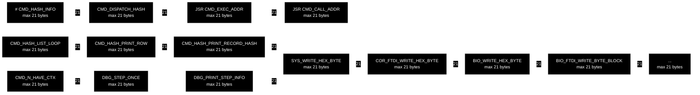

# R-YORS Stack Depth Map
<!-- AUTO-GENERATED by SRC/tools/gen_docs.ps1. Do not hand-edit. -->

Generated: 2026-08-13T05:58-05:00

Scope: operational HIMON source plus ROM support; excludes external STR8-N source, harnesses, proof apps, games, ACIA/PIA, and local generated-language images.

Source-derived stack high-water map for current HIMON paths. STR8-N is external and is analyzed in its own repository.

## Counting Rules

- Counts each active `JSR` return address as 2 bytes.
- Counts explicit 65C02 pushes `PHA`, `PHP`, `PHX`, and `PHY` as 1 byte each; matching pulls reduce the current explicit depth.
- Counts `BRK` as a 3-byte hardware frame at the instruction site.
- Treats direct `JMP label` as a tail path with no extra return address.
- Uses static, branch-insensitive paths; command rows choose the deepest related command label so split bodies such as `CMD_L_*` are included.
- Does not add the hardware NMI/IRQ entry frame to trap rows; those rows start at the handler label. Indirect `JMP (...)` targets and unresolved external targets are not expanded.

## Command Stack Map

The route panel is capped to the deepest 12 edges. Node labels show the highest stack depth seen on any command path that touches that node; edge labels show the highest stack depth seen on that route. The tables below remain the exact byte/source reference.

```mermaid
flowchart LR
    COMMANDS["Command stack paths"] --> HSTACK["HIMON routes"]
```

### HIMON Command Routes

```mermaid
%%{init: {"theme": "base", "themeVariables": {"background": "#000000", "mainBkg": "#000000", "primaryColor": "#000000", "primaryBorderColor": "#d8d8d8", "primaryTextColor": "#ffffff", "lineColor": "#ffffff", "secondaryColor": "#000000", "tertiaryColor": "#000000", "clusterBkg": "#000000", "clusterBorder": "#999999", "edgeLabelBackground": "#000000"}}}%%
flowchart LR
    classDef default fill:#000000,stroke:#d8d8d8,color:#ffffff;
    SD_HIMON_CMD_DISPATCH_HASH["CMD_DISPATCH_HASH<br/>max 21 bytes"] -->|21| SD_HIMON_JSR_CMD_EXEC_ADDR["JSR CMD_EXEC_ADDR<br/>max 21 bytes"]
    SD_HIMON_JSR_CMD_EXEC_ADDR["JSR CMD_EXEC_ADDR<br/>max 21 bytes"] -->|21| SD_HIMON_JSR_CMD_CALL_ADDR["JSR CMD_CALL_ADDR<br/>max 21 bytes"]
    SD_HIMON_BIO_WRITE_HEX_BYTE["BIO_WRITE_HEX_BYTE<br/>max 21 bytes"] -->|21| SD_HIMON_BIO_FTDI_WRITE_BYTE_BLOCK["BIO_FTDI_WRITE_BYTE_BLOCK<br/>max 21 bytes"]
    SD_HIMON_COR_FTDI_WRITE_HEX_BYTE["COR_FTDI_WRITE_HEX_BYTE<br/>max 21 bytes"] -->|21| SD_HIMON_BIO_WRITE_HEX_BYTE["BIO_WRITE_HEX_BYTE<br/>max 21 bytes"]
    SD_HIMON_SYS_WRITE_HEX_BYTE["SYS_WRITE_HEX_BYTE<br/>max 21 bytes"] -->|21| SD_HIMON_COR_FTDI_WRITE_HEX_BYTE["COR_FTDI_WRITE_HEX_BYTE<br/>max 21 bytes"]
    SD_HIMON_BIO_FTDI_WRITE_BYTE_BLOCK["BIO_FTDI_WRITE_BYTE_BLOCK<br/>max 21 bytes"] -->|21| SD_HIMON_NODE["...<br/>max 21 bytes"]
    SD_HIMON_CMD_HASH_INFO["# CMD_HASH_INFO<br/>max 21 bytes"] -->|21| SD_HIMON_CMD_DISPATCH_HASH["CMD_DISPATCH_HASH<br/>max 21 bytes"]
    SD_HIMON_CMD_HASH_LIST_LOOP["CMD_HASH_LIST_LOOP<br/>max 21 bytes"] -->|21| SD_HIMON_CMD_HASH_PRINT_ROW["CMD_HASH_PRINT_ROW<br/>max 21 bytes"]
    SD_HIMON_CMD_HASH_PRINT_RECORD_HASH["CMD_HASH_PRINT_RECORD_HASH<br/>max 21 bytes"] -->|21| SD_HIMON_SYS_WRITE_HEX_BYTE["SYS_WRITE_HEX_BYTE<br/>max 21 bytes"]
    SD_HIMON_CMD_HASH_PRINT_ROW["CMD_HASH_PRINT_ROW<br/>max 21 bytes"] -->|21| SD_HIMON_CMD_HASH_PRINT_RECORD_HASH["CMD_HASH_PRINT_RECORD_HASH<br/>max 21 bytes"]
    SD_HIMON_CMD_N_HAVE_CTX["CMD_N_HAVE_CTX<br/>max 21 bytes"] -->|21| SD_HIMON_DBG_STEP_ONCE["DBG_STEP_ONCE<br/>max 21 bytes"]
    SD_HIMON_DBG_PRINT_STEP_INFO["DBG_PRINT_STEP_INFO<br/>max 21 bytes"] -->|21| SD_HIMON_SYS_WRITE_HEX_BYTE["SYS_WRITE_HEX_BYTE<br/>max 21 bytes"]
```

## Application Entries

| Scope | Entry | Source | Bytes | Deepest path |
| --- | --- | --- | ---: | --- |
| HIMON | BRK trap body `MON_BRK_TRAP` | `HIMON/himon.asm:987` | 15 | `MON_BRK_TRAP -> MON_REENTER -> MON_AFTER_BANNER -> MON_PRINT_STOP_AND_REGS -> SYS_WRITE_CRLF -> COR_FTDI_WRITE_CRLF -> BIO_WRITE_CRLF -> BIO_FTDI_WRITE_BYTE_BLOCK -> PIN_FTDI_WRITE_BYTE_NONBLOCK -> PHA ROM/ftdi/ftdi-drv.asm:291` |
| HIMON | reset entry `START` | `HIMON/himon.asm:184` | 13 | `START -> HIMON_START_BODY -> HIMON_WARM_START_BODY -> MON_START_INIT -> MON_INIT_COMMON -> SYS_FLUSH_RX -> COR_FTDI_FLUSH_RX -> BIO_FTDI_FLUSH_RX -> PIN_FTDI_READ_BYTE_NONBLOCK -> PHA ROM/ftdi/ftdi-drv.asm:237` |
| HIMON | main loop `MAIN_LOOP` | `HIMON/himon.asm:350` | 3 | `MAIN_LOOP -> BRK frame HIMON/himon.asm:364` |
| HIMON | hash dispatcher `CMD_DISPATCH_HASH` | `HIMON/himon.asm:3666` | 2 | `CMD_DISPATCH_HASH -> CMD_HASH_SCAN_INIT` |
| HIMON | NMI trap body `MON_NMI_TRAP_DEBOUNCE` | `HIMON/himon.asm:940` | 1 | `MON_NMI_TRAP_DEBOUNCE -> PHA HIMON/himon.asm:942` |

## HIMON Command/FNV Entries

Bytes include the hashed command return chain: `CMD_DISPATCH_HASH -> JSR CMD_EXEC_ADDR -> JSR CMD_CALL_ADDR -> command body`.

| Command | Entry | Source | Bytes | Deepest path |
| --- | --- | --- | ---: | --- |
| `#` | `CMD_HASH_INFO` hash=260C9112 | `HIMON/himon.asm:400` | 21 | `CMD_DISPATCH_HASH -> JSR CMD_EXEC_ADDR -> JSR CMD_CALL_ADDR -> CMD_HASH_LIST_LOOP -> CMD_HASH_PRINT_ROW -> CMD_HASH_PRINT_RECORD_HASH -> SYS_WRITE_HEX_BYTE -> COR_FTDI_WRITE_HEX_BYTE -> BIO_WRITE_HEX_BYTE -> BIO_FTDI_WRITE_BYTE_BLOCK -> PIN_FTDI_WRITE_BYTE_NONBLOCK -> PHA ROM/ftdi/ftdi-drv.asm:291` |
| `N` | `CMD_N` | `HIMON/himon-debug.inc:98` | 21 | `CMD_DISPATCH_HASH -> JSR CMD_EXEC_ADDR -> JSR CMD_CALL_ADDR -> CMD_N_HAVE_CTX -> DBG_STEP_ONCE -> DBG_PRINT_STEP_INFO -> SYS_WRITE_HEX_BYTE -> COR_FTDI_WRITE_HEX_BYTE -> BIO_WRITE_HEX_BYTE -> BIO_FTDI_WRITE_BYTE_BLOCK -> PIN_FTDI_WRITE_BYTE_NONBLOCK -> PHA ROM/ftdi/ftdi-drv.asm:291` |
| `B` | `CMD_B` | `HIMON/himon-debug.inc:7` | 19 | `CMD_DISPATCH_HASH -> JSR CMD_EXEC_ADDR -> JSR CMD_CALL_ADDR -> CMD_B -> DBG_PRINT_CMD_ADDR -> SYS_WRITE_HEX_BYTE -> COR_FTDI_WRITE_HEX_BYTE -> BIO_WRITE_HEX_BYTE -> BIO_FTDI_WRITE_BYTE_BLOCK -> PIN_FTDI_WRITE_BYTE_NONBLOCK -> PHA ROM/ftdi/ftdi-drv.asm:291` |
| `L` | `CMD_L` hash=C90BFEAB | `HIMON/himon.asm:796` | 19 | `CMD_DISPATCH_HASH -> JSR CMD_EXEC_ADDR -> JSR CMD_CALL_ADDR -> CMD_L_HAVE_LINE -> CMD_L_PRINT_FAIL -> SYS_WRITE_HEX_BYTE -> COR_FTDI_WRITE_HEX_BYTE -> BIO_WRITE_HEX_BYTE -> BIO_FTDI_WRITE_BYTE_BLOCK -> PIN_FTDI_WRITE_BYTE_NONBLOCK -> PHA ROM/ftdi/ftdi-drv.asm:291` |
| `Q` | `CMD_Q` hash=D40C0FFC | `HIMON/himon.asm:905` | 19 | `CMD_DISPATCH_HASH -> JSR CMD_EXEC_ADDR -> JSR CMD_CALL_ADDR -> CMD_Q -> MON_REENTER -> MON_AFTER_BANNER -> MON_PRINT_STOP_AND_REGS -> SYS_WRITE_CRLF -> COR_FTDI_WRITE_CRLF -> BIO_WRITE_CRLF -> BIO_FTDI_WRITE_BYTE_BLOCK -> PIN_FTDI_WRITE_BYTE_NONBLOCK -> PHA ROM/ftdi/ftdi-drv.asm:291` |
| `R` | `CMD_R` hash=D70C14B5 | `HIMON/himon.asm:598` | 19 | `CMD_DISPATCH_HASH -> JSR CMD_EXEC_ADDR -> JSR CMD_CALL_ADDR -> CMD_R -> MON_CTX_REQUIRE_VALID -> SYS_WRITE_CRLF -> COR_FTDI_WRITE_CRLF -> BIO_WRITE_CRLF -> BIO_FTDI_WRITE_BYTE_BLOCK -> PIN_FTDI_WRITE_BYTE_NONBLOCK -> PHA ROM/ftdi/ftdi-drv.asm:291` |
| `X` | `CMD_X` hash=DD0C1E27 | `HIMON/himon.asm:621` | 19 | `CMD_DISPATCH_HASH -> JSR CMD_EXEC_ADDR -> JSR CMD_CALL_ADDR -> CMD_X -> MON_CTX_REQUIRE_VALID -> SYS_WRITE_CRLF -> COR_FTDI_WRITE_CRLF -> BIO_WRITE_CRLF -> BIO_FTDI_WRITE_BYTE_BLOCK -> PIN_FTDI_WRITE_BYTE_NONBLOCK -> PHA ROM/ftdi/ftdi-drv.asm:291` |
| `?` | `CMD_HELP` hash=3A0CB08E | `HIMON/himon.asm:388` | 17 | `CMD_DISPATCH_HASH -> JSR CMD_EXEC_ADDR -> JSR CMD_CALL_ADDR -> CMD_HELP -> SYS_WRITE_CRLF -> COR_FTDI_WRITE_CRLF -> BIO_WRITE_CRLF -> BIO_FTDI_WRITE_BYTE_BLOCK -> PIN_FTDI_WRITE_BYTE_NONBLOCK -> PHA ROM/ftdi/ftdi-drv.asm:291` |
| `AP` | `CMD_AP` hash=3AD53794 | `HIMON/himon.asm:687` | 17 | `CMD_DISPATCH_HASH -> JSR CMD_EXEC_ADDR -> JSR CMD_CALL_ADDR -> CMD_AP -> CMD_USAGE_AP -> SYS_WRITE_CRLF -> COR_FTDI_WRITE_CRLF -> BIO_WRITE_CRLF -> BIO_FTDI_WRITE_BYTE_BLOCK -> PIN_FTDI_WRITE_BYTE_NONBLOCK -> PHA ROM/ftdi/ftdi-drv.asm:291` |
| `D` | `CMD_D` hash=C10BF213 | `HIMON/himon.asm:497` | 17 | `CMD_DISPATCH_HASH -> JSR CMD_EXEC_ADDR -> JSR CMD_CALL_ADDR -> CMD_USAGE_D -> SYS_WRITE_CRLF -> COR_FTDI_WRITE_CRLF -> BIO_WRITE_CRLF -> BIO_FTDI_WRITE_BYTE_BLOCK -> PIN_FTDI_WRITE_BYTE_NONBLOCK -> PHA ROM/ftdi/ftdi-drv.asm:291` |
| `G` | `CMD_G` hash=C20BF3A6 | `HIMON/himon.asm:651` | 17 | `CMD_DISPATCH_HASH -> JSR CMD_EXEC_ADDR -> JSR CMD_CALL_ADDR -> CMD_G -> SYS_WRITE_HEX_BYTE -> COR_FTDI_WRITE_HEX_BYTE -> BIO_WRITE_HEX_BYTE -> BIO_FTDI_WRITE_BYTE_BLOCK -> PIN_FTDI_WRITE_BYTE_NONBLOCK -> PHA ROM/ftdi/ftdi-drv.asm:291` |
| `HWARM` | `HIMON_WARM_START` hash=81DE061A | `HIMON/himon.asm:224` | 17 | `CMD_DISPATCH_HASH -> JSR CMD_EXEC_ADDR -> JSR CMD_CALL_ADDR -> HIMON_WARM_START_BODY -> MON_START_INIT -> MON_INIT_COMMON -> SYS_FLUSH_RX -> COR_FTDI_FLUSH_RX -> BIO_FTDI_FLUSH_RX -> PIN_FTDI_READ_BYTE_NONBLOCK -> PHA ROM/ftdi/ftdi-drv.asm:237` |
| `M` | `CMD_M` hash=C80BFD18 | `HIMON/himon.asm:566` | 17 | `CMD_DISPATCH_HASH -> JSR CMD_EXEC_ADDR -> JSR CMD_CALL_ADDR -> CMD_M_PROTECT -> SYS_WRITE_HEX_BYTE -> COR_FTDI_WRITE_HEX_BYTE -> BIO_WRITE_HEX_BYTE -> BIO_FTDI_WRITE_BYTE_BLOCK -> PIN_FTDI_WRITE_BYTE_NONBLOCK -> PHA ROM/ftdi/ftdi-drv.asm:291` |
| `SYS_PRINT_IO_SLOT_SKIP` | `SYS_PRINT_IO_SLOT_SKIP` hash=C2A5A6CE | `HIMON/himon.asm:1683` | 17 | `CMD_DISPATCH_HASH -> JSR CMD_EXEC_ADDR -> JSR CMD_CALL_ADDR -> SYS_PRINT_IO_SLOT_SKIP -> SYS_WRITE_HEX_BYTE -> COR_FTDI_WRITE_HEX_BYTE -> BIO_WRITE_HEX_BYTE -> BIO_FTDI_WRITE_BYTE_BLOCK -> PIN_FTDI_WRITE_BYTE_NONBLOCK -> PHA ROM/ftdi/ftdi-drv.asm:291` |
| `FNV1A_UPDATE_A_FAST` | `FNV1A_UPDATE_A_FAST` hash=A8802314 | `HIMON/himon.asm:4217` | 6 | `CMD_DISPATCH_HASH -> JSR CMD_EXEC_ADDR -> JSR CMD_CALL_ADDR -> FNV1A_UPDATE_A_FAST -> FNV1A_MUL_PRIME_FAST -> MATH_COPY_HASH_TO_TERM` |
| `THE_JOIN_EXEC_XY` | `THE_JOIN_EXEC_XY` hash=A9AF15F7 | `HIMON/himon.asm:3706` | 6 | `CMD_DISPATCH_HASH -> JSR CMD_EXEC_ADDR -> JSR CMD_CALL_ADDR -> THE_JOIN_EXEC_XY -> THE_JOIN_LOAD_HASH_XY` |
| `FNV1A_INIT` | `FNV1A_INIT` hash=4B9AEE1E | `HIMON/himon.asm:4136` | 4 | `CMD_DISPATCH_HASH -> JSR CMD_EXEC_ADDR -> JSR CMD_CALL_ADDR -> FNV1A_INIT` |
| `HCOLD` | `HIMON_COLD_START` hash=D5735621 | `HIMON/himon.asm:212` | 4 | `CMD_DISPATCH_HASH -> JSR CMD_EXEC_ADDR -> JSR CMD_CALL_ADDR -> HIMON_COLD_START` |

## Deepest HIMON-Owned Routines

| Routine | Source | Bytes | Deepest path |
| --- | --- | ---: | --- |
| `CMD_DISPATCH_SCAN_LOOP` | `HIMON/himon.asm:3668` | 19 | `CMD_DISPATCH_SCAN_LOOP -> CMD_EXEC_ADDR -> MON_PRINT_RET_AND_REGS -> MON_PRINT_EXEC_ID -> MON_PRINT_HASH -> SYS_WRITE_HEX_BYTE -> COR_FTDI_WRITE_HEX_BYTE -> BIO_WRITE_HEX_BYTE -> BIO_FTDI_WRITE_BYTE_BLOCK -> PIN_FTDI_WRITE_BYTE_NONBLOCK -> PHA ROM/ftdi/ftdi-drv.asm:291` |
| `CMD_EXEC_ADDR_KEEP_TRAP` | `HIMON/himon.asm:4104` | 18 | `CMD_EXEC_ADDR_KEEP_TRAP -> CMD_EXEC_PRINT_FAIL -> MON_PRINT_HASH -> SYS_WRITE_HEX_BYTE -> COR_FTDI_WRITE_HEX_BYTE -> BIO_WRITE_HEX_BYTE -> BIO_FTDI_WRITE_BYTE_BLOCK -> PIN_FTDI_WRITE_BYTE_NONBLOCK -> PHA ROM/ftdi/ftdi-drv.asm:291` |
| `CMD_EXEC_ADDR` | `HIMON/himon.asm:4081` | 17 | `CMD_EXEC_ADDR -> MON_PRINT_RET_AND_REGS -> MON_PRINT_EXEC_ID -> MON_PRINT_HASH -> SYS_WRITE_HEX_BYTE -> COR_FTDI_WRITE_HEX_BYTE -> BIO_WRITE_HEX_BYTE -> BIO_FTDI_WRITE_BYTE_BLOCK -> PIN_FTDI_WRITE_BYTE_NONBLOCK -> PHA ROM/ftdi/ftdi-drv.asm:291` |
| `CMD_HASH_LIST_LOOP` | `HIMON/himon.asm:476` | 17 | `CMD_HASH_LIST_LOOP -> CMD_HASH_PRINT_ROW -> CMD_HASH_PRINT_RECORD_HASH -> SYS_WRITE_HEX_BYTE -> COR_FTDI_WRITE_HEX_BYTE -> BIO_WRITE_HEX_BYTE -> BIO_FTDI_WRITE_BYTE_BLOCK -> PIN_FTDI_WRITE_BYTE_NONBLOCK -> PHA ROM/ftdi/ftdi-drv.asm:291` |
| `CMD_N_HAVE_CTX` | `HIMON/himon-debug.inc:102` | 17 | `CMD_N_HAVE_CTX -> DBG_STEP_ONCE -> DBG_PRINT_STEP_INFO -> SYS_WRITE_HEX_BYTE -> COR_FTDI_WRITE_HEX_BYTE -> BIO_WRITE_HEX_BYTE -> BIO_FTDI_WRITE_BYTE_BLOCK -> PIN_FTDI_WRITE_BYTE_NONBLOCK -> PHA ROM/ftdi/ftdi-drv.asm:291` |
| `CMD_EXEC_PRINT_FAIL` | `HIMON/himon.asm:4122` | 16 | `CMD_EXEC_PRINT_FAIL -> MON_PRINT_HASH -> SYS_WRITE_HEX_BYTE -> COR_FTDI_WRITE_HEX_BYTE -> BIO_WRITE_HEX_BYTE -> BIO_FTDI_WRITE_BYTE_BLOCK -> PIN_FTDI_WRITE_BYTE_NONBLOCK -> PHA ROM/ftdi/ftdi-drv.asm:291` |
| `CMD_B` | `HIMON/himon-debug.inc:7` | 15 | `CMD_B -> DBG_PRINT_CMD_ADDR -> SYS_WRITE_HEX_BYTE -> COR_FTDI_WRITE_HEX_BYTE -> BIO_WRITE_HEX_BYTE -> BIO_FTDI_WRITE_BYTE_BLOCK -> PIN_FTDI_WRITE_BYTE_NONBLOCK -> PHA ROM/ftdi/ftdi-drv.asm:291` |
| `CMD_B_CLEAR` | `HIMON/himon-debug.inc:36` | 15 | `CMD_B_CLEAR -> DBG_PRINT_CMD_ADDR -> SYS_WRITE_HEX_BYTE -> COR_FTDI_WRITE_HEX_BYTE -> BIO_WRITE_HEX_BYTE -> BIO_FTDI_WRITE_BYTE_BLOCK -> PIN_FTDI_WRITE_BYTE_NONBLOCK -> PHA ROM/ftdi/ftdi-drv.asm:291` |
| `CMD_DISPATCH_SCAN_MISS` | `HIMON/himon.asm:3686` | 15 | `CMD_DISPATCH_SCAN_MISS -> MON_PRINT_HASH -> SYS_WRITE_HEX_BYTE -> COR_FTDI_WRITE_HEX_BYTE -> BIO_WRITE_HEX_BYTE -> BIO_FTDI_WRITE_BYTE_BLOCK -> PIN_FTDI_WRITE_BYTE_NONBLOCK -> PHA ROM/ftdi/ftdi-drv.asm:291` |
| `CMD_HASH_CONFIRM_ADDR` | `HIMON/himon.asm:3967` | 15 | `CMD_HASH_CONFIRM_ADDR -> CMD_HASH_PRINT_ENTRY -> SYS_WRITE_HEX_BYTE -> COR_FTDI_WRITE_HEX_BYTE -> BIO_WRITE_HEX_BYTE -> BIO_FTDI_WRITE_BYTE_BLOCK -> PIN_FTDI_WRITE_BYTE_NONBLOCK -> PHA ROM/ftdi/ftdi-drv.asm:291` |
| `CMD_HASH_INFO_FOUND` | `HIMON/himon.asm:422` | 15 | `CMD_HASH_INFO_FOUND -> CMD_HASH_PRINT_ENTRY -> SYS_WRITE_HEX_BYTE -> COR_FTDI_WRITE_HEX_BYTE -> BIO_WRITE_HEX_BYTE -> BIO_FTDI_WRITE_BYTE_BLOCK -> PIN_FTDI_WRITE_BYTE_NONBLOCK -> PHA ROM/ftdi/ftdi-drv.asm:291` |
| `CMD_HASH_INFO_LOOKUP` | `HIMON/himon.asm:411` | 15 | `CMD_HASH_INFO_LOOKUP -> CMD_HASH_PRINT_FNV -> SYS_WRITE_HEX_BYTE -> COR_FTDI_WRITE_HEX_BYTE -> BIO_WRITE_HEX_BYTE -> BIO_FTDI_WRITE_BYTE_BLOCK -> PIN_FTDI_WRITE_BYTE_NONBLOCK -> PHA ROM/ftdi/ftdi-drv.asm:291` |
| `CMD_HASH_PRINT_ROW` | `HIMON/himon.asm:3993` | 15 | `CMD_HASH_PRINT_ROW -> CMD_HASH_PRINT_RECORD_HASH -> SYS_WRITE_HEX_BYTE -> COR_FTDI_WRITE_HEX_BYTE -> BIO_WRITE_HEX_BYTE -> BIO_FTDI_WRITE_BYTE_BLOCK -> PIN_FTDI_WRITE_BYTE_NONBLOCK -> PHA ROM/ftdi/ftdi-drv.asm:291` |
| `CMD_L_HAVE_LINE` | `HIMON/himon.asm:836` | 15 | `CMD_L_HAVE_LINE -> CMD_L_PRINT_FAIL -> SYS_WRITE_HEX_BYTE -> COR_FTDI_WRITE_HEX_BYTE -> BIO_WRITE_HEX_BYTE -> BIO_FTDI_WRITE_BYTE_BLOCK -> PIN_FTDI_WRITE_BYTE_NONBLOCK -> PHA ROM/ftdi/ftdi-drv.asm:291` |
| `CMD_N` | `HIMON/himon-debug.inc:98` | 15 | `CMD_N -> MON_CTX_REQUIRE_VALID -> SYS_WRITE_CRLF -> COR_FTDI_WRITE_CRLF -> BIO_WRITE_CRLF -> BIO_FTDI_WRITE_BYTE_BLOCK -> PIN_FTDI_WRITE_BYTE_NONBLOCK -> PHA ROM/ftdi/ftdi-drv.asm:291` |
| `CMD_Q` | `HIMON/himon.asm:905` | 15 | `CMD_Q -> MON_REENTER -> MON_AFTER_BANNER -> MON_PRINT_STOP_AND_REGS -> SYS_WRITE_CRLF -> COR_FTDI_WRITE_CRLF -> BIO_WRITE_CRLF -> BIO_FTDI_WRITE_BYTE_BLOCK -> PIN_FTDI_WRITE_BYTE_NONBLOCK -> PHA ROM/ftdi/ftdi-drv.asm:291` |
| `CMD_R` | `HIMON/himon.asm:598` | 15 | `CMD_R -> MON_CTX_REQUIRE_VALID -> SYS_WRITE_CRLF -> COR_FTDI_WRITE_CRLF -> BIO_WRITE_CRLF -> BIO_FTDI_WRITE_BYTE_BLOCK -> PIN_FTDI_WRITE_BYTE_NONBLOCK -> PHA ROM/ftdi/ftdi-drv.asm:291` |
| `CMD_R_HAVE_CTX` | `HIMON/himon.asm:602` | 15 | `CMD_R_HAVE_CTX -> MON_PRINT_STOP_AND_REGS -> SYS_WRITE_CRLF -> COR_FTDI_WRITE_CRLF -> BIO_WRITE_CRLF -> BIO_FTDI_WRITE_BYTE_BLOCK -> PIN_FTDI_WRITE_BYTE_NONBLOCK -> PHA ROM/ftdi/ftdi-drv.asm:291` |
| `CMD_X` | `HIMON/himon.asm:621` | 15 | `CMD_X -> MON_CTX_REQUIRE_VALID -> SYS_WRITE_CRLF -> COR_FTDI_WRITE_CRLF -> BIO_WRITE_CRLF -> BIO_FTDI_WRITE_BYTE_BLOCK -> PIN_FTDI_WRITE_BYTE_NONBLOCK -> PHA ROM/ftdi/ftdi-drv.asm:291` |
| `DBG_STEP_ONCE` | `HIMON/himon-debug.inc:306` | 15 | `DBG_STEP_ONCE -> DBG_PRINT_STEP_INFO -> SYS_WRITE_HEX_BYTE -> COR_FTDI_WRITE_HEX_BYTE -> BIO_WRITE_HEX_BYTE -> BIO_FTDI_WRITE_BYTE_BLOCK -> PIN_FTDI_WRITE_BYTE_NONBLOCK -> PHA ROM/ftdi/ftdi-drv.asm:291` |
| `MON_AFTER_BANNER` | `HIMON/himon.asm:344` | 15 | `MON_AFTER_BANNER -> MON_PRINT_STOP_AND_REGS -> SYS_WRITE_CRLF -> COR_FTDI_WRITE_CRLF -> BIO_WRITE_CRLF -> BIO_FTDI_WRITE_BYTE_BLOCK -> PIN_FTDI_WRITE_BYTE_NONBLOCK -> PHA ROM/ftdi/ftdi-drv.asm:291` |
| `MON_BOOTLOG_HAVE_REASON` | `HIMON/himon-bootlog.inc:12` | 15 | `MON_BOOTLOG_HAVE_REASON -> MON_BOOTLOG_LINE_XY -> SYS_WRITE_CRLF -> COR_FTDI_WRITE_CRLF -> BIO_WRITE_CRLF -> BIO_FTDI_WRITE_BYTE_BLOCK -> PIN_FTDI_WRITE_BYTE_NONBLOCK -> PHA ROM/ftdi/ftdi-drv.asm:291` |
| `MON_BRK_TRAP` | `HIMON/himon.asm:987` | 15 | `MON_BRK_TRAP -> MON_REENTER -> MON_AFTER_BANNER -> MON_PRINT_STOP_AND_REGS -> SYS_WRITE_CRLF -> COR_FTDI_WRITE_CRLF -> BIO_WRITE_CRLF -> BIO_FTDI_WRITE_BYTE_BLOCK -> PIN_FTDI_WRITE_BYTE_NONBLOCK -> PHA ROM/ftdi/ftdi-drv.asm:291` |
| `MON_BRK_TRAP_NORMAL` | `HIMON/himon.asm:1011` | 15 | `MON_BRK_TRAP_NORMAL -> MON_REENTER -> MON_AFTER_BANNER -> MON_PRINT_STOP_AND_REGS -> SYS_WRITE_CRLF -> COR_FTDI_WRITE_CRLF -> BIO_WRITE_CRLF -> BIO_FTDI_WRITE_BYTE_BLOCK -> PIN_FTDI_WRITE_BYTE_NONBLOCK -> PHA ROM/ftdi/ftdi-drv.asm:291` |
| `MON_NMI_TRAP` | `HIMON/himon.asm:917` | 15 | `MON_NMI_TRAP -> MON_REENTER -> MON_AFTER_BANNER -> MON_PRINT_STOP_AND_REGS -> SYS_WRITE_CRLF -> COR_FTDI_WRITE_CRLF -> BIO_WRITE_CRLF -> BIO_FTDI_WRITE_BYTE_BLOCK -> PIN_FTDI_WRITE_BYTE_NONBLOCK -> PHA ROM/ftdi/ftdi-drv.asm:291` |
| `MON_NMI_TRAP_DEBOUNCE_CAPTURE` | `HIMON/himon.asm:948` | 15 | `MON_NMI_TRAP_DEBOUNCE_CAPTURE -> MON_REENTER -> MON_AFTER_BANNER -> MON_PRINT_STOP_AND_REGS -> SYS_WRITE_CRLF -> COR_FTDI_WRITE_CRLF -> BIO_WRITE_CRLF -> BIO_FTDI_WRITE_BYTE_BLOCK -> PIN_FTDI_WRITE_BYTE_NONBLOCK -> PHA ROM/ftdi/ftdi-drv.asm:291` |
| `MON_PRINT_MEM_IO_SKIP_YES` | `HIMON/himon.asm:1660` | 15 | `MON_PRINT_MEM_IO_SKIP_YES -> SYS_PRINT_IO_SLOT_SKIP -> SYS_WRITE_HEX_BYTE -> COR_FTDI_WRITE_HEX_BYTE -> BIO_WRITE_HEX_BYTE -> BIO_FTDI_WRITE_BYTE_BLOCK -> PIN_FTDI_WRITE_BYTE_NONBLOCK -> PHA ROM/ftdi/ftdi-drv.asm:291` |
| `MON_PRINT_RET_AND_REGS` | `HIMON/himon.asm:1429` | 15 | `MON_PRINT_RET_AND_REGS -> MON_PRINT_EXEC_ID -> MON_PRINT_HASH -> SYS_WRITE_HEX_BYTE -> COR_FTDI_WRITE_HEX_BYTE -> BIO_WRITE_HEX_BYTE -> BIO_FTDI_WRITE_BYTE_BLOCK -> PIN_FTDI_WRITE_BYTE_NONBLOCK -> PHA ROM/ftdi/ftdi-drv.asm:291` |
| `MON_REENTER` | `HIMON/himon.asm:239` | 15 | `MON_REENTER -> MON_AFTER_BANNER -> MON_PRINT_STOP_AND_REGS -> SYS_WRITE_CRLF -> COR_FTDI_WRITE_CRLF -> BIO_WRITE_CRLF -> BIO_FTDI_WRITE_BYTE_BLOCK -> PIN_FTDI_WRITE_BYTE_NONBLOCK -> PHA ROM/ftdi/ftdi-drv.asm:291` |
| `CMD_AP` | `HIMON/himon.asm:687` | 13 | `CMD_AP -> CMD_USAGE_AP -> SYS_WRITE_CRLF -> COR_FTDI_WRITE_CRLF -> BIO_WRITE_CRLF -> BIO_FTDI_WRITE_BYTE_BLOCK -> PIN_FTDI_WRITE_BYTE_NONBLOCK -> PHA ROM/ftdi/ftdi-drv.asm:291` |
