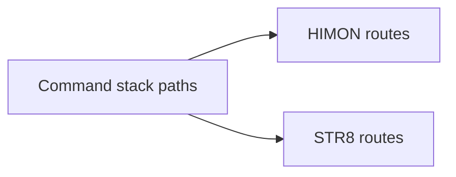

# R-YORS Stack Depth Map
<!-- AUTO-GENERATED by SRC/tools/gen_docs.ps1. Do not hand-edit. -->

Generated: 2026-08-09T22:21-05:00

Scope: operational HIMON/STR8 source plus ROM support; excludes harnesses, proof apps, games, ACIA/PIA, and local generated-language images.

Source-derived stack high-water map for current HIMON and STR8 paths. It is meant to answer: how deep does stack usage go, and which command/routine path gets there?

## Counting Rules

- Counts each active `JSR` return address as 2 bytes.
- Counts explicit 65C02 pushes `PHA`, `PHP`, `PHX`, and `PHY` as 1 byte each; matching pulls reduce the current explicit depth.
- Counts `BRK` as a 3-byte hardware frame at the instruction site.
- Treats direct `JMP label` as a tail path with no extra return address.
- Uses static, branch-insensitive paths; command rows choose the deepest related command label so split bodies such as `CMD_L_*` are included.
- Does not add the hardware NMI/IRQ entry frame to trap rows; those rows start at the handler label. Indirect `JMP (...)` targets and unresolved external targets are not expanded.

## Command Stack Map

The stack diagrams use a top-down split: a small HIMON/STR8 overview, then one short route panel per owner. Each route panel is capped to the deepest 12 edges. Node labels show the highest stack depth seen on any command path that touches that node; edge labels show the highest stack depth seen on that route. The tables below remain the exact byte/source reference.

```mermaid
flowchart LR
    COMMANDS["Command stack paths"] --> HSTACK["HIMON routes"]
    COMMANDS --> SSTACK["STR8 routes"]
```

### HIMON Command Routes

```mermaid
%%{init: {"theme": "base", "themeVariables": {"background": "#000000", "mainBkg": "#000000", "primaryColor": "#000000", "primaryBorderColor": "#d8d8d8", "primaryTextColor": "#ffffff", "lineColor": "#ffffff", "secondaryColor": "#000000", "tertiaryColor": "#000000", "clusterBkg": "#000000", "clusterBorder": "#999999", "edgeLabelBackground": "#000000"}}}%%
flowchart LR
    classDef default fill:#000000,stroke:#d8d8d8,color:#ffffff;
    SD_HIMON_CMD_DISPATCH_HASH["CMD_DISPATCH_HASH<br/>max 21 bytes"] -->|21| SD_HIMON_JSR_CMD_EXEC_ADDR["JSR CMD_EXEC_ADDR<br/>max 21 bytes"]
    SD_HIMON_JSR_CMD_EXEC_ADDR["JSR CMD_EXEC_ADDR<br/>max 21 bytes"] -->|21| SD_HIMON_JSR_CMD_CALL_ADDR["JSR CMD_CALL_ADDR<br/>max 21 bytes"]
    SD_HIMON_BIO_WRITE_HEX_BYTE["BIO_WRITE_HEX_BYTE<br/>max 21 bytes"] -->|21| SD_HIMON_BIO_FTDI_WRITE_BYTE_BLOCK["BIO_FTDI_WRITE_BYTE_BLOCK<br/>max 21 bytes"]
    SD_HIMON_COR_FTDI_WRITE_HEX_BYTE["COR_FTDI_WRITE_HEX_BYTE<br/>max 21 bytes"] -->|21| SD_HIMON_BIO_WRITE_HEX_BYTE["BIO_WRITE_HEX_BYTE<br/>max 21 bytes"]
    SD_HIMON_SYS_WRITE_HEX_BYTE["SYS_WRITE_HEX_BYTE<br/>max 21 bytes"] -->|21| SD_HIMON_COR_FTDI_WRITE_HEX_BYTE["COR_FTDI_WRITE_HEX_BYTE<br/>max 21 bytes"]
    SD_HIMON_BIO_FTDI_WRITE_BYTE_BLOCK["BIO_FTDI_WRITE_BYTE_BLOCK<br/>max 21 bytes"] -->|21| SD_HIMON_NODE["...<br/>max 21 bytes"]
    SD_HIMON_CMD_HASH_INFO["# CMD_HASH_INFO<br/>max 21 bytes"] -->|21| SD_HIMON_CMD_DISPATCH_HASH["CMD_DISPATCH_HASH<br/>max 21 bytes"]
    SD_HIMON_CMD_HASH_LIST_LOOP["CMD_HASH_LIST_LOOP<br/>max 21 bytes"] -->|21| SD_HIMON_CMD_HASH_PRINT_ROW["CMD_HASH_PRINT_ROW<br/>max 21 bytes"]
    SD_HIMON_CMD_HASH_PRINT_RECORD_HASH["CMD_HASH_PRINT_RECORD_HASH<br/>max 21 bytes"] -->|21| SD_HIMON_SYS_WRITE_HEX_BYTE["SYS_WRITE_HEX_BYTE<br/>max 21 bytes"]
    SD_HIMON_CMD_HASH_PRINT_ROW["CMD_HASH_PRINT_ROW<br/>max 21 bytes"] -->|21| SD_HIMON_CMD_HASH_PRINT_RECORD_HASH["CMD_HASH_PRINT_RECORD_HASH<br/>max 21 bytes"]
    SD_HIMON_CMD_N_HAVE_CTX["CMD_N_HAVE_CTX<br/>max 21 bytes"] -->|21| SD_HIMON_DBG_STEP_ONCE["DBG_STEP_ONCE<br/>max 21 bytes"]
    SD_HIMON_DBG_PRINT_STEP_INFO["DBG_PRINT_STEP_INFO<br/>max 21 bytes"] -->|21| SD_HIMON_SYS_WRITE_HEX_BYTE["SYS_WRITE_HEX_BYTE<br/>max 21 bytes"]
```

### STR8 Command Routes

```mermaid
%%{init: {"theme": "base", "themeVariables": {"background": "#000000", "mainBkg": "#000000", "primaryColor": "#000000", "primaryBorderColor": "#d8d8d8", "primaryTextColor": "#ffffff", "lineColor": "#ffffff", "secondaryColor": "#000000", "tertiaryColor": "#000000", "clusterBkg": "#000000", "clusterBorder": "#999999", "edgeLabelBackground": "#000000"}}}%%
flowchart LR
    classDef default fill:#000000,stroke:#d8d8d8,color:#ffffff;
    SD_STR8_STR8_CMD_LOOP["STR8_CMD_LOOP<br/>max 19 bytes"] -->|19| SD_STR8_JSR_STR8_DISPATCH_A["JSR STR8_DISPATCH_A<br/>max 19 bytes"]
    SD_STR8_JSR_STR8_DISPATCH_A["JSR STR8_DISPATCH_A<br/>max 19 bytes"] -->|19| SD_STR8_STR8_CMD_UPDATE_HIMON["STR8_CMD_UPDATE_HIMON<br/>max 19 bytes"]
    SD_STR8_STR8_STR8_WORKER_ASM_START["STR8/str8-worker.asm:START<br/>max 19 bytes"] -->|19| SD_STR8_STR8W_START_BODY["STR8W_START_BODY<br/>max 19 bytes"]
    SD_STR8_STR8_CMD_UPDATE_HIMON["STR8_CMD_UPDATE_HIMON<br/>max 19 bytes"] -->|19| SD_STR8_STR8_READ_HIMON_S19["STR8_READ_HIMON_S19<br/>max 19 bytes"]
    SD_STR8_STR8_READ_HIMON_S19["STR8_READ_HIMON_S19<br/>max 19 bytes"] -->|19| SD_STR8_STR8_RECORD_SERVICE_BODY["STR8_RECORD_SERVICE_BODY<br/>max 19 bytes"]
    SD_STR8_STR8_REC_APPLY_LF["STR8_REC_APPLY_LF<br/>max 19 bytes"] -->|19| SD_STR8_STR8_RUN_PROGRAM_RECORD_WORKER["STR8_RUN_PROGRAM_RECORD_WORKER<br/>max 19 bytes"]
    SD_STR8_STR8_RECORD_SERVICE_BODY["STR8_RECORD_SERVICE_BODY<br/>max 19 bytes"] -->|19| SD_STR8_STR8_REC_APPLY_LF["STR8_REC_APPLY_LF<br/>max 19 bytes"]
    SD_STR8_STR8_RUN_PROGRAM_RECORD_WORKER["STR8_RUN_PROGRAM_RECORD_WORKER<br/>max 19 bytes"] -->|19| SD_STR8_STR8_STR8_WORKER_ASM_START["STR8/str8-worker.asm:START<br/>max 19 bytes"]
    SD_STR8_STR8W_PROGRAM_STAGED_SECTOR["STR8W_PROGRAM_STAGED_SECTOR<br/>max 19 bytes"] -->|19| SD_STR8_NODE["...<br/>max 19 bytes"]
    SD_STR8_STR8W_START_BODY["STR8W_START_BODY<br/>max 19 bytes"] -->|19| SD_STR8_STR8W_PROGRAM_STAGED_SECTOR["STR8W_PROGRAM_STAGED_SECTOR<br/>max 19 bytes"]
    SD_STR8_U_V0_STR8_CMD_UPDATE_HIMON["U (V0) STR8_CMD_UPDATE_HIMON<br/>max 19 bytes"] -->|19| SD_STR8_STR8_CMD_LOOP["STR8_CMD_LOOP<br/>max 19 bytes"]
    SD_STR8_STR8_CON_WRITE_BYTE_BLOCK["STR8_CON_WRITE_BYTE_BLOCK<br/>max 12 bytes"] -->|12| SD_STR8_STR8_CON_WRITE_BYTE_NONBLOCK["STR8_CON_WRITE_BYTE_NONBLOCK<br/>max 12 bytes"]
```

## Application Entries

| Scope | Entry | Source | Bytes | Deepest path |
| --- | --- | --- | ---: | --- |
| HIMON | BRK trap body `MON_BRK_TRAP` | `HIMON/himon.asm:1115` | 15 | `MON_BRK_TRAP -> MON_REENTER -> MON_AFTER_BANNER -> MON_PRINT_STOP_AND_REGS -> SYS_WRITE_CRLF -> COR_FTDI_WRITE_CRLF -> BIO_WRITE_CRLF -> BIO_FTDI_WRITE_BYTE_BLOCK -> PIN_FTDI_WRITE_BYTE_NONBLOCK -> PHA ROM/ftdi/ftdi-drv.asm:291` |
| HIMON | reset entry `START` | `HIMON/himon.asm:183` | 13 | `HIMON/himon.asm:START -> HIMON_START_BODY -> HIMON_WARM_START_BODY -> MON_START_INIT -> MON_INIT_COMMON -> SYS_FLUSH_RX -> COR_FTDI_FLUSH_RX -> BIO_FTDI_FLUSH_RX -> PIN_FTDI_READ_BYTE_NONBLOCK -> PHA ROM/ftdi/ftdi-drv.asm:237` |
| HIMON | main loop `MAIN_LOOP` | `HIMON/himon.asm:349` | 3 | `MAIN_LOOP -> BRK frame HIMON/himon.asm:363` |
| HIMON | hash dispatcher `CMD_DISPATCH_HASH` | `HIMON/himon.asm:3912` | 2 | `CMD_DISPATCH_HASH -> CMD_HASH_SCAN_INIT` |
| HIMON | NMI trap body `MON_NMI_TRAP_DEBOUNCE` | `HIMON/himon.asm:1068` | 1 | `MON_NMI_TRAP_DEBOUNCE -> PHA HIMON/himon.asm:1070` |
| STR8 | command loop `STR8_CMD_LOOP` | `STR8/str8.asm:586` | 19 | `STR8_CMD_LOOP -> STR8_DISPATCH_A -> STR8_CMD_UPDATE_HIMON -> STR8_READ_HIMON_S19 -> STR8_RECORD_SERVICE_BODY -> STR8_REC_APPLY_LF -> STR8_RUN_PROGRAM_RECORD_WORKER -> STR8/str8-worker.asm:START -> STR8W_START_BODY -> STR8W_PROGRAM_STAGED_SECTOR -> STR8W_ERASE_DST_SECTOR -> STR8W_FLASH_ERASE -> STR8W_FLASH_UNLOCK` |
| STR8 | reset entry `START` | `STR8/str8.asm:202` | 12 | `STR8/str8.asm:START -> STR8_BOOT_START -> STR8_BOOT_JUMP_BANK_A -> STR8_JUMP_BANK_PREP_A -> STR8_PRINT_XY -> STR8_CON_WRITE_BYTE_BLOCK -> STR8_CON_WRITE_BYTE_NONBLOCK -> PHA STR8/str8.asm:2968` |
| STR8 | RAM worker entry `START` | `STR8/str8-worker.asm:66` | 8 | `STR8/str8-worker.asm:START -> STR8W_START_BODY -> STR8W_PROGRAM_STAGED_SECTOR -> STR8W_ERASE_DST_SECTOR -> STR8W_FLASH_ERASE -> STR8W_FLASH_UNLOCK` |

## HIMON Command/FNV Entries

Bytes include the hashed command return chain: `CMD_DISPATCH_HASH -> JSR CMD_EXEC_ADDR -> JSR CMD_CALL_ADDR -> command body`.

| Command | Entry | Source | Bytes | Deepest path |
| --- | --- | --- | ---: | --- |
| `#` | `CMD_HASH_INFO` hash=260C9112 | `HIMON/himon.asm:399` | 21 | `CMD_DISPATCH_HASH -> JSR CMD_EXEC_ADDR -> JSR CMD_CALL_ADDR -> CMD_HASH_LIST_LOOP -> CMD_HASH_PRINT_ROW -> CMD_HASH_PRINT_RECORD_HASH -> SYS_WRITE_HEX_BYTE -> COR_FTDI_WRITE_HEX_BYTE -> BIO_WRITE_HEX_BYTE -> BIO_FTDI_WRITE_BYTE_BLOCK -> PIN_FTDI_WRITE_BYTE_NONBLOCK -> PHA ROM/ftdi/ftdi-drv.asm:291` |
| `N` | `CMD_N` | `HIMON/himon-debug.inc:98` | 21 | `CMD_DISPATCH_HASH -> JSR CMD_EXEC_ADDR -> JSR CMD_CALL_ADDR -> CMD_N_HAVE_CTX -> DBG_STEP_ONCE -> DBG_PRINT_STEP_INFO -> SYS_WRITE_HEX_BYTE -> COR_FTDI_WRITE_HEX_BYTE -> BIO_WRITE_HEX_BYTE -> BIO_FTDI_WRITE_BYTE_BLOCK -> PIN_FTDI_WRITE_BYTE_NONBLOCK -> PHA ROM/ftdi/ftdi-drv.asm:291` |
| `B` | `CMD_B` | `HIMON/himon-debug.inc:7` | 19 | `CMD_DISPATCH_HASH -> JSR CMD_EXEC_ADDR -> JSR CMD_CALL_ADDR -> CMD_B -> DBG_PRINT_CMD_ADDR -> SYS_WRITE_HEX_BYTE -> COR_FTDI_WRITE_HEX_BYTE -> BIO_WRITE_HEX_BYTE -> BIO_FTDI_WRITE_BYTE_BLOCK -> PIN_FTDI_WRITE_BYTE_NONBLOCK -> PHA ROM/ftdi/ftdi-drv.asm:291` |
| `L` | `CMD_L` hash=C90BFEAB | `HIMON/himon.asm:793` | 19 | `CMD_DISPATCH_HASH -> JSR CMD_EXEC_ADDR -> JSR CMD_CALL_ADDR -> CMD_L_ARGS_OK -> CMD_L_PRINT_FAIL -> SYS_WRITE_HEX_BYTE -> COR_FTDI_WRITE_HEX_BYTE -> BIO_WRITE_HEX_BYTE -> BIO_FTDI_WRITE_BYTE_BLOCK -> PIN_FTDI_WRITE_BYTE_NONBLOCK -> PHA ROM/ftdi/ftdi-drv.asm:291` |
| `Q` | `CMD_Q` hash=D40C0FFC | `HIMON/himon.asm:1033` | 19 | `CMD_DISPATCH_HASH -> JSR CMD_EXEC_ADDR -> JSR CMD_CALL_ADDR -> CMD_Q -> MON_REENTER -> MON_AFTER_BANNER -> MON_PRINT_STOP_AND_REGS -> SYS_WRITE_CRLF -> COR_FTDI_WRITE_CRLF -> BIO_WRITE_CRLF -> BIO_FTDI_WRITE_BYTE_BLOCK -> PIN_FTDI_WRITE_BYTE_NONBLOCK -> PHA ROM/ftdi/ftdi-drv.asm:291` |
| `R` | `CMD_R` hash=D70C14B5 | `HIMON/himon.asm:597` | 19 | `CMD_DISPATCH_HASH -> JSR CMD_EXEC_ADDR -> JSR CMD_CALL_ADDR -> CMD_R -> MON_CTX_REQUIRE_VALID -> SYS_WRITE_CRLF -> COR_FTDI_WRITE_CRLF -> BIO_WRITE_CRLF -> BIO_FTDI_WRITE_BYTE_BLOCK -> PIN_FTDI_WRITE_BYTE_NONBLOCK -> PHA ROM/ftdi/ftdi-drv.asm:291` |
| `X` | `CMD_X` hash=DD0C1E27 | `HIMON/himon.asm:620` | 19 | `CMD_DISPATCH_HASH -> JSR CMD_EXEC_ADDR -> JSR CMD_CALL_ADDR -> CMD_X -> MON_CTX_REQUIRE_VALID -> SYS_WRITE_CRLF -> COR_FTDI_WRITE_CRLF -> BIO_WRITE_CRLF -> BIO_FTDI_WRITE_BYTE_BLOCK -> PIN_FTDI_WRITE_BYTE_NONBLOCK -> PHA ROM/ftdi/ftdi-drv.asm:291` |
| `?` | `CMD_HELP` hash=3A0CB08E | `HIMON/himon.asm:387` | 17 | `CMD_DISPATCH_HASH -> JSR CMD_EXEC_ADDR -> JSR CMD_CALL_ADDR -> CMD_HELP -> SYS_WRITE_CRLF -> COR_FTDI_WRITE_CRLF -> BIO_WRITE_CRLF -> BIO_FTDI_WRITE_BYTE_BLOCK -> PIN_FTDI_WRITE_BYTE_NONBLOCK -> PHA ROM/ftdi/ftdi-drv.asm:291` |
| `AP` | `CMD_AP` hash=3AD53794 | `HIMON/himon.asm:686` | 17 | `CMD_DISPATCH_HASH -> JSR CMD_EXEC_ADDR -> JSR CMD_CALL_ADDR -> CMD_AP -> CMD_USAGE_AP -> SYS_WRITE_CRLF -> COR_FTDI_WRITE_CRLF -> BIO_WRITE_CRLF -> BIO_FTDI_WRITE_BYTE_BLOCK -> PIN_FTDI_WRITE_BYTE_NONBLOCK -> PHA ROM/ftdi/ftdi-drv.asm:291` |
| `D` | `CMD_D` hash=C10BF213 | `HIMON/himon.asm:496` | 17 | `CMD_DISPATCH_HASH -> JSR CMD_EXEC_ADDR -> JSR CMD_CALL_ADDR -> CMD_USAGE_D -> SYS_WRITE_CRLF -> COR_FTDI_WRITE_CRLF -> BIO_WRITE_CRLF -> BIO_FTDI_WRITE_BYTE_BLOCK -> PIN_FTDI_WRITE_BYTE_NONBLOCK -> PHA ROM/ftdi/ftdi-drv.asm:291` |
| `G` | `CMD_G` hash=C20BF3A6 | `HIMON/himon.asm:650` | 17 | `CMD_DISPATCH_HASH -> JSR CMD_EXEC_ADDR -> JSR CMD_CALL_ADDR -> CMD_G -> SYS_WRITE_HEX_BYTE -> COR_FTDI_WRITE_HEX_BYTE -> BIO_WRITE_HEX_BYTE -> BIO_FTDI_WRITE_BYTE_BLOCK -> PIN_FTDI_WRITE_BYTE_NONBLOCK -> PHA ROM/ftdi/ftdi-drv.asm:291` |
| `HWARM` | `HIMON_WARM_START` hash=81DE061A | `HIMON/himon.asm:223` | 17 | `CMD_DISPATCH_HASH -> JSR CMD_EXEC_ADDR -> JSR CMD_CALL_ADDR -> HIMON_WARM_START_BODY -> MON_START_INIT -> MON_INIT_COMMON -> SYS_FLUSH_RX -> COR_FTDI_FLUSH_RX -> BIO_FTDI_FLUSH_RX -> PIN_FTDI_READ_BYTE_NONBLOCK -> PHA ROM/ftdi/ftdi-drv.asm:237` |
| `M` | `CMD_M` hash=C80BFD18 | `HIMON/himon.asm:565` | 17 | `CMD_DISPATCH_HASH -> JSR CMD_EXEC_ADDR -> JSR CMD_CALL_ADDR -> CMD_M_PROTECT -> SYS_WRITE_HEX_BYTE -> COR_FTDI_WRITE_HEX_BYTE -> BIO_WRITE_HEX_BYTE -> BIO_FTDI_WRITE_BYTE_BLOCK -> PIN_FTDI_WRITE_BYTE_NONBLOCK -> PHA ROM/ftdi/ftdi-drv.asm:291` |
| `SYS_PRINT_IO_SLOT_SKIP` | `SYS_PRINT_IO_SLOT_SKIP` hash=C2A5A6CE | `HIMON/himon.asm:1817` | 17 | `CMD_DISPATCH_HASH -> JSR CMD_EXEC_ADDR -> JSR CMD_CALL_ADDR -> SYS_PRINT_IO_SLOT_SKIP -> SYS_WRITE_HEX_BYTE -> COR_FTDI_WRITE_HEX_BYTE -> BIO_WRITE_HEX_BYTE -> BIO_FTDI_WRITE_BYTE_BLOCK -> PIN_FTDI_WRITE_BYTE_NONBLOCK -> PHA ROM/ftdi/ftdi-drv.asm:291` |
| `FNV1A_UPDATE_A_FAST` | `FNV1A_UPDATE_A_FAST` hash=A8802314 | `HIMON/himon.asm:4463` | 6 | `CMD_DISPATCH_HASH -> JSR CMD_EXEC_ADDR -> JSR CMD_CALL_ADDR -> FNV1A_UPDATE_A_FAST -> FNV1A_MUL_PRIME_FAST -> MATH_COPY_HASH_TO_TERM` |
| `THE_JOIN_EXEC_XY` | `THE_JOIN_EXEC_XY` hash=A9AF15F7 | `HIMON/himon.asm:3952` | 6 | `CMD_DISPATCH_HASH -> JSR CMD_EXEC_ADDR -> JSR CMD_CALL_ADDR -> THE_JOIN_EXEC_XY -> THE_JOIN_LOAD_HASH_XY` |
| `FNV1A_INIT` | `FNV1A_INIT` hash=4B9AEE1E | `HIMON/himon.asm:4382` | 4 | `CMD_DISPATCH_HASH -> JSR CMD_EXEC_ADDR -> JSR CMD_CALL_ADDR -> FNV1A_INIT` |
| `HCOLD` | `HIMON_COLD_START` hash=D5735621 | `HIMON/himon.asm:211` | 4 | `CMD_DISPATCH_HASH -> JSR CMD_EXEC_ADDR -> JSR CMD_CALL_ADDR -> HIMON_COLD_START` |

## STR8 Commands

Bytes include the command-loop dispatch return: `STR8_CMD_LOOP -> JSR STR8_DISPATCH_A -> command body`. The resident ROM path resolves `STR8_WORKER_RUN` to the RAM worker entry at `STR8/str8-worker.asm:START`.

| Command | Entry | Meaning | Source | Bytes | Deepest path |
| --- | --- | --- | --- | ---: | --- |
| `U (V0)` | `STR8_CMD_UPDATE_HIMON` | update HIMON C000-EFFF | `STR8/str8.asm:1580` | 19 | `STR8_CMD_LOOP -> JSR STR8_DISPATCH_A -> STR8_CMD_UPDATE_HIMON -> STR8_READ_HIMON_S19 -> STR8_RECORD_SERVICE_BODY -> STR8_REC_APPLY_LF -> STR8_RUN_PROGRAM_RECORD_WORKER -> STR8/str8-worker.asm:START -> STR8W_START_BODY -> STR8W_PROGRAM_STAGED_SECTOR -> STR8W_ERASE_DST_SECTOR -> STR8W_FLASH_ERASE -> STR8W_FLASH_UNLOCK` |
| `0-3 (V0)` | `STR8_CMD_SELECT_A` | legacy bank/HIMON selector | `STR8/str8.asm:1553` | 12 | `STR8_CMD_LOOP -> JSR STR8_DISPATCH_A -> STR8_CMD_SELECT_A -> STR8_JUMP_BANK_PREP_A -> STR8_PRINT_XY -> STR8_CON_WRITE_BYTE_BLOCK -> STR8_CON_WRITE_BYTE_NONBLOCK -> PHA STR8/str8.asm:2968` |
| `H` | `STR8_CMD_SELECT_HIMON` | warm local HIMON | `STR8/str8.asm:1563` | 10 | `STR8_CMD_LOOP -> JSR STR8_DISPATCH_A -> STR8_CMD_SELECT_HIMON -> STR8_PRINT_XY -> STR8_CON_WRITE_BYTE_BLOCK -> STR8_CON_WRITE_BYTE_NONBLOCK -> PHA STR8/str8.asm:2968` |

## Deepest HIMON-Owned Routines

| Routine | Source | Bytes | Deepest path |
| --- | --- | ---: | --- |
| `CMD_DISPATCH_SCAN_LOOP` | `HIMON/himon.asm:3914` | 19 | `CMD_DISPATCH_SCAN_LOOP -> CMD_EXEC_ADDR -> MON_PRINT_RET_AND_REGS -> MON_PRINT_EXEC_ID -> MON_PRINT_HASH -> SYS_WRITE_HEX_BYTE -> COR_FTDI_WRITE_HEX_BYTE -> BIO_WRITE_HEX_BYTE -> BIO_FTDI_WRITE_BYTE_BLOCK -> PIN_FTDI_WRITE_BYTE_NONBLOCK -> PHA ROM/ftdi/ftdi-drv.asm:291` |
| `CMD_EXEC_ADDR_KEEP_TRAP` | `HIMON/himon.asm:4350` | 18 | `CMD_EXEC_ADDR_KEEP_TRAP -> CMD_EXEC_PRINT_FAIL -> MON_PRINT_HASH -> SYS_WRITE_HEX_BYTE -> COR_FTDI_WRITE_HEX_BYTE -> BIO_WRITE_HEX_BYTE -> BIO_FTDI_WRITE_BYTE_BLOCK -> PIN_FTDI_WRITE_BYTE_NONBLOCK -> PHA ROM/ftdi/ftdi-drv.asm:291` |
| `CMD_EXEC_ADDR` | `HIMON/himon.asm:4327` | 17 | `CMD_EXEC_ADDR -> MON_PRINT_RET_AND_REGS -> MON_PRINT_EXEC_ID -> MON_PRINT_HASH -> SYS_WRITE_HEX_BYTE -> COR_FTDI_WRITE_HEX_BYTE -> BIO_WRITE_HEX_BYTE -> BIO_FTDI_WRITE_BYTE_BLOCK -> PIN_FTDI_WRITE_BYTE_NONBLOCK -> PHA ROM/ftdi/ftdi-drv.asm:291` |
| `CMD_HASH_LIST_LOOP` | `HIMON/himon.asm:475` | 17 | `CMD_HASH_LIST_LOOP -> CMD_HASH_PRINT_ROW -> CMD_HASH_PRINT_RECORD_HASH -> SYS_WRITE_HEX_BYTE -> COR_FTDI_WRITE_HEX_BYTE -> BIO_WRITE_HEX_BYTE -> BIO_FTDI_WRITE_BYTE_BLOCK -> PIN_FTDI_WRITE_BYTE_NONBLOCK -> PHA ROM/ftdi/ftdi-drv.asm:291` |
| `CMD_N_HAVE_CTX` | `HIMON/himon-debug.inc:102` | 17 | `CMD_N_HAVE_CTX -> DBG_STEP_ONCE -> DBG_PRINT_STEP_INFO -> SYS_WRITE_HEX_BYTE -> COR_FTDI_WRITE_HEX_BYTE -> BIO_WRITE_HEX_BYTE -> BIO_FTDI_WRITE_BYTE_BLOCK -> PIN_FTDI_WRITE_BYTE_NONBLOCK -> PHA ROM/ftdi/ftdi-drv.asm:291` |
| `CMD_EXEC_PRINT_FAIL` | `HIMON/himon.asm:4368` | 16 | `CMD_EXEC_PRINT_FAIL -> MON_PRINT_HASH -> SYS_WRITE_HEX_BYTE -> COR_FTDI_WRITE_HEX_BYTE -> BIO_WRITE_HEX_BYTE -> BIO_FTDI_WRITE_BYTE_BLOCK -> PIN_FTDI_WRITE_BYTE_NONBLOCK -> PHA ROM/ftdi/ftdi-drv.asm:291` |
| `CMD_B` | `HIMON/himon-debug.inc:7` | 15 | `CMD_B -> DBG_PRINT_CMD_ADDR -> SYS_WRITE_HEX_BYTE -> COR_FTDI_WRITE_HEX_BYTE -> BIO_WRITE_HEX_BYTE -> BIO_FTDI_WRITE_BYTE_BLOCK -> PIN_FTDI_WRITE_BYTE_NONBLOCK -> PHA ROM/ftdi/ftdi-drv.asm:291` |
| `CMD_B_CLEAR` | `HIMON/himon-debug.inc:36` | 15 | `CMD_B_CLEAR -> DBG_PRINT_CMD_ADDR -> SYS_WRITE_HEX_BYTE -> COR_FTDI_WRITE_HEX_BYTE -> BIO_WRITE_HEX_BYTE -> BIO_FTDI_WRITE_BYTE_BLOCK -> PIN_FTDI_WRITE_BYTE_NONBLOCK -> PHA ROM/ftdi/ftdi-drv.asm:291` |
| `CMD_DISPATCH_SCAN_MISS` | `HIMON/himon.asm:3932` | 15 | `CMD_DISPATCH_SCAN_MISS -> MON_PRINT_HASH -> SYS_WRITE_HEX_BYTE -> COR_FTDI_WRITE_HEX_BYTE -> BIO_WRITE_HEX_BYTE -> BIO_FTDI_WRITE_BYTE_BLOCK -> PIN_FTDI_WRITE_BYTE_NONBLOCK -> PHA ROM/ftdi/ftdi-drv.asm:291` |
| `CMD_HASH_CONFIRM_ADDR` | `HIMON/himon.asm:4213` | 15 | `CMD_HASH_CONFIRM_ADDR -> CMD_HASH_PRINT_ENTRY -> SYS_WRITE_HEX_BYTE -> COR_FTDI_WRITE_HEX_BYTE -> BIO_WRITE_HEX_BYTE -> BIO_FTDI_WRITE_BYTE_BLOCK -> PIN_FTDI_WRITE_BYTE_NONBLOCK -> PHA ROM/ftdi/ftdi-drv.asm:291` |
| `CMD_HASH_INFO_FOUND` | `HIMON/himon.asm:421` | 15 | `CMD_HASH_INFO_FOUND -> CMD_HASH_PRINT_ENTRY -> SYS_WRITE_HEX_BYTE -> COR_FTDI_WRITE_HEX_BYTE -> BIO_WRITE_HEX_BYTE -> BIO_FTDI_WRITE_BYTE_BLOCK -> PIN_FTDI_WRITE_BYTE_NONBLOCK -> PHA ROM/ftdi/ftdi-drv.asm:291` |
| `CMD_HASH_INFO_LOOKUP` | `HIMON/himon.asm:410` | 15 | `CMD_HASH_INFO_LOOKUP -> CMD_HASH_PRINT_FNV -> SYS_WRITE_HEX_BYTE -> COR_FTDI_WRITE_HEX_BYTE -> BIO_WRITE_HEX_BYTE -> BIO_FTDI_WRITE_BYTE_BLOCK -> PIN_FTDI_WRITE_BYTE_NONBLOCK -> PHA ROM/ftdi/ftdi-drv.asm:291` |
| `CMD_HASH_PRINT_ROW` | `HIMON/himon.asm:4239` | 15 | `CMD_HASH_PRINT_ROW -> CMD_HASH_PRINT_RECORD_HASH -> SYS_WRITE_HEX_BYTE -> COR_FTDI_WRITE_HEX_BYTE -> BIO_WRITE_HEX_BYTE -> BIO_FTDI_WRITE_BYTE_BLOCK -> PIN_FTDI_WRITE_BYTE_NONBLOCK -> PHA ROM/ftdi/ftdi-drv.asm:291` |
| `CMD_L_ARGS_OK` | `HIMON/himon.asm:820` | 15 | `CMD_L_ARGS_OK -> CMD_L_PRINT_FAIL -> SYS_WRITE_HEX_BYTE -> COR_FTDI_WRITE_HEX_BYTE -> BIO_WRITE_HEX_BYTE -> BIO_FTDI_WRITE_BYTE_BLOCK -> PIN_FTDI_WRITE_BYTE_NONBLOCK -> PHA ROM/ftdi/ftdi-drv.asm:291` |
| `CMD_L_KEEP_FAIL_CODE` | `HIMON/himon.asm:885` | 15 | `CMD_L_KEEP_FAIL_CODE -> CMD_L_PRINT_FAIL -> SYS_WRITE_HEX_BYTE -> COR_FTDI_WRITE_HEX_BYTE -> BIO_WRITE_HEX_BYTE -> BIO_FTDI_WRITE_BYTE_BLOCK -> PIN_FTDI_WRITE_BYTE_NONBLOCK -> PHA ROM/ftdi/ftdi-drv.asm:291` |
| `CMD_L_PRINT_FAIL_ERASE` | `HIMON/himon.asm:3832` | 15 | `CMD_L_PRINT_FAIL_ERASE -> CMD_L_PRINT_LOAD_DST -> SYS_WRITE_HEX_BYTE -> COR_FTDI_WRITE_HEX_BYTE -> BIO_WRITE_HEX_BYTE -> BIO_FTDI_WRITE_BYTE_BLOCK -> PIN_FTDI_WRITE_BYTE_NONBLOCK -> PHA ROM/ftdi/ftdi-drv.asm:291` |
| `CMD_L_PRINT_FAIL_PROTECT` | `HIMON/himon.asm:3825` | 15 | `CMD_L_PRINT_FAIL_PROTECT -> CMD_L_PRINT_LOAD_DST -> SYS_WRITE_HEX_BYTE -> COR_FTDI_WRITE_HEX_BYTE -> BIO_WRITE_HEX_BYTE -> BIO_FTDI_WRITE_BYTE_BLOCK -> PIN_FTDI_WRITE_BYTE_NONBLOCK -> PHA ROM/ftdi/ftdi-drv.asm:291` |
| `CMD_L_PRINT_FAIL_WRITE` | `HIMON/himon.asm:3849` | 15 | `CMD_L_PRINT_FAIL_WRITE -> CMD_L_PRINT_LOAD_DST -> SYS_WRITE_HEX_BYTE -> COR_FTDI_WRITE_HEX_BYTE -> BIO_WRITE_HEX_BYTE -> BIO_FTDI_WRITE_BYTE_BLOCK -> PIN_FTDI_WRITE_BYTE_NONBLOCK -> PHA ROM/ftdi/ftdi-drv.asm:291` |
| `CMD_N` | `HIMON/himon-debug.inc:98` | 15 | `CMD_N -> MON_CTX_REQUIRE_VALID -> SYS_WRITE_CRLF -> COR_FTDI_WRITE_CRLF -> BIO_WRITE_CRLF -> BIO_FTDI_WRITE_BYTE_BLOCK -> PIN_FTDI_WRITE_BYTE_NONBLOCK -> PHA ROM/ftdi/ftdi-drv.asm:291` |
| `CMD_Q` | `HIMON/himon.asm:1033` | 15 | `CMD_Q -> MON_REENTER -> MON_AFTER_BANNER -> MON_PRINT_STOP_AND_REGS -> SYS_WRITE_CRLF -> COR_FTDI_WRITE_CRLF -> BIO_WRITE_CRLF -> BIO_FTDI_WRITE_BYTE_BLOCK -> PIN_FTDI_WRITE_BYTE_NONBLOCK -> PHA ROM/ftdi/ftdi-drv.asm:291` |
| `CMD_R` | `HIMON/himon.asm:597` | 15 | `CMD_R -> MON_CTX_REQUIRE_VALID -> SYS_WRITE_CRLF -> COR_FTDI_WRITE_CRLF -> BIO_WRITE_CRLF -> BIO_FTDI_WRITE_BYTE_BLOCK -> PIN_FTDI_WRITE_BYTE_NONBLOCK -> PHA ROM/ftdi/ftdi-drv.asm:291` |
| `CMD_R_HAVE_CTX` | `HIMON/himon.asm:601` | 15 | `CMD_R_HAVE_CTX -> MON_PRINT_STOP_AND_REGS -> SYS_WRITE_CRLF -> COR_FTDI_WRITE_CRLF -> BIO_WRITE_CRLF -> BIO_FTDI_WRITE_BYTE_BLOCK -> PIN_FTDI_WRITE_BYTE_NONBLOCK -> PHA ROM/ftdi/ftdi-drv.asm:291` |
| `CMD_X` | `HIMON/himon.asm:620` | 15 | `CMD_X -> MON_CTX_REQUIRE_VALID -> SYS_WRITE_CRLF -> COR_FTDI_WRITE_CRLF -> BIO_WRITE_CRLF -> BIO_FTDI_WRITE_BYTE_BLOCK -> PIN_FTDI_WRITE_BYTE_NONBLOCK -> PHA ROM/ftdi/ftdi-drv.asm:291` |
| `DBG_STEP_ONCE` | `HIMON/himon-debug.inc:306` | 15 | `DBG_STEP_ONCE -> DBG_PRINT_STEP_INFO -> SYS_WRITE_HEX_BYTE -> COR_FTDI_WRITE_HEX_BYTE -> BIO_WRITE_HEX_BYTE -> BIO_FTDI_WRITE_BYTE_BLOCK -> PIN_FTDI_WRITE_BYTE_NONBLOCK -> PHA ROM/ftdi/ftdi-drv.asm:291` |
| `MON_AFTER_BANNER` | `HIMON/himon.asm:343` | 15 | `MON_AFTER_BANNER -> MON_PRINT_STOP_AND_REGS -> SYS_WRITE_CRLF -> COR_FTDI_WRITE_CRLF -> BIO_WRITE_CRLF -> BIO_FTDI_WRITE_BYTE_BLOCK -> PIN_FTDI_WRITE_BYTE_NONBLOCK -> PHA ROM/ftdi/ftdi-drv.asm:291` |
| `MON_BOOTLOG_HAVE_REASON` | `HIMON/himon-bootlog.inc:12` | 15 | `MON_BOOTLOG_HAVE_REASON -> MON_BOOTLOG_LINE_XY -> SYS_WRITE_CRLF -> COR_FTDI_WRITE_CRLF -> BIO_WRITE_CRLF -> BIO_FTDI_WRITE_BYTE_BLOCK -> PIN_FTDI_WRITE_BYTE_NONBLOCK -> PHA ROM/ftdi/ftdi-drv.asm:291` |
| `MON_BRK_TRAP` | `HIMON/himon.asm:1115` | 15 | `MON_BRK_TRAP -> MON_REENTER -> MON_AFTER_BANNER -> MON_PRINT_STOP_AND_REGS -> SYS_WRITE_CRLF -> COR_FTDI_WRITE_CRLF -> BIO_WRITE_CRLF -> BIO_FTDI_WRITE_BYTE_BLOCK -> PIN_FTDI_WRITE_BYTE_NONBLOCK -> PHA ROM/ftdi/ftdi-drv.asm:291` |
| `MON_BRK_TRAP_NORMAL` | `HIMON/himon.asm:1139` | 15 | `MON_BRK_TRAP_NORMAL -> MON_REENTER -> MON_AFTER_BANNER -> MON_PRINT_STOP_AND_REGS -> SYS_WRITE_CRLF -> COR_FTDI_WRITE_CRLF -> BIO_WRITE_CRLF -> BIO_FTDI_WRITE_BYTE_BLOCK -> PIN_FTDI_WRITE_BYTE_NONBLOCK -> PHA ROM/ftdi/ftdi-drv.asm:291` |
| `MON_NMI_TRAP` | `HIMON/himon.asm:1045` | 15 | `MON_NMI_TRAP -> MON_REENTER -> MON_AFTER_BANNER -> MON_PRINT_STOP_AND_REGS -> SYS_WRITE_CRLF -> COR_FTDI_WRITE_CRLF -> BIO_WRITE_CRLF -> BIO_FTDI_WRITE_BYTE_BLOCK -> PIN_FTDI_WRITE_BYTE_NONBLOCK -> PHA ROM/ftdi/ftdi-drv.asm:291` |
| `MON_NMI_TRAP_DEBOUNCE_CAPTURE` | `HIMON/himon.asm:1076` | 15 | `MON_NMI_TRAP_DEBOUNCE_CAPTURE -> MON_REENTER -> MON_AFTER_BANNER -> MON_PRINT_STOP_AND_REGS -> SYS_WRITE_CRLF -> COR_FTDI_WRITE_CRLF -> BIO_WRITE_CRLF -> BIO_FTDI_WRITE_BYTE_BLOCK -> PIN_FTDI_WRITE_BYTE_NONBLOCK -> PHA ROM/ftdi/ftdi-drv.asm:291` |

## Deepest STR8-Owned Routines

| Routine | Source | Bytes | Deepest path |
| --- | --- | ---: | --- |
| `STR8_CMD_INSTALL_PREVIEW` | `STR8/str8.asm:745` | 19 | `STR8_CMD_INSTALL_PREVIEW -> STR8_I_PRINT_SUMMARY -> STR8_I_RECEIVE_DENSE -> STR8_I_BEGIN_TRANSACTION -> STR8_I_WRITE_METADATA -> STR8_DIR_WRITE_BYTES -> STR8_RUN_PROGRAM_RECORD_WORKER -> STR8/str8-worker.asm:START -> STR8W_START_BODY -> STR8W_PROGRAM_STAGED_SECTOR -> STR8W_ERASE_DST_SECTOR -> STR8W_FLASH_ERASE -> STR8W_FLASH_UNLOCK` |
| `STR8_CMD_LOOP` | `STR8/str8.asm:586` | 19 | `STR8_CMD_LOOP -> STR8_DISPATCH_A -> STR8_CMD_UPDATE_HIMON -> STR8_READ_HIMON_S19 -> STR8_RECORD_SERVICE_BODY -> STR8_REC_APPLY_LF -> STR8_RUN_PROGRAM_RECORD_WORKER -> STR8/str8-worker.asm:START -> STR8W_START_BODY -> STR8W_PROGRAM_STAGED_SECTOR -> STR8W_ERASE_DST_SECTOR -> STR8W_FLASH_ERASE -> STR8W_FLASH_UNLOCK` |
| `STR8_ENTER_MENU_READY` | `STR8/str8.asm:293` | 19 | `STR8_ENTER_MENU_READY -> STR8_CMD_LOOP -> STR8_DISPATCH_A -> STR8_CMD_UPDATE_HIMON -> STR8_READ_HIMON_S19 -> STR8_RECORD_SERVICE_BODY -> STR8_REC_APPLY_LF -> STR8_RUN_PROGRAM_RECORD_WORKER -> STR8/str8-worker.asm:START -> STR8W_START_BODY -> STR8W_PROGRAM_STAGED_SECTOR -> STR8W_ERASE_DST_SECTOR -> STR8W_FLASH_ERASE -> STR8W_FLASH_UNLOCK` |
| `STR8_I_PRINT_SUMMARY` | `STR8/str8.asm:933` | 19 | `STR8_I_PRINT_SUMMARY -> STR8_I_RECEIVE_DENSE -> STR8_I_BEGIN_TRANSACTION -> STR8_I_WRITE_METADATA -> STR8_DIR_WRITE_BYTES -> STR8_RUN_PROGRAM_RECORD_WORKER -> STR8/str8-worker.asm:START -> STR8W_START_BODY -> STR8W_PROGRAM_STAGED_SECTOR -> STR8W_ERASE_DST_SECTOR -> STR8W_FLASH_ERASE -> STR8W_FLASH_UNLOCK` |
| `STR8_CMD_UPDATE_HIMON` | `STR8/str8.asm:1580` | 17 | `STR8_CMD_UPDATE_HIMON -> STR8_READ_HIMON_S19 -> STR8_RECORD_SERVICE_BODY -> STR8_REC_APPLY_LF -> STR8_RUN_PROGRAM_RECORD_WORKER -> STR8/str8-worker.asm:START -> STR8W_START_BODY -> STR8W_PROGRAM_STAGED_SECTOR -> STR8W_ERASE_DST_SECTOR -> STR8W_FLASH_ERASE -> STR8W_FLASH_UNLOCK` |
| `STR8_DISPATCH_A` | `STR8/str8.asm:708` | 17 | `STR8_DISPATCH_A -> STR8_CMD_UPDATE_HIMON -> STR8_READ_HIMON_S19 -> STR8_RECORD_SERVICE_BODY -> STR8_REC_APPLY_LF -> STR8_RUN_PROGRAM_RECORD_WORKER -> STR8/str8-worker.asm:START -> STR8W_START_BODY -> STR8W_PROGRAM_STAGED_SECTOR -> STR8W_ERASE_DST_SECTOR -> STR8W_FLASH_ERASE -> STR8W_FLASH_UNLOCK` |
| `STR8_I_RECEIVE_DENSE` | `STR8/str8.asm:1225` | 17 | `STR8_I_RECEIVE_DENSE -> STR8_I_BEGIN_TRANSACTION -> STR8_I_WRITE_METADATA -> STR8_DIR_WRITE_BYTES -> STR8_RUN_PROGRAM_RECORD_WORKER -> STR8/str8-worker.asm:START -> STR8W_START_BODY -> STR8W_PROGRAM_STAGED_SECTOR -> STR8W_ERASE_DST_SECTOR -> STR8W_FLASH_ERASE -> STR8W_FLASH_UNLOCK` |
| `STR8_I_BEGIN_TRANSACTION` | `STR8/str8.asm:1098` | 15 | `STR8_I_BEGIN_TRANSACTION -> STR8_I_WRITE_METADATA -> STR8_DIR_WRITE_BYTES -> STR8_RUN_PROGRAM_RECORD_WORKER -> STR8/str8-worker.asm:START -> STR8W_START_BODY -> STR8W_PROGRAM_STAGED_SECTOR -> STR8W_ERASE_DST_SECTOR -> STR8W_FLASH_ERASE -> STR8W_FLASH_UNLOCK` |
| `STR8_I_FINISH_TRANSACTION` | `STR8/str8.asm:1113` | 15 | `STR8_I_FINISH_TRANSACTION -> STR8_DIR_WRITE_BYTES -> STR8_RUN_PROGRAM_RECORD_WORKER -> STR8/str8-worker.asm:START -> STR8W_START_BODY -> STR8W_PROGRAM_STAGED_SECTOR -> STR8W_ERASE_DST_SECTOR -> STR8W_FLASH_ERASE -> STR8W_FLASH_UNLOCK` |
| `STR8_READ_HIMON_S19` | `STR8/str8.asm:2620` | 15 | `STR8_READ_HIMON_S19 -> STR8_RECORD_SERVICE_BODY -> STR8_REC_APPLY_LF -> STR8_RUN_PROGRAM_RECORD_WORKER -> STR8/str8-worker.asm:START -> STR8W_START_BODY -> STR8W_PROGRAM_STAGED_SECTOR -> STR8W_ERASE_DST_SECTOR -> STR8W_FLASH_ERASE -> STR8W_FLASH_UNLOCK` |
| `STR8_DIR_WRITE_BYTES` | `STR8/str8.asm:1969` | 13 | `STR8_DIR_WRITE_BYTES -> STR8_RUN_PROGRAM_RECORD_WORKER -> STR8/str8-worker.asm:START -> STR8W_START_BODY -> STR8W_PROGRAM_STAGED_SECTOR -> STR8W_ERASE_DST_SECTOR -> STR8W_FLASH_ERASE -> STR8W_FLASH_UNLOCK` |
| `STR8_I_WRITE_JOURNAL_MASK_A` | `STR8/str8.asm:1172` | 13 | `STR8_I_WRITE_JOURNAL_MASK_A -> STR8_DIR_WRITE_BYTES -> STR8_RUN_PROGRAM_RECORD_WORKER -> STR8/str8-worker.asm:START -> STR8W_START_BODY -> STR8W_PROGRAM_STAGED_SECTOR -> STR8W_ERASE_DST_SECTOR -> STR8W_FLASH_ERASE -> STR8W_FLASH_UNLOCK` |
| `STR8_I_WRITE_METADATA` | `STR8/str8.asm:1142` | 13 | `STR8_I_WRITE_METADATA -> STR8_DIR_WRITE_BYTES -> STR8_RUN_PROGRAM_RECORD_WORKER -> STR8/str8-worker.asm:START -> STR8W_START_BODY -> STR8W_PROGRAM_STAGED_SECTOR -> STR8W_ERASE_DST_SECTOR -> STR8W_FLASH_ERASE -> STR8W_FLASH_UNLOCK` |
| `STR8_REC_APPLY_LF` | `STR8/str8.asm:2277` | 13 | `STR8_REC_APPLY_LF -> STR8_RUN_PROGRAM_RECORD_WORKER -> STR8/str8-worker.asm:START -> STR8W_START_BODY -> STR8W_PROGRAM_STAGED_SECTOR -> STR8W_ERASE_DST_SECTOR -> STR8W_FLASH_ERASE -> STR8W_FLASH_UNLOCK` |
| `STR8_REC_PARSE_BODY` | `STR8/str8.asm:2152` | 13 | `STR8_REC_PARSE_BODY -> STR8_REC_READ_SUM_BYTE -> STR8_REC_READ_HEX_BYTE -> STR8_REC_READ_CHAR -> STR8_READ_TEXT_BYTE_BLOCK -> STR8_CON_READ_BYTE_BLOCK -> STR8_CON_READ_BYTE_NONBLOCK -> PHA STR8/str8.asm:2950` |
| `STR8_RECORD_SERVICE_BODY` | `STR8/str8.asm:2067` | 13 | `STR8_RECORD_SERVICE_BODY -> STR8_REC_APPLY_LF -> STR8_RUN_PROGRAM_RECORD_WORKER -> STR8/str8-worker.asm:START -> STR8W_START_BODY -> STR8W_PROGRAM_STAGED_SECTOR -> STR8W_ERASE_DST_SECTOR -> STR8W_FLASH_ERASE -> STR8W_FLASH_UNLOCK` |
| `STR8_RECORD_SERVICE_ENTRY` | `STR8/str8.asm:217` | 13 | `STR8_RECORD_SERVICE_ENTRY -> STR8_RECORD_SERVICE_BODY -> STR8_REC_APPLY_LF -> STR8_RUN_PROGRAM_RECORD_WORKER -> STR8/str8-worker.asm:START -> STR8W_START_BODY -> STR8W_PROGRAM_STAGED_SECTOR -> STR8W_ERASE_DST_SECTOR -> STR8W_FLASH_ERASE -> STR8W_FLASH_UNLOCK` |
| `START` | `STR8/str8.asm:202` | 12 | `STR8/str8.asm:START -> STR8_BOOT_START -> STR8_BOOT_JUMP_BANK_A -> STR8_JUMP_BANK_PREP_A -> STR8_PRINT_XY -> STR8_CON_WRITE_BYTE_BLOCK -> STR8_CON_WRITE_BYTE_NONBLOCK -> PHA STR8/str8.asm:2968` |
| `STR8_BOOT_START` | `STR8/str8.asm:234` | 12 | `STR8_BOOT_START -> STR8_BOOT_JUMP_BANK_A -> STR8_JUMP_BANK_PREP_A -> STR8_PRINT_XY -> STR8_CON_WRITE_BYTE_BLOCK -> STR8_CON_WRITE_BYTE_NONBLOCK -> PHA STR8/str8.asm:2968` |
| `STR8_PROGRAM_HIMON_UPDATE` | `STR8/str8.asm:2700` | 12 | `STR8_PROGRAM_HIMON_UPDATE -> STR8_PROGRAM_HIMON_SECTOR_AX -> STR8/str8-worker.asm:START -> STR8W_START_BODY -> STR8W_PROGRAM_STAGED_SECTOR -> STR8W_ERASE_DST_SECTOR -> STR8W_FLASH_ERASE -> STR8W_FLASH_UNLOCK` |
| `STR8_CONFIRM_Y` | `STR8/str8.asm:2530` | 11 | `STR8_CONFIRM_Y -> STR8_READ_LINE -> STR8_PRINT_XY -> STR8_CON_WRITE_BYTE_BLOCK -> STR8_CON_WRITE_BYTE_NONBLOCK -> PHA STR8/str8.asm:2968` |
| `STR8_I_READ_DESCRIPTION` | `STR8/str8.asm:889` | 11 | `STR8_I_READ_DESCRIPTION -> STR8_READ_LINE -> STR8_PRINT_XY -> STR8_CON_WRITE_BYTE_BLOCK -> STR8_CON_WRITE_BYTE_NONBLOCK -> PHA STR8/str8.asm:2968` |
| `STR8_I_READ_RANGE` | `STR8/str8.asm:831` | 11 | `STR8_I_READ_RANGE -> STR8_READ_LINE -> STR8_PRINT_XY -> STR8_CON_WRITE_BYTE_BLOCK -> STR8_CON_WRITE_BYTE_NONBLOCK -> PHA STR8/str8.asm:2968` |
| `STR8_I_READ_TYPE` | `STR8/str8.asm:798` | 11 | `STR8_I_READ_TYPE -> STR8_READ_LINE -> STR8_PRINT_XY -> STR8_CON_WRITE_BYTE_BLOCK -> STR8_CON_WRITE_BYTE_NONBLOCK -> PHA STR8/str8.asm:2968` |
| `STR8_REC_READ_SUM_BYTE` | `STR8/str8.asm:2427` | 11 | `STR8_REC_READ_SUM_BYTE -> STR8_REC_READ_HEX_BYTE -> STR8_REC_READ_CHAR -> STR8_READ_TEXT_BYTE_BLOCK -> STR8_CON_READ_BYTE_BLOCK -> STR8_CON_READ_BYTE_NONBLOCK -> PHA STR8/str8.asm:2950` |
| `STR8_RUN_PROGRAM_RECORD_WORKER` | `STR8/str8.asm:2038` | 11 | `STR8_RUN_PROGRAM_RECORD_WORKER -> STR8/str8-worker.asm:START -> STR8W_START_BODY -> STR8W_PROGRAM_STAGED_SECTOR -> STR8W_ERASE_DST_SECTOR -> STR8W_FLASH_ERASE -> STR8W_FLASH_UNLOCK` |
| `STR8_BOOT_JUMP_BANK_A` | `STR8/str8.asm:1674` | 10 | `STR8_BOOT_JUMP_BANK_A -> STR8_JUMP_BANK_PREP_A -> STR8_PRINT_XY -> STR8_CON_WRITE_BYTE_BLOCK -> STR8_CON_WRITE_BYTE_NONBLOCK -> PHA STR8/str8.asm:2968` |
| `STR8_CMD_JUMP_BANK` | `STR8/str8.asm:1522` | 10 | `STR8_CMD_JUMP_BANK -> STR8_JUMP_BANK_PREP_A -> STR8_PRINT_XY -> STR8_CON_WRITE_BYTE_BLOCK -> STR8_CON_WRITE_BYTE_NONBLOCK -> PHA STR8/str8.asm:2968` |
| `STR8_CMD_SELECT_A` | `STR8/str8.asm:1553` | 10 | `STR8_CMD_SELECT_A -> STR8_JUMP_BANK_PREP_A -> STR8_PRINT_XY -> STR8_CON_WRITE_BYTE_BLOCK -> STR8_CON_WRITE_BYTE_NONBLOCK -> PHA STR8/str8.asm:2968` |
| `STR8_ENTER_MENU` | `STR8/str8.asm:280` | 10 | `STR8_ENTER_MENU -> STR8_PRINT_SCREEN -> STR8_PRINT_XY -> STR8_CON_WRITE_BYTE_BLOCK -> STR8_CON_WRITE_BYTE_NONBLOCK -> PHA STR8/str8.asm:2968` |
