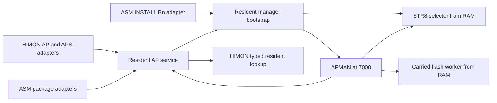

# HIMON/AP interface and RAM-lifetime audit - 2026-09-16

> Historical audit of the original Step-1 bytes. Its A1-A4 findings are now
> corrected by the [functional change and extraction](HIMON_AP_CONTRACT_CHANGE_2026-09-16.md).
> The tables below retain the behavior actually observed before correction.

The Step-2 audit is complete against the [Step-1 frozen baseline](../LOGS/HIMON_AP_BASELINE_2026-09-16.md).
It identifies the existing interfaces, phase ownership, extraction dependencies,
and failure behavior without changing executable code or allocating RAM.
**The gate requiring no unresolved lifetime/contract hazards is not yet met.**
The manager transition destroys retained ASM name storage, and several manager
error/source contracts need correction before claiming a safe reusable API.

The [23-case linked-code trace](../LOGS/HIMON_AP_AUDIT_2026-09-16.json) executes
the frozen HIMON, ASM image, APMAN and actual STR8-N 1.34 bank selector in py65.
Only terminal TX is intercepted. Every flash write raises an error; INSTALL
cases stop before worker entry. COM4 was not opened for this audit. These are
host observations, not new board acceptance or flash-worker qualification.

## Boundaries and ownership



HIMON retains grammar/dispatch, service publication, cold/warm initialization,
debugger state, console adapters and resident catalog lookup. AP owns package
validation, BODY copying, internal relocation, typed import linking and
manager bootstrap/staging. ASM owns live source/session relocation and package
production; those are not duplicates of serialized AP loading. APMAN owns
carrier policy, entry-export selection, inspection and installation orchestration.
The direct HIMON AP command executes the returned destination base; APMAN
derives its selected entry from the export offset after load. Do not silently
unify these behaviors during extraction.

The only resident code coupling that points back from AP to HIMON is the
existing typed resolver plus shared primitives/workspace. Retain direct calls
for static extraction. A new registry, callback card or wrapper per routine
is neither necessary nor authorized by this audit.

## Initialization and call ledger

All entries below require Bank 3 and a foreground, non-reentrant caller with
decimal mode clear. A/X/Y and flags are volatile except for explicit results.
Do not invoke AP from an interrupt handler or preserve a suspended AP parse
across another AP operation. A normal returning call must balance its hardware
stack; tail-entered applications own their subsequent behavior.

`MON_INIT_SERVICE_VECTORS` publishes RJOIN and the eleven-vector `RY` block,
its checksum, PACK40 extensions, flash-install and AP pointers. It clears
`$7E23-$7E40` before publishing the extension pointers. It does **not** initialize
the APMAN card at `$7C60-$7C73`. ASM service initialization validates the header;
individual package adapters additionally check the AP pointer's ROM range.
APMAN assumes that HIMON already published valid vectors.

| Entry / operation | Required input | Successful result | Failure / lifetime effects |
| --- | --- | --- | --- |
| `HIM_AP_SERVICE`, pointer `$7E2D`, PARSE `$00` | Source word `$7E31`; complete readable envelope | C=1, A=0, X/Y=source; package/body lengths, BODY/import/relocation pointers and counts published | C=0, A/status `$06` range or `$07` malformed; result cells may be partially updated; no BODY copy |
| LOAD `$01` | Source, destination `$7E33` | C=1, A=0, X/Y=destination base; BODY copied, imports patched, then internal relocations patched | C=0, A/status `$06/$07/$09`; parsing/range failure precedes copy, but link failure occurs **after** BODY copy and later relocation failure may leave patches |
| SUGGEST `$02` | Source envelope | C=1, A=0, X/Y and `$7E3D`=first sufficient FF span in visible Bank-3 `$8000-$FEFF` | Read-only search; C=0/status on failure; suggestion does not grant flash-write permission or sector ownership |
| LINK `$03` | Unmodified parsed relocation/import state, destination and copied BODY | C=1, status=0; imported rows patched; counts restored from `$7DC6/$7DC7` | No parsing or full destination-range check here. C=0/A/status `$09` on failure. A and X/Y are not LOAD-style success results |
| MANAGER `$04` / `HIM_APMAN_BOOTSTRAP` | APMAN mode/card; HIMON command page when using AP/APS | Tail-load/enter APMAN; manager or child determines eventual return | Destructive foreground transition; generic AP success/failure ABI does **not** describe all paths; see findings below |
| `HIM_AP_STAGE_BANK_SOURCE` | Bank in `CMD_IO_TMP`, sector/address in `CMDP_START` | C=1; sector copied to `$0A00`; AP source points to staged offset; Bank 3 restored | Bad argument/select returns AP BAD_RANGE; restore retries until successful rather than returning into foreign ROM |
| `THE_JOIN_FIND` | Desired hash in `$B0-$B3` | C=1, A=HREC kind, `$FC/$FD`=entry, `$7E66/$7E67`=extra pointer | C=0 clears extra pointer; changes scan state `$E0/$E1`, Y and parser/result scratch; lookup does not execute |
| `THE_JOIN_EXEC_XY` | X/Y points to hash | C=1, X/Y=executable entry | EXEC-only interface; **not** a substitute for AP's typed lookup, which also accepts DATA |
| `ASM_PACKAGE_LOAD` | X/Y=package, ASM relocate-base word=destination | Uses resident LOAD, copies selected results into ASM UDATA, returns ASM OK and destination | Carries resident failure into ASM; does not require APMAN; does not touch low ASM name tables in traced calls |
| `ASM_PACKAGE_PARSE_MIN` (flash runtime) | `ASM_PACKAGE_BASE` already set | Resident PARSE and copied result cells | X/Y is not the input authority at this internal entry; preserve existing callers' setup |
| `ASM_PACKAGE_INSTALL_SUGGEST` | X/Y=package | Resident SUGGEST, copied results and install-base X/Y | Same AP-status convention as other ASM package adapters |
| `ASMF_INSTALL_BANK` | Parsed source and bank, valid service vectors | Sets mode INSTALL and confirmation `$A5`, JSRs MANAGER, then returns to `ASMF_LOOP` | Does not preserve/invalidate ASM name tables around bootstrap and does not normalize absent-manager status |
| `APMAN_CALL_AP` and console/FNV trampolines | Published vector and appropriate registers/card | `JSR trampoline; JMP (vector)` returns directly to APMAN caller | No extra wrapper frame beyond caller JSR; service registers/shared scratch are volatile |
| APMAN AP L / AP D / APS | Mode, shadow command page, resident services | C=1, A/card status `$AC`; AP L loads; AP D inspects staged target; APS scans | Error C=0; card status is authoritative when manager error handling is actually reached; A can be altered by diagnostic output |
| APMAN AP execute | Successfully loaded child and export offset | `JMP (APMAN_FOUND_ENTRY_LO)` | Child RTS uses the original caller's return chain. There is no persistent parent menu or post-child manager cleanup |
| APMAN INSTALL | Stable source, B0-B2, confirmation `$A5`, erased/unreserved target | Worker mode `$05`, then manager success after worker success | May mutate flash once worker entered; no rollback promise. This audit stops before worker and claims only preparation evidence |

Resident import linking resolves each import using `THE_JOIN_FIND`, tests the
HREC EXEC bit against the AP import kind, and retains the resolved address in
`$7DC3/$7DC4`. It saves relocation/import counts in `$7DC6/$7DC7` and reloads
the relocation pointer between resolver calls. Validation precedes import
patching, but the enclosing LOAD has already copied BODY. The wrong-kind
fixture confirms copied destination bytes survive a `$09` failure. LINK's
success A is not required to be zero; use C and the status cell.

## Frozen ranges and lifetimes

Ranges are inclusive. These are existing allocations, not new reservations.
Observed write spans for each fixture are retained in the trace JSON; the
table lists full declared ownership, including paths not hit by every fixture.

| Range | Owner / live phase | Lifetime and caller obligation |
| --- | --- | --- |
| `$80-$AF` | ASM parser/emitter while ASM runs | APMAN owns `$A0-$AF` during manager execution; do not preserve ASM temporaries there across MANAGER |
| `$B0-$B3`, `$C7-$CA` | Shared FNV hash/multiply state | Volatile across seal checking, named lookup and import resolution |
| `$CF-$D5` | Resident AP link scratch (D5 declared, unused in current path) | `$D1-$D4` also stage pointers; these phases cannot nest |
| `$E0-$E1` | Resident catalog scan | Clobbered by typed import lookup |
| `$E6-$EA` | AP public-row validation / PACK40 / utility aliases | Finish consuming values before another shared helper owns them |
| `$F2`, `$FA-$FF` | Bootstrap bank/sector and HIMON parser pointers | Bootstrap needs bank/sector across PARSE/LOAD; resolver/loader use `$FC-$FF` |
| `$0100-$01FF` | Hardware stack | Caller chains, pushes and interrupt frames; no page-one buffers |
| `$0200-$0226` | Current STR8 selector copied by `$F010` | Recreated before bank access; overwrites ASM symbol-name storage |
| `$0300-$0335` | Resident AP sector reader, 54 bytes | Live only during bootstrap staging; disjoint from current selector, not from mutation worker |
| `$0200-$042A` | APMAN's carried V1 mutation worker, 555 bytes | Copied only after staging/preparation; replaces selector/reader bytes. Subsequent `$F010` restores the selector before reuse |
| `$0200-$0437` | STR8-N 1.34 unified worker allocation | Separate artifact from APMAN's carried worker; never infer APMAN length from this end |
| `$0200-$09FF` | ASM symbol-name pool outside bank-tool phase | Contents are not saved by bootstrap/install |
| `$0A00-$19FF` | ASM fixup-name pool **or** one staged flash sector | Manager staging overwrites the entire 4K even on an absent-manager search; selected AP metadata pointers remain valid only until the next stage |
| `$1A00-$1AFF` | Manager command shadow | Bootstrap copies all 256 command bytes before loading APMAN; not restored on return |
| `$2000-$4FFF` | Ordinary resident AP source/destination window | Whole envelope/BODY must fit; RAM source/destination overlap rejected. Working install source belongs here (or stable visible Bank-3 flash), never in a reused tray |
| `$5000-$6D6D` | ASM UDATA, including wrapper line buffer `$500C` | Survives traced manager calls; surviving counts/pointers do not imply their low-memory name payloads survived |
| `$6D6E-$7CFF` | ASM upper emission region outside tool phase | APMAN overlaps `$7000-$7BFB`; its card occupies `$7C60-$7C73`. Emitted code/data here cannot be retained across manager use |
| `$7000-$7BFB` | Current APMAN BODY | Must remain intact until its final RTS/tail JMP; four bytes remain below overlay ceiling `$7C00` |
| `$7A00-$7AFF`, `$7B00-$7BFB` | HIMON command / S19 decoded payload outside manager phase | Replaced by manager code. Next prompt/refill may overwrite manager after it has returned; no nested S19 loader during manager work |
| `$7C00-$7DBF` | Single-owner high-tool overlay | Includes APMAN card `$7C60-$7C73` and separate AP Store request cards; not free scratch for the next feature |
| `$7DC0-$7DC7` | Resident import-link durable scratch | Lives through resolver calls; not available to manager/card expansion |
| `$7DE9-$7DFF` | STR8 worker/recovery state | APMAN setup writes sector `$7DE9`, destination bank `$7DEF`, mode `$7DF0`, buffer page `$7DF6`; worker has additional private effects |
| `$7E23-$7E24`, `$7E2D-$7E40` | Published import pointer / AP vector and card | Results refer to the most recent operation; no nested request or persistent parsed handle |
| `$7E41-$7E45`, `$7E66-$7E67`, `$7EB8-$7EB9` | AP scratch, resolver extra pointer, reused loader length | Shared provider workspace, not caller-save storage |
| `$7EE0-$7EFF` | PIA/reset/trap/vector state | Preserve all allocations; no new use. Terminal indications can update existing device state |
| `$7FA0`, `$7FEC` | PIA LED / VIA bank-selection I/O | Manager staging publishes sector/bank; bank bits change only through checked RAM selector paths |

Effective destination policy is the intersection of guards: resident LOAD
accepts `$2000-$4FFF` or `$7000-$7BFF`; a live APMAN child must also be below
`$7000`, leaving **`$2000-$4FFF`** for managed child BODYs. A request for `$5000`
passes APMAN's first guard but fails resident LOAD with AP `$06`, reported by
APMAN as `$D3`. It never copies the child there. No range expansion is approved.

PARSE accepts complete envelopes within `$0A00-$19FF`, `$2000-$4FFF`, or
visible flash `$8000-$FEFF`; these are address checks, not persistence promises.
The staging window is suitable for PARSE/LOAD of the current staged image,
but is an unsafe **input to MANAGER/INSTALL**, which restages it.

## Phase transitions and return contract

| Phase | Live owners | Transition rule |
| --- | --- | --- |
| Direct AP PARSE/LOAD/LINK/SUGGEST | Resident card, shared AP scratch, source and optional destination | No APMAN, low staging, or bank search needed. Fixtures use erased external banks successfully |
| Manager bootstrap | Command shadow, selector, resident reader, stage, card | Source/continuation code must survive all these writes; resident PARSE validates each carrier before BODY identity/load |
| APMAN scan/inspect | Overlay, shadow, low ZP, stage, card | Re-stage overwrites all prior stage pointers; save facts in card, then revalidate/restage selected carrier |
| APMAN child load | Same owners plus child destination | Stage must remain intact through resident LOAD and reading export offset; destination must be disjoint from live overlay |
| APMAN child execution | Child plus original caller return chain | Tail transition, not nested manager ownership. Parent cannot assume manager scratch survives arbitrary child execution |
| Install preparation | Stable source, overlay, stage, worker lane, worker state | Parse source, find erased/unreserved sector, fill/copy stage, replace low worker, then enter worker. No source may overlap a replaced region |
| Install return / missing-manager return | ASM UDATA/return chain may survive; low names do not | Existing code returns to SEAL loop without invalidating stale session metadata: unresolved finding A1 |
| Monitor prompt / fresh ASM session | HIMON buffers or freshly initialized ASM storage | APMAN overlay is no longer live. Start a new ASM session before relying on symbols/fixups/upper emitted bytes after manager use |

Resident staging retries Bank-3 restoration before returning to ROM. APMAN
staging instead reports failure after its restore attempt. Both normal paths
use valid bank selectors and restore Bank 3 in the trace. The error branch is
not proof that a hardware-corrupted/failed selector can safely return to ROM.
SEI masks IRQ during bank access, not NMI; arbitrary NMI across foreign-bank
vectors is not supported by this audit. Preserve the existing no-interruption
bank-worker assumptions until a separately qualified change addresses them.

## Findings and extraction disposition

| ID | Evidence / consequence | Required disposition |
| --- | --- | --- |
| A1: retained ASM names destroyed | Bootstrap writes `$0200-$0226`, `$0300-$0335`, all `$0A00-$19FF`; install replaces `$0200-$042A`. ASM symbol/fixup counts remain in UDATA and `ASMF_INSTALL_BANK` returns to the same loop | Before claiming session continuity, explicitly invalidate/end the affected session or provide a measured preservation design. Working restriction: use a fresh ASM session afterward; do not reuse sealed names/fixups |
| A2: unsafe INSTALL source | Fixture with source `$0A00` reaches worker entry with an all-FF tray: bootstrap replaced the package, then fill-before-copy erased its source. No flash worker executed in this audit | Reject unstable source ranges **before bootstrap** and validate the whole envelope span; add preservation/no-mutation failure checks. Do not board-test the unsafe input by programming flash |
| A3: absent/corrupt manager status | Both fixtures print `APMAN NF`, return C=1 after output, leave AP status `$07` and APMAN status unchanged (`$CC` fixture poison) | Define/set a deterministic NO_MANAGER result and C=0; keep `$DA` distinct from ordinary parse failures. Generic ABI documentation must exclude MANAGER until corrected |
| A4: duplicate status overwritten | Named duplicate emits `$D2`, then caller emits `$D1`; final card is NOT_FOUND `$D1` | Propagate a single authoritative duplicate failure without a second error path; lookup currently refuses execution but loses precise status |
| A5: destination documentation too broad | Manager guard permits below `$7000`; resident range ends at `$5000` | Freeze effective managed range to `$2000-$4FFF`; correct documentation, not the loader limit |
| A6: recovery/bounds are phase-specific | Tool LOAD can replace command/decoded buffers; MANAGER overwrites low pools even when it fails; parsed pointers are transient | Publish those invalidations and keep direct RAM-package recovery independent of APMAN |

Byte-identical include extraction can preserve all of these behaviors, but it
does not resolve them. The recommendation is a narrow, separately measured
manager-contract correction before calling the Step-2 safety gate passed, then
re-establish the byte baseline and perform the source extraction. Do not hide
these corrections in an alleged byte-identical move. A1's minimal direction
is explicit session invalidation, not a new RAM save area; no fix is implemented
or hardware-accepted by this document.

## Stack evidence and limits

Observed fixture peaks, including a two-byte synthetic caller return, are
8 bytes for minimal PARSE, 10 for minimal LOAD/SUGGEST, 14 for typed LOAD,
12 for LINK, 12 for absent/corrupt manager and install preparation, and 18
for manager load/child-return/duplicate paths. Every completed fixture balances
the stack. The actual ASM direct-load adapter uses 12 observed bytes; its
absent-manager INSTALL path reaches `ASMF_LOOP` with 14 observed bytes and
the deliberately seeded symbol/fixup counts still 3/2 despite overwritten names.
Real terminal TX internals, dispatcher frames, arbitrary child code,
interrupt frames and flash worker execution are outside those observed maxima.
They must not be advertised as universal stack bounds.

The existing generated stack map is source-derived, excludes APMAN and indirect
targets, and still includes an IF-0 APS route. It cannot certify the integrated
AP/manager chain. No extra stack frames or new RAM claims are justified by it.
For static extraction, preserve JSR/JMP shape and byte identity. Any adapter
or new nesting requires a fresh path-specific stack/interrupt qualification.

## Build and checker work required by extraction

| Consumer | Current assumption | Extraction obligation |
| --- | --- | --- |
| `check_himon_banked_ap.ps1` | Reads only `himon.asm`; matches limits/stage code text, then executes linked stage/relocation bytes | Feed the real AP source set or expanded source; retain both text assertions and linked tests |
| `check_asm_abi_v1.ps1` | Separate literal-owner checks for ASM core/wrapper/HIMON shared map; boot table read from `himon.asm` | Keep public constants in `asm-abi-v1.inc`; preserve boot-table ownership; include any moved aliases in coverage |
| `check_ap_store_inventory.ps1` | Chooses manager branch when raw HIMON source contains `HIM_APMAN_BOOTSTRAP:` | Expand before branch selection; otherwise an include move can select obsolete inventory logic |
| `check_apman_inspect.ps1` | Raw HIMON source used to check AP D routing | Continue checking the adapter's actual source; do not weaken missing-code assertions |
| `check_ap_v2_package.ps1` | Reads HIMON limits and linkage patterns as raw text | Follow moved declarations/routines and preserve shape checks |
| `check_himon_str8_record_client.ps1`, `check_himon_io_led.ps1`, `check_asm_dc_contract.ps1` | Raw monitor source for loader, LED and command checks | Audit any cross-block patterns before moving adapter/shared code; keep unrelated assertions active |
| `report_himon_ap_baseline.py`, linked size tests | Map symbols and emitted bytes | Preserve symbol names/order; same-map/S19 gate remains authoritative |
| Makefile | `HIMON_INC` only globs `HIMON/*.inc` | Add explicit new AP include prerequisites for both monitor objects; ensure edits rebuild all consumers |
| `gen_docs.ps1` | HIMON scope/file lists only include `HIMON/himon.asm` and `HIMON/*.inc` | Add AP source ownership to appropriate routine/catalog/stack scopes and handle disabled code; regenerate rather than editing generated files |

APMAN still contains literal `$7E..` aliases outside the ABI checker's current
literal-owner scope. They match the baseline today; do not claim the existing
check proves single ownership in every client. Any normalization is a separate
small change, with emitted identity checked.

## Reproduction and scope

```text
python -B SRC/tools/audit_himon_ap_contracts.py --output DOC/GUIDES/LOGS/HIMON_AP_AUDIT_2026-09-16.json
```

The default reads `LOCAL/himon-ap-baseline-20260916/build-1`; `--build-dir` can
select another identified artifact set. The STR8 top hash must match the
integration lock. JSON records input hashes, per-case actual write/changed
spans, registers/status, selected-bank transitions and observed stack usage.
The synthetic DATA-provider fixture adds a record only to emulator memory.
The tests deliberately characterize existing faults; passing means the audit
reproduced those facts, not that the faults are accepted API behavior.

Firmware, the Step-1 artifacts and the board remain unchanged. Step-1 full
regression evidence still applies to those exact bytes. No R-YORS II provider
registry, scoped discovery feature, persistent AP Store menu, new RAM allocation,
flash install, or module extraction was implemented in this step.
