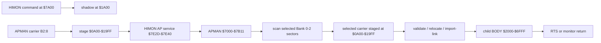

# APMAN/APC Dissection

> [!NOTE]
> The topology remains the accepted APMAN/APC reference. The version block
> below identifies the board image from which its exact addresses and hashes
> were captured; it is not the current component-version declaration. See
> [the capability matrix](../CAPABILITIES.md) for the live line.

This is the post-board-test map of the accepted AP carrier system. It ties the
physical flash carrier, serialized AP-v2 envelope, transient RAM overlays,
resident services, and operator commands to exact addresses.

Accepted board line:

```text
STR8-N          1.23
HIMON/ASM-F2    00.0826(1510)
APMAN carrier   B2:8, package $0B40, body $7000-$7B11
BANKDUMP        B2:9, package $09AD, body $2000-$292B
```

## Physical flash map

The CPU always sees the selected 32K bank at `$8000-$FFFF`. Physical offsets
are shown to make the bank/sector relationship explicit.

| Location | CPU window | Physical flash | Current accepted content |
| --- | --- | --- | --- |
| B2:8 | `$8000-$8FFF` | `$10000-$10FFF` | APMAN AP-v2 carrier plus erased tail |
| B2:9 | `$9000-$9FFF` | `$11000-$11FFF` | BANKDUMP AP-v2 carrier plus erased tail |
| B1:E | `$E000-$EFFF` | `$0E000-$0EFFF` | configured WORK sector |
| B1:F | `$F000-$FFFF` | `$0F000-$0FFFF` | verified backup of B3:F |
| B3:F | `$F000-$FFFF` | `$1F000-$1FFFF` | live protected STR8-N top sector |

The accepted BANKDUMP inventory is:

```text
B# 8 9 A B C D E F

B0 U U U U U U U U
B1 U A A U U A W B
B2 A A E E E E E E
B3 U U U U U U U P
E=ERASED U=USED A=AP VALID
W=WORK B=B3F BKUP P=B3F PROTECTED
```

This is observed media, not a hard-coded bank personality. Carrier install is
allowed in Banks 0-2 and chooses a completely erased, unreserved sector.

## APMAN sector and envelope

The installed B2:8 sector is exactly 4096 bytes:

```text
CPU $8000-$8B3F   AP-v2 envelope, $0B40 bytes
CPU $8B40-$8FFF   erased tail, $04C0 bytes of $FF
```

Serialized envelope offsets are relative to CPU `$8000` while Bank 2 is
selected:

| Offset | CPU range | Length | Meaning |
| --- | --- | ---: | --- |
| `$0000` | `$8000-$8004` | `$0005` | `AP`, version `$02`, package length `$0B40` |
| `$0005` | `$8005-$8012` | `$000E` | `S` header plus `$000B`-byte seal |
| `$0013` | `$8013-$8016` | `$0004` | `R` header plus zero-relocation count |
| `$0017` | `$8017-$8026` | `$0010` | `E` header plus one `APMAN` executable ENTRY row |
| `$0027` | `$8027-$802A` | `$0004` | `I` header plus zero-import count |
| `$002B` | `$802B-$802D` | `$0003` | `B` header, BODY length `$0B12` |
| `$002E` | `$802E-$8B3F` | `$0B12` | APMAN BODY sealed for `$7000-$7B11` |

The seal bytes decode as:

```text
kind         $01 executable
base         $7000
end          $7B12 exclusive
body length  $0B12
body FNV32   $421C7515
```

The BODY begins with a branch followed by ASCII `AM01`. HIMON checks that
identity only after the entire AP-v2 envelope validates. It is the manager
bootstrap identity, not a general application name.

## RAM phase map

APMAN is an overlay: these ranges have the listed ownership only while an
`AP`, `APS`, or banked `INSTALL` operation is delegated to it.

| RAM | Owner/use during APMAN operation | Overwrite consequence |
| --- | --- | --- |
| `$00A0-$00AF` | manager pointers, counts, bank/sector, parsed row | caller scratch is destroyed |
| `$00B0-$00B3` | FNV32 state | caller hash state is destroyed |
| `$0200-$042A` | embedded STR8-N erase/program worker when installing | recovery/worker lane is replaced |
| `$0A00-$19FF` | one complete staged 4K bank sector | any previous stage/table is destroyed |
| `$1A00-$1AFF` | command shadow copied from HIMON `$7A00` | previous low command page is destroyed |
| `$2000-$6FFF` | permitted child BODY range | selected child replaces overlapping parent/data |
| `$7000-$7B11` | APMAN BODY | cannot be a child destination |
| `$7C60-$7C73` | APMAN request/result card | foreground manager state changes |
| `$7DE9-$7DF6` | STR8 worker request/result cells during install | shared recovery state changes |
| `$7E2D-$7E40` | HIMON AP service pointer and request/result card | shared AP service state changes |



Bank selection/copy/program work runs from RAM. Every accepted and error path
attempts to restore Bank 3 before normal HIMON output or return.

## Command flow

```text
ASM source
  -> SEAL> PACKAGE name $3000
     -> complete AP-v2 envelope in RAM
        -> SEAL> INSTALL 3000 Bn
           -> HIMON manager operation $04
              -> discover/validate APMAN B2, B1, B0
                 -> load APMAN at $7000
                    -> find first erased allowed sector in Bn
                       -> construct/program/verify full 4K sector
                          -> restore Bank 3

RESET
  -> APS Bn name
     -> rediscover APMAN
        -> validate and describe carrier

AP Bn name
  -> rediscover APMAN
     -> stage named carrier
        -> validate AP-v2 and BODY FNV
           -> load/relocate/link BODY
              -> GO entry
```

`AP L Bn name` stops after load/relocate/link and returns to HIMON. An address
selector such as `AP B2 9000` bypasses name ambiguity but not validation.

## Inspect APMAN using BANKDUMP

APMAN deliberately rejects attempts to execute itself as a child with
`APMAN ERR=$DB`. Inspection is separate from execution: BANKDUMP at B2:9 can
stage and display the B2:8 carrier without modifying it.

```text
> AP B2 BANKDUMP
AP LOAD B2 9000 -> 2000
GO 2000

BANKDUMP READ-ONLY
BANK 0-3 OR M=MAP> 2
SECTOR 8-F> 8
H=APC HEADER P=PAGE A=ALL Q=QUIT> H
```

Require this header identity before trusting a dump:

```text
BANKDUMP B2:8000 CRC16=60CF
APC V=02 PKG=0B40 BASE=7000 END=7B12 BODY=0B12 FNV=421C7515
```

`H` decodes the header and displays the first page. Use `P` with pages `0-F`
for a bounded page, or `A` for the whole sector with an Enter/Q pause after
each page. BANKDUMP stages at `$4000-$4FFF`, restores Bank 3, and only then
prints from RAM; it contains no flash mutation doorway.

## AP loading another AP

A parent can load a directly reachable, non-overlapping package through
HIMON's published AP service: `$7E2D-$7E2E` is the service pointer,
`$7E2F-$7E40` is the request/result card, and LOAD operation is `$01`. A local
trampoline preserves a normal subroutine return shape:

```text
CALL_AP_SERVICE:
        JMP ($7E2D)
```

Named banked-child chaining additionally needs the current private APMAN mode
and command-card details. It is mechanically possible, but not yet a promised
parent/child ABI. Define `AP_CHAIN`, non-overlap rules, preserved state, and
error returns, then board-test success, missing child, bad package, collision,
and Bank-3 restoration before depending on it.

## Source and proof

- [APMAN source](../../../SRC/APPS/apman-7000.asm)
- [Shared APMAN card](../../../SRC/ASM/apman-v1.inc)
- [APMAN board proof](APMAN_V1_BOARD_TEST.md)
- [BANKDUMP board proof and exact card](BANK_DUMP_AP_CARD.md)
- [Carrier versus AP Store](BANKED_AP_CARRIER_VS_AP_STORE.md)
- [Memory map](../MEMORY/MEMORY_MAP.md)
- [Hardware transcript log](../LOGS/HARDWARE_TEST_LOG.md)
