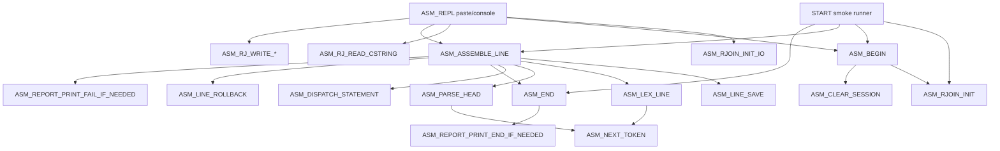
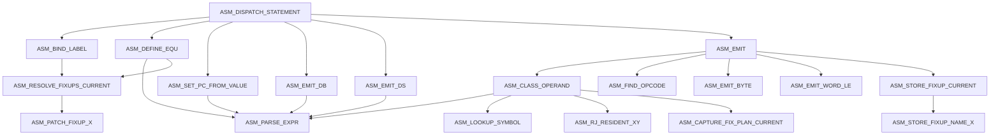
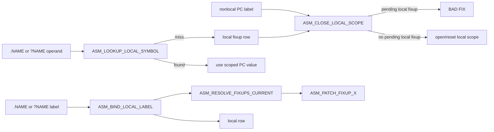

# ASM Call Map

This is the hand-maintained routine-flow map for `SRC/ASM/asm-v1-core.asm`.
It is meant to be useful in review: small enough to render, broad enough to
show where a change lands. For the design contract, read
[HASHED_ASM.md](HASHED_ASM.md). For test gates, read
[TEST_PLAN.md](TEST_PLAN.md).

Current proof shape:

```text
runtime paste entry       $2000
smoke output target       $7000
protected ASM/RJOIN seed  $7E00-$7E01
global symbols            32
fixups                    24
report refs               64
locals per global scope    8
local visible chars       15
```

## Primary Flow



## Statement Flow



## Local Label And Fixup Flow



## Edges To Remember

```text
ASM_BEGIN requires the HIMON RJOIN seed before opening a session.
ASM_ASSEMBLE_LINE is the transactional spine; line failure rolls back PC,
symbol, fixup, local, ref, and report cursors.
ASM_DISPATCH_STATEMENT owns top-level policy; classifiers should not decide
whether a token is a label.
Local labels are label-only PC aliases under the most recent nonlocal label.
Unresolved local fixups cannot cross into the next nonlocal scope.
Default flash ASM leaves detailed table reporting to the external
asm-session-report proof; locals remain intentionally outside global
report/export names.
```
