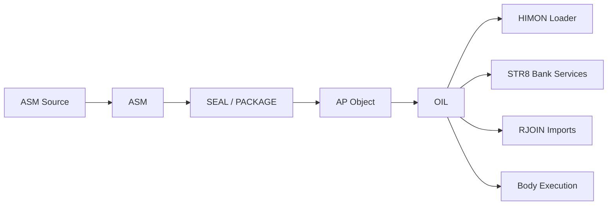
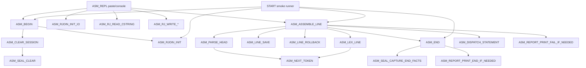
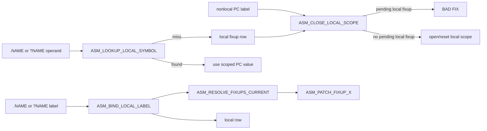
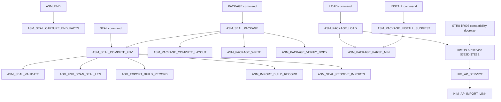

# ASM Call Map

This is the hand-maintained routine-flow map for `SRC/ASM/asm-v1-core.asm`.
It is meant to be useful in review: small enough to render, broad enough to
show where a change lands. For the design contract, read
[HASHED_ASM.md](HASHED_ASM.md). For test gates, read
[TEST_PLAN.md](TEST_PLAN.md).

Current proof shape:

```text
runtime paste entry       $2000
smoke output target       $7000
protected ASM/RJOIN seed  $7E00-$7E01
HIMON AP service vector   $7E2D-$7E2E
global symbols            $40 / 64
fixups                    $80 / 128
relocations               $10 / 16
exports                   $08 / 8
imports                   $08 / 8
report refs               $C0 / 192
locals per global scope   $10 / 16
local visible chars       15
```

## OIL Boundary

ASM creates the AP object. The **Overlay Integration Layer** takes over when
that object is stored, loaded, relocated, linked to resident imports, and run.



## Primary Flow



## Statement Flow

```mermaid
flowchart TD
    DISP["ASM_DISPATCH_STATEMENT"]
    BIND["ASM_BIND_LABEL"]
    EQU["ASM_DEFINE_EQU"]
    EXPORT["ASM_EXPORT_SYMBOL"]
    IMPORT["ASM_IMPORT_SYMBOL"]
    ENTRY["ASM_EXPORT_SYMBOL / entry flag"]
    ORG["ASM_SET_PC_FROM_VALUE"]
    DB["ASM_EMIT_DB"]
    DW["ASM_EMIT_DW"]
    DS["ASM_EMIT_DS"]
    EXPR["ASM_PARSE_EXPR"]
    CLASS["ASM_CLASS_OPERAND"]
    EMIT["ASM_EMIT"]
    FINDOP["ASM_FIND_OPCODE"]
    BYTE["ASM_EMIT_BYTE"]
    WORD["ASM_EMIT_WORD_LE"]
    LOOKUP["ASM_LOOKUP_SYMBOL"]
    RESIDENT["ASM_RJ_RESIDENT_XY"]
    FIXPLAN["ASM_CAPTURE_FIX_PLAN_CURRENT"]
    FIXSTORE["ASM_STORE_FIXUP_CURRENT"]
    FIXNAME["ASM_STORE_FIXUP_NAME_X"]
    IMPORTFIX["ASM_FIX_IMPORT_RELOC_X"]
    RELOCNOTE["ASM_RELOC_NOTE_*"]
    RESOLVE["ASM_RESOLVE_FIXUPS_CURRENT"]
    PATCH["ASM_PATCH_FIXUP_X"]

    DISP --> BIND
    DISP --> EQU
    DISP --> EXPORT
    DISP --> IMPORT
    DISP --> ENTRY
    DISP --> ORG
    DISP --> DB
    DISP --> DW
    DISP --> DS
    DISP --> EMIT

    EQU --> EXPR
    ORG --> EXPR
    DB --> EXPR
    DW --> EXPR
    DS --> EXPR

    EMIT --> CLASS
    EMIT --> FINDOP
    EMIT --> BYTE
    EMIT --> WORD
    EMIT --> FIXSTORE
    EMIT --> RELOCNOTE

    CLASS --> EXPR
    CLASS --> LOOKUP
    CLASS --> RESIDENT
    CLASS --> FIXPLAN

    FIXSTORE --> FIXNAME
    FIXSTORE --> IMPORTFIX
    BIND --> RESOLVE
    EQU --> RESOLVE
    RESOLVE --> PATCH
```



## Local Label And Fixup Flow



## Seal Package And AP Flow



## Edges To Remember

```text
ASM_BEGIN requires the HIMON RJOIN seed before opening a session.
ASM_ASSEMBLE_LINE is the transactional spine; line failure rolls back PC,
symbol, fixup, local, ref, and report cursors.
ASM_DISPATCH_STATEMENT owns top-level policy; classifiers should not decide
whether a token is a label.
Local labels are label-only PC aliases under the most recent nonlocal label.
Unresolved local fixups cannot cross into the next nonlocal scope.
IMPORT forces a deferred import fixup even when the same name is resident and
RJOIN-callable; plain undeclared resident operands still bind immediately.
SEAL builds the seal, relocation, export, and import records. PACKAGE writes
the AP envelope. LOAD delegates package consumption and resident RJOIN import
linking to the resident HIMON AP service. STR8 `$F006` remains only as a stable
compatibility doorway into the same service.
Default flash ASM leaves detailed table reporting to the external
asm-session-report proof; locals remain intentionally outside global
report/export names.
```
