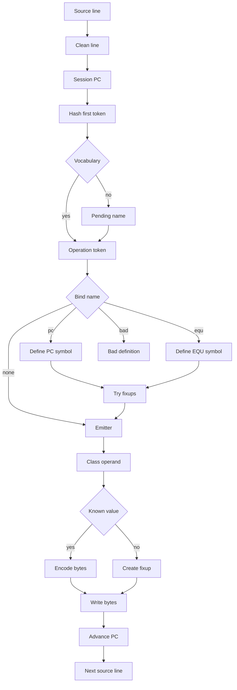
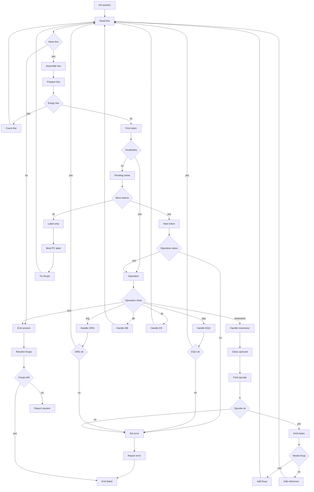
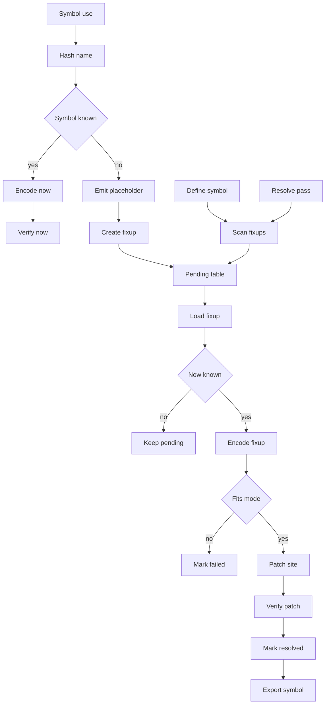
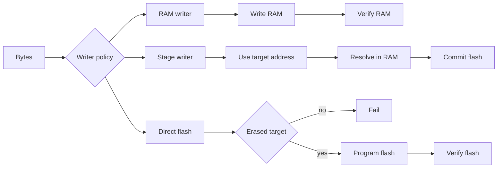
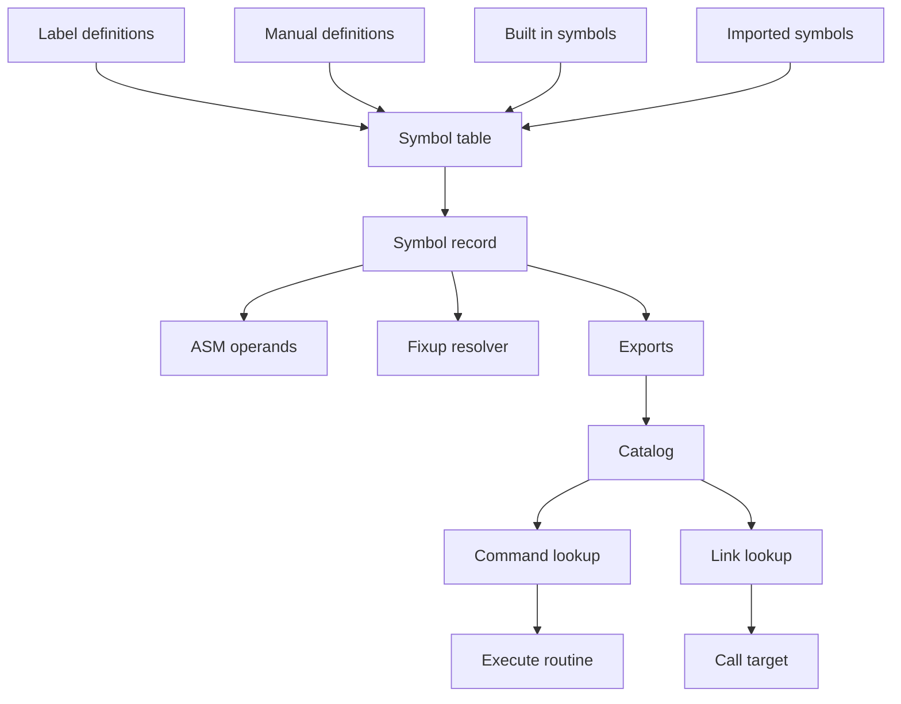
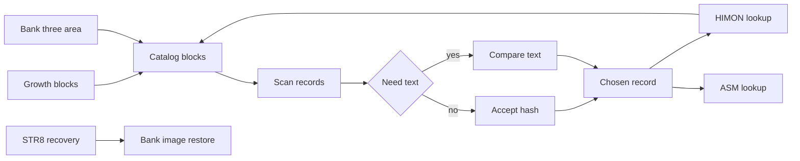

# Hashed Assembler Notes

This document captures a possible HIMON direction:

Status: this file was born under the `HASHED_ASM` name and still contains many
FNV-era examples. Treat those as current HIMON implementation history and
record-shape sketches. The settled split is FNV32 for public/exported symbols
and CRC16 or short IDs only for local/scoped tables where context handles
collisions.

Current WDC-compatibility correction: `DB` is the active v1 data directive.
`DC` is parked/reserved for now, so older `DC` examples in this narrative are
historical unless repeated in [DECISIONS.md](DECISIONS.md).

HIMON's `A` command is legacy mini-assembler code. ASM was once going to use
`A`, but that plan is canceled. ASM proper is its own hash-based source-line
parser and emitter: it can start proof-sized, then grow into HIMON-scale symbol
handling through its own hash-first vocabulary and symbol lookup. Once ASM can
compile ASM successfully, remove `A` from HIMON.

The short version:

```text
text name -> compact hash -> symbol record -> value/address -> emitted operand bytes
```

The hash is not the address. The hash is the lookup hint for a symbol record that
contains the address, kind, bank, flags, and optionally the original text.

ASM works with, uses, and respects hashing/RJOIN:

```text
source token -> canonical text -> FNV32 -> candidate record
candidate record -> RJOIN/HREC join proof -> exact value/kind/bank
exact value -> emitted operand bytes
```

For local RAM-session symbols, ASM works with its own symbol rows using the same
shape. For resident/exported symbols, ASM uses the hash-first RJOIN/HREC join
discipline already in HIMON: find by hash, prove the intended record by
kind/text/signature as available, then trust the joined record's exact address
or value. ASM respects the proof boundary: it must not bypass RJOIN by treating
a hash as an address, nor by silently accepting an unproved collision.

In THE terms:

```text
hash names and tokens
store exact addresses and values
optionally store proof text or signatures
```

## Settled V1 Snapshot

ASM v1 is a RAM-session, one-pass W65C02S assembler with explicit fixup records.
It emits native code, not bytecode, and keeps the "routines of routines" shape.

Settled ASM source line shape:

```text
[label[:]] operation [operand]
```

Core settled rules:

- Source tokens are canonicalized to uppercase outside quotes, bit 7 is masked
  before hashing, and `;` starts a comment.
- V1 input is proof-sized: 63 visible characters per source line. Spaces and
  tabs are whitespace; tabs have no column meaning.
- ASM proper reads full source lines. For the current test, lines can be pasted
  into the assembler input stream. HIMON's `A [addr] ... .` form is legacy
  HIMON mini-assembler syntax, not an ASM input path.
- The current runtime console treats human typing and pasted source as the same
  line input stream. A future `ASM I`/`ASM B` command split is only a parked
  presentation idea; it is not today's ASM path. See
  [INTERACTIVE_BATCH.md](INTERACTIVE_BATCH.md).
- The parser is hash-first. The first source token, after session-PC setup, is
  checked against ASM vocabulary. If it is not vocabulary, it is held as a
  pending definition name until the operation decides how to bind it.
- Resident/public symbol resolution works with, uses, and respects
  hash/RJOIN-shaped lookup: hash the canonical token, find candidate records,
  join/prove the intended record, then emit the joined record's exact value.
- `:` is optional label punctuation. Labels cannot be mnemonic, directive, or
  register names. `A`, `X`, and `Y` are reserved v1 register words.
- Locals are reserved but not v1. `.NAME`, `.NAME:`, `?NAME`, and `?NAME:`
  return `LOCAL NYI`.
- Address width is source intent. `$12` is zero page; `$0012` is absolute. No
  silent promotion or demotion.
- `EQU` records source width when the expression has address width. Decimal
  `EQU` values are concrete values, not memory-address operands.
- `EQU` must resolve now in v1. Forward references through fixups are for
  emitted bytes, not symbol equations.
- `<` and `>` select low/high bytes. V1 applies them as prefix selectors on one
  atom. `*` is the current assembly PC.
- V1 directives are `EQU`, `DB`, `DS`, `ORG`, and `END`. `DC`, `START`,
  `ENTRY`, and `EXTRN` are parked.
- `DB` v1 is simple byte/word/address data. `X'...'`, `B'...'`, `HBSTR`,
  `CSTR`, and `PSTR` are later.
- `ORG` sets PC, emits no bytes, and never moves backward.
- Unknown ordinary symbol operands default to absolute fixups unless the
  mnemonic forces another mode. Placeholder bytes are `$FF`.
- Bit operations use `RMB 3,$12`, `SMB 7,$12`, `BBR 3,$12,TARGET`,
  `BBS 7,$12,TARGET`; not `RMB3`/`BBS7` tokens.
- Opcode selection uses a mnemonic row table plus operand classifier. Regular
  W65C02S patterns may use `aaa bbb cc`, but irregular opcodes stay explicit.
- RAM session state holds emitted bytes, symbol rows, fixup rows, reference rows,
  line buffer, and scratch in non-overlapping ranges.
- ASM active zero-page scratch grows downward from `$AF`. The shared FNV32
  contract owns `$B0-$B3` for hash state and `$C7-$CA` for the multiply term.
  Other HIMON/shared ZP may be borrowed only as volatile scratch under the
  called routine's contract.
- Lookup is layered for HIMON scale: RAM session symbols, resident/catalog
  symbols, then fixup if allowed. A future resident table can use `SYM3`
  base-40 prefix keys.
- V1 must produce a basic session report: range, bytes, counts, unresolved
  fixups, used symbols with line numbers, unused session symbols, and resident
  symbols referenced.

Still open or later:

- expression grouping parentheses and richer expression features
- local-label implementation after `LOCAL NYI`
- resident HIMON-scale symbol table format/capacity
- rich report/export formats and whole-image unused-symbol analysis
- exact production RAM workspace addresses and memory policy validation

## ASM Course Catalog

The `ASM n.nn` numbers are a working course catalog for this assembler project.
They keep design passes, storage passes, and implementation passes from getting
mixed together. The gaps are intentional; leave room for classes the assembler
teaches us later.

Nested sections use `ASM n.nn.m`. Use the parent number for the broad course and
the child number for a stable subsection inside it:

```text
ASM 1.10     source rules
ASM 1.10.1   line shape and statement grammar
ASM 1.10.2   labels and optional colon
ASM 1.10.3   comments and whitespace
ASM 1.10.4   token case folding

ASM 1.30     session spine
ASM 1.30.1   ASM_BEGIN
ASM 1.30.2   ASM_ASSEMBLE_LINE
ASM 1.30.3   ASM_END

ASM 1.40     lexer/tokenizer
ASM 1.40.1   lexer boundary
ASM 1.40.2   token record
ASM 1.40.3   ASM_LEX_LINE
ASM 1.40.4   ASM_NEXT_TOKEN

ASM 1.50     vocabulary hash lookup
ASM 1.50.1   vocabulary boundary
ASM 1.50.2   vocabulary row shape
ASM 1.50.3   ASM_LOOKUP_WORD
ASM 1.50.4   collision policy
ASM 1.50.5   table generation checks

ASM 1.60     statement parser
ASM 1.60.1   parser boundary
ASM 1.60.2   statement record
ASM 1.60.3   ASM_PARSE_HEAD
ASM 1.60.4   ASM_DISPATCH_STATEMENT
ASM 1.60.5   parser errors

ASM 1.70     symbol table basics
ASM 1.70.1   symbol boundary
ASM 1.70.2   session symbol row
ASM 1.70.3   symbol kind and width
ASM 1.70.4   ASM_LOOKUP_SYMBOL
ASM 1.70.5   ASM_BIND_LABEL
ASM 1.70.6   ASM_DEFINE_EQU
ASM 1.70.7   duplicate and collision policy

ASM 1.80     expression evaluator
ASM 1.80.1   expression boundary
ASM 1.80.2   source grammar
ASM 1.80.3   expression result record
ASM 1.80.4   ASM_PARSE_EXPR
ASM 1.80.5   operator rules
ASM 1.80.6   unresolved-expression policy
ASM 1.80.7   expression errors

ASM 1.90     operand classifier
ASM 1.90.1   classifier boundary
ASM 1.90.2   operand result record
ASM 1.90.3   ASM_CLASS_OPERAND
ASM 1.90.4   syntax classes
ASM 1.90.5   mnemonic-aware rules
ASM 1.90.6   fixup planning
ASM 1.90.7   classifier errors
```

```text
ASM 1.00   V1 overview
ASM 1.10   source rules
ASM 1.20   calling contracts
ASM 1.30   session spine
ASM 1.40   lexer/tokenizer
ASM 1.50   vocabulary hash lookup
ASM 1.60   statement parser
ASM 1.70   symbol table basics
ASM 1.80   expression evaluator
ASM 1.90   operand classifier

ASM 2.00   emission overview
ASM 2.10   opcode emitter
ASM 2.20   fixups / patch records
ASM 2.30   DB/DS/ORG/END directive handlers
ASM 2.40   report/listing basics
ASM 2.50   status/error model
ASM 2.60   source input driver / pasted-line handling

ASM 3.00   memory overview
ASM 3.10   RAM workspace map and table layouts
ASM 3.20   zero-page frame layout
ASM 3.30   memory policy validator
ASM 3.40   output target validation

ASM 4.00   test overview
ASM 4.10   test samples / acceptance tests
ASM 4.20   bad-input / error acceptance tests

ASM 5.00   optimization overview
ASM 5.10   optimization pass for W65C02S size
ASM 5.20   routine factoring / code-size style
ASM 5.30   opcode table compression / aaa-bbb-cc helpers
ASM 5.40   full opcode coverage audit

ASM 6.00   future language
ASM 6.10   local labels / scopes later
ASM 6.20   resident symbol table / HIMON-scale lookup
ASM 6.30   richer reports / ref/xref
ASM 6.40   flash/catalog seal/export later
ASM 6.50   RPKG/RREC export shape
ASM 6.90   provenance / original-design notes

ASM 8.00   implementation plan for first ASM build
ASM 8.10   implement session spine
ASM 8.20   implement lexer
ASM 8.30   implement vocabulary lookup
ASM 8.40   implement symbol table
ASM 8.50   implement expression evaluator
ASM 8.60   implement operand classifier
ASM 8.70   implement emitter
ASM 8.80   implement fixups
ASM 8.90   implement directives

ASM 9.00   integration
ASM 9.10   integrate report
ASM 9.20   integrate status/error handling
ASM 9.30   integrate input driver
ASM 9.40   assemble ASMTEST_3000
ASM 9.50   assemble larger proof
ASM 9.90   ASM assembles ASM milestone
ASM 9.99   remove legacy A from HIMON
```

Future operator diagnostics are a separate lane. Use `ASM-xxxx` for
S/36-style message IDs and later WTOR/reply policy. For example, `ASM 2.50` is
the status/error design chapter; `ASM-0105` could later be the operator message
for `BAD WIDTH` with its allowed replies. V1 still stops on the first error.

## Why This Exists

The goal is to keep the system self-hosting-friendly:

- assemble and test small routines onboard
- add named commands without an external linker
- refer to routines by stable names instead of fixed addresses
- support forward labels without requiring a full object format
- stay close to HIMON's "routines of routines" shape

This is not meant to replace a full WDC toolchain immediately. It is a small monitor-local resolver wrapped around the existing `A` assembler path.

## Has This Been Done Before?

Parts of it have absolutely been done before.

- Forth systems use dictionaries/wordlists: named words are added and later found by the interpreter.
- Object formats such as ELF use symbol tables plus relocation records to connect symbolic references with definitions.
- ELF also has a symbol hash table for faster symbol lookup during dynamic linking.

The unusual HIMON part is the combination:

```text
small 65C02 monitor
+ compact command/name hashes
+ onboard one-line assembler
+ flash/RAM symbol records
+ fixup records small enough to manage by hand
```

So the idea is not magic. It is more like a tiny linker/assembler dictionary, shaped for a W65C02S monitor instead of a host OS.

## Core Model

A named thing is a symbol.

Examples:

```text
MYWORD
SYS_WRITE_CHAR
LOOP
BOARD_LEFT
```

A symbol record maps the name hash to a value:

```text
hash("MYWORD") -> value=$2480, kind=code, bank=3, flags=defined
```

Then this source:

```asm
JSR MYWORD
```

can be emitted as:

```text
20 80 24
```

because `JSR abs` needs the 16-bit value of `MYWORD`.

## Address Hashes Are Not Values

For ASM resolution, do not hash raw numeric addresses and then treat that hash
as the thing to emit or patch. Address hashes can only be proof/check metadata
for a larger record. The assembler still needs exact address/value fields,
patch sites, origins, banks, and kinds.

The exploratory what-if belongs in the scratchpad:
[IDEAS.md](../../IDEAS.md).

The executable test ladder lives in [TEST_PLAN.md](TEST_PLAN.md). It starts
with host-side checks for `ASMTEST_3000.asm`, then grows layer by layer as ASM
adds tokenizing, vocabulary lookup, parsing, symbols, expressions, classification,
emission, fixups, directives, and reports.

## Legacy HIMON A Command Shape

Keep this only as a record of the old HIMON mini-assembler command shape:

```text
A [addr] [label[:]] MMM [operand] .
```

This is not ASM source grammar, not an ASM wrapper, and not the hash-based ASM
parser. ASM was going to use `A`; that is no longer the plan. When ASM can
compile ASM successfully, remove `A` from HIMON.

Meaning:

```text
A          HIMON command: assemble one statement
[addr]     optional explicit assembly address / PC set
[label[:]] optional symbol definition; colon is allowed but not required
MMM        mnemonic token
[operand]  optional operand token/expression
.          explicit end of one-line HIMON mini-assembler statement
```

Examples:

```text
A 2000 START: LDX #FF .
A      LOOP   JSR MYWORD .
A 2005        BRA LOOP .
```

Legacy A ordering, for comparison only:

```text
1. If `addr` is present, set assembly PC to `addr`.
2. Parse the rest by the old HIMON `A` rules, not by ASM's hash-first parser.
3. Emit one mini-assembler statement or enter old interactive `A` behavior.
```

This order is monitor-shaped: address comes immediately after `A`. Do not use
this as the ASM parse contract.

ASM proper does not require the leading `A` or trailing `.`. It reads full
source lines:

```asm
START:  LDX     #$FF
LOOP    JSR     MYWORD
        BRA     LOOP
```

In ASM proper, the operation token is not text decoration. It is the dispatch
hash for a small emitter path:

```text
canonical mnemonic -> hash -> mnemonic/emitter family -> mode-specific opcode
```

The operand decides the mode:

```text
implied
accumulator
immediate
absolute
zero-page
relative
indirect
indexed
label-as-operand
```

The first version can still be strict:

- one instruction per source line
- labels are optional
- label names are reserved away from mnemonic names
- mnemonic names are reserved away from labels
- expressions stay small and source-infix; no RPN source
- forward labels create fixups

## Label Syntax Path Considered

The settled ASM parser accepts the terse source form:

```text
[label] [operation [operand]]
```

Labels do not require `:`. Leading spaces are not required before mnemonics;
indentation is cosmetic only in v1. The parser strips an optional trailing colon
for the vocabulary check, then hashes the first token against the ASM
vocabulary. If that token is vocabulary, it is the operation. If it is not
vocabulary, it is a pending definition name and the next token, if present, must
be the operation.

Legal label/source shapes:

```text
LABEL CMD OP
LABEL: CMD OP
LABEL
LABEL:
```

`CMD` here means an ASM operation token: mnemonic or directive. `OP` is the
optional operand field.

```text
LOOP LDA #01
  label=LOOP, mnemonic=LDA

LOOP: LDA #01
  label=LOOP, mnemonic=LDA

LOOP BRA DONE
  label=LOOP, mnemonic=BRA, operand=DONE

LABEL2
  label=LABEL2 at current PC, emit nothing

LABEL2:
  label=LABEL2 at current PC, emit nothing
```

This can work if label names are forbidden from being mnemonic names. It is
compact and very assembler-like. It also makes label-only lines natural: a
label-only line simply binds the label to the current assembly PC.

The colon form remains accepted as readable punctuation:

```text
[label:] operation [operand]
```

`LABEL:` is the explicit visual form. `LABEL` is the compact monitor form.
Both define the same symbol when the token is not ASM vocabulary and the next
token is a valid mnemonic or directive.

Hard final rule:

```text
labels may optionally end with `:`
labels, with or without `:`, are hashed against ASM vocabulary first
labels may not be mnemonic, directive, or register names
mnemonics, directives, and A/X/Y register words are reserved words
```

## ASM 1.10 Source Rules

### ASM 1.10.1 Line Shape And Statement Grammar

One source line is one statement. ASM v1 has no multiple statements per line and
no trailing `.` terminator.

Accepted statement shapes:

```text
blank/comment line
LABEL
LABEL:
CMD [operand]
LABEL CMD [operand]
LABEL: CMD [operand]
```

Binding rule:

```text
LABEL mnemonic operand      LABEL = current PC before emitting
LABEL DB ...                LABEL = current PC before data
LABEL DS ...                LABEL = current PC before storage
LABEL EQU expr              LABEL = expression value
LABEL alone                 LABEL = current PC
LABEL: alone                LABEL = current PC
```

Directive shapes:

```text
NAME EQU expr
[NAME] DB item[,item...]
[NAME] DS count[,init...]
ORG expr
END
```

Reject these in v1:

```asm
LABEL ORG $2000     ; BAD SYM
LABEL END           ; BAD SYM
EQU $12             ; BAD SYM
ORG                 ; BAD OPER
END anything        ; BAD OPER
LDA #1 extra        ; BAD OPER
```

`ORG` and `END` are session/control statements, not label-binding statements.
That is why `LABEL END` is `BAD SYM`, not "define the label, then end."
Trailing non-comment junk after a complete statement is `BAD OPER`.

## Canonical Tokens And Comments

ASM 1.10.1 source-line contract:

```text
ASM reads one full source line
max visible line length is 63 characters in v1
spaces and tabs are whitespace
tabs have no column meaning in v1
empty or comment-only lines are OK
too-long line returns BAD LINE
```

Before hashing, ASM canonicalizes source tokens this way:

```text
fold lowercase letters to uppercase outside quotes
preserve exact character case inside quotes
mask bit 7 from input bytes before FNV update
strip optional trailing colon from label definitions
```

The bit-7 rule matches existing HIMON/HBSTR/FNV behavior: high-bit termination
belongs to storage and line input, not to symbol identity.

V1 symbol text is capped at 31 visible characters. The current
`asm-rjoin-proof-3000.asm` proof stores fixup names in `$20`-byte slots, so 31
characters plus terminator is the practical assembler limit to honor first.
HIMON command input can carry longer text, but ASM v1 should fail clearly if a
symbol exceeds the v1 cap.

Allowed v1 symbol characters:

```text
A-Z
0-9
_
.        local label prefix/character
?        local label prefix
```

Global symbols must not begin with `0-9`. Dot and question mark are reserved
local-prefix characters, are prefix-only, and should return `LOCAL NYI` in v1.
Comma is not a symbol character. It is operand punctuation/separator:

```asm
        LDA     $12,X
        BBR     3,$12,TARGET
```

Colon is optional label punctuation and is not part of the symbol. A standalone
dot is not ASM source syntax; if it is used as a paste/input sentinel, the input
driver consumes it before `ASM_ASSEMBLE_LINE`. Dot-leading tokens such as
`.LOOP` are reserved local symbols.

Comments:

```text
; starts a comment and runs to end of line
```

V1 token classes:

```text
WORD       symbol, mnemonic, directive
NUMBER     decimal, $hex, %binary, %mask
CHAR       'A', 'a', '''
STRING     later, for HBSTR/CSTR/PSTR
PUNCT      # , ( ) < > + - * | & ^ : .
COMMENT    ; through end of line
EOL        end of source line
```

## ASM 1.40 Lexer/Tokenizer

ASM 1.40 turns source text into token facts. The statement head can use a light
word scan because it only needs "first word, maybe second word, then operand
tail." Full token records are mainly needed for the operand/expression tail,
where punctuation, numbers, quotes, indexes, and operators matter. The lexer
does not decide whether a word is a label, mnemonic, directive, or symbol use.
It does not pick an addressing mode. It does not evaluate expressions except
for the one-byte character literal value. Those decisions belong to later
parser, expression, and operand-classifier passes.

The v1 lexer is streaming:

```text
prepare line once
return one token at a time
keep only one current token record
copy text later only when symbol/fixup storage needs it
```

### ASM 1.40.1 Lexer Boundary

Lexer-owned jobs:

```text
skip spaces and tabs
count/check the 63 visible character limit
stop at NUL, CR, LF, or ; outside quotes
preserve source bytes/case inside character quotes
canonicalize WORD token identity to uppercase outside quotes
mask bit 7 before hashing token identity
recognize token kind and simple number subkind
return punctuation as one-byte tokens
detect malformed character literals
detect invalid % binary/mask tokens
```

Not lexer-owned:

```text
mnemonic/directive lookup
label versus operation decision
symbol legality beyond obvious token shape
numeric range and address-width policy
expression operator precedence, because v1 has none
operand addressing-mode classification
fixup creation
```

### ASM 1.40.2 Token Record

The lexer returns facts in the active ASM zero-page frame. Exact byte addresses
can move, but the logical record is:

```text
TOK_KIND     EOL, WORD, NUMBER, CHAR, PUNCT
TOK_SUB      DEC, HEX, BIN, MASK, or punctuation byte
TOK_FLAGS    HAS_COLON, HAS_XMASK, QUOTED, LOCAL_PREFIX, ERROR
TOK_PTR      pointer to source start byte
TOK_LEN      visible token length, excluding optional label colon
TOK_DELIM    delimiter that stopped the token
TOK_HASH32   FNV32 of canonical token text for WORD tokens
TOK_VALUE    character byte for CHAR; optional small parsed value later
TOK_STATUS   OK or BAD LINE/BAD OPER
```

`COMMENT` is recognized but not normally returned to the parser. A `;` outside
quotes makes the next token `EOL`.

`WORD` token hashing rules:

```text
fold a-z to A-Z
mask bit 7 before FNV update
exclude optional trailing colon from hash and length
set HAS_COLON if the colon was attached to the word
keep leading . or ? in the token so v1 can return LOCAL NYI
```

### ASM 1.40.3 ASM_LEX_LINE

```text
name        ASM_LEX_LINE
purpose     prepare one source line for streaming token reads

inputs      X = source line pointer low
            Y = source line pointer high

outputs     C=1,A=OK if the line is usable
            C=0,A=BAD LINE if the visible line is too long/unreadable
            ASM_LINE_PTR and ASM_PARSE_PTR point at the line

carry       C=1 lexer state ready
            C=0 caller must stop this line

preserves   caller line buffer contents
clobbers    A,X,Y,P and ASM lexer fields
ZP          ASM_LINE_PTR, ASM_PARSE_PTR, ASM_DELIM, ASM_STATUS
RAM         none, except session error state on failure
stack       balanced; return frame only
calls       none required

errors      BAD LINE
```

`ASM_LEX_LINE` does not strip or rewrite the line. It sets lexer state and
checks the visible length up to NUL, CR, LF, or `;` outside quotes. Quote
contents count as visible source characters.

### ASM 1.40.4 ASM_NEXT_TOKEN

```text
name        ASM_NEXT_TOKEN
purpose     return the next token from the prepared source line

inputs      ASM_PARSE_PTR points at the next scan position

outputs     C=1,A=OK with token record filled
            C=0,A=status on malformed token
            X/Y = TOK_PTR low/high for WORD/NUMBER/CHAR when useful

carry       C=1 token accepted, including EOL
            C=0 stop this line

preserves   caller line buffer contents
clobbers    A,X,Y,P and current token fields
ZP          ASM_PARSE_PTR, ASM_TOKEN_PTR, ASM_HASH32, ASM_LEN, ASM_DELIM,
            ASM_VALUE, ASM_FLAGS, ASM_STATUS
RAM         none, except session error token/status on failure
stack       balanced; return frame only
calls       FNV update helper if shared; otherwise inline hash loop

errors      BAD OPER for malformed quote, invalid `%` token, or bad punctuation
            BAD LINE for line/end condition the lexer cannot read safely
```

Token scan rules:

```text
space/tab       skipped
NUL/CR/LF       EOL
; outside quote EOL
# , ( ) < > + - * | & ^ :   PUNCT
.NAME/?NAME     WORD with LOCAL_PREFIX, later LOCAL NYI
. alone         PUNCT '.', later BAD OPER unless input driver consumed it
'A'             CHAR, value $41
'a'             CHAR, value $61
'''             CHAR, value $27
123             NUMBER DEC
$FF             NUMBER HEX
$123            NUMBER HEX, later BAD WIDTH where appropriate
%10101010       NUMBER BIN
%XXXXXXX1       NUMBER MASK
```

For `%` tokens, the lexer enters binary/mask mode until the token delimiter.
Only `0`, `1`, `X`, and `x` are legal. The digit count must be exactly 8 or 16.
If any `X`/`x` appears, set `HAS_XMASK` and return subkind `MASK`; otherwise
return subkind `BIN`.

For character literals, v1 accepts exactly one character byte between quotes,
with the special spelling `'''` for a single quote character. No C-style escape
sequences are recognized in v1.

The lexer should not classify single-letter `A`, `X`, or `Y` specially. It
returns them as `WORD`; the parser/operand classifier applies the reserved
register rules in context.

## ASM 1.50 Vocabulary Hash Lookup

ASM 1.50 answers one narrow question: "Is this canonical word assembler
vocabulary, and if so, what kind?" It does not parse operands, resolve user
symbols, or choose opcodes. It is the lookup step between the line-head word
scanner and the statement parser.

The v1 line-head shape is deliberately small:

```text
scan first word
lookup first word in ASM vocabulary
if mnemonic/directive: it is the operation
if not vocabulary: hold it as pending definition name
if pending name exists, scan second word and require mnemonic/directive
the remainder of the line is the operand/directive tail
```

### ASM 1.50.1 Vocabulary Boundary

Vocabulary-owned jobs:

```text
recognize mnemonics
recognize directives
recognize reserved register words A/X/Y
recognize parked/reserved directive words when they must not be labels
return compact row facts for parser/emitter dispatch
```

Not vocabulary-owned:

```text
symbol-table lookup for user labels
resident/catalog symbol lookup
operand classification
expression evaluation
opcode byte selection
directive operand parsing
```

Vocabulary result kinds:

```text
VOC_NONE       no vocabulary row; caller may treat as pending name/symbol
VOC_MNEM       executable instruction mnemonic
VOC_DIR        active v1 directive
VOC_REG        reserved register word A/X/Y
VOC_RESERVED   parked/future word that cannot be a user label in v1
VOC_ALIAS      future compatibility alias, not v1
```

Statement-head policy:

```text
first word VOC_MNEM/VOC_DIR      operation
first word VOC_NONE              pending definition name
first word VOC_REG/VOC_RESERVED  BAD SYM if used as a definition name
second word must be VOC_MNEM or VOC_DIR when a pending name exists
second word VOC_NONE/VOC_REG     BAD MNEM
parked directive used as op      BAD DIR
```

### ASM 1.50.2 Vocabulary Row Shape

Conceptual row:

```text
VOC_TEXT      canonical spelling, build-time/listing/proof text
VOC_HASH32    FNV32 of canonical spelling
VOC_KIND      MNEM, DIR, REG, RESERVED, ALIAS
VOC_ID        mnemonic id, directive id, register id, or reserved id
VOC_FLAGS     active, parked, operand-only, needs-handler, etc.
VOC_DISP      handler/family id or compact dispatch byte
VOC_AUX       mode mask, opcode family, or small helper index
```

W65C02S implementation may store this as parallel arrays instead of row
records:

```text
VOC_HASH0..3[slot]
VOC_KIND[slot]
VOC_ID[slot]
VOC_DISP[slot]
VOC_AUX[slot]
```

Mnemonic rows feed the later opcode emitter. Directive rows feed directive
handlers. Register rows reserve `A`, `X`, and `Y` so they cannot become labels,
but they are not statement operations.

### ASM 1.50.3 ASM_LOOKUP_WORD

```text
name        ASM_LOOKUP_WORD
purpose     look up a canonical WORD token in the ASM vocabulary table

inputs      current token/head-word record is WORD
            TOK_HASH32 = FNV32 of canonical word
            TOK_PTR/TOK_LEN identify the source spelling

outputs     C=1,A=OK if a vocabulary row is found
            C=0,A=OK if no vocabulary row is found
            X = vocabulary slot or $FF when not found
            Y = VOC_KIND or VOC_NONE
            ASM_SLOT/VOC_ID/VOC_DISP fields loaded when found

carry       C=1 found vocabulary
            C=0 not vocabulary, not an error by itself

preserves   caller line buffer contents
clobbers    A,X,Y,P and lookup/hash scratch
ZP          ASM_HASH32, ASM_SCAN_PTR, ASM_SLOT, ASM_STATUS
RAM         none
stack       balanced; return frame only
calls       optional text-compare helper if a hash collision row exists

errors      none for not-found; table corruption is a build/test failure
```

`ASM_LOOKUP_WORD` reports facts. The parser decides whether those facts are
legal in the current position.

### ASM 1.50.4 Collision Policy

Hashing is a lookup accelerator, not truth. For the fixed ASM vocabulary, the
build must verify:

```text
no duplicate canonical text
no duplicate active hash unless runtime text compare is present
mnemonic ids are unique
directive ids are unique
parked/reserved names are intentional
```

If the fixed vocabulary has no FNV32 collisions, v1 runtime may compare row
hashes only. If a collision ever appears, the table must either carry enough
canonical text to prove the row or the build must fail. Do not silently accept
the first matching hash.

### ASM 1.50.5 Table Generation Checks

Build the vocabulary table in alphabetical canonical-token order. Store the
hash beside the dispatch facts. Runtime v1 may scan linearly; sorted order is
for reproducibility, listings, and later binary search.

V1 active directive words:

```text
DB
DS
END
EQU
ORG
```

Parked reserved directive words:

```text
DC
ENTRY
EXTRN
START
```

Reserved register words:

```text
A
X
Y
```

Do not add `RMB3`, `SMB7`, `BBR3`, or `BBS7` as vocabulary tokens in v1. The
mnemonic is `RMB`, `SMB`, `BBR`, or `BBS`; the bit number is operand syntax.

## ASM 1.60 Statement Parser

ASM 1.60 turns a prepared line into a statement record and dispatch decision.
It owns the line-head grammar:

```text
blank/comment line
LABEL
LABEL:
CMD [operand-tail]
LABEL CMD [operand-tail]
LABEL: CMD [operand-tail]
```

It uses the light word scan from `ASM 1.40` and the vocabulary lookup from
`ASM 1.50`. It identifies the operation and the operand/directive tail, but it
does not tokenize the full operand tail unless a later parser asks for it.

### ASM 1.60.1 Parser Boundary

Parser-owned jobs:

```text
accept blank/comment-only lines
scan first word
look up first word in ASM vocabulary
decide operation-only versus pending definition name
scan second word when a pending definition name exists
reject reserved words used as labels
identify label-only lines
set the operand/directive tail pointer
enforce top-level directive shapes for EQU/ORG/END
dispatch mnemonic, directive, or label-only statement class
```

Not parser-owned:

```text
full operand tokenization
expression evaluation
operand addressing-mode classification
opcode byte choice
symbol table insertion details
fixup record creation
report formatting
```

### ASM 1.60.2 Statement Record

Logical statement record:

```text
STMT_KIND     EMPTY, LABEL_ONLY, MNEM, DIR, ERROR
STMT_FLAGS    HAS_NAME, HAS_COLON, HAS_TAIL, BINDS_PC, BINDS_EQU, CONTROL
STMT_NAMEPTR  pending definition name pointer, if any
STMT_NAMELEN  pending definition name length, colon excluded
STMT_NAMEHASH FNV32 for pending definition name
STMT_VOCSLOT  vocabulary slot for operation
STMT_OPKIND   VOC_MNEM or VOC_DIR
STMT_OPID     mnemonic/directive id
STMT_TAILPTR  pointer to operand/directive tail after operation
STMT_STATUS   OK or BAD xxx
```

The statement record may live in zero page while a line is being assembled. It
does not need to be stored for the whole session unless a later listing/report
feature wants it.

### ASM 1.60.3 ASM_PARSE_HEAD

```text
name        ASM_PARSE_HEAD
purpose     parse the line head and fill the current statement record

inputs      ASM_PARSE_PTR points at the prepared source line

outputs     C=1,A=OK with STMT record filled
            C=0,A=status with error token/name stored if available
            X/Y = STMT_TAILPTR low/high when useful

carry       C=1 statement head accepted
            C=0 top-level statement error

preserves   caller line buffer contents
clobbers    A,X,Y,P, current token/head fields, statement fields
ZP          ASM_PARSE_PTR, ASM_TOKEN_PTR, ASM_HASH32, ASM_LEN, ASM_SLOT,
            ASM_STATUS, statement fields
RAM         none except session error token/status on failure
stack       balanced; return frame only
calls       ASM_NEXT_TOKEN or light head-word scanner, ASM_LOOKUP_WORD

errors      BAD SYM, BAD MNEM, BAD DIR, BAD OPER, LOCAL NYI
```

Head parse sketch:

```text
skip whitespace
if EOL/comment: STMT_KIND=EMPTY, OK

read first word
lookup first word

if first is VOC_MNEM/VOC_DIR:
    operation = first word
    pending name = none
    tail = rest of line after operation
    return statement

if first is VOC_REG/VOC_RESERVED:
    return BAD SYM

if first is VOC_NONE:
    pending name = first word
    validate name shape
    if local prefix: return LOCAL NYI
    skip whitespace
    if EOL/comment:
        STMT_KIND=LABEL_ONLY
        return statement
    read second word
    lookup second word
    if second is not VOC_MNEM/VOC_DIR:
        return BAD MNEM
    operation = second word
    tail = rest of line after operation
    return statement
```

Attached colon handling:

```text
LOOP:      pending name LOOP with HAS_COLON
LOOP: LDA pending name LOOP, operation LDA
LDA:      BAD SYM because LDA is vocabulary before label handling
```

### ASM 1.60.4 ASM_DISPATCH_STATEMENT

```text
name        ASM_DISPATCH_STATEMENT
purpose     apply top-level statement policy and call the correct next layer

inputs      current STMT record from ASM_PARSE_HEAD

outputs     C=1,A=OK,X/Y=current ASM PC if statement accepted
            C=0,A=status,X/Y=current ASM PC if statement failed

carry       C=1 accepted
            C=0 stop assembly

preserves   caller line buffer contents
clobbers    A,X,Y,P and statement/helper scratch
ZP          statement fields, ASM_STATUS, helper scratch as called
RAM         symbol/fixup/ref rows and emitted target bytes through callees
stack       balanced; callees document their own stack use
calls       ASM_BIND_LABEL, directive handlers, ASM_CLASS_OPERAND, ASM_EMIT,
            ASM_TRY_FIXUPS, ASM_END, ASM_FAIL

errors      BAD SYM, BAD DIR, BAD OPER, BAD MODE, BAD WIDTH, BAD RANGE,
            BAD FIX, LOCAL NYI
```

Dispatch policy:

```text
EMPTY          accept, emit nothing
LABEL_ONLY     bind pending name to current PC, try fixups
MNEM no name   classify operand tail, emit instruction
MNEM with name bind name to current PC, try fixups, then emit instruction
DB/DS with name bind name to current PC, try fixups, then handle directive
EQU with name  parse expression and define symbol value
EQU no name    BAD SYM
ORG with name  BAD SYM
END with name  BAD SYM
ORG no tail    BAD OPER
END with tail  BAD OPER
END clean      call ASM_END
```

The parser may check only for "tail exists" or "tail absent." Detailed operand
tail validity belongs to directive, expression, and operand-classifier code.

### ASM 1.60.5 Parser Errors

Top-level parser errors stay boring:

```text
BAD SYM    bad/missing definition name, reserved word as label, LABEL ORG/END
BAD MNEM   second word after pending name is not a mnemonic/directive
BAD DIR    parked or unsupported directive used as an operation
BAD OPER   missing/extra top-level operand tail, bad statement punctuation
LOCAL NYI  .NAME or ?NAME seen where a symbol would otherwise be accepted
```

Examples:

```asm
EQU $12             ; BAD SYM
LABEL ORG $2000     ; BAD SYM
LABEL END           ; BAD SYM
FOO BAR             ; BAD MNEM if BAR is not vocabulary
ORG                 ; BAD OPER
END X               ; BAD OPER
START               ; BAD DIR in v1, parked directive
.LOOP               ; LOCAL NYI
```

## ASM 1.70 Symbol Table Basics

ASM 1.70 owns the RAM-session symbol table contract. It is not the full
HIMON-scale resident symbol design; it is the workbench table needed for the
first assembler.

Symbol-table jobs:

```text
store canonical user-defined names
prove hash hits by length/text compare
define PC labels and EQU symbols
reject duplicate definitions
return value, kind, width, and mask-care information
mark used symbols for the v1 report
wake fixups after a new definition
leave resident/catalog lookup as a later layer
```

Not symbol-table jobs:

```text
tokenizing source
deciding whether a token is mnemonic/directive vocabulary
evaluating expressions
classifying operand addressing modes
encoding opcodes
owning resident HIMON-scale symbol storage
```

### ASM 1.70.1 Symbol Boundary

V1 symbol handling is global-session only. Local labels are still `LOCAL NYI`,
so the symbol table does not create local scopes yet.

Lookup is layered by policy:

```text
1. RAM session symbols
2. resident HIMON/catalog/export symbols, later
3. unresolved forward fixup, only when the caller allows a fixup
```

The RAM session table is the only table ASM v1 mutates. Resident/public symbols
are read-only candidates when that layer is added.

The future "ASM assembles ASM/HIMON" goal may need temporary storage, flash
workspace, compression, or both. That belongs to the resident-scale symbol table
and workspace design later. Do not burden v1 symbol rows with that machinery.

### ASM 1.70.2 Session Symbol Row

Logical RAM session symbol row:

```text
SYM_STATE    EMPTY, DEFINED
SYM_FLAGS    USED, HAS_TEXT, HAS_CARE, FROM_LABEL, FROM_EQU
SYM_KIND     VALUE, ADDR, MASK
SYM_WIDTH    NONE, BYTE, WORD, ZP, ABS, MASK8, MASK16
SYM_VALUE    16-bit value/address
SYM_CARE     16-bit mask care bits; all ones for concrete values
SYM_HASH32   FNV32 of canonical symbol text
SYM_NAMELEN  canonical name length, 1..31
SYM_NAMEPTR  pointer/offset into session name pool
SYM_DEF_LINE physical source line where defined
SYM_USECNT   count of references seen in this session
SYM_FIRSTREF first reference line, 0 if unused
```

Rows are logical. On W65C02S, store them as parallel arrays indexed by slot when
that saves bytes and matches the current proof style.

Name text is not decoration. For RAM session symbols it is part of the identity
proof and report support. Hash finds a candidate; canonical length/text proves
the candidate.

Do not store `SYM3` in v1 RAM symbol rows. Compute it later when resident-scale
lookup needs the first-three-character filter.

### ASM 1.70.3 Symbol Kind And Width

Keep symbol meaning separate from symbol spelling:

```text
VALUE  concrete number/character value, no memory-address mode by itself
ADDR   memory address symbol
MASK   mask value with value/care/width
```

Width rules:

```text
LABEL bound to PC       KIND=ADDR, WIDTH=ABS
FOO EQU $12             KIND=ADDR, WIDTH=ZP
FOO EQU $0012           KIND=ADDR, WIDTH=ABS
FOO EQU $1234           KIND=ADDR, WIDTH=ABS
COUNT EQU 10            KIND=VALUE, WIDTH=NONE
CH EQU 'A'              KIND=VALUE, WIDTH=BYTE
ERR EQU %XXXXXXX1       KIND=MASK, WIDTH=MASK8
FLAGS EQU ERR_1 | ERR_2 KIND=MASK or VALUE after expression result
```

A PC label is an absolute address because the location counter is a 16-bit CPU
address. Use `EQU $12` for a zero-page variable name. Do not infer zero page
from a label value below `$0100`.

### ASM 1.70.4 ASM_LOOKUP_SYMBOL

```text
name        ASM_LOOKUP_SYMBOL
purpose     find a symbol candidate and return its row/value information

inputs      ASM_NAME_PTR/ASM_LEN point at canonical symbol text
            ASM_HASH32 holds FNV32 for that canonical text
            A flags say which layers are allowed:
              bit0 session
              bit1 resident later
              bit2 mark use/reference

outputs     C=1,A=OK,X=symbol slot,Y=source layer when found
            C=0,A=OK,X=$FF,Y=0 when not found
            C=0,A=BAD_FIX when mark-use exceeds the report reference budget
            value/kind/width/care copied to ASM_VALUE/ASM_MODE fields if found

carry       C=1 found
            C=0 not found or mark-use overflow; not-found is not an error by itself

preserves   caller line buffer contents
clobbers    A,X,Y,P, scan/hash compare scratch
ZP          ASM_NAME_PTR, ASM_LEN, ASM_HASH32, ASM_SCAN_PTR, ASM_SLOT,
            ASM_VALUE, ASM_WIDTH, ASM_CARE, ASM_FLAGS
RAM         may update USECNT/FIRSTREF and the report reference count if mark-use is set
stack       balanced; return frame only
calls       name compare/hash helpers, resident lookup later

errors      none for not-found; BAD FIX only if mark-use/reference table full
```

Not-found is a normal answer. The caller decides whether not-found means
`BAD SYM`, an allowed forward fixup, or an unresolved `EQU` error.

### ASM 1.70.5 ASM_BIND_LABEL

```text
name        ASM_BIND_LABEL
purpose     define a pending statement name as the current PC

inputs      STMT_NAMEPTR/STMT_NAMELEN/STMT_NAMEHASH
            current ASM PC

outputs     C=1,A=OK,X=symbol slot,Y=current PC high when defined
            C=0,A=status when rejected

carry       C=1 label defined
            C=0 duplicate/bad/full

preserves   caller line buffer contents
clobbers    A,X,Y,P, symbol/name-pool scratch
ZP          ASM_NAME_PTR, ASM_LEN, ASM_HASH32, ASM_VALUE, ASM_WIDTH,
            ASM_STATUS, ASM_SLOT, ASM_SYM_PTR
RAM         symbol rows, name pool, session counts; fixups through TRY
stack       balanced; callees document their own stack use
calls       ASM_LOOKUP_SYMBOL session-only, ASM_ALLOC_SYMBOL, ASM_COPY_NAME,
            ASM_TRY_FIXUPS

errors      BAD SYM if name invalid, duplicate, or symbol/name pool full
            BAD FIX if waking fixups fails
```

`ASM_BIND_LABEL` stores `KIND=ADDR`, `WIDTH=ABS`, and `VALUE=current PC`. The
same routine handles `LABEL` and `LABEL:`.

### ASM 1.70.6 ASM_DEFINE_EQU

```text
name        ASM_DEFINE_EQU
purpose     define a pending statement name from a resolved expression result

inputs      STMT_NAMEPTR/STMT_NAMELEN/STMT_NAMEHASH
            ASM_VALUE/ASM_CARE/ASM_WIDTH/ASM_FLAGS from expression evaluator

outputs     C=1,A=OK,X=symbol slot,Y=kind/width summary when defined
            C=0,A=status when rejected

carry       C=1 EQU symbol defined
            C=0 duplicate/bad/unresolved/full

preserves   caller line buffer contents
clobbers    A,X,Y,P, symbol/name-pool scratch
ZP          ASM_NAME_PTR, ASM_LEN, ASM_HASH32, ASM_VALUE, ASM_CARE,
            ASM_WIDTH, ASM_STATUS, ASM_SLOT, ASM_SYM_PTR
RAM         symbol rows, name pool, session counts
stack       balanced; return frame only
calls       ASM_LOOKUP_SYMBOL session-only, ASM_ALLOC_SYMBOL, ASM_COPY_NAME

errors      BAD SYM if name invalid, duplicate, unresolved, or table full
            BAD WIDTH if expression has no legal v1 symbol width/kind
```

`EQU` does not create a forward dependency graph in v1. The expression result
must be known when this routine is called.

### ASM 1.70.7 Duplicate And Collision Policy

Duplicate definition policy is simple:

```text
first definition wins
second definition is BAD SYM
same value redefinition is still BAD SYM
label after EQU of same name is BAD SYM
EQU after label of same name is BAD SYM
```

Hash collision policy is also simple:

```text
compare hash first
if hash matches, compare canonical length and text
if text differs, continue scanning
if table contains no proof text for a matching hash, do not accept blindly
```

For v1 RAM session symbols, store text. That keeps `SYM`, reports, fixups, and
debugging honest. Packed/resident symbol tables can get clever later, but the
lookup answer must still be proven before ASM trusts the value.

## ASM 1.80 Expression Evaluator

ASM 1.80 evaluates the small v1 expression language. The current source slice
routes `ASM_PARSE_EXPR` through `EQU` and `ORG`; `DB`/`DS` lists and instruction
operands still use their atom-specific parsers until caller terminator flags are
added. The source syntax is readable infix. RPN is allowed only as an internal
implementation form.

Expression-evaluator jobs:

```text
parse one resolved expression from the current directive tail
resolve known RAM-session symbols through ASM_LOOKUP_SYMBOL
return value, kind, width, and care mask
honor strict left-to-right + and - evaluation
reject grouping parentheses in expression context
```

Not expression-evaluator jobs:

```text
choosing opcodes
choosing addressing mode from a whole operand
creating fixup rows directly
defining symbols
deciding DB/DS list structure
moving the assembly PC
creating unresolved-symbol fixup addends
```

The evaluator tells the truth about the expression. The caller decides whether
that result is legal for `EQU`, `ORG`, `DB`, a branch, or an instruction operand
as each caller is wired to the evaluator.

### ASM 1.80.1 Expression Boundary

Current `ASM_PARSE_EXPR` parses one expression and stops only at expression-tail
terminators:

```text
NUL/EOL/comment   normal end for EQU/ORG tail
comma             future DB/DS and indexed-operand terminator
right paren       future terminator inside addressing forms
```

The terminator is not part of the expression result. The caller owns the list or
operand grammar around the expression.

### ASM 1.80.2 Source Grammar

Current executable expression grammar:

```text
expr      term { op term }*
atom      decimal | hex | binary/mask | char | symbol | *
op        one of + -
```

The target v1 language reserves `<`/`>` selectors and `|`, `&`, `^` logical/mask
operators, but those are still separate operand/DB atom paths or future
expression work in the current source slice.

The target source syntax has no precedence:

```text
A | B & C means (A | B) & C
```

Parentheses are not expression grouping in v1. They remain operand punctuation
for addressing forms such as `LDA ($12),Y`.

`<` and `>` are prefix selectors on the following atom in the target v1
language. For selected compound values, stage the value through an `EQU`:

```asm
TMP EQU ADDR + 1
DB <TMP
```

### ASM 1.80.3 Expression Result Record

Logical expression result:

```text
EXPR_STATE   KNOWN, UNRESOLVED, ERROR
EXPR_KIND    VALUE, ADDR, MASK
EXPR_WIDTH   NONE, BYTE, WORD, ZP, ABS, MASK8, MASK16
EXPR_FLAGS   FORCE_LO, FORCE_HI, HAS_CARE, HAS_OP, HAS_SYMBOL
EXPR_VALUE   16-bit value/address
EXPR_CARE    16-bit care mask; all ones for concrete values
EXPR_HASH32  unresolved symbol hash, when EXPR_STATE=UNRESOLVED
EXPR_NAMELEN unresolved symbol name length
EXPR_NAMEPTR unresolved symbol text pointer/offset
EXPR_STATUS  OK or BAD xxx
```

The actual implementation may use the existing `ASM_VALUE`, `ASM_CARE`,
`ASM_WIDTH`, `ASM_FLAGS`, `ASM_HASH32`, `ASM_LEN`, and name-pointer scratch
instead of storing a separate record.

### ASM 1.80.4 ASM_PARSE_EXPR

```text
name        ASM_PARSE_EXPR
purpose     parse and evaluate one v1 expression

inputs      X/Y points at the first byte of the expression tail

outputs     C=1,A=OK with expression result fields filled
            C=0,A=status with error token/name stored if available
            success: X/Y = expression value low/high
            failure: X/Y = token pointer for the failing token

carry       C=1 expression accepted
            C=0 expression rejected

preserves   caller line buffer contents
clobbers    A,X,Y,P, expression/token/symbol scratch
ZP          ASM_PARSE_PTR, ASM_TOKEN_PTR, ASM_VALUE, ASM_CARE, ASM_WIDTH,
            ASM_FLAGS, ASM_HASH32, ASM_LEN, ASM_SLOT, ASM_STATUS
RAM         symbol use counts/references when known symbols are read
stack       balanced; internal RPN scratch optional
calls       ASM_NEXT_TOKEN, ASM_LOOKUP_SYMBOL, expression apply helpers

errors      BAD OPER, BAD SYM, BAD WIDTH, BAD RANGE
```

Current examples:

```asm
COUNT EQU 10
BASE  EQU $7000
NEXT  EQU BASE+1
SIZE  EQU NEXT-BASE
ADDR  EQU * - 32
ORG   $7000+16
```

In the current executable slice, use a value operand for address offsets.
Subtracting two address-typed expressions gives a scalar delta, as in
`SIZE EQU END_ADDR-START_ADDR`.

Current executable status:

```text
WORKS NOW
ORG and EQU expression tails
single concrete atoms: decimal, hex, char, binary/mask, known symbol, *
resolved binary + and - over concrete VALUE and ADDR terms
left-to-right evaluation with no precedence
ADDR + VALUE, VALUE + ADDR, ADDR - VALUE
ADDR - ADDR as a VALUE/NONE delta
VALUE + VALUE and VALUE - VALUE
ZP/ABS address width retention with range checks

NOT YET
mnemonic operand-tail arithmetic such as LDA $12+1
DB/DS list arithmetic such as DB BASE+1
forward addends such as FOO+1
forward EQU dependency chains
logical/mask operators |, &, ^
selector addends such as <FOO+1 or >FOO+1
unary minus and grouping parentheses
```

### ASM 1.80.5 Operator Rules

`+` and `-` are for known concrete values and addresses, not masks. Arithmetic
does not promote or demote address width. `ADDR + VALUE`, `VALUE + ADDR`, and
`ADDR - VALUE` keep address-width intent and range-check the final value.
`ADDR - ADDR` gives a `VALUE/NONE` delta. `ADDR + ADDR` and `VALUE - ADDR` are
`BAD WIDTH`.

```text
* - 32        left side is ABS, result remains ABS if in range
$12 + 1       left side is ZP, result must still fit ZP
$00FF + 1     left side is ABS, result remains ABS if in range
$0012-$0011   VALUE/NONE delta
10 + 1        VALUE/NONE result
```

`|`, `&`, and `^` are target v1 logical/mask operators still to implement in
`ASM_PARSE_EXPR`. They are for known same-width values or masks. Mask operands
carry `value`, `care`, and `width`.

```text
OR   known if both inputs are known, or either input is known 1
AND  known if both inputs are known, or either input is known 0
XOR  known only if both inputs are known
```

If either input is `MASK`, the result is `MASK` unless the result care mask is
all ones, in which case it may normalize to `VALUE`. `+` and `-` on masks are
`BAD WIDTH`.

### ASM 1.80.6 Unresolved-Expression Policy

V1 allows unresolved expression results only in the simple form that maps cleanly
to a fixup:

```text
SYMBOL
<SYMBOL
>SYMBOL
```

That covers:

```asm
LDA FOO       ; caller may choose abs16 fixup
LDA <FOO      ; caller may choose zp/lo8 fixup
LDA #<FOO     ; caller may choose imm8 lo-byte fixup
DB <FOO,>FOO  ; caller may create two byte fixups
```

V1 does not allow compound unresolved expressions:

```asm
LDA FOO+1       ; BAD SYM or BAD FIX until addend fixups exist
DB >FOO+1       ; BAD SYM or BAD FIX until selected addend fixups exist
NEXT EQU BASE+1 ; BAD SYM; forward EQU dependency solver is later
```

This keeps first ASM as a one-pass assembler with patch records, not a
dependency solver. Fixup rows can gain addends later if the code budget says yes.

### ASM 1.80.7 Expression Errors

Expression errors:

```text
BAD OPER   missing term, dangling operator, grouping parentheses, bad token
BAD SYM    unknown symbol when unresolved is not allowed, bad local, bad EQU
BAD WIDTH  mask arithmetic, width mismatch, bad hex width, illegal selector
BAD RANGE  arithmetic overflow/underflow or value does not fit retained width
BAD FIX    reference table full when mark-use/reference recording is required
LOCAL NYI  .NAME or ?NAME in expression
```

## ASM 1.90 Operand Classifier

ASM 1.90 turns a mnemonic's operand tail into the mode facts the emitter needs.
It is the switchyard between expression results and opcode selection.

Classifier jobs:

```text
parse mnemonic operand syntax
call ASM_PARSE_EXPR for expression pieces
distinguish immediate, accumulator, zero-page, absolute, relative, indexed,
    indirect, and bit-operation operand classes
honor source width and explicit < or > selectors
force relative mode for branch mnemonics
force abs16 for JSR and ordinary unresolved memory operands when allowed
return fixup plans for unresolved byte/word/relative fields
reject impossible syntax before the emitter sees it
```

Not classifier jobs:

```text
emitting opcode bytes
writing operand bytes
allocating final fixup rows
defining symbols
evaluating EQU dependency chains
silently promoting/demoting ZP/ABS width
```

The emitter remains the final table check: mnemonic row plus `OP_MODE` must map
to a real W65C02S opcode.

### ASM 1.90.1 Classifier Boundary

The classifier owns mnemonic operand tails only. Directive tails belong to
directive handlers.

Inputs are already split by `ASM 1.60`:

```text
operation id / mnemonic row
operand tail pointer
current ASM PC
```

Outputs are a compact operand record. If unresolved symbol bytes are allowed,
the classifier describes the needed patch fields but does not write the fixup
table itself.

### ASM 1.90.2 Operand Result Record

Logical operand result:

```text
OP_STATE     OK, NEEDS_FIXUP, ERROR
OP_MODE      NONE, ACC, IMM8, IMM_LO8, IMM_HI8, ZP8, ABS16, REL8,
             ZPX, ZPY, ABSX, ABSY, ZP_IND_X, ZP_IND_Y, ZP_IND,
             ABS_IND, ABS_IND_X, BIT_ZP, BIT_ZP_REL
OP_FLAGS     KNOWN, NEEDS_FIXUP, WIDTH_KNOWN, FORCED, FORCE_LO, FORCE_HI
OP_WIDTH     NONE, BYTE, WORD, ZP, ABS, REL8, MASK8, MASK16
OP_VALUE     16-bit known value/address
OP_CARE      16-bit care mask when a mask/value is present
OP_SYM       resolved RAM symbol slot, or $FF
OP_AUX       bit number, index register id, or other small mode detail
OP_NFIX      0, 1, or 2 planned patch records
OP_STATUS    OK or BAD xxx
```

For unresolved operands, add a small planned-fixup view:

```text
OP_FIX0_MODE   patch mode: imm8, lo8, hi8, zp8, abs16, rel8
OP_FIX0_HASH   unresolved symbol FNV32
OP_FIX0_NAME   unresolved symbol text pointer/length
OP_FIX1_*      same shape when a second patch is needed
```

Most instructions need zero or one fixup. `BBR`/`BBS` may need two: one for the
zero-page operand byte and one for the relative target.

### ASM 1.90.3 ASM_CLASS_OPERAND

```text
name        ASM_CLASS_OPERAND
purpose     classify one mnemonic operand tail for opcode emission

inputs      STMT_OPID / mnemonic row identifies the mnemonic
            STMT_TAILPTR points at operand tail
            ASM PC is available for relative-base planning

outputs     C=1,A=OK with OP result filled
            C=0,A=status with error token/name stored if available
            X/Y = operand tail end pointer when useful

carry       C=1 operand tail accepted
            C=0 operand tail rejected

preserves   caller line buffer contents
clobbers    A,X,Y,P, token/expression/operand scratch
ZP          ASM_PARSE_PTR, ASM_TOKEN_PTR, ASM_VALUE, ASM_CARE, ASM_WIDTH,
            ASM_MODE, ASM_FLAGS, ASM_HASH32, ASM_LEN, ASM_BIT, ASM_STATUS
RAM         reference rows/use counts through ASM_PARSE_EXPR when requested
stack       balanced; expression parser may use its own scratch
calls       ASM_NEXT_TOKEN, ASM_PARSE_EXPR, ASM_LOOKUP_SYMBOL

errors      BAD OPER, BAD MODE, BAD WIDTH, BAD RANGE, BAD FIX, LOCAL NYI
```

The classifier consumes the whole operand tail for a mnemonic. Non-comment
trailing junk after a complete operand is `BAD OPER`.

### ASM 1.90.4 Syntax Classes

Core classes:

```text
blank                         NONE
A                             ACC
#expr                         IMM8
#<symbol or #<atom            IMM_LO8
#>symbol or #>atom            IMM_HI8
expr                          ZP8, ABS16, or REL8 depending on mnemonic/width
<symbol or <atom              ZP8 with FORCE_LO
>symbol or >atom              ZP8 with FORCE_HI
expr,X                        ZPX or ABSX
expr,Y                        ZPY or ABSY
(expr,X)                      ZP_IND_X
(expr),Y                      ZP_IND_Y
(expr)                        ZP_IND or ABS_IND, mnemonic-dependent
(expr,X) with JMP             ABS_IND_X
bit,expr                      BIT_ZP
bit,expr,target               BIT_ZP_REL
```

Known-width expression examples:

```asm
LDA $12       ; ZP8
LDA $0012     ; ABS16
LDA ZPFOO     ; width from symbol record
LDA ABSFOO    ; width from symbol record
LDA <FOO      ; ZP8, low byte selected
LDA >FOO      ; ZP8, high byte selected
LDA #<FOO     ; IMM_LO8
LDA #>FOO     ; IMM_HI8
```

Decimal memory operands remain `BAD WIDTH` because decimal spelling does not
select a memory-address width:

```asm
LDA 12        ; BAD WIDTH
LDA #12       ; IMM8, OK if value fits
```

### ASM 1.90.5 Mnemonic-Aware Rules

The classifier is mnemonic-aware where syntax alone is not enough:

```text
branch mnemonics force REL8 target classification
JSR forces ABS16 target classification
JMP accepts ABS16, ABS_IND, and W65C02S ABS_IND_X forms as table rules allow
RMB/SMB use BIT_ZP
BBR/BBS use BIT_ZP_REL
accumulator-capable shifts/inc/dec accept blank or A
ordinary unknown symbol operands default to ABS16 only when mnemonic permits it
```

Accumulator-capable examples:

```asm
ASL
ASL A
ROL
ROL A
LSR
LSR A
ROR
ROR A
INC A
DEC A
```

The classifier returns `NONE` for the operandless accumulator spelling and
`ACC` for explicit `A`. The emitter maps both to the accumulator opcode only
for mnemonics with that form. `LDA A` and `STA A` are `BAD MODE`.

Bit operations:

```asm
RMB 3,$12
SMB 7,$12
BBR 3,$12,TARGET
BBS 7,$12,TARGET
```

The bit number must resolve now and be `0..7`. The zero-page byte and branch
target may be fixups when their widths are known by the operand class.

### ASM 1.90.6 Fixup Planning

The classifier may return a planned fixup only when the emitted operand width is
already known:

```text
IMM8       1 byte
IMM_LO8    1 byte
IMM_HI8    1 byte
ZP8/ZPX/ZPY/ZP_IND_X/ZP_IND_Y/ZP_IND  1 byte
ABS16/ABSX/ABSY/ABS_IND/ABS_IND_X  2 bytes
REL8       1 byte, range checked when resolved
BIT_ZP     1 byte for zp operand; bit resolved now
BIT_ZP_REL up to 2 fixups: zp byte and rel target; bit resolved now
```

Examples:

```asm
LDA FOO       ; unresolved ordinary memory -> ABS16 fixup if LDA allows abs
LDA <FOO      ; ZP8 low-byte fixup
LDA #FOO      ; IMM8 fixup
LDA #<FOO     ; IMM_LO8 fixup
BRA FOO       ; REL8 fixup
JSR FOO       ; ABS16 fixup
BBR 3,ZP,TGT  ; possible ZP8 fixup plus REL8 fixup
```

If `FOO` later resolves to a zero-page symbol, an earlier `LDA FOO` remains the
absolute form selected at classification time. No silent demotion.

### ASM 1.90.7 Classifier Errors

Classifier errors:

```text
BAD OPER   missing comma/paren, extra junk, malformed operand tail
BAD MODE   syntactically valid operand form not supported by mnemonic
BAD WIDTH  decimal memory operand, unknown bare width, width mismatch
BAD RANGE  bit number outside 0..7, known branch target out of rel8 range
BAD FIX    reference/fixup planning table cannot be represented
LOCAL NYI  local symbol seen inside operand expression
```

## Detailed ASM Working Hypothesis

This section describes the assembler as both a command path and a reusable
backend. It is intentionally written as a working thesis: small enough for
HIMON, but shaped so it can later support onboard-built routines.

### Thesis

The onboard assembler can be one-pass if unresolved names become explicit fixup
records:

```text
read line -> parse statement -> emit known bytes -> record unresolved bytes
later label/export appears -> lookup hash -> encode value -> patch site
```

Hard addresses remove relocation work. They do not remove forward-reference
work. A name that has not been defined yet still needs a remembered use site.

## ASM Process Trees And Linking Maps

These trees are the mental map for the assembler path. They are not a promise
that every box is its own routine in v1. They show the responsibilities that
need to exist somewhere.

### ASM Source Process Tree



### ASM V1 End-To-End Pass

This is the first buildable shape: one source line in, native bytes/table
changes out. The boxes are routine-sized jobs, not necessarily one routine each.



### ASM V1 Pseudocode

Top-level session:

```text
ASM_RUN(source, start_pc):
    if start_pc supplied:
        status = ASM_BEGIN(A=ASM_BEGINF_HAVE_PC, X/Y=start_pc)
    else:
        status = ASM_BEGIN(A=0)
    if status != OK:
        return status

    while ASM_READ_SOURCE_LINE() == OK:
        status = ASM_ASSEMBLE_LINE(ASM_LINE_PTR)
        if ASM_SESSION_STATUS == ENDED:
            break
        if status != OK:
            break

    end_status = ASM_END()
    return end_status
```

Statement parse:

```text
ASM_ASSEMBLE_LINE(line):
    status = ASM_LEX_LINE(line)
    if status != OK:
        return status

    status = ASM_PARSE_HEAD()
    if status != OK:
        return status

    return ASM_DISPATCH_STATEMENT()
```

Statement dispatch:

```text
ASM_DISPATCH_STATEMENT():
    stmt = current statement record
    op = stmt operation id
    pending_name = stmt pending definition name, or NONE

    if stmt.kind == EMPTY:
        return OK

    if stmt.kind == LABEL_ONLY:
        ASM_DEFINE_PC_LABEL(pending_name)
        return ASM_TRY_FIXUPS()

    if op == EQU:
        if pending_name == NONE:
            return BAD_SYM
        if stmt has no tail:
            return BAD_OPER
        expr = ASM_PARSE_EXPR()
        if expr is unresolved:
            return BAD_SYM
        return ASM_DEFINE_EQU(pending_name, expr)

    if op == ORG:
        if pending_name != NONE:
            return BAD_SYM
        if stmt has no tail:
            return BAD_OPER
        expr = ASM_PARSE_EXPR()
        if expr unresolved:
            return BAD_SYM
        if expr.value < asm_pc:
            return BAD_RANGE
        asm_pc = expr.value
        return OK

    if op == END:
        if pending_name != NONE:
            return BAD_SYM
        if stmt has tail:
            return BAD_OPER
        return ASM_END()

    if op == DB:
        if stmt has no tail:
            return BAD_OPER
        if pending_name != NONE:
            ASM_DEFINE_PC_LABEL(pending_name)
            ASM_TRY_FIXUPS()
        return ASM_DIRECTIVE_DC()

    if op == DS:
        if stmt has no tail:
            return BAD_OPER
        if pending_name != NONE:
            ASM_DEFINE_PC_LABEL(pending_name)
            ASM_TRY_FIXUPS()
        return ASM_DIRECTIVE_DS()

    if op is mnemonic:
        if pending_name != NONE:
            ASM_DEFINE_PC_LABEL(pending_name)
            ASM_TRY_FIXUPS()
        return ASM_ASSEMBLE_MNEMONIC(op)

    return BAD_DIR
```

Mnemonic path:

```text
ASM_ASSEMBLE_MNEMONIC(op):
    operand = ASM_CLASS_OPERAND(op)
    if operand.flags has ERROR:
        return operand.status

    opcode = ASM_FIND_OPCODE(op, operand.mode, operand.bit)
    if opcode not found:
        return BAD_MODE

    ASM_EMIT_BYTE(opcode)

    if operand.needs_fixup:
        ASM_EMIT_PLACEHOLDER_BYTES($FF, operand.patch_len)
        return ASM_FIX_ADD(operand)

    ASM_EMIT_OPERAND_BYTES(operand)
    return OK
```

Operand classifier result:

```text
OP_MODE     existing ASM_MODE_* value
OP_FLAGS    known, needs_fixup, width_known, lo_sel, hi_sel, mask, forced_abs, error
OP_WIDTH    none, byte, word, zp, abs, rel8, mask8, mask16
OP_VALUE    16-bit value when known
OP_CARE     16-bit care mask for mask values
OP_HASH32   unresolved or referenced symbol hash
OP_SYM      symbol slot or $FF
OP_AUX      bit number for RMB/SMB/BBR/BBS, or other small aux byte
OP_NFIX     0, 1, or 2 patch records
OP_PATCHLEN operand placeholder byte count, usually 0, 1, or 2
```

Expression v1:

```text
ASM_PARSE_EXPR:
    parse term: decimal, $hex, %binary/%mask, 'c', symbol, *, <atom, >atom
    allow + - | & ^ between resolved terms
    evaluate operators strictly left-to-right
    no expression grouping parentheses in v1
    EQU must resolve now
    allow unresolved result only for SYMBOL, <SYMBOL, or >SYMBOL when caller
        permits fixups
```

Fixup resolve:

```text
ASM_FIX_RESOLVE_ALL:
    for each fixup slot:
        if state != PENDING:
            continue
        sym = ASM_SYM_FIND(fixup.hash, fixup.name)
        if sym not found:
            keep pending
            continue
        value = ASM_ENCODE_FIXUP_VALUE(sym, fixup.mode, fixup.base_after)
        if value does not fit mode:
            mark failed
            continue
        ASM_PATCH_BYTES(fixup.patch_site, value)
        mark resolved

    if any required pending/failed fixups remain:
        return BAD_FIX
    return OK
```

### Fixup Lifecycle Tree



### Writer Split



### Symbol Linking Map



### Catalog Linking Map



### 1A1 Working Outline

```text
1. Input and dispatch
   A. ASM reads or receives one source line
      1. No leading `A`
      2. No trailing `.` required
      3. Strip `;` comments outside quotes
      4. Preserve case and bytes inside quotes
   B. Source-line parse
      1. Each source line is parsed as `[label[:]] operation [operand]`
      2. A leading non-vocabulary token is held as a pending definition name
      3. The operation decides the bind: mnemonic/`DB`/`DS` bind current PC;
         `EQU` binds expression value; `ORG`/`END` reject the pending name

2. Symbol and label handling
   A. Label definition
      1. Canonicalize label text, stripping optional trailing `:`
      2. Reject mnemonic names as labels
      3. If label uses a local prefix in v1, return `LOCAL NYI`
      4. Future local labels qualify with the active scope
      5. For PC labels, hash label and bind hash to current PC
      6. Try pending fixups for that hash
   B. Future local label scope
      1. A nonlocal label opens or changes the current local scope
      2. A local label is private to that scope/session
      3. Local fixups remain tied to the scope that created them
      4. Local labels are not exported to the public catalog
   C. Manual definition
      1. `DEF name addr kind` creates the same symbol record without emission
   D. Symbol viewing
      1. `SYM [name]` lists committed or visible symbols

3. Mnemonic and operand handling
   A. Mnemonic
      1. Canonicalize `MMM`
      2. Hash it
      3. Dispatch to byte emitter
   B. Operand
      1. Parse numeric, label, immediate, relative, indirect, indexed forms
      2. If known, encode immediately
      3. If unknown but encodable later, create a fixup

4. Fixup handling
   A. Generation
      1. Store symbol hash, patch site, mode, origin/next-PC basis, flags
      2. Optionally store links or aux pointers when scans become expensive
   B. Listing
      1. `FIX` shows unresolved work
   C. Resolution
      1. `RESOLVE` retries pending fixups
      2. Lookup hash, encode value, write byte(s), verify, mark resolved

5. Writers
   A. RAM writer
      1. Emit into RAM and patch freely
      2. Failed sessions can be dropped
   B. RAM-staged flash writer
      1. Assemble as if the target address is flash
      2. Keep bytes in RAM until fixups resolve
      3. Commit final verified image to flash
   C. Direct flash writer
      1. Require erased destinations
      2. Leave unresolved operand bytes erased
      3. Program final bytes once resolved

6. Commit and catalog
   A. Commit body bytes before export metadata
      1. Verify bytes
      2. Write catalog/export record
      3. Write final valid byte last
   B. `EXPORT name`
      1. Mark a resolved symbol visible to command/routine lookup
    C. `FORGET name`
      1. Mark a symbol/module dead for later HIMON/maintenance condense
```

### ASM Input Path

ASM input path:

```text
ASM receives one source line from paste, load, or a future source reader.
Session setup or `ORG` sets the assembly PC.
ASM hashes source tokens against its own vocabulary and symbol tables.
```

The exact read routine name can change, but the contract is:

```text
input bytes are canonicalized/masked to 7-bit text before hash calculation
the line is stored in an ASM input buffer
`;` starts a comment outside quotes
```

Future cooked echo/listing mode:

```text
raw input:     MAIN    LDA #$3F
cooked print:  MAIN        LDA     #$3F
```

Instead of echoing the terminal input byte-for-byte, a future ASM-facing input
driver or listing mode can reprint the parsed statement in stable columns.
Labels, mnemonics/directives, and operands should each find their own display
column after ASM has tokenized and classified the line. This is presentation,
not source grammar: the assembler should still consume the same raw line, then
print the cooked form from the parsed statement record. The useful version is
small and boring: enough alignment to make pasted sessions readable, without
turning the paste driver into a full listing generator.

ASM proper line grammar is:

```text
[label[:]] operation [operand]
```

The legacy HIMON `A` command grammar is:

```text
A [addr] [label[:]] MMM [operand] .
```

That is not an ASM wrapper. It is old HIMON mini-assembler syntax. The trailing
`.` belongs to old `A` one-shot behavior, not to ASM source. Dot-prefixed tokens
such as `.LOOP` are still future local symbol tokens in ASM.

```text
A 2000
  old HIMON A behavior

A 2000 LOOP: LDA #01 .
  old HIMON A one-shot behavior
```

When ASM can compile ASM successfully, remove `A` from HIMON.

Parse order:

```text
1. Session setup or `ORG` sets the assembly PC.
2. Hash the first source token against the ASM vocabulary table.
3. If it is a mnemonic/directive, parse the operation immediately.
4. If it is not, hold it as a pending definition name, then hash the next token
   as the operation.
5. Bind the pending name only after the operation is known:
   - mnemonic, `DB`, or `DS`: current PC symbol
   - `EQU`: expression-value symbol
   - `ORG` or `END`: error in v1
   - no operation before statement end: current PC symbol, no emission
6. Bare `EQU` without a pending definition name is `BAD SYM`.
7. Operand text is parsed into an addressing/fixup mode.
8. Known bytes are emitted.
9. Unknown operand bytes become a fixup.
```

### Label Hashes

When a label definition is seen:

```text
ORG $2000
LOOP: LDA #$01
```

ASM does this:

```text
canonicalize `LOOP`
reject it if it is a mnemonic name
compute the canonical label hash
associate hash(LOOP) with current PC `$2000`
scan pending fixups for hash(LOOP)
```

The label text before `:` is the source identity. The hash is the lookup hint.
The address is the value.

`DEF name addr kind` is the manual version of this operation. It creates a
symbol without requiring an assembly statement at that address.

### Backward Labels

A backward label is already known when it is used:

```text
ORG $2000
LOOP: LDA #$01
      BRA LOOP
```

At `BRA LOOP`, the symbol table already contains:

```text
hash(LOOP) -> $2000
```

So no fixup is needed. The branch emitter immediately calculates:

```text
offset = target - next_pc
```

and emits the final byte.

### Forward Labels

A forward label is not known when it is used:

```text
ORG $2000
      BRA DONE
      LDA #$01
DONE: RTS
```

At `BRA DONE`, ASM does not know `DONE`. The assembler still knows the use
site and the encoding rule:

```text
symbol hash = hash(DONE)
site        = $2001
mode        = rel8
origin      = $2000 or next_pc basis
```

It emits the known opcode byte and leaves/remembers the unresolved operand byte.
When `DONE:` is later defined, resolving the fixup is just:

```text
lookup hash(DONE)
compute rel8 offset
write the offset byte at $2001
mark fixup resolved
```

Forward labels are therefore a v1 feature, not a later luxury.

### Emitter Path

The mnemonic token is a dispatcher input:

```text
canonical mnemonic -> hash -> mnemonic/emitter family
```

The operand decides the final mode:

```text
LDA #01       -> immediate
LDA COUNT     -> zero-page or absolute, depending on symbol/value policy
JSR ROUTINE   -> abs16 code target
BRA LOOP      -> rel8 branch target
LDA #<LABEL   -> low byte of symbol
LDA #>LABEL   -> high byte of symbol
```

An emitter should produce or imply:

```text
opcode byte(s)
instruction length
operand site
fixup mode if operand is symbolic
required symbol kind, if strict
```

### Fixup Generation

A fixup is created when:

```text
operand is symbolic
symbol hash is not currently resolvable
the instruction mode has a known way to encode the eventual value
```

Required fixup information:

```text
symbol_hash0..3
site_lo/site_hi             ; word: where operand bytes will be patched
mode
origin_lo/origin_hi         ; word: branch origin or next-PC basis
flags
```

Useful optional fields:

```text
bank or address-space id
required symbol kind
owner module/transaction id
name reference for collision proof
status byte: pending/resolved/dead
next_fix_lo/next_fix_hi     ; optional word link to another fixup record
aux_lo/aux_hi               ; optional word pointer to extra metadata
```

A link word is not a bad idea. It is the difference between "scan every fixup"
and "walk the fixup chain for this symbol/session." The cost is two bytes per
record and one more thing to preserve during flash condense. For v1, a linear
scan is simpler. A later catalog can add a `next_fix` word or an offset-based
link when the number of pending fixups makes scanning painful.

`mode` is the key. It tells the resolver how to encode the symbol value:

```text
abs16   write low byte, then high byte
rel8    write signed target - next_pc
zp8     write low byte, fail if value is not zero-page
lo8     write low byte
hi8     write high byte
```

### Fixup Use

Fixup resolution can happen in two ways:

```text
automatic: a label definition triggers a scan of pending fixups
manual:    FIX/RESOLVE commands list or retry pending fixups
```

`FIX` exists because a one-pass assembler needs visibility into unresolved
work. `RESOLVE` exists because a symbol can become known after the line that
needed it, either through a later label, `DEF`, or an imported catalog record.

Resolution flow:

```text
1. Load fixup record.
2. Lookup symbol by hash.
3. If multiple matching hashes exist, use stored name text if available.
4. Check kind/range/mode rules.
5. Encode the symbol value according to mode.
6. Patch the bytes at `site`.
7. Verify the patched bytes.
8. Mark fixup resolved.
```

If lookup fails, the fixup remains pending. If the value cannot be encoded, the
fixup fails with a clear reason.

### RAM Assembly

In RAM, the assembler can be forgiving:

```text
emit opcode bytes
write placeholder operand bytes as $FF
store fixup records in RAM
patch freely when labels resolve
discard failed sessions by dropping the RAM buffer/table
```

RAM assembly is best for experiments, testing, and any source with lots of
forward references. Failed assembly is cheap because RAM can be cleared or
rewritten.

### RAM Staging For ROM/Flash Targets

Even when the intended destination is flash/ROM, the assembler can temporarily
use RAM as the build image:

```text
target base = selected flash address
emit bytes into RAM staging buffer
record fixups against target addresses or staging offsets
resolve and verify in RAM
commit final bytes to flash with L F / future STR8
```

This keeps flash clean while preserving hard target addresses. The emitted code
can still be assembled "as if" it lives at `$9A00` or `$F000`; only the physical
bytes wait in RAM until commit. This is the preferred path for any source that
may fail, duplicate code, or generate many fixups.

`EXPORT` belongs after this stage: the symbol should become globally visible
only after the staged image has resolved and committed cleanly.

### ASM Work Products And RAM Pressure

Interactive ASM should treat parsing as work, not as a flash promise. The
ordinary flow is:

```text
console line -> RAM line buffer
parse/hash -> RAM scratch
emit bytes -> RAM object/stage buffer
fixups/exports -> RAM tables while they fit
flash -> only after explicit commit
```

If RAM fills, ASM should stop at a visible boundary instead of silently spilling
into final flash. First-version choices should be simple:

```text
COMMIT current staged unit
DISCARD current staged unit
ENTER explicit flash-stage mode
```

Flash-stage mode is not a filesystem. It should append hash-shaped provisional
records such as `ASM_STAGE`, `ASM_FIX`, or `ASM_SYM`, verify them, and later
seal final `CODE` and catalog records only after the assembly unit is complete.
Failed or abandoned stage records remain non-final until a later condense
operation reclaims their sectors.

This keeps the assembler small-unit friendly: assemble one routine or module
fragment, seal its exports, then let later code import those exports by
hash/name. Large builds can use explicit staging or host-assisted replay rather
than turning every pasted source line into permanent flash history.

### Onboard ASM Update Products

Onboard ASM does not need to create S19. S19 is a host-to-board transport
format. If ASM is running on the board, its natural products are RAM candidates,
hash records, and staged sector images:

```text
RAM candidate bytes
ASM_STAGE provisional records
ASM_FIX resolved or pending fixups
ASM_SYM local symbol spill, if needed
CODE final bytes after verification
RCAT/RREC catalog/export metadata
BOOT/XMON candidate or winner records, later
```

The future monitor-update flow should therefore be candidate-shaped:

```text
write new XMON/HIMON code
assemble/build into RAM while possible
test from RAM if the module can run there
stage candidate records or sector images
verify staged bytes
seal candidate records
publish a tiny final winner record only after verification
reboot through STR8
```

The atomic action is not "write the whole monitor atomically." Flash cannot
promise that. The atomic action is the final small commit that makes a sealed,
verified candidate the winner. Before that commit, the old monitor remains the
winner. After that commit, STR8 may try the new winner and still keep enough
metadata to fall back to the previous sealed candidate if boot validation fails.

This keeps onboard ASM native to R-YORS instead of making it pretend to be a
host S19 generator.

### Flash Assembly

In flash, the assembler must be stricter because normal flash programming only
changes erased `1` bits to programmed `0` bits. The safe unresolved-byte pattern
is therefore erased `$FF`.

Direct flash flow:

```text
select an erased/writable flash section
set assembly PC to a hard flash address
write known opcode byte(s)
leave unresolved operand byte(s) erased as $FF
record a fixup pointing to those erased byte(s)
when resolved, program final operand byte(s)
verify every programmed byte
commit catalog/export record only after all required fixups resolve
```

Important flash rule:

```text
the fixup table, not the byte value, tells whether a site is unresolved
```

`$FF` can be a valid final operand byte, so unresolved state cannot be inferred
from memory contents alone.

If a flash fixup tries to patch a byte that is no longer erased or cannot be
programmed to the needed value, the module/session must fail or be marked dead.
HIMON or a later maintenance tool can condense live records and reclaim the
clutter.

`FORGET` belongs here as an append-only dead-marker operation. It does not erase
flash immediately; it marks a symbol/module/range as not live so a later
HIMON/maintenance condense can reclaim the space.

### RAM vs Flash Difference

The same logical fixup works in RAM and flash. The writer is different.

```text
RAM writer:
  store bytes directly
  overwrite placeholders freely
  failed sessions disappear when RAM is cleared

flash writer:
  require erased destination bytes
  program final bits once
  verify each byte
  commit valid records last
  failed sessions become dead/abandoned flash records
```

So the core resolver is shared:

```text
lookup hash -> encode value -> write bytes -> verify/return
```

Only the final write routine changes.

### Commit Hypothesis

For flash-resident assembly, code should not become catalog-visible until its
required fixups are resolved and verified.

Commit should be append-only:

```text
write body bytes
write fixup results
verify body
write catalog/export metadata
write final valid/commit byte last
```

This prevents Himon from discovering and calling a partially assembled routine
as if it were complete.

`SYM` is the user-facing view of committed symbols. If the image is only staged
or has unresolved required fixups, it should not appear as a normal callable
export.

## Record Byte Order

All catalog, symbol, command, and fixup records use 65C02-native little-endian
order unless a field explicitly says otherwise.

Rules:

```text
byte        one byte
word        low byte, then high byte
long        byte0, byte1, byte2, byte3 from least significant to most significant
hash0..3    FNV-1a stored as low byte through high byte
```

Examples:

```text
word value $1234      -> $34,$12
long value $89ABCDEF  -> $EF,$CD,$AB,$89
hash value $89ABCDEF  -> hash0=$EF hash1=$CD hash2=$AB hash3=$89
```

Human display may print long values high byte first:

```text
89ABCDEF
```

That does not change the stored record order.

## Symbol Record

Proposal, not a committed binary format:

```text
SYM record:
  sig0        ; "S"
  sig1        ; "Y"
  sig2        ; "M" with high bit, or another HIMON-style signature
  hash0
  hash1
  hash2
  hash3
  value_lo
  value_hi
  bank
  kind
  flags
  name_len    ; 0 means hash-only record
  name bytes  ; optional, uppercase canonical spelling
```

`value` depends on `kind`.

```text
kind=code       value is entry address
kind=data       value is data address
kind=const      value is literal value
kind=zp         value is zero-page address
kind=command    value is command entry address
kind=banked     value is address plus bank
```

Useful flags:

```text
defined         symbol has a value
import          symbol is expected elsewhere
export          symbol should be visible to other code
local           symbol is private to current assembly session
rom             value points into ROM/flash
ram             value points into RAM
volatile        may change after rebuild/rescan
name_present    original/canonical name bytes follow
```

For proof-only experiments, `hash/value/kind/flags` can be enough. For ASM v1
RAM session symbols, keep canonical name text/length so collision checks,
`SYM`, and reports have something trustworthy to print.

## Bank Placement Intent

The `bank` byte is not just future decoration. It is how the catalog can stop
bank 3 from becoming the dumping ground for every onboard-built routine, string,
and command record.

Current STR8 V0 recovery policy overrides the old growth-bank sketch: bank 2 is
the most recent backup, bank 1 is the previous backup, bank 0 is held unless the
operator enrolls it into rotation, and bank 3 is the live boot image. Automatic
backup rotates bank 2 to bank 1 and bank 3 to bank 2 until Bank 0 enrollment;
after enrollment it rotates bank 1 to bank 0, bank 2 to bank 1, and bank 3 to
bank 2. The placement below is later HIMON/ASM catalog intent after recovery
storage moves or expands.

Working intent:

```text
bank 3:
  HIMON body
  current boot/runtime bank
  core command catalog/index records
  stable trampolines and ABI-facing entries
  minimal text needed for recovery/debug

future growth/storage banks:
  routine packs
  data packs
  expanded command text
  onboard-built exports
  stale/replaceable append-only records
```

This is a placement policy, not a permanent physical map yet. The important
idea is that a symbol record can name:

```text
hash/name -> bank + address + kind + flags
```

instead of forcing the symbol body to live beside the core monitor. A banked
routine can therefore be found by hash, then reached through a small bank-select
trampoline or explicit banked-call routine.

Hard reasoning:

```text
bank 3 should stay boring and recoverable
future growth/storage banks can absorb churn from self-hosted assembly
catalog records must preserve enough bank/address information to survive scans
HIMON/maintenance condense can later move live records out of cluttered banks
```

If a record is globally exported, it should still be discoverable from the
master catalog even when the body lives in a future growth/storage bank. The
catalog entry is the promise; the banked body is the storage location.

## Minimal Directive Goal

The v1 assembler directive surface should be IBM-ish and small:

```text
EQU   define a constant/symbol value with width from source spelling
DB    define initialized data bytes
DS    reserve storage / advance assembly PC
ORG   set assembly PC / location counter
END   end the current assembly input
```

V1 directive shapes:

```text
NAME EQU expr             name required; binds expression result
[NAME] DB item[,item...]  optional current-PC data label
[NAME] DS count[,init...] optional current-PC storage label
ORG expr                  no leading name
END                       no leading name, no operand
```

Parked later directives:

```text
START  program/module start, later source/member boundary
ENTRY  exported entry symbol
EXTRN  external/imported symbol
```

No dot-directive aliases in v1. Dot-leading syntax is reserved for future local
labels; v1 rejects local-prefixed names with `LOCAL NYI`:

```text
.NAME:   future local label
.NAME    future local symbol use
?NAME:   future local label, alternate prefix
?NAME    future local symbol use, alternate prefix
.        legacy A/input-driver sentinel, not ASM source syntax
```

This keeps the parser small and avoids splitting dot-leading syntax between
locals and directives.

## Address Width Contract

ASM treats address width as source intent, not as something inferred from the
final numeric value.

```text
$00-$FF       zero-page operand spelling
$0000-$FFFF   absolute operand spelling
```

The same numeric CPU address can be written both ways, but the assembler must
emit the instruction form named by the spelling:

```asm
LDA $F0      ; zero page/direct operand
LDA $00F0    ; absolute operand
```

No silent width conversion:

```text
zero page is not promoted to absolute by prepending $00
absolute is not demoted to zero page by dropping the high byte
numeric range alone does not pick the addressing mode
```

Symbols follow the same discipline. `EQU` records the width implied by the
defining source spelling:

```asm
ZPFOO   EQU     $12      ; zero-page symbol
ABSFOO  EQU     $0012    ; absolute symbol
COUNT   EQU     10       ; concrete value, no memory-address width

        LDA     ZPFOO    ; zero-page form where the mnemonic supports it
        LDA     ABSFOO   ; absolute form
        LDA     #COUNT   ; immediate use is valid if value fits
        LDA     COUNT    ; BAD WIDTH, COUNT has no memory-address width
```

`<` selects the low byte. `>` selects the high byte. This follows the
conventional WDC low/high byte behavior. V1 applies them as prefix selectors on
one atom, and expression parsing handles the selection before byte emission.
They are byte selectors, not silent zero-page/absolute conversion:

```asm
        LDA     #<ADDR  ; immediate low byte
        LDA     #>ADDR  ; immediate high byte
```

Scope is orthogonal. Global, session, imported, exported, and local symbol
policy can grow over time, but scope lookup must not secretly promote or demote
the operand width selected by the source text.

## V1 Literals And Expressions

V1 literal forms:

```text
123          decimal number
$FF          hexadecimal
%10101010    binary
%XXXXXXX1    binary pattern/mask
'A'          character byte
```

Decimal numbers are concrete values for immediates, counts, data, and ordinary
expressions. They do not by themselves select zero-page or absolute memory
addressing. Where instruction operand width matters, use hex address spelling,
a label or `EQU` with recorded address width, or explicit `<`/`>` selection.
For byte-data contexts, decimal emits the byte value if it fits; `DB 10` is the
same byte as `DB $0A`.

Hex width is source-significant:

```text
$0-$FF        1 or 2 hex digits, byte/zero-page sized
$0000-$FFFF   exactly 4 hex digits, word/absolute sized
$123          BAD WIDTH in v1
```

Examples:

```asm
        LDA     $D      ; zero page
        LDA     $0D     ; zero page
        LDA     $000D   ; absolute
        LDA     13      ; BAD WIDTH, decimal does not choose memory mode
        LDA     #13     ; ok, immediate context supplies byte width
```

Character literals preserve exact byte value inside quotes:

```asm
'A'       ; one byte, uppercase A
'a'       ; one byte, lowercase a
'''       ; one byte, single quote character
```

No C-style escapes in v1.

Parked later string/data forms:

```text
DB HBSTR'HELLO'   high-bit terminated string
DB CSTR'HELLO'    trailing-NUL C string
DB PSTR'HELLO'    count-prefixed Pascal string
```

ASM source expressions are readable infix, not RPN:

```asm
ERR_1   EQU     %XXXXXXX1
ERR_2   EQU     %XXXXXX1X
COUNT   EQU     10
ADDR    EQU     * - $20
NEXT    EQU     BASE + 2
FLAGS   EQU     ERR_1 | ERR_2
```

The implementation should translate infix to a compact internal RPN form, but
RPN is not the source syntax. Source stays simple.

Important v1 rule:

```text
There is no operator precedence in ASM v1.
Expressions are evaluated strictly left-to-right.
A | B & C means (A | B) & C.
Use a separate EQU line if you need a staged result.
```

V1 expression terms and operators:

```text
symbol
number
*                current assembly PC / location counter
<symbol-or-number
>symbol-or-number
+                addition
-                subtraction
|                bitwise OR
&                bitwise AND
^                bitwise EOR/XOR
```

Current executable ASM only implements resolved concrete `+` and `-` through
`ASM_PARSE_EXPR`, used by `ORG` and `EQU`. The `|`, `&`, and `^` rows above are
the target v1 mask/logical design and remain future work until the expression
smoke covers them.

Unary minus is not v1 syntax. Write `0-1` if you need to express subtraction
from zero, then let the target context range-check the result. `DB -1` is
`BAD OPER`.

Parentheses are not expression grouping in v1. `(` and `)` remain
addressing-mode punctuation for operands such as `($12),Y`; if the expression
parser sees grouping parentheses, return `BAD OPER`.

The `*` term is a special current-PC value, not a symbol lookup. It is known at
the point the expression is evaluated:

```asm
ADDR    EQU     * - $20
```

This is legal v1 if `*` and `$20` are known immediately. Because `*` carries
address width, the result is an absolute/word-width value if it remains in
`$0000-$FFFF`. Underflow or overflow is `BAD RANGE`.

Because `*` carries absolute/word width, `DB *` emits a little-endian word for
the current PC. Use `DB <*` or `DB >*` for one-byte low/high PC data.

Binary `%` literals require exactly 8 or 16 binary/mask digits. After `%`, the
lexer is in binary/mask mode and accepts only `0`, `1`, `X`, and `x` until the
token delimiter. `X` or `x` marks a don't-care bit for mask construction.
Outside a `%` token, `X` and `Y` are register/index tokens only where operand
syntax expects them:

```asm
ERR_1   EQU     %XXXXXXX1
ERR_2   EQU     %XXXXXX1X
WORD_1  EQU     %XXXXXXXXXXXXXXX1
```

Mask-capable expression results carry value, care mask, width, and kind:

```text
value       8 or 16 bit numeric value, with x bits stored as 0 in value
care_mask   8 or 16 bit mask; 1 means this bit is known/cared about
width       8 or 16
kind        VALUE or MASK
```

Examples:

```text
$80          -> value=$80 care=$FF   width=8  kind=VALUE
%XXXXXXX1    -> value=$01 care=$01   width=8  kind=MASK
%XXXXXX1X    -> value=$02 care=$02   width=8  kind=MASK
%11111111    -> value=$FF care=$FF   width=8  kind=VALUE
```

`EQU` may define either a concrete value symbol or a mask-type symbol:

```asm
ERR_1   EQU     %XXXXXXX1
ERR_2   EQU     %XXXXXX1X
FLAGS   EQU     ERR_1 | ERR_2
```

For v1 mask/logical expressions, `|`, `&`, and `^` require known same-width
operands. A concrete byte or word has a full care mask for its width. A mask has
its recorded care mask. Result kind is `MASK` if either input is `MASK`.
When the result care mask is all ones, the result may normalize to `VALUE`.

Mask care rules:

```text
OR   known if both inputs are known, or either input is known 1
AND  known if both inputs are known, or either input is known 0
XOR  known only if both inputs are known
```

`+` and `-` are for concrete values/addresses in v1. Do not add mask arithmetic.
If an expression mixes widths or asks for a mask result where a concrete byte,
address, count, or PC value is required, fail clearly.

Mask values are mainly for `EQU` mask constants and `|`, `&`, `^`
mask/logical combinations in v1. A value with unknown/don't-care bits is not a
normal emitted byte, address, count, or immediate.

V1 `EQU` expressions must resolve immediately. Do not create forward `EQU`
dependency chains in the first assembler. Forward fixups belong to emitted
operand/data bytes, where there is an actual patch site to record.

Hashes make the name lookup cheap, but they do not solve a forward `EQU`. For:

```asm
NEXT    EQU     BASE + 1
BASE    EQU     $20
```

ASM can hash `BASE`, but it would still have to store "NEXT depends on BASE",
wake `NEXT` when `BASE` is defined, re-evaluate `NEXT`, wake every later use of
`NEXT`, and detect loops such as `NEXT EQU BASE+1` / `BASE EQU NEXT+1`. That is
dependency solving, not the simple emitted-byte fixup path.

The parser must preserve enough information to construct the intended mask
value. If a use site needs a concrete byte/address and the expression result is
still mask-type, it must fail clearly rather than silently choosing zeros.

V1 operator type rule:

```text
expr + expr       concrete value/address only
expr - expr       concrete value/address only
expr | expr       concrete or mask, same width, resolved now
expr & expr       concrete or mask, same width, resolved now
expr ^ expr       concrete or mask, same width, resolved now
```

Internal RPN is an implementation form only. For example:

```asm
ERR_1   EQU     %XXXXXXX1
```

may become:

```text
PUSH_MASK8   value=$01 care=$01
END_EXPR
```

That RPN byte stream is hidden behind the assembler expression evaluator.

## Operand Classifier Contract

Operand classification is a separate step from opcode emission:

```text
operand text -> operand class
mnemonic + operand class -> opcode or error
```

The classifier is mnemonic-aware:

```text
ASM_CLASS_OPERAND(mnemonic, operand_text)
```

The same text can classify differently by mnemonic. For example, branch
mnemonics force `rel8`, `JMP (addr)` accepts absolute indirect, and W65C02S
`(zp)` data addressing remains zero-page indirect.

The classifier should not guess a "better" width. It reports what the source
spelling and symbol record say, then the mnemonic emitter accepts or rejects
that class.

Classifier result record:

```text
OP_MODE      addressing/data class
OP_FLAGS     known, needs_fixup, width_known, forced, error
OP_WIDTH     none, byte, word, zp, abs, rel8, mask8, mask16
OP_VALUE     value if known
OP_CARE      care mask if mask/value
OP_HASH32    unresolved symbol hash if needed
OP_SYM       symbol slot if found
OP_AUX       bit number, index register, or other small extra
OP_NFIX      0, 1, or 2 patch records
OP_STATUS    OK or BAD xxx
```

Core operand classes:

```text
none             implied/stack form, no operand text
acc              A

imm8             #expr
imm_lo8          #<expr
imm_hi8          #>expr

zp8              $hh or a symbol defined as zero page
abs16            $hhhh or a symbol defined as absolute
rel8             branch target, forced by branch mnemonic

zpx              zp8,X
zpy              zp8,Y
absx             abs16,X
absy             abs16,Y

zp_ind_x         (zp8,X)
zp_ind_y         (zp8),Y
zp_ind           (zp8)
abs_ind          (abs16), valid for JMP
abs_ind_x        (abs16,X), valid for JMP

bit_zp           bit,zp8 for RMB/SMB
bit_zp_rel       bit,zp8,rel8 for BBR/BBS
```

Examples:

```asm
        ASL                     ; none, accepted as accumulator by ASL
        ASL     A               ; acc, same accumulator opcode as ASL
        LDA     #FOO            ; imm8 fixup if FOO is unresolved
        LDA     $12             ; zp8
        LDA     $0012           ; abs16
        LDA     ZPFOO           ; zp8 if ZPFOO EQU $12
        LDA     ABSFOO          ; abs16 if ABSFOO EQU $0012
        LDA     <ABSFOO         ; operand byte is low(ABSFOO), class zp8
        LDA     #<ABSFOO        ; immediate low byte
        LDA     #>ABSFOO        ; immediate high byte
        LDA     ($12,X)         ; zp_ind_x
        LDA     ($12),Y         ; zp_ind_y
        LDA     ($12)           ; zp_ind
        JMP     ($1234)         ; abs_ind
        JMP     ($1234,X)       ; abs_ind_x
        BRA     DONE            ; rel8
        RMB     3,$12           ; bit_zp
        BBR     3,$12,TARGET    ; bit_zp_rel
```

`<` selects a byte. `#` selects immediate addressing. That means these two
source lines are not the same:

```asm
        LDA     <FOO            ; read memory at zero-page address low(FOO)
        LDA     #<FOO           ; load the number low(FOO) into A
```

If `FOO EQU $1234`, then:

```text
LDA <FOO     -> A5 34    ; CPU fetches from memory address $0034
LDA #<FOO    -> A9 34    ; CPU loads literal value $34
```

Accumulator-capable mnemonics accept both spellings:

```asm
ASL
ASL A
ROL
ROL A
LSR
LSR A
ROR
ROR A
INC A
DEC A
```

The classifier returns `none` for the operandless form and `acc` for explicit
`A`. The emitter maps both to the accumulator opcode only for mnemonics that
have that form. `LDA A` or `STA A` remain `BAD MODE`.

Single-letter `A` is reserved as the accumulator token in operand context. It is
not treated as a user symbol operand. If a mnemonic does not accept accumulator
mode, `A` is rejected as `BAD MODE`.

For `RMB`, `SMB`, `BBR`, and `BBS`, the source mnemonic remains the three-letter
base token. The bit number is an operand field:

```asm
        RMB     3,$12
        SMB     7,$12
        BBR     3,$12,TARGET
        BBS     7,$12,TARGET
```

Do not add `RMB3`, `SMB7`, `BBR3`, or `BBS7` to the v1 mnemonic hash table.
The bit operand must be known as `0..7` when choosing the opcode; v1 should not
create forward fixups that later change the opcode byte.

Unknown ordinary symbol operands default to absolute when the mnemonic does not
force another width:

```asm
        LDA     FOO             ; unresolved FOO -> abs16 fixup
        LDA     #FOO            ; unresolved FOO -> imm8 fixup
        JSR     FOO             ; forced abs16 fixup
        BRA     FOO             ; forced rel8 fixup
        LDA     <FOO            ; explicit low-byte/zp fixup
        LDA     #<FOO           ; explicit low-byte immediate fixup
```

This keeps forward references useful without permitting silent later
zero-page/absolute demotion. If `FOO` later resolves as a zero-page symbol,
`LDA FOO` remains absolute because the unresolved use chose absolute form.

Fixup eligibility:

```text
imm8          may fix up 1 byte
zp8           may fix up 1 byte
abs16         may fix up 2 bytes
rel8          may fix up 1 byte with branch range check
zpx/zpy       may fix up 1 byte
absx/absy     may fix up 2 bytes
zp_ind_x      may fix up 1 byte
zp_ind_y      may fix up 1 byte
zp_ind        may fix up 1 byte
abs_ind       may fix up 2 bytes
abs_ind_x     may fix up 2 bytes
bit_zp        may fix up zp byte; bit must resolve now
bit_zp_rel    may fix up zp byte and/or rel target; bit must resolve now
```

If the operand syntax and mnemonic supply exact width, an unresolved symbol may
create a fixup. `LDA #FOO` is accepted as an `imm8` fixup because the immediate
operand byte has known width. It emits `A9 FF` and later patches the byte; if
`FOO` resolves outside `$00-$FF`, the fixup fails with `BAD RANGE`.

Must resolve now:

```text
bit number in RMB/SMB/BBR/BBS
EQU expression
ORG expression
DS count
mnemonic token
directive token
symbol definition name
```

Unresolved operand bytes should be emitted as `$FF`, not `$00`:

```text
JSR FOO unresolved -> 20 FF FF
LDA FOO unresolved -> AD FF FF
BRA FOO unresolved -> 80 FF
```

That placeholder is friendly to flash targets because later fixup programming
can only clear bits from `1` to `0`.

## Mnemonic Row And Opcode Emitter Table

ASM emits native W65C02S code optimized for size, with the source spelling and
symbol-width contract acting as the guardrail. The assembler may choose compact
opcodes only when the source or symbol record explicitly says the operand is
zero page; it must not shrink an absolute spelling just because the value fits.
The intended code shape is routines-of-routines: small callable routines joined
by labels, symbols, and fixups.

The assembler should not scan a flat list of every possible opcode as its only
model. Use a compact mnemonic row table keyed by canonical FNV-1a hash:

```text
canonical mnemonic -> FNV32 -> mnemonic row -> emitter family
```

Build the vocabulary table sorted alphabetically by canonical token text, then
store the FNV-1a hash beside the dispatch row. V1 can scan the hash rows
linearly. The sorted build order is for reproducibility, listings, and later
binary-search options; the runtime lookup still compares the incoming token's
hash against row hashes.

The source rule is:

```text
read full line
canonicalize first post-address word
hash it
scan the ASM vocabulary hash table
if found, it is a mnemonic/directive
if not found, it is a pending definition name
```

Conceptual row shape:

```text
MNEM   HASH32      FAMILY             AAA/BASE  MODEMASK       SPECIAL
LDA    hash(LDA)   CC01_ZPIND         101       imm,zp,abs,... none
ADC    hash(ADC)   CC01_ZPIND         011       imm,zp,abs,... none
STA    hash(STA)   CC01_ZPIND         100       zp,abs,...     no imm
JSR    hash(JSR)   FIXED              $20       abs            abs16 only
BRA    hash(BRA)   BRANCH_FIXED       $80       rel            rel8 only
RMB    hash(RMB)   BIT_ZP             $07       bit,zp         bit selects op
BBR    hash(BBR)   BIT_ZP_REL         $0F       bit,zp,rel     bit selects op
```

Packed row fields can be smaller than this prose table, but the model should be
the same:

```text
hash32
mnemonic_id
family_id
aaa_or_base_opcode
mode_mask
special_ptr_or_zero
```

Emitter flow:

```text
1. Hash canonical mnemonic/directive token.
2. Locate mnemonic row in the ASM vocabulary table.
3. Classify operand text into an operand class.
4. Check operand class against row mode mask.
5. Generate or fetch opcode.
6. Emit operand bytes or create a fixup with the row's encoding mode.
```

### Pattern-Generated Families

Use `aaa bbb cc` where the W65C02S pattern is clean.

The `cc=01` ALU/load/store family is the best case:

```text
opcode = (aaa << 5) | (bbb << 2) | %01

bbb=000   (zp,X)
bbb=001   zp
bbb=010   #
bbb=011   abs
bbb=100   (zp),Y
bbb=101   zp,X
bbb=110   abs,Y
bbb=111   abs,X
```

Family rows:

```text
ORA aaa=000
AND aaa=001
EOR aaa=010
ADC aaa=011
STA aaa=100   ; no immediate
LDA aaa=101
CMP aaa=110
SBC aaa=111
```

W65C02S adds zero-page indirect `(zp)` to this family as the `x2` opcode:

```text
opcode = (aaa << 5) | $12

ORA ($12) -> $12
AND ($12) -> $32
EOR ($12) -> $52
ADC ($12) -> $72
STA ($12) -> $92
LDA ($12) -> $B2
CMP ($12) -> $D2
SBC ($12) -> $F2
```

So this family is recorded as `CC01_ZPIND`: use generated `cc=01` opcodes for
the regular modes and the generated `x2` form for `(zp)`.

Other pattern-friendly families may be added as table-driven helpers:

```text
RMW_SHIFT      ASL/ROL/LSR/ROR memory and accumulator forms
BRANCH_CC      BPL/BMI/BVC/BVS/BCC/BCS/BNE/BEQ
BIT_ZP         RMB/SMB bit,zp
BIT_ZP_REL     BBR/BBS bit,zp,rel
```

Bit-manipulation generation:

```text
RMB opcode = $07 + bit * $10
SMB opcode = $87 + bit * $10
BBR opcode = $0F + bit * $10
BBS opcode = $8F + bit * $10
```

The bit operand must be a known value `0..7` before opcode generation.

### Fixed And Special Rows

Do not force irregular opcodes through the bit-pattern generator. Keep them as
fixed rows or special handlers, even if a partial pattern exists:

```text
BRK
JSR
RTI
RTS
JMP
BRA
BIT
TRB
TSB
STZ
INC/DEC accumulator forms
PHX/PHY/PLX/PLY
STP
WAI
```

This preserves the earlier decode decision: `aaa bbb cc` is a useful compact
emitter aid, not the primary correctness model for all W65C02S opcodes.

## DB Data Forms

`DB` is the primary data-emission directive. V1 keeps it plain:

```asm
DB $FF          ; one byte
DB 10           ; one byte, decimal $0A
DB $1234        ; one word, little endian -> $34,$12
DB 'A'          ; one byte
DB <ADDR        ; one byte, low(ADDR)
DB >ADDR        ; one byte, high(ADDR)
DB ADDR         ; width from ADDR's symbol record
DB <ADDR,>ADDR  ; two bytes, v1 address-word workaround
```

Parked later string example:

```text
DB HBSTR'ID'     -> $49,$C4
DB HBSTR'FNV'    -> $46,$4E,$D6
DB HBSTR''       -> $80
```

Parked later data forms:

```text
DB X'FF'          hex byte stream
DB B'10101010'    binary byte stream
DB HBSTR'HELLO'   high-bit-terminated string
DB CSTR'HELLO'    C-string / ASCIIZ, final byte $00
DB PSTR'HELLO'    Pascal/count-prefixed string
```

Do not add `DB W'...'` in v1. Word data already has a plain source-width form:
`DB $1234` emits `$34,$12`. A typed word-stream form can wait until word stream
syntax is really needed.

Minimal companion directives:

```text
DS n            reserve n bytes
DS n,init-list  emit/fill initialized storage
NAME EQU value  define a constant/symbol; value spelling records ZP vs absolute
ORG value       set assembly PC / location counter
END             end the current assembly input
```

`DS count, init-list` repeats or truncates the initializer list to exactly
`count` bytes:

```asm
DS 2,$0D,$0A    ; emits $0D,$0A
DS 4,$00        ; emits $00,$00,$00,$00
DS 5,$AA,$55    ; emits $AA,$55,$AA,$55,$AA
```

Plain `DS count` reserves/advances without initializing bytes.

`DS count` must be concrete and resolved in v1 because it moves the assembly PC.
Initializer elements are byte-sized in v1. If an initializer cannot be made into
a byte or byte fixup, fail clearly instead of changing the reserved size.

`DB` emits by source width:

```asm
DB $FF          ; one byte
DB 10           ; one byte, decimal $0A
DB $1234        ; one word, little endian -> $34,$12
DB 'A'          ; one byte
DB <ADDR        ; one byte, low(ADDR)
DB >ADDR        ; one byte, high(ADDR)
DB ADDR         ; width from ADDR's symbol record
DB <ADDR,>ADDR  ; two bytes, v1 address-word workaround
```

`DB ADDR` is legal only when `ADDR` is already known or has a recorded symbol
width. Unknown bare `DB ADDR` is `BAD WIDTH` in v1. Use `DB <ADDR,>ADDR` to
emit an address word with byte fixups. Do not infer width from the eventual
numeric value.
Decimal `DB` items are byte data in v1. `DB 10` emits `$0A`; decimal values
outside `$00-$FF` are `BAD RANGE` unless a later word-data form is added.

`ORG` rules:

```text
ORG may set PC forward
ORG may set PC to the current PC
ORG emits no bytes and does not fill skipped addresses
ORG may not set PC backward
ORG with an unresolved symbol is an error in v1
```

Backward `ORG` stays illegal. Do not add a RAM scratch overwrite exception; use
explicit data emission or a monitor memory edit when intentional patching is
needed.

`END` rules:

```text
END attempts/reports final fixup resolution
END fails if required fixups remain unresolved
```

Do not define `.BYTE`, `.WORD`, `.HBSTR`, or other dot aliases in v1. If a later
assembler grows compatibility aliases, they should be ordinary mnemonic-like
tokens such as `DB`, `DW`, or `FCC`, not dot-leading tokens.

### Future Directive Alias Records

THE can model an alias as one hash record resolving to another typed record,
but `DC` is parked for v1:

```text
hash("DC") -> alias/directive record -> hash("DB") -> DB handler
```

That would let a future assembler accept:

```asm
DC $FF
```

as compatibility sugar for:

```asm
DB $FF
```

The alias must be typed. It is not an arbitrary hash chain:

```text
source hash    DC
record kind    directive_alias
target hash    DB
adapter        DC operand parser -> DB data form
```

The adapter matters when spellings are not the same text; they are equivalent
operations only after operand parsing. Alias resolution should have a small
recursion limit and should fail on cycles:

```text
DC -> DB          ok
DC -> BYTE -> DB  ok if depth limit allows
DC -> BYTE -> DC  fail cycle
```

Keep this out of v1 unless compatibility pressure appears. The v1 directive
path is:

```text
EQU, DB, DS, ORG, END only
```

HBSTR remains a named later data form because it is part of Himon's command,
help, and hash vocabulary. Hashing routines must mask bit 7 from the terminal
byte before updating the FNV value.

A future command/symbol record may combine immutable ROM text with mutable flash
metadata:

```asm
CMD_ID:
        DB      'F'         ; full-hash FNV-1a layout record
        DB      $FFFF       ; low word of CMD_ID_HASH, placeholder/TBD
        DB      $FFFF       ; high word of CMD_ID_HASH, placeholder/TBD
        DB      $00         ; KIND
        DB      $FF         ; command text length, latched after lookup
        DB      $FFFF       ; flash address of copied command text
ID:
```

In that model the hash is enough to find the command, but the first successful
lookup can append the actual command token text into a free flash text area and
latch the length/address placeholders from `$FF/$FFFF` to concrete values. That
gives readable command names without paying the text cost for every ROM record
up front.

Important constraint: these fields are flash latches, not normal variables.
They can be programmed from erased `$FF` bytes to concrete values, but changing
them later requires erasing the containing flash sector or writing a newer
append-only record.

### Legacy FNV Layout Byte Savings

This was the older compact-storage thought for FNV-era records. Use this
section as history and as a guide to the current ROM's FNV record shape, not as
final catalog policy. Future public records should keep FNV32 at public
boundaries; CRC16 or short IDs are for local/scoped tables with collision
fallback. In a known FNV table, the compact layout byte can identify how much of
the canonical 32-bit FNV-1a hash is stored:

```text
'F'  full FNV-1a      entries store hash0..3
'N'  narrow FNV-1a    entries store folded hash16
'V'  very narrow      entries store folded hash8
```

All three still derive from the same canonical 32-bit FNV-1a value. The letter
selects storage width/layout, not the hash algorithm and not a format-version
ladder.

Savings:

```text
"FNV" per record       = 3 bytes
table layout byte      = 1 byte per table/block
'N' instead of hash0..3 = 2 hash bytes saved per entry
'V' instead of hash0..3 = 3 hash bytes saved per entry

100 records in an 'N' table  = about 200 hash bytes saved
256 records in a 'V' table   = about 768 hash bytes saved
1000 records in an 'N' table = about 2000 hash bytes saved
```

If a record would otherwise store both a signature and a version byte, folding
the version into the signature saves one more byte per record.

The cost is scan confidence. A 3-byte magic signature is harder to mistake for
random code/data than a single byte. The compact form is best when records live
inside known catalog regions or catalog blocks with their own header/checks.

## Command Text Compression Goal

Adding real command text to catalog records is useful, but it can make ROM grow
fast. Names such as `SYS_WRITE_CSTR` are not unusual, and a self-hosting system
could eventually have hundreds or thousands of routine names.

Compression should therefore be available, but conservative.

First useful encodings:

```text
raw_hb       HBSTR bytes, high bit set on final byte
raw_z        ASCIIZ/C-string bytes, final $00
pack_lo_5    5-bit packed restricted alphabet
dict_small   optional tiny dictionary for common tokens later
```

`pack_lo_5` is attractive because it is small and deterministic. It stores one
character in 5 bits, so the packed payload length is:

```text
packed_payload = ceil(char_count * 5 / 8)
```

Examples before header/flag overhead:

```text
3 chars   raw 3 bytes    packed 2 bytes
6 chars   raw 6 bytes    packed 4 bytes
8 chars   raw 8 bytes    packed 5 bytes
12 chars  raw 12 bytes   packed 8 bytes
```

But compression is not automatically a win. Every compressed string needs at
least some way to know the encoding and length, either from a record flag, a
length byte, or the surrounding record format. For small strings, that overhead
can erase the savings.

Hard rule:

```text
only store compressed text if compressed_size < raw_size
otherwise store raw text
```

In other words, compression should be allowed to fail. Failure is not an error;
it just means "use the raw representation for this name."

The decoder should be W65C02-small:

```text
no heap
no large tables
single forward pass
stream output to compare/print routines when possible
scratch in zero page or a tiny RAM buffer
```

For lookup, the hash remains the fast path. Compressed text is for proof and
human use:

```text
hash lookup -> candidate records
if needed, decompress/compare text to prove identity
if listing, decompress/print text
```

A later string table can add a small index to avoid scanning from the beginning
of a packed text area. That index should be optional. The first design can scan
slowly; correctness matters more than speed while the catalog is still small.

## Fixup Record

A fixup says:

"When this symbol becomes known, patch bytes at this site using this encoding rule."

Hard mental model:

```text
fixup = hash + site + mode + optional origin
resolve = lookup hash, encode value, write byte(s), return status
```

So a fixup is still a routine-shaped operation. It is not a second assembler
living inside the assembler.

Proposal:

```text
FIX record:
  sig0
  sig1
  sig2
  site_lo
  site_hi
  hash0
  hash1
  hash2
  hash3
  mode
  origin_lo
  origin_hi
  flags
```

`site` is where to write the patched operand byte(s).

`origin` is the PC used for relative branch math. For most absolute fixups it can be zero or copied from the instruction start.

The important byte is `mode`.

```text
mode=abs16      store low byte at site, high byte at site+1
mode=zp8        store low byte only, fail if value > $00FF
mode=imm8       store low byte only
mode=lo8        store low byte of symbol
mode=hi8        store high byte of symbol
mode=rel8       store signed branch offset
mode=zp_rel8    store zero-page operand plus signed branch offset
```

Fixups are not "routine or data". They are encoding rules for a use site.

Examples:

```text
JSR FOO
  hash=FOO, site=operand byte, mode=abs16
  resolve FOO=$2450 -> write $50,$24

BRA DONE
  hash=DONE, site=offset byte, mode=rel8, origin=branch instruction
  resolve DONE=$2008 -> write target - next_pc
```

The same symbol can need different fixups:

```asm
JSR MYWORD      ; abs16
BRA MYWORD      ; rel8
LDA MYBYTE      ; zp8 or abs16
LDA #<MYWORD    ; lo8
LDA #>MYWORD    ; hi8
```

## Assembly Flow

For each instruction line:

```text
1. Parse optional address after A.
2. If address exists, set assembly PC.
3. Hash the first post-address token against ASM vocabulary.
4. If not vocabulary, hold it as a pending definition name and hash the next
   token as the operation.
5. Lookup mnemonic/directive/emitter family.
6. Bind any pending definition according to the operation: current PC for
   mnemonic/`DB`/`DS`, expression value for `EQU`, error for `ORG`/`END`, or
   current PC with no emission if the statement ended after the definition name.
7. Parse operand and determine addressing/fixup mode.
8. If operand is numeric, emit encoded bytes.
9. If operand is text, hash canonical text and search symbols/catalog.
10. If found, emit encoded operand bytes.
11. If not found, emit placeholder operand bytes and create a fixup.
12. If the use site cannot safely be represented as a fixup, fail clearly.
13. Advance assembly PC.
```

Hard direction:

```text
v1 supports forward labels with fixup records.
No forward-reference restriction.
```

Hard-address flash placement removes relocation work, but it does not by itself
solve forward labels. A future label is still unknown until it is defined.

## Forward Reference Example

Input:

```asm
ORG $2000
      JSR INIT
      BRA DONE
INIT: LDA #$FF
      RTS
DONE: BRK
```

During assembly:

```text
$2000 JSR INIT
  INIT unknown
  emit: 20 FF FF
  fixup: site=$2001, hash=INIT, mode=abs16

$2003 BRA DONE
  DONE unknown
  emit: 80 FF
  fixup: site=$2004, hash=DONE, mode=rel8, origin=$2003

$2005 INIT:
  define symbol INIT=$2005
  patch abs16 at $2001 -> 05 20

$2008 DONE:
  define symbol DONE=$2008
  patch rel8 at $2004
```

For the branch:

```text
instruction start = $2003
next PC           = $2005
target            = $2008
offset            = $2008 - $2005 = $03
```

So:

```text
BRA DONE -> 80 03
```

## Label Definitions

Minimal syntax choices:

```asm
ORG $2000
LOOP: LDA #$01
      STA COUNT
      BRA LOOP
```

When a label appears before the mnemonic or directive:

```text
define hash("LOOP") = current assembly PC
```

Hard naming rule:

```text
labels may not canonicalize to any known mnemonic, directive, or register name
mnemonics, directives, and A/X/Y register words are reserved words, not legal labels
```

This is required because colon is optional. The hash-first parser must be able
to decide whether a first token is ASM vocabulary or a label. It also keeps
source, listings, catalog records, and future compressed symbol tables from
allowing confusing names such as `LDA`, `LDA:`, `JSR`, `JSR:`, `A`, `X`, or
`Y`.

If the symbol already exists:

```text
v1 duplicate definition -> BAD SYM
```

This includes `LABEL`, `LABEL:`, `LABEL EQU ...`, and a later PC label with the
same canonical name. Allowing harmless-looking same-value redefinitions would
still require a second policy path, report wording, and reference bookkeeping.
V1 stays simple: define once, use many times. A later `SET`, `REDEF`, or
volatile/session update feature can be explicit if the assembler needs it.

Forward labels are allowed through fixups. A forward reference leaves
placeholder bytes at the use site and records enough information to resolve it
later:

```text
symbol hash
site address
encoding mode
origin / next-PC basis when needed
```

## Local Labels Review

Local labels are future machinery, not v1. In v1, any `.NAME`, `.NAME:`,
`?NAME`, or `?NAME:` token should fail with `LOCAL NYI`. They remain reserved
so globals cannot grow into names that later collide with local syntax.

When implemented later, local labels will be useful for short branches inside
one routine or one assembly session without polluting the public symbol/catalog
space:

```asm
ORG $2000
INIT:  LDX #$00
.LOOP: INX
       CPX #$10
       BNE .LOOP
       RTS

ORG $2100
DRAW:  LDX #$00
.LOOP: JSR PLOT
       INX
       BNE .LOOP
```

Both routines can use `.LOOP` because the local name is scoped under the current
nonlocal label:

```text
INIT/.LOOP -> $2002
DRAW/.LOOP -> $2102
```

Chosen syntax:

```text
.NAME:   define a local label, future
.NAME    use a local label operand, future
?NAME:   define a local label, future alternate prefix
?NAME    use a local label operand, future alternate prefix
.        legacy A/input-driver sentinel, not ASM source syntax
```

The parser rule is exact:

```text
"." alone is handled by the input driver if used as a paste terminator
".NAME" and "?NAME" are reserved local symbol tokens
```

The `NAME` part follows normal label rules. For example, `.LDA:` should still
fail because `LDA` is a mnemonic.

Reserved dot-directive names are not legal local labels. If `.HBSTR`, `.CSTR`,
`.ASCIIZ`, `.PSTR`, `.BYTE`, or `.WORD` become directive aliases, those spellings
belong to directives, not locals.

This choice fits the project direction better than the earlier candidates:

```text
?NAME    reserved alternate local prefix
/NAME    one hash, but visually wrong and reserves slash before expressions grow
@NAME    common in some assemblers, but harder to type
1f/1b    compact, but introduces directional lookup
```

Dot locals also echo IBM big-iron practice without copying it exactly. HLASM
uses dot-leading sequence symbols for assembly-control flow, while ordinary
symbols and macro variables live in other namespaces. R-YORS can use the same
mental split:

```text
NAME     ordinary/public or session symbol
.NAME    assembler-local symbol, future
?NAME    assembler-local symbol, future alternate prefix
&NAME    possible future macro/SET-style variable
```

Lookup rule:

```text
unprefixed NAME -> global/session/import/export symbol lookup
.NAME or ?NAME  -> local lookup in the active local scope only, future
```

There should be no silent fallback from local-prefixed `NAME` to unprefixed
`NAME`, or the other way around. The prefix is a scoping command, not
decoration.

Scope rule:

```text
a nonlocal label defines/changes the active local scope
local definitions and local fixups are qualified by that scope
```

For v1, all local-prefixed labels or operands fail clearly with `LOCAL NYI`.
When locals are implemented later, a local label without an active nonlocal
label should fail clearly. A RAM interactive mode may choose a session-local
anonymous scope, but that scope must not be exportable.

Implementation model:

```text
canonical local text      = .LOOP
active scope text         = INIT
lookup identity           = INIT/.LOOP
hash input                = canonical qualified identity
symbol flags              = defined + local
export/catalog visibility = no
```

A compact later record can avoid storing the joined text by carrying both a
scope hash and a local hash:

```text
scope_hash0..3
local_hash0..3
value_lo
value_hi
bank
kind
flags=local
```

That costs four extra bytes compared with one qualified hash, so the first
implementation can simply hash the qualified canonical text and optionally keep
name proof text in RAM.

When local labels are implemented later, forward local labels work the same as
forward global labels, except the fixup stores the scoped identity:

```asm
A 3000 MAIN:  BRA .DONE .
A             LDA #01 .
A      .DONE: RTS .
```

At the branch:

```text
hash(MAIN/.DONE)
site=$3001
mode=rel8
origin=$3000
```

When `.DONE:` appears, the definition wakes only fixups for `MAIN/.DONE`.
Starting another nonlocal label before `.DONE:` does not retarget the old fixup;
it remains tied to `MAIN`.

Future local labels should not be legal export names:

```text
EXPORT .LOOP     fail
FORGET .LOOP     only affects current local scope/session, if allowed at all
SYM .LOOP        show current-scope local, not public catalog entry
```

## Name Canonicalization

Use the same rule every time before hashing:

```text
trim spaces
uppercase ASCII
stop at whitespace, comma, colon, right paren, or statement-terminator dot
keep a leading dot when the token is a local label
```

Examples:

```text
myword  -> MYWORD
MyWord  -> MYWORD
MYWORD: -> MYWORD
.loop   -> .LOOP
INIT/.loop -> INIT/.LOOP
```

This keeps lookup stable and small.

## Collision Handling

Hash-only is tempting and probably fine for a small board, but a robust record
should optionally carry text.

Lookup can be:

```text
hash matches?
  if name bytes exist:
    compare canonical text
  else:
    accept hash
```

If two hash-only records collide, the system cannot know which was intended.
That is why name bytes are worth having for user-created symbols, even if
built-in command records stay compact.

## Relationship To HIMON Command Dispatch

The command table already makes this idea feel natural:

```text
user token -> FNV-1a hash -> record scan -> entry
```

That is the current HIMON implementation. The assembler symbol table should use
the same pattern with the settled compact hash and a richer payload:

```text
operand token -> compact hash -> symbol scan -> value/kind/bank/flags
```

A future command record and a future symbol record could share scanning primitives:

```text
scan next record
check signature
compare hash
return payload pointer
```

That keeps the "routines of routines" idea intact.

## Large Symbol Tables And `SYM3`

HIMON may eventually be loaded with many public symbols. ASM must be designed to
handle that huge symbol universe, even if today's scratch assembler only uses a
proof-sized RAM session table. A future acceptance test is ASM assembling
ASM/HIMON. Use layered lookup:

```text
1. RAM session symbols created by the current ASM session
2. resident HIMON/catalog/export symbols
3. unresolved forward fixup, if the operand mode allows it
```

The RAM session table is only the current workbench. HIMON-scale symbols live in
resident, packed, or generated symbol tables that ASM can search without copying
them all into session RAM.

### Future Lookup-Order Policy

The default lookup order should stay local-first. A label defined by the current
assembly session must be able to shadow a resident name, as proven by the
`BIO_FTDI_WRITE_BYTE_BLOCK: RTS` test. After local lookup misses, ASM can ask
resident catalogs/records for executable targets, and only then create a forward
fixup when the operand class allows one.

A later HIMON command or ASM directive may make that policy explicit. The useful
unit is probably a session-wide search path first, not a per-reference syntax.
Possible shapes:

```asm
        SEARCH LOCAL,RCAT,RREC,FIXUP
        RESOLVE LOCAL,ROM,FIXUP
```

Candidate policy names should describe sources, not implementation details:

```text
LOCAL   current ASM session symbols
RCAT    resident catalog entries, such as exported executable names
RREC    resident records, such as richer symbol/fixup records
ROM     shorthand for the current resident executable lookup path
FIXUP   create a pending forward reference when legal
```

This would let bench code temporarily force resident names to win, disable
resident lookup for a self-contained program, or separate future catalog classes
without changing the core assembler default. Keep it parked until RCAT/RREC
formats are concrete; today `LOCAL,ROM,FIXUP` is the proven behavior.

When ASM is old enough to assemble ASM/HIMON-scale source, symbol pressure may
require temporary RAM tables, flash workspace, compressed resident tables, or a
mix of those. That is a future storage design problem. V1 keeps only the current
session workbench in RAM and does not store resident-scale acceleration keys in
each row.

For large resident tables, add a small prefix key before full identity checks:

```text
SYM3 = two-byte packed key for the first three canonical symbol characters
```

Use a base-40 alphabet:

```text
0      pad/end
1-26   A-Z
27-36  0-9
37     _
38     reserved for future ?
39     reserved for future .
```

Three characters fit in 16 bits:

```text
40^3 = 64000
```

`SYM3` is not a symbol identity. It is a filter/index key:

```text
source token -> canonical text -> SYM3 -> FNV32 -> text compare -> record
```

This gives the desired "three-character find in two bytes" without losing
digits or underscore from the v1 global symbol alphabet. Base-64 is not better
for this key because three base-64 characters need 18 bits. A 5-bit pack is
still useful for letter-heavy text compression, but it cannot directly encode
the whole `A-Z 0-9 _` plus end/pad alphabet three characters at a time. PackBits
is more useful for repeated-byte streams than for ordinary symbol names.

The local-prefix codes remain unused in v1 because local labels are `LOCAL NYI`.
They are reserved so future `.LOOP` and `?LOOP` style local symbols can share
the same `SYM3` machinery without changing the two-byte key.

Sorting a large resident symbol table by `SYM3`, then hash, then canonical text
lets ASM skip most unrelated symbols before doing expensive text proof. FNV32
and canonical text remain the public identity proof.

## ASM 1.20 Calling Contracts

All ASM callable routines use HIMON/THE routine style. ASM does not invent a
private assembler ABI.

Routine cards must spell out:

```text
name
purpose
inputs
outputs
carry/status meaning
preserves
clobbers
ASM zero-page frame bytes used
RAM tables touched
stack behavior
calls
error returns
```

Default HIMON-style return rules:

```text
C=1  success, true, found, accepted, or completed
C=0  failure, false, not found, invalid, timeout, or rejected
A    natural byte/status/result when the routine owns A as output
X/Y  natural pointer or word result, low/high, when the routine owns X/Y
```

When a routine returns an ASM status code, `A` carries `OK`, `BAD MNEM`,
`BAD OPER`, and the other ASM status names. When a routine naturally returns a
byte, hash fold, pointer, or character result, that result follows the existing
HIMON contract for that routine and the status meaning must be documented
beside it.

Every ASM routine must state what it preserves and clobbers. Shared HIMON/SYS/
BIO/PIN/flash zero-page bytes are volatile across helper calls unless the called
routine's own contract says otherwise. If ASM needs a value to survive a helper
call, keep it in the ASM zero-page frame or RAM session state.

## ASM 1.30 Session Spine

The first real routine-of-routines surface is the session spine. These are the
outer calls a pasted-line driver, future file/stream driver, or test harness
uses. Inner routines plug into this spine later.

Shared spine constants:

```text
ASM_BEGINF_HAVE_PC  $01   A bit: X/Y carries explicit start PC
```

Shared spine return shape:

```text
C=1  accepted/completed
C=0  failed/rejected
A    ASM status code (`OK`, `BAD LINE`, `BAD OPER`, etc.)
X/Y  current ASM PC low/high unless the routine card says otherwise
```

If a line contains `END`, `ASM_ASSEMBLE_LINE` dispatches to `ASM_END` and
returns the `ASM_END` result. A direct input wrapper may also call `ASM_END` at
EOF. `ASM_END` is idempotent after a clean end: a second direct call returns
`C=1,A=OK` and does not print a second report. After a failed session, further
line assembly returns the stored failure status.

The current monitor-facing runtime console treats typed and pasted source lines
the same. Every accepted line feeds this same spine, and `END` remains the
normal finalization boundary. A later `ASM I`/`ASM B` split may choose different
presentation wrappers, but that is a future command-surface idea only.
Quiet/verbose behavior is not ASM source syntax; do not add `.Q` or `.V`
directives for it.

### ASM 1.30.1 ASM_BEGIN

```text
name        ASM_BEGIN
purpose     clear/open one RAM ASM session and set the first assembly PC

inputs      A bit0 = 1 means X/Y is explicit start PC
            A bit0 = 0 means use configured default scratch origin
            X = start PC low when A bit0 is set
            Y = start PC high when A bit0 is set

outputs     C=1,A=OK,X/Y=current ASM PC on success
            C=0,A=status,X/Y=requested or default PC on failure

carry       C=1 session is active and ready for lines
            C=0 no active session was opened

preserves   source buffers and RAM outside the ASM workspace/validated target
clobbers    A,X,Y,P and ASM zero-page frame
ZP          ASM active frame `$AF` downward
RAM         clears session state, symbol rows, fixup rows, ref rows/name pool
stack       balanced; return frame only unless called helpers document more
calls       ASM_CLEAR_SESSION, ASM_SET_PC_XY/default, ASM_VALIDATE_PC_CONTEXT

errors      BAD RANGE if the start PC is outside the current assembly context
            BAD FIX if workspace/range validation cannot make safe tables
```

Notes:

- `ASM_BEGIN` does not erase the target code range. It only sets the session PC
  and clears ASM-owned tables.
- The explicit-origin path is for future `ASM $2000` or a wrapper that has
  already parsed the address.
- The default-origin path is for the simple pasted-line monitor workflow.

### ASM 1.30.2 ASM_ASSEMBLE_LINE

```text
name        ASM_ASSEMBLE_LINE
purpose     assemble one physical source line into the active RAM session

inputs      X = source line pointer low
            Y = source line pointer high
            line is NUL, CR, or LF terminated
            line may also stop at the 63-visible-character v1 guard

outputs     C=1,A=OK,X/Y=current ASM PC if line was accepted
            C=0,A=status,X/Y=current ASM PC if line failed
            error token/name is stored in session error state when available

carry       C=1 blank/comment/label/directive/opcode line was accepted
            C=0 stop; session status is failed

preserves   caller line buffer contents
clobbers    A,X,Y,P and ASM zero-page frame
ZP          ASM_LINE_PTR, ASM_PARSE_PTR, ASM_TOKEN_PTR, hash/value/mode bytes
RAM         session counters, symbol/fixup/ref rows, emitted target bytes
stack       balanced; expression/classifier/emitter helpers may use stack
calls       ASM_LEX_LINE, ASM_PARSE_HEAD, ASM_DISPATCH_STATEMENT, ASM_FAIL
            Dispatch then calls ASM_BIND_LABEL, directive handlers,
            ASM_CLASS_OPERAND, ASM_EMIT, ASM_TRY_FIXUPS, and ASM_END.

errors      BAD LINE, BAD MNEM, BAD DIR, BAD OPER, BAD MODE, BAD WIDTH,
            BAD RANGE, BAD SYM, BAD FIX, LOCAL NYI
```

Line behavior:

- Increments the physical session line count for every input line, including
  blank and comment-only lines.
- Accepts one source statement only; trailing non-comment junk is `BAD OPER`.
- Copies any symbol/fixup text it needs before returning. The caller may reuse
  or overwrite the source line after return.
- If the operation is `END`, calls `ASM_END`.
- If the session is already cleanly ended, a further source line is `BAD OPER`.
- If the session has failed, a further source line returns the stored failure
  status and does no more work.

### ASM 1.30.3 ASM_END

```text
name        ASM_END
purpose     close the active session: resolve fixups, report, mark ended/failed

inputs      none

outputs     C=1,A=OK,X/Y=current ASM PC when all required fixups resolved
            C=0,A=status,X/Y=current ASM PC on failure

carry       C=1 sealed RAM-session output is usable
            C=0 output is not sealed; inspect report/error state

preserves   emitted bytes except for legal fixup patches
clobbers    A,X,Y,P and ASM zero-page frame
ZP          ASM_FIX_PTR, ASM_SYM_PTR, ASM_REF_PTR, hash/value/temp bytes
RAM         fixup states, session status, report counters/flags
stack       balanced; report and resolver helpers may use stack
calls       ASM_RESOLVE_FIXUPS, ASM_REPORT_COMPACT, ASM_FAIL

errors      BAD FIX if required fixups remain or cannot patch
            BAD RANGE if a final branch/address fixup is out of range
            BAD WIDTH if a resolved symbol cannot fit the recorded fixup width
```

End behavior:

- `END` fails the assembly if required unresolved fixups remain.
- Prints the compact v1 report on the first real end or first failure.
- A clean second direct `ASM_END` call returns `OK` without duplicating report
  output.
- A failed second `ASM_END` call returns the stored failure status without
  re-running the resolver.

## First Implementation Storage

The accepted first implementation path is RAM-session assembly:

RAM-first path:

```text
emitted bytes live at the selected target RAM/chosen assembly address
symbol table lives in a RAM session table
fixup table lives in a RAM session table
END attempts final fixup resolution
END fails if required fixups remain unresolved
flash/catalog visibility comes later, only after explicit seal/export
```

This keeps the first assembler as a one-pass emitter plus patch records. It does
not require flash record ownership, persistent symbol storage, or public catalog
visibility while the parser and emitter are still settling.

### RAM Session State

V1 keeps the live assembly state in RAM:

```text
asm_pc          current assembly PC / location counter
start_pc        first PC for this session or unit
high_water_pc   highest byte address written/reserved so far
status          active, ended, failed, unresolved
line_count      session/source line counter
sym_count       used symbol rows
sym_limit       maximum symbol rows
fix_count       used fixup rows
fix_limit       maximum fixup rows
ref_count       used reference rows for reports
ref_limit       maximum reference rows
report_flags    xref truncated, report overflow, etc.
```

A new RAM ASM session starts at a configured scratch code origin unless the user
supplies an address:

```text
ASM session    starts at current or default scratch PC
ASM $2000      starts ASM PC at $2000 after range validation
ORG $2200      set ASM PC to $2200 after range validation
*              expression term reading the current ASM PC
```

ASM session setup and `ORG expr` use the same PC-setting path. Both must verify
that the target address is valid for the current assembly context before future
bytes are written there.

### ASM Zero Page Frame

HIMON's current zero-page policy leaves `$00-$AF` user/free while running.
ASM v1 may use that free area while ASM is active, but it should allocate from
the top down so the footprint is visible and easy to shrink:

```text
ASM_ZP_TOP = $AF
ASM_ZP grows downward
```

Recommended first active frame:

```text
$AE-$AF  ASM_LINE_PTR      source line base/current buffer pointer
$AC-$AD  ASM_PARSE_PTR     current parse pointer
$AA-$AB  ASM_TOKEN_PTR     current token start
$A8-$A9  ASM_SCAN_PTR      table/symbol scan pointer
$A6-$A7  ASM_EMIT_PTR      emit/patch pointer
$A4-$A5  ASM_NAME_PTR      name text/name-pool pointer
$A0-$A3  ASM_HASH32        current token hash
$9C-$9F  ASM_HASH_TMP      compare/hash temp
$9A-$9B  ASM_VALUE         expression/operand value
$98-$99  ASM_CARE          mask care bits
$96-$97  ASM_BASE          branch base/addend/temp word
$95      ASM_MODE          operand/addressing mode
$94      ASM_WIDTH         none/byte/word/zp/abs/rel/mask width
$93      ASM_FLAGS         parser/classifier flags
$92      ASM_STATUS        last ASM status/error
$91      ASM_SLOT          current symbol/fixup/ref slot
$90      ASM_LEN           token/name length
$8F      ASM_DELIM         saved delimiter/quote state
$8E      ASM_BIT           bit number for RMB/SMB/BBR/BBS
$8C-$8D  ASM_TMP0          byte/word scratch
$8A-$8B  ASM_TMP1          byte/word scratch
$88-$89  ASM_REF_PTR       reference/report row pointer
$86-$87  ASM_FIX_PTR       fixup row pointer
$84-$85  ASM_SYM_PTR       symbol row pointer
$80-$83  ASM_SPARE         reserved for v1 growth
```

Persistent session state, symbol tables, fixup tables, references, and name text
stay in RAM tables. The zero-page frame is only the active workbench while ASM
runs.

Use of HIMON/shared zero page:

```text
$B0-$B3  shared FNV32 hash state
$B4-$C6  reserved expansion; do not consume casually in v1
$C7-$CA  shared FNV32 multiply term
$CB-$CC  CRC16 state; avoid unless a routine explicitly owns/saves it
$CD-$EF  shared SYS/BIO/flash/utility scratch; volatile across service calls
$F0-$FF  HIMON command/parser scratch; do not use for ASM proper
```

ASM uses the shared FNV bytes while hashing source words and treats them as
volatile across any nested RJOIN/hash lookup. Other shared ZP may be borrowed
only as short-lived scratch when the routine contract says so. If ASM needs a
byte to survive a call into SYS/BIO/COR/PIN/flash/FNV/HIMON helpers, put it in
the `$AF`-down frame or in the RAM session state.

The RAM ranges must not overlap:

```text
emitted code target range
symbol table
fixup table
reference/report table
line buffer
parser/expression scratch
```

If the chosen code range overlaps the assembler's own RAM workspace, fail with
a range/context error. The first implementation should stop cleanly when a table
fills; it must not spill into flash or overwrite neighboring RAM.

The current proof-sized defaults are useful starting points:

```text
ASM_SYM_MAX         32 symbol rows
ASM_FIX_MAX         16 fixup rows
ASM_FIX_NAME_MAX    32 bytes, 31 visible chars plus terminator
ASM_REF_MAX         64 report-reference notes
ASM_LINE_MAX        63 visible input chars
ASM_CODE_BUF       512 bytes
```

Treat those as proof defaults, not permanent language limits.

The tables below are conceptual rows. The W65C02 implementation may store them
as parallel arrays indexed by slot:

```text
SYM_HASH0[slot], SYM_HASH1[slot], ...
SYM_VALUE_LO[slot], SYM_VALUE_HI[slot], ...
FIX_HASH0[slot], FIX_SITE_LO[slot], ...
```

That matches the current proof and keeps indexed table code small.

### RAM Symbol Rows

User-created RAM symbols should carry enough text to prove identity after a hash
match:

```text
state        empty, defined
hash32       canonical FNV-1a name hash
name_len     visible canonical name length
name_text    canonical name bytes, capped by v1 name limit
value_lo
value_hi
care_lo      mask care low byte; $FF for concrete byte values
care_hi      mask care high byte; $FF for concrete word values
kind         value, address, mask
width        none, byte, word, zp, abs, mask8, mask16
flags        used, has_text, has_care, from_label, from_equ
scope_id     zero in v1 global/session-only mode
def_line     session/source line where symbol was defined
ref_count    number of recorded references in this session
first_ref    first recorded reference line, zero if unused
last_ref     last recorded reference line, zero if unused
```

Hash lookup is first, but canonical name comparison is the collision proof.
Built-in ROM/catalog command records may stay compact and hash-first; user
symbols in a RAM session should preserve name text while RAM permits it.

### RAM Fixup Rows

Fixups describe actual emitted bytes that need patching:

```text
state             empty, pending, resolved, failed
target_hash32     canonical FNV-1a target symbol hash
target_len        visible canonical target length
target_text       canonical target name bytes
patch_site        address of first placeholder byte
mode              abs16, rel8, zp8, lo8, hi8, dc8, dc16
origin            instruction address or data origin
base_after        branch base / address after branch when rel8 needs it
placeholder_len   number of emitted placeholder bytes
flags             required, optional later, imported later
line              session/source line that created the fixup
```

The fixup row is the truth. `$FF` placeholder bytes are flash-friendly, but
`$FF` can also be a valid final byte, so pending/resolved state must never be
inferred from memory contents.

When a symbol is defined, ASM scans pending fixups for matching hash/text/scope
and attempts to patch rows whose mode and width are now valid. If a fixup cannot
be represented after the symbol resolves, it fails clearly (`BAD FIX`,
`BAD WIDTH`, or `BAD RANGE` as appropriate).

### RAM Reference Rows

V1 needs a basic report, so ASM should count and record symbol references while
assembling. A compact fixed-size reference table is enough:

```text
state           empty, used
line            session/source line number
hash32          referenced symbol hash
name_len        canonical referenced name length
name_text       canonical referenced name, or pointer/slot if shared
site            emitted address or current PC when no bytes were emitted
mode            def, equ, operand, branch, data, fixup, import
result          session symbol, resident symbol, pending fixup, failed
sym_slot        RAM symbol slot if resolved locally, $FF if not local
```

If the reference table fills in v1, stop with `BAD FIX` and `TRUNC=YES`. First
ASM 2.50 behavior is stop on first error. The first interactive path is a
one-line ICO that calls resident `SYS_READ_CSTRING_ECHO_UPPER` through RJOIN,
reports the new PC and up to 16 emitted bytes, and restarts the session after a
rejected line. Older notes and hardware transcripts may call this same path a
REPL.

The runtime paste wrapper has a stricter burst-input policy as of ASM 2.72:
all failure exits go through one quench path. After printing the failure line,
the wrapper calls `SYS_FLUSH_RX`, then repeatedly consumes timed input with
`SYS_READ_CHAR_TIMEOUT_SPINDOWN` until the sender is quiet for the local idle
window. It returns to HIMON with `C=0`, `A=status`, and `X/Y=current PC`, and
does not reopen an ASM session.

Current seed-only ASM requires its resident joiner seed at `$7E00/$7E01`.
HIMON publishes the current `THE_JOIN_EXEC_XY` addr16 there during common init.
The seed is accepted only if it is not `$FFFF` and has a ROM-ish high byte
(`>= $C0`); ASM then treats that pointer as the `HASH ACQUIRE` joiner. The
local scanner bootstrap is removed for the `$8000` ASM/no-header direction, and
STR8 `U` / `UPDATE HIMON` works without patching top-sector flash because the
seed cell is refreshed in RAM after HIMON starts.

ASM 2.58 routes mnemonic statements through dispatch emission. Label-only
statements bind the current PC, label+mnemonic statements bind before emission,
and accepted mnemonic lines advance PC and write bytes in both smoke and ICO
paths.

ASM 2.59 fixes ICO emitted-byte display by using a zero-page indirect pointer
for `(ptr),Y` reads and adds the `LDY #imm8` opcode path.

ASM 2.60 records how many fixups a definition resolved and the last patch site,
then prints that patch site in the ICO as `FIX=$hhhh`.

ASM 2.61 prints PC-bound label definitions in the ICO as `DEF=$hhhh`, using
the pre-assembly PC for the accepted line. A forward definition such as
`W3 DB $4D` can now report `BYTES= 4D DEF=$7005 FIX=$7001`, making the symbol's
bound address explicit. The same rule covers no-colon `label mnemonic` lines:
`POO LDA QQQ` binds `POO` before emitting the `LDA`, then can report both
`DEF=$7009` and any resolved prior reference such as `FIX=$7007`.

Line numbers are physical source/session input lines counted from the start of
the assembly session, including blank/comment lines. Blank/comment-only lines do
not create reference rows, but they still advance the line counter so reported
line numbers match the operator's source.

### Session Lifetime

During a v1 assembly session, pending fixups remain visible across input lines.
`END` attempts final resolution:

```text
no required pending fixups -> session ended successfully
required pending fixups    -> END fails, session remains unresolved/failed
```

Successful `END` does not make code public catalog material. The bytes remain in
RAM at the chosen target address until overwritten or reset. RAM session symbols
and fixups remain available for immediate `SYM`/`FIX` diagnostics until the next
session clears or reuses the tables. Flash persistence, public exports, and
reset-surviving symbols require a later explicit seal/export path.

### V1 Basic Report

V1 prints a basic report at `END`. On the first error, ASM prints an error line,
prints the compact report, and stops the session. A separate `REPORT` command
can be added later.

Error line:

```text
ASM ERR line status [token/name]
```

Examples:

```text
ASM ERR 12 BAD WIDTH $123
ASM ERR 18 BAD MODE ($1234),Y
ASM ERR 21 BAD SYM FOO
ASM ERR 34 BAD FIX TARGET
```

Compact report:

```text
ASM REPORT
STATUS=OK
ERRLINE=0
START=$2000
PC=$2017
HIGH=$2017
BYTES=$0017
LINES=12
SYMS=4/16
FIXUPS=0/8
REFS=9/32
TRUNC=NO
```

On failure:

```text
ASM REPORT
STATUS=BAD WIDTH
ERRLINE=12
START=$2000
PC=$2008
HIGH=$200A
BYTES=$000A
LINES=12
SYMS=3/16
FIXUPS=1/8
REFS=5/32
TRUNC=NO
```

Optional sections print only when present:

```text
UNRESOLVED
12 $2001 ABS16 TARGET
18 $2004 REL8 DONE

USED
START $2000 DEF=1 REFS=0
TARGET $2010 DEF=7 REFS=2,5,9

UNUSED
TEMP $2030 DEF=10

RESIDENT
BIO_FTDI_WRITE_BYTE_BLOCK REFS=4
SYS_WRITE_CHAR REFS=8,11
```

If name printing is too expensive in the first implementation, print the hash
and whatever session text is available:

```text
H=$379FE930 REFS=4
```

The information required for the report is:

```text
assembly start PC
current PC
assembly high-water PC
bytes emitted/reserved
line count
symbol count / limit
fixup count / limit
reference count / limit
report truncated flag
unresolved fixups
used symbols with line numbers
unused session-defined symbols
resident/HIMON symbols referenced by this session
```

The v1 "unused" report means unused symbols defined in this assembly session.
It does not mean "all unused symbols in HIMON." Whole-image unused-symbol
analysis, memory-policy reports, and full exported ref/xref files are later
librarian/report tools.

Table-full behavior keeps the compact error vocabulary. Do not add `BAD TABLE`
in v1:

```text
symbol table full      BAD SYM
name pool full         BAD SYM
fixup table full       BAD FIX
reference table full   BAD FIX, TRUNC=YES
line too long          BAD LINE
code target overflow   BAD RANGE
```

## Relationship To Flash

Direct flash or mixed RAM/flash assembly can come later once seal/export rules
are boring.

Flash path later:

```text
assemble/test in RAM
find free flash space
flash code bytes
flash symbol/export record
rescan table or lookup live
```

Direct flash path:

```text
select erased/writable flash section
set assembly PC to hard flash address
write final opcode bytes immediately
leave unresolved operand bytes erased as $FF
record fixups for unresolved operands
resolve fixups by programming erased operand byte(s)
verify each written byte
write/export catalog records append-only
mark failures/abandoned records dead later
```

Reasoning:

```text
hard flash addresses remove relocation
hard flash addresses do not remove forward-reference uncertainty
failed direct-to-flash assembly can clutter flash
flash clutter is acceptable only if HIMON or a maintenance tool can later
condense/pack live data
```

The later HIMON/maintenance condense model is:

```text
copy live ROM/catalog sections to RAM
erase stale flash section(s)
rewrite compacted live records
repeat as needed
```

No pack system is required for the first version, but the record format should
not prevent later condense/compaction.

## Failure Cases

ASM 2.50 stops on the first error. The current interactive path is line-at-a-time:
read one ROM-edited source line, assemble it, print compact `OK PC=$....`
feedback with short emitted-byte output, or print `ERR=$.. PC=$....` and reopen
the session at the pre-error PC. V1 does not keep parsing after an error.

The assembler should fail clearly when:

- symbol is unknown and fixup space is full
- branch target is out of `rel8` range
- `zp8` fixup resolves above `$00FF`
- symbol kind is incompatible with instruction mode
- hash collision cannot be disambiguated
- target write address is protected
- required fixups remain unresolved at END
- assembly context is not allowed to use a requested zero-page, I/O, ROM, or
  protected memory range

V1 error vocabulary:

```text
OK
BAD LINE     line too long / unreadable source line
BAD MNEM     unknown operation token where mnemonic expected
BAD DIR      unsupported or bad directive
BAD OPER     malformed operand, extra junk, bad punctuation
BAD MODE     mnemonic does not support that operand class
BAD WIDTH    source spelling or symbol width does not supply required width
BAD RANGE    value known but outside allowed range
BAD SYM      bad name, duplicate definition, or missing required name
BAD FIX      unresolved or failed fixup at END
LOCAL NYI    .NAME or ?NAME local syntax reserved but not implemented
```

Trigger examples:

```asm
FOO BAR                 ; BAD MNEM if BAR is not vocabulary
LDA $123                ; BAD WIDTH
LDA 10                  ; BAD WIDTH
LDA ($1234),Y           ; BAD MODE
BRA FAR                 ; BAD RANGE if known and out of rel8
RMB 8,$12               ; BAD RANGE
RMB 3,$1234             ; BAD WIDTH
LDA #$1234              ; BAD RANGE
EQU $12                 ; BAD SYM
FOO EQU BAR             ; BAD SYM if BAR unresolved
FOO EQU $12 / FOO:      ; BAD SYM duplicate
LABEL END               ; BAD SYM
END X                   ; BAD OPER
.LOOP                   ; LOCAL NYI
```

Compact code values may still use the short names:

```text
BAD MNEM
BAD DIR
BAD OPER
BAD MODE
BAD WIDTH
BAD RANGE
BAD LINE
BAD SYM
BAD FIX
LOCAL NYI
```

This is where `kind` becomes valuable. `JSR DATA_TABLE` should fail if `DATA_TABLE` is known as data and the assembler is in a strict mode.

Future ASM should carry an assembly-context policy. HIMON itself may assemble
against system-owned zero page and I/O ranges. User assembly must not silently
claim those same ranges. The validator should be able to reject or warn on
memory references, `ORG`, and symbol definitions that are not valid for the
current assembly context.

## Legacy A Removal Point

The old HIMON `A` mini-assembler is outside ASM. It remains only until ASM
proves it can assemble ASM successfully:

```text
A [addr] [label[:]] MMM [operand] .   legacy HIMON mini-assembler
```

ASM itself should not depend on `A`, call through `A`, or parse `A` syntax. The
first pasted-source ASM test reads source lines directly, keeps session PC from
setup/`ORG`, and ends/reports through `END` or the surrounding test harness.

Possible ASM/HIMON report and maintenance commands, later:

```text
SYM [name]      list symbol(s)
FIX             list unresolved fixups
RESOLVE         attempt to apply all pending fixups
FORGET name     remove or mark a symbol dead
EXPORT name     mark symbol visible for command/routine lookup
```

Removal rule:

```text
when ASM compiles ASM successfully, remove `A` from HIMON
```

Since forward labels are part of v1, `FIX` and `RESOLVE` are still useful design
surface, even if the first UI hides them behind automatic resolve attempts.

## Source Precedents

These are not the same as this design, but they prove the ingredients are old, useful ideas:

- ELF symbol tables hold information needed to locate and relocate symbolic definitions and references: https://gabi.xinuos.com/v42/elf/05-symtab.html
- ELF relocation records describe how to patch code/data locations from symbolic references: https://gabi.xinuos.com/elf/06-reloc.html
- ELF dynamic linking includes a symbol hash table for symbol table access: https://gabi.xinuos.com/elf/08-dynamic.html
- Forth wordlists are named-word dictionaries searched by the text interpreter: https://gforth.org/manual/Word-Lists.html
- Open Firmware/FCode shows the embedded-firmware tradition of compact Forth-like extensibility: https://www.openfirmware.info/Forth_FCode.html
