# R-YORS Symbol Ref/Xref/XXref

This is the working shape for a symbol catalog that can describe today's
LIB/HIMON code and tomorrow's catalog-visible routines before all of them
exist.

## Thesis

R-YORS needs three related views of every meaningful symbol:

```text
REF    what the symbol is and what contract it promises
XREF   where the symbol is defined, imported, called, or exported
XXREF  semantic tags that classify the symbol across code not yet written
```

`REF` is the routine card. `XREF` is the source/call map. `XXREF` is the
portable meaning: `SYS`, `WRITE`, `CHAR`, `C_STR`, `HIMON`, `FLASH`, `FIXUP`,
`CALLABLE`, and so on.

The point of `XXREF` is that classification should not depend on the current
file layout. A routine that does not exist yet can still be planned as:

```text
SYS WRITE C_STR CALLABLE USER_VISIBLE CARRY_STATUS
```

When the code lands, `REF` and `XREF` get filled in.

## Record Shape

Hand documentation, generated docs, and future onboard catalog listings should
try to preserve this information:

```text
name:        canonical symbol name
alias:       optional alternate command/symbol names
hash:    compact lookup hash; existing docs may carry 32-bit FNV-1a
kind:        R routine, C command, D data, S symbol, F fixup, T trampoline
class:       visibility/callability/storage flags
tokens:      semantic XXREF tokens
source:      file:line of ROUTINE block and label
abi_in:      entry register/memory contract
abi_out:     exit register/memory/carry contract
preserves:   preserved registers or memory promises
clobbers:    known clobbers
stack:       stack behavior
calls:       direct known calls
called_by:   generated or hand-maintained callers
notes:       collision, alias, bank, or future-catalog notes
```

FNV-1a32 is the settled public symbol/routine identity hash. CRC16 may be used
for compact local/scoped tables when surrounding record context can handle
collisions. No per-record algorithm tag is needed unless multi-algorithm
catalogs become a deliberate future design. Words and longs remain
little-endian:

```text
word      low byte, then high byte
long      byte0..3, least significant to most significant
hash0..3  existing FNV-1a low byte through high byte
```

## Classification Tokens

Use tokens as plain, composable flags. One record can and often should have
several.

```text
layer:      STR8, HIMON, SYS, BIO, COR, PIN, UTL, APP
verb:       READ, WRITE, INIT, FLUSH, HASH, PARSE, LOAD, FLASH, VEC
object:     CHAR, BYTE, CSTRING, HBSTRING, TOKEN, RECORD, RANGE, SECTOR
format:     C_STR, HB_STR, HEX, S19, FNV
abi:        CARRY_STATUS, PRESERVE_A, PRESERVE_X, PRESERVE_Y, NOSTACK
storage:    FLASH, RAM, ZP, FIXED_RAM, BANKED, STAGED
visibility: USER_VISIBLE, USER_CALLABLE, MONITOR_ONLY, MODULE_LOCAL
state:      UNRESOLVED, RESOLVED, FAILED, DEAD, TOP_SHELF
```

`CSTRING` is the current source name style. `C_STR` is a shorter semantic token
for command text, assembler records, and compact future catalogs.

## Literal Examples

These examples are seeded from current source. `hash` is the current 32-bit
FNV-1a over the canonical symbol text.

```text
name:        SYS_WRITE_CHAR
hash:        $49023C1B
kind:        R
class:       USER_VISIBLE, USER_CALLABLE
tokens:      SYS, WRITE, CHAR, CARRY_STATUS, NO_ZP, NO_RAM, NOSTACK
source:      ROM/dev/dev-adapter-core.asm:236, label:246
abi_in:      A = byte to send
abi_out:     C = 1 on success
calls:       COR_FTDI_WRITE_CHAR
notes:       Device-neutral blocking character write.
```

```text
name:        SYS_WRITE_CSTRING
alias:       possible future SYS_WRITE_CSTR
hash:        $56C76299
kind:        R
class:       USER_VISIBLE, USER_CALLABLE
tokens:      SYS, WRITE, CSTRING, C_STR, NUL_TERM, CARRY_STATUS,
             NO_ZP, NO_RAM, NOSTACK
source:      ROM/dev/dev-adapter-write.asm:170, label:183
abi_in:      X/Y = source pointer
abi_out:     A = chars written, C = 1 on full string, C = 0 on truncation
calls:       COR_FTDI_WRITE_CSTRING
notes:       `SYS_WRITE_CSTR` is not a current label. If added as an alias,
             its hash would be $91F453BF.
```

```text
name:        SYS_WRITE_HBSTRING
hash:        $A6D68C34
kind:        R
class:       USER_VISIBLE, USER_CALLABLE
tokens:      SYS, WRITE, HBSTRING, HB_STR, HIBIT_TERM, CARRY_STATUS,
             NO_ZP, NO_RAM, NOSTACK
source:      ROM/dev/dev-adapter-write.asm:194, label:207
abi_in:      X/Y = source pointer
abi_out:     A = chars written, C = 1 on full string, C = 0 on truncation
calls:       COR_FTDI_WRITE_HBSTRING
notes:       Backend masks emitted bytes to 7-bit ASCII before write.
```

```text
name:        PIN_FTDI_INIT
hash:        $226EDE8F
kind:        R
class:       MODULE_LOCAL, TOP_SHELF
tokens:      PIN, DRIVER_L0, FTDI, VIA, MMIO, REGISTER, INIT,
             PRESERVE_A, PRESERVE_XY, NO_ZP, NO_RAM, STACK,
             PROMOTED, FNV, HASH_SIG
source:      SRC/LIB/ftdi/ftdi-drv.asm
abi_in:      A preserved
abi_out:     FTDI control/data direction registers configured, A preserved
preserves:   A, X, Y
calls:       none direct
notes:       Top-shelf FTDI pin interface initialization. Current 8-byte hash
             sig: 46 4E D6 8F DE 6E 22 00.
```

```text
name:        PIN_FTDI_WRITE_BYTE_NONBLOCK
hash:        $D55FC6FC
kind:        R
class:       MODULE_LOCAL, TOP_SHELF
tokens:      PIN, DRIVER_L0, FTDI, MMIO, REGISTER, NONBLOCKING,
             TIMEOUT, WRITE, PRESERVE_A, CARRY_STATUS, NO_ZP, NO_RAM, STACK,
             PROMOTED, FNV, HASH_SIG
source:      SRC/LIB/ftdi/ftdi-drv.asm:177, label:209
abi_in:      A = byte to transmit
abi_out:     C = 1 on success, C = 0 on timeout, A preserved
clobbers:    X
calls:       none direct
notes:       LIB example with frozen behavior and explicit board limitation.
             Current 8-byte hash sig: 46 4E D6 FC C6 5F D5 00.
```

```text
name:        PIN_FTDI_READ_BYTE_NONBLOCK
hash:        $483BB2DD
kind:        R
class:       MODULE_LOCAL, TOP_SHELF
tokens:      PIN, DRIVER_L0, FTDI, MMIO, REGISTER, NONBLOCKING,
             READ, PRESERVE_XY, CARRY_STATUS, NO_ZP, NO_RAM, STACK,
             PROMOTED, FNV, HASH_SIG
source:      SRC/LIB/ftdi/ftdi-drv.asm
abi_in:      none
abi_out:     C = 1 and A = byte when ready; C = 0 and A = 0 when empty
preserves:   X, Y
calls:       none direct
notes:       Consumes the FTDI FIFO byte on success. Current 8-byte hash sig:
             46 4E D6 DD B2 3B 48 00.
```

```text
name:        PIN_FTDI_POLL_RX_READY
hash:        $F2B69C5B
kind:        R
class:       MODULE_LOCAL, TOP_SHELF
tokens:      PIN, DRIVER_L0, FTDI, VIA, MMIO, REGISTER, POLL, RX,
             PRESERVE_A, PRESERVE_XY, CARRY_STATUS, NO_ZP, NO_RAM, STACK,
             PROMOTED, FNV, HASH_SIG
source:      SRC/LIB/ftdi/ftdi-drv.asm
abi_in:      none
abi_out:     C = 1 when RX byte is ready, C = 0 when empty, A preserved
preserves:   A, X, Y
calls:       none direct
notes:       Non-consuming readiness check over the active-low RXF# line.
             Current 8-byte hash sig: 46 4E D6 5B 9C B6 F2 00.
```

```text
name:        PIN_FTDI_CHECK_ENUMERATED
hash:        $8A7D53EE
kind:        R
class:       MODULE_LOCAL, TOP_SHELF
tokens:      PIN, DRIVER_L0, FTDI, VIA, MMIO, REGISTER, READ, ENUM,
             PRESERVE_XY, CARRY_STATUS, NO_ZP, NO_RAM, NOSTACK,
             PROMOTED, FNV, HASH_SIG
source:      SRC/LIB/ftdi/ftdi-drv.asm
abi_in:      none
abi_out:     C = 1 and A = 1 when enumerated; C = 0 and A = 0 otherwise
preserves:   X, Y
calls:       none direct
notes:       PWE# active-low enumeration check. Current 8-byte hash sig:
             46 4E D6 EE 53 7D 8A 00.
```

```text
name:        BIO_WRITE_HEX_BYTE
hash:        $CDBB01D2
kind:        R
class:       MODULE_LOCAL, RECOVERY_USABLE
tokens:      BIO, HAL-L1, FTDI, WRITE, HEX, BYTE, PRESERVE_A,
             CARRY_STATUS, NO_ZP, NO_RAM, STACK
source:      SRC/LIB/ftdi/ftdi-hal.asm:557, label:575
abi_in:      A = source byte
abi_out:     C = 1 on successful writes, A preserved
calls:       UTL_HEX_BYTE_TO_ASCII_YX, BIO_FTDI_WRITE_BYTE_BLOCK
notes:       STR8-friendly low-level helper; COR wrappers can delegate here.
```

```text
name:        BIO_WRITE_CRLF
hash:        $8C36CC4D
kind:        R
class:       MODULE_LOCAL, RECOVERY_USABLE
tokens:      BIO, HAL-L1, FTDI, WRITE, CRLF, PRESERVE_A,
             CARRY_STATUS, NO_ZP, NO_RAM, STACK
source:      SRC/LIB/ftdi/ftdi-hal.asm:589, label:604
abi_in:      none
abi_out:     C = 1 on successful writes, A preserved
calls:       BIO_FTDI_WRITE_BYTE_BLOCK
notes:       STR8-friendly newline helper that avoids pulling in COR/SYS.
```

```text
name:        UTL_HEX_NIBBLE_TO_ASCII
hash:        $D4C88B87
kind:        R
class:       PURE_UTILITY
tokens:      UTL, HEX, ENCODE, NIBBLE, CARRY_STATUS, NO_ZP, NO_RAM,
             NOSTACK, PROMOTED, FNV, HASH_SIG
source:      SRC/LIB/util/util-hex.asm
abi_in:      A = source byte; low nibble is used
abi_out:     A = uppercase ASCII hex char, C = 1
calls:       none direct
notes:       High nibble ignored. Current 8-byte hash sig:
             46 4E D6 87 8B C8 D4 00.
```

```text
name:        UTL_HEX_BYTE_TO_ASCII_YX
hash:        $7142DD21
kind:        R
class:       PURE_UTILITY
tokens:      UTL, HEX, ENCODE, BYTE, PRESERVE_A, CARRY_STATUS, NO_ZP,
             NO_RAM, STACK, PROMOTED, FNV, HASH_SIG
source:      SRC/LIB/util/util-hex.asm
abi_in:      A = source byte
abi_out:     A preserved, Y = high ASCII hex, X = low ASCII hex, C = 1
calls:       UTL_HEX_NIBBLE_TO_ASCII
notes:       Current 8-byte hash sig: 46 4E D6 21 DD 42 71 00.
```

```text
name:        UTL_HEX_ASCII_TO_NIBBLE
hash:        $ADD714B1
kind:        R
class:       PURE_UTILITY
tokens:      UTL, HEX, PARSE, NIBBLE, CARRY_STATUS, NO_ZP, NO_RAM,
             NOSTACK, PROMOTED, FNV, HASH_SIG
source:      SRC/LIB/util/util-hex.asm
abi_in:      A = ASCII hex char
abi_out:     valid: C = 1, A = 0..15; invalid: C = 0, A unchanged
calls:       none direct
notes:       Accepts `0..9`, `A..F`, and `a..f`. Current 8-byte hash sig:
             46 4E D6 B1 14 D7 AD 00.
```

```text
name:        UTL_HEX_ASCII_YX_TO_BYTE
hash:        $EA0B3E6D
kind:        R
class:       UTILITY_WITH_ZP
tokens:      UTL, HEX, PARSE, BYTE, CARRY_STATUS, USES_ZP, NO_RAM,
             NOSTACK, PROMOTED, FNV, HASH_SIG
source:      SRC/LIB/util/util-hex.asm
abi_in:      Y = high ASCII hex, X = low ASCII hex
abi_out:     valid: C = 1, A = byte; invalid: C = 0
calls:       UTL_HEX_ASCII_TO_NIBBLE
resources:   ZP `UTL_CONV_TMP_A=$E6`
notes:       Uses shared utility temp `$E6`; not reentrant. Current 8-byte hash
             sig: 46 4E D6 6D 3E 0B EA 00.
```

```text
name:        START
hash:        $0D94A63F
kind:        C/R
class:       MONITOR_ONLY
tokens:      HIMON, RESET, BOOT, STACK_OWNER, VECTOR_SETUP
source:      HIMON/himon.asm:75
abi_in:      CPU reset or monitor jump context
abi_out:     enters MAIN_LOOP
calls:       SYS_INIT, SYS_FLUSH_RX, SYS_VEC_SET_*, MON_BOOTLOG_RESET,
             HIM_WRITE_HBSTRING, SYS_WRITE_CRLF, MON_PRINT_STOP_AND_REGS
notes:       Current HIMON monitor entry.
```

```text
name:        CMD_HASH_TOKEN
hash:        $E1A112AE
kind:        R
class:       MONITOR_ONLY
tokens:      HIMON, CMD, HASH, TOKEN, FNV
source:      HIMON/himon.asm:1854
abi_in:      command pointer state
abi_out:     command hash state
calls:       FNV1A_INIT, CMD_PEEK, FNV1A_UPDATE_A, CMD_ADV_PTR
notes:       Runtime command token hashing path.
```

```text
name:        BIO_FTDI_INIT
hash:        $30A462F2
kind:        R
class:       DEVICE_IO
tokens:      BIO, FTDI, INIT, PUFF_PASS, CALLS_PIN, PROMOTED, FNV, HASH_SIG
source:      LIB/ftdi/ftdi-hal.asm
abi_in:      none
abi_out:     FTDI pin interface initialized
calls:       PIN_FTDI_INIT
notes:       Stable BIO init wrapper. Current 8-byte hash sig:
             46 4E D6 F2 62 A4 30 00.
```

```text
name:        BIO_FTDI_CHECK_ENUMERATED
hash:        $994776E3
kind:        R
class:       DEVICE_IO
tokens:      BIO, FTDI, ENUM, STATUS, CARRY_STATUS, PUFF_PASS, CALLS_PIN,
             PROMOTED, FNV, HASH_SIG
source:      LIB/ftdi/ftdi-hal.asm
abi_in:      none
abi_out:     C = 1 and A = 1 when enumerated; C = 0 and A = 0 otherwise
calls:       PIN_FTDI_CHECK_ENUMERATED
notes:       Stable BIO enumeration wrapper. Current 8-byte hash sig:
             46 4E D6 E3 76 47 99 00.
```

```text
name:        BIO_FTDI_FLUSH_RX
hash:        $2F6622B9
kind:        R
class:       DEVICE_IO
tokens:      BIO, FTDI, FLUSH, RX, BOUNDED, PRESERVE_A, PRESERVE_XY,
             CARRY_STATUS, CALLS_PIN, PROMOTED, FNV, HASH_SIG
source:      LIB/ftdi/ftdi-hal.asm
abi_in:      none
abi_out:     C = 1 when RX is empty; C = 0 on guard expiry; A/X/Y preserved
calls:       PIN_FTDI_READ_BYTE_NONBLOCK
notes:       Bounded consuming RX drain used by startup/reset and search proof.
             Current 8-byte hash sig: 46 4E D6 B9 22 66 2F 00.
```

```text
name:        BIO_FTDI_WRITE_BYTE_BLOCK
hash:        $379FE930
kind:        R
class:       DEVICE_IO
tokens:      BIO, FTDI, WRITE, BYTE, BLOCK, PROMOTED, FNV, HASH_SIG
source:      LIB/ftdi/ftdi-hal.asm
abi_in:      A = byte to write
abi_out:     C = 1 when the FTDI bus accepts it, A preserved
calls:       PIN_FTDI_WRITE_BYTE_NONBLOCK
notes:       Stable unbounded BIO transmit primitive. Current 8-byte hash sig:
             46 4E D6 30 E9 9F 37 00.
```

## Current HIMON Call Tree

This is a hand-sized tree from `HIMON/himon.asm`. It is not a
complete edge dump; indirect jumps, tables, and some repeated print helper calls
are intentionally collapsed.

For the readable command/subsystem maps and full HIMON capability map, see
[HIMON_MAP.md](../HIMON/HIMON_MAP.md). For the direct generated-style edge
listing, see [HIMON_EDGE_DUMP.md](../HIMON/HIMON_EDGE_DUMP.md).

```mermaid
flowchart TD
    START --> MON_COLD_RESET
    START --> MON_START_INIT
    MON_COLD_RESET --> MON_CLEAR_RAM
    MON_CLEAR_RAM --> MON_START_INIT

    MON_START_INIT --> SYS_INIT
    MON_START_INIT --> SYS_FLUSH_RX
    MON_START_INIT --> SYS_VEC_SET_NMI_XY
    MON_START_INIT --> SYS_VEC_SET_IRQ_BRK_XY
    MON_START_INIT --> SYS_VEC_SET_IRQ_NONBRK_XY
    MON_START_INIT --> MON_BOOTLOG_RESET
    MON_START_INIT --> HIM_WRITE_HBSTRING
    MON_START_INIT --> SYS_WRITE_CRLF
    MON_START_INIT --> MON_PRINT_STOP_AND_REGS
    MON_START_INIT --> MAIN_LOOP

    MAIN_LOOP --> HIM_WRITE_HBSTRING
    MAIN_LOOP --> HIM_READ_LINE_ECHO_UPPER
    MAIN_LOOP --> MAIN_HAVE_LINE

    MAIN_HAVE_LINE --> CMD_SKIP_SPACES
    MAIN_HAVE_LINE --> CMD_PEEK
    MAIN_HAVE_LINE --> CMD_HASH_TOKEN
    MAIN_HAVE_LINE --> CMD_DISPATCH_HASH

    CMD_HASH_TOKEN --> FNV1A_INIT
    CMD_HASH_TOKEN --> CMD_PEEK
    CMD_HASH_TOKEN --> FNV1A_UPDATE_A
    CMD_HASH_TOKEN --> CMD_ADV_PTR
    FNV1A_UPDATE_A --> FNV1A_MUL_PRIME
    FNV1A_MUL_PRIME --> MATH_COPY_HASH_TO_TERM
    FNV1A_MUL_PRIME --> MATH_SHLADD_TERM_N
    FNV1A_MUL_PRIME --> MATH_ADD_TERM_TO_RES
    FNV1A_MUL_PRIME --> MATH_COPY_RES_TO_HASH

    CMD_DISPATCH_HASH --> CMD_HASH_FIND
    CMD_DISPATCH_HASH --> CMD_HASH_RECORD_IS_EXEC
    CMD_DISPATCH_HASH --> CMD_HASH_RECORD_ENTRY
    CMD_DISPATCH_HASH --> CMD_EXEC_ADDR
    CMD_DISPATCH_HASH --> CMD_UNKNOWN
    CMD_HASH_FIND --> CMD_HASH_SCAN_INIT
    CMD_HASH_FIND --> CMD_HASH_SCAN_NEXT_RECORD
    CMD_HASH_FIND --> CMD_HASH_RECORD_MATCH
    CMD_HASH_SCAN_NEXT_RECORD --> CMD_HASH_IS_RECORD

    CMD_EXEC_ADDR --> CMD_CALL_ADDR
    CMD_EXEC_ADDR --> MON_PRINT_RET_AND_REGS

    CMD_HELP --> HIM_WRITE_HBSTRING
    CMD_HASH_INFO --> CMD_HASH_FIND
    CMD_HASH_INFO --> CMD_HASH_PRINT_ROW
    CMD_D --> CMD_PARSE_RANGE_REQUIRED
    CMD_D --> MON_PRINT_MEM_RANGE
    CMD_M --> CMD_PARSE_RANGE_REQUIRED
    CMD_M --> MON_MODIFY_RANGE
    CMD_R --> MON_CTX_PARSE_ASSIGN_LIST
    CMD_R --> MON_PRINT_REGS
    CMD_X --> MON_CTX_PARSE_ASSIGN_LIST
    CMD_X --> MON_CTX_RESUME_RTI
    CMD_G --> CMD_PARSE_HEX_WORD_TOKEN
    CMD_G --> CMD_SAVE_ENTRY
    CMD_G --> CMD_EXEC_ADDR

    CMD_L --> L_PARSE_RECORD
    L_PARSE_RECORD --> L_PARSE_S0
    L_PARSE_RECORD --> L_PARSE_S1
    L_PARSE_RECORD --> L_PARSE_S9
    L_PARSE_RECORD --> L_PARSE_HEX_BYTE_STRICT
    L_PARSE_S1 --> L_WRITE_DATA_BYTE
    L_WRITE_DATA_BYTE --> FLASH_WRITE_BYTE_AXY

    MON_NMI_TRAP --> MON_REENTER
    MON_NMI_TRAP_DEBOUNCE --> RTIDUP[RTI NMI during debounce window]
    MON_NMI_TRAP_DEBOUNCE --> MON_REENTER
    MON_BRK_TRAP --> DBG_HANDLE_BRK
    MON_BRK_TRAP --> MON_REENTER
    MON_IRQ_TRAP --> MON_REENTER

    BIO_FTDI_WRITE_BYTE_BLOCK --> PIN_FTDI_WRITE_BYTE_NONBLOCK
    BIO_FTDI_READ_BYTE_BLOCK --> PIN_FTDI_READ_BYTE_NONBLOCK
```



## Direction

The next improvement is a small generator that emits this file's example
records from source comments, then lets hand-written `XXREF` tokens fill the
gaps. That keeps LIB truth, current HIMON truth, and future catalog
vocabulary in the same shape.
