# R-YORS Call Map

Generated from source scan on 2026-04-13 22:01:31 -05:00.

## Scope
- SRC/APP/STASH/LIB/**/*.asm
- SRC/APP/STASH/*.asm
- SRC/APP/TEST/*.asm
- SRC/APP/SESH/*.asm

## Summary
- Files scanned: 35
- Routines/labels discovered: 1138
- Unique call edges: 1160
- Raw call sites (JSR/JMP): 2079

## Prefix-Level Call Map

```mermaid
flowchart LR
    P_ASK[ASK]
    P_ASSERT[ASSERT]
    P_AUTO[AUTO]
    P_BIG[BIG]
    P_BIO[BIO]
    P_CAPTURE[CAPTURE]
    P_CASE[CASE]
    P_CLASSIFY[CLASSIFY]
    P_CLEAR[CLEAR]
    P_CMD[CMD]
    P_CMDP[CMDP]
    P_COR[COR]
    P_CPL[CPL]
    P_CRLF[CRLF]
    P_EDIT[EDIT]
    P_FILL[FILL]
    P_HEX[HEX]
    P_HIMV[HIMV]
    P_LIFE[LIFE]
    P_MAIN[MAIN]
    P_MID[MID]
    P_MON[MON]
    P_PCTA[PCTA]
    P_PIA[PIA]
    P_PIN[PIN]
    P_PPV[PPV]
    P_PRINT[PRINT]
    P_RC[RC]
    P_READ[READ]
    P_RECORD[RECORD]
    P_RENDER[RENDER]
    P_REPORT[REPORT]
    P_RESET[RESET]
    P_RESULT[RESULT]
    P_RHX[RHX]
    P_RPS[RPS]
    P_SMALL[SMALL]
    P_START[START]
    P_STEP[STEP]
    P_SUMMARY[SUMMARY]
    P_SYS[SYS]
    P_T02[T02]
    P_T04[T04]
    P_TEST[TEST]
    P_TH[TH]
    P_TIB[TIB]
    P_TMON[TMON]
    P_TST[TST]
    P_UNIT[UNIT]
    P_UTL[UTL]
    P_W15[W15]
    P_W18[W18]
    P_W19[W19]
    P_W20[W20]
    P_W21[W21]
    P_CMDP -->|187| P_CMDP
    P_MON -->|163| P_SYS
    P_MON -->|157| P_CMDP
    P_MID -->|94| P_SMALL
    P_COR -->|91| P_COR
    P_TEST -->|83| P_COR
    P_MON -->|75| P_MON
    P_TEST -->|61| P_TST
    P_CASE -->|47| P_PRINT
    P_CASE -->|47| P_RECORD
    P_CASE -->|47| P_UNIT
    P_START -->|47| P_CASE
    P_W21 -->|47| P_W21
    P_START -->|43| P_BIO
    P_CMDP -->|36| P_SYS
    P_PRINT -->|31| P_TST
    P_SYS -->|29| P_COR
    P_START -->|28| P_PIN
    P_TEST -->|28| P_ASSERT
    P_CMD -->|27| P_SYS
    P_TEST -->|26| P_CAPTURE
    P_BIO -->|23| P_BIO
    P_LIFE -->|22| P_LIFE
    P_W21 -->|21| P_COR
    P_CMD -->|20| P_CMDP
    P_BIO -->|19| P_PIN
    P_START -->|19| P_SYS
    P_TMON -->|18| P_TMON
    P_TMON -->|17| P_SYS
    P_RPS -->|16| P_TST
    P_UTL -->|16| P_UTL
    P_PRINT -->|15| P_COR
    P_START -->|15| P_COR
    P_START -->|14| P_CRLF
    P_W20 -->|14| P_COR
    P_CMD -->|12| P_COR
    P_CMDP -->|12| P_MON
    P_CMDP -->|11| P_COR
    P_START -->|11| P_TEST
    P_TH -->|11| P_COR
    P_W18 -->|11| P_COR
    P_W21 -->|11| P_TST
    P_REPORT -->|10| P_COR
    P_START -->|10| P_BIG
    P_START -->|10| P_RECORD
    P_TEST -->|10| P_RESET
    P_W20 -->|10| P_TST
    P_EDIT -->|9| P_SYS
    P_TEST -->|9| P_PRINT
    P_CMD -->|8| P_CMD
    P_COR -->|8| P_UTL
    P_PRINT -->|8| P_SYS
    P_RENDER -->|8| P_SYS
    P_REPORT -->|8| P_TST
    P_W18 -->|8| P_TST
    P_CMD -->|7| P_LIFE
    P_CPL -->|7| P_COR
    P_LIFE -->|7| P_SYS
    P_PRINT -->|7| P_UTL
    P_TEST -->|7| P_TEST
    P_TH -->|7| P_TH
    P_ASK -->|6| P_COR
    P_COR -->|6| P_BIO
    P_PCTA -->|6| P_TST
    P_RPS -->|6| P_UTL
    P_TEST -->|6| P_ASK
    P_UNIT -->|6| P_COR
    P_HIMV -->|5| P_SYS
    P_TST -->|5| P_COR
    P_UNIT -->|5| P_PIN
    P_ASSERT -->|4| P_ASSERT
    P_ASSERT -->|4| P_RECORD
    P_BIG -->|4| P_MID
    P_CRLF -->|4| P_PIN
    P_HIMV -->|4| P_HIMV
    P_PRINT -->|4| P_PRINT
    P_START -->|4| P_UTL
    P_SYS -->|4| P_SYS
    P_W20 -->|4| P_W20
    P_ASK -->|3| P_TST
    P_AUTO -->|3| P_LIFE
    P_PIN -->|3| P_PIN
    P_RC -->|3| P_COR
    P_RESULT -->|3| P_PRINT
    P_START -->|3| P_MID
    P_START -->|3| P_PRINT
    P_START -->|3| P_TMON
    P_START -->|3| P_TST
    P_T04 -->|3| P_COR
    P_TEST -->|3| P_CLEAR
    P_W15 -->|3| P_COR
    P_ASK -->|2| P_RECORD
    P_ASSERT -->|2| P_PRINT
    P_CMDP -->|2| P_UTL
    P_COR -->|2| P_PIN
    P_COR -->|2| P_TH
    P_PPV -->|2| P_COR
    P_RECORD -->|2| P_TST
    P_RESET -->|2| P_RESET
    P_RHX -->|2| P_COR
    P_RHX -->|2| P_HEX
    P_START -->|2| P_LIFE
    P_T02 -->|2| P_RECORD
    P_T04 -->|2| P_ASSERT
    P_T04 -->|2| P_CAPTURE
    P_TEST -->|2| P_FILL
    P_TEST -->|2| P_UTL
    P_W15 -->|2| P_TST
    P_W19 -->|2| P_COR
    P_W19 -->|2| P_REPORT
    P_W19 -->|2| P_TST
    P_ASSERT -->|1| P_TST
    P_CLASSIFY -->|1| P_TST
    P_CPL -->|1| P_PRINT
    P_CPL -->|1| P_TST
    P_EDIT -->|1| P_EDIT
    P_MAIN -->|1| P_LIFE
    P_PIA -->|1| P_BIO
    P_PIA -->|1| P_PIN
    P_READ -->|1| P_COR
    P_RENDER -->|1| P_LIFE
    P_REPORT -->|1| P_READ
    P_REPORT -->|1| P_RESET
    P_REPORT -->|1| P_UTL
    P_RPS -->|1| P_COR
    P_START -->|1| P_CLEAR
    P_START -->|1| P_HIMV
    P_START -->|1| P_RESET
    P_STEP -->|1| P_LIFE
    P_SUMMARY -->|1| P_TST
    P_T02 -->|1| P_PRINT
    P_T02 -->|1| P_TST
    P_TEST -->|1| P_READ
    P_TIB -->|1| P_COR
    P_TIB -->|1| P_TST
    P_TMON -->|1| P_UTL
    P_TST -->|1| P_TST
    P_UNIT -->|1| P_BIO
    P_W15 -->|1| P_READ
    P_W15 -->|1| P_RESET
    P_W18 -->|1| P_RESET
    P_W18 -->|1| P_UTL
    P_W19 -->|1| P_READ
    P_W19 -->|1| P_RESET
    P_W20 -->|1| P_UTL
    P_W21 -->|1| P_RESET
    P_W21 -->|1| P_UTL
```



### STASH Routine Call Map

```mermaid
flowchart LR
    N_BIO_FTDI_WRITE_BYTE_BLOCK[BIO_FTDI_WRITE_BYTE_BLOCK]
    N_CMD_DUMP[CMD_DUMP]
    N_CMD_HAVE_LINE[CMD_HAVE_LINE]
    N_CMD_MAIN_LOOP[CMD_MAIN_LOOP]
    N_CMD_PARSE_AND_EXECUTE[CMD_PARSE_AND_EXECUTE]
    N_CMD_PARSE_AND_EXECUTE_ROUTER[CMD_PARSE_AND_EXECUTE_ROUTER]
    N_CMDP_ADV_PTR[CMDP_ADV_PTR]
    N_CMDP_ADV_PTR_TO_FOUND_DELIM[CMDP_ADV_PTR_TO_FOUND_DELIM]
    N_CMDP_CALL_ROUTINE_PTR[CMDP_CALL_ROUTINE_PTR]
    N_CMDP_COPY_LOOP[CMDP_COPY_LOOP]
    N_CMDP_COPY_USAGE[CMDP_COPY_USAGE]
    N_CMDP_DISPATCH_LOOP[CMDP_DISPATCH_LOOP]
    N_CMDP_DISPATCH_NEXT[CMDP_DISPATCH_NEXT]
    N_CMDP_DISPLAY_BYTES[CMDP_DISPLAY_BYTES]
    N_CMDP_DISPLAY_LINE[CMDP_DISPLAY_LINE]
    N_CMDP_DISPLAY_USAGE[CMDP_DISPLAY_USAGE]
    N_CMDP_EXEC_DISPLAY_256[CMDP_EXEC_DISPLAY_256]
    N_CMDP_FILL_LOOP[CMDP_FILL_LOOP]
    N_CMDP_FILL_USAGE[CMDP_FILL_USAGE]
    N_CMDP_GET_TOKEN_LEN[CMDP_GET_TOKEN_LEN]
    N_CMDP_GET_TOKEN_LEN_LOOP[CMDP_GET_TOKEN_LEN_LOOP]
    N_CMDP_HEX_ASCII_TO_NIBBLE[CMDP_HEX_ASCII_TO_NIBBLE]
    N_CMDP_INC_ADDR[CMDP_INC_ADDR]
    N_CMDP_IS_DELIM_OR_NUL[CMDP_IS_DELIM_OR_NUL]
    N_CMDP_MATCH_COPY[CMDP_MATCH_COPY]
    N_CMDP_MATCH_DISPLAY[CMDP_MATCH_DISPLAY]
    N_CMDP_MATCH_FILL[CMDP_MATCH_FILL]
    N_CMDP_MATCH_LITERAL_DONE[CMDP_MATCH_LITERAL_DONE]
    N_CMDP_MATCH_LITERAL_LOOP[CMDP_MATCH_LITERAL_LOOP]
    N_CMDP_MATCH_LITERAL_XY[CMDP_MATCH_LITERAL_XY]
    N_CMDP_MATCH_MODIFY[CMDP_MATCH_MODIFY]
    N_CMDP_MATCH_QUIT[CMDP_MATCH_QUIT]
    N_CMDP_MODIFY_DONE[CMDP_MODIFY_DONE]
    N_CMDP_MODIFY_PARSE_LOOP[CMDP_MODIFY_PARSE_LOOP]
    N_CMDP_MODIFY_USAGE[CMDP_MODIFY_USAGE]
    N_CMDP_PARSE_HEX_BYTE_ADV[CMDP_PARSE_HEX_BYTE_ADV]
    N_CMDP_PARSE_HEX_BYTE_TOKEN[CMDP_PARSE_HEX_BYTE_TOKEN]
    N_CMDP_PARSE_HEX_NIBBLE_ADV[CMDP_PARSE_HEX_NIBBLE_ADV]
    N_CMDP_PARSE_HEX_WORD_TOKEN[CMDP_PARSE_HEX_WORD_TOKEN]
    N_CMDP_PARSE_NO_COPY[CMDP_PARSE_NO_COPY]
    N_CMDP_PARSE_NO_FILL[CMDP_PARSE_NO_FILL]
    N_CMDP_PARSE_UNKNOWN[CMDP_PARSE_UNKNOWN]
    N_CMDP_PEEK_CHAR[CMDP_PEEK_CHAR]
    N_CMDP_QUIT_USAGE[CMDP_QUIT_USAGE]
    N_CMDP_REQUIRE_EOL[CMDP_REQUIRE_EOL]
    N_CMDP_RUN_COPY[CMDP_RUN_COPY]
    N_CMDP_RUN_DISPLAY[CMDP_RUN_DISPLAY]
    N_CMDP_RUN_FILL[CMDP_RUN_FILL]
    N_CMDP_RUN_HELP[CMDP_RUN_HELP]
    N_CMDP_RUN_MODIFY[CMDP_RUN_MODIFY]
    N_CMDP_RUN_QUIT[CMDP_RUN_QUIT]
    N_CMDP_SKIP_OPTIONAL_DOLLAR[CMDP_SKIP_OPTIONAL_DOLLAR]
    N_CMDP_SKIP_SPACES[CMDP_SKIP_SPACES]
    N_CMDP_SKIP_SPACES_ADV[CMDP_SKIP_SPACES_ADV]
    N_CMDP_TBL_ADVANCE_NEXT[CMDP_TBL_ADVANCE_NEXT]
    N_CMDP_TBL_GET_ENTRY_LEN[CMDP_TBL_GET_ENTRY_LEN]
    N_CMDP_TBL_GET_ROUTINE_PTR[CMDP_TBL_GET_ROUTINE_PTR]
    N_CMDP_TBL_MATCH_CURRENT[CMDP_TBL_MATCH_CURRENT]
    N_CMDP_TBL_MATCH_LOOP[CMDP_TBL_MATCH_LOOP]
    N_CMDP_TO_UPPER_A[CMDP_TO_UPPER_A]
    N_CMDP_USAGE_LINE_XY[CMDP_USAGE_LINE_XY]
    N_COR_FTDI_CVN_WRITE_LINE_RTL_XY[COR_FTDI_CVN_WRITE_LINE_RTL_XY]
    N_COR_FTDI_DEBUG_JSR_SNAPSHOT[COR_FTDI_DEBUG_JSR_SNAPSHOT]
    N_COR_FTDI_DEBUG_WRITE_FLAGS_A[COR_FTDI_DEBUG_WRITE_FLAGS_A]
    N_COR_FTDI_DEBUG_WRITE_STR[COR_FTDI_DEBUG_WRITE_STR]
    N_COR_FTDI_FLUSH_RX[COR_FTDI_FLUSH_RX]
    N_COR_FTDI_INIT[COR_FTDI_INIT]
    N_COR_FTDI_READ_CHAR[COR_FTDI_READ_CHAR]
    N_COR_FTDI_READ_CHAR_COOKED_ECHO[COR_FTDI_READ_CHAR_COOKED_ECHO]
    N_COR_FTDI_READ_CSTRING_CORE[COR_FTDI_READ_CSTRING_CORE]
    N_COR_FTDI_READ_CSTRING_EDIT_MODE[COR_FTDI_READ_CSTRING_EDIT_MODE]
    N_COR_FTDI_READ_CSTRING_MODE[COR_FTDI_READ_CSTRING_MODE]
    N_COR_FTDI_WRITE_BYTES_AXY[COR_FTDI_WRITE_BYTES_AXY]
    N_COR_FTDI_WRITE_CHAR[COR_FTDI_WRITE_CHAR]
    N_COR_FTDI_WRITE_CHAR_PLUS_CRLF[COR_FTDI_WRITE_CHAR_PLUS_CRLF]
    N_COR_FTDI_WRITE_CRLF[COR_FTDI_WRITE_CRLF]
    N_COR_FTDI_WRITE_CSTRING[COR_FTDI_WRITE_CSTRING]
    N_COR_FTDI_WRITE_HEX_BYTE[COR_FTDI_WRITE_HEX_BYTE]
    N_EDIT_CUR_PTR_OK[EDIT_CUR_PTR_OK]
    N_EDIT_ROW_LOOP[EDIT_ROW_LOOP]
    N_HIMV_APP_START[HIMV_APP_START]
    N_LIFE_EDIT_MODE[LIFE_EDIT_MODE]
    N_LIFE_PRINT_LINE_XY[LIFE_PRINT_LINE_XY]
    N_LIFE_PRINT_XY[LIFE_PRINT_XY]
    N_LIFE_RENDER_PAIR[LIFE_RENDER_PAIR]
    N_LIFE_SEED_GLIDER[LIFE_SEED_GLIDER]
    N_LIFE_SET_LEFT_XY[LIFE_SET_LEFT_XY]
    N_MON_CMD_COPY[MON_CMD_COPY]
    N_MON_CMD_COPY_USAGE[MON_CMD_COPY_USAGE]
    N_MON_CMD_DISPLAY[MON_CMD_DISPLAY]
    N_MON_CMD_FILL[MON_CMD_FILL]
    N_MON_CMD_HELP[MON_CMD_HELP]
    N_MON_DISPLAY_LINE[MON_DISPLAY_LINE]
    N_MON_LOAD_ACCUM_RECORD_AND_BYTES[MON_LOAD_ACCUM_RECORD_AND_BYTES]
    N_MON_LOAD_ACCUM_RECORD_ONLY[MON_LOAD_ACCUM_RECORD_ONLY]
    N_MON_LOAD_CLASSIFY_TYPE[MON_LOAD_CLASSIFY_TYPE]
    N_MON_LOAD_MAYBE_GO_EXEC[MON_LOAD_MAYBE_GO_EXEC]
    N_MON_LOAD_PARSE_ADDR_LOOP[MON_LOAD_PARSE_ADDR_LOOP]
    N_MON_LOAD_PARSE_BEGIN[MON_LOAD_PARSE_BEGIN]
    N_MON_LOAD_PARSE_BLANK[MON_LOAD_PARSE_BLANK]
    N_MON_LOAD_PARSE_BLANK_NEAR[MON_LOAD_PARSE_BLANK_NEAR]
    N_MON_LOAD_PARSE_CHK_OK[MON_LOAD_PARSE_CHK_OK]
    N_MON_LOAD_PARSE_DATA_DONE[MON_LOAD_PARSE_DATA_DONE]
    N_MON_LOAD_PARSE_DATA_LOOP[MON_LOAD_PARSE_DATA_LOOP]
    N_MON_LOAD_PARSE_FAIL[MON_LOAD_PARSE_FAIL]
    N_MON_LOAD_PARSE_FAIL_NEAR[MON_LOAD_PARSE_FAIL_NEAR]
    N_MON_LOAD_PARSE_HAVE_CHK[MON_LOAD_PARSE_HAVE_CHK]
    N_MON_LOAD_PARSE_RECORD[MON_LOAD_PARSE_RECORD]
    N_MON_LOAD_PARSE_TAIL_OK[MON_LOAD_PARSE_TAIL_OK]
    N_MON_LOAD_PRINT_ONE_RANGE[MON_LOAD_PRINT_ONE_RANGE]
    N_MON_LOAD_PRINT_START_SUMMARY[MON_LOAD_PRINT_START_SUMMARY]
    N_MON_LOAD_PRINT_SUMMARY[MON_LOAD_PRINT_SUMMARY]
    N_MON_LOAD_RESOLVE_ADDR16[MON_LOAD_RESOLVE_ADDR16]
    N_MON_LOAD_SUMMARY_BYTES_LABEL[MON_LOAD_SUMMARY_BYTES_LABEL]
    N_MON_LOAD_SUMMARY_END_LABEL[MON_LOAD_SUMMARY_END_LABEL]
    N_MON_LOAD_SUMMARY_END_VALUE[MON_LOAD_SUMMARY_END_VALUE]
    N_MON_LOAD_SUMMARY_GO_VALUE[MON_LOAD_SUMMARY_GO_VALUE]
    N_MON_LOAD_SUMMARY_REC_LABEL[MON_LOAD_SUMMARY_REC_LABEL]
    N_MON_LOAD_SUMMARY_START_VALUE[MON_LOAD_SUMMARY_START_VALUE]
    N_MON_LOAD_VALIDATE_19[MON_LOAD_VALIDATE_19]
    N_MON_LOAD_VALIDATE_28[MON_LOAD_VALIDATE_28]
    N_MON_LOAD_VALIDATE_37[MON_LOAD_VALIDATE_37]
    N_MON_LOAD_VALIDATE_ARGS[MON_LOAD_VALIDATE_ARGS]
    N_MON_LOAD_VALIDATE_AUTOGO_WORD[MON_LOAD_VALIDATE_AUTOGO_WORD]
    N_MON_LOAD_VALIDATE_NEED_EOL[MON_LOAD_VALIDATE_NEED_EOL]
    N_MON_LOAD_WRITE_LOOP[MON_LOAD_WRITE_LOOP]
    N_MON_MODIFY_DONE[MON_MODIFY_DONE]
    N_RENDER_LEFT_PTR_OK[RENDER_LEFT_PTR_OK]
    N_START[START]
    N_SYS_FLUSH_RX[SYS_FLUSH_RX]
    N_SYS_INIT[SYS_INIT]
    N_SYS_READ_CSTRING_EDIT_ECHO_UPPER[SYS_READ_CSTRING_EDIT_ECHO_UPPER]
    N_SYS_WRITE_CHAR[SYS_WRITE_CHAR]
    N_SYS_WRITE_CRLF[SYS_WRITE_CRLF]
    N_SYS_WRITE_CSTRING[SYS_WRITE_CSTRING]
    N_SYS_WRITE_HBLINE[SYS_WRITE_HBLINE]
    N_SYS_WRITE_HBSTRING[SYS_WRITE_HBSTRING]
    N_SYS_WRITE_HEX_BYTE[SYS_WRITE_HEX_BYTE]
    N_SYS_WRITE_LINE_XY[SYS_WRITE_LINE_XY]
    N_TH_CL_LOOP[TH_CL_LOOP]
    N_UTL_FIND_CHAR_CSTR[UTL_FIND_CHAR_CSTR]
    N_MON_LOAD_PRINT_ONE_RANGE -->|14| N_SYS_WRITE_HEX_BYTE
    N_COR_FTDI_READ_CSTRING_EDIT_MODE -->|13| N_COR_FTDI_WRITE_CHAR
    N_MON_CMD_HELP -->|12| N_SYS_WRITE_HBLINE
    N_COR_FTDI_DEBUG_WRITE_FLAGS_A -->|10| N_COR_FTDI_WRITE_CHAR
    N_CMDP_PARSE_HEX_BYTE_ADV -->|8| N_CMDP_PARSE_HEX_NIBBLE_ADV
    N_CMDP_PARSE_HEX_WORD_TOKEN -->|8| N_CMDP_PARSE_HEX_BYTE_ADV
    N_MON_LOAD_PRINT_ONE_RANGE -->|8| N_SYS_WRITE_CHAR
    N_COR_FTDI_DEBUG_JSR_SNAPSHOT -->|7| N_COR_FTDI_WRITE_HEX_BYTE
    N_CMD_MAIN_LOOP -->|6| N_SYS_WRITE_CSTRING
    N_CMD_MAIN_LOOP -->|6| N_SYS_WRITE_HBSTRING
    N_CMDP_RUN_HELP -->|6| N_SYS_WRITE_LINE_XY
    N_COR_FTDI_DEBUG_JSR_SNAPSHOT -->|6| N_COR_FTDI_DEBUG_WRITE_STR
    N_MON_LOAD_PARSE_BEGIN -->|6| N_CMDP_ADV_PTR
    N_MON_LOAD_PARSE_BEGIN -->|6| N_CMDP_PEEK_CHAR
    N_MON_LOAD_PARSE_BEGIN -->|6| N_CMDP_TO_UPPER_A
    N_MON_LOAD_SUMMARY_BYTES_LABEL -->|6| N_SYS_WRITE_HBSTRING
    N_MON_LOAD_VALIDATE_19 -->|6| N_CMDP_ADV_PTR
    N_MON_LOAD_VALIDATE_28 -->|6| N_CMDP_ADV_PTR
    N_MON_LOAD_VALIDATE_37 -->|6| N_CMDP_ADV_PTR
    N_MON_MODIFY_DONE -->|6| N_SYS_WRITE_HEX_BYTE
    N_LIFE_SEED_GLIDER -->|5| N_LIFE_SET_LEFT_XY
    N_RENDER_LEFT_PTR_OK -->|5| N_SYS_WRITE_CHAR
    N_START -->|5| N_COR_FTDI_FLUSH_RX
    N_START -->|5| N_COR_FTDI_INIT
    N_START -->|5| N_SYS_FLUSH_RX
    N_START -->|5| N_SYS_INIT
    N_CMD_PARSE_AND_EXECUTE -->|4| N_CMDP_PEEK_CHAR
    N_CMD_PARSE_AND_EXECUTE -->|4| N_CMDP_SKIP_SPACES
    N_CMDP_MODIFY_DONE -->|4| N_SYS_WRITE_CSTRING
    N_CMDP_PARSE_HEX_BYTE_TOKEN -->|4| N_CMDP_IS_DELIM_OR_NUL
    N_CMDP_PARSE_HEX_BYTE_TOKEN -->|4| N_CMDP_PARSE_HEX_BYTE_ADV
    N_CMDP_PARSE_HEX_BYTE_TOKEN -->|4| N_CMDP_PEEK_CHAR
    N_CMDP_PARSE_HEX_BYTE_TOKEN -->|4| N_CMDP_SKIP_OPTIONAL_DOLLAR
    N_CMDP_PARSE_HEX_BYTE_TOKEN -->|4| N_CMDP_SKIP_SPACES
    N_CMDP_PARSE_HEX_NIBBLE_ADV -->|4| N_CMDP_ADV_PTR
    N_CMDP_PARSE_HEX_NIBBLE_ADV -->|4| N_CMDP_HEX_ASCII_TO_NIBBLE
    N_CMDP_PARSE_HEX_NIBBLE_ADV -->|4| N_CMDP_PEEK_CHAR
    N_CMDP_PARSE_HEX_WORD_TOKEN -->|4| N_CMDP_IS_DELIM_OR_NUL
    N_CMDP_PARSE_HEX_WORD_TOKEN -->|4| N_CMDP_PEEK_CHAR
    N_CMDP_PARSE_HEX_WORD_TOKEN -->|4| N_CMDP_SKIP_OPTIONAL_DOLLAR
    N_CMDP_PARSE_HEX_WORD_TOKEN -->|4| N_CMDP_SKIP_SPACES
    N_CMDP_REQUIRE_EOL -->|4| N_CMDP_PEEK_CHAR
    N_CMDP_REQUIRE_EOL -->|4| N_CMDP_SKIP_SPACES
    N_CMDP_RUN_COPY -->|4| N_CMDP_PARSE_HEX_WORD_TOKEN
    N_CMDP_RUN_FILL -->|4| N_CMDP_PARSE_HEX_BYTE_TOKEN
    N_CMDP_SKIP_OPTIONAL_DOLLAR -->|4| N_CMDP_ADV_PTR
    N_CMDP_SKIP_OPTIONAL_DOLLAR -->|4| N_CMDP_PEEK_CHAR
    N_CMDP_SKIP_SPACES -->|4| N_CMDP_PEEK_CHAR
    N_CMDP_SKIP_SPACES_ADV -->|4| N_CMDP_ADV_PTR
    N_COR_FTDI_CVN_WRITE_LINE_RTL_XY -->|4| N_COR_FTDI_WRITE_CHAR
    N_MON_CMD_COPY -->|4| N_CMDP_PARSE_HEX_WORD_TOKEN
    N_MON_CMD_FILL -->|4| N_CMDP_PARSE_HEX_BYTE_TOKEN
    N_MON_DISPLAY_LINE -->|4| N_SYS_WRITE_CHAR
    N_MON_DISPLAY_LINE -->|4| N_SYS_WRITE_HEX_BYTE
    N_MON_LOAD_MAYBE_GO_EXEC -->|4| N_SYS_WRITE_HEX_BYTE
    N_MON_LOAD_PRINT_SUMMARY -->|4| N_SYS_WRITE_CSTRING
    N_MON_LOAD_PRINT_SUMMARY -->|4| N_SYS_WRITE_HBSTRING
    N_MON_LOAD_PRINT_SUMMARY -->|4| N_SYS_WRITE_HEX_BYTE
    N_MON_LOAD_SUMMARY_BYTES_LABEL -->|4| N_SYS_WRITE_HEX_BYTE
    N_MON_LOAD_SUMMARY_END_LABEL -->|4| N_SYS_WRITE_HBSTRING
    N_MON_LOAD_SUMMARY_END_VALUE -->|4| N_SYS_WRITE_HEX_BYTE
    N_MON_LOAD_SUMMARY_GO_VALUE -->|4| N_SYS_WRITE_HEX_BYTE
    N_MON_LOAD_SUMMARY_REC_LABEL -->|4| N_SYS_WRITE_HEX_BYTE
    N_MON_LOAD_SUMMARY_START_VALUE -->|4| N_SYS_WRITE_HEX_BYTE
    N_MON_LOAD_VALIDATE_ARGS -->|4| N_CMDP_PEEK_CHAR
    N_MON_LOAD_VALIDATE_AUTOGO_WORD -->|4| N_CMDP_ADV_PTR
    N_MON_LOAD_VALIDATE_AUTOGO_WORD -->|4| N_CMDP_PEEK_CHAR
    N_MON_MODIFY_DONE -->|4| N_SYS_WRITE_HBSTRING
    N_START -->|4| N_SYS_WRITE_LINE_XY
    N_TH_CL_LOOP -->|4| N_COR_FTDI_WRITE_CHAR
    N_CMD_HAVE_LINE -->|3| N_CMD_PARSE_AND_EXECUTE_ROUTER
    N_CMD_MAIN_LOOP -->|3| N_SYS_READ_CSTRING_EDIT_ECHO_UPPER
    N_CMD_MAIN_LOOP -->|3| N_SYS_WRITE_CRLF
    N_CMD_MAIN_LOOP -->|3| N_SYS_WRITE_HEX_BYTE
    N_CMD_PARSE_AND_EXECUTE_ROUTER -->|3| N_CMD_PARSE_AND_EXECUTE
    N_CMDP_MODIFY_DONE -->|3| N_COR_FTDI_WRITE_HEX_BYTE
    N_CMDP_MODIFY_DONE -->|3| N_SYS_WRITE_HEX_BYTE
    N_COR_FTDI_DEBUG_JSR_SNAPSHOT -->|3| N_COR_FTDI_WRITE_CRLF
    N_COR_FTDI_READ_CHAR_COOKED_ECHO -->|3| N_COR_FTDI_WRITE_CHAR
    N_COR_FTDI_READ_CSTRING_MODE -->|3| N_COR_FTDI_WRITE_CHAR
    N_COR_FTDI_WRITE_BYTES_AXY -->|3| N_COR_FTDI_WRITE_CHAR
    N_COR_FTDI_WRITE_CHAR_PLUS_CRLF -->|3| N_COR_FTDI_WRITE_CHAR
    N_EDIT_CUR_PTR_OK -->|3| N_SYS_WRITE_CHAR
    N_MON_LOAD_ACCUM_RECORD_AND_BYTES -->|3| N_MON_LOAD_ACCUM_RECORD_ONLY
    N_MON_LOAD_PARSE_ADDR_LOOP -->|3| N_CMDP_PARSE_HEX_BYTE_ADV
    N_MON_LOAD_PARSE_BEGIN -->|3| N_CMDP_PARSE_HEX_BYTE_ADV
    N_MON_LOAD_PARSE_BEGIN -->|3| N_CMDP_SKIP_SPACES
    N_MON_LOAD_PARSE_BEGIN -->|3| N_MON_LOAD_CLASSIFY_TYPE
    N_MON_LOAD_PARSE_BLANK_NEAR -->|3| N_MON_LOAD_PARSE_BLANK
    N_MON_LOAD_PARSE_CHK_OK -->|3| N_CMDP_PEEK_CHAR
    N_MON_LOAD_PARSE_CHK_OK -->|3| N_CMDP_SKIP_SPACES
    N_MON_LOAD_PARSE_CHK_OK -->|3| N_MON_LOAD_PARSE_FAIL
    N_MON_LOAD_PARSE_DATA_DONE -->|3| N_CMDP_PARSE_HEX_BYTE_ADV
    N_MON_LOAD_PARSE_DATA_DONE -->|3| N_MON_LOAD_PARSE_FAIL
    N_MON_LOAD_PARSE_DATA_LOOP -->|3| N_CMDP_PARSE_HEX_BYTE_ADV
    N_MON_LOAD_PARSE_DATA_LOOP -->|3| N_MON_LOAD_PARSE_FAIL
    N_MON_LOAD_PARSE_FAIL_NEAR -->|3| N_MON_LOAD_PARSE_FAIL
    N_MON_LOAD_PARSE_HAVE_CHK -->|3| N_MON_LOAD_PARSE_FAIL
    N_MON_LOAD_PARSE_RECORD -->|3| N_MON_LOAD_PARSE_BEGIN
    N_MON_LOAD_PARSE_TAIL_OK -->|3| N_MON_LOAD_PARSE_FAIL
    N_MON_LOAD_PARSE_TAIL_OK -->|3| N_MON_LOAD_RESOLVE_ADDR16
    N_MON_LOAD_PRINT_START_SUMMARY -->|3| N_SYS_WRITE_HEX_BYTE
    N_MON_LOAD_VALIDATE_19 -->|3| N_CMDP_PEEK_CHAR
    N_MON_LOAD_VALIDATE_28 -->|3| N_CMDP_PEEK_CHAR
    N_MON_LOAD_VALIDATE_37 -->|3| N_CMDP_PEEK_CHAR
    N_MON_LOAD_VALIDATE_ARGS -->|3| N_CMDP_SKIP_SPACES
    N_MON_LOAD_VALIDATE_ARGS -->|3| N_CMDP_TO_UPPER_A
    N_MON_LOAD_VALIDATE_NEED_EOL -->|3| N_CMDP_REQUIRE_EOL
    N_MON_LOAD_WRITE_LOOP -->|3| N_CMDP_INC_ADDR
    N_CMD_DUMP -->|2| N_COR_FTDI_WRITE_CRLF
    N_CMD_DUMP -->|2| N_COR_FTDI_WRITE_CSTRING
    N_CMD_PARSE_AND_EXECUTE -->|2| N_CMDP_GET_TOKEN_LEN
    N_CMD_PARSE_AND_EXECUTE -->|2| N_CMDP_MATCH_DISPLAY
    N_CMD_PARSE_AND_EXECUTE -->|2| N_CMDP_MATCH_FILL
    N_CMD_PARSE_AND_EXECUTE -->|2| N_CMDP_RUN_FILL
    N_CMDP_ADV_PTR_TO_FOUND_DELIM -->|2| N_UTL_FIND_CHAR_CSTR
    N_CMDP_COPY_LOOP -->|2| N_CMDP_ADV_PTR
    N_CMDP_COPY_LOOP -->|2| N_CMDP_INC_ADDR
    N_CMDP_COPY_USAGE -->|2| N_CMDP_USAGE_LINE_XY
    N_CMDP_DISPATCH_LOOP -->|2| N_CMDP_CALL_ROUTINE_PTR
    N_CMDP_DISPATCH_LOOP -->|2| N_CMDP_TBL_GET_ENTRY_LEN
    N_CMDP_DISPATCH_LOOP -->|2| N_CMDP_TBL_GET_ROUTINE_PTR
    N_CMDP_DISPATCH_LOOP -->|2| N_CMDP_TBL_MATCH_CURRENT
    N_CMDP_DISPATCH_NEXT -->|2| N_CMDP_TBL_ADVANCE_NEXT
    N_CMDP_DISPLAY_BYTES -->|2| N_CMDP_INC_ADDR
    N_CMDP_DISPLAY_LINE -->|2| N_COR_FTDI_WRITE_CHAR
    N_CMDP_DISPLAY_LINE -->|2| N_COR_FTDI_WRITE_HEX_BYTE
    N_CMDP_DISPLAY_LINE -->|2| N_SYS_WRITE_CHAR
    N_CMDP_DISPLAY_LINE -->|2| N_SYS_WRITE_HEX_BYTE
    N_CMDP_DISPLAY_USAGE -->|2| N_CMDP_USAGE_LINE_XY
    N_CMDP_FILL_LOOP -->|2| N_CMDP_INC_ADDR
    N_CMDP_FILL_USAGE -->|2| N_CMDP_USAGE_LINE_XY
    N_CMDP_GET_TOKEN_LEN_LOOP -->|2| N_CMDP_IS_DELIM_OR_NUL
    N_CMDP_MATCH_COPY -->|2| N_CMDP_MATCH_LITERAL_XY
    N_CMDP_MATCH_DISPLAY -->|2| N_CMDP_MATCH_LITERAL_XY
    N_CMDP_MATCH_FILL -->|2| N_CMDP_MATCH_LITERAL_XY
    N_CMDP_MATCH_LITERAL_DONE -->|2| N_CMDP_ADV_PTR_TO_FOUND_DELIM
    N_CMDP_MATCH_LITERAL_DONE -->|2| N_CMDP_IS_DELIM_OR_NUL
    N_CMDP_MATCH_LITERAL_LOOP -->|2| N_CMDP_TO_UPPER_A
    N_CMDP_MATCH_MODIFY -->|2| N_CMDP_MATCH_LITERAL_XY
    N_CMDP_MATCH_QUIT -->|2| N_CMDP_MATCH_LITERAL_XY
    N_CMDP_MODIFY_PARSE_LOOP -->|2| N_CMDP_INC_ADDR
    N_CMDP_MODIFY_PARSE_LOOP -->|2| N_CMDP_PARSE_HEX_BYTE_TOKEN
    N_CMDP_MODIFY_PARSE_LOOP -->|2| N_CMDP_PEEK_CHAR
    N_CMDP_MODIFY_PARSE_LOOP -->|2| N_CMDP_SKIP_SPACES
    N_CMDP_MODIFY_USAGE -->|2| N_CMDP_USAGE_LINE_XY
    N_CMDP_PARSE_NO_COPY -->|2| N_CMDP_MATCH_MODIFY
    N_CMDP_PARSE_NO_COPY -->|2| N_CMDP_RUN_MODIFY
    N_CMDP_PARSE_NO_FILL -->|2| N_CMDP_MATCH_COPY
    N_CMDP_PARSE_NO_FILL -->|2| N_CMDP_RUN_COPY
    N_CMDP_PARSE_UNKNOWN -->|2| N_SYS_WRITE_HBLINE
    N_CMDP_QUIT_USAGE -->|2| N_CMDP_USAGE_LINE_XY
    N_CMDP_RUN_COPY -->|2| N_CMDP_PARSE_HEX_BYTE_TOKEN
    N_CMDP_RUN_COPY -->|2| N_CMDP_REQUIRE_EOL
    N_CMDP_RUN_DISPLAY -->|2| N_CMDP_EXEC_DISPLAY_256
    N_CMDP_RUN_DISPLAY -->|2| N_CMDP_PARSE_HEX_WORD_TOKEN
    N_CMDP_RUN_DISPLAY -->|2| N_CMDP_REQUIRE_EOL
    N_CMDP_RUN_FILL -->|2| N_CMDP_PARSE_HEX_WORD_TOKEN
    N_CMDP_RUN_FILL -->|2| N_CMDP_REQUIRE_EOL
    N_CMDP_RUN_MODIFY -->|2| N_CMDP_PARSE_HEX_WORD_TOKEN
    N_CMDP_RUN_QUIT -->|2| N_CMDP_REQUIRE_EOL
    N_CMDP_TBL_MATCH_LOOP -->|2| N_CMDP_TO_UPPER_A
    N_CMDP_USAGE_LINE_XY -->|2| N_SYS_WRITE_HBLINE
    N_CMDP_USAGE_LINE_XY -->|2| N_SYS_WRITE_LINE_XY
    N_COR_FTDI_READ_CSTRING_CORE -->|2| N_COR_FTDI_READ_CSTRING_MODE
    N_COR_FTDI_READ_CSTRING_EDIT_MODE -->|2| N_COR_FTDI_READ_CHAR
    N_COR_FTDI_READ_CSTRING_MODE -->|2| N_COR_FTDI_READ_CHAR
    N_COR_FTDI_WRITE_CRLF -->|2| N_COR_FTDI_WRITE_CHAR
    N_COR_FTDI_WRITE_HEX_BYTE -->|2| N_BIO_FTDI_WRITE_BYTE_BLOCK
    N_EDIT_ROW_LOOP -->|2| N_SYS_WRITE_CHAR
    N_HIMV_APP_START -->|2| N_SYS_WRITE_HBLINE
    N_LIFE_EDIT_MODE -->|2| N_LIFE_PRINT_LINE_XY
    N_LIFE_RENDER_PAIR -->|2| N_LIFE_PRINT_XY
    N_LIFE_RENDER_PAIR -->|2| N_SYS_WRITE_CRLF
    N_LIFE_RENDER_PAIR -->|2| N_SYS_WRITE_HEX_BYTE
    N_MON_CMD_COPY -->|2| N_CMDP_PARSE_HEX_BYTE_TOKEN
    N_MON_CMD_COPY -->|2| N_CMDP_REQUIRE_EOL
    N_MON_CMD_COPY_USAGE -->|2| N_CMDP_USAGE_LINE_XY
    N_MON_CMD_DISPLAY -->|2| N_CMDP_PARSE_HEX_WORD_TOKEN
    N_MON_CMD_DISPLAY -->|2| N_CMDP_REQUIRE_EOL
```

_Showing top 180 of 492 edges._

### TEST Routine Call Map

```mermaid
flowchart LR
    N_ASK_YN_RECORD_XY[ASK_YN_RECORD_XY]
    N_ASSERT_BS_DEL_FAIL[ASSERT_BS_DEL_FAIL]
    N_ASSERT_BS_DEL_PASS[ASSERT_BS_DEL_PASS]
    N_ASSERT_C_EQ_0[ASSERT_C_EQ_0]
    N_ASSERT_C_EQ_1[ASSERT_C_EQ_1]
    N_ASSERT_CA[ASSERT_CA]
    N_ASSERT_CA_FAIL[ASSERT_CA_FAIL]
    N_ASSERT_PAGE0_BYTE_EQ[ASSERT_PAGE0_BYTE_EQ]
    N_ASSERT_PAGE1_BYTE_EQ[ASSERT_PAGE1_BYTE_EQ]
    N_BIG_DELAY[BIG_DELAY]
    N_BIO_FTDI_FLUSH_RX[BIO_FTDI_FLUSH_RX]
    N_BIO_FTDI_POLL_RX_READY[BIO_FTDI_POLL_RX_READY]
    N_BIO_FTDI_READ_BYTE_BLOCK[BIO_FTDI_READ_BYTE_BLOCK]
    N_BIO_FTDI_WRITE_BYTE_BLOCK[BIO_FTDI_WRITE_BYTE_BLOCK]
    N_CAPTURE_CA[CAPTURE_CA]
    N_CASE_BIO_FTDI_FLUSH_RX[CASE_BIO_FTDI_FLUSH_RX]
    N_CASE_BIO_FTDI_POLL_RX_READY[CASE_BIO_FTDI_POLL_RX_READY]
    N_CASE_BIO_FTDI_READ_BYTE_BLOCK[CASE_BIO_FTDI_READ_BYTE_BLOCK]
    N_CASE_BIO_FTDI_WRITE_BYTE_BLOCK[CASE_BIO_FTDI_WRITE_BYTE_BLOCK]
    N_CASE_COR_FTDI_CHECK_ENUMERATED[CASE_COR_FTDI_CHECK_ENUMERATED]
    N_CASE_COR_FTDI_CVN_READ_CSTRING_ECHO_LOWER[CASE_COR_FTDI_CVN_READ_CSTRING_ECHO_LOWER]
    N_CASE_COR_FTDI_CVN_READ_CSTRING_ECHO_UPPER[CASE_COR_FTDI_CVN_READ_CSTRING_ECHO_UPPER]
    N_CASE_COR_FTDI_CVN_READ_CSTRING_EDIT_ECHO_UPPER[CASE_COR_FTDI_CVN_READ_CSTRING_EDIT_ECHO_UPPER]
    N_CASE_COR_FTDI_CVN_READ_CSTRING_SILENT_LOWER[CASE_COR_FTDI_CVN_READ_CSTRING_SILENT_LOWER]
    N_CASE_COR_FTDI_CVN_READ_CSTRING_SILENT_UPPER[CASE_COR_FTDI_CVN_READ_CSTRING_SILENT_UPPER]
    N_CASE_COR_FTDI_CVN_WRITE_BYTES_AXY[CASE_COR_FTDI_CVN_WRITE_BYTES_AXY]
    N_CASE_COR_FTDI_CVN_WRITE_CHAR_PLUS_CRLF[CASE_COR_FTDI_CVN_WRITE_CHAR_PLUS_CRLF]
    N_CASE_COR_FTDI_CVN_WRITE_LINE_RTL_XY[CASE_COR_FTDI_CVN_WRITE_LINE_RTL_XY]
    N_CASE_COR_FTDI_DEBUG_JSR_SNAPSHOT[CASE_COR_FTDI_DEBUG_JSR_SNAPSHOT]
    N_CASE_COR_FTDI_DEBUG_WRITE_FLAGS_A[CASE_COR_FTDI_DEBUG_WRITE_FLAGS_A]
    N_CLEAR_TEST_BUFFERS[CLEAR_TEST_BUFFERS]
    N_COR_FTDI_FLUSH_RX[COR_FTDI_FLUSH_RX]
    N_COR_FTDI_READ_CHAR[COR_FTDI_READ_CHAR]
    N_COR_FTDI_READ_CHAR_COOKED_ECHO[COR_FTDI_READ_CHAR_COOKED_ECHO]
    N_COR_FTDI_READ_CSTRING_ECHO[COR_FTDI_READ_CSTRING_ECHO]
    N_COR_FTDI_WRITE_CHAR[COR_FTDI_WRITE_CHAR]
    N_COR_FTDI_WRITE_CHAR_REPEAT[COR_FTDI_WRITE_CHAR_REPEAT]
    N_COR_FTDI_WRITE_CRLF[COR_FTDI_WRITE_CRLF]
    N_COR_FTDI_WRITE_CSTRING[COR_FTDI_WRITE_CSTRING]
    N_COR_FTDI_WRITE_HEX_BYTE[COR_FTDI_WRITE_HEX_BYTE]
    N_CPL_LOOP[CPL_LOOP]
    N_CRLF[CRLF]
    N_FILL_BUF_PAGE0_256[FILL_BUF_PAGE0_256]
    N_MID_DELAY[MID_DELAY]
    N_PIN_FTDI_INIT[PIN_FTDI_INIT]
    N_PIN_FTDI_POLL_RX_READY[PIN_FTDI_POLL_RX_READY]
    N_PIN_FTDI_READ_BYTE_NONBLOCK[PIN_FTDI_READ_BYTE_NONBLOCK]
    N_PIN_FTDI_WRITE_BYTE_NONBLOCK[PIN_FTDI_WRITE_BYTE_NONBLOCK]
    N_PRINT_ENTERED_PRINTABLE_A[PRINT_ENTERED_PRINTABLE_A]
    N_PRINT_EXP_OBS_CA[PRINT_EXP_OBS_CA]
    N_PRINT_LINE_XY[PRINT_LINE_XY]
    N_PRINT_OBS_CA[PRINT_OBS_CA]
    N_PRINT_SUMMARY[PRINT_SUMMARY]
    N_PRINT_UTL_FLAGS_A[PRINT_UTL_FLAGS_A]
    N_PRINT_XY[PRINT_XY]
    N_RECORD_FAIL[RECORD_FAIL]
    N_RECORD_PASS[RECORD_PASS]
    N_RECORD_RESULT_A[RECORD_RESULT_A]
    N_RECORD_RESULT_C[RECORD_RESULT_C]
    N_REPORT_PAGE1_FIND_CHAR_SUMMARY[REPORT_PAGE1_FIND_CHAR_SUMMARY]
    N_REPORT_PAGE1_STRING_SUMMARY[REPORT_PAGE1_STRING_SUMMARY]
    N_RPS_NO_CR[RPS_NO_CR]
    N_SMALL_DELAY[SMALL_DELAY]
    N_START[START]
    N_SYS_WRITE_CHAR[SYS_WRITE_CHAR]
    N_SYS_WRITE_CRLF[SYS_WRITE_CRLF]
    N_SYS_WRITE_HEX_BYTE[SYS_WRITE_HEX_BYTE]
    N_T04_SCAN_WAIT[T04_SCAN_WAIT]
    N_TEST_CLASSIFY_STR_LOOP[TEST_CLASSIFY_STR_LOOP]
    N_TEST_DELAY_CONFIRM_VISUAL[TEST_DELAY_CONFIRM_VISUAL]
    N_TEST_FULLY_INTERACTIVE[TEST_FULLY_INTERACTIVE]
    N_TEST_GET_C_STR[TEST_GET_C_STR]
    N_TEST_GET_CHAR_ECHO_COOKED[TEST_GET_CHAR_ECHO_COOKED]
    N_TEST_INTERACTIVE_BATTERY[TEST_INTERACTIVE_BATTERY]
    N_TEST_PUT_C_STR[TEST_PUT_C_STR]
    N_TEST_PUT_CHAR[TEST_PUT_CHAR]
    N_TEST_PUT_CHAR_N[TEST_PUT_CHAR_N]
    N_TEST_PUT_HEX_BYTE[TEST_PUT_HEX_BYTE]
    N_TEST_SCAN_AND_GET[TEST_SCAN_AND_GET]
    N_TEST_UTL_CHAR_CLASS_VISUAL[TEST_UTL_CHAR_CLASS_VISUAL]
    N_TEST_VISUAL_CASE_CHECK[TEST_VISUAL_CASE_CHECK]
    N_TEST_W12_CHAR_ECHO_NOECHO[TEST_W12_CHAR_ECHO_NOECHO]
    N_TEST_W13_STRING_ECHO_NOECHO[TEST_W13_STRING_ECHO_NOECHO]
    N_TEST_W14_TIMED_W_CHALLENGE[TEST_W14_TIMED_W_CHALLENGE]
    N_TEST_W18_CHAR_LOOP[TEST_W18_CHAR_LOOP]
    N_TEST_W19_STRING_LOOP[TEST_W19_STRING_LOOP]
    N_TEST_W20_DELAY_FLUSH_LOOP[TEST_W20_DELAY_FLUSH_LOOP]
    N_TEST_W21_SPINCOUNT_SPINDOWN_LOOP[TEST_W21_SPINCOUNT_SPINDOWN_LOOP]
    N_TMON_LOOP[TMON_LOOP]
    N_TMON_MAYBE_PRINT_LIVE[TMON_MAYBE_PRINT_LIVE]
    N_TMON_PRINT_KEY_CLASS[TMON_PRINT_KEY_CLASS]
    N_TMON_PRINT_LINE_XY[TMON_PRINT_LINE_XY]
    N_TMON_PRINT_XY[TMON_PRINT_XY]
    N_TST_PRINT_CARRY_BIT_A[TST_PRINT_CARRY_BIT_A]
    N_TST_PRINT_CARRY_FROM_LAST_C[TST_PRINT_CARRY_FROM_LAST_C]
    N_TST_PRINT_LINE_XY[TST_PRINT_LINE_XY]
    N_TST_PUTS_XY[TST_PUTS_XY]
    N_UNIT_BIO_FTDI_FLUSH_RX[UNIT_BIO_FTDI_FLUSH_RX]
    N_UNIT_BIO_FTDI_POLL_RX_READY[UNIT_BIO_FTDI_POLL_RX_READY]
    N_UNIT_BIO_FTDI_READ_BYTE_BLOCK[UNIT_BIO_FTDI_READ_BYTE_BLOCK]
    N_UNIT_BIO_FTDI_WRITE_BYTE_BLOCK[UNIT_BIO_FTDI_WRITE_BYTE_BLOCK]
    N_UNIT_COR_FTDI_CHECK_ENUMERATED[UNIT_COR_FTDI_CHECK_ENUMERATED]
    N_UNIT_COR_FTDI_CVN_READ_CSTRING_ECHO_LOWER[UNIT_COR_FTDI_CVN_READ_CSTRING_ECHO_LOWER]
    N_UNIT_COR_FTDI_CVN_READ_CSTRING_ECHO_UPPER[UNIT_COR_FTDI_CVN_READ_CSTRING_ECHO_UPPER]
    N_UNIT_COR_FTDI_CVN_READ_CSTRING_EDIT_ECHO_UPPER[UNIT_COR_FTDI_CVN_READ_CSTRING_EDIT_ECHO_UPPER]
    N_UNIT_COR_FTDI_CVN_READ_CSTRING_SILENT_LOWER[UNIT_COR_FTDI_CVN_READ_CSTRING_SILENT_LOWER]
    N_UNIT_COR_FTDI_CVN_READ_CSTRING_SILENT_UPPER[UNIT_COR_FTDI_CVN_READ_CSTRING_SILENT_UPPER]
    N_UNIT_COR_FTDI_CVN_WRITE_BYTES_AXY[UNIT_COR_FTDI_CVN_WRITE_BYTES_AXY]
    N_UNIT_COR_FTDI_CVN_WRITE_CHAR_PLUS_CRLF[UNIT_COR_FTDI_CVN_WRITE_CHAR_PLUS_CRLF]
    N_UNIT_COR_FTDI_CVN_WRITE_LINE_RTL_XY[UNIT_COR_FTDI_CVN_WRITE_LINE_RTL_XY]
    N_UNIT_COR_FTDI_DEBUG_JSR_SNAPSHOT[UNIT_COR_FTDI_DEBUG_JSR_SNAPSHOT]
    N_UNIT_COR_FTDI_DEBUG_WRITE_FLAGS_A[UNIT_COR_FTDI_DEBUG_WRITE_FLAGS_A]
    N_UTL_HEX_BYTE_TO_ASCII_YX[UTL_HEX_BYTE_TO_ASCII_YX]
    N_W18_CHAR_DONE[W18_CHAR_DONE]
    N_W18_LOOP[W18_LOOP]
    N_W20_FLUSH_HAVE_CHAR[W20_FLUSH_HAVE_CHAR]
    N_W20_FLUSH_PHASE[W20_FLUSH_PHASE]
    N_W20_FLUSH_TMO_OR_FAIL[W20_FLUSH_TMO_OR_FAIL]
    N_W21_REPORT_EVENT[W21_REPORT_EVENT]
    N_W21_WRITE_COUNTER_LINE[W21_WRITE_COUNTER_LINE]
    N_MID_DELAY -->|94| N_SMALL_DELAY
    N_START -->|31| N_BIO_FTDI_WRITE_BYTE_BLOCK
    N_START -->|20| N_PIN_FTDI_WRITE_BYTE_NONBLOCK
    N_START -->|14| N_CRLF
    N_START -->|10| N_BIG_DELAY
    N_START -->|10| N_RECORD_RESULT_C
    N_PRINT_UTL_FLAGS_A -->|8| N_TST_PUTS_XY
    N_RPS_NO_CR -->|8| N_TST_PRINT_CARRY_BIT_A
    N_RPS_NO_CR -->|8| N_TST_PUTS_XY
    N_PRINT_UTL_FLAGS_A -->|7| N_TST_PRINT_CARRY_FROM_LAST_C
    N_START -->|6| N_BIO_FTDI_READ_BYTE_BLOCK
    N_REPORT_PAGE1_FIND_CHAR_SUMMARY -->|5| N_TST_PUTS_XY
    N_TEST_GET_CHAR_ECHO_COOKED -->|5| N_TST_PRINT_LINE_XY
    N_TEST_PUT_C_STR -->|5| N_ASSERT_CA
    N_TEST_PUT_C_STR -->|5| N_CAPTURE_CA
    N_TEST_PUT_C_STR -->|5| N_COR_FTDI_WRITE_CSTRING
    N_TEST_UTL_CHAR_CLASS_VISUAL -->|5| N_PRINT_UTL_FLAGS_A
    N_TEST_W13_STRING_ECHO_NOECHO -->|5| N_TST_PRINT_LINE_XY
    N_TEST_W14_TIMED_W_CHALLENGE -->|5| N_COR_FTDI_WRITE_CRLF
    N_BIG_DELAY -->|4| N_MID_DELAY
    N_CPL_LOOP -->|4| N_COR_FTDI_WRITE_CHAR
    N_CRLF -->|4| N_PIN_FTDI_WRITE_BYTE_NONBLOCK
    N_PRINT_EXP_OBS_CA -->|4| N_TST_PUTS_XY
    N_PRINT_SUMMARY -->|4| N_PRINT_XY
    N_REPORT_PAGE1_FIND_CHAR_SUMMARY -->|4| N_COR_FTDI_WRITE_HEX_BYTE
    N_START -->|4| N_BIO_FTDI_FLUSH_RX
    N_START -->|4| N_PIN_FTDI_READ_BYTE_NONBLOCK
    N_TEST_GET_C_STR -->|4| N_TST_PRINT_LINE_XY
    N_TEST_GET_CHAR_ECHO_COOKED -->|4| N_CAPTURE_CA
    N_TEST_GET_CHAR_ECHO_COOKED -->|4| N_COR_FTDI_FLUSH_RX
    N_TEST_GET_CHAR_ECHO_COOKED -->|4| N_COR_FTDI_READ_CHAR_COOKED_ECHO
    N_TEST_PUT_C_STR -->|4| N_COR_FTDI_WRITE_CRLF
    N_TEST_W13_STRING_ECHO_NOECHO -->|4| N_TST_PUTS_XY
    N_TEST_W14_TIMED_W_CHALLENGE -->|4| N_TST_PRINT_LINE_XY
    N_TMON_MAYBE_PRINT_LIVE -->|4| N_SYS_WRITE_HEX_BYTE
    N_W18_CHAR_DONE -->|4| N_COR_FTDI_WRITE_CRLF
    N_W21_REPORT_EVENT -->|4| N_COR_FTDI_WRITE_HEX_BYTE
    N_W21_WRITE_COUNTER_LINE -->|4| N_COR_FTDI_WRITE_HEX_BYTE
    N_ASK_YN_RECORD_XY -->|3| N_COR_FTDI_WRITE_CRLF
    N_PRINT_SUMMARY -->|3| N_SYS_WRITE_HEX_BYTE
    N_PRINT_SUMMARY -->|3| N_TST_PUTS_XY
    N_START -->|3| N_MID_DELAY
    N_START -->|3| N_TMON_PRINT_LINE_XY
    N_START -->|3| N_TST_PRINT_LINE_XY
    N_TEST_CLASSIFY_STR_LOOP -->|3| N_TST_PRINT_LINE_XY
    N_TEST_DELAY_CONFIRM_VISUAL -->|3| N_TST_PRINT_LINE_XY
    N_TEST_GET_C_STR -->|3| N_ASSERT_PAGE1_BYTE_EQ
    N_TEST_GET_C_STR -->|3| N_CAPTURE_CA
    N_TEST_GET_C_STR -->|3| N_CLEAR_TEST_BUFFERS
    N_TEST_GET_C_STR -->|3| N_COR_FTDI_FLUSH_RX
    N_TEST_GET_C_STR -->|3| N_COR_FTDI_READ_CSTRING_ECHO
    N_TEST_GET_CHAR_ECHO_COOKED -->|3| N_ASSERT_CA
    N_TEST_INTERACTIVE_BATTERY -->|3| N_ASK_YN_RECORD_XY
    N_TEST_PUT_CHAR -->|3| N_ASSERT_CA
    N_TEST_PUT_CHAR -->|3| N_CAPTURE_CA
    N_TEST_PUT_CHAR -->|3| N_COR_FTDI_WRITE_CHAR
    N_TEST_PUT_CHAR_N -->|3| N_ASSERT_CA
    N_TEST_PUT_CHAR_N -->|3| N_CAPTURE_CA
    N_TEST_PUT_CHAR_N -->|3| N_COR_FTDI_WRITE_CHAR_REPEAT
    N_TEST_SCAN_AND_GET -->|3| N_TST_PRINT_LINE_XY
    N_TEST_W12_CHAR_ECHO_NOECHO -->|3| N_TST_PRINT_LINE_XY
    N_TEST_W14_TIMED_W_CHALLENGE -->|3| N_COR_FTDI_WRITE_CHAR_REPEAT
    N_TEST_W21_SPINCOUNT_SPINDOWN_LOOP -->|3| N_TST_PRINT_LINE_XY
    N_TMON_LOOP -->|3| N_SYS_WRITE_HEX_BYTE
    N_TMON_MAYBE_PRINT_LIVE -->|3| N_TMON_PRINT_XY
    N_W18_LOOP -->|3| N_COR_FTDI_WRITE_CHAR
    N_W18_LOOP -->|3| N_TST_PUTS_XY
    N_W21_WRITE_COUNTER_LINE -->|3| N_TST_PUTS_XY
    N_ASK_YN_RECORD_XY -->|2| N_COR_FTDI_WRITE_CHAR
    N_ASK_YN_RECORD_XY -->|2| N_TST_PRINT_LINE_XY
    N_CPL_LOOP -->|2| N_COR_FTDI_WRITE_HEX_BYTE
    N_PRINT_ENTERED_PRINTABLE_A -->|2| N_COR_FTDI_WRITE_CHAR
    N_PRINT_ENTERED_PRINTABLE_A -->|2| N_TST_PUTS_XY
    N_PRINT_EXP_OBS_CA -->|2| N_COR_FTDI_WRITE_HEX_BYTE
    N_PRINT_EXP_OBS_CA -->|2| N_TST_PRINT_CARRY_BIT_A
    N_PRINT_OBS_CA -->|2| N_TST_PUTS_XY
    N_PRINT_SUMMARY -->|2| N_COR_FTDI_WRITE_CRLF
    N_PRINT_SUMMARY -->|2| N_COR_FTDI_WRITE_HEX_BYTE
    N_PRINT_SUMMARY -->|2| N_SYS_WRITE_CRLF
    N_REPORT_PAGE1_FIND_CHAR_SUMMARY -->|2| N_COR_FTDI_WRITE_CRLF
    N_REPORT_PAGE1_STRING_SUMMARY -->|2| N_COR_FTDI_WRITE_CRLF
    N_REPORT_PAGE1_STRING_SUMMARY -->|2| N_TST_PUTS_XY
    N_START -->|2| N_BIO_FTDI_POLL_RX_READY
    N_START -->|2| N_PIN_FTDI_INIT
    N_START -->|2| N_PIN_FTDI_POLL_RX_READY
    N_START -->|2| N_PRINT_LINE_XY
    N_START -->|2| N_UTL_HEX_BYTE_TO_ASCII_YX
    N_T04_SCAN_WAIT -->|2| N_CAPTURE_CA
    N_TEST_FULLY_INTERACTIVE -->|2| N_TST_PRINT_LINE_XY
    N_TEST_GET_C_STR -->|2| N_ASSERT_CA
    N_TEST_GET_C_STR -->|2| N_ASSERT_PAGE0_BYTE_EQ
    N_TEST_INTERACTIVE_BATTERY -->|2| N_TST_PRINT_LINE_XY
    N_TEST_PUT_C_STR -->|2| N_FILL_BUF_PAGE0_256
    N_TEST_PUT_HEX_BYTE -->|2| N_ASSERT_CA
    N_TEST_PUT_HEX_BYTE -->|2| N_CAPTURE_CA
    N_TEST_PUT_HEX_BYTE -->|2| N_COR_FTDI_WRITE_CRLF
    N_TEST_PUT_HEX_BYTE -->|2| N_COR_FTDI_WRITE_HEX_BYTE
    N_TEST_SCAN_AND_GET -->|2| N_COR_FTDI_FLUSH_RX
    N_TEST_UTL_CHAR_CLASS_VISUAL -->|2| N_TST_PRINT_LINE_XY
    N_TEST_VISUAL_CASE_CHECK -->|2| N_COR_FTDI_WRITE_CHAR
    N_TEST_W12_CHAR_ECHO_NOECHO -->|2| N_COR_FTDI_FLUSH_RX
    N_TEST_W12_CHAR_ECHO_NOECHO -->|2| N_PRINT_ENTERED_PRINTABLE_A
    N_TEST_W13_STRING_ECHO_NOECHO -->|2| N_CAPTURE_CA
    N_TEST_W13_STRING_ECHO_NOECHO -->|2| N_COR_FTDI_FLUSH_RX
    N_TEST_W13_STRING_ECHO_NOECHO -->|2| N_COR_FTDI_WRITE_CRLF
    N_TEST_W13_STRING_ECHO_NOECHO -->|2| N_PRINT_OBS_CA
    N_TEST_W14_TIMED_W_CHALLENGE -->|2| N_COR_FTDI_WRITE_HEX_BYTE
    N_TEST_W14_TIMED_W_CHALLENGE -->|2| N_TST_PUTS_XY
    N_TEST_W18_CHAR_LOOP -->|2| N_TST_PRINT_LINE_XY
    N_TEST_W19_STRING_LOOP -->|2| N_TST_PRINT_LINE_XY
    N_TEST_W20_DELAY_FLUSH_LOOP -->|2| N_TST_PRINT_LINE_XY
    N_TMON_LOOP -->|2| N_SYS_WRITE_CRLF
    N_TMON_LOOP -->|2| N_TMON_PRINT_XY
    N_TMON_PRINT_KEY_CLASS -->|2| N_SYS_WRITE_CHAR
    N_W18_CHAR_DONE -->|2| N_TST_PUTS_XY
    N_W20_FLUSH_HAVE_CHAR -->|2| N_COR_FTDI_WRITE_CRLF
    N_W20_FLUSH_PHASE -->|2| N_TST_PRINT_LINE_XY
    N_W20_FLUSH_TMO_OR_FAIL -->|2| N_COR_FTDI_WRITE_CRLF
    N_W21_REPORT_EVENT -->|2| N_COR_FTDI_WRITE_CRLF
    N_W21_REPORT_EVENT -->|2| N_TST_PUTS_XY
    N_ASK_YN_RECORD_XY -->|1| N_COR_FTDI_READ_CHAR
    N_ASK_YN_RECORD_XY -->|1| N_RECORD_FAIL
    N_ASK_YN_RECORD_XY -->|1| N_RECORD_PASS
    N_ASK_YN_RECORD_XY -->|1| N_TST_PUTS_XY
    N_ASSERT_BS_DEL_FAIL -->|1| N_PRINT_OBS_CA
    N_ASSERT_BS_DEL_FAIL -->|1| N_RECORD_FAIL
    N_ASSERT_BS_DEL_FAIL -->|1| N_TST_PRINT_LINE_XY
    N_ASSERT_BS_DEL_PASS -->|1| N_RECORD_PASS
    N_ASSERT_C_EQ_0 -->|1| N_ASSERT_CA
    N_ASSERT_C_EQ_1 -->|1| N_ASSERT_CA
    N_ASSERT_CA -->|1| N_RECORD_PASS
    N_ASSERT_CA_FAIL -->|1| N_PRINT_EXP_OBS_CA
    N_ASSERT_CA_FAIL -->|1| N_RECORD_FAIL
    N_ASSERT_PAGE0_BYTE_EQ -->|1| N_ASSERT_CA
    N_ASSERT_PAGE1_BYTE_EQ -->|1| N_ASSERT_CA
    N_CASE_BIO_FTDI_FLUSH_RX -->|1| N_PRINT_XY
    N_CASE_BIO_FTDI_FLUSH_RX -->|1| N_RECORD_RESULT_A
    N_CASE_BIO_FTDI_FLUSH_RX -->|1| N_UNIT_BIO_FTDI_FLUSH_RX
    N_CASE_BIO_FTDI_POLL_RX_READY -->|1| N_PRINT_XY
    N_CASE_BIO_FTDI_POLL_RX_READY -->|1| N_RECORD_RESULT_A
    N_CASE_BIO_FTDI_POLL_RX_READY -->|1| N_UNIT_BIO_FTDI_POLL_RX_READY
    N_CASE_BIO_FTDI_READ_BYTE_BLOCK -->|1| N_PRINT_XY
    N_CASE_BIO_FTDI_READ_BYTE_BLOCK -->|1| N_RECORD_RESULT_A
    N_CASE_BIO_FTDI_READ_BYTE_BLOCK -->|1| N_UNIT_BIO_FTDI_READ_BYTE_BLOCK
    N_CASE_BIO_FTDI_WRITE_BYTE_BLOCK -->|1| N_PRINT_XY
    N_CASE_BIO_FTDI_WRITE_BYTE_BLOCK -->|1| N_RECORD_RESULT_A
    N_CASE_BIO_FTDI_WRITE_BYTE_BLOCK -->|1| N_UNIT_BIO_FTDI_WRITE_BYTE_BLOCK
    N_CASE_COR_FTDI_CHECK_ENUMERATED -->|1| N_PRINT_XY
    N_CASE_COR_FTDI_CHECK_ENUMERATED -->|1| N_RECORD_RESULT_A
    N_CASE_COR_FTDI_CHECK_ENUMERATED -->|1| N_UNIT_COR_FTDI_CHECK_ENUMERATED
    N_CASE_COR_FTDI_CVN_READ_CSTRING_ECHO_LOWER -->|1| N_PRINT_XY
    N_CASE_COR_FTDI_CVN_READ_CSTRING_ECHO_LOWER -->|1| N_RECORD_RESULT_A
    N_CASE_COR_FTDI_CVN_READ_CSTRING_ECHO_LOWER -->|1| N_UNIT_COR_FTDI_CVN_READ_CSTRING_ECHO_LOWER
    N_CASE_COR_FTDI_CVN_READ_CSTRING_ECHO_UPPER -->|1| N_PRINT_XY
    N_CASE_COR_FTDI_CVN_READ_CSTRING_ECHO_UPPER -->|1| N_RECORD_RESULT_A
    N_CASE_COR_FTDI_CVN_READ_CSTRING_ECHO_UPPER -->|1| N_UNIT_COR_FTDI_CVN_READ_CSTRING_ECHO_UPPER
    N_CASE_COR_FTDI_CVN_READ_CSTRING_EDIT_ECHO_UPPER -->|1| N_PRINT_XY
    N_CASE_COR_FTDI_CVN_READ_CSTRING_EDIT_ECHO_UPPER -->|1| N_RECORD_RESULT_A
    N_CASE_COR_FTDI_CVN_READ_CSTRING_EDIT_ECHO_UPPER -->|1| N_UNIT_COR_FTDI_CVN_READ_CSTRING_EDIT_ECHO_UPPER
    N_CASE_COR_FTDI_CVN_READ_CSTRING_SILENT_LOWER -->|1| N_PRINT_XY
    N_CASE_COR_FTDI_CVN_READ_CSTRING_SILENT_LOWER -->|1| N_RECORD_RESULT_A
    N_CASE_COR_FTDI_CVN_READ_CSTRING_SILENT_LOWER -->|1| N_UNIT_COR_FTDI_CVN_READ_CSTRING_SILENT_LOWER
    N_CASE_COR_FTDI_CVN_READ_CSTRING_SILENT_UPPER -->|1| N_PRINT_XY
    N_CASE_COR_FTDI_CVN_READ_CSTRING_SILENT_UPPER -->|1| N_RECORD_RESULT_A
    N_CASE_COR_FTDI_CVN_READ_CSTRING_SILENT_UPPER -->|1| N_UNIT_COR_FTDI_CVN_READ_CSTRING_SILENT_UPPER
    N_CASE_COR_FTDI_CVN_WRITE_BYTES_AXY -->|1| N_PRINT_XY
    N_CASE_COR_FTDI_CVN_WRITE_BYTES_AXY -->|1| N_RECORD_RESULT_A
    N_CASE_COR_FTDI_CVN_WRITE_BYTES_AXY -->|1| N_UNIT_COR_FTDI_CVN_WRITE_BYTES_AXY
    N_CASE_COR_FTDI_CVN_WRITE_CHAR_PLUS_CRLF -->|1| N_PRINT_XY
    N_CASE_COR_FTDI_CVN_WRITE_CHAR_PLUS_CRLF -->|1| N_RECORD_RESULT_A
    N_CASE_COR_FTDI_CVN_WRITE_CHAR_PLUS_CRLF -->|1| N_UNIT_COR_FTDI_CVN_WRITE_CHAR_PLUS_CRLF
    N_CASE_COR_FTDI_CVN_WRITE_LINE_RTL_XY -->|1| N_PRINT_XY
    N_CASE_COR_FTDI_CVN_WRITE_LINE_RTL_XY -->|1| N_RECORD_RESULT_A
    N_CASE_COR_FTDI_CVN_WRITE_LINE_RTL_XY -->|1| N_UNIT_COR_FTDI_CVN_WRITE_LINE_RTL_XY
    N_CASE_COR_FTDI_DEBUG_JSR_SNAPSHOT -->|1| N_PRINT_XY
    N_CASE_COR_FTDI_DEBUG_JSR_SNAPSHOT -->|1| N_RECORD_RESULT_A
    N_CASE_COR_FTDI_DEBUG_JSR_SNAPSHOT -->|1| N_UNIT_COR_FTDI_DEBUG_JSR_SNAPSHOT
    N_CASE_COR_FTDI_DEBUG_WRITE_FLAGS_A -->|1| N_PRINT_XY
    N_CASE_COR_FTDI_DEBUG_WRITE_FLAGS_A -->|1| N_RECORD_RESULT_A
    N_CASE_COR_FTDI_DEBUG_WRITE_FLAGS_A -->|1| N_UNIT_COR_FTDI_DEBUG_WRITE_FLAGS_A
```



_Showing top 180 of 626 edges._

## Notes
- Edges are extracted from JSR and JMP instructions.
- Source context is inferred from the nearest ROUTINE block or uppercase label.
- STASH and TEST maps are filtered by source file lane.
