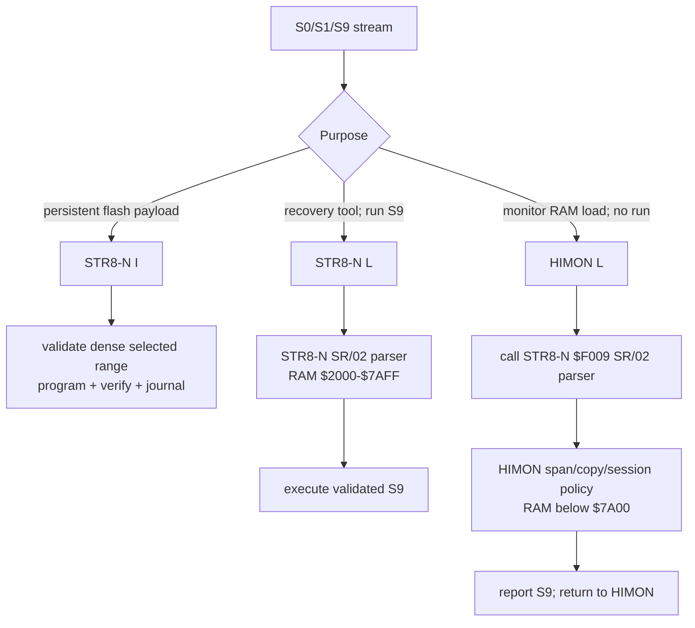

# Current Capability Matrix

This is the short authority for the live STR8-N, HIMON, and ASM-F2 command
surfaces. The board currently has these accepted identities; STR8-N and HIMON
were updated and checked together on COM4 on 2026-09-07:

```text
STR8-N 1.32
HIMON   00.0907(0637)
ASM-F2  00.0905(2321)
```

Historical plans, accepted test cards, transcripts, and story documents may
show commands that existed on an earlier image. In particular, HIMON `L G`
and `L F` are retired. They are not aliases for any current operation.

This document answers three different questions:

1. **What works now?** A supported path in the current integrated image.
2. **What is possible next?** A direction compatible with the current design,
   but not an operator promise until its queue gates pass.
3. **What is not supported?** A missing, deliberately excluded, retired, or
   currently unsafe path.

## How To Read Capability Status

| Status | Meaning |
| --- | --- |
| Current | Present in the live image and documented for operator use |
| Hardware-accepted | Exercised on the physical board with retained transcript evidence |
| Host-verified | Checked by the build/regression suite, but not by itself a board claim |
| Proven tooling | The mechanism has host and board evidence, but still uses focused transient tools or test cards rather than one supported everyday interface |
| Planned | Reasonable within the design and recorded in the feature queue; not implemented or not fully accepted |
| Unsupported | No current contract; do not build an operating procedure around it |

“Possible” means architecturally credible, not promised, scheduled, or safe to
use now. A historical transcript proves only the image and procedure named in
that transcript.

## At A Glance

| Capability | Owner | Status now | Important boundary |
| --- | --- | --- | --- |
| Reset supervision and return to the stable Bank-3 system | STR8-N | Current; hardware-accepted | A healthy STR8-N top sector is required |
| Visible run, host, I/O, and flash-mutation status | STR8-N | Current; hardware-accepted | Private STR8 paths own the LEDs; public raw console calls remain LED-neutral |
| Select and launch qualified Bank 0-2 guest images | STR8-N | Current; hardware-accepted | Each guest image needs its own qualification; reset-vector plausibility is not full compatibility proof |
| Install dense S19 payloads into selected flash sectors | STR8-N | Current; hardware-accepted | Selected range must agree with the stream; Bank-3 sector F remains protected |
| Load a recovery S19 into RAM and run its S9 entry | STR8-N | Current; hardware-accepted | RAM `$2000-$7AFF`; this is intentionally load-and-run |
| Visible host wait and console activity in HIMON/ASM-F2 | HIMON | Current; hardware-accepted | HIMON private veneers and service-vector callers opt in; raw FTDI records remain LED-neutral for applications |
| Inspect/modify RAM, call addresses, and inspect trapped CPU context | HIMON | Current | RAM and I/O protection rules still apply |
| One-shot breakpoints and instruction stepping | HIMON | Current; hardware-accepted | User RAM only; breakpoints are not persistent |
| Load S19 into RAM without running it | HIMON + STR8-N parser | Current; hardware-accepted | Bare `L` only; RAM below `$7A00`; explicit `G` is required afterward |
| Resolve and execute resident FNV catalog records | HIMON | Current | Resident Bank-3 catalog is authoritative |
| Assemble W65C02 source on the board | ASM-F2 | Current; hardware-accepted | Bounded line, symbol, fixup, relocation, import/export, and RAM budgets |
| Seal, relocate, package, load, and link AP v2 programs | ASM-F2 + HIMON | Current; hardware-accepted | Loader destinations and package/body ranges must not overlap protected workspaces |
| Install one named AP carrier per Bank 0-2 sector and use it after reset | APMAN + HIMON | Current; hardware-accepted | Envelope maximum is one 4K sector; this is not packed AP Store storage |
| Inventory carrier/store/media roles without mutation | `APS`, BANKAUDIT, BANKDUMP | Current; hardware-accepted | Some deeper inspection is supplied by installed APC utilities, not a resident HIMON dump command |
| Append, chain, reconstruct, validate, load, and tombstone AP Store objects | AP Store V1 tools | Proven tooling | Focused transient tools and cards are accepted; a consolidated operator manager is not current |

The current operator path is therefore complete for a small program lifecycle:
enter source in ASM-F2, `END`, `PACKAGE`, `INSTALL ... Bn`, reset, discover it
with `APS`, and load/run it with `AP`. AP Store is the more capable storage
mechanism, but its management experience has not yet been consolidated.

## Ownership

| Owner | Flash/RAM role | Current operator surface |
| --- | --- | --- |
| STR8-N | Reset owner; Bank-3 `$F000-$FFFF`; flash install, recovery, bank handoff, and public resident services | reset selector `0`-`2`, `C`, `W`, `S`; prompt commands `I`, `L`, `C`, `W`, `J0`-`J3` |
| HIMON | Bank-3 `$C000-$EFFF`; monitor, debugger, catalog/RJOIN host, AP client, and load-only RAM S19 adapter | `?`, `#`, `D`, `M`, `R`, `X`, `G`, `AP`, `APS`, `L`, `B`, `N`, `STR8`, plus catalog commands such as `ASM` |
| ASM-F2 | Bank-3 `$8000-$BFFF`; onboard W65C02 assembler and AP-v2 producer | `ASM`, `ASM NEW`, `ASM SEAL`; source `.P`, `.`, and source lines through `END`; post-`END` `SEAL`, `RELOCATE`, `PACKAGE`, `LOAD`, `INSTALL`, `NEW`, `.` |

`CHECK` is available only in full-core/package-check diagnostic builds. It is
not in the default flash-resident ASM-F2 image.

## What Each Component Can Do Now

### STR8-N

STR8-N owns the board state that must remain recoverable. The current system
can:

- cold-boot or warm-enter compatible Bank-3 HIMON;
- install a checked dense S19 payload into an explicitly selected legal flash
  range, program it, verify it, and retain the protected top sector;
- load a recovery S19 into RAM and execute its validated S9 address;
- launch enrolled Bank 0, 1, or 2 guest images, or hand off through Bank 3;
- expose the stable console, bank-select, and S19-record services used by
  HIMON; and
- support checked bank inventory, copy/recovery, directory, and protected-top
  maintenance through STR8-N-owned tools.

Banks 0-2 may contain unrelated opaque 32K systems. Launch capability does not
mean that STR8-N understands each guest filesystem, monitor, peripheral state,
or software ABI. Physical RESET is the universal return path. See the
[product boundary](STR8/PRODUCT_BOUNDARIES.md) and current
[operator guide](OPERATORS_GUIDE.md).

### HIMON

HIMON is the current Bank-3 monitor and integration host. It can:

- list or resolve resident FNV records and execute callable records;
- dump memory, modify permitted RAM, execute an address, and display or edit a
  valid trapped register context;
- set, clear, and list one-shot user-RAM breakpoints, single-step a trapped
  context, and resume it;
- receive S0/S1/S9 through STR8-N's `SR/02` parser, apply its narrower RAM-only
  policy, and report rather than execute the S9 entry;
- publish `$21`/`$43` host-wait, `$07` receive, and `$0B` transmit status for
  its private console paths and ASM-F2 service-vector clients while retaining
  LED-neutral raw FTDI records for applications;
- load, validate, relocate, and link AP v2 packages, including typed resident
  imports;
- discover APMAN, inspect Bank 0-2 AP status, and load or run a named or
  address-selected carrier; and
- enter ASM-F2 or return control to STR8-N through their published boundaries.

HIMON is not an alternate reset supervisor or flash installer. Its current
command and routine maps are in the [HIMON map](HIMON/HIMON_MAP.md).

### ASM-F2

ASM-F2 is an interactive assembler plus AP-v2 producer. It can:

- assemble the implemented W65C02 vocabulary with global/local labels,
  forward fixups, explicit-width operands, bit instructions, compact data and
  string forms, and initialized storage;
- evaluate the documented literal and left-to-right expression forms,
  including unresolved symbol-plus-constant fixups;
- bind a direct call to a current resident RJOIN record or preserve it as a
  typed AP import for load-time linking;
- freeze a completed session with `END`, validate it with `SEAL`, relocate the
  body in RAM, construct and self-check an AP v2 envelope, and load/link it;
  and
- install a named package as a persistent Bank 0-2 carrier through APMAN.

The exact syntax and current numeric limits live in the
[ASM user guide](ASM/ASM_USER_GUIDE.md); opcode acceptance is generated and
checked by `make -C SRC asm-test`.

### AP, APMAN, And AP Store

The supported simple storage unit is an **AP carrier**: one complete named AP
v2 envelope at one sector base. APMAN can select a safe erased sector, program
and verify it, restore Bank 3, list it after reset, and load/link/run it by
entry name or sector address.

**AP Store V1** is a separate append-only managed-object format. Its accepted
tooling proves identity and role checks, object generations, arbitrary
same-bank sector chains, interruption-safe commit-last writes, exact/newest
lookup, reconstruction, validation, load/run, capacity reporting, and
tombstone deletion. Those capabilities do not yet amount to one installed,
general-purpose AP Store menu. See
[Carrier Versus AP Store](ASM/BANKED_AP_CARRIER_VS_AP_STORE.md).

## S19 Ownership



HIMON has no private S19 parser. Its bare `L` requires a healthy compatible
STR8-N `SR/02` service at `$F009`; absence or signature/capability mismatch
fails closed before receive. HIMON owns only the RAM range check, copy,
accounting, error latch, and load-only user interface.

Use the commands this way:

```text
lasting flash change     STR8-N I
temporary load and run   STR8-N L
temporary load only      HIMON L, then explicit HIMON G address if wanted
```

## STR8-N Public Resident ABI Used By R-YORS

| Entry | Contract |
| --- | --- |
| `$F003` | raw console initialization |
| `$F006` | resident ABI version/capability query |
| `$F009` | `SR/02` buffered S19 record parser; signature `53 52 02 03` at `$F00C-$F00F` |
| `$F010` | bank-select service; return-capable selector runs from RAM `$0203` |
| `$F013` | character input |
| `$F019` | character output |
| `$F03E` | character-ready query |

STR8-N remains the primary board owner. HIMON and ASM-F2 are payloads behind
it; an absent or damaged STR8-N means the integrated board is not a stable
R-YORS system.

## ASM-F2 Source And Package Surface

The current source directives are:

```text
EQU DB DW DS ORG END ENTRY EXPORT IMPORT DC
```

ASM-F2 supports W65C02 mnemonics in its generated vocabulary, global and
local labels, forward fixups, hexadecimal/decimal/character/binary-mask
literals, left-to-right expressions, compact raw/C/H/P strings, initialized
`DS`, resident RJOIN calls, and AP-v2 entry/export/import/relocation metadata.
Bit instructions use `RMB bit,zp`, `SMB bit,zp`, `BBR bit,zp,target`, and
`BBS bit,zp,target`.

The supported persistent carrier path is `PACKAGE`, then `INSTALL package Bn`
for Bank 0-2 through APMAN. On Bank 3, install the resident ASM/HIMON payload
with STR8-N `I`; do not use a historical HIMON `L F` procedure.

## Current Installation Shapes

```text
Bank 3 C-E  ryors-v1.2-himon-bank3-c-e.s19
Bank 3 8-B  ryors-v1.2-asm-bank3-8-b.s19 (current S9 mismatch; do not install)
Bank 3 8-E  ryors-v1.2-himon-asm-bank3-8-e.s19
Banks 0-2 8-F  STR8-N-owned composed full-bank image
```

All Bank-3 payload files are sent only after STR8-N `I` has selected the same
range and printed `S19`. Sector F is STR8-N-owned and protected from Bank-3
`I`.

The current ASM-only `8-B` artifact ends with S9 `$8000`, while an existing
HIMON Bank-3 identity has immutable entry `$C000` and accepts only S9 `$FFFF`
or `$C000`. Do not use the separate ASM component until its generator, release
check, packaged bytes, and install documentation agree. Use the combined
`8-E` image when both HIMON and ASM-F2 are required. The
[installation flow](INSTALLATION_FLOW.md) records the exact boundary.

## Possible Next Capabilities

These are grounded in the current plans and proven mechanisms, but remain
non-current until the normal source, size, host-test, documentation, and board
gates agree.

| Possible capability | Why it is plausible | What is still missing |
| --- | --- | --- |
| Consolidated AP Store manager | V1 media and transient install/read/plan/delete tools are already hardware-accepted | One persistent menu/dispatcher, frozen overlay map, recovery contract, and complete acceptance pass |
| Read-only `AP D` carrier inspection | APMAN parsing and BANKDUMP header/page/full-sector inspection already work | Resident/manager command design, bounded output contract, size, tests, and board proof |
| Scoped automatic external AP/FNV search | Resident FNV lookup and banked carrier validation already exist | Frozen enrollment policy, duplicate/malformed rejection, RAM map, size, and board proof |
| Managed AP Store compaction | Live/stale/free accounting and append-only generations already exist | Atomic compaction/recovery rules, wear policy, implementation, and destructive board testing |
| A stable parent-AP/child-AP call ABI | Direct AP loading and manager operation `$04` make chaining mechanically possible | Parent context, scratch ownership, non-overlap, error-return, and reset/bank-restore contracts |
| Non-runnable library/module packages | AP v2 already represents typed exports and imports | Package identity for bodies without an executable `ENTRY`; `MODULE` is reserved but not syntax |
| Self-identifying images | Typed DATA exports can carry an image descriptor | AIM/IMD schema, non-self-referential digest, build coherence gate, and proof |
| Additional transfer formats | The record-service boundary can host explicit parsers | Format contracts and gates; Intel HEX, counted binary, S2/S8, and XMODEM-style transfer are not current |
| Persistent breakpoints | One-shot breakpoint restore and step machinery already work | Replant/step-over state, lifecycle rules, and hardware proof |
| Page-level Bank 1 work allocation and wear tracking | B1:E already has an accepted WORK role | Page allocator, erase counters, recovery semantics, and rotation policy |

The authoritative scheduling and completion checklist is the
[ASM Feature Queue](PLANNING/TODO.md). Design sketches elsewhere do not promote
an item into this table's “current” category.

## Not Supported Or Deliberately Out Of Scope

### Whole-system boundaries

- R-YORS does not own or rebuild STR8-N's live implementation. It consumes a
  manifest-locked public image and ABI from the adjacent repository.
- The integrated board does not have a supported degraded mode without a
  healthy compatible STR8-N. HIMON deliberately fails closed when the required
  `SR/02` face is absent or incompatible.
- There is no resident general flash-to-S19 export command. Preserve host
  artifacts and programmer readbacks for full-image export and recovery.
- A successful `J0`-`J2` handoff does not certify an arbitrary guest OS or
  application. Interrupt vectors, peripheral state, image CRC, reset behavior,
  and recovery are per-image qualification work.

### Loading and flash

- HIMON `L` cannot write flash and cannot auto-run. `L G` and `L F` are
  retired and rejected; use bare `L`, then explicit `G`, or use STR8-N's
  owner-specific install/recovery path.
- STR8-N's dense installer is not a sparse arbitrary-address flash editor.
  Bank-3 sector F has a separate protected update path.
- S2/S8, Intel HEX, raw counted binary, auto-detected binary, and
  XMODEM-style transfer are not current input formats.
- AP carriers are not a filesystem: one carrier occupies one complete 4K
  sector and the envelope must fit that sector.

### HIMON and debugging

- HIMON has no current resident unassembler, memory search, dump continuation,
  or general-purpose non-destructive keyboard peek. Older transcripts showing
  those surfaces describe older images.
- Breakpoints are one-shot, volatile, and limited to permitted user RAM. They
  are not persistent flash breakpoints and cannot safely patch monitor, I/O,
  or flash space.
- Resident Bank-3 FNV records remain authoritative. Automatic discovery of
  arbitrary same-named routines across enrolled external banks is not current.

### ASM-F2 and AP linking

- ASM-F2 is not a full desktop macro assembler. It has no macros, conditional
  assembly, include directive, grouping parentheses, operator precedence, or
  forward-`EQU` dependency solver in its onboard language.
- A physical source line is limited to 63 visible characters. Current table
  ceilings are 128 globals, 128 fixups, 64 relocations, 64 exports, 64
  imports, and 16 locals per scope; the AP envelope and RAM maps impose
  additional practical limits.
- `CHECK` is not in the default flash image. The older interactive `RESOLVE`
  command is also absent; current import resolution occurs while loading an AP.
- There is no general dependency manager, version solver, general RAM
  allocator, or supported nested named-AP call convention.
- `MODULE` is not accepted syntax, local labels cannot be public imports or
  exports, and a relocation overflow leaves code usable only at its fixed
  address rather than packageable.

### AP Store

- AP Store V1 has no consolidated installed operator menu, cross-bank object,
  compression, compaction, garbage collection, or wear leveling.
- A capsule may chain only within one bank. Incomplete writes remain
  non-live, stale bytes are not implicitly reusable, and deletion is a
  tombstone rather than immediate space reclamation.
- An opaque/foreign bank or sector is not AP Store media. Mutation must fail
  until an explicit managed-media conversion policy accepts that location.

## Evidence Boundary

Current source, generated maps, this matrix, the operator guides, and the most
recent append-only hardware log entry define the live capability set. Older
plans and board cards are retained to explain and reproduce their own dated
images; a superseded banner means their terminal commands are evidence, not
current instructions.

Use these evidence sources when changing a status here:

- [Operator's Guide](OPERATORS_GUIDE.md) for supported workflows and safety;
- [ASM Current Test Plan](ASM/TEST_PLAN.md) for completion gates;
- [Hardware Test Log](LOGS/HARDWARE_TEST_LOG.md) for physical-board evidence;
- [ASM Test History](ASM/TEST_HISTORY.md) for completed chronology; and
- [TODO And ASM Feature Queue](PLANNING/TODO.md) for planned work that has not
  yet earned current status.
