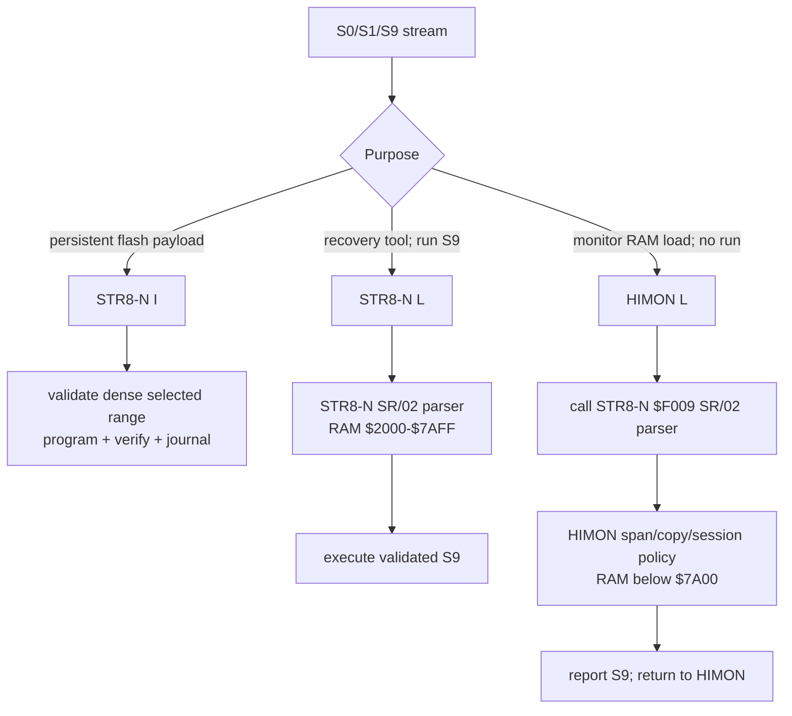

# Current Capability Matrix

This is the short authority for the live STR8-N, HIMON, and ASM-F2 command
surfaces. It describes the source and board image current on 2026-09-02:

```text
STR8-N 1.29
HIMON   00.0902(1707)
ASM-F2  00.0902(1707)
```

Historical plans, accepted test cards, transcripts, and story documents may
show commands that existed on an earlier image. In particular, HIMON `L G`
and `L F` are retired. They are not aliases for any current operation.

## Ownership

| Owner | Flash/RAM role | Current operator surface |
| --- | --- | --- |
| STR8-N | Reset owner; Bank-3 `$F000-$FFFF`; flash install, recovery, bank handoff, and public resident services | reset selector `0`-`2`, `C`, `W`, `S`; prompt commands `I`, `L`, `C`, `W`, `J0`-`J3` |
| HIMON | Bank-3 `$C000-$EFFF`; monitor, debugger, catalog/RJOIN host, AP client, and load-only RAM S19 adapter | `?`, `#`, `D`, `M`, `R`, `X`, `G`, `AP`, `APS`, `L`, `B`, `N`, `STR8`, plus catalog commands such as `ASM` |
| ASM-F2 | Bank-3 `$8000-$BFFF`; onboard W65C02 assembler and AP-v2 producer | `ASM`, `ASM NEW`, `ASM SEAL`; source `.P`, `.`, and source lines through `END`; post-`END` `SEAL`, `RELOCATE`, `PACKAGE`, `LOAD`, `INSTALL`, `NEW`, `.` |

`CHECK` is available only in full-core/package-check diagnostic builds. It is
not in the default flash-resident ASM-F2 image.

## S19 Ownership



HIMON has no private S19 parser. Its bare `L` requires a healthy compatible
STR8-N `SR/02` service at `$F009`; absence or signature/capability mismatch
fails closed before receive. HIMON owns only the RAM range check, copy,
accounting, error latch, and load-only user interface.

Use the commands this way:

```text
lasting flash change     STR8-N I
temporary load and run   STR8-N L
temporary load only      HIMON L, then explicit HIMON G address if wanted
```

## STR8-N Public Resident ABI Used By R-YORS

| Entry | Contract |
| --- | --- |
| `$F003` | raw console initialization |
| `$F006` | resident ABI version/capability query |
| `$F009` | `SR/02` buffered S19 record parser; signature `53 52 02 03` at `$F00C-$F00F` |
| `$F010` | bank-select service; return-capable selector runs from RAM `$0203` |
| `$F013` | character input |
| `$F019` | character output |
| `$F03E` | character-ready query |

STR8-N remains the primary board owner. HIMON and ASM-F2 are payloads behind
it; an absent or damaged STR8-N means the integrated board is not a stable
R-YORS system.

## ASM-F2 Source And Package Surface

The current source directives are:

```text
EQU DB DW DS ORG END ENTRY EXPORT IMPORT DC
```

ASM-F2 supports W65C02 mnemonics in its generated vocabulary, global and
local labels, forward fixups, hexadecimal/decimal/character/binary-mask
literals, left-to-right expressions, compact raw/C/H/P strings, initialized
`DS`, resident RJOIN calls, and AP-v2 entry/export/import/relocation metadata.
Bit instructions use `RMB bit,zp`, `SMB bit,zp`, `BBR bit,zp,target`, and
`BBS bit,zp,target`.

The supported persistent carrier path is `PACKAGE`, then `INSTALL package Bn`
for Bank 0-2 through APMAN. On Bank 3, install the resident ASM/HIMON payload
with STR8-N `I`; do not use a historical HIMON `L F` procedure.

## Current Installation Shapes

```text
Bank 3 C-E  ryors-v1.2-himon-bank3-c-e.s19
Bank 3 8-B  ryors-v1.2-asm-bank3-8-b.s19 (requires existing Bank-3 identity)
Bank 3 8-E  ryors-v1.2-himon-asm-bank3-8-e.s19
Banks 0-2 8-F  STR8-N-owned composed full-bank image
```

All Bank-3 payload files are sent only after STR8-N `I` has selected the same
range and printed `S19`. Sector F is STR8-N-owned and protected from Bank-3
`I`.

## Evidence Boundary

Current source, generated maps, this matrix, the operator guides, and the most
recent append-only hardware log entry define the live capability set. Older
plans and board cards are retained to explain and reproduce their own dated
images; a superseded banner means their terminal commands are evidence, not
current instructions.
