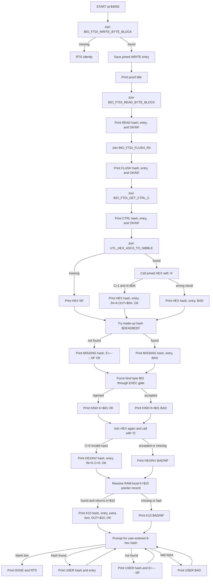
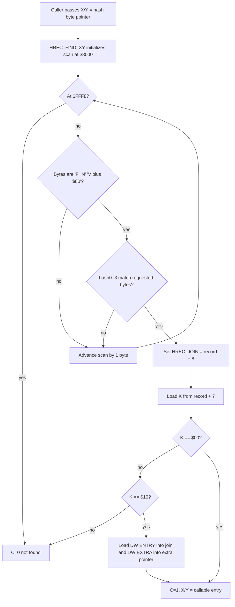

# HREC JOIN PROOF

This note records the design thread and RAM proof for joining callers to
resident hash records. It is deliberately small and operational: search stays
at `$3000`, while the HREC join proof loads at `$4000`.

## Current Proof

```text
make -C SRC hrec-join-proof
source: SRC/TEST/apps/hrec-join-proof.asm
S19:    SRC/BUILD/s19/hrec-join-proof-4000.s19
map:    SRC/BUILD/map/hrec-join-proof-4000.map
start:  $4000
```

Expected current output:

```text
HREC JOIN PROOF $4000
WRITE H=$379FE930 E=$DD15 OK
READ H=$20285B85 E=$DD03 OK
FLUSH H=$2F6622B9 E=$E01E OK
CTRL H=$426150D2 E=$E03A OK
HEX H=$ADD714B1 E=$DF99 IN=A OUT=$0A OK
MISSING H=$DEADBEEF E=---- NF OK
KIND K=$01 OK
HEXINV H=$ADD714B1 E=$DF99 IN=G C=0 OK
K10 H=$76543210 E=$420B X=K10-EXTRA OUT=$10 OK
TYPE 8 HEX HASH, CR QUIT
J> 76543210
USER H=$76543210 E=$420B OK
J> 379FE930
USER H=$379FE930 E=$DD15 OK
J> DEADBEEF
USER H=$DEADBEEF E=---- NF
J>
DONE
```

The exact `E=$hhhh` entry addresses are from the current ROM map. If HIMON is
rebuilt, the hashes should stay the same for the same contracts, but the joined
entry addresses may move.

The proof uses the "C" bootstrap path: it emits no text until it has joined
`BIO_FTDI_WRITE_BYTE_BLOCK` from resident ROM. If the write join fails, the
program simply returns.

## Settled Direction

This proof stays on the existing FNV/HREC path. It is not the CRC16 migration
and it is not a new catalog format. Its job is to finish the seed-layer join:

```text
hash bytes -> resident record -> executable entry -> callable routine
```

Current direction updates that matter here:

```text
HREC  current tiny FNV-era proof record
RREC  future typed runtime-record atom
RCAT  optional collection/container of RRECs, not required for a standalone record
RBODY optional body/payload that an RREC points at or carries inline
THE   future resident hash/catalog resolver kernel
```

So the current HREC is best understood as a proto-RREC: a standalone record in
active memory. A later RREC can stand alone the same way; an RCAT can collect
many RRECs later for bounds, indexes, generations, string pools, or maintenance.
The join proof should not wait for RCAT.

CRC16 remains the intended compact runtime/catalog hash. This proof deliberately
uses current emitted FNV signatures because those bytes are already in HIMON and
prove the join mechanics without starting another migration at the same time.

## Terminology Trail

The first working words were `HREC_FIND` and `HREC_BIND_EXEC`. `bind` was
accurate, but it sounded larger than the current operation: not a full linker,
not relocation, not future CLINK.

`joint` was considered as the thing formed by a hash and an address. That was
close, but the routine name wanted a verb. We settled on `join`:

```text
HREC       hash record in active memory
FIND       locate a matching HREC by hash
JOIN       validate the record and join the caller to its payload
EXEC JOIN  require K=$00, then return a callable entry
```

So the current routine names are:

```text
HREC_FIND_XY
HREC_JOIN_EXEC_XY
```

The join result lives in:

```text
HREC_JOIN_LO
HREC_JOIN_HI
```

## Record Shape

The current tiny generic hash record is:

```text
'F' 'N' ('V'|$80) h0 h1 h2 h3 K
```

For today:

```text
K=$00  executable inline payload
       callable entry = record + 8

K=$10  executable pointer record with extra pointer
       bytes after K are:
         DW ENTRY
         DW EXTRA
```

The proof rejects other `K` values for `HREC_JOIN_EXEC_XY`. Future records can
use other kind bytes for strings, pointer records, import lists, text lists, or
fuller RREC descriptors.

The broader RREC rule is that `K` is a payload contract selector. A record can
wrap inline bytes or point at an `RBODY`, and the selected contract says which
operations are valid for that payload:

```text
display/print          allowed for text, table, and typed dump records
validate/authenticate  allowed for checked or signed packet records
join/call              allowed only for executable records with a call ABI
resolve/link           allowed for import, export, and module descriptors
```

`HREC_JOIN_EXEC_XY` is the narrow proof of the join/call case. It must not make
plain data executable just because the bytes are discoverable by hash.

For `K=$10`, `ENTRY` and `EXTRA` are not automatically coupled:

```text
ENTRY  callable routine address
EXTRA  optional side information pointer
```

Current HIMON uses `EXTRA` as display metadata. If `EXTRA=$0000`, there is no
extra display text. If it is nonzero today, `#` treats it as an HBSTR pointer.
The called routine does not receive or consume `EXTRA` unless a later kind and
contract explicitly says so.

### Possible Future Contract Records

Do not overload `K=$10` to mean every pointer shape. Keep `K=$10` as
`ENTRY + EXTRA`, where `EXTRA` is descriptive/metadata. Use new kind values when
the second or third word is part of the call contract.

Possible future shapes:

```text
K=$11  executable pointer with parameters
       DW ENTRY
       DW PARMS

K=$12  executable pointer with parameters and results
       DW ENTRY
       DW PARMS
       DW RESULTS
```

The words mean:

```text
ENTRY    routine to call
PARMS    pointer to contract-specific input/control data
RESULTS  pointer to a result collection address or result descriptor
```

`PARMS` could point at an HBSTR, CSTR, PSTR, token stream, command list, import
list, or a small typed parameter block. `RESULTS` should normally point at RAM,
or at a descriptor that points at RAM, because output has to be written
somewhere safe. `RESULTS=$0000` means the routine returns only through its
ordinary small ABI: `A`, `X`, `Y`, processor status, and documented scratch.

The CPU does not connect these fields by itself. HIMON/THE must define the
calling convention for each future kind, such as "load PARMS into a known zero
page pointer before `JSR ENTRY`" or "return a count through the RESULTS
descriptor." This keeps simple records simple while leaving room for token
runners, search collectors, import resolvers, and assembler/catalog services.

The `K=$10` proof record is RAM-local inside the loaded proof image. It uses a
made-up hash:

```text
display hash: $76543210
stored bytes: 10 32 54 76
ENTRY:        HREC_K10_TARGET
EXTRA:        high-bit-terminated text "K10-EXTRA"
```

This proves the extended layout without writing a new record into flash. The
normal ROM scan still proves current HIMON HREC records; the local `K=$10` scan
is a proof-only RAM path.

## What It Does

The proof runs from RAM at `$4000` and asks the live ROM image for routines by
hash. It proves that a caller can find a resident record, verify that it is
callable, remember the entry address, and then call through that joined entry.

The first join is special:

```text
join BIO_FTDI_WRITE_BYTE_BLOCK
if found, use it for all proof output
if missing, return silently because there is no output routine yet
```

After that bootstrap join succeeds, the proof prints status lines with the
requested hash and joined entry address. A successful run means the live ROM has
the needed HREC headers, the scanner can find them, the EXEC gate rejects
non-executable kinds, and a joined helper still keeps its own input/status
contract.

After the canned checks, the proof enters a small interactive resolver prompt:

```text
J> 379FE930
```

The typed hash is displayed in normal high-byte-first form. The proof stores it
in the little-endian byte order used by current HREC/FNV records, runs the same
join path, and prints either the joined entry address or `NF`. It checks the
RAM-local `K=$10` proof record first, then current ROM records. It does not
execute arbitrary user-entered joins. The canned `HEX` and `K10` checks call
known helpers with known input; the interactive prompt only resolves and
reports.

## What Is Tested

The positive joins prove that existing ROM HREC headers can be found and used:

```text
BIO_FTDI_WRITE_BYTE_BLOCK
BIO_FTDI_READ_BYTE_BLOCK
BIO_FTDI_FLUSH_RX
BIO_FTDI_GET_CTRL_C
UTL_HEX_ASCII_TO_NIBBLE
```

The error probes are intentionally boring:

```text
MISSING OK   a made-up hash `$DEADBEEF` is not found and returns C=0
KIND OK      a non-exec kind `$01` is rejected by the EXEC join gate
HEXINV OK    a joined helper can still report its own input error
K10 OK       a RAM-local K=$10 record can return DW ENTRY and DW EXTRA
```

`HEXINV` calls the joined `UTL_HEX_ASCII_TO_NIBBLE` with `'G'` and expects
`C=0`.

## Size Notes

The first proof, with only positive checks at `$3000`, was:

```text
$01D4 bytes = 468 decimal
```

After moving the proof to `$4000` and adding the negative probes, before verbose
trace printing:

```text
CODE  $01D5 = 469 decimal
DATA  $0073 = 115 decimal
TOTAL $0248 = 584 decimal
```

Current verbose build:

```text
CODE  $049A = 1178 decimal
DATA  $0114 = 276 decimal
TOTAL $05AE = 1454 decimal
```

The reusable core from `HREC_JOIN_EXEC_XY` through `HREC_FIND_MATCH` is about
`$99` bytes, or 153 decimal bytes, in the current proof map. The rest is proof
harness, messages, test hashes, and output helpers. The verbose build spends
extra bytes on local hex printing, trace text, the `K=$10` pointer-record proof,
and the interactive hash prompt; the join core is still the same proof target.

The current search RAM proof is still separate:

```text
SRC/BUILD/s19/himon-search-proof-3000.s19
start: $3000
size:  $0565 bytes = 1381 decimal
```

## Edge Cases

Keep these visible before promotion into HIMON:

- Missing first write join is silent because there is no output path yet.
- A stale ROM image without a needed HREC header will make joins fail.
- `K` must be checked before calling; hash match alone is not permission to
  execute.
- The current HREC header does not encode a full ABI contract. The routine
  name/hash and documentation carry that burden until fuller RREC records exist.
- Duplicate hashes or duplicate records currently mean first match wins by scan
  order. Future catalog policy must decide ROM-vs-flash precedence.
- Hash collisions remain possible. RREC should eventually add stronger identity
  or proof fields when records become writable/user-created.
- The current scanner walks `$8000..$FFF7`, matching the existing HIMON command
  scan. Other active record regions should be explicit, not accidental.
- A record at the end of scan space must leave room for the full 8-byte header.
- `record+8` can cross a page; the carry path is required and currently present.
- `K=$10` does not use `record+8` as the callable entry. It reads `DW ENTRY`
  and `DW EXTRA` from the record payload. That is the first proof of a record
  whose metadata and callable body are separated.
- Field names after `K` are part of the kind contract. In `K=$10`, `EXTRA` is
  side information. A future `PARMS` or `RESULTS` word must use a different
  kind and an explicit call convention.
- The `BNE` kind check relies on `A=K` and `SEC` not changing the Z flag.
- Joined routines keep their own status contracts. Joining a routine does not
  make its input valid.
- `BIO_FTDI_GET_CTRL_C` is a consuming abort poll, not a non-destructive peek.
- The proof uses user/free zero page; a resident HIMON version needs a published
  scratch contract or a monitor-owned API surface.
- Join range policy belongs in the resident HIMON/THE join service. Callers may
  add stricter local policy, but normal bounds such as scan range, record header
  fit, allowed callable-entry range, and future STR8/top-sector exclusions should
  not be reimplemented differently by every command or package.

## Promotion Path

The next clean step is to move the reusable pieces into HIMON:

```text
HREC_FIND_XY
HREC_JOIN_EXEC_XY
```

Then `S`, `COPY`, `MOVE`, `FILL`, `MODIFY`, and similar flash members can call
one resident join routine instead of each carrying a private scanner.

The durable version should eventually be reachable through a fixed monitor API
entry or jump table, so a member does not need a bootstrap scanner just to find
the scanner.

The interactive resolver tail is proof-only. It is useful because it lets a user
type an 8-digit hash and watch the same join code answer. The durable HIMON
service should be a callable routine first; a friendly command can be added
later if it earns its keep.

## Mermaid Flow



## Mermaid Core Join


