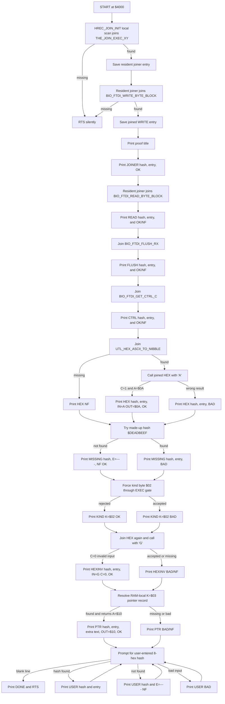
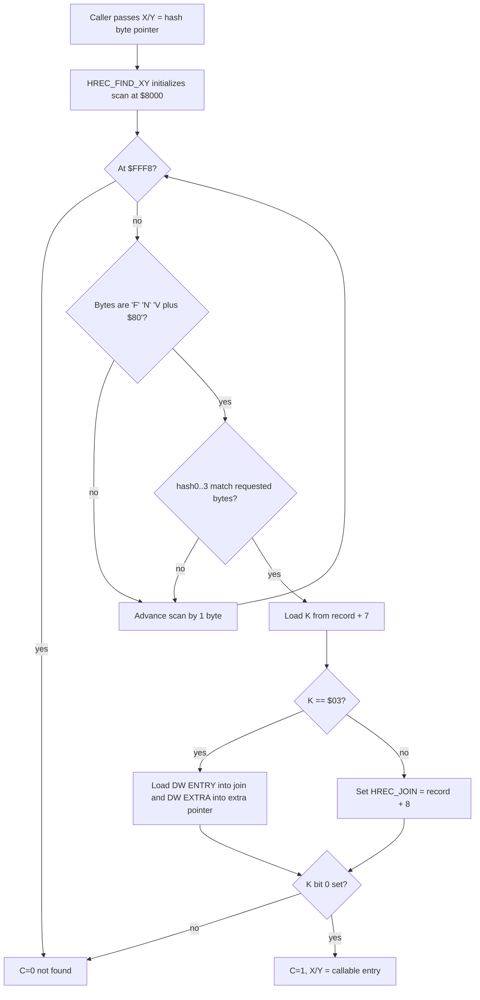

# HREC JOIN PROOF

This note records the design thread and RAM proof for joining callers to
resident hash records. It is deliberately small and operational: search stays
at `$3000`, while the HREC join proof loads at `$4000`.

## Current Proof

```text
make -C SRC hrec-join-proof
source: SRC/PROOFS/hrec-join-proof.asm
S19:    SRC/BUILD/s19/hrec-join-proof-4000.s19
map:    SRC/BUILD/map/hrec-join-proof-4000.map
start:  $4000
```

Expected current output:

```text
HREC JOIN PROOF $4000
WRITE H=$379FE930 E=$DF09 OK
JOINER H=$A9AF15F7 E=$DB0D OK
READ H=$20285B85 E=$DEF7 OK
FLUSH H=$2F6622B9 E=$E212 OK
CTRL H=$426150D2 E=$E22E OK
HEX H=$ADD714B1 E=$E18D IN=A OUT=$0A OK
MISSING H=$DEADBEEF E=---- NF OK
KIND K=$02 OK
HEXINV H=$ADD714B1 E=$E18D IN=G C=0 OK
PTR H=$76543210 E=$4235 X=PTR-EXTR OUT=$10 OK
TYPE 8 HEX HASH, CR QUIT
J> 76543210
USER H=$76543210 E=$4235 OK
J> 379FE930
USER H=$379FE930 E=$DF09 OK
J> DEADBEEF
USER H=$DEADBEEF E=---- NF
J>
DONE
```

The exact `E=$hhhh` entry addresses are from the current ROM map. If HIMON is
rebuilt, the hashes should stay the same for the same contracts, but the joined
entry addresses may move.

The proof uses the "C" bootstrap path: it emits no text until its local tiny
scanner has found resident `THE_JOIN_EXEC_XY`, and that resident joiner has
joined `BIO_FTDI_WRITE_BYTE_BLOCK`. If either join fails, the program simply
returns.

## Settled Direction

This proof stays on the existing FNV/HREC path. It is not the CRC16 migration
and it is not a new catalog format. Its job is to finish the seed-layer join:

```text
hash bytes -> resident record -> executable entry -> callable routine
```

The current proof now carries the bootstrap scanner needed to find the resident
joiner. The same local code also serves the RAM-local pointer-record proof, but
ordinary ROM service joins go through HIMON:

```text
local scanner -> THE_JOIN_EXEC_XY -> all ordinary resident joins
```

`THE_JOIN_EXEC_XY` is itself published as an FNV record:

```text
name:        THE_JOIN_EXEC_XY
hash32:      $A9AF15F7
stored:      F7 15 AF A9
record kind: $01 inline executable
```

Current direction updates that matter here:

```text
HREC  current tiny FNV-era proof record
RREC  future typed runtime-record atom
RCAT  optional collection/container of RRECs, not required for a standalone record
RBODY optional body/payload that an RREC points at or carries inline
THE   future resident hash/catalog resolver kernel
```

So the current HREC is best understood as a proto-RREC: a standalone record in
active memory. A later RREC can stand alone the same way; an RCAT can collect
many RRECs later for bounds, indexes, generations, string pools, or maintenance.
The join proof should not wait for RCAT.

This proof does not make current HRECs relocatable. It proves "find a placed
record and join to its already-linked entry." A current HREC entry is an address
that is valid because the bytes are already at the address they were linked for.
Moving that payload to another RAM address requires future RREC-style relocation
metadata:

```text
HREC today   hash -> kind -> already-placed entry
RREC future  hash -> payload + link_addr + fixups + deps -> load/fix/run
```

For the full staged plan, see `DOC/GUIDES/HASH/HASH_MAP.md`, section
"Placed HREC And Relocatable RREC".

FNV32 is the settled public identity hash for exported routines and commands.
This proof deliberately uses current emitted FNV signatures because those bytes
are already in HIMON and prove the join mechanics without starting another
migration at the same time. CRC16 remains available for compact local/scoped
tables and checks, not as the universal public routine identity.

## Terminology Trail

The first working words were `HREC_FIND` and `HREC_BIND_EXEC`. `bind` was
accurate, but it sounded larger than the current operation: not a full linker,
not relocation, not full future RJOIN.

`joint` was considered as the thing formed by a hash and an address. That was
close, but the routine name wanted a verb. We settled on `join`:

```text
HREC       hash record in active memory
FIND       locate a matching HREC by hash
JOIN       validate the record and join the caller to its payload
EXEC JOIN  require executable kind bit 0, then return a callable entry
```

So the current routine names are:

```text
HREC_FIND_XY
HREC_JOIN_EXEC_XY
```

The join result lives in:

```text
HREC_JOIN_LO
HREC_JOIN_HI
```

## Record Shape

The current tiny generic hash record is:

```text
'F' 'N' ('V'|$80) h0 h1 h2 h3 K
```

For today:

```text
K=$01  executable inline payload
       callable entry = record + 8

K=$03  executable pointer/extra record
       legacy confirm-before-execute form
       bytes after K are:
         DW ENTRY
         DW EXTRA

K=$05  executable pointer/extra record
       display text without confirm-before-execute
       bytes after K are:
         DW ENTRY
         DW EXTRA
```

The proof follows current HIMON kind bits: bit 0 means executable, bit 1 means
confirm before execution, and bit 2 marks text/display metadata. `K=$03` remains
the legacy confirming pointer/extra form; `K=$05` is the non-confirming
pointer/extra form used by flash-shadow commands such as `S(earch)`.
`HREC_JOIN_EXEC_XY` rejects records whose kind byte does not set bit 0.

The broader RREC rule is that `K` is a payload contract selector. A record can
wrap inline bytes or point at an `RBODY`, and the selected contract says which
operations are valid for that payload:

```text
display/print          allowed for text, table, and typed dump records
validate/authenticate  allowed for checked or signed packet records
join/call              allowed only for executable records with a call ABI
resolve/link           allowed for import, export, and module descriptors
```

`HREC_JOIN_EXEC_XY` is the narrow proof of the join/call case. It must not make
plain data executable just because the bytes are discoverable by hash.

For `K=$03`, `ENTRY` and `EXTRA` are not automatically coupled:

```text
ENTRY  callable routine address
EXTRA  optional side information pointer
```

Current HIMON uses `EXTRA` as display metadata. If `EXTRA=$0000`, there is no
extra display text. If it is nonzero today, `#` treats it as an HBSTR pointer.
The called routine does not receive or consume `EXTRA` unless a later kind and
contract explicitly says so.

The parked next executable-record direction retires implicit inline entry math
for newly emitted records. `K=$01` can become a pointer executable record rather
than "code begins at record+8":

```text
'F' 'N' ('V'|$80) h0 h1 h2 h3 K RSV0 RSV1 RSV2 RSV3 RSV4 DW ENTRY [DW TEXT]
```

`DW TEXT` exists only when the chosen `K` text bit is set; if the bit is clear,
there is no text word to skip and no forced `$0000` placeholder. The reserve
bytes after `K` are for future length/state/generation/extension/summary data.
Legacy inline records should be explicit, for example by setting a high `K`
legacy bit, so the resolver can keep reading old proof records without making
new records pay the inline-code contract.

### Possible Future Contract Records

Do not overload `K=$03` to mean every pointer shape. Keep `K=$03` as
`ENTRY + EXTRA`, where `EXTRA` is descriptive/metadata. Use new kind values when
the second or third word is part of the call contract.

Possible future shapes:

```text
K=$11  executable pointer with parameters
       DW ENTRY
       DW PARMS

K=$12  executable pointer with parameters and results
       DW ENTRY
       DW PARMS
       DW RESULTS
```

The words mean:

```text
ENTRY    routine to call
PARMS    pointer to contract-specific input/control data
RESULTS  pointer to a result collection address or result descriptor
```

`PARMS` could point at an HBSTR, CSTR, PSTR, token stream, command list, import
list, or a small typed parameter block. `RESULTS` should normally point at RAM,
or at a descriptor that points at RAM, because output has to be written
somewhere safe. `RESULTS=$0000` means the routine returns only through its
ordinary small ABI: `A`, `X`, `Y`, processor status, and documented scratch.

The CPU does not connect these fields by itself. HIMON/THE must define the
calling convention for each future kind, such as "load PARMS into a known zero
page pointer before `JSR ENTRY`" or "return a count through the RESULTS
descriptor." This keeps simple records simple while leaving room for token
runners, search collectors, import resolvers, and assembler/catalog services.

The `K=$03` pointer/extra proof record is RAM-local inside the loaded proof
image. It uses a made-up hash:

```text
display hash: $76543210
stored bytes: 10 32 54 76
ENTRY:        HREC_PTR_TARGET
EXTRA:        high-bit-terminated text "PTR-EXTR"
```

This proves the extended layout without writing a new record into flash. The
normal ROM scan still proves current HIMON HREC records; the local `K=$03` scan
is a proof-only RAM path.

## What It Does

The proof runs from RAM at `$4000` and asks the live ROM image for routines by
hash. It proves that a caller can carry one tiny bootstrap scanner, find the
resident joiner, then use that joined HIMON routine for later service joins.
After a service is joined, the proof remembers the entry address and calls
through it.

The first two joins are special:

```text
HREC_JOIN_INIT:
  local scan joins THE_JOIN_EXEC_XY
  resident THE_JOIN_EXEC_XY joins BIO_FTDI_WRITE_BYTE_BLOCK
if both succeed, use BIO write for all proof output
if either is missing, return silently because there is no output routine yet
```

After that bootstrap join succeeds, the proof prints status lines with the
requested hash and joined entry address. A successful run means the live ROM has
the needed HREC headers, the scanner can find them, the EXEC gate rejects
non-executable kinds, and a joined helper still keeps its own input/status
contract.

After the canned checks, the proof enters a small interactive resolver prompt:

```text
J> 379FE930
```

The typed hash is displayed in normal high-byte-first form. The proof stores it
in the little-endian byte order used by current HREC/FNV records, runs the same
join path, and prints either the joined entry address or `NF`. It checks the
RAM-local `K=$03` proof record first, then asks resident `THE_JOIN_EXEC_XY` for
current ROM records. It does not execute arbitrary user-entered joins. The
canned `HEX` and `PTR` checks call known helpers with known input; the
interactive prompt only resolves and reports.

## Using The Join Bootstrap

Use this pattern for RAM-loaded or flash-loaded code that is not statically
linked with HIMON and therefore cannot simply `XREF THE_JOIN_EXEC_XY`. If the
routine is linked into the same image as HIMON, a normal `XREF`/`JSR` is smaller
and clearer. If the routine arrives later as bytes, carry the tiny bootstrap
scanner once, find the resident joiner, and then let HIMON do the rest.

Recommended local shape:

```text
HREC_JOIN_INIT
  find resident THE_JOIN_EXEC_XY by local scan
  save its entry in HREC_JOINER_LO/HI
  use that resident joiner to find the first output routine
  return C=1 when the join layer is usable

HREC_JOIN_RESIDENT_XY
  input:  X/Y -> 4 little-endian hash bytes
  action: save X/Y as the requested hash pointer
          call resident THE_JOIN_EXEC_XY through HREC_JOINER_LO/HI
          copy returned entry X/Y into HREC_JOIN_LO/HI
  output: C=1 found executable, X/Y and HREC_JOIN_LO/HI = entry
          C=0 not found or not executable
```

The preservation step matters. The caller passes the hash pointer in `X/Y`, but
resident `THE_JOIN_EXEC_XY` also returns the found entry in `X/Y`. A proof,
loader, or user-facing command often still needs the original hash pointer for
printing, logging, fixup records, or error reporting. `HREC_JOIN_RESIDENT_XY`
therefore saves the input pointer in `HREC_HASH_PTR_LO/HI` before calling the
resident joiner, then copies the returned entry into `HREC_JOIN_LO/HI`.

Minimal use:

```asm
        JSR HREC_JOIN_INIT
        BCC NO_JOIN_LAYER

        LDX #<HASH_BIO_READ_BYTE_BLOCK
        LDY #>HASH_BIO_READ_BYTE_BLOCK
        JSR HREC_JOIN_RESIDENT_XY
        BCC NO_READ
        STX READ_LO
        STY READ_HI
```

Where the state lives is package-local in this proof:

```text
HREC_JOINER_LO/HI    resident THE_JOIN_EXEC_XY entry
HREC_HASH_PTR_LO/HI  hash pointer for the current request
HREC_JOIN_LO/HI      joined executable entry for the current request
HREC_EXTRA_LO/HI     optional extra pointer for pointer/extra records
```

Later packages should use their own prefix and workspace cells. The names in
this proof are examples of the contract shape, not global HIMON variables.

## What Is Tested

The positive joins prove that existing ROM HREC headers can be found and used:

```text
THE_JOIN_EXEC_XY
BIO_FTDI_WRITE_BYTE_BLOCK
BIO_FTDI_READ_BYTE_BLOCK
BIO_FTDI_FLUSH_RX
BIO_FTDI_GET_CTRL_C
UTL_HEX_ASCII_TO_NIBBLE
```

The error probes are intentionally boring:

```text
MISSING OK   a made-up hash `$DEADBEEF` is not found and returns C=0
KIND OK      a non-exec kind `$02` is rejected by the EXEC join gate
HEXINV OK    a joined helper can still report its own input error
PTR OK       a RAM-local K=$03 record can return DW ENTRY and DW EXTRA
```

`HEXINV` calls the joined `UTL_HEX_ASCII_TO_NIBBLE` with `'G'` and expects
`C=0`.

## Size Notes

The first proof, with only positive checks at `$3000`, was:

```text
$01D4 bytes = 468 decimal
```

After moving the proof to `$4000` and adding the negative probes, before verbose
trace printing:

```text
CODE  $01D5 = 469 decimal
DATA  $0073 = 115 decimal
TOTAL $0248 = 584 decimal
```

Current verbose build:

```text
CODE  $04DC = 1244 decimal
DATA  $0120 = 288 decimal
TOTAL $05FC = 1532 decimal
```

The reusable core from `HREC_JOIN_EXEC_XY` through `HREC_FIND_MATCH` is about
`$C0` bytes, or 192 decimal bytes, in the current proof map. The rest is proof
harness, messages, test hashes, and output helpers. The verbose build spends
extra bytes on local hex printing, trace text, the `K=$03` pointer-record proof,
the resident-joiner bootstrap, and the interactive hash prompt; the join core
is still the same proof target.

The current search RAM proof is still separate:

```text
SRC/BUILD/s19/himon-search-proof-3000.s19
start: $3000
size:  $0565 bytes = 1381 decimal
```

## Edge Cases

Keep these visible before promotion into HIMON:

- Missing first write join is silent because there is no output path yet.
- A stale ROM image without a needed HREC header will make joins fail.
- `K` must be checked before calling; hash match alone is not permission to
  execute.
- The current HREC header does not encode a full ABI contract. The routine
  name/hash and documentation carry that burden until fuller RREC records exist.
- Duplicate hashes or duplicate records currently mean first match wins by scan
  order. Future catalog policy must decide ROM-vs-flash precedence.
- Hash collisions remain possible. RREC should eventually add stronger identity
  or proof fields when records become writable/user-created.
- The current scanner walks `$8000..$FFF7`, matching the existing HIMON command
  scan. Other active record regions should be explicit, not accidental.
- A record at the end of scan space must leave room for the full 8-byte header.
- `record+8` can cross a page; the carry path is required and currently present.
- `K=$03` does not use `record+8` as the callable entry. It reads `DW ENTRY`
  and `DW EXTRA` from the record payload. That is the first proof of a record
  whose metadata and callable body are separated.
- Field names after `K` are part of the kind contract. In `K=$03`, `EXTRA` is
  side information. A future `PARMS` or `RESULTS` word must use a different
  kind and an explicit call convention.
- The EXEC gate is the current HIMON rule: kind bit 0 must be set.
- Joined routines keep their own status contracts. Joining a routine does not
  make its input valid.
- `BIO_FTDI_GET_CTRL_C` is a consuming abort poll, not a non-destructive peek.
- The proof uses user/free zero page; a resident HIMON version needs a published
  scratch contract or a monitor-owned API surface.
- Join range policy belongs in the resident HIMON/THE join service. Callers may
  add stricter local policy, but normal bounds such as scan range, record header
  fit, allowed callable-entry range, and future STR8/top-sector exclusions should
  not be reimplemented differently by every command or package.

## Promotion Path

The reusable pieces now have resident HIMON counterparts:

```text
THE_JOIN_FIND
THE_JOIN_EXEC
THE_JOIN_EXEC_XY
THE_JOIN_LOAD_HASH_XY
```

`THE_JOIN_EXEC_XY` also has its own FNV record, so `S`, `COPY`, `MOVE`, `FILL`,
`MODIFY`, and similar flash members can carry one tiny bootstrap scanner to find
the joiner, then call the resident routine instead of each carrying a full
private resolver.

The durable version should eventually be reachable through a fixed monitor API
entry or jump table too. The FNV record solves runtime discovery; a jump-table
slot would solve address stability for code that wants no scanner at all.

The interactive resolver tail is proof-only. It is useful because it lets a user
type an 8-digit hash and watch the same join code answer. The durable HIMON
service should be a callable routine first; a friendly command can be added
later if it earns its keep.

## Mermaid Flow



## Mermaid Core Join


