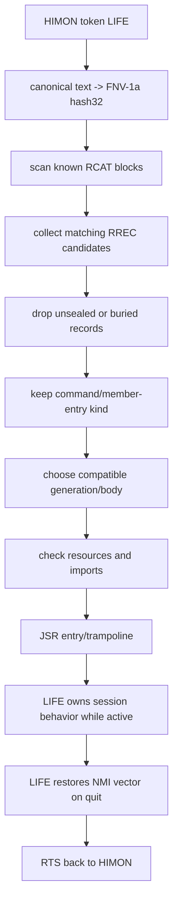

# LIFE As An RCAT Member

This is a worked design note for moving `life.asm` from a standalone program
into the proposed catalog-linking world:

```text
standalone LIFE app -> RBODY -> RREC export -> RCAT member
```

The source stays a proof/worked example. It does not become part of the
generated HIMON call trees unless it is later promoted into the operational
HIMON source set.

Important current-state rule:

```text
RCAT/RREC is not live code today.
```

Today, LIFE is a standalone RAM-linked application that can run under or beside
HIMON. HIMON has its current FNV command-record path, but not the proposed
compact RCAT/RREC catalog-linking system. This document therefore separates:

```text
today:           LIFE-2000, WDC-linked standalone app loaded and called by address
near term:       LIFE-9000, reassembled permanent flash app with a findable header
proposed future: RJOIN, runtime joining through RBODY, RREC, RCAT, RLNK, RF
```

Related vocabulary lives in [GLOSSARY.md](../GLOSSARY.md). The short answer is:
yes, LIFE should become an `RBODY` described by one or more `RREC` records
inside or beside an `RCAT`. "Member" is a useful S/36-ish packaging word, but
`RREC` remains the record format word.

## Starting Shape

Current LIFE source:

```text
source: SRC/APPS/life.asm
module: LIFE_APP
export: START
current link base: $2000
current map: SRC/BUILD/map/life.map
```

The current built image is a standalone app linked for RAM. The map shows:

```text
START        $2000
LIFE code    $2000-$2653, approximately, before pulled support routines
linked SYS/BIO support appears after LIFE code in the standalone image
DATA         $2B66-$2CD0
END_DATA     $2CD1
```

That standalone image pulls in routines from `rom.lib`, so its map includes
private copies of `SYS_*`, `BIO_*`, `COR_*`, `PIN_*`, and utility routines. A
catalog member should usually not duplicate those if HIMON already provides the
same fixed service contracts.

LIFE also uses local runtime workspace:

```text
ZP scratch:    $D0-$DB
board RAM:     $1000-$12F5
NMI cells:     $7EFA-$7EFB via SYS_VEC_SET_NMI_XY
I/O path:      SYS writers plus BIO_FTDI_READ_BYTE_NONBLOCK
```

That matters. A future RREC cannot merely say "call `$2000`". It must describe
the entry, body location, imports, RAM use, zero-page use, and vector behavior
well enough that HIMON can run it without guessing.

## Terms In This Note

In this section, `Record` means the proposed runtime catalog record shape being
discussed here.

```text
RCAT    runtime catalog dataset; may contain records, strings, indexes, links
RREC    runtime record; one typed export/import/value/catalog entry
RBODY   runtime body; executable bytes, data bytes, strings, or payload
member  packaged thing exposed through an RCAT; usually RBODY plus RREC exports
```

An RREC can be described abstractly as a tuple because its fields are ordered,
but the preferred project word is still record:

```text
RREC = (state, kind, name/hash, body, entry, contract, flags, proof)
```

## The Practical Migration

There are three named lanes for this idea:

```text
LIFE-2000  current RAM/dev S19 at $2000
LIFE-9000  near-term permanent flash form reassembled at $9000
RJOIN      future runtime-joining path that can relocate, bind, and catalog
```

There are five useful shapes. The first three are current or near-term build
shapes. The last two are proposed catalog-linking shapes.

### 1. Standalone Under HIMON

This is `LIFE-2000`, closest to the current LIFE build.

```text
assemble/link LIFE at $2000
load S19 into RAM
run with G 2000, or a temporary HIMON command that JSRs $2000
LIFE returns with RTS when the user quits
```

This is not catalog-linked. It proves the entry contract and the app behavior.
The only "catalog" can be a note in docs or a temporary RAM-side descriptor
saying:

```text
name: LIFE
entry: $2000
storage: RAM
volatile: yes
lane: LIFE-2000
```

Good use:

```text
prove the body runs
prove it returns to HIMON
prove it cleans up NMI vector ownership
measure RAM/ZP needs
```

Bad use:

```text
pretend the standalone map is the final catalog contract
hide the zero-page or vector requirements
ship it as a general member before resource ownership is explicit
```

### 2. Monolithic HIMON Link

In this shape, LIFE is linked into the same ROM image as HIMON.

```text
HIMON ROM image
  HIMON command/parser/debug code
  SYS/BIO/COR support code
  LIFE body and strings
  static catalog record for LIFE
```

This removes runtime fixups because the linker knows all addresses. A proposed
RREC is still useful as the future descriptor because HIMON could discover
`LIFE` through the same resolver path as other commands, routines, or module
entries.

The important difference from the standalone build:

```text
standalone: LIFE carries private linked support routines
monolithic: LIFE should call the HIMON/SYS/BIO routines already in the image
```

The current `XDEF START` name is fine for a single app image, but it is too
generic for a monolithic catalog world. A promoted form should export a unique
entry such as:

```text
LIFE_START
LIFE_CMD
LIFE_ENTRY
```

or provide a small trampoline with one stable public name.

### 2A. Reassembled Flash App At $9000

This is `LIFE-9000`, the near-term permanent form.

```text
assemble/link LIFE for $9000
place a findable header before the entry, or point a header at the entry
load/burn the S19 through L F
HIMON can find LIFE through the current header path or a proposed RREC shape
```

This is not the same as copying bytes from `$2000` to `$9000`. Current 65C02
code contains absolute addresses in `JSR`, `JMP`, labels, data references, and
vector targets. Until relocation/fixup records exist, the clean permanent path
is to reassemble for the final flash address.

The flash form still needs mutable RAM for the board, input buffer, generation
state, and NMI state. "Behind code/data" is a good RAM-layout goal for the
RAM/dev form, but a flash body cannot treat flash bytes after code as mutable
board RAM.

LIFE also demonstrates the patchable vector layer. The hardware NMI vector
enters a system trampoline, and LIFE temporarily patches the RAM NMI vector
through `SYS_VEC_SET_NMI_XY`. On exit, LIFE should restore the previous owner.

### 3. RCAT-Visible Built-In Member

This is the first proposed RCAT/RREC version.

```text
input token "LIFE"
  -> canonicalize token
  -> FNV-1a hash32
  -> scan known RCAT records
  -> find live RREC for LIFE
  -> check kind and lifecycle
  -> call entry/trampoline
```

For canonical uppercase `LIFE`, the current FNV-1a hash32 is:

```text
display: $E51AA61F
stored:  hash0=$1F hash1=$A6 hash2=$1A hash3=$E5
```

If the canonical text changes to `LIFE.START`, `APP.LIFE`, or another naming
scheme, the hash must be recomputed.

Conceptual RREC:

```text
RREC LIFE
  lifecycle: formed, sealed, not buried
  kind:      command/member-entry
  name:      LIFE
  hash32:    $E51AA61F
  body:      current ROM image or RAM-loaded body
  entry:     LIFE_START or START
  call:      JSR entry; returns by RTS when user quits
  imports:   SYS_FLUSH_RX
             SYS_READ_CSTRING_EDIT_ECHO_UPPER
             SYS_VEC_SET_NMI_XY
             SYS_WRITE_CHAR
             SYS_WRITE_CSTRING
             SYS_WRITE_CRLF
             SYS_WRITE_HEX_BYTE
             BIO_FTDI_READ_BYTE_NONBLOCK
  resources: RAM $1000-$12F5
             ZP $D0-$DB in current proof build
             NMI vector cell $7EFA-$7EFB through SYS vector calls
  flags:     interactive, uses terminal, uses NMI, app/session body
```

That is not the final byte layout. It is the information the byte layout must
be able to carry, directly or through attached records.

### 4. Catalog-Linked Flash/RAM Member

This is `RJOIN`, the future dynamic shape. `RJOIN` means runtime join.

```text
RBODY contains LIFE code and strings
RREC exports LIFE as a command/member entry
RREC or RLNK records describe imports
RF records exist only if something still needs patching
RCAT makes the member discoverable
```

Possible future loader spellings:

```text
L F
  no preferred address supplied
  loader chooses placement by the selected flash placement policy

L F xxxx
  xxxx is a preferred flash address
  loader tries that address first if policy and space allow

L F xxxx=2000
  proposed relocation spelling
  source body/range was built or staged at $2000
  preferred flash destination is xxxx
  requires size, relocation, and fixup metadata
```

Catalog-linking flow:

```text
LIFE-2000 body
  -> L F [preferred_addr]
  -> selected flash placement policy chooses or accepts address
  -> RJOIN applies relocation/fixups for final address
  -> RJOIN resolves imports by fixed entries or hash-based import records
  -> relocated RBODY is written/bound in flash
  -> RREC is emitted/updated inside an RCAT
  -> LIFE becomes findable
```

The body and the catalog record do not have to live together:

```text
RCAT in known catalog sector
RREC says body lives at bank N, address X, size Y
RBODY lives in RAM, user flash, or a banked flash slot
```

This is where update policy gets interesting. A newer LIFE can be appended as a
new body and a new RREC. The old RREC can remain physically present. Normal
lookup chooses the newest sealed, not-buried compatible candidate. Later
condense can make older buried records gone by rewriting the sector.

## Entry Contract

The first public LIFE export should be one entry, not every internal label.

Proposed entry contract:

```text
name: LIFE
entry: LIFE_START, LIFE_CMD, or a trampoline to current START
call: JSR entry
return: RTS after user quits
stack: balanced on return
registers: A/X/Y/P not preserved unless stated otherwise
carry: not currently a stable result; define before sealing
side effects: terminal I/O, board RAM, RNG state, optional NMI vector ownership
cleanup: restores previous NMI vector before returning
```

The current code saves `VEC_NMI` on entry and restores it during cleanup. That
is good behavior, but the catalog contract should still advertise that LIFE
uses the NMI vector while it is running.

A future trampoline can make the contract cleaner:

```asm
LIFE_CMD_ENTRY:
                        JSR             LIFE_RESOURCE_ENTER
                        JSR             LIFE_START
                        JMP             LIFE_RESOURCE_LEAVE
```

That lets the body stay app-shaped while the exported command entry handles
catalog policy.

## Resource Contract

LIFE is useful precisely because it is more than a tiny pure subroutine. That
also means it needs a real resource contract.

Current resource facts:

```text
RAM $1000-$1143  left board, 324 bytes
RAM $1144-$1287  right board, 324 bytes
RAM $1288-...    line input buffer
RAM $12F0-$12F5  generation, RNG, NMI state, previous vector
ZP  $D0-$DB      pointer/temp scratch
```

The zero-page part is the biggest promotion issue. Current policy gives user
zero page through `$AF`; `$B0-$CC` is reserved expansion; `$CD-$EF` is shared
service scratch; `$F0-$FF` is HIMON parser scratch. LIFE currently uses
`$D0-$DB`, which overlaps the service scratch lane.

So before LIFE becomes a general sealed member, choose one:

```text
move LIFE scratch into low user ZP $00-$AF
request an app/session ZP frame from a future MEM owner
move most scratch into normal RAM and keep only pointer cells in ZP
reserve a documented LIFE-private ZP lane while the app runs
```

The preferred direction is that promoted LIFE should not use high/service ZP.
Use low user ZP for the current app shape, or a future MEM-granted app/session
frame when that exists.

The board RAM should also stop being a surprise fixed claim. For `LIFE-2000`,
the board/input/state region can move behind the loaded code/data or be declared
as a clear app RAM range. For `LIFE-9000`, mutable board state must live in RAM
described by the entry/resource contract, not in flash after the code.

The RREC itself should not silently grant ownership. It should say what LIFE
needs, and HIMON/MEM policy decides whether that request is allowed.

## Import Contract

Current LIFE source imports by WDC `XREF`:

```text
SYS_FLUSH_RX
SYS_READ_CSTRING_EDIT_ECHO_UPPER
SYS_VEC_SET_NMI_XY
SYS_WRITE_CHAR
SYS_WRITE_CSTRING
SYS_WRITE_CRLF
SYS_WRITE_HEX_BYTE
BIO_FTDI_READ_BYTE_NONBLOCK
```

For a monolithic build, the WDC linker resolves these. For a catalog-linked
member, there are three possible import styles:

```text
fixed entries      LIFE calls stable HIMON/SYS entry addresses
catalog imports    LIFE imports by RREC name/hash and RJOIN binds before running
private support    LIFE carries the support code in its own RBODY
```

Catalog imports may be hash-based. Public imports should use canonical 32-bit
FNV-1a over the import name, then prove the match through kind, contract, and
optional name/proof text. Folded hash16/hash8 variants are better kept for
small local tables whose builder can prove there are no collisions.

Preferred direction:

```text
use fixed SYS/BIO contracts for common services
avoid private support copies when running under HIMON
use catalog imports only when services are not fixed yet
```

The RREC can list imports as proof and as a future resolver checklist. It does
not need to solve all linking on day one.

## What The Builder Emits

A host-side or onboard builder can derive most of the first record from:

```text
source labels and XDEF/XREF declarations
map file addresses
body start/end
data start/end
declared resource comments
declared entry contract
```

First builder output could be a readable descriptor:

```text
member LIFE
  body_range: $2000-$2CD0
  entry: $2000
  entry_symbol: START
  hash32: $E51AA61F
  imports: SYS_FLUSH_RX, ...
  ram: $1000-$12F5
  zp: $D0-$DB
  vectors: NMI
```

Later builder output can become bytes:

```text
RCAT block header
RREC export for LIFE
RSTR name/proof text "LIFE"
optional RDEP/RLNK import records
optional RBODY descriptor
```

The compact record should not spend literal `FNV` bytes per entry once the
scanner is already inside a known FNV catalog. Use the RCAT/RREC control fields
for hash width, kind, format, and lifecycle.

## Lookup And Run Flow



This flow keeps the hash as a discovery key, not as the address. The RREC tells
HIMON what address to call and what kind of thing the match represents.

## Update And Bury Flow

```text
v1 LIFE body + RREC remains in flash
v2 LIFE body + RREC is appended
v2 record becomes formed, verified, sealed
resolver chooses v2 under latest or compatible policy
old v1 may be marked buried if flash bits allow it
condense later copies live records and bodies, erases the sector, and rewrites
```

Buried means normal lookup skips the record. It does not mean physically gone.
Only condense can make the old bytes gone.

## What Not To Catalog Yet

Do not make every `LIFE_*` label public just because the map contains them.

Good first exports:

```text
LIFE          interactive command/member entry
LIFE.START    optional explicit routine-style name for the same entry
```

Possible later exports, only after they have stable contracts:

```text
LIFE.NEXT
LIFE.RANDOM
LIFE.RENDER
LIFE.SET_CELL
```

Internal labels such as row loops, pointer fixups, and branch targets should
stay inside the body. They are implementation details, not catalog members.

## Promotion Checklist

Before sealing LIFE as an RCAT member:

```text
1. Pick the public name: LIFE, LIFE.START, or APP.LIFE.
2. Recompute hash32 for that exact canonical text.
3. Rename or wrap generic START with a unique exported entry.
4. Define return flags, or explicitly say flags are not preserved.
5. Move or declare zero-page ownership.
6. Declare RAM range ownership.
7. Declare NMI vector use and restore policy.
8. Decide whether imports are fixed entries, catalog imports, or private code.
9. Decide whether body lives in RAM, monolithic ROM, or banked flash.
10. Emit a readable descriptor first.
11. Emit compact RREC/RCAT bytes only after the descriptor is boring.
```

That last step matters. The readable descriptor is how the idea becomes
debuggable before it becomes clever.

## Recommendation

Use LIFE as the first friendly RCAT member example, but not as the first tiny
record implementation.

The better order is:

```text
1. catalog a tiny pure routine
2. catalog a simple command with no private RAM
3. catalog LIFE as an interactive app/member with resources
```

LIFE is valuable because it forces the right questions: body, entry, imports,
RAM, zero page, vectors, strings, and update lifecycle. That makes it an
excellent design example even before it is the first shipped catalog member.
