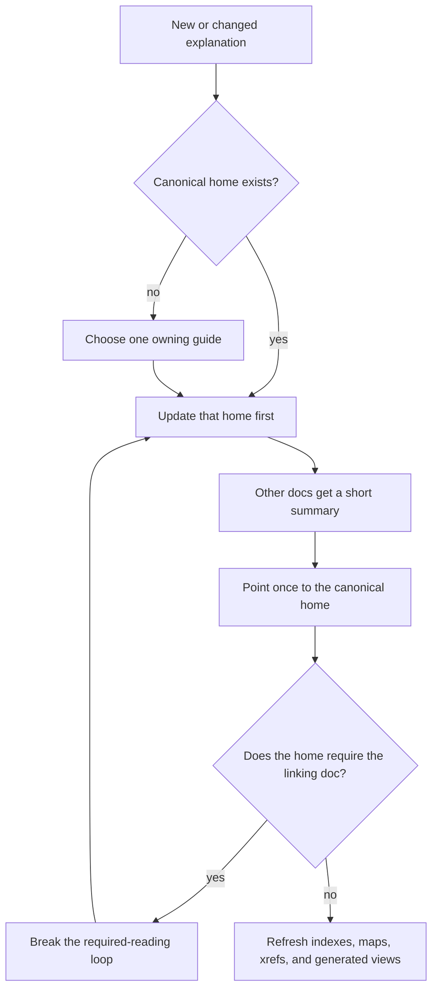

# R-YORS Decisions

This file records settled calls. Use it to avoid reopening decisions by
accident. If a decision needs to change, change it here first, then update the
dependent docs.

## Use This File

- Check this file before proposing alternatives to naming, hash policy,
  doc structure, STR8/HIMON ownership, or assembler syntax.
- Do not treat an open design note in another guide as stronger than a decision
  here.
- Mark a decision as `reopened` only when the user explicitly asks to revisit
  it.

## Naming And Roles

```text
R-YORS boots through STR8.
STR8 keeps recovery/update safe.
STR8 hands normal operation to HIMON.
HIMON provides the monitor, command dispatch, assembler, catalog lookup,
and debug tools.
```

- `ror` is the working repo/copy.
- `R-YORS` is the overall project/system name.
- `STR8` means Subroutine To Return. It is pronounced `S-T-R-8`, can also be
  read as `Straight 8`, and deliberately echoes `RTS` / Return from Subroutine.
- Future STR8 may grow into `STR8-N`, read as `STRAIGHTEN`, after the small
  recovery anchor proves itself. That future name means richer repair and
  normalization capability, not mandatory ownership of every system policy.
- `HIMON` is the active monitor/debug/catalog/assembler environment name.
- `THE` is The Hash Environment: hash-first lookup, catalog records, resolver
  policy, aliases, and typed display. HIMON's dispatcher may use THE, but THE
  is not the whole runtime and not arbitrary command execution.
- Himonia-F is historical/archived branch vocabulary that has folded back into
  HIMON.
- Do not treat Himonia-F and HIMON as permanently separate products.

## Address Vocabulary

- `$WLPB` is the preferred teaching mnemonic for a 16-bit hex address:
  `W` = 4K window, `L` = 256-byte line, `P` = 16-byte paragraph, and `B` =
  byte.
- In banked flash, one 4K window is one erase sector of the currently selected
  bank. The physical flash location is bank plus window plus offset.
- Sector `$0` means `$0000-$0FFF`; `$0000-$FFFF` is the full 64K CPU address
  space, not sector `$0`.

## Date And Time Format

- All date and date/time text in source, documentation, generated artifacts,
  comments, logs, and examples should use ISO 8601.
- Use `YYYY-MM-DD` for dates.
- Use `YYYY-MM-DDTHH:mm+/-HH:MM` for local date/times when minute precision is
  enough. Omit seconds unless the event genuinely needs second-level precision.
- Use CBI doc form for dated documentation streams: `YYYY`, then `MM`, then
  `DD`, then descending `HH:MMZ programmer comment` rows. Use CBI code form
  inside source files: `; YYYY-MM-DDTHH:MMZ programmer comment`. Continuation
  lines align under the comment body. Keep CBI source lines under 78 columns.
- Any discovered older date stamps are cleanup debt, not precedent.

## Command Safety And Syntax

- Mandate: destructive commands require a command token of 4 or more
  characters. Do not add new 1-, 2-, or 3-character destructive commands.
- Destructive means the command's normal purpose is to overwrite, erase,
  program, copy, fill, move, patch, restore, back up, or change boot/recovery
  policy for RAM, flash, banks, vectors, or catalog/storage records.
- Short command tokens remain for inspection, search, display, stepping,
  register/context work, launch, and other nonpersistent control.
- Existing short mutators in current ROM/proof builds are transition debt, not
  permission for new short destructive spellings. Future revisions should move
  bulk mutation behind full words such as `COPY`, `FILL`, `MOVE`, `FLASH`,
  `BANK`, `ERASE`, `BACKUP`, and `RESTORE`.
- STR8 keeps `R` as reset. Do not use that exception to add new short
  destructive command spellings.
- `C`, `M`, and `F` are not destructive shortcuts. `M` currently means
  byte-by-byte modify in HIMON and is under command-surface review.
- Current `S` single-step moves to `N` in the target command surface. Do not
  add `NEXT` as a command alias. A RAM-only single-step/next operation is not
  destructive; it plants only a temporary debugger trap in RAM and restores the
  original opcode. `S` is freed for memory search. Search is non-destructive:
  hex byte tokens are the default pattern. After the range, parse one or more
  pattern atoms:
  byte tokens append bytes, and an apostrophe text atom appends the rest of the
  line. Example: `S 0 FFFF 4D 4D 'M` searches for three `M` bytes.
  Apostrophe text is a final tail in V0; there is no closing-quote parser and
  no return to hex parsing after text.
- The first `N`/breakpoint patch policy is deliberately conservative:
  synthetic debugger traps may be planted only in UPA `$2000-$77FF`. Reject
  zero page, hardware stack, low RAM, HIUPA/scratch, monitor/page-buffer RAM,
  I/O, and ROM/flash. This protects system-owned RAM as well as non-RAM.
- The patchability check is HIMON system policy, not a user-callable routine
  contract. Keep the first W65C02S implementation as a tiny local debug fast
  path instead of a "routines of routines" framework. Promote a shared
  address-policy routine only when multiple system components need the same
  policy and the ROM byte cost is justified.
- Debug is an optional HIMON subsystem/include, not a layer between STR8 and
  HIMON. A build may omit debug to save flash, but the command records, help
  text, BRK debug hook behavior, and docs for that build must agree.
- `BRK 00` is reserved for HIMON's synthetic debug trap. Reserve `$50-$5F` as
  a lightweight assert/exception signature range, but name only `$50 ASSERT`
  and `$59 UNHANDLED` for now. Proofs may use their own fixed signatures such
  as `$41` start, `$42` pass, and `$E1-$E9` bad-path stops.
- HIMON should report debugger-owned synthetic traps as compact `@hhhh`
  register-state lines, not as ordinary `BRK 00 PC=hhhh` stops. Far-out
  rating: `1/10`; this is UI classification of already-known debugger state,
  not a new execution model. Real program `BRK xx` signatures remain loud.
- User breakpoints are one-shot in the first debug implementation. A persistent
  breakpoint feature can come later, after the hardware transcript for `N`,
  `@hhhh`, real `BRK xx`, and one-shot `B` behavior is stable. Persistence
  requires an explicit step-over/replant state.
- Search hits should print like `D` context rows, with exact hit address first,
  aligned row base second, and `*` between them when the match continues into
  the next 16-byte display row. This preserves the useful BSO2 monitor
  search-display convention in HIMON's command language.
- Range grammar target for commands that accept ranges:

```text
start end       end is inclusive
start +count    count is the number of bytes
```

- A 1- or 2-hex-digit `end` token inherits the high byte from `start`.
  This is a page-local end shorthand, not a count. Example: `D 3000 FF`
  means `$3000-$30FF`, because the short end byte `$FF` inherits `$30` from
  `$3000`. If the inherited end would land before `start`, reject it and
  require a full end address or `+count`; `D 30F0 10` is ambiguous/dangerous,
  so use `D 30F0 3110` or `D 30F0 +21`.
- The `+count` form is deliberately explicit, but it should not be the common
  typing path for page-local display. Common bench dumps should prefer
  page-local end shorthand, such as `D 100 3` for `$0100-$0103` or
  `D 3000 FF` for `$3000-$30FF`. Use `+count` when the operator means a byte
  count, not an end byte.
- `D` without parameters should repeat the previous dump length starting at the
  byte after the previous dump. Example: `D 3000 FF` displays `$3000-$30FF`
  and records length `$0100`; the next bare `D` displays `$3100-$31FF`.
  If no previous dump range exists, bare `D` is a usage error.

## STR8 Ownership

- Direction change: earlier planning leaned toward future STR8 ownership of the
  final hardware vectors and broader trap authority. After careful
  reconsideration by the project author, the direction is opt-in integration
  rather than ownership-by-default.
- STR8 does not own global memory management or application interrupt policy.
  User-built systems may provide their own RAM map, trap supervisor, IRQ
  discipline, and runtime conventions.
- V0 HIMON controls IRQ/vector behavior.
- Future STR8-N/STRAIGHTEN may offer recovery-safe vector hooks, trampolines,
  and `SYS_VEC`/IRQ-vector integration for systems that choose that path. It
  should remain useful as routines and guarded update machinery even when a
  user system owns interrupts itself.
- STR8 stays in the R-YORS "routines made from routines" spirit: reusable
  layers a system can choose, not a hidden claim over the board.
- STR8 lives in bank 3's physical top erase sector (`$F000-$FFFF`). The current
  resident proof is linked at `$F000`, giving a 4K protected window.
- Protected-window bytes are flashed through a separate STR8 install/update path.
  That path still stages the full top sector and preserves non-target bytes.
  Non-STR8 bytes in the same 4K sector may be used, but changing them requires
  the same read, stage, erase, full-sector-write, and verify transaction.
- V0 STR8 starts as a RAM-resident S19 program launched under HIMON. It proves
  bank select, erase, 4K-buffered copy, Bank 0 enrollment, and read-back compare
  before reset-time ownership.
- V0 STR8 uses whole 32K ROM bank images (`$8000-$FFFF`) as recovery sources.
  Normal restore writes bank 3 image bytes below `$C000` from selected bank 0,
  1, or 2 and preserves `$C000-$FFFF`. The current proof has a separately
  confirmed high-flash restore path that may rewrite `$C000-$FFFF`; that is
  dangerous proof behavior, not the final casual restore policy.
- Bank 3 is the live boot image. Bank 2 is the newest backup. Bank 1 is the
  previous backup. Bank 0 is held out of rotation unless the operator runs `E`.
  Saving the board's original WDCMONv2/base image is future bridge/install work,
  not today's STR8 RAM proof.
- Automatic backup copies bank 2 to bank 1 and bank 3 to bank 2 until bank 0 is
  enrolled. After `E` clears the one-way in-flash flag, automatic backup copies
  bank 1 to bank 0, bank 2 to bank 1, and bank 3 to bank 2.
- Restoring bank 0 restores whatever bank 0 currently holds. Before enrollment
  it may be a WDCMONv2/base image; after enrollment it is the oldest rotating
  backup.
- STR8 V0 is W65C02-specific. NMOS 6502 portability is not a V0 goal.
- Minimal recovery is a small load/verify/flash/identity surface, not full
  HIMON.
- STR8 should prefer `BIO_*` helpers for reusable low-level I/O. If a needed
  reusable helper does not exist in `BIO_*`, STR8 may call `PIN_*` directly for
  the first bring-up path, then promote the helper into `BIO_*` when it becomes
  a shared recovery primitive.
- STR8 should avoid `COR_*`/`SYS_*` as hot-path dependencies unless the entry is
  intentionally tiny, stable, and recovery-safe. `SYS_*` remains the public
  monitor/application layer, not the recovery anchor's default substrate.

## Stack And Trap Policy

- HIMON owns the hardware stack on monitor entry.
- NMI, BRK, IRQ, reset, and recovery paths must assume monitor ownership of the
  real 6502 stack.
- Userland stack behavior belongs behind explicit routines, software stacks,
  conventions, or per-app reservations, not casual ownership of the hardware
  stack.
- This is the R-YORS reference monitor policy, not a demand that user-built
  systems give STR8 or HIMON global ownership of memory or interrupts.
- Resume is explicit: rebuild context and `RTI`; do not imply stale automatic
  continuation.

## Dynamic Memory Layer

- If HIMON eventually uses dynamic memory, allocation belongs behind a `MEM_*`
  memory-management layer.
- Current user-stable zero page ends at `$AF`. `$B0-$CC` is reserved for future
  R-YORS/HIMON/THE/ASM pointer lanes and addressing-mode workspace.
- `MEM_*` owns RAM range policy, zero-page pointer lanes, bump allocation,
  mark/release allocation, fixed pools, and any later free-list heap.
- `MEM_*` is hardware-constrained because it touches raw W65C02 RAM and zero
  page, but it is not `PIN_*`/`BIO_*` hardware access.
- STR8 should not depend on general dynamic memory. STR8 remains fixed-buffer
  and fixed-workspace oriented.
- Public monitor or app-facing allocation calls should be `SYS_*` wrappers over
  `MEM_*`, not direct hidden heap calls from unrelated monitor code.

## Hash And Catalog Policy

- FNV-1a is the one and only runtime/catalog/symbol hash.
- FNV-1a belongs to HIMON, catalog, assembler, and docs/build tooling today.
- STR8 V0 does not use FNV: not for verification, image selection, version
  selection, command dispatch, catalog lookup, or recovery decisions.
- Future STR8-N/STRAIGHTEN may participate in catalogs and use FNV after the
  V0 image-recovery path is stable. It should not require catalog ownership from
  systems that provide their own catalog or resolver.
- Do not propose per-record hash algorithm tags.
- Routine header `[HASH:XXXXXXXX]` values are also 32-bit FNV-1a. The old
  16-bit routine comment ID path is retired.
- `hash0..3` stores FNV-1a low byte through high byte.
- Words and longs are little-endian: low byte first.
- Current HIMON proving record shape is:

```text
'F','N',('V'|$80),hash0,hash1,hash2,hash3,kind,inline-code...
```

- In current HIMON, `kind=$00` means executable code begins immediately after
  the kind byte, at record offset `+8`. It does not store `entry_lo,entry_hi`.
- Explicit `entry_lo,entry_hi` pointer records are a future catalog/RREC
  direction.
- Future compact signatures identify record layout/classification, not a hash
  algorithm.
- One thing may have multiple classification flags; use bit flags/tokens rather
  than forcing one exclusive kind when that loses truth.
- Command text is for discoverability, collision confirmation, and future
  tooling. It is not required for basic FNV lookup.
- Text compression must be optional. If compressed text is not smaller, store
  raw text or omit text.

## STR8 Call Surface

- STR8 V0 does not reserve or depend on fixed cute-address entry slots.
- STR8 should call recovery-safe `BIO_*` helpers directly.
- HIMON should reach resident STR8 routines through explicit imported labels or
  a generated import file, not through hard-coded top-ROM vanity addresses.

## STR8 Imports And Onboard Resolution

- Host-built HIMON images should import resident STR8 `BIO_*`
  services from explicit STR8 labels or an import file. That keeps the release
  reproducible and prevents the linker from pulling a second copy of `BIO_*`
  out of `rom.lib`.
- `# label` is a HIMON command. It may eventually resolve HIMON catalog entries
  that point at callable STR8 routines, but STR8 V0 does not perform catalog
  lookup.
- RAM targets can patch resolved addresses directly. Flash targets must either
  stage in RAM before the first write or restrict patching to legal flash
  1-to-0 transitions.

## Hashed ASM Direction

- Preferred command shape:

```text
A [addr] [label:] MMM [operand] .
```

- Address comes before optional label.
- ASM hashes canonical names and tokens, not raw numeric addresses, for
  resolution. Store exact addresses, banks, patch sites, and origins as fields.
  Address-containing record hashes are proof/check metadata only, not emitted
  operand values.
- Labels require `:`.
- Labels cannot be mnemonic names; mnemonics cannot be labels.
- Local ASM labels use dot syntax: `.` alone ends a one-shot statement,
  `.NAME:` defines a local label, and `.NAME` uses a local label. No v1
  dot-directive aliases. Local labels are scoped under the current nonlocal
  label and cannot be exported.
- Minimal v1 ASM directives are IBM-ish: `DC`, `DS`, and `EQU`. Compatibility
  aliases such as `DB` may later be typed directive-alias records that resolve
  by hash to a real directive handler, but they are not part of v1.
- V1 must support forward references through fixups. A forward-reference ban is
  rejected.
- A fixup is a hash lookup plus patch-site record, not magic. It must preserve
  enough information to patch the correct byte(s) later.
- Flash destinations may use byte patching only where flash 1-to-0 write rules
  allow it. RAM destinations can patch freely.
- Onboard assembly should tolerate flash clutter at first; later HIMON or
  maintenance condense can reclaim buried or superseded records.

## Local Source Homes

- MS BASIC, `.BAS` programs, fig-Forth, WDCMONv2, and s3x live under `LOCAL/`.
- `LOCAL/` is intentionally ignored.
- Provenance belongs in local `PROVENANCE.txt` files: timestamps, sizes,
  mtimes, paths, hashes, and notes; no source-content leakage into tracked docs.
- Builds may consume ignored local source/generated files when present.

## Documentation Shape

- `INDEX.md` answers: what exists?
- `TOC.md` answers: what order should I read it in?
- `MAP.md` answers: how do docs and systems relate?
- `REF.md` is the quick operational reference.
- `XREF.md` is wiring: docs, source, symbols, module/export rules.
- `SYMBOL_XREF.md` is symbol/routine cards, routine contracts, hashes, and tags.
- `GLOSSARY.md` defines vocabulary only.
- `BIB.md` records source corpus/provenance only.
- `HIMON_MAP.md` is the readable HIMON edge/capability map.
- `HIMON_EDGE_DUMP.md` is the raw direct-edge evidence.
- Each concept should have one canonical home. Other documents may give a short
  summary and a link, but should not restate the full explanation.
- Avoid reader pinball: if document A points to document B as the authority for
  a concept, document B should not require document A to understand that same
  concept. Back-links are for navigation, not required reading loops.
- When updating docs, update the canonical home first, then indexes, maps, and
  cross-references. Generated docs should remain evidence or views, not the
  primary hand-written explanation.
- HTML pages under `DOC/HTML` are generated presentation views of the Markdown
  docs. Do not hand-edit them or treat them as canonical explanations.
- Use `flowchart` for process or decision sequence. Use `graph` for node/edge
  structure such as call paths or stack-depth paths. Use `map`, `guide map`,
  `source-derived map`, `chart`, and `edge dump` according to
  [GLOSSARY.md](./GLOSSARY.md).



## Historical Spine

```text
WDCMON/WDC monitor base
  -> BSO2 board monitor
  -> R-YORS routine layers
  -> Himon/Himonia compact monitors
  -> Himonia-F hash-dispatched monitor
  -> HIMON behind STR8
```

- BSO2 proves the big board-monitor feature set.
- R-YORS splits that into reusable routines/layers.
- Himonia-F was the compact, hash-driven monitor branch that has folded back
  into HIMON.
