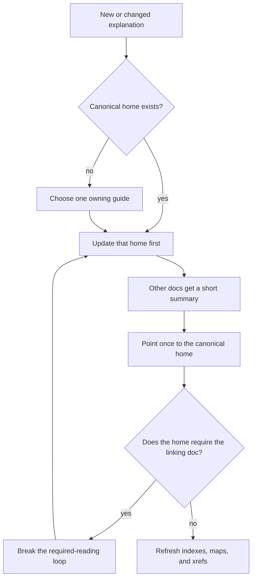

# R-YORS Decisions

This file records settled calls. Use it to avoid reopening decisions by
accident. If a decision needs to change, change it here first, then update the
dependent docs.

## Use This File

- Check this file before proposing alternatives to naming, hash policy,
  doc structure, STR8/HIMON ownership, or assembler syntax.
- Do not treat an open design note in another guide as stronger than a decision
  here.
- Mark a decision as `reopened` only when the user explicitly asks to revisit
  it.
- When a decision/edict changes a reader's working map, add a short entry to
  [DOC_FLASH.md](./DOC_FLASH.md) pointing at the changed decision and dependent
  docs.

## Naming And Roles

```text
R-YORS boots through STR8.
STR8 keeps recovery/update safe.
STR8 hands normal operation to HIMON.
HIMON provides the monitor, command dispatch, assembler, catalog lookup,
and debug tools.
```

ASM emits W65C02S native code optimized for size. Prefer compact instruction
forms when the source spelling or symbol width explicitly permits them, but do
not silently promote or demote operand width. The code shape is
routines-of-routines: small callable routines, explicit labels, and fixups
rather than a hidden VM or broad runtime.

- `ror` is the working repo/copy.
- `R-YORS` is the overall project/system name.
- `STR8` means Subroutine To Return. It is pronounced `S-T-R-8`, can also be
  read as `Straight 8`, and deliberately echoes `RTS` / Return from Subroutine.
- Future STR8 may grow into `STR8-N`, read as `STRAIGHTEN`, after the small
  recovery anchor proves itself. That future name means richer repair and
  normalization capability, not mandatory ownership of every system policy.
- `HIMON` is the active monitor/debug/catalog/assembler environment name.
- `THE` is The Hash Environment: lookup/catalog records, resolver policy,
  aliases, and typed display. Public catalog/name identity uses 32-bit FNV-1a;
  CRC16 is reserved for compact local tables and checks where surrounding record
  context handles collisions. THE is not the whole runtime and not arbitrary
  command execution.
- Himonia-F is historical/archived branch vocabulary that has folded back into
  HIMON.
- Do not treat Himonia-F and HIMON as permanently separate products.

## Address Vocabulary

- `$WLPB` is the preferred teaching mnemonic for a 16-bit hex address:
  `W` = 4K window, `L` = 256-byte line, `P` = 16-byte paragraph, and `B` =
  byte.
- In banked flash, one 4K window is one erase sector of the currently selected
  bank. The physical flash location is bank plus window plus offset.
- Sector `$0` means `$0000-$0FFF`; `$0000-$FFFF` is the full 64K CPU address
  space, not sector `$0`.

## Date And Time Format

- All date and date/time text in source, documentation, generated artifacts,
  comments, logs, and examples should use ISO 8601.
- Use `YYYY-MM-DD` for dates.
- Use `YYYY-MM-DDTHH:mm+/-HH:MM` for local date/times when minute precision is
  enough. Omit seconds unless the event genuinely needs second-level precision.
- Use CBI doc form for dated documentation streams: `YYYY`, then `MM`, then
  `DD`, then descending `HH:MMZ programmer comment` rows. Use CBI code form
  inside source files: `; YYYY-MM-DDTHH:MMZ programmer comment`. Continuation
  lines align under the comment body. Keep CBI source lines under 78 columns.
- Any discovered older date stamps are cleanup debt, not precedent.
- Firmware identity banners may use the compact visual monitor form instead of
  ISO 8601 when screen space and serial transcripts benefit from it. HIMON uses
  local time as `HIMON V 00.mmdd(hhmm)`. STR8 uses the matching UTC form
  `STR8  V 00.mmdd(hhmm)Z`; the trailing `Z` is part of the STR8 convention.
  This exception is for firmware-visible identity strings, not for docs, logs,
  source comments, or generated artifacts.

## Command Safety And Syntax

- Mandate: destructive commands require a command token of 4 or more
  characters. Do not add new 1-, 2-, or 3-character destructive commands.
- Destructive means the command's normal purpose is to overwrite, erase,
  program, copy, fill, move, patch, restore, back up, or change boot/recovery
  policy for RAM, flash, banks, vectors, or catalog/storage records.
- Short command tokens remain for inspection, search, display, stepping,
  register/context work, launch, and other nonpersistent control.
- Existing short mutators in current ROM/proof builds are transition debt, not
  permission for new short destructive spellings. Future revisions should move
  bulk mutation behind full words such as `COPY`, `FILL`, `MOVE`, `FLASH`,
  `BANK`, `ERASE`, `BACKUP`, and `RESTORE`.
- STR8 keeps `R` as reset. Do not use that exception to add new short
  destructive command spellings.
- `C`, `M`, and `F` are not destructive shortcuts. `M` currently means
  byte-by-byte modify in HIMON and is under command-surface review.
- `S` single-step has moved to `N` in the HIMON command surface. Do not add
  `NEXT` as a command alias. A RAM-only single-step/next operation is not
  destructive; it plants only a temporary debugger trap in RAM and restores the
  original opcode. `S` is freed for memory search. Search is non-destructive:
  hex byte tokens are the default pattern. After the range, parse one or more
  pattern atoms:
  byte tokens append bytes, and an apostrophe text atom appends the rest of the
  line. Example: `S 0 FFFF 4D 4D 'M` searches for three `M` bytes.
  Apostrophe text is a final tail in V0; there is no closing-quote parser and
  no return to hex parsing after text.
- The first `N`/breakpoint patch policy is deliberately conservative:
  synthetic debugger traps may be planted only in UPA `$2000-$77FF`. Reject
  zero page, hardware stack, low RAM, HIUPA/scratch, monitor/page-buffer RAM,
  I/O, and ROM/flash. This protects system-owned RAM as well as non-RAM.
- The patchability check is HIMON system policy, not a user-callable routine
  contract. Keep the first W65C02S implementation as a tiny local debug fast
  path instead of a "routines of routines" framework. Promote a shared
  address-policy routine only when multiple system components need the same
  policy and the ROM byte cost is justified.
- Debug is an optional HIMON subsystem/include, not a layer between STR8 and
  HIMON. A build may omit debug to save flash, but the command records, help
  text, BRK debug hook behavior, and docs for that build must agree.
- `BRK 00` is reserved for HIMON's synthetic debug trap. Reserve `$50-$5F` as
  a lightweight assert/exception signature range, but name only `$50 ASSERT`
  and `$59 UNHANDLED` for now. Proofs may use their own fixed signatures such
  as `$41` start, `$42` pass, and `$E1-$E9` bad-path stops.
- HIMON should report debugger-owned synthetic traps as compact `@hhhh`
  register-state lines, not as ordinary `BRK 00 PC=hhhh` stops. Far-out
  rating: `1/10`; this is UI classification of already-known debugger state,
  not a new execution model. Real program `BRK xx` signatures remain loud.
- User breakpoints are one-shot in the first debug implementation. A persistent
  breakpoint feature can come later, after the hardware transcript for `N`,
  `@hhhh`, real `BRK xx`, and one-shot `B` behavior is stable. Persistence
  requires an explicit step-over/replant state.
- Search hits should print like `D` context rows, with exact hit address first,
  aligned row base second, and `*` between them when the match continues into
  the next 16-byte display row. This preserves the useful BSO2 monitor
  search-display convention in HIMON's command language.
- Range grammar for commands that accept ranges:

```text
start end       end is inclusive
start +count    count is the number of bytes
```

- The current shared parser also accepts the tight form `start+count`, so
  `D 1234+1` means exactly one byte at `$1234`.
- A 1- or 2-hex-digit `end` token inherits the high byte from `start`.
  This is a page-local end shorthand, not a count. Example: `D 3000 FF`
  means `$3000-$30FF`, because the short end byte `$FF` inherits `$30` from
  `$3000`. If the inherited end would land before `start`, reject it and
  require a full end address or `+count`; `D 30F0 10` is ambiguous/dangerous,
  so use `D 30F0 3110` or `D 30F0 +21`.
- A 3- or 4-hex-digit `end` token is a full absolute address, not a
  window-local shorthand. `D 1000 FFF` therefore resolves as `$0FFF` and is
  rejected because it lands before `$1000`; use `D 1000 1FFF` or
  `D 1000 +1000`. A future 3-digit window-local shorthand would need its own
  explicit decision.
- The `+count` form is deliberately explicit, but it should not be the common
  typing path for page-local display. Common bench dumps should prefer
  page-local end shorthand, such as `D 100 3` for `$0100-$0103` or
  `D 3000 FF` for `$3000-$30FF`. Use `+count` when the operator means a byte
  count, not an end byte.
- `D` without parameters should repeat the previous dump length starting at the
  byte after the previous dump. Example: `D 3000 FF` displays `$3000-$30FF`
  and records length `$0100`; the next bare `D` displays `$3100-$31FF`.
  If no previous dump range exists, bare `D` is a usage error.

## STR8 Ownership

- Direction change: earlier planning leaned toward future STR8 ownership of the
  final hardware vectors and broader trap authority. After careful
  reconsideration by the project author, the direction is opt-in integration
  rather than ownership-by-default.
- STR8 does not own global memory management or application interrupt policy.
  User-built systems may provide their own RAM map, trap supervisor, IRQ
  discipline, and runtime conventions.
- V0 HIMON controls IRQ/vector behavior.
- Future STR8-N/STRAIGHTEN may offer recovery-safe vector hooks, trampolines,
  and `SYS_VEC`/IRQ-vector integration for systems that choose that path. It
  should remain useful as routines and guarded update machinery even when a
  user system owns interrupts itself.
- STR8 stays in the R-YORS "routines made from routines" spirit: reusable
  layers a system can choose, not a hidden claim over the board.
- STR8 lives in bank 3's physical top erase sector (`$F000-$FFFF`). The current
  resident proof is linked at `$F000`, giving a 4K protected window.
- Protected-window bytes are flashed through a separate STR8 install/update path.
  That path still stages the full top sector and preserves non-target bytes.
  Non-STR8 bytes in the same 4K sector may be used, but changing them requires
  the same read, stage, erase, full-sector-write, and verify transaction.
- V0 STR8 starts as a RAM-resident S19 program launched under HIMON. It proves
  bank select, erase, 4K-buffered copy, Bank 0 enrollment, and read-back compare
  before reset-time ownership.
- V0 STR8 uses whole 32K ROM bank images (`$8000-$FFFF`) as recovery sources.
  Normal restore writes bank 3 image bytes below `$C000` from selected bank 0,
  1, or 2 and preserves `$C000-$FFFF`. The current proof has a separately
  confirmed high-flash restore path that may rewrite `$C000-$FFFF`; that is
  dangerous proof behavior, not the final casual restore policy.
- Bank 3 is the live boot image. Bank 2 is the newest backup. Bank 1 is the
  previous backup. Bank 0 is held out of rotation unless the operator runs `E`.
  Saving the board's original WDCMONv2/base image is future bridge/install work,
  not today's STR8 RAM proof.
- Automatic backup copies bank 2 to bank 1 and bank 3 to bank 2 until bank 0 is
  enrolled. After `E` clears the one-way in-flash flag, automatic backup copies
  bank 1 to bank 0, bank 2 to bank 1, and bank 3 to bank 2.
- Restoring bank 0 restores whatever bank 0 currently holds. Before enrollment
  it may be a WDCMONv2/base image; after enrollment it is the oldest rotating
  backup.
- Future STR8-N/STRAIGHTEN may grow from whole-bank recovery into a
  range-aware flash manager. It may pack named regions elsewhere, remember
  their origin, and later restore them by metadata. Optional compression is
  allowed only behind explicit metadata and verification. This does not change
  the current STR8 V0 whole-32K-image backup/restore contract.
- The next partitioned-backup direction is a 64K arena across banks 0 and 1,
  allocated by STR8 policy rather than by the operator. The preferred catalog
  location is one fixed 4K sector at bank 0 `$8000-$8FFF`, leaving a 60K,
  15-sector payload pool in the remaining bank 0/1 space. Five clean 12K slots
  are the default HIMON-sized view of that pool, not a fixed allocation rule.
- In that direction, plain `B` remains the product-safe backup of the live
  HIMON payload range, while `B start end` may become an explicit range backup.
  STR8 must round or validate requested ranges to flash erase sectors, detect
  erased `$FF` sectors, and record erased sectors in metadata instead of
  storing payload bytes for them. Smaller ranges can consume fewer sectors,
  larger ranges can consume more, and the catalog records the actual allocated
  sector list.
- Full-sector backups such as `$F000-$FFFF` should keep their payload sector
  byte-for-byte clean; metadata lives in the catalog sector, not in front of the
  copied data. STR8 decides whether a requested backup fits, where it is stored,
  and what may be overwritten. Bank 2 is the planned SYS/USR bank, and bank 3
  remains the default boot bank with `$8000-$BFFF` user-available,
  `$C000-$EFFF` as the default payload gate, and `$F000-$FFFF` as
  STR8/top-sector recovery space.
- In the partitioned-backup direction, reserve one normal 4K bank 0/1 payload
  slot as `STR8_TOP_SAFE` before allowing STR8 top-sector update work. The first
  fixed slot may be bank 1 `$F000-$FFFF`, physical `$0F000-$0FFFF`, leaving 56K
  for ordinary managed backups. The active boot top sector is bank 3
  `$F000-$FFFF`, physical `$1F000-$1FFFF`.
- W65C02SXB/EDU has no alternate boot jumper. If the active bank 3 top sector
  is corrupt enough to lose usable reset vectors, no onboard software path can
  reach STR8, bank 2 tools, or the bank 0/1 catalog. A top-sector backup is
  therefore programmer-assisted recovery, not bootable self-rescue: erase,
  program, and verify physical `$1F000-$1FFFF` from the raw bytes stored in the
  `STR8_TOP_SAFE` physical source slot. Recovery receipts must use physical
  addresses, not ambiguous CPU `$F000-$FFFF` text.
- STR8 V0 is W65C02-specific. NMOS 6502 portability is not a V0 goal.
- Minimal recovery is a small load/verify/flash/identity surface, not full
  HIMON.
- STR8 V0 keeps console byte I/O private as `STR8_CON_*` routines. They are
  recovery-anchor implementation details, not public `BIO_*`/`PIN_*` catalog
  providers.
- Public `BIO_*`/`PIN_*` records should have one owner in the combined image.
  The current HIMON body owns the public `BIO_FTDI_*` records.
- Small duplicated console code inside STR8 is acceptable while it keeps
  recovery self-contained and avoids duplicate global hash lookups.
- STR8 should avoid `COR_*`/`SYS_*` as hot-path dependencies unless the entry is
  intentionally tiny, stable, and recovery-safe. `SYS_*` remains the public
  monitor/application layer, not the recovery anchor's default substrate.

## Routine Layer Policy

- R-YORS layers are optional contracts, not a required ladder. Do not create
  `PIN_`, `BIO_`, `COR_`, and `SYS_` spellings for every routine by reflex.
- `PIN_*` names concrete hardware access: device registers, pin state, MMIO,
  and board-specific readiness. New serial/RS232 hardware should start here,
  for example `PIN_ACIA_*`.
- `BIO_*` names recovery-safe byte/block I/O contracts. A concrete provider such
  as `BIO_FTDI_*` is acceptable while FTDI is part of the contract. Code meant
  to survive a backend swap should prefer future device-neutral forms such as
  `BIO_CON_*` or `BIO_WRITE_BYTE` when those aliases exist.
- `COR_*` is for reusable implementation logic with no device ownership:
  parsers, formatters, scanners, buffers, and protocol cores that can be used by
  BIO, SYS, tests, or RAM proofs.
- `SYS_*` is public policy and routing: active console choice, monitor/app API,
  line discipline, dispatch, and platform decisions.
- Additional layers are allowed when they buy a real boundary. `MEM_*`,
  `HREC_*`, `CAT_*`, or another prefix can exist if it documents ownership,
  caller contract, dependency direction, and proof state. The test is simple:
  the name should reduce confusion for future code, not just mirror an existing
  routine at another altitude.
- When duplicated proof code starts wanting to be reused, promote the behavior
  into a documented callable contract before catalog magic. First static-link
  it through ordinary labels/library rules. Later, expose the same contract as
  an `RREC` export and resolve users through `RF`/`RLNK`. Keep
  workspace-specific adapters thin; for example, HIMON and search can share
  range arithmetic while retaining their own `CMD_*` or `SEARCH_*` workspace.

## Stack And Trap Policy

- HIMON owns the hardware stack on monitor entry.
- NMI, BRK, IRQ, reset, and recovery paths must assume monitor ownership of the
  real 6502 stack.
- Userland stack behavior belongs behind explicit routines, software stacks,
  conventions, or per-app reservations, not casual ownership of the hardware
  stack.
- This is the R-YORS reference monitor policy, not a demand that user-built
  systems give STR8 or HIMON global ownership of memory or interrupts.
- Resume is explicit: rebuild context and `RTI`; do not imply stale automatic
  continuation.

## Dynamic Memory Layer

- If HIMON eventually uses dynamic memory, allocation belongs behind a `MEM_*`
  memory-management layer.
- Current user-stable zero page ends at `$AF`. `$B0-$CC` is reserved for future
  R-YORS/HIMON/THE/ASM pointer lanes and addressing-mode workspace.
- `MEM_*` owns RAM range policy, zero-page pointer lanes, bump allocation,
  mark/release allocation, fixed pools, and any later free-list heap.
- `MEM_*` is hardware-constrained because it touches raw W65C02 RAM and zero
  page, but it is not `PIN_*`/`BIO_*` hardware access.
- STR8 should not depend on general dynamic memory. STR8 remains fixed-buffer
  and fixed-workspace oriented.
- Public monitor or app-facing allocation calls should be `SYS_*` wrappers over
  `MEM_*`, not direct hidden heap calls from unrelated monitor code.

## Hash And Catalog Policy

- Working description: HIMON/THE is a ROM-resident hash dictionary for 65C02
  services, with Forth instincts and assembler bones.
- FNV-1a 32-bit is the settled public hash for names that cross a boundary:
  commands, exported routines, public symbols, modules, and cross-bank imports.
  It solved the real public-identity problem and avoids making 16-bit
  collisions dominate the design.
- Tableless CRC16 remains useful, but not as the universal public identity. Use
  it for compact local catalog/table indexes, short IDs, local assembler scopes,
  and block/body checks where record length, kind, namespace, checksum/proof
  text, or fallback comparison can handle collisions.
- CRC32 is a possible stronger integrity/check value for `RC` blocks or `RB`
  bodies. It is not the normal command/routine lookup hash.
- Current HIMON command records and routine `[HASH:XXXXXXXX]` comments carry
  32-bit FNV-1a, and future public `RR` records should continue to carry the
  same public identity unless a later explicit multi-algorithm decision replaces
  it.
- STR8 V0 does not use FNV or CRC16 for recovery decisions: not for
  verification, image selection, version selection, command dispatch, catalog
  lookup, or restore policy.
- Future STR8-N/STRAIGHTEN may participate in catalogs after the V0
  image-recovery path is stable. It should not require catalog ownership from
  systems that provide their own catalog or resolver.
- Do not add per-record hash-algorithm tags unless the project explicitly
  adopts a multi-algorithm catalog.
- Routine header `[HASH:XXXXXXXX]` values remain 32-bit FNV-1a for docs/build
  tooling and public routine identity.
- Existing `hash0..3` fields store FNV-1a low byte through high byte.
- Words and longs are little-endian: low byte first.
- Current HIMON proving record shape is:

```text
'F','N',('V'|$80),hash0,hash1,hash2,hash3,kind,payload...
```

- In current HIMON, `kind` is a bit field for the FNV-era record:
  bit 0 means executable/callable, and bit 1 means confirm before execution.
- `kind=$00` means described/known, not directly executable by the current
  dispatcher.
- `kind=$01` means executable/callable. For legacy inline command records, code
  begins immediately after the kind byte at record offset `+8`.
- `kind=$03` means executable/callable with confirmation. Its current payload is
  `DW ENTRY`, `DW EXTRA`. `EXTRA` is descriptive side information used by `#`
  and by confirm prompts as optional HBSTR display text. `EXTRA` is not an
  alias and is not passed to the called routine.
- `# K=hh`, `# K<hh`, and `# K>hh` are display filters, not resolver modes.
  They list resident records by exact, less-than, or greater-than `kind` byte.
- Command aliases must be real records with their own hash. Display text must
  not be treated as a second command name unless a future alias record explicitly
  says so.
- Future records that make the second or third word part of the call contract,
  such as `PARMS` or `RESULTS`, should use a different kind and a documented
  HIMON/THE calling convention.
- Parked next-shape direction: retire newly emitted inline executable records.
  Use an explicit legacy `K` bit for old inline records, and let non-legacy
  executable records carry `DW ENTRY` plus optional words selected by `K` bits.
  If a text bit is clear, no `TEXT` word is present; do not force a `$0000`
  placeholder just to preserve a fixed text slot.
- Keep `K` focused on hot-path shape/dispatch. Link/load and flash-management
  data such as length, state, generation, seal, purge, imports, and fixups
  should live in reserved bytes or attached typed extensions rather than
  consuming all remaining `K` bits.
- Future `RREC` records may wrap inline bytes or a linked `RBODY` as a typed
  data packet. The kind/control contract decides whether that payload can be
  displayed, validated/authenticated, joined as code, resolved as imports, or
  used in some other way.
- A resolver must reject operation/kind mismatches. Printable data is not
  automatically joinable; authenticatable data is not automatically executable;
  joinable code still needs an explicit call contract.
- Config values such as `CONFIG.TERMINAL.WIDTH=$40` should be future
  data/config records, not executable records. Terminal startup may resolve the
  hash/name, require a scalar config kind, validate the range, and fall back to
  the compiled default when the record is absent or invalid.
- Bit 2 is the parked `has text` bit for the next non-legacy FNV/RR shape; it
  selects whether a `TEXT` word is present after `DW ENTRY`. Bits 3..6 remain
  unassigned in the hot-path `K` byte. Do not spend them as ad-hoc selectors,
  permissions, lifecycle flags, or dependency-policy flags until a future
  record layout proves the need. Selector and permission ideas belong in
  separate metadata or a documented control byte first.
- Future compact signatures identify record layout/classification, not a hash
  algorithm.
- One thing may have multiple classification flags; use bit flags/tokens rather
  than forcing one exclusive kind when that loses truth.
- Do not overload `kind` for purge/lifecycle policy. `kind` says what the
  record or payload is: routine, command, symbol, alias, range, data, and so
  on. Lifecycle metadata belongs in flags or extra record metadata.
- Prefer `REQUIRED_FOR_RECOVERY` for the flag that prevents ordinary purge,
  movement, or superseding. It names the reason, while `PINNED` or
  `unpurgeable` names only the effect.
- `BIO_*` and `PIN_*` prefixes do not automatically imply
  `REQUIRED_FOR_RECOVERY`. Only the active recovery dependency chain gets that
  flag. STR8 V0's private `STR8_CON_*` path means HIMON's public
  `BIO_FTDI_*` records are not automatically recovery-required.
- Command text is for discoverability, collision confirmation, and future
  tooling. It is not required for the current basic FNV lookup.
- Text compression must be optional. If compressed text is not smaller, store
  raw text or omit text.
- Catalog linking resolves imports recursively. Selecting a low-level provider
  such as `PIN_READ_BYTE_NB` should install only the PIN-level body. Selecting a
  higher-level service such as `BIO_READ_CHAR_NB` or `SYS_READ_CHAR_NB` should
  follow that service's declared imports down through BIO/COR/PIN dependencies,
  add only missing bodies, and then apply fixups. The hash identifies the
  requested contract; import/export/fixup records do the linking work.

## STR8 Call Surface

- STR8 V0 does not reserve or depend on fixed cute-address entry slots.
- STR8 V0 should call its private `STR8_CON_*` console helpers directly for
  recovery I/O.
- HIMON should reach resident STR8 routines through explicit imported labels or
  a generated import file, not through hard-coded top-ROM vanity addresses.

## STR8 Imports And Onboard Resolution

- Host-built HIMON images should not import V0 `STR8_CON_*` console helpers;
  they are private to STR8. Future shared STR8 services should be imported from
  explicit STR8 labels or a generated import file. That keeps the release
  reproducible and prevents the linker from pulling a second copy of public
  `BIO_*` out of `rom.lib`.
- `# label` is a HIMON command. It may eventually resolve HIMON catalog entries
  that point at callable STR8 routines, but STR8 V0 does not perform catalog
  lookup.
- RAM targets can patch resolved addresses directly. Flash targets must either
  stage in RAM before the first write or restrict patching to legal flash
  1-to-0 transitions.

## Hashed ASM Direction

Detailed settled ASM decisions live in [ASM/DECISIONS.md](ASM/DECISIONS.md).

Project-level summary:

- ASM proper is its own hash-based source-line assembler, not the legacy HIMON
  `A` mini-assembler path.
- ASM v1 is a RAM-session W65C02S assembler that emits native bytes and records
  explicit symbols, references, and fixups.
- Source width is intent: `$hh` is zero page, `$hhhh` is absolute, with no
  silent promotion or demotion.
- V1 directives are `EQU`, `DC`, `DS`, `ORG`, and `END`; `START`, `ENTRY`, and
  `EXTRN` stay parked.
- `EQU` resolves immediately in v1. Forward references are emitted-byte fixups,
  not symbol-equation dependency chains.
- The `ASM n.nn` catalog now has the 1.xx front-end spine settled through
  `ASM 1.90`: source rules, calling contracts, session spine, lexer, vocabulary
  lookup, statement parser, symbol table, expression evaluator, and operand
  classifier.
- Larger ASM/HIMON-scale symbol pressure is a future design problem involving
  resident tables, temporary storage, flash workspace, compression, or a mix. V1
  RAM rows keep hash plus canonical text and do not store `SYM3`.
- `ASM-xxxx` remains reserved for future S/36-style operator diagnostics and
  WTOR/reply policy.

## HIMON Assembler And Disassembler Decode

- The OSI-era idea of building HIMON's assembler/disassembler primarily from a
  compact opcode bit-pattern decoder is retired for the W65C02S target.
- The useful opcode split is `aaa bbb cc`, but it is only a partial compression
  aid, not the primary correctness model. `cc=01` is the cleanest 64-slot
  family. `cc=00`, `cc=10`, and especially `cc=11` need enough special cases
  that the implementation should remain table-driven.
- HIMON's current `ASM_OP_MNEM_ID` and `ASM_OP_MODE` tables are the authority
  for V0 assembly and disassembly. Future size work may compress obvious
  families only after preserving byte-for-byte table-equivalent behavior.
- Treat the pulpwood/firewood-era bit-code sketch as historical design fuel,
  not pending implementation debt.

## Local Source Homes

- MS BASIC, `.BAS` programs, fig-Forth, WDCMONv2, and s3x live under `LOCAL/`.
- `LOCAL/` is intentionally ignored.
- Provenance belongs in local `PROVENANCE.txt` files: timestamps, sizes,
  mtimes, paths, hashes, and notes; no source-content leakage into tracked docs.
- Builds may consume ignored local source/generated files when present.
- Forth language ideas are not treated as copied source. The local fig-Forth
  source is treated as an external public-domain publication with a required
  notice; generated fig-Forth source must preserve that notice.

## Documentation Shape

- Main reader path:

```text
README.md
DOC/INDEX.md
DOC/GUIDES/OPERATORS_GUIDE.md
DOC/GUIDES/TECHNICAL_GUIDE.md
```

- `DOC/GUIDES` top level is for entry points and stable cross-cutting
  references. Domain, story, planning, compatibility, and working-note material
  belongs one level down in shelves such as `STR8/`, `HIMON/`, `QCC/`,
  `STORY/`, `MEMORY/`, `CATALOG/`, `ASM/`, `HASH/`, `LOGS/`, `META/`,
  and `PLANNING/`. Compatibility stubs belong under `META/COMPAT/`.
- `OPERATORS_GUIDE.md` is the canonical board-facing guide for current R-YORS,
  STR8, and HIMON operation.
- `TECHNICAL_GUIDE.md` is the canonical architecture guide for product roles,
  source layout, build artifacts, memory, flash, IVI, STR8, HIMON, and payload
  contracts.
- `RTFM-R-YORS.md`, `RTFM-str8.md`, and `RTFM-himon.md` are compatibility entry
  points. They should point to `OPERATORS_GUIDE.md` instead of carrying their
  own duplicated procedure bodies. They are reference/backlink files, not front
  page navigation; keep them under `META/COMPAT/` and do not list them from
  `README.md`, `DOC/INDEX.md`, `INDEX.md`, or `TOC.md`.
- Story and narrative material belongs outside the main operator/technical
  path:

```text
DOC/GUIDES/STORY/BOOK.md
DOC/GUIDES/STORY/HISTORICAL_DOCUMENTS.md
DOC/IDEAS.md
```

- When origin matters, mark idea provenance using
  `META/PROVENANCE.md`. Use `ORIG-WLP2` for Walter-originated project names,
  edicts, and design calls; `BENCH-WLP2` for hardware proof; `COLLAB-AI` for
  AI/Codex-assisted shaping; `EXT-PRIOR` for outside prior art or convention;
  `DERIVED-SRC` for generated/source-derived evidence; and `UNKNOWN` when the
  origin is not yet known. Provenance tags are truth markers, not legal
  ownership claims.
- `INDEX.md` answers: what exists?
- `TOC.md` answers: what order should I read it in?
- `MAP.md` answers: how do docs and systems relate?
- `REF.md` is the quick operational reference.
- `META/XREF.md` is wiring: docs, source, symbols, module/export rules.
- `META/PROVENANCE.md` records idea-origin marking rules for the book, docs,
  and source comments.
- `ASM/SYMBOL_XREF.md` is symbol/routine cards, routine contracts, hashes, and tags.
- `GLOSSARY.md` defines vocabulary only.
- `META/BIB.md` records source corpus/provenance only.
- `HIMON/HIMON_MAP.md` is the readable HIMON edge/capability map.
- `HIMON/HIMON_EDGE_DUMP.md` is the raw direct-edge evidence.
- Each concept should have one canonical home. Other documents may give a short
  summary and a link, but should not restate the full explanation.
- Avoid reader pinball: if document A points to document B as the authority for
  a concept, document B should not require document A to understand that same
  concept. Back-links are for navigation, not required reading loops.
- When updating docs, update the canonical home first, then indexes, maps, and
  cross-references. Generated docs should remain evidence or views, not the
  primary hand-written explanation.
- HTML pages under `DOC/HTML` and the root `index.html` redirect are generated,
  ignored, untracked presentation views of the Markdown docs. Do not hand-edit
  them or treat them as canonical explanations. Regenerate them with
  `make docs-html` only when explicitly requested.
- Use `flowchart` for process or decision sequence. Use `graph` for node/edge
  structure such as call paths or stack-depth paths. Use `map`, `guide map`,
  `source-derived map`, `chart`, and `edge dump` according to
  [GLOSSARY.md](./GLOSSARY.md).



## Historical Spine

```text
WDCMON/WDC monitor base
  -> BSO2 board monitor
  -> R-YORS routine layers
  -> Himon/Himonia compact monitors
  -> Himonia-F hash-dispatched monitor
  -> HIMON behind STR8
```

- BSO2 proves the big board-monitor feature set.
- R-YORS splits that into reusable routines/layers.
- Himonia-F was the compact, hash-driven monitor branch that has folded back
  into HIMON.
