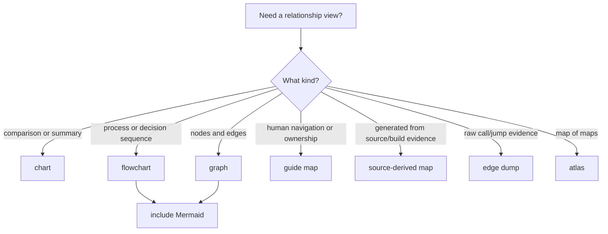

# R-YORS Glossary

## Terminology Contract

Use these words precisely. When a word can mean more than one technical thing,
prefer the specific form listed here instead of the bare word.

- R-YORS: the whole project/system/runtime direction and current repo home.
- HIMON: the current monitor/debug/catalog environment; the default bundled
  monitor payload for STR8.
- STR8: the board management product and current recovery/update guard.
- IVI: Interrupt Vector Indirection. This came from BSO2 and is pronounced
  `IVY`. It is the mechanism: hardware vectors enter small stubs, and payloads
  patch RAM targets or tables instead of reflashing the hardware vector block.
- IVY: pronunciation of IVI. Use `IVI` in written design text unless referring
  to the current `IVY` signature bytes or existing symbol names.
- LEAF: Latched Entry Address Frontdoor. The newer/friendlier front-door idea
  built on IVI: stable vector stubs plus patchable latched entry addresses,
  explained as a board feature rather than as raw vector plumbing.
- STR8-N / STRAIGHTEN: future expanded STR8 direction.
- THE: The Hash Environment. THE is the lookup/catalog environment: canonical
  names, compact hashes, RCAT/RREC records, resolver policy, aliases, and typed
  display. HIMON's current command dispatcher still carries FNV-1a history; the
  intended compact runtime/catalog hash is tableless CRC16. THE is not the whole
  runtime.
- ASM: the planned onboard assembler path.
- payload target: a bootable/installable monitor, application, tool, or ROM
  image selected by STR8. HIMON is the default payload target, not the only one.

## Normative Words

R-YORS uses RFC 2119/8174-style words only when they are uppercase in a spec or
contract block.

- MUST / SHALL: required.
- MUST NOT / SHALL NOT: forbidden.
- SHOULD: recommended unless there is a clear reason not to.
- SHOULD NOT: discouraged unless there is a clear reason.
- MAY / OPTIONAL: allowed.
- WILL: descriptive future tense, not a requirement.

Lowercase words such as "should" and "may" are ordinary English.

## Contract Terms

Use `contract` as the normal word. Avoid `API` and `ABI` unless the sharper
meaning is required.

- routine contract: what a callable routine expects and returns.
- entry contract: what is true when code starts at an entry.
- fixed-entry contract: a callable address or label promised to stay stable.
- vector contract: what an indirect vector slot points to and when it is valid.
- call shape: the registers, flags, memory, stack, and side effects used by a
  call.
- entry: the address or label where a routine/body starts.
- fixed entry: an entry kept stable for external callers.
- trampoline: a tiny stable entry that jumps or calls into the current
  implementation.
- vector: an address slot used by CPU/system dispatch.
- IVI vector slot: a RAM address cell or dispatch table entry used behind the
  stable hardware-vector stubs.
- ABI: binary/register/address-level contract; use only when that precision is
  needed.
- API: named software interface; usually `routine contract` is clearer here.

## Map, Graph, And Flow Terms

Project note: "Words have different meanings [now]" is Walter's shorthand for
the moment a project word starts carrying too many meanings. When that happens,
add a precise glossary term instead of relying on the overloaded bare word.

- diagram: any renderable visual explanation. Use a more specific word when the
  visual has a known role.
- chart: a visual or table-like comparison of values, categories, states, or
  summaries. A chart is not necessarily a node/edge structure.
- graph: nodes and edges. Use this for call relationships, dependency
  structure, path structure, and analysis output.
- flowchart: a process, routing, or decision diagram where arrows mostly mean
  "then", "if", or "next".
- map: a relationship or orientation view that helps a reader know where things
  are, who owns them, or what to open next.
- guide map: a human-readable map that explains relationships, ownership, or
  reading/navigation choices.
- source-derived map: generated documentation extracted from source labels,
  calls, records, or build metadata.
- edge dump: a raw source edge listing, usually direct `JSR`/`JMP` evidence.
- atlas: a map of maps; it tells which document to open, not the full content
  from those documents.
- hash map: the guide map of hash concepts and ownership in
  [HASH_MAP.md](HASH/HASH_MAP.md). It is not a hash table implementation.
- hash table: an implementation data structure for lookup by hash.
- stack depth map: source-derived stack high-water documentation. If it says
  `graph view`, it should include a renderable Mermaid node/edge diagram.

## Document Structure Terms

- document: one named file or stable rendered artifact with one primary purpose.
- title: the document's main name, normally the single H1 heading.
- subtitle: a short descriptive line under the title. It is not a section.
- heading: a structural label that opens a section.
- chapter: a major division in a book/manual-scale document. Do not use it for
  every short guide.
- section: a named division under a title or chapter, normally H2 in Markdown.
- subsection: a nested division under a section, normally H3 or deeper.
- paragraph: a prose block separated from other prose by blank lines.
- outline: a hierarchical plan or structure for a document, argument, or system.
- item: one bullet, numbered entry, table row, or checklist row.
- clause: a small numbered or lettered rule/requirement unit. Use it when the
  text needs stable reference points, not just prose flow.
- doc page: a rendered page in a paginated output such as PDF. Markdown files do
  not have stable pages until rendered.
- doc line: a line number in a source or Markdown file. Use it for pinpointing
  an edit location, not as the conceptual home of an idea.
- paragraph numbering: period-flavored late-1970s/1980s term for hierarchical
  numbers or letters attached to headings, clauses, or paragraphs, such as
  `1`, `1a`, `1a1`, or `1a1b2c`. Modern synonyms include outline numbering,
  hierarchical numbering, alphanumeric outline numbering, section numbering,
  and clause numbering.
- outline style: word-processor term for a reusable paragraph-numbering scheme.
  Legal outline and automatic paragraph numbering are adjacent period terms.
- paragraph locator: the R-YORS name for a compact paragraph-numbering reference
  such as `1a1b2c`.

## Ownership Terms

- owns: responsible for policy, mutation, and final safety.
- uses: may read, call, or consume without controlling policy.
- requests: asks the owner to perform an action.

Example: HIMON uses catalog lookup and may request condense. STR8 or catalog
maintenance owns dangerous sector rebuilds.

## Source Aliases

Generated docs and guide navigation use operational aliases so old source lanes
do not leak into current terminology.

- HIMON/: current monitor source alias.
- STR8/: current recovery/update source alias.
- ROM/dev/: current ROM support adapter source alias.
- ROM/ftdi/: current ROM FTDI backend source alias.
- ROM/util/: current ROM utility source alias.
- SRC/STASH: stable or promoted code lane.
- SRC/SESH: session/WIP lane.
- SRC/BUILD: generated build output.
- SRC/tools: host-side scripts for build and generated artifacts.

Physical source locations can move. The aliases describe the role in current
docs.

## Project Terms

- Himonia-F: historical FNV-driven implementation branch now folded into HIMON
  and archived under `SRC/ARCHIVE/himon`.
- Straight 8: alternate reading of `STR8`; useful as flavor, not the formal
  project name.
- QCC: Questions, Comments, Concerns. Borrowed from call-center training as a
  pause after each thought block; in R-YORS it is the guide style for important
  design thinking that is not settled enough for `DECISIONS.md`.
- CBI: Computer Bank, Inc., the project author's RPG II coding-days employer.
  R-YORS uses two CBI shapes:
  CBI doc form is the level-break change-note shape: year, month, day, then
  descending `HH:MMZ programmer comment` rows. CBI code form is the condensed
  source-comment line: `; YYYY-MM-DDTHH:MMZ programmer comment`. Continuation
  lines align under the comment body. Keep CBI source lines under 78 columns.
- DOC FLASH: short alert stream for doc-shape, edict, canonical-home, QCC, and
  remembered-artifact changes. It is a reader-facing flare, not a full
  changelog.
- ISO 8601: project-wide date/time format for source, docs, generated files,
  comments, logs, and examples. Use `YYYY-MM-DD` for dates and
  `YYYY-MM-DDTHH:mm+/-HH:MM` for local date/times unless more precision is
  required.
- BSO2: predecessor board-monitor project and lineage evidence.
- SMS: provisional way-future name for a System Messaging Service. The name may
  change. The concept is an operator/message-queue service for informational,
  action, inquiry, reply, and cancel-style system messages.
- TLA: three-letter acronym. Use one when it makes command output or source
  labels clearer; spell it out in this glossary when it becomes project
  vocabulary.

## Monitor And Debug Terms

- BRK: W65C02 software interrupt/trap opcode. In HIMON transcripts,
  `BRK xx PC=hhhh` means real user code executed `BRK` with signature `xx`; the
  printed PC is the resume address after the two-byte BRK instruction.
- BP: breakpoint. `B` is the HIMON command; `BP` is the thing being reported.
  Example messages: `BP $3043`, `BP FULL`, `BP NF`.
- BP FULL: all breakpoint slots are active.
- BP NF: breakpoint not found; used when `B C hhhh` asks to clear an inactive
  address.
- DBG: debug/debugger. Current source labels use `DBG_*` for monitor debug
  state and helper routines.
- DBG RAM: HIMON refused to plant a synthetic debug `BRK` outside patchable
  user RAM.
- synthetic debug trap: HIMON-owned `BRK 00` planted temporarily for `N`/`S`
  stepping or a user breakpoint. Current transcripts report these stops as
  compact `@hhhh A=...` lines instead of loud `BRK 00` program stops.

## Source Terms

- `MODULE` / `ENDMOD`: WDC assembler module boundary.
- `XDEF`: symbol exported by a module.
- `XREF`: symbol imported from another module.
- `ROUTINE` block: structured routine comment header with optional
  `[HASH:XXXXXXXX]`.
- `rom.lib`: linked library artifact produced by the source build.
- REF: a symbol/routine contract card: name, kind, contract, hash, source, and
  notes.
- XREF: where a symbol is defined, imported, called, or exported.
- XXREF: semantic classification tags that apply even before code exists.

## Layer Prefix Families

- `PIN_*`: low-level pin/driver routines at hardware/register boundaries.
- `BIO_*`: HAL routines above `PIN_*`.
- `MEM_*`: memory ownership/allocation routines for RAM ranges, zero-page
  lanes, heaps, marks, and pools. Hardware-constrained, but not device access.
- `COR_*`: backend/core integration routines.
- `SYS_*`: adapter/system-facing wrappers for app-level use.
- `UTL_*`: shared utility routines.
- `CMD_*`, `CMDP_*`, `MON_*`, `HIM_*`: monitor/command parser routines.

## Hash Terms

- FNV-1a: the older/currently implemented HIMON hash family. It remains in
  current command records and routine `[HASH:XXXXXXXX]` comments, but it is not
  the final compact runtime/catalog hash decision.
- CRC16: intended tableless compact runtime/catalog hash family.
- hash32: full 32-bit FNV-1a result, stored as hash0..3 low byte first.
- hash16: older folded 16-bit result derived from hash32.
- hash8: older folded 8-bit result derived from hash32.
- hash width: how many hash bytes are stored: 1, 2, or 4.
- fold: derive hash16 or hash8 from hash32.
- HASH: existing routine header ID formatted `[HASH:XXXXXXXX]`; this is hash32
  until the doc/build ID path is replaced.
- hash phrase challenge: HIMON's quote-command puzzle. The operator types a
  quoted phrase, HIMON uppercases/trims it through the normal reader, computes
  32-bit FNV-1a, and reports a match when it equals the built-in challenge
  hash. This is an Easter egg/proof marker, not a security feature.
- symbol hash: assembler/catalog lookup hash for labels, routines, and commands.
- hash collision: two names produce the same stored hash; name text or a wider
  stored hash must prove identity.

## Record Terms

- generic record: any structured chunk made of fields.
- Record: the specific record format currently defined by a section. A section
  should say, "In this section, Record means ...".
- R-YORS record: a R-YORS structured runtime/catalog record.
- RREC: R-YORS runtime record; one typed catalog entry for a command, routine,
  symbol, data item, module, inline value, or similar runtime thing. Treat an
  RREC as a typed envelope: its kind/control contract says how to interpret its
  inline payload or linked `RBODY`, and which operations are legal.
- RCAT: R-YORS runtime catalog dataset; may hold records, string pools, indexes,
  and links to runtime bodies spread across RAM or flash.
- member: informal package view of a catalog-visible thing, usually an `RBODY`
  plus one or more `RREC` exports under an `RCAT`. Do not use member as the
  byte-layout name.
- command record: record that names a command and resolves to executable
  behavior.
- catalog record: metadata that maps hash/name to value, kind, bank, flags, and
  optional name text.
- config record: typed data/config record used to publish a small setting such
  as `CONFIG.TERMINAL.WIDTH`. It may be displayed and consumed by policy code,
  but it is not executable unless a separate executable kind says so.
- fixup record: pending patch site for a symbol not known when an instruction
  is emitted.
- RPG record: business/data record in RPG terminology; do not confuse this with
  an RREC.
- current HIMON FNV command record: the current HIMON proving shape:
  `'F','N',('V'|$80),hash0,hash1,hash2,hash3,kind,payload...`.
  Current K bits mark executable/callable and confirm-before-execute.

## Signature, Control, And Kind

- signature: bytes that help find or identify a container or record family.
- control byte: packed layout, lifecycle, and hash-width byte.
- kind: semantic type, such as command, routine, symbol, fixup, string, or
  module. For typed runtime records, kind selects the contract for the payload;
  it is not a lifecycle state or blanket permission byte.

Current HIMON uses `FNV|$80` as a readable command-record signature. Future
compact catalog records should put layout and hash width in a control byte.

## Runtime Catalog Terms

- RBODY: runtime body; the code, data, string, packet, module image, or payload
  described by one or more runtime records.
- RBODY compression: storage codec for runtime body payloads; first direction
  is byte-aligned RLE with raw storage as fallback.
- RFMT: runtime format; record/catalog layout version.
- RBLK: runtime block; physical flash/RAM block containing records, bodies, or
  both.
- RIDX: runtime index; optional accelerator that maps resolved records to short
  local handles or speeds catalog lookup.
- RSTR: runtime string pool; shared/proof/display text storage.
- RFIX: runtime fixup; unresolved patch/reference site.
- RLNK: runtime link; reference from one runtime record/body to another.
- RBND: runtime bind; process of resolving links/fixups through an RCAT.
- RRES: runtime resolve; lookup operation by hash/name/type.
- CLINK: catalog link; shorthand for the future catalog-linking operation that
  places, relocates, binds, and exposes an `RBODY` through `RREC`/`RCAT`
  records. `CLINK` is proposed vocabulary, not live code today.
- catalog linking: R-YORS dynamic linking path where assembler imports,
  exports, and fixups resolve through typed hash catalog records.
- hash-linked module: loadable or flash-resident body whose public commands,
  routines, data, or symbols are exposed through catalog records.

## Flash Lifecycle Terms

FSB is the preferred flash lifecycle vocabulary for append-only records.

- formed: bytes look like a real record.
- sealed: record passed checks and normal lookup may use it.
- buried: normal lookup skips it, but raw scan can still see it.
- gone: no longer physically present after erase/rewrite.
- condense: copy live records elsewhere, erase the sector, and rewrite compacted
  state. Collapse and compress may appear as informal synonyms, but condense is
  the official term.

Buried does not mean physically gone. Condense is the operation that can make
buried records gone.

## Flash And Address Terms

- ROM image: built binary intended to occupy ROM/flash.
- flash: erasable writable nonvolatile hardware.
- ROM-resident: stored in flash/ROM and treated as firmware.
- burned ROM: current physical contents after programming.
- bank: one selectable 32K flash view, visible at `$8000-$FFFF`.
- bank 0-3: four different physical 32K images mapped into the same
  `$8000-$FFFF` view.
- linear flash address: future STR8 transport address that names the physical
  SST39SF010A flash-chip address as bank plus offset instead of only a
  CPU-visible address. With 32K banks: `bank = address >> 15`,
  `bank_offset = address & $7FFF`, and `cpu_address = $8000 + bank_offset`.
  In the current four-bank map, bank 3 is the reset/default boot bank at
  physical flash `$18000-$1FFFF`.
- S1/S9 transport: current near-term S-record install-package shape using
  16-bit S1 data records and an S9 termination record.
- S2/S8 transport / `.s28`: future bank-aware S-record profile using 24-bit S2
  data records and an S8 termination record. `.s28` is the file/profile name,
  not a literal record type.
- `$WLPB`: mnemonic for reading the four hex nibbles of a 16-bit CPU address:
  `W` = 4K window (`$W000-$WFFF`), `L` = 256-byte line
  (`$WL00-$WLFF`), `P` = 16-byte paragraph (`$WLP0-$WLPF`), and `B` =
  byte inside that paragraph.
- window: 4K CPU address range selected by the high hex nibble. Window `$8`
  is `$8000-$8FFF`; window `$F` is `$F000-$FFFF`.
- sector: 4K erase unit inside a bank; in banked flash, one 4K window is one
  erase sector of the currently selected flash bank.
- page: 256-byte CPU page.
- page-local: within the same 256-byte CPU page as a base address. In HIMON
  command range syntax, a 1- or 2-hex-digit end token is a page-local end-byte
  shorthand: `D 3000 FF` means `$3000-$30FF`, and `D 100 3` means
  `$0100-$0103`.
- segment: logical software range, not necessarily erasable by itself.
- zero page: `$0000-$00FF`.
- user zero page: `$0000-$00AF`, user/free while running in the current policy.
- reserved ZP expansion: `$00B0-$00CC`, held for future R-YORS/HIMON/THE/ASM
  pointer lanes and addressing-mode workspace.
- service ZP: `$00CD-$00EF`, shared low-level service scratch.
- HIMON parser ZP: `$00F0-$00FF`, current monitor command/parser scratch.
- hardware stack page: `$0100-$01FF`.
- RAM workspace/user RAM: `$0200-$7EFF`.
- I/O: `$7F00-$7FFF`.
- flash/ROM address space: `$8000-$FFFF`, the currently selected bank view.
- top sector: `$F000-$FFFF`, the high 4K sector of the selected bank.
- board/config patch pocket: `$FFF0-$FFF9`, one-time-ish flash bytes reserved
  for board id, version, and config until the top sector is erased/rebuilt.
- hardware vector block: `$FFFA-$FFFF`, the W65C02 NMI, RESET, and IRQ/BRK
  vectors.
- protected STR8 window: the chosen policy-protected range ending at `$FFFF`,
  starting at `$FC00`, `$FA00`, `$F800`, `$F600`, `$F400`, `$F200`, or `$F000`
  according to final STR8 size.
- partial top-sector update: read the full top sector, update a staged image,
  erase the sector, write the full staged sector, and verify it so non-STR8
  bytes can be reused without enlarging the protected STR8 window.
- selected flash placement policy: future loader rule for choosing a flash
  address when none is forced; examples include high-to-low, low-to-high, best
  fit, closest-to-top, and first fit in a selected bank or sector range.

Example: `$E000-$EFFF` is window/sector `$E` of whichever bank is currently
selected. Sector `$0` is `$0000-$0FFF`; `$0000-$FFFF` is the full 64K CPU
address space, not sector `$0`.
