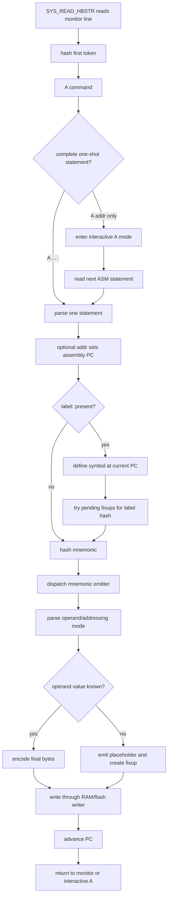
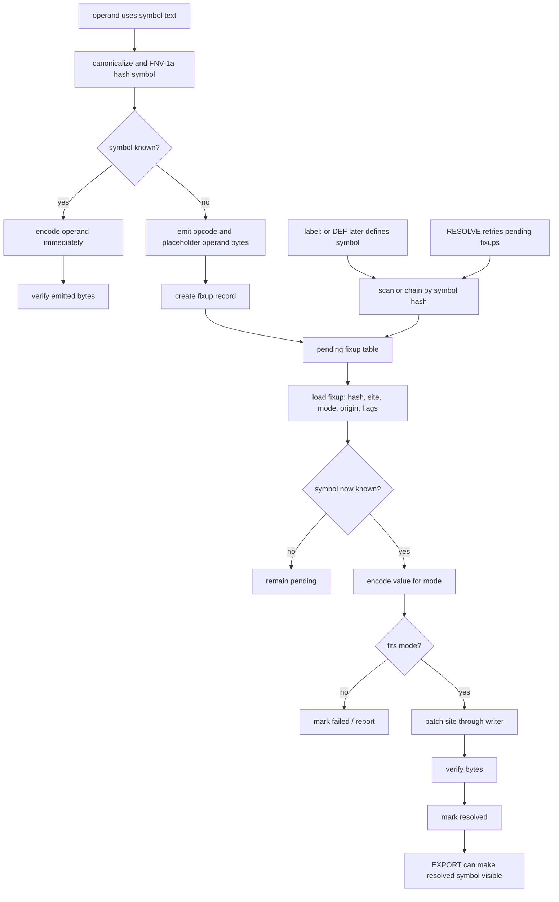
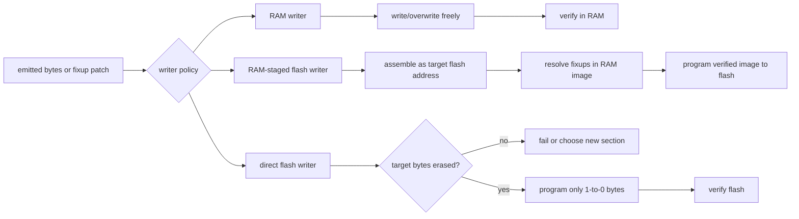
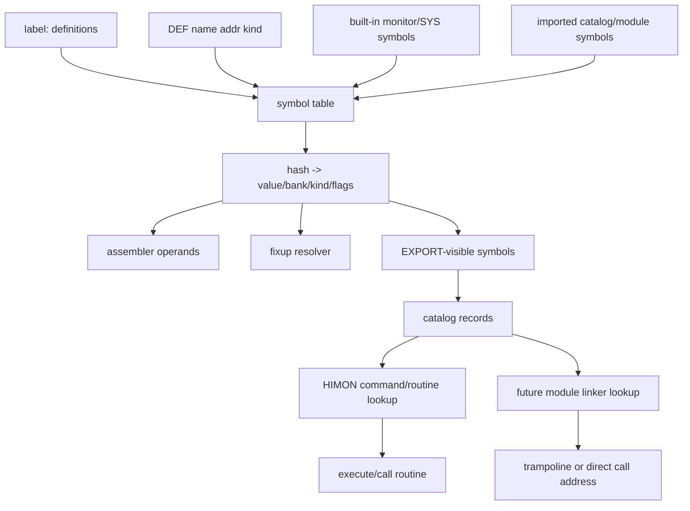
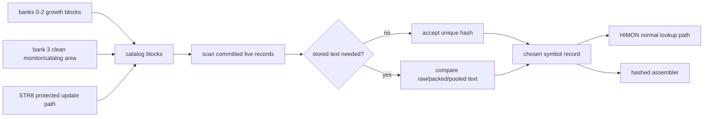

# Hashed Assembler Notes

This document captures a possible Himonia direction:

`A` grows from a one-line numeric assembler into a tiny onboard assembler that can resolve names through the same hash-first idea used by Himonia command dispatch.

The short version:

```text
text name -> hash -> symbol record -> value/address -> emitted operand bytes
```

The hash is not the address. The hash is the lookup key for a symbol record that contains the address, kind, bank, flags, and optionally the original text.

In THE terms:

```text
hash names and tokens
store exact addresses and values
optionally hash complete records for proof
```

## Why This Exists

The goal is to keep the system self-hosting-friendly:

- assemble and test small routines onboard
- add named commands without an external linker
- refer to routines by stable names instead of fixed addresses
- support forward labels without requiring a full object format
- stay close to Himonia's "routines of routines" shape

This is not meant to replace a full WDC toolchain immediately. It is a small monitor-local resolver wrapped around the existing `A` assembler path.

## Has This Been Done Before?

Parts of it have absolutely been done before.

- Forth systems use dictionaries/wordlists: named words are added and later found by the interpreter.
- Object formats such as ELF use symbol tables plus relocation records to connect symbolic references with definitions.
- ELF also has a symbol hash table for faster symbol lookup during dynamic linking.

The unusual Himonia part is the combination:

```text
small 65C02 monitor
+ FNV-1a command/name hashing
+ onboard one-line assembler
+ flash/RAM symbol records
+ fixup records small enough to manage by hand
```

So the idea is not magic. It is more like a tiny linker/assembler dictionary, shaped for a W65C02S monitor instead of a host OS.

## Core Model

A named thing is a symbol.

Examples:

```text
MYWORD
SYS_WRITE_CHAR
LOOP
BOARD_LEFT
```

A symbol record maps the name hash to a value:

```text
hash("MYWORD") -> value=$2480, kind=code, bank=3, flags=defined
```

Then this source:

```asm
JSR MYWORD
```

can be emitted as:

```text
20 80 24
```

because `JSR abs` needs the 16-bit value of `MYWORD`.

## Address Hashes Are Not Values

For ASM resolution, do not hash raw numeric addresses and then treat that hash
as the thing to emit or patch. Address hashes can only be proof/check metadata
for a larger record. The assembler still needs exact address/value fields,
patch sites, origins, banks, and kinds.

The exploratory what-if belongs in the scratchpad:
[IDEAS.md](../IDEAS.md).

## First Useful Command Shape

Keep the current `A` behavior, but move toward this one-line form:

```text
A [addr] [label:] MMM [operand] .
```

Meaning:

```text
A          assemble one statement
[addr]     optional explicit assembly address / PC set
[label:]   optional symbol definition; colon is required
MMM        mnemonic token
[operand]  optional operand token/expression
.          explicit end of one-line assembly statement
```

Examples:

```text
A 2000 START: LDX #FF .
A      LOOP:  JSR MYWORD .
A 2005        BRA LOOP .
```

Ordering rule:

```text
1. If `addr` is present, set assembly PC to `addr`.
2. If `label:` is present, bind the label to the current assembly PC.
3. Hash `MMM` and use that hash to find/process the byte emitter.
4. Parse `operand` into an addressing/fixup mode.
5. Emit bytes at the current assembly PC and advance PC.
```

This order keeps the command monitor-shaped: address comes immediately after
`A`, and the optional label names the address being assembled.

`MMM` is not just text decoration. It is the dispatch key for a small emitter
path:

```text
canonical mnemonic -> hash -> mnemonic/emitter family -> mode-specific opcode
```

The operand decides the mode:

```text
implied
accumulator
immediate
absolute
zero-page
relative
indirect
indexed
label-as-operand
```

The first version can still be strict:

- one instruction per command
- labels are optional
- all labels must end with `:`
- label names are reserved away from mnemonic names
- mnemonic names are reserved away from labels
- no expressions at first, or only simple `<name` and `>name`
- forward labels create fixups

## Label Syntax Path Considered

Two label forms were considered.

The terse form:

```text
A [addr] [label] [MMM [operand]] .
```

In that model, labels would not require `:`. The parser would find the first
mnemonic token and treat any non-address token before it as a label:

```text
A 1000 LOOP LDA #01 .
  addr=$1000, label=LOOP, mnemonic=LDA

A LOOP BRA DONE .
  label=LOOP, mnemonic=BRA, operand=DONE

A 4000 LABEL .
  addr=$4000, label=LABEL, emit nothing

A LABEL2 .
  label=LABEL2 at current PC, emit nothing
```

This can work if label names are forbidden from being mnemonic names. It is
compact and very monitor-like. It also makes label-only lines natural: a
label-only line simply binds the label to the current assembly PC.

The chosen form is stricter:

```text
A [addr] [label:] MMM [operand] .
```

Advantages of the chosen form:

- the colon visibly marks a definition instead of a use
- source listings are easier to scan
- parser state is simpler: address, optional `label:`, then mnemonic
- missing mnemonics fail more clearly
- labels can be printed, packed, and cataloged with less ambiguity
- the rule still works with forward-label fixups
- label-only statements can still exist later as `A [addr] LABEL: .`

Hard final rule:

```text
labels require `:`
labels may not be mnemonic names
mnemonics are reserved words
```

## Detailed ASM Working Hypothesis

This section describes the assembler as both a command path and a reusable
backend. It is intentionally written as a working thesis: small enough for
Himonia-F, but shaped so it can later support onboard-built routines.

### Thesis

The onboard assembler can be one-pass if unresolved names become explicit fixup
records:

```text
read line -> parse statement -> emit known bytes -> record unresolved bytes
later label/export appears -> lookup hash -> encode value -> patch site
```

Hard addresses remove relocation work. They do not remove forward-reference
work. A name that has not been defined yet still needs a remembered use site.

## ASM Process Trees And Linking Maps

These trees are the mental map for the assembler path. They are not a promise
that every box is its own routine in v1. They show the responsibilities that
need to exist somewhere.

### ASM Command Process Tree



### Fixup Lifecycle Tree



### Writer Split



### Symbol Linking Map



### Catalog Linking Map



### 1A1 Working Outline

```text
1. Input and dispatch
   A. SYS_READ_HBSTR reads one monitor line
      1. Hash first token and dispatch to `A`
      2. Pass remaining text to the assembler path
      3. Treat `.` as the end of a one-shot statement only when it is the whole token

2. `A` command modes
   A. Interactive mode
      1. `A [addr]` sets or keeps PC and drops into interactive assembly
      2. `.` exits or ends interactive input
   B. One-shot mode
      1. `A [addr] [label:] MMM [operand] .`
      2. Address sets PC before any label bind
      3. Label binds current PC before bytes are emitted

3. Symbol and label handling
   A. Label definition
      1. Canonicalize label text before `:`
      2. Reject mnemonic names as labels
      3. If label is local, qualify it with the active scope
      4. Hash label and bind hash to current PC
      5. Try pending fixups for that hash
   B. Local label scope
      1. A nonlocal label opens or changes the current local scope
      2. A local label is private to that scope/session
      3. Local fixups remain tied to the scope that created them
      4. Local labels are not exported to the public catalog
   C. Manual definition
      1. `DEF name addr kind` creates the same symbol record without emission
   D. Symbol viewing
      1. `SYM [name]` lists committed or visible symbols

4. Mnemonic and operand handling
   A. Mnemonic
      1. Canonicalize `MMM`
      2. Hash it
      3. Dispatch to byte emitter
   B. Operand
      1. Parse numeric, label, immediate, relative, indirect, indexed forms
      2. If known, encode immediately
      3. If unknown but encodable later, create a fixup

5. Fixup handling
   A. Generation
      1. Store symbol hash, patch site, mode, origin/next-PC basis, flags
      2. Optionally store links or aux pointers when scans become expensive
   B. Listing
      1. `FIX` shows unresolved work
   C. Resolution
      1. `RESOLVE` retries pending fixups
      2. Lookup hash, encode value, write byte(s), verify, mark resolved

6. Writers
   A. RAM writer
      1. Emit into RAM and patch freely
      2. Failed sessions can be dropped
   B. RAM-staged flash writer
      1. Assemble as if the target address is flash
      2. Keep bytes in RAM until fixups resolve
      3. Commit final verified image to flash
   C. Direct flash writer
      1. Require erased destinations
      2. Leave unresolved operand bytes erased
      3. Program final bytes once resolved

7. Commit and catalog
   A. Commit body bytes before export metadata
      1. Verify bytes
      2. Write catalog/export record
      3. Write final valid byte last
   B. `EXPORT name`
      1. Mark a resolved symbol visible to command/routine lookup
   C. `FORGET name`
      1. Mark a symbol/module dead for later STR8 condense
```

### Command Path

Normal monitor path:

```text
SYS_READ_HBSTR reads a high-bit-terminated command line.
Himon hashes the first command token.
The command dispatcher finds `A`.
The `A` command receives the rest of the line as an assembly statement.
```

The exact read routine name can change, but the contract is:

```text
input bytes are canonicalized/masked to 7-bit text for hashing
the line is stored in a monitor command buffer
`.` as a whole token terminates the assembly statement
```

The statement grammar is:

```text
A [addr] [label:] MMM [operand] .
```

The trailing `.` marks a complete one-shot assembly statement only when it is
the whole token. Dot-prefixed tokens such as `.LOOP` are still symbol tokens. If
`A` receives only an address, or no mnemonic after the optional address/label,
it enters the interactive side of `A` instead of assembling one statement:

```text
A 2000
  enter interactive assembly at $2000

A 2000 LOOP: LDA #01 .
  assemble exactly this statement
```

Inside interactive assembly, `.` can remain the exit/end sentinel. That gives
`A` two clear modes:

```text
A [addr]                  interactive assembler
A [addr] [label:] ... .   one-shot assembler
```

Parse order:

```text
1. Optional address sets the assembly PC.
2. Optional `label:` defines a symbol at the current PC.
3. `MMM` is hashed and resolved to a mnemonic/emitter family.
4. Operand text is parsed into an addressing/fixup mode.
5. Known bytes are emitted.
6. Unknown operand bytes become a fixup.
```

### Label Hashing

When a label definition is seen:

```text
A 2000 LOOP: LDA #01 .
```

Himon does this:

```text
canonicalize `LOOP`
reject it if it is a mnemonic name
hash the canonical label text
associate hash(LOOP) with current PC `$2000`
scan pending fixups for hash(LOOP)
```

The label text before `:` is the source identity. The hash is the lookup key.
The address is the value.

`DEF name addr kind` is the manual version of this operation. It creates a
symbol without requiring an assembly statement at that address.

### Backward Labels

A backward label is already known when it is used:

```text
A 2000 LOOP: LDA #01 .
A 2002       BRA LOOP .
```

At `BRA LOOP`, the symbol table already contains:

```text
hash(LOOP) -> $2000
```

So no fixup is needed. The branch emitter immediately calculates:

```text
offset = target - next_pc
```

and emits the final byte.

### Forward Labels

A forward label is not known when it is used:

```text
A 2000       BRA DONE .
A 2002       LDA #01 .
A 2004 DONE: RTS .
```

At `BRA DONE`, Himon does not know `DONE`. The assembler still knows the use
site and the encoding rule:

```text
symbol hash = hash(DONE)
site        = $2001
mode        = rel8
origin      = $2000 or next_pc basis
```

It emits the known opcode byte and leaves/remembers the unresolved operand byte.
When `DONE:` is later defined, resolving the fixup is just:

```text
lookup hash(DONE)
compute rel8 offset
write the offset byte at $2001
mark fixup resolved
```

Forward labels are therefore a v1 feature, not a later luxury.

### Emitter Path

The mnemonic token is a dispatcher input:

```text
canonical mnemonic -> hash -> mnemonic/emitter family
```

The operand decides the final mode:

```text
LDA #01       -> immediate
LDA COUNT     -> zero-page or absolute, depending on symbol/value policy
JSR ROUTINE   -> abs16 code target
BRA LOOP      -> rel8 branch target
LDA #<LABEL   -> low byte of symbol
LDA #>LABEL   -> high byte of symbol
```

An emitter should produce or imply:

```text
opcode byte(s)
instruction length
operand site
fixup mode if operand is symbolic
required symbol kind, if strict
```

### Fixup Generation

A fixup is created when:

```text
operand is symbolic
symbol hash is not currently resolvable
the instruction mode has a known way to encode the eventual value
```

Required fixup information:

```text
symbol_hash0..3
site_lo/site_hi             ; word: where operand bytes will be patched
mode
origin_lo/origin_hi         ; word: branch origin or next-PC basis
flags
```

Useful optional fields:

```text
bank or address-space id
required symbol kind
owner module/transaction id
name reference for collision proof
status byte: pending/resolved/dead
next_fix_lo/next_fix_hi     ; optional word link to another fixup record
aux_lo/aux_hi               ; optional word pointer to extra metadata
```

A link word is not a bad idea. It is the difference between "scan every fixup"
and "walk the fixup chain for this symbol/session." The cost is two bytes per
record and one more thing to preserve during flash condense. For v1, a linear
scan is simpler. A later catalog can add a `next_fix` word or an offset-based
link when the number of pending fixups makes scanning painful.

`mode` is the key. It tells the resolver how to encode the symbol value:

```text
abs16   write low byte, then high byte
rel8    write signed target - next_pc
zp8     write low byte, fail if value is not zero-page
lo8     write low byte
hi8     write high byte
```

### Fixup Use

Fixup resolution can happen in two ways:

```text
automatic: a label definition triggers a scan of pending fixups
manual:    FIX/RESOLVE commands list or retry pending fixups
```

`FIX` exists because a one-pass assembler needs visibility into unresolved
work. `RESOLVE` exists because a symbol can become known after the line that
needed it, either through a later label, `DEF`, or an imported catalog record.

Resolution flow:

```text
1. Load fixup record.
2. Lookup symbol by hash.
3. If multiple matching hashes exist, use stored name text if available.
4. Check kind/range/mode rules.
5. Encode the symbol value according to mode.
6. Patch the bytes at `site`.
7. Verify the patched bytes.
8. Mark fixup resolved.
```

If lookup fails, the fixup remains pending. If the value cannot be encoded, the
fixup fails with a clear reason.

### RAM Assembly

In RAM, the assembler can be forgiving:

```text
emit opcode bytes
write placeholder operand bytes, often $00
store fixup records in RAM
patch freely when labels resolve
discard failed sessions by dropping the RAM buffer/table
```

RAM assembly is best for experiments, testing, and any source with lots of
forward references. Failed assembly is cheap because RAM can be cleared or
rewritten.

### RAM Staging For ROM/Flash Targets

Even when the intended destination is flash/ROM, the assembler can temporarily
use RAM as the build image:

```text
target base = selected flash address
emit bytes into RAM staging buffer
record fixups against target addresses or staging offsets
resolve and verify in RAM
commit final bytes to flash with L F / STR8
```

This keeps flash clean while preserving hard target addresses. The emitted code
can still be assembled "as if" it lives at `$9A00` or `$F000`; only the physical
bytes wait in RAM until commit. This is the preferred path for any source that
may fail, duplicate code, or generate many fixups.

`EXPORT` belongs after this stage: the symbol should become globally visible
only after the staged image has resolved and committed cleanly.

### Flash Assembly

In flash, the assembler must be stricter because normal flash programming only
changes erased `1` bits to programmed `0` bits. The safe unresolved-byte pattern
is therefore erased `$FF`.

Direct flash flow:

```text
select an erased/writable flash section
set assembly PC to a hard flash address
write known opcode byte(s)
leave unresolved operand byte(s) erased as $FF
record a fixup pointing to those erased byte(s)
when resolved, program final operand byte(s)
verify every programmed byte
commit catalog/export record only after all required fixups resolve
```

Important flash rule:

```text
the fixup table, not the byte value, tells whether a site is unresolved
```

`$FF` can be a valid final operand byte, so unresolved state cannot be inferred
from memory contents alone.

If a flash fixup tries to patch a byte that is no longer erased or cannot be
programmed to the needed value, the module/session must fail or be marked dead.
STR8 can later condense live records and reclaim the clutter.

`FORGET` belongs here as an append-only dead-marker operation. It does not erase
flash immediately; it marks a symbol/module/range as not live so a later
STR8 condense can reclaim the space.

### RAM vs Flash Difference

The same logical fixup works in RAM and flash. The writer is different.

```text
RAM writer:
  store bytes directly
  overwrite placeholders freely
  failed sessions disappear when RAM is cleared

flash writer:
  require erased destination bytes
  program final bits once
  verify each byte
  commit valid records last
  failed sessions become dead/abandoned flash records
```

So the core resolver is shared:

```text
lookup hash -> encode value -> write bytes -> verify/return
```

Only the final write routine changes.

### Commit Hypothesis

For flash-resident assembly, code should not become catalog-visible until its
required fixups are resolved and verified.

Commit should be append-only:

```text
write body bytes
write fixup results
verify body
write catalog/export metadata
write final valid/commit byte last
```

This prevents Himon from discovering and calling a partially assembled routine
as if it were complete.

`SYM` is the user-facing view of committed symbols. If the image is only staged
or has unresolved required fixups, it should not appear as a normal callable
export.

## Record Byte Order

All catalog, symbol, command, and fixup records use 65C02-native little-endian
order unless a field explicitly says otherwise.

Rules:

```text
byte        one byte
word        low byte, then high byte
long        byte0, byte1, byte2, byte3 from least significant to most significant
hash0..3    FNV-1a stored as low byte through high byte
```

Examples:

```text
word value $1234      -> $34,$12
long value $89ABCDEF  -> $EF,$CD,$AB,$89
hash value $89ABCDEF  -> hash0=$EF hash1=$CD hash2=$AB hash3=$89
```

Human display may print long values high byte first:

```text
89ABCDEF
```

That does not change the stored record order.

## Symbol Record

Proposal, not a committed binary format:

```text
SYM record:
  sig0        ; "S"
  sig1        ; "Y"
  sig2        ; "M" with high bit, or another Himonia-style signature
  hash0
  hash1
  hash2
  hash3
  value_lo
  value_hi
  bank
  kind
  flags
  name_len    ; 0 means hash-only record
  name bytes  ; optional, uppercase canonical spelling
```

`value` depends on `kind`.

```text
kind=code       value is entry address
kind=data       value is data address
kind=const      value is literal value
kind=zp         value is zero-page address
kind=command    value is command entry address
kind=banked     value is address plus bank
```

Useful flags:

```text
defined         symbol has a value
import          symbol is expected elsewhere
export          symbol should be visible to other code
local           symbol is private to current assembly session
rom             value points into ROM/flash
ram             value points into RAM
volatile        may change after rebuild/rescan
name_present    original/canonical name bytes follow
```

For a tiny first pass, `hash/value/kind/flags` is enough. Name bytes can be added later to detect hash collisions and make `SYM` listings readable.

## Bank Placement Intent

The `bank` byte is not just future decoration. It is how the catalog can stop
bank 3 from becoming the dumping ground for every onboard-built routine, string,
and command record.

Working intent:

```text
bank 3:
  Himon body
  current boot/runtime bank
  core command catalog/index records
  stable trampolines and ABI-facing entries
  minimal text needed for recovery/debug

banks 0-2:
  routine packs
  data packs
  expanded command text
  onboard-built exports
  stale/replaceable append-only records
```

This is a placement policy, not a permanent physical map yet. The important
idea is that a symbol record can name:

```text
hash/name -> bank + address + kind + flags
```

instead of forcing the symbol body to live beside the core monitor. A banked
routine can therefore be found by hash, then reached through a small bank-select
trampoline or explicit banked-call routine.

Hard reasoning:

```text
bank 3 should stay boring and recoverable
banks 0-2 can absorb churn from self-hosted assembly
catalog records must preserve enough bank/address information to survive scans
STR8 condense can later move live records out of cluttered banks
```

If a record is globally exported, it should still be discoverable from the
master catalog even when the body lives in banks 0-2. The catalog entry is the
promise; the banked body is the storage location.

## Minimal Directive Goal

The v1 assembler directive surface should be IBM-ish and small:

```text
DC    define initialized data bytes
DS    reserve storage / advance assembly PC
EQU   define a constant or absolute symbol value
```

No dot-directive aliases in v1. Dot-leading syntax belongs to local labels:

```text
.NAME:   local label
.NAME    local symbol use
.        one-shot statement terminator
```

This keeps the parser small and avoids splitting dot-leading syntax between
locals and directives.

## DC Data Forms

`DC` is the primary data-emission directive:

```asm
NAME:   DC      HB'HELLO'
```

Meaning: emit a high-bit-terminated string, with bit 7 set on the final byte.
Examples:

```text
DC HB'ID'     -> $49,$C4
DC HB'FNV'    -> $46,$4E,$D6
DC HB''       -> $80
```

Data forms likely needed:

```text
DC X'FF'       hex byte stream
DC B'10101010' binary byte stream
DC HB'HELLO'   high-bit-terminated string
DC C'HELLO'    raw character bytes
DC Z'HELLO'    C-string / ASCIIZ, final byte $00
DC P'HELLO'    Pascal/count-prefixed string
DC W'2000'     little-endian word
```

Minimal companion directives:

```text
DS n            reserve n bytes
NAME EQU value  define a constant or absolute symbol
```

Do not define `.BYTE`, `.WORD`, `.HBSTR`, or other dot aliases in v1. If a later
assembler grows compatibility aliases, they should be ordinary mnemonic-like
tokens such as `DB`, `DW`, or `FCC`, not dot-leading tokens.

### Future Directive Alias Records

THE can model an alias as one hash record resolving to another typed record:

```text
hash("DB") -> alias/directive record -> hash("DC") -> DC handler
```

That would let a future assembler accept:

```asm
DB $FF
```

as compatibility sugar for:

```asm
DC X'FF'
```

The alias must be typed. It is not an arbitrary hash chain:

```text
source hash    DB
record kind    directive_alias
target hash    DC
adapter        DB operand parser -> DC X form
```

The adapter matters because `DB $FF` and `DC X'FF'` are not the same text; they
are equivalent operations after operand parsing. Alias resolution should have a
small recursion limit and should fail on cycles:

```text
DB -> DC          ok
DB -> BYTE -> DC  ok if depth limit allows
DB -> BYTE -> DB  fail cycle
```

Keep this out of v1 unless compatibility pressure appears. The v1 path is:

```text
DC, DS, EQU only
```

HBSTR remains a first-class data form because it is part of Himon's command,
help, and hash vocabulary. Hashing routines must mask bit 7 from the terminal
byte before updating the FNV value.

A future command/symbol record may combine immutable ROM text with mutable flash
metadata:

```asm
CMD_ID:
        DC      C'F'        ; format v1 FNV-1a hash record
        DC      W'...'      ; low word of CMD_ID_HASH, exact form TBD
        DC      W'...'      ; high word of CMD_ID_HASH, exact form TBD
        DC      X'00'       ; KIND
        DC      X'FF'       ; command text length, latched after lookup
        DC      W'FFFF'     ; flash address of copied command text
ID:
```

In that model the hash is enough to find the command, but the first successful
lookup can append the actual command token text into a free flash text area and
latch the length/address placeholders from `$FF/$FFFF` to concrete values. That
gives readable command names without paying the text cost for every ROM record
up front.

Important constraint: these fields are flash latches, not normal variables.
They can be programmed from erased `$FF` bytes to concrete values, but changing
them later requires erasing the containing flash sector or writing a newer
append-only record.

### FNV Signature Savings

Since FNV-1a is the only runtime/catalog hash, records do not need to store
`FNV` as text. The signature byte can be the record-format version:

```text
'F'  format v1
'N'  format v2
'V'  format v3
```

All three still use FNV-1a for `hash0..3`; the letter selects the record layout,
not the hash algorithm.

Savings:

```text
"FNV" per record      = 3 bytes
'F' per record        = 1 byte
saved                 = 2 bytes per record

100 records           = 200 bytes saved
256 records           = 512 bytes saved
1000 records          = 2000 bytes saved
```

If a record would otherwise store both a signature and a version byte, folding
the version into the signature saves one more byte per record.

The cost is scan confidence. A 3-byte magic signature is harder to mistake for
random code/data than a single byte. The compact form is best when records live
inside known catalog regions or catalog blocks with their own header/checks.

## Command Text Compression Goal

Adding real command text to catalog records is useful, but it can make ROM grow
fast. Names such as `SYS_WRITE_CSTR` are not unusual, and a self-hosting system
could eventually have hundreds or thousands of routine names.

Compression should therefore be available, but conservative.

First useful encodings:

```text
raw_hb       HBSTR bytes, high bit set on final byte
raw_z        ASCIIZ/C-string bytes, final $00
pack_lo_5    5-bit packed restricted alphabet
dict_small   optional tiny dictionary for common tokens later
```

`pack_lo_5` is attractive because it is small and deterministic. It stores one
character in 5 bits, so the packed payload length is:

```text
packed_payload = ceil(char_count * 5 / 8)
```

Examples before header/flag overhead:

```text
3 chars   raw 3 bytes    packed 2 bytes
6 chars   raw 6 bytes    packed 4 bytes
8 chars   raw 8 bytes    packed 5 bytes
12 chars  raw 12 bytes   packed 8 bytes
```

But compression is not automatically a win. Every compressed string needs at
least some way to know the encoding and length, either from a record flag, a
length byte, or the surrounding record format. For small strings, that overhead
can erase the savings.

Hard rule:

```text
only store compressed text if compressed_size < raw_size
otherwise store raw text
```

In other words, compression should be allowed to fail. Failure is not an error;
it just means "use the raw representation for this name."

The decoder should be W65C02-small:

```text
no heap
no large tables
single forward pass
stream output to compare/print routines when possible
scratch in zero page or a tiny RAM buffer
```

For lookup, the hash remains the fast path. Compressed text is for proof and
human use:

```text
hash lookup -> candidate records
if needed, decompress/compare text to prove identity
if listing, decompress/print text
```

A later string table can add a small index to avoid scanning from the beginning
of a packed text area. That index should be optional. The first design can scan
slowly; correctness matters more than speed while the catalog is still small.

## Fixup Record

A fixup says:

"When this symbol becomes known, patch bytes at this site using this encoding rule."

Hard mental model:

```text
fixup = hash + site + mode + optional origin
resolve = lookup hash, encode value, write byte(s), return status
```

So a fixup is still a routine-shaped operation. It is not a second assembler
living inside the assembler.

Proposal:

```text
FIX record:
  sig0
  sig1
  sig2
  site_lo
  site_hi
  hash0
  hash1
  hash2
  hash3
  mode
  origin_lo
  origin_hi
  flags
```

`site` is where to write the patched operand byte(s).

`origin` is the PC used for relative branch math. For most absolute fixups it can be zero or copied from the instruction start.

The important byte is `mode`.

```text
mode=abs16      store low byte at site, high byte at site+1
mode=zp8        store low byte only, fail if value > $00FF
mode=imm8       store low byte only
mode=lo8        store low byte of symbol
mode=hi8        store high byte of symbol
mode=rel8       store signed branch offset
mode=zp_rel8    store zero-page operand plus signed branch offset
```

Fixups are not "routine or data". They are encoding rules for a use site.

Examples:

```text
JSR FOO
  hash=FOO, site=operand byte, mode=abs16
  resolve FOO=$2450 -> write $50,$24

BRA DONE
  hash=DONE, site=offset byte, mode=rel8, origin=branch instruction
  resolve DONE=$2008 -> write target - next_pc
```

The same symbol can need different fixups:

```asm
JSR MYWORD      ; abs16
BRA MYWORD      ; rel8
LDA MYBYTE      ; zp8 or abs16
LDA #<MYWORD    ; lo8
LDA #>MYWORD    ; hi8
```

## Assembly Flow

For each instruction line:

```text
1. Parse optional address after A.
2. If address exists, set assembly PC.
3. Parse optional `label:` and define it at current PC.
4. Parse mnemonic token.
5. Hash canonical mnemonic.
6. Lookup mnemonic/emitter family.
7. Parse operand and determine addressing/fixup mode.
8. If operand is numeric, emit encoded bytes.
9. If operand is text, hash canonical text and search symbols/catalog.
10. If found, emit encoded operand bytes.
11. If not found, emit placeholder operand bytes and create a fixup.
12. If the use site cannot safely be represented as a fixup, fail clearly.
13. Advance assembly PC.
```

Hard direction:

```text
v1 supports forward labels with fixup records.
No forward-reference restriction.
```

Hard-address flash placement removes relocation work, but it does not by itself
solve forward labels. A future label is still unknown until it is defined.

## Forward Reference Example

Input:

```asm
A 2000 JSR INIT .
A 2003 BRA DONE .
A 2005 INIT: LDA #FF .
A 2007 RTS .
A 2008 DONE: BRK .
```

During assembly:

```text
$2000 JSR INIT
  INIT unknown
  emit: 20 00 00
  fixup: site=$2001, hash=INIT, mode=abs16

$2003 BRA DONE
  DONE unknown
  emit: 80 00
  fixup: site=$2004, hash=DONE, mode=rel8, origin=$2003

$2005 INIT:
  define symbol INIT=$2005
  patch abs16 at $2001 -> 05 20

$2008 DONE:
  define symbol DONE=$2008
  patch rel8 at $2004
```

For the branch:

```text
instruction start = $2003
next PC           = $2005
target            = $2008
offset            = $2008 - $2005 = $03
```

So:

```text
BRA DONE -> 80 03
```

## Label Definitions

Minimal syntax choices:

```text
A 2000 LOOP: LDA #01 .
A 2002       STA COUNT .
A 2005 BRA LOOP .
```

When a label appears before the mnemonic, after any address:

```text
define hash("LOOP") = current assembly PC
```

Hard naming rule:

```text
labels may not canonicalize to any known mnemonic name
mnemonics are reserved words, not legal labels
```

This is not required because of parsing ambiguity; the colon already tells the
parser what is a label. It is required as a language rule so source, listings,
catalog records, and future compressed symbol tables do not allow confusing
names such as `LDA:` or `JSR:`.

If the symbol already exists:

- same value: harmless redefinition, maybe ok
- different value and not volatile: error
- volatile/session-local: update, then rerun dependent fixups

Forward labels are allowed through fixups. A forward reference leaves
placeholder bytes at the use site and records enough information to resolve it
later:

```text
symbol hash
site address
encoding mode
origin / next-PC basis when needed
```

## Local Labels Review

Local labels are useful for short branches inside one routine or one assembly
session without polluting the public symbol/catalog space:

```asm
A 2000 INIT:  LDX #00 .
A      .LOOP: INX .
A             CPX #10 .
A             BNE .LOOP .
A             RTS .

A 2100 DRAW:  LDX #00 .
A      .LOOP: JSR PLOT .
A             INX .
A             BNE .LOOP .
```

Both routines can use `.LOOP` because the local name is scoped under the current
nonlocal label:

```text
INIT/.LOOP -> $2002
DRAW/.LOOP -> $2102
```

Chosen syntax:

```text
.NAME:   define a local label
.NAME    use a local label operand
.        end the current one-shot statement
```

The parser rule is exact:

```text
"." alone is the statement terminator
".NAME" is a local symbol token
```

The `NAME` part follows normal label rules. For example, `.LDA:` should still
fail because `LDA` is a mnemonic.

Reserved dot-directive names are not legal local labels. If `.HBSTR`, `.CSTR`,
`.ASCIIZ`, `.PSTR`, `.BYTE`, or `.WORD` become directive aliases, those spellings
belong to directives, not locals.

This choice fits the project direction better than the earlier candidates:

```text
?NAME    readable and unambiguous, but shifted and less IBM-like
/NAME    one key, but visually wrong and reserves slash before expressions grow
@NAME    common in some assemblers, but harder to type
1f/1b    compact, but introduces directional lookup
```

Dot locals also echo IBM big-iron practice without copying it exactly. HLASM
uses dot-leading sequence symbols for assembly-control flow, while ordinary
symbols and macro variables live in other namespaces. R-YORS can use the same
mental split:

```text
NAME     ordinary/public or session symbol
.NAME    assembler-local symbol
&NAME    possible future macro/SET-style variable
```

Lookup rule:

```text
unprefixed NAME -> global/session/import/export symbol lookup
.NAME           -> local lookup in the active local scope only
```

There should be no silent fallback from local-prefixed `NAME` to unprefixed
`NAME`, or the other way around. The prefix is a scoping command, not
decoration.

Scope rule:

```text
a nonlocal label defines/changes the active local scope
local definitions and local fixups are qualified by that scope
```

For v1 strict mode, a local label without an active nonlocal label should fail
clearly. A scratch/RAM interactive mode may choose a session-local anonymous
scope, but that scope must not be exportable.

Implementation model:

```text
canonical local text      = .LOOP
active scope text         = INIT
lookup identity           = INIT/.LOOP
hash input                = canonical qualified identity
symbol flags              = defined + local
export/catalog visibility = no
```

A compact later record can avoid storing the joined text by carrying both a
scope hash and a local hash:

```text
scope_hash0..3
local_hash0..3
value_lo
value_hi
bank
kind
flags=local
```

That costs four extra bytes compared with one qualified hash, so the first
implementation can simply hash the qualified canonical text and optionally keep
name proof text in RAM.

Forward local labels work the same as forward global labels, except the fixup
stores the scoped identity:

```asm
A 3000 MAIN:  BRA .DONE .
A             LDA #01 .
A      .DONE: RTS .
```

At the branch:

```text
hash(MAIN/.DONE)
site=$3001
mode=rel8
origin=$3000
```

When `.DONE:` appears, the definition wakes only fixups for `MAIN/.DONE`.
Starting another nonlocal label before `.DONE:` does not retarget the old fixup;
it remains tied to `MAIN`.

Local labels should not be legal export names:

```text
EXPORT .LOOP     fail
FORGET .LOOP     only affects current local scope/session, if allowed at all
SYM .LOOP        show current-scope local, not public catalog entry
```

## Name Canonicalization

Use the same rule every time before hashing:

```text
trim spaces
uppercase ASCII
stop at whitespace, comma, colon, right paren, or statement-terminator dot
keep a leading dot when the token is a local label
```

Examples:

```text
myword  -> MYWORD
MyWord  -> MYWORD
MYWORD: -> MYWORD
.loop   -> .LOOP
INIT/.loop -> INIT/.LOOP
```

This keeps lookup stable and small.

## Collision Handling

Hash-only is tempting and probably fine for a small board, but a robust record should optionally carry text.

Lookup can be:

```text
hash matches?
  if name bytes exist:
    compare canonical text
  else:
    accept hash
```

If two hash-only records collide, the system cannot know which was intended. That is why name bytes are worth having for user-created symbols, even if built-in command records stay compact.

## Relationship To Himonia Command Dispatch

The command table already makes this idea feel natural:

```text
user token -> FNV-1a hash -> record scan -> entry
```

The assembler symbol table is the same pattern with a richer payload:

```text
operand token -> FNV-1a hash -> symbol scan -> value/kind/bank/flags
```

A future command record and a future symbol record could share scanning primitives:

```text
scan next record
check signature
compare hash
return payload pointer
```

That keeps the "routines of routines" idea intact.

## Relationship To Flash

The assembler can start in RAM, direct flash, or a mixed path. The safer first
design is still RAM-staged, but direct flash is possible if the rules are hard.

RAM-first path:

```text
symbol table in user RAM
fixup table in user RAM
assembled bytes in user RAM
```

Flash path later:

```text
assemble/test in RAM
find free flash space
flash code bytes
flash symbol/export record
rescan table or lookup live
```

Direct flash path:

```text
select erased/writable flash section
set assembly PC to hard flash address
write final opcode bytes immediately
leave unresolved operand bytes erased as $FF
record fixups for unresolved operands
resolve fixups by programming erased operand byte(s)
verify each written byte
write/export catalog records append-only
mark failures/abandoned records dead later
```

Reasoning:

```text
hard flash addresses remove relocation
hard flash addresses do not remove forward-reference uncertainty
failed direct-to-flash assembly can clutter flash
flash clutter is acceptable only if STR8 can later condense/pack live data
```

The later STR8 condense model is:

```text
copy live ROM/catalog sections to RAM
erase stale flash section(s)
rewrite compacted live records
repeat as needed
```

No pack system is required for the first version, but the record format should
not prevent later condense/compaction.

## Failure Cases

The assembler should fail clearly when:

- symbol is unknown and fixup space is full
- branch target is out of `rel8` range
- `zp8` fixup resolves above `$00FF`
- symbol kind is incompatible with instruction mode
- hash collision cannot be disambiguated
- target write address is protected

This is where `kind` becomes valuable. `JSR DATA_TABLE` should fail if `DATA_TABLE` is known as data and the assembler is in a strict mode.

## Tiny Command Set

Possible future monitor commands:

```text
A [addr] [label:] MMM [operand] .
                            assemble one statement
DEF name addr kind         define a symbol manually
SYM [name]                 list symbol(s)
FIX                        list unresolved fixups
RESOLVE                    attempt to apply all pending fixups
FORGET name                remove or mark a symbol dead
EXPORT name                mark symbol visible for command/routine lookup
```

The smallest useful implementation only needs:

```text
A [addr] [label:] MMM [operand] .
SYM
```

Since forward labels are part of v1, `FIX` and `RESOLVE` are also v1 design
surface, even if the first UI hides them behind automatic resolve attempts.

## Source Precedents

These are not the same as this design, but they prove the ingredients are old, useful ideas:

- ELF symbol tables hold information needed to locate and relocate symbolic definitions and references: https://gabi.xinuos.com/v42/elf/05-symtab.html
- ELF relocation records describe how to patch code/data locations from symbolic references: https://gabi.xinuos.com/elf/06-reloc.html
- ELF dynamic linking includes a symbol hash table for symbol table access: https://gabi.xinuos.com/elf/08-dynamic.html
- Forth wordlists are named-word dictionaries searched by the text interpreter: https://gforth.org/manual/Word-Lists.html
- Open Firmware/FCode shows the embedded-firmware tradition of compact Forth-like extensibility: https://www.openfirmware.info/Forth_FCode.html
