# HIMON Edge Dump

Generated-style edge dump for `HIMON/himon.asm`.

For the readable subsystem/capability view, see
[HIMON_MAP.md](HIMON_MAP.md).

Scope: direct `JSR target` and `JMP target` edges only. Relative branches, fallthrough, data labels, indirect calls, and computed jumps are not included. Source is the nearest preceding global label.

## Summary

```text
source file:     HIMON/himon.asm
global labels:   676
raw call sites:  647
unique edges:    563
external targets:18
```

## Mermaid Direct-Edge Atlas

Every unique direct edge is present in this atlas. Source routines are grouped by command/subsystem stem, then split into independent Mermaid panels of at most 12 edges. The text sections below remain the complete audit-oriented evidence.

### Family Overview (part 1 of 4)

```mermaid
flowchart TD
    EDGE_ATLAS_ROOT_0["HIMON Edge Dump<br/>563 unique edges"] --> EDGE_FAMILY_0_0["CMD / AP<br/>26 edges / 3 panels"]
    EDGE_ATLAS_ROOT_0["HIMON Edge Dump<br/>563 unique edges"] --> EDGE_FAMILY_0_1["CMD / APS<br/>8 edges / 1 panel"]
    EDGE_ATLAS_ROOT_0["HIMON Edge Dump<br/>563 unique edges"] --> EDGE_FAMILY_0_2["CMD / D<br/>10 edges / 1 panel"]
    EDGE_ATLAS_ROOT_0["HIMON Edge Dump<br/>563 unique edges"] --> EDGE_FAMILY_0_3["CMD / DISPATCH<br/>14 edges / 2 panels"]
    EDGE_ATLAS_ROOT_0["HIMON Edge Dump<br/>563 unique edges"] --> EDGE_FAMILY_0_4["CMD / EXEC<br/>7 edges / 1 panel"]
    EDGE_ATLAS_ROOT_0["HIMON Edge Dump<br/>563 unique edges"] --> EDGE_FAMILY_0_5["CMD / G<br/>7 edges / 1 panel"]
    EDGE_ATLAS_ROOT_0["HIMON Edge Dump<br/>563 unique edges"] --> EDGE_FAMILY_0_6["CMD / HASH<br/>79 edges / 7 panels"]
    EDGE_ATLAS_ROOT_0["HIMON Edge Dump<br/>563 unique edges"] --> EDGE_FAMILY_0_7["CMD / HELP<br/>2 edges / 1 panel"]
    EDGE_ATLAS_ROOT_0["HIMON Edge Dump<br/>563 unique edges"] --> EDGE_FAMILY_0_8["CMD / L<br/>19 edges / 2 panels"]
    EDGE_ATLAS_ROOT_0["HIMON Edge Dump<br/>563 unique edges"] --> EDGE_FAMILY_0_9["CMD / M<br/>7 edges / 1 panel"]
    EDGE_ATLAS_ROOT_0["HIMON Edge Dump<br/>563 unique edges"] --> EDGE_FAMILY_0_10["CMD / PARSE<br/>16 edges / 2 panels"]
    EDGE_ATLAS_ROOT_0["HIMON Edge Dump<br/>563 unique edges"] --> EDGE_FAMILY_0_11["CMD / R<br/>4 edges / 1 panel"]
```

### Family Overview (part 2 of 4)

```mermaid
flowchart TD
    EDGE_ATLAS_ROOT_1["HIMON Edge Dump<br/>563 unique edges"] --> EDGE_FAMILY_1_0["CMD / REQUIRE<br/>2 edges / 1 panel"]
    EDGE_ATLAS_ROOT_1["HIMON Edge Dump<br/>563 unique edges"] --> EDGE_FAMILY_1_1["CMD / SKIP<br/>4 edges / 1 panel"]
    EDGE_ATLAS_ROOT_1["HIMON Edge Dump<br/>563 unique edges"] --> EDGE_FAMILY_1_2["CMD / UNKNOWN<br/>3 edges / 1 panel"]
    EDGE_ATLAS_ROOT_1["HIMON Edge Dump<br/>563 unique edges"] --> EDGE_FAMILY_1_3["CMD / USAGE<br/>16 edges / 2 panels"]
    EDGE_ATLAS_ROOT_1["HIMON Edge Dump<br/>563 unique edges"] --> EDGE_FAMILY_1_4["CMD / X<br/>7 edges / 1 panel"]
    EDGE_ATLAS_ROOT_1["HIMON Edge Dump<br/>563 unique edges"] --> EDGE_FAMILY_1_5["ENTRY / unprefixed<br/>1 edge / 1 panel"]
    EDGE_ATLAS_ROOT_1["HIMON Edge Dump<br/>563 unique edges"] --> EDGE_FAMILY_1_6["FNV1A<br/>8 edges / 1 panel"]
    EDGE_ATLAS_ROOT_1["HIMON Edge Dump<br/>563 unique edges"] --> EDGE_FAMILY_1_7["HIM / AP<br/>124 edges / 11 panels"]
    EDGE_ATLAS_ROOT_1["HIMON Edge Dump<br/>563 unique edges"] --> EDGE_FAMILY_1_8["HIM / APS<br/>10 edges / 1 panel"]
    EDGE_ATLAS_ROOT_1["HIMON Edge Dump<br/>563 unique edges"] --> EDGE_FAMILY_1_9["HIM / CHECK<br/>1 edge / 1 panel"]
    EDGE_ATLAS_ROOT_1["HIMON Edge Dump<br/>563 unique edges"] --> EDGE_FAMILY_1_10["HIM / FLASH<br/>3 edges / 1 panel"]
    EDGE_ATLAS_ROOT_1["HIMON Edge Dump<br/>563 unique edges"] --> EDGE_FAMILY_1_11["HIM / PACK40<br/>3 edges / 1 panel"]
```

### Family Overview (part 3 of 4)

```mermaid
flowchart TD
    EDGE_ATLAS_ROOT_2["HIMON Edge Dump<br/>563 unique edges"] --> EDGE_FAMILY_2_0["HIM / READ<br/>8 edges / 1 panel"]
    EDGE_ATLAS_ROOT_2["HIMON Edge Dump<br/>563 unique edges"] --> EDGE_FAMILY_2_1["HIM / WRITE<br/>2 edges / 1 panel"]
    EDGE_ATLAS_ROOT_2["HIMON Edge Dump<br/>563 unique edges"] --> EDGE_FAMILY_2_2["HIMON<br/>4 edges / 1 panel"]
    EDGE_ATLAS_ROOT_2["HIMON Edge Dump<br/>563 unique edges"] --> EDGE_FAMILY_2_3["L<br/>34 edges / 3 panels"]
    EDGE_ATLAS_ROOT_2["HIMON Edge Dump<br/>563 unique edges"] --> EDGE_FAMILY_2_4["MAIN<br/>6 edges / 1 panel"]
    EDGE_ATLAS_ROOT_2["HIMON Edge Dump<br/>563 unique edges"] --> EDGE_FAMILY_2_5["MATH<br/>2 edges / 1 panel"]
    EDGE_ATLAS_ROOT_2["HIMON Edge Dump<br/>563 unique edges"] --> EDGE_FAMILY_2_6["MON / AFTER<br/>1 edge / 1 panel"]
    EDGE_ATLAS_ROOT_2["HIMON Edge Dump<br/>563 unique edges"] --> EDGE_FAMILY_2_7["MON / BRK<br/>3 edges / 1 panel"]
    EDGE_ATLAS_ROOT_2["HIMON Edge Dump<br/>563 unique edges"] --> EDGE_FAMILY_2_8["MON / CLEAR<br/>1 edge / 1 panel"]
    EDGE_ATLAS_ROOT_2["HIMON Edge Dump<br/>563 unique edges"] --> EDGE_FAMILY_2_9["MON / COLD<br/>1 edge / 1 panel"]
    EDGE_ATLAS_ROOT_2["HIMON Edge Dump<br/>563 unique edges"] --> EDGE_FAMILY_2_10["MON / CTX<br/>27 edges / 3 panels"]
    EDGE_ATLAS_ROOT_2["HIMON Edge Dump<br/>563 unique edges"] --> EDGE_FAMILY_2_11["MON / INIT<br/>7 edges / 1 panel"]
```

### Family Overview (part 4 of 4)

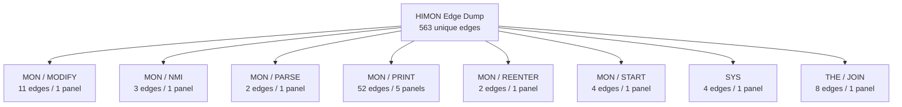

### Family Detail

#### CMD / AP

Panel 1 of 3: `CMD_AP` through `CMD_AP_BANKED`.


Panel 2 of 3: `CMD_AP_BANKED` through `CMD_AP_LOAD_REQUEST`.


Panel 3 of 3: `CMD_AP_SRC_OK` through `CMD_AP_SRC_OK`.

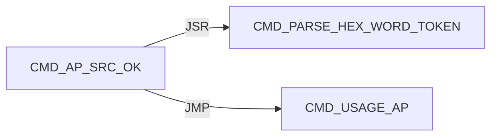

#### CMD / APS

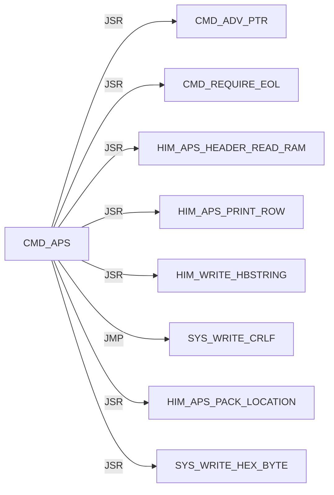

#### CMD / D

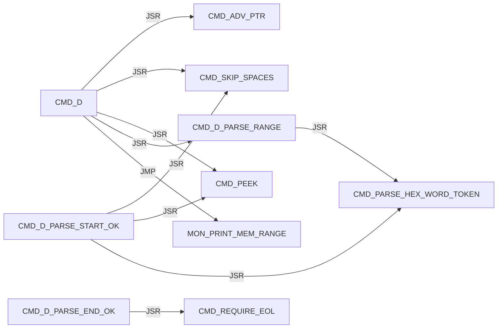

#### CMD / DISPATCH

Panel 1 of 2: `CMD_DISPATCH_DONE` through `CMD_DISPATCH_SCAN_MISS`.

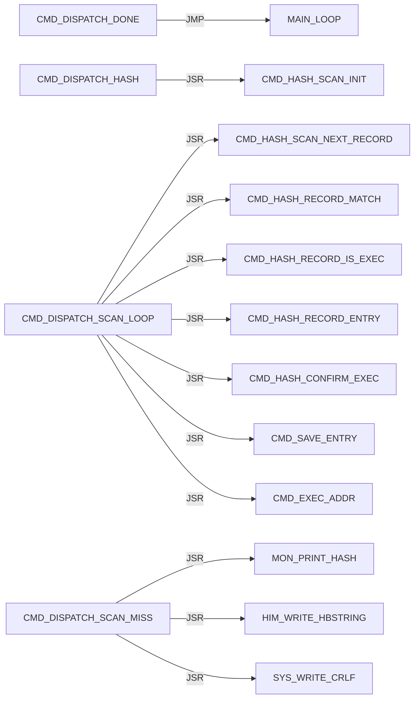

Panel 2 of 2: `CMD_DISPATCH_SCAN_MISS` through `CMD_DISPATCH_SCAN_NEXT`.

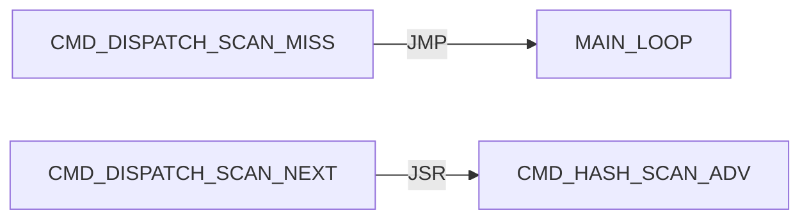

#### CMD / EXEC

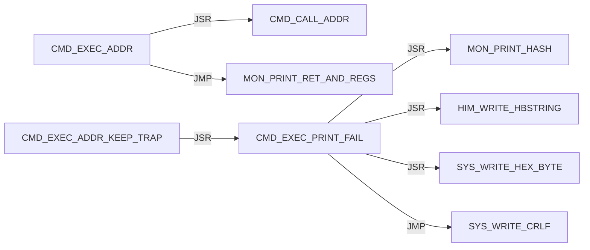

#### CMD / G

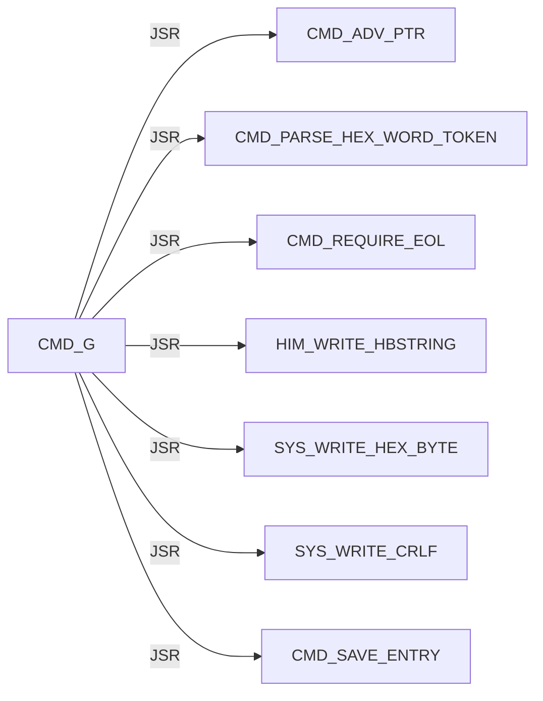

#### CMD / HASH

Panel 1 of 7: `CMD_HASH_CONFIRM_ADDR` through `CMD_HASH_FIND_LOOP`.

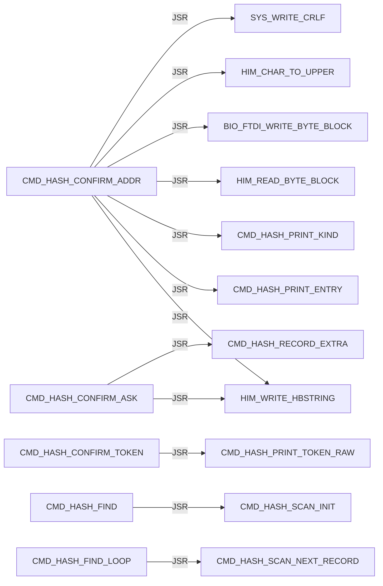

Panel 2 of 7: `CMD_HASH_FIND_LOOP` through `CMD_HASH_INFO_FOUND`.

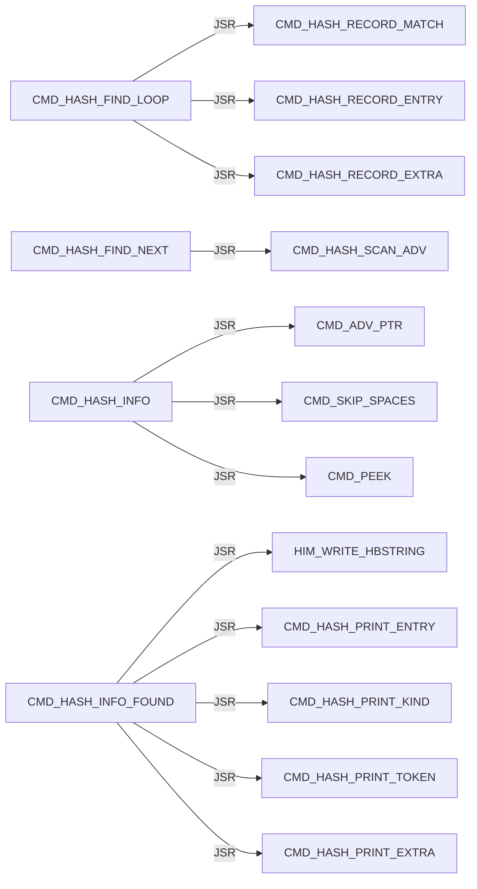

Panel 3 of 7: `CMD_HASH_INFO_FOUND` through `CMD_HASH_INFO_LOOKUP`.

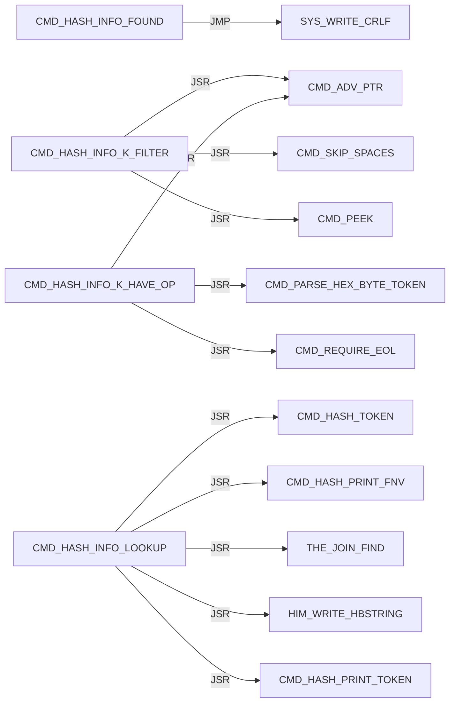

Panel 4 of 7: `CMD_HASH_INFO_LOOKUP` through `CMD_HASH_PRINT_EXTRA`.

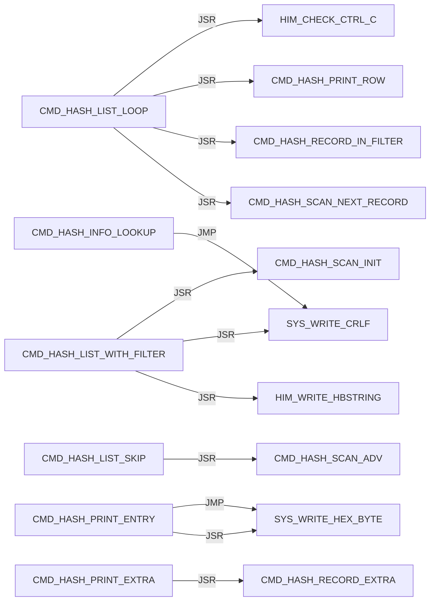

Panel 5 of 7: `CMD_HASH_PRINT_EXTRA` through `CMD_HASH_PRINT_ROW`.

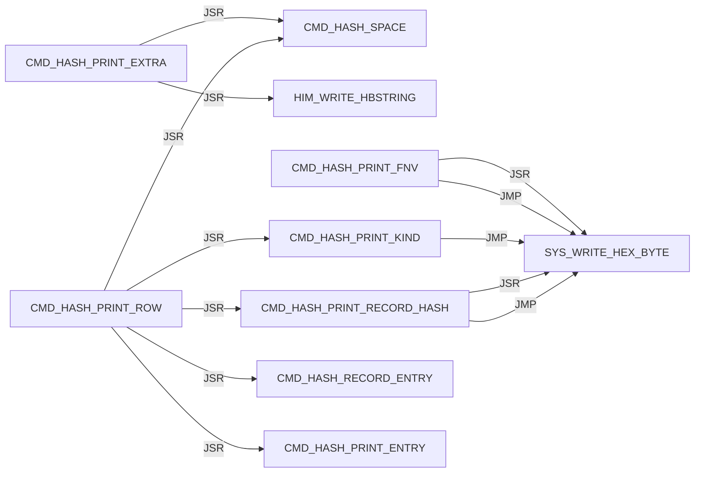

Panel 6 of 7: `CMD_HASH_PRINT_ROW` through `CMD_HASH_TOKEN`.

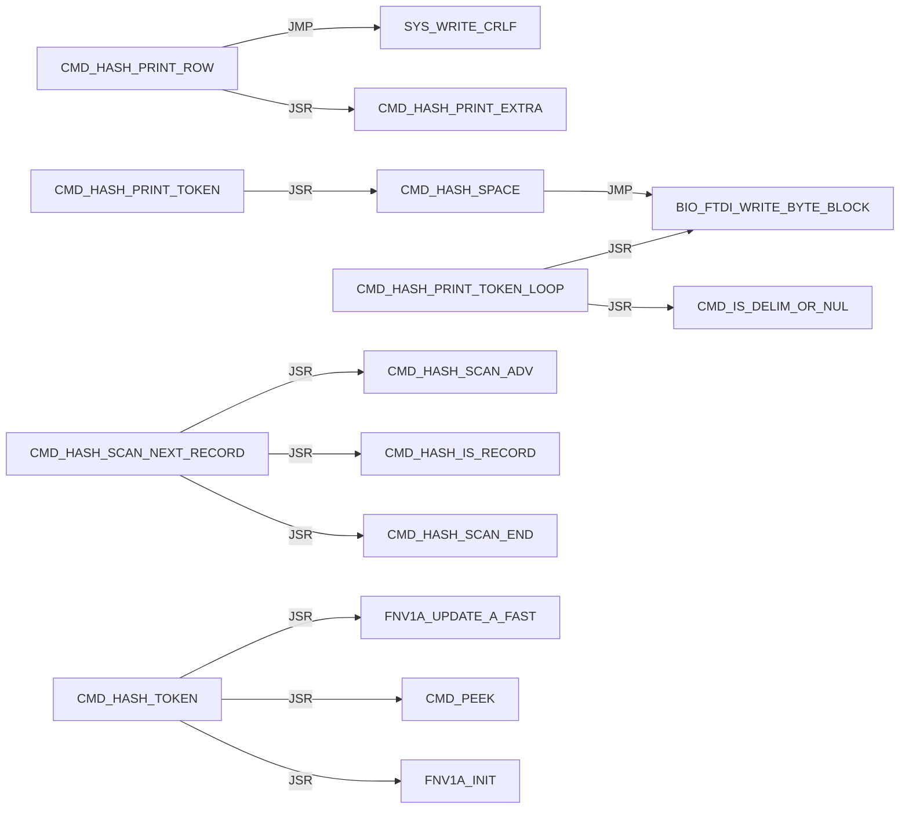

Panel 7 of 7: `CMD_HASH_TOKEN_DONE` through `CMD_HASH_USAGE`.

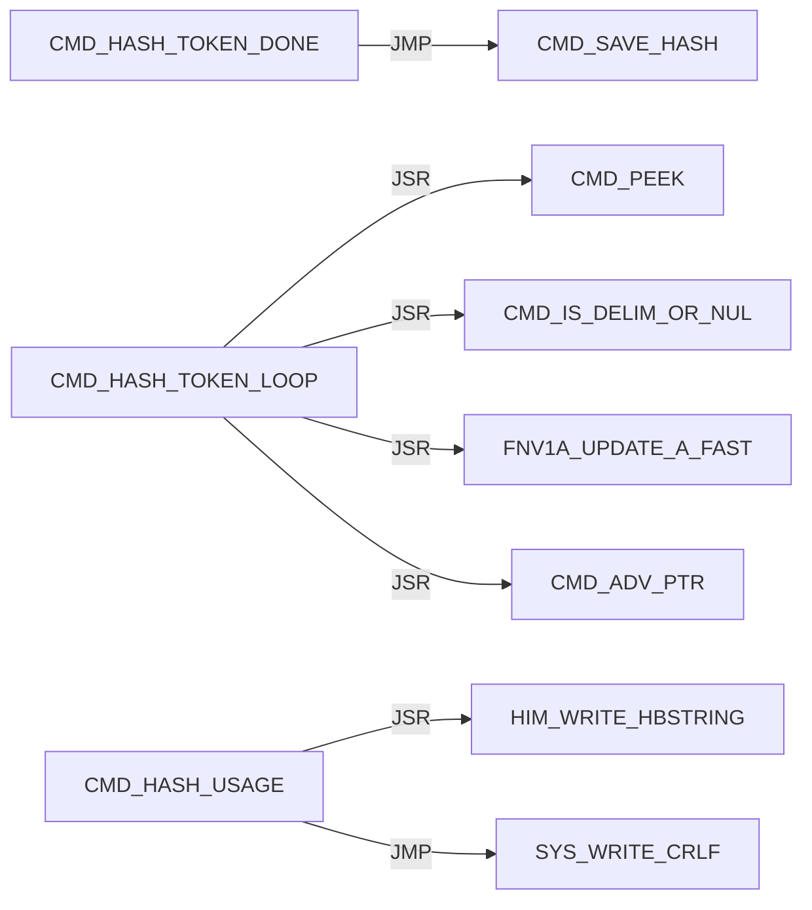

#### CMD / HELP

```mermaid
flowchart LR
    N0["CMD_HELP"] -->|JSR| N1["HIM_WRITE_HBSTRING"]
    N0["CMD_HELP"] -->|JMP| N2["SYS_WRITE_CRLF"]
```

#### CMD / L

Panel 1 of 2: `CMD_L` through `CMD_L_PARSE_OK`.

```mermaid
flowchart LR
    N0["CMD_L"] -->|JSR| N1["CMD_ADV_PTR"]
    N0["CMD_L"] -->|JSR| N2["CMD_REQUIRE_EOL"]
    N0["CMD_L"] -->|JMP| N3["CMD_USAGE_L"]
    N4["CMD_L_ARGS_OK"] -->|JSR| N5["DBG_CLEAR_ALL"]
    N4["CMD_L_ARGS_OK"] -->|JSR| N6["HIM_WRITE_HBSTRING"]
    N4["CMD_L_ARGS_OK"] -->|JSR| N7["SYS_WRITE_CRLF"]
    N8["CMD_L_HAVE_LINE"] -->|JSR| N9["CMD_PEEK"]
    N8["CMD_L_HAVE_LINE"] -->|JSR| N10["L_PARSE_RECORD"]
    N8["CMD_L_HAVE_LINE"] -->|JSR| N11["CMD_L_PRINT_FAIL"]
    N12["CMD_L_PARSE_OK"] -->|JSR| N6["HIM_WRITE_HBSTRING"]
    N12["CMD_L_PARSE_OK"] -->|JSR| N13["SYS_WRITE_HEX_BYTE"]
    N12["CMD_L_PARSE_OK"] -->|JSR| N7["SYS_WRITE_CRLF"]
```

Panel 2 of 2: `CMD_L_PRINT_FAIL` through `CMD_L_READ_LOOP`.

```mermaid
flowchart LR
    N0["CMD_L_PRINT_FAIL"] -->|JSR| N1["HIM_WRITE_HBSTRING"]
    N0["CMD_L_PRINT_FAIL"] -->|JSR| N2["SYS_WRITE_HEX_BYTE"]
    N0["CMD_L_PRINT_FAIL"] -->|JMP| N3["SYS_WRITE_CRLF"]
    N4["CMD_L_READ_LOOP"] -->|JSR| N5["HIM_READ_LINE_UPPER"]
    N4["CMD_L_READ_LOOP"] -->|JSR| N1["HIM_WRITE_HBSTRING"]
    N4["CMD_L_READ_LOOP"] -->|JSR| N2["SYS_WRITE_HEX_BYTE"]
    N4["CMD_L_READ_LOOP"] -->|JSR| N3["SYS_WRITE_CRLF"]
```

#### CMD / M

```mermaid
flowchart LR
    N0["CMD_M"] -->|JSR| N1["CMD_ADV_PTR"]
    N0["CMD_M"] -->|JSR| N2["CMD_PARSE_RANGE_REQUIRED"]
    N0["CMD_M"] -->|JSR| N3["MON_MODIFY_RANGE_WRITABLE"]
    N0["CMD_M"] -->|JMP| N4["MON_MODIFY_RANGE"]
    N5["CMD_M_PROTECT"] -->|JSR| N6["HIM_WRITE_HBSTRING"]
    N5["CMD_M_PROTECT"] -->|JSR| N7["SYS_WRITE_HEX_BYTE"]
    N5["CMD_M_PROTECT"] -->|JMP| N8["SYS_WRITE_CRLF"]
```

#### CMD / PARSE

Panel 1 of 2: `CMD_PARSE_HEX_BYTE_TOKEN` through `CMD_PARSE_RANGE_REQUIRED`.

```mermaid
flowchart LR
    N0["CMD_PARSE_HEX_BYTE_TOKEN"] -->|JSR| N1["CMD_PARSE_HEX_WORD_TOKEN"]
    N2["CMD_PARSE_HEX_WORD_DONE"] -->|JSR| N3["CMD_PEEK"]
    N2["CMD_PARSE_HEX_WORD_DONE"] -->|JSR| N4["CMD_IS_DELIM_OR_NUL"]
    N5["CMD_PARSE_HEX_WORD_LOOP"] -->|JSR| N3["CMD_PEEK"]
    N5["CMD_PARSE_HEX_WORD_LOOP"] -->|JSR| N6["CMD_HEX_ASCII_TO_NIBBLE"]
    N5["CMD_PARSE_HEX_WORD_LOOP"] -->|JSR| N7["CMD_ADV_PTR"]
    N1["CMD_PARSE_HEX_WORD_TOKEN"] -->|JSR| N8["CMD_SKIP_SPACES"]
    N1["CMD_PARSE_HEX_WORD_TOKEN"] -->|JSR| N9["CMD_SKIP_OPTIONAL_DOLLAR"]
    N10["CMD_PARSE_RANGE_HAVE_END"] -->|JSR| N11["CMD_REQUIRE_EOL"]
    N12["CMD_PARSE_RANGE_PLUS"] -->|JSR| N7["CMD_ADV_PTR"]
    N12["CMD_PARSE_RANGE_PLUS"] -->|JSR| N1["CMD_PARSE_HEX_WORD_TOKEN"]
    N13["CMD_PARSE_RANGE_REQUIRED"] -->|JSR| N1["CMD_PARSE_HEX_WORD_TOKEN"]
```

Panel 2 of 2: `CMD_PARSE_RANGE_REQUIRED` through `CMD_PARSE_RANGE_START_OK`.

```mermaid
flowchart LR
    N0["CMD_PARSE_RANGE_REQUIRED"] -->|JMP| N1["CMD_PARSE_RANGE_FAIL"]
    N2["CMD_PARSE_RANGE_START_OK"] -->|JSR| N3["CMD_SKIP_SPACES"]
    N2["CMD_PARSE_RANGE_START_OK"] -->|JSR| N4["CMD_PEEK"]
    N2["CMD_PARSE_RANGE_START_OK"] -->|JSR| N5["CMD_PARSE_HEX_WORD_TOKEN"]
```

#### CMD / R

```mermaid
flowchart LR
    N0["CMD_R"] -->|JSR| N1["MON_CTX_REQUIRE_VALID"]
    N2["CMD_R_HAVE_CTX"] -->|JSR| N3["CMD_ADV_PTR"]
    N2["CMD_R_HAVE_CTX"] -->|JSR| N4["MON_CTX_PARSE_ASSIGN_LIST"]
    N2["CMD_R_HAVE_CTX"] -->|JMP| N5["MON_PRINT_STOP_AND_REGS"]
```

#### CMD / REQUIRE

```mermaid
flowchart LR
    N0["CMD_REQUIRE_EOL"] -->|JSR| N1["CMD_SKIP_SPACES"]
    N0["CMD_REQUIRE_EOL"] -->|JSR| N2["CMD_PEEK"]
```

#### CMD / SKIP

```mermaid
flowchart LR
    N0["CMD_SKIP_OPTIONAL_DOLLAR"] -->|JSR| N1["CMD_PEEK"]
    N0["CMD_SKIP_OPTIONAL_DOLLAR"] -->|JSR| N2["CMD_ADV_PTR"]
    N3["CMD_SKIP_SPACES"] -->|JSR| N1["CMD_PEEK"]
    N4["CMD_SKIP_SPACES_ADV"] -->|JSR| N2["CMD_ADV_PTR"]
```

#### CMD / UNKNOWN

```mermaid
flowchart LR
    N0["CMD_UNKNOWN"] -->|JSR| N1["HIM_WRITE_HBSTRING"]
    N0["CMD_UNKNOWN"] -->|JSR| N2["SYS_WRITE_CRLF"]
    N0["CMD_UNKNOWN"] -->|JMP| N3["MAIN_LOOP"]
```

#### CMD / USAGE

Panel 1 of 2: `CMD_USAGE_AP` through `CMD_USAGE_M`.

```mermaid
flowchart LR
    N0["CMD_USAGE_AP"] -->|JSR| N1["HIM_WRITE_HBSTRING"]
    N0["CMD_USAGE_AP"] -->|JMP| N2["SYS_WRITE_CRLF"]
    N3["CMD_USAGE_APS"] -->|JSR| N1["HIM_WRITE_HBSTRING"]
    N3["CMD_USAGE_APS"] -->|JMP| N2["SYS_WRITE_CRLF"]
    N4["CMD_USAGE_D"] -->|JSR| N1["HIM_WRITE_HBSTRING"]
    N4["CMD_USAGE_D"] -->|JMP| N2["SYS_WRITE_CRLF"]
    N5["CMD_USAGE_G"] -->|JSR| N1["HIM_WRITE_HBSTRING"]
    N5["CMD_USAGE_G"] -->|JMP| N2["SYS_WRITE_CRLF"]
    N6["CMD_USAGE_L"] -->|JSR| N1["HIM_WRITE_HBSTRING"]
    N6["CMD_USAGE_L"] -->|JMP| N2["SYS_WRITE_CRLF"]
    N7["CMD_USAGE_M"] -->|JSR| N1["HIM_WRITE_HBSTRING"]
    N7["CMD_USAGE_M"] -->|JMP| N2["SYS_WRITE_CRLF"]
```

Panel 2 of 2: `CMD_USAGE_R` through `CMD_USAGE_X`.

```mermaid
flowchart LR
    N0["CMD_USAGE_R"] -->|JSR| N1["HIM_WRITE_HBSTRING"]
    N0["CMD_USAGE_R"] -->|JMP| N2["SYS_WRITE_CRLF"]
    N3["CMD_USAGE_X"] -->|JSR| N1["HIM_WRITE_HBSTRING"]
    N3["CMD_USAGE_X"] -->|JMP| N2["SYS_WRITE_CRLF"]
```

#### CMD / X

```mermaid
flowchart LR
    N0["CMD_X"] -->|JSR| N1["MON_CTX_REQUIRE_VALID"]
    N2["CMD_X_HAVE_CTX"] -->|JSR| N3["CMD_ADV_PTR"]
    N2["CMD_X_HAVE_CTX"] -->|JSR| N4["MON_CTX_PARSE_ASSIGN_LIST"]
    N2["CMD_X_HAVE_CTX"] -->|JSR| N5["HIM_WRITE_HBSTRING"]
    N2["CMD_X_HAVE_CTX"] -->|JSR| N6["SYS_WRITE_HEX_BYTE"]
    N2["CMD_X_HAVE_CTX"] -->|JSR| N7["SYS_WRITE_CRLF"]
    N2["CMD_X_HAVE_CTX"] -->|JMP| N8["MON_CTX_RESUME_RTI"]
```

#### ENTRY / unprefixed

```mermaid
flowchart LR
    N0["START"] -->|JMP| N1["HIMON_START_BODY"]
```

#### FNV1A

```mermaid
flowchart LR
    N0["FNV1A_MUL_PRIME"] -->|JSR| N1["MATH_COPY_HASH_TO_TERM"]
    N0["FNV1A_MUL_PRIME"] -->|JSR| N2["MATH_SHLADD_TERM_N"]
    N0["FNV1A_MUL_PRIME"] -->|JMP| N3["MATH_ADD_TERM1_TO_HASH3"]
    N4["FNV1A_MUL_PRIME_FAST"] -->|JSR| N1["MATH_COPY_HASH_TO_TERM"]
    N4["FNV1A_MUL_PRIME_FAST"] -->|JSR| N5["MATH_ADD_TERM_TO_HASH"]
    N4["FNV1A_MUL_PRIME_FAST"] -->|JMP| N3["MATH_ADD_TERM1_TO_HASH3"]
    N6["FNV1A_UPDATE_A"] -->|JMP| N0["FNV1A_MUL_PRIME"]
    N7["FNV1A_UPDATE_A_FAST"] -->|JMP| N4["FNV1A_MUL_PRIME_FAST"]
```

#### HIM / AP

Panel 1 of 11: `HIM_AP_ADVANCE_A` through `HIM_AP_CHECK_RELOC_SHAPE_BAD`.

```mermaid
flowchart LR
    N0["HIM_AP_ADVANCE_A"] -->|JSR| N1["HIM_AP_NEED_A"]
    N2["HIM_AP_ADVANCE_TMP"] -->|JSR| N3["HIM_AP_NEED_TMP"]
    N4["HIM_AP_BANK_STAGE_CODE"] -->|JSR| N5["STR8_BANK_SELECT_SERVICE"]
    N4["HIM_AP_BANK_STAGE_CODE"] -->|JSR| N6["STR8_BANK_SELECT_RAM"]
    N7["HIM_AP_CHECK_PUBLIC_COUNT_OK"] -->|JSR| N8["HIM_AP_CHECK_PUBLIC_ADVANCE_A"]
    N7["HIM_AP_CHECK_PUBLIC_COUNT_OK"] -->|JMP| N9["HIM_AP_CHECK_PUBLIC_FAIL"]
    N9["HIM_AP_CHECK_PUBLIC_FAIL"] -->|JMP| N10["HIM_AP_BAD_LINE"]
    N11["HIM_AP_CHECK_PUBLIC_REC"] -->|JMP| N9["HIM_AP_CHECK_PUBLIC_FAIL"]
    N12["HIM_AP_CHECK_PUBLIC_ROW_READY"] -->|JSR| N8["HIM_AP_CHECK_PUBLIC_ADVANCE_A"]
    N13["HIM_AP_CHECK_RELOC_KIND_LOOP"] -->|JSR| N14["HIM_AP_RELOC_KIND_X"]
    N15["HIM_AP_CHECK_RELOC_REC"] -->|JMP| N10["HIM_AP_BAD_LINE"]
    N16["HIM_AP_CHECK_RELOC_SHAPE_BAD"] -->|JMP| N10["HIM_AP_BAD_LINE"]
```

Panel 2 of 11: `HIM_AP_FIND_HOLE_LOOP` through `HIM_AP_LINK_PATCH`.

```mermaid
flowchart LR
    N0["HIM_AP_FIND_HOLE_LOOP"] -->|JSR| N1["HIM_AP_HOLE_AT_SCAN"]
    N2["HIM_AP_FIND_HOLE_NEXT"] -->|JMP| N3["HIM_AP_BAD_RANGE"]
    N4["HIM_AP_IMPORT_LINK"] -->|JSR| N5["HIM_AP_LINK_RELOAD_REL_PTR"]
    N6["HIM_AP_LINK_CAPTURE_ROW_X"] -->|JSR| N7["HIM_AP_RELOC_KIND_X"]
    N6["HIM_AP_LINK_CAPTURE_ROW_X"] -->|JSR| N8["HIM_AP_RELOC_SITE_LO_X"]
    N6["HIM_AP_LINK_CAPTURE_ROW_X"] -->|JSR| N9["HIM_AP_RELOC_SITE_HI_X"]
    N10["HIM_AP_LINK_DONE"] -->|JSR| N11["HIM_AP_LINK_RESTORE_COUNTS"]
    N12["HIM_AP_LINK_FAIL"] -->|JSR| N11["HIM_AP_LINK_RESTORE_COUNTS"]
    N13["HIM_AP_LINK_IMPORT_ROW_LOOP"] -->|JSR| N14["HIM_AP_LINK_IMPORT_ROW_BYTES_A"]
    N15["HIM_AP_LINK_PATCH"] -->|JSR| N5["HIM_AP_LINK_RELOAD_REL_PTR"]
    N15["HIM_AP_LINK_PATCH"] -->|JSR| N7["HIM_AP_RELOC_KIND_X"]
    N15["HIM_AP_LINK_PATCH"] -->|JSR| N16["HIM_AP_IMPORT_KIND_A"]
```

Panel 3 of 11: `HIM_AP_LINK_PATCH` through `HIM_AP_LINK_VALIDATE`.

```mermaid
flowchart LR
    N0["HIM_AP_LINK_PATCH"] -->|JSR| N1["HIM_AP_LINK_CAPTURE_ROW_X"]
    N0["HIM_AP_LINK_PATCH"] -->|JSR| N2["HIM_AP_LINK_RESOLVE_ROW_X"]
    N0["HIM_AP_LINK_PATCH"] -->|JSR| N3["HIM_AP_LINK_PATCH_CAPTURED"]
    N2["HIM_AP_LINK_RESOLVE_ROW_X"] -->|JSR| N4["HIM_AP_RELOC_TARGET_LO_X"]
    N2["HIM_AP_LINK_RESOLVE_ROW_X"] -->|JSR| N5["HIM_AP_LINK_RESOLVE_SLOT_X"]
    N2["HIM_AP_LINK_RESOLVE_ROW_X"] -->|JSR| N6["HIM_AP_LINK_RELOAD_REL_PTR"]
    N2["HIM_AP_LINK_RESOLVE_ROW_X"] -->|JSR| N7["HIM_AP_RELOC_TARGET_HI_X"]
    N5["HIM_AP_LINK_RESOLVE_SLOT_X"] -->|JSR| N8["HIM_AP_LINK_IMPORT_ROW_PTR_X"]
    N5["HIM_AP_LINK_RESOLVE_SLOT_X"] -->|JSR| N9["THE_JOIN_FIND"]
    N10["HIM_AP_LINK_VALIDATE"] -->|JSR| N6["HIM_AP_LINK_RELOAD_REL_PTR"]
    N10["HIM_AP_LINK_VALIDATE"] -->|JSR| N11["HIM_AP_RELOC_KIND_X"]
    N10["HIM_AP_LINK_VALIDATE"] -->|JSR| N12["HIM_AP_IMPORT_KIND_A"]
```

Panel 4 of 11: `HIM_AP_LINK_VALIDATE` through `HIM_AP_LOAD_PATCH_LOOP`.

```mermaid
flowchart LR
    N0["HIM_AP_LINK_VALIDATE"] -->|JSR| N1["HIM_AP_RELOC_SITE_OK_X"]
    N0["HIM_AP_LINK_VALIDATE"] -->|JSR| N2["HIM_AP_LINK_RESOLVE_ROW_X"]
    N3["HIM_AP_LOAD_BASE_BAD"] -->|JMP| N4["HIM_AP_BAD_RANGE"]
    N5["HIM_AP_LOAD_BASE_LT_50"] -->|JMP| N4["HIM_AP_BAD_RANGE"]
    N6["HIM_AP_LOAD_LAST_NO_CARRY"] -->|JMP| N4["HIM_AP_BAD_RANGE"]
    N7["HIM_AP_LOAD_LEN_NONZERO"] -->|JMP| N4["HIM_AP_BAD_RANGE"]
    N8["HIM_AP_LOAD_NO_OVERLAP"] -->|JSR| N9["HIM_AP_COPY_BODY_TO_DST"]
    N8["HIM_AP_LOAD_NO_OVERLAP"] -->|JSR| N10["HIM_AP_IMPORT_LINK"]
    N11["HIM_AP_LOAD_OVERLAP_BAD"] -->|JMP| N4["HIM_AP_BAD_RANGE"]
    N12["HIM_AP_LOAD_PARSED"] -->|JSR| N13["HIM_AP_LOAD_RANGE_OK"]
    N14["HIM_AP_LOAD_PATCH_LOOP"] -->|JSR| N15["HIM_AP_RELOC_KIND_X"]
    N14["HIM_AP_LOAD_PATCH_LOOP"] -->|JSR| N16["HIM_AP_INTERNAL_KIND_A"]
```

Panel 5 of 11: `HIM_AP_LOAD_PATCH_LOOP` through `HIM_AP_PARSE_BODY_LEFT_OK`.

```mermaid
flowchart LR
    N0["HIM_AP_LOAD_PATCH_LOOP"] -->|JSR| N1["HIM_AP_IMPORT_KIND_A"]
    N0["HIM_AP_LOAD_PATCH_LOOP"] -->|JMP| N2["HIM_AP_BAD_FIX"]
    N3["HIM_AP_LOAD_PATCH_ROW"] -->|JSR| N4["HIM_AP_RELOC_SITE_OK_X"]
    N5["HIM_AP_LOAD_PATCH_SITE_OK"] -->|JSR| N6["HIM_AP_RELOC_PATCH_ROW_X"]
    N7["HIM_AP_LOAD_RANGE_OK"] -->|JMP| N8["HIM_AP_BAD_RANGE"]
    N9["HIM_AP_LOAD_TOOL_LAST"] -->|JMP| N8["HIM_AP_BAD_RANGE"]
    N10["HIM_AP_NEED_A"] -->|JMP| N8["HIM_AP_BAD_RANGE"]
    N11["HIM_AP_NEED_TMP_FAIL"] -->|JMP| N8["HIM_AP_BAD_RANGE"]
    N12["HIM_AP_PARSE_BODY"] -->|JSR| N10["HIM_AP_NEED_A"]
    N13["HIM_AP_PARSE_BODY_HDR_ROOM"] -->|JMP| N14["HIM_AP_BAD_LINE"]
    N15["HIM_AP_PARSE_BODY_LEFT_LO_OK"] -->|JMP| N14["HIM_AP_BAD_LINE"]
    N16["HIM_AP_PARSE_BODY_LEFT_OK"] -->|JMP| N14["HIM_AP_BAD_LINE"]
```

Panel 6 of 11: `HIM_AP_PARSE_BODY_NONZERO` through `HIM_AP_PARSE_IMPORT_ROOM_OK`.

```mermaid
flowchart LR
    N0["HIM_AP_PARSE_BODY_NONZERO"] -->|JSR| N1["HIM_AP_VERIFY_SEAL_BODY"]
    N2["HIM_AP_PARSE_BODY_SAVE"] -->|JMP| N3["HIM_AP_BAD_LINE"]
    N4["HIM_AP_PARSE_BODY_TAG_OK"] -->|JSR| N5["HIM_AP_ADVANCE_A"]
    N6["HIM_AP_PARSE_EXPORT"] -->|JSR| N7["HIM_AP_TAG_LEN"]
    N8["HIM_AP_PARSE_EXPORT_LEN_OK"] -->|JSR| N9["HIM_AP_NEED_TMP"]
    N8["HIM_AP_PARSE_EXPORT_LEN_OK"] -->|JSR| N10["HIM_AP_CHECK_EXPORT_REC"]
    N8["HIM_AP_PARSE_EXPORT_LEN_OK"] -->|JSR| N11["HIM_AP_ADVANCE_TMP"]
    N12["HIM_AP_PARSE_EXPORT_TAG_OK"] -->|JMP| N3["HIM_AP_BAD_LINE"]
    N13["HIM_AP_PARSE_HEADER_RANGE"] -->|JMP| N3["HIM_AP_BAD_LINE"]
    N14["HIM_AP_PARSE_IMPORT"] -->|JSR| N7["HIM_AP_TAG_LEN"]
    N15["HIM_AP_PARSE_IMPORT_LEN_OK"] -->|JSR| N9["HIM_AP_NEED_TMP"]
    N16["HIM_AP_PARSE_IMPORT_ROOM_OK"] -->|JSR| N17["HIM_AP_CHECK_IMPORT_REC"]
```

Panel 7 of 11: `HIM_AP_PARSE_IMPORT_ROOM_OK` through `HIM_AP_PARSE_SEAL_BAD`.

```mermaid
flowchart LR
    N0["HIM_AP_PARSE_IMPORT_ROOM_OK"] -->|JSR| N1["HIM_AP_ADVANCE_TMP"]
    N2["HIM_AP_PARSE_IMPORT_TAG_OK"] -->|JMP| N3["HIM_AP_BAD_LINE"]
    N4["HIM_AP_PARSE_LEN_NONZERO"] -->|JSR| N5["HIM_AP_SOURCE_RANGE_OK"]
    N6["HIM_AP_PARSE_MIN"] -->|JSR| N5["HIM_AP_SOURCE_RANGE_OK"]
    N7["HIM_AP_PARSE_RANGE_SAFE"] -->|JMP| N3["HIM_AP_BAD_LINE"]
    N8["HIM_AP_PARSE_RELOC"] -->|JSR| N9["HIM_AP_TAG_LEN"]
    N10["HIM_AP_PARSE_RELOC_LEN_OK"] -->|JSR| N11["HIM_AP_NEED_TMP"]
    N12["HIM_AP_PARSE_RELOC_ROOM_OK"] -->|JSR| N13["HIM_AP_CHECK_RELOC_REC"]
    N14["HIM_AP_PARSE_RELOC_SHAPE_OK"] -->|JSR| N1["HIM_AP_ADVANCE_TMP"]
    N15["HIM_AP_PARSE_RELOC_TAG_OK"] -->|JMP| N3["HIM_AP_BAD_LINE"]
    N16["HIM_AP_PARSE_SEAL"] -->|JSR| N9["HIM_AP_TAG_LEN"]
    N17["HIM_AP_PARSE_SEAL_BAD"] -->|JMP| N3["HIM_AP_BAD_LINE"]
```

Panel 8 of 11: `HIM_AP_PARSE_SEAL_LEN_BAD` through `HIM_AP_RELOC_SITE_HAVE_ADD`.

```mermaid
flowchart LR
    N0["HIM_AP_PARSE_SEAL_LEN_BAD"] -->|JMP| N1["HIM_AP_BAD_LINE"]
    N2["HIM_AP_PARSE_SEAL_LEN_OK"] -->|JMP| N1["HIM_AP_BAD_LINE"]
    N3["HIM_AP_PARSE_SEAL_SHAPE_OK"] -->|JSR| N4["HIM_AP_ADVANCE_TMP"]
    N5["HIM_AP_PARSE_SIG0_OK"] -->|JMP| N1["HIM_AP_BAD_LINE"]
    N6["HIM_AP_PARSE_SIG1_OK"] -->|JMP| N1["HIM_AP_BAD_LINE"]
    N7["HIM_AP_PARSE_VER_OK"] -->|JMP| N1["HIM_AP_BAD_LINE"]
    N8["HIM_AP_RELOC_PATCH_ROW_X"] -->|JSR| N9["HIM_AP_RELOC_SITE_LO_X"]
    N8["HIM_AP_RELOC_PATCH_ROW_X"] -->|JSR| N10["HIM_AP_RELOC_SITE_HI_X"]
    N8["HIM_AP_RELOC_PATCH_ROW_X"] -->|JSR| N11["HIM_AP_RELOC_TARGET_LO_X"]
    N8["HIM_AP_RELOC_PATCH_ROW_X"] -->|JSR| N12["HIM_AP_RELOC_TARGET_HI_X"]
    N13["HIM_AP_RELOC_SITE_HAVE_ADD"] -->|JSR| N9["HIM_AP_RELOC_SITE_LO_X"]
    N13["HIM_AP_RELOC_SITE_HAVE_ADD"] -->|JSR| N10["HIM_AP_RELOC_SITE_HI_X"]
```

Panel 9 of 11: `HIM_AP_RELOC_SITE_HAVE_ADD` through `HIM_AP_SOURCE_BASE_GE_20`.

```mermaid
flowchart LR
    N0["HIM_AP_RELOC_SITE_HAVE_ADD"] -->|JMP| N1["HIM_AP_BAD_FIX"]
    N2["HIM_AP_RELOC_SITE_HI_EQ"] -->|JMP| N1["HIM_AP_BAD_FIX"]
    N3["HIM_AP_RELOC_SITE_NO_CARRY"] -->|JMP| N1["HIM_AP_BAD_FIX"]
    N4["HIM_AP_RELOC_SITE_OK_X"] -->|JSR| N5["HIM_AP_RELOC_KIND_X"]
    N6["HIM_AP_SERVICE"] -->|JMP| N7["HIM_AP_SERVICE_SUGGEST"]
    N8["HIM_AP_SERVICE_BAD_OP"] -->|JMP| N9["HIM_AP_BAD_LINE"]
    N10["HIM_AP_SERVICE_LINK"] -->|JMP| N11["HIM_AP_IMPORT_LINK"]
    N12["HIM_AP_SERVICE_LOAD"] -->|JSR| N13["HIM_AP_PARSE_MIN"]
    N14["HIM_AP_SERVICE_PARSE"] -->|JMP| N13["HIM_AP_PARSE_MIN"]
    N7["HIM_AP_SERVICE_SUGGEST"] -->|JSR| N13["HIM_AP_PARSE_MIN"]
    N15["HIM_AP_SOURCE_BASE_BAD"] -->|JMP| N16["HIM_AP_BAD_RANGE"]
    N17["HIM_AP_SOURCE_BASE_GE_20"] -->|JMP| N16["HIM_AP_BAD_RANGE"]
```

Panel 10 of 11: `HIM_AP_SOURCE_BASE_GE_80` through `HIM_AP_TAG_LEN_ROOM_OK`.

```mermaid
flowchart LR
    N0["HIM_AP_SOURCE_BASE_GE_80"] -->|JMP| N1["HIM_AP_BAD_RANGE"]
    N2["HIM_AP_SOURCE_BASE_SAFE"] -->|JMP| N1["HIM_AP_BAD_RANGE"]
    N3["HIM_AP_SOURCE_LAST_NO_CARRY"] -->|JMP| N1["HIM_AP_BAD_RANGE"]
    N4["HIM_AP_SOURCE_LEN_NONZERO"] -->|JSR| N5["HIM_AP_SOURCE_BASE_OK"]
    N6["HIM_AP_SOURCE_RAM_RANGE"] -->|JMP| N1["HIM_AP_BAD_RANGE"]
    N7["HIM_AP_SOURCE_RANGE_OK"] -->|JMP| N1["HIM_AP_BAD_RANGE"]
    N8["HIM_AP_SOURCE_STAGE_RANGE"] -->|JMP| N1["HIM_AP_BAD_RANGE"]
    N9["HIM_AP_STAGE_BANK_BAD"] -->|JMP| N1["HIM_AP_BAD_RANGE"]
    N10["HIM_AP_STAGE_BANK_SOURCE"] -->|JSR| N11["HIM_AP_BANK_STAGE_RAM"]
    N12["HIM_AP_SUGGEST_PARSED"] -->|JSR| N13["HIM_AP_FIND_HOLE"]
    N14["HIM_AP_TAG_LEN"] -->|JSR| N15["HIM_AP_NEED_A"]
    N16["HIM_AP_TAG_LEN_ROOM_OK"] -->|JMP| N17["HIM_AP_BAD_LINE"]
```

Panel 11 of 11: `HIM_AP_TAG_LEN_TAG_OK` through `HIM_AP_VERIFY_SEAL_LOOP`.

```mermaid
flowchart LR
    N0["HIM_AP_TAG_LEN_TAG_OK"] -->|JMP| N1["HIM_AP_ADVANCE_A"]
    N2["HIM_AP_VERIFY_SEAL_BAD"] -->|JMP| N3["HIM_AP_BAD_LINE"]
    N4["HIM_AP_VERIFY_SEAL_BODY"] -->|JSR| N5["FNV1A_INIT"]
    N6["HIM_AP_VERIFY_SEAL_LOOP"] -->|JSR| N7["FNV1A_UPDATE_A_FAST"]
```

#### HIM / APS

```mermaid
flowchart LR
    N0["HIM_APS_CLASSIFY_HEADER"] -->|JSR| N1["FNV1A_INIT"]
    N0["HIM_APS_CLASSIFY_HEADER"] -->|JSR| N2["FNV1A_UPDATE_A_FAST"]
    N3["HIM_APS_HEADER_READ_CODE"] -->|JSR| N4["STR8_BANK_SELECT_SERVICE"]
    N3["HIM_APS_HEADER_READ_CODE"] -->|JSR| N5["STR8_BANK_SELECT_RAM"]
    N6["HIM_APS_PRINT_ROW"] -->|JSR| N7["HIM_APS_PACK_LOCATION"]
    N6["HIM_APS_PRINT_ROW"] -->|JSR| N8["HIM_WRITE_HBSTRING"]
    N6["HIM_APS_PRINT_ROW"] -->|JSR| N9["SYS_WRITE_HEX_BYTE"]
    N6["HIM_APS_PRINT_ROW"] -->|JSR| N10["BIO_FTDI_WRITE_BYTE_BLOCK"]
    N6["HIM_APS_PRINT_ROW"] -->|JSR| N0["HIM_APS_CLASSIFY_HEADER"]
    N6["HIM_APS_PRINT_ROW"] -->|JMP| N11["SYS_WRITE_CRLF"]
```

#### HIM / CHECK

```mermaid
flowchart LR
    N0["HIM_CHECK_CTRL_C"] -->|JSR| N1["BIO_FTDI_READ_BYTE_NONBLOCK"]
```

#### HIM / FLASH

```mermaid
flowchart LR
    N0["HIM_FLASH_INSTALL_BAD_JMP"] -->|JMP| N1["HIM_FLASH_INSTALL_BAD"]
    N2["HIM_FLASH_INSTALL_LOOP"] -->|JSR| N3["L_FLASH_SET_PTR"]
    N2["HIM_FLASH_INSTALL_LOOP"] -->|JSR| N4["FLASH_WRITE_BYTE_AXY"]
```

#### HIM / PACK40

```mermaid
flowchart LR
    N0["HIM_PACK40_ASCII_TO_CODE"] -->|JSR| N1["HIM_CHAR_TO_UPPER"]
    N2["HIM_PACK40_PACK3"] -->|JSR| N3["HIM_PACK40_MUL40"]
    N2["HIM_PACK40_PACK3"] -->|JSR| N4["HIM_PACK40_ADD_A"]
```

#### HIM / READ

```mermaid
flowchart LR
    N0["HIM_READ_BYTE_HW"] -->|JMP| N1["BIO_FTDI_READ_BYTE_BLOCK"]
    N2["HIM_READ_LINE_ABORT"] -->|JSR| N3["SYS_WRITE_CRLF"]
    N4["HIM_READ_LINE_BS_DEC"] -->|JSR| N5["BIO_FTDI_WRITE_BYTE_BLOCK"]
    N6["HIM_READ_LINE_DONE"] -->|JSR| N3["SYS_WRITE_CRLF"]
    N7["HIM_READ_LINE_KEEP_CASE"] -->|JSR| N8["CMD_ADV_PTR"]
    N7["HIM_READ_LINE_KEEP_CASE"] -->|JSR| N5["BIO_FTDI_WRITE_BYTE_BLOCK"]
    N9["HIM_READ_LINE_LOOP"] -->|JSR| N10["HIM_READ_BYTE_BLOCK"]
    N9["HIM_READ_LINE_LOOP"] -->|JSR| N11["HIM_CHAR_TO_UPPER"]
```

#### HIM / WRITE

```mermaid
flowchart LR
    N0["HIM_WRITE_HBSTRING_LAST"] -->|JMP| N1["BIO_FTDI_WRITE_BYTE_BLOCK"]
    N2["HIM_WRITE_HBSTRING_LOOP"] -->|JSR| N1["BIO_FTDI_WRITE_BYTE_BLOCK"]
```

#### HIMON

```mermaid
flowchart LR
    N0["HIMON_START_BODY"] -->|JSR| N1["HIMON_START_SIG_CHECK"]
    N0["HIMON_START_BODY"] -->|JMP| N2["HIMON_WARM_START_BODY"]
    N2["HIMON_WARM_START_BODY"] -->|JSR| N3["DBG_CLEAR_ALL"]
    N2["HIMON_WARM_START_BODY"] -->|JMP| N4["MON_START_INIT"]
```

#### L

Panel 1 of 3: `L_NOTE_S1_ADDR_PRINT` through `L_PARSE_RECORD_HAVE_S`.

```mermaid
flowchart LR
    N0["L_NOTE_S1_ADDR_PRINT"] -->|JSR| N1["BIO_FTDI_WRITE_BYTE_BLOCK"]
    N0["L_NOTE_S1_ADDR_PRINT"] -->|JSR| N2["SYS_WRITE_HEX_BYTE"]
    N0["L_NOTE_S1_ADDR_PRINT"] -->|JSR| N3["SYS_WRITE_CRLF"]
    N4["L_PARSE_HEADER"] -->|JSR| N5["L_PARSE_HEX_BYTE_STRICT"]
    N4["L_PARSE_HEADER"] -->|JSR| N6["L_SUM_ADD_A"]
    N5["L_PARSE_HEX_BYTE_STRICT"] -->|JSR| N7["CMD_PEEK"]
    N5["L_PARSE_HEX_BYTE_STRICT"] -->|JSR| N8["CMD_HEX_ASCII_TO_NIBBLE"]
    N5["L_PARSE_HEX_BYTE_STRICT"] -->|JSR| N9["CMD_ADV_PTR"]
    N10["L_PARSE_RECORD"] -->|JSR| N7["CMD_PEEK"]
    N10["L_PARSE_RECORD"] -->|JMP| N11["L_PARSE_FAIL"]
    N12["L_PARSE_RECORD_BAD_KIND"] -->|JMP| N11["L_PARSE_FAIL"]
    N13["L_PARSE_RECORD_HAVE_S"] -->|JSR| N9["CMD_ADV_PTR"]
```

Panel 2 of 3: `L_PARSE_RECORD_HAVE_S` through `L_PARSE_S0_SKIP`.

```mermaid
flowchart LR
    N0["L_PARSE_RECORD_HAVE_S"] -->|JSR| N1["CMD_PEEK"]
    N0["L_PARSE_RECORD_HAVE_S"] -->|JMP| N2["L_PARSE_RECORD_S9"]
    N3["L_PARSE_RECORD_S0"] -->|JSR| N4["CMD_ADV_PTR"]
    N3["L_PARSE_RECORD_S0"] -->|JSR| N5["L_PARSE_HEADER"]
    N6["L_PARSE_RECORD_S1"] -->|JSR| N4["CMD_ADV_PTR"]
    N6["L_PARSE_RECORD_S1"] -->|JSR| N5["L_PARSE_HEADER"]
    N2["L_PARSE_RECORD_S9"] -->|JSR| N4["CMD_ADV_PTR"]
    N2["L_PARSE_RECORD_S9"] -->|JSR| N5["L_PARSE_HEADER"]
    N2["L_PARSE_RECORD_S9"] -->|JSR| N7["L_VERIFY_CHECKSUM_EOL"]
    N8["L_PARSE_S0_CHECK"] -->|JSR| N7["L_VERIFY_CHECKSUM_EOL"]
    N9["L_PARSE_S0_FAIL"] -->|JMP| N10["L_PARSE_FAIL"]
    N11["L_PARSE_S0_SKIP"] -->|JSR| N12["L_PARSE_HEX_BYTE_STRICT"]
```

Panel 3 of 3: `L_PARSE_S0_SKIP` through `L_VERIFY_CHECKSUM_EOL`.

```mermaid
flowchart LR
    N0["L_PARSE_S0_SKIP"] -->|JSR| N1["L_SUM_ADD_A"]
    N2["L_PARSE_S1_CHECK"] -->|JSR| N3["L_VERIFY_CHECKSUM_EOL"]
    N2["L_PARSE_S1_CHECK"] -->|JSR| N4["L_VALIDATE_RAM_SPAN"]
    N2["L_PARSE_S1_CHECK"] -->|JSR| N5["L_NOTE_S1_ADDR"]
    N6["L_PARSE_S1_DATA"] -->|JSR| N7["L_PARSE_HEX_BYTE_STRICT"]
    N6["L_PARSE_S1_DATA"] -->|JSR| N1["L_SUM_ADD_A"]
    N8["L_PARSE_S1_FAIL"] -->|JMP| N9["L_PARSE_FAIL"]
    N10["L_PARSE_S9_FAIL"] -->|JMP| N9["L_PARSE_FAIL"]
    N3["L_VERIFY_CHECKSUM_EOL"] -->|JSR| N7["L_PARSE_HEX_BYTE_STRICT"]
    N3["L_VERIFY_CHECKSUM_EOL"] -->|JSR| N11["CMD_PEEK"]
```

#### MAIN

```mermaid
flowchart LR
    N0["MAIN_HAVE_LINE"] -->|JSR| N1["CMD_SKIP_SPACES"]
    N0["MAIN_HAVE_LINE"] -->|JSR| N2["CMD_PEEK"]
    N0["MAIN_HAVE_LINE"] -->|JSR| N3["CMD_HASH_TOKEN"]
    N0["MAIN_HAVE_LINE"] -->|JMP| N4["CMD_DISPATCH_HASH"]
    N5["MAIN_LOOP"] -->|JSR| N6["HIM_WRITE_HBSTRING"]
    N5["MAIN_LOOP"] -->|JSR| N7["HIM_READ_LINE_ECHO_UPPER"]
```

#### MATH

```mermaid
flowchart LR
    N0["MATH_SHLADD_TERM_N"] -->|JSR| N1["MATH_SHL_TERM_N"]
    N0["MATH_SHLADD_TERM_N"] -->|JMP| N2["MATH_ADD_TERM_TO_HASH"]
```

#### MON / AFTER

```mermaid
flowchart LR
    N0["MON_AFTER_BANNER"] -->|JSR| N1["MON_PRINT_STOP_AND_REGS"]
```

#### MON / BRK

```mermaid
flowchart LR
    N0["MON_BRK_TRAP"] -->|JSR| N1["DBG_HANDLE_BRK"]
    N0["MON_BRK_TRAP"] -->|JMP| N2["MON_REENTER"]
    N3["MON_BRK_TRAP_NORMAL"] -->|JMP| N2["MON_REENTER"]
```

#### MON / CLEAR

```mermaid
flowchart LR
    N0["MON_CLEAR_RAM_ZP"] -->|JMP| N1["MON_START_INIT"]
```

#### MON / COLD

```mermaid
flowchart LR
    N0["MON_COLD_RESET"] -->|JMP| N1["MON_CLEAR_RAM"]
```

#### MON / CTX

Panel 1 of 3: `MON_CTX_PARSE_A` through `MON_CTX_PARSE_P_OR_PC`.

```mermaid
flowchart LR
    N0["MON_CTX_PARSE_A"] -->|JSR| N1["CMD_ADV_PTR"]
    N0["MON_CTX_PARSE_A"] -->|JSR| N2["MON_PARSE_EQ"]
    N0["MON_CTX_PARSE_A"] -->|JSR| N3["CMD_PARSE_HEX_BYTE_TOKEN"]
    N4["MON_CTX_PARSE_ASSIGN"] -->|JSR| N5["CMD_PEEK"]
    N6["MON_CTX_PARSE_ASSIGN_LIST"] -->|JSR| N7["CMD_SKIP_SPACES"]
    N6["MON_CTX_PARSE_ASSIGN_LIST"] -->|JSR| N5["CMD_PEEK"]
    N8["MON_CTX_PARSE_ASSIGN_LOOP"] -->|JSR| N4["MON_CTX_PARSE_ASSIGN"]
    N8["MON_CTX_PARSE_ASSIGN_LOOP"] -->|JSR| N7["CMD_SKIP_SPACES"]
    N8["MON_CTX_PARSE_ASSIGN_LOOP"] -->|JSR| N5["CMD_PEEK"]
    N9["MON_CTX_PARSE_P_OR_PC"] -->|JSR| N1["CMD_ADV_PTR"]
    N9["MON_CTX_PARSE_P_OR_PC"] -->|JSR| N5["CMD_PEEK"]
    N9["MON_CTX_PARSE_P_OR_PC"] -->|JSR| N2["MON_PARSE_EQ"]
```

Panel 2 of 3: `MON_CTX_PARSE_P_OR_PC` through `MON_CTX_PARSE_Y`.

```mermaid
flowchart LR
    N0["MON_CTX_PARSE_P_OR_PC"] -->|JSR| N1["CMD_PARSE_HEX_BYTE_TOKEN"]
    N2["MON_CTX_PARSE_PC"] -->|JSR| N3["CMD_ADV_PTR"]
    N2["MON_CTX_PARSE_PC"] -->|JSR| N4["MON_PARSE_EQ"]
    N2["MON_CTX_PARSE_PC"] -->|JSR| N5["CMD_PARSE_HEX_WORD_TOKEN"]
    N6["MON_CTX_PARSE_S"] -->|JSR| N3["CMD_ADV_PTR"]
    N6["MON_CTX_PARSE_S"] -->|JSR| N4["MON_PARSE_EQ"]
    N6["MON_CTX_PARSE_S"] -->|JSR| N1["CMD_PARSE_HEX_BYTE_TOKEN"]
    N7["MON_CTX_PARSE_X"] -->|JSR| N3["CMD_ADV_PTR"]
    N7["MON_CTX_PARSE_X"] -->|JSR| N4["MON_PARSE_EQ"]
    N7["MON_CTX_PARSE_X"] -->|JSR| N1["CMD_PARSE_HEX_BYTE_TOKEN"]
    N8["MON_CTX_PARSE_Y"] -->|JSR| N3["CMD_ADV_PTR"]
    N8["MON_CTX_PARSE_Y"] -->|JSR| N4["MON_PARSE_EQ"]
```

Panel 3 of 3: `MON_CTX_PARSE_Y` through `MON_CTX_REQUIRE_VALID`.

```mermaid
flowchart LR
    N0["MON_CTX_PARSE_Y"] -->|JSR| N1["CMD_PARSE_HEX_BYTE_TOKEN"]
    N2["MON_CTX_REQUIRE_VALID"] -->|JSR| N3["HIM_WRITE_HBSTRING"]
    N2["MON_CTX_REQUIRE_VALID"] -->|JSR| N4["SYS_WRITE_CRLF"]
```

#### MON / INIT

```mermaid
flowchart LR
    N0["MON_INIT_COMMON"] -->|JSR| N1["MON_INIT_SIGNATURE"]
    N0["MON_INIT_COMMON"] -->|JSR| N2["MON_INIT_SERVICE_VECTORS"]
    N0["MON_INIT_COMMON"] -->|JSR| N3["SYS_INIT"]
    N0["MON_INIT_COMMON"] -->|JSR| N4["SYS_FLUSH_RX"]
    N0["MON_INIT_COMMON"] -->|JSR| N5["SYS_VEC_SET_NMI_XY"]
    N0["MON_INIT_COMMON"] -->|JSR| N6["SYS_VEC_SET_IRQ_BRK_XY"]
    N0["MON_INIT_COMMON"] -->|JMP| N7["SYS_VEC_SET_IRQ_NONBRK_XY"]
```

#### MON / MODIFY

```mermaid
flowchart LR
    N0["MON_MODIFY_BAD"] -->|JSR| N1["HIM_WRITE_HBSTRING"]
    N0["MON_MODIFY_BAD"] -->|JSR| N2["SYS_WRITE_CRLF"]
    N3["MON_MODIFY_LOOP"] -->|JSR| N4["MON_CURR_GT_END"]
    N3["MON_MODIFY_LOOP"] -->|JSR| N5["SYS_WRITE_HEX_BYTE"]
    N3["MON_MODIFY_LOOP"] -->|JSR| N6["BIO_FTDI_WRITE_BYTE_BLOCK"]
    N3["MON_MODIFY_LOOP"] -->|JSR| N7["HIM_READ_LINE_ECHO_UPPER"]
    N3["MON_MODIFY_LOOP"] -->|JSR| N8["CMD_SKIP_SPACES"]
    N3["MON_MODIFY_LOOP"] -->|JSR| N9["CMD_PEEK"]
    N3["MON_MODIFY_LOOP"] -->|JSR| N10["CMD_PARSE_HEX_BYTE_TOKEN"]
    N3["MON_MODIFY_LOOP"] -->|JSR| N11["CMD_REQUIRE_EOL"]
    N12["MON_MODIFY_NEXT"] -->|JSR| N13["CMD_INC_RANGE_TMP"]
```

#### MON / NMI

```mermaid
flowchart LR
    N0["MON_NMI_TRAP"] -->|JMP| N1["MON_REENTER"]
    N2["MON_NMI_TRAP_DEBOUNCE_CAPTURE"] -->|JSR| N3["MON_NMI_DEBOUNCE_DELAY"]
    N2["MON_NMI_TRAP_DEBOUNCE_CAPTURE"] -->|JMP| N1["MON_REENTER"]
```

#### MON / PARSE

```mermaid
flowchart LR
    N0["MON_PARSE_EQ"] -->|JSR| N1["CMD_PEEK"]
    N0["MON_PARSE_EQ"] -->|JSR| N2["CMD_ADV_PTR"]
```

#### MON / PRINT

Panel 1 of 5: `MON_PRINT_BOX` through `MON_PRINT_MEM_ASCII`.

```mermaid
flowchart LR
    N0["MON_PRINT_BOX"] -->|JSR| N1["BIO_FTDI_WRITE_BYTE_BLOCK"]
    N0["MON_PRINT_BOX"] -->|JSR| N2["HIM_WRITE_HBSTRING"]
    N0["MON_PRINT_BOX"] -->|JMP| N1["BIO_FTDI_WRITE_BYTE_BLOCK"]
    N3["MON_PRINT_EXEC_ID"] -->|JMP| N4["MON_PRINT_HASH"]
    N5["MON_PRINT_FLAG_OUT"] -->|JMP| N1["BIO_FTDI_WRITE_BYTE_BLOCK"]
    N6["MON_PRINT_FLAGS"] -->|JSR| N7["MON_PRINT_FLAG_CHAR"]
    N6["MON_PRINT_FLAGS"] -->|JSR| N1["BIO_FTDI_WRITE_BYTE_BLOCK"]
    N4["MON_PRINT_HASH"] -->|JSR| N1["BIO_FTDI_WRITE_BYTE_BLOCK"]
    N4["MON_PRINT_HASH"] -->|JSR| N8["SYS_WRITE_HEX_BYTE"]
    N4["MON_PRINT_HASH"] -->|JMP| N1["BIO_FTDI_WRITE_BYTE_BLOCK"]
    N9["MON_PRINT_MEM_ABORT"] -->|JSR| N10["SYS_WRITE_CRLF"]
    N11["MON_PRINT_MEM_ASCII"] -->|JSR| N1["BIO_FTDI_WRITE_BYTE_BLOCK"]
```

Panel 2 of 5: `MON_PRINT_MEM_ASCII_OUT` through `MON_PRINT_MEM_NOT_END`.

```mermaid
flowchart LR
    N0["MON_PRINT_MEM_ASCII_OUT"] -->|JSR| N1["BIO_FTDI_WRITE_BYTE_BLOCK"]
    N2["MON_PRINT_MEM_IO_SKIP"] -->|JSR| N3["MON_CURR_IS_IO"]
    N4["MON_PRINT_MEM_IO_SKIP_YES"] -->|JSR| N5["SYS_PRINT_IO_SLOT_SKIP"]
    N6["MON_PRINT_MEM_LAST_LINE"] -->|JSR| N7["MON_PRINT_MEM_ASCII"]
    N8["MON_PRINT_MEM_LINE_LOOP"] -->|JSR| N9["HIM_CHECK_CTRL_C"]
    N8["MON_PRINT_MEM_LINE_LOOP"] -->|JSR| N10["MON_CURR_GT_END"]
    N8["MON_PRINT_MEM_LINE_LOOP"] -->|JSR| N3["MON_CURR_IS_IO"]
    N8["MON_PRINT_MEM_LINE_LOOP"] -->|JSR| N7["MON_PRINT_MEM_ASCII"]
    N8["MON_PRINT_MEM_LINE_LOOP"] -->|JSR| N11["SYS_WRITE_CRLF"]
    N12["MON_PRINT_MEM_NEXT_LINE"] -->|JSR| N10["MON_CURR_GT_END"]
    N12["MON_PRINT_MEM_NEXT_LINE"] -->|JMP| N13["MON_PRINT_MEM_DONE"]
    N14["MON_PRINT_MEM_NOT_END"] -->|JSR| N15["CMD_INC_RANGE_TMP"]
```

Panel 3 of 5: `MON_PRINT_MEM_NOT_END` through `MON_PRINT_REGS_BODY`.

```mermaid
flowchart LR
    N0["MON_PRINT_MEM_NOT_END"] -->|JSR| N1["MON_PRINT_MEM_ASCII"]
    N0["MON_PRINT_MEM_NOT_END"] -->|JSR| N2["SYS_WRITE_CRLF"]
    N0["MON_PRINT_MEM_NOT_END"] -->|JMP| N3["MON_PRINT_MEM_NEXT_LINE"]
    N4["MON_PRINT_MEM_RANGE_ACTIVE"] -->|JSR| N5["MON_PRINT_MEM_IO_SKIP"]
    N4["MON_PRINT_MEM_RANGE_ACTIVE"] -->|JSR| N6["SYS_WRITE_HEX_BYTE"]
    N4["MON_PRINT_MEM_RANGE_ACTIVE"] -->|JSR| N7["BIO_FTDI_WRITE_BYTE_BLOCK"]
    N8["MON_PRINT_MEM_READ_BYTE"] -->|JSR| N7["BIO_FTDI_WRITE_BYTE_BLOCK"]
    N9["MON_PRINT_MEM_SPACE"] -->|JSR| N7["BIO_FTDI_WRITE_BYTE_BLOCK"]
    N9["MON_PRINT_MEM_SPACE"] -->|JSR| N6["SYS_WRITE_HEX_BYTE"]
    N10["MON_PRINT_REGS"] -->|JSR| N2["SYS_WRITE_CRLF"]
    N11["MON_PRINT_REGS_BODY"] -->|JSR| N12["HIM_WRITE_HBSTRING"]
    N11["MON_PRINT_REGS_BODY"] -->|JSR| N6["SYS_WRITE_HEX_BYTE"]
```

Panel 4 of 5: `MON_PRINT_REGS_BODY` through `MON_PRINT_STOP_BRK`.

```mermaid
flowchart LR
    N0["MON_PRINT_REGS_BODY"] -->|JSR| N1["BIO_FTDI_WRITE_BYTE_BLOCK"]
    N0["MON_PRINT_REGS_BODY"] -->|JSR| N2["MON_PRINT_FLAGS"]
    N0["MON_PRINT_REGS_BODY"] -->|JMP| N3["SYS_WRITE_CRLF"]
    N4["MON_PRINT_RET_AND_REGS"] -->|JSR| N3["SYS_WRITE_CRLF"]
    N4["MON_PRINT_RET_AND_REGS"] -->|JSR| N5["MON_PRINT_EXEC_ID"]
    N4["MON_PRINT_RET_AND_REGS"] -->|JSR| N6["HIM_WRITE_HBSTRING"]
    N4["MON_PRINT_RET_AND_REGS"] -->|JSR| N7["SYS_WRITE_HEX_BYTE"]
    N4["MON_PRINT_RET_AND_REGS"] -->|JMP| N0["MON_PRINT_REGS_BODY"]
    N8["MON_PRINT_STOP_AND_REGS"] -->|JSR| N3["SYS_WRITE_CRLF"]
    N8["MON_PRINT_STOP_AND_REGS"] -->|JSR| N6["HIM_WRITE_HBSTRING"]
    N9["MON_PRINT_STOP_BRK"] -->|JSR| N6["HIM_WRITE_HBSTRING"]
    N9["MON_PRINT_STOP_BRK"] -->|JSR| N7["SYS_WRITE_HEX_BYTE"]
```

Panel 5 of 5: `MON_PRINT_STOP_DBG` through `MON_PRINT_STOP_PC`.

```mermaid
flowchart LR
    N0["MON_PRINT_STOP_DBG"] -->|JSR| N1["BIO_FTDI_WRITE_BYTE_BLOCK"]
    N0["MON_PRINT_STOP_DBG"] -->|JSR| N2["SYS_WRITE_HEX_BYTE"]
    N0["MON_PRINT_STOP_DBG"] -->|JMP| N3["MON_PRINT_REGS_BODY"]
    N4["MON_PRINT_STOP_PC"] -->|JSR| N2["SYS_WRITE_HEX_BYTE"]
```

#### MON / REENTER

```mermaid
flowchart LR
    N0["MON_REENTER"] -->|JSR| N1["MON_INIT_COMMON"]
    N0["MON_REENTER"] -->|JMP| N2["MON_AFTER_BANNER"]
```

#### MON / START

```mermaid
flowchart LR
    N0["MON_START_INIT"] -->|JSR| N1["MON_INIT_COMMON"]
    N0["MON_START_INIT"] -->|JSR| N2["MON_BOOTLOG_RESET"]
    N0["MON_START_INIT"] -->|JSR| N3["HIM_WRITE_HBSTRING"]
    N0["MON_START_INIT"] -->|JSR| N4["SYS_WRITE_CRLF"]
```

#### SYS

```mermaid
flowchart LR
    N0["SYS_PRINT_IO_SLOT_SKIP"] -->|JSR| N1["SYS_WRITE_HEX_BYTE"]
    N0["SYS_PRINT_IO_SLOT_SKIP"] -->|JSR| N2["BIO_FTDI_WRITE_BYTE_BLOCK"]
    N0["SYS_PRINT_IO_SLOT_SKIP"] -->|JSR| N3["HIM_WRITE_HBSTRING"]
    N0["SYS_PRINT_IO_SLOT_SKIP"] -->|JMP| N4["SYS_WRITE_CRLF"]
```

#### THE / JOIN

```mermaid
flowchart LR
    N0["THE_JOIN_EXEC"] -->|JSR| N1["CMD_HASH_SCAN_INIT"]
    N2["THE_JOIN_EXEC_LOOP"] -->|JSR| N3["CMD_HASH_SCAN_NEXT_RECORD"]
    N2["THE_JOIN_EXEC_LOOP"] -->|JSR| N4["CMD_HASH_RECORD_MATCH"]
    N2["THE_JOIN_EXEC_LOOP"] -->|JSR| N5["CMD_HASH_RECORD_IS_EXEC"]
    N2["THE_JOIN_EXEC_LOOP"] -->|JSR| N6["CMD_HASH_RECORD_ENTRY"]
    N2["THE_JOIN_EXEC_LOOP"] -->|JSR| N7["CMD_HASH_RECORD_EXTRA"]
    N8["THE_JOIN_EXEC_NEXT"] -->|JSR| N9["CMD_HASH_SCAN_ADV"]
    N10["THE_JOIN_EXEC_XY"] -->|JSR| N11["THE_JOIN_LOAD_HASH_XY"]
```

## External Targets

These targets are not labels in this source file; most are `XREF` providers from sibling ROM modules.

```text
BIO_FTDI_READ_BYTE_BLOCK
BIO_FTDI_READ_BYTE_NONBLOCK
BIO_FTDI_WRITE_BYTE_BLOCK
DBG_CLEAR_ALL
DBG_HANDLE_BRK
FLASH_WRITE_BYTE_AXY
HIM_AP_BANK_STAGE_RAM
HIM_APS_HEADER_READ_RAM
MON_BOOTLOG_RESET
STR8_BANK_SELECT_RAM
STR8_BANK_SELECT_SERVICE
SYS_FLUSH_RX
SYS_INIT
SYS_VEC_SET_IRQ_BRK_XY
SYS_VEC_SET_IRQ_NONBRK_XY
SYS_VEC_SET_NMI_XY
SYS_WRITE_CRLF
SYS_WRITE_HEX_BYTE
```

## Unique Direct Edges By Source Label

Each block is one source label. Indented lines are outgoing direct edges.
Blank lines are source-level breaks; they do not imply call depth.

```text
CMD_AP
    JSR CMD_ADV_PTR
    JSR CMD_SKIP_SPACES
    JSR CMD_PEEK
    JSR CMD_PARSE_HEX_WORD_TOKEN
    JMP CMD_USAGE_AP

CMD_AP_BANK_STAGE_FAIL
    JSR HIM_WRITE_HBSTRING
    JSR SYS_WRITE_HEX_BYTE
    JMP SYS_WRITE_CRLF

CMD_AP_BANKED
    JSR CMD_ADV_PTR
    JSR CMD_PEEK
    JSR CMD_PARSE_HEX_WORD_TOKEN
    JSR CMD_REQUIRE_EOL
    JSR HIM_AP_STAGE_BANK_SOURCE
    JMP CMD_AP_LOAD_REQUEST

CMD_AP_DST_OK
    JSR CMD_REQUIRE_EOL
    JMP CMD_USAGE_AP

CMD_AP_LOAD_OK
    JSR HIM_WRITE_HBSTRING
    JSR SYS_WRITE_HEX_BYTE
    JSR SYS_WRITE_CRLF
    JSR CMD_SAVE_ENTRY

CMD_AP_LOAD_REQUEST
    JSR HIM_AP_SERVICE
    JSR HIM_WRITE_HBSTRING
    JSR SYS_WRITE_HEX_BYTE
    JMP SYS_WRITE_CRLF

CMD_AP_SRC_OK
    JSR CMD_PARSE_HEX_WORD_TOKEN
    JMP CMD_USAGE_AP

CMD_APS
    JSR CMD_ADV_PTR
    JSR CMD_REQUIRE_EOL
    JSR HIM_APS_HEADER_READ_RAM
    JSR HIM_APS_PRINT_ROW
    JSR HIM_WRITE_HBSTRING
    JMP SYS_WRITE_CRLF
    JSR HIM_APS_PACK_LOCATION
    JSR SYS_WRITE_HEX_BYTE

CMD_D
    JSR CMD_ADV_PTR
    JSR CMD_SKIP_SPACES
    JSR CMD_PEEK
    JSR CMD_D_PARSE_RANGE
    JMP MON_PRINT_MEM_RANGE

CMD_D_PARSE_END_OK
    JSR CMD_REQUIRE_EOL

CMD_D_PARSE_RANGE
    JSR CMD_PARSE_HEX_WORD_TOKEN

CMD_D_PARSE_START_OK
    JSR CMD_SKIP_SPACES
    JSR CMD_PEEK
    JSR CMD_PARSE_HEX_WORD_TOKEN

CMD_DISPATCH_DONE
    JMP MAIN_LOOP

CMD_DISPATCH_HASH
    JSR CMD_HASH_SCAN_INIT

CMD_DISPATCH_SCAN_LOOP
    JSR CMD_HASH_SCAN_NEXT_RECORD
    JSR CMD_HASH_RECORD_MATCH
    JSR CMD_HASH_RECORD_IS_EXEC
    JSR CMD_HASH_RECORD_ENTRY
    JSR CMD_HASH_CONFIRM_EXEC
    JSR CMD_SAVE_ENTRY
    JSR CMD_EXEC_ADDR

CMD_DISPATCH_SCAN_MISS
    JSR MON_PRINT_HASH
    JSR HIM_WRITE_HBSTRING
    JSR SYS_WRITE_CRLF
    JMP MAIN_LOOP

CMD_DISPATCH_SCAN_NEXT
    JSR CMD_HASH_SCAN_ADV

CMD_EXEC_ADDR
    JSR CMD_CALL_ADDR
    JMP MON_PRINT_RET_AND_REGS

CMD_EXEC_ADDR_KEEP_TRAP
    JSR CMD_EXEC_PRINT_FAIL

CMD_EXEC_PRINT_FAIL
    JSR MON_PRINT_HASH
    JSR HIM_WRITE_HBSTRING
    JSR SYS_WRITE_HEX_BYTE
    JMP SYS_WRITE_CRLF

CMD_G
    JSR CMD_ADV_PTR
    JSR CMD_PARSE_HEX_WORD_TOKEN
    JSR CMD_REQUIRE_EOL
    JSR HIM_WRITE_HBSTRING
    JSR SYS_WRITE_HEX_BYTE
    JSR SYS_WRITE_CRLF
    JSR CMD_SAVE_ENTRY

CMD_HASH_CONFIRM_ADDR
    JSR HIM_WRITE_HBSTRING
    JSR CMD_HASH_PRINT_ENTRY
    JSR CMD_HASH_PRINT_KIND
    JSR HIM_READ_BYTE_BLOCK
    JSR BIO_FTDI_WRITE_BYTE_BLOCK
    JSR HIM_CHAR_TO_UPPER
    JSR SYS_WRITE_CRLF

CMD_HASH_CONFIRM_ASK
    JSR HIM_WRITE_HBSTRING
    JSR CMD_HASH_RECORD_EXTRA

CMD_HASH_CONFIRM_TOKEN
    JSR CMD_HASH_PRINT_TOKEN_RAW

CMD_HASH_FIND
    JSR CMD_HASH_SCAN_INIT

CMD_HASH_FIND_LOOP
    JSR CMD_HASH_SCAN_NEXT_RECORD
    JSR CMD_HASH_RECORD_MATCH
    JSR CMD_HASH_RECORD_ENTRY
    JSR CMD_HASH_RECORD_EXTRA

CMD_HASH_FIND_NEXT
    JSR CMD_HASH_SCAN_ADV

CMD_HASH_INFO
    JSR CMD_ADV_PTR
    JSR CMD_SKIP_SPACES
    JSR CMD_PEEK

CMD_HASH_INFO_FOUND
    JSR HIM_WRITE_HBSTRING
    JSR CMD_HASH_PRINT_ENTRY
    JSR CMD_HASH_PRINT_KIND
    JSR CMD_HASH_PRINT_TOKEN
    JSR CMD_HASH_PRINT_EXTRA
    JMP SYS_WRITE_CRLF

CMD_HASH_INFO_K_FILTER
    JSR CMD_ADV_PTR
    JSR CMD_SKIP_SPACES
    JSR CMD_PEEK

CMD_HASH_INFO_K_HAVE_OP
    JSR CMD_ADV_PTR
    JSR CMD_PARSE_HEX_BYTE_TOKEN
    JSR CMD_REQUIRE_EOL

CMD_HASH_INFO_LOOKUP
    JSR CMD_HASH_TOKEN
    JSR CMD_HASH_PRINT_FNV
    JSR THE_JOIN_FIND
    JSR HIM_WRITE_HBSTRING
    JSR CMD_HASH_PRINT_TOKEN
    JMP SYS_WRITE_CRLF

CMD_HASH_LIST_LOOP
    JSR CMD_HASH_SCAN_NEXT_RECORD
    JSR CMD_HASH_RECORD_IN_FILTER
    JSR CMD_HASH_PRINT_ROW
    JSR HIM_CHECK_CTRL_C

CMD_HASH_LIST_SKIP
    JSR CMD_HASH_SCAN_ADV

CMD_HASH_LIST_WITH_FILTER
    JSR HIM_WRITE_HBSTRING
    JSR SYS_WRITE_CRLF
    JSR CMD_HASH_SCAN_INIT

CMD_HASH_PRINT_ENTRY
    JSR SYS_WRITE_HEX_BYTE
    JMP SYS_WRITE_HEX_BYTE

CMD_HASH_PRINT_EXTRA
    JSR CMD_HASH_RECORD_EXTRA
    JSR CMD_HASH_SPACE
    JSR HIM_WRITE_HBSTRING

CMD_HASH_PRINT_FNV
    JSR SYS_WRITE_HEX_BYTE
    JMP SYS_WRITE_HEX_BYTE

CMD_HASH_PRINT_KIND
    JMP SYS_WRITE_HEX_BYTE

CMD_HASH_PRINT_RECORD_HASH
    JSR SYS_WRITE_HEX_BYTE
    JMP SYS_WRITE_HEX_BYTE

CMD_HASH_PRINT_ROW
    JSR CMD_HASH_PRINT_RECORD_HASH
    JSR CMD_HASH_SPACE
    JSR CMD_HASH_RECORD_ENTRY
    JSR CMD_HASH_PRINT_ENTRY
    JSR CMD_HASH_PRINT_KIND
    JSR CMD_HASH_PRINT_EXTRA
    JMP SYS_WRITE_CRLF

CMD_HASH_PRINT_TOKEN
    JSR CMD_HASH_SPACE

CMD_HASH_PRINT_TOKEN_LOOP
    JSR CMD_IS_DELIM_OR_NUL
    JSR BIO_FTDI_WRITE_BYTE_BLOCK

CMD_HASH_SCAN_NEXT_RECORD
    JSR CMD_HASH_SCAN_END
    JSR CMD_HASH_IS_RECORD
    JSR CMD_HASH_SCAN_ADV

CMD_HASH_SPACE
    JMP BIO_FTDI_WRITE_BYTE_BLOCK

CMD_HASH_TOKEN
    JSR FNV1A_INIT
    JSR CMD_PEEK
    JSR FNV1A_UPDATE_A_FAST

CMD_HASH_TOKEN_DONE
    JMP CMD_SAVE_HASH

CMD_HASH_TOKEN_LOOP
    JSR CMD_PEEK
    JSR CMD_IS_DELIM_OR_NUL
    JSR FNV1A_UPDATE_A_FAST
    JSR CMD_ADV_PTR

CMD_HASH_USAGE
    JSR HIM_WRITE_HBSTRING
    JMP SYS_WRITE_CRLF

CMD_HELP
    JSR HIM_WRITE_HBSTRING
    JMP SYS_WRITE_CRLF

CMD_L
    JSR CMD_ADV_PTR
    JSR CMD_REQUIRE_EOL
    JMP CMD_USAGE_L

CMD_L_ARGS_OK
    JSR DBG_CLEAR_ALL
    JSR HIM_WRITE_HBSTRING
    JSR SYS_WRITE_CRLF

CMD_L_HAVE_LINE
    JSR CMD_PEEK
    JSR L_PARSE_RECORD
    JSR CMD_L_PRINT_FAIL

CMD_L_PARSE_OK
    JSR HIM_WRITE_HBSTRING
    JSR SYS_WRITE_HEX_BYTE
    JSR SYS_WRITE_CRLF

CMD_L_PRINT_FAIL
    JSR HIM_WRITE_HBSTRING
    JSR SYS_WRITE_HEX_BYTE
    JMP SYS_WRITE_CRLF

CMD_L_READ_LOOP
    JSR HIM_READ_LINE_UPPER
    JSR HIM_WRITE_HBSTRING
    JSR SYS_WRITE_HEX_BYTE
    JSR SYS_WRITE_CRLF

CMD_M
    JSR CMD_ADV_PTR
    JSR CMD_PARSE_RANGE_REQUIRED
    JSR MON_MODIFY_RANGE_WRITABLE
    JMP MON_MODIFY_RANGE

CMD_M_PROTECT
    JSR HIM_WRITE_HBSTRING
    JSR SYS_WRITE_HEX_BYTE
    JMP SYS_WRITE_CRLF

CMD_PARSE_HEX_BYTE_TOKEN
    JSR CMD_PARSE_HEX_WORD_TOKEN

CMD_PARSE_HEX_WORD_DONE
    JSR CMD_PEEK
    JSR CMD_IS_DELIM_OR_NUL

CMD_PARSE_HEX_WORD_LOOP
    JSR CMD_PEEK
    JSR CMD_HEX_ASCII_TO_NIBBLE
    JSR CMD_ADV_PTR

CMD_PARSE_HEX_WORD_TOKEN
    JSR CMD_SKIP_SPACES
    JSR CMD_SKIP_OPTIONAL_DOLLAR

CMD_PARSE_RANGE_HAVE_END
    JSR CMD_REQUIRE_EOL

CMD_PARSE_RANGE_PLUS
    JSR CMD_ADV_PTR
    JSR CMD_PARSE_HEX_WORD_TOKEN

CMD_PARSE_RANGE_REQUIRED
    JSR CMD_PARSE_HEX_WORD_TOKEN
    JMP CMD_PARSE_RANGE_FAIL

CMD_PARSE_RANGE_START_OK
    JSR CMD_SKIP_SPACES
    JSR CMD_PEEK
    JSR CMD_PARSE_HEX_WORD_TOKEN

CMD_R
    JSR MON_CTX_REQUIRE_VALID

CMD_R_HAVE_CTX
    JSR CMD_ADV_PTR
    JSR MON_CTX_PARSE_ASSIGN_LIST
    JMP MON_PRINT_STOP_AND_REGS

CMD_REQUIRE_EOL
    JSR CMD_SKIP_SPACES
    JSR CMD_PEEK

CMD_SKIP_OPTIONAL_DOLLAR
    JSR CMD_PEEK
    JSR CMD_ADV_PTR

CMD_SKIP_SPACES
    JSR CMD_PEEK

CMD_SKIP_SPACES_ADV
    JSR CMD_ADV_PTR

CMD_UNKNOWN
    JSR HIM_WRITE_HBSTRING
    JSR SYS_WRITE_CRLF
    JMP MAIN_LOOP

CMD_USAGE_AP
    JSR HIM_WRITE_HBSTRING
    JMP SYS_WRITE_CRLF

CMD_USAGE_APS
    JSR HIM_WRITE_HBSTRING
    JMP SYS_WRITE_CRLF

CMD_USAGE_D
    JSR HIM_WRITE_HBSTRING
    JMP SYS_WRITE_CRLF

CMD_USAGE_G
    JSR HIM_WRITE_HBSTRING
    JMP SYS_WRITE_CRLF

CMD_USAGE_L
    JSR HIM_WRITE_HBSTRING
    JMP SYS_WRITE_CRLF

CMD_USAGE_M
    JSR HIM_WRITE_HBSTRING
    JMP SYS_WRITE_CRLF

CMD_USAGE_R
    JSR HIM_WRITE_HBSTRING
    JMP SYS_WRITE_CRLF

CMD_USAGE_X
    JSR HIM_WRITE_HBSTRING
    JMP SYS_WRITE_CRLF

CMD_X
    JSR MON_CTX_REQUIRE_VALID

CMD_X_HAVE_CTX
    JSR CMD_ADV_PTR
    JSR MON_CTX_PARSE_ASSIGN_LIST
    JSR HIM_WRITE_HBSTRING
    JSR SYS_WRITE_HEX_BYTE
    JSR SYS_WRITE_CRLF
    JMP MON_CTX_RESUME_RTI

FNV1A_MUL_PRIME
    JSR MATH_COPY_HASH_TO_TERM
    JSR MATH_SHLADD_TERM_N
    JMP MATH_ADD_TERM1_TO_HASH3

FNV1A_MUL_PRIME_FAST
    JSR MATH_COPY_HASH_TO_TERM
    JSR MATH_ADD_TERM_TO_HASH
    JMP MATH_ADD_TERM1_TO_HASH3

FNV1A_UPDATE_A
    JMP FNV1A_MUL_PRIME

FNV1A_UPDATE_A_FAST
    JMP FNV1A_MUL_PRIME_FAST

HIM_AP_ADVANCE_A
    JSR HIM_AP_NEED_A

HIM_AP_ADVANCE_TMP
    JSR HIM_AP_NEED_TMP

HIM_AP_BANK_STAGE_CODE
    JSR STR8_BANK_SELECT_SERVICE
    JSR STR8_BANK_SELECT_RAM

HIM_AP_CHECK_PUBLIC_COUNT_OK
    JSR HIM_AP_CHECK_PUBLIC_ADVANCE_A
    JMP HIM_AP_CHECK_PUBLIC_FAIL

HIM_AP_CHECK_PUBLIC_FAIL
    JMP HIM_AP_BAD_LINE

HIM_AP_CHECK_PUBLIC_REC
    JMP HIM_AP_CHECK_PUBLIC_FAIL

HIM_AP_CHECK_PUBLIC_ROW_READY
    JSR HIM_AP_CHECK_PUBLIC_ADVANCE_A

HIM_AP_CHECK_RELOC_KIND_LOOP
    JSR HIM_AP_RELOC_KIND_X

HIM_AP_CHECK_RELOC_REC
    JMP HIM_AP_BAD_LINE

HIM_AP_CHECK_RELOC_SHAPE_BAD
    JMP HIM_AP_BAD_LINE

HIM_AP_FIND_HOLE_LOOP
    JSR HIM_AP_HOLE_AT_SCAN

HIM_AP_FIND_HOLE_NEXT
    JMP HIM_AP_BAD_RANGE

HIM_AP_IMPORT_LINK
    JSR HIM_AP_LINK_RELOAD_REL_PTR

HIM_AP_LINK_CAPTURE_ROW_X
    JSR HIM_AP_RELOC_KIND_X
    JSR HIM_AP_RELOC_SITE_LO_X
    JSR HIM_AP_RELOC_SITE_HI_X

HIM_AP_LINK_DONE
    JSR HIM_AP_LINK_RESTORE_COUNTS

HIM_AP_LINK_FAIL
    JSR HIM_AP_LINK_RESTORE_COUNTS

HIM_AP_LINK_IMPORT_ROW_LOOP
    JSR HIM_AP_LINK_IMPORT_ROW_BYTES_A

HIM_AP_LINK_PATCH
    JSR HIM_AP_LINK_RELOAD_REL_PTR
    JSR HIM_AP_RELOC_KIND_X
    JSR HIM_AP_IMPORT_KIND_A
    JSR HIM_AP_LINK_CAPTURE_ROW_X
    JSR HIM_AP_LINK_RESOLVE_ROW_X
    JSR HIM_AP_LINK_PATCH_CAPTURED

HIM_AP_LINK_RESOLVE_ROW_X
    JSR HIM_AP_RELOC_TARGET_LO_X
    JSR HIM_AP_LINK_RESOLVE_SLOT_X
    JSR HIM_AP_LINK_RELOAD_REL_PTR
    JSR HIM_AP_RELOC_TARGET_HI_X

HIM_AP_LINK_RESOLVE_SLOT_X
    JSR HIM_AP_LINK_IMPORT_ROW_PTR_X
    JSR THE_JOIN_FIND

HIM_AP_LINK_VALIDATE
    JSR HIM_AP_LINK_RELOAD_REL_PTR
    JSR HIM_AP_RELOC_KIND_X
    JSR HIM_AP_IMPORT_KIND_A
    JSR HIM_AP_RELOC_SITE_OK_X
    JSR HIM_AP_LINK_RESOLVE_ROW_X

HIM_AP_LOAD_BASE_BAD
    JMP HIM_AP_BAD_RANGE

HIM_AP_LOAD_BASE_LT_50
    JMP HIM_AP_BAD_RANGE

HIM_AP_LOAD_LAST_NO_CARRY
    JMP HIM_AP_BAD_RANGE

HIM_AP_LOAD_LEN_NONZERO
    JMP HIM_AP_BAD_RANGE

HIM_AP_LOAD_NO_OVERLAP
    JSR HIM_AP_COPY_BODY_TO_DST
    JSR HIM_AP_IMPORT_LINK

HIM_AP_LOAD_OVERLAP_BAD
    JMP HIM_AP_BAD_RANGE

HIM_AP_LOAD_PARSED
    JSR HIM_AP_LOAD_RANGE_OK

HIM_AP_LOAD_PATCH_LOOP
    JSR HIM_AP_RELOC_KIND_X
    JSR HIM_AP_INTERNAL_KIND_A
    JSR HIM_AP_IMPORT_KIND_A
    JMP HIM_AP_BAD_FIX

HIM_AP_LOAD_PATCH_ROW
    JSR HIM_AP_RELOC_SITE_OK_X

HIM_AP_LOAD_PATCH_SITE_OK
    JSR HIM_AP_RELOC_PATCH_ROW_X

HIM_AP_LOAD_RANGE_OK
    JMP HIM_AP_BAD_RANGE

HIM_AP_LOAD_TOOL_LAST
    JMP HIM_AP_BAD_RANGE

HIM_AP_NEED_A
    JMP HIM_AP_BAD_RANGE

HIM_AP_NEED_TMP_FAIL
    JMP HIM_AP_BAD_RANGE

HIM_AP_PARSE_BODY
    JSR HIM_AP_NEED_A

HIM_AP_PARSE_BODY_HDR_ROOM
    JMP HIM_AP_BAD_LINE

HIM_AP_PARSE_BODY_LEFT_LO_OK
    JMP HIM_AP_BAD_LINE

HIM_AP_PARSE_BODY_LEFT_OK
    JMP HIM_AP_BAD_LINE

HIM_AP_PARSE_BODY_NONZERO
    JSR HIM_AP_VERIFY_SEAL_BODY

HIM_AP_PARSE_BODY_SAVE
    JMP HIM_AP_BAD_LINE

HIM_AP_PARSE_BODY_TAG_OK
    JSR HIM_AP_ADVANCE_A

HIM_AP_PARSE_EXPORT
    JSR HIM_AP_TAG_LEN

HIM_AP_PARSE_EXPORT_LEN_OK
    JSR HIM_AP_NEED_TMP
    JSR HIM_AP_CHECK_EXPORT_REC
    JSR HIM_AP_ADVANCE_TMP

HIM_AP_PARSE_EXPORT_TAG_OK
    JMP HIM_AP_BAD_LINE

HIM_AP_PARSE_HEADER_RANGE
    JMP HIM_AP_BAD_LINE

HIM_AP_PARSE_IMPORT
    JSR HIM_AP_TAG_LEN

HIM_AP_PARSE_IMPORT_LEN_OK
    JSR HIM_AP_NEED_TMP

HIM_AP_PARSE_IMPORT_ROOM_OK
    JSR HIM_AP_CHECK_IMPORT_REC
    JSR HIM_AP_ADVANCE_TMP

HIM_AP_PARSE_IMPORT_TAG_OK
    JMP HIM_AP_BAD_LINE

HIM_AP_PARSE_LEN_NONZERO
    JSR HIM_AP_SOURCE_RANGE_OK

HIM_AP_PARSE_MIN
    JSR HIM_AP_SOURCE_RANGE_OK

HIM_AP_PARSE_RANGE_SAFE
    JMP HIM_AP_BAD_LINE

HIM_AP_PARSE_RELOC
    JSR HIM_AP_TAG_LEN

HIM_AP_PARSE_RELOC_LEN_OK
    JSR HIM_AP_NEED_TMP

HIM_AP_PARSE_RELOC_ROOM_OK
    JSR HIM_AP_CHECK_RELOC_REC

HIM_AP_PARSE_RELOC_SHAPE_OK
    JSR HIM_AP_ADVANCE_TMP

HIM_AP_PARSE_RELOC_TAG_OK
    JMP HIM_AP_BAD_LINE

HIM_AP_PARSE_SEAL
    JSR HIM_AP_TAG_LEN

HIM_AP_PARSE_SEAL_BAD
    JMP HIM_AP_BAD_LINE

HIM_AP_PARSE_SEAL_LEN_BAD
    JMP HIM_AP_BAD_LINE

HIM_AP_PARSE_SEAL_LEN_OK
    JMP HIM_AP_BAD_LINE

HIM_AP_PARSE_SEAL_SHAPE_OK
    JSR HIM_AP_ADVANCE_TMP

HIM_AP_PARSE_SIG0_OK
    JMP HIM_AP_BAD_LINE

HIM_AP_PARSE_SIG1_OK
    JMP HIM_AP_BAD_LINE

HIM_AP_PARSE_VER_OK
    JMP HIM_AP_BAD_LINE

HIM_AP_RELOC_PATCH_ROW_X
    JSR HIM_AP_RELOC_SITE_LO_X
    JSR HIM_AP_RELOC_SITE_HI_X
    JSR HIM_AP_RELOC_TARGET_LO_X
    JSR HIM_AP_RELOC_TARGET_HI_X

HIM_AP_RELOC_SITE_HAVE_ADD
    JSR HIM_AP_RELOC_SITE_LO_X
    JSR HIM_AP_RELOC_SITE_HI_X
    JMP HIM_AP_BAD_FIX

HIM_AP_RELOC_SITE_HI_EQ
    JMP HIM_AP_BAD_FIX

HIM_AP_RELOC_SITE_NO_CARRY
    JMP HIM_AP_BAD_FIX

HIM_AP_RELOC_SITE_OK_X
    JSR HIM_AP_RELOC_KIND_X

HIM_AP_SERVICE
    JMP HIM_AP_SERVICE_SUGGEST

HIM_AP_SERVICE_BAD_OP
    JMP HIM_AP_BAD_LINE

HIM_AP_SERVICE_LINK
    JMP HIM_AP_IMPORT_LINK

HIM_AP_SERVICE_LOAD
    JSR HIM_AP_PARSE_MIN

HIM_AP_SERVICE_PARSE
    JMP HIM_AP_PARSE_MIN

HIM_AP_SERVICE_SUGGEST
    JSR HIM_AP_PARSE_MIN

HIM_AP_SOURCE_BASE_BAD
    JMP HIM_AP_BAD_RANGE

HIM_AP_SOURCE_BASE_GE_20
    JMP HIM_AP_BAD_RANGE

HIM_AP_SOURCE_BASE_GE_80
    JMP HIM_AP_BAD_RANGE

HIM_AP_SOURCE_BASE_SAFE
    JMP HIM_AP_BAD_RANGE

HIM_AP_SOURCE_LAST_NO_CARRY
    JMP HIM_AP_BAD_RANGE

HIM_AP_SOURCE_LEN_NONZERO
    JSR HIM_AP_SOURCE_BASE_OK

HIM_AP_SOURCE_RAM_RANGE
    JMP HIM_AP_BAD_RANGE

HIM_AP_SOURCE_RANGE_OK
    JMP HIM_AP_BAD_RANGE

HIM_AP_SOURCE_STAGE_RANGE
    JMP HIM_AP_BAD_RANGE

HIM_AP_STAGE_BANK_BAD
    JMP HIM_AP_BAD_RANGE

HIM_AP_STAGE_BANK_SOURCE
    JSR HIM_AP_BANK_STAGE_RAM

HIM_AP_SUGGEST_PARSED
    JSR HIM_AP_FIND_HOLE

HIM_AP_TAG_LEN
    JSR HIM_AP_NEED_A

HIM_AP_TAG_LEN_ROOM_OK
    JMP HIM_AP_BAD_LINE

HIM_AP_TAG_LEN_TAG_OK
    JMP HIM_AP_ADVANCE_A

HIM_AP_VERIFY_SEAL_BAD
    JMP HIM_AP_BAD_LINE

HIM_AP_VERIFY_SEAL_BODY
    JSR FNV1A_INIT

HIM_AP_VERIFY_SEAL_LOOP
    JSR FNV1A_UPDATE_A_FAST

HIM_APS_CLASSIFY_HEADER
    JSR FNV1A_INIT
    JSR FNV1A_UPDATE_A_FAST

HIM_APS_HEADER_READ_CODE
    JSR STR8_BANK_SELECT_SERVICE
    JSR STR8_BANK_SELECT_RAM

HIM_APS_PRINT_ROW
    JSR HIM_APS_PACK_LOCATION
    JSR HIM_WRITE_HBSTRING
    JSR SYS_WRITE_HEX_BYTE
    JSR BIO_FTDI_WRITE_BYTE_BLOCK
    JSR HIM_APS_CLASSIFY_HEADER
    JMP SYS_WRITE_CRLF

HIM_CHECK_CTRL_C
    JSR BIO_FTDI_READ_BYTE_NONBLOCK

HIM_FLASH_INSTALL_BAD_JMP
    JMP HIM_FLASH_INSTALL_BAD

HIM_FLASH_INSTALL_LOOP
    JSR L_FLASH_SET_PTR
    JSR FLASH_WRITE_BYTE_AXY

HIM_PACK40_ASCII_TO_CODE
    JSR HIM_CHAR_TO_UPPER

HIM_PACK40_PACK3
    JSR HIM_PACK40_MUL40
    JSR HIM_PACK40_ADD_A

HIM_READ_BYTE_HW
    JMP BIO_FTDI_READ_BYTE_BLOCK

HIM_READ_LINE_ABORT
    JSR SYS_WRITE_CRLF

HIM_READ_LINE_BS_DEC
    JSR BIO_FTDI_WRITE_BYTE_BLOCK

HIM_READ_LINE_DONE
    JSR SYS_WRITE_CRLF

HIM_READ_LINE_KEEP_CASE
    JSR CMD_ADV_PTR
    JSR BIO_FTDI_WRITE_BYTE_BLOCK

HIM_READ_LINE_LOOP
    JSR HIM_READ_BYTE_BLOCK
    JSR HIM_CHAR_TO_UPPER

HIM_WRITE_HBSTRING_LAST
    JMP BIO_FTDI_WRITE_BYTE_BLOCK

HIM_WRITE_HBSTRING_LOOP
    JSR BIO_FTDI_WRITE_BYTE_BLOCK

HIMON_START_BODY
    JSR HIMON_START_SIG_CHECK
    JMP HIMON_WARM_START_BODY

HIMON_WARM_START_BODY
    JSR DBG_CLEAR_ALL
    JMP MON_START_INIT

L_NOTE_S1_ADDR_PRINT
    JSR BIO_FTDI_WRITE_BYTE_BLOCK
    JSR SYS_WRITE_HEX_BYTE
    JSR SYS_WRITE_CRLF

L_PARSE_HEADER
    JSR L_PARSE_HEX_BYTE_STRICT
    JSR L_SUM_ADD_A

L_PARSE_HEX_BYTE_STRICT
    JSR CMD_PEEK
    JSR CMD_HEX_ASCII_TO_NIBBLE
    JSR CMD_ADV_PTR

L_PARSE_RECORD
    JSR CMD_PEEK
    JMP L_PARSE_FAIL

L_PARSE_RECORD_BAD_KIND
    JMP L_PARSE_FAIL

L_PARSE_RECORD_HAVE_S
    JSR CMD_ADV_PTR
    JSR CMD_PEEK
    JMP L_PARSE_RECORD_S9

L_PARSE_RECORD_S0
    JSR CMD_ADV_PTR
    JSR L_PARSE_HEADER

L_PARSE_RECORD_S1
    JSR CMD_ADV_PTR
    JSR L_PARSE_HEADER

L_PARSE_RECORD_S9
    JSR CMD_ADV_PTR
    JSR L_PARSE_HEADER
    JSR L_VERIFY_CHECKSUM_EOL

L_PARSE_S0_CHECK
    JSR L_VERIFY_CHECKSUM_EOL

L_PARSE_S0_FAIL
    JMP L_PARSE_FAIL

L_PARSE_S0_SKIP
    JSR L_PARSE_HEX_BYTE_STRICT
    JSR L_SUM_ADD_A

L_PARSE_S1_CHECK
    JSR L_VERIFY_CHECKSUM_EOL
    JSR L_VALIDATE_RAM_SPAN
    JSR L_NOTE_S1_ADDR

L_PARSE_S1_DATA
    JSR L_PARSE_HEX_BYTE_STRICT
    JSR L_SUM_ADD_A

L_PARSE_S1_FAIL
    JMP L_PARSE_FAIL

L_PARSE_S9_FAIL
    JMP L_PARSE_FAIL

L_VERIFY_CHECKSUM_EOL
    JSR L_PARSE_HEX_BYTE_STRICT
    JSR CMD_PEEK

MAIN_HAVE_LINE
    JSR CMD_SKIP_SPACES
    JSR CMD_PEEK
    JSR CMD_HASH_TOKEN
    JMP CMD_DISPATCH_HASH

MAIN_LOOP
    JSR HIM_WRITE_HBSTRING
    JSR HIM_READ_LINE_ECHO_UPPER

MATH_SHLADD_TERM_N
    JSR MATH_SHL_TERM_N
    JMP MATH_ADD_TERM_TO_HASH

MON_AFTER_BANNER
    JSR MON_PRINT_STOP_AND_REGS

MON_BRK_TRAP
    JSR DBG_HANDLE_BRK
    JMP MON_REENTER

MON_BRK_TRAP_NORMAL
    JMP MON_REENTER

MON_CLEAR_RAM_ZP
    JMP MON_START_INIT

MON_COLD_RESET
    JMP MON_CLEAR_RAM

MON_CTX_PARSE_A
    JSR CMD_ADV_PTR
    JSR MON_PARSE_EQ
    JSR CMD_PARSE_HEX_BYTE_TOKEN

MON_CTX_PARSE_ASSIGN
    JSR CMD_PEEK

MON_CTX_PARSE_ASSIGN_LIST
    JSR CMD_SKIP_SPACES
    JSR CMD_PEEK

MON_CTX_PARSE_ASSIGN_LOOP
    JSR MON_CTX_PARSE_ASSIGN
    JSR CMD_SKIP_SPACES
    JSR CMD_PEEK

MON_CTX_PARSE_P_OR_PC
    JSR CMD_ADV_PTR
    JSR CMD_PEEK
    JSR MON_PARSE_EQ
    JSR CMD_PARSE_HEX_BYTE_TOKEN

MON_CTX_PARSE_PC
    JSR CMD_ADV_PTR
    JSR MON_PARSE_EQ
    JSR CMD_PARSE_HEX_WORD_TOKEN

MON_CTX_PARSE_S
    JSR CMD_ADV_PTR
    JSR MON_PARSE_EQ
    JSR CMD_PARSE_HEX_BYTE_TOKEN

MON_CTX_PARSE_X
    JSR CMD_ADV_PTR
    JSR MON_PARSE_EQ
    JSR CMD_PARSE_HEX_BYTE_TOKEN

MON_CTX_PARSE_Y
    JSR CMD_ADV_PTR
    JSR MON_PARSE_EQ
    JSR CMD_PARSE_HEX_BYTE_TOKEN

MON_CTX_REQUIRE_VALID
    JSR HIM_WRITE_HBSTRING
    JSR SYS_WRITE_CRLF

MON_INIT_COMMON
    JSR MON_INIT_SIGNATURE
    JSR MON_INIT_SERVICE_VECTORS
    JSR SYS_INIT
    JSR SYS_FLUSH_RX
    JSR SYS_VEC_SET_NMI_XY
    JSR SYS_VEC_SET_IRQ_BRK_XY
    JMP SYS_VEC_SET_IRQ_NONBRK_XY

MON_MODIFY_BAD
    JSR HIM_WRITE_HBSTRING
    JSR SYS_WRITE_CRLF

MON_MODIFY_LOOP
    JSR MON_CURR_GT_END
    JSR SYS_WRITE_HEX_BYTE
    JSR BIO_FTDI_WRITE_BYTE_BLOCK
    JSR HIM_READ_LINE_ECHO_UPPER
    JSR CMD_SKIP_SPACES
    JSR CMD_PEEK
    JSR CMD_PARSE_HEX_BYTE_TOKEN
    JSR CMD_REQUIRE_EOL

MON_MODIFY_NEXT
    JSR CMD_INC_RANGE_TMP

MON_NMI_TRAP
    JMP MON_REENTER

MON_NMI_TRAP_DEBOUNCE_CAPTURE
    JSR MON_NMI_DEBOUNCE_DELAY
    JMP MON_REENTER

MON_PARSE_EQ
    JSR CMD_PEEK
    JSR CMD_ADV_PTR

MON_PRINT_BOX
    JSR BIO_FTDI_WRITE_BYTE_BLOCK
    JSR HIM_WRITE_HBSTRING
    JMP BIO_FTDI_WRITE_BYTE_BLOCK

MON_PRINT_EXEC_ID
    JMP MON_PRINT_HASH

MON_PRINT_FLAG_OUT
    JMP BIO_FTDI_WRITE_BYTE_BLOCK

MON_PRINT_FLAGS
    JSR MON_PRINT_FLAG_CHAR
    JSR BIO_FTDI_WRITE_BYTE_BLOCK

MON_PRINT_HASH
    JSR BIO_FTDI_WRITE_BYTE_BLOCK
    JSR SYS_WRITE_HEX_BYTE
    JMP BIO_FTDI_WRITE_BYTE_BLOCK

MON_PRINT_MEM_ABORT
    JSR SYS_WRITE_CRLF

MON_PRINT_MEM_ASCII
    JSR BIO_FTDI_WRITE_BYTE_BLOCK

MON_PRINT_MEM_ASCII_OUT
    JSR BIO_FTDI_WRITE_BYTE_BLOCK

MON_PRINT_MEM_IO_SKIP
    JSR MON_CURR_IS_IO

MON_PRINT_MEM_IO_SKIP_YES
    JSR SYS_PRINT_IO_SLOT_SKIP

MON_PRINT_MEM_LAST_LINE
    JSR MON_PRINT_MEM_ASCII

MON_PRINT_MEM_LINE_LOOP
    JSR HIM_CHECK_CTRL_C
    JSR MON_CURR_GT_END
    JSR MON_CURR_IS_IO
    JSR MON_PRINT_MEM_ASCII
    JSR SYS_WRITE_CRLF

MON_PRINT_MEM_NEXT_LINE
    JSR MON_CURR_GT_END
    JMP MON_PRINT_MEM_DONE

MON_PRINT_MEM_NOT_END
    JSR CMD_INC_RANGE_TMP
    JSR MON_PRINT_MEM_ASCII
    JSR SYS_WRITE_CRLF
    JMP MON_PRINT_MEM_NEXT_LINE

MON_PRINT_MEM_RANGE_ACTIVE
    JSR MON_PRINT_MEM_IO_SKIP
    JSR SYS_WRITE_HEX_BYTE
    JSR BIO_FTDI_WRITE_BYTE_BLOCK

MON_PRINT_MEM_READ_BYTE
    JSR BIO_FTDI_WRITE_BYTE_BLOCK

MON_PRINT_MEM_SPACE
    JSR BIO_FTDI_WRITE_BYTE_BLOCK
    JSR SYS_WRITE_HEX_BYTE

MON_PRINT_REGS
    JSR SYS_WRITE_CRLF

MON_PRINT_REGS_BODY
    JSR HIM_WRITE_HBSTRING
    JSR SYS_WRITE_HEX_BYTE
    JSR BIO_FTDI_WRITE_BYTE_BLOCK
    JSR MON_PRINT_FLAGS
    JMP SYS_WRITE_CRLF

MON_PRINT_RET_AND_REGS
    JSR SYS_WRITE_CRLF
    JSR MON_PRINT_EXEC_ID
    JSR HIM_WRITE_HBSTRING
    JSR SYS_WRITE_HEX_BYTE
    JMP MON_PRINT_REGS_BODY

MON_PRINT_STOP_AND_REGS
    JSR SYS_WRITE_CRLF
    JSR HIM_WRITE_HBSTRING

MON_PRINT_STOP_BRK
    JSR HIM_WRITE_HBSTRING
    JSR SYS_WRITE_HEX_BYTE

MON_PRINT_STOP_DBG
    JSR BIO_FTDI_WRITE_BYTE_BLOCK
    JSR SYS_WRITE_HEX_BYTE
    JMP MON_PRINT_REGS_BODY

MON_PRINT_STOP_PC
    JSR SYS_WRITE_HEX_BYTE

MON_REENTER
    JSR MON_INIT_COMMON
    JMP MON_AFTER_BANNER

MON_START_INIT
    JSR MON_INIT_COMMON
    JSR MON_BOOTLOG_RESET
    JSR HIM_WRITE_HBSTRING
    JSR SYS_WRITE_CRLF

START
    JMP HIMON_START_BODY

SYS_PRINT_IO_SLOT_SKIP
    JSR SYS_WRITE_HEX_BYTE
    JSR BIO_FTDI_WRITE_BYTE_BLOCK
    JSR HIM_WRITE_HBSTRING
    JMP SYS_WRITE_CRLF

THE_JOIN_EXEC
    JSR CMD_HASH_SCAN_INIT

THE_JOIN_EXEC_LOOP
    JSR CMD_HASH_SCAN_NEXT_RECORD
    JSR CMD_HASH_RECORD_MATCH
    JSR CMD_HASH_RECORD_IS_EXEC
    JSR CMD_HASH_RECORD_ENTRY
    JSR CMD_HASH_RECORD_EXTRA

THE_JOIN_EXEC_NEXT
    JSR CMD_HASH_SCAN_ADV

THE_JOIN_EXEC_XY
    JSR THE_JOIN_LOAD_HASH_XY

```

## Raw Direct Edge Sites By Source Label

Each line is a direct call/jump site with source line number.

```text
CMD_AP
      700  JSR CMD_ADV_PTR
      701  JSR CMD_ADV_PTR
      702  JSR CMD_SKIP_SPACES
      703  JSR CMD_PEEK
      706  JSR CMD_PARSE_HEX_WORD_TOKEN
      708  JMP CMD_USAGE_AP

CMD_AP_BANK_STAGE_FAIL
      787  JSR HIM_WRITE_HBSTRING
      789  JSR SYS_WRITE_HEX_BYTE
      790  JMP SYS_WRITE_CRLF

CMD_AP_BANKED
      757  JSR CMD_ADV_PTR
      758  JSR CMD_PEEK
      766  JSR CMD_ADV_PTR
      767  JSR CMD_PARSE_HEX_WORD_TOKEN
      773  JSR CMD_PARSE_HEX_WORD_TOKEN
      775  JSR CMD_REQUIRE_EOL
      781  JSR HIM_AP_STAGE_BANK_SOURCE
      783  JMP CMD_AP_LOAD_REQUEST

CMD_AP_DST_OK
      718  JSR CMD_REQUIRE_EOL
      720  JMP CMD_USAGE_AP

CMD_AP_LOAD_OK
      742  JSR HIM_WRITE_HBSTRING
      744  JSR SYS_WRITE_HEX_BYTE
      746  JSR SYS_WRITE_HEX_BYTE
      747  JSR SYS_WRITE_CRLF
      748  JSR CMD_SAVE_ENTRY

CMD_AP_LOAD_REQUEST
      729  JSR HIM_AP_SERVICE
      733  JSR HIM_WRITE_HBSTRING
      735  JSR SYS_WRITE_HEX_BYTE
      736  JMP SYS_WRITE_CRLF

CMD_AP_SRC_OK
      714  JSR CMD_PARSE_HEX_WORD_TOKEN
      716  JMP CMD_USAGE_AP

CMD_APS
      805  JSR CMD_ADV_PTR
      806  JSR CMD_ADV_PTR
      807  JSR CMD_ADV_PTR
      808  JSR CMD_REQUIRE_EOL
      822  JSR HIM_APS_HEADER_READ_RAM
      824  JSR HIM_APS_PRINT_ROW
      839  JSR HIM_WRITE_HBSTRING
      840  JMP SYS_WRITE_CRLF
      841  JSR HIM_APS_PACK_LOCATION
      845  JSR HIM_WRITE_HBSTRING
      847  JSR SYS_WRITE_HEX_BYTE
      848  JMP SYS_WRITE_CRLF

CMD_D
      518  JSR CMD_ADV_PTR
      519  JSR CMD_SKIP_SPACES
      520  JSR CMD_PEEK
      522  JSR CMD_D_PARSE_RANGE
      524  JMP MON_PRINT_MEM_RANGE

CMD_D_PARSE_END_OK
      549  JSR CMD_REQUIRE_EOL

CMD_D_PARSE_RANGE
      527  JSR CMD_PARSE_HEX_WORD_TOKEN

CMD_D_PARSE_START_OK
      539  JSR CMD_SKIP_SPACES
      540  JSR CMD_PEEK
      542  JSR CMD_PARSE_HEX_WORD_TOKEN

CMD_DISPATCH_DONE
     4153  JMP MAIN_LOOP

CMD_DISPATCH_HASH
     4138  JSR CMD_HASH_SCAN_INIT

CMD_DISPATCH_SCAN_LOOP
     4140  JSR CMD_HASH_SCAN_NEXT_RECORD
     4142  JSR CMD_HASH_RECORD_MATCH
     4144  JSR CMD_HASH_RECORD_IS_EXEC
     4146  JSR CMD_HASH_RECORD_ENTRY
     4147  JSR CMD_HASH_CONFIRM_EXEC
     4149  JSR CMD_SAVE_ENTRY
     4151  JSR CMD_EXEC_ADDR

CMD_DISPATCH_SCAN_MISS
     4158  JSR MON_PRINT_HASH
     4161  JSR HIM_WRITE_HBSTRING
     4162  JSR SYS_WRITE_CRLF
     4163  JMP MAIN_LOOP

CMD_DISPATCH_SCAN_NEXT
     4155  JSR CMD_HASH_SCAN_ADV

CMD_EXEC_ADDR
     4548  JSR CMD_CALL_ADDR
     4568  JMP MON_PRINT_RET_AND_REGS

CMD_EXEC_ADDR_KEEP_TRAP
     4580  JSR CMD_EXEC_PRINT_FAIL

CMD_EXEC_PRINT_FAIL
     4589  JSR MON_PRINT_HASH
     4592  JSR HIM_WRITE_HBSTRING
     4594  JSR SYS_WRITE_HEX_BYTE
     4595  JMP SYS_WRITE_CRLF

CMD_G
      665  JSR CMD_ADV_PTR
      666  JSR CMD_PARSE_HEX_WORD_TOKEN
      668  JSR CMD_REQUIRE_EOL
      672  JSR HIM_WRITE_HBSTRING
      674  JSR SYS_WRITE_HEX_BYTE
      676  JSR SYS_WRITE_HEX_BYTE
      677  JSR SYS_WRITE_CRLF
      678  JSR CMD_SAVE_ENTRY

CMD_HASH_CONFIRM_ADDR
     4441  JSR HIM_WRITE_HBSTRING
     4442  JSR CMD_HASH_PRINT_ENTRY
     4445  JSR HIM_WRITE_HBSTRING
     4446  JSR CMD_HASH_PRINT_KIND
     4449  JSR HIM_WRITE_HBSTRING
     4450  JSR HIM_READ_BYTE_BLOCK
     4451  JSR BIO_FTDI_WRITE_BYTE_BLOCK
     4452  JSR HIM_CHAR_TO_UPPER
     4455  JSR SYS_WRITE_CRLF

CMD_HASH_CONFIRM_ASK
     4427  JSR HIM_WRITE_HBSTRING
     4428  JSR CMD_HASH_RECORD_EXTRA
     4434  JSR HIM_WRITE_HBSTRING

CMD_HASH_CONFIRM_TOKEN
     4437  JSR CMD_HASH_PRINT_TOKEN_RAW

CMD_HASH_FIND
     4221  JSR CMD_HASH_SCAN_INIT

CMD_HASH_FIND_LOOP
     4224  JSR CMD_HASH_SCAN_NEXT_RECORD
     4226  JSR CMD_HASH_RECORD_MATCH
     4228  JSR CMD_HASH_RECORD_ENTRY
     4229  JSR CMD_HASH_RECORD_EXTRA

CMD_HASH_FIND_NEXT
     4236  JSR CMD_HASH_SCAN_ADV

CMD_HASH_INFO
      424  JSR CMD_ADV_PTR
      425  JSR CMD_SKIP_SPACES
      430  JSR CMD_PEEK

CMD_HASH_INFO_FOUND
      447  JSR HIM_WRITE_HBSTRING
      448  JSR CMD_HASH_PRINT_ENTRY
      451  JSR HIM_WRITE_HBSTRING
      452  JSR CMD_HASH_PRINT_KIND
      453  JSR CMD_HASH_PRINT_TOKEN
      454  JSR CMD_HASH_PRINT_EXTRA
      455  JMP SYS_WRITE_CRLF

CMD_HASH_INFO_K_FILTER
      458  JSR CMD_ADV_PTR
      459  JSR CMD_SKIP_SPACES
      460  JSR CMD_PEEK

CMD_HASH_INFO_K_HAVE_OP
      469  JSR CMD_ADV_PTR
      470  JSR CMD_PARSE_HEX_BYTE_TOKEN
      473  JSR CMD_REQUIRE_EOL

CMD_HASH_INFO_LOOKUP
      435  JSR CMD_HASH_TOKEN
      436  JSR CMD_HASH_PRINT_FNV
      437  JSR THE_JOIN_FIND
      441  JSR HIM_WRITE_HBSTRING
      442  JSR CMD_HASH_PRINT_TOKEN
      443  JMP SYS_WRITE_CRLF

CMD_HASH_LIST_LOOP
      497  JSR CMD_HASH_SCAN_NEXT_RECORD
      499  JSR CMD_HASH_RECORD_IN_FILTER
      501  JSR CMD_HASH_PRINT_ROW
      502  JSR HIM_CHECK_CTRL_C

CMD_HASH_LIST_SKIP
      505  JSR CMD_HASH_SCAN_ADV

CMD_HASH_LIST_WITH_FILTER
      493  JSR HIM_WRITE_HBSTRING
      494  JSR SYS_WRITE_CRLF
      495  JSR CMD_HASH_SCAN_INIT

CMD_HASH_PRINT_ENTRY
     4500  JSR SYS_WRITE_HEX_BYTE
     4502  JMP SYS_WRITE_HEX_BYTE

CMD_HASH_PRINT_EXTRA
     4510  JSR CMD_HASH_RECORD_EXTRA
     4514  JSR CMD_HASH_SPACE
     4517  JSR HIM_WRITE_HBSTRING

CMD_HASH_PRINT_FNV
     4476  JSR SYS_WRITE_HEX_BYTE
     4478  JSR SYS_WRITE_HEX_BYTE
     4480  JSR SYS_WRITE_HEX_BYTE
     4482  JMP SYS_WRITE_HEX_BYTE

CMD_HASH_PRINT_KIND
     4507  JMP SYS_WRITE_HEX_BYTE

CMD_HASH_PRINT_RECORD_HASH
     4487  JSR SYS_WRITE_HEX_BYTE
     4490  JSR SYS_WRITE_HEX_BYTE
     4493  JSR SYS_WRITE_HEX_BYTE
     4496  JMP SYS_WRITE_HEX_BYTE

CMD_HASH_PRINT_ROW
     4465  JSR CMD_HASH_PRINT_RECORD_HASH
     4466  JSR CMD_HASH_SPACE
     4467  JSR CMD_HASH_RECORD_ENTRY
     4468  JSR CMD_HASH_PRINT_ENTRY
     4469  JSR CMD_HASH_SPACE
     4470  JSR CMD_HASH_PRINT_KIND
     4471  JSR CMD_HASH_PRINT_EXTRA
     4472  JMP SYS_WRITE_CRLF

CMD_HASH_PRINT_TOKEN
     4522  JSR CMD_HASH_SPACE

CMD_HASH_PRINT_TOKEN_LOOP
     4527  JSR CMD_IS_DELIM_OR_NUL
     4530  JSR BIO_FTDI_WRITE_BYTE_BLOCK

CMD_HASH_SCAN_NEXT_RECORD
     4276  JSR CMD_HASH_SCAN_END
     4278  JSR CMD_HASH_IS_RECORD
     4280  JSR CMD_HASH_SCAN_ADV

CMD_HASH_SPACE
     4538  JMP BIO_FTDI_WRITE_BYTE_BLOCK

CMD_HASH_TOKEN
     4106  JSR FNV1A_INIT
     4107  JSR CMD_PEEK
     4111  JSR FNV1A_UPDATE_A_FAST

CMD_HASH_TOKEN_DONE
     4126  JMP CMD_SAVE_HASH

CMD_HASH_TOKEN_LOOP
     4114  JSR CMD_PEEK
     4115  JSR CMD_IS_DELIM_OR_NUL
     4118  JSR FNV1A_UPDATE_A_FAST
     4119  JSR CMD_ADV_PTR

CMD_HASH_USAGE
      485  JSR HIM_WRITE_HBSTRING
      486  JMP SYS_WRITE_CRLF

CMD_HELP
      415  JSR HIM_WRITE_HBSTRING
      416  JMP SYS_WRITE_CRLF

CMD_L
      996  JSR CMD_ADV_PTR
      997  JSR CMD_REQUIRE_EOL
      999  JMP CMD_USAGE_L

CMD_L_ARGS_OK
     1001  JSR DBG_CLEAR_ALL
     1012  JSR HIM_WRITE_HBSTRING
     1013  JSR SYS_WRITE_CRLF

CMD_L_HAVE_LINE
     1041  JSR CMD_PEEK
     1046  JSR L_PARSE_RECORD
     1048  JSR CMD_L_PRINT_FAIL

CMD_L_PARSE_OK
     1059  JSR HIM_WRITE_HBSTRING
     1061  JSR SYS_WRITE_HEX_BYTE
     1063  JSR SYS_WRITE_HEX_BYTE
     1066  JSR HIM_WRITE_HBSTRING
     1068  JSR SYS_WRITE_HEX_BYTE
     1070  JSR SYS_WRITE_HEX_BYTE
     1071  JSR SYS_WRITE_CRLF

CMD_L_PRINT_FAIL
     4093  JSR HIM_WRITE_HBSTRING
     4095  JSR SYS_WRITE_HEX_BYTE
     4096  JMP SYS_WRITE_CRLF

CMD_L_READ_LOOP
     1018  JSR HIM_READ_LINE_UPPER
     1025  JSR HIM_WRITE_HBSTRING
     1027  JSR SYS_WRITE_HEX_BYTE
     1028  JSR SYS_WRITE_CRLF

CMD_M
      586  JSR CMD_ADV_PTR
      587  JSR CMD_PARSE_RANGE_REQUIRED
      589  JSR MON_MODIFY_RANGE_WRITABLE
      591  JMP MON_MODIFY_RANGE

CMD_M_PROTECT
      602  JSR HIM_WRITE_HBSTRING
      604  JSR SYS_WRITE_HEX_BYTE
      606  JSR SYS_WRITE_HEX_BYTE
      607  JMP SYS_WRITE_CRLF

CMD_PARSE_HEX_BYTE_TOKEN
     4814  JSR CMD_PARSE_HEX_WORD_TOKEN

CMD_PARSE_HEX_WORD_DONE
     4800  JSR CMD_PEEK
     4801  JSR CMD_IS_DELIM_OR_NUL
     4803  JSR CMD_PEEK

CMD_PARSE_HEX_WORD_LOOP
     4774  JSR CMD_PEEK
     4775  JSR CMD_HEX_ASCII_TO_NIBBLE
     4795  JSR CMD_ADV_PTR

CMD_PARSE_HEX_WORD_TOKEN
     4768  JSR CMD_SKIP_SPACES
     4769  JSR CMD_SKIP_OPTIONAL_DOLLAR

CMD_PARSE_RANGE_HAVE_END
     2096  JSR CMD_REQUIRE_EOL

CMD_PARSE_RANGE_PLUS
     2066  JSR CMD_ADV_PTR
     2067  JSR CMD_PARSE_HEX_WORD_TOKEN

CMD_PARSE_RANGE_REQUIRED
     2027  JSR CMD_PARSE_HEX_WORD_TOKEN
     2029  JMP CMD_PARSE_RANGE_FAIL

CMD_PARSE_RANGE_START_OK
     2040  JSR CMD_SKIP_SPACES
     2041  JSR CMD_PEEK
     2046  JSR CMD_PARSE_HEX_WORD_TOKEN

CMD_R
      615  JSR MON_CTX_REQUIRE_VALID

CMD_R_HAVE_CTX
      619  JSR CMD_ADV_PTR
      620  JSR MON_CTX_PARSE_ASSIGN_LIST
      622  JMP MON_PRINT_STOP_AND_REGS

CMD_REQUIRE_EOL
     4735  JSR CMD_SKIP_SPACES
     4736  JSR CMD_PEEK

CMD_SKIP_OPTIONAL_DOLLAR
     4826  JSR CMD_PEEK
     4829  JSR CMD_ADV_PTR

CMD_SKIP_SPACES
     4745  JSR CMD_PEEK

CMD_SKIP_SPACES_ADV
     4752  JSR CMD_ADV_PTR

CMD_UNKNOWN
      406  JSR HIM_WRITE_HBSTRING
      407  JSR SYS_WRITE_CRLF
      408  JMP MAIN_LOOP

CMD_USAGE_AP
      795  JSR HIM_WRITE_HBSTRING
      796  JMP SYS_WRITE_CRLF

CMD_USAGE_APS
      853  JSR HIM_WRITE_HBSTRING
      854  JMP SYS_WRITE_CRLF

CMD_USAGE_D
      577  JSR HIM_WRITE_HBSTRING
      578  JMP SYS_WRITE_CRLF

CMD_USAGE_G
      690  JSR HIM_WRITE_HBSTRING
      691  JMP SYS_WRITE_CRLF

CMD_USAGE_L
     1096  JSR HIM_WRITE_HBSTRING
     1097  JMP SYS_WRITE_CRLF

CMD_USAGE_M
      596  JSR HIM_WRITE_HBSTRING
      597  JMP SYS_WRITE_CRLF

CMD_USAGE_R
      627  JSR HIM_WRITE_HBSTRING
      628  JMP SYS_WRITE_CRLF

CMD_USAGE_X
      656  JSR HIM_WRITE_HBSTRING
      657  JMP SYS_WRITE_CRLF

CMD_X
      636  JSR MON_CTX_REQUIRE_VALID

CMD_X_HAVE_CTX
      640  JSR CMD_ADV_PTR
      641  JSR MON_CTX_PARSE_ASSIGN_LIST
      645  JSR HIM_WRITE_HBSTRING
      647  JSR SYS_WRITE_HEX_BYTE
      649  JSR SYS_WRITE_HEX_BYTE
      650  JSR SYS_WRITE_CRLF
      651  JMP MON_CTX_RESUME_RTI

FNV1A_MUL_PRIME
     4619  JSR MATH_COPY_HASH_TO_TERM
     4621  JSR MATH_SHLADD_TERM_N
     4623  JSR MATH_SHLADD_TERM_N
     4625  JSR MATH_SHLADD_TERM_N
     4627  JSR MATH_SHLADD_TERM_N
     4628  JMP MATH_ADD_TERM1_TO_HASH3

FNV1A_MUL_PRIME_FAST
     4688  JSR MATH_COPY_HASH_TO_TERM
     4694  JSR MATH_ADD_TERM_TO_HASH
     4708  JSR MATH_ADD_TERM_TO_HASH
     4722  JSR MATH_ADD_TERM_TO_HASH
     4728  JSR MATH_ADD_TERM_TO_HASH
     4729  JMP MATH_ADD_TERM1_TO_HASH3

FNV1A_UPDATE_A
     4616  JMP FNV1A_MUL_PRIME

FNV1A_UPDATE_A_FAST
     4685  JMP FNV1A_MUL_PRIME_FAST

HIM_AP_ADVANCE_A
     3328  JSR HIM_AP_NEED_A

HIM_AP_ADVANCE_TMP
     3290  JSR HIM_AP_NEED_TMP

HIM_AP_BANK_STAGE_CODE
     2579  JSR STR8_BANK_SELECT_SERVICE
     2599  JSR STR8_BANK_SELECT_RAM

HIM_AP_CHECK_PUBLIC_COUNT_OK
     3159  JSR HIM_AP_CHECK_PUBLIC_ADVANCE_A
     3161  JMP HIM_AP_CHECK_PUBLIC_FAIL

HIM_AP_CHECK_PUBLIC_FAIL
     3237  JMP HIM_AP_BAD_LINE

HIM_AP_CHECK_PUBLIC_REC
     3153  JMP HIM_AP_CHECK_PUBLIC_FAIL

HIM_AP_CHECK_PUBLIC_ROW_READY
     3226  JSR HIM_AP_CHECK_PUBLIC_ADVANCE_A

HIM_AP_CHECK_RELOC_KIND_LOOP
     3116  JSR HIM_AP_RELOC_KIND_X

HIM_AP_CHECK_RELOC_REC
     3084  JMP HIM_AP_BAD_LINE

HIM_AP_CHECK_RELOC_SHAPE_BAD
     3110  JMP HIM_AP_BAD_LINE

HIM_AP_FIND_HOLE_LOOP
     3978  JSR HIM_AP_HOLE_AT_SCAN

HIM_AP_FIND_HOLE_NEXT
     3987  JMP HIM_AP_BAD_RANGE

HIM_AP_IMPORT_LINK
     3731  JSR HIM_AP_LINK_RELOAD_REL_PTR

HIM_AP_LINK_CAPTURE_ROW_X
     3926  JSR HIM_AP_RELOC_KIND_X
     3928  JSR HIM_AP_RELOC_SITE_LO_X
     3930  JSR HIM_AP_RELOC_SITE_HI_X

HIM_AP_LINK_DONE
     3774  JSR HIM_AP_LINK_RESTORE_COUNTS

HIM_AP_LINK_FAIL
     3779  JSR HIM_AP_LINK_RESTORE_COUNTS

HIM_AP_LINK_IMPORT_ROW_LOOP
     3888  JSR HIM_AP_LINK_IMPORT_ROW_BYTES_A

HIM_AP_LINK_PATCH
     3761  JSR HIM_AP_LINK_RELOAD_REL_PTR
     3762  JSR HIM_AP_RELOC_KIND_X
     3763  JSR HIM_AP_IMPORT_KIND_A
     3765  JSR HIM_AP_LINK_CAPTURE_ROW_X
     3766  JSR HIM_AP_LINK_RESOLVE_ROW_X
     3768  JSR HIM_AP_LINK_PATCH_CAPTURED

HIM_AP_LINK_RESOLVE_ROW_X
     3800  JSR HIM_AP_RELOC_TARGET_LO_X
     3804  JSR HIM_AP_LINK_RESOLVE_SLOT_X
     3807  JSR HIM_AP_LINK_RELOAD_REL_PTR
     3808  JSR HIM_AP_RELOC_TARGET_HI_X

HIM_AP_LINK_RESOLVE_SLOT_X
     3831  JSR HIM_AP_LINK_IMPORT_ROW_PTR_X
     3849  JSR THE_JOIN_FIND

HIM_AP_LINK_VALIDATE
     3742  JSR HIM_AP_LINK_RELOAD_REL_PTR
     3743  JSR HIM_AP_RELOC_KIND_X
     3744  JSR HIM_AP_IMPORT_KIND_A
     3746  JSR HIM_AP_RELOC_SITE_OK_X
     3748  JSR HIM_AP_LINK_RESOLVE_ROW_X

HIM_AP_LOAD_BASE_BAD
     3453  JMP HIM_AP_BAD_RANGE

HIM_AP_LOAD_BASE_LT_50
     3469  JMP HIM_AP_BAD_RANGE

HIM_AP_LOAD_LAST_NO_CARRY
     3478  JMP HIM_AP_BAD_RANGE

HIM_AP_LOAD_LEN_NONZERO
     3444  JMP HIM_AP_BAD_RANGE

HIM_AP_LOAD_NO_OVERLAP
     2706  JSR HIM_AP_COPY_BODY_TO_DST
     2707  JSR HIM_AP_IMPORT_LINK

HIM_AP_LOAD_OVERLAP_BAD
     2704  JMP HIM_AP_BAD_RANGE

HIM_AP_LOAD_PARSED
     2674  JSR HIM_AP_LOAD_RANGE_OK

HIM_AP_LOAD_PATCH_LOOP
     2719  JSR HIM_AP_RELOC_KIND_X
     2720  JSR HIM_AP_INTERNAL_KIND_A
     2722  JSR HIM_AP_IMPORT_KIND_A
     2724  JMP HIM_AP_BAD_FIX

HIM_AP_LOAD_PATCH_ROW
     2726  JSR HIM_AP_RELOC_SITE_OK_X

HIM_AP_LOAD_PATCH_SITE_OK
     2730  JSR HIM_AP_RELOC_PATCH_ROW_X

HIM_AP_LOAD_RANGE_OK
     3439  JMP HIM_AP_BAD_RANGE

HIM_AP_LOAD_TOOL_LAST
     3482  JMP HIM_AP_BAD_RANGE

HIM_AP_NEED_A
     3356  JMP HIM_AP_BAD_RANGE

HIM_AP_NEED_TMP_FAIL
     3324  JMP HIM_AP_BAD_RANGE

HIM_AP_PARSE_BODY
     2958  JSR HIM_AP_NEED_A

HIM_AP_PARSE_BODY_HDR_ROOM
     2966  JMP HIM_AP_BAD_LINE

HIM_AP_PARSE_BODY_LEFT_LO_OK
     2987  JMP HIM_AP_BAD_LINE

HIM_AP_PARSE_BODY_LEFT_OK
     2982  JMP HIM_AP_BAD_LINE

HIM_AP_PARSE_BODY_NONZERO
     2998  JSR HIM_AP_VERIFY_SEAL_BODY

HIM_AP_PARSE_BODY_SAVE
     2992  JMP HIM_AP_BAD_LINE

HIM_AP_PARSE_BODY_TAG_OK
     2975  JSR HIM_AP_ADVANCE_A

HIM_AP_PARSE_EXPORT
     2909  JSR HIM_AP_TAG_LEN

HIM_AP_PARSE_EXPORT_LEN_OK
     2918  JSR HIM_AP_NEED_TMP
     2920  JSR HIM_AP_CHECK_EXPORT_REC
     2922  JSR HIM_AP_ADVANCE_TMP

HIM_AP_PARSE_EXPORT_TAG_OK
     2916  JMP HIM_AP_BAD_LINE

HIM_AP_PARSE_HEADER_RANGE
     2784  JMP HIM_AP_BAD_LINE

HIM_AP_PARSE_IMPORT
     2929  JSR HIM_AP_TAG_LEN

HIM_AP_PARSE_IMPORT_LEN_OK
     2938  JSR HIM_AP_NEED_TMP

HIM_AP_PARSE_IMPORT_ROOM_OK
     2949  JSR HIM_AP_CHECK_IMPORT_REC
     2951  JSR HIM_AP_ADVANCE_TMP

HIM_AP_PARSE_IMPORT_TAG_OK
     2936  JMP HIM_AP_BAD_LINE

HIM_AP_PARSE_LEN_NONZERO
     2808  JSR HIM_AP_SOURCE_RANGE_OK

HIM_AP_PARSE_MIN
     2772  JSR HIM_AP_SOURCE_RANGE_OK

HIM_AP_PARSE_RANGE_SAFE
     2827  JMP HIM_AP_BAD_LINE

HIM_AP_PARSE_RELOC
     2882  JSR HIM_AP_TAG_LEN

HIM_AP_PARSE_RELOC_LEN_OK
     2891  JSR HIM_AP_NEED_TMP

HIM_AP_PARSE_RELOC_ROOM_OK
     2899  JSR HIM_AP_CHECK_RELOC_REC

HIM_AP_PARSE_RELOC_SHAPE_OK
     2903  JSR HIM_AP_ADVANCE_TMP

HIM_AP_PARSE_RELOC_TAG_OK
     2889  JMP HIM_AP_BAD_LINE

HIM_AP_PARSE_SEAL
     2831  JSR HIM_AP_TAG_LEN

HIM_AP_PARSE_SEAL_BAD
     2874  JMP HIM_AP_BAD_LINE

HIM_AP_PARSE_SEAL_LEN_BAD
     2841  JMP HIM_AP_BAD_LINE

HIM_AP_PARSE_SEAL_LEN_OK
     2847  JMP HIM_AP_BAD_LINE

HIM_AP_PARSE_SEAL_SHAPE_OK
     2876  JSR HIM_AP_ADVANCE_TMP

HIM_AP_PARSE_SIG0_OK
     2790  JMP HIM_AP_BAD_LINE

HIM_AP_PARSE_SIG1_OK
     2796  JMP HIM_AP_BAD_LINE

HIM_AP_PARSE_VER_OK
     2806  JMP HIM_AP_BAD_LINE

HIM_AP_RELOC_PATCH_ROW_X
     3672  JSR HIM_AP_RELOC_SITE_LO_X
     3674  JSR HIM_AP_RELOC_SITE_HI_X
     3683  JSR HIM_AP_RELOC_TARGET_LO_X
     3685  JSR HIM_AP_RELOC_TARGET_HI_X

HIM_AP_RELOC_SITE_HAVE_ADD
     3644  JSR HIM_AP_RELOC_SITE_LO_X
     3646  JSR HIM_AP_RELOC_SITE_HI_X
     3655  JMP HIM_AP_BAD_FIX

HIM_AP_RELOC_SITE_HI_EQ
     3666  JMP HIM_AP_BAD_FIX

HIM_AP_RELOC_SITE_NO_CARRY
     3661  JMP HIM_AP_BAD_FIX

HIM_AP_RELOC_SITE_OK_X
     3632  JSR HIM_AP_RELOC_KIND_X

HIM_AP_SERVICE
     2654  JMP HIM_AP_SERVICE_SUGGEST

HIM_AP_SERVICE_BAD_OP
     2659  JMP HIM_AP_BAD_LINE

HIM_AP_SERVICE_LINK
     2667  JMP HIM_AP_IMPORT_LINK

HIM_AP_SERVICE_LOAD
     2670  JSR HIM_AP_PARSE_MIN

HIM_AP_SERVICE_PARSE
     2662  JMP HIM_AP_PARSE_MIN

HIM_AP_SERVICE_SUGGEST
     2743  JSR HIM_AP_PARSE_MIN

HIM_AP_SOURCE_BASE_BAD
     3420  JMP HIM_AP_BAD_RANGE

HIM_AP_SOURCE_BASE_GE_20
     3426  JMP HIM_AP_BAD_RANGE

HIM_AP_SOURCE_BASE_GE_80
     3430  JMP HIM_AP_BAD_RANGE

HIM_AP_SOURCE_BASE_SAFE
     3385  JMP HIM_AP_BAD_RANGE

HIM_AP_SOURCE_LAST_NO_CARRY
     3396  JMP HIM_AP_BAD_RANGE

HIM_AP_SOURCE_LEN_NONZERO
     3367  JSR HIM_AP_SOURCE_BASE_OK

HIM_AP_SOURCE_RAM_RANGE
     3406  JMP HIM_AP_BAD_RANGE

HIM_AP_SOURCE_RANGE_OK
     3365  JMP HIM_AP_BAD_RANGE

HIM_AP_SOURCE_STAGE_RANGE
     3401  JMP HIM_AP_BAD_RANGE

HIM_AP_STAGE_BANK_BAD
     2570  JMP HIM_AP_BAD_RANGE

HIM_AP_STAGE_BANK_SOURCE
     2558  JSR HIM_AP_BANK_STAGE_RAM

HIM_AP_SUGGEST_PARSED
     2747  JSR HIM_AP_FIND_HOLE

HIM_AP_TAG_LEN
     3270  JSR HIM_AP_NEED_A

HIM_AP_TAG_LEN_ROOM_OK
     3278  JMP HIM_AP_BAD_LINE

HIM_AP_TAG_LEN_TAG_OK
     3287  JMP HIM_AP_ADVANCE_A

HIM_AP_VERIFY_SEAL_BAD
     3076  JMP HIM_AP_BAD_LINE

HIM_AP_VERIFY_SEAL_BODY
     3033  JSR FNV1A_INIT

HIM_AP_VERIFY_SEAL_LOOP
     3040  JSR FNV1A_UPDATE_A_FAST

HIM_APS_CLASSIFY_HEADER
      947  JSR FNV1A_INIT
      950  JSR FNV1A_UPDATE_A_FAST

HIM_APS_HEADER_READ_CODE
     2617  JSR STR8_BANK_SELECT_SERVICE
     2633  JSR STR8_BANK_SELECT_RAM

HIM_APS_PRINT_ROW
      857  JSR HIM_APS_PACK_LOCATION
      861  JSR HIM_WRITE_HBSTRING
      863  JSR SYS_WRITE_HEX_BYTE
      865  JSR BIO_FTDI_WRITE_BYTE_BLOCK
      866  JSR HIM_APS_CLASSIFY_HEADER
      874  JSR HIM_WRITE_HBSTRING
      882  JSR HIM_WRITE_HBSTRING
      884  JSR SYS_WRITE_HEX_BYTE
      886  JSR SYS_WRITE_HEX_BYTE
      887  JMP SYS_WRITE_CRLF

HIM_CHECK_CTRL_C
     1903  JSR BIO_FTDI_READ_BYTE_NONBLOCK

HIM_FLASH_INSTALL_BAD_JMP
     2363  JMP HIM_FLASH_INSTALL_BAD

HIM_FLASH_INSTALL_LOOP
     2400  JSR L_FLASH_SET_PTR
     2408  JSR FLASH_WRITE_BYTE_AXY
     2410  JSR L_FLASH_SET_PTR

HIM_PACK40_ASCII_TO_CODE
     2439  JSR HIM_CHAR_TO_UPPER

HIM_PACK40_PACK3
     2495  JSR HIM_PACK40_MUL40
     2497  JSR HIM_PACK40_ADD_A
     2498  JSR HIM_PACK40_MUL40
     2500  JSR HIM_PACK40_ADD_A

HIM_READ_BYTE_HW
     1368  JMP BIO_FTDI_READ_BYTE_BLOCK

HIM_READ_LINE_ABORT
     1346  JSR SYS_WRITE_CRLF

HIM_READ_LINE_BS_DEC
     1326  JSR BIO_FTDI_WRITE_BYTE_BLOCK
     1328  JSR BIO_FTDI_WRITE_BYTE_BLOCK
     1330  JSR BIO_FTDI_WRITE_BYTE_BLOCK

HIM_READ_LINE_DONE
     1339  JSR SYS_WRITE_CRLF

HIM_READ_LINE_KEEP_CASE
     1306  JSR CMD_ADV_PTR
     1311  JSR BIO_FTDI_WRITE_BYTE_BLOCK

HIM_READ_LINE_LOOP
     1284  JSR HIM_READ_BYTE_BLOCK
     1297  JSR HIM_CHAR_TO_UPPER

HIM_WRITE_HBSTRING_LAST
     1394  JMP BIO_FTDI_WRITE_BYTE_BLOCK

HIM_WRITE_HBSTRING_LOOP
     1387  JSR BIO_FTDI_WRITE_BYTE_BLOCK

HIMON_START_BODY
      229  JSR HIMON_START_SIG_CHECK
      230  JMP HIMON_WARM_START_BODY

HIMON_WARM_START_BODY
      263  JSR DBG_CLEAR_ALL
      268  JMP MON_START_INIT

L_NOTE_S1_ADDR_PRINT
     4075  JSR BIO_FTDI_WRITE_BYTE_BLOCK
     4077  JSR BIO_FTDI_WRITE_BYTE_BLOCK
     4079  JSR BIO_FTDI_WRITE_BYTE_BLOCK
     4081  JSR SYS_WRITE_HEX_BYTE
     4083  JSR SYS_WRITE_HEX_BYTE
     4084  JSR SYS_WRITE_CRLF

L_PARSE_HEADER
     2232  JSR L_PARSE_HEX_BYTE_STRICT
     2235  JSR L_SUM_ADD_A
     2236  JSR L_PARSE_HEX_BYTE_STRICT
     2239  JSR L_SUM_ADD_A
     2240  JSR L_PARSE_HEX_BYTE_STRICT
     2243  JSR L_SUM_ADD_A

L_PARSE_HEX_BYTE_STRICT
     2315  JSR CMD_PEEK
     2316  JSR CMD_HEX_ASCII_TO_NIBBLE
     2323  JSR CMD_ADV_PTR
     2324  JSR CMD_PEEK
     2325  JSR CMD_HEX_ASCII_TO_NIBBLE
     2328  JSR CMD_ADV_PTR

L_PARSE_RECORD
     2118  JSR CMD_PEEK
     2121  JMP L_PARSE_FAIL

L_PARSE_RECORD_BAD_KIND
     2133  JMP L_PARSE_FAIL

L_PARSE_RECORD_HAVE_S
     2123  JSR CMD_ADV_PTR
     2124  JSR CMD_PEEK
     2131  JMP L_PARSE_RECORD_S9

L_PARSE_RECORD_S0
     2136  JSR CMD_ADV_PTR
     2137  JSR L_PARSE_HEADER

L_PARSE_RECORD_S1
     2158  JSR CMD_ADV_PTR
     2159  JSR L_PARSE_HEADER

L_PARSE_RECORD_S9
     2212  JSR CMD_ADV_PTR
     2213  JSR L_PARSE_HEADER
     2217  JSR L_VERIFY_CHECKSUM_EOL

L_PARSE_S0_CHECK
     2148  JSR L_VERIFY_CHECKSUM_EOL

L_PARSE_S0_FAIL
     2155  JMP L_PARSE_FAIL

L_PARSE_S0_SKIP
     2142  JSR L_PARSE_HEX_BYTE_STRICT
     2144  JSR L_SUM_ADD_A

L_PARSE_S1_CHECK
     2172  JSR L_VERIFY_CHECKSUM_EOL
     2178  JSR L_VALIDATE_RAM_SPAN
     2180  JSR L_NOTE_S1_ADDR

L_PARSE_S1_DATA
     2165  JSR L_PARSE_HEX_BYTE_STRICT
     2168  JSR L_SUM_ADD_A

L_PARSE_S1_FAIL
     2209  JMP L_PARSE_FAIL

L_PARSE_S9_FAIL
     2228  JMP L_PARSE_FAIL

L_VERIFY_CHECKSUM_EOL
     2299  JSR L_PARSE_HEX_BYTE_STRICT
     2305  JSR CMD_PEEK

MAIN_HAVE_LINE
      397  JSR CMD_SKIP_SPACES
      398  JSR CMD_PEEK
      400  JSR CMD_HASH_TOKEN
      401  JMP CMD_DISPATCH_HASH

MAIN_LOOP
      377  JSR HIM_WRITE_HBSTRING
      383  JSR HIM_READ_LINE_ECHO_UPPER

MATH_SHLADD_TERM_N
     4640  JSR MATH_SHL_TERM_N
     4641  JMP MATH_ADD_TERM_TO_HASH

MON_AFTER_BANNER
      372  JSR MON_PRINT_STOP_AND_REGS

MON_BRK_TRAP
     1195  JSR DBG_HANDLE_BRK
     1197  JMP MON_REENTER

MON_BRK_TRAP_NORMAL
     1210  JMP MON_REENTER

MON_CLEAR_RAM_ZP
     1264  JMP MON_START_INIT

MON_COLD_RESET
      249  JMP MON_CLEAR_RAM

MON_CTX_PARSE_A
     1446  JSR CMD_ADV_PTR
     1447  JSR MON_PARSE_EQ
     1449  JSR CMD_PARSE_HEX_BYTE_TOKEN

MON_CTX_PARSE_ASSIGN
     1431  JSR CMD_PEEK

MON_CTX_PARSE_ASSIGN_LIST
     1414  JSR CMD_SKIP_SPACES
     1415  JSR CMD_PEEK

MON_CTX_PARSE_ASSIGN_LOOP
     1418  JSR MON_CTX_PARSE_ASSIGN
     1420  JSR CMD_SKIP_SPACES
     1421  JSR CMD_PEEK

MON_CTX_PARSE_P_OR_PC
     1486  JSR CMD_ADV_PTR
     1487  JSR CMD_PEEK
     1490  JSR MON_PARSE_EQ
     1492  JSR CMD_PARSE_HEX_BYTE_TOKEN

MON_CTX_PARSE_PC
     1499  JSR CMD_ADV_PTR
     1500  JSR MON_PARSE_EQ
     1502  JSR CMD_PARSE_HEX_WORD_TOKEN

MON_CTX_PARSE_S
     1476  JSR CMD_ADV_PTR
     1477  JSR MON_PARSE_EQ
     1479  JSR CMD_PARSE_HEX_BYTE_TOKEN

MON_CTX_PARSE_X
     1456  JSR CMD_ADV_PTR
     1457  JSR MON_PARSE_EQ
     1459  JSR CMD_PARSE_HEX_BYTE_TOKEN

MON_CTX_PARSE_Y
     1466  JSR CMD_ADV_PTR
     1467  JSR MON_PARSE_EQ
     1469  JSR CMD_PARSE_HEX_BYTE_TOKEN

MON_CTX_REQUIRE_VALID
     1405  JSR HIM_WRITE_HBSTRING
     1406  JSR SYS_WRITE_CRLF

MON_INIT_COMMON
      280  JSR MON_INIT_SIGNATURE
      281  JSR MON_INIT_SERVICE_VECTORS
      282  JSR SYS_INIT
      283  JSR SYS_FLUSH_RX
      288  JSR SYS_VEC_SET_NMI_XY
      291  JSR SYS_VEC_SET_IRQ_BRK_XY
      294  JMP SYS_VEC_SET_IRQ_NONBRK_XY

MON_MODIFY_BAD
     1965  JSR HIM_WRITE_HBSTRING
     1966  JSR SYS_WRITE_CRLF

MON_MODIFY_LOOP
     1920  JSR MON_CURR_GT_END
     1923  JSR SYS_WRITE_HEX_BYTE
     1925  JSR SYS_WRITE_HEX_BYTE
     1927  JSR BIO_FTDI_WRITE_BYTE_BLOCK
     1929  JSR BIO_FTDI_WRITE_BYTE_BLOCK
     1932  JSR SYS_WRITE_HEX_BYTE
     1934  JSR BIO_FTDI_WRITE_BYTE_BLOCK
     1938  JSR HIM_READ_LINE_ECHO_UPPER
     1944  JSR CMD_SKIP_SPACES
     1945  JSR CMD_PEEK
     1949  JSR CMD_PARSE_HEX_BYTE_TOKEN
     1952  JSR CMD_REQUIRE_EOL

MON_MODIFY_NEXT
     1959  JSR CMD_INC_RANGE_TMP

MON_NMI_TRAP
     1126  JMP MON_REENTER

MON_NMI_TRAP_DEBOUNCE_CAPTURE
     1159  JSR MON_NMI_DEBOUNCE_DELAY
     1161  JMP MON_REENTER

MON_PARSE_EQ
     1516  JSR CMD_PEEK
     1519  JSR CMD_ADV_PTR

MON_PRINT_BOX
     1647  JSR BIO_FTDI_WRITE_BYTE_BLOCK
     1648  JSR HIM_WRITE_HBSTRING
     1650  JMP BIO_FTDI_WRITE_BYTE_BLOCK

MON_PRINT_EXEC_ID
     1641  JMP MON_PRINT_HASH

MON_PRINT_FLAG_OUT
     1735  JMP BIO_FTDI_WRITE_BYTE_BLOCK

MON_PRINT_FLAGS
     1670  JSR MON_PRINT_FLAG_CHAR
     1676  JSR MON_PRINT_FLAG_CHAR
     1678  JSR BIO_FTDI_WRITE_BYTE_BLOCK
     1686  JSR MON_PRINT_FLAG_CHAR
     1695  JSR MON_PRINT_FLAG_CHAR
     1705  JSR MON_PRINT_FLAG_CHAR
     1716  JSR MON_PRINT_FLAG_CHAR

MON_PRINT_HASH
     1654  JSR BIO_FTDI_WRITE_BYTE_BLOCK
     1656  JSR SYS_WRITE_HEX_BYTE
     1658  JSR SYS_WRITE_HEX_BYTE
     1660  JSR SYS_WRITE_HEX_BYTE
     1662  JSR SYS_WRITE_HEX_BYTE
     1664  JMP BIO_FTDI_WRITE_BYTE_BLOCK

MON_PRINT_MEM_ABORT
     1803  JSR SYS_WRITE_CRLF

MON_PRINT_MEM_ASCII
     1809  JSR BIO_FTDI_WRITE_BYTE_BLOCK
     1811  JSR BIO_FTDI_WRITE_BYTE_BLOCK
     1813  JSR BIO_FTDI_WRITE_BYTE_BLOCK

MON_PRINT_MEM_ASCII_OUT
     1828  JSR BIO_FTDI_WRITE_BYTE_BLOCK

MON_PRINT_MEM_IO_SKIP
     1845  JSR MON_CURR_IS_IO

MON_PRINT_MEM_IO_SKIP_YES
     1851  JSR SYS_PRINT_IO_SLOT_SKIP

MON_PRINT_MEM_LAST_LINE
     1801  JSR MON_PRINT_MEM_ASCII

MON_PRINT_MEM_LINE_LOOP
     1758  JSR HIM_CHECK_CTRL_C
     1760  JSR MON_CURR_GT_END
     1762  JSR MON_CURR_IS_IO
     1766  JSR MON_PRINT_MEM_ASCII
     1767  JSR SYS_WRITE_CRLF

MON_PRINT_MEM_NEXT_LINE
     1739  JSR MON_CURR_GT_END
     1741  JMP MON_PRINT_MEM_DONE

MON_PRINT_MEM_NOT_END
     1792  JSR CMD_INC_RANGE_TMP
     1796  JSR MON_PRINT_MEM_ASCII
     1797  JSR SYS_WRITE_CRLF
     1798  JMP MON_PRINT_MEM_NEXT_LINE

MON_PRINT_MEM_RANGE_ACTIVE
     1743  JSR MON_PRINT_MEM_IO_SKIP
     1746  JSR SYS_WRITE_HEX_BYTE
     1748  JSR SYS_WRITE_HEX_BYTE
     1750  JSR BIO_FTDI_WRITE_BYTE_BLOCK

MON_PRINT_MEM_READ_BYTE
     1775  JSR BIO_FTDI_WRITE_BYTE_BLOCK
     1777  JSR BIO_FTDI_WRITE_BYTE_BLOCK

MON_PRINT_MEM_SPACE
     1780  JSR BIO_FTDI_WRITE_BYTE_BLOCK
     1783  JSR SYS_WRITE_HEX_BYTE

MON_PRINT_REGS
     1578  JSR SYS_WRITE_CRLF

MON_PRINT_REGS_BODY
     1582  JSR HIM_WRITE_HBSTRING
     1584  JSR SYS_WRITE_HEX_BYTE
     1587  JSR HIM_WRITE_HBSTRING
     1589  JSR SYS_WRITE_HEX_BYTE
     1592  JSR HIM_WRITE_HBSTRING
     1594  JSR SYS_WRITE_HEX_BYTE
     1597  JSR HIM_WRITE_HBSTRING
     1599  JSR SYS_WRITE_HEX_BYTE
     1602  JSR HIM_WRITE_HBSTRING
     1604  JSR SYS_WRITE_HEX_BYTE
     1606  JSR BIO_FTDI_WRITE_BYTE_BLOCK
     1607  JSR MON_PRINT_FLAGS
     1608  JMP SYS_WRITE_CRLF

MON_PRINT_RET_AND_REGS
     1622  JSR SYS_WRITE_CRLF
     1623  JSR MON_PRINT_EXEC_ID
     1626  JSR HIM_WRITE_HBSTRING
     1628  JSR SYS_WRITE_HEX_BYTE
     1630  JSR SYS_WRITE_HEX_BYTE
     1631  JSR SYS_WRITE_CRLF
     1634  JSR HIM_WRITE_HBSTRING
     1635  JMP MON_PRINT_REGS_BODY

MON_PRINT_STOP_AND_REGS
     1552  JSR SYS_WRITE_CRLF
     1560  JSR HIM_WRITE_HBSTRING

MON_PRINT_STOP_BRK
     1565  JSR HIM_WRITE_HBSTRING
     1567  JSR SYS_WRITE_HEX_BYTE
     1570  JSR HIM_WRITE_HBSTRING

MON_PRINT_STOP_DBG
     1612  JSR BIO_FTDI_WRITE_BYTE_BLOCK
     1614  JSR SYS_WRITE_HEX_BYTE
     1616  JSR SYS_WRITE_HEX_BYTE
     1618  JSR BIO_FTDI_WRITE_BYTE_BLOCK
     1619  JMP MON_PRINT_REGS_BODY

MON_PRINT_STOP_PC
     1573  JSR SYS_WRITE_HEX_BYTE
     1575  JSR SYS_WRITE_HEX_BYTE

MON_REENTER
      275  JSR MON_INIT_COMMON
      276  JMP MON_AFTER_BANNER

MON_START_INIT
      360  JSR MON_INIT_COMMON
      361  JSR MON_BOOTLOG_RESET
      365  JSR HIM_WRITE_HBSTRING
      366  JSR SYS_WRITE_CRLF

START
      219  JMP HIMON_START_BODY

SYS_PRINT_IO_SLOT_SKIP
     1876  JSR SYS_WRITE_HEX_BYTE
     1878  JSR SYS_WRITE_HEX_BYTE
     1880  JSR BIO_FTDI_WRITE_BYTE_BLOCK
     1882  JSR BIO_FTDI_WRITE_BYTE_BLOCK
     1894  JSR HIM_WRITE_HBSTRING
     1897  JSR HIM_WRITE_HBSTRING
     1898  JMP SYS_WRITE_CRLF

THE_JOIN_EXEC
     4180  JSR CMD_HASH_SCAN_INIT

THE_JOIN_EXEC_LOOP
     4182  JSR CMD_HASH_SCAN_NEXT_RECORD
     4184  JSR CMD_HASH_RECORD_MATCH
     4186  JSR CMD_HASH_RECORD_IS_EXEC
     4188  JSR CMD_HASH_RECORD_ENTRY
     4189  JSR CMD_HASH_RECORD_EXTRA

THE_JOIN_EXEC_NEXT
     4195  JSR CMD_HASH_SCAN_ADV

THE_JOIN_EXEC_XY
     4178  JSR THE_JOIN_LOAD_HASH_XY

```
