# HIMON Edge Dump

Generated-style edge dump for `HIMON/himon.asm`.

For the readable subsystem/capability view, see
[HIMON_MAP.md](HIMON_MAP.md).

Scope: direct `JSR target` and `JMP target` edges only. Relative branches, fallthrough, data labels, indirect calls, and computed jumps are not included. Source is the nearest preceding global label.

## Summary

```text
source file:     HIMON/himon.asm
global labels:   646
raw call sites:  618
unique edges:    542
external targets:17
```

## Mermaid Direct-Edge Atlas

Every unique direct edge is present in this atlas. Source routines are grouped by command/subsystem stem, then split into independent Mermaid panels of at most 12 edges. The text sections below remain the complete audit-oriented evidence.

### Family Overview (part 1 of 4)

```mermaid
flowchart TD
    EDGE_ATLAS_ROOT_0["HIMON Edge Dump<br/>542 unique edges"] --> EDGE_FAMILY_0_0["CMD / AP<br/>26 edges / 3 panels"]
    EDGE_ATLAS_ROOT_0["HIMON Edge Dump<br/>542 unique edges"] --> EDGE_FAMILY_0_1["CMD / D<br/>10 edges / 1 panel"]
    EDGE_ATLAS_ROOT_0["HIMON Edge Dump<br/>542 unique edges"] --> EDGE_FAMILY_0_2["CMD / DISPATCH<br/>14 edges / 2 panels"]
    EDGE_ATLAS_ROOT_0["HIMON Edge Dump<br/>542 unique edges"] --> EDGE_FAMILY_0_3["CMD / EXEC<br/>7 edges / 1 panel"]
    EDGE_ATLAS_ROOT_0["HIMON Edge Dump<br/>542 unique edges"] --> EDGE_FAMILY_0_4["CMD / G<br/>7 edges / 1 panel"]
    EDGE_ATLAS_ROOT_0["HIMON Edge Dump<br/>542 unique edges"] --> EDGE_FAMILY_0_5["CMD / HASH<br/>79 edges / 7 panels"]
    EDGE_ATLAS_ROOT_0["HIMON Edge Dump<br/>542 unique edges"] --> EDGE_FAMILY_0_6["CMD / HELP<br/>2 edges / 1 panel"]
    EDGE_ATLAS_ROOT_0["HIMON Edge Dump<br/>542 unique edges"] --> EDGE_FAMILY_0_7["CMD / L<br/>19 edges / 2 panels"]
    EDGE_ATLAS_ROOT_0["HIMON Edge Dump<br/>542 unique edges"] --> EDGE_FAMILY_0_8["CMD / M<br/>7 edges / 1 panel"]
    EDGE_ATLAS_ROOT_0["HIMON Edge Dump<br/>542 unique edges"] --> EDGE_FAMILY_0_9["CMD / PARSE<br/>16 edges / 2 panels"]
    EDGE_ATLAS_ROOT_0["HIMON Edge Dump<br/>542 unique edges"] --> EDGE_FAMILY_0_10["CMD / Q<br/>1 edge / 1 panel"]
    EDGE_ATLAS_ROOT_0["HIMON Edge Dump<br/>542 unique edges"] --> EDGE_FAMILY_0_11["CMD / R<br/>4 edges / 1 panel"]
```

### Family Overview (part 2 of 4)

```mermaid
flowchart TD
    EDGE_ATLAS_ROOT_1["HIMON Edge Dump<br/>542 unique edges"] --> EDGE_FAMILY_1_0["CMD / REQUIRE<br/>2 edges / 1 panel"]
    EDGE_ATLAS_ROOT_1["HIMON Edge Dump<br/>542 unique edges"] --> EDGE_FAMILY_1_1["CMD / SKIP<br/>4 edges / 1 panel"]
    EDGE_ATLAS_ROOT_1["HIMON Edge Dump<br/>542 unique edges"] --> EDGE_FAMILY_1_2["CMD / UNKNOWN<br/>3 edges / 1 panel"]
    EDGE_ATLAS_ROOT_1["HIMON Edge Dump<br/>542 unique edges"] --> EDGE_FAMILY_1_3["CMD / USAGE<br/>14 edges / 2 panels"]
    EDGE_ATLAS_ROOT_1["HIMON Edge Dump<br/>542 unique edges"] --> EDGE_FAMILY_1_4["CMD / X<br/>7 edges / 1 panel"]
    EDGE_ATLAS_ROOT_1["HIMON Edge Dump<br/>542 unique edges"] --> EDGE_FAMILY_1_5["ENTRY / unprefixed<br/>1 edge / 1 panel"]
    EDGE_ATLAS_ROOT_1["HIMON Edge Dump<br/>542 unique edges"] --> EDGE_FAMILY_1_6["FNV1A<br/>8 edges / 1 panel"]
    EDGE_ATLAS_ROOT_1["HIMON Edge Dump<br/>542 unique edges"] --> EDGE_FAMILY_1_7["HIM / AP<br/>122 edges / 11 panels"]
    EDGE_ATLAS_ROOT_1["HIMON Edge Dump<br/>542 unique edges"] --> EDGE_FAMILY_1_8["HIM / CHECK<br/>1 edge / 1 panel"]
    EDGE_ATLAS_ROOT_1["HIMON Edge Dump<br/>542 unique edges"] --> EDGE_FAMILY_1_9["HIM / FLASH<br/>3 edges / 1 panel"]
    EDGE_ATLAS_ROOT_1["HIMON Edge Dump<br/>542 unique edges"] --> EDGE_FAMILY_1_10["HIM / PACK40<br/>3 edges / 1 panel"]
    EDGE_ATLAS_ROOT_1["HIMON Edge Dump<br/>542 unique edges"] --> EDGE_FAMILY_1_11["HIM / READ<br/>8 edges / 1 panel"]
```

### Family Overview (part 3 of 4)

```mermaid
flowchart TD
    EDGE_ATLAS_ROOT_2["HIMON Edge Dump<br/>542 unique edges"] --> EDGE_FAMILY_2_0["HIM / WRITE<br/>2 edges / 1 panel"]
    EDGE_ATLAS_ROOT_2["HIMON Edge Dump<br/>542 unique edges"] --> EDGE_FAMILY_2_1["HIMON<br/>4 edges / 1 panel"]
    EDGE_ATLAS_ROOT_2["HIMON Edge Dump<br/>542 unique edges"] --> EDGE_FAMILY_2_2["L<br/>34 edges / 3 panels"]
    EDGE_ATLAS_ROOT_2["HIMON Edge Dump<br/>542 unique edges"] --> EDGE_FAMILY_2_3["MAIN<br/>6 edges / 1 panel"]
    EDGE_ATLAS_ROOT_2["HIMON Edge Dump<br/>542 unique edges"] --> EDGE_FAMILY_2_4["MATH<br/>2 edges / 1 panel"]
    EDGE_ATLAS_ROOT_2["HIMON Edge Dump<br/>542 unique edges"] --> EDGE_FAMILY_2_5["MON / AFTER<br/>1 edge / 1 panel"]
    EDGE_ATLAS_ROOT_2["HIMON Edge Dump<br/>542 unique edges"] --> EDGE_FAMILY_2_6["MON / BRK<br/>3 edges / 1 panel"]
    EDGE_ATLAS_ROOT_2["HIMON Edge Dump<br/>542 unique edges"] --> EDGE_FAMILY_2_7["MON / CLEAR<br/>1 edge / 1 panel"]
    EDGE_ATLAS_ROOT_2["HIMON Edge Dump<br/>542 unique edges"] --> EDGE_FAMILY_2_8["MON / COLD<br/>1 edge / 1 panel"]
    EDGE_ATLAS_ROOT_2["HIMON Edge Dump<br/>542 unique edges"] --> EDGE_FAMILY_2_9["MON / CTX<br/>27 edges / 3 panels"]
    EDGE_ATLAS_ROOT_2["HIMON Edge Dump<br/>542 unique edges"] --> EDGE_FAMILY_2_10["MON / INIT<br/>7 edges / 1 panel"]
    EDGE_ATLAS_ROOT_2["HIMON Edge Dump<br/>542 unique edges"] --> EDGE_FAMILY_2_11["MON / MODIFY<br/>11 edges / 1 panel"]
```

### Family Overview (part 4 of 4)


### Family Detail

#### CMD / AP

Panel 1 of 3: `CMD_AP` through `CMD_AP_BANKED`.


Panel 2 of 3: `CMD_AP_BANKED` through `CMD_AP_LOAD_REQUEST`.


Panel 3 of 3: `CMD_AP_SRC_OK` through `CMD_AP_SRC_OK`.

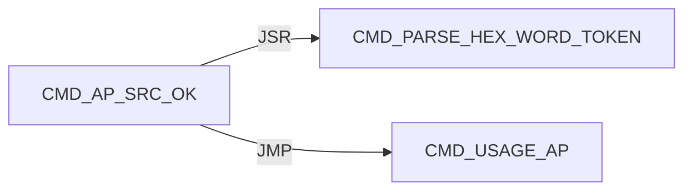

#### CMD / D

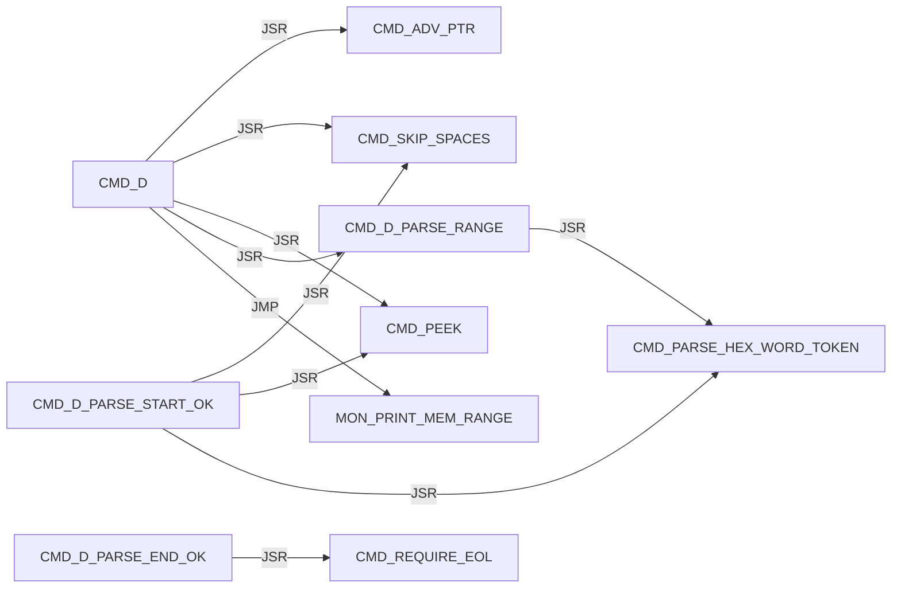

#### CMD / DISPATCH

Panel 1 of 2: `CMD_DISPATCH_DONE` through `CMD_DISPATCH_SCAN_MISS`.

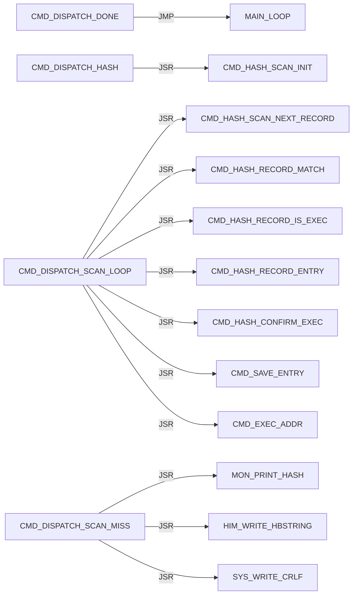

Panel 2 of 2: `CMD_DISPATCH_SCAN_MISS` through `CMD_DISPATCH_SCAN_NEXT`.

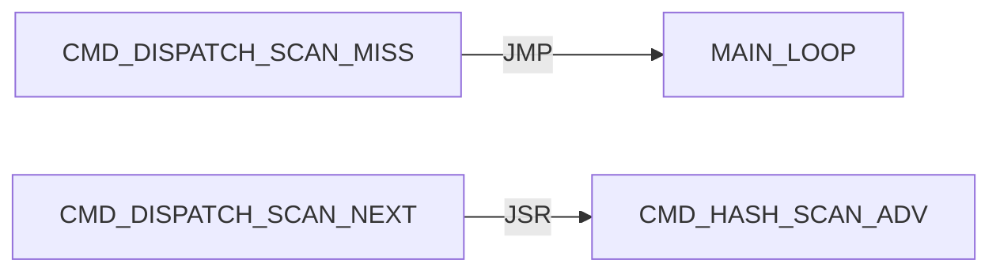

#### CMD / EXEC

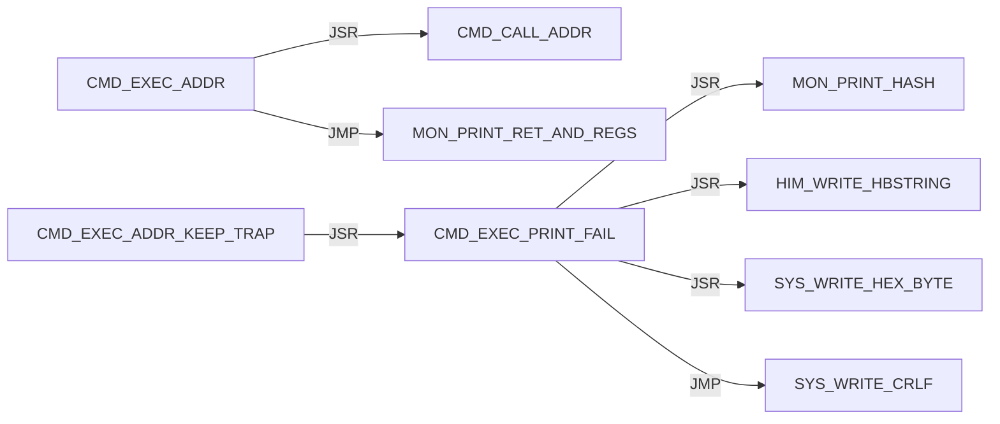

#### CMD / G

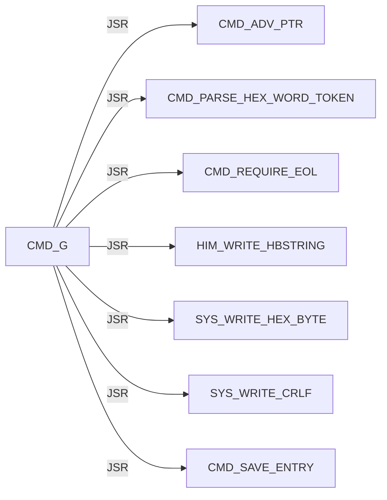

#### CMD / HASH

Panel 1 of 7: `CMD_HASH_CONFIRM_ADDR` through `CMD_HASH_FIND_LOOP`.

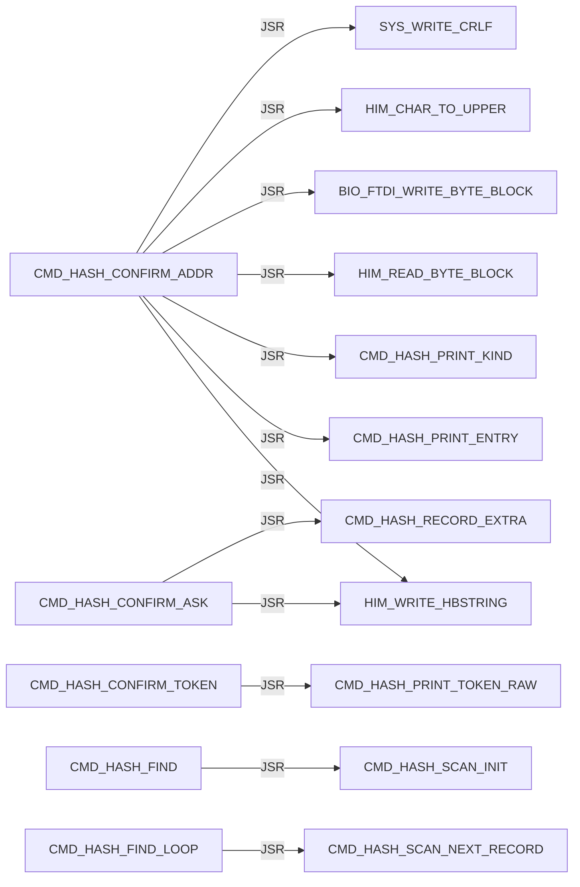

Panel 2 of 7: `CMD_HASH_FIND_LOOP` through `CMD_HASH_INFO_FOUND`.

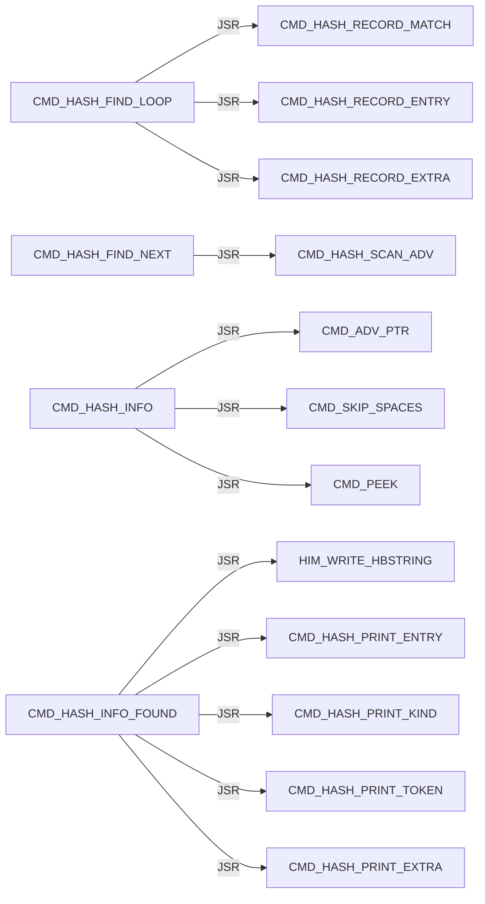

Panel 3 of 7: `CMD_HASH_INFO_FOUND` through `CMD_HASH_INFO_LOOKUP`.

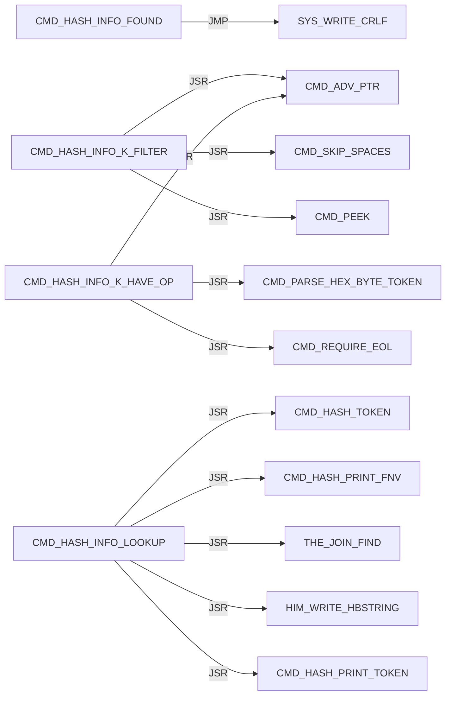

Panel 4 of 7: `CMD_HASH_INFO_LOOKUP` through `CMD_HASH_PRINT_EXTRA`.

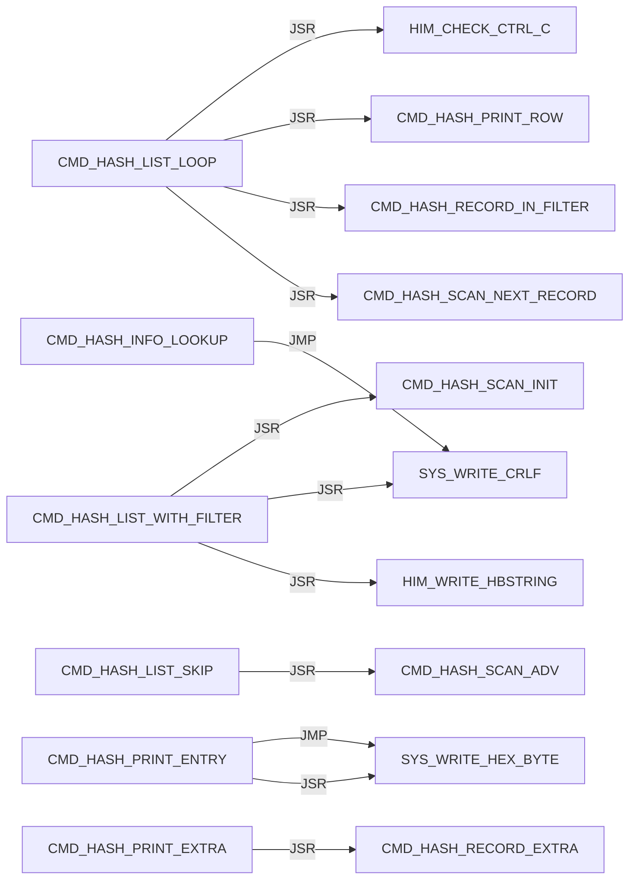

Panel 5 of 7: `CMD_HASH_PRINT_EXTRA` through `CMD_HASH_PRINT_ROW`.

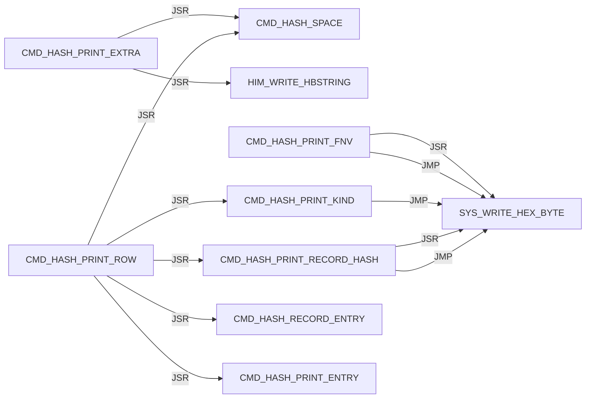

Panel 6 of 7: `CMD_HASH_PRINT_ROW` through `CMD_HASH_TOKEN`.

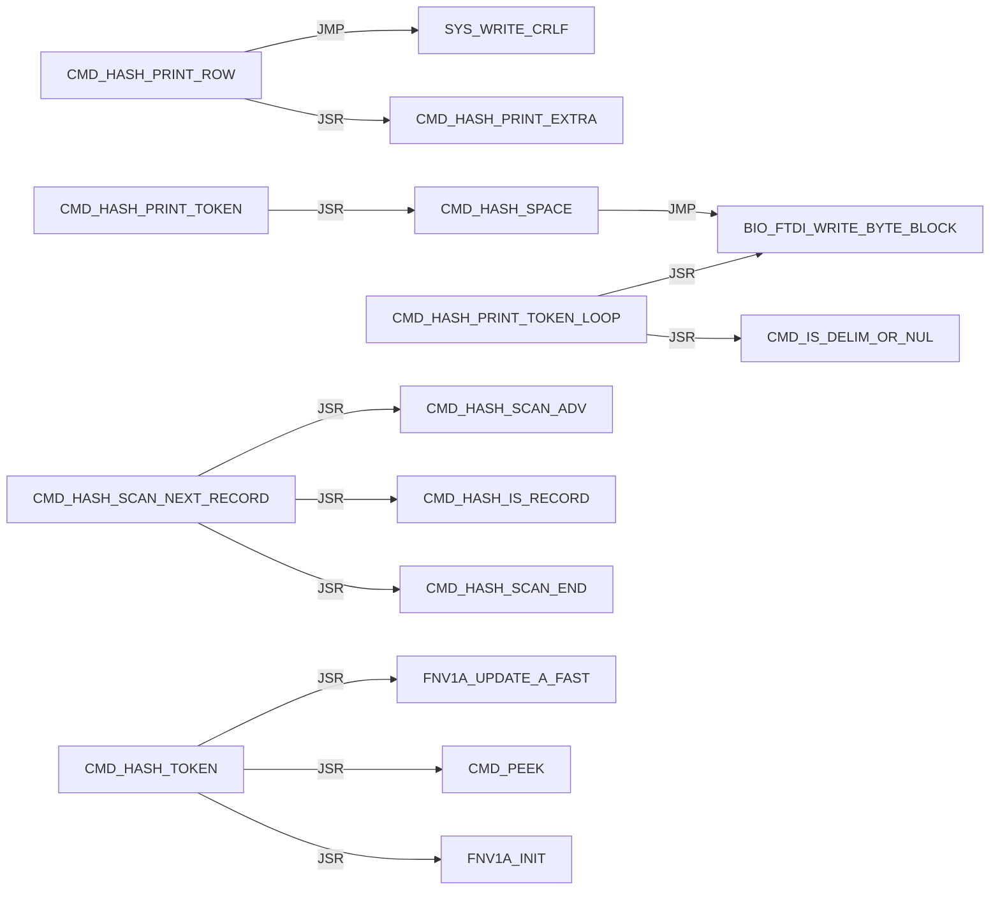

Panel 7 of 7: `CMD_HASH_TOKEN_DONE` through `CMD_HASH_USAGE`.

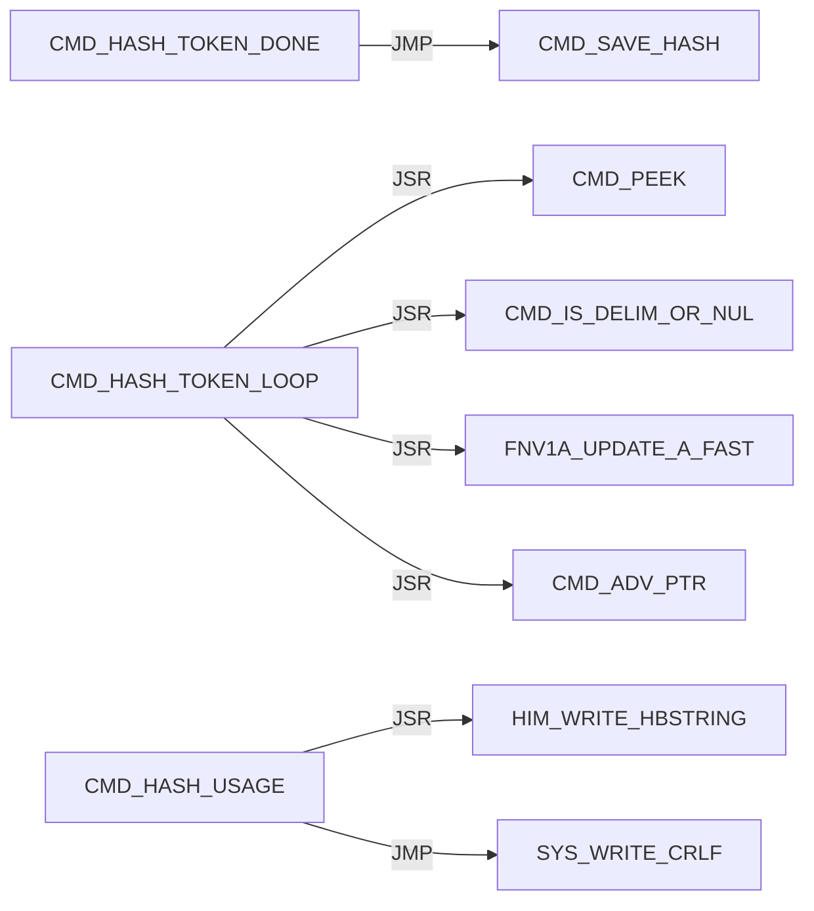

#### CMD / HELP

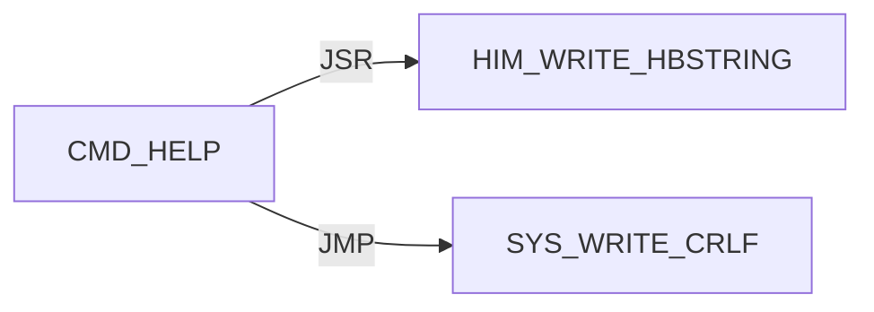

#### CMD / L

Panel 1 of 2: `CMD_L` through `CMD_L_PARSE_OK`.

```mermaid
flowchart LR
    N0["CMD_L"] -->|JSR| N1["CMD_ADV_PTR"]
    N0["CMD_L"] -->|JSR| N2["CMD_REQUIRE_EOL"]
    N0["CMD_L"] -->|JMP| N3["CMD_USAGE_L"]
    N4["CMD_L_ARGS_OK"] -->|JSR| N5["DBG_CLEAR_ALL"]
    N4["CMD_L_ARGS_OK"] -->|JSR| N6["HIM_WRITE_HBSTRING"]
    N4["CMD_L_ARGS_OK"] -->|JSR| N7["SYS_WRITE_CRLF"]
    N8["CMD_L_HAVE_LINE"] -->|JSR| N9["CMD_PEEK"]
    N8["CMD_L_HAVE_LINE"] -->|JSR| N10["L_PARSE_RECORD"]
    N8["CMD_L_HAVE_LINE"] -->|JSR| N11["CMD_L_PRINT_FAIL"]
    N12["CMD_L_PARSE_OK"] -->|JSR| N6["HIM_WRITE_HBSTRING"]
    N12["CMD_L_PARSE_OK"] -->|JSR| N13["SYS_WRITE_HEX_BYTE"]
    N12["CMD_L_PARSE_OK"] -->|JSR| N7["SYS_WRITE_CRLF"]
```

Panel 2 of 2: `CMD_L_PRINT_FAIL` through `CMD_L_READ_LOOP`.

```mermaid
flowchart LR
    N0["CMD_L_PRINT_FAIL"] -->|JSR| N1["HIM_WRITE_HBSTRING"]
    N0["CMD_L_PRINT_FAIL"] -->|JSR| N2["SYS_WRITE_HEX_BYTE"]
    N0["CMD_L_PRINT_FAIL"] -->|JMP| N3["SYS_WRITE_CRLF"]
    N4["CMD_L_READ_LOOP"] -->|JSR| N5["HIM_READ_LINE_UPPER"]
    N4["CMD_L_READ_LOOP"] -->|JSR| N1["HIM_WRITE_HBSTRING"]
    N4["CMD_L_READ_LOOP"] -->|JSR| N2["SYS_WRITE_HEX_BYTE"]
    N4["CMD_L_READ_LOOP"] -->|JSR| N3["SYS_WRITE_CRLF"]
```

#### CMD / M

```mermaid
flowchart LR
    N0["CMD_M"] -->|JSR| N1["CMD_ADV_PTR"]
    N0["CMD_M"] -->|JSR| N2["CMD_PARSE_RANGE_REQUIRED"]
    N0["CMD_M"] -->|JSR| N3["MON_MODIFY_RANGE_WRITABLE"]
    N0["CMD_M"] -->|JMP| N4["MON_MODIFY_RANGE"]
    N5["CMD_M_PROTECT"] -->|JSR| N6["HIM_WRITE_HBSTRING"]
    N5["CMD_M_PROTECT"] -->|JSR| N7["SYS_WRITE_HEX_BYTE"]
    N5["CMD_M_PROTECT"] -->|JMP| N8["SYS_WRITE_CRLF"]
```

#### CMD / PARSE

Panel 1 of 2: `CMD_PARSE_HEX_BYTE_TOKEN` through `CMD_PARSE_RANGE_REQUIRED`.

```mermaid
flowchart LR
    N0["CMD_PARSE_HEX_BYTE_TOKEN"] -->|JSR| N1["CMD_PARSE_HEX_WORD_TOKEN"]
    N2["CMD_PARSE_HEX_WORD_DONE"] -->|JSR| N3["CMD_PEEK"]
    N2["CMD_PARSE_HEX_WORD_DONE"] -->|JSR| N4["CMD_IS_DELIM_OR_NUL"]
    N5["CMD_PARSE_HEX_WORD_LOOP"] -->|JSR| N3["CMD_PEEK"]
    N5["CMD_PARSE_HEX_WORD_LOOP"] -->|JSR| N6["CMD_HEX_ASCII_TO_NIBBLE"]
    N5["CMD_PARSE_HEX_WORD_LOOP"] -->|JSR| N7["CMD_ADV_PTR"]
    N1["CMD_PARSE_HEX_WORD_TOKEN"] -->|JSR| N8["CMD_SKIP_SPACES"]
    N1["CMD_PARSE_HEX_WORD_TOKEN"] -->|JSR| N9["CMD_SKIP_OPTIONAL_DOLLAR"]
    N10["CMD_PARSE_RANGE_HAVE_END"] -->|JSR| N11["CMD_REQUIRE_EOL"]
    N12["CMD_PARSE_RANGE_PLUS"] -->|JSR| N7["CMD_ADV_PTR"]
    N12["CMD_PARSE_RANGE_PLUS"] -->|JSR| N1["CMD_PARSE_HEX_WORD_TOKEN"]
    N13["CMD_PARSE_RANGE_REQUIRED"] -->|JSR| N1["CMD_PARSE_HEX_WORD_TOKEN"]
```

Panel 2 of 2: `CMD_PARSE_RANGE_REQUIRED` through `CMD_PARSE_RANGE_START_OK`.

```mermaid
flowchart LR
    N0["CMD_PARSE_RANGE_REQUIRED"] -->|JMP| N1["CMD_PARSE_RANGE_FAIL"]
    N2["CMD_PARSE_RANGE_START_OK"] -->|JSR| N3["CMD_SKIP_SPACES"]
    N2["CMD_PARSE_RANGE_START_OK"] -->|JSR| N4["CMD_PEEK"]
    N2["CMD_PARSE_RANGE_START_OK"] -->|JSR| N5["CMD_PARSE_HEX_WORD_TOKEN"]
```

#### CMD / Q

```mermaid
flowchart LR
    N0["CMD_Q"] -->|JMP| N1["MON_REENTER"]
```

#### CMD / R

```mermaid
flowchart LR
    N0["CMD_R"] -->|JSR| N1["MON_CTX_REQUIRE_VALID"]
    N2["CMD_R_HAVE_CTX"] -->|JSR| N3["CMD_ADV_PTR"]
    N2["CMD_R_HAVE_CTX"] -->|JSR| N4["MON_CTX_PARSE_ASSIGN_LIST"]
    N2["CMD_R_HAVE_CTX"] -->|JMP| N5["MON_PRINT_STOP_AND_REGS"]
```

#### CMD / REQUIRE

```mermaid
flowchart LR
    N0["CMD_REQUIRE_EOL"] -->|JSR| N1["CMD_SKIP_SPACES"]
    N0["CMD_REQUIRE_EOL"] -->|JSR| N2["CMD_PEEK"]
```

#### CMD / SKIP

```mermaid
flowchart LR
    N0["CMD_SKIP_OPTIONAL_DOLLAR"] -->|JSR| N1["CMD_PEEK"]
    N0["CMD_SKIP_OPTIONAL_DOLLAR"] -->|JSR| N2["CMD_ADV_PTR"]
    N3["CMD_SKIP_SPACES"] -->|JSR| N1["CMD_PEEK"]
    N4["CMD_SKIP_SPACES_ADV"] -->|JSR| N2["CMD_ADV_PTR"]
```

#### CMD / UNKNOWN

```mermaid
flowchart LR
    N0["CMD_UNKNOWN"] -->|JSR| N1["HIM_WRITE_HBSTRING"]
    N0["CMD_UNKNOWN"] -->|JSR| N2["SYS_WRITE_CRLF"]
    N0["CMD_UNKNOWN"] -->|JMP| N3["MAIN_LOOP"]
```

#### CMD / USAGE

Panel 1 of 2: `CMD_USAGE_AP` through `CMD_USAGE_R`.

```mermaid
flowchart LR
    N0["CMD_USAGE_AP"] -->|JSR| N1["HIM_WRITE_HBSTRING"]
    N0["CMD_USAGE_AP"] -->|JMP| N2["SYS_WRITE_CRLF"]
    N3["CMD_USAGE_D"] -->|JSR| N1["HIM_WRITE_HBSTRING"]
    N3["CMD_USAGE_D"] -->|JMP| N2["SYS_WRITE_CRLF"]
    N4["CMD_USAGE_G"] -->|JSR| N1["HIM_WRITE_HBSTRING"]
    N4["CMD_USAGE_G"] -->|JMP| N2["SYS_WRITE_CRLF"]
    N5["CMD_USAGE_L"] -->|JSR| N1["HIM_WRITE_HBSTRING"]
    N5["CMD_USAGE_L"] -->|JMP| N2["SYS_WRITE_CRLF"]
    N6["CMD_USAGE_M"] -->|JSR| N1["HIM_WRITE_HBSTRING"]
    N6["CMD_USAGE_M"] -->|JMP| N2["SYS_WRITE_CRLF"]
    N7["CMD_USAGE_R"] -->|JSR| N1["HIM_WRITE_HBSTRING"]
    N7["CMD_USAGE_R"] -->|JMP| N2["SYS_WRITE_CRLF"]
```

Panel 2 of 2: `CMD_USAGE_X` through `CMD_USAGE_X`.

```mermaid
flowchart LR
    N0["CMD_USAGE_X"] -->|JSR| N1["HIM_WRITE_HBSTRING"]
    N0["CMD_USAGE_X"] -->|JMP| N2["SYS_WRITE_CRLF"]
```

#### CMD / X

```mermaid
flowchart LR
    N0["CMD_X"] -->|JSR| N1["MON_CTX_REQUIRE_VALID"]
    N2["CMD_X_HAVE_CTX"] -->|JSR| N3["CMD_ADV_PTR"]
    N2["CMD_X_HAVE_CTX"] -->|JSR| N4["MON_CTX_PARSE_ASSIGN_LIST"]
    N2["CMD_X_HAVE_CTX"] -->|JSR| N5["HIM_WRITE_HBSTRING"]
    N2["CMD_X_HAVE_CTX"] -->|JSR| N6["SYS_WRITE_HEX_BYTE"]
    N2["CMD_X_HAVE_CTX"] -->|JSR| N7["SYS_WRITE_CRLF"]
    N2["CMD_X_HAVE_CTX"] -->|JMP| N8["MON_CTX_RESUME_RTI"]
```

#### ENTRY / unprefixed

```mermaid
flowchart LR
    N0["START"] -->|JMP| N1["HIMON_START_BODY"]
```

#### FNV1A

```mermaid
flowchart LR
    N0["FNV1A_MUL_PRIME"] -->|JSR| N1["MATH_COPY_HASH_TO_TERM"]
    N0["FNV1A_MUL_PRIME"] -->|JSR| N2["MATH_SHLADD_TERM_N"]
    N0["FNV1A_MUL_PRIME"] -->|JMP| N3["MATH_ADD_TERM1_TO_HASH3"]
    N4["FNV1A_MUL_PRIME_FAST"] -->|JSR| N1["MATH_COPY_HASH_TO_TERM"]
    N4["FNV1A_MUL_PRIME_FAST"] -->|JSR| N5["MATH_ADD_TERM_TO_HASH"]
    N4["FNV1A_MUL_PRIME_FAST"] -->|JMP| N3["MATH_ADD_TERM1_TO_HASH3"]
    N6["FNV1A_UPDATE_A"] -->|JMP| N0["FNV1A_MUL_PRIME"]
    N7["FNV1A_UPDATE_A_FAST"] -->|JMP| N4["FNV1A_MUL_PRIME_FAST"]
```

#### HIM / AP

Panel 1 of 11: `HIM_AP_ADVANCE_A` through `HIM_AP_CHECK_RELOC_SHAPE_BAD`.

```mermaid
flowchart LR
    N0["HIM_AP_ADVANCE_A"] -->|JSR| N1["HIM_AP_NEED_A"]
    N2["HIM_AP_ADVANCE_TMP"] -->|JSR| N3["HIM_AP_NEED_TMP"]
    N4["HIM_AP_BANK_STAGE_CODE"] -->|JSR| N5["STR8_BANK_SELECT_SERVICE"]
    N4["HIM_AP_BANK_STAGE_CODE"] -->|JSR| N6["STR8_BANK_SELECT_RAM"]
    N7["HIM_AP_CHECK_PUBLIC_COUNT_OK"] -->|JSR| N8["HIM_AP_CHECK_PUBLIC_ADVANCE_A"]
    N7["HIM_AP_CHECK_PUBLIC_COUNT_OK"] -->|JMP| N9["HIM_AP_CHECK_PUBLIC_FAIL"]
    N9["HIM_AP_CHECK_PUBLIC_FAIL"] -->|JMP| N10["HIM_AP_BAD_LINE"]
    N11["HIM_AP_CHECK_PUBLIC_REC"] -->|JMP| N9["HIM_AP_CHECK_PUBLIC_FAIL"]
    N12["HIM_AP_CHECK_PUBLIC_ROW_READY"] -->|JSR| N8["HIM_AP_CHECK_PUBLIC_ADVANCE_A"]
    N13["HIM_AP_CHECK_RELOC_KIND_LOOP"] -->|JSR| N14["HIM_AP_RELOC_KIND_X"]
    N15["HIM_AP_CHECK_RELOC_REC"] -->|JMP| N10["HIM_AP_BAD_LINE"]
    N16["HIM_AP_CHECK_RELOC_SHAPE_BAD"] -->|JMP| N10["HIM_AP_BAD_LINE"]
```

Panel 2 of 11: `HIM_AP_FIND_HOLE_LOOP` through `HIM_AP_LINK_PATCH`.

```mermaid
flowchart LR
    N0["HIM_AP_FIND_HOLE_LOOP"] -->|JSR| N1["HIM_AP_HOLE_AT_SCAN"]
    N2["HIM_AP_FIND_HOLE_NEXT"] -->|JMP| N3["HIM_AP_BAD_RANGE"]
    N4["HIM_AP_IMPORT_LINK"] -->|JSR| N5["HIM_AP_LINK_RELOAD_REL_PTR"]
    N6["HIM_AP_LINK_CAPTURE_ROW_X"] -->|JSR| N7["HIM_AP_RELOC_KIND_X"]
    N6["HIM_AP_LINK_CAPTURE_ROW_X"] -->|JSR| N8["HIM_AP_RELOC_SITE_LO_X"]
    N6["HIM_AP_LINK_CAPTURE_ROW_X"] -->|JSR| N9["HIM_AP_RELOC_SITE_HI_X"]
    N10["HIM_AP_LINK_DONE"] -->|JSR| N11["HIM_AP_LINK_RESTORE_COUNTS"]
    N12["HIM_AP_LINK_FAIL"] -->|JSR| N11["HIM_AP_LINK_RESTORE_COUNTS"]
    N13["HIM_AP_LINK_IMPORT_ROW_LOOP"] -->|JSR| N14["HIM_AP_LINK_IMPORT_ROW_BYTES_A"]
    N15["HIM_AP_LINK_PATCH"] -->|JSR| N5["HIM_AP_LINK_RELOAD_REL_PTR"]
    N15["HIM_AP_LINK_PATCH"] -->|JSR| N7["HIM_AP_RELOC_KIND_X"]
    N15["HIM_AP_LINK_PATCH"] -->|JSR| N16["HIM_AP_IMPORT_KIND_A"]
```

Panel 3 of 11: `HIM_AP_LINK_PATCH` through `HIM_AP_LINK_VALIDATE`.

```mermaid
flowchart LR
    N0["HIM_AP_LINK_PATCH"] -->|JSR| N1["HIM_AP_LINK_CAPTURE_ROW_X"]
    N0["HIM_AP_LINK_PATCH"] -->|JSR| N2["HIM_AP_LINK_RESOLVE_ROW_X"]
    N0["HIM_AP_LINK_PATCH"] -->|JSR| N3["HIM_AP_LINK_PATCH_CAPTURED"]
    N2["HIM_AP_LINK_RESOLVE_ROW_X"] -->|JSR| N4["HIM_AP_RELOC_TARGET_HI_X"]
    N2["HIM_AP_LINK_RESOLVE_ROW_X"] -->|JSR| N5["HIM_AP_RELOC_TARGET_LO_X"]
    N2["HIM_AP_LINK_RESOLVE_ROW_X"] -->|JSR| N6["HIM_AP_LINK_RESOLVE_SLOT_X"]
    N6["HIM_AP_LINK_RESOLVE_SLOT_X"] -->|JSR| N7["HIM_AP_LINK_IMPORT_ROW_PTR_X"]
    N6["HIM_AP_LINK_RESOLVE_SLOT_X"] -->|JSR| N8["THE_JOIN_FIND"]
    N9["HIM_AP_LINK_VALIDATE"] -->|JSR| N10["HIM_AP_LINK_RELOAD_REL_PTR"]
    N9["HIM_AP_LINK_VALIDATE"] -->|JSR| N11["HIM_AP_RELOC_KIND_X"]
    N9["HIM_AP_LINK_VALIDATE"] -->|JSR| N12["HIM_AP_IMPORT_KIND_A"]
    N9["HIM_AP_LINK_VALIDATE"] -->|JSR| N13["HIM_AP_RELOC_SITE_OK_X"]
```

Panel 4 of 11: `HIM_AP_LINK_VALIDATE` through `HIM_AP_LOAD_PATCH_LOOP`.

```mermaid
flowchart LR
    N0["HIM_AP_LINK_VALIDATE"] -->|JSR| N1["HIM_AP_LINK_RESOLVE_ROW_X"]
    N2["HIM_AP_LOAD_BASE_GE_20"] -->|JMP| N3["HIM_AP_BAD_RANGE"]
    N4["HIM_AP_LOAD_BASE_LT_50"] -->|JMP| N3["HIM_AP_BAD_RANGE"]
    N5["HIM_AP_LOAD_LAST_NO_CARRY"] -->|JMP| N3["HIM_AP_BAD_RANGE"]
    N6["HIM_AP_LOAD_LEN_NONZERO"] -->|JMP| N3["HIM_AP_BAD_RANGE"]
    N7["HIM_AP_LOAD_NO_OVERLAP"] -->|JSR| N8["HIM_AP_COPY_BODY_TO_DST"]
    N7["HIM_AP_LOAD_NO_OVERLAP"] -->|JSR| N9["HIM_AP_IMPORT_LINK"]
    N10["HIM_AP_LOAD_OVERLAP_BAD"] -->|JMP| N3["HIM_AP_BAD_RANGE"]
    N11["HIM_AP_LOAD_PARSED"] -->|JSR| N12["HIM_AP_LOAD_RANGE_OK"]
    N13["HIM_AP_LOAD_PATCH_LOOP"] -->|JSR| N14["HIM_AP_RELOC_KIND_X"]
    N13["HIM_AP_LOAD_PATCH_LOOP"] -->|JSR| N15["HIM_AP_INTERNAL_KIND_A"]
    N13["HIM_AP_LOAD_PATCH_LOOP"] -->|JSR| N16["HIM_AP_IMPORT_KIND_A"]
```

Panel 5 of 11: `HIM_AP_LOAD_PATCH_LOOP` through `HIM_AP_PARSE_BODY_SAVE`.

```mermaid
flowchart LR
    N0["HIM_AP_LOAD_PATCH_LOOP"] -->|JMP| N1["HIM_AP_BAD_FIX"]
    N2["HIM_AP_LOAD_PATCH_ROW"] -->|JSR| N3["HIM_AP_RELOC_SITE_OK_X"]
    N4["HIM_AP_LOAD_PATCH_SITE_OK"] -->|JSR| N5["HIM_AP_RELOC_PATCH_ROW_X"]
    N6["HIM_AP_LOAD_RANGE_OK"] -->|JMP| N7["HIM_AP_BAD_RANGE"]
    N8["HIM_AP_NEED_A"] -->|JMP| N7["HIM_AP_BAD_RANGE"]
    N9["HIM_AP_NEED_TMP_FAIL"] -->|JMP| N7["HIM_AP_BAD_RANGE"]
    N10["HIM_AP_PARSE_BODY"] -->|JSR| N8["HIM_AP_NEED_A"]
    N11["HIM_AP_PARSE_BODY_HDR_ROOM"] -->|JMP| N12["HIM_AP_BAD_LINE"]
    N13["HIM_AP_PARSE_BODY_LEFT_LO_OK"] -->|JMP| N12["HIM_AP_BAD_LINE"]
    N14["HIM_AP_PARSE_BODY_LEFT_OK"] -->|JMP| N12["HIM_AP_BAD_LINE"]
    N15["HIM_AP_PARSE_BODY_NONZERO"] -->|JSR| N16["HIM_AP_VERIFY_SEAL_BODY"]
    N17["HIM_AP_PARSE_BODY_SAVE"] -->|JMP| N12["HIM_AP_BAD_LINE"]
```

Panel 6 of 11: `HIM_AP_PARSE_BODY_TAG_OK` through `HIM_AP_PARSE_IMPORT_TAG_OK`.

```mermaid
flowchart LR
    N0["HIM_AP_PARSE_BODY_TAG_OK"] -->|JSR| N1["HIM_AP_ADVANCE_A"]
    N2["HIM_AP_PARSE_EXPORT"] -->|JSR| N3["HIM_AP_TAG_LEN"]
    N4["HIM_AP_PARSE_EXPORT_LEN_OK"] -->|JSR| N5["HIM_AP_NEED_TMP"]
    N4["HIM_AP_PARSE_EXPORT_LEN_OK"] -->|JSR| N6["HIM_AP_CHECK_EXPORT_REC"]
    N4["HIM_AP_PARSE_EXPORT_LEN_OK"] -->|JSR| N7["HIM_AP_ADVANCE_TMP"]
    N8["HIM_AP_PARSE_EXPORT_TAG_OK"] -->|JMP| N9["HIM_AP_BAD_LINE"]
    N10["HIM_AP_PARSE_HEADER_RANGE"] -->|JMP| N9["HIM_AP_BAD_LINE"]
    N11["HIM_AP_PARSE_IMPORT"] -->|JSR| N3["HIM_AP_TAG_LEN"]
    N12["HIM_AP_PARSE_IMPORT_LEN_OK"] -->|JSR| N5["HIM_AP_NEED_TMP"]
    N13["HIM_AP_PARSE_IMPORT_ROOM_OK"] -->|JSR| N14["HIM_AP_CHECK_IMPORT_REC"]
    N13["HIM_AP_PARSE_IMPORT_ROOM_OK"] -->|JSR| N7["HIM_AP_ADVANCE_TMP"]
    N15["HIM_AP_PARSE_IMPORT_TAG_OK"] -->|JMP| N9["HIM_AP_BAD_LINE"]
```

Panel 7 of 11: `HIM_AP_PARSE_LEN_NONZERO` through `HIM_AP_PARSE_SEAL_LEN_OK`.

```mermaid
flowchart LR
    N0["HIM_AP_PARSE_LEN_NONZERO"] -->|JSR| N1["HIM_AP_SOURCE_RANGE_OK"]
    N2["HIM_AP_PARSE_MIN"] -->|JSR| N1["HIM_AP_SOURCE_RANGE_OK"]
    N3["HIM_AP_PARSE_RANGE_SAFE"] -->|JMP| N4["HIM_AP_BAD_LINE"]
    N5["HIM_AP_PARSE_RELOC"] -->|JSR| N6["HIM_AP_TAG_LEN"]
    N7["HIM_AP_PARSE_RELOC_LEN_OK"] -->|JSR| N8["HIM_AP_NEED_TMP"]
    N9["HIM_AP_PARSE_RELOC_ROOM_OK"] -->|JSR| N10["HIM_AP_CHECK_RELOC_REC"]
    N11["HIM_AP_PARSE_RELOC_SHAPE_OK"] -->|JSR| N12["HIM_AP_ADVANCE_TMP"]
    N13["HIM_AP_PARSE_RELOC_TAG_OK"] -->|JMP| N4["HIM_AP_BAD_LINE"]
    N14["HIM_AP_PARSE_SEAL"] -->|JSR| N6["HIM_AP_TAG_LEN"]
    N15["HIM_AP_PARSE_SEAL_BAD"] -->|JMP| N4["HIM_AP_BAD_LINE"]
    N16["HIM_AP_PARSE_SEAL_LEN_BAD"] -->|JMP| N4["HIM_AP_BAD_LINE"]
    N17["HIM_AP_PARSE_SEAL_LEN_OK"] -->|JMP| N4["HIM_AP_BAD_LINE"]
```

Panel 8 of 11: `HIM_AP_PARSE_SEAL_SHAPE_OK` through `HIM_AP_RELOC_SITE_HI_EQ`.

```mermaid
flowchart LR
    N0["HIM_AP_PARSE_SEAL_SHAPE_OK"] -->|JSR| N1["HIM_AP_ADVANCE_TMP"]
    N2["HIM_AP_PARSE_SIG0_OK"] -->|JMP| N3["HIM_AP_BAD_LINE"]
    N4["HIM_AP_PARSE_SIG1_OK"] -->|JMP| N3["HIM_AP_BAD_LINE"]
    N5["HIM_AP_PARSE_VER_OK"] -->|JMP| N3["HIM_AP_BAD_LINE"]
    N6["HIM_AP_RELOC_PATCH_ROW_X"] -->|JSR| N7["HIM_AP_RELOC_SITE_LO_X"]
    N6["HIM_AP_RELOC_PATCH_ROW_X"] -->|JSR| N8["HIM_AP_RELOC_SITE_HI_X"]
    N6["HIM_AP_RELOC_PATCH_ROW_X"] -->|JSR| N9["HIM_AP_RELOC_TARGET_LO_X"]
    N6["HIM_AP_RELOC_PATCH_ROW_X"] -->|JSR| N10["HIM_AP_RELOC_TARGET_HI_X"]
    N11["HIM_AP_RELOC_SITE_HAVE_ADD"] -->|JSR| N7["HIM_AP_RELOC_SITE_LO_X"]
    N11["HIM_AP_RELOC_SITE_HAVE_ADD"] -->|JSR| N8["HIM_AP_RELOC_SITE_HI_X"]
    N11["HIM_AP_RELOC_SITE_HAVE_ADD"] -->|JMP| N12["HIM_AP_BAD_FIX"]
    N13["HIM_AP_RELOC_SITE_HI_EQ"] -->|JMP| N12["HIM_AP_BAD_FIX"]
```

Panel 9 of 11: `HIM_AP_RELOC_SITE_NO_CARRY` through `HIM_AP_SOURCE_BASE_SAFE`.

```mermaid
flowchart LR
    N0["HIM_AP_RELOC_SITE_NO_CARRY"] -->|JMP| N1["HIM_AP_BAD_FIX"]
    N2["HIM_AP_RELOC_SITE_OK_X"] -->|JSR| N3["HIM_AP_RELOC_KIND_X"]
    N4["HIM_AP_SERVICE"] -->|JMP| N5["HIM_AP_SERVICE_SUGGEST"]
    N6["HIM_AP_SERVICE_BAD_OP"] -->|JMP| N7["HIM_AP_BAD_LINE"]
    N8["HIM_AP_SERVICE_LINK"] -->|JMP| N9["HIM_AP_IMPORT_LINK"]
    N10["HIM_AP_SERVICE_LOAD"] -->|JSR| N11["HIM_AP_PARSE_MIN"]
    N12["HIM_AP_SERVICE_PARSE"] -->|JMP| N11["HIM_AP_PARSE_MIN"]
    N5["HIM_AP_SERVICE_SUGGEST"] -->|JSR| N11["HIM_AP_PARSE_MIN"]
    N13["HIM_AP_SOURCE_BASE_BAD"] -->|JMP| N14["HIM_AP_BAD_RANGE"]
    N15["HIM_AP_SOURCE_BASE_GE_20"] -->|JMP| N14["HIM_AP_BAD_RANGE"]
    N16["HIM_AP_SOURCE_BASE_GE_80"] -->|JMP| N14["HIM_AP_BAD_RANGE"]
    N17["HIM_AP_SOURCE_BASE_SAFE"] -->|JMP| N14["HIM_AP_BAD_RANGE"]
```

Panel 10 of 11: `HIM_AP_SOURCE_LAST_NO_CARRY` through `HIM_AP_VERIFY_SEAL_BAD`.

```mermaid
flowchart LR
    N0["HIM_AP_SOURCE_LAST_NO_CARRY"] -->|JMP| N1["HIM_AP_BAD_RANGE"]
    N2["HIM_AP_SOURCE_LEN_NONZERO"] -->|JSR| N3["HIM_AP_SOURCE_BASE_OK"]
    N4["HIM_AP_SOURCE_RAM_RANGE"] -->|JMP| N1["HIM_AP_BAD_RANGE"]
    N5["HIM_AP_SOURCE_RANGE_OK"] -->|JMP| N1["HIM_AP_BAD_RANGE"]
    N6["HIM_AP_SOURCE_STAGE_RANGE"] -->|JMP| N1["HIM_AP_BAD_RANGE"]
    N7["HIM_AP_STAGE_BANK_BAD"] -->|JMP| N1["HIM_AP_BAD_RANGE"]
    N8["HIM_AP_STAGE_BANK_SOURCE"] -->|JSR| N9["HIM_AP_BANK_STAGE_RAM"]
    N10["HIM_AP_SUGGEST_PARSED"] -->|JSR| N11["HIM_AP_FIND_HOLE"]
    N12["HIM_AP_TAG_LEN"] -->|JSR| N13["HIM_AP_NEED_A"]
    N14["HIM_AP_TAG_LEN_ROOM_OK"] -->|JMP| N15["HIM_AP_BAD_LINE"]
    N16["HIM_AP_TAG_LEN_TAG_OK"] -->|JMP| N17["HIM_AP_ADVANCE_A"]
    N18["HIM_AP_VERIFY_SEAL_BAD"] -->|JMP| N15["HIM_AP_BAD_LINE"]
```

Panel 11 of 11: `HIM_AP_VERIFY_SEAL_BODY` through `HIM_AP_VERIFY_SEAL_LOOP`.

```mermaid
flowchart LR
    N0["HIM_AP_VERIFY_SEAL_BODY"] -->|JSR| N1["FNV1A_INIT"]
    N2["HIM_AP_VERIFY_SEAL_LOOP"] -->|JSR| N3["FNV1A_UPDATE_A_FAST"]
```

#### HIM / CHECK

```mermaid
flowchart LR
    N0["HIM_CHECK_CTRL_C"] -->|JSR| N1["BIO_FTDI_READ_BYTE_NONBLOCK"]
```

#### HIM / FLASH

```mermaid
flowchart LR
    N0["HIM_FLASH_INSTALL_BAD_JMP"] -->|JMP| N1["HIM_FLASH_INSTALL_BAD"]
    N2["HIM_FLASH_INSTALL_LOOP"] -->|JSR| N3["L_FLASH_SET_PTR"]
    N2["HIM_FLASH_INSTALL_LOOP"] -->|JSR| N4["FLASH_WRITE_BYTE_AXY"]
```

#### HIM / PACK40

```mermaid
flowchart LR
    N0["HIM_PACK40_ASCII_TO_CODE"] -->|JSR| N1["HIM_CHAR_TO_UPPER"]
    N2["HIM_PACK40_PACK3"] -->|JSR| N3["HIM_PACK40_MUL40"]
    N2["HIM_PACK40_PACK3"] -->|JSR| N4["HIM_PACK40_ADD_A"]
```

#### HIM / READ

```mermaid
flowchart LR
    N0["HIM_READ_BYTE_HW"] -->|JMP| N1["BIO_FTDI_READ_BYTE_BLOCK"]
    N2["HIM_READ_LINE_ABORT"] -->|JSR| N3["SYS_WRITE_CRLF"]
    N4["HIM_READ_LINE_BS_DEC"] -->|JSR| N5["BIO_FTDI_WRITE_BYTE_BLOCK"]
    N6["HIM_READ_LINE_DONE"] -->|JSR| N3["SYS_WRITE_CRLF"]
    N7["HIM_READ_LINE_LOOP"] -->|JSR| N8["HIM_READ_BYTE_BLOCK"]
    N7["HIM_READ_LINE_LOOP"] -->|JSR| N9["HIM_CHAR_TO_UPPER"]
    N7["HIM_READ_LINE_LOOP"] -->|JSR| N10["CMD_ADV_PTR"]
    N7["HIM_READ_LINE_LOOP"] -->|JSR| N5["BIO_FTDI_WRITE_BYTE_BLOCK"]
```

#### HIM / WRITE

```mermaid
flowchart LR
    N0["HIM_WRITE_HBSTRING_LAST"] -->|JMP| N1["BIO_FTDI_WRITE_BYTE_BLOCK"]
    N2["HIM_WRITE_HBSTRING_LOOP"] -->|JSR| N1["BIO_FTDI_WRITE_BYTE_BLOCK"]
```

#### HIMON

```mermaid
flowchart LR
    N0["HIMON_START_BODY"] -->|JSR| N1["HIMON_START_SIG_CHECK"]
    N0["HIMON_START_BODY"] -->|JMP| N2["HIMON_WARM_START_BODY"]
    N2["HIMON_WARM_START_BODY"] -->|JSR| N3["DBG_CLEAR_ALL"]
    N2["HIMON_WARM_START_BODY"] -->|JMP| N4["MON_START_INIT"]
```

#### L

Panel 1 of 3: `L_NOTE_S1_ADDR_PRINT` through `L_PARSE_RECORD_HAVE_S`.

```mermaid
flowchart LR
    N0["L_NOTE_S1_ADDR_PRINT"] -->|JSR| N1["BIO_FTDI_WRITE_BYTE_BLOCK"]
    N0["L_NOTE_S1_ADDR_PRINT"] -->|JSR| N2["SYS_WRITE_HEX_BYTE"]
    N0["L_NOTE_S1_ADDR_PRINT"] -->|JSR| N3["SYS_WRITE_CRLF"]
    N4["L_PARSE_HEADER"] -->|JSR| N5["L_PARSE_HEX_BYTE_STRICT"]
    N4["L_PARSE_HEADER"] -->|JSR| N6["L_SUM_ADD_A"]
    N5["L_PARSE_HEX_BYTE_STRICT"] -->|JSR| N7["CMD_PEEK"]
    N5["L_PARSE_HEX_BYTE_STRICT"] -->|JSR| N8["CMD_HEX_ASCII_TO_NIBBLE"]
    N5["L_PARSE_HEX_BYTE_STRICT"] -->|JSR| N9["CMD_ADV_PTR"]
    N10["L_PARSE_RECORD"] -->|JSR| N7["CMD_PEEK"]
    N10["L_PARSE_RECORD"] -->|JMP| N11["L_PARSE_FAIL"]
    N12["L_PARSE_RECORD_BAD_KIND"] -->|JMP| N11["L_PARSE_FAIL"]
    N13["L_PARSE_RECORD_HAVE_S"] -->|JSR| N9["CMD_ADV_PTR"]
```

Panel 2 of 3: `L_PARSE_RECORD_HAVE_S` through `L_PARSE_S0_SKIP`.

```mermaid
flowchart LR
    N0["L_PARSE_RECORD_HAVE_S"] -->|JSR| N1["CMD_PEEK"]
    N0["L_PARSE_RECORD_HAVE_S"] -->|JMP| N2["L_PARSE_RECORD_S9"]
    N3["L_PARSE_RECORD_S0"] -->|JSR| N4["CMD_ADV_PTR"]
    N3["L_PARSE_RECORD_S0"] -->|JSR| N5["L_PARSE_HEADER"]
    N6["L_PARSE_RECORD_S1"] -->|JSR| N4["CMD_ADV_PTR"]
    N6["L_PARSE_RECORD_S1"] -->|JSR| N5["L_PARSE_HEADER"]
    N2["L_PARSE_RECORD_S9"] -->|JSR| N4["CMD_ADV_PTR"]
    N2["L_PARSE_RECORD_S9"] -->|JSR| N5["L_PARSE_HEADER"]
    N2["L_PARSE_RECORD_S9"] -->|JSR| N7["L_VERIFY_CHECKSUM_EOL"]
    N8["L_PARSE_S0_CHECK"] -->|JSR| N7["L_VERIFY_CHECKSUM_EOL"]
    N9["L_PARSE_S0_FAIL"] -->|JMP| N10["L_PARSE_FAIL"]
    N11["L_PARSE_S0_SKIP"] -->|JSR| N12["L_PARSE_HEX_BYTE_STRICT"]
```

Panel 3 of 3: `L_PARSE_S0_SKIP` through `L_VERIFY_CHECKSUM_EOL`.

```mermaid
flowchart LR
    N0["L_PARSE_S0_SKIP"] -->|JSR| N1["L_SUM_ADD_A"]
    N2["L_PARSE_S1_CHECK"] -->|JSR| N3["L_VERIFY_CHECKSUM_EOL"]
    N2["L_PARSE_S1_CHECK"] -->|JSR| N4["L_VALIDATE_RAM_SPAN"]
    N2["L_PARSE_S1_CHECK"] -->|JSR| N5["L_NOTE_S1_ADDR"]
    N6["L_PARSE_S1_DATA"] -->|JSR| N7["L_PARSE_HEX_BYTE_STRICT"]
    N6["L_PARSE_S1_DATA"] -->|JSR| N1["L_SUM_ADD_A"]
    N8["L_PARSE_S1_FAIL"] -->|JMP| N9["L_PARSE_FAIL"]
    N10["L_PARSE_S9_FAIL"] -->|JMP| N9["L_PARSE_FAIL"]
    N3["L_VERIFY_CHECKSUM_EOL"] -->|JSR| N7["L_PARSE_HEX_BYTE_STRICT"]
    N3["L_VERIFY_CHECKSUM_EOL"] -->|JSR| N11["CMD_PEEK"]
```

#### MAIN

```mermaid
flowchart LR
    N0["MAIN_HAVE_LINE"] -->|JSR| N1["CMD_SKIP_SPACES"]
    N0["MAIN_HAVE_LINE"] -->|JSR| N2["CMD_PEEK"]
    N0["MAIN_HAVE_LINE"] -->|JSR| N3["CMD_HASH_TOKEN"]
    N0["MAIN_HAVE_LINE"] -->|JMP| N4["CMD_DISPATCH_HASH"]
    N5["MAIN_LOOP"] -->|JSR| N6["HIM_WRITE_HBSTRING"]
    N5["MAIN_LOOP"] -->|JSR| N7["HIM_READ_LINE_ECHO_UPPER"]
```

#### MATH

```mermaid
flowchart LR
    N0["MATH_SHLADD_TERM_N"] -->|JSR| N1["MATH_SHL_TERM_N"]
    N0["MATH_SHLADD_TERM_N"] -->|JMP| N2["MATH_ADD_TERM_TO_HASH"]
```

#### MON / AFTER

```mermaid
flowchart LR
    N0["MON_AFTER_BANNER"] -->|JSR| N1["MON_PRINT_STOP_AND_REGS"]
```

#### MON / BRK

```mermaid
flowchart LR
    N0["MON_BRK_TRAP"] -->|JSR| N1["DBG_HANDLE_BRK"]
    N0["MON_BRK_TRAP"] -->|JMP| N2["MON_REENTER"]
    N3["MON_BRK_TRAP_NORMAL"] -->|JMP| N2["MON_REENTER"]
```

#### MON / CLEAR

```mermaid
flowchart LR
    N0["MON_CLEAR_RAM_ZP"] -->|JMP| N1["MON_START_INIT"]
```

#### MON / COLD

```mermaid
flowchart LR
    N0["MON_COLD_RESET"] -->|JMP| N1["MON_CLEAR_RAM"]
```

#### MON / CTX

Panel 1 of 3: `MON_CTX_PARSE_A` through `MON_CTX_PARSE_P_OR_PC`.

```mermaid
flowchart LR
    N0["MON_CTX_PARSE_A"] -->|JSR| N1["CMD_ADV_PTR"]
    N0["MON_CTX_PARSE_A"] -->|JSR| N2["MON_PARSE_EQ"]
    N0["MON_CTX_PARSE_A"] -->|JSR| N3["CMD_PARSE_HEX_BYTE_TOKEN"]
    N4["MON_CTX_PARSE_ASSIGN"] -->|JSR| N5["CMD_PEEK"]
    N6["MON_CTX_PARSE_ASSIGN_LIST"] -->|JSR| N7["CMD_SKIP_SPACES"]
    N6["MON_CTX_PARSE_ASSIGN_LIST"] -->|JSR| N5["CMD_PEEK"]
    N8["MON_CTX_PARSE_ASSIGN_LOOP"] -->|JSR| N4["MON_CTX_PARSE_ASSIGN"]
    N8["MON_CTX_PARSE_ASSIGN_LOOP"] -->|JSR| N7["CMD_SKIP_SPACES"]
    N8["MON_CTX_PARSE_ASSIGN_LOOP"] -->|JSR| N5["CMD_PEEK"]
    N9["MON_CTX_PARSE_P_OR_PC"] -->|JSR| N1["CMD_ADV_PTR"]
    N9["MON_CTX_PARSE_P_OR_PC"] -->|JSR| N5["CMD_PEEK"]
    N9["MON_CTX_PARSE_P_OR_PC"] -->|JSR| N2["MON_PARSE_EQ"]
```

Panel 2 of 3: `MON_CTX_PARSE_P_OR_PC` through `MON_CTX_PARSE_Y`.

```mermaid
flowchart LR
    N0["MON_CTX_PARSE_P_OR_PC"] -->|JSR| N1["CMD_PARSE_HEX_BYTE_TOKEN"]
    N2["MON_CTX_PARSE_PC"] -->|JSR| N3["CMD_ADV_PTR"]
    N2["MON_CTX_PARSE_PC"] -->|JSR| N4["MON_PARSE_EQ"]
    N2["MON_CTX_PARSE_PC"] -->|JSR| N5["CMD_PARSE_HEX_WORD_TOKEN"]
    N6["MON_CTX_PARSE_S"] -->|JSR| N3["CMD_ADV_PTR"]
    N6["MON_CTX_PARSE_S"] -->|JSR| N4["MON_PARSE_EQ"]
    N6["MON_CTX_PARSE_S"] -->|JSR| N1["CMD_PARSE_HEX_BYTE_TOKEN"]
    N7["MON_CTX_PARSE_X"] -->|JSR| N3["CMD_ADV_PTR"]
    N7["MON_CTX_PARSE_X"] -->|JSR| N4["MON_PARSE_EQ"]
    N7["MON_CTX_PARSE_X"] -->|JSR| N1["CMD_PARSE_HEX_BYTE_TOKEN"]
    N8["MON_CTX_PARSE_Y"] -->|JSR| N3["CMD_ADV_PTR"]
    N8["MON_CTX_PARSE_Y"] -->|JSR| N4["MON_PARSE_EQ"]
```

Panel 3 of 3: `MON_CTX_PARSE_Y` through `MON_CTX_REQUIRE_VALID`.

```mermaid
flowchart LR
    N0["MON_CTX_PARSE_Y"] -->|JSR| N1["CMD_PARSE_HEX_BYTE_TOKEN"]
    N2["MON_CTX_REQUIRE_VALID"] -->|JSR| N3["HIM_WRITE_HBSTRING"]
    N2["MON_CTX_REQUIRE_VALID"] -->|JSR| N4["SYS_WRITE_CRLF"]
```

#### MON / INIT

```mermaid
flowchart LR
    N0["MON_INIT_COMMON"] -->|JSR| N1["MON_INIT_SIGNATURE"]
    N0["MON_INIT_COMMON"] -->|JSR| N2["MON_INIT_SERVICE_VECTORS"]
    N0["MON_INIT_COMMON"] -->|JSR| N3["SYS_INIT"]
    N0["MON_INIT_COMMON"] -->|JSR| N4["SYS_FLUSH_RX"]
    N0["MON_INIT_COMMON"] -->|JSR| N5["SYS_VEC_SET_NMI_XY"]
    N0["MON_INIT_COMMON"] -->|JSR| N6["SYS_VEC_SET_IRQ_BRK_XY"]
    N0["MON_INIT_COMMON"] -->|JMP| N7["SYS_VEC_SET_IRQ_NONBRK_XY"]
```

#### MON / MODIFY

```mermaid
flowchart LR
    N0["MON_MODIFY_BAD"] -->|JSR| N1["HIM_WRITE_HBSTRING"]
    N0["MON_MODIFY_BAD"] -->|JSR| N2["SYS_WRITE_CRLF"]
    N3["MON_MODIFY_LOOP"] -->|JSR| N4["MON_CURR_GT_END"]
    N3["MON_MODIFY_LOOP"] -->|JSR| N5["SYS_WRITE_HEX_BYTE"]
    N3["MON_MODIFY_LOOP"] -->|JSR| N6["BIO_FTDI_WRITE_BYTE_BLOCK"]
    N3["MON_MODIFY_LOOP"] -->|JSR| N7["HIM_READ_LINE_ECHO_UPPER"]
    N3["MON_MODIFY_LOOP"] -->|JSR| N8["CMD_SKIP_SPACES"]
    N3["MON_MODIFY_LOOP"] -->|JSR| N9["CMD_PEEK"]
    N3["MON_MODIFY_LOOP"] -->|JSR| N10["CMD_PARSE_HEX_BYTE_TOKEN"]
    N3["MON_MODIFY_LOOP"] -->|JSR| N11["CMD_REQUIRE_EOL"]
    N12["MON_MODIFY_NEXT"] -->|JSR| N13["CMD_INC_RANGE_TMP"]
```

#### MON / NMI

```mermaid
flowchart LR
    N0["MON_NMI_TRAP"] -->|JMP| N1["MON_REENTER"]
    N2["MON_NMI_TRAP_DEBOUNCE_CAPTURE"] -->|JSR| N3["MON_NMI_DEBOUNCE_DELAY"]
    N2["MON_NMI_TRAP_DEBOUNCE_CAPTURE"] -->|JMP| N1["MON_REENTER"]
```

#### MON / PARSE

```mermaid
flowchart LR
    N0["MON_PARSE_EQ"] -->|JSR| N1["CMD_PEEK"]
    N0["MON_PARSE_EQ"] -->|JSR| N2["CMD_ADV_PTR"]
```

#### MON / PRINT

Panel 1 of 5: `MON_PRINT_BOX` through `MON_PRINT_MEM_ASCII`.

```mermaid
flowchart LR
    N0["MON_PRINT_BOX"] -->|JSR| N1["BIO_FTDI_WRITE_BYTE_BLOCK"]
    N0["MON_PRINT_BOX"] -->|JSR| N2["HIM_WRITE_HBSTRING"]
    N0["MON_PRINT_BOX"] -->|JMP| N1["BIO_FTDI_WRITE_BYTE_BLOCK"]
    N3["MON_PRINT_EXEC_ID"] -->|JMP| N4["MON_PRINT_HASH"]
    N5["MON_PRINT_FLAG_OUT"] -->|JMP| N1["BIO_FTDI_WRITE_BYTE_BLOCK"]
    N6["MON_PRINT_FLAGS"] -->|JSR| N7["MON_PRINT_FLAG_CHAR"]
    N6["MON_PRINT_FLAGS"] -->|JSR| N1["BIO_FTDI_WRITE_BYTE_BLOCK"]
    N4["MON_PRINT_HASH"] -->|JSR| N1["BIO_FTDI_WRITE_BYTE_BLOCK"]
    N4["MON_PRINT_HASH"] -->|JSR| N8["SYS_WRITE_HEX_BYTE"]
    N4["MON_PRINT_HASH"] -->|JMP| N1["BIO_FTDI_WRITE_BYTE_BLOCK"]
    N9["MON_PRINT_MEM_ABORT"] -->|JSR| N10["SYS_WRITE_CRLF"]
    N11["MON_PRINT_MEM_ASCII"] -->|JSR| N1["BIO_FTDI_WRITE_BYTE_BLOCK"]
```

Panel 2 of 5: `MON_PRINT_MEM_ASCII_OUT` through `MON_PRINT_MEM_NOT_END`.

```mermaid
flowchart LR
    N0["MON_PRINT_MEM_ASCII_OUT"] -->|JSR| N1["BIO_FTDI_WRITE_BYTE_BLOCK"]
    N2["MON_PRINT_MEM_IO_SKIP"] -->|JSR| N3["MON_CURR_IS_IO"]
    N4["MON_PRINT_MEM_IO_SKIP_YES"] -->|JSR| N5["SYS_PRINT_IO_SLOT_SKIP"]
    N6["MON_PRINT_MEM_LAST_LINE"] -->|JSR| N7["MON_PRINT_MEM_ASCII"]
    N8["MON_PRINT_MEM_LINE_LOOP"] -->|JSR| N9["HIM_CHECK_CTRL_C"]
    N8["MON_PRINT_MEM_LINE_LOOP"] -->|JSR| N10["MON_CURR_GT_END"]
    N8["MON_PRINT_MEM_LINE_LOOP"] -->|JSR| N3["MON_CURR_IS_IO"]
    N8["MON_PRINT_MEM_LINE_LOOP"] -->|JSR| N7["MON_PRINT_MEM_ASCII"]
    N8["MON_PRINT_MEM_LINE_LOOP"] -->|JSR| N11["SYS_WRITE_CRLF"]
    N12["MON_PRINT_MEM_NEXT_LINE"] -->|JSR| N10["MON_CURR_GT_END"]
    N12["MON_PRINT_MEM_NEXT_LINE"] -->|JMP| N13["MON_PRINT_MEM_DONE"]
    N14["MON_PRINT_MEM_NOT_END"] -->|JSR| N15["CMD_INC_RANGE_TMP"]
```

Panel 3 of 5: `MON_PRINT_MEM_NOT_END` through `MON_PRINT_REGS_BODY`.

```mermaid
flowchart LR
    N0["MON_PRINT_MEM_NOT_END"] -->|JSR| N1["MON_PRINT_MEM_ASCII"]
    N0["MON_PRINT_MEM_NOT_END"] -->|JSR| N2["SYS_WRITE_CRLF"]
    N0["MON_PRINT_MEM_NOT_END"] -->|JMP| N3["MON_PRINT_MEM_NEXT_LINE"]
    N4["MON_PRINT_MEM_RANGE_ACTIVE"] -->|JSR| N5["MON_PRINT_MEM_IO_SKIP"]
    N4["MON_PRINT_MEM_RANGE_ACTIVE"] -->|JSR| N6["SYS_WRITE_HEX_BYTE"]
    N4["MON_PRINT_MEM_RANGE_ACTIVE"] -->|JSR| N7["BIO_FTDI_WRITE_BYTE_BLOCK"]
    N8["MON_PRINT_MEM_READ_BYTE"] -->|JSR| N7["BIO_FTDI_WRITE_BYTE_BLOCK"]
    N9["MON_PRINT_MEM_SPACE"] -->|JSR| N7["BIO_FTDI_WRITE_BYTE_BLOCK"]
    N9["MON_PRINT_MEM_SPACE"] -->|JSR| N6["SYS_WRITE_HEX_BYTE"]
    N10["MON_PRINT_REGS"] -->|JSR| N2["SYS_WRITE_CRLF"]
    N11["MON_PRINT_REGS_BODY"] -->|JSR| N12["HIM_WRITE_HBSTRING"]
    N11["MON_PRINT_REGS_BODY"] -->|JSR| N6["SYS_WRITE_HEX_BYTE"]
```

Panel 4 of 5: `MON_PRINT_REGS_BODY` through `MON_PRINT_STOP_BRK`.

```mermaid
flowchart LR
    N0["MON_PRINT_REGS_BODY"] -->|JSR| N1["BIO_FTDI_WRITE_BYTE_BLOCK"]
    N0["MON_PRINT_REGS_BODY"] -->|JSR| N2["MON_PRINT_FLAGS"]
    N0["MON_PRINT_REGS_BODY"] -->|JMP| N3["SYS_WRITE_CRLF"]
    N4["MON_PRINT_RET_AND_REGS"] -->|JSR| N3["SYS_WRITE_CRLF"]
    N4["MON_PRINT_RET_AND_REGS"] -->|JSR| N5["MON_PRINT_EXEC_ID"]
    N4["MON_PRINT_RET_AND_REGS"] -->|JSR| N6["HIM_WRITE_HBSTRING"]
    N4["MON_PRINT_RET_AND_REGS"] -->|JSR| N7["SYS_WRITE_HEX_BYTE"]
    N4["MON_PRINT_RET_AND_REGS"] -->|JMP| N0["MON_PRINT_REGS_BODY"]
    N8["MON_PRINT_STOP_AND_REGS"] -->|JSR| N3["SYS_WRITE_CRLF"]
    N8["MON_PRINT_STOP_AND_REGS"] -->|JSR| N6["HIM_WRITE_HBSTRING"]
    N9["MON_PRINT_STOP_BRK"] -->|JSR| N6["HIM_WRITE_HBSTRING"]
    N9["MON_PRINT_STOP_BRK"] -->|JSR| N7["SYS_WRITE_HEX_BYTE"]
```

Panel 5 of 5: `MON_PRINT_STOP_DBG` through `MON_PRINT_STOP_PC`.

```mermaid
flowchart LR
    N0["MON_PRINT_STOP_DBG"] -->|JSR| N1["BIO_FTDI_WRITE_BYTE_BLOCK"]
    N0["MON_PRINT_STOP_DBG"] -->|JSR| N2["SYS_WRITE_HEX_BYTE"]
    N0["MON_PRINT_STOP_DBG"] -->|JMP| N3["MON_PRINT_REGS_BODY"]
    N4["MON_PRINT_STOP_PC"] -->|JSR| N2["SYS_WRITE_HEX_BYTE"]
```

#### MON / REENTER

```mermaid
flowchart LR
    N0["MON_REENTER"] -->|JSR| N1["MON_INIT_COMMON"]
    N0["MON_REENTER"] -->|JMP| N2["MON_AFTER_BANNER"]
```

#### MON / START

```mermaid
flowchart LR
    N0["MON_START_INIT"] -->|JSR| N1["MON_INIT_COMMON"]
    N0["MON_START_INIT"] -->|JSR| N2["MON_BOOTLOG_RESET"]
    N0["MON_START_INIT"] -->|JSR| N3["HIM_WRITE_HBSTRING"]
    N0["MON_START_INIT"] -->|JSR| N4["SYS_WRITE_CRLF"]
```

#### SYS

```mermaid
flowchart LR
    N0["SYS_PRINT_IO_SLOT_SKIP"] -->|JSR| N1["SYS_WRITE_HEX_BYTE"]
    N0["SYS_PRINT_IO_SLOT_SKIP"] -->|JSR| N2["BIO_FTDI_WRITE_BYTE_BLOCK"]
    N0["SYS_PRINT_IO_SLOT_SKIP"] -->|JSR| N3["HIM_WRITE_HBSTRING"]
    N0["SYS_PRINT_IO_SLOT_SKIP"] -->|JMP| N4["SYS_WRITE_CRLF"]
```

#### THE / JOIN

```mermaid
flowchart LR
    N0["THE_JOIN_EXEC"] -->|JSR| N1["CMD_HASH_SCAN_INIT"]
    N2["THE_JOIN_EXEC_LOOP"] -->|JSR| N3["CMD_HASH_SCAN_NEXT_RECORD"]
    N2["THE_JOIN_EXEC_LOOP"] -->|JSR| N4["CMD_HASH_RECORD_MATCH"]
    N2["THE_JOIN_EXEC_LOOP"] -->|JSR| N5["CMD_HASH_RECORD_IS_EXEC"]
    N2["THE_JOIN_EXEC_LOOP"] -->|JSR| N6["CMD_HASH_RECORD_ENTRY"]
    N2["THE_JOIN_EXEC_LOOP"] -->|JSR| N7["CMD_HASH_RECORD_EXTRA"]
    N8["THE_JOIN_EXEC_NEXT"] -->|JSR| N9["CMD_HASH_SCAN_ADV"]
    N10["THE_JOIN_EXEC_XY"] -->|JSR| N11["THE_JOIN_LOAD_HASH_XY"]
```

## External Targets

These targets are not labels in this source file; most are `XREF` providers from sibling ROM modules.

```text
BIO_FTDI_READ_BYTE_BLOCK
BIO_FTDI_READ_BYTE_NONBLOCK
BIO_FTDI_WRITE_BYTE_BLOCK
DBG_CLEAR_ALL
DBG_HANDLE_BRK
FLASH_WRITE_BYTE_AXY
HIM_AP_BANK_STAGE_RAM
MON_BOOTLOG_RESET
STR8_BANK_SELECT_RAM
STR8_BANK_SELECT_SERVICE
SYS_FLUSH_RX
SYS_INIT
SYS_VEC_SET_IRQ_BRK_XY
SYS_VEC_SET_IRQ_NONBRK_XY
SYS_VEC_SET_NMI_XY
SYS_WRITE_CRLF
SYS_WRITE_HEX_BYTE
```

## Unique Direct Edges By Source Label

Each block is one source label. Indented lines are outgoing direct edges.
Blank lines are source-level breaks; they do not imply call depth.

```text
CMD_AP
    JSR CMD_ADV_PTR
    JSR CMD_SKIP_SPACES
    JSR CMD_PEEK
    JSR CMD_PARSE_HEX_WORD_TOKEN
    JMP CMD_USAGE_AP

CMD_AP_BANK_STAGE_FAIL
    JSR HIM_WRITE_HBSTRING
    JSR SYS_WRITE_HEX_BYTE
    JMP SYS_WRITE_CRLF

CMD_AP_BANKED
    JSR CMD_ADV_PTR
    JSR CMD_PEEK
    JSR CMD_PARSE_HEX_WORD_TOKEN
    JSR CMD_REQUIRE_EOL
    JSR HIM_AP_STAGE_BANK_SOURCE
    JMP CMD_AP_LOAD_REQUEST

CMD_AP_DST_OK
    JSR CMD_REQUIRE_EOL
    JMP CMD_USAGE_AP

CMD_AP_LOAD_OK
    JSR HIM_WRITE_HBSTRING
    JSR SYS_WRITE_HEX_BYTE
    JSR SYS_WRITE_CRLF
    JSR CMD_SAVE_ENTRY

CMD_AP_LOAD_REQUEST
    JSR HIM_AP_SERVICE
    JSR HIM_WRITE_HBSTRING
    JSR SYS_WRITE_HEX_BYTE
    JMP SYS_WRITE_CRLF

CMD_AP_SRC_OK
    JSR CMD_PARSE_HEX_WORD_TOKEN
    JMP CMD_USAGE_AP

CMD_D
    JSR CMD_ADV_PTR
    JSR CMD_SKIP_SPACES
    JSR CMD_PEEK
    JSR CMD_D_PARSE_RANGE
    JMP MON_PRINT_MEM_RANGE

CMD_D_PARSE_END_OK
    JSR CMD_REQUIRE_EOL

CMD_D_PARSE_RANGE
    JSR CMD_PARSE_HEX_WORD_TOKEN

CMD_D_PARSE_START_OK
    JSR CMD_SKIP_SPACES
    JSR CMD_PEEK
    JSR CMD_PARSE_HEX_WORD_TOKEN

CMD_DISPATCH_DONE
    JMP MAIN_LOOP

CMD_DISPATCH_HASH
    JSR CMD_HASH_SCAN_INIT

CMD_DISPATCH_SCAN_LOOP
    JSR CMD_HASH_SCAN_NEXT_RECORD
    JSR CMD_HASH_RECORD_MATCH
    JSR CMD_HASH_RECORD_IS_EXEC
    JSR CMD_HASH_RECORD_ENTRY
    JSR CMD_HASH_CONFIRM_EXEC
    JSR CMD_SAVE_ENTRY
    JSR CMD_EXEC_ADDR

CMD_DISPATCH_SCAN_MISS
    JSR MON_PRINT_HASH
    JSR HIM_WRITE_HBSTRING
    JSR SYS_WRITE_CRLF
    JMP MAIN_LOOP

CMD_DISPATCH_SCAN_NEXT
    JSR CMD_HASH_SCAN_ADV

CMD_EXEC_ADDR
    JSR CMD_CALL_ADDR
    JMP MON_PRINT_RET_AND_REGS

CMD_EXEC_ADDR_KEEP_TRAP
    JSR CMD_EXEC_PRINT_FAIL

CMD_EXEC_PRINT_FAIL
    JSR MON_PRINT_HASH
    JSR HIM_WRITE_HBSTRING
    JSR SYS_WRITE_HEX_BYTE
    JMP SYS_WRITE_CRLF

CMD_G
    JSR CMD_ADV_PTR
    JSR CMD_PARSE_HEX_WORD_TOKEN
    JSR CMD_REQUIRE_EOL
    JSR HIM_WRITE_HBSTRING
    JSR SYS_WRITE_HEX_BYTE
    JSR SYS_WRITE_CRLF
    JSR CMD_SAVE_ENTRY

CMD_HASH_CONFIRM_ADDR
    JSR HIM_WRITE_HBSTRING
    JSR CMD_HASH_PRINT_ENTRY
    JSR CMD_HASH_PRINT_KIND
    JSR HIM_READ_BYTE_BLOCK
    JSR BIO_FTDI_WRITE_BYTE_BLOCK
    JSR HIM_CHAR_TO_UPPER
    JSR SYS_WRITE_CRLF

CMD_HASH_CONFIRM_ASK
    JSR HIM_WRITE_HBSTRING
    JSR CMD_HASH_RECORD_EXTRA

CMD_HASH_CONFIRM_TOKEN
    JSR CMD_HASH_PRINT_TOKEN_RAW

CMD_HASH_FIND
    JSR CMD_HASH_SCAN_INIT

CMD_HASH_FIND_LOOP
    JSR CMD_HASH_SCAN_NEXT_RECORD
    JSR CMD_HASH_RECORD_MATCH
    JSR CMD_HASH_RECORD_ENTRY
    JSR CMD_HASH_RECORD_EXTRA

CMD_HASH_FIND_NEXT
    JSR CMD_HASH_SCAN_ADV

CMD_HASH_INFO
    JSR CMD_ADV_PTR
    JSR CMD_SKIP_SPACES
    JSR CMD_PEEK

CMD_HASH_INFO_FOUND
    JSR HIM_WRITE_HBSTRING
    JSR CMD_HASH_PRINT_ENTRY
    JSR CMD_HASH_PRINT_KIND
    JSR CMD_HASH_PRINT_TOKEN
    JSR CMD_HASH_PRINT_EXTRA
    JMP SYS_WRITE_CRLF

CMD_HASH_INFO_K_FILTER
    JSR CMD_ADV_PTR
    JSR CMD_SKIP_SPACES
    JSR CMD_PEEK

CMD_HASH_INFO_K_HAVE_OP
    JSR CMD_ADV_PTR
    JSR CMD_PARSE_HEX_BYTE_TOKEN
    JSR CMD_REQUIRE_EOL

CMD_HASH_INFO_LOOKUP
    JSR CMD_HASH_TOKEN
    JSR CMD_HASH_PRINT_FNV
    JSR THE_JOIN_FIND
    JSR HIM_WRITE_HBSTRING
    JSR CMD_HASH_PRINT_TOKEN
    JMP SYS_WRITE_CRLF

CMD_HASH_LIST_LOOP
    JSR CMD_HASH_SCAN_NEXT_RECORD
    JSR CMD_HASH_RECORD_IN_FILTER
    JSR CMD_HASH_PRINT_ROW
    JSR HIM_CHECK_CTRL_C

CMD_HASH_LIST_SKIP
    JSR CMD_HASH_SCAN_ADV

CMD_HASH_LIST_WITH_FILTER
    JSR HIM_WRITE_HBSTRING
    JSR SYS_WRITE_CRLF
    JSR CMD_HASH_SCAN_INIT

CMD_HASH_PRINT_ENTRY
    JSR SYS_WRITE_HEX_BYTE
    JMP SYS_WRITE_HEX_BYTE

CMD_HASH_PRINT_EXTRA
    JSR CMD_HASH_RECORD_EXTRA
    JSR CMD_HASH_SPACE
    JSR HIM_WRITE_HBSTRING

CMD_HASH_PRINT_FNV
    JSR SYS_WRITE_HEX_BYTE
    JMP SYS_WRITE_HEX_BYTE

CMD_HASH_PRINT_KIND
    JMP SYS_WRITE_HEX_BYTE

CMD_HASH_PRINT_RECORD_HASH
    JSR SYS_WRITE_HEX_BYTE
    JMP SYS_WRITE_HEX_BYTE

CMD_HASH_PRINT_ROW
    JSR CMD_HASH_PRINT_RECORD_HASH
    JSR CMD_HASH_SPACE
    JSR CMD_HASH_RECORD_ENTRY
    JSR CMD_HASH_PRINT_ENTRY
    JSR CMD_HASH_PRINT_KIND
    JSR CMD_HASH_PRINT_EXTRA
    JMP SYS_WRITE_CRLF

CMD_HASH_PRINT_TOKEN
    JSR CMD_HASH_SPACE

CMD_HASH_PRINT_TOKEN_LOOP
    JSR CMD_IS_DELIM_OR_NUL
    JSR BIO_FTDI_WRITE_BYTE_BLOCK

CMD_HASH_SCAN_NEXT_RECORD
    JSR CMD_HASH_SCAN_END
    JSR CMD_HASH_IS_RECORD
    JSR CMD_HASH_SCAN_ADV

CMD_HASH_SPACE
    JMP BIO_FTDI_WRITE_BYTE_BLOCK

CMD_HASH_TOKEN
    JSR FNV1A_INIT
    JSR CMD_PEEK
    JSR FNV1A_UPDATE_A_FAST

CMD_HASH_TOKEN_DONE
    JMP CMD_SAVE_HASH

CMD_HASH_TOKEN_LOOP
    JSR CMD_PEEK
    JSR CMD_IS_DELIM_OR_NUL
    JSR FNV1A_UPDATE_A_FAST
    JSR CMD_ADV_PTR

CMD_HASH_USAGE
    JSR HIM_WRITE_HBSTRING
    JMP SYS_WRITE_CRLF

CMD_HELP
    JSR HIM_WRITE_HBSTRING
    JMP SYS_WRITE_CRLF

CMD_L
    JSR CMD_ADV_PTR
    JSR CMD_REQUIRE_EOL
    JMP CMD_USAGE_L

CMD_L_ARGS_OK
    JSR DBG_CLEAR_ALL
    JSR HIM_WRITE_HBSTRING
    JSR SYS_WRITE_CRLF

CMD_L_HAVE_LINE
    JSR CMD_PEEK
    JSR L_PARSE_RECORD
    JSR CMD_L_PRINT_FAIL

CMD_L_PARSE_OK
    JSR HIM_WRITE_HBSTRING
    JSR SYS_WRITE_HEX_BYTE
    JSR SYS_WRITE_CRLF

CMD_L_PRINT_FAIL
    JSR HIM_WRITE_HBSTRING
    JSR SYS_WRITE_HEX_BYTE
    JMP SYS_WRITE_CRLF

CMD_L_READ_LOOP
    JSR HIM_READ_LINE_UPPER
    JSR HIM_WRITE_HBSTRING
    JSR SYS_WRITE_HEX_BYTE
    JSR SYS_WRITE_CRLF

CMD_M
    JSR CMD_ADV_PTR
    JSR CMD_PARSE_RANGE_REQUIRED
    JSR MON_MODIFY_RANGE_WRITABLE
    JMP MON_MODIFY_RANGE

CMD_M_PROTECT
    JSR HIM_WRITE_HBSTRING
    JSR SYS_WRITE_HEX_BYTE
    JMP SYS_WRITE_CRLF

CMD_PARSE_HEX_BYTE_TOKEN
    JSR CMD_PARSE_HEX_WORD_TOKEN

CMD_PARSE_HEX_WORD_DONE
    JSR CMD_PEEK
    JSR CMD_IS_DELIM_OR_NUL

CMD_PARSE_HEX_WORD_LOOP
    JSR CMD_PEEK
    JSR CMD_HEX_ASCII_TO_NIBBLE
    JSR CMD_ADV_PTR

CMD_PARSE_HEX_WORD_TOKEN
    JSR CMD_SKIP_SPACES
    JSR CMD_SKIP_OPTIONAL_DOLLAR

CMD_PARSE_RANGE_HAVE_END
    JSR CMD_REQUIRE_EOL

CMD_PARSE_RANGE_PLUS
    JSR CMD_ADV_PTR
    JSR CMD_PARSE_HEX_WORD_TOKEN

CMD_PARSE_RANGE_REQUIRED
    JSR CMD_PARSE_HEX_WORD_TOKEN
    JMP CMD_PARSE_RANGE_FAIL

CMD_PARSE_RANGE_START_OK
    JSR CMD_SKIP_SPACES
    JSR CMD_PEEK
    JSR CMD_PARSE_HEX_WORD_TOKEN

CMD_Q
    JMP MON_REENTER

CMD_R
    JSR MON_CTX_REQUIRE_VALID

CMD_R_HAVE_CTX
    JSR CMD_ADV_PTR
    JSR MON_CTX_PARSE_ASSIGN_LIST
    JMP MON_PRINT_STOP_AND_REGS

CMD_REQUIRE_EOL
    JSR CMD_SKIP_SPACES
    JSR CMD_PEEK

CMD_SKIP_OPTIONAL_DOLLAR
    JSR CMD_PEEK
    JSR CMD_ADV_PTR

CMD_SKIP_SPACES
    JSR CMD_PEEK

CMD_SKIP_SPACES_ADV
    JSR CMD_ADV_PTR

CMD_UNKNOWN
    JSR HIM_WRITE_HBSTRING
    JSR SYS_WRITE_CRLF
    JMP MAIN_LOOP

CMD_USAGE_AP
    JSR HIM_WRITE_HBSTRING
    JMP SYS_WRITE_CRLF

CMD_USAGE_D
    JSR HIM_WRITE_HBSTRING
    JMP SYS_WRITE_CRLF

CMD_USAGE_G
    JSR HIM_WRITE_HBSTRING
    JMP SYS_WRITE_CRLF

CMD_USAGE_L
    JSR HIM_WRITE_HBSTRING
    JMP SYS_WRITE_CRLF

CMD_USAGE_M
    JSR HIM_WRITE_HBSTRING
    JMP SYS_WRITE_CRLF

CMD_USAGE_R
    JSR HIM_WRITE_HBSTRING
    JMP SYS_WRITE_CRLF

CMD_USAGE_X
    JSR HIM_WRITE_HBSTRING
    JMP SYS_WRITE_CRLF

CMD_X
    JSR MON_CTX_REQUIRE_VALID

CMD_X_HAVE_CTX
    JSR CMD_ADV_PTR
    JSR MON_CTX_PARSE_ASSIGN_LIST
    JSR HIM_WRITE_HBSTRING
    JSR SYS_WRITE_HEX_BYTE
    JSR SYS_WRITE_CRLF
    JMP MON_CTX_RESUME_RTI

FNV1A_MUL_PRIME
    JSR MATH_COPY_HASH_TO_TERM
    JSR MATH_SHLADD_TERM_N
    JMP MATH_ADD_TERM1_TO_HASH3

FNV1A_MUL_PRIME_FAST
    JSR MATH_COPY_HASH_TO_TERM
    JSR MATH_ADD_TERM_TO_HASH
    JMP MATH_ADD_TERM1_TO_HASH3

FNV1A_UPDATE_A
    JMP FNV1A_MUL_PRIME

FNV1A_UPDATE_A_FAST
    JMP FNV1A_MUL_PRIME_FAST

HIM_AP_ADVANCE_A
    JSR HIM_AP_NEED_A

HIM_AP_ADVANCE_TMP
    JSR HIM_AP_NEED_TMP

HIM_AP_BANK_STAGE_CODE
    JSR STR8_BANK_SELECT_SERVICE
    JSR STR8_BANK_SELECT_RAM

HIM_AP_CHECK_PUBLIC_COUNT_OK
    JSR HIM_AP_CHECK_PUBLIC_ADVANCE_A
    JMP HIM_AP_CHECK_PUBLIC_FAIL

HIM_AP_CHECK_PUBLIC_FAIL
    JMP HIM_AP_BAD_LINE

HIM_AP_CHECK_PUBLIC_REC
    JMP HIM_AP_CHECK_PUBLIC_FAIL

HIM_AP_CHECK_PUBLIC_ROW_READY
    JSR HIM_AP_CHECK_PUBLIC_ADVANCE_A

HIM_AP_CHECK_RELOC_KIND_LOOP
    JSR HIM_AP_RELOC_KIND_X

HIM_AP_CHECK_RELOC_REC
    JMP HIM_AP_BAD_LINE

HIM_AP_CHECK_RELOC_SHAPE_BAD
    JMP HIM_AP_BAD_LINE

HIM_AP_FIND_HOLE_LOOP
    JSR HIM_AP_HOLE_AT_SCAN

HIM_AP_FIND_HOLE_NEXT
    JMP HIM_AP_BAD_RANGE

HIM_AP_IMPORT_LINK
    JSR HIM_AP_LINK_RELOAD_REL_PTR

HIM_AP_LINK_CAPTURE_ROW_X
    JSR HIM_AP_RELOC_KIND_X
    JSR HIM_AP_RELOC_SITE_LO_X
    JSR HIM_AP_RELOC_SITE_HI_X

HIM_AP_LINK_DONE
    JSR HIM_AP_LINK_RESTORE_COUNTS

HIM_AP_LINK_FAIL
    JSR HIM_AP_LINK_RESTORE_COUNTS

HIM_AP_LINK_IMPORT_ROW_LOOP
    JSR HIM_AP_LINK_IMPORT_ROW_BYTES_A

HIM_AP_LINK_PATCH
    JSR HIM_AP_LINK_RELOAD_REL_PTR
    JSR HIM_AP_RELOC_KIND_X
    JSR HIM_AP_IMPORT_KIND_A
    JSR HIM_AP_LINK_CAPTURE_ROW_X
    JSR HIM_AP_LINK_RESOLVE_ROW_X
    JSR HIM_AP_LINK_PATCH_CAPTURED

HIM_AP_LINK_RESOLVE_ROW_X
    JSR HIM_AP_RELOC_TARGET_HI_X
    JSR HIM_AP_RELOC_TARGET_LO_X
    JSR HIM_AP_LINK_RESOLVE_SLOT_X

HIM_AP_LINK_RESOLVE_SLOT_X
    JSR HIM_AP_LINK_IMPORT_ROW_PTR_X
    JSR THE_JOIN_FIND

HIM_AP_LINK_VALIDATE
    JSR HIM_AP_LINK_RELOAD_REL_PTR
    JSR HIM_AP_RELOC_KIND_X
    JSR HIM_AP_IMPORT_KIND_A
    JSR HIM_AP_RELOC_SITE_OK_X
    JSR HIM_AP_LINK_RESOLVE_ROW_X

HIM_AP_LOAD_BASE_GE_20
    JMP HIM_AP_BAD_RANGE

HIM_AP_LOAD_BASE_LT_50
    JMP HIM_AP_BAD_RANGE

HIM_AP_LOAD_LAST_NO_CARRY
    JMP HIM_AP_BAD_RANGE

HIM_AP_LOAD_LEN_NONZERO
    JMP HIM_AP_BAD_RANGE

HIM_AP_LOAD_NO_OVERLAP
    JSR HIM_AP_COPY_BODY_TO_DST
    JSR HIM_AP_IMPORT_LINK

HIM_AP_LOAD_OVERLAP_BAD
    JMP HIM_AP_BAD_RANGE

HIM_AP_LOAD_PARSED
    JSR HIM_AP_LOAD_RANGE_OK

HIM_AP_LOAD_PATCH_LOOP
    JSR HIM_AP_RELOC_KIND_X
    JSR HIM_AP_INTERNAL_KIND_A
    JSR HIM_AP_IMPORT_KIND_A
    JMP HIM_AP_BAD_FIX

HIM_AP_LOAD_PATCH_ROW
    JSR HIM_AP_RELOC_SITE_OK_X

HIM_AP_LOAD_PATCH_SITE_OK
    JSR HIM_AP_RELOC_PATCH_ROW_X

HIM_AP_LOAD_RANGE_OK
    JMP HIM_AP_BAD_RANGE

HIM_AP_NEED_A
    JMP HIM_AP_BAD_RANGE

HIM_AP_NEED_TMP_FAIL
    JMP HIM_AP_BAD_RANGE

HIM_AP_PARSE_BODY
    JSR HIM_AP_NEED_A

HIM_AP_PARSE_BODY_HDR_ROOM
    JMP HIM_AP_BAD_LINE

HIM_AP_PARSE_BODY_LEFT_LO_OK
    JMP HIM_AP_BAD_LINE

HIM_AP_PARSE_BODY_LEFT_OK
    JMP HIM_AP_BAD_LINE

HIM_AP_PARSE_BODY_NONZERO
    JSR HIM_AP_VERIFY_SEAL_BODY

HIM_AP_PARSE_BODY_SAVE
    JMP HIM_AP_BAD_LINE

HIM_AP_PARSE_BODY_TAG_OK
    JSR HIM_AP_ADVANCE_A

HIM_AP_PARSE_EXPORT
    JSR HIM_AP_TAG_LEN

HIM_AP_PARSE_EXPORT_LEN_OK
    JSR HIM_AP_NEED_TMP
    JSR HIM_AP_CHECK_EXPORT_REC
    JSR HIM_AP_ADVANCE_TMP

HIM_AP_PARSE_EXPORT_TAG_OK
    JMP HIM_AP_BAD_LINE

HIM_AP_PARSE_HEADER_RANGE
    JMP HIM_AP_BAD_LINE

HIM_AP_PARSE_IMPORT
    JSR HIM_AP_TAG_LEN

HIM_AP_PARSE_IMPORT_LEN_OK
    JSR HIM_AP_NEED_TMP

HIM_AP_PARSE_IMPORT_ROOM_OK
    JSR HIM_AP_CHECK_IMPORT_REC
    JSR HIM_AP_ADVANCE_TMP

HIM_AP_PARSE_IMPORT_TAG_OK
    JMP HIM_AP_BAD_LINE

HIM_AP_PARSE_LEN_NONZERO
    JSR HIM_AP_SOURCE_RANGE_OK

HIM_AP_PARSE_MIN
    JSR HIM_AP_SOURCE_RANGE_OK

HIM_AP_PARSE_RANGE_SAFE
    JMP HIM_AP_BAD_LINE

HIM_AP_PARSE_RELOC
    JSR HIM_AP_TAG_LEN

HIM_AP_PARSE_RELOC_LEN_OK
    JSR HIM_AP_NEED_TMP

HIM_AP_PARSE_RELOC_ROOM_OK
    JSR HIM_AP_CHECK_RELOC_REC

HIM_AP_PARSE_RELOC_SHAPE_OK
    JSR HIM_AP_ADVANCE_TMP

HIM_AP_PARSE_RELOC_TAG_OK
    JMP HIM_AP_BAD_LINE

HIM_AP_PARSE_SEAL
    JSR HIM_AP_TAG_LEN

HIM_AP_PARSE_SEAL_BAD
    JMP HIM_AP_BAD_LINE

HIM_AP_PARSE_SEAL_LEN_BAD
    JMP HIM_AP_BAD_LINE

HIM_AP_PARSE_SEAL_LEN_OK
    JMP HIM_AP_BAD_LINE

HIM_AP_PARSE_SEAL_SHAPE_OK
    JSR HIM_AP_ADVANCE_TMP

HIM_AP_PARSE_SIG0_OK
    JMP HIM_AP_BAD_LINE

HIM_AP_PARSE_SIG1_OK
    JMP HIM_AP_BAD_LINE

HIM_AP_PARSE_VER_OK
    JMP HIM_AP_BAD_LINE

HIM_AP_RELOC_PATCH_ROW_X
    JSR HIM_AP_RELOC_SITE_LO_X
    JSR HIM_AP_RELOC_SITE_HI_X
    JSR HIM_AP_RELOC_TARGET_LO_X
    JSR HIM_AP_RELOC_TARGET_HI_X

HIM_AP_RELOC_SITE_HAVE_ADD
    JSR HIM_AP_RELOC_SITE_LO_X
    JSR HIM_AP_RELOC_SITE_HI_X
    JMP HIM_AP_BAD_FIX

HIM_AP_RELOC_SITE_HI_EQ
    JMP HIM_AP_BAD_FIX

HIM_AP_RELOC_SITE_NO_CARRY
    JMP HIM_AP_BAD_FIX

HIM_AP_RELOC_SITE_OK_X
    JSR HIM_AP_RELOC_KIND_X

HIM_AP_SERVICE
    JMP HIM_AP_SERVICE_SUGGEST

HIM_AP_SERVICE_BAD_OP
    JMP HIM_AP_BAD_LINE

HIM_AP_SERVICE_LINK
    JMP HIM_AP_IMPORT_LINK

HIM_AP_SERVICE_LOAD
    JSR HIM_AP_PARSE_MIN

HIM_AP_SERVICE_PARSE
    JMP HIM_AP_PARSE_MIN

HIM_AP_SERVICE_SUGGEST
    JSR HIM_AP_PARSE_MIN

HIM_AP_SOURCE_BASE_BAD
    JMP HIM_AP_BAD_RANGE

HIM_AP_SOURCE_BASE_GE_20
    JMP HIM_AP_BAD_RANGE

HIM_AP_SOURCE_BASE_GE_80
    JMP HIM_AP_BAD_RANGE

HIM_AP_SOURCE_BASE_SAFE
    JMP HIM_AP_BAD_RANGE

HIM_AP_SOURCE_LAST_NO_CARRY
    JMP HIM_AP_BAD_RANGE

HIM_AP_SOURCE_LEN_NONZERO
    JSR HIM_AP_SOURCE_BASE_OK

HIM_AP_SOURCE_RAM_RANGE
    JMP HIM_AP_BAD_RANGE

HIM_AP_SOURCE_RANGE_OK
    JMP HIM_AP_BAD_RANGE

HIM_AP_SOURCE_STAGE_RANGE
    JMP HIM_AP_BAD_RANGE

HIM_AP_STAGE_BANK_BAD
    JMP HIM_AP_BAD_RANGE

HIM_AP_STAGE_BANK_SOURCE
    JSR HIM_AP_BANK_STAGE_RAM

HIM_AP_SUGGEST_PARSED
    JSR HIM_AP_FIND_HOLE

HIM_AP_TAG_LEN
    JSR HIM_AP_NEED_A

HIM_AP_TAG_LEN_ROOM_OK
    JMP HIM_AP_BAD_LINE

HIM_AP_TAG_LEN_TAG_OK
    JMP HIM_AP_ADVANCE_A

HIM_AP_VERIFY_SEAL_BAD
    JMP HIM_AP_BAD_LINE

HIM_AP_VERIFY_SEAL_BODY
    JSR FNV1A_INIT

HIM_AP_VERIFY_SEAL_LOOP
    JSR FNV1A_UPDATE_A_FAST

HIM_CHECK_CTRL_C
    JSR BIO_FTDI_READ_BYTE_NONBLOCK

HIM_FLASH_INSTALL_BAD_JMP
    JMP HIM_FLASH_INSTALL_BAD

HIM_FLASH_INSTALL_LOOP
    JSR L_FLASH_SET_PTR
    JSR FLASH_WRITE_BYTE_AXY

HIM_PACK40_ASCII_TO_CODE
    JSR HIM_CHAR_TO_UPPER

HIM_PACK40_PACK3
    JSR HIM_PACK40_MUL40
    JSR HIM_PACK40_ADD_A

HIM_READ_BYTE_HW
    JMP BIO_FTDI_READ_BYTE_BLOCK

HIM_READ_LINE_ABORT
    JSR SYS_WRITE_CRLF

HIM_READ_LINE_BS_DEC
    JSR BIO_FTDI_WRITE_BYTE_BLOCK

HIM_READ_LINE_DONE
    JSR SYS_WRITE_CRLF

HIM_READ_LINE_LOOP
    JSR HIM_READ_BYTE_BLOCK
    JSR HIM_CHAR_TO_UPPER
    JSR CMD_ADV_PTR
    JSR BIO_FTDI_WRITE_BYTE_BLOCK

HIM_WRITE_HBSTRING_LAST
    JMP BIO_FTDI_WRITE_BYTE_BLOCK

HIM_WRITE_HBSTRING_LOOP
    JSR BIO_FTDI_WRITE_BYTE_BLOCK

HIMON_START_BODY
    JSR HIMON_START_SIG_CHECK
    JMP HIMON_WARM_START_BODY

HIMON_WARM_START_BODY
    JSR DBG_CLEAR_ALL
    JMP MON_START_INIT

L_NOTE_S1_ADDR_PRINT
    JSR BIO_FTDI_WRITE_BYTE_BLOCK
    JSR SYS_WRITE_HEX_BYTE
    JSR SYS_WRITE_CRLF

L_PARSE_HEADER
    JSR L_PARSE_HEX_BYTE_STRICT
    JSR L_SUM_ADD_A

L_PARSE_HEX_BYTE_STRICT
    JSR CMD_PEEK
    JSR CMD_HEX_ASCII_TO_NIBBLE
    JSR CMD_ADV_PTR

L_PARSE_RECORD
    JSR CMD_PEEK
    JMP L_PARSE_FAIL

L_PARSE_RECORD_BAD_KIND
    JMP L_PARSE_FAIL

L_PARSE_RECORD_HAVE_S
    JSR CMD_ADV_PTR
    JSR CMD_PEEK
    JMP L_PARSE_RECORD_S9

L_PARSE_RECORD_S0
    JSR CMD_ADV_PTR
    JSR L_PARSE_HEADER

L_PARSE_RECORD_S1
    JSR CMD_ADV_PTR
    JSR L_PARSE_HEADER

L_PARSE_RECORD_S9
    JSR CMD_ADV_PTR
    JSR L_PARSE_HEADER
    JSR L_VERIFY_CHECKSUM_EOL

L_PARSE_S0_CHECK
    JSR L_VERIFY_CHECKSUM_EOL

L_PARSE_S0_FAIL
    JMP L_PARSE_FAIL

L_PARSE_S0_SKIP
    JSR L_PARSE_HEX_BYTE_STRICT
    JSR L_SUM_ADD_A

L_PARSE_S1_CHECK
    JSR L_VERIFY_CHECKSUM_EOL
    JSR L_VALIDATE_RAM_SPAN
    JSR L_NOTE_S1_ADDR

L_PARSE_S1_DATA
    JSR L_PARSE_HEX_BYTE_STRICT
    JSR L_SUM_ADD_A

L_PARSE_S1_FAIL
    JMP L_PARSE_FAIL

L_PARSE_S9_FAIL
    JMP L_PARSE_FAIL

L_VERIFY_CHECKSUM_EOL
    JSR L_PARSE_HEX_BYTE_STRICT
    JSR CMD_PEEK

MAIN_HAVE_LINE
    JSR CMD_SKIP_SPACES
    JSR CMD_PEEK
    JSR CMD_HASH_TOKEN
    JMP CMD_DISPATCH_HASH

MAIN_LOOP
    JSR HIM_WRITE_HBSTRING
    JSR HIM_READ_LINE_ECHO_UPPER

MATH_SHLADD_TERM_N
    JSR MATH_SHL_TERM_N
    JMP MATH_ADD_TERM_TO_HASH

MON_AFTER_BANNER
    JSR MON_PRINT_STOP_AND_REGS

MON_BRK_TRAP
    JSR DBG_HANDLE_BRK
    JMP MON_REENTER

MON_BRK_TRAP_NORMAL
    JMP MON_REENTER

MON_CLEAR_RAM_ZP
    JMP MON_START_INIT

MON_COLD_RESET
    JMP MON_CLEAR_RAM

MON_CTX_PARSE_A
    JSR CMD_ADV_PTR
    JSR MON_PARSE_EQ
    JSR CMD_PARSE_HEX_BYTE_TOKEN

MON_CTX_PARSE_ASSIGN
    JSR CMD_PEEK

MON_CTX_PARSE_ASSIGN_LIST
    JSR CMD_SKIP_SPACES
    JSR CMD_PEEK

MON_CTX_PARSE_ASSIGN_LOOP
    JSR MON_CTX_PARSE_ASSIGN
    JSR CMD_SKIP_SPACES
    JSR CMD_PEEK

MON_CTX_PARSE_P_OR_PC
    JSR CMD_ADV_PTR
    JSR CMD_PEEK
    JSR MON_PARSE_EQ
    JSR CMD_PARSE_HEX_BYTE_TOKEN

MON_CTX_PARSE_PC
    JSR CMD_ADV_PTR
    JSR MON_PARSE_EQ
    JSR CMD_PARSE_HEX_WORD_TOKEN

MON_CTX_PARSE_S
    JSR CMD_ADV_PTR
    JSR MON_PARSE_EQ
    JSR CMD_PARSE_HEX_BYTE_TOKEN

MON_CTX_PARSE_X
    JSR CMD_ADV_PTR
    JSR MON_PARSE_EQ
    JSR CMD_PARSE_HEX_BYTE_TOKEN

MON_CTX_PARSE_Y
    JSR CMD_ADV_PTR
    JSR MON_PARSE_EQ
    JSR CMD_PARSE_HEX_BYTE_TOKEN

MON_CTX_REQUIRE_VALID
    JSR HIM_WRITE_HBSTRING
    JSR SYS_WRITE_CRLF

MON_INIT_COMMON
    JSR MON_INIT_SIGNATURE
    JSR MON_INIT_SERVICE_VECTORS
    JSR SYS_INIT
    JSR SYS_FLUSH_RX
    JSR SYS_VEC_SET_NMI_XY
    JSR SYS_VEC_SET_IRQ_BRK_XY
    JMP SYS_VEC_SET_IRQ_NONBRK_XY

MON_MODIFY_BAD
    JSR HIM_WRITE_HBSTRING
    JSR SYS_WRITE_CRLF

MON_MODIFY_LOOP
    JSR MON_CURR_GT_END
    JSR SYS_WRITE_HEX_BYTE
    JSR BIO_FTDI_WRITE_BYTE_BLOCK
    JSR HIM_READ_LINE_ECHO_UPPER
    JSR CMD_SKIP_SPACES
    JSR CMD_PEEK
    JSR CMD_PARSE_HEX_BYTE_TOKEN
    JSR CMD_REQUIRE_EOL

MON_MODIFY_NEXT
    JSR CMD_INC_RANGE_TMP

MON_NMI_TRAP
    JMP MON_REENTER

MON_NMI_TRAP_DEBOUNCE_CAPTURE
    JSR MON_NMI_DEBOUNCE_DELAY
    JMP MON_REENTER

MON_PARSE_EQ
    JSR CMD_PEEK
    JSR CMD_ADV_PTR

MON_PRINT_BOX
    JSR BIO_FTDI_WRITE_BYTE_BLOCK
    JSR HIM_WRITE_HBSTRING
    JMP BIO_FTDI_WRITE_BYTE_BLOCK

MON_PRINT_EXEC_ID
    JMP MON_PRINT_HASH

MON_PRINT_FLAG_OUT
    JMP BIO_FTDI_WRITE_BYTE_BLOCK

MON_PRINT_FLAGS
    JSR MON_PRINT_FLAG_CHAR
    JSR BIO_FTDI_WRITE_BYTE_BLOCK

MON_PRINT_HASH
    JSR BIO_FTDI_WRITE_BYTE_BLOCK
    JSR SYS_WRITE_HEX_BYTE
    JMP BIO_FTDI_WRITE_BYTE_BLOCK

MON_PRINT_MEM_ABORT
    JSR SYS_WRITE_CRLF

MON_PRINT_MEM_ASCII
    JSR BIO_FTDI_WRITE_BYTE_BLOCK

MON_PRINT_MEM_ASCII_OUT
    JSR BIO_FTDI_WRITE_BYTE_BLOCK

MON_PRINT_MEM_IO_SKIP
    JSR MON_CURR_IS_IO

MON_PRINT_MEM_IO_SKIP_YES
    JSR SYS_PRINT_IO_SLOT_SKIP

MON_PRINT_MEM_LAST_LINE
    JSR MON_PRINT_MEM_ASCII

MON_PRINT_MEM_LINE_LOOP
    JSR HIM_CHECK_CTRL_C
    JSR MON_CURR_GT_END
    JSR MON_CURR_IS_IO
    JSR MON_PRINT_MEM_ASCII
    JSR SYS_WRITE_CRLF

MON_PRINT_MEM_NEXT_LINE
    JSR MON_CURR_GT_END
    JMP MON_PRINT_MEM_DONE

MON_PRINT_MEM_NOT_END
    JSR CMD_INC_RANGE_TMP
    JSR MON_PRINT_MEM_ASCII
    JSR SYS_WRITE_CRLF
    JMP MON_PRINT_MEM_NEXT_LINE

MON_PRINT_MEM_RANGE_ACTIVE
    JSR MON_PRINT_MEM_IO_SKIP
    JSR SYS_WRITE_HEX_BYTE
    JSR BIO_FTDI_WRITE_BYTE_BLOCK

MON_PRINT_MEM_READ_BYTE
    JSR BIO_FTDI_WRITE_BYTE_BLOCK

MON_PRINT_MEM_SPACE
    JSR BIO_FTDI_WRITE_BYTE_BLOCK
    JSR SYS_WRITE_HEX_BYTE

MON_PRINT_REGS
    JSR SYS_WRITE_CRLF

MON_PRINT_REGS_BODY
    JSR HIM_WRITE_HBSTRING
    JSR SYS_WRITE_HEX_BYTE
    JSR BIO_FTDI_WRITE_BYTE_BLOCK
    JSR MON_PRINT_FLAGS
    JMP SYS_WRITE_CRLF

MON_PRINT_RET_AND_REGS
    JSR SYS_WRITE_CRLF
    JSR MON_PRINT_EXEC_ID
    JSR HIM_WRITE_HBSTRING
    JSR SYS_WRITE_HEX_BYTE
    JMP MON_PRINT_REGS_BODY

MON_PRINT_STOP_AND_REGS
    JSR SYS_WRITE_CRLF
    JSR HIM_WRITE_HBSTRING

MON_PRINT_STOP_BRK
    JSR HIM_WRITE_HBSTRING
    JSR SYS_WRITE_HEX_BYTE

MON_PRINT_STOP_DBG
    JSR BIO_FTDI_WRITE_BYTE_BLOCK
    JSR SYS_WRITE_HEX_BYTE
    JMP MON_PRINT_REGS_BODY

MON_PRINT_STOP_PC
    JSR SYS_WRITE_HEX_BYTE

MON_REENTER
    JSR MON_INIT_COMMON
    JMP MON_AFTER_BANNER

MON_START_INIT
    JSR MON_INIT_COMMON
    JSR MON_BOOTLOG_RESET
    JSR HIM_WRITE_HBSTRING
    JSR SYS_WRITE_CRLF

START
    JMP HIMON_START_BODY

SYS_PRINT_IO_SLOT_SKIP
    JSR SYS_WRITE_HEX_BYTE
    JSR BIO_FTDI_WRITE_BYTE_BLOCK
    JSR HIM_WRITE_HBSTRING
    JMP SYS_WRITE_CRLF

THE_JOIN_EXEC
    JSR CMD_HASH_SCAN_INIT

THE_JOIN_EXEC_LOOP
    JSR CMD_HASH_SCAN_NEXT_RECORD
    JSR CMD_HASH_RECORD_MATCH
    JSR CMD_HASH_RECORD_IS_EXEC
    JSR CMD_HASH_RECORD_ENTRY
    JSR CMD_HASH_RECORD_EXTRA

THE_JOIN_EXEC_NEXT
    JSR CMD_HASH_SCAN_ADV

THE_JOIN_EXEC_XY
    JSR THE_JOIN_LOAD_HASH_XY

```

## Raw Direct Edge Sites By Source Label

Each line is a direct call/jump site with source line number.

```text
CMD_AP
      676  JSR CMD_ADV_PTR
      677  JSR CMD_ADV_PTR
      678  JSR CMD_SKIP_SPACES
      679  JSR CMD_PEEK
      682  JSR CMD_PARSE_HEX_WORD_TOKEN
      684  JMP CMD_USAGE_AP

CMD_AP_BANK_STAGE_FAIL
      763  JSR HIM_WRITE_HBSTRING
      765  JSR SYS_WRITE_HEX_BYTE
      766  JMP SYS_WRITE_CRLF

CMD_AP_BANKED
      733  JSR CMD_ADV_PTR
      734  JSR CMD_PEEK
      742  JSR CMD_ADV_PTR
      743  JSR CMD_PARSE_HEX_WORD_TOKEN
      749  JSR CMD_PARSE_HEX_WORD_TOKEN
      751  JSR CMD_REQUIRE_EOL
      757  JSR HIM_AP_STAGE_BANK_SOURCE
      759  JMP CMD_AP_LOAD_REQUEST

CMD_AP_DST_OK
      694  JSR CMD_REQUIRE_EOL
      696  JMP CMD_USAGE_AP

CMD_AP_LOAD_OK
      718  JSR HIM_WRITE_HBSTRING
      720  JSR SYS_WRITE_HEX_BYTE
      722  JSR SYS_WRITE_HEX_BYTE
      723  JSR SYS_WRITE_CRLF
      724  JSR CMD_SAVE_ENTRY

CMD_AP_LOAD_REQUEST
      705  JSR HIM_AP_SERVICE
      709  JSR HIM_WRITE_HBSTRING
      711  JSR SYS_WRITE_HEX_BYTE
      712  JMP SYS_WRITE_CRLF

CMD_AP_SRC_OK
      690  JSR CMD_PARSE_HEX_WORD_TOKEN
      692  JMP CMD_USAGE_AP

CMD_D
      494  JSR CMD_ADV_PTR
      495  JSR CMD_SKIP_SPACES
      496  JSR CMD_PEEK
      498  JSR CMD_D_PARSE_RANGE
      500  JMP MON_PRINT_MEM_RANGE

CMD_D_PARSE_END_OK
      525  JSR CMD_REQUIRE_EOL

CMD_D_PARSE_RANGE
      503  JSR CMD_PARSE_HEX_WORD_TOKEN

CMD_D_PARSE_START_OK
      515  JSR CMD_SKIP_SPACES
      516  JSR CMD_PEEK
      518  JSR CMD_PARSE_HEX_WORD_TOKEN

CMD_DISPATCH_DONE
     3879  JMP MAIN_LOOP

CMD_DISPATCH_HASH
     3864  JSR CMD_HASH_SCAN_INIT

CMD_DISPATCH_SCAN_LOOP
     3866  JSR CMD_HASH_SCAN_NEXT_RECORD
     3868  JSR CMD_HASH_RECORD_MATCH
     3870  JSR CMD_HASH_RECORD_IS_EXEC
     3872  JSR CMD_HASH_RECORD_ENTRY
     3873  JSR CMD_HASH_CONFIRM_EXEC
     3875  JSR CMD_SAVE_ENTRY
     3877  JSR CMD_EXEC_ADDR

CMD_DISPATCH_SCAN_MISS
     3884  JSR MON_PRINT_HASH
     3887  JSR HIM_WRITE_HBSTRING
     3888  JSR SYS_WRITE_CRLF
     3889  JMP MAIN_LOOP

CMD_DISPATCH_SCAN_NEXT
     3881  JSR CMD_HASH_SCAN_ADV

CMD_EXEC_ADDR
     4274  JSR CMD_CALL_ADDR
     4294  JMP MON_PRINT_RET_AND_REGS

CMD_EXEC_ADDR_KEEP_TRAP
     4306  JSR CMD_EXEC_PRINT_FAIL

CMD_EXEC_PRINT_FAIL
     4315  JSR MON_PRINT_HASH
     4318  JSR HIM_WRITE_HBSTRING
     4320  JSR SYS_WRITE_HEX_BYTE
     4321  JMP SYS_WRITE_CRLF

CMD_G
      641  JSR CMD_ADV_PTR
      642  JSR CMD_PARSE_HEX_WORD_TOKEN
      644  JSR CMD_REQUIRE_EOL
      648  JSR HIM_WRITE_HBSTRING
      650  JSR SYS_WRITE_HEX_BYTE
      652  JSR SYS_WRITE_HEX_BYTE
      653  JSR SYS_WRITE_CRLF
      654  JSR CMD_SAVE_ENTRY

CMD_HASH_CONFIRM_ADDR
     4167  JSR HIM_WRITE_HBSTRING
     4168  JSR CMD_HASH_PRINT_ENTRY
     4171  JSR HIM_WRITE_HBSTRING
     4172  JSR CMD_HASH_PRINT_KIND
     4175  JSR HIM_WRITE_HBSTRING
     4176  JSR HIM_READ_BYTE_BLOCK
     4177  JSR BIO_FTDI_WRITE_BYTE_BLOCK
     4178  JSR HIM_CHAR_TO_UPPER
     4181  JSR SYS_WRITE_CRLF

CMD_HASH_CONFIRM_ASK
     4153  JSR HIM_WRITE_HBSTRING
     4154  JSR CMD_HASH_RECORD_EXTRA
     4160  JSR HIM_WRITE_HBSTRING

CMD_HASH_CONFIRM_TOKEN
     4163  JSR CMD_HASH_PRINT_TOKEN_RAW

CMD_HASH_FIND
     3947  JSR CMD_HASH_SCAN_INIT

CMD_HASH_FIND_LOOP
     3950  JSR CMD_HASH_SCAN_NEXT_RECORD
     3952  JSR CMD_HASH_RECORD_MATCH
     3954  JSR CMD_HASH_RECORD_ENTRY
     3955  JSR CMD_HASH_RECORD_EXTRA

CMD_HASH_FIND_NEXT
     3962  JSR CMD_HASH_SCAN_ADV

CMD_HASH_INFO
      400  JSR CMD_ADV_PTR
      401  JSR CMD_SKIP_SPACES
      406  JSR CMD_PEEK

CMD_HASH_INFO_FOUND
      423  JSR HIM_WRITE_HBSTRING
      424  JSR CMD_HASH_PRINT_ENTRY
      427  JSR HIM_WRITE_HBSTRING
      428  JSR CMD_HASH_PRINT_KIND
      429  JSR CMD_HASH_PRINT_TOKEN
      430  JSR CMD_HASH_PRINT_EXTRA
      431  JMP SYS_WRITE_CRLF

CMD_HASH_INFO_K_FILTER
      434  JSR CMD_ADV_PTR
      435  JSR CMD_SKIP_SPACES
      436  JSR CMD_PEEK

CMD_HASH_INFO_K_HAVE_OP
      445  JSR CMD_ADV_PTR
      446  JSR CMD_PARSE_HEX_BYTE_TOKEN
      449  JSR CMD_REQUIRE_EOL

CMD_HASH_INFO_LOOKUP
      411  JSR CMD_HASH_TOKEN
      412  JSR CMD_HASH_PRINT_FNV
      413  JSR THE_JOIN_FIND
      417  JSR HIM_WRITE_HBSTRING
      418  JSR CMD_HASH_PRINT_TOKEN
      419  JMP SYS_WRITE_CRLF

CMD_HASH_LIST_LOOP
      473  JSR CMD_HASH_SCAN_NEXT_RECORD
      475  JSR CMD_HASH_RECORD_IN_FILTER
      477  JSR CMD_HASH_PRINT_ROW
      478  JSR HIM_CHECK_CTRL_C

CMD_HASH_LIST_SKIP
      481  JSR CMD_HASH_SCAN_ADV

CMD_HASH_LIST_WITH_FILTER
      469  JSR HIM_WRITE_HBSTRING
      470  JSR SYS_WRITE_CRLF
      471  JSR CMD_HASH_SCAN_INIT

CMD_HASH_PRINT_ENTRY
     4226  JSR SYS_WRITE_HEX_BYTE
     4228  JMP SYS_WRITE_HEX_BYTE

CMD_HASH_PRINT_EXTRA
     4236  JSR CMD_HASH_RECORD_EXTRA
     4240  JSR CMD_HASH_SPACE
     4243  JSR HIM_WRITE_HBSTRING

CMD_HASH_PRINT_FNV
     4202  JSR SYS_WRITE_HEX_BYTE
     4204  JSR SYS_WRITE_HEX_BYTE
     4206  JSR SYS_WRITE_HEX_BYTE
     4208  JMP SYS_WRITE_HEX_BYTE

CMD_HASH_PRINT_KIND
     4233  JMP SYS_WRITE_HEX_BYTE

CMD_HASH_PRINT_RECORD_HASH
     4213  JSR SYS_WRITE_HEX_BYTE
     4216  JSR SYS_WRITE_HEX_BYTE
     4219  JSR SYS_WRITE_HEX_BYTE
     4222  JMP SYS_WRITE_HEX_BYTE

CMD_HASH_PRINT_ROW
     4191  JSR CMD_HASH_PRINT_RECORD_HASH
     4192  JSR CMD_HASH_SPACE
     4193  JSR CMD_HASH_RECORD_ENTRY
     4194  JSR CMD_HASH_PRINT_ENTRY
     4195  JSR CMD_HASH_SPACE
     4196  JSR CMD_HASH_PRINT_KIND
     4197  JSR CMD_HASH_PRINT_EXTRA
     4198  JMP SYS_WRITE_CRLF

CMD_HASH_PRINT_TOKEN
     4248  JSR CMD_HASH_SPACE

CMD_HASH_PRINT_TOKEN_LOOP
     4253  JSR CMD_IS_DELIM_OR_NUL
     4256  JSR BIO_FTDI_WRITE_BYTE_BLOCK

CMD_HASH_SCAN_NEXT_RECORD
     4002  JSR CMD_HASH_SCAN_END
     4004  JSR CMD_HASH_IS_RECORD
     4006  JSR CMD_HASH_SCAN_ADV

CMD_HASH_SPACE
     4264  JMP BIO_FTDI_WRITE_BYTE_BLOCK

CMD_HASH_TOKEN
     3832  JSR FNV1A_INIT
     3833  JSR CMD_PEEK
     3837  JSR FNV1A_UPDATE_A_FAST

CMD_HASH_TOKEN_DONE
     3852  JMP CMD_SAVE_HASH

CMD_HASH_TOKEN_LOOP
     3840  JSR CMD_PEEK
     3841  JSR CMD_IS_DELIM_OR_NUL
     3844  JSR FNV1A_UPDATE_A_FAST
     3845  JSR CMD_ADV_PTR

CMD_HASH_USAGE
      461  JSR HIM_WRITE_HBSTRING
      462  JMP SYS_WRITE_CRLF

CMD_HELP
      391  JSR HIM_WRITE_HBSTRING
      392  JMP SYS_WRITE_CRLF

CMD_L
      782  JSR CMD_ADV_PTR
      783  JSR CMD_REQUIRE_EOL
      785  JMP CMD_USAGE_L

CMD_L_ARGS_OK
      787  JSR DBG_CLEAR_ALL
      798  JSR HIM_WRITE_HBSTRING
      799  JSR SYS_WRITE_CRLF

CMD_L_HAVE_LINE
      827  JSR CMD_PEEK
      833  JSR L_PARSE_RECORD
      835  JSR CMD_L_PRINT_FAIL

CMD_L_PARSE_OK
      847  JSR HIM_WRITE_HBSTRING
      849  JSR SYS_WRITE_HEX_BYTE
      851  JSR SYS_WRITE_HEX_BYTE
      854  JSR HIM_WRITE_HBSTRING
      856  JSR SYS_WRITE_HEX_BYTE
      858  JSR SYS_WRITE_HEX_BYTE
      859  JSR SYS_WRITE_CRLF

CMD_L_PRINT_FAIL
     3819  JSR HIM_WRITE_HBSTRING
     3821  JSR SYS_WRITE_HEX_BYTE
     3822  JMP SYS_WRITE_CRLF

CMD_L_READ_LOOP
      804  JSR HIM_READ_LINE_UPPER
      811  JSR HIM_WRITE_HBSTRING
      813  JSR SYS_WRITE_HEX_BYTE
      814  JSR SYS_WRITE_CRLF

CMD_M
      562  JSR CMD_ADV_PTR
      563  JSR CMD_PARSE_RANGE_REQUIRED
      565  JSR MON_MODIFY_RANGE_WRITABLE
      567  JMP MON_MODIFY_RANGE

CMD_M_PROTECT
      578  JSR HIM_WRITE_HBSTRING
      580  JSR SYS_WRITE_HEX_BYTE
      582  JSR SYS_WRITE_HEX_BYTE
      583  JMP SYS_WRITE_CRLF

CMD_PARSE_HEX_BYTE_TOKEN
     4540  JSR CMD_PARSE_HEX_WORD_TOKEN

CMD_PARSE_HEX_WORD_DONE
     4526  JSR CMD_PEEK
     4527  JSR CMD_IS_DELIM_OR_NUL
     4529  JSR CMD_PEEK

CMD_PARSE_HEX_WORD_LOOP
     4500  JSR CMD_PEEK
     4501  JSR CMD_HEX_ASCII_TO_NIBBLE
     4521  JSR CMD_ADV_PTR

CMD_PARSE_HEX_WORD_TOKEN
     4494  JSR CMD_SKIP_SPACES
     4495  JSR CMD_SKIP_OPTIONAL_DOLLAR

CMD_PARSE_RANGE_HAVE_END
     1885  JSR CMD_REQUIRE_EOL

CMD_PARSE_RANGE_PLUS
     1855  JSR CMD_ADV_PTR
     1856  JSR CMD_PARSE_HEX_WORD_TOKEN

CMD_PARSE_RANGE_REQUIRED
     1816  JSR CMD_PARSE_HEX_WORD_TOKEN
     1818  JMP CMD_PARSE_RANGE_FAIL

CMD_PARSE_RANGE_START_OK
     1829  JSR CMD_SKIP_SPACES
     1830  JSR CMD_PEEK
     1835  JSR CMD_PARSE_HEX_WORD_TOKEN

CMD_Q
      893  JMP MON_REENTER

CMD_R
      591  JSR MON_CTX_REQUIRE_VALID

CMD_R_HAVE_CTX
      595  JSR CMD_ADV_PTR
      596  JSR MON_CTX_PARSE_ASSIGN_LIST
      598  JMP MON_PRINT_STOP_AND_REGS

CMD_REQUIRE_EOL
     4461  JSR CMD_SKIP_SPACES
     4462  JSR CMD_PEEK

CMD_SKIP_OPTIONAL_DOLLAR
     4552  JSR CMD_PEEK
     4555  JSR CMD_ADV_PTR

CMD_SKIP_SPACES
     4471  JSR CMD_PEEK

CMD_SKIP_SPACES_ADV
     4478  JSR CMD_ADV_PTR

CMD_UNKNOWN
      382  JSR HIM_WRITE_HBSTRING
      383  JSR SYS_WRITE_CRLF
      384  JMP MAIN_LOOP

CMD_USAGE_AP
      771  JSR HIM_WRITE_HBSTRING
      772  JMP SYS_WRITE_CRLF

CMD_USAGE_D
      553  JSR HIM_WRITE_HBSTRING
      554  JMP SYS_WRITE_CRLF

CMD_USAGE_G
      666  JSR HIM_WRITE_HBSTRING
      667  JMP SYS_WRITE_CRLF

CMD_USAGE_L
      884  JSR HIM_WRITE_HBSTRING
      885  JMP SYS_WRITE_CRLF

CMD_USAGE_M
      572  JSR HIM_WRITE_HBSTRING
      573  JMP SYS_WRITE_CRLF

CMD_USAGE_R
      603  JSR HIM_WRITE_HBSTRING
      604  JMP SYS_WRITE_CRLF

CMD_USAGE_X
      632  JSR HIM_WRITE_HBSTRING
      633  JMP SYS_WRITE_CRLF

CMD_X
      612  JSR MON_CTX_REQUIRE_VALID

CMD_X_HAVE_CTX
      616  JSR CMD_ADV_PTR
      617  JSR MON_CTX_PARSE_ASSIGN_LIST
      621  JSR HIM_WRITE_HBSTRING
      623  JSR SYS_WRITE_HEX_BYTE
      625  JSR SYS_WRITE_HEX_BYTE
      626  JSR SYS_WRITE_CRLF
      627  JMP MON_CTX_RESUME_RTI

FNV1A_MUL_PRIME
     4345  JSR MATH_COPY_HASH_TO_TERM
     4347  JSR MATH_SHLADD_TERM_N
     4349  JSR MATH_SHLADD_TERM_N
     4351  JSR MATH_SHLADD_TERM_N
     4353  JSR MATH_SHLADD_TERM_N
     4354  JMP MATH_ADD_TERM1_TO_HASH3

FNV1A_MUL_PRIME_FAST
     4414  JSR MATH_COPY_HASH_TO_TERM
     4420  JSR MATH_ADD_TERM_TO_HASH
     4434  JSR MATH_ADD_TERM_TO_HASH
     4448  JSR MATH_ADD_TERM_TO_HASH
     4454  JSR MATH_ADD_TERM_TO_HASH
     4455  JMP MATH_ADD_TERM1_TO_HASH3

FNV1A_UPDATE_A
     4342  JMP FNV1A_MUL_PRIME

FNV1A_UPDATE_A_FAST
     4411  JMP FNV1A_MUL_PRIME_FAST

HIM_AP_ADVANCE_A
     3081  JSR HIM_AP_NEED_A

HIM_AP_ADVANCE_TMP
     3043  JSR HIM_AP_NEED_TMP

HIM_AP_BANK_STAGE_CODE
     2366  JSR STR8_BANK_SELECT_SERVICE
     2386  JSR STR8_BANK_SELECT_RAM

HIM_AP_CHECK_PUBLIC_COUNT_OK
     2912  JSR HIM_AP_CHECK_PUBLIC_ADVANCE_A
     2914  JMP HIM_AP_CHECK_PUBLIC_FAIL

HIM_AP_CHECK_PUBLIC_FAIL
     2990  JMP HIM_AP_BAD_LINE

HIM_AP_CHECK_PUBLIC_REC
     2906  JMP HIM_AP_CHECK_PUBLIC_FAIL

HIM_AP_CHECK_PUBLIC_ROW_READY
     2979  JSR HIM_AP_CHECK_PUBLIC_ADVANCE_A

HIM_AP_CHECK_RELOC_KIND_LOOP
     2869  JSR HIM_AP_RELOC_KIND_X

HIM_AP_CHECK_RELOC_REC
     2837  JMP HIM_AP_BAD_LINE

HIM_AP_CHECK_RELOC_SHAPE_BAD
     2863  JMP HIM_AP_BAD_LINE

HIM_AP_FIND_HOLE_LOOP
     3704  JSR HIM_AP_HOLE_AT_SCAN

HIM_AP_FIND_HOLE_NEXT
     3713  JMP HIM_AP_BAD_RANGE

HIM_AP_IMPORT_LINK
     3471  JSR HIM_AP_LINK_RELOAD_REL_PTR

HIM_AP_LINK_CAPTURE_ROW_X
     3652  JSR HIM_AP_RELOC_KIND_X
     3654  JSR HIM_AP_RELOC_SITE_LO_X
     3656  JSR HIM_AP_RELOC_SITE_HI_X

HIM_AP_LINK_DONE
     3514  JSR HIM_AP_LINK_RESTORE_COUNTS

HIM_AP_LINK_FAIL
     3519  JSR HIM_AP_LINK_RESTORE_COUNTS

HIM_AP_LINK_IMPORT_ROW_LOOP
     3614  JSR HIM_AP_LINK_IMPORT_ROW_BYTES_A

HIM_AP_LINK_PATCH
     3501  JSR HIM_AP_LINK_RELOAD_REL_PTR
     3502  JSR HIM_AP_RELOC_KIND_X
     3503  JSR HIM_AP_IMPORT_KIND_A
     3505  JSR HIM_AP_LINK_CAPTURE_ROW_X
     3506  JSR HIM_AP_LINK_RESOLVE_ROW_X
     3508  JSR HIM_AP_LINK_PATCH_CAPTURED

HIM_AP_LINK_RESOLVE_ROW_X
     3540  JSR HIM_AP_RELOC_TARGET_HI_X
     3542  JSR HIM_AP_RELOC_TARGET_LO_X
     3546  JSR HIM_AP_LINK_RESOLVE_SLOT_X

HIM_AP_LINK_RESOLVE_SLOT_X
     3557  JSR HIM_AP_LINK_IMPORT_ROW_PTR_X
     3575  JSR THE_JOIN_FIND

HIM_AP_LINK_VALIDATE
     3482  JSR HIM_AP_LINK_RELOAD_REL_PTR
     3483  JSR HIM_AP_RELOC_KIND_X
     3484  JSR HIM_AP_IMPORT_KIND_A
     3486  JSR HIM_AP_RELOC_SITE_OK_X
     3488  JSR HIM_AP_LINK_RESOLVE_ROW_X

HIM_AP_LOAD_BASE_GE_20
     3201  JMP HIM_AP_BAD_RANGE

HIM_AP_LOAD_BASE_LT_50
     3217  JMP HIM_AP_BAD_RANGE

HIM_AP_LOAD_LAST_NO_CARRY
     3222  JMP HIM_AP_BAD_RANGE

HIM_AP_LOAD_LEN_NONZERO
     3197  JMP HIM_AP_BAD_RANGE

HIM_AP_LOAD_NO_OVERLAP
     2459  JSR HIM_AP_COPY_BODY_TO_DST
     2460  JSR HIM_AP_IMPORT_LINK

HIM_AP_LOAD_OVERLAP_BAD
     2457  JMP HIM_AP_BAD_RANGE

HIM_AP_LOAD_PARSED
     2427  JSR HIM_AP_LOAD_RANGE_OK

HIM_AP_LOAD_PATCH_LOOP
     2472  JSR HIM_AP_RELOC_KIND_X
     2473  JSR HIM_AP_INTERNAL_KIND_A
     2475  JSR HIM_AP_IMPORT_KIND_A
     2477  JMP HIM_AP_BAD_FIX

HIM_AP_LOAD_PATCH_ROW
     2479  JSR HIM_AP_RELOC_SITE_OK_X

HIM_AP_LOAD_PATCH_SITE_OK
     2483  JSR HIM_AP_RELOC_PATCH_ROW_X

HIM_AP_LOAD_RANGE_OK
     3192  JMP HIM_AP_BAD_RANGE

HIM_AP_NEED_A
     3109  JMP HIM_AP_BAD_RANGE

HIM_AP_NEED_TMP_FAIL
     3077  JMP HIM_AP_BAD_RANGE

HIM_AP_PARSE_BODY
     2711  JSR HIM_AP_NEED_A

HIM_AP_PARSE_BODY_HDR_ROOM
     2719  JMP HIM_AP_BAD_LINE

HIM_AP_PARSE_BODY_LEFT_LO_OK
     2740  JMP HIM_AP_BAD_LINE

HIM_AP_PARSE_BODY_LEFT_OK
     2735  JMP HIM_AP_BAD_LINE

HIM_AP_PARSE_BODY_NONZERO
     2751  JSR HIM_AP_VERIFY_SEAL_BODY

HIM_AP_PARSE_BODY_SAVE
     2745  JMP HIM_AP_BAD_LINE

HIM_AP_PARSE_BODY_TAG_OK
     2728  JSR HIM_AP_ADVANCE_A

HIM_AP_PARSE_EXPORT
     2662  JSR HIM_AP_TAG_LEN

HIM_AP_PARSE_EXPORT_LEN_OK
     2671  JSR HIM_AP_NEED_TMP
     2673  JSR HIM_AP_CHECK_EXPORT_REC
     2675  JSR HIM_AP_ADVANCE_TMP

HIM_AP_PARSE_EXPORT_TAG_OK
     2669  JMP HIM_AP_BAD_LINE

HIM_AP_PARSE_HEADER_RANGE
     2537  JMP HIM_AP_BAD_LINE

HIM_AP_PARSE_IMPORT
     2682  JSR HIM_AP_TAG_LEN

HIM_AP_PARSE_IMPORT_LEN_OK
     2691  JSR HIM_AP_NEED_TMP

HIM_AP_PARSE_IMPORT_ROOM_OK
     2702  JSR HIM_AP_CHECK_IMPORT_REC
     2704  JSR HIM_AP_ADVANCE_TMP

HIM_AP_PARSE_IMPORT_TAG_OK
     2689  JMP HIM_AP_BAD_LINE

HIM_AP_PARSE_LEN_NONZERO
     2561  JSR HIM_AP_SOURCE_RANGE_OK

HIM_AP_PARSE_MIN
     2525  JSR HIM_AP_SOURCE_RANGE_OK

HIM_AP_PARSE_RANGE_SAFE
     2580  JMP HIM_AP_BAD_LINE

HIM_AP_PARSE_RELOC
     2635  JSR HIM_AP_TAG_LEN

HIM_AP_PARSE_RELOC_LEN_OK
     2644  JSR HIM_AP_NEED_TMP

HIM_AP_PARSE_RELOC_ROOM_OK
     2652  JSR HIM_AP_CHECK_RELOC_REC

HIM_AP_PARSE_RELOC_SHAPE_OK
     2656  JSR HIM_AP_ADVANCE_TMP

HIM_AP_PARSE_RELOC_TAG_OK
     2642  JMP HIM_AP_BAD_LINE

HIM_AP_PARSE_SEAL
     2584  JSR HIM_AP_TAG_LEN

HIM_AP_PARSE_SEAL_BAD
     2627  JMP HIM_AP_BAD_LINE

HIM_AP_PARSE_SEAL_LEN_BAD
     2594  JMP HIM_AP_BAD_LINE

HIM_AP_PARSE_SEAL_LEN_OK
     2600  JMP HIM_AP_BAD_LINE

HIM_AP_PARSE_SEAL_SHAPE_OK
     2629  JSR HIM_AP_ADVANCE_TMP

HIM_AP_PARSE_SIG0_OK
     2543  JMP HIM_AP_BAD_LINE

HIM_AP_PARSE_SIG1_OK
     2549  JMP HIM_AP_BAD_LINE

HIM_AP_PARSE_VER_OK
     2559  JMP HIM_AP_BAD_LINE

HIM_AP_RELOC_PATCH_ROW_X
     3412  JSR HIM_AP_RELOC_SITE_LO_X
     3414  JSR HIM_AP_RELOC_SITE_HI_X
     3423  JSR HIM_AP_RELOC_TARGET_LO_X
     3425  JSR HIM_AP_RELOC_TARGET_HI_X

HIM_AP_RELOC_SITE_HAVE_ADD
     3384  JSR HIM_AP_RELOC_SITE_LO_X
     3386  JSR HIM_AP_RELOC_SITE_HI_X
     3395  JMP HIM_AP_BAD_FIX

HIM_AP_RELOC_SITE_HI_EQ
     3406  JMP HIM_AP_BAD_FIX

HIM_AP_RELOC_SITE_NO_CARRY
     3401  JMP HIM_AP_BAD_FIX

HIM_AP_RELOC_SITE_OK_X
     3372  JSR HIM_AP_RELOC_KIND_X

HIM_AP_SERVICE
     2407  JMP HIM_AP_SERVICE_SUGGEST

HIM_AP_SERVICE_BAD_OP
     2412  JMP HIM_AP_BAD_LINE

HIM_AP_SERVICE_LINK
     2420  JMP HIM_AP_IMPORT_LINK

HIM_AP_SERVICE_LOAD
     2423  JSR HIM_AP_PARSE_MIN

HIM_AP_SERVICE_PARSE
     2415  JMP HIM_AP_PARSE_MIN

HIM_AP_SERVICE_SUGGEST
     2496  JSR HIM_AP_PARSE_MIN

HIM_AP_SOURCE_BASE_BAD
     3173  JMP HIM_AP_BAD_RANGE

HIM_AP_SOURCE_BASE_GE_20
     3179  JMP HIM_AP_BAD_RANGE

HIM_AP_SOURCE_BASE_GE_80
     3183  JMP HIM_AP_BAD_RANGE

HIM_AP_SOURCE_BASE_SAFE
     3138  JMP HIM_AP_BAD_RANGE

HIM_AP_SOURCE_LAST_NO_CARRY
     3149  JMP HIM_AP_BAD_RANGE

HIM_AP_SOURCE_LEN_NONZERO
     3120  JSR HIM_AP_SOURCE_BASE_OK

HIM_AP_SOURCE_RAM_RANGE
     3159  JMP HIM_AP_BAD_RANGE

HIM_AP_SOURCE_RANGE_OK
     3118  JMP HIM_AP_BAD_RANGE

HIM_AP_SOURCE_STAGE_RANGE
     3154  JMP HIM_AP_BAD_RANGE

HIM_AP_STAGE_BANK_BAD
     2357  JMP HIM_AP_BAD_RANGE

HIM_AP_STAGE_BANK_SOURCE
     2345  JSR HIM_AP_BANK_STAGE_RAM

HIM_AP_SUGGEST_PARSED
     2500  JSR HIM_AP_FIND_HOLE

HIM_AP_TAG_LEN
     3023  JSR HIM_AP_NEED_A

HIM_AP_TAG_LEN_ROOM_OK
     3031  JMP HIM_AP_BAD_LINE

HIM_AP_TAG_LEN_TAG_OK
     3040  JMP HIM_AP_ADVANCE_A

HIM_AP_VERIFY_SEAL_BAD
     2829  JMP HIM_AP_BAD_LINE

HIM_AP_VERIFY_SEAL_BODY
     2786  JSR FNV1A_INIT

HIM_AP_VERIFY_SEAL_LOOP
     2793  JSR FNV1A_UPDATE_A_FAST

HIM_CHECK_CTRL_C
     1692  JSR BIO_FTDI_READ_BYTE_NONBLOCK

HIM_FLASH_INSTALL_BAD_JMP
     2150  JMP HIM_FLASH_INSTALL_BAD

HIM_FLASH_INSTALL_LOOP
     2187  JSR L_FLASH_SET_PTR
     2195  JSR FLASH_WRITE_BYTE_AXY
     2197  JSR L_FLASH_SET_PTR

HIM_PACK40_ASCII_TO_CODE
     2226  JSR HIM_CHAR_TO_UPPER

HIM_PACK40_PACK3
     2282  JSR HIM_PACK40_MUL40
     2284  JSR HIM_PACK40_ADD_A
     2285  JSR HIM_PACK40_MUL40
     2287  JSR HIM_PACK40_ADD_A

HIM_READ_BYTE_HW
     1157  JMP BIO_FTDI_READ_BYTE_BLOCK

HIM_READ_LINE_ABORT
     1135  JSR SYS_WRITE_CRLF

HIM_READ_LINE_BS_DEC
     1115  JSR BIO_FTDI_WRITE_BYTE_BLOCK
     1117  JSR BIO_FTDI_WRITE_BYTE_BLOCK
     1119  JSR BIO_FTDI_WRITE_BYTE_BLOCK

HIM_READ_LINE_DONE
     1128  JSR SYS_WRITE_CRLF

HIM_READ_LINE_LOOP
     1076  JSR HIM_READ_BYTE_BLOCK
     1087  JSR HIM_CHAR_TO_UPPER
     1095  JSR CMD_ADV_PTR
     1100  JSR BIO_FTDI_WRITE_BYTE_BLOCK

HIM_WRITE_HBSTRING_LAST
     1183  JMP BIO_FTDI_WRITE_BYTE_BLOCK

HIM_WRITE_HBSTRING_LOOP
     1176  JSR BIO_FTDI_WRITE_BYTE_BLOCK

HIMON_START_BODY
      205  JSR HIMON_START_SIG_CHECK
      206  JMP HIMON_WARM_START_BODY

HIMON_WARM_START_BODY
      239  JSR DBG_CLEAR_ALL
      244  JMP MON_START_INIT

L_NOTE_S1_ADDR_PRINT
     3801  JSR BIO_FTDI_WRITE_BYTE_BLOCK
     3803  JSR BIO_FTDI_WRITE_BYTE_BLOCK
     3805  JSR BIO_FTDI_WRITE_BYTE_BLOCK
     3807  JSR SYS_WRITE_HEX_BYTE
     3809  JSR SYS_WRITE_HEX_BYTE
     3810  JSR SYS_WRITE_CRLF

L_PARSE_HEADER
     2019  JSR L_PARSE_HEX_BYTE_STRICT
     2022  JSR L_SUM_ADD_A
     2023  JSR L_PARSE_HEX_BYTE_STRICT
     2026  JSR L_SUM_ADD_A
     2027  JSR L_PARSE_HEX_BYTE_STRICT
     2030  JSR L_SUM_ADD_A

L_PARSE_HEX_BYTE_STRICT
     2102  JSR CMD_PEEK
     2103  JSR CMD_HEX_ASCII_TO_NIBBLE
     2110  JSR CMD_ADV_PTR
     2111  JSR CMD_PEEK
     2112  JSR CMD_HEX_ASCII_TO_NIBBLE
     2115  JSR CMD_ADV_PTR

L_PARSE_RECORD
     1907  JSR CMD_PEEK
     1910  JMP L_PARSE_FAIL

L_PARSE_RECORD_BAD_KIND
     1922  JMP L_PARSE_FAIL

L_PARSE_RECORD_HAVE_S
     1912  JSR CMD_ADV_PTR
     1913  JSR CMD_PEEK
     1920  JMP L_PARSE_RECORD_S9

L_PARSE_RECORD_S0
     1925  JSR CMD_ADV_PTR
     1926  JSR L_PARSE_HEADER

L_PARSE_RECORD_S1
     1947  JSR CMD_ADV_PTR
     1948  JSR L_PARSE_HEADER

L_PARSE_RECORD_S9
     1999  JSR CMD_ADV_PTR
     2000  JSR L_PARSE_HEADER
     2004  JSR L_VERIFY_CHECKSUM_EOL

L_PARSE_S0_CHECK
     1937  JSR L_VERIFY_CHECKSUM_EOL

L_PARSE_S0_FAIL
     1944  JMP L_PARSE_FAIL

L_PARSE_S0_SKIP
     1931  JSR L_PARSE_HEX_BYTE_STRICT
     1933  JSR L_SUM_ADD_A

L_PARSE_S1_CHECK
     1961  JSR L_VERIFY_CHECKSUM_EOL
     1965  JSR L_VALIDATE_RAM_SPAN
     1967  JSR L_NOTE_S1_ADDR

L_PARSE_S1_DATA
     1954  JSR L_PARSE_HEX_BYTE_STRICT
     1957  JSR L_SUM_ADD_A

L_PARSE_S1_FAIL
     1996  JMP L_PARSE_FAIL

L_PARSE_S9_FAIL
     2015  JMP L_PARSE_FAIL

L_VERIFY_CHECKSUM_EOL
     2086  JSR L_PARSE_HEX_BYTE_STRICT
     2092  JSR CMD_PEEK

MAIN_HAVE_LINE
      373  JSR CMD_SKIP_SPACES
      374  JSR CMD_PEEK
      376  JSR CMD_HASH_TOKEN
      377  JMP CMD_DISPATCH_HASH

MAIN_LOOP
      353  JSR HIM_WRITE_HBSTRING
      359  JSR HIM_READ_LINE_ECHO_UPPER

MATH_SHLADD_TERM_N
     4366  JSR MATH_SHL_TERM_N
     4367  JMP MATH_ADD_TERM_TO_HASH

MON_AFTER_BANNER
      348  JSR MON_PRINT_STOP_AND_REGS

MON_BRK_TRAP
      991  JSR DBG_HANDLE_BRK
      993  JMP MON_REENTER

MON_BRK_TRAP_NORMAL
     1006  JMP MON_REENTER

MON_CLEAR_RAM_ZP
     1060  JMP MON_START_INIT

MON_COLD_RESET
      225  JMP MON_CLEAR_RAM

MON_CTX_PARSE_A
     1235  JSR CMD_ADV_PTR
     1236  JSR MON_PARSE_EQ
     1238  JSR CMD_PARSE_HEX_BYTE_TOKEN

MON_CTX_PARSE_ASSIGN
     1220  JSR CMD_PEEK

MON_CTX_PARSE_ASSIGN_LIST
     1203  JSR CMD_SKIP_SPACES
     1204  JSR CMD_PEEK

MON_CTX_PARSE_ASSIGN_LOOP
     1207  JSR MON_CTX_PARSE_ASSIGN
     1209  JSR CMD_SKIP_SPACES
     1210  JSR CMD_PEEK

MON_CTX_PARSE_P_OR_PC
     1275  JSR CMD_ADV_PTR
     1276  JSR CMD_PEEK
     1279  JSR MON_PARSE_EQ
     1281  JSR CMD_PARSE_HEX_BYTE_TOKEN

MON_CTX_PARSE_PC
     1288  JSR CMD_ADV_PTR
     1289  JSR MON_PARSE_EQ
     1291  JSR CMD_PARSE_HEX_WORD_TOKEN

MON_CTX_PARSE_S
     1265  JSR CMD_ADV_PTR
     1266  JSR MON_PARSE_EQ
     1268  JSR CMD_PARSE_HEX_BYTE_TOKEN

MON_CTX_PARSE_X
     1245  JSR CMD_ADV_PTR
     1246  JSR MON_PARSE_EQ
     1248  JSR CMD_PARSE_HEX_BYTE_TOKEN

MON_CTX_PARSE_Y
     1255  JSR CMD_ADV_PTR
     1256  JSR MON_PARSE_EQ
     1258  JSR CMD_PARSE_HEX_BYTE_TOKEN

MON_CTX_REQUIRE_VALID
     1194  JSR HIM_WRITE_HBSTRING
     1195  JSR SYS_WRITE_CRLF

MON_INIT_COMMON
      256  JSR MON_INIT_SIGNATURE
      257  JSR MON_INIT_SERVICE_VECTORS
      258  JSR SYS_INIT
      259  JSR SYS_FLUSH_RX
      264  JSR SYS_VEC_SET_NMI_XY
      267  JSR SYS_VEC_SET_IRQ_BRK_XY
      270  JMP SYS_VEC_SET_IRQ_NONBRK_XY

MON_MODIFY_BAD
     1754  JSR HIM_WRITE_HBSTRING
     1755  JSR SYS_WRITE_CRLF

MON_MODIFY_LOOP
     1709  JSR MON_CURR_GT_END
     1712  JSR SYS_WRITE_HEX_BYTE
     1714  JSR SYS_WRITE_HEX_BYTE
     1716  JSR BIO_FTDI_WRITE_BYTE_BLOCK
     1718  JSR BIO_FTDI_WRITE_BYTE_BLOCK
     1721  JSR SYS_WRITE_HEX_BYTE
     1723  JSR BIO_FTDI_WRITE_BYTE_BLOCK
     1727  JSR HIM_READ_LINE_ECHO_UPPER
     1733  JSR CMD_SKIP_SPACES
     1734  JSR CMD_PEEK
     1738  JSR CMD_PARSE_HEX_BYTE_TOKEN
     1741  JSR CMD_REQUIRE_EOL

MON_MODIFY_NEXT
     1748  JSR CMD_INC_RANGE_TMP

MON_NMI_TRAP
      922  JMP MON_REENTER

MON_NMI_TRAP_DEBOUNCE_CAPTURE
      955  JSR MON_NMI_DEBOUNCE_DELAY
      957  JMP MON_REENTER

MON_PARSE_EQ
     1305  JSR CMD_PEEK
     1308  JSR CMD_ADV_PTR

MON_PRINT_BOX
     1436  JSR BIO_FTDI_WRITE_BYTE_BLOCK
     1437  JSR HIM_WRITE_HBSTRING
     1439  JMP BIO_FTDI_WRITE_BYTE_BLOCK

MON_PRINT_EXEC_ID
     1430  JMP MON_PRINT_HASH

MON_PRINT_FLAG_OUT
     1524  JMP BIO_FTDI_WRITE_BYTE_BLOCK

MON_PRINT_FLAGS
     1459  JSR MON_PRINT_FLAG_CHAR
     1465  JSR MON_PRINT_FLAG_CHAR
     1467  JSR BIO_FTDI_WRITE_BYTE_BLOCK
     1475  JSR MON_PRINT_FLAG_CHAR
     1484  JSR MON_PRINT_FLAG_CHAR
     1494  JSR MON_PRINT_FLAG_CHAR
     1505  JSR MON_PRINT_FLAG_CHAR

MON_PRINT_HASH
     1443  JSR BIO_FTDI_WRITE_BYTE_BLOCK
     1445  JSR SYS_WRITE_HEX_BYTE
     1447  JSR SYS_WRITE_HEX_BYTE
     1449  JSR SYS_WRITE_HEX_BYTE
     1451  JSR SYS_WRITE_HEX_BYTE
     1453  JMP BIO_FTDI_WRITE_BYTE_BLOCK

MON_PRINT_MEM_ABORT
     1592  JSR SYS_WRITE_CRLF

MON_PRINT_MEM_ASCII
     1598  JSR BIO_FTDI_WRITE_BYTE_BLOCK
     1600  JSR BIO_FTDI_WRITE_BYTE_BLOCK
     1602  JSR BIO_FTDI_WRITE_BYTE_BLOCK

MON_PRINT_MEM_ASCII_OUT
     1617  JSR BIO_FTDI_WRITE_BYTE_BLOCK

MON_PRINT_MEM_IO_SKIP
     1634  JSR MON_CURR_IS_IO

MON_PRINT_MEM_IO_SKIP_YES
     1640  JSR SYS_PRINT_IO_SLOT_SKIP

MON_PRINT_MEM_LAST_LINE
     1590  JSR MON_PRINT_MEM_ASCII

MON_PRINT_MEM_LINE_LOOP
     1547  JSR HIM_CHECK_CTRL_C
     1549  JSR MON_CURR_GT_END
     1551  JSR MON_CURR_IS_IO
     1555  JSR MON_PRINT_MEM_ASCII
     1556  JSR SYS_WRITE_CRLF

MON_PRINT_MEM_NEXT_LINE
     1528  JSR MON_CURR_GT_END
     1530  JMP MON_PRINT_MEM_DONE

MON_PRINT_MEM_NOT_END
     1581  JSR CMD_INC_RANGE_TMP
     1585  JSR MON_PRINT_MEM_ASCII
     1586  JSR SYS_WRITE_CRLF
     1587  JMP MON_PRINT_MEM_NEXT_LINE

MON_PRINT_MEM_RANGE_ACTIVE
     1532  JSR MON_PRINT_MEM_IO_SKIP
     1535  JSR SYS_WRITE_HEX_BYTE
     1537  JSR SYS_WRITE_HEX_BYTE
     1539  JSR BIO_FTDI_WRITE_BYTE_BLOCK

MON_PRINT_MEM_READ_BYTE
     1564  JSR BIO_FTDI_WRITE_BYTE_BLOCK
     1566  JSR BIO_FTDI_WRITE_BYTE_BLOCK

MON_PRINT_MEM_SPACE
     1569  JSR BIO_FTDI_WRITE_BYTE_BLOCK
     1572  JSR SYS_WRITE_HEX_BYTE

MON_PRINT_REGS
     1367  JSR SYS_WRITE_CRLF

MON_PRINT_REGS_BODY
     1371  JSR HIM_WRITE_HBSTRING
     1373  JSR SYS_WRITE_HEX_BYTE
     1376  JSR HIM_WRITE_HBSTRING
     1378  JSR SYS_WRITE_HEX_BYTE
     1381  JSR HIM_WRITE_HBSTRING
     1383  JSR SYS_WRITE_HEX_BYTE
     1386  JSR HIM_WRITE_HBSTRING
     1388  JSR SYS_WRITE_HEX_BYTE
     1391  JSR HIM_WRITE_HBSTRING
     1393  JSR SYS_WRITE_HEX_BYTE
     1395  JSR BIO_FTDI_WRITE_BYTE_BLOCK
     1396  JSR MON_PRINT_FLAGS
     1397  JMP SYS_WRITE_CRLF

MON_PRINT_RET_AND_REGS
     1411  JSR SYS_WRITE_CRLF
     1412  JSR MON_PRINT_EXEC_ID
     1415  JSR HIM_WRITE_HBSTRING
     1417  JSR SYS_WRITE_HEX_BYTE
     1419  JSR SYS_WRITE_HEX_BYTE
     1420  JSR SYS_WRITE_CRLF
     1423  JSR HIM_WRITE_HBSTRING
     1424  JMP MON_PRINT_REGS_BODY

MON_PRINT_STOP_AND_REGS
     1341  JSR SYS_WRITE_CRLF
     1349  JSR HIM_WRITE_HBSTRING

MON_PRINT_STOP_BRK
     1354  JSR HIM_WRITE_HBSTRING
     1356  JSR SYS_WRITE_HEX_BYTE
     1359  JSR HIM_WRITE_HBSTRING

MON_PRINT_STOP_DBG
     1401  JSR BIO_FTDI_WRITE_BYTE_BLOCK
     1403  JSR SYS_WRITE_HEX_BYTE
     1405  JSR SYS_WRITE_HEX_BYTE
     1407  JSR BIO_FTDI_WRITE_BYTE_BLOCK
     1408  JMP MON_PRINT_REGS_BODY

MON_PRINT_STOP_PC
     1362  JSR SYS_WRITE_HEX_BYTE
     1364  JSR SYS_WRITE_HEX_BYTE

MON_REENTER
      251  JSR MON_INIT_COMMON
      252  JMP MON_AFTER_BANNER

MON_START_INIT
      336  JSR MON_INIT_COMMON
      337  JSR MON_BOOTLOG_RESET
      341  JSR HIM_WRITE_HBSTRING
      342  JSR SYS_WRITE_CRLF

START
      195  JMP HIMON_START_BODY

SYS_PRINT_IO_SLOT_SKIP
     1665  JSR SYS_WRITE_HEX_BYTE
     1667  JSR SYS_WRITE_HEX_BYTE
     1669  JSR BIO_FTDI_WRITE_BYTE_BLOCK
     1671  JSR BIO_FTDI_WRITE_BYTE_BLOCK
     1683  JSR HIM_WRITE_HBSTRING
     1686  JSR HIM_WRITE_HBSTRING
     1687  JMP SYS_WRITE_CRLF

THE_JOIN_EXEC
     3906  JSR CMD_HASH_SCAN_INIT

THE_JOIN_EXEC_LOOP
     3908  JSR CMD_HASH_SCAN_NEXT_RECORD
     3910  JSR CMD_HASH_RECORD_MATCH
     3912  JSR CMD_HASH_RECORD_IS_EXEC
     3914  JSR CMD_HASH_RECORD_ENTRY
     3915  JSR CMD_HASH_RECORD_EXTRA

THE_JOIN_EXEC_NEXT
     3921  JSR CMD_HASH_SCAN_ADV

THE_JOIN_EXEC_XY
     3904  JSR THE_JOIN_LOAD_HASH_XY

```
