# HIMON Edge Dump

Generated-style edge dump for `HIMON/himon.asm`.

For the readable subsystem/capability view, see
[HIMON_MAP.md](HIMON_MAP.md).

Scope: direct `JSR target` and `JMP target` edges only. Relative branches, fallthrough, data labels, indirect calls, and computed jumps are not included. Source is the nearest preceding global label.

## Summary

```text
source file:     HIMON/himon.asm
global labels:   617
raw call sites:  611
unique edges:    528
external targets:17
```

## Mermaid Direct-Edge Atlas

Every unique direct edge is present in this atlas. Source routines are grouped by command/subsystem stem, then split into independent Mermaid panels of at most 12 edges. The text sections below remain the complete audit-oriented evidence.

### Family Overview (part 1 of 4)


### Family Overview (part 2 of 4)


### Family Overview (part 3 of 4)


### Family Overview (part 4 of 4)


### Family Detail

#### CMD / AP

Panel 1 of 3: `CMD_AP` through `CMD_AP_BANKED`.

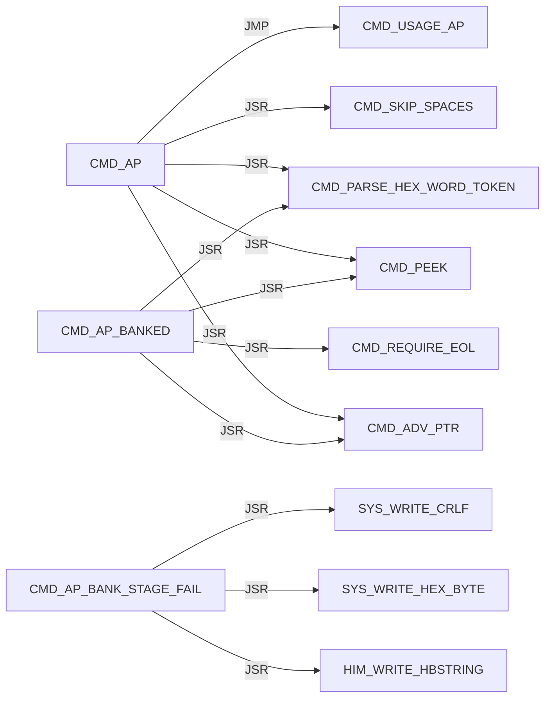

Panel 2 of 3: `CMD_AP_BANKED` through `CMD_AP_LOAD_REQUEST`.

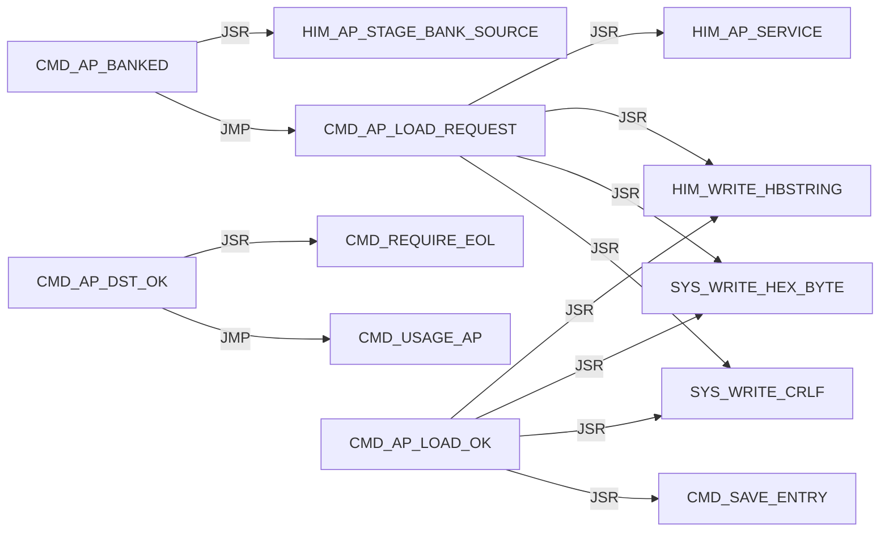

Panel 3 of 3: `CMD_AP_SRC_OK` through `CMD_AP_SRC_OK`.

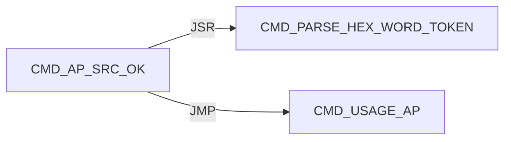

#### CMD / D

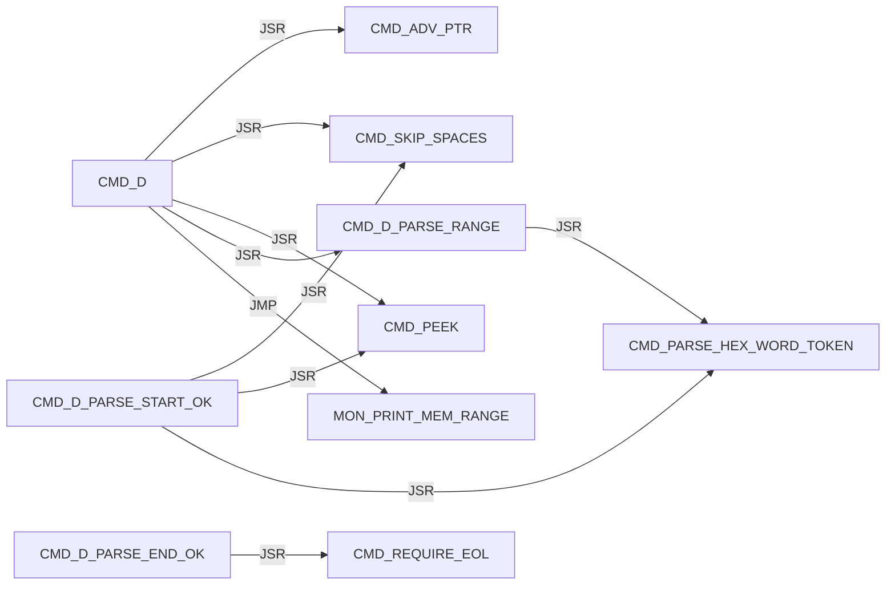

#### CMD / DISPATCH

Panel 1 of 2: `CMD_DISPATCH_DONE` through `CMD_DISPATCH_SCAN_MISS`.

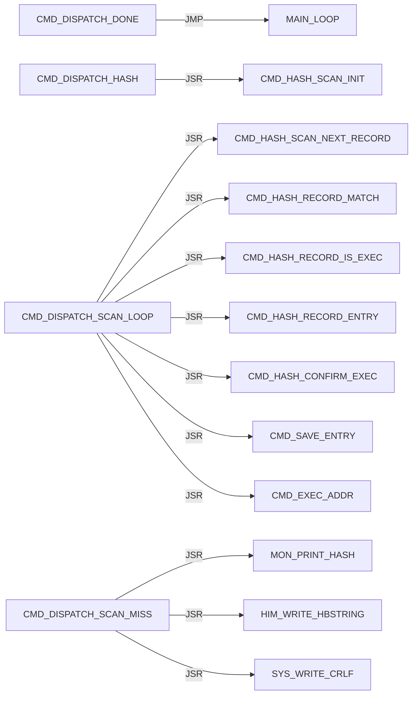

Panel 2 of 2: `CMD_DISPATCH_SCAN_MISS` through `CMD_DISPATCH_SCAN_NEXT`.

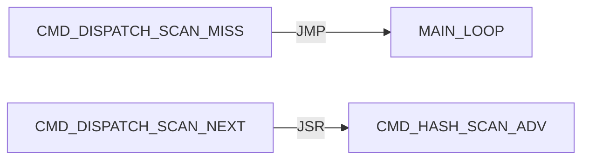

#### CMD / EXEC

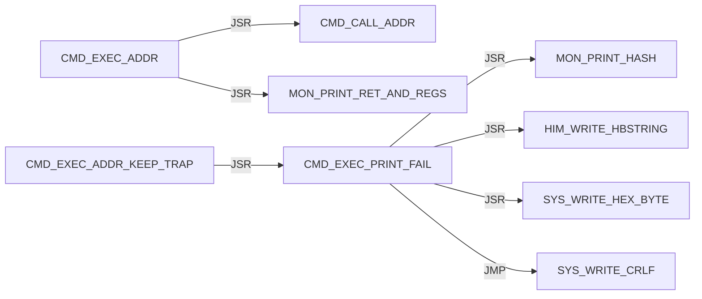

#### CMD / G

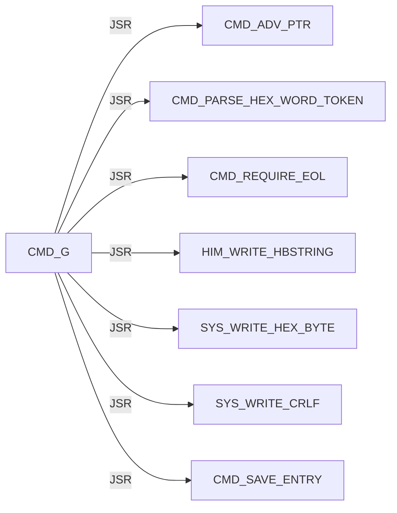

#### CMD / HASH

Panel 1 of 7: `CMD_HASH_CONFIRM_ADDR` through `CMD_HASH_FIND_LOOP`.

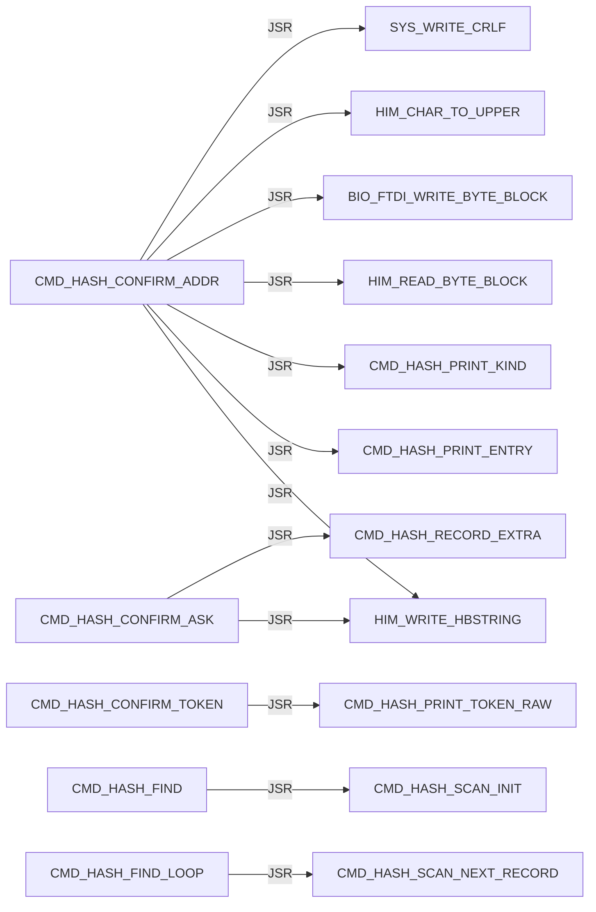

Panel 2 of 7: `CMD_HASH_FIND_LOOP` through `CMD_HASH_INFO_FOUND`.

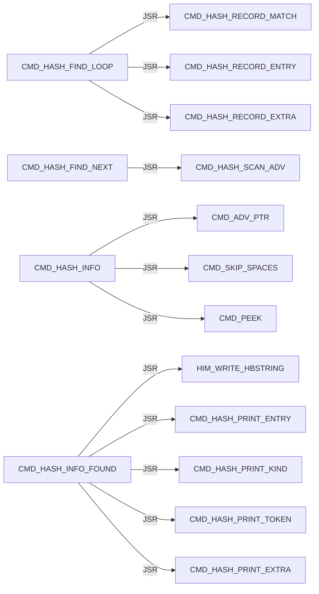

Panel 3 of 7: `CMD_HASH_INFO_FOUND` through `CMD_HASH_INFO_LOOKUP`.

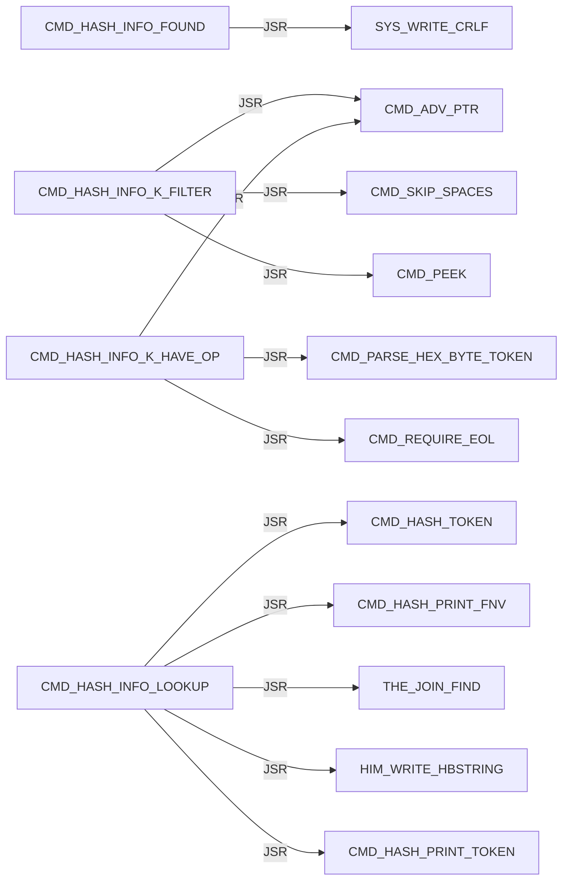

Panel 4 of 7: `CMD_HASH_INFO_LOOKUP` through `CMD_HASH_PRINT_EXTRA`.

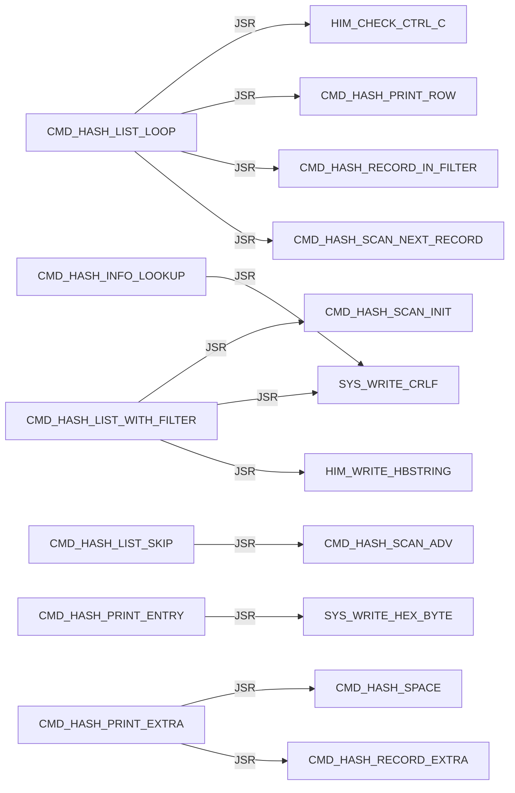

Panel 5 of 7: `CMD_HASH_PRINT_EXTRA` through `CMD_HASH_PRINT_TOKEN`.

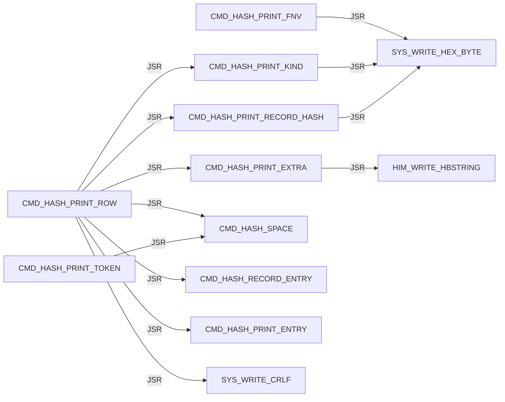

Panel 6 of 7: `CMD_HASH_PRINT_TOKEN_LOOP` through `CMD_HASH_TOKEN_LOOP`.

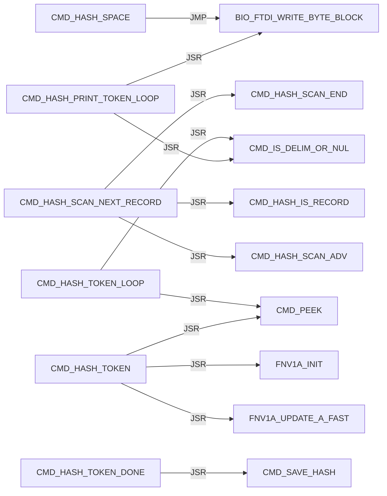

Panel 7 of 7: `CMD_HASH_TOKEN_LOOP` through `CMD_HASH_USAGE`.

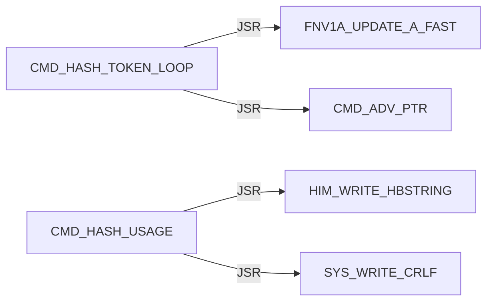

#### CMD / HELP


#### CMD / L

Panel 1 of 2: `CMD_L` through `CMD_L_PARSE_OK`.

```mermaid
flowchart LR
    N0["CMD_L"] -->|JSR| N1["CMD_ADV_PTR"]
    N0["CMD_L"] -->|JSR| N2["CMD_REQUIRE_EOL"]
    N0["CMD_L"] -->|JMP| N3["CMD_USAGE_L"]
    N4["CMD_L_ARGS_OK"] -->|JSR| N5["DBG_CLEAR_ALL"]
    N4["CMD_L_ARGS_OK"] -->|JSR| N6["HIM_WRITE_HBSTRING"]
    N4["CMD_L_ARGS_OK"] -->|JSR| N7["SYS_WRITE_CRLF"]
    N8["CMD_L_HAVE_LINE"] -->|JSR| N9["CMD_PEEK"]
    N8["CMD_L_HAVE_LINE"] -->|JSR| N10["L_PARSE_RECORD"]
    N8["CMD_L_HAVE_LINE"] -->|JSR| N11["CMD_L_PRINT_FAIL"]
    N8["CMD_L_HAVE_LINE"] -->|JMP| N12["CMD_L_FAIL_EXIT"]
    N13["CMD_L_PARSE_OK"] -->|JSR| N6["HIM_WRITE_HBSTRING"]
    N13["CMD_L_PARSE_OK"] -->|JSR| N14["SYS_WRITE_HEX_BYTE"]
```

Panel 2 of 2: `CMD_L_PARSE_OK` through `CMD_L_READ_LOOP`.

```mermaid
flowchart LR
    N0["CMD_L_PARSE_OK"] -->|JSR| N1["SYS_WRITE_CRLF"]
    N2["CMD_L_PRINT_FAIL"] -->|JSR| N3["HIM_WRITE_HBSTRING"]
    N2["CMD_L_PRINT_FAIL"] -->|JSR| N4["SYS_WRITE_HEX_BYTE"]
    N2["CMD_L_PRINT_FAIL"] -->|JMP| N1["SYS_WRITE_CRLF"]
    N5["CMD_L_READ_LOOP"] -->|JSR| N6["HIM_READ_LINE_UPPER"]
    N5["CMD_L_READ_LOOP"] -->|JSR| N3["HIM_WRITE_HBSTRING"]
    N5["CMD_L_READ_LOOP"] -->|JSR| N4["SYS_WRITE_HEX_BYTE"]
    N5["CMD_L_READ_LOOP"] -->|JSR| N1["SYS_WRITE_CRLF"]
```

#### CMD / M

```mermaid
flowchart LR
    N0["CMD_M"] -->|JSR| N1["CMD_ADV_PTR"]
    N0["CMD_M"] -->|JSR| N2["CMD_PARSE_RANGE_REQUIRED"]
    N0["CMD_M"] -->|JSR| N3["MON_MODIFY_RANGE_WRITABLE"]
    N0["CMD_M"] -->|JSR| N4["MON_MODIFY_RANGE"]
    N5["CMD_M_PROTECT"] -->|JSR| N6["HIM_WRITE_HBSTRING"]
    N5["CMD_M_PROTECT"] -->|JSR| N7["SYS_WRITE_HEX_BYTE"]
    N5["CMD_M_PROTECT"] -->|JSR| N8["SYS_WRITE_CRLF"]
```

#### CMD / PARSE

Panel 1 of 2: `CMD_PARSE_HEX_BYTE_TOKEN` through `CMD_PARSE_RANGE_PLUS`.

```mermaid
flowchart LR
    N0["CMD_PARSE_HEX_BYTE_TOKEN"] -->|JSR| N1["CMD_PARSE_HEX_WORD_TOKEN"]
    N2["CMD_PARSE_HEX_WORD_DONE"] -->|JSR| N3["CMD_PEEK"]
    N2["CMD_PARSE_HEX_WORD_DONE"] -->|JSR| N4["CMD_IS_DELIM_OR_NUL"]
    N5["CMD_PARSE_HEX_WORD_LOOP"] -->|JSR| N3["CMD_PEEK"]
    N5["CMD_PARSE_HEX_WORD_LOOP"] -->|JSR| N6["CMD_HEX_ASCII_TO_NIBBLE"]
    N5["CMD_PARSE_HEX_WORD_LOOP"] -->|JSR| N7["CMD_ADV_PTR"]
    N1["CMD_PARSE_HEX_WORD_TOKEN"] -->|JSR| N8["CMD_SKIP_SPACES"]
    N1["CMD_PARSE_HEX_WORD_TOKEN"] -->|JSR| N9["CMD_SKIP_OPTIONAL_DOLLAR"]
    N10["CMD_PARSE_RANGE_COUNT_OK"] -->|JMP| N11["CMD_PARSE_RANGE_FAIL"]
    N12["CMD_PARSE_RANGE_HAVE_END"] -->|JSR| N13["CMD_REQUIRE_EOL"]
    N14["CMD_PARSE_RANGE_PLUS"] -->|JSR| N7["CMD_ADV_PTR"]
    N14["CMD_PARSE_RANGE_PLUS"] -->|JSR| N1["CMD_PARSE_HEX_WORD_TOKEN"]
```

Panel 2 of 2: `CMD_PARSE_RANGE_PLUS` through `CMD_PARSE_RANGE_START_OK`.

```mermaid
flowchart LR
    N0["CMD_PARSE_RANGE_PLUS"] -->|JMP| N1["CMD_PARSE_RANGE_FAIL"]
    N2["CMD_PARSE_RANGE_REQUIRED"] -->|JSR| N3["CMD_PARSE_HEX_WORD_TOKEN"]
    N2["CMD_PARSE_RANGE_REQUIRED"] -->|JMP| N1["CMD_PARSE_RANGE_FAIL"]
    N4["CMD_PARSE_RANGE_START_OK"] -->|JSR| N5["CMD_SKIP_SPACES"]
    N4["CMD_PARSE_RANGE_START_OK"] -->|JSR| N6["CMD_PEEK"]
    N4["CMD_PARSE_RANGE_START_OK"] -->|JSR| N3["CMD_PARSE_HEX_WORD_TOKEN"]
    N4["CMD_PARSE_RANGE_START_OK"] -->|JMP| N1["CMD_PARSE_RANGE_FAIL"]
```

#### CMD / Q

```mermaid
flowchart LR
    N0["CMD_Q"] -->|JMP| N1["MON_REENTER"]
```

#### CMD / R

```mermaid
flowchart LR
    N0["CMD_R"] -->|JSR| N1["MON_CTX_REQUIRE_VALID"]
    N2["CMD_R_HAVE_CTX"] -->|JSR| N3["CMD_ADV_PTR"]
    N2["CMD_R_HAVE_CTX"] -->|JSR| N4["MON_CTX_PARSE_ASSIGN_LIST"]
    N2["CMD_R_HAVE_CTX"] -->|JSR| N5["MON_PRINT_STOP_AND_REGS"]
```

#### CMD / REQUIRE

```mermaid
flowchart LR
    N0["CMD_REQUIRE_EOL"] -->|JSR| N1["CMD_SKIP_SPACES"]
    N0["CMD_REQUIRE_EOL"] -->|JSR| N2["CMD_PEEK"]
```

#### CMD / SKIP

```mermaid
flowchart LR
    N0["CMD_SKIP_OPTIONAL_DOLLAR"] -->|JSR| N1["CMD_PEEK"]
    N0["CMD_SKIP_OPTIONAL_DOLLAR"] -->|JSR| N2["CMD_ADV_PTR"]
    N3["CMD_SKIP_SPACES"] -->|JSR| N1["CMD_PEEK"]
    N4["CMD_SKIP_SPACES_ADV"] -->|JSR| N2["CMD_ADV_PTR"]
```

#### CMD / UNKNOWN

```mermaid
flowchart LR
    N0["CMD_UNKNOWN"] -->|JSR| N1["HIM_WRITE_HBSTRING"]
    N0["CMD_UNKNOWN"] -->|JSR| N2["SYS_WRITE_CRLF"]
    N0["CMD_UNKNOWN"] -->|JMP| N3["MAIN_LOOP"]
```

#### CMD / USAGE

Panel 1 of 2: `CMD_USAGE_AP` through `CMD_USAGE_R`.

```mermaid
flowchart LR
    N0["CMD_USAGE_AP"] -->|JSR| N1["HIM_WRITE_HBSTRING"]
    N0["CMD_USAGE_AP"] -->|JSR| N2["SYS_WRITE_CRLF"]
    N3["CMD_USAGE_D"] -->|JSR| N1["HIM_WRITE_HBSTRING"]
    N3["CMD_USAGE_D"] -->|JSR| N2["SYS_WRITE_CRLF"]
    N4["CMD_USAGE_G"] -->|JSR| N1["HIM_WRITE_HBSTRING"]
    N4["CMD_USAGE_G"] -->|JSR| N2["SYS_WRITE_CRLF"]
    N5["CMD_USAGE_L"] -->|JSR| N1["HIM_WRITE_HBSTRING"]
    N5["CMD_USAGE_L"] -->|JSR| N2["SYS_WRITE_CRLF"]
    N6["CMD_USAGE_M"] -->|JSR| N1["HIM_WRITE_HBSTRING"]
    N6["CMD_USAGE_M"] -->|JSR| N2["SYS_WRITE_CRLF"]
    N7["CMD_USAGE_R"] -->|JSR| N1["HIM_WRITE_HBSTRING"]
    N7["CMD_USAGE_R"] -->|JSR| N2["SYS_WRITE_CRLF"]
```

Panel 2 of 2: `CMD_USAGE_X` through `CMD_USAGE_X`.

```mermaid
flowchart LR
    N0["CMD_USAGE_X"] -->|JSR| N1["HIM_WRITE_HBSTRING"]
    N0["CMD_USAGE_X"] -->|JSR| N2["SYS_WRITE_CRLF"]
```

#### CMD / X

```mermaid
flowchart LR
    N0["CMD_X"] -->|JSR| N1["MON_CTX_REQUIRE_VALID"]
    N2["CMD_X_HAVE_CTX"] -->|JSR| N3["CMD_ADV_PTR"]
    N2["CMD_X_HAVE_CTX"] -->|JSR| N4["MON_CTX_PARSE_ASSIGN_LIST"]
    N2["CMD_X_HAVE_CTX"] -->|JSR| N5["HIM_WRITE_HBSTRING"]
    N2["CMD_X_HAVE_CTX"] -->|JSR| N6["SYS_WRITE_HEX_BYTE"]
    N2["CMD_X_HAVE_CTX"] -->|JSR| N7["SYS_WRITE_CRLF"]
    N2["CMD_X_HAVE_CTX"] -->|JMP| N8["MON_CTX_RESUME_RTI"]
```

#### ENTRY / unprefixed

```mermaid
flowchart LR
    N0["START"] -->|JMP| N1["HIMON_START_BODY"]
```

#### FNV1A

```mermaid
flowchart LR
    N0["FNV1A_MUL_PRIME"] -->|JSR| N1["MATH_COPY_HASH_TO_TERM"]
    N0["FNV1A_MUL_PRIME"] -->|JSR| N2["MATH_SHLADD_TERM_N"]
    N0["FNV1A_MUL_PRIME"] -->|JMP| N3["MATH_ADD_TERM1_TO_HASH3"]
    N4["FNV1A_MUL_PRIME_FAST"] -->|JSR| N1["MATH_COPY_HASH_TO_TERM"]
    N4["FNV1A_MUL_PRIME_FAST"] -->|JSR| N5["MATH_ADD_TERM_TO_HASH"]
    N4["FNV1A_MUL_PRIME_FAST"] -->|JMP| N3["MATH_ADD_TERM1_TO_HASH3"]
    N6["FNV1A_UPDATE_A"] -->|JMP| N0["FNV1A_MUL_PRIME"]
    N7["FNV1A_UPDATE_A_FAST"] -->|JMP| N4["FNV1A_MUL_PRIME_FAST"]
```

#### HIM / AP

Panel 1 of 10: `HIM_AP_ADVANCE_A` through `HIM_AP_LINK_DONE`.

```mermaid
flowchart LR
    N0["HIM_AP_ADVANCE_A"] -->|JSR| N1["HIM_AP_NEED_A"]
    N2["HIM_AP_BANK_STAGE_CODE"] -->|JSR| N3["STR8_BANK_SELECT_SERVICE"]
    N2["HIM_AP_BANK_STAGE_CODE"] -->|JSR| N4["STR8_BANK_SELECT_RAM"]
    N5["HIM_AP_CHECK_RELOC_COUNT_OK"] -->|JMP| N6["HIM_AP_BAD_LINE"]
    N7["HIM_AP_CHECK_RELOC_REC"] -->|JMP| N6["HIM_AP_BAD_LINE"]
    N8["HIM_AP_FIND_HOLE_LOOP"] -->|JSR| N9["HIM_AP_HOLE_AT_SCAN"]
    N10["HIM_AP_FIND_HOLE_NEXT"] -->|JMP| N11["HIM_AP_BAD_RANGE"]
    N12["HIM_AP_IMPORT_LINK"] -->|JSR| N13["HIM_AP_LINK_RELOAD_REL_PTR"]
    N14["HIM_AP_LINK_CAPTURE_ROW_X"] -->|JSR| N15["HIM_AP_RELOC_KIND_X"]
    N14["HIM_AP_LINK_CAPTURE_ROW_X"] -->|JSR| N16["HIM_AP_RELOC_SITE_LO_X"]
    N14["HIM_AP_LINK_CAPTURE_ROW_X"] -->|JSR| N17["HIM_AP_RELOC_SITE_HI_X"]
    N18["HIM_AP_LINK_DONE"] -->|JSR| N19["HIM_AP_LINK_RESTORE_COUNTS"]
```

Panel 2 of 10: `HIM_AP_LINK_FAIL` through `HIM_AP_LINK_PATCH`.

```mermaid
flowchart LR
    N0["HIM_AP_LINK_FAIL"] -->|JSR| N1["HIM_AP_LINK_RESTORE_COUNTS"]
    N2["HIM_AP_LINK_HASH_CODE_UPDATE"] -->|JSR| N3["FNV1A_UPDATE_A_FAST"]
    N4["HIM_AP_LINK_HASH_LOOP"] -->|JSR| N5["HIM_AP_LINK_UNPACK_NEXT3"]
    N4["HIM_AP_LINK_HASH_LOOP"] -->|JSR| N6["HIM_AP_LINK_HASH_CODE_A"]
    N7["HIM_AP_LINK_HASH_PACK_PTR_OK"] -->|JSR| N8["FNV1A_INIT"]
    N9["HIM_AP_LINK_HASH_SLOT_X"] -->|JSR| N10["HIM_AP_LINK_IMPORT_ROW_PTR_X"]
    N11["HIM_AP_LINK_IMPORT_ROW_LOOP"] -->|JSR| N12["HIM_AP_LINK_IMPORT_ROW_BYTES_A"]
    N13["HIM_AP_LINK_PATCH"] -->|JSR| N14["HIM_AP_LINK_RELOAD_REL_PTR"]
    N13["HIM_AP_LINK_PATCH"] -->|JSR| N15["HIM_AP_RELOC_KIND_X"]
    N13["HIM_AP_LINK_PATCH"] -->|JSR| N16["HIM_AP_IMPORT_KIND_A"]
    N13["HIM_AP_LINK_PATCH"] -->|JSR| N17["HIM_AP_LINK_CAPTURE_ROW_X"]
    N13["HIM_AP_LINK_PATCH"] -->|JSR| N18["HIM_AP_LINK_RESOLVE_ROW_X"]
```

Panel 3 of 10: `HIM_AP_LINK_PATCH` through `HIM_AP_LOAD_BASE_GE_20`.

```mermaid
flowchart LR
    N0["HIM_AP_LINK_PATCH"] -->|JSR| N1["HIM_AP_LINK_PATCH_CAPTURED"]
    N2["HIM_AP_LINK_RESOLVE_ROW_X"] -->|JSR| N3["HIM_AP_RELOC_TARGET_HI_X"]
    N2["HIM_AP_LINK_RESOLVE_ROW_X"] -->|JSR| N4["HIM_AP_RELOC_TARGET_LO_X"]
    N2["HIM_AP_LINK_RESOLVE_ROW_X"] -->|JSR| N5["HIM_AP_LINK_RESOLVE_SLOT_X"]
    N5["HIM_AP_LINK_RESOLVE_SLOT_X"] -->|JSR| N6["HIM_AP_LINK_HASH_SLOT_X"]
    N5["HIM_AP_LINK_RESOLVE_SLOT_X"] -->|JSR| N7["THE_JOIN_EXEC_XY"]
    N8["HIM_AP_LINK_VALIDATE"] -->|JSR| N9["HIM_AP_LINK_RELOAD_REL_PTR"]
    N8["HIM_AP_LINK_VALIDATE"] -->|JSR| N10["HIM_AP_RELOC_KIND_X"]
    N8["HIM_AP_LINK_VALIDATE"] -->|JSR| N11["HIM_AP_IMPORT_KIND_A"]
    N8["HIM_AP_LINK_VALIDATE"] -->|JSR| N12["HIM_AP_RELOC_SITE_OK_X"]
    N8["HIM_AP_LINK_VALIDATE"] -->|JSR| N2["HIM_AP_LINK_RESOLVE_ROW_X"]
    N13["HIM_AP_LOAD_BASE_GE_20"] -->|JMP| N14["HIM_AP_BAD_RANGE"]
```

Panel 4 of 10: `HIM_AP_LOAD_BASE_LT_50` through `HIM_AP_LOAD_PATCH_ROW`.

```mermaid
flowchart LR
    N0["HIM_AP_LOAD_BASE_LT_50"] -->|JMP| N1["HIM_AP_BAD_RANGE"]
    N2["HIM_AP_LOAD_LAST_NO_CARRY"] -->|JMP| N1["HIM_AP_BAD_RANGE"]
    N3["HIM_AP_LOAD_LEN_NONZERO"] -->|JMP| N1["HIM_AP_BAD_RANGE"]
    N4["HIM_AP_LOAD_NO_OVERLAP"] -->|JSR| N5["HIM_AP_COPY_BODY_TO_DST"]
    N4["HIM_AP_LOAD_NO_OVERLAP"] -->|JSR| N6["HIM_AP_IMPORT_LINK"]
    N7["HIM_AP_LOAD_OVERLAP_BAD"] -->|JMP| N1["HIM_AP_BAD_RANGE"]
    N8["HIM_AP_LOAD_PARSED"] -->|JSR| N9["HIM_AP_LOAD_RANGE_OK"]
    N10["HIM_AP_LOAD_PATCH_LOOP"] -->|JSR| N11["HIM_AP_RELOC_KIND_X"]
    N10["HIM_AP_LOAD_PATCH_LOOP"] -->|JSR| N12["HIM_AP_INTERNAL_KIND_A"]
    N10["HIM_AP_LOAD_PATCH_LOOP"] -->|JSR| N13["HIM_AP_IMPORT_KIND_A"]
    N10["HIM_AP_LOAD_PATCH_LOOP"] -->|JMP| N14["HIM_AP_BAD_FIX"]
    N15["HIM_AP_LOAD_PATCH_ROW"] -->|JSR| N16["HIM_AP_RELOC_SITE_OK_X"]
```

Panel 5 of 10: `HIM_AP_LOAD_PATCH_SITE_OK` through `HIM_AP_PARSE_HEADER_RANGE`.

```mermaid
flowchart LR
    N0["HIM_AP_LOAD_PATCH_SITE_OK"] -->|JSR| N1["HIM_AP_RELOC_PATCH_ROW_X"]
    N2["HIM_AP_LOAD_RANGE_OK"] -->|JMP| N3["HIM_AP_BAD_RANGE"]
    N4["HIM_AP_NEED_A"] -->|JMP| N3["HIM_AP_BAD_RANGE"]
    N5["HIM_AP_PARSE_BODY"] -->|JSR| N4["HIM_AP_NEED_A"]
    N6["HIM_AP_PARSE_BODY_HDR_ROOM"] -->|JMP| N7["HIM_AP_BAD_LINE"]
    N8["HIM_AP_PARSE_BODY_LEFT_LO_OK"] -->|JMP| N7["HIM_AP_BAD_LINE"]
    N9["HIM_AP_PARSE_BODY_LEFT_OK"] -->|JMP| N7["HIM_AP_BAD_LINE"]
    N10["HIM_AP_PARSE_BODY_SAVE"] -->|JMP| N7["HIM_AP_BAD_LINE"]
    N11["HIM_AP_PARSE_BODY_TAG_OK"] -->|JSR| N12["HIM_AP_ADVANCE_A"]
    N13["HIM_AP_PARSE_EXPORT"] -->|JSR| N14["HIM_AP_TAG_LEN"]
    N15["HIM_AP_PARSE_EXPORT_TAG_OK"] -->|JSR| N12["HIM_AP_ADVANCE_A"]
    N16["HIM_AP_PARSE_HEADER_RANGE"] -->|JMP| N7["HIM_AP_BAD_LINE"]
```

Panel 6 of 10: `HIM_AP_PARSE_IMPORT` through `HIM_AP_PARSE_RELOC_TAG_OK`.

```mermaid
flowchart LR
    N0["HIM_AP_PARSE_IMPORT"] -->|JSR| N1["HIM_AP_TAG_LEN"]
    N2["HIM_AP_PARSE_IMPORT_LEN_OK"] -->|JSR| N3["HIM_AP_NEED_A"]
    N4["HIM_AP_PARSE_IMPORT_ROOM_OK"] -->|JSR| N5["HIM_AP_ADVANCE_A"]
    N6["HIM_AP_PARSE_IMPORT_TAG_OK"] -->|JMP| N7["HIM_AP_BAD_LINE"]
    N8["HIM_AP_PARSE_LEN_NONZERO"] -->|JSR| N9["HIM_AP_SOURCE_RANGE_OK"]
    N10["HIM_AP_PARSE_MIN"] -->|JSR| N9["HIM_AP_SOURCE_RANGE_OK"]
    N11["HIM_AP_PARSE_RANGE_SAFE"] -->|JMP| N7["HIM_AP_BAD_LINE"]
    N12["HIM_AP_PARSE_RELOC"] -->|JSR| N1["HIM_AP_TAG_LEN"]
    N13["HIM_AP_PARSE_RELOC_LEN_OK"] -->|JSR| N3["HIM_AP_NEED_A"]
    N14["HIM_AP_PARSE_RELOC_ROOM_OK"] -->|JSR| N15["HIM_AP_CHECK_RELOC_REC"]
    N16["HIM_AP_PARSE_RELOC_SHAPE_OK"] -->|JSR| N5["HIM_AP_ADVANCE_A"]
    N17["HIM_AP_PARSE_RELOC_TAG_OK"] -->|JMP| N7["HIM_AP_BAD_LINE"]
```

Panel 7 of 10: `HIM_AP_PARSE_SEAL` through `HIM_AP_RELOC_SITE_HAVE_ADD`.

```mermaid
flowchart LR
    N0["HIM_AP_PARSE_SEAL"] -->|JSR| N1["HIM_AP_TAG_LEN"]
    N2["HIM_AP_PARSE_SEAL_LEN_OK"] -->|JSR| N3["HIM_AP_ADVANCE_A"]
    N4["HIM_AP_PARSE_SEAL_TAG_OK"] -->|JMP| N5["HIM_AP_BAD_LINE"]
    N6["HIM_AP_PARSE_SIG0_OK"] -->|JMP| N5["HIM_AP_BAD_LINE"]
    N7["HIM_AP_PARSE_SIG1_OK"] -->|JMP| N5["HIM_AP_BAD_LINE"]
    N8["HIM_AP_PARSE_VER_OK"] -->|JMP| N5["HIM_AP_BAD_LINE"]
    N9["HIM_AP_RELOC_PATCH_ROW_X"] -->|JSR| N10["HIM_AP_RELOC_SITE_LO_X"]
    N9["HIM_AP_RELOC_PATCH_ROW_X"] -->|JSR| N11["HIM_AP_RELOC_SITE_HI_X"]
    N9["HIM_AP_RELOC_PATCH_ROW_X"] -->|JSR| N12["HIM_AP_RELOC_TARGET_LO_X"]
    N9["HIM_AP_RELOC_PATCH_ROW_X"] -->|JSR| N13["HIM_AP_RELOC_TARGET_HI_X"]
    N14["HIM_AP_RELOC_SITE_HAVE_ADD"] -->|JSR| N10["HIM_AP_RELOC_SITE_LO_X"]
    N14["HIM_AP_RELOC_SITE_HAVE_ADD"] -->|JSR| N11["HIM_AP_RELOC_SITE_HI_X"]
```

Panel 8 of 10: `HIM_AP_RELOC_SITE_HAVE_ADD` through `HIM_AP_SOURCE_BASE_GE_20`.

```mermaid
flowchart LR
    N0["HIM_AP_RELOC_SITE_HAVE_ADD"] -->|JMP| N1["HIM_AP_BAD_FIX"]
    N2["HIM_AP_RELOC_SITE_HI_EQ"] -->|JMP| N1["HIM_AP_BAD_FIX"]
    N3["HIM_AP_RELOC_SITE_NO_CARRY"] -->|JMP| N1["HIM_AP_BAD_FIX"]
    N4["HIM_AP_RELOC_SITE_OK_X"] -->|JSR| N5["HIM_AP_RELOC_KIND_X"]
    N6["HIM_AP_SERVICE"] -->|JMP| N7["HIM_AP_SERVICE_SUGGEST"]
    N8["HIM_AP_SERVICE_BAD_OP"] -->|JMP| N9["HIM_AP_BAD_LINE"]
    N10["HIM_AP_SERVICE_LINK"] -->|JMP| N11["HIM_AP_IMPORT_LINK"]
    N12["HIM_AP_SERVICE_LOAD"] -->|JSR| N13["HIM_AP_PARSE_MIN"]
    N14["HIM_AP_SERVICE_PARSE"] -->|JMP| N13["HIM_AP_PARSE_MIN"]
    N7["HIM_AP_SERVICE_SUGGEST"] -->|JSR| N13["HIM_AP_PARSE_MIN"]
    N15["HIM_AP_SOURCE_BASE_BAD"] -->|JMP| N16["HIM_AP_BAD_RANGE"]
    N17["HIM_AP_SOURCE_BASE_GE_20"] -->|JMP| N16["HIM_AP_BAD_RANGE"]
```

Panel 9 of 10: `HIM_AP_SOURCE_BASE_GE_80` through `HIM_AP_TAG_LEN_ROOM_OK`.

```mermaid
flowchart LR
    N0["HIM_AP_SOURCE_BASE_GE_80"] -->|JMP| N1["HIM_AP_BAD_RANGE"]
    N2["HIM_AP_SOURCE_BASE_SAFE"] -->|JMP| N1["HIM_AP_BAD_RANGE"]
    N3["HIM_AP_SOURCE_LAST_NO_CARRY"] -->|JMP| N1["HIM_AP_BAD_RANGE"]
    N4["HIM_AP_SOURCE_LEN_NONZERO"] -->|JSR| N5["HIM_AP_SOURCE_BASE_OK"]
    N6["HIM_AP_SOURCE_RAM_RANGE"] -->|JMP| N1["HIM_AP_BAD_RANGE"]
    N7["HIM_AP_SOURCE_RANGE_OK"] -->|JMP| N1["HIM_AP_BAD_RANGE"]
    N8["HIM_AP_SOURCE_STAGE_RANGE"] -->|JMP| N1["HIM_AP_BAD_RANGE"]
    N9["HIM_AP_STAGE_BANK_BAD"] -->|JMP| N1["HIM_AP_BAD_RANGE"]
    N10["HIM_AP_STAGE_BANK_SOURCE"] -->|JSR| N11["HIM_AP_BANK_STAGE_RAM"]
    N12["HIM_AP_SUGGEST_PARSED"] -->|JSR| N13["HIM_AP_FIND_HOLE"]
    N14["HIM_AP_TAG_LEN"] -->|JSR| N15["HIM_AP_NEED_A"]
    N16["HIM_AP_TAG_LEN_ROOM_OK"] -->|JMP| N17["HIM_AP_BAD_LINE"]
```

Panel 10 of 10: `HIM_AP_TAG_LEN_TAG_OK` through `HIM_AP_TAG_LEN_TAG_OK`.

```mermaid
flowchart LR
    N0["HIM_AP_TAG_LEN_TAG_OK"] -->|JMP| N1["HIM_AP_ADVANCE_A"]
```

#### HIM / CHECK

```mermaid
flowchart LR
    N0["HIM_CHECK_CTRL_C"] -->|JSR| N1["BIO_FTDI_READ_BYTE_NONBLOCK"]
```

#### HIM / FLASH

```mermaid
flowchart LR
    N0["HIM_FLASH_INSTALL_BAD_JMP"] -->|JMP| N1["HIM_FLASH_INSTALL_BAD"]
    N2["HIM_FLASH_INSTALL_LOOP"] -->|JSR| N3["L_FLASH_SET_PTR"]
    N2["HIM_FLASH_INSTALL_LOOP"] -->|JSR| N4["FLASH_WRITE_BYTE_AXY"]
```

#### HIM / PACK40

```mermaid
flowchart LR
    N0["HIM_PACK40_ASCII_TO_CODE"] -->|JSR| N1["HIM_CHAR_TO_UPPER"]
    N2["HIM_PACK40_PACK3"] -->|JSR| N3["HIM_PACK40_MUL40"]
    N2["HIM_PACK40_PACK3"] -->|JSR| N4["HIM_PACK40_ADD_A"]
```

#### HIM / READ

```mermaid
flowchart LR
    N0["HIM_READ_BYTE_HW"] -->|JSR| N1["BIO_FTDI_READ_BYTE_BLOCK"]
    N2["HIM_READ_LINE_ABORT"] -->|JSR| N3["SYS_WRITE_CRLF"]
    N4["HIM_READ_LINE_BS_DEC"] -->|JSR| N5["BIO_FTDI_WRITE_BYTE_BLOCK"]
    N6["HIM_READ_LINE_DONE"] -->|JSR| N3["SYS_WRITE_CRLF"]
    N7["HIM_READ_LINE_LOOP"] -->|JSR| N8["HIM_READ_BYTE_BLOCK"]
    N7["HIM_READ_LINE_LOOP"] -->|JSR| N9["HIM_CHAR_TO_UPPER"]
    N7["HIM_READ_LINE_LOOP"] -->|JSR| N10["CMD_ADV_PTR"]
    N7["HIM_READ_LINE_LOOP"] -->|JSR| N5["BIO_FTDI_WRITE_BYTE_BLOCK"]
```

#### HIM / WRITE

```mermaid
flowchart LR
    N0["HIM_WRITE_HBSTRING_LAST"] -->|JSR| N1["BIO_FTDI_WRITE_BYTE_BLOCK"]
    N2["HIM_WRITE_HBSTRING_LOOP"] -->|JSR| N1["BIO_FTDI_WRITE_BYTE_BLOCK"]
```

#### HIMON

```mermaid
flowchart LR
    N0["HIMON_START_BODY"] -->|JMP| N1["HIMON_WARM_START_BODY"]
    N1["HIMON_WARM_START_BODY"] -->|JSR| N2["DBG_CLEAR_ALL"]
    N1["HIMON_WARM_START_BODY"] -->|JMP| N3["MON_START_INIT"]
```

#### L

Panel 1 of 3: `L_NOTE_S1_ADDR_PRINT` through `L_PARSE_RECORD_HAVE_S`.

```mermaid
flowchart LR
    N0["L_NOTE_S1_ADDR_PRINT"] -->|JSR| N1["BIO_FTDI_WRITE_BYTE_BLOCK"]
    N0["L_NOTE_S1_ADDR_PRINT"] -->|JSR| N2["SYS_WRITE_HEX_BYTE"]
    N0["L_NOTE_S1_ADDR_PRINT"] -->|JSR| N3["SYS_WRITE_CRLF"]
    N4["L_PARSE_HEADER"] -->|JSR| N5["L_PARSE_HEX_BYTE_STRICT"]
    N4["L_PARSE_HEADER"] -->|JSR| N6["L_SUM_ADD_A"]
    N5["L_PARSE_HEX_BYTE_STRICT"] -->|JSR| N7["CMD_PEEK"]
    N5["L_PARSE_HEX_BYTE_STRICT"] -->|JSR| N8["CMD_HEX_ASCII_TO_NIBBLE"]
    N5["L_PARSE_HEX_BYTE_STRICT"] -->|JSR| N9["CMD_ADV_PTR"]
    N10["L_PARSE_RECORD"] -->|JSR| N7["CMD_PEEK"]
    N10["L_PARSE_RECORD"] -->|JMP| N11["L_PARSE_FAIL"]
    N12["L_PARSE_RECORD_BAD_KIND"] -->|JMP| N11["L_PARSE_FAIL"]
    N13["L_PARSE_RECORD_HAVE_S"] -->|JSR| N9["CMD_ADV_PTR"]
```

Panel 2 of 3: `L_PARSE_RECORD_HAVE_S` through `L_PARSE_S0_SKIP`.

```mermaid
flowchart LR
    N0["L_PARSE_RECORD_HAVE_S"] -->|JSR| N1["CMD_PEEK"]
    N0["L_PARSE_RECORD_HAVE_S"] -->|JMP| N2["L_PARSE_RECORD_S9"]
    N3["L_PARSE_RECORD_S0"] -->|JSR| N4["CMD_ADV_PTR"]
    N3["L_PARSE_RECORD_S0"] -->|JSR| N5["L_PARSE_HEADER"]
    N6["L_PARSE_RECORD_S1"] -->|JSR| N4["CMD_ADV_PTR"]
    N6["L_PARSE_RECORD_S1"] -->|JSR| N5["L_PARSE_HEADER"]
    N2["L_PARSE_RECORD_S9"] -->|JSR| N4["CMD_ADV_PTR"]
    N2["L_PARSE_RECORD_S9"] -->|JSR| N5["L_PARSE_HEADER"]
    N2["L_PARSE_RECORD_S9"] -->|JSR| N7["L_VERIFY_CHECKSUM_EOL"]
    N8["L_PARSE_S0_CHECK"] -->|JSR| N7["L_VERIFY_CHECKSUM_EOL"]
    N9["L_PARSE_S0_FAIL"] -->|JMP| N10["L_PARSE_FAIL"]
    N11["L_PARSE_S0_SKIP"] -->|JSR| N12["L_PARSE_HEX_BYTE_STRICT"]
```

Panel 3 of 3: `L_PARSE_S0_SKIP` through `L_VERIFY_CHECKSUM_EOL`.

```mermaid
flowchart LR
    N0["L_PARSE_S0_SKIP"] -->|JSR| N1["L_SUM_ADD_A"]
    N2["L_PARSE_S1_CHECK"] -->|JSR| N3["L_VERIFY_CHECKSUM_EOL"]
    N2["L_PARSE_S1_CHECK"] -->|JSR| N4["L_VALIDATE_RAM_SPAN"]
    N2["L_PARSE_S1_CHECK"] -->|JSR| N5["L_NOTE_S1_ADDR"]
    N6["L_PARSE_S1_DATA"] -->|JSR| N7["L_PARSE_HEX_BYTE_STRICT"]
    N6["L_PARSE_S1_DATA"] -->|JSR| N1["L_SUM_ADD_A"]
    N8["L_PARSE_S1_FAIL"] -->|JMP| N9["L_PARSE_FAIL"]
    N10["L_PARSE_S9_FAIL"] -->|JMP| N9["L_PARSE_FAIL"]
    N3["L_VERIFY_CHECKSUM_EOL"] -->|JSR| N7["L_PARSE_HEX_BYTE_STRICT"]
    N3["L_VERIFY_CHECKSUM_EOL"] -->|JSR| N11["CMD_PEEK"]
```

#### MAIN

```mermaid
flowchart LR
    N0["MAIN_HAVE_LINE"] -->|JSR| N1["CMD_SKIP_SPACES"]
    N0["MAIN_HAVE_LINE"] -->|JSR| N2["CMD_PEEK"]
    N0["MAIN_HAVE_LINE"] -->|JSR| N3["CMD_HASH_TOKEN"]
    N0["MAIN_HAVE_LINE"] -->|JMP| N4["CMD_DISPATCH_HASH"]
    N5["MAIN_LOOP"] -->|JSR| N6["HIM_WRITE_HBSTRING"]
    N5["MAIN_LOOP"] -->|JSR| N7["HIM_READ_LINE_ECHO_UPPER"]
    N5["MAIN_LOOP"] -->|JMP| N5["MAIN_LOOP"]
```

#### MATH

```mermaid
flowchart LR
    N0["MATH_SHLADD_TERM_N"] -->|JSR| N1["MATH_SHL_TERM_N"]
    N0["MATH_SHLADD_TERM_N"] -->|JMP| N2["MATH_ADD_TERM_TO_HASH"]
```

#### MON / AFTER

```mermaid
flowchart LR
    N0["MON_AFTER_BANNER"] -->|JSR| N1["MON_PRINT_STOP_AND_REGS"]
```

#### MON / BRK

```mermaid
flowchart LR
    N0["MON_BRK_TRAP"] -->|JSR| N1["DBG_HANDLE_BRK"]
    N0["MON_BRK_TRAP"] -->|JMP| N2["MON_REENTER"]
    N3["MON_BRK_TRAP_NORMAL"] -->|JMP| N2["MON_REENTER"]
```

#### MON / CLEAR

```mermaid
flowchart LR
    N0["MON_CLEAR_RAM_ZP"] -->|JMP| N1["MON_START_INIT"]
```

#### MON / COLD

```mermaid
flowchart LR
    N0["MON_COLD_RESET"] -->|JMP| N1["MON_CLEAR_RAM"]
```

#### MON / CTX

Panel 1 of 3: `MON_CTX_PARSE_A` through `MON_CTX_PARSE_P_OR_PC`.

```mermaid
flowchart LR
    N0["MON_CTX_PARSE_A"] -->|JSR| N1["CMD_ADV_PTR"]
    N0["MON_CTX_PARSE_A"] -->|JSR| N2["MON_PARSE_EQ"]
    N0["MON_CTX_PARSE_A"] -->|JSR| N3["CMD_PARSE_HEX_BYTE_TOKEN"]
    N4["MON_CTX_PARSE_ASSIGN"] -->|JSR| N5["CMD_PEEK"]
    N6["MON_CTX_PARSE_ASSIGN_LIST"] -->|JSR| N7["CMD_SKIP_SPACES"]
    N6["MON_CTX_PARSE_ASSIGN_LIST"] -->|JSR| N5["CMD_PEEK"]
    N8["MON_CTX_PARSE_ASSIGN_LOOP"] -->|JSR| N4["MON_CTX_PARSE_ASSIGN"]
    N8["MON_CTX_PARSE_ASSIGN_LOOP"] -->|JSR| N7["CMD_SKIP_SPACES"]
    N8["MON_CTX_PARSE_ASSIGN_LOOP"] -->|JSR| N5["CMD_PEEK"]
    N9["MON_CTX_PARSE_P_OR_PC"] -->|JSR| N1["CMD_ADV_PTR"]
    N9["MON_CTX_PARSE_P_OR_PC"] -->|JSR| N5["CMD_PEEK"]
    N9["MON_CTX_PARSE_P_OR_PC"] -->|JSR| N2["MON_PARSE_EQ"]
```

Panel 2 of 3: `MON_CTX_PARSE_P_OR_PC` through `MON_CTX_PARSE_Y`.

```mermaid
flowchart LR
    N0["MON_CTX_PARSE_P_OR_PC"] -->|JSR| N1["CMD_PARSE_HEX_BYTE_TOKEN"]
    N2["MON_CTX_PARSE_PC"] -->|JSR| N3["CMD_ADV_PTR"]
    N2["MON_CTX_PARSE_PC"] -->|JSR| N4["MON_PARSE_EQ"]
    N2["MON_CTX_PARSE_PC"] -->|JSR| N5["CMD_PARSE_HEX_WORD_TOKEN"]
    N6["MON_CTX_PARSE_S"] -->|JSR| N3["CMD_ADV_PTR"]
    N6["MON_CTX_PARSE_S"] -->|JSR| N4["MON_PARSE_EQ"]
    N6["MON_CTX_PARSE_S"] -->|JSR| N1["CMD_PARSE_HEX_BYTE_TOKEN"]
    N7["MON_CTX_PARSE_X"] -->|JSR| N3["CMD_ADV_PTR"]
    N7["MON_CTX_PARSE_X"] -->|JSR| N4["MON_PARSE_EQ"]
    N7["MON_CTX_PARSE_X"] -->|JSR| N1["CMD_PARSE_HEX_BYTE_TOKEN"]
    N8["MON_CTX_PARSE_Y"] -->|JSR| N3["CMD_ADV_PTR"]
    N8["MON_CTX_PARSE_Y"] -->|JSR| N4["MON_PARSE_EQ"]
```

Panel 3 of 3: `MON_CTX_PARSE_Y` through `MON_CTX_REQUIRE_VALID`.

```mermaid
flowchart LR
    N0["MON_CTX_PARSE_Y"] -->|JSR| N1["CMD_PARSE_HEX_BYTE_TOKEN"]
    N2["MON_CTX_REQUIRE_VALID"] -->|JSR| N3["HIM_WRITE_HBSTRING"]
    N2["MON_CTX_REQUIRE_VALID"] -->|JSR| N4["SYS_WRITE_CRLF"]
```

#### MON / INIT

```mermaid
flowchart LR
    N0["MON_INIT_COMMON"] -->|JSR| N1["MON_INIT_SERVICE_VECTORS"]
    N0["MON_INIT_COMMON"] -->|JSR| N2["SYS_INIT"]
    N0["MON_INIT_COMMON"] -->|JSR| N3["SYS_FLUSH_RX"]
    N0["MON_INIT_COMMON"] -->|JSR| N4["SYS_VEC_SET_NMI_XY"]
    N0["MON_INIT_COMMON"] -->|JSR| N5["SYS_VEC_SET_IRQ_BRK_XY"]
    N0["MON_INIT_COMMON"] -->|JSR| N6["SYS_VEC_SET_IRQ_NONBRK_XY"]
```

#### MON / MODIFY

```mermaid
flowchart LR
    N0["MON_MODIFY_BAD"] -->|JSR| N1["HIM_WRITE_HBSTRING"]
    N0["MON_MODIFY_BAD"] -->|JSR| N2["SYS_WRITE_CRLF"]
    N3["MON_MODIFY_LOOP"] -->|JSR| N4["MON_CURR_GT_END"]
    N3["MON_MODIFY_LOOP"] -->|JSR| N5["SYS_WRITE_HEX_BYTE"]
    N3["MON_MODIFY_LOOP"] -->|JSR| N6["BIO_FTDI_WRITE_BYTE_BLOCK"]
    N3["MON_MODIFY_LOOP"] -->|JSR| N7["HIM_READ_LINE_ECHO_UPPER"]
    N3["MON_MODIFY_LOOP"] -->|JSR| N8["CMD_SKIP_SPACES"]
    N3["MON_MODIFY_LOOP"] -->|JSR| N9["CMD_PEEK"]
    N3["MON_MODIFY_LOOP"] -->|JSR| N10["CMD_PARSE_HEX_BYTE_TOKEN"]
    N3["MON_MODIFY_LOOP"] -->|JSR| N11["CMD_REQUIRE_EOL"]
    N12["MON_MODIFY_NEXT"] -->|JSR| N13["CMD_INC_RANGE_TMP"]
```

#### MON / NMI

```mermaid
flowchart LR
    N0["MON_NMI_TRAP"] -->|JMP| N1["MON_REENTER"]
    N2["MON_NMI_TRAP_DEBOUNCE_CAPTURE"] -->|JSR| N3["MON_NMI_DEBOUNCE_DELAY"]
    N2["MON_NMI_TRAP_DEBOUNCE_CAPTURE"] -->|JMP| N1["MON_REENTER"]
```

#### MON / PARSE

```mermaid
flowchart LR
    N0["MON_PARSE_EQ"] -->|JSR| N1["CMD_PEEK"]
    N0["MON_PARSE_EQ"] -->|JSR| N2["CMD_ADV_PTR"]
```

#### MON / PRINT

Panel 1 of 5: `MON_PRINT_BOX` through `MON_PRINT_MEM_IO_SKIP`.

```mermaid
flowchart LR
    N0["MON_PRINT_BOX"] -->|JSR| N1["BIO_FTDI_WRITE_BYTE_BLOCK"]
    N0["MON_PRINT_BOX"] -->|JSR| N2["HIM_WRITE_HBSTRING"]
    N3["MON_PRINT_EXEC_ID"] -->|JMP| N4["MON_PRINT_HASH"]
    N5["MON_PRINT_FLAG_OUT"] -->|JSR| N1["BIO_FTDI_WRITE_BYTE_BLOCK"]
    N6["MON_PRINT_FLAGS"] -->|JSR| N7["MON_PRINT_FLAG_CHAR"]
    N6["MON_PRINT_FLAGS"] -->|JSR| N1["BIO_FTDI_WRITE_BYTE_BLOCK"]
    N4["MON_PRINT_HASH"] -->|JSR| N1["BIO_FTDI_WRITE_BYTE_BLOCK"]
    N4["MON_PRINT_HASH"] -->|JSR| N8["SYS_WRITE_HEX_BYTE"]
    N9["MON_PRINT_MEM_ABORT"] -->|JSR| N10["SYS_WRITE_CRLF"]
    N11["MON_PRINT_MEM_ASCII"] -->|JSR| N1["BIO_FTDI_WRITE_BYTE_BLOCK"]
    N12["MON_PRINT_MEM_ASCII_OUT"] -->|JSR| N1["BIO_FTDI_WRITE_BYTE_BLOCK"]
    N13["MON_PRINT_MEM_IO_SKIP"] -->|JSR| N14["MON_CURR_IS_IO"]
```

Panel 2 of 5: `MON_PRINT_MEM_IO_SKIP_YES` through `MON_PRINT_MEM_NOT_END`.

```mermaid
flowchart LR
    N0["MON_PRINT_MEM_IO_SKIP_YES"] -->|JSR| N1["SYS_PRINT_IO_SLOT_SKIP"]
    N2["MON_PRINT_MEM_LAST_LINE"] -->|JSR| N3["MON_PRINT_MEM_ASCII"]
    N4["MON_PRINT_MEM_LINE_LOOP"] -->|JSR| N5["HIM_CHECK_CTRL_C"]
    N4["MON_PRINT_MEM_LINE_LOOP"] -->|JSR| N6["MON_CURR_GT_END"]
    N4["MON_PRINT_MEM_LINE_LOOP"] -->|JSR| N7["MON_CURR_IS_IO"]
    N4["MON_PRINT_MEM_LINE_LOOP"] -->|JSR| N3["MON_PRINT_MEM_ASCII"]
    N4["MON_PRINT_MEM_LINE_LOOP"] -->|JSR| N8["SYS_WRITE_CRLF"]
    N4["MON_PRINT_MEM_LINE_LOOP"] -->|JMP| N9["MON_PRINT_MEM_NEXT_LINE"]
    N9["MON_PRINT_MEM_NEXT_LINE"] -->|JSR| N6["MON_CURR_GT_END"]
    N9["MON_PRINT_MEM_NEXT_LINE"] -->|JMP| N10["MON_PRINT_MEM_DONE"]
    N11["MON_PRINT_MEM_NOT_END"] -->|JSR| N12["CMD_INC_RANGE_TMP"]
    N11["MON_PRINT_MEM_NOT_END"] -->|JSR| N3["MON_PRINT_MEM_ASCII"]
```

Panel 3 of 5: `MON_PRINT_MEM_NOT_END` through `MON_PRINT_REGS_BODY`.

```mermaid
flowchart LR
    N0["MON_PRINT_MEM_NOT_END"] -->|JSR| N1["SYS_WRITE_CRLF"]
    N0["MON_PRINT_MEM_NOT_END"] -->|JMP| N2["MON_PRINT_MEM_NEXT_LINE"]
    N3["MON_PRINT_MEM_RANGE_ACTIVE"] -->|JSR| N4["MON_PRINT_MEM_IO_SKIP"]
    N3["MON_PRINT_MEM_RANGE_ACTIVE"] -->|JSR| N5["SYS_WRITE_HEX_BYTE"]
    N3["MON_PRINT_MEM_RANGE_ACTIVE"] -->|JSR| N6["BIO_FTDI_WRITE_BYTE_BLOCK"]
    N7["MON_PRINT_MEM_READ_BYTE"] -->|JSR| N6["BIO_FTDI_WRITE_BYTE_BLOCK"]
    N8["MON_PRINT_MEM_SPACE"] -->|JSR| N6["BIO_FTDI_WRITE_BYTE_BLOCK"]
    N8["MON_PRINT_MEM_SPACE"] -->|JSR| N5["SYS_WRITE_HEX_BYTE"]
    N9["MON_PRINT_REGS"] -->|JSR| N1["SYS_WRITE_CRLF"]
    N10["MON_PRINT_REGS_BODY"] -->|JSR| N11["HIM_WRITE_HBSTRING"]
    N10["MON_PRINT_REGS_BODY"] -->|JSR| N5["SYS_WRITE_HEX_BYTE"]
    N10["MON_PRINT_REGS_BODY"] -->|JSR| N6["BIO_FTDI_WRITE_BYTE_BLOCK"]
```

Panel 4 of 5: `MON_PRINT_REGS_BODY` through `MON_PRINT_STOP_DBG`.

```mermaid
flowchart LR
    N0["MON_PRINT_REGS_BODY"] -->|JSR| N1["MON_PRINT_FLAGS"]
    N0["MON_PRINT_REGS_BODY"] -->|JSR| N2["SYS_WRITE_CRLF"]
    N3["MON_PRINT_RET_AND_REGS"] -->|JSR| N2["SYS_WRITE_CRLF"]
    N3["MON_PRINT_RET_AND_REGS"] -->|JSR| N4["MON_PRINT_EXEC_ID"]
    N3["MON_PRINT_RET_AND_REGS"] -->|JSR| N5["HIM_WRITE_HBSTRING"]
    N3["MON_PRINT_RET_AND_REGS"] -->|JSR| N6["SYS_WRITE_HEX_BYTE"]
    N3["MON_PRINT_RET_AND_REGS"] -->|JMP| N0["MON_PRINT_REGS_BODY"]
    N7["MON_PRINT_STOP_AND_REGS"] -->|JSR| N2["SYS_WRITE_CRLF"]
    N7["MON_PRINT_STOP_AND_REGS"] -->|JSR| N5["HIM_WRITE_HBSTRING"]
    N8["MON_PRINT_STOP_BRK"] -->|JSR| N5["HIM_WRITE_HBSTRING"]
    N8["MON_PRINT_STOP_BRK"] -->|JSR| N6["SYS_WRITE_HEX_BYTE"]
    N9["MON_PRINT_STOP_DBG"] -->|JSR| N10["BIO_FTDI_WRITE_BYTE_BLOCK"]
```

Panel 5 of 5: `MON_PRINT_STOP_DBG` through `MON_PRINT_STOP_PC`.

```mermaid
flowchart LR
    N0["MON_PRINT_STOP_DBG"] -->|JSR| N1["SYS_WRITE_HEX_BYTE"]
    N0["MON_PRINT_STOP_DBG"] -->|JMP| N2["MON_PRINT_REGS_BODY"]
    N3["MON_PRINT_STOP_PC"] -->|JSR| N1["SYS_WRITE_HEX_BYTE"]
```

#### MON / REENTER

```mermaid
flowchart LR
    N0["MON_REENTER"] -->|JSR| N1["MON_INIT_COMMON"]
    N0["MON_REENTER"] -->|JMP| N2["MON_AFTER_BANNER"]
```

#### MON / START

```mermaid
flowchart LR
    N0["MON_START_INIT"] -->|JSR| N1["MON_INIT_COMMON"]
    N0["MON_START_INIT"] -->|JSR| N2["MON_BOOTLOG_RESET"]
    N0["MON_START_INIT"] -->|JSR| N3["HIM_WRITE_HBSTRING"]
    N0["MON_START_INIT"] -->|JSR| N4["SYS_WRITE_CRLF"]
```

#### SYS

```mermaid
flowchart LR
    N0["SYS_PRINT_IO_SLOT_SKIP"] -->|JSR| N1["SYS_WRITE_HEX_BYTE"]
    N0["SYS_PRINT_IO_SLOT_SKIP"] -->|JSR| N2["BIO_FTDI_WRITE_BYTE_BLOCK"]
    N0["SYS_PRINT_IO_SLOT_SKIP"] -->|JSR| N3["HIM_WRITE_HBSTRING"]
    N0["SYS_PRINT_IO_SLOT_SKIP"] -->|JMP| N4["SYS_WRITE_CRLF"]
```

#### THE / JOIN

```mermaid
flowchart LR
    N0["THE_JOIN_EXEC"] -->|JSR| N1["CMD_HASH_SCAN_INIT"]
    N2["THE_JOIN_EXEC_LOOP"] -->|JSR| N3["CMD_HASH_SCAN_NEXT_RECORD"]
    N2["THE_JOIN_EXEC_LOOP"] -->|JSR| N4["CMD_HASH_RECORD_MATCH"]
    N2["THE_JOIN_EXEC_LOOP"] -->|JSR| N5["CMD_HASH_RECORD_IS_EXEC"]
    N2["THE_JOIN_EXEC_LOOP"] -->|JSR| N6["CMD_HASH_RECORD_ENTRY"]
    N2["THE_JOIN_EXEC_LOOP"] -->|JSR| N7["CMD_HASH_RECORD_EXTRA"]
    N8["THE_JOIN_EXEC_NEXT"] -->|JSR| N9["CMD_HASH_SCAN_ADV"]
    N10["THE_JOIN_EXEC_XY"] -->|JSR| N11["THE_JOIN_LOAD_HASH_XY"]
```

## External Targets

These targets are not labels in this source file; most are `XREF` providers from sibling ROM modules.

```text
BIO_FTDI_READ_BYTE_BLOCK
BIO_FTDI_READ_BYTE_NONBLOCK
BIO_FTDI_WRITE_BYTE_BLOCK
DBG_CLEAR_ALL
DBG_HANDLE_BRK
FLASH_WRITE_BYTE_AXY
HIM_AP_BANK_STAGE_RAM
MON_BOOTLOG_RESET
STR8_BANK_SELECT_RAM
STR8_BANK_SELECT_SERVICE
SYS_FLUSH_RX
SYS_INIT
SYS_VEC_SET_IRQ_BRK_XY
SYS_VEC_SET_IRQ_NONBRK_XY
SYS_VEC_SET_NMI_XY
SYS_WRITE_CRLF
SYS_WRITE_HEX_BYTE
```

## Unique Direct Edges By Source Label

Each block is one source label. Indented lines are outgoing direct edges.
Blank lines are source-level breaks; they do not imply call depth.

```text
CMD_AP
    JSR CMD_ADV_PTR
    JSR CMD_SKIP_SPACES
    JSR CMD_PEEK
    JSR CMD_PARSE_HEX_WORD_TOKEN
    JMP CMD_USAGE_AP

CMD_AP_BANK_STAGE_FAIL
    JSR HIM_WRITE_HBSTRING
    JSR SYS_WRITE_HEX_BYTE
    JSR SYS_WRITE_CRLF

CMD_AP_BANKED
    JSR CMD_ADV_PTR
    JSR CMD_PEEK
    JSR CMD_PARSE_HEX_WORD_TOKEN
    JSR CMD_REQUIRE_EOL
    JSR HIM_AP_STAGE_BANK_SOURCE
    JMP CMD_AP_LOAD_REQUEST

CMD_AP_DST_OK
    JSR CMD_REQUIRE_EOL
    JMP CMD_USAGE_AP

CMD_AP_LOAD_OK
    JSR HIM_WRITE_HBSTRING
    JSR SYS_WRITE_HEX_BYTE
    JSR SYS_WRITE_CRLF
    JSR CMD_SAVE_ENTRY

CMD_AP_LOAD_REQUEST
    JSR HIM_AP_SERVICE
    JSR HIM_WRITE_HBSTRING
    JSR SYS_WRITE_HEX_BYTE
    JSR SYS_WRITE_CRLF

CMD_AP_SRC_OK
    JSR CMD_PARSE_HEX_WORD_TOKEN
    JMP CMD_USAGE_AP

CMD_D
    JSR CMD_ADV_PTR
    JSR CMD_SKIP_SPACES
    JSR CMD_PEEK
    JSR CMD_D_PARSE_RANGE
    JMP MON_PRINT_MEM_RANGE

CMD_D_PARSE_END_OK
    JSR CMD_REQUIRE_EOL

CMD_D_PARSE_RANGE
    JSR CMD_PARSE_HEX_WORD_TOKEN

CMD_D_PARSE_START_OK
    JSR CMD_SKIP_SPACES
    JSR CMD_PEEK
    JSR CMD_PARSE_HEX_WORD_TOKEN

CMD_DISPATCH_DONE
    JMP MAIN_LOOP

CMD_DISPATCH_HASH
    JSR CMD_HASH_SCAN_INIT

CMD_DISPATCH_SCAN_LOOP
    JSR CMD_HASH_SCAN_NEXT_RECORD
    JSR CMD_HASH_RECORD_MATCH
    JSR CMD_HASH_RECORD_IS_EXEC
    JSR CMD_HASH_RECORD_ENTRY
    JSR CMD_HASH_CONFIRM_EXEC
    JSR CMD_SAVE_ENTRY
    JSR CMD_EXEC_ADDR

CMD_DISPATCH_SCAN_MISS
    JSR MON_PRINT_HASH
    JSR HIM_WRITE_HBSTRING
    JSR SYS_WRITE_CRLF
    JMP MAIN_LOOP

CMD_DISPATCH_SCAN_NEXT
    JSR CMD_HASH_SCAN_ADV

CMD_EXEC_ADDR
    JSR CMD_CALL_ADDR
    JSR MON_PRINT_RET_AND_REGS

CMD_EXEC_ADDR_KEEP_TRAP
    JSR CMD_EXEC_PRINT_FAIL

CMD_EXEC_PRINT_FAIL
    JSR MON_PRINT_HASH
    JSR HIM_WRITE_HBSTRING
    JSR SYS_WRITE_HEX_BYTE
    JMP SYS_WRITE_CRLF

CMD_G
    JSR CMD_ADV_PTR
    JSR CMD_PARSE_HEX_WORD_TOKEN
    JSR CMD_REQUIRE_EOL
    JSR HIM_WRITE_HBSTRING
    JSR SYS_WRITE_HEX_BYTE
    JSR SYS_WRITE_CRLF
    JSR CMD_SAVE_ENTRY

CMD_HASH_CONFIRM_ADDR
    JSR HIM_WRITE_HBSTRING
    JSR CMD_HASH_PRINT_ENTRY
    JSR CMD_HASH_PRINT_KIND
    JSR HIM_READ_BYTE_BLOCK
    JSR BIO_FTDI_WRITE_BYTE_BLOCK
    JSR HIM_CHAR_TO_UPPER
    JSR SYS_WRITE_CRLF

CMD_HASH_CONFIRM_ASK
    JSR HIM_WRITE_HBSTRING
    JSR CMD_HASH_RECORD_EXTRA

CMD_HASH_CONFIRM_TOKEN
    JSR CMD_HASH_PRINT_TOKEN_RAW

CMD_HASH_FIND
    JSR CMD_HASH_SCAN_INIT

CMD_HASH_FIND_LOOP
    JSR CMD_HASH_SCAN_NEXT_RECORD
    JSR CMD_HASH_RECORD_MATCH
    JSR CMD_HASH_RECORD_ENTRY
    JSR CMD_HASH_RECORD_EXTRA

CMD_HASH_FIND_NEXT
    JSR CMD_HASH_SCAN_ADV

CMD_HASH_INFO
    JSR CMD_ADV_PTR
    JSR CMD_SKIP_SPACES
    JSR CMD_PEEK

CMD_HASH_INFO_FOUND
    JSR HIM_WRITE_HBSTRING
    JSR CMD_HASH_PRINT_ENTRY
    JSR CMD_HASH_PRINT_KIND
    JSR CMD_HASH_PRINT_TOKEN
    JSR CMD_HASH_PRINT_EXTRA
    JSR SYS_WRITE_CRLF

CMD_HASH_INFO_K_FILTER
    JSR CMD_ADV_PTR
    JSR CMD_SKIP_SPACES
    JSR CMD_PEEK

CMD_HASH_INFO_K_HAVE_OP
    JSR CMD_ADV_PTR
    JSR CMD_PARSE_HEX_BYTE_TOKEN
    JSR CMD_REQUIRE_EOL

CMD_HASH_INFO_LOOKUP
    JSR CMD_HASH_TOKEN
    JSR CMD_HASH_PRINT_FNV
    JSR THE_JOIN_FIND
    JSR HIM_WRITE_HBSTRING
    JSR CMD_HASH_PRINT_TOKEN
    JSR SYS_WRITE_CRLF

CMD_HASH_LIST_LOOP
    JSR CMD_HASH_SCAN_NEXT_RECORD
    JSR CMD_HASH_RECORD_IN_FILTER
    JSR CMD_HASH_PRINT_ROW
    JSR HIM_CHECK_CTRL_C

CMD_HASH_LIST_SKIP
    JSR CMD_HASH_SCAN_ADV

CMD_HASH_LIST_WITH_FILTER
    JSR HIM_WRITE_HBSTRING
    JSR SYS_WRITE_CRLF
    JSR CMD_HASH_SCAN_INIT

CMD_HASH_PRINT_ENTRY
    JSR SYS_WRITE_HEX_BYTE

CMD_HASH_PRINT_EXTRA
    JSR CMD_HASH_RECORD_EXTRA
    JSR CMD_HASH_SPACE
    JSR HIM_WRITE_HBSTRING

CMD_HASH_PRINT_FNV
    JSR SYS_WRITE_HEX_BYTE

CMD_HASH_PRINT_KIND
    JSR SYS_WRITE_HEX_BYTE

CMD_HASH_PRINT_RECORD_HASH
    JSR SYS_WRITE_HEX_BYTE

CMD_HASH_PRINT_ROW
    JSR CMD_HASH_PRINT_RECORD_HASH
    JSR CMD_HASH_SPACE
    JSR CMD_HASH_RECORD_ENTRY
    JSR CMD_HASH_PRINT_ENTRY
    JSR CMD_HASH_PRINT_KIND
    JSR CMD_HASH_PRINT_EXTRA
    JSR SYS_WRITE_CRLF

CMD_HASH_PRINT_TOKEN
    JSR CMD_HASH_SPACE

CMD_HASH_PRINT_TOKEN_LOOP
    JSR CMD_IS_DELIM_OR_NUL
    JSR BIO_FTDI_WRITE_BYTE_BLOCK

CMD_HASH_SCAN_NEXT_RECORD
    JSR CMD_HASH_SCAN_END
    JSR CMD_HASH_IS_RECORD
    JSR CMD_HASH_SCAN_ADV

CMD_HASH_SPACE
    JMP BIO_FTDI_WRITE_BYTE_BLOCK

CMD_HASH_TOKEN
    JSR FNV1A_INIT
    JSR CMD_PEEK
    JSR FNV1A_UPDATE_A_FAST

CMD_HASH_TOKEN_DONE
    JSR CMD_SAVE_HASH

CMD_HASH_TOKEN_LOOP
    JSR CMD_PEEK
    JSR CMD_IS_DELIM_OR_NUL
    JSR FNV1A_UPDATE_A_FAST
    JSR CMD_ADV_PTR

CMD_HASH_USAGE
    JSR HIM_WRITE_HBSTRING
    JSR SYS_WRITE_CRLF

CMD_HELP
    JSR HIM_WRITE_HBSTRING
    JSR SYS_WRITE_CRLF

CMD_L
    JSR CMD_ADV_PTR
    JSR CMD_REQUIRE_EOL
    JMP CMD_USAGE_L

CMD_L_ARGS_OK
    JSR DBG_CLEAR_ALL
    JSR HIM_WRITE_HBSTRING
    JSR SYS_WRITE_CRLF

CMD_L_HAVE_LINE
    JSR CMD_PEEK
    JSR L_PARSE_RECORD
    JSR CMD_L_PRINT_FAIL
    JMP CMD_L_FAIL_EXIT

CMD_L_PARSE_OK
    JSR HIM_WRITE_HBSTRING
    JSR SYS_WRITE_HEX_BYTE
    JSR SYS_WRITE_CRLF

CMD_L_PRINT_FAIL
    JSR HIM_WRITE_HBSTRING
    JSR SYS_WRITE_HEX_BYTE
    JMP SYS_WRITE_CRLF

CMD_L_READ_LOOP
    JSR HIM_READ_LINE_UPPER
    JSR HIM_WRITE_HBSTRING
    JSR SYS_WRITE_HEX_BYTE
    JSR SYS_WRITE_CRLF

CMD_M
    JSR CMD_ADV_PTR
    JSR CMD_PARSE_RANGE_REQUIRED
    JSR MON_MODIFY_RANGE_WRITABLE
    JSR MON_MODIFY_RANGE

CMD_M_PROTECT
    JSR HIM_WRITE_HBSTRING
    JSR SYS_WRITE_HEX_BYTE
    JSR SYS_WRITE_CRLF

CMD_PARSE_HEX_BYTE_TOKEN
    JSR CMD_PARSE_HEX_WORD_TOKEN

CMD_PARSE_HEX_WORD_DONE
    JSR CMD_PEEK
    JSR CMD_IS_DELIM_OR_NUL

CMD_PARSE_HEX_WORD_LOOP
    JSR CMD_PEEK
    JSR CMD_HEX_ASCII_TO_NIBBLE
    JSR CMD_ADV_PTR

CMD_PARSE_HEX_WORD_TOKEN
    JSR CMD_SKIP_SPACES
    JSR CMD_SKIP_OPTIONAL_DOLLAR

CMD_PARSE_RANGE_COUNT_OK
    JMP CMD_PARSE_RANGE_FAIL

CMD_PARSE_RANGE_HAVE_END
    JSR CMD_REQUIRE_EOL

CMD_PARSE_RANGE_PLUS
    JSR CMD_ADV_PTR
    JSR CMD_PARSE_HEX_WORD_TOKEN
    JMP CMD_PARSE_RANGE_FAIL

CMD_PARSE_RANGE_REQUIRED
    JSR CMD_PARSE_HEX_WORD_TOKEN
    JMP CMD_PARSE_RANGE_FAIL

CMD_PARSE_RANGE_START_OK
    JSR CMD_SKIP_SPACES
    JSR CMD_PEEK
    JSR CMD_PARSE_HEX_WORD_TOKEN
    JMP CMD_PARSE_RANGE_FAIL

CMD_Q
    JMP MON_REENTER

CMD_R
    JSR MON_CTX_REQUIRE_VALID

CMD_R_HAVE_CTX
    JSR CMD_ADV_PTR
    JSR MON_CTX_PARSE_ASSIGN_LIST
    JSR MON_PRINT_STOP_AND_REGS

CMD_REQUIRE_EOL
    JSR CMD_SKIP_SPACES
    JSR CMD_PEEK

CMD_SKIP_OPTIONAL_DOLLAR
    JSR CMD_PEEK
    JSR CMD_ADV_PTR

CMD_SKIP_SPACES
    JSR CMD_PEEK

CMD_SKIP_SPACES_ADV
    JSR CMD_ADV_PTR

CMD_UNKNOWN
    JSR HIM_WRITE_HBSTRING
    JSR SYS_WRITE_CRLF
    JMP MAIN_LOOP

CMD_USAGE_AP
    JSR HIM_WRITE_HBSTRING
    JSR SYS_WRITE_CRLF

CMD_USAGE_D
    JSR HIM_WRITE_HBSTRING
    JSR SYS_WRITE_CRLF

CMD_USAGE_G
    JSR HIM_WRITE_HBSTRING
    JSR SYS_WRITE_CRLF

CMD_USAGE_L
    JSR HIM_WRITE_HBSTRING
    JSR SYS_WRITE_CRLF

CMD_USAGE_M
    JSR HIM_WRITE_HBSTRING
    JSR SYS_WRITE_CRLF

CMD_USAGE_R
    JSR HIM_WRITE_HBSTRING
    JSR SYS_WRITE_CRLF

CMD_USAGE_X
    JSR HIM_WRITE_HBSTRING
    JSR SYS_WRITE_CRLF

CMD_X
    JSR MON_CTX_REQUIRE_VALID

CMD_X_HAVE_CTX
    JSR CMD_ADV_PTR
    JSR MON_CTX_PARSE_ASSIGN_LIST
    JSR HIM_WRITE_HBSTRING
    JSR SYS_WRITE_HEX_BYTE
    JSR SYS_WRITE_CRLF
    JMP MON_CTX_RESUME_RTI

FNV1A_MUL_PRIME
    JSR MATH_COPY_HASH_TO_TERM
    JSR MATH_SHLADD_TERM_N
    JMP MATH_ADD_TERM1_TO_HASH3

FNV1A_MUL_PRIME_FAST
    JSR MATH_COPY_HASH_TO_TERM
    JSR MATH_ADD_TERM_TO_HASH
    JMP MATH_ADD_TERM1_TO_HASH3

FNV1A_UPDATE_A
    JMP FNV1A_MUL_PRIME

FNV1A_UPDATE_A_FAST
    JMP FNV1A_MUL_PRIME_FAST

HIM_AP_ADVANCE_A
    JSR HIM_AP_NEED_A

HIM_AP_BANK_STAGE_CODE
    JSR STR8_BANK_SELECT_SERVICE
    JSR STR8_BANK_SELECT_RAM

HIM_AP_CHECK_RELOC_COUNT_OK
    JMP HIM_AP_BAD_LINE

HIM_AP_CHECK_RELOC_REC
    JMP HIM_AP_BAD_LINE

HIM_AP_FIND_HOLE_LOOP
    JSR HIM_AP_HOLE_AT_SCAN

HIM_AP_FIND_HOLE_NEXT
    JMP HIM_AP_BAD_RANGE

HIM_AP_IMPORT_LINK
    JSR HIM_AP_LINK_RELOAD_REL_PTR

HIM_AP_LINK_CAPTURE_ROW_X
    JSR HIM_AP_RELOC_KIND_X
    JSR HIM_AP_RELOC_SITE_LO_X
    JSR HIM_AP_RELOC_SITE_HI_X

HIM_AP_LINK_DONE
    JSR HIM_AP_LINK_RESTORE_COUNTS

HIM_AP_LINK_FAIL
    JSR HIM_AP_LINK_RESTORE_COUNTS

HIM_AP_LINK_HASH_CODE_UPDATE
    JSR FNV1A_UPDATE_A_FAST

HIM_AP_LINK_HASH_LOOP
    JSR HIM_AP_LINK_UNPACK_NEXT3
    JSR HIM_AP_LINK_HASH_CODE_A

HIM_AP_LINK_HASH_PACK_PTR_OK
    JSR FNV1A_INIT

HIM_AP_LINK_HASH_SLOT_X
    JSR HIM_AP_LINK_IMPORT_ROW_PTR_X

HIM_AP_LINK_IMPORT_ROW_LOOP
    JSR HIM_AP_LINK_IMPORT_ROW_BYTES_A

HIM_AP_LINK_PATCH
    JSR HIM_AP_LINK_RELOAD_REL_PTR
    JSR HIM_AP_RELOC_KIND_X
    JSR HIM_AP_IMPORT_KIND_A
    JSR HIM_AP_LINK_CAPTURE_ROW_X
    JSR HIM_AP_LINK_RESOLVE_ROW_X
    JSR HIM_AP_LINK_PATCH_CAPTURED

HIM_AP_LINK_RESOLVE_ROW_X
    JSR HIM_AP_RELOC_TARGET_HI_X
    JSR HIM_AP_RELOC_TARGET_LO_X
    JSR HIM_AP_LINK_RESOLVE_SLOT_X

HIM_AP_LINK_RESOLVE_SLOT_X
    JSR HIM_AP_LINK_HASH_SLOT_X
    JSR THE_JOIN_EXEC_XY

HIM_AP_LINK_VALIDATE
    JSR HIM_AP_LINK_RELOAD_REL_PTR
    JSR HIM_AP_RELOC_KIND_X
    JSR HIM_AP_IMPORT_KIND_A
    JSR HIM_AP_RELOC_SITE_OK_X
    JSR HIM_AP_LINK_RESOLVE_ROW_X

HIM_AP_LOAD_BASE_GE_20
    JMP HIM_AP_BAD_RANGE

HIM_AP_LOAD_BASE_LT_50
    JMP HIM_AP_BAD_RANGE

HIM_AP_LOAD_LAST_NO_CARRY
    JMP HIM_AP_BAD_RANGE

HIM_AP_LOAD_LEN_NONZERO
    JMP HIM_AP_BAD_RANGE

HIM_AP_LOAD_NO_OVERLAP
    JSR HIM_AP_COPY_BODY_TO_DST
    JSR HIM_AP_IMPORT_LINK

HIM_AP_LOAD_OVERLAP_BAD
    JMP HIM_AP_BAD_RANGE

HIM_AP_LOAD_PARSED
    JSR HIM_AP_LOAD_RANGE_OK

HIM_AP_LOAD_PATCH_LOOP
    JSR HIM_AP_RELOC_KIND_X
    JSR HIM_AP_INTERNAL_KIND_A
    JSR HIM_AP_IMPORT_KIND_A
    JMP HIM_AP_BAD_FIX

HIM_AP_LOAD_PATCH_ROW
    JSR HIM_AP_RELOC_SITE_OK_X

HIM_AP_LOAD_PATCH_SITE_OK
    JSR HIM_AP_RELOC_PATCH_ROW_X

HIM_AP_LOAD_RANGE_OK
    JMP HIM_AP_BAD_RANGE

HIM_AP_NEED_A
    JMP HIM_AP_BAD_RANGE

HIM_AP_PARSE_BODY
    JSR HIM_AP_NEED_A

HIM_AP_PARSE_BODY_HDR_ROOM
    JMP HIM_AP_BAD_LINE

HIM_AP_PARSE_BODY_LEFT_LO_OK
    JMP HIM_AP_BAD_LINE

HIM_AP_PARSE_BODY_LEFT_OK
    JMP HIM_AP_BAD_LINE

HIM_AP_PARSE_BODY_SAVE
    JMP HIM_AP_BAD_LINE

HIM_AP_PARSE_BODY_TAG_OK
    JSR HIM_AP_ADVANCE_A

HIM_AP_PARSE_EXPORT
    JSR HIM_AP_TAG_LEN

HIM_AP_PARSE_EXPORT_TAG_OK
    JSR HIM_AP_ADVANCE_A

HIM_AP_PARSE_HEADER_RANGE
    JMP HIM_AP_BAD_LINE

HIM_AP_PARSE_IMPORT
    JSR HIM_AP_TAG_LEN

HIM_AP_PARSE_IMPORT_LEN_OK
    JSR HIM_AP_NEED_A

HIM_AP_PARSE_IMPORT_ROOM_OK
    JSR HIM_AP_ADVANCE_A

HIM_AP_PARSE_IMPORT_TAG_OK
    JMP HIM_AP_BAD_LINE

HIM_AP_PARSE_LEN_NONZERO
    JSR HIM_AP_SOURCE_RANGE_OK

HIM_AP_PARSE_MIN
    JSR HIM_AP_SOURCE_RANGE_OK

HIM_AP_PARSE_RANGE_SAFE
    JMP HIM_AP_BAD_LINE

HIM_AP_PARSE_RELOC
    JSR HIM_AP_TAG_LEN

HIM_AP_PARSE_RELOC_LEN_OK
    JSR HIM_AP_NEED_A

HIM_AP_PARSE_RELOC_ROOM_OK
    JSR HIM_AP_CHECK_RELOC_REC

HIM_AP_PARSE_RELOC_SHAPE_OK
    JSR HIM_AP_ADVANCE_A

HIM_AP_PARSE_RELOC_TAG_OK
    JMP HIM_AP_BAD_LINE

HIM_AP_PARSE_SEAL
    JSR HIM_AP_TAG_LEN

HIM_AP_PARSE_SEAL_LEN_OK
    JSR HIM_AP_ADVANCE_A

HIM_AP_PARSE_SEAL_TAG_OK
    JMP HIM_AP_BAD_LINE

HIM_AP_PARSE_SIG0_OK
    JMP HIM_AP_BAD_LINE

HIM_AP_PARSE_SIG1_OK
    JMP HIM_AP_BAD_LINE

HIM_AP_PARSE_VER_OK
    JMP HIM_AP_BAD_LINE

HIM_AP_RELOC_PATCH_ROW_X
    JSR HIM_AP_RELOC_SITE_LO_X
    JSR HIM_AP_RELOC_SITE_HI_X
    JSR HIM_AP_RELOC_TARGET_LO_X
    JSR HIM_AP_RELOC_TARGET_HI_X

HIM_AP_RELOC_SITE_HAVE_ADD
    JSR HIM_AP_RELOC_SITE_LO_X
    JSR HIM_AP_RELOC_SITE_HI_X
    JMP HIM_AP_BAD_FIX

HIM_AP_RELOC_SITE_HI_EQ
    JMP HIM_AP_BAD_FIX

HIM_AP_RELOC_SITE_NO_CARRY
    JMP HIM_AP_BAD_FIX

HIM_AP_RELOC_SITE_OK_X
    JSR HIM_AP_RELOC_KIND_X

HIM_AP_SERVICE
    JMP HIM_AP_SERVICE_SUGGEST

HIM_AP_SERVICE_BAD_OP
    JMP HIM_AP_BAD_LINE

HIM_AP_SERVICE_LINK
    JMP HIM_AP_IMPORT_LINK

HIM_AP_SERVICE_LOAD
    JSR HIM_AP_PARSE_MIN

HIM_AP_SERVICE_PARSE
    JMP HIM_AP_PARSE_MIN

HIM_AP_SERVICE_SUGGEST
    JSR HIM_AP_PARSE_MIN

HIM_AP_SOURCE_BASE_BAD
    JMP HIM_AP_BAD_RANGE

HIM_AP_SOURCE_BASE_GE_20
    JMP HIM_AP_BAD_RANGE

HIM_AP_SOURCE_BASE_GE_80
    JMP HIM_AP_BAD_RANGE

HIM_AP_SOURCE_BASE_SAFE
    JMP HIM_AP_BAD_RANGE

HIM_AP_SOURCE_LAST_NO_CARRY
    JMP HIM_AP_BAD_RANGE

HIM_AP_SOURCE_LEN_NONZERO
    JSR HIM_AP_SOURCE_BASE_OK

HIM_AP_SOURCE_RAM_RANGE
    JMP HIM_AP_BAD_RANGE

HIM_AP_SOURCE_RANGE_OK
    JMP HIM_AP_BAD_RANGE

HIM_AP_SOURCE_STAGE_RANGE
    JMP HIM_AP_BAD_RANGE

HIM_AP_STAGE_BANK_BAD
    JMP HIM_AP_BAD_RANGE

HIM_AP_STAGE_BANK_SOURCE
    JSR HIM_AP_BANK_STAGE_RAM

HIM_AP_SUGGEST_PARSED
    JSR HIM_AP_FIND_HOLE

HIM_AP_TAG_LEN
    JSR HIM_AP_NEED_A

HIM_AP_TAG_LEN_ROOM_OK
    JMP HIM_AP_BAD_LINE

HIM_AP_TAG_LEN_TAG_OK
    JMP HIM_AP_ADVANCE_A

HIM_CHECK_CTRL_C
    JSR BIO_FTDI_READ_BYTE_NONBLOCK

HIM_FLASH_INSTALL_BAD_JMP
    JMP HIM_FLASH_INSTALL_BAD

HIM_FLASH_INSTALL_LOOP
    JSR L_FLASH_SET_PTR
    JSR FLASH_WRITE_BYTE_AXY

HIM_PACK40_ASCII_TO_CODE
    JSR HIM_CHAR_TO_UPPER

HIM_PACK40_PACK3
    JSR HIM_PACK40_MUL40
    JSR HIM_PACK40_ADD_A

HIM_READ_BYTE_HW
    JSR BIO_FTDI_READ_BYTE_BLOCK

HIM_READ_LINE_ABORT
    JSR SYS_WRITE_CRLF

HIM_READ_LINE_BS_DEC
    JSR BIO_FTDI_WRITE_BYTE_BLOCK

HIM_READ_LINE_DONE
    JSR SYS_WRITE_CRLF

HIM_READ_LINE_LOOP
    JSR HIM_READ_BYTE_BLOCK
    JSR HIM_CHAR_TO_UPPER
    JSR CMD_ADV_PTR
    JSR BIO_FTDI_WRITE_BYTE_BLOCK

HIM_WRITE_HBSTRING_LAST
    JSR BIO_FTDI_WRITE_BYTE_BLOCK

HIM_WRITE_HBSTRING_LOOP
    JSR BIO_FTDI_WRITE_BYTE_BLOCK

HIMON_START_BODY
    JMP HIMON_WARM_START_BODY

HIMON_WARM_START_BODY
    JSR DBG_CLEAR_ALL
    JMP MON_START_INIT

L_NOTE_S1_ADDR_PRINT
    JSR BIO_FTDI_WRITE_BYTE_BLOCK
    JSR SYS_WRITE_HEX_BYTE
    JSR SYS_WRITE_CRLF

L_PARSE_HEADER
    JSR L_PARSE_HEX_BYTE_STRICT
    JSR L_SUM_ADD_A

L_PARSE_HEX_BYTE_STRICT
    JSR CMD_PEEK
    JSR CMD_HEX_ASCII_TO_NIBBLE
    JSR CMD_ADV_PTR

L_PARSE_RECORD
    JSR CMD_PEEK
    JMP L_PARSE_FAIL

L_PARSE_RECORD_BAD_KIND
    JMP L_PARSE_FAIL

L_PARSE_RECORD_HAVE_S
    JSR CMD_ADV_PTR
    JSR CMD_PEEK
    JMP L_PARSE_RECORD_S9

L_PARSE_RECORD_S0
    JSR CMD_ADV_PTR
    JSR L_PARSE_HEADER

L_PARSE_RECORD_S1
    JSR CMD_ADV_PTR
    JSR L_PARSE_HEADER

L_PARSE_RECORD_S9
    JSR CMD_ADV_PTR
    JSR L_PARSE_HEADER
    JSR L_VERIFY_CHECKSUM_EOL

L_PARSE_S0_CHECK
    JSR L_VERIFY_CHECKSUM_EOL

L_PARSE_S0_FAIL
    JMP L_PARSE_FAIL

L_PARSE_S0_SKIP
    JSR L_PARSE_HEX_BYTE_STRICT
    JSR L_SUM_ADD_A

L_PARSE_S1_CHECK
    JSR L_VERIFY_CHECKSUM_EOL
    JSR L_VALIDATE_RAM_SPAN
    JSR L_NOTE_S1_ADDR

L_PARSE_S1_DATA
    JSR L_PARSE_HEX_BYTE_STRICT
    JSR L_SUM_ADD_A

L_PARSE_S1_FAIL
    JMP L_PARSE_FAIL

L_PARSE_S9_FAIL
    JMP L_PARSE_FAIL

L_VERIFY_CHECKSUM_EOL
    JSR L_PARSE_HEX_BYTE_STRICT
    JSR CMD_PEEK

MAIN_HAVE_LINE
    JSR CMD_SKIP_SPACES
    JSR CMD_PEEK
    JSR CMD_HASH_TOKEN
    JMP CMD_DISPATCH_HASH

MAIN_LOOP
    JSR HIM_WRITE_HBSTRING
    JSR HIM_READ_LINE_ECHO_UPPER
    JMP MAIN_LOOP

MATH_SHLADD_TERM_N
    JSR MATH_SHL_TERM_N
    JMP MATH_ADD_TERM_TO_HASH

MON_AFTER_BANNER
    JSR MON_PRINT_STOP_AND_REGS

MON_BRK_TRAP
    JSR DBG_HANDLE_BRK
    JMP MON_REENTER

MON_BRK_TRAP_NORMAL
    JMP MON_REENTER

MON_CLEAR_RAM_ZP
    JMP MON_START_INIT

MON_COLD_RESET
    JMP MON_CLEAR_RAM

MON_CTX_PARSE_A
    JSR CMD_ADV_PTR
    JSR MON_PARSE_EQ
    JSR CMD_PARSE_HEX_BYTE_TOKEN

MON_CTX_PARSE_ASSIGN
    JSR CMD_PEEK

MON_CTX_PARSE_ASSIGN_LIST
    JSR CMD_SKIP_SPACES
    JSR CMD_PEEK

MON_CTX_PARSE_ASSIGN_LOOP
    JSR MON_CTX_PARSE_ASSIGN
    JSR CMD_SKIP_SPACES
    JSR CMD_PEEK

MON_CTX_PARSE_P_OR_PC
    JSR CMD_ADV_PTR
    JSR CMD_PEEK
    JSR MON_PARSE_EQ
    JSR CMD_PARSE_HEX_BYTE_TOKEN

MON_CTX_PARSE_PC
    JSR CMD_ADV_PTR
    JSR MON_PARSE_EQ
    JSR CMD_PARSE_HEX_WORD_TOKEN

MON_CTX_PARSE_S
    JSR CMD_ADV_PTR
    JSR MON_PARSE_EQ
    JSR CMD_PARSE_HEX_BYTE_TOKEN

MON_CTX_PARSE_X
    JSR CMD_ADV_PTR
    JSR MON_PARSE_EQ
    JSR CMD_PARSE_HEX_BYTE_TOKEN

MON_CTX_PARSE_Y
    JSR CMD_ADV_PTR
    JSR MON_PARSE_EQ
    JSR CMD_PARSE_HEX_BYTE_TOKEN

MON_CTX_REQUIRE_VALID
    JSR HIM_WRITE_HBSTRING
    JSR SYS_WRITE_CRLF

MON_INIT_COMMON
    JSR MON_INIT_SERVICE_VECTORS
    JSR SYS_INIT
    JSR SYS_FLUSH_RX
    JSR SYS_VEC_SET_NMI_XY
    JSR SYS_VEC_SET_IRQ_BRK_XY
    JSR SYS_VEC_SET_IRQ_NONBRK_XY

MON_MODIFY_BAD
    JSR HIM_WRITE_HBSTRING
    JSR SYS_WRITE_CRLF

MON_MODIFY_LOOP
    JSR MON_CURR_GT_END
    JSR SYS_WRITE_HEX_BYTE
    JSR BIO_FTDI_WRITE_BYTE_BLOCK
    JSR HIM_READ_LINE_ECHO_UPPER
    JSR CMD_SKIP_SPACES
    JSR CMD_PEEK
    JSR CMD_PARSE_HEX_BYTE_TOKEN
    JSR CMD_REQUIRE_EOL

MON_MODIFY_NEXT
    JSR CMD_INC_RANGE_TMP

MON_NMI_TRAP
    JMP MON_REENTER

MON_NMI_TRAP_DEBOUNCE_CAPTURE
    JSR MON_NMI_DEBOUNCE_DELAY
    JMP MON_REENTER

MON_PARSE_EQ
    JSR CMD_PEEK
    JSR CMD_ADV_PTR

MON_PRINT_BOX
    JSR BIO_FTDI_WRITE_BYTE_BLOCK
    JSR HIM_WRITE_HBSTRING

MON_PRINT_EXEC_ID
    JMP MON_PRINT_HASH

MON_PRINT_FLAG_OUT
    JSR BIO_FTDI_WRITE_BYTE_BLOCK

MON_PRINT_FLAGS
    JSR MON_PRINT_FLAG_CHAR
    JSR BIO_FTDI_WRITE_BYTE_BLOCK

MON_PRINT_HASH
    JSR BIO_FTDI_WRITE_BYTE_BLOCK
    JSR SYS_WRITE_HEX_BYTE

MON_PRINT_MEM_ABORT
    JSR SYS_WRITE_CRLF

MON_PRINT_MEM_ASCII
    JSR BIO_FTDI_WRITE_BYTE_BLOCK

MON_PRINT_MEM_ASCII_OUT
    JSR BIO_FTDI_WRITE_BYTE_BLOCK

MON_PRINT_MEM_IO_SKIP
    JSR MON_CURR_IS_IO

MON_PRINT_MEM_IO_SKIP_YES
    JSR SYS_PRINT_IO_SLOT_SKIP

MON_PRINT_MEM_LAST_LINE
    JSR MON_PRINT_MEM_ASCII

MON_PRINT_MEM_LINE_LOOP
    JSR HIM_CHECK_CTRL_C
    JSR MON_CURR_GT_END
    JSR MON_CURR_IS_IO
    JSR MON_PRINT_MEM_ASCII
    JSR SYS_WRITE_CRLF
    JMP MON_PRINT_MEM_NEXT_LINE

MON_PRINT_MEM_NEXT_LINE
    JSR MON_CURR_GT_END
    JMP MON_PRINT_MEM_DONE

MON_PRINT_MEM_NOT_END
    JSR CMD_INC_RANGE_TMP
    JSR MON_PRINT_MEM_ASCII
    JSR SYS_WRITE_CRLF
    JMP MON_PRINT_MEM_NEXT_LINE

MON_PRINT_MEM_RANGE_ACTIVE
    JSR MON_PRINT_MEM_IO_SKIP
    JSR SYS_WRITE_HEX_BYTE
    JSR BIO_FTDI_WRITE_BYTE_BLOCK

MON_PRINT_MEM_READ_BYTE
    JSR BIO_FTDI_WRITE_BYTE_BLOCK

MON_PRINT_MEM_SPACE
    JSR BIO_FTDI_WRITE_BYTE_BLOCK
    JSR SYS_WRITE_HEX_BYTE

MON_PRINT_REGS
    JSR SYS_WRITE_CRLF

MON_PRINT_REGS_BODY
    JSR HIM_WRITE_HBSTRING
    JSR SYS_WRITE_HEX_BYTE
    JSR BIO_FTDI_WRITE_BYTE_BLOCK
    JSR MON_PRINT_FLAGS
    JSR SYS_WRITE_CRLF

MON_PRINT_RET_AND_REGS
    JSR SYS_WRITE_CRLF
    JSR MON_PRINT_EXEC_ID
    JSR HIM_WRITE_HBSTRING
    JSR SYS_WRITE_HEX_BYTE
    JMP MON_PRINT_REGS_BODY

MON_PRINT_STOP_AND_REGS
    JSR SYS_WRITE_CRLF
    JSR HIM_WRITE_HBSTRING

MON_PRINT_STOP_BRK
    JSR HIM_WRITE_HBSTRING
    JSR SYS_WRITE_HEX_BYTE

MON_PRINT_STOP_DBG
    JSR BIO_FTDI_WRITE_BYTE_BLOCK
    JSR SYS_WRITE_HEX_BYTE
    JMP MON_PRINT_REGS_BODY

MON_PRINT_STOP_PC
    JSR SYS_WRITE_HEX_BYTE

MON_REENTER
    JSR MON_INIT_COMMON
    JMP MON_AFTER_BANNER

MON_START_INIT
    JSR MON_INIT_COMMON
    JSR MON_BOOTLOG_RESET
    JSR HIM_WRITE_HBSTRING
    JSR SYS_WRITE_CRLF

START
    JMP HIMON_START_BODY

SYS_PRINT_IO_SLOT_SKIP
    JSR SYS_WRITE_HEX_BYTE
    JSR BIO_FTDI_WRITE_BYTE_BLOCK
    JSR HIM_WRITE_HBSTRING
    JMP SYS_WRITE_CRLF

THE_JOIN_EXEC
    JSR CMD_HASH_SCAN_INIT

THE_JOIN_EXEC_LOOP
    JSR CMD_HASH_SCAN_NEXT_RECORD
    JSR CMD_HASH_RECORD_MATCH
    JSR CMD_HASH_RECORD_IS_EXEC
    JSR CMD_HASH_RECORD_ENTRY
    JSR CMD_HASH_RECORD_EXTRA

THE_JOIN_EXEC_NEXT
    JSR CMD_HASH_SCAN_ADV

THE_JOIN_EXEC_XY
    JSR THE_JOIN_LOAD_HASH_XY

```

## Raw Direct Edge Sites By Source Label

Each line is a direct call/jump site with source line number.

```text
CMD_AP
      686  JSR CMD_ADV_PTR
      687  JSR CMD_ADV_PTR
      688  JSR CMD_SKIP_SPACES
      689  JSR CMD_PEEK
      692  JSR CMD_PARSE_HEX_WORD_TOKEN
      694  JMP CMD_USAGE_AP

CMD_AP_BANK_STAGE_FAIL
      774  JSR HIM_WRITE_HBSTRING
      776  JSR SYS_WRITE_HEX_BYTE
      777  JSR SYS_WRITE_CRLF

CMD_AP_BANKED
      744  JSR CMD_ADV_PTR
      745  JSR CMD_PEEK
      753  JSR CMD_ADV_PTR
      754  JSR CMD_PARSE_HEX_WORD_TOKEN
      760  JSR CMD_PARSE_HEX_WORD_TOKEN
      762  JSR CMD_REQUIRE_EOL
      768  JSR HIM_AP_STAGE_BANK_SOURCE
      770  JMP CMD_AP_LOAD_REQUEST

CMD_AP_DST_OK
      704  JSR CMD_REQUIRE_EOL
      706  JMP CMD_USAGE_AP

CMD_AP_LOAD_OK
      729  JSR HIM_WRITE_HBSTRING
      731  JSR SYS_WRITE_HEX_BYTE
      733  JSR SYS_WRITE_HEX_BYTE
      734  JSR SYS_WRITE_CRLF
      735  JSR CMD_SAVE_ENTRY

CMD_AP_LOAD_REQUEST
      715  JSR HIM_AP_SERVICE
      719  JSR HIM_WRITE_HBSTRING
      721  JSR SYS_WRITE_HEX_BYTE
      722  JSR SYS_WRITE_CRLF

CMD_AP_SRC_OK
      700  JSR CMD_PARSE_HEX_WORD_TOKEN
      702  JMP CMD_USAGE_AP

CMD_D
      496  JSR CMD_ADV_PTR
      497  JSR CMD_SKIP_SPACES
      498  JSR CMD_PEEK
      500  JSR CMD_D_PARSE_RANGE
      502  JMP MON_PRINT_MEM_RANGE

CMD_D_PARSE_END_OK
      527  JSR CMD_REQUIRE_EOL

CMD_D_PARSE_RANGE
      505  JSR CMD_PARSE_HEX_WORD_TOKEN

CMD_D_PARSE_START_OK
      517  JSR CMD_SKIP_SPACES
      518  JSR CMD_PEEK
      520  JSR CMD_PARSE_HEX_WORD_TOKEN

CMD_DISPATCH_DONE
     3672  JMP MAIN_LOOP

CMD_DISPATCH_HASH
     3657  JSR CMD_HASH_SCAN_INIT

CMD_DISPATCH_SCAN_LOOP
     3659  JSR CMD_HASH_SCAN_NEXT_RECORD
     3661  JSR CMD_HASH_RECORD_MATCH
     3663  JSR CMD_HASH_RECORD_IS_EXEC
     3665  JSR CMD_HASH_RECORD_ENTRY
     3666  JSR CMD_HASH_CONFIRM_EXEC
     3668  JSR CMD_SAVE_ENTRY
     3670  JSR CMD_EXEC_ADDR

CMD_DISPATCH_SCAN_MISS
     3677  JSR MON_PRINT_HASH
     3680  JSR HIM_WRITE_HBSTRING
     3681  JSR SYS_WRITE_CRLF
     3682  JMP MAIN_LOOP

CMD_DISPATCH_SCAN_NEXT
     3674  JSR CMD_HASH_SCAN_ADV

CMD_EXEC_ADDR
     4072  JSR CMD_CALL_ADDR
     4092  JSR MON_PRINT_RET_AND_REGS

CMD_EXEC_ADDR_KEEP_TRAP
     4105  JSR CMD_EXEC_PRINT_FAIL

CMD_EXEC_PRINT_FAIL
     4114  JSR MON_PRINT_HASH
     4117  JSR HIM_WRITE_HBSTRING
     4119  JSR SYS_WRITE_HEX_BYTE
     4120  JMP SYS_WRITE_CRLF

CMD_G
      650  JSR CMD_ADV_PTR
      651  JSR CMD_PARSE_HEX_WORD_TOKEN
      653  JSR CMD_REQUIRE_EOL
      657  JSR HIM_WRITE_HBSTRING
      659  JSR SYS_WRITE_HEX_BYTE
      661  JSR SYS_WRITE_HEX_BYTE
      662  JSR SYS_WRITE_CRLF
      663  JSR CMD_SAVE_ENTRY

CMD_HASH_CONFIRM_ADDR
     3960  JSR HIM_WRITE_HBSTRING
     3961  JSR CMD_HASH_PRINT_ENTRY
     3964  JSR HIM_WRITE_HBSTRING
     3965  JSR CMD_HASH_PRINT_KIND
     3968  JSR HIM_WRITE_HBSTRING
     3969  JSR HIM_READ_BYTE_BLOCK
     3970  JSR BIO_FTDI_WRITE_BYTE_BLOCK
     3971  JSR HIM_CHAR_TO_UPPER
     3974  JSR SYS_WRITE_CRLF

CMD_HASH_CONFIRM_ASK
     3946  JSR HIM_WRITE_HBSTRING
     3947  JSR CMD_HASH_RECORD_EXTRA
     3953  JSR HIM_WRITE_HBSTRING

CMD_HASH_CONFIRM_TOKEN
     3956  JSR CMD_HASH_PRINT_TOKEN_RAW

CMD_HASH_FIND
     3740  JSR CMD_HASH_SCAN_INIT

CMD_HASH_FIND_LOOP
     3743  JSR CMD_HASH_SCAN_NEXT_RECORD
     3745  JSR CMD_HASH_RECORD_MATCH
     3747  JSR CMD_HASH_RECORD_ENTRY
     3748  JSR CMD_HASH_RECORD_EXTRA

CMD_HASH_FIND_NEXT
     3755  JSR CMD_HASH_SCAN_ADV

CMD_HASH_INFO
      399  JSR CMD_ADV_PTR
      400  JSR CMD_SKIP_SPACES
      405  JSR CMD_PEEK

CMD_HASH_INFO_FOUND
      423  JSR HIM_WRITE_HBSTRING
      424  JSR CMD_HASH_PRINT_ENTRY
      427  JSR HIM_WRITE_HBSTRING
      428  JSR CMD_HASH_PRINT_KIND
      429  JSR CMD_HASH_PRINT_TOKEN
      430  JSR CMD_HASH_PRINT_EXTRA
      431  JSR SYS_WRITE_CRLF

CMD_HASH_INFO_K_FILTER
      435  JSR CMD_ADV_PTR
      436  JSR CMD_SKIP_SPACES
      437  JSR CMD_PEEK

CMD_HASH_INFO_K_HAVE_OP
      446  JSR CMD_ADV_PTR
      447  JSR CMD_PARSE_HEX_BYTE_TOKEN
      450  JSR CMD_REQUIRE_EOL

CMD_HASH_INFO_LOOKUP
      410  JSR CMD_HASH_TOKEN
      411  JSR CMD_HASH_PRINT_FNV
      412  JSR THE_JOIN_FIND
      416  JSR HIM_WRITE_HBSTRING
      417  JSR CMD_HASH_PRINT_TOKEN
      418  JSR SYS_WRITE_CRLF

CMD_HASH_LIST_LOOP
      475  JSR CMD_HASH_SCAN_NEXT_RECORD
      477  JSR CMD_HASH_RECORD_IN_FILTER
      479  JSR CMD_HASH_PRINT_ROW
      480  JSR HIM_CHECK_CTRL_C

CMD_HASH_LIST_SKIP
      483  JSR CMD_HASH_SCAN_ADV

CMD_HASH_LIST_WITH_FILTER
      471  JSR HIM_WRITE_HBSTRING
      472  JSR SYS_WRITE_CRLF
      473  JSR CMD_HASH_SCAN_INIT

CMD_HASH_PRINT_ENTRY
     4022  JSR SYS_WRITE_HEX_BYTE
     4024  JSR SYS_WRITE_HEX_BYTE

CMD_HASH_PRINT_EXTRA
     4034  JSR CMD_HASH_RECORD_EXTRA
     4038  JSR CMD_HASH_SPACE
     4041  JSR HIM_WRITE_HBSTRING

CMD_HASH_PRINT_FNV
     3996  JSR SYS_WRITE_HEX_BYTE
     3998  JSR SYS_WRITE_HEX_BYTE
     4000  JSR SYS_WRITE_HEX_BYTE
     4002  JSR SYS_WRITE_HEX_BYTE

CMD_HASH_PRINT_KIND
     4030  JSR SYS_WRITE_HEX_BYTE

CMD_HASH_PRINT_RECORD_HASH
     4008  JSR SYS_WRITE_HEX_BYTE
     4011  JSR SYS_WRITE_HEX_BYTE
     4014  JSR SYS_WRITE_HEX_BYTE
     4017  JSR SYS_WRITE_HEX_BYTE

CMD_HASH_PRINT_ROW
     3984  JSR CMD_HASH_PRINT_RECORD_HASH
     3985  JSR CMD_HASH_SPACE
     3986  JSR CMD_HASH_RECORD_ENTRY
     3987  JSR CMD_HASH_PRINT_ENTRY
     3988  JSR CMD_HASH_SPACE
     3989  JSR CMD_HASH_PRINT_KIND
     3990  JSR CMD_HASH_PRINT_EXTRA
     3991  JSR SYS_WRITE_CRLF

CMD_HASH_PRINT_TOKEN
     4046  JSR CMD_HASH_SPACE

CMD_HASH_PRINT_TOKEN_LOOP
     4051  JSR CMD_IS_DELIM_OR_NUL
     4054  JSR BIO_FTDI_WRITE_BYTE_BLOCK

CMD_HASH_SCAN_NEXT_RECORD
     3795  JSR CMD_HASH_SCAN_END
     3797  JSR CMD_HASH_IS_RECORD
     3799  JSR CMD_HASH_SCAN_ADV

CMD_HASH_SPACE
     4062  JMP BIO_FTDI_WRITE_BYTE_BLOCK

CMD_HASH_TOKEN
     3624  JSR FNV1A_INIT
     3625  JSR CMD_PEEK
     3629  JSR FNV1A_UPDATE_A_FAST

CMD_HASH_TOKEN_DONE
     3644  JSR CMD_SAVE_HASH

CMD_HASH_TOKEN_LOOP
     3632  JSR CMD_PEEK
     3633  JSR CMD_IS_DELIM_OR_NUL
     3636  JSR FNV1A_UPDATE_A_FAST
     3637  JSR CMD_ADV_PTR

CMD_HASH_USAGE
      462  JSR HIM_WRITE_HBSTRING
      463  JSR SYS_WRITE_CRLF

CMD_HELP
      389  JSR HIM_WRITE_HBSTRING
      390  JSR SYS_WRITE_CRLF

CMD_L
      793  JSR CMD_ADV_PTR
      794  JSR CMD_REQUIRE_EOL
      796  JMP CMD_USAGE_L

CMD_L_ARGS_OK
      798  JSR DBG_CLEAR_ALL
      809  JSR HIM_WRITE_HBSTRING
      810  JSR SYS_WRITE_CRLF

CMD_L_HAVE_LINE
      832  JSR CMD_PEEK
      838  JSR L_PARSE_RECORD
      840  JSR CMD_L_PRINT_FAIL
      844  JMP CMD_L_FAIL_EXIT

CMD_L_PARSE_OK
      852  JSR HIM_WRITE_HBSTRING
      854  JSR SYS_WRITE_HEX_BYTE
      856  JSR SYS_WRITE_HEX_BYTE
      859  JSR HIM_WRITE_HBSTRING
      861  JSR SYS_WRITE_HEX_BYTE
      863  JSR SYS_WRITE_HEX_BYTE
      864  JSR SYS_WRITE_CRLF

CMD_L_PRINT_FAIL
     3611  JSR HIM_WRITE_HBSTRING
     3613  JSR SYS_WRITE_HEX_BYTE
     3614  JMP SYS_WRITE_CRLF

CMD_L_READ_LOOP
      815  JSR HIM_READ_LINE_UPPER
      820  JSR HIM_WRITE_HBSTRING
      822  JSR SYS_WRITE_HEX_BYTE
      823  JSR SYS_WRITE_CRLF

CMD_M
      565  JSR CMD_ADV_PTR
      566  JSR CMD_PARSE_RANGE_REQUIRED
      568  JSR MON_MODIFY_RANGE_WRITABLE
      570  JSR MON_MODIFY_RANGE

CMD_M_PROTECT
      583  JSR HIM_WRITE_HBSTRING
      585  JSR SYS_WRITE_HEX_BYTE
      587  JSR SYS_WRITE_HEX_BYTE
      588  JSR SYS_WRITE_CRLF

CMD_PARSE_HEX_BYTE_TOKEN
     4339  JSR CMD_PARSE_HEX_WORD_TOKEN

CMD_PARSE_HEX_WORD_DONE
     4325  JSR CMD_PEEK
     4326  JSR CMD_IS_DELIM_OR_NUL
     4328  JSR CMD_PEEK

CMD_PARSE_HEX_WORD_LOOP
     4299  JSR CMD_PEEK
     4300  JSR CMD_HEX_ASCII_TO_NIBBLE
     4320  JSR CMD_ADV_PTR

CMD_PARSE_HEX_WORD_TOKEN
     4293  JSR CMD_SKIP_SPACES
     4294  JSR CMD_SKIP_OPTIONAL_DOLLAR

CMD_PARSE_RANGE_COUNT_OK
     1876  JMP CMD_PARSE_RANGE_FAIL

CMD_PARSE_RANGE_HAVE_END
     1900  JSR CMD_REQUIRE_EOL

CMD_PARSE_RANGE_PLUS
     1868  JSR CMD_ADV_PTR
     1869  JSR CMD_PARSE_HEX_WORD_TOKEN
     1871  JMP CMD_PARSE_RANGE_FAIL

CMD_PARSE_RANGE_REQUIRED
     1828  JSR CMD_PARSE_HEX_WORD_TOKEN
     1830  JMP CMD_PARSE_RANGE_FAIL

CMD_PARSE_RANGE_START_OK
     1841  JSR CMD_SKIP_SPACES
     1842  JSR CMD_PEEK
     1847  JSR CMD_PARSE_HEX_WORD_TOKEN
     1849  JMP CMD_PARSE_RANGE_FAIL

CMD_Q
      899  JMP MON_REENTER

CMD_R
      597  JSR MON_CTX_REQUIRE_VALID

CMD_R_HAVE_CTX
      601  JSR CMD_ADV_PTR
      602  JSR MON_CTX_PARSE_ASSIGN_LIST
      604  JSR MON_PRINT_STOP_AND_REGS

CMD_REQUIRE_EOL
     4260  JSR CMD_SKIP_SPACES
     4261  JSR CMD_PEEK

CMD_SKIP_OPTIONAL_DOLLAR
     4351  JSR CMD_PEEK
     4354  JSR CMD_ADV_PTR

CMD_SKIP_SPACES
     4270  JSR CMD_PEEK

CMD_SKIP_SPACES_ADV
     4277  JSR CMD_ADV_PTR

CMD_UNKNOWN
      380  JSR HIM_WRITE_HBSTRING
      381  JSR SYS_WRITE_CRLF
      382  JMP MAIN_LOOP

CMD_USAGE_AP
      783  JSR HIM_WRITE_HBSTRING
      784  JSR SYS_WRITE_CRLF

CMD_USAGE_D
      555  JSR HIM_WRITE_HBSTRING
      556  JSR SYS_WRITE_CRLF

CMD_USAGE_G
      675  JSR HIM_WRITE_HBSTRING
      676  JSR SYS_WRITE_CRLF

CMD_USAGE_L
      889  JSR HIM_WRITE_HBSTRING
      890  JSR SYS_WRITE_CRLF

CMD_USAGE_M
      576  JSR HIM_WRITE_HBSTRING
      577  JSR SYS_WRITE_CRLF

CMD_USAGE_R
      610  JSR HIM_WRITE_HBSTRING
      611  JSR SYS_WRITE_CRLF

CMD_USAGE_X
      640  JSR HIM_WRITE_HBSTRING
      641  JSR SYS_WRITE_CRLF

CMD_X
      620  JSR MON_CTX_REQUIRE_VALID

CMD_X_HAVE_CTX
      624  JSR CMD_ADV_PTR
      625  JSR MON_CTX_PARSE_ASSIGN_LIST
      629  JSR HIM_WRITE_HBSTRING
      631  JSR SYS_WRITE_HEX_BYTE
      633  JSR SYS_WRITE_HEX_BYTE
      634  JSR SYS_WRITE_CRLF
      635  JMP MON_CTX_RESUME_RTI

FNV1A_MUL_PRIME
     4144  JSR MATH_COPY_HASH_TO_TERM
     4146  JSR MATH_SHLADD_TERM_N
     4148  JSR MATH_SHLADD_TERM_N
     4150  JSR MATH_SHLADD_TERM_N
     4152  JSR MATH_SHLADD_TERM_N
     4153  JMP MATH_ADD_TERM1_TO_HASH3

FNV1A_MUL_PRIME_FAST
     4213  JSR MATH_COPY_HASH_TO_TERM
     4219  JSR MATH_ADD_TERM_TO_HASH
     4233  JSR MATH_ADD_TERM_TO_HASH
     4247  JSR MATH_ADD_TERM_TO_HASH
     4253  JSR MATH_ADD_TERM_TO_HASH
     4254  JMP MATH_ADD_TERM1_TO_HASH3

FNV1A_UPDATE_A
     4141  JMP FNV1A_MUL_PRIME

FNV1A_UPDATE_A_FAST
     4210  JMP FNV1A_MUL_PRIME_FAST

HIM_AP_ADVANCE_A
     2775  JSR HIM_AP_NEED_A

HIM_AP_BANK_STAGE_CODE
     2382  JSR STR8_BANK_SELECT_SERVICE
     2402  JSR STR8_BANK_SELECT_RAM

HIM_AP_CHECK_RELOC_COUNT_OK
     2746  JMP HIM_AP_BAD_LINE

HIM_AP_CHECK_RELOC_REC
     2736  JMP HIM_AP_BAD_LINE

HIM_AP_FIND_HOLE_LOOP
     3496  JSR HIM_AP_HOLE_AT_SCAN

HIM_AP_FIND_HOLE_NEXT
     3505  JMP HIM_AP_BAD_RANGE

HIM_AP_IMPORT_LINK
     3148  JSR HIM_AP_LINK_RELOAD_REL_PTR

HIM_AP_LINK_CAPTURE_ROW_X
     3444  JSR HIM_AP_RELOC_KIND_X
     3446  JSR HIM_AP_RELOC_SITE_LO_X
     3448  JSR HIM_AP_RELOC_SITE_HI_X

HIM_AP_LINK_DONE
     3191  JSR HIM_AP_LINK_RESTORE_COUNTS

HIM_AP_LINK_FAIL
     3196  JSR HIM_AP_LINK_RESTORE_COUNTS

HIM_AP_LINK_HASH_CODE_UPDATE
     3439  JSR FNV1A_UPDATE_A_FAST

HIM_AP_LINK_HASH_LOOP
     3269  JSR HIM_AP_LINK_UNPACK_NEXT3
     3272  JSR HIM_AP_LINK_HASH_CODE_A
     3279  JSR HIM_AP_LINK_HASH_CODE_A
     3286  JSR HIM_AP_LINK_HASH_CODE_A

HIM_AP_LINK_HASH_PACK_PTR_OK
     3263  JSR FNV1A_INIT

HIM_AP_LINK_HASH_SLOT_X
     3249  JSR HIM_AP_LINK_IMPORT_ROW_PTR_X

HIM_AP_LINK_IMPORT_ROW_LOOP
     3314  JSR HIM_AP_LINK_IMPORT_ROW_BYTES_A

HIM_AP_LINK_PATCH
     3178  JSR HIM_AP_LINK_RELOAD_REL_PTR
     3179  JSR HIM_AP_RELOC_KIND_X
     3180  JSR HIM_AP_IMPORT_KIND_A
     3182  JSR HIM_AP_LINK_CAPTURE_ROW_X
     3183  JSR HIM_AP_LINK_RESOLVE_ROW_X
     3185  JSR HIM_AP_LINK_PATCH_CAPTURED

HIM_AP_LINK_RESOLVE_ROW_X
     3217  JSR HIM_AP_RELOC_TARGET_HI_X
     3219  JSR HIM_AP_RELOC_TARGET_LO_X
     3223  JSR HIM_AP_LINK_RESOLVE_SLOT_X

HIM_AP_LINK_RESOLVE_SLOT_X
     3234  JSR HIM_AP_LINK_HASH_SLOT_X
     3238  JSR THE_JOIN_EXEC_XY

HIM_AP_LINK_VALIDATE
     3159  JSR HIM_AP_LINK_RELOAD_REL_PTR
     3160  JSR HIM_AP_RELOC_KIND_X
     3161  JSR HIM_AP_IMPORT_KIND_A
     3163  JSR HIM_AP_RELOC_SITE_OK_X
     3165  JSR HIM_AP_LINK_RESOLVE_ROW_X

HIM_AP_LOAD_BASE_GE_20
     2895  JMP HIM_AP_BAD_RANGE

HIM_AP_LOAD_BASE_LT_50
     2911  JMP HIM_AP_BAD_RANGE

HIM_AP_LOAD_LAST_NO_CARRY
     2916  JMP HIM_AP_BAD_RANGE

HIM_AP_LOAD_LEN_NONZERO
     2891  JMP HIM_AP_BAD_RANGE

HIM_AP_LOAD_NO_OVERLAP
     2475  JSR HIM_AP_COPY_BODY_TO_DST
     2476  JSR HIM_AP_IMPORT_LINK

HIM_AP_LOAD_OVERLAP_BAD
     2473  JMP HIM_AP_BAD_RANGE

HIM_AP_LOAD_PARSED
     2443  JSR HIM_AP_LOAD_RANGE_OK

HIM_AP_LOAD_PATCH_LOOP
     2488  JSR HIM_AP_RELOC_KIND_X
     2489  JSR HIM_AP_INTERNAL_KIND_A
     2491  JSR HIM_AP_IMPORT_KIND_A
     2493  JMP HIM_AP_BAD_FIX

HIM_AP_LOAD_PATCH_ROW
     2495  JSR HIM_AP_RELOC_SITE_OK_X

HIM_AP_LOAD_PATCH_SITE_OK
     2499  JSR HIM_AP_RELOC_PATCH_ROW_X

HIM_AP_LOAD_RANGE_OK
     2886  JMP HIM_AP_BAD_RANGE

HIM_AP_NEED_A
     2803  JMP HIM_AP_BAD_RANGE

HIM_AP_PARSE_BODY
     2683  JSR HIM_AP_NEED_A

HIM_AP_PARSE_BODY_HDR_ROOM
     2691  JMP HIM_AP_BAD_LINE

HIM_AP_PARSE_BODY_LEFT_LO_OK
     2712  JMP HIM_AP_BAD_LINE

HIM_AP_PARSE_BODY_LEFT_OK
     2707  JMP HIM_AP_BAD_LINE

HIM_AP_PARSE_BODY_SAVE
     2717  JMP HIM_AP_BAD_LINE

HIM_AP_PARSE_BODY_TAG_OK
     2700  JSR HIM_AP_ADVANCE_A

HIM_AP_PARSE_EXPORT
     2645  JSR HIM_AP_TAG_LEN

HIM_AP_PARSE_EXPORT_TAG_OK
     2650  JSR HIM_AP_ADVANCE_A

HIM_AP_PARSE_HEADER_RANGE
     2553  JMP HIM_AP_BAD_LINE

HIM_AP_PARSE_IMPORT
     2656  JSR HIM_AP_TAG_LEN

HIM_AP_PARSE_IMPORT_LEN_OK
     2665  JSR HIM_AP_NEED_A

HIM_AP_PARSE_IMPORT_ROOM_OK
     2677  JSR HIM_AP_ADVANCE_A

HIM_AP_PARSE_IMPORT_TAG_OK
     2663  JMP HIM_AP_BAD_LINE

HIM_AP_PARSE_LEN_NONZERO
     2577  JSR HIM_AP_SOURCE_RANGE_OK

HIM_AP_PARSE_MIN
     2541  JSR HIM_AP_SOURCE_RANGE_OK

HIM_AP_PARSE_RANGE_SAFE
     2596  JMP HIM_AP_BAD_LINE

HIM_AP_PARSE_RELOC
     2616  JSR HIM_AP_TAG_LEN

HIM_AP_PARSE_RELOC_LEN_OK
     2626  JSR HIM_AP_NEED_A

HIM_AP_PARSE_RELOC_ROOM_OK
     2634  JSR HIM_AP_CHECK_RELOC_REC

HIM_AP_PARSE_RELOC_SHAPE_OK
     2639  JSR HIM_AP_ADVANCE_A

HIM_AP_PARSE_RELOC_TAG_OK
     2622  JMP HIM_AP_BAD_LINE

HIM_AP_PARSE_SEAL
     2600  JSR HIM_AP_TAG_LEN

HIM_AP_PARSE_SEAL_LEN_OK
     2610  JSR HIM_AP_ADVANCE_A

HIM_AP_PARSE_SEAL_TAG_OK
     2607  JMP HIM_AP_BAD_LINE

HIM_AP_PARSE_SIG0_OK
     2559  JMP HIM_AP_BAD_LINE

HIM_AP_PARSE_SIG1_OK
     2565  JMP HIM_AP_BAD_LINE

HIM_AP_PARSE_VER_OK
     2575  JMP HIM_AP_BAD_LINE

HIM_AP_RELOC_PATCH_ROW_X
     3089  JSR HIM_AP_RELOC_SITE_LO_X
     3091  JSR HIM_AP_RELOC_SITE_HI_X
     3100  JSR HIM_AP_RELOC_TARGET_LO_X
     3102  JSR HIM_AP_RELOC_TARGET_HI_X

HIM_AP_RELOC_SITE_HAVE_ADD
     3061  JSR HIM_AP_RELOC_SITE_LO_X
     3063  JSR HIM_AP_RELOC_SITE_HI_X
     3072  JMP HIM_AP_BAD_FIX

HIM_AP_RELOC_SITE_HI_EQ
     3083  JMP HIM_AP_BAD_FIX

HIM_AP_RELOC_SITE_NO_CARRY
     3078  JMP HIM_AP_BAD_FIX

HIM_AP_RELOC_SITE_OK_X
     3049  JSR HIM_AP_RELOC_KIND_X

HIM_AP_SERVICE
     2423  JMP HIM_AP_SERVICE_SUGGEST

HIM_AP_SERVICE_BAD_OP
     2428  JMP HIM_AP_BAD_LINE

HIM_AP_SERVICE_LINK
     2436  JMP HIM_AP_IMPORT_LINK

HIM_AP_SERVICE_LOAD
     2439  JSR HIM_AP_PARSE_MIN

HIM_AP_SERVICE_PARSE
     2431  JMP HIM_AP_PARSE_MIN

HIM_AP_SERVICE_SUGGEST
     2512  JSR HIM_AP_PARSE_MIN

HIM_AP_SOURCE_BASE_BAD
     2867  JMP HIM_AP_BAD_RANGE

HIM_AP_SOURCE_BASE_GE_20
     2873  JMP HIM_AP_BAD_RANGE

HIM_AP_SOURCE_BASE_GE_80
     2877  JMP HIM_AP_BAD_RANGE

HIM_AP_SOURCE_BASE_SAFE
     2832  JMP HIM_AP_BAD_RANGE

HIM_AP_SOURCE_LAST_NO_CARRY
     2843  JMP HIM_AP_BAD_RANGE

HIM_AP_SOURCE_LEN_NONZERO
     2814  JSR HIM_AP_SOURCE_BASE_OK

HIM_AP_SOURCE_RAM_RANGE
     2853  JMP HIM_AP_BAD_RANGE

HIM_AP_SOURCE_RANGE_OK
     2812  JMP HIM_AP_BAD_RANGE

HIM_AP_SOURCE_STAGE_RANGE
     2848  JMP HIM_AP_BAD_RANGE

HIM_AP_STAGE_BANK_BAD
     2373  JMP HIM_AP_BAD_RANGE

HIM_AP_STAGE_BANK_SOURCE
     2361  JSR HIM_AP_BANK_STAGE_RAM

HIM_AP_SUGGEST_PARSED
     2516  JSR HIM_AP_FIND_HOLE

HIM_AP_TAG_LEN
     2756  JSR HIM_AP_NEED_A

HIM_AP_TAG_LEN_ROOM_OK
     2764  JMP HIM_AP_BAD_LINE

HIM_AP_TAG_LEN_TAG_OK
     2771  JMP HIM_AP_ADVANCE_A

HIM_CHECK_CTRL_C
     1704  JSR BIO_FTDI_READ_BYTE_NONBLOCK

HIM_FLASH_INSTALL_BAD_JMP
     2165  JMP HIM_FLASH_INSTALL_BAD

HIM_FLASH_INSTALL_LOOP
     2202  JSR L_FLASH_SET_PTR
     2210  JSR FLASH_WRITE_BYTE_AXY
     2212  JSR L_FLASH_SET_PTR

HIM_PACK40_ASCII_TO_CODE
     2241  JSR HIM_CHAR_TO_UPPER

HIM_PACK40_PACK3
     2298  JSR HIM_PACK40_MUL40
     2300  JSR HIM_PACK40_ADD_A
     2301  JSR HIM_PACK40_MUL40
     2303  JSR HIM_PACK40_ADD_A

HIM_READ_BYTE_HW
     1163  JSR BIO_FTDI_READ_BYTE_BLOCK

HIM_READ_LINE_ABORT
     1141  JSR SYS_WRITE_CRLF

HIM_READ_LINE_BS_DEC
     1121  JSR BIO_FTDI_WRITE_BYTE_BLOCK
     1123  JSR BIO_FTDI_WRITE_BYTE_BLOCK
     1125  JSR BIO_FTDI_WRITE_BYTE_BLOCK

HIM_READ_LINE_DONE
     1134  JSR SYS_WRITE_CRLF

HIM_READ_LINE_LOOP
     1082  JSR HIM_READ_BYTE_BLOCK
     1093  JSR HIM_CHAR_TO_UPPER
     1101  JSR CMD_ADV_PTR
     1106  JSR BIO_FTDI_WRITE_BYTE_BLOCK

HIM_WRITE_HBSTRING_LAST
     1190  JSR BIO_FTDI_WRITE_BYTE_BLOCK

HIM_WRITE_HBSTRING_LOOP
     1183  JSR BIO_FTDI_WRITE_BYTE_BLOCK

HIMON_START_BODY
      204  JMP HIMON_WARM_START_BODY

HIMON_WARM_START_BODY
      230  JSR DBG_CLEAR_ALL
      235  JMP MON_START_INIT

L_NOTE_S1_ADDR_PRINT
     3593  JSR BIO_FTDI_WRITE_BYTE_BLOCK
     3595  JSR BIO_FTDI_WRITE_BYTE_BLOCK
     3597  JSR BIO_FTDI_WRITE_BYTE_BLOCK
     3599  JSR SYS_WRITE_HEX_BYTE
     3601  JSR SYS_WRITE_HEX_BYTE
     3602  JSR SYS_WRITE_CRLF

L_PARSE_HEADER
     2034  JSR L_PARSE_HEX_BYTE_STRICT
     2037  JSR L_SUM_ADD_A
     2038  JSR L_PARSE_HEX_BYTE_STRICT
     2041  JSR L_SUM_ADD_A
     2042  JSR L_PARSE_HEX_BYTE_STRICT
     2045  JSR L_SUM_ADD_A

L_PARSE_HEX_BYTE_STRICT
     2117  JSR CMD_PEEK
     2118  JSR CMD_HEX_ASCII_TO_NIBBLE
     2125  JSR CMD_ADV_PTR
     2126  JSR CMD_PEEK
     2127  JSR CMD_HEX_ASCII_TO_NIBBLE
     2130  JSR CMD_ADV_PTR

L_PARSE_RECORD
     1922  JSR CMD_PEEK
     1925  JMP L_PARSE_FAIL

L_PARSE_RECORD_BAD_KIND
     1937  JMP L_PARSE_FAIL

L_PARSE_RECORD_HAVE_S
     1927  JSR CMD_ADV_PTR
     1928  JSR CMD_PEEK
     1935  JMP L_PARSE_RECORD_S9

L_PARSE_RECORD_S0
     1940  JSR CMD_ADV_PTR
     1941  JSR L_PARSE_HEADER

L_PARSE_RECORD_S1
     1962  JSR CMD_ADV_PTR
     1963  JSR L_PARSE_HEADER

L_PARSE_RECORD_S9
     2014  JSR CMD_ADV_PTR
     2015  JSR L_PARSE_HEADER
     2019  JSR L_VERIFY_CHECKSUM_EOL

L_PARSE_S0_CHECK
     1952  JSR L_VERIFY_CHECKSUM_EOL

L_PARSE_S0_FAIL
     1959  JMP L_PARSE_FAIL

L_PARSE_S0_SKIP
     1946  JSR L_PARSE_HEX_BYTE_STRICT
     1948  JSR L_SUM_ADD_A

L_PARSE_S1_CHECK
     1976  JSR L_VERIFY_CHECKSUM_EOL
     1980  JSR L_VALIDATE_RAM_SPAN
     1982  JSR L_NOTE_S1_ADDR

L_PARSE_S1_DATA
     1969  JSR L_PARSE_HEX_BYTE_STRICT
     1972  JSR L_SUM_ADD_A

L_PARSE_S1_FAIL
     2011  JMP L_PARSE_FAIL

L_PARSE_S9_FAIL
     2030  JMP L_PARSE_FAIL

L_VERIFY_CHECKSUM_EOL
     2101  JSR L_PARSE_HEX_BYTE_STRICT
     2107  JSR CMD_PEEK

MAIN_HAVE_LINE
      371  JSR CMD_SKIP_SPACES
      372  JSR CMD_PEEK
      374  JSR CMD_HASH_TOKEN
      375  JMP CMD_DISPATCH_HASH

MAIN_LOOP
      351  JSR HIM_WRITE_HBSTRING
      357  JSR HIM_READ_LINE_ECHO_UPPER
      363  JMP MAIN_LOOP

MATH_SHLADD_TERM_N
     4165  JSR MATH_SHL_TERM_N
     4166  JMP MATH_ADD_TERM_TO_HASH

MON_AFTER_BANNER
      346  JSR MON_PRINT_STOP_AND_REGS

MON_BRK_TRAP
      997  JSR DBG_HANDLE_BRK
      999  JMP MON_REENTER

MON_BRK_TRAP_NORMAL
     1012  JMP MON_REENTER

MON_CLEAR_RAM_ZP
     1066  JMP MON_START_INIT

MON_COLD_RESET
      216  JMP MON_CLEAR_RAM

MON_CTX_PARSE_A
     1243  JSR CMD_ADV_PTR
     1244  JSR MON_PARSE_EQ
     1246  JSR CMD_PARSE_HEX_BYTE_TOKEN

MON_CTX_PARSE_ASSIGN
     1228  JSR CMD_PEEK

MON_CTX_PARSE_ASSIGN_LIST
     1211  JSR CMD_SKIP_SPACES
     1212  JSR CMD_PEEK

MON_CTX_PARSE_ASSIGN_LOOP
     1215  JSR MON_CTX_PARSE_ASSIGN
     1217  JSR CMD_SKIP_SPACES
     1218  JSR CMD_PEEK

MON_CTX_PARSE_P_OR_PC
     1283  JSR CMD_ADV_PTR
     1284  JSR CMD_PEEK
     1287  JSR MON_PARSE_EQ
     1289  JSR CMD_PARSE_HEX_BYTE_TOKEN

MON_CTX_PARSE_PC
     1296  JSR CMD_ADV_PTR
     1297  JSR MON_PARSE_EQ
     1299  JSR CMD_PARSE_HEX_WORD_TOKEN

MON_CTX_PARSE_S
     1273  JSR CMD_ADV_PTR
     1274  JSR MON_PARSE_EQ
     1276  JSR CMD_PARSE_HEX_BYTE_TOKEN

MON_CTX_PARSE_X
     1253  JSR CMD_ADV_PTR
     1254  JSR MON_PARSE_EQ
     1256  JSR CMD_PARSE_HEX_BYTE_TOKEN

MON_CTX_PARSE_Y
     1263  JSR CMD_ADV_PTR
     1264  JSR MON_PARSE_EQ
     1266  JSR CMD_PARSE_HEX_BYTE_TOKEN

MON_CTX_REQUIRE_VALID
     1202  JSR HIM_WRITE_HBSTRING
     1203  JSR SYS_WRITE_CRLF

MON_INIT_COMMON
      254  JSR MON_INIT_SERVICE_VECTORS
      255  JSR SYS_INIT
      256  JSR SYS_FLUSH_RX
      261  JSR SYS_VEC_SET_NMI_XY
      264  JSR SYS_VEC_SET_IRQ_BRK_XY
      267  JSR SYS_VEC_SET_IRQ_NONBRK_XY

MON_MODIFY_BAD
     1766  JSR HIM_WRITE_HBSTRING
     1767  JSR SYS_WRITE_CRLF

MON_MODIFY_LOOP
     1721  JSR MON_CURR_GT_END
     1724  JSR SYS_WRITE_HEX_BYTE
     1726  JSR SYS_WRITE_HEX_BYTE
     1728  JSR BIO_FTDI_WRITE_BYTE_BLOCK
     1730  JSR BIO_FTDI_WRITE_BYTE_BLOCK
     1733  JSR SYS_WRITE_HEX_BYTE
     1735  JSR BIO_FTDI_WRITE_BYTE_BLOCK
     1739  JSR HIM_READ_LINE_ECHO_UPPER
     1745  JSR CMD_SKIP_SPACES
     1746  JSR CMD_PEEK
     1750  JSR CMD_PARSE_HEX_BYTE_TOKEN
     1753  JSR CMD_REQUIRE_EOL

MON_MODIFY_NEXT
     1760  JSR CMD_INC_RANGE_TMP

MON_NMI_TRAP
      928  JMP MON_REENTER

MON_NMI_TRAP_DEBOUNCE_CAPTURE
      961  JSR MON_NMI_DEBOUNCE_DELAY
      963  JMP MON_REENTER

MON_PARSE_EQ
     1313  JSR CMD_PEEK
     1316  JSR CMD_ADV_PTR

MON_PRINT_BOX
     1445  JSR BIO_FTDI_WRITE_BYTE_BLOCK
     1446  JSR HIM_WRITE_HBSTRING
     1448  JSR BIO_FTDI_WRITE_BYTE_BLOCK

MON_PRINT_EXEC_ID
     1439  JMP MON_PRINT_HASH

MON_PRINT_FLAG_OUT
     1535  JSR BIO_FTDI_WRITE_BYTE_BLOCK

MON_PRINT_FLAGS
     1470  JSR MON_PRINT_FLAG_CHAR
     1476  JSR MON_PRINT_FLAG_CHAR
     1478  JSR BIO_FTDI_WRITE_BYTE_BLOCK
     1486  JSR MON_PRINT_FLAG_CHAR
     1495  JSR MON_PRINT_FLAG_CHAR
     1505  JSR MON_PRINT_FLAG_CHAR
     1516  JSR MON_PRINT_FLAG_CHAR

MON_PRINT_HASH
     1453  JSR BIO_FTDI_WRITE_BYTE_BLOCK
     1455  JSR SYS_WRITE_HEX_BYTE
     1457  JSR SYS_WRITE_HEX_BYTE
     1459  JSR SYS_WRITE_HEX_BYTE
     1461  JSR SYS_WRITE_HEX_BYTE
     1463  JSR BIO_FTDI_WRITE_BYTE_BLOCK

MON_PRINT_MEM_ABORT
     1604  JSR SYS_WRITE_CRLF

MON_PRINT_MEM_ASCII
     1610  JSR BIO_FTDI_WRITE_BYTE_BLOCK
     1612  JSR BIO_FTDI_WRITE_BYTE_BLOCK
     1614  JSR BIO_FTDI_WRITE_BYTE_BLOCK

MON_PRINT_MEM_ASCII_OUT
     1629  JSR BIO_FTDI_WRITE_BYTE_BLOCK

MON_PRINT_MEM_IO_SKIP
     1646  JSR MON_CURR_IS_IO

MON_PRINT_MEM_IO_SKIP_YES
     1652  JSR SYS_PRINT_IO_SLOT_SKIP

MON_PRINT_MEM_LAST_LINE
     1602  JSR MON_PRINT_MEM_ASCII

MON_PRINT_MEM_LINE_LOOP
     1559  JSR HIM_CHECK_CTRL_C
     1561  JSR MON_CURR_GT_END
     1563  JSR MON_CURR_IS_IO
     1567  JSR MON_PRINT_MEM_ASCII
     1568  JSR SYS_WRITE_CRLF
     1569  JMP MON_PRINT_MEM_NEXT_LINE

MON_PRINT_MEM_NEXT_LINE
     1540  JSR MON_CURR_GT_END
     1542  JMP MON_PRINT_MEM_DONE

MON_PRINT_MEM_NOT_END
     1593  JSR CMD_INC_RANGE_TMP
     1597  JSR MON_PRINT_MEM_ASCII
     1598  JSR SYS_WRITE_CRLF
     1599  JMP MON_PRINT_MEM_NEXT_LINE

MON_PRINT_MEM_RANGE_ACTIVE
     1544  JSR MON_PRINT_MEM_IO_SKIP
     1547  JSR SYS_WRITE_HEX_BYTE
     1549  JSR SYS_WRITE_HEX_BYTE
     1551  JSR BIO_FTDI_WRITE_BYTE_BLOCK

MON_PRINT_MEM_READ_BYTE
     1576  JSR BIO_FTDI_WRITE_BYTE_BLOCK
     1578  JSR BIO_FTDI_WRITE_BYTE_BLOCK

MON_PRINT_MEM_SPACE
     1581  JSR BIO_FTDI_WRITE_BYTE_BLOCK
     1584  JSR SYS_WRITE_HEX_BYTE

MON_PRINT_REGS
     1375  JSR SYS_WRITE_CRLF

MON_PRINT_REGS_BODY
     1379  JSR HIM_WRITE_HBSTRING
     1381  JSR SYS_WRITE_HEX_BYTE
     1384  JSR HIM_WRITE_HBSTRING
     1386  JSR SYS_WRITE_HEX_BYTE
     1389  JSR HIM_WRITE_HBSTRING
     1391  JSR SYS_WRITE_HEX_BYTE
     1394  JSR HIM_WRITE_HBSTRING
     1396  JSR SYS_WRITE_HEX_BYTE
     1399  JSR HIM_WRITE_HBSTRING
     1401  JSR SYS_WRITE_HEX_BYTE
     1403  JSR BIO_FTDI_WRITE_BYTE_BLOCK
     1404  JSR MON_PRINT_FLAGS
     1405  JSR SYS_WRITE_CRLF

MON_PRINT_RET_AND_REGS
     1420  JSR SYS_WRITE_CRLF
     1421  JSR MON_PRINT_EXEC_ID
     1424  JSR HIM_WRITE_HBSTRING
     1426  JSR SYS_WRITE_HEX_BYTE
     1428  JSR SYS_WRITE_HEX_BYTE
     1429  JSR SYS_WRITE_CRLF
     1432  JSR HIM_WRITE_HBSTRING
     1433  JMP MON_PRINT_REGS_BODY

MON_PRINT_STOP_AND_REGS
     1349  JSR SYS_WRITE_CRLF
     1357  JSR HIM_WRITE_HBSTRING

MON_PRINT_STOP_BRK
     1362  JSR HIM_WRITE_HBSTRING
     1364  JSR SYS_WRITE_HEX_BYTE
     1367  JSR HIM_WRITE_HBSTRING

MON_PRINT_STOP_DBG
     1410  JSR BIO_FTDI_WRITE_BYTE_BLOCK
     1412  JSR SYS_WRITE_HEX_BYTE
     1414  JSR SYS_WRITE_HEX_BYTE
     1416  JSR BIO_FTDI_WRITE_BYTE_BLOCK
     1417  JMP MON_PRINT_REGS_BODY

MON_PRINT_STOP_PC
     1370  JSR SYS_WRITE_HEX_BYTE
     1372  JSR SYS_WRITE_HEX_BYTE

MON_REENTER
      242  JSR MON_INIT_COMMON
      243  JMP MON_AFTER_BANNER

MON_START_INIT
      334  JSR MON_INIT_COMMON
      335  JSR MON_BOOTLOG_RESET
      339  JSR HIM_WRITE_HBSTRING
      340  JSR SYS_WRITE_CRLF

START
      183  JMP HIMON_START_BODY

SYS_PRINT_IO_SLOT_SKIP
     1677  JSR SYS_WRITE_HEX_BYTE
     1679  JSR SYS_WRITE_HEX_BYTE
     1681  JSR BIO_FTDI_WRITE_BYTE_BLOCK
     1683  JSR BIO_FTDI_WRITE_BYTE_BLOCK
     1695  JSR HIM_WRITE_HBSTRING
     1698  JSR HIM_WRITE_HBSTRING
     1699  JMP SYS_WRITE_CRLF

THE_JOIN_EXEC
     3699  JSR CMD_HASH_SCAN_INIT

THE_JOIN_EXEC_LOOP
     3701  JSR CMD_HASH_SCAN_NEXT_RECORD
     3703  JSR CMD_HASH_RECORD_MATCH
     3705  JSR CMD_HASH_RECORD_IS_EXEC
     3707  JSR CMD_HASH_RECORD_ENTRY
     3708  JSR CMD_HASH_RECORD_EXTRA

THE_JOIN_EXEC_NEXT
     3714  JSR CMD_HASH_SCAN_ADV

THE_JOIN_EXEC_XY
     3697  JSR THE_JOIN_LOAD_HASH_XY

```
