# HIMON Edge Dump

Generated-style edge dump for `HIMON/himon.asm`.

For the readable subsystem/capability view, see
[HIMON_MAP.md](HIMON_MAP.md).

Scope: direct `JSR target` and `JMP target` edges only. Relative branches, fallthrough, data labels, indirect calls, and computed jumps are not included. Source is the nearest preceding global label.

## Summary

```text
source file:     HIMON/himon.asm
global labels:   644
raw call sites:  623
unique edges:    542
external targets:17
```

## Mermaid Direct-Edge Atlas

Every unique direct edge is present in this atlas. Source routines are grouped by command/subsystem stem, then split into independent Mermaid panels of at most 12 edges. The text sections below remain the complete audit-oriented evidence.

### Family Overview (part 1 of 4)


### Family Overview (part 2 of 4)


### Family Overview (part 3 of 4)


### Family Overview (part 4 of 4)


### Family Detail

#### CMD / AP

Panel 1 of 3: `CMD_AP` through `CMD_AP_BANKED`.

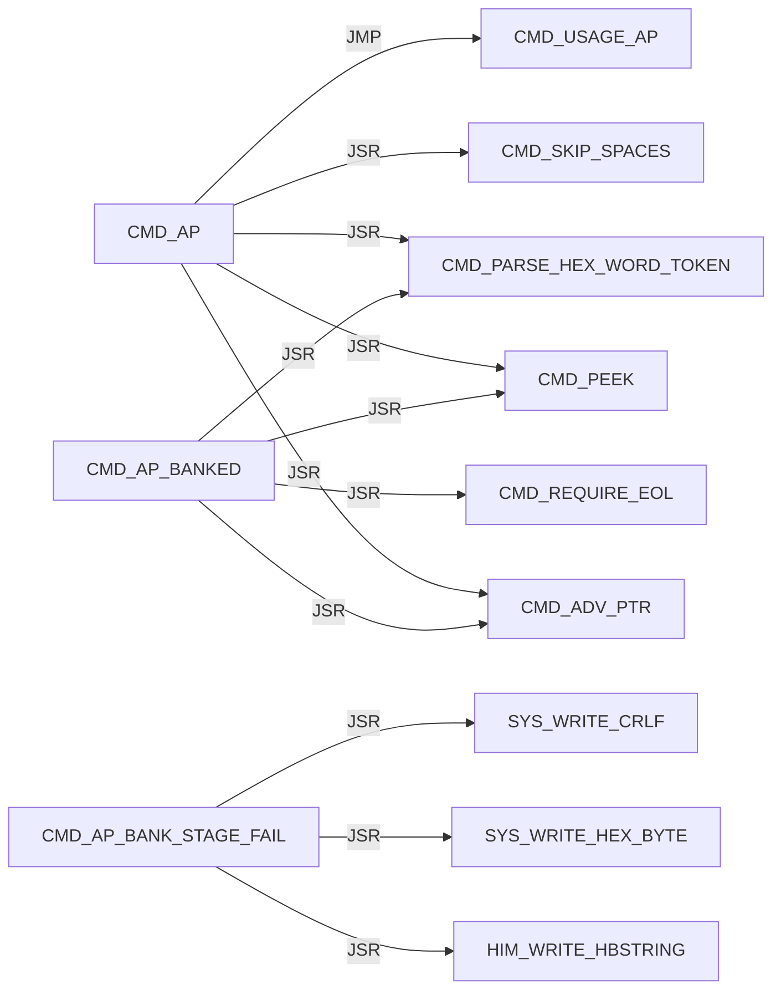

Panel 2 of 3: `CMD_AP_BANKED` through `CMD_AP_LOAD_REQUEST`.

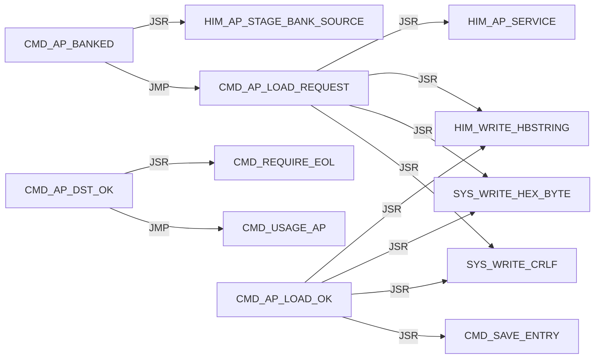

Panel 3 of 3: `CMD_AP_SRC_OK` through `CMD_AP_SRC_OK`.

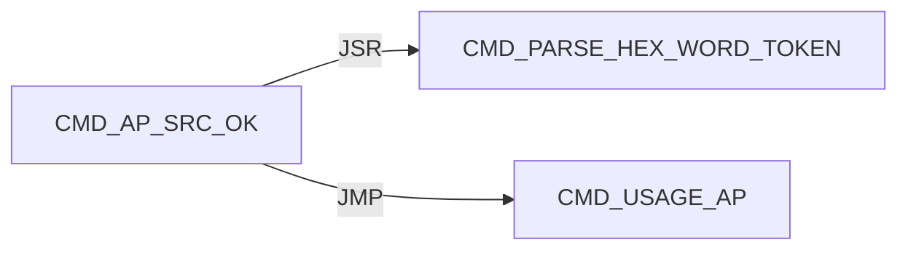

#### CMD / D

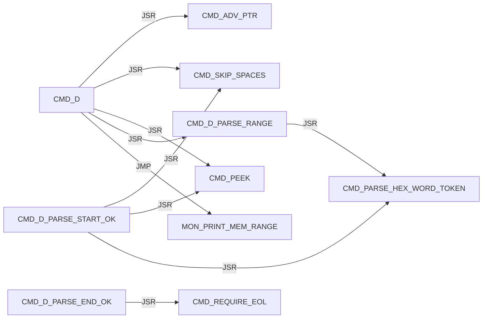

#### CMD / DISPATCH

Panel 1 of 2: `CMD_DISPATCH_DONE` through `CMD_DISPATCH_SCAN_MISS`.

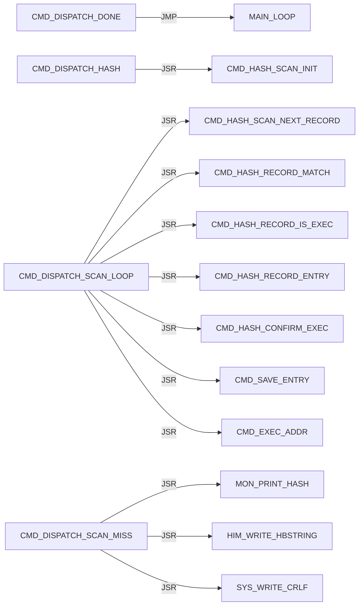

Panel 2 of 2: `CMD_DISPATCH_SCAN_MISS` through `CMD_DISPATCH_SCAN_NEXT`.

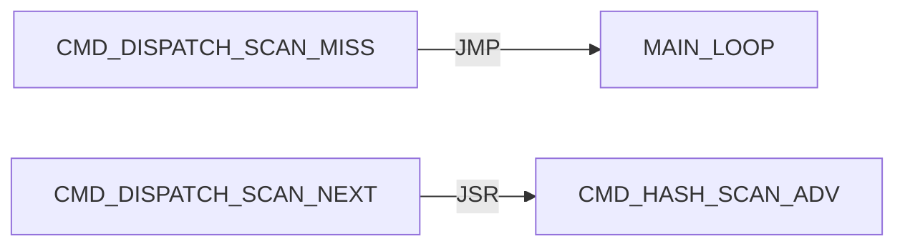

#### CMD / EXEC

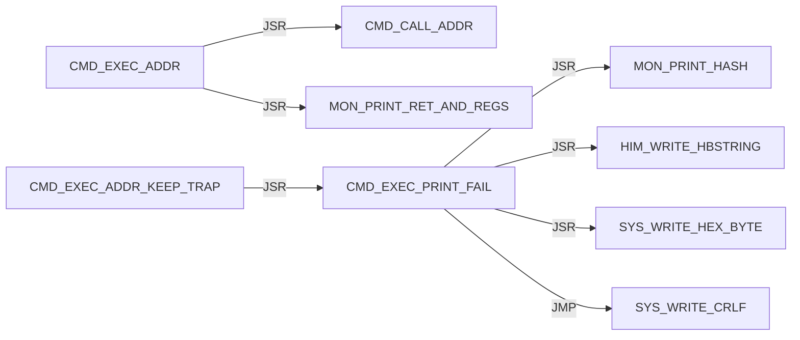

#### CMD / G

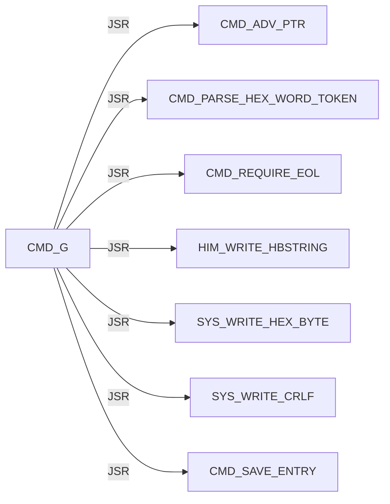

#### CMD / HASH

Panel 1 of 7: `CMD_HASH_CONFIRM_ADDR` through `CMD_HASH_FIND_LOOP`.

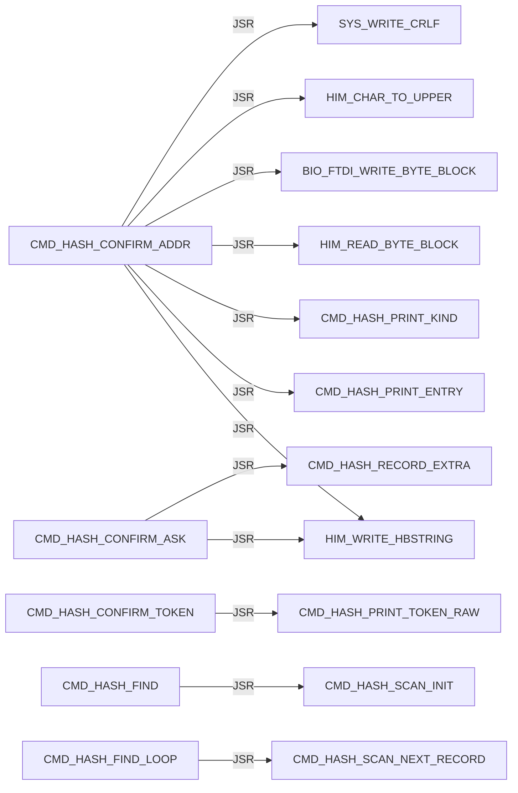

Panel 2 of 7: `CMD_HASH_FIND_LOOP` through `CMD_HASH_INFO_FOUND`.

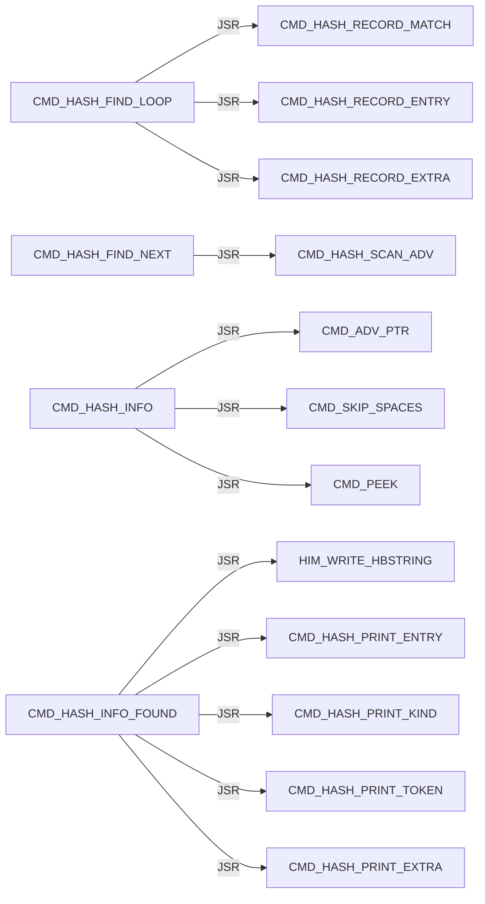

Panel 3 of 7: `CMD_HASH_INFO_FOUND` through `CMD_HASH_INFO_LOOKUP`.

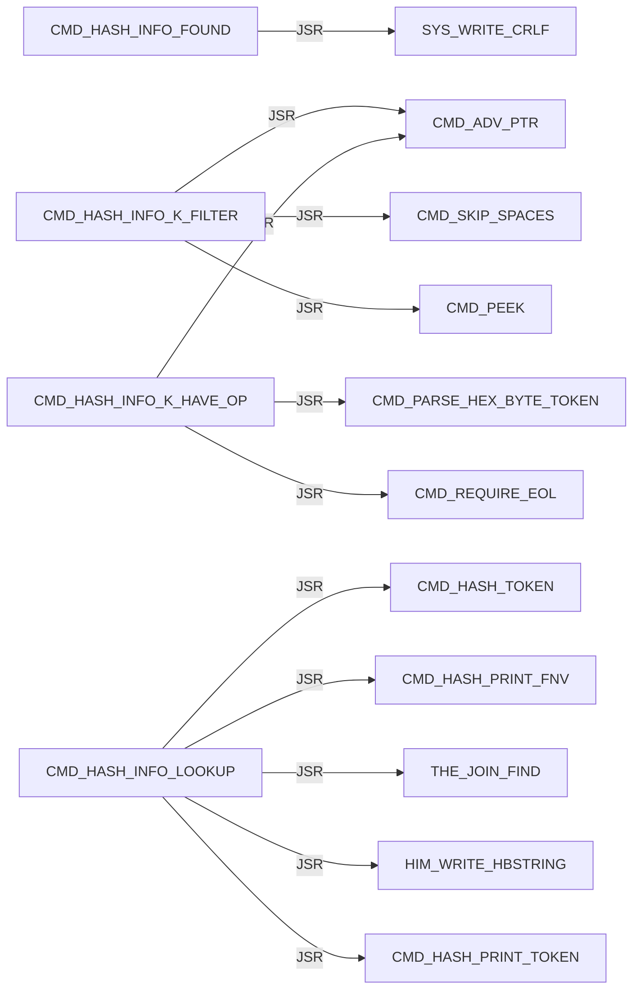

Panel 4 of 7: `CMD_HASH_INFO_LOOKUP` through `CMD_HASH_PRINT_EXTRA`.

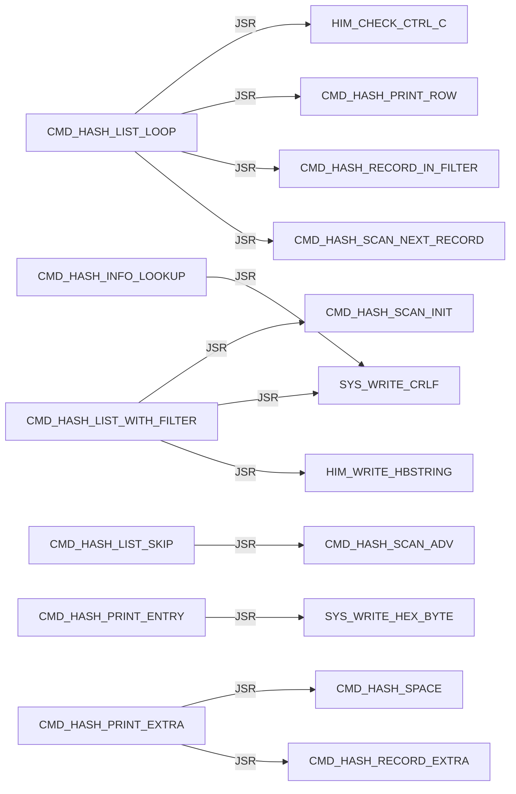

Panel 5 of 7: `CMD_HASH_PRINT_EXTRA` through `CMD_HASH_PRINT_TOKEN`.

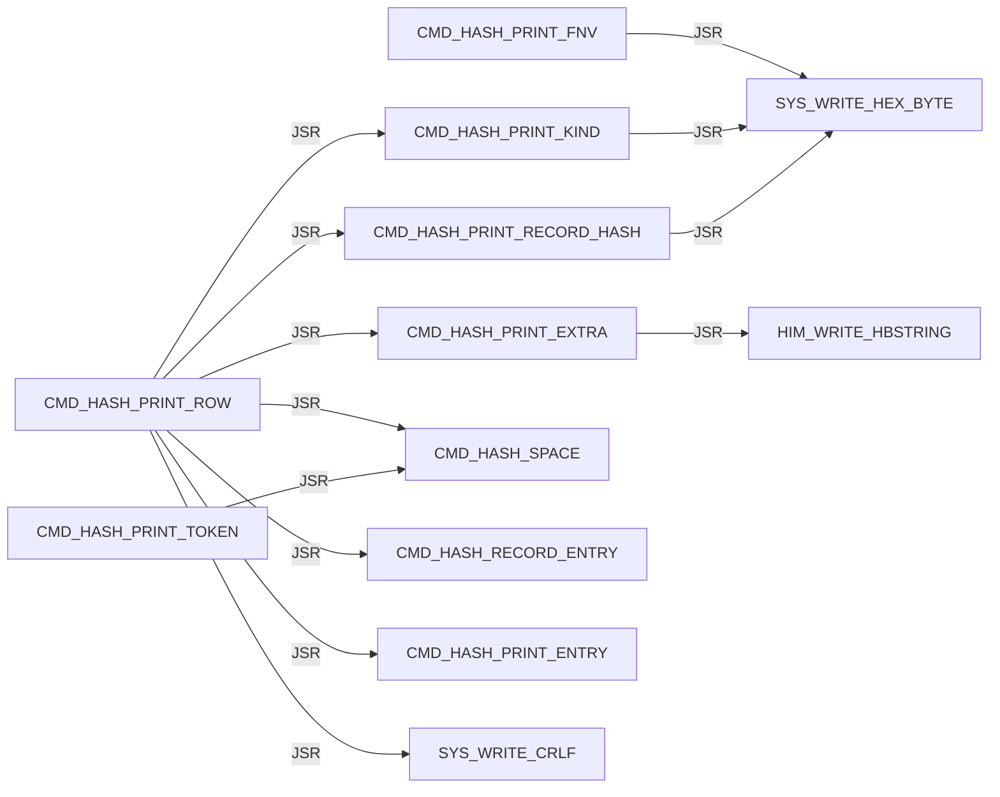

Panel 6 of 7: `CMD_HASH_PRINT_TOKEN_LOOP` through `CMD_HASH_TOKEN_LOOP`.

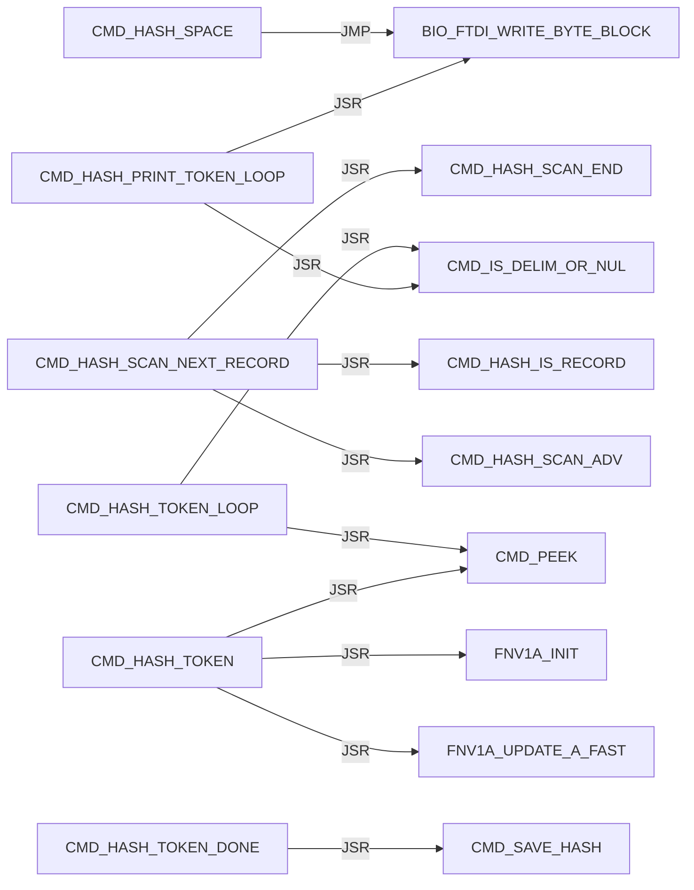

Panel 7 of 7: `CMD_HASH_TOKEN_LOOP` through `CMD_HASH_USAGE`.

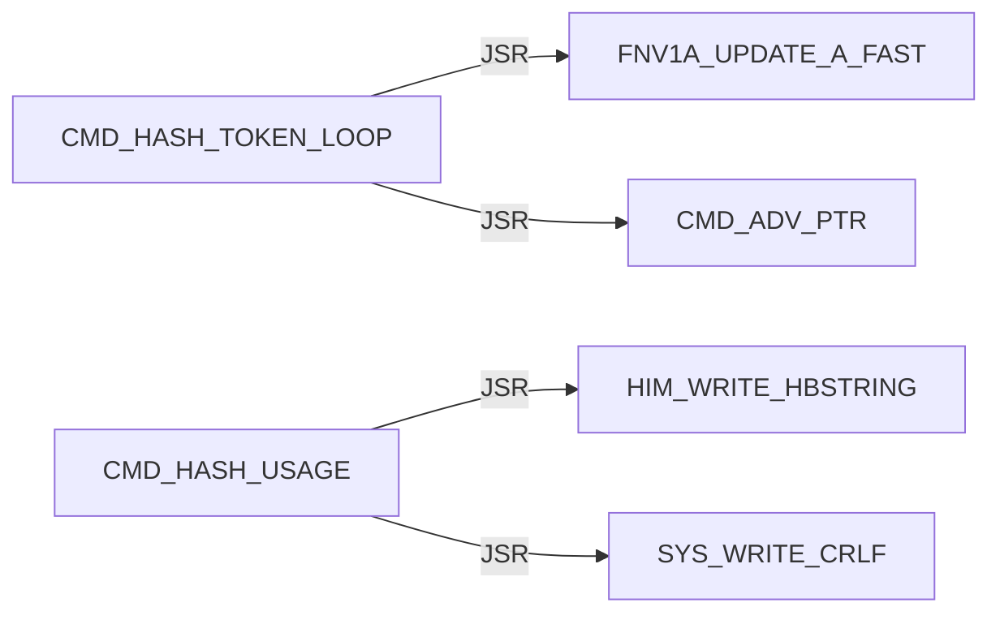

#### CMD / HELP


#### CMD / L

Panel 1 of 2: `CMD_L` through `CMD_L_PARSE_OK`.

```mermaid
flowchart LR
    N0["CMD_L"] -->|JSR| N1["CMD_ADV_PTR"]
    N0["CMD_L"] -->|JSR| N2["CMD_REQUIRE_EOL"]
    N0["CMD_L"] -->|JMP| N3["CMD_USAGE_L"]
    N4["CMD_L_ARGS_OK"] -->|JSR| N5["DBG_CLEAR_ALL"]
    N4["CMD_L_ARGS_OK"] -->|JSR| N6["HIM_WRITE_HBSTRING"]
    N4["CMD_L_ARGS_OK"] -->|JSR| N7["SYS_WRITE_CRLF"]
    N8["CMD_L_HAVE_LINE"] -->|JSR| N9["CMD_PEEK"]
    N8["CMD_L_HAVE_LINE"] -->|JSR| N10["L_PARSE_RECORD"]
    N8["CMD_L_HAVE_LINE"] -->|JSR| N11["CMD_L_PRINT_FAIL"]
    N8["CMD_L_HAVE_LINE"] -->|JMP| N12["CMD_L_FAIL_EXIT"]
    N13["CMD_L_PARSE_OK"] -->|JSR| N6["HIM_WRITE_HBSTRING"]
    N13["CMD_L_PARSE_OK"] -->|JSR| N14["SYS_WRITE_HEX_BYTE"]
```

Panel 2 of 2: `CMD_L_PARSE_OK` through `CMD_L_READ_LOOP`.

```mermaid
flowchart LR
    N0["CMD_L_PARSE_OK"] -->|JSR| N1["SYS_WRITE_CRLF"]
    N2["CMD_L_PRINT_FAIL"] -->|JSR| N3["HIM_WRITE_HBSTRING"]
    N2["CMD_L_PRINT_FAIL"] -->|JSR| N4["SYS_WRITE_HEX_BYTE"]
    N2["CMD_L_PRINT_FAIL"] -->|JMP| N1["SYS_WRITE_CRLF"]
    N5["CMD_L_READ_LOOP"] -->|JSR| N6["HIM_READ_LINE_UPPER"]
    N5["CMD_L_READ_LOOP"] -->|JSR| N3["HIM_WRITE_HBSTRING"]
    N5["CMD_L_READ_LOOP"] -->|JSR| N4["SYS_WRITE_HEX_BYTE"]
    N5["CMD_L_READ_LOOP"] -->|JSR| N1["SYS_WRITE_CRLF"]
```

#### CMD / M

```mermaid
flowchart LR
    N0["CMD_M"] -->|JSR| N1["CMD_ADV_PTR"]
    N0["CMD_M"] -->|JSR| N2["CMD_PARSE_RANGE_REQUIRED"]
    N0["CMD_M"] -->|JSR| N3["MON_MODIFY_RANGE_WRITABLE"]
    N0["CMD_M"] -->|JSR| N4["MON_MODIFY_RANGE"]
    N5["CMD_M_PROTECT"] -->|JSR| N6["HIM_WRITE_HBSTRING"]
    N5["CMD_M_PROTECT"] -->|JSR| N7["SYS_WRITE_HEX_BYTE"]
    N5["CMD_M_PROTECT"] -->|JSR| N8["SYS_WRITE_CRLF"]
```

#### CMD / PARSE

Panel 1 of 2: `CMD_PARSE_HEX_BYTE_TOKEN` through `CMD_PARSE_RANGE_PLUS`.

```mermaid
flowchart LR
    N0["CMD_PARSE_HEX_BYTE_TOKEN"] -->|JSR| N1["CMD_PARSE_HEX_WORD_TOKEN"]
    N2["CMD_PARSE_HEX_WORD_DONE"] -->|JSR| N3["CMD_PEEK"]
    N2["CMD_PARSE_HEX_WORD_DONE"] -->|JSR| N4["CMD_IS_DELIM_OR_NUL"]
    N5["CMD_PARSE_HEX_WORD_LOOP"] -->|JSR| N3["CMD_PEEK"]
    N5["CMD_PARSE_HEX_WORD_LOOP"] -->|JSR| N6["CMD_HEX_ASCII_TO_NIBBLE"]
    N5["CMD_PARSE_HEX_WORD_LOOP"] -->|JSR| N7["CMD_ADV_PTR"]
    N1["CMD_PARSE_HEX_WORD_TOKEN"] -->|JSR| N8["CMD_SKIP_SPACES"]
    N1["CMD_PARSE_HEX_WORD_TOKEN"] -->|JSR| N9["CMD_SKIP_OPTIONAL_DOLLAR"]
    N10["CMD_PARSE_RANGE_COUNT_OK"] -->|JMP| N11["CMD_PARSE_RANGE_FAIL"]
    N12["CMD_PARSE_RANGE_HAVE_END"] -->|JSR| N13["CMD_REQUIRE_EOL"]
    N14["CMD_PARSE_RANGE_PLUS"] -->|JSR| N7["CMD_ADV_PTR"]
    N14["CMD_PARSE_RANGE_PLUS"] -->|JSR| N1["CMD_PARSE_HEX_WORD_TOKEN"]
```

Panel 2 of 2: `CMD_PARSE_RANGE_PLUS` through `CMD_PARSE_RANGE_START_OK`.

```mermaid
flowchart LR
    N0["CMD_PARSE_RANGE_PLUS"] -->|JMP| N1["CMD_PARSE_RANGE_FAIL"]
    N2["CMD_PARSE_RANGE_REQUIRED"] -->|JSR| N3["CMD_PARSE_HEX_WORD_TOKEN"]
    N2["CMD_PARSE_RANGE_REQUIRED"] -->|JMP| N1["CMD_PARSE_RANGE_FAIL"]
    N4["CMD_PARSE_RANGE_START_OK"] -->|JSR| N5["CMD_SKIP_SPACES"]
    N4["CMD_PARSE_RANGE_START_OK"] -->|JSR| N6["CMD_PEEK"]
    N4["CMD_PARSE_RANGE_START_OK"] -->|JSR| N3["CMD_PARSE_HEX_WORD_TOKEN"]
    N4["CMD_PARSE_RANGE_START_OK"] -->|JMP| N1["CMD_PARSE_RANGE_FAIL"]
```

#### CMD / Q

```mermaid
flowchart LR
    N0["CMD_Q"] -->|JMP| N1["MON_REENTER"]
```

#### CMD / R

```mermaid
flowchart LR
    N0["CMD_R"] -->|JSR| N1["MON_CTX_REQUIRE_VALID"]
    N2["CMD_R_HAVE_CTX"] -->|JSR| N3["CMD_ADV_PTR"]
    N2["CMD_R_HAVE_CTX"] -->|JSR| N4["MON_CTX_PARSE_ASSIGN_LIST"]
    N2["CMD_R_HAVE_CTX"] -->|JSR| N5["MON_PRINT_STOP_AND_REGS"]
```

#### CMD / REQUIRE

```mermaid
flowchart LR
    N0["CMD_REQUIRE_EOL"] -->|JSR| N1["CMD_SKIP_SPACES"]
    N0["CMD_REQUIRE_EOL"] -->|JSR| N2["CMD_PEEK"]
```

#### CMD / SKIP

```mermaid
flowchart LR
    N0["CMD_SKIP_OPTIONAL_DOLLAR"] -->|JSR| N1["CMD_PEEK"]
    N0["CMD_SKIP_OPTIONAL_DOLLAR"] -->|JSR| N2["CMD_ADV_PTR"]
    N3["CMD_SKIP_SPACES"] -->|JSR| N1["CMD_PEEK"]
    N4["CMD_SKIP_SPACES_ADV"] -->|JSR| N2["CMD_ADV_PTR"]
```

#### CMD / UNKNOWN

```mermaid
flowchart LR
    N0["CMD_UNKNOWN"] -->|JSR| N1["HIM_WRITE_HBSTRING"]
    N0["CMD_UNKNOWN"] -->|JSR| N2["SYS_WRITE_CRLF"]
    N0["CMD_UNKNOWN"] -->|JMP| N3["MAIN_LOOP"]
```

#### CMD / USAGE

Panel 1 of 2: `CMD_USAGE_AP` through `CMD_USAGE_R`.

```mermaid
flowchart LR
    N0["CMD_USAGE_AP"] -->|JSR| N1["HIM_WRITE_HBSTRING"]
    N0["CMD_USAGE_AP"] -->|JSR| N2["SYS_WRITE_CRLF"]
    N3["CMD_USAGE_D"] -->|JSR| N1["HIM_WRITE_HBSTRING"]
    N3["CMD_USAGE_D"] -->|JSR| N2["SYS_WRITE_CRLF"]
    N4["CMD_USAGE_G"] -->|JSR| N1["HIM_WRITE_HBSTRING"]
    N4["CMD_USAGE_G"] -->|JSR| N2["SYS_WRITE_CRLF"]
    N5["CMD_USAGE_L"] -->|JSR| N1["HIM_WRITE_HBSTRING"]
    N5["CMD_USAGE_L"] -->|JSR| N2["SYS_WRITE_CRLF"]
    N6["CMD_USAGE_M"] -->|JSR| N1["HIM_WRITE_HBSTRING"]
    N6["CMD_USAGE_M"] -->|JSR| N2["SYS_WRITE_CRLF"]
    N7["CMD_USAGE_R"] -->|JSR| N1["HIM_WRITE_HBSTRING"]
    N7["CMD_USAGE_R"] -->|JSR| N2["SYS_WRITE_CRLF"]
```

Panel 2 of 2: `CMD_USAGE_X` through `CMD_USAGE_X`.

```mermaid
flowchart LR
    N0["CMD_USAGE_X"] -->|JSR| N1["HIM_WRITE_HBSTRING"]
    N0["CMD_USAGE_X"] -->|JSR| N2["SYS_WRITE_CRLF"]
```

#### CMD / X

```mermaid
flowchart LR
    N0["CMD_X"] -->|JSR| N1["MON_CTX_REQUIRE_VALID"]
    N2["CMD_X_HAVE_CTX"] -->|JSR| N3["CMD_ADV_PTR"]
    N2["CMD_X_HAVE_CTX"] -->|JSR| N4["MON_CTX_PARSE_ASSIGN_LIST"]
    N2["CMD_X_HAVE_CTX"] -->|JSR| N5["HIM_WRITE_HBSTRING"]
    N2["CMD_X_HAVE_CTX"] -->|JSR| N6["SYS_WRITE_HEX_BYTE"]
    N2["CMD_X_HAVE_CTX"] -->|JSR| N7["SYS_WRITE_CRLF"]
    N2["CMD_X_HAVE_CTX"] -->|JMP| N8["MON_CTX_RESUME_RTI"]
```

#### ENTRY / unprefixed

```mermaid
flowchart LR
    N0["START"] -->|JMP| N1["HIMON_START_BODY"]
```

#### FNV1A

```mermaid
flowchart LR
    N0["FNV1A_MUL_PRIME"] -->|JSR| N1["MATH_COPY_HASH_TO_TERM"]
    N0["FNV1A_MUL_PRIME"] -->|JSR| N2["MATH_SHLADD_TERM_N"]
    N0["FNV1A_MUL_PRIME"] -->|JMP| N3["MATH_ADD_TERM1_TO_HASH3"]
    N4["FNV1A_MUL_PRIME_FAST"] -->|JSR| N1["MATH_COPY_HASH_TO_TERM"]
    N4["FNV1A_MUL_PRIME_FAST"] -->|JSR| N5["MATH_ADD_TERM_TO_HASH"]
    N4["FNV1A_MUL_PRIME_FAST"] -->|JMP| N3["MATH_ADD_TERM1_TO_HASH3"]
    N6["FNV1A_UPDATE_A"] -->|JMP| N0["FNV1A_MUL_PRIME"]
    N7["FNV1A_UPDATE_A_FAST"] -->|JMP| N4["FNV1A_MUL_PRIME_FAST"]
```

#### HIM / AP

Panel 1 of 11: `HIM_AP_ADVANCE_A` through `HIM_AP_CHECK_RELOC_REC`.

```mermaid
flowchart LR
    N0["HIM_AP_ADVANCE_A"] -->|JSR| N1["HIM_AP_NEED_A"]
    N2["HIM_AP_ADVANCE_TMP"] -->|JSR| N3["HIM_AP_NEED_TMP"]
    N4["HIM_AP_BANK_STAGE_CODE"] -->|JSR| N5["STR8_BANK_SELECT_SERVICE"]
    N4["HIM_AP_BANK_STAGE_CODE"] -->|JSR| N6["STR8_BANK_SELECT_RAM"]
    N7["HIM_AP_CHECK_PUBLIC_COUNT_OK"] -->|JSR| N8["HIM_AP_CHECK_PUBLIC_ADVANCE_A"]
    N7["HIM_AP_CHECK_PUBLIC_COUNT_OK"] -->|JMP| N9["HIM_AP_CHECK_PUBLIC_FAIL"]
    N9["HIM_AP_CHECK_PUBLIC_FAIL"] -->|JMP| N10["HIM_AP_BAD_LINE"]
    N11["HIM_AP_CHECK_PUBLIC_LOOP"] -->|JMP| N12["HIM_AP_CHECK_PUBLIC_DONE"]
    N13["HIM_AP_CHECK_PUBLIC_REC"] -->|JMP| N9["HIM_AP_CHECK_PUBLIC_FAIL"]
    N14["HIM_AP_CHECK_PUBLIC_ROW_READY"] -->|JSR| N8["HIM_AP_CHECK_PUBLIC_ADVANCE_A"]
    N15["HIM_AP_CHECK_RELOC_KIND_LOOP"] -->|JSR| N16["HIM_AP_RELOC_KIND_X"]
    N17["HIM_AP_CHECK_RELOC_REC"] -->|JMP| N10["HIM_AP_BAD_LINE"]
```

Panel 2 of 11: `HIM_AP_CHECK_RELOC_SHAPE_BAD` through `HIM_AP_LINK_PATCH`.

```mermaid
flowchart LR
    N0["HIM_AP_CHECK_RELOC_SHAPE_BAD"] -->|JMP| N1["HIM_AP_BAD_LINE"]
    N2["HIM_AP_FIND_HOLE_LOOP"] -->|JSR| N3["HIM_AP_HOLE_AT_SCAN"]
    N4["HIM_AP_FIND_HOLE_NEXT"] -->|JMP| N5["HIM_AP_BAD_RANGE"]
    N6["HIM_AP_IMPORT_LINK"] -->|JSR| N7["HIM_AP_LINK_RELOAD_REL_PTR"]
    N8["HIM_AP_LINK_CAPTURE_ROW_X"] -->|JSR| N9["HIM_AP_RELOC_KIND_X"]
    N8["HIM_AP_LINK_CAPTURE_ROW_X"] -->|JSR| N10["HIM_AP_RELOC_SITE_LO_X"]
    N8["HIM_AP_LINK_CAPTURE_ROW_X"] -->|JSR| N11["HIM_AP_RELOC_SITE_HI_X"]
    N12["HIM_AP_LINK_DONE"] -->|JSR| N13["HIM_AP_LINK_RESTORE_COUNTS"]
    N14["HIM_AP_LINK_FAIL"] -->|JSR| N13["HIM_AP_LINK_RESTORE_COUNTS"]
    N15["HIM_AP_LINK_IMPORT_ROW_LOOP"] -->|JSR| N16["HIM_AP_LINK_IMPORT_ROW_BYTES_A"]
    N17["HIM_AP_LINK_PATCH"] -->|JSR| N7["HIM_AP_LINK_RELOAD_REL_PTR"]
    N17["HIM_AP_LINK_PATCH"] -->|JSR| N9["HIM_AP_RELOC_KIND_X"]
```

Panel 3 of 11: `HIM_AP_LINK_PATCH` through `HIM_AP_LINK_VALIDATE`.

```mermaid
flowchart LR
    N0["HIM_AP_LINK_PATCH"] -->|JSR| N1["HIM_AP_IMPORT_KIND_A"]
    N0["HIM_AP_LINK_PATCH"] -->|JSR| N2["HIM_AP_LINK_CAPTURE_ROW_X"]
    N0["HIM_AP_LINK_PATCH"] -->|JSR| N3["HIM_AP_LINK_RESOLVE_ROW_X"]
    N0["HIM_AP_LINK_PATCH"] -->|JSR| N4["HIM_AP_LINK_PATCH_CAPTURED"]
    N3["HIM_AP_LINK_RESOLVE_ROW_X"] -->|JSR| N5["HIM_AP_RELOC_TARGET_HI_X"]
    N3["HIM_AP_LINK_RESOLVE_ROW_X"] -->|JSR| N6["HIM_AP_RELOC_TARGET_LO_X"]
    N3["HIM_AP_LINK_RESOLVE_ROW_X"] -->|JSR| N7["HIM_AP_LINK_RESOLVE_SLOT_X"]
    N7["HIM_AP_LINK_RESOLVE_SLOT_X"] -->|JSR| N8["HIM_AP_LINK_IMPORT_ROW_PTR_X"]
    N7["HIM_AP_LINK_RESOLVE_SLOT_X"] -->|JSR| N9["THE_JOIN_FIND"]
    N10["HIM_AP_LINK_VALIDATE"] -->|JSR| N11["HIM_AP_LINK_RELOAD_REL_PTR"]
    N10["HIM_AP_LINK_VALIDATE"] -->|JSR| N12["HIM_AP_RELOC_KIND_X"]
    N10["HIM_AP_LINK_VALIDATE"] -->|JSR| N1["HIM_AP_IMPORT_KIND_A"]
```

Panel 4 of 11: `HIM_AP_LINK_VALIDATE` through `HIM_AP_LOAD_PATCH_LOOP`.

```mermaid
flowchart LR
    N0["HIM_AP_LINK_VALIDATE"] -->|JSR| N1["HIM_AP_RELOC_SITE_OK_X"]
    N0["HIM_AP_LINK_VALIDATE"] -->|JSR| N2["HIM_AP_LINK_RESOLVE_ROW_X"]
    N3["HIM_AP_LOAD_BASE_GE_20"] -->|JMP| N4["HIM_AP_BAD_RANGE"]
    N5["HIM_AP_LOAD_BASE_LT_50"] -->|JMP| N4["HIM_AP_BAD_RANGE"]
    N6["HIM_AP_LOAD_LAST_NO_CARRY"] -->|JMP| N4["HIM_AP_BAD_RANGE"]
    N7["HIM_AP_LOAD_LEN_NONZERO"] -->|JMP| N4["HIM_AP_BAD_RANGE"]
    N8["HIM_AP_LOAD_NO_OVERLAP"] -->|JSR| N9["HIM_AP_COPY_BODY_TO_DST"]
    N8["HIM_AP_LOAD_NO_OVERLAP"] -->|JSR| N10["HIM_AP_IMPORT_LINK"]
    N11["HIM_AP_LOAD_OVERLAP_BAD"] -->|JMP| N4["HIM_AP_BAD_RANGE"]
    N12["HIM_AP_LOAD_PARSED"] -->|JSR| N13["HIM_AP_LOAD_RANGE_OK"]
    N14["HIM_AP_LOAD_PATCH_LOOP"] -->|JSR| N15["HIM_AP_RELOC_KIND_X"]
    N14["HIM_AP_LOAD_PATCH_LOOP"] -->|JSR| N16["HIM_AP_INTERNAL_KIND_A"]
```

Panel 5 of 11: `HIM_AP_LOAD_PATCH_LOOP` through `HIM_AP_PARSE_BODY_NONZERO`.

```mermaid
flowchart LR
    N0["HIM_AP_LOAD_PATCH_LOOP"] -->|JSR| N1["HIM_AP_IMPORT_KIND_A"]
    N0["HIM_AP_LOAD_PATCH_LOOP"] -->|JMP| N2["HIM_AP_BAD_FIX"]
    N3["HIM_AP_LOAD_PATCH_ROW"] -->|JSR| N4["HIM_AP_RELOC_SITE_OK_X"]
    N5["HIM_AP_LOAD_PATCH_SITE_OK"] -->|JSR| N6["HIM_AP_RELOC_PATCH_ROW_X"]
    N7["HIM_AP_LOAD_RANGE_OK"] -->|JMP| N8["HIM_AP_BAD_RANGE"]
    N9["HIM_AP_NEED_A"] -->|JMP| N8["HIM_AP_BAD_RANGE"]
    N10["HIM_AP_NEED_TMP_FAIL"] -->|JMP| N8["HIM_AP_BAD_RANGE"]
    N11["HIM_AP_PARSE_BODY"] -->|JSR| N9["HIM_AP_NEED_A"]
    N12["HIM_AP_PARSE_BODY_HDR_ROOM"] -->|JMP| N13["HIM_AP_BAD_LINE"]
    N14["HIM_AP_PARSE_BODY_LEFT_LO_OK"] -->|JMP| N13["HIM_AP_BAD_LINE"]
    N15["HIM_AP_PARSE_BODY_LEFT_OK"] -->|JMP| N13["HIM_AP_BAD_LINE"]
    N16["HIM_AP_PARSE_BODY_NONZERO"] -->|JSR| N17["HIM_AP_VERIFY_SEAL_BODY"]
```

Panel 6 of 11: `HIM_AP_PARSE_BODY_SAVE` through `HIM_AP_PARSE_IMPORT_ROOM_OK`.

```mermaid
flowchart LR
    N0["HIM_AP_PARSE_BODY_SAVE"] -->|JMP| N1["HIM_AP_BAD_LINE"]
    N2["HIM_AP_PARSE_BODY_TAG_OK"] -->|JSR| N3["HIM_AP_ADVANCE_A"]
    N4["HIM_AP_PARSE_EXPORT"] -->|JSR| N5["HIM_AP_TAG_LEN"]
    N6["HIM_AP_PARSE_EXPORT_LEN_OK"] -->|JSR| N7["HIM_AP_NEED_TMP"]
    N6["HIM_AP_PARSE_EXPORT_LEN_OK"] -->|JSR| N8["HIM_AP_CHECK_EXPORT_REC"]
    N6["HIM_AP_PARSE_EXPORT_LEN_OK"] -->|JSR| N9["HIM_AP_ADVANCE_TMP"]
    N10["HIM_AP_PARSE_EXPORT_TAG_OK"] -->|JMP| N1["HIM_AP_BAD_LINE"]
    N11["HIM_AP_PARSE_HEADER_RANGE"] -->|JMP| N1["HIM_AP_BAD_LINE"]
    N12["HIM_AP_PARSE_IMPORT"] -->|JSR| N5["HIM_AP_TAG_LEN"]
    N13["HIM_AP_PARSE_IMPORT_LEN_OK"] -->|JSR| N7["HIM_AP_NEED_TMP"]
    N14["HIM_AP_PARSE_IMPORT_ROOM_OK"] -->|JSR| N15["HIM_AP_CHECK_IMPORT_REC"]
    N14["HIM_AP_PARSE_IMPORT_ROOM_OK"] -->|JSR| N9["HIM_AP_ADVANCE_TMP"]
```

Panel 7 of 11: `HIM_AP_PARSE_IMPORT_TAG_OK` through `HIM_AP_PARSE_SEAL_LEN_BAD`.

```mermaid
flowchart LR
    N0["HIM_AP_PARSE_IMPORT_TAG_OK"] -->|JMP| N1["HIM_AP_BAD_LINE"]
    N2["HIM_AP_PARSE_LEN_NONZERO"] -->|JSR| N3["HIM_AP_SOURCE_RANGE_OK"]
    N4["HIM_AP_PARSE_MIN"] -->|JSR| N3["HIM_AP_SOURCE_RANGE_OK"]
    N5["HIM_AP_PARSE_RANGE_SAFE"] -->|JMP| N1["HIM_AP_BAD_LINE"]
    N6["HIM_AP_PARSE_RELOC"] -->|JSR| N7["HIM_AP_TAG_LEN"]
    N8["HIM_AP_PARSE_RELOC_LEN_OK"] -->|JSR| N9["HIM_AP_NEED_TMP"]
    N10["HIM_AP_PARSE_RELOC_ROOM_OK"] -->|JSR| N11["HIM_AP_CHECK_RELOC_REC"]
    N12["HIM_AP_PARSE_RELOC_SHAPE_OK"] -->|JSR| N13["HIM_AP_ADVANCE_TMP"]
    N14["HIM_AP_PARSE_RELOC_TAG_OK"] -->|JMP| N1["HIM_AP_BAD_LINE"]
    N15["HIM_AP_PARSE_SEAL"] -->|JSR| N7["HIM_AP_TAG_LEN"]
    N16["HIM_AP_PARSE_SEAL_BAD"] -->|JMP| N1["HIM_AP_BAD_LINE"]
    N17["HIM_AP_PARSE_SEAL_LEN_BAD"] -->|JMP| N1["HIM_AP_BAD_LINE"]
```

Panel 8 of 11: `HIM_AP_PARSE_SEAL_LEN_OK` through `HIM_AP_RELOC_SITE_HAVE_ADD`.

```mermaid
flowchart LR
    N0["HIM_AP_PARSE_SEAL_LEN_OK"] -->|JMP| N1["HIM_AP_BAD_LINE"]
    N2["HIM_AP_PARSE_SEAL_SHAPE_OK"] -->|JSR| N3["HIM_AP_ADVANCE_TMP"]
    N4["HIM_AP_PARSE_SIG0_OK"] -->|JMP| N1["HIM_AP_BAD_LINE"]
    N5["HIM_AP_PARSE_SIG1_OK"] -->|JMP| N1["HIM_AP_BAD_LINE"]
    N6["HIM_AP_PARSE_VER_OK"] -->|JMP| N1["HIM_AP_BAD_LINE"]
    N7["HIM_AP_RELOC_PATCH_ROW_X"] -->|JSR| N8["HIM_AP_RELOC_SITE_LO_X"]
    N7["HIM_AP_RELOC_PATCH_ROW_X"] -->|JSR| N9["HIM_AP_RELOC_SITE_HI_X"]
    N7["HIM_AP_RELOC_PATCH_ROW_X"] -->|JSR| N10["HIM_AP_RELOC_TARGET_LO_X"]
    N7["HIM_AP_RELOC_PATCH_ROW_X"] -->|JSR| N11["HIM_AP_RELOC_TARGET_HI_X"]
    N12["HIM_AP_RELOC_SITE_HAVE_ADD"] -->|JSR| N8["HIM_AP_RELOC_SITE_LO_X"]
    N12["HIM_AP_RELOC_SITE_HAVE_ADD"] -->|JSR| N9["HIM_AP_RELOC_SITE_HI_X"]
    N12["HIM_AP_RELOC_SITE_HAVE_ADD"] -->|JMP| N13["HIM_AP_BAD_FIX"]
```

Panel 9 of 11: `HIM_AP_RELOC_SITE_HI_EQ` through `HIM_AP_SOURCE_BASE_GE_80`.

```mermaid
flowchart LR
    N0["HIM_AP_RELOC_SITE_HI_EQ"] -->|JMP| N1["HIM_AP_BAD_FIX"]
    N2["HIM_AP_RELOC_SITE_NO_CARRY"] -->|JMP| N1["HIM_AP_BAD_FIX"]
    N3["HIM_AP_RELOC_SITE_OK_X"] -->|JSR| N4["HIM_AP_RELOC_KIND_X"]
    N5["HIM_AP_SERVICE"] -->|JMP| N6["HIM_AP_SERVICE_SUGGEST"]
    N7["HIM_AP_SERVICE_BAD_OP"] -->|JMP| N8["HIM_AP_BAD_LINE"]
    N9["HIM_AP_SERVICE_LINK"] -->|JMP| N10["HIM_AP_IMPORT_LINK"]
    N11["HIM_AP_SERVICE_LOAD"] -->|JSR| N12["HIM_AP_PARSE_MIN"]
    N13["HIM_AP_SERVICE_PARSE"] -->|JMP| N12["HIM_AP_PARSE_MIN"]
    N6["HIM_AP_SERVICE_SUGGEST"] -->|JSR| N12["HIM_AP_PARSE_MIN"]
    N14["HIM_AP_SOURCE_BASE_BAD"] -->|JMP| N15["HIM_AP_BAD_RANGE"]
    N16["HIM_AP_SOURCE_BASE_GE_20"] -->|JMP| N15["HIM_AP_BAD_RANGE"]
    N17["HIM_AP_SOURCE_BASE_GE_80"] -->|JMP| N15["HIM_AP_BAD_RANGE"]
```

Panel 10 of 11: `HIM_AP_SOURCE_BASE_SAFE` through `HIM_AP_TAG_LEN_TAG_OK`.

```mermaid
flowchart LR
    N0["HIM_AP_SOURCE_BASE_SAFE"] -->|JMP| N1["HIM_AP_BAD_RANGE"]
    N2["HIM_AP_SOURCE_LAST_NO_CARRY"] -->|JMP| N1["HIM_AP_BAD_RANGE"]
    N3["HIM_AP_SOURCE_LEN_NONZERO"] -->|JSR| N4["HIM_AP_SOURCE_BASE_OK"]
    N5["HIM_AP_SOURCE_RAM_RANGE"] -->|JMP| N1["HIM_AP_BAD_RANGE"]
    N6["HIM_AP_SOURCE_RANGE_OK"] -->|JMP| N1["HIM_AP_BAD_RANGE"]
    N7["HIM_AP_SOURCE_STAGE_RANGE"] -->|JMP| N1["HIM_AP_BAD_RANGE"]
    N8["HIM_AP_STAGE_BANK_BAD"] -->|JMP| N1["HIM_AP_BAD_RANGE"]
    N9["HIM_AP_STAGE_BANK_SOURCE"] -->|JSR| N10["HIM_AP_BANK_STAGE_RAM"]
    N11["HIM_AP_SUGGEST_PARSED"] -->|JSR| N12["HIM_AP_FIND_HOLE"]
    N13["HIM_AP_TAG_LEN"] -->|JSR| N14["HIM_AP_NEED_A"]
    N15["HIM_AP_TAG_LEN_ROOM_OK"] -->|JMP| N16["HIM_AP_BAD_LINE"]
    N17["HIM_AP_TAG_LEN_TAG_OK"] -->|JMP| N18["HIM_AP_ADVANCE_A"]
```

Panel 11 of 11: `HIM_AP_VERIFY_SEAL_BAD` through `HIM_AP_VERIFY_SEAL_LOOP`.

```mermaid
flowchart LR
    N0["HIM_AP_VERIFY_SEAL_BAD"] -->|JMP| N1["HIM_AP_BAD_LINE"]
    N2["HIM_AP_VERIFY_SEAL_BODY"] -->|JSR| N3["FNV1A_INIT"]
    N4["HIM_AP_VERIFY_SEAL_LOOP"] -->|JSR| N5["FNV1A_UPDATE_A_FAST"]
```

#### HIM / CHECK

```mermaid
flowchart LR
    N0["HIM_CHECK_CTRL_C"] -->|JSR| N1["BIO_FTDI_READ_BYTE_NONBLOCK"]
```

#### HIM / FLASH

```mermaid
flowchart LR
    N0["HIM_FLASH_INSTALL_BAD_JMP"] -->|JMP| N1["HIM_FLASH_INSTALL_BAD"]
    N2["HIM_FLASH_INSTALL_LOOP"] -->|JSR| N3["L_FLASH_SET_PTR"]
    N2["HIM_FLASH_INSTALL_LOOP"] -->|JSR| N4["FLASH_WRITE_BYTE_AXY"]
```

#### HIM / PACK40

```mermaid
flowchart LR
    N0["HIM_PACK40_ASCII_TO_CODE"] -->|JSR| N1["HIM_CHAR_TO_UPPER"]
    N2["HIM_PACK40_PACK3"] -->|JSR| N3["HIM_PACK40_MUL40"]
    N2["HIM_PACK40_PACK3"] -->|JSR| N4["HIM_PACK40_ADD_A"]
```

#### HIM / READ

```mermaid
flowchart LR
    N0["HIM_READ_BYTE_HW"] -->|JSR| N1["BIO_FTDI_READ_BYTE_BLOCK"]
    N2["HIM_READ_LINE_ABORT"] -->|JSR| N3["SYS_WRITE_CRLF"]
    N4["HIM_READ_LINE_BS_DEC"] -->|JSR| N5["BIO_FTDI_WRITE_BYTE_BLOCK"]
    N6["HIM_READ_LINE_DONE"] -->|JSR| N3["SYS_WRITE_CRLF"]
    N7["HIM_READ_LINE_LOOP"] -->|JSR| N8["HIM_READ_BYTE_BLOCK"]
    N7["HIM_READ_LINE_LOOP"] -->|JSR| N9["HIM_CHAR_TO_UPPER"]
    N7["HIM_READ_LINE_LOOP"] -->|JSR| N10["CMD_ADV_PTR"]
    N7["HIM_READ_LINE_LOOP"] -->|JSR| N5["BIO_FTDI_WRITE_BYTE_BLOCK"]
```

#### HIM / WRITE

```mermaid
flowchart LR
    N0["HIM_WRITE_HBSTRING_LAST"] -->|JSR| N1["BIO_FTDI_WRITE_BYTE_BLOCK"]
    N2["HIM_WRITE_HBSTRING_LOOP"] -->|JSR| N1["BIO_FTDI_WRITE_BYTE_BLOCK"]
```

#### HIMON

```mermaid
flowchart LR
    N0["HIMON_START_BODY"] -->|JMP| N1["HIMON_WARM_START_BODY"]
    N1["HIMON_WARM_START_BODY"] -->|JSR| N2["DBG_CLEAR_ALL"]
    N1["HIMON_WARM_START_BODY"] -->|JMP| N3["MON_START_INIT"]
```

#### L

Panel 1 of 3: `L_NOTE_S1_ADDR_PRINT` through `L_PARSE_RECORD_HAVE_S`.

```mermaid
flowchart LR
    N0["L_NOTE_S1_ADDR_PRINT"] -->|JSR| N1["BIO_FTDI_WRITE_BYTE_BLOCK"]
    N0["L_NOTE_S1_ADDR_PRINT"] -->|JSR| N2["SYS_WRITE_HEX_BYTE"]
    N0["L_NOTE_S1_ADDR_PRINT"] -->|JSR| N3["SYS_WRITE_CRLF"]
    N4["L_PARSE_HEADER"] -->|JSR| N5["L_PARSE_HEX_BYTE_STRICT"]
    N4["L_PARSE_HEADER"] -->|JSR| N6["L_SUM_ADD_A"]
    N5["L_PARSE_HEX_BYTE_STRICT"] -->|JSR| N7["CMD_PEEK"]
    N5["L_PARSE_HEX_BYTE_STRICT"] -->|JSR| N8["CMD_HEX_ASCII_TO_NIBBLE"]
    N5["L_PARSE_HEX_BYTE_STRICT"] -->|JSR| N9["CMD_ADV_PTR"]
    N10["L_PARSE_RECORD"] -->|JSR| N7["CMD_PEEK"]
    N10["L_PARSE_RECORD"] -->|JMP| N11["L_PARSE_FAIL"]
    N12["L_PARSE_RECORD_BAD_KIND"] -->|JMP| N11["L_PARSE_FAIL"]
    N13["L_PARSE_RECORD_HAVE_S"] -->|JSR| N9["CMD_ADV_PTR"]
```

Panel 2 of 3: `L_PARSE_RECORD_HAVE_S` through `L_PARSE_S0_SKIP`.

```mermaid
flowchart LR
    N0["L_PARSE_RECORD_HAVE_S"] -->|JSR| N1["CMD_PEEK"]
    N0["L_PARSE_RECORD_HAVE_S"] -->|JMP| N2["L_PARSE_RECORD_S9"]
    N3["L_PARSE_RECORD_S0"] -->|JSR| N4["CMD_ADV_PTR"]
    N3["L_PARSE_RECORD_S0"] -->|JSR| N5["L_PARSE_HEADER"]
    N6["L_PARSE_RECORD_S1"] -->|JSR| N4["CMD_ADV_PTR"]
    N6["L_PARSE_RECORD_S1"] -->|JSR| N5["L_PARSE_HEADER"]
    N2["L_PARSE_RECORD_S9"] -->|JSR| N4["CMD_ADV_PTR"]
    N2["L_PARSE_RECORD_S9"] -->|JSR| N5["L_PARSE_HEADER"]
    N2["L_PARSE_RECORD_S9"] -->|JSR| N7["L_VERIFY_CHECKSUM_EOL"]
    N8["L_PARSE_S0_CHECK"] -->|JSR| N7["L_VERIFY_CHECKSUM_EOL"]
    N9["L_PARSE_S0_FAIL"] -->|JMP| N10["L_PARSE_FAIL"]
    N11["L_PARSE_S0_SKIP"] -->|JSR| N12["L_PARSE_HEX_BYTE_STRICT"]
```

Panel 3 of 3: `L_PARSE_S0_SKIP` through `L_VERIFY_CHECKSUM_EOL`.

```mermaid
flowchart LR
    N0["L_PARSE_S0_SKIP"] -->|JSR| N1["L_SUM_ADD_A"]
    N2["L_PARSE_S1_CHECK"] -->|JSR| N3["L_VERIFY_CHECKSUM_EOL"]
    N2["L_PARSE_S1_CHECK"] -->|JSR| N4["L_VALIDATE_RAM_SPAN"]
    N2["L_PARSE_S1_CHECK"] -->|JSR| N5["L_NOTE_S1_ADDR"]
    N6["L_PARSE_S1_DATA"] -->|JSR| N7["L_PARSE_HEX_BYTE_STRICT"]
    N6["L_PARSE_S1_DATA"] -->|JSR| N1["L_SUM_ADD_A"]
    N8["L_PARSE_S1_FAIL"] -->|JMP| N9["L_PARSE_FAIL"]
    N10["L_PARSE_S9_FAIL"] -->|JMP| N9["L_PARSE_FAIL"]
    N3["L_VERIFY_CHECKSUM_EOL"] -->|JSR| N7["L_PARSE_HEX_BYTE_STRICT"]
    N3["L_VERIFY_CHECKSUM_EOL"] -->|JSR| N11["CMD_PEEK"]
```

#### MAIN

```mermaid
flowchart LR
    N0["MAIN_HAVE_LINE"] -->|JSR| N1["CMD_SKIP_SPACES"]
    N0["MAIN_HAVE_LINE"] -->|JSR| N2["CMD_PEEK"]
    N0["MAIN_HAVE_LINE"] -->|JSR| N3["CMD_HASH_TOKEN"]
    N0["MAIN_HAVE_LINE"] -->|JMP| N4["CMD_DISPATCH_HASH"]
    N5["MAIN_LOOP"] -->|JSR| N6["HIM_WRITE_HBSTRING"]
    N5["MAIN_LOOP"] -->|JSR| N7["HIM_READ_LINE_ECHO_UPPER"]
    N5["MAIN_LOOP"] -->|JMP| N5["MAIN_LOOP"]
```

#### MATH

```mermaid
flowchart LR
    N0["MATH_SHLADD_TERM_N"] -->|JSR| N1["MATH_SHL_TERM_N"]
    N0["MATH_SHLADD_TERM_N"] -->|JMP| N2["MATH_ADD_TERM_TO_HASH"]
```

#### MON / AFTER

```mermaid
flowchart LR
    N0["MON_AFTER_BANNER"] -->|JSR| N1["MON_PRINT_STOP_AND_REGS"]
```

#### MON / BRK

```mermaid
flowchart LR
    N0["MON_BRK_TRAP"] -->|JSR| N1["DBG_HANDLE_BRK"]
    N0["MON_BRK_TRAP"] -->|JMP| N2["MON_REENTER"]
    N3["MON_BRK_TRAP_NORMAL"] -->|JMP| N2["MON_REENTER"]
```

#### MON / CLEAR

```mermaid
flowchart LR
    N0["MON_CLEAR_RAM_ZP"] -->|JMP| N1["MON_START_INIT"]
```

#### MON / COLD

```mermaid
flowchart LR
    N0["MON_COLD_RESET"] -->|JMP| N1["MON_CLEAR_RAM"]
```

#### MON / CTX

Panel 1 of 3: `MON_CTX_PARSE_A` through `MON_CTX_PARSE_P_OR_PC`.

```mermaid
flowchart LR
    N0["MON_CTX_PARSE_A"] -->|JSR| N1["CMD_ADV_PTR"]
    N0["MON_CTX_PARSE_A"] -->|JSR| N2["MON_PARSE_EQ"]
    N0["MON_CTX_PARSE_A"] -->|JSR| N3["CMD_PARSE_HEX_BYTE_TOKEN"]
    N4["MON_CTX_PARSE_ASSIGN"] -->|JSR| N5["CMD_PEEK"]
    N6["MON_CTX_PARSE_ASSIGN_LIST"] -->|JSR| N7["CMD_SKIP_SPACES"]
    N6["MON_CTX_PARSE_ASSIGN_LIST"] -->|JSR| N5["CMD_PEEK"]
    N8["MON_CTX_PARSE_ASSIGN_LOOP"] -->|JSR| N4["MON_CTX_PARSE_ASSIGN"]
    N8["MON_CTX_PARSE_ASSIGN_LOOP"] -->|JSR| N7["CMD_SKIP_SPACES"]
    N8["MON_CTX_PARSE_ASSIGN_LOOP"] -->|JSR| N5["CMD_PEEK"]
    N9["MON_CTX_PARSE_P_OR_PC"] -->|JSR| N1["CMD_ADV_PTR"]
    N9["MON_CTX_PARSE_P_OR_PC"] -->|JSR| N5["CMD_PEEK"]
    N9["MON_CTX_PARSE_P_OR_PC"] -->|JSR| N2["MON_PARSE_EQ"]
```

Panel 2 of 3: `MON_CTX_PARSE_P_OR_PC` through `MON_CTX_PARSE_Y`.

```mermaid
flowchart LR
    N0["MON_CTX_PARSE_P_OR_PC"] -->|JSR| N1["CMD_PARSE_HEX_BYTE_TOKEN"]
    N2["MON_CTX_PARSE_PC"] -->|JSR| N3["CMD_ADV_PTR"]
    N2["MON_CTX_PARSE_PC"] -->|JSR| N4["MON_PARSE_EQ"]
    N2["MON_CTX_PARSE_PC"] -->|JSR| N5["CMD_PARSE_HEX_WORD_TOKEN"]
    N6["MON_CTX_PARSE_S"] -->|JSR| N3["CMD_ADV_PTR"]
    N6["MON_CTX_PARSE_S"] -->|JSR| N4["MON_PARSE_EQ"]
    N6["MON_CTX_PARSE_S"] -->|JSR| N1["CMD_PARSE_HEX_BYTE_TOKEN"]
    N7["MON_CTX_PARSE_X"] -->|JSR| N3["CMD_ADV_PTR"]
    N7["MON_CTX_PARSE_X"] -->|JSR| N4["MON_PARSE_EQ"]
    N7["MON_CTX_PARSE_X"] -->|JSR| N1["CMD_PARSE_HEX_BYTE_TOKEN"]
    N8["MON_CTX_PARSE_Y"] -->|JSR| N3["CMD_ADV_PTR"]
    N8["MON_CTX_PARSE_Y"] -->|JSR| N4["MON_PARSE_EQ"]
```

Panel 3 of 3: `MON_CTX_PARSE_Y` through `MON_CTX_REQUIRE_VALID`.

```mermaid
flowchart LR
    N0["MON_CTX_PARSE_Y"] -->|JSR| N1["CMD_PARSE_HEX_BYTE_TOKEN"]
    N2["MON_CTX_REQUIRE_VALID"] -->|JSR| N3["HIM_WRITE_HBSTRING"]
    N2["MON_CTX_REQUIRE_VALID"] -->|JSR| N4["SYS_WRITE_CRLF"]
```

#### MON / INIT

```mermaid
flowchart LR
    N0["MON_INIT_COMMON"] -->|JSR| N1["MON_INIT_SERVICE_VECTORS"]
    N0["MON_INIT_COMMON"] -->|JSR| N2["SYS_INIT"]
    N0["MON_INIT_COMMON"] -->|JSR| N3["SYS_FLUSH_RX"]
    N0["MON_INIT_COMMON"] -->|JSR| N4["SYS_VEC_SET_NMI_XY"]
    N0["MON_INIT_COMMON"] -->|JSR| N5["SYS_VEC_SET_IRQ_BRK_XY"]
    N0["MON_INIT_COMMON"] -->|JSR| N6["SYS_VEC_SET_IRQ_NONBRK_XY"]
```

#### MON / MODIFY

```mermaid
flowchart LR
    N0["MON_MODIFY_BAD"] -->|JSR| N1["HIM_WRITE_HBSTRING"]
    N0["MON_MODIFY_BAD"] -->|JSR| N2["SYS_WRITE_CRLF"]
    N3["MON_MODIFY_LOOP"] -->|JSR| N4["MON_CURR_GT_END"]
    N3["MON_MODIFY_LOOP"] -->|JSR| N5["SYS_WRITE_HEX_BYTE"]
    N3["MON_MODIFY_LOOP"] -->|JSR| N6["BIO_FTDI_WRITE_BYTE_BLOCK"]
    N3["MON_MODIFY_LOOP"] -->|JSR| N7["HIM_READ_LINE_ECHO_UPPER"]
    N3["MON_MODIFY_LOOP"] -->|JSR| N8["CMD_SKIP_SPACES"]
    N3["MON_MODIFY_LOOP"] -->|JSR| N9["CMD_PEEK"]
    N3["MON_MODIFY_LOOP"] -->|JSR| N10["CMD_PARSE_HEX_BYTE_TOKEN"]
    N3["MON_MODIFY_LOOP"] -->|JSR| N11["CMD_REQUIRE_EOL"]
    N12["MON_MODIFY_NEXT"] -->|JSR| N13["CMD_INC_RANGE_TMP"]
```

#### MON / NMI

```mermaid
flowchart LR
    N0["MON_NMI_TRAP"] -->|JMP| N1["MON_REENTER"]
    N2["MON_NMI_TRAP_DEBOUNCE_CAPTURE"] -->|JSR| N3["MON_NMI_DEBOUNCE_DELAY"]
    N2["MON_NMI_TRAP_DEBOUNCE_CAPTURE"] -->|JMP| N1["MON_REENTER"]
```

#### MON / PARSE

```mermaid
flowchart LR
    N0["MON_PARSE_EQ"] -->|JSR| N1["CMD_PEEK"]
    N0["MON_PARSE_EQ"] -->|JSR| N2["CMD_ADV_PTR"]
```

#### MON / PRINT

Panel 1 of 5: `MON_PRINT_BOX` through `MON_PRINT_MEM_IO_SKIP`.

```mermaid
flowchart LR
    N0["MON_PRINT_BOX"] -->|JSR| N1["BIO_FTDI_WRITE_BYTE_BLOCK"]
    N0["MON_PRINT_BOX"] -->|JSR| N2["HIM_WRITE_HBSTRING"]
    N3["MON_PRINT_EXEC_ID"] -->|JMP| N4["MON_PRINT_HASH"]
    N5["MON_PRINT_FLAG_OUT"] -->|JSR| N1["BIO_FTDI_WRITE_BYTE_BLOCK"]
    N6["MON_PRINT_FLAGS"] -->|JSR| N7["MON_PRINT_FLAG_CHAR"]
    N6["MON_PRINT_FLAGS"] -->|JSR| N1["BIO_FTDI_WRITE_BYTE_BLOCK"]
    N4["MON_PRINT_HASH"] -->|JSR| N1["BIO_FTDI_WRITE_BYTE_BLOCK"]
    N4["MON_PRINT_HASH"] -->|JSR| N8["SYS_WRITE_HEX_BYTE"]
    N9["MON_PRINT_MEM_ABORT"] -->|JSR| N10["SYS_WRITE_CRLF"]
    N11["MON_PRINT_MEM_ASCII"] -->|JSR| N1["BIO_FTDI_WRITE_BYTE_BLOCK"]
    N12["MON_PRINT_MEM_ASCII_OUT"] -->|JSR| N1["BIO_FTDI_WRITE_BYTE_BLOCK"]
    N13["MON_PRINT_MEM_IO_SKIP"] -->|JSR| N14["MON_CURR_IS_IO"]
```

Panel 2 of 5: `MON_PRINT_MEM_IO_SKIP_YES` through `MON_PRINT_MEM_NOT_END`.

```mermaid
flowchart LR
    N0["MON_PRINT_MEM_IO_SKIP_YES"] -->|JSR| N1["SYS_PRINT_IO_SLOT_SKIP"]
    N2["MON_PRINT_MEM_LAST_LINE"] -->|JSR| N3["MON_PRINT_MEM_ASCII"]
    N4["MON_PRINT_MEM_LINE_LOOP"] -->|JSR| N5["HIM_CHECK_CTRL_C"]
    N4["MON_PRINT_MEM_LINE_LOOP"] -->|JSR| N6["MON_CURR_GT_END"]
    N4["MON_PRINT_MEM_LINE_LOOP"] -->|JSR| N7["MON_CURR_IS_IO"]
    N4["MON_PRINT_MEM_LINE_LOOP"] -->|JSR| N3["MON_PRINT_MEM_ASCII"]
    N4["MON_PRINT_MEM_LINE_LOOP"] -->|JSR| N8["SYS_WRITE_CRLF"]
    N4["MON_PRINT_MEM_LINE_LOOP"] -->|JMP| N9["MON_PRINT_MEM_NEXT_LINE"]
    N9["MON_PRINT_MEM_NEXT_LINE"] -->|JSR| N6["MON_CURR_GT_END"]
    N9["MON_PRINT_MEM_NEXT_LINE"] -->|JMP| N10["MON_PRINT_MEM_DONE"]
    N11["MON_PRINT_MEM_NOT_END"] -->|JSR| N12["CMD_INC_RANGE_TMP"]
    N11["MON_PRINT_MEM_NOT_END"] -->|JSR| N3["MON_PRINT_MEM_ASCII"]
```

Panel 3 of 5: `MON_PRINT_MEM_NOT_END` through `MON_PRINT_REGS_BODY`.

```mermaid
flowchart LR
    N0["MON_PRINT_MEM_NOT_END"] -->|JSR| N1["SYS_WRITE_CRLF"]
    N0["MON_PRINT_MEM_NOT_END"] -->|JMP| N2["MON_PRINT_MEM_NEXT_LINE"]
    N3["MON_PRINT_MEM_RANGE_ACTIVE"] -->|JSR| N4["MON_PRINT_MEM_IO_SKIP"]
    N3["MON_PRINT_MEM_RANGE_ACTIVE"] -->|JSR| N5["SYS_WRITE_HEX_BYTE"]
    N3["MON_PRINT_MEM_RANGE_ACTIVE"] -->|JSR| N6["BIO_FTDI_WRITE_BYTE_BLOCK"]
    N7["MON_PRINT_MEM_READ_BYTE"] -->|JSR| N6["BIO_FTDI_WRITE_BYTE_BLOCK"]
    N8["MON_PRINT_MEM_SPACE"] -->|JSR| N6["BIO_FTDI_WRITE_BYTE_BLOCK"]
    N8["MON_PRINT_MEM_SPACE"] -->|JSR| N5["SYS_WRITE_HEX_BYTE"]
    N9["MON_PRINT_REGS"] -->|JSR| N1["SYS_WRITE_CRLF"]
    N10["MON_PRINT_REGS_BODY"] -->|JSR| N11["HIM_WRITE_HBSTRING"]
    N10["MON_PRINT_REGS_BODY"] -->|JSR| N5["SYS_WRITE_HEX_BYTE"]
    N10["MON_PRINT_REGS_BODY"] -->|JSR| N6["BIO_FTDI_WRITE_BYTE_BLOCK"]
```

Panel 4 of 5: `MON_PRINT_REGS_BODY` through `MON_PRINT_STOP_DBG`.

```mermaid
flowchart LR
    N0["MON_PRINT_REGS_BODY"] -->|JSR| N1["MON_PRINT_FLAGS"]
    N0["MON_PRINT_REGS_BODY"] -->|JSR| N2["SYS_WRITE_CRLF"]
    N3["MON_PRINT_RET_AND_REGS"] -->|JSR| N2["SYS_WRITE_CRLF"]
    N3["MON_PRINT_RET_AND_REGS"] -->|JSR| N4["MON_PRINT_EXEC_ID"]
    N3["MON_PRINT_RET_AND_REGS"] -->|JSR| N5["HIM_WRITE_HBSTRING"]
    N3["MON_PRINT_RET_AND_REGS"] -->|JSR| N6["SYS_WRITE_HEX_BYTE"]
    N3["MON_PRINT_RET_AND_REGS"] -->|JMP| N0["MON_PRINT_REGS_BODY"]
    N7["MON_PRINT_STOP_AND_REGS"] -->|JSR| N2["SYS_WRITE_CRLF"]
    N7["MON_PRINT_STOP_AND_REGS"] -->|JSR| N5["HIM_WRITE_HBSTRING"]
    N8["MON_PRINT_STOP_BRK"] -->|JSR| N5["HIM_WRITE_HBSTRING"]
    N8["MON_PRINT_STOP_BRK"] -->|JSR| N6["SYS_WRITE_HEX_BYTE"]
    N9["MON_PRINT_STOP_DBG"] -->|JSR| N10["BIO_FTDI_WRITE_BYTE_BLOCK"]
```

Panel 5 of 5: `MON_PRINT_STOP_DBG` through `MON_PRINT_STOP_PC`.

```mermaid
flowchart LR
    N0["MON_PRINT_STOP_DBG"] -->|JSR| N1["SYS_WRITE_HEX_BYTE"]
    N0["MON_PRINT_STOP_DBG"] -->|JMP| N2["MON_PRINT_REGS_BODY"]
    N3["MON_PRINT_STOP_PC"] -->|JSR| N1["SYS_WRITE_HEX_BYTE"]
```

#### MON / REENTER

```mermaid
flowchart LR
    N0["MON_REENTER"] -->|JSR| N1["MON_INIT_COMMON"]
    N0["MON_REENTER"] -->|JMP| N2["MON_AFTER_BANNER"]
```

#### MON / START

```mermaid
flowchart LR
    N0["MON_START_INIT"] -->|JSR| N1["MON_INIT_COMMON"]
    N0["MON_START_INIT"] -->|JSR| N2["MON_BOOTLOG_RESET"]
    N0["MON_START_INIT"] -->|JSR| N3["HIM_WRITE_HBSTRING"]
    N0["MON_START_INIT"] -->|JSR| N4["SYS_WRITE_CRLF"]
```

#### SYS

```mermaid
flowchart LR
    N0["SYS_PRINT_IO_SLOT_SKIP"] -->|JSR| N1["SYS_WRITE_HEX_BYTE"]
    N0["SYS_PRINT_IO_SLOT_SKIP"] -->|JSR| N2["BIO_FTDI_WRITE_BYTE_BLOCK"]
    N0["SYS_PRINT_IO_SLOT_SKIP"] -->|JSR| N3["HIM_WRITE_HBSTRING"]
    N0["SYS_PRINT_IO_SLOT_SKIP"] -->|JMP| N4["SYS_WRITE_CRLF"]
```

#### THE / JOIN

```mermaid
flowchart LR
    N0["THE_JOIN_EXEC"] -->|JSR| N1["CMD_HASH_SCAN_INIT"]
    N2["THE_JOIN_EXEC_LOOP"] -->|JSR| N3["CMD_HASH_SCAN_NEXT_RECORD"]
    N2["THE_JOIN_EXEC_LOOP"] -->|JSR| N4["CMD_HASH_RECORD_MATCH"]
    N2["THE_JOIN_EXEC_LOOP"] -->|JSR| N5["CMD_HASH_RECORD_IS_EXEC"]
    N2["THE_JOIN_EXEC_LOOP"] -->|JSR| N6["CMD_HASH_RECORD_ENTRY"]
    N2["THE_JOIN_EXEC_LOOP"] -->|JSR| N7["CMD_HASH_RECORD_EXTRA"]
    N8["THE_JOIN_EXEC_NEXT"] -->|JSR| N9["CMD_HASH_SCAN_ADV"]
    N10["THE_JOIN_EXEC_XY"] -->|JSR| N11["THE_JOIN_LOAD_HASH_XY"]
```

## External Targets

These targets are not labels in this source file; most are `XREF` providers from sibling ROM modules.

```text
BIO_FTDI_READ_BYTE_BLOCK
BIO_FTDI_READ_BYTE_NONBLOCK
BIO_FTDI_WRITE_BYTE_BLOCK
DBG_CLEAR_ALL
DBG_HANDLE_BRK
FLASH_WRITE_BYTE_AXY
HIM_AP_BANK_STAGE_RAM
MON_BOOTLOG_RESET
STR8_BANK_SELECT_RAM
STR8_BANK_SELECT_SERVICE
SYS_FLUSH_RX
SYS_INIT
SYS_VEC_SET_IRQ_BRK_XY
SYS_VEC_SET_IRQ_NONBRK_XY
SYS_VEC_SET_NMI_XY
SYS_WRITE_CRLF
SYS_WRITE_HEX_BYTE
```

## Unique Direct Edges By Source Label

Each block is one source label. Indented lines are outgoing direct edges.
Blank lines are source-level breaks; they do not imply call depth.

```text
CMD_AP
    JSR CMD_ADV_PTR
    JSR CMD_SKIP_SPACES
    JSR CMD_PEEK
    JSR CMD_PARSE_HEX_WORD_TOKEN
    JMP CMD_USAGE_AP

CMD_AP_BANK_STAGE_FAIL
    JSR HIM_WRITE_HBSTRING
    JSR SYS_WRITE_HEX_BYTE
    JSR SYS_WRITE_CRLF

CMD_AP_BANKED
    JSR CMD_ADV_PTR
    JSR CMD_PEEK
    JSR CMD_PARSE_HEX_WORD_TOKEN
    JSR CMD_REQUIRE_EOL
    JSR HIM_AP_STAGE_BANK_SOURCE
    JMP CMD_AP_LOAD_REQUEST

CMD_AP_DST_OK
    JSR CMD_REQUIRE_EOL
    JMP CMD_USAGE_AP

CMD_AP_LOAD_OK
    JSR HIM_WRITE_HBSTRING
    JSR SYS_WRITE_HEX_BYTE
    JSR SYS_WRITE_CRLF
    JSR CMD_SAVE_ENTRY

CMD_AP_LOAD_REQUEST
    JSR HIM_AP_SERVICE
    JSR HIM_WRITE_HBSTRING
    JSR SYS_WRITE_HEX_BYTE
    JSR SYS_WRITE_CRLF

CMD_AP_SRC_OK
    JSR CMD_PARSE_HEX_WORD_TOKEN
    JMP CMD_USAGE_AP

CMD_D
    JSR CMD_ADV_PTR
    JSR CMD_SKIP_SPACES
    JSR CMD_PEEK
    JSR CMD_D_PARSE_RANGE
    JMP MON_PRINT_MEM_RANGE

CMD_D_PARSE_END_OK
    JSR CMD_REQUIRE_EOL

CMD_D_PARSE_RANGE
    JSR CMD_PARSE_HEX_WORD_TOKEN

CMD_D_PARSE_START_OK
    JSR CMD_SKIP_SPACES
    JSR CMD_PEEK
    JSR CMD_PARSE_HEX_WORD_TOKEN

CMD_DISPATCH_DONE
    JMP MAIN_LOOP

CMD_DISPATCH_HASH
    JSR CMD_HASH_SCAN_INIT

CMD_DISPATCH_SCAN_LOOP
    JSR CMD_HASH_SCAN_NEXT_RECORD
    JSR CMD_HASH_RECORD_MATCH
    JSR CMD_HASH_RECORD_IS_EXEC
    JSR CMD_HASH_RECORD_ENTRY
    JSR CMD_HASH_CONFIRM_EXEC
    JSR CMD_SAVE_ENTRY
    JSR CMD_EXEC_ADDR

CMD_DISPATCH_SCAN_MISS
    JSR MON_PRINT_HASH
    JSR HIM_WRITE_HBSTRING
    JSR SYS_WRITE_CRLF
    JMP MAIN_LOOP

CMD_DISPATCH_SCAN_NEXT
    JSR CMD_HASH_SCAN_ADV

CMD_EXEC_ADDR
    JSR CMD_CALL_ADDR
    JSR MON_PRINT_RET_AND_REGS

CMD_EXEC_ADDR_KEEP_TRAP
    JSR CMD_EXEC_PRINT_FAIL

CMD_EXEC_PRINT_FAIL
    JSR MON_PRINT_HASH
    JSR HIM_WRITE_HBSTRING
    JSR SYS_WRITE_HEX_BYTE
    JMP SYS_WRITE_CRLF

CMD_G
    JSR CMD_ADV_PTR
    JSR CMD_PARSE_HEX_WORD_TOKEN
    JSR CMD_REQUIRE_EOL
    JSR HIM_WRITE_HBSTRING
    JSR SYS_WRITE_HEX_BYTE
    JSR SYS_WRITE_CRLF
    JSR CMD_SAVE_ENTRY

CMD_HASH_CONFIRM_ADDR
    JSR HIM_WRITE_HBSTRING
    JSR CMD_HASH_PRINT_ENTRY
    JSR CMD_HASH_PRINT_KIND
    JSR HIM_READ_BYTE_BLOCK
    JSR BIO_FTDI_WRITE_BYTE_BLOCK
    JSR HIM_CHAR_TO_UPPER
    JSR SYS_WRITE_CRLF

CMD_HASH_CONFIRM_ASK
    JSR HIM_WRITE_HBSTRING
    JSR CMD_HASH_RECORD_EXTRA

CMD_HASH_CONFIRM_TOKEN
    JSR CMD_HASH_PRINT_TOKEN_RAW

CMD_HASH_FIND
    JSR CMD_HASH_SCAN_INIT

CMD_HASH_FIND_LOOP
    JSR CMD_HASH_SCAN_NEXT_RECORD
    JSR CMD_HASH_RECORD_MATCH
    JSR CMD_HASH_RECORD_ENTRY
    JSR CMD_HASH_RECORD_EXTRA

CMD_HASH_FIND_NEXT
    JSR CMD_HASH_SCAN_ADV

CMD_HASH_INFO
    JSR CMD_ADV_PTR
    JSR CMD_SKIP_SPACES
    JSR CMD_PEEK

CMD_HASH_INFO_FOUND
    JSR HIM_WRITE_HBSTRING
    JSR CMD_HASH_PRINT_ENTRY
    JSR CMD_HASH_PRINT_KIND
    JSR CMD_HASH_PRINT_TOKEN
    JSR CMD_HASH_PRINT_EXTRA
    JSR SYS_WRITE_CRLF

CMD_HASH_INFO_K_FILTER
    JSR CMD_ADV_PTR
    JSR CMD_SKIP_SPACES
    JSR CMD_PEEK

CMD_HASH_INFO_K_HAVE_OP
    JSR CMD_ADV_PTR
    JSR CMD_PARSE_HEX_BYTE_TOKEN
    JSR CMD_REQUIRE_EOL

CMD_HASH_INFO_LOOKUP
    JSR CMD_HASH_TOKEN
    JSR CMD_HASH_PRINT_FNV
    JSR THE_JOIN_FIND
    JSR HIM_WRITE_HBSTRING
    JSR CMD_HASH_PRINT_TOKEN
    JSR SYS_WRITE_CRLF

CMD_HASH_LIST_LOOP
    JSR CMD_HASH_SCAN_NEXT_RECORD
    JSR CMD_HASH_RECORD_IN_FILTER
    JSR CMD_HASH_PRINT_ROW
    JSR HIM_CHECK_CTRL_C

CMD_HASH_LIST_SKIP
    JSR CMD_HASH_SCAN_ADV

CMD_HASH_LIST_WITH_FILTER
    JSR HIM_WRITE_HBSTRING
    JSR SYS_WRITE_CRLF
    JSR CMD_HASH_SCAN_INIT

CMD_HASH_PRINT_ENTRY
    JSR SYS_WRITE_HEX_BYTE

CMD_HASH_PRINT_EXTRA
    JSR CMD_HASH_RECORD_EXTRA
    JSR CMD_HASH_SPACE
    JSR HIM_WRITE_HBSTRING

CMD_HASH_PRINT_FNV
    JSR SYS_WRITE_HEX_BYTE

CMD_HASH_PRINT_KIND
    JSR SYS_WRITE_HEX_BYTE

CMD_HASH_PRINT_RECORD_HASH
    JSR SYS_WRITE_HEX_BYTE

CMD_HASH_PRINT_ROW
    JSR CMD_HASH_PRINT_RECORD_HASH
    JSR CMD_HASH_SPACE
    JSR CMD_HASH_RECORD_ENTRY
    JSR CMD_HASH_PRINT_ENTRY
    JSR CMD_HASH_PRINT_KIND
    JSR CMD_HASH_PRINT_EXTRA
    JSR SYS_WRITE_CRLF

CMD_HASH_PRINT_TOKEN
    JSR CMD_HASH_SPACE

CMD_HASH_PRINT_TOKEN_LOOP
    JSR CMD_IS_DELIM_OR_NUL
    JSR BIO_FTDI_WRITE_BYTE_BLOCK

CMD_HASH_SCAN_NEXT_RECORD
    JSR CMD_HASH_SCAN_END
    JSR CMD_HASH_IS_RECORD
    JSR CMD_HASH_SCAN_ADV

CMD_HASH_SPACE
    JMP BIO_FTDI_WRITE_BYTE_BLOCK

CMD_HASH_TOKEN
    JSR FNV1A_INIT
    JSR CMD_PEEK
    JSR FNV1A_UPDATE_A_FAST

CMD_HASH_TOKEN_DONE
    JSR CMD_SAVE_HASH

CMD_HASH_TOKEN_LOOP
    JSR CMD_PEEK
    JSR CMD_IS_DELIM_OR_NUL
    JSR FNV1A_UPDATE_A_FAST
    JSR CMD_ADV_PTR

CMD_HASH_USAGE
    JSR HIM_WRITE_HBSTRING
    JSR SYS_WRITE_CRLF

CMD_HELP
    JSR HIM_WRITE_HBSTRING
    JSR SYS_WRITE_CRLF

CMD_L
    JSR CMD_ADV_PTR
    JSR CMD_REQUIRE_EOL
    JMP CMD_USAGE_L

CMD_L_ARGS_OK
    JSR DBG_CLEAR_ALL
    JSR HIM_WRITE_HBSTRING
    JSR SYS_WRITE_CRLF

CMD_L_HAVE_LINE
    JSR CMD_PEEK
    JSR L_PARSE_RECORD
    JSR CMD_L_PRINT_FAIL
    JMP CMD_L_FAIL_EXIT

CMD_L_PARSE_OK
    JSR HIM_WRITE_HBSTRING
    JSR SYS_WRITE_HEX_BYTE
    JSR SYS_WRITE_CRLF

CMD_L_PRINT_FAIL
    JSR HIM_WRITE_HBSTRING
    JSR SYS_WRITE_HEX_BYTE
    JMP SYS_WRITE_CRLF

CMD_L_READ_LOOP
    JSR HIM_READ_LINE_UPPER
    JSR HIM_WRITE_HBSTRING
    JSR SYS_WRITE_HEX_BYTE
    JSR SYS_WRITE_CRLF

CMD_M
    JSR CMD_ADV_PTR
    JSR CMD_PARSE_RANGE_REQUIRED
    JSR MON_MODIFY_RANGE_WRITABLE
    JSR MON_MODIFY_RANGE

CMD_M_PROTECT
    JSR HIM_WRITE_HBSTRING
    JSR SYS_WRITE_HEX_BYTE
    JSR SYS_WRITE_CRLF

CMD_PARSE_HEX_BYTE_TOKEN
    JSR CMD_PARSE_HEX_WORD_TOKEN

CMD_PARSE_HEX_WORD_DONE
    JSR CMD_PEEK
    JSR CMD_IS_DELIM_OR_NUL

CMD_PARSE_HEX_WORD_LOOP
    JSR CMD_PEEK
    JSR CMD_HEX_ASCII_TO_NIBBLE
    JSR CMD_ADV_PTR

CMD_PARSE_HEX_WORD_TOKEN
    JSR CMD_SKIP_SPACES
    JSR CMD_SKIP_OPTIONAL_DOLLAR

CMD_PARSE_RANGE_COUNT_OK
    JMP CMD_PARSE_RANGE_FAIL

CMD_PARSE_RANGE_HAVE_END
    JSR CMD_REQUIRE_EOL

CMD_PARSE_RANGE_PLUS
    JSR CMD_ADV_PTR
    JSR CMD_PARSE_HEX_WORD_TOKEN
    JMP CMD_PARSE_RANGE_FAIL

CMD_PARSE_RANGE_REQUIRED
    JSR CMD_PARSE_HEX_WORD_TOKEN
    JMP CMD_PARSE_RANGE_FAIL

CMD_PARSE_RANGE_START_OK
    JSR CMD_SKIP_SPACES
    JSR CMD_PEEK
    JSR CMD_PARSE_HEX_WORD_TOKEN
    JMP CMD_PARSE_RANGE_FAIL

CMD_Q
    JMP MON_REENTER

CMD_R
    JSR MON_CTX_REQUIRE_VALID

CMD_R_HAVE_CTX
    JSR CMD_ADV_PTR
    JSR MON_CTX_PARSE_ASSIGN_LIST
    JSR MON_PRINT_STOP_AND_REGS

CMD_REQUIRE_EOL
    JSR CMD_SKIP_SPACES
    JSR CMD_PEEK

CMD_SKIP_OPTIONAL_DOLLAR
    JSR CMD_PEEK
    JSR CMD_ADV_PTR

CMD_SKIP_SPACES
    JSR CMD_PEEK

CMD_SKIP_SPACES_ADV
    JSR CMD_ADV_PTR

CMD_UNKNOWN
    JSR HIM_WRITE_HBSTRING
    JSR SYS_WRITE_CRLF
    JMP MAIN_LOOP

CMD_USAGE_AP
    JSR HIM_WRITE_HBSTRING
    JSR SYS_WRITE_CRLF

CMD_USAGE_D
    JSR HIM_WRITE_HBSTRING
    JSR SYS_WRITE_CRLF

CMD_USAGE_G
    JSR HIM_WRITE_HBSTRING
    JSR SYS_WRITE_CRLF

CMD_USAGE_L
    JSR HIM_WRITE_HBSTRING
    JSR SYS_WRITE_CRLF

CMD_USAGE_M
    JSR HIM_WRITE_HBSTRING
    JSR SYS_WRITE_CRLF

CMD_USAGE_R
    JSR HIM_WRITE_HBSTRING
    JSR SYS_WRITE_CRLF

CMD_USAGE_X
    JSR HIM_WRITE_HBSTRING
    JSR SYS_WRITE_CRLF

CMD_X
    JSR MON_CTX_REQUIRE_VALID

CMD_X_HAVE_CTX
    JSR CMD_ADV_PTR
    JSR MON_CTX_PARSE_ASSIGN_LIST
    JSR HIM_WRITE_HBSTRING
    JSR SYS_WRITE_HEX_BYTE
    JSR SYS_WRITE_CRLF
    JMP MON_CTX_RESUME_RTI

FNV1A_MUL_PRIME
    JSR MATH_COPY_HASH_TO_TERM
    JSR MATH_SHLADD_TERM_N
    JMP MATH_ADD_TERM1_TO_HASH3

FNV1A_MUL_PRIME_FAST
    JSR MATH_COPY_HASH_TO_TERM
    JSR MATH_ADD_TERM_TO_HASH
    JMP MATH_ADD_TERM1_TO_HASH3

FNV1A_UPDATE_A
    JMP FNV1A_MUL_PRIME

FNV1A_UPDATE_A_FAST
    JMP FNV1A_MUL_PRIME_FAST

HIM_AP_ADVANCE_A
    JSR HIM_AP_NEED_A

HIM_AP_ADVANCE_TMP
    JSR HIM_AP_NEED_TMP

HIM_AP_BANK_STAGE_CODE
    JSR STR8_BANK_SELECT_SERVICE
    JSR STR8_BANK_SELECT_RAM

HIM_AP_CHECK_PUBLIC_COUNT_OK
    JSR HIM_AP_CHECK_PUBLIC_ADVANCE_A
    JMP HIM_AP_CHECK_PUBLIC_FAIL

HIM_AP_CHECK_PUBLIC_FAIL
    JMP HIM_AP_BAD_LINE

HIM_AP_CHECK_PUBLIC_LOOP
    JMP HIM_AP_CHECK_PUBLIC_DONE

HIM_AP_CHECK_PUBLIC_REC
    JMP HIM_AP_CHECK_PUBLIC_FAIL

HIM_AP_CHECK_PUBLIC_ROW_READY
    JSR HIM_AP_CHECK_PUBLIC_ADVANCE_A

HIM_AP_CHECK_RELOC_KIND_LOOP
    JSR HIM_AP_RELOC_KIND_X

HIM_AP_CHECK_RELOC_REC
    JMP HIM_AP_BAD_LINE

HIM_AP_CHECK_RELOC_SHAPE_BAD
    JMP HIM_AP_BAD_LINE

HIM_AP_FIND_HOLE_LOOP
    JSR HIM_AP_HOLE_AT_SCAN

HIM_AP_FIND_HOLE_NEXT
    JMP HIM_AP_BAD_RANGE

HIM_AP_IMPORT_LINK
    JSR HIM_AP_LINK_RELOAD_REL_PTR

HIM_AP_LINK_CAPTURE_ROW_X
    JSR HIM_AP_RELOC_KIND_X
    JSR HIM_AP_RELOC_SITE_LO_X
    JSR HIM_AP_RELOC_SITE_HI_X

HIM_AP_LINK_DONE
    JSR HIM_AP_LINK_RESTORE_COUNTS

HIM_AP_LINK_FAIL
    JSR HIM_AP_LINK_RESTORE_COUNTS

HIM_AP_LINK_IMPORT_ROW_LOOP
    JSR HIM_AP_LINK_IMPORT_ROW_BYTES_A

HIM_AP_LINK_PATCH
    JSR HIM_AP_LINK_RELOAD_REL_PTR
    JSR HIM_AP_RELOC_KIND_X
    JSR HIM_AP_IMPORT_KIND_A
    JSR HIM_AP_LINK_CAPTURE_ROW_X
    JSR HIM_AP_LINK_RESOLVE_ROW_X
    JSR HIM_AP_LINK_PATCH_CAPTURED

HIM_AP_LINK_RESOLVE_ROW_X
    JSR HIM_AP_RELOC_TARGET_HI_X
    JSR HIM_AP_RELOC_TARGET_LO_X
    JSR HIM_AP_LINK_RESOLVE_SLOT_X

HIM_AP_LINK_RESOLVE_SLOT_X
    JSR HIM_AP_LINK_IMPORT_ROW_PTR_X
    JSR THE_JOIN_FIND

HIM_AP_LINK_VALIDATE
    JSR HIM_AP_LINK_RELOAD_REL_PTR
    JSR HIM_AP_RELOC_KIND_X
    JSR HIM_AP_IMPORT_KIND_A
    JSR HIM_AP_RELOC_SITE_OK_X
    JSR HIM_AP_LINK_RESOLVE_ROW_X

HIM_AP_LOAD_BASE_GE_20
    JMP HIM_AP_BAD_RANGE

HIM_AP_LOAD_BASE_LT_50
    JMP HIM_AP_BAD_RANGE

HIM_AP_LOAD_LAST_NO_CARRY
    JMP HIM_AP_BAD_RANGE

HIM_AP_LOAD_LEN_NONZERO
    JMP HIM_AP_BAD_RANGE

HIM_AP_LOAD_NO_OVERLAP
    JSR HIM_AP_COPY_BODY_TO_DST
    JSR HIM_AP_IMPORT_LINK

HIM_AP_LOAD_OVERLAP_BAD
    JMP HIM_AP_BAD_RANGE

HIM_AP_LOAD_PARSED
    JSR HIM_AP_LOAD_RANGE_OK

HIM_AP_LOAD_PATCH_LOOP
    JSR HIM_AP_RELOC_KIND_X
    JSR HIM_AP_INTERNAL_KIND_A
    JSR HIM_AP_IMPORT_KIND_A
    JMP HIM_AP_BAD_FIX

HIM_AP_LOAD_PATCH_ROW
    JSR HIM_AP_RELOC_SITE_OK_X

HIM_AP_LOAD_PATCH_SITE_OK
    JSR HIM_AP_RELOC_PATCH_ROW_X

HIM_AP_LOAD_RANGE_OK
    JMP HIM_AP_BAD_RANGE

HIM_AP_NEED_A
    JMP HIM_AP_BAD_RANGE

HIM_AP_NEED_TMP_FAIL
    JMP HIM_AP_BAD_RANGE

HIM_AP_PARSE_BODY
    JSR HIM_AP_NEED_A

HIM_AP_PARSE_BODY_HDR_ROOM
    JMP HIM_AP_BAD_LINE

HIM_AP_PARSE_BODY_LEFT_LO_OK
    JMP HIM_AP_BAD_LINE

HIM_AP_PARSE_BODY_LEFT_OK
    JMP HIM_AP_BAD_LINE

HIM_AP_PARSE_BODY_NONZERO
    JSR HIM_AP_VERIFY_SEAL_BODY

HIM_AP_PARSE_BODY_SAVE
    JMP HIM_AP_BAD_LINE

HIM_AP_PARSE_BODY_TAG_OK
    JSR HIM_AP_ADVANCE_A

HIM_AP_PARSE_EXPORT
    JSR HIM_AP_TAG_LEN

HIM_AP_PARSE_EXPORT_LEN_OK
    JSR HIM_AP_NEED_TMP
    JSR HIM_AP_CHECK_EXPORT_REC
    JSR HIM_AP_ADVANCE_TMP

HIM_AP_PARSE_EXPORT_TAG_OK
    JMP HIM_AP_BAD_LINE

HIM_AP_PARSE_HEADER_RANGE
    JMP HIM_AP_BAD_LINE

HIM_AP_PARSE_IMPORT
    JSR HIM_AP_TAG_LEN

HIM_AP_PARSE_IMPORT_LEN_OK
    JSR HIM_AP_NEED_TMP

HIM_AP_PARSE_IMPORT_ROOM_OK
    JSR HIM_AP_CHECK_IMPORT_REC
    JSR HIM_AP_ADVANCE_TMP

HIM_AP_PARSE_IMPORT_TAG_OK
    JMP HIM_AP_BAD_LINE

HIM_AP_PARSE_LEN_NONZERO
    JSR HIM_AP_SOURCE_RANGE_OK

HIM_AP_PARSE_MIN
    JSR HIM_AP_SOURCE_RANGE_OK

HIM_AP_PARSE_RANGE_SAFE
    JMP HIM_AP_BAD_LINE

HIM_AP_PARSE_RELOC
    JSR HIM_AP_TAG_LEN

HIM_AP_PARSE_RELOC_LEN_OK
    JSR HIM_AP_NEED_TMP

HIM_AP_PARSE_RELOC_ROOM_OK
    JSR HIM_AP_CHECK_RELOC_REC

HIM_AP_PARSE_RELOC_SHAPE_OK
    JSR HIM_AP_ADVANCE_TMP

HIM_AP_PARSE_RELOC_TAG_OK
    JMP HIM_AP_BAD_LINE

HIM_AP_PARSE_SEAL
    JSR HIM_AP_TAG_LEN

HIM_AP_PARSE_SEAL_BAD
    JMP HIM_AP_BAD_LINE

HIM_AP_PARSE_SEAL_LEN_BAD
    JMP HIM_AP_BAD_LINE

HIM_AP_PARSE_SEAL_LEN_OK
    JMP HIM_AP_BAD_LINE

HIM_AP_PARSE_SEAL_SHAPE_OK
    JSR HIM_AP_ADVANCE_TMP

HIM_AP_PARSE_SIG0_OK
    JMP HIM_AP_BAD_LINE

HIM_AP_PARSE_SIG1_OK
    JMP HIM_AP_BAD_LINE

HIM_AP_PARSE_VER_OK
    JMP HIM_AP_BAD_LINE

HIM_AP_RELOC_PATCH_ROW_X
    JSR HIM_AP_RELOC_SITE_LO_X
    JSR HIM_AP_RELOC_SITE_HI_X
    JSR HIM_AP_RELOC_TARGET_LO_X
    JSR HIM_AP_RELOC_TARGET_HI_X

HIM_AP_RELOC_SITE_HAVE_ADD
    JSR HIM_AP_RELOC_SITE_LO_X
    JSR HIM_AP_RELOC_SITE_HI_X
    JMP HIM_AP_BAD_FIX

HIM_AP_RELOC_SITE_HI_EQ
    JMP HIM_AP_BAD_FIX

HIM_AP_RELOC_SITE_NO_CARRY
    JMP HIM_AP_BAD_FIX

HIM_AP_RELOC_SITE_OK_X
    JSR HIM_AP_RELOC_KIND_X

HIM_AP_SERVICE
    JMP HIM_AP_SERVICE_SUGGEST

HIM_AP_SERVICE_BAD_OP
    JMP HIM_AP_BAD_LINE

HIM_AP_SERVICE_LINK
    JMP HIM_AP_IMPORT_LINK

HIM_AP_SERVICE_LOAD
    JSR HIM_AP_PARSE_MIN

HIM_AP_SERVICE_PARSE
    JMP HIM_AP_PARSE_MIN

HIM_AP_SERVICE_SUGGEST
    JSR HIM_AP_PARSE_MIN

HIM_AP_SOURCE_BASE_BAD
    JMP HIM_AP_BAD_RANGE

HIM_AP_SOURCE_BASE_GE_20
    JMP HIM_AP_BAD_RANGE

HIM_AP_SOURCE_BASE_GE_80
    JMP HIM_AP_BAD_RANGE

HIM_AP_SOURCE_BASE_SAFE
    JMP HIM_AP_BAD_RANGE

HIM_AP_SOURCE_LAST_NO_CARRY
    JMP HIM_AP_BAD_RANGE

HIM_AP_SOURCE_LEN_NONZERO
    JSR HIM_AP_SOURCE_BASE_OK

HIM_AP_SOURCE_RAM_RANGE
    JMP HIM_AP_BAD_RANGE

HIM_AP_SOURCE_RANGE_OK
    JMP HIM_AP_BAD_RANGE

HIM_AP_SOURCE_STAGE_RANGE
    JMP HIM_AP_BAD_RANGE

HIM_AP_STAGE_BANK_BAD
    JMP HIM_AP_BAD_RANGE

HIM_AP_STAGE_BANK_SOURCE
    JSR HIM_AP_BANK_STAGE_RAM

HIM_AP_SUGGEST_PARSED
    JSR HIM_AP_FIND_HOLE

HIM_AP_TAG_LEN
    JSR HIM_AP_NEED_A

HIM_AP_TAG_LEN_ROOM_OK
    JMP HIM_AP_BAD_LINE

HIM_AP_TAG_LEN_TAG_OK
    JMP HIM_AP_ADVANCE_A

HIM_AP_VERIFY_SEAL_BAD
    JMP HIM_AP_BAD_LINE

HIM_AP_VERIFY_SEAL_BODY
    JSR FNV1A_INIT

HIM_AP_VERIFY_SEAL_LOOP
    JSR FNV1A_UPDATE_A_FAST

HIM_CHECK_CTRL_C
    JSR BIO_FTDI_READ_BYTE_NONBLOCK

HIM_FLASH_INSTALL_BAD_JMP
    JMP HIM_FLASH_INSTALL_BAD

HIM_FLASH_INSTALL_LOOP
    JSR L_FLASH_SET_PTR
    JSR FLASH_WRITE_BYTE_AXY

HIM_PACK40_ASCII_TO_CODE
    JSR HIM_CHAR_TO_UPPER

HIM_PACK40_PACK3
    JSR HIM_PACK40_MUL40
    JSR HIM_PACK40_ADD_A

HIM_READ_BYTE_HW
    JSR BIO_FTDI_READ_BYTE_BLOCK

HIM_READ_LINE_ABORT
    JSR SYS_WRITE_CRLF

HIM_READ_LINE_BS_DEC
    JSR BIO_FTDI_WRITE_BYTE_BLOCK

HIM_READ_LINE_DONE
    JSR SYS_WRITE_CRLF

HIM_READ_LINE_LOOP
    JSR HIM_READ_BYTE_BLOCK
    JSR HIM_CHAR_TO_UPPER
    JSR CMD_ADV_PTR
    JSR BIO_FTDI_WRITE_BYTE_BLOCK

HIM_WRITE_HBSTRING_LAST
    JSR BIO_FTDI_WRITE_BYTE_BLOCK

HIM_WRITE_HBSTRING_LOOP
    JSR BIO_FTDI_WRITE_BYTE_BLOCK

HIMON_START_BODY
    JMP HIMON_WARM_START_BODY

HIMON_WARM_START_BODY
    JSR DBG_CLEAR_ALL
    JMP MON_START_INIT

L_NOTE_S1_ADDR_PRINT
    JSR BIO_FTDI_WRITE_BYTE_BLOCK
    JSR SYS_WRITE_HEX_BYTE
    JSR SYS_WRITE_CRLF

L_PARSE_HEADER
    JSR L_PARSE_HEX_BYTE_STRICT
    JSR L_SUM_ADD_A

L_PARSE_HEX_BYTE_STRICT
    JSR CMD_PEEK
    JSR CMD_HEX_ASCII_TO_NIBBLE
    JSR CMD_ADV_PTR

L_PARSE_RECORD
    JSR CMD_PEEK
    JMP L_PARSE_FAIL

L_PARSE_RECORD_BAD_KIND
    JMP L_PARSE_FAIL

L_PARSE_RECORD_HAVE_S
    JSR CMD_ADV_PTR
    JSR CMD_PEEK
    JMP L_PARSE_RECORD_S9

L_PARSE_RECORD_S0
    JSR CMD_ADV_PTR
    JSR L_PARSE_HEADER

L_PARSE_RECORD_S1
    JSR CMD_ADV_PTR
    JSR L_PARSE_HEADER

L_PARSE_RECORD_S9
    JSR CMD_ADV_PTR
    JSR L_PARSE_HEADER
    JSR L_VERIFY_CHECKSUM_EOL

L_PARSE_S0_CHECK
    JSR L_VERIFY_CHECKSUM_EOL

L_PARSE_S0_FAIL
    JMP L_PARSE_FAIL

L_PARSE_S0_SKIP
    JSR L_PARSE_HEX_BYTE_STRICT
    JSR L_SUM_ADD_A

L_PARSE_S1_CHECK
    JSR L_VERIFY_CHECKSUM_EOL
    JSR L_VALIDATE_RAM_SPAN
    JSR L_NOTE_S1_ADDR

L_PARSE_S1_DATA
    JSR L_PARSE_HEX_BYTE_STRICT
    JSR L_SUM_ADD_A

L_PARSE_S1_FAIL
    JMP L_PARSE_FAIL

L_PARSE_S9_FAIL
    JMP L_PARSE_FAIL

L_VERIFY_CHECKSUM_EOL
    JSR L_PARSE_HEX_BYTE_STRICT
    JSR CMD_PEEK

MAIN_HAVE_LINE
    JSR CMD_SKIP_SPACES
    JSR CMD_PEEK
    JSR CMD_HASH_TOKEN
    JMP CMD_DISPATCH_HASH

MAIN_LOOP
    JSR HIM_WRITE_HBSTRING
    JSR HIM_READ_LINE_ECHO_UPPER
    JMP MAIN_LOOP

MATH_SHLADD_TERM_N
    JSR MATH_SHL_TERM_N
    JMP MATH_ADD_TERM_TO_HASH

MON_AFTER_BANNER
    JSR MON_PRINT_STOP_AND_REGS

MON_BRK_TRAP
    JSR DBG_HANDLE_BRK
    JMP MON_REENTER

MON_BRK_TRAP_NORMAL
    JMP MON_REENTER

MON_CLEAR_RAM_ZP
    JMP MON_START_INIT

MON_COLD_RESET
    JMP MON_CLEAR_RAM

MON_CTX_PARSE_A
    JSR CMD_ADV_PTR
    JSR MON_PARSE_EQ
    JSR CMD_PARSE_HEX_BYTE_TOKEN

MON_CTX_PARSE_ASSIGN
    JSR CMD_PEEK

MON_CTX_PARSE_ASSIGN_LIST
    JSR CMD_SKIP_SPACES
    JSR CMD_PEEK

MON_CTX_PARSE_ASSIGN_LOOP
    JSR MON_CTX_PARSE_ASSIGN
    JSR CMD_SKIP_SPACES
    JSR CMD_PEEK

MON_CTX_PARSE_P_OR_PC
    JSR CMD_ADV_PTR
    JSR CMD_PEEK
    JSR MON_PARSE_EQ
    JSR CMD_PARSE_HEX_BYTE_TOKEN

MON_CTX_PARSE_PC
    JSR CMD_ADV_PTR
    JSR MON_PARSE_EQ
    JSR CMD_PARSE_HEX_WORD_TOKEN

MON_CTX_PARSE_S
    JSR CMD_ADV_PTR
    JSR MON_PARSE_EQ
    JSR CMD_PARSE_HEX_BYTE_TOKEN

MON_CTX_PARSE_X
    JSR CMD_ADV_PTR
    JSR MON_PARSE_EQ
    JSR CMD_PARSE_HEX_BYTE_TOKEN

MON_CTX_PARSE_Y
    JSR CMD_ADV_PTR
    JSR MON_PARSE_EQ
    JSR CMD_PARSE_HEX_BYTE_TOKEN

MON_CTX_REQUIRE_VALID
    JSR HIM_WRITE_HBSTRING
    JSR SYS_WRITE_CRLF

MON_INIT_COMMON
    JSR MON_INIT_SERVICE_VECTORS
    JSR SYS_INIT
    JSR SYS_FLUSH_RX
    JSR SYS_VEC_SET_NMI_XY
    JSR SYS_VEC_SET_IRQ_BRK_XY
    JSR SYS_VEC_SET_IRQ_NONBRK_XY

MON_MODIFY_BAD
    JSR HIM_WRITE_HBSTRING
    JSR SYS_WRITE_CRLF

MON_MODIFY_LOOP
    JSR MON_CURR_GT_END
    JSR SYS_WRITE_HEX_BYTE
    JSR BIO_FTDI_WRITE_BYTE_BLOCK
    JSR HIM_READ_LINE_ECHO_UPPER
    JSR CMD_SKIP_SPACES
    JSR CMD_PEEK
    JSR CMD_PARSE_HEX_BYTE_TOKEN
    JSR CMD_REQUIRE_EOL

MON_MODIFY_NEXT
    JSR CMD_INC_RANGE_TMP

MON_NMI_TRAP
    JMP MON_REENTER

MON_NMI_TRAP_DEBOUNCE_CAPTURE
    JSR MON_NMI_DEBOUNCE_DELAY
    JMP MON_REENTER

MON_PARSE_EQ
    JSR CMD_PEEK
    JSR CMD_ADV_PTR

MON_PRINT_BOX
    JSR BIO_FTDI_WRITE_BYTE_BLOCK
    JSR HIM_WRITE_HBSTRING

MON_PRINT_EXEC_ID
    JMP MON_PRINT_HASH

MON_PRINT_FLAG_OUT
    JSR BIO_FTDI_WRITE_BYTE_BLOCK

MON_PRINT_FLAGS
    JSR MON_PRINT_FLAG_CHAR
    JSR BIO_FTDI_WRITE_BYTE_BLOCK

MON_PRINT_HASH
    JSR BIO_FTDI_WRITE_BYTE_BLOCK
    JSR SYS_WRITE_HEX_BYTE

MON_PRINT_MEM_ABORT
    JSR SYS_WRITE_CRLF

MON_PRINT_MEM_ASCII
    JSR BIO_FTDI_WRITE_BYTE_BLOCK

MON_PRINT_MEM_ASCII_OUT
    JSR BIO_FTDI_WRITE_BYTE_BLOCK

MON_PRINT_MEM_IO_SKIP
    JSR MON_CURR_IS_IO

MON_PRINT_MEM_IO_SKIP_YES
    JSR SYS_PRINT_IO_SLOT_SKIP

MON_PRINT_MEM_LAST_LINE
    JSR MON_PRINT_MEM_ASCII

MON_PRINT_MEM_LINE_LOOP
    JSR HIM_CHECK_CTRL_C
    JSR MON_CURR_GT_END
    JSR MON_CURR_IS_IO
    JSR MON_PRINT_MEM_ASCII
    JSR SYS_WRITE_CRLF
    JMP MON_PRINT_MEM_NEXT_LINE

MON_PRINT_MEM_NEXT_LINE
    JSR MON_CURR_GT_END
    JMP MON_PRINT_MEM_DONE

MON_PRINT_MEM_NOT_END
    JSR CMD_INC_RANGE_TMP
    JSR MON_PRINT_MEM_ASCII
    JSR SYS_WRITE_CRLF
    JMP MON_PRINT_MEM_NEXT_LINE

MON_PRINT_MEM_RANGE_ACTIVE
    JSR MON_PRINT_MEM_IO_SKIP
    JSR SYS_WRITE_HEX_BYTE
    JSR BIO_FTDI_WRITE_BYTE_BLOCK

MON_PRINT_MEM_READ_BYTE
    JSR BIO_FTDI_WRITE_BYTE_BLOCK

MON_PRINT_MEM_SPACE
    JSR BIO_FTDI_WRITE_BYTE_BLOCK
    JSR SYS_WRITE_HEX_BYTE

MON_PRINT_REGS
    JSR SYS_WRITE_CRLF

MON_PRINT_REGS_BODY
    JSR HIM_WRITE_HBSTRING
    JSR SYS_WRITE_HEX_BYTE
    JSR BIO_FTDI_WRITE_BYTE_BLOCK
    JSR MON_PRINT_FLAGS
    JSR SYS_WRITE_CRLF

MON_PRINT_RET_AND_REGS
    JSR SYS_WRITE_CRLF
    JSR MON_PRINT_EXEC_ID
    JSR HIM_WRITE_HBSTRING
    JSR SYS_WRITE_HEX_BYTE
    JMP MON_PRINT_REGS_BODY

MON_PRINT_STOP_AND_REGS
    JSR SYS_WRITE_CRLF
    JSR HIM_WRITE_HBSTRING

MON_PRINT_STOP_BRK
    JSR HIM_WRITE_HBSTRING
    JSR SYS_WRITE_HEX_BYTE

MON_PRINT_STOP_DBG
    JSR BIO_FTDI_WRITE_BYTE_BLOCK
    JSR SYS_WRITE_HEX_BYTE
    JMP MON_PRINT_REGS_BODY

MON_PRINT_STOP_PC
    JSR SYS_WRITE_HEX_BYTE

MON_REENTER
    JSR MON_INIT_COMMON
    JMP MON_AFTER_BANNER

MON_START_INIT
    JSR MON_INIT_COMMON
    JSR MON_BOOTLOG_RESET
    JSR HIM_WRITE_HBSTRING
    JSR SYS_WRITE_CRLF

START
    JMP HIMON_START_BODY

SYS_PRINT_IO_SLOT_SKIP
    JSR SYS_WRITE_HEX_BYTE
    JSR BIO_FTDI_WRITE_BYTE_BLOCK
    JSR HIM_WRITE_HBSTRING
    JMP SYS_WRITE_CRLF

THE_JOIN_EXEC
    JSR CMD_HASH_SCAN_INIT

THE_JOIN_EXEC_LOOP
    JSR CMD_HASH_SCAN_NEXT_RECORD
    JSR CMD_HASH_RECORD_MATCH
    JSR CMD_HASH_RECORD_IS_EXEC
    JSR CMD_HASH_RECORD_ENTRY
    JSR CMD_HASH_RECORD_EXTRA

THE_JOIN_EXEC_NEXT
    JSR CMD_HASH_SCAN_ADV

THE_JOIN_EXEC_XY
    JSR THE_JOIN_LOAD_HASH_XY

```

## Raw Direct Edge Sites By Source Label

Each line is a direct call/jump site with source line number.

```text
CMD_AP
      698  JSR CMD_ADV_PTR
      699  JSR CMD_ADV_PTR
      700  JSR CMD_SKIP_SPACES
      701  JSR CMD_PEEK
      704  JSR CMD_PARSE_HEX_WORD_TOKEN
      706  JMP CMD_USAGE_AP

CMD_AP_BANK_STAGE_FAIL
      786  JSR HIM_WRITE_HBSTRING
      788  JSR SYS_WRITE_HEX_BYTE
      789  JSR SYS_WRITE_CRLF

CMD_AP_BANKED
      756  JSR CMD_ADV_PTR
      757  JSR CMD_PEEK
      765  JSR CMD_ADV_PTR
      766  JSR CMD_PARSE_HEX_WORD_TOKEN
      772  JSR CMD_PARSE_HEX_WORD_TOKEN
      774  JSR CMD_REQUIRE_EOL
      780  JSR HIM_AP_STAGE_BANK_SOURCE
      782  JMP CMD_AP_LOAD_REQUEST

CMD_AP_DST_OK
      716  JSR CMD_REQUIRE_EOL
      718  JMP CMD_USAGE_AP

CMD_AP_LOAD_OK
      741  JSR HIM_WRITE_HBSTRING
      743  JSR SYS_WRITE_HEX_BYTE
      745  JSR SYS_WRITE_HEX_BYTE
      746  JSR SYS_WRITE_CRLF
      747  JSR CMD_SAVE_ENTRY

CMD_AP_LOAD_REQUEST
      727  JSR HIM_AP_SERVICE
      731  JSR HIM_WRITE_HBSTRING
      733  JSR SYS_WRITE_HEX_BYTE
      734  JSR SYS_WRITE_CRLF

CMD_AP_SRC_OK
      712  JSR CMD_PARSE_HEX_WORD_TOKEN
      714  JMP CMD_USAGE_AP

CMD_D
      508  JSR CMD_ADV_PTR
      509  JSR CMD_SKIP_SPACES
      510  JSR CMD_PEEK
      512  JSR CMD_D_PARSE_RANGE
      514  JMP MON_PRINT_MEM_RANGE

CMD_D_PARSE_END_OK
      539  JSR CMD_REQUIRE_EOL

CMD_D_PARSE_RANGE
      517  JSR CMD_PARSE_HEX_WORD_TOKEN

CMD_D_PARSE_START_OK
      529  JSR CMD_SKIP_SPACES
      530  JSR CMD_PEEK
      532  JSR CMD_PARSE_HEX_WORD_TOKEN

CMD_DISPATCH_DONE
     3917  JMP MAIN_LOOP

CMD_DISPATCH_HASH
     3902  JSR CMD_HASH_SCAN_INIT

CMD_DISPATCH_SCAN_LOOP
     3904  JSR CMD_HASH_SCAN_NEXT_RECORD
     3906  JSR CMD_HASH_RECORD_MATCH
     3908  JSR CMD_HASH_RECORD_IS_EXEC
     3910  JSR CMD_HASH_RECORD_ENTRY
     3911  JSR CMD_HASH_CONFIRM_EXEC
     3913  JSR CMD_SAVE_ENTRY
     3915  JSR CMD_EXEC_ADDR

CMD_DISPATCH_SCAN_MISS
     3922  JSR MON_PRINT_HASH
     3925  JSR HIM_WRITE_HBSTRING
     3926  JSR SYS_WRITE_CRLF
     3927  JMP MAIN_LOOP

CMD_DISPATCH_SCAN_NEXT
     3919  JSR CMD_HASH_SCAN_ADV

CMD_EXEC_ADDR
     4317  JSR CMD_CALL_ADDR
     4337  JSR MON_PRINT_RET_AND_REGS

CMD_EXEC_ADDR_KEEP_TRAP
     4350  JSR CMD_EXEC_PRINT_FAIL

CMD_EXEC_PRINT_FAIL
     4359  JSR MON_PRINT_HASH
     4362  JSR HIM_WRITE_HBSTRING
     4364  JSR SYS_WRITE_HEX_BYTE
     4365  JMP SYS_WRITE_CRLF

CMD_G
      662  JSR CMD_ADV_PTR
      663  JSR CMD_PARSE_HEX_WORD_TOKEN
      665  JSR CMD_REQUIRE_EOL
      669  JSR HIM_WRITE_HBSTRING
      671  JSR SYS_WRITE_HEX_BYTE
      673  JSR SYS_WRITE_HEX_BYTE
      674  JSR SYS_WRITE_CRLF
      675  JSR CMD_SAVE_ENTRY

CMD_HASH_CONFIRM_ADDR
     4205  JSR HIM_WRITE_HBSTRING
     4206  JSR CMD_HASH_PRINT_ENTRY
     4209  JSR HIM_WRITE_HBSTRING
     4210  JSR CMD_HASH_PRINT_KIND
     4213  JSR HIM_WRITE_HBSTRING
     4214  JSR HIM_READ_BYTE_BLOCK
     4215  JSR BIO_FTDI_WRITE_BYTE_BLOCK
     4216  JSR HIM_CHAR_TO_UPPER
     4219  JSR SYS_WRITE_CRLF

CMD_HASH_CONFIRM_ASK
     4191  JSR HIM_WRITE_HBSTRING
     4192  JSR CMD_HASH_RECORD_EXTRA
     4198  JSR HIM_WRITE_HBSTRING

CMD_HASH_CONFIRM_TOKEN
     4201  JSR CMD_HASH_PRINT_TOKEN_RAW

CMD_HASH_FIND
     3985  JSR CMD_HASH_SCAN_INIT

CMD_HASH_FIND_LOOP
     3988  JSR CMD_HASH_SCAN_NEXT_RECORD
     3990  JSR CMD_HASH_RECORD_MATCH
     3992  JSR CMD_HASH_RECORD_ENTRY
     3993  JSR CMD_HASH_RECORD_EXTRA

CMD_HASH_FIND_NEXT
     4000  JSR CMD_HASH_SCAN_ADV

CMD_HASH_INFO
      411  JSR CMD_ADV_PTR
      412  JSR CMD_SKIP_SPACES
      417  JSR CMD_PEEK

CMD_HASH_INFO_FOUND
      435  JSR HIM_WRITE_HBSTRING
      436  JSR CMD_HASH_PRINT_ENTRY
      439  JSR HIM_WRITE_HBSTRING
      440  JSR CMD_HASH_PRINT_KIND
      441  JSR CMD_HASH_PRINT_TOKEN
      442  JSR CMD_HASH_PRINT_EXTRA
      443  JSR SYS_WRITE_CRLF

CMD_HASH_INFO_K_FILTER
      447  JSR CMD_ADV_PTR
      448  JSR CMD_SKIP_SPACES
      449  JSR CMD_PEEK

CMD_HASH_INFO_K_HAVE_OP
      458  JSR CMD_ADV_PTR
      459  JSR CMD_PARSE_HEX_BYTE_TOKEN
      462  JSR CMD_REQUIRE_EOL

CMD_HASH_INFO_LOOKUP
      422  JSR CMD_HASH_TOKEN
      423  JSR CMD_HASH_PRINT_FNV
      424  JSR THE_JOIN_FIND
      428  JSR HIM_WRITE_HBSTRING
      429  JSR CMD_HASH_PRINT_TOKEN
      430  JSR SYS_WRITE_CRLF

CMD_HASH_LIST_LOOP
      487  JSR CMD_HASH_SCAN_NEXT_RECORD
      489  JSR CMD_HASH_RECORD_IN_FILTER
      491  JSR CMD_HASH_PRINT_ROW
      492  JSR HIM_CHECK_CTRL_C

CMD_HASH_LIST_SKIP
      495  JSR CMD_HASH_SCAN_ADV

CMD_HASH_LIST_WITH_FILTER
      483  JSR HIM_WRITE_HBSTRING
      484  JSR SYS_WRITE_CRLF
      485  JSR CMD_HASH_SCAN_INIT

CMD_HASH_PRINT_ENTRY
     4267  JSR SYS_WRITE_HEX_BYTE
     4269  JSR SYS_WRITE_HEX_BYTE

CMD_HASH_PRINT_EXTRA
     4279  JSR CMD_HASH_RECORD_EXTRA
     4283  JSR CMD_HASH_SPACE
     4286  JSR HIM_WRITE_HBSTRING

CMD_HASH_PRINT_FNV
     4241  JSR SYS_WRITE_HEX_BYTE
     4243  JSR SYS_WRITE_HEX_BYTE
     4245  JSR SYS_WRITE_HEX_BYTE
     4247  JSR SYS_WRITE_HEX_BYTE

CMD_HASH_PRINT_KIND
     4275  JSR SYS_WRITE_HEX_BYTE

CMD_HASH_PRINT_RECORD_HASH
     4253  JSR SYS_WRITE_HEX_BYTE
     4256  JSR SYS_WRITE_HEX_BYTE
     4259  JSR SYS_WRITE_HEX_BYTE
     4262  JSR SYS_WRITE_HEX_BYTE

CMD_HASH_PRINT_ROW
     4229  JSR CMD_HASH_PRINT_RECORD_HASH
     4230  JSR CMD_HASH_SPACE
     4231  JSR CMD_HASH_RECORD_ENTRY
     4232  JSR CMD_HASH_PRINT_ENTRY
     4233  JSR CMD_HASH_SPACE
     4234  JSR CMD_HASH_PRINT_KIND
     4235  JSR CMD_HASH_PRINT_EXTRA
     4236  JSR SYS_WRITE_CRLF

CMD_HASH_PRINT_TOKEN
     4291  JSR CMD_HASH_SPACE

CMD_HASH_PRINT_TOKEN_LOOP
     4296  JSR CMD_IS_DELIM_OR_NUL
     4299  JSR BIO_FTDI_WRITE_BYTE_BLOCK

CMD_HASH_SCAN_NEXT_RECORD
     4040  JSR CMD_HASH_SCAN_END
     4042  JSR CMD_HASH_IS_RECORD
     4044  JSR CMD_HASH_SCAN_ADV

CMD_HASH_SPACE
     4307  JMP BIO_FTDI_WRITE_BYTE_BLOCK

CMD_HASH_TOKEN
     3869  JSR FNV1A_INIT
     3870  JSR CMD_PEEK
     3874  JSR FNV1A_UPDATE_A_FAST

CMD_HASH_TOKEN_DONE
     3889  JSR CMD_SAVE_HASH

CMD_HASH_TOKEN_LOOP
     3877  JSR CMD_PEEK
     3878  JSR CMD_IS_DELIM_OR_NUL
     3881  JSR FNV1A_UPDATE_A_FAST
     3882  JSR CMD_ADV_PTR

CMD_HASH_USAGE
      474  JSR HIM_WRITE_HBSTRING
      475  JSR SYS_WRITE_CRLF

CMD_HELP
      401  JSR HIM_WRITE_HBSTRING
      402  JSR SYS_WRITE_CRLF

CMD_L
      807  JSR CMD_ADV_PTR
      808  JSR CMD_REQUIRE_EOL
      810  JMP CMD_USAGE_L

CMD_L_ARGS_OK
      812  JSR DBG_CLEAR_ALL
      823  JSR HIM_WRITE_HBSTRING
      824  JSR SYS_WRITE_CRLF

CMD_L_HAVE_LINE
      852  JSR CMD_PEEK
      858  JSR L_PARSE_RECORD
      860  JSR CMD_L_PRINT_FAIL
      864  JMP CMD_L_FAIL_EXIT

CMD_L_PARSE_OK
      872  JSR HIM_WRITE_HBSTRING
      874  JSR SYS_WRITE_HEX_BYTE
      876  JSR SYS_WRITE_HEX_BYTE
      879  JSR HIM_WRITE_HBSTRING
      881  JSR SYS_WRITE_HEX_BYTE
      883  JSR SYS_WRITE_HEX_BYTE
      884  JSR SYS_WRITE_CRLF

CMD_L_PRINT_FAIL
     3856  JSR HIM_WRITE_HBSTRING
     3858  JSR SYS_WRITE_HEX_BYTE
     3859  JMP SYS_WRITE_CRLF

CMD_L_READ_LOOP
      829  JSR HIM_READ_LINE_UPPER
      836  JSR HIM_WRITE_HBSTRING
      838  JSR SYS_WRITE_HEX_BYTE
      839  JSR SYS_WRITE_CRLF

CMD_M
      577  JSR CMD_ADV_PTR
      578  JSR CMD_PARSE_RANGE_REQUIRED
      580  JSR MON_MODIFY_RANGE_WRITABLE
      582  JSR MON_MODIFY_RANGE

CMD_M_PROTECT
      595  JSR HIM_WRITE_HBSTRING
      597  JSR SYS_WRITE_HEX_BYTE
      599  JSR SYS_WRITE_HEX_BYTE
      600  JSR SYS_WRITE_CRLF

CMD_PARSE_HEX_BYTE_TOKEN
     4584  JSR CMD_PARSE_HEX_WORD_TOKEN

CMD_PARSE_HEX_WORD_DONE
     4570  JSR CMD_PEEK
     4571  JSR CMD_IS_DELIM_OR_NUL
     4573  JSR CMD_PEEK

CMD_PARSE_HEX_WORD_LOOP
     4544  JSR CMD_PEEK
     4545  JSR CMD_HEX_ASCII_TO_NIBBLE
     4565  JSR CMD_ADV_PTR

CMD_PARSE_HEX_WORD_TOKEN
     4538  JSR CMD_SKIP_SPACES
     4539  JSR CMD_SKIP_OPTIONAL_DOLLAR

CMD_PARSE_RANGE_COUNT_OK
     1896  JMP CMD_PARSE_RANGE_FAIL

CMD_PARSE_RANGE_HAVE_END
     1920  JSR CMD_REQUIRE_EOL

CMD_PARSE_RANGE_PLUS
     1888  JSR CMD_ADV_PTR
     1889  JSR CMD_PARSE_HEX_WORD_TOKEN
     1891  JMP CMD_PARSE_RANGE_FAIL

CMD_PARSE_RANGE_REQUIRED
     1848  JSR CMD_PARSE_HEX_WORD_TOKEN
     1850  JMP CMD_PARSE_RANGE_FAIL

CMD_PARSE_RANGE_START_OK
     1861  JSR CMD_SKIP_SPACES
     1862  JSR CMD_PEEK
     1867  JSR CMD_PARSE_HEX_WORD_TOKEN
     1869  JMP CMD_PARSE_RANGE_FAIL

CMD_Q
      919  JMP MON_REENTER

CMD_R
      609  JSR MON_CTX_REQUIRE_VALID

CMD_R_HAVE_CTX
      613  JSR CMD_ADV_PTR
      614  JSR MON_CTX_PARSE_ASSIGN_LIST
      616  JSR MON_PRINT_STOP_AND_REGS

CMD_REQUIRE_EOL
     4505  JSR CMD_SKIP_SPACES
     4506  JSR CMD_PEEK

CMD_SKIP_OPTIONAL_DOLLAR
     4596  JSR CMD_PEEK
     4599  JSR CMD_ADV_PTR

CMD_SKIP_SPACES
     4515  JSR CMD_PEEK

CMD_SKIP_SPACES_ADV
     4522  JSR CMD_ADV_PTR

CMD_UNKNOWN
      392  JSR HIM_WRITE_HBSTRING
      393  JSR SYS_WRITE_CRLF
      394  JMP MAIN_LOOP

CMD_USAGE_AP
      795  JSR HIM_WRITE_HBSTRING
      796  JSR SYS_WRITE_CRLF

CMD_USAGE_D
      567  JSR HIM_WRITE_HBSTRING
      568  JSR SYS_WRITE_CRLF

CMD_USAGE_G
      687  JSR HIM_WRITE_HBSTRING
      688  JSR SYS_WRITE_CRLF

CMD_USAGE_L
      909  JSR HIM_WRITE_HBSTRING
      910  JSR SYS_WRITE_CRLF

CMD_USAGE_M
      588  JSR HIM_WRITE_HBSTRING
      589  JSR SYS_WRITE_CRLF

CMD_USAGE_R
      622  JSR HIM_WRITE_HBSTRING
      623  JSR SYS_WRITE_CRLF

CMD_USAGE_X
      652  JSR HIM_WRITE_HBSTRING
      653  JSR SYS_WRITE_CRLF

CMD_X
      632  JSR MON_CTX_REQUIRE_VALID

CMD_X_HAVE_CTX
      636  JSR CMD_ADV_PTR
      637  JSR MON_CTX_PARSE_ASSIGN_LIST
      641  JSR HIM_WRITE_HBSTRING
      643  JSR SYS_WRITE_HEX_BYTE
      645  JSR SYS_WRITE_HEX_BYTE
      646  JSR SYS_WRITE_CRLF
      647  JMP MON_CTX_RESUME_RTI

FNV1A_MUL_PRIME
     4389  JSR MATH_COPY_HASH_TO_TERM
     4391  JSR MATH_SHLADD_TERM_N
     4393  JSR MATH_SHLADD_TERM_N
     4395  JSR MATH_SHLADD_TERM_N
     4397  JSR MATH_SHLADD_TERM_N
     4398  JMP MATH_ADD_TERM1_TO_HASH3

FNV1A_MUL_PRIME_FAST
     4458  JSR MATH_COPY_HASH_TO_TERM
     4464  JSR MATH_ADD_TERM_TO_HASH
     4478  JSR MATH_ADD_TERM_TO_HASH
     4492  JSR MATH_ADD_TERM_TO_HASH
     4498  JSR MATH_ADD_TERM_TO_HASH
     4499  JMP MATH_ADD_TERM1_TO_HASH3

FNV1A_UPDATE_A
     4386  JMP FNV1A_MUL_PRIME

FNV1A_UPDATE_A_FAST
     4455  JMP FNV1A_MUL_PRIME_FAST

HIM_AP_ADVANCE_A
     3118  JSR HIM_AP_NEED_A

HIM_AP_ADVANCE_TMP
     3080  JSR HIM_AP_NEED_TMP

HIM_AP_BANK_STAGE_CODE
     2402  JSR STR8_BANK_SELECT_SERVICE
     2422  JSR STR8_BANK_SELECT_RAM

HIM_AP_CHECK_PUBLIC_COUNT_OK
     2948  JSR HIM_AP_CHECK_PUBLIC_ADVANCE_A
     2950  JMP HIM_AP_CHECK_PUBLIC_FAIL

HIM_AP_CHECK_PUBLIC_FAIL
     3027  JMP HIM_AP_BAD_LINE

HIM_AP_CHECK_PUBLIC_LOOP
     2955  JMP HIM_AP_CHECK_PUBLIC_DONE

HIM_AP_CHECK_PUBLIC_REC
     2942  JMP HIM_AP_CHECK_PUBLIC_FAIL

HIM_AP_CHECK_PUBLIC_ROW_READY
     3016  JSR HIM_AP_CHECK_PUBLIC_ADVANCE_A

HIM_AP_CHECK_RELOC_KIND_LOOP
     2905  JSR HIM_AP_RELOC_KIND_X

HIM_AP_CHECK_RELOC_REC
     2873  JMP HIM_AP_BAD_LINE

HIM_AP_CHECK_RELOC_SHAPE_BAD
     2899  JMP HIM_AP_BAD_LINE

HIM_AP_FIND_HOLE_LOOP
     3741  JSR HIM_AP_HOLE_AT_SCAN

HIM_AP_FIND_HOLE_NEXT
     3750  JMP HIM_AP_BAD_RANGE

HIM_AP_IMPORT_LINK
     3508  JSR HIM_AP_LINK_RELOAD_REL_PTR

HIM_AP_LINK_CAPTURE_ROW_X
     3689  JSR HIM_AP_RELOC_KIND_X
     3691  JSR HIM_AP_RELOC_SITE_LO_X
     3693  JSR HIM_AP_RELOC_SITE_HI_X

HIM_AP_LINK_DONE
     3551  JSR HIM_AP_LINK_RESTORE_COUNTS

HIM_AP_LINK_FAIL
     3556  JSR HIM_AP_LINK_RESTORE_COUNTS

HIM_AP_LINK_IMPORT_ROW_LOOP
     3651  JSR HIM_AP_LINK_IMPORT_ROW_BYTES_A

HIM_AP_LINK_PATCH
     3538  JSR HIM_AP_LINK_RELOAD_REL_PTR
     3539  JSR HIM_AP_RELOC_KIND_X
     3540  JSR HIM_AP_IMPORT_KIND_A
     3542  JSR HIM_AP_LINK_CAPTURE_ROW_X
     3543  JSR HIM_AP_LINK_RESOLVE_ROW_X
     3545  JSR HIM_AP_LINK_PATCH_CAPTURED

HIM_AP_LINK_RESOLVE_ROW_X
     3577  JSR HIM_AP_RELOC_TARGET_HI_X
     3579  JSR HIM_AP_RELOC_TARGET_LO_X
     3583  JSR HIM_AP_LINK_RESOLVE_SLOT_X

HIM_AP_LINK_RESOLVE_SLOT_X
     3594  JSR HIM_AP_LINK_IMPORT_ROW_PTR_X
     3612  JSR THE_JOIN_FIND

HIM_AP_LINK_VALIDATE
     3519  JSR HIM_AP_LINK_RELOAD_REL_PTR
     3520  JSR HIM_AP_RELOC_KIND_X
     3521  JSR HIM_AP_IMPORT_KIND_A
     3523  JSR HIM_AP_RELOC_SITE_OK_X
     3525  JSR HIM_AP_LINK_RESOLVE_ROW_X

HIM_AP_LOAD_BASE_GE_20
     3238  JMP HIM_AP_BAD_RANGE

HIM_AP_LOAD_BASE_LT_50
     3254  JMP HIM_AP_BAD_RANGE

HIM_AP_LOAD_LAST_NO_CARRY
     3259  JMP HIM_AP_BAD_RANGE

HIM_AP_LOAD_LEN_NONZERO
     3234  JMP HIM_AP_BAD_RANGE

HIM_AP_LOAD_NO_OVERLAP
     2495  JSR HIM_AP_COPY_BODY_TO_DST
     2496  JSR HIM_AP_IMPORT_LINK

HIM_AP_LOAD_OVERLAP_BAD
     2493  JMP HIM_AP_BAD_RANGE

HIM_AP_LOAD_PARSED
     2463  JSR HIM_AP_LOAD_RANGE_OK

HIM_AP_LOAD_PATCH_LOOP
     2508  JSR HIM_AP_RELOC_KIND_X
     2509  JSR HIM_AP_INTERNAL_KIND_A
     2511  JSR HIM_AP_IMPORT_KIND_A
     2513  JMP HIM_AP_BAD_FIX

HIM_AP_LOAD_PATCH_ROW
     2515  JSR HIM_AP_RELOC_SITE_OK_X

HIM_AP_LOAD_PATCH_SITE_OK
     2519  JSR HIM_AP_RELOC_PATCH_ROW_X

HIM_AP_LOAD_RANGE_OK
     3229  JMP HIM_AP_BAD_RANGE

HIM_AP_NEED_A
     3146  JMP HIM_AP_BAD_RANGE

HIM_AP_NEED_TMP_FAIL
     3114  JMP HIM_AP_BAD_RANGE

HIM_AP_PARSE_BODY
     2747  JSR HIM_AP_NEED_A

HIM_AP_PARSE_BODY_HDR_ROOM
     2755  JMP HIM_AP_BAD_LINE

HIM_AP_PARSE_BODY_LEFT_LO_OK
     2776  JMP HIM_AP_BAD_LINE

HIM_AP_PARSE_BODY_LEFT_OK
     2771  JMP HIM_AP_BAD_LINE

HIM_AP_PARSE_BODY_NONZERO
     2787  JSR HIM_AP_VERIFY_SEAL_BODY

HIM_AP_PARSE_BODY_SAVE
     2781  JMP HIM_AP_BAD_LINE

HIM_AP_PARSE_BODY_TAG_OK
     2764  JSR HIM_AP_ADVANCE_A

HIM_AP_PARSE_EXPORT
     2698  JSR HIM_AP_TAG_LEN

HIM_AP_PARSE_EXPORT_LEN_OK
     2707  JSR HIM_AP_NEED_TMP
     2709  JSR HIM_AP_CHECK_EXPORT_REC
     2711  JSR HIM_AP_ADVANCE_TMP

HIM_AP_PARSE_EXPORT_TAG_OK
     2705  JMP HIM_AP_BAD_LINE

HIM_AP_PARSE_HEADER_RANGE
     2573  JMP HIM_AP_BAD_LINE

HIM_AP_PARSE_IMPORT
     2718  JSR HIM_AP_TAG_LEN

HIM_AP_PARSE_IMPORT_LEN_OK
     2727  JSR HIM_AP_NEED_TMP

HIM_AP_PARSE_IMPORT_ROOM_OK
     2738  JSR HIM_AP_CHECK_IMPORT_REC
     2740  JSR HIM_AP_ADVANCE_TMP

HIM_AP_PARSE_IMPORT_TAG_OK
     2725  JMP HIM_AP_BAD_LINE

HIM_AP_PARSE_LEN_NONZERO
     2597  JSR HIM_AP_SOURCE_RANGE_OK

HIM_AP_PARSE_MIN
     2561  JSR HIM_AP_SOURCE_RANGE_OK

HIM_AP_PARSE_RANGE_SAFE
     2616  JMP HIM_AP_BAD_LINE

HIM_AP_PARSE_RELOC
     2671  JSR HIM_AP_TAG_LEN

HIM_AP_PARSE_RELOC_LEN_OK
     2680  JSR HIM_AP_NEED_TMP

HIM_AP_PARSE_RELOC_ROOM_OK
     2688  JSR HIM_AP_CHECK_RELOC_REC

HIM_AP_PARSE_RELOC_SHAPE_OK
     2692  JSR HIM_AP_ADVANCE_TMP

HIM_AP_PARSE_RELOC_TAG_OK
     2678  JMP HIM_AP_BAD_LINE

HIM_AP_PARSE_SEAL
     2620  JSR HIM_AP_TAG_LEN

HIM_AP_PARSE_SEAL_BAD
     2663  JMP HIM_AP_BAD_LINE

HIM_AP_PARSE_SEAL_LEN_BAD
     2630  JMP HIM_AP_BAD_LINE

HIM_AP_PARSE_SEAL_LEN_OK
     2636  JMP HIM_AP_BAD_LINE

HIM_AP_PARSE_SEAL_SHAPE_OK
     2665  JSR HIM_AP_ADVANCE_TMP

HIM_AP_PARSE_SIG0_OK
     2579  JMP HIM_AP_BAD_LINE

HIM_AP_PARSE_SIG1_OK
     2585  JMP HIM_AP_BAD_LINE

HIM_AP_PARSE_VER_OK
     2595  JMP HIM_AP_BAD_LINE

HIM_AP_RELOC_PATCH_ROW_X
     3449  JSR HIM_AP_RELOC_SITE_LO_X
     3451  JSR HIM_AP_RELOC_SITE_HI_X
     3460  JSR HIM_AP_RELOC_TARGET_LO_X
     3462  JSR HIM_AP_RELOC_TARGET_HI_X

HIM_AP_RELOC_SITE_HAVE_ADD
     3421  JSR HIM_AP_RELOC_SITE_LO_X
     3423  JSR HIM_AP_RELOC_SITE_HI_X
     3432  JMP HIM_AP_BAD_FIX

HIM_AP_RELOC_SITE_HI_EQ
     3443  JMP HIM_AP_BAD_FIX

HIM_AP_RELOC_SITE_NO_CARRY
     3438  JMP HIM_AP_BAD_FIX

HIM_AP_RELOC_SITE_OK_X
     3409  JSR HIM_AP_RELOC_KIND_X

HIM_AP_SERVICE
     2443  JMP HIM_AP_SERVICE_SUGGEST

HIM_AP_SERVICE_BAD_OP
     2448  JMP HIM_AP_BAD_LINE

HIM_AP_SERVICE_LINK
     2456  JMP HIM_AP_IMPORT_LINK

HIM_AP_SERVICE_LOAD
     2459  JSR HIM_AP_PARSE_MIN

HIM_AP_SERVICE_PARSE
     2451  JMP HIM_AP_PARSE_MIN

HIM_AP_SERVICE_SUGGEST
     2532  JSR HIM_AP_PARSE_MIN

HIM_AP_SOURCE_BASE_BAD
     3210  JMP HIM_AP_BAD_RANGE

HIM_AP_SOURCE_BASE_GE_20
     3216  JMP HIM_AP_BAD_RANGE

HIM_AP_SOURCE_BASE_GE_80
     3220  JMP HIM_AP_BAD_RANGE

HIM_AP_SOURCE_BASE_SAFE
     3175  JMP HIM_AP_BAD_RANGE

HIM_AP_SOURCE_LAST_NO_CARRY
     3186  JMP HIM_AP_BAD_RANGE

HIM_AP_SOURCE_LEN_NONZERO
     3157  JSR HIM_AP_SOURCE_BASE_OK

HIM_AP_SOURCE_RAM_RANGE
     3196  JMP HIM_AP_BAD_RANGE

HIM_AP_SOURCE_RANGE_OK
     3155  JMP HIM_AP_BAD_RANGE

HIM_AP_SOURCE_STAGE_RANGE
     3191  JMP HIM_AP_BAD_RANGE

HIM_AP_STAGE_BANK_BAD
     2393  JMP HIM_AP_BAD_RANGE

HIM_AP_STAGE_BANK_SOURCE
     2381  JSR HIM_AP_BANK_STAGE_RAM

HIM_AP_SUGGEST_PARSED
     2536  JSR HIM_AP_FIND_HOLE

HIM_AP_TAG_LEN
     3060  JSR HIM_AP_NEED_A

HIM_AP_TAG_LEN_ROOM_OK
     3068  JMP HIM_AP_BAD_LINE

HIM_AP_TAG_LEN_TAG_OK
     3077  JMP HIM_AP_ADVANCE_A

HIM_AP_VERIFY_SEAL_BAD
     2865  JMP HIM_AP_BAD_LINE

HIM_AP_VERIFY_SEAL_BODY
     2822  JSR FNV1A_INIT

HIM_AP_VERIFY_SEAL_LOOP
     2829  JSR FNV1A_UPDATE_A_FAST

HIM_CHECK_CTRL_C
     1724  JSR BIO_FTDI_READ_BYTE_NONBLOCK

HIM_FLASH_INSTALL_BAD_JMP
     2185  JMP HIM_FLASH_INSTALL_BAD

HIM_FLASH_INSTALL_LOOP
     2222  JSR L_FLASH_SET_PTR
     2230  JSR FLASH_WRITE_BYTE_AXY
     2232  JSR L_FLASH_SET_PTR

HIM_PACK40_ASCII_TO_CODE
     2261  JSR HIM_CHAR_TO_UPPER

HIM_PACK40_PACK3
     2318  JSR HIM_PACK40_MUL40
     2320  JSR HIM_PACK40_ADD_A
     2321  JSR HIM_PACK40_MUL40
     2323  JSR HIM_PACK40_ADD_A

HIM_READ_BYTE_HW
     1183  JSR BIO_FTDI_READ_BYTE_BLOCK

HIM_READ_LINE_ABORT
     1161  JSR SYS_WRITE_CRLF

HIM_READ_LINE_BS_DEC
     1141  JSR BIO_FTDI_WRITE_BYTE_BLOCK
     1143  JSR BIO_FTDI_WRITE_BYTE_BLOCK
     1145  JSR BIO_FTDI_WRITE_BYTE_BLOCK

HIM_READ_LINE_DONE
     1154  JSR SYS_WRITE_CRLF

HIM_READ_LINE_LOOP
     1102  JSR HIM_READ_BYTE_BLOCK
     1113  JSR HIM_CHAR_TO_UPPER
     1121  JSR CMD_ADV_PTR
     1126  JSR BIO_FTDI_WRITE_BYTE_BLOCK

HIM_WRITE_HBSTRING_LAST
     1210  JSR BIO_FTDI_WRITE_BYTE_BLOCK

HIM_WRITE_HBSTRING_LOOP
     1203  JSR BIO_FTDI_WRITE_BYTE_BLOCK

HIMON_START_BODY
      216  JMP HIMON_WARM_START_BODY

HIMON_WARM_START_BODY
      242  JSR DBG_CLEAR_ALL
      247  JMP MON_START_INIT

L_NOTE_S1_ADDR_PRINT
     3838  JSR BIO_FTDI_WRITE_BYTE_BLOCK
     3840  JSR BIO_FTDI_WRITE_BYTE_BLOCK
     3842  JSR BIO_FTDI_WRITE_BYTE_BLOCK
     3844  JSR SYS_WRITE_HEX_BYTE
     3846  JSR SYS_WRITE_HEX_BYTE
     3847  JSR SYS_WRITE_CRLF

L_PARSE_HEADER
     2054  JSR L_PARSE_HEX_BYTE_STRICT
     2057  JSR L_SUM_ADD_A
     2058  JSR L_PARSE_HEX_BYTE_STRICT
     2061  JSR L_SUM_ADD_A
     2062  JSR L_PARSE_HEX_BYTE_STRICT
     2065  JSR L_SUM_ADD_A

L_PARSE_HEX_BYTE_STRICT
     2137  JSR CMD_PEEK
     2138  JSR CMD_HEX_ASCII_TO_NIBBLE
     2145  JSR CMD_ADV_PTR
     2146  JSR CMD_PEEK
     2147  JSR CMD_HEX_ASCII_TO_NIBBLE
     2150  JSR CMD_ADV_PTR

L_PARSE_RECORD
     1942  JSR CMD_PEEK
     1945  JMP L_PARSE_FAIL

L_PARSE_RECORD_BAD_KIND
     1957  JMP L_PARSE_FAIL

L_PARSE_RECORD_HAVE_S
     1947  JSR CMD_ADV_PTR
     1948  JSR CMD_PEEK
     1955  JMP L_PARSE_RECORD_S9

L_PARSE_RECORD_S0
     1960  JSR CMD_ADV_PTR
     1961  JSR L_PARSE_HEADER

L_PARSE_RECORD_S1
     1982  JSR CMD_ADV_PTR
     1983  JSR L_PARSE_HEADER

L_PARSE_RECORD_S9
     2034  JSR CMD_ADV_PTR
     2035  JSR L_PARSE_HEADER
     2039  JSR L_VERIFY_CHECKSUM_EOL

L_PARSE_S0_CHECK
     1972  JSR L_VERIFY_CHECKSUM_EOL

L_PARSE_S0_FAIL
     1979  JMP L_PARSE_FAIL

L_PARSE_S0_SKIP
     1966  JSR L_PARSE_HEX_BYTE_STRICT
     1968  JSR L_SUM_ADD_A

L_PARSE_S1_CHECK
     1996  JSR L_VERIFY_CHECKSUM_EOL
     2000  JSR L_VALIDATE_RAM_SPAN
     2002  JSR L_NOTE_S1_ADDR

L_PARSE_S1_DATA
     1989  JSR L_PARSE_HEX_BYTE_STRICT
     1992  JSR L_SUM_ADD_A

L_PARSE_S1_FAIL
     2031  JMP L_PARSE_FAIL

L_PARSE_S9_FAIL
     2050  JMP L_PARSE_FAIL

L_VERIFY_CHECKSUM_EOL
     2121  JSR L_PARSE_HEX_BYTE_STRICT
     2127  JSR CMD_PEEK

MAIN_HAVE_LINE
      383  JSR CMD_SKIP_SPACES
      384  JSR CMD_PEEK
      386  JSR CMD_HASH_TOKEN
      387  JMP CMD_DISPATCH_HASH

MAIN_LOOP
      363  JSR HIM_WRITE_HBSTRING
      369  JSR HIM_READ_LINE_ECHO_UPPER
      375  JMP MAIN_LOOP

MATH_SHLADD_TERM_N
     4410  JSR MATH_SHL_TERM_N
     4411  JMP MATH_ADD_TERM_TO_HASH

MON_AFTER_BANNER
      358  JSR MON_PRINT_STOP_AND_REGS

MON_BRK_TRAP
     1017  JSR DBG_HANDLE_BRK
     1019  JMP MON_REENTER

MON_BRK_TRAP_NORMAL
     1032  JMP MON_REENTER

MON_CLEAR_RAM_ZP
     1086  JMP MON_START_INIT

MON_COLD_RESET
      228  JMP MON_CLEAR_RAM

MON_CTX_PARSE_A
     1263  JSR CMD_ADV_PTR
     1264  JSR MON_PARSE_EQ
     1266  JSR CMD_PARSE_HEX_BYTE_TOKEN

MON_CTX_PARSE_ASSIGN
     1248  JSR CMD_PEEK

MON_CTX_PARSE_ASSIGN_LIST
     1231  JSR CMD_SKIP_SPACES
     1232  JSR CMD_PEEK

MON_CTX_PARSE_ASSIGN_LOOP
     1235  JSR MON_CTX_PARSE_ASSIGN
     1237  JSR CMD_SKIP_SPACES
     1238  JSR CMD_PEEK

MON_CTX_PARSE_P_OR_PC
     1303  JSR CMD_ADV_PTR
     1304  JSR CMD_PEEK
     1307  JSR MON_PARSE_EQ
     1309  JSR CMD_PARSE_HEX_BYTE_TOKEN

MON_CTX_PARSE_PC
     1316  JSR CMD_ADV_PTR
     1317  JSR MON_PARSE_EQ
     1319  JSR CMD_PARSE_HEX_WORD_TOKEN

MON_CTX_PARSE_S
     1293  JSR CMD_ADV_PTR
     1294  JSR MON_PARSE_EQ
     1296  JSR CMD_PARSE_HEX_BYTE_TOKEN

MON_CTX_PARSE_X
     1273  JSR CMD_ADV_PTR
     1274  JSR MON_PARSE_EQ
     1276  JSR CMD_PARSE_HEX_BYTE_TOKEN

MON_CTX_PARSE_Y
     1283  JSR CMD_ADV_PTR
     1284  JSR MON_PARSE_EQ
     1286  JSR CMD_PARSE_HEX_BYTE_TOKEN

MON_CTX_REQUIRE_VALID
     1222  JSR HIM_WRITE_HBSTRING
     1223  JSR SYS_WRITE_CRLF

MON_INIT_COMMON
      266  JSR MON_INIT_SERVICE_VECTORS
      267  JSR SYS_INIT
      268  JSR SYS_FLUSH_RX
      273  JSR SYS_VEC_SET_NMI_XY
      276  JSR SYS_VEC_SET_IRQ_BRK_XY
      279  JSR SYS_VEC_SET_IRQ_NONBRK_XY

MON_MODIFY_BAD
     1786  JSR HIM_WRITE_HBSTRING
     1787  JSR SYS_WRITE_CRLF

MON_MODIFY_LOOP
     1741  JSR MON_CURR_GT_END
     1744  JSR SYS_WRITE_HEX_BYTE
     1746  JSR SYS_WRITE_HEX_BYTE
     1748  JSR BIO_FTDI_WRITE_BYTE_BLOCK
     1750  JSR BIO_FTDI_WRITE_BYTE_BLOCK
     1753  JSR SYS_WRITE_HEX_BYTE
     1755  JSR BIO_FTDI_WRITE_BYTE_BLOCK
     1759  JSR HIM_READ_LINE_ECHO_UPPER
     1765  JSR CMD_SKIP_SPACES
     1766  JSR CMD_PEEK
     1770  JSR CMD_PARSE_HEX_BYTE_TOKEN
     1773  JSR CMD_REQUIRE_EOL

MON_MODIFY_NEXT
     1780  JSR CMD_INC_RANGE_TMP

MON_NMI_TRAP
      948  JMP MON_REENTER

MON_NMI_TRAP_DEBOUNCE_CAPTURE
      981  JSR MON_NMI_DEBOUNCE_DELAY
      983  JMP MON_REENTER

MON_PARSE_EQ
     1333  JSR CMD_PEEK
     1336  JSR CMD_ADV_PTR

MON_PRINT_BOX
     1465  JSR BIO_FTDI_WRITE_BYTE_BLOCK
     1466  JSR HIM_WRITE_HBSTRING
     1468  JSR BIO_FTDI_WRITE_BYTE_BLOCK

MON_PRINT_EXEC_ID
     1459  JMP MON_PRINT_HASH

MON_PRINT_FLAG_OUT
     1555  JSR BIO_FTDI_WRITE_BYTE_BLOCK

MON_PRINT_FLAGS
     1490  JSR MON_PRINT_FLAG_CHAR
     1496  JSR MON_PRINT_FLAG_CHAR
     1498  JSR BIO_FTDI_WRITE_BYTE_BLOCK
     1506  JSR MON_PRINT_FLAG_CHAR
     1515  JSR MON_PRINT_FLAG_CHAR
     1525  JSR MON_PRINT_FLAG_CHAR
     1536  JSR MON_PRINT_FLAG_CHAR

MON_PRINT_HASH
     1473  JSR BIO_FTDI_WRITE_BYTE_BLOCK
     1475  JSR SYS_WRITE_HEX_BYTE
     1477  JSR SYS_WRITE_HEX_BYTE
     1479  JSR SYS_WRITE_HEX_BYTE
     1481  JSR SYS_WRITE_HEX_BYTE
     1483  JSR BIO_FTDI_WRITE_BYTE_BLOCK

MON_PRINT_MEM_ABORT
     1624  JSR SYS_WRITE_CRLF

MON_PRINT_MEM_ASCII
     1630  JSR BIO_FTDI_WRITE_BYTE_BLOCK
     1632  JSR BIO_FTDI_WRITE_BYTE_BLOCK
     1634  JSR BIO_FTDI_WRITE_BYTE_BLOCK

MON_PRINT_MEM_ASCII_OUT
     1649  JSR BIO_FTDI_WRITE_BYTE_BLOCK

MON_PRINT_MEM_IO_SKIP
     1666  JSR MON_CURR_IS_IO

MON_PRINT_MEM_IO_SKIP_YES
     1672  JSR SYS_PRINT_IO_SLOT_SKIP

MON_PRINT_MEM_LAST_LINE
     1622  JSR MON_PRINT_MEM_ASCII

MON_PRINT_MEM_LINE_LOOP
     1579  JSR HIM_CHECK_CTRL_C
     1581  JSR MON_CURR_GT_END
     1583  JSR MON_CURR_IS_IO
     1587  JSR MON_PRINT_MEM_ASCII
     1588  JSR SYS_WRITE_CRLF
     1589  JMP MON_PRINT_MEM_NEXT_LINE

MON_PRINT_MEM_NEXT_LINE
     1560  JSR MON_CURR_GT_END
     1562  JMP MON_PRINT_MEM_DONE

MON_PRINT_MEM_NOT_END
     1613  JSR CMD_INC_RANGE_TMP
     1617  JSR MON_PRINT_MEM_ASCII
     1618  JSR SYS_WRITE_CRLF
     1619  JMP MON_PRINT_MEM_NEXT_LINE

MON_PRINT_MEM_RANGE_ACTIVE
     1564  JSR MON_PRINT_MEM_IO_SKIP
     1567  JSR SYS_WRITE_HEX_BYTE
     1569  JSR SYS_WRITE_HEX_BYTE
     1571  JSR BIO_FTDI_WRITE_BYTE_BLOCK

MON_PRINT_MEM_READ_BYTE
     1596  JSR BIO_FTDI_WRITE_BYTE_BLOCK
     1598  JSR BIO_FTDI_WRITE_BYTE_BLOCK

MON_PRINT_MEM_SPACE
     1601  JSR BIO_FTDI_WRITE_BYTE_BLOCK
     1604  JSR SYS_WRITE_HEX_BYTE

MON_PRINT_REGS
     1395  JSR SYS_WRITE_CRLF

MON_PRINT_REGS_BODY
     1399  JSR HIM_WRITE_HBSTRING
     1401  JSR SYS_WRITE_HEX_BYTE
     1404  JSR HIM_WRITE_HBSTRING
     1406  JSR SYS_WRITE_HEX_BYTE
     1409  JSR HIM_WRITE_HBSTRING
     1411  JSR SYS_WRITE_HEX_BYTE
     1414  JSR HIM_WRITE_HBSTRING
     1416  JSR SYS_WRITE_HEX_BYTE
     1419  JSR HIM_WRITE_HBSTRING
     1421  JSR SYS_WRITE_HEX_BYTE
     1423  JSR BIO_FTDI_WRITE_BYTE_BLOCK
     1424  JSR MON_PRINT_FLAGS
     1425  JSR SYS_WRITE_CRLF

MON_PRINT_RET_AND_REGS
     1440  JSR SYS_WRITE_CRLF
     1441  JSR MON_PRINT_EXEC_ID
     1444  JSR HIM_WRITE_HBSTRING
     1446  JSR SYS_WRITE_HEX_BYTE
     1448  JSR SYS_WRITE_HEX_BYTE
     1449  JSR SYS_WRITE_CRLF
     1452  JSR HIM_WRITE_HBSTRING
     1453  JMP MON_PRINT_REGS_BODY

MON_PRINT_STOP_AND_REGS
     1369  JSR SYS_WRITE_CRLF
     1377  JSR HIM_WRITE_HBSTRING

MON_PRINT_STOP_BRK
     1382  JSR HIM_WRITE_HBSTRING
     1384  JSR SYS_WRITE_HEX_BYTE
     1387  JSR HIM_WRITE_HBSTRING

MON_PRINT_STOP_DBG
     1430  JSR BIO_FTDI_WRITE_BYTE_BLOCK
     1432  JSR SYS_WRITE_HEX_BYTE
     1434  JSR SYS_WRITE_HEX_BYTE
     1436  JSR BIO_FTDI_WRITE_BYTE_BLOCK
     1437  JMP MON_PRINT_REGS_BODY

MON_PRINT_STOP_PC
     1390  JSR SYS_WRITE_HEX_BYTE
     1392  JSR SYS_WRITE_HEX_BYTE

MON_REENTER
      254  JSR MON_INIT_COMMON
      255  JMP MON_AFTER_BANNER

MON_START_INIT
      346  JSR MON_INIT_COMMON
      347  JSR MON_BOOTLOG_RESET
      351  JSR HIM_WRITE_HBSTRING
      352  JSR SYS_WRITE_CRLF

START
      195  JMP HIMON_START_BODY

SYS_PRINT_IO_SLOT_SKIP
     1697  JSR SYS_WRITE_HEX_BYTE
     1699  JSR SYS_WRITE_HEX_BYTE
     1701  JSR BIO_FTDI_WRITE_BYTE_BLOCK
     1703  JSR BIO_FTDI_WRITE_BYTE_BLOCK
     1715  JSR HIM_WRITE_HBSTRING
     1718  JSR HIM_WRITE_HBSTRING
     1719  JMP SYS_WRITE_CRLF

THE_JOIN_EXEC
     3944  JSR CMD_HASH_SCAN_INIT

THE_JOIN_EXEC_LOOP
     3946  JSR CMD_HASH_SCAN_NEXT_RECORD
     3948  JSR CMD_HASH_RECORD_MATCH
     3950  JSR CMD_HASH_RECORD_IS_EXEC
     3952  JSR CMD_HASH_RECORD_ENTRY
     3953  JSR CMD_HASH_RECORD_EXTRA

THE_JOIN_EXEC_NEXT
     3959  JSR CMD_HASH_SCAN_ADV

THE_JOIN_EXEC_XY
     3942  JSR THE_JOIN_LOAD_HASH_XY

```
