# HIMON Edge Dump

Generated-style edge dump for `HIMON/himon.asm`.

For the readable subsystem/capability view, see
[HIMON_MAP.md](HIMON_MAP.md).

Scope: direct `JSR target` and `JMP target` edges only. Relative branches, fallthrough, data labels, indirect calls, and computed jumps are not included. Source is the nearest preceding global label.

## Summary

```text
source file:     HIMON/himon.asm
global labels:   651
raw call sites:  618
unique edges:    527
external targets:16
```

## Mermaid Direct-Edge Atlas

Every unique direct edge is present in this atlas. Source routines are grouped by command/subsystem stem, then split into independent Mermaid panels of at most 12 edges. The text sections below remain the complete audit-oriented evidence.

### Family Overview (part 1 of 4)


### Family Overview (part 2 of 4)

```mermaid
flowchart TD
    EDGE_ATLAS_ROOT_1["HIMON Edge Dump<br/>527 unique edges"] --> EDGE_FAMILY_1_0["CMD / REQUIRE<br/>2 edges / 1 panel"]
    EDGE_ATLAS_ROOT_1["HIMON Edge Dump<br/>527 unique edges"] --> EDGE_FAMILY_1_1["CMD / SKIP<br/>4 edges / 1 panel"]
    EDGE_ATLAS_ROOT_1["HIMON Edge Dump<br/>527 unique edges"] --> EDGE_FAMILY_1_2["CMD / UNKNOWN<br/>3 edges / 1 panel"]
    EDGE_ATLAS_ROOT_1["HIMON Edge Dump<br/>527 unique edges"] --> EDGE_FAMILY_1_3["CMD / USAGE<br/>15 edges / 2 panels"]
    EDGE_ATLAS_ROOT_1["HIMON Edge Dump<br/>527 unique edges"] --> EDGE_FAMILY_1_4["CMD / X<br/>7 edges / 1 panel"]
    EDGE_ATLAS_ROOT_1["HIMON Edge Dump<br/>527 unique edges"] --> EDGE_FAMILY_1_5["ENTRY / unprefixed<br/>1 edge / 1 panel"]
    EDGE_ATLAS_ROOT_1["HIMON Edge Dump<br/>527 unique edges"] --> EDGE_FAMILY_1_6["FNV1A<br/>8 edges / 1 panel"]
    EDGE_ATLAS_ROOT_1["HIMON Edge Dump<br/>527 unique edges"] --> EDGE_FAMILY_1_7["HIM / AP<br/>107 edges / 9 panels"]
    EDGE_ATLAS_ROOT_1["HIMON Edge Dump<br/>527 unique edges"] --> EDGE_FAMILY_1_8["HIM / CHECK<br/>1 edge / 1 panel"]
    EDGE_ATLAS_ROOT_1["HIMON Edge Dump<br/>527 unique edges"] --> EDGE_FAMILY_1_9["HIM / FLASH<br/>3 edges / 1 panel"]
    EDGE_ATLAS_ROOT_1["HIMON Edge Dump<br/>527 unique edges"] --> EDGE_FAMILY_1_10["HIM / PACK40<br/>3 edges / 1 panel"]
    EDGE_ATLAS_ROOT_1["HIMON Edge Dump<br/>527 unique edges"] --> EDGE_FAMILY_1_11["HIM / READ<br/>8 edges / 1 panel"]
```

### Family Overview (part 3 of 4)


### Family Overview (part 4 of 4)


### Family Detail

#### CMD / AP

Panel 1 of 3: `CMD_AP` through `CMD_AP_BANKED`.

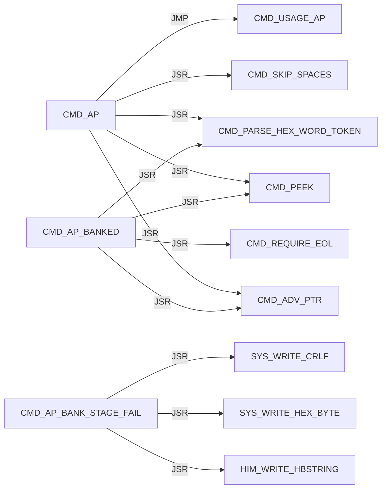

Panel 2 of 3: `CMD_AP_BANKED` through `CMD_AP_LOAD_REQUEST`.

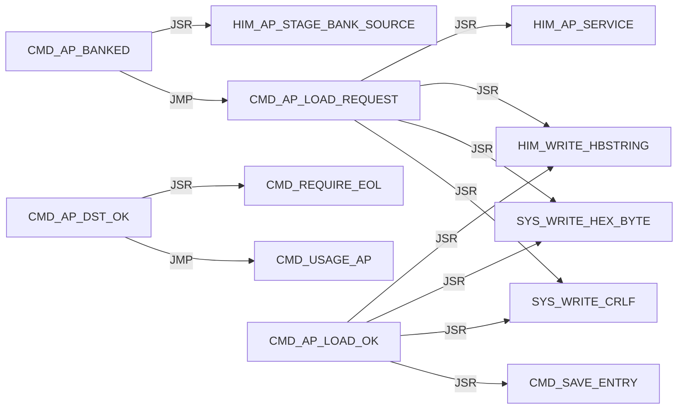

Panel 3 of 3: `CMD_AP_SRC_OK` through `CMD_AP_SRC_OK`.

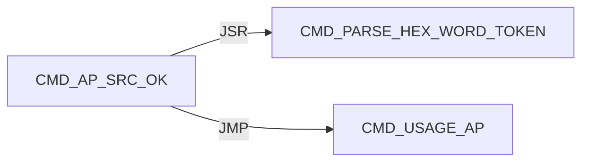

#### CMD / D

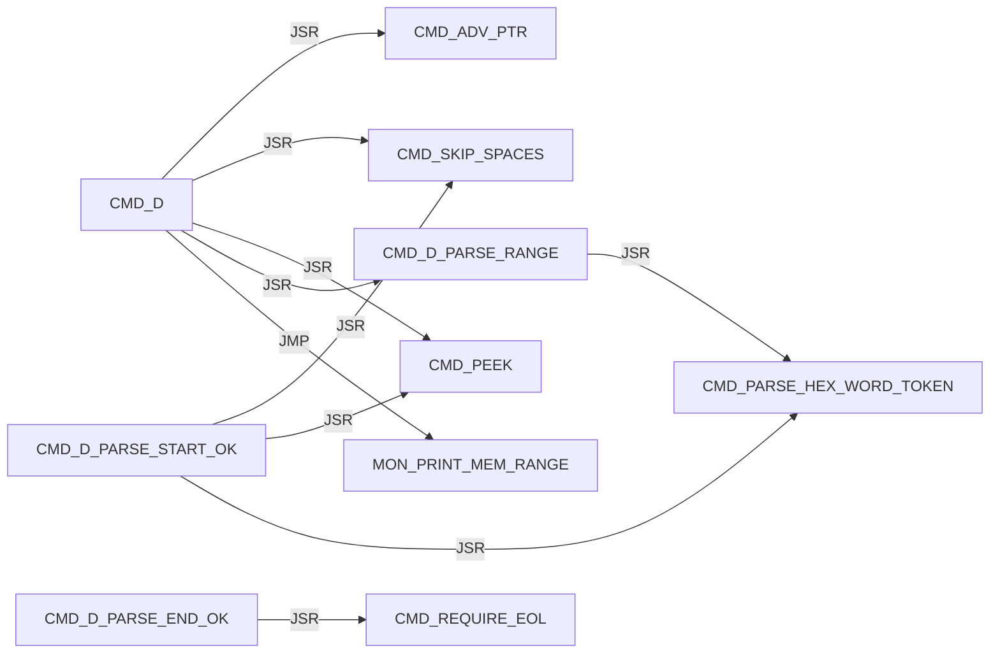

#### CMD / DISPATCH

Panel 1 of 2: `CMD_DISPATCH_DONE` through `CMD_DISPATCH_SCAN_MISS`.

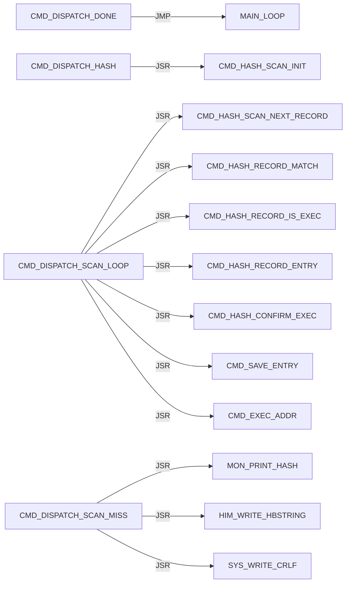

Panel 2 of 2: `CMD_DISPATCH_SCAN_MISS` through `CMD_DISPATCH_SCAN_NEXT`.

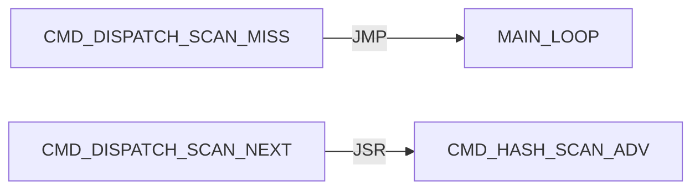

#### CMD / EXEC

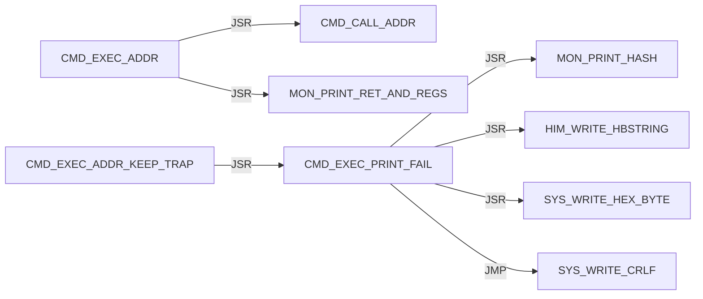

#### CMD / G

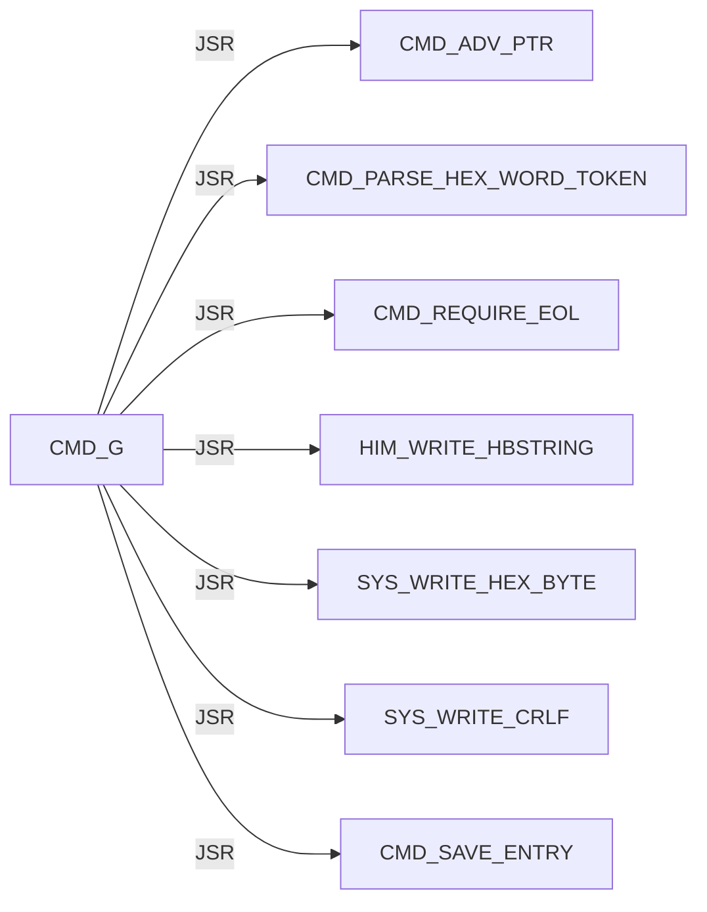

#### CMD / HASH

Panel 1 of 7: `CMD_HASH_CONFIRM_ADDR` through `CMD_HASH_FIND_LOOP`.

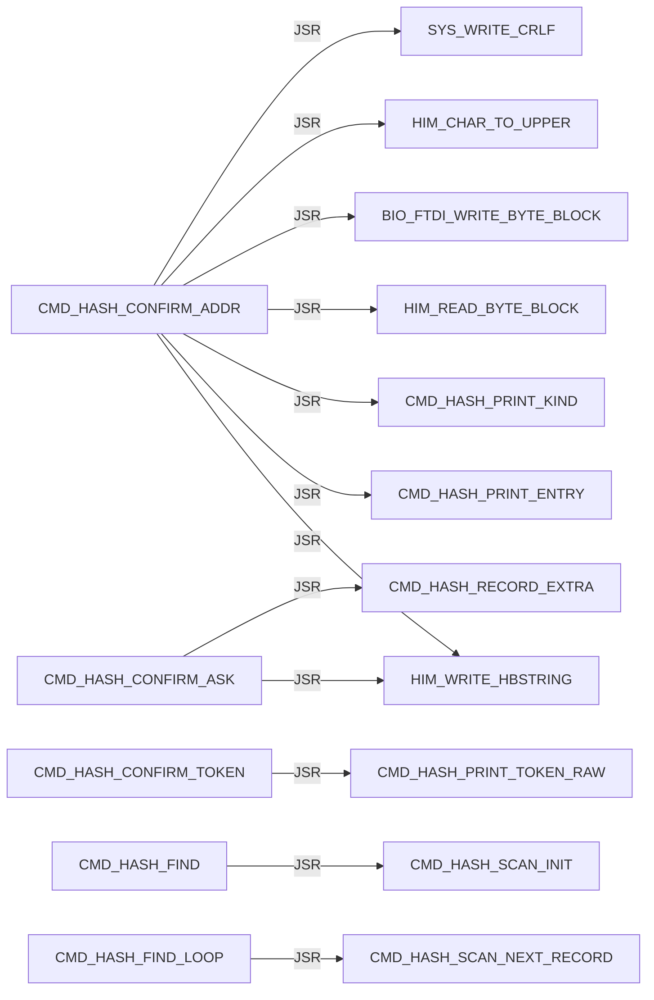

Panel 2 of 7: `CMD_HASH_FIND_LOOP` through `CMD_HASH_INFO_FOUND`.

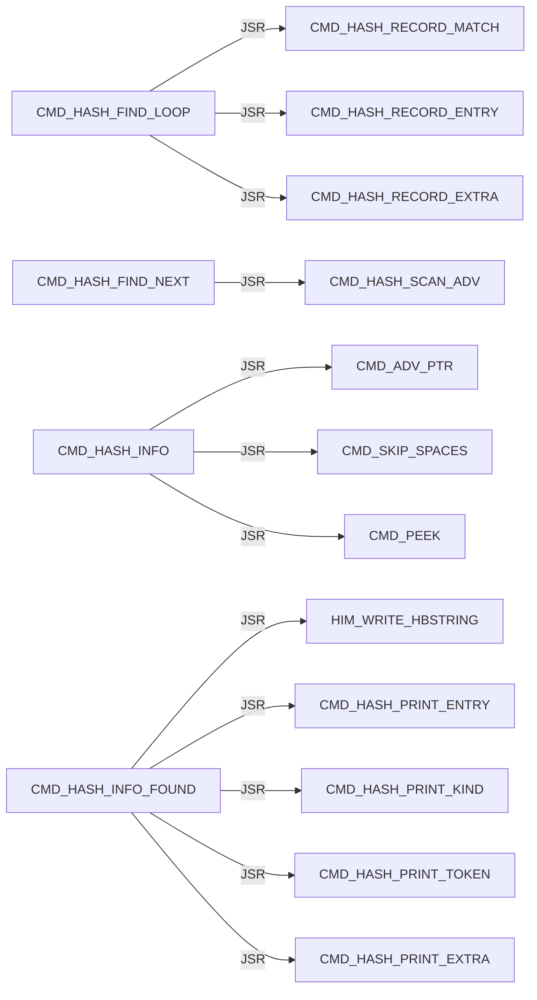

Panel 3 of 7: `CMD_HASH_INFO_FOUND` through `CMD_HASH_INFO_LOOKUP`.

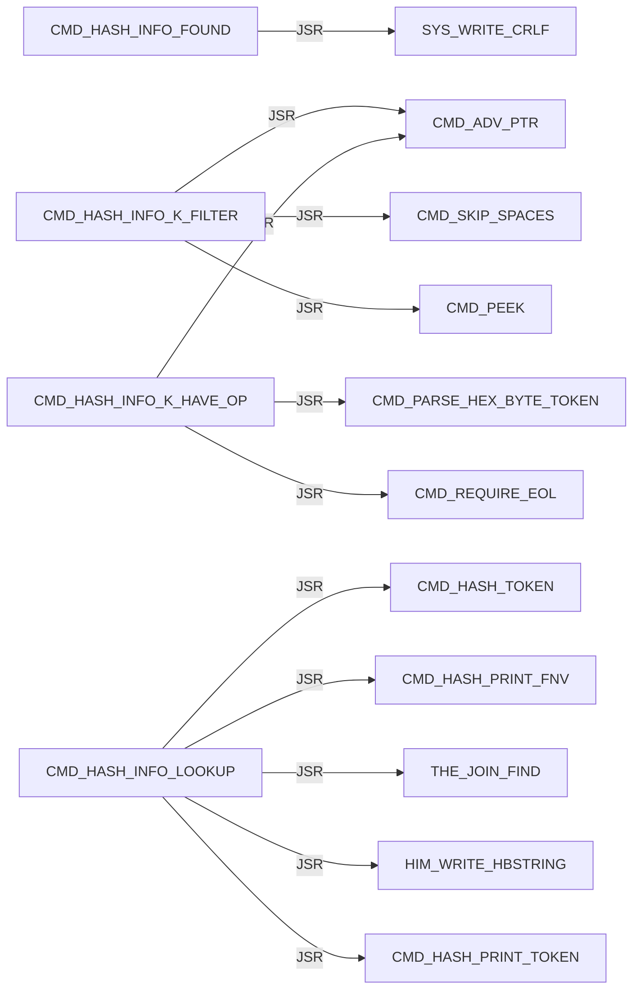

Panel 4 of 7: `CMD_HASH_INFO_LOOKUP` through `CMD_HASH_PRINT_EXTRA`.

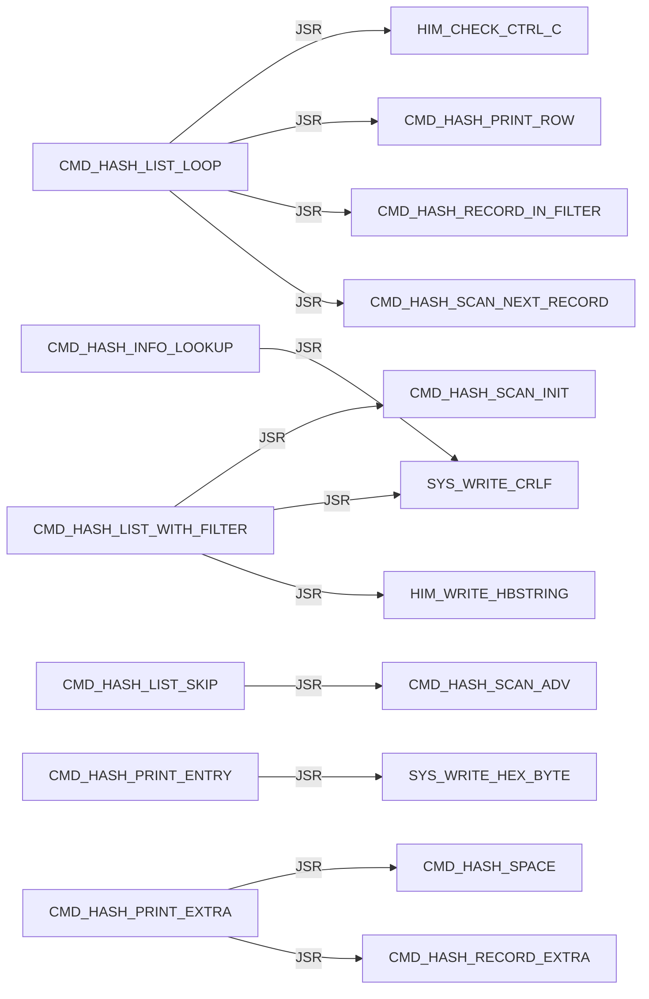

Panel 5 of 7: `CMD_HASH_PRINT_EXTRA` through `CMD_HASH_PRINT_TOKEN`.

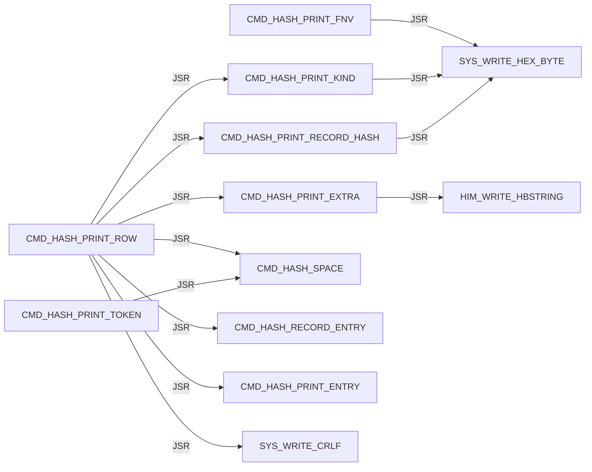

Panel 6 of 7: `CMD_HASH_PRINT_TOKEN_LOOP` through `CMD_HASH_TOKEN_LOOP`.

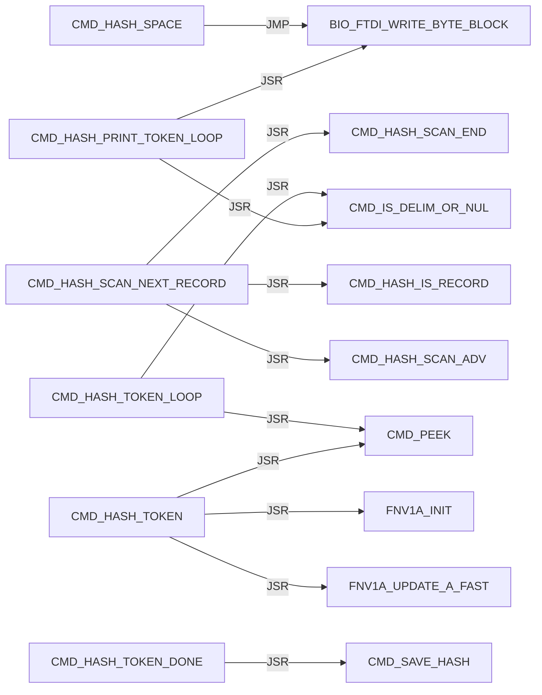

Panel 7 of 7: `CMD_HASH_TOKEN_LOOP` through `CMD_HASH_USAGE`.

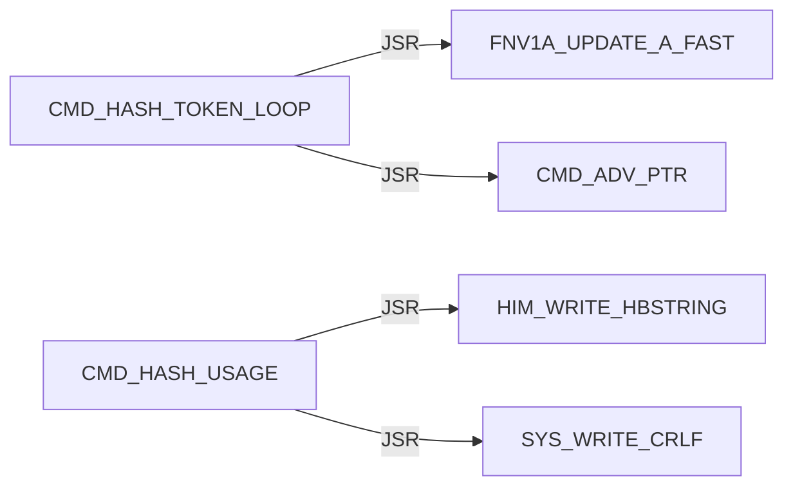

#### CMD / HELP


#### CMD / L

Panel 1 of 4: `CMD_L` through `CMD_L_DONE_PRINT`.

```mermaid
flowchart LR
    N0["CMD_L"] -->|JSR| N1["CMD_ADV_PTR"]
    N0["CMD_L"] -->|JSR| N2["CMD_SKIP_SPACES"]
    N0["CMD_L"] -->|JSR| N3["CMD_PEEK"]
    N4["CMD_L_ARG_F"] -->|JSR| N1["CMD_ADV_PTR"]
    N4["CMD_L_ARG_F"] -->|JSR| N5["CMD_REQUIRE_EOL"]
    N6["CMD_L_ARG_G"] -->|JSR| N1["CMD_ADV_PTR"]
    N6["CMD_L_ARG_G"] -->|JSR| N5["CMD_REQUIRE_EOL"]
    N7["CMD_L_ARGS_OK"] -->|JSR| N8["L_STR8_REQUIRE_SERVICE"]
    N7["CMD_L_ARGS_OK"] -->|JSR| N9["CMD_L_PRINT_FAIL"]
    N10["CMD_L_DONE_PRINT"] -->|JSR| N11["HIM_WRITE_HBSTRING"]
    N10["CMD_L_DONE_PRINT"] -->|JSR| N12["SYS_WRITE_HEX_BYTE"]
    N10["CMD_L_DONE_PRINT"] -->|JSR| N13["SYS_WRITE_CRLF"]
```

Panel 2 of 4: `CMD_L_FLASH_FAIL_DRAIN` through `CMD_L_PRINT_FAIL_ERASE`.

```mermaid
flowchart LR
    N0["CMD_L_FLASH_FAIL_DRAIN"] -->|JSR| N1["CMD_L_LATCH_FLASH_FAIL"]
    N2["CMD_L_HAVE_LINE"] -->|JSR| N3["CMD_PEEK"]
    N4["CMD_L_KEEP_FAIL_CODE"] -->|JSR| N5["L_PARSE_RECORD_STR8"]
    N4["CMD_L_KEEP_FAIL_CODE"] -->|JSR| N6["CMD_L_PRINT_FAIL"]
    N4["CMD_L_KEEP_FAIL_CODE"] -->|JMP| N7["CMD_L_FAIL_EXIT"]
    N6["CMD_L_PRINT_FAIL"] -->|JSR| N8["HIM_WRITE_HBSTRING"]
    N6["CMD_L_PRINT_FAIL"] -->|JSR| N9["SYS_WRITE_HEX_BYTE"]
    N6["CMD_L_PRINT_FAIL"] -->|JMP| N10["SYS_WRITE_CRLF"]
    N11["CMD_L_PRINT_FAIL_ERASE"] -->|JSR| N8["HIM_WRITE_HBSTRING"]
    N11["CMD_L_PRINT_FAIL_ERASE"] -->|JSR| N12["CMD_L_PRINT_LOAD_DST"]
    N11["CMD_L_PRINT_FAIL_ERASE"] -->|JSR| N9["SYS_WRITE_HEX_BYTE"]
    N11["CMD_L_PRINT_FAIL_ERASE"] -->|JMP| N10["SYS_WRITE_CRLF"]
```

Panel 3 of 4: `CMD_L_PRINT_FAIL_PROTECT` through `CMD_L_PRINT_LOAD_DST`.

```mermaid
flowchart LR
    N0["CMD_L_PRINT_FAIL_PROTECT"] -->|JSR| N1["HIM_WRITE_HBSTRING"]
    N0["CMD_L_PRINT_FAIL_PROTECT"] -->|JSR| N2["CMD_L_PRINT_LOAD_DST"]
    N0["CMD_L_PRINT_FAIL_PROTECT"] -->|JMP| N3["SYS_WRITE_CRLF"]
    N4["CMD_L_PRINT_FAIL_WRITE"] -->|JSR| N1["HIM_WRITE_HBSTRING"]
    N4["CMD_L_PRINT_FAIL_WRITE"] -->|JSR| N2["CMD_L_PRINT_LOAD_DST"]
    N4["CMD_L_PRINT_FAIL_WRITE"] -->|JSR| N5["SYS_WRITE_HEX_BYTE"]
    N4["CMD_L_PRINT_FAIL_WRITE"] -->|JMP| N3["SYS_WRITE_CRLF"]
    N6["CMD_L_PRINT_FLASH_FAIL_DONE"] -->|JSR| N1["HIM_WRITE_HBSTRING"]
    N6["CMD_L_PRINT_FLASH_FAIL_DONE"] -->|JSR| N5["SYS_WRITE_HEX_BYTE"]
    N6["CMD_L_PRINT_FLASH_FAIL_DONE"] -->|JSR| N3["SYS_WRITE_CRLF"]
    N6["CMD_L_PRINT_FLASH_FAIL_DONE"] -->|JMP| N7["CMD_L_FAIL_EXIT"]
    N2["CMD_L_PRINT_LOAD_DST"] -->|JSR| N5["SYS_WRITE_HEX_BYTE"]
```

Panel 4 of 4: `CMD_L_PRINT_LOAD_DST` through `CMD_L_SERVICE_OK`.

```mermaid
flowchart LR
    N0["CMD_L_PRINT_LOAD_DST"] -->|JMP| N1["SYS_WRITE_HEX_BYTE"]
    N2["CMD_L_READ_LOOP"] -->|JSR| N3["HIM_READ_LINE_UPPER"]
    N2["CMD_L_READ_LOOP"] -->|JSR| N4["HIM_WRITE_HBSTRING"]
    N2["CMD_L_READ_LOOP"] -->|JSR| N1["SYS_WRITE_HEX_BYTE"]
    N2["CMD_L_READ_LOOP"] -->|JSR| N5["SYS_WRITE_CRLF"]
    N6["CMD_L_READY_PRINT"] -->|JSR| N4["HIM_WRITE_HBSTRING"]
    N6["CMD_L_READY_PRINT"] -->|JSR| N5["SYS_WRITE_CRLF"]
    N7["CMD_L_SERVICE_OK"] -->|JSR| N8["DBG_CLEAR_ALL"]
```

#### CMD / M

```mermaid
flowchart LR
    N0["CMD_M"] -->|JSR| N1["CMD_ADV_PTR"]
    N0["CMD_M"] -->|JSR| N2["CMD_PARSE_RANGE_REQUIRED"]
    N0["CMD_M"] -->|JSR| N3["MON_MODIFY_RANGE_WRITABLE"]
    N0["CMD_M"] -->|JSR| N4["MON_MODIFY_RANGE"]
    N5["CMD_M_PROTECT"] -->|JSR| N6["HIM_WRITE_HBSTRING"]
    N5["CMD_M_PROTECT"] -->|JSR| N7["SYS_WRITE_HEX_BYTE"]
    N5["CMD_M_PROTECT"] -->|JSR| N8["SYS_WRITE_CRLF"]
```

#### CMD / PARSE

Panel 1 of 2: `CMD_PARSE_HEX_BYTE_TOKEN` through `CMD_PARSE_RANGE_PLUS`.

```mermaid
flowchart LR
    N0["CMD_PARSE_HEX_BYTE_TOKEN"] -->|JSR| N1["CMD_PARSE_HEX_WORD_TOKEN"]
    N2["CMD_PARSE_HEX_WORD_DONE"] -->|JSR| N3["CMD_PEEK"]
    N2["CMD_PARSE_HEX_WORD_DONE"] -->|JSR| N4["CMD_IS_DELIM_OR_NUL"]
    N5["CMD_PARSE_HEX_WORD_LOOP"] -->|JSR| N3["CMD_PEEK"]
    N5["CMD_PARSE_HEX_WORD_LOOP"] -->|JSR| N6["CMD_HEX_ASCII_TO_NIBBLE"]
    N5["CMD_PARSE_HEX_WORD_LOOP"] -->|JSR| N7["CMD_ADV_PTR"]
    N1["CMD_PARSE_HEX_WORD_TOKEN"] -->|JSR| N8["CMD_SKIP_SPACES"]
    N1["CMD_PARSE_HEX_WORD_TOKEN"] -->|JSR| N9["CMD_SKIP_OPTIONAL_DOLLAR"]
    N10["CMD_PARSE_RANGE_COUNT_OK"] -->|JMP| N11["CMD_PARSE_RANGE_FAIL"]
    N12["CMD_PARSE_RANGE_HAVE_END"] -->|JSR| N13["CMD_REQUIRE_EOL"]
    N14["CMD_PARSE_RANGE_PLUS"] -->|JSR| N7["CMD_ADV_PTR"]
    N14["CMD_PARSE_RANGE_PLUS"] -->|JSR| N1["CMD_PARSE_HEX_WORD_TOKEN"]
```

Panel 2 of 2: `CMD_PARSE_RANGE_PLUS` through `CMD_PARSE_RANGE_START_OK`.

```mermaid
flowchart LR
    N0["CMD_PARSE_RANGE_PLUS"] -->|JMP| N1["CMD_PARSE_RANGE_FAIL"]
    N2["CMD_PARSE_RANGE_REQUIRED"] -->|JSR| N3["CMD_PARSE_HEX_WORD_TOKEN"]
    N2["CMD_PARSE_RANGE_REQUIRED"] -->|JMP| N1["CMD_PARSE_RANGE_FAIL"]
    N4["CMD_PARSE_RANGE_START_OK"] -->|JSR| N5["CMD_SKIP_SPACES"]
    N4["CMD_PARSE_RANGE_START_OK"] -->|JSR| N6["CMD_PEEK"]
    N4["CMD_PARSE_RANGE_START_OK"] -->|JSR| N3["CMD_PARSE_HEX_WORD_TOKEN"]
    N4["CMD_PARSE_RANGE_START_OK"] -->|JMP| N1["CMD_PARSE_RANGE_FAIL"]
```

#### CMD / Q

```mermaid
flowchart LR
    N0["CMD_Q"] -->|JMP| N1["MON_REENTER"]
```

#### CMD / R

```mermaid
flowchart LR
    N0["CMD_R"] -->|JSR| N1["MON_CTX_REQUIRE_VALID"]
    N2["CMD_R_HAVE_CTX"] -->|JSR| N3["CMD_ADV_PTR"]
    N2["CMD_R_HAVE_CTX"] -->|JSR| N4["MON_CTX_PARSE_ASSIGN_LIST"]
    N2["CMD_R_HAVE_CTX"] -->|JSR| N5["MON_PRINT_STOP_AND_REGS"]
```

#### CMD / REQUIRE

```mermaid
flowchart LR
    N0["CMD_REQUIRE_EOL"] -->|JSR| N1["CMD_SKIP_SPACES"]
    N0["CMD_REQUIRE_EOL"] -->|JSR| N2["CMD_PEEK"]
```

#### CMD / SKIP

```mermaid
flowchart LR
    N0["CMD_SKIP_OPTIONAL_DOLLAR"] -->|JSR| N1["CMD_PEEK"]
    N0["CMD_SKIP_OPTIONAL_DOLLAR"] -->|JSR| N2["CMD_ADV_PTR"]
    N3["CMD_SKIP_SPACES"] -->|JSR| N1["CMD_PEEK"]
    N4["CMD_SKIP_SPACES_ADV"] -->|JSR| N2["CMD_ADV_PTR"]
```

#### CMD / UNKNOWN

```mermaid
flowchart LR
    N0["CMD_UNKNOWN"] -->|JSR| N1["HIM_WRITE_HBSTRING"]
    N0["CMD_UNKNOWN"] -->|JSR| N2["SYS_WRITE_CRLF"]
    N0["CMD_UNKNOWN"] -->|JMP| N3["MAIN_LOOP"]
```

#### CMD / USAGE

Panel 1 of 2: `CMD_USAGE_AP` through `CMD_USAGE_R`.

```mermaid
flowchart LR
    N0["CMD_USAGE_AP"] -->|JSR| N1["HIM_WRITE_HBSTRING"]
    N0["CMD_USAGE_AP"] -->|JSR| N2["SYS_WRITE_CRLF"]
    N3["CMD_USAGE_D"] -->|JSR| N1["HIM_WRITE_HBSTRING"]
    N3["CMD_USAGE_D"] -->|JSR| N2["SYS_WRITE_CRLF"]
    N4["CMD_USAGE_G"] -->|JSR| N1["HIM_WRITE_HBSTRING"]
    N4["CMD_USAGE_G"] -->|JSR| N2["SYS_WRITE_CRLF"]
    N5["CMD_USAGE_L"] -->|JSR| N1["HIM_WRITE_HBSTRING"]
    N5["CMD_USAGE_L"] -->|JSR| N2["SYS_WRITE_CRLF"]
    N6["CMD_USAGE_L_JMP"] -->|JMP| N5["CMD_USAGE_L"]
    N7["CMD_USAGE_M"] -->|JSR| N1["HIM_WRITE_HBSTRING"]
    N7["CMD_USAGE_M"] -->|JSR| N2["SYS_WRITE_CRLF"]
    N8["CMD_USAGE_R"] -->|JSR| N1["HIM_WRITE_HBSTRING"]
```

Panel 2 of 2: `CMD_USAGE_R` through `CMD_USAGE_X`.

```mermaid
flowchart LR
    N0["CMD_USAGE_R"] -->|JSR| N1["SYS_WRITE_CRLF"]
    N2["CMD_USAGE_X"] -->|JSR| N3["HIM_WRITE_HBSTRING"]
    N2["CMD_USAGE_X"] -->|JSR| N1["SYS_WRITE_CRLF"]
```

#### CMD / X

```mermaid
flowchart LR
    N0["CMD_X"] -->|JSR| N1["MON_CTX_REQUIRE_VALID"]
    N2["CMD_X_HAVE_CTX"] -->|JSR| N3["CMD_ADV_PTR"]
    N2["CMD_X_HAVE_CTX"] -->|JSR| N4["MON_CTX_PARSE_ASSIGN_LIST"]
    N2["CMD_X_HAVE_CTX"] -->|JSR| N5["HIM_WRITE_HBSTRING"]
    N2["CMD_X_HAVE_CTX"] -->|JSR| N6["SYS_WRITE_HEX_BYTE"]
    N2["CMD_X_HAVE_CTX"] -->|JSR| N7["SYS_WRITE_CRLF"]
    N2["CMD_X_HAVE_CTX"] -->|JMP| N8["MON_CTX_RESUME_RTI"]
```

#### ENTRY / unprefixed

```mermaid
flowchart LR
    N0["START"] -->|JMP| N1["HIMON_START_BODY"]
```

#### FNV1A

```mermaid
flowchart LR
    N0["FNV1A_MUL_PRIME"] -->|JSR| N1["MATH_COPY_HASH_TO_TERM"]
    N0["FNV1A_MUL_PRIME"] -->|JSR| N2["MATH_SHLADD_TERM_N"]
    N0["FNV1A_MUL_PRIME"] -->|JMP| N3["MATH_ADD_TERM1_TO_HASH3"]
    N4["FNV1A_MUL_PRIME_FAST"] -->|JSR| N1["MATH_COPY_HASH_TO_TERM"]
    N4["FNV1A_MUL_PRIME_FAST"] -->|JSR| N5["MATH_ADD_TERM_TO_HASH"]
    N4["FNV1A_MUL_PRIME_FAST"] -->|JMP| N3["MATH_ADD_TERM1_TO_HASH3"]
    N6["FNV1A_UPDATE_A"] -->|JMP| N0["FNV1A_MUL_PRIME"]
    N7["FNV1A_UPDATE_A_FAST"] -->|JMP| N4["FNV1A_MUL_PRIME_FAST"]
```

#### HIM / AP

Panel 1 of 9: `HIM_AP_ADVANCE_A` through `HIM_AP_LINK_HASH_CODE_UPDATE`.

```mermaid
flowchart LR
    N0["HIM_AP_ADVANCE_A"] -->|JSR| N1["HIM_AP_NEED_A"]
    N2["HIM_AP_CHECK_RELOC_COUNT_OK"] -->|JMP| N3["HIM_AP_BAD_LINE"]
    N4["HIM_AP_CHECK_RELOC_REC"] -->|JMP| N3["HIM_AP_BAD_LINE"]
    N5["HIM_AP_FIND_HOLE_LOOP"] -->|JSR| N6["HIM_AP_HOLE_AT_SCAN"]
    N7["HIM_AP_FIND_HOLE_NEXT"] -->|JMP| N8["HIM_AP_BAD_RANGE"]
    N9["HIM_AP_IMPORT_LINK"] -->|JSR| N10["HIM_AP_LINK_RELOAD_REL_PTR"]
    N11["HIM_AP_LINK_CAPTURE_ROW_X"] -->|JSR| N12["HIM_AP_RELOC_KIND_X"]
    N11["HIM_AP_LINK_CAPTURE_ROW_X"] -->|JSR| N13["HIM_AP_RELOC_SITE_LO_X"]
    N11["HIM_AP_LINK_CAPTURE_ROW_X"] -->|JSR| N14["HIM_AP_RELOC_SITE_HI_X"]
    N15["HIM_AP_LINK_DONE"] -->|JSR| N16["HIM_AP_LINK_RESTORE_COUNTS"]
    N17["HIM_AP_LINK_FAIL"] -->|JSR| N16["HIM_AP_LINK_RESTORE_COUNTS"]
    N18["HIM_AP_LINK_HASH_CODE_UPDATE"] -->|JSR| N19["FNV1A_UPDATE_A_FAST"]
```

Panel 2 of 9: `HIM_AP_LINK_HASH_LOOP` through `HIM_AP_LINK_RESOLVE_ROW_X`.

```mermaid
flowchart LR
    N0["HIM_AP_LINK_HASH_LOOP"] -->|JSR| N1["HIM_AP_LINK_UNPACK_NEXT3"]
    N0["HIM_AP_LINK_HASH_LOOP"] -->|JSR| N2["HIM_AP_LINK_HASH_CODE_A"]
    N3["HIM_AP_LINK_HASH_PACK_PTR_OK"] -->|JSR| N4["FNV1A_INIT"]
    N5["HIM_AP_LINK_HASH_SLOT_X"] -->|JSR| N6["HIM_AP_LINK_IMPORT_ROW_PTR_X"]
    N7["HIM_AP_LINK_IMPORT_ROW_LOOP"] -->|JSR| N8["HIM_AP_LINK_IMPORT_ROW_BYTES_A"]
    N9["HIM_AP_LINK_PATCH"] -->|JSR| N10["HIM_AP_LINK_RELOAD_REL_PTR"]
    N9["HIM_AP_LINK_PATCH"] -->|JSR| N11["HIM_AP_RELOC_KIND_X"]
    N9["HIM_AP_LINK_PATCH"] -->|JSR| N12["HIM_AP_IMPORT_KIND_A"]
    N9["HIM_AP_LINK_PATCH"] -->|JSR| N13["HIM_AP_LINK_CAPTURE_ROW_X"]
    N9["HIM_AP_LINK_PATCH"] -->|JSR| N14["HIM_AP_LINK_RESOLVE_ROW_X"]
    N9["HIM_AP_LINK_PATCH"] -->|JSR| N15["HIM_AP_LINK_PATCH_CAPTURED"]
    N14["HIM_AP_LINK_RESOLVE_ROW_X"] -->|JSR| N16["HIM_AP_RELOC_TARGET_HI_X"]
```

Panel 3 of 9: `HIM_AP_LINK_RESOLVE_ROW_X` through `HIM_AP_LOAD_LAST_NO_CARRY`.

```mermaid
flowchart LR
    N0["HIM_AP_LINK_RESOLVE_ROW_X"] -->|JSR| N1["HIM_AP_RELOC_TARGET_LO_X"]
    N0["HIM_AP_LINK_RESOLVE_ROW_X"] -->|JSR| N2["HIM_AP_LINK_RESOLVE_SLOT_X"]
    N2["HIM_AP_LINK_RESOLVE_SLOT_X"] -->|JSR| N3["HIM_AP_LINK_HASH_SLOT_X"]
    N2["HIM_AP_LINK_RESOLVE_SLOT_X"] -->|JSR| N4["THE_JOIN_EXEC_XY"]
    N5["HIM_AP_LINK_VALIDATE"] -->|JSR| N6["HIM_AP_LINK_RELOAD_REL_PTR"]
    N5["HIM_AP_LINK_VALIDATE"] -->|JSR| N7["HIM_AP_RELOC_KIND_X"]
    N5["HIM_AP_LINK_VALIDATE"] -->|JSR| N8["HIM_AP_IMPORT_KIND_A"]
    N5["HIM_AP_LINK_VALIDATE"] -->|JSR| N9["HIM_AP_RELOC_SITE_OK_X"]
    N5["HIM_AP_LINK_VALIDATE"] -->|JSR| N0["HIM_AP_LINK_RESOLVE_ROW_X"]
    N10["HIM_AP_LOAD_BASE_GE_20"] -->|JMP| N11["HIM_AP_BAD_RANGE"]
    N12["HIM_AP_LOAD_BASE_LT_50"] -->|JMP| N11["HIM_AP_BAD_RANGE"]
    N13["HIM_AP_LOAD_LAST_NO_CARRY"] -->|JMP| N11["HIM_AP_BAD_RANGE"]
```

Panel 4 of 9: `HIM_AP_LOAD_LEN_NONZERO` through `HIM_AP_LOAD_RANGE_OK`.

```mermaid
flowchart LR
    N0["HIM_AP_LOAD_LEN_NONZERO"] -->|JMP| N1["HIM_AP_BAD_RANGE"]
    N2["HIM_AP_LOAD_NO_OVERLAP"] -->|JSR| N3["HIM_AP_COPY_BODY_TO_DST"]
    N2["HIM_AP_LOAD_NO_OVERLAP"] -->|JSR| N4["HIM_AP_IMPORT_LINK"]
    N5["HIM_AP_LOAD_OVERLAP_BAD"] -->|JMP| N1["HIM_AP_BAD_RANGE"]
    N6["HIM_AP_LOAD_PARSED"] -->|JSR| N7["HIM_AP_LOAD_RANGE_OK"]
    N8["HIM_AP_LOAD_PATCH_LOOP"] -->|JSR| N9["HIM_AP_RELOC_KIND_X"]
    N8["HIM_AP_LOAD_PATCH_LOOP"] -->|JSR| N10["HIM_AP_INTERNAL_KIND_A"]
    N8["HIM_AP_LOAD_PATCH_LOOP"] -->|JSR| N11["HIM_AP_IMPORT_KIND_A"]
    N8["HIM_AP_LOAD_PATCH_LOOP"] -->|JMP| N12["HIM_AP_BAD_FIX"]
    N13["HIM_AP_LOAD_PATCH_ROW"] -->|JSR| N14["HIM_AP_RELOC_SITE_OK_X"]
    N15["HIM_AP_LOAD_PATCH_SITE_OK"] -->|JSR| N16["HIM_AP_RELOC_PATCH_ROW_X"]
    N7["HIM_AP_LOAD_RANGE_OK"] -->|JMP| N1["HIM_AP_BAD_RANGE"]
```

Panel 5 of 9: `HIM_AP_NEED_A` through `HIM_AP_PARSE_IMPORT_LEN_OK`.

```mermaid
flowchart LR
    N0["HIM_AP_NEED_A"] -->|JMP| N1["HIM_AP_BAD_RANGE"]
    N2["HIM_AP_PARSE_BODY"] -->|JSR| N0["HIM_AP_NEED_A"]
    N3["HIM_AP_PARSE_BODY_HDR_ROOM"] -->|JMP| N4["HIM_AP_BAD_LINE"]
    N5["HIM_AP_PARSE_BODY_LEFT_LO_OK"] -->|JMP| N4["HIM_AP_BAD_LINE"]
    N6["HIM_AP_PARSE_BODY_LEFT_OK"] -->|JMP| N4["HIM_AP_BAD_LINE"]
    N7["HIM_AP_PARSE_BODY_SAVE"] -->|JMP| N4["HIM_AP_BAD_LINE"]
    N8["HIM_AP_PARSE_BODY_TAG_OK"] -->|JSR| N9["HIM_AP_ADVANCE_A"]
    N10["HIM_AP_PARSE_EXPORT"] -->|JSR| N11["HIM_AP_TAG_LEN"]
    N12["HIM_AP_PARSE_EXPORT_TAG_OK"] -->|JSR| N9["HIM_AP_ADVANCE_A"]
    N13["HIM_AP_PARSE_HEADER_RANGE"] -->|JMP| N4["HIM_AP_BAD_LINE"]
    N14["HIM_AP_PARSE_IMPORT"] -->|JSR| N11["HIM_AP_TAG_LEN"]
    N15["HIM_AP_PARSE_IMPORT_LEN_OK"] -->|JSR| N0["HIM_AP_NEED_A"]
```

Panel 6 of 9: `HIM_AP_PARSE_IMPORT_ROOM_OK` through `HIM_AP_PARSE_SEAL_LEN_OK`.

```mermaid
flowchart LR
    N0["HIM_AP_PARSE_IMPORT_ROOM_OK"] -->|JSR| N1["HIM_AP_ADVANCE_A"]
    N2["HIM_AP_PARSE_IMPORT_TAG_OK"] -->|JMP| N3["HIM_AP_BAD_LINE"]
    N4["HIM_AP_PARSE_LEN_NONZERO"] -->|JSR| N5["HIM_AP_SOURCE_RANGE_OK"]
    N6["HIM_AP_PARSE_MIN"] -->|JSR| N5["HIM_AP_SOURCE_RANGE_OK"]
    N7["HIM_AP_PARSE_RANGE_SAFE"] -->|JMP| N3["HIM_AP_BAD_LINE"]
    N8["HIM_AP_PARSE_RELOC"] -->|JSR| N9["HIM_AP_TAG_LEN"]
    N10["HIM_AP_PARSE_RELOC_LEN_OK"] -->|JSR| N11["HIM_AP_NEED_A"]
    N12["HIM_AP_PARSE_RELOC_ROOM_OK"] -->|JSR| N13["HIM_AP_CHECK_RELOC_REC"]
    N14["HIM_AP_PARSE_RELOC_SHAPE_OK"] -->|JSR| N1["HIM_AP_ADVANCE_A"]
    N15["HIM_AP_PARSE_RELOC_TAG_OK"] -->|JMP| N3["HIM_AP_BAD_LINE"]
    N16["HIM_AP_PARSE_SEAL"] -->|JSR| N9["HIM_AP_TAG_LEN"]
    N17["HIM_AP_PARSE_SEAL_LEN_OK"] -->|JSR| N1["HIM_AP_ADVANCE_A"]
```

Panel 7 of 9: `HIM_AP_PARSE_SEAL_TAG_OK` through `HIM_AP_RELOC_SITE_HI_EQ`.

```mermaid
flowchart LR
    N0["HIM_AP_PARSE_SEAL_TAG_OK"] -->|JMP| N1["HIM_AP_BAD_LINE"]
    N2["HIM_AP_PARSE_SIG0_OK"] -->|JMP| N1["HIM_AP_BAD_LINE"]
    N3["HIM_AP_PARSE_SIG1_OK"] -->|JMP| N1["HIM_AP_BAD_LINE"]
    N4["HIM_AP_PARSE_VER_OK"] -->|JMP| N1["HIM_AP_BAD_LINE"]
    N5["HIM_AP_RELOC_PATCH_ROW_X"] -->|JSR| N6["HIM_AP_RELOC_SITE_LO_X"]
    N5["HIM_AP_RELOC_PATCH_ROW_X"] -->|JSR| N7["HIM_AP_RELOC_SITE_HI_X"]
    N5["HIM_AP_RELOC_PATCH_ROW_X"] -->|JSR| N8["HIM_AP_RELOC_TARGET_LO_X"]
    N5["HIM_AP_RELOC_PATCH_ROW_X"] -->|JSR| N9["HIM_AP_RELOC_TARGET_HI_X"]
    N10["HIM_AP_RELOC_SITE_HAVE_ADD"] -->|JSR| N6["HIM_AP_RELOC_SITE_LO_X"]
    N10["HIM_AP_RELOC_SITE_HAVE_ADD"] -->|JSR| N7["HIM_AP_RELOC_SITE_HI_X"]
    N10["HIM_AP_RELOC_SITE_HAVE_ADD"] -->|JMP| N11["HIM_AP_BAD_FIX"]
    N12["HIM_AP_RELOC_SITE_HI_EQ"] -->|JMP| N11["HIM_AP_BAD_FIX"]
```

Panel 8 of 9: `HIM_AP_RELOC_SITE_NO_CARRY` through `HIM_AP_SOURCE_BASE_SAFE`.

```mermaid
flowchart LR
    N0["HIM_AP_RELOC_SITE_NO_CARRY"] -->|JMP| N1["HIM_AP_BAD_FIX"]
    N2["HIM_AP_RELOC_SITE_OK_X"] -->|JSR| N3["HIM_AP_RELOC_KIND_X"]
    N4["HIM_AP_SERVICE"] -->|JMP| N5["HIM_AP_SERVICE_SUGGEST"]
    N6["HIM_AP_SERVICE_BAD_OP"] -->|JMP| N7["HIM_AP_BAD_LINE"]
    N8["HIM_AP_SERVICE_LINK"] -->|JMP| N9["HIM_AP_IMPORT_LINK"]
    N10["HIM_AP_SERVICE_LOAD"] -->|JSR| N11["HIM_AP_PARSE_MIN"]
    N12["HIM_AP_SERVICE_PARSE"] -->|JMP| N11["HIM_AP_PARSE_MIN"]
    N5["HIM_AP_SERVICE_SUGGEST"] -->|JSR| N11["HIM_AP_PARSE_MIN"]
    N13["HIM_AP_SOURCE_BASE_BAD"] -->|JMP| N14["HIM_AP_BAD_RANGE"]
    N15["HIM_AP_SOURCE_BASE_GE_20"] -->|JMP| N14["HIM_AP_BAD_RANGE"]
    N16["HIM_AP_SOURCE_BASE_GE_80"] -->|JMP| N14["HIM_AP_BAD_RANGE"]
    N17["HIM_AP_SOURCE_BASE_SAFE"] -->|JMP| N14["HIM_AP_BAD_RANGE"]
```

Panel 9 of 9: `HIM_AP_SOURCE_LAST_NO_CARRY` through `HIM_AP_TAG_LEN_TAG_OK`.

```mermaid
flowchart LR
    N0["HIM_AP_SOURCE_LAST_NO_CARRY"] -->|JMP| N1["HIM_AP_BAD_RANGE"]
    N2["HIM_AP_SOURCE_LEN_NONZERO"] -->|JSR| N3["HIM_AP_SOURCE_BASE_OK"]
    N4["HIM_AP_SOURCE_RAM_RANGE"] -->|JMP| N1["HIM_AP_BAD_RANGE"]
    N5["HIM_AP_SOURCE_RANGE_OK"] -->|JMP| N1["HIM_AP_BAD_RANGE"]
    N6["HIM_AP_SOURCE_STAGE_RANGE"] -->|JMP| N1["HIM_AP_BAD_RANGE"]
    N7["HIM_AP_STAGE_BANK_BAD"] -->|JMP| N1["HIM_AP_BAD_RANGE"]
    N8["HIM_AP_STAGE_BANK_SOURCE"] -->|JSR| N9["STR8_RUN_WORKER_SERVICE"]
    N10["HIM_AP_SUGGEST_PARSED"] -->|JSR| N11["HIM_AP_FIND_HOLE"]
    N12["HIM_AP_TAG_LEN"] -->|JSR| N13["HIM_AP_NEED_A"]
    N14["HIM_AP_TAG_LEN_ROOM_OK"] -->|JMP| N15["HIM_AP_BAD_LINE"]
    N16["HIM_AP_TAG_LEN_TAG_OK"] -->|JMP| N17["HIM_AP_ADVANCE_A"]
```

#### HIM / CHECK

```mermaid
flowchart LR
    N0["HIM_CHECK_CTRL_C"] -->|JSR| N1["BIO_FTDI_READ_BYTE_NONBLOCK"]
```

#### HIM / FLASH

```mermaid
flowchart LR
    N0["HIM_FLASH_INSTALL_BAD_JMP"] -->|JMP| N1["HIM_FLASH_INSTALL_BAD"]
    N2["HIM_FLASH_INSTALL_LOOP"] -->|JSR| N3["L_FLASH_SET_PTR"]
    N2["HIM_FLASH_INSTALL_LOOP"] -->|JSR| N4["FLASH_WRITE_BYTE_AXY"]
```

#### HIM / PACK40

```mermaid
flowchart LR
    N0["HIM_PACK40_ASCII_TO_CODE"] -->|JSR| N1["HIM_CHAR_TO_UPPER"]
    N2["HIM_PACK40_PACK3"] -->|JSR| N3["HIM_PACK40_MUL40"]
    N2["HIM_PACK40_PACK3"] -->|JSR| N4["HIM_PACK40_ADD_A"]
```

#### HIM / READ

```mermaid
flowchart LR
    N0["HIM_READ_BYTE_HW"] -->|JSR| N1["BIO_FTDI_READ_BYTE_BLOCK"]
    N2["HIM_READ_LINE_ABORT"] -->|JSR| N3["SYS_WRITE_CRLF"]
    N4["HIM_READ_LINE_BS_DEC"] -->|JSR| N5["BIO_FTDI_WRITE_BYTE_BLOCK"]
    N6["HIM_READ_LINE_DONE"] -->|JSR| N3["SYS_WRITE_CRLF"]
    N7["HIM_READ_LINE_LOOP"] -->|JSR| N8["HIM_READ_BYTE_BLOCK"]
    N7["HIM_READ_LINE_LOOP"] -->|JSR| N9["HIM_CHAR_TO_UPPER"]
    N7["HIM_READ_LINE_LOOP"] -->|JSR| N10["CMD_ADV_PTR"]
    N7["HIM_READ_LINE_LOOP"] -->|JSR| N5["BIO_FTDI_WRITE_BYTE_BLOCK"]
```

#### HIM / WRITE

```mermaid
flowchart LR
    N0["HIM_WRITE_HBSTRING_LAST"] -->|JSR| N1["BIO_FTDI_WRITE_BYTE_BLOCK"]
    N2["HIM_WRITE_HBSTRING_LOOP"] -->|JSR| N1["BIO_FTDI_WRITE_BYTE_BLOCK"]
```

#### HIMON

```mermaid
flowchart LR
    N0["HIMON_START_BODY"] -->|JMP| N1["HIMON_WARM_START_BODY"]
    N1["HIMON_WARM_START_BODY"] -->|JSR| N2["DBG_CLEAR_ALL"]
    N1["HIMON_WARM_START_BODY"] -->|JMP| N3["MON_START_INIT"]
```

#### L

```mermaid
flowchart LR
    N0["L_NOTE_S1_ADDR_PRINT"] -->|JSR| N1["BIO_FTDI_WRITE_BYTE_BLOCK"]
    N0["L_NOTE_S1_ADDR_PRINT"] -->|JSR| N2["SYS_WRITE_HEX_BYTE"]
    N0["L_NOTE_S1_ADDR_PRINT"] -->|JSR| N3["SYS_WRITE_CRLF"]
    N4["L_PARSE_RECORD_STR8"] -->|JSR| N5["STR8_RECORD_SERVICE"]
    N6["L_PARSE_RECORD_STR8_DATA"] -->|JMP| N7["L_PARSE_RECORD_STR8_FLASH_DATA"]
    N8["L_PARSE_RECORD_STR8_DATA_NORMAL"] -->|JMP| N9["L_PARSE_RECORD_STR8_DATA_DONE"]
    N10["L_PARSE_RECORD_STR8_FLASH_APPLY"] -->|JSR| N5["STR8_RECORD_SERVICE"]
    N7["L_PARSE_RECORD_STR8_FLASH_DATA"] -->|JSR| N11["L_NOTE_S1_ADDR"]
    N12["L_PARSE_RECORD_STR8_NONEMPTY"] -->|JMP| N13["L_PARSE_RECORD_STR8_RAM_DATA"]
    N14["L_PARSE_RECORD_STR8_SPAN_OK"] -->|JSR| N11["L_NOTE_S1_ADDR"]
```

#### MAIN

```mermaid
flowchart LR
    N0["MAIN_HAVE_LINE"] -->|JSR| N1["CMD_SKIP_SPACES"]
    N0["MAIN_HAVE_LINE"] -->|JSR| N2["CMD_PEEK"]
    N0["MAIN_HAVE_LINE"] -->|JSR| N3["CMD_HASH_TOKEN"]
    N0["MAIN_HAVE_LINE"] -->|JMP| N4["CMD_DISPATCH_HASH"]
    N5["MAIN_LOOP"] -->|JSR| N6["HIM_WRITE_HBSTRING"]
    N5["MAIN_LOOP"] -->|JSR| N7["HIM_READ_LINE_ECHO_UPPER"]
    N5["MAIN_LOOP"] -->|JMP| N5["MAIN_LOOP"]
```

#### MATH

```mermaid
flowchart LR
    N0["MATH_SHLADD_TERM_N"] -->|JSR| N1["MATH_SHL_TERM_N"]
    N0["MATH_SHLADD_TERM_N"] -->|JMP| N2["MATH_ADD_TERM_TO_HASH"]
```

#### MON / AFTER

```mermaid
flowchart LR
    N0["MON_AFTER_BANNER"] -->|JSR| N1["MON_PRINT_STOP_AND_REGS"]
```

#### MON / BRK

```mermaid
flowchart LR
    N0["MON_BRK_TRAP"] -->|JSR| N1["DBG_HANDLE_BRK"]
    N0["MON_BRK_TRAP"] -->|JMP| N2["MON_REENTER"]
    N3["MON_BRK_TRAP_NORMAL"] -->|JMP| N2["MON_REENTER"]
```

#### MON / CLEAR

```mermaid
flowchart LR
    N0["MON_CLEAR_RAM_ZP"] -->|JMP| N1["MON_START_INIT"]
```

#### MON / COLD

```mermaid
flowchart LR
    N0["MON_COLD_RESET"] -->|JMP| N1["MON_CLEAR_RAM"]
```

#### MON / CTX

Panel 1 of 3: `MON_CTX_PARSE_A` through `MON_CTX_PARSE_P_OR_PC`.

```mermaid
flowchart LR
    N0["MON_CTX_PARSE_A"] -->|JSR| N1["CMD_ADV_PTR"]
    N0["MON_CTX_PARSE_A"] -->|JSR| N2["MON_PARSE_EQ"]
    N0["MON_CTX_PARSE_A"] -->|JSR| N3["CMD_PARSE_HEX_BYTE_TOKEN"]
    N4["MON_CTX_PARSE_ASSIGN"] -->|JSR| N5["CMD_PEEK"]
    N6["MON_CTX_PARSE_ASSIGN_LIST"] -->|JSR| N7["CMD_SKIP_SPACES"]
    N6["MON_CTX_PARSE_ASSIGN_LIST"] -->|JSR| N5["CMD_PEEK"]
    N8["MON_CTX_PARSE_ASSIGN_LOOP"] -->|JSR| N4["MON_CTX_PARSE_ASSIGN"]
    N8["MON_CTX_PARSE_ASSIGN_LOOP"] -->|JSR| N7["CMD_SKIP_SPACES"]
    N8["MON_CTX_PARSE_ASSIGN_LOOP"] -->|JSR| N5["CMD_PEEK"]
    N9["MON_CTX_PARSE_P_OR_PC"] -->|JSR| N1["CMD_ADV_PTR"]
    N9["MON_CTX_PARSE_P_OR_PC"] -->|JSR| N5["CMD_PEEK"]
    N9["MON_CTX_PARSE_P_OR_PC"] -->|JSR| N2["MON_PARSE_EQ"]
```

Panel 2 of 3: `MON_CTX_PARSE_P_OR_PC` through `MON_CTX_PARSE_Y`.

```mermaid
flowchart LR
    N0["MON_CTX_PARSE_P_OR_PC"] -->|JSR| N1["CMD_PARSE_HEX_BYTE_TOKEN"]
    N2["MON_CTX_PARSE_PC"] -->|JSR| N3["CMD_ADV_PTR"]
    N2["MON_CTX_PARSE_PC"] -->|JSR| N4["MON_PARSE_EQ"]
    N2["MON_CTX_PARSE_PC"] -->|JSR| N5["CMD_PARSE_HEX_WORD_TOKEN"]
    N6["MON_CTX_PARSE_S"] -->|JSR| N3["CMD_ADV_PTR"]
    N6["MON_CTX_PARSE_S"] -->|JSR| N4["MON_PARSE_EQ"]
    N6["MON_CTX_PARSE_S"] -->|JSR| N1["CMD_PARSE_HEX_BYTE_TOKEN"]
    N7["MON_CTX_PARSE_X"] -->|JSR| N3["CMD_ADV_PTR"]
    N7["MON_CTX_PARSE_X"] -->|JSR| N4["MON_PARSE_EQ"]
    N7["MON_CTX_PARSE_X"] -->|JSR| N1["CMD_PARSE_HEX_BYTE_TOKEN"]
    N8["MON_CTX_PARSE_Y"] -->|JSR| N3["CMD_ADV_PTR"]
    N8["MON_CTX_PARSE_Y"] -->|JSR| N4["MON_PARSE_EQ"]
```

Panel 3 of 3: `MON_CTX_PARSE_Y` through `MON_CTX_REQUIRE_VALID`.

```mermaid
flowchart LR
    N0["MON_CTX_PARSE_Y"] -->|JSR| N1["CMD_PARSE_HEX_BYTE_TOKEN"]
    N2["MON_CTX_REQUIRE_VALID"] -->|JSR| N3["HIM_WRITE_HBSTRING"]
    N2["MON_CTX_REQUIRE_VALID"] -->|JSR| N4["SYS_WRITE_CRLF"]
```

#### MON / INIT

```mermaid
flowchart LR
    N0["MON_INIT_COMMON"] -->|JSR| N1["MON_INIT_SERVICE_VECTORS"]
    N0["MON_INIT_COMMON"] -->|JSR| N2["SYS_INIT"]
    N0["MON_INIT_COMMON"] -->|JSR| N3["SYS_FLUSH_RX"]
    N0["MON_INIT_COMMON"] -->|JSR| N4["SYS_VEC_SET_NMI_XY"]
    N0["MON_INIT_COMMON"] -->|JSR| N5["SYS_VEC_SET_IRQ_BRK_XY"]
    N0["MON_INIT_COMMON"] -->|JSR| N6["SYS_VEC_SET_IRQ_NONBRK_XY"]
```

#### MON / MODIFY

```mermaid
flowchart LR
    N0["MON_MODIFY_BAD"] -->|JSR| N1["HIM_WRITE_HBSTRING"]
    N0["MON_MODIFY_BAD"] -->|JSR| N2["SYS_WRITE_CRLF"]
    N3["MON_MODIFY_LOOP"] -->|JSR| N4["MON_CURR_GT_END"]
    N3["MON_MODIFY_LOOP"] -->|JSR| N5["SYS_WRITE_HEX_BYTE"]
    N3["MON_MODIFY_LOOP"] -->|JSR| N6["BIO_FTDI_WRITE_BYTE_BLOCK"]
    N3["MON_MODIFY_LOOP"] -->|JSR| N7["HIM_READ_LINE_ECHO_UPPER"]
    N3["MON_MODIFY_LOOP"] -->|JSR| N8["CMD_SKIP_SPACES"]
    N3["MON_MODIFY_LOOP"] -->|JSR| N9["CMD_PEEK"]
    N3["MON_MODIFY_LOOP"] -->|JSR| N10["CMD_PARSE_HEX_BYTE_TOKEN"]
    N3["MON_MODIFY_LOOP"] -->|JSR| N11["CMD_REQUIRE_EOL"]
    N12["MON_MODIFY_NEXT"] -->|JSR| N13["CMD_INC_RANGE_TMP"]
```

#### MON / NMI

```mermaid
flowchart LR
    N0["MON_NMI_TRAP"] -->|JMP| N1["MON_REENTER"]
    N2["MON_NMI_TRAP_DEBOUNCE_CAPTURE"] -->|JSR| N3["MON_NMI_DEBOUNCE_DELAY"]
    N2["MON_NMI_TRAP_DEBOUNCE_CAPTURE"] -->|JMP| N1["MON_REENTER"]
```

#### MON / PARSE

```mermaid
flowchart LR
    N0["MON_PARSE_EQ"] -->|JSR| N1["CMD_PEEK"]
    N0["MON_PARSE_EQ"] -->|JSR| N2["CMD_ADV_PTR"]
```

#### MON / PRINT

Panel 1 of 5: `MON_PRINT_BOX` through `MON_PRINT_MEM_IO_SKIP`.

```mermaid
flowchart LR
    N0["MON_PRINT_BOX"] -->|JSR| N1["BIO_FTDI_WRITE_BYTE_BLOCK"]
    N0["MON_PRINT_BOX"] -->|JSR| N2["HIM_WRITE_HBSTRING"]
    N3["MON_PRINT_EXEC_ID"] -->|JMP| N4["MON_PRINT_HASH"]
    N5["MON_PRINT_FLAG_OUT"] -->|JSR| N1["BIO_FTDI_WRITE_BYTE_BLOCK"]
    N6["MON_PRINT_FLAGS"] -->|JSR| N7["MON_PRINT_FLAG_CHAR"]
    N6["MON_PRINT_FLAGS"] -->|JSR| N1["BIO_FTDI_WRITE_BYTE_BLOCK"]
    N4["MON_PRINT_HASH"] -->|JSR| N1["BIO_FTDI_WRITE_BYTE_BLOCK"]
    N4["MON_PRINT_HASH"] -->|JSR| N8["SYS_WRITE_HEX_BYTE"]
    N9["MON_PRINT_MEM_ABORT"] -->|JSR| N10["SYS_WRITE_CRLF"]
    N11["MON_PRINT_MEM_ASCII"] -->|JSR| N1["BIO_FTDI_WRITE_BYTE_BLOCK"]
    N12["MON_PRINT_MEM_ASCII_OUT"] -->|JSR| N1["BIO_FTDI_WRITE_BYTE_BLOCK"]
    N13["MON_PRINT_MEM_IO_SKIP"] -->|JSR| N14["MON_CURR_IS_IO"]
```

Panel 2 of 5: `MON_PRINT_MEM_IO_SKIP_YES` through `MON_PRINT_MEM_NOT_END`.

```mermaid
flowchart LR
    N0["MON_PRINT_MEM_IO_SKIP_YES"] -->|JSR| N1["SYS_PRINT_IO_SLOT_SKIP"]
    N2["MON_PRINT_MEM_LAST_LINE"] -->|JSR| N3["MON_PRINT_MEM_ASCII"]
    N4["MON_PRINT_MEM_LINE_LOOP"] -->|JSR| N5["HIM_CHECK_CTRL_C"]
    N4["MON_PRINT_MEM_LINE_LOOP"] -->|JSR| N6["MON_CURR_GT_END"]
    N4["MON_PRINT_MEM_LINE_LOOP"] -->|JSR| N7["MON_CURR_IS_IO"]
    N4["MON_PRINT_MEM_LINE_LOOP"] -->|JSR| N3["MON_PRINT_MEM_ASCII"]
    N4["MON_PRINT_MEM_LINE_LOOP"] -->|JSR| N8["SYS_WRITE_CRLF"]
    N4["MON_PRINT_MEM_LINE_LOOP"] -->|JMP| N9["MON_PRINT_MEM_NEXT_LINE"]
    N9["MON_PRINT_MEM_NEXT_LINE"] -->|JSR| N6["MON_CURR_GT_END"]
    N9["MON_PRINT_MEM_NEXT_LINE"] -->|JMP| N10["MON_PRINT_MEM_DONE"]
    N11["MON_PRINT_MEM_NOT_END"] -->|JSR| N12["CMD_INC_RANGE_TMP"]
    N11["MON_PRINT_MEM_NOT_END"] -->|JSR| N3["MON_PRINT_MEM_ASCII"]
```

Panel 3 of 5: `MON_PRINT_MEM_NOT_END` through `MON_PRINT_REGS_BODY`.

```mermaid
flowchart LR
    N0["MON_PRINT_MEM_NOT_END"] -->|JSR| N1["SYS_WRITE_CRLF"]
    N0["MON_PRINT_MEM_NOT_END"] -->|JMP| N2["MON_PRINT_MEM_NEXT_LINE"]
    N3["MON_PRINT_MEM_RANGE_ACTIVE"] -->|JSR| N4["MON_PRINT_MEM_IO_SKIP"]
    N3["MON_PRINT_MEM_RANGE_ACTIVE"] -->|JSR| N5["SYS_WRITE_HEX_BYTE"]
    N3["MON_PRINT_MEM_RANGE_ACTIVE"] -->|JSR| N6["BIO_FTDI_WRITE_BYTE_BLOCK"]
    N7["MON_PRINT_MEM_READ_BYTE"] -->|JSR| N6["BIO_FTDI_WRITE_BYTE_BLOCK"]
    N8["MON_PRINT_MEM_SPACE"] -->|JSR| N6["BIO_FTDI_WRITE_BYTE_BLOCK"]
    N8["MON_PRINT_MEM_SPACE"] -->|JSR| N5["SYS_WRITE_HEX_BYTE"]
    N9["MON_PRINT_REGS"] -->|JSR| N1["SYS_WRITE_CRLF"]
    N10["MON_PRINT_REGS_BODY"] -->|JSR| N11["HIM_WRITE_HBSTRING"]
    N10["MON_PRINT_REGS_BODY"] -->|JSR| N5["SYS_WRITE_HEX_BYTE"]
    N10["MON_PRINT_REGS_BODY"] -->|JSR| N6["BIO_FTDI_WRITE_BYTE_BLOCK"]
```

Panel 4 of 5: `MON_PRINT_REGS_BODY` through `MON_PRINT_STOP_DBG`.

```mermaid
flowchart LR
    N0["MON_PRINT_REGS_BODY"] -->|JSR| N1["MON_PRINT_FLAGS"]
    N0["MON_PRINT_REGS_BODY"] -->|JSR| N2["SYS_WRITE_CRLF"]
    N3["MON_PRINT_RET_AND_REGS"] -->|JSR| N2["SYS_WRITE_CRLF"]
    N3["MON_PRINT_RET_AND_REGS"] -->|JSR| N4["MON_PRINT_EXEC_ID"]
    N3["MON_PRINT_RET_AND_REGS"] -->|JSR| N5["HIM_WRITE_HBSTRING"]
    N3["MON_PRINT_RET_AND_REGS"] -->|JSR| N6["SYS_WRITE_HEX_BYTE"]
    N3["MON_PRINT_RET_AND_REGS"] -->|JMP| N0["MON_PRINT_REGS_BODY"]
    N7["MON_PRINT_STOP_AND_REGS"] -->|JSR| N2["SYS_WRITE_CRLF"]
    N7["MON_PRINT_STOP_AND_REGS"] -->|JSR| N5["HIM_WRITE_HBSTRING"]
    N8["MON_PRINT_STOP_BRK"] -->|JSR| N5["HIM_WRITE_HBSTRING"]
    N8["MON_PRINT_STOP_BRK"] -->|JSR| N6["SYS_WRITE_HEX_BYTE"]
    N9["MON_PRINT_STOP_DBG"] -->|JSR| N10["BIO_FTDI_WRITE_BYTE_BLOCK"]
```

Panel 5 of 5: `MON_PRINT_STOP_DBG` through `MON_PRINT_STOP_PC`.

```mermaid
flowchart LR
    N0["MON_PRINT_STOP_DBG"] -->|JSR| N1["SYS_WRITE_HEX_BYTE"]
    N0["MON_PRINT_STOP_DBG"] -->|JMP| N2["MON_PRINT_REGS_BODY"]
    N3["MON_PRINT_STOP_PC"] -->|JSR| N1["SYS_WRITE_HEX_BYTE"]
```

#### MON / REENTER

```mermaid
flowchart LR
    N0["MON_REENTER"] -->|JSR| N1["MON_INIT_COMMON"]
    N0["MON_REENTER"] -->|JMP| N2["MON_AFTER_BANNER"]
```

#### MON / START

```mermaid
flowchart LR
    N0["MON_START_INIT"] -->|JSR| N1["MON_INIT_COMMON"]
    N0["MON_START_INIT"] -->|JSR| N2["MON_BOOTLOG_RESET"]
    N0["MON_START_INIT"] -->|JSR| N3["HIM_WRITE_HBSTRING"]
    N0["MON_START_INIT"] -->|JSR| N4["SYS_WRITE_CRLF"]
```

#### SYS

```mermaid
flowchart LR
    N0["SYS_PRINT_IO_SLOT_SKIP"] -->|JSR| N1["SYS_WRITE_HEX_BYTE"]
    N0["SYS_PRINT_IO_SLOT_SKIP"] -->|JSR| N2["BIO_FTDI_WRITE_BYTE_BLOCK"]
    N0["SYS_PRINT_IO_SLOT_SKIP"] -->|JSR| N3["HIM_WRITE_HBSTRING"]
    N0["SYS_PRINT_IO_SLOT_SKIP"] -->|JMP| N4["SYS_WRITE_CRLF"]
```

#### THE / JOIN

```mermaid
flowchart LR
    N0["THE_JOIN_EXEC"] -->|JSR| N1["CMD_HASH_SCAN_INIT"]
    N2["THE_JOIN_EXEC_LOOP"] -->|JSR| N3["CMD_HASH_SCAN_NEXT_RECORD"]
    N2["THE_JOIN_EXEC_LOOP"] -->|JSR| N4["CMD_HASH_RECORD_MATCH"]
    N2["THE_JOIN_EXEC_LOOP"] -->|JSR| N5["CMD_HASH_RECORD_IS_EXEC"]
    N2["THE_JOIN_EXEC_LOOP"] -->|JSR| N6["CMD_HASH_RECORD_ENTRY"]
    N2["THE_JOIN_EXEC_LOOP"] -->|JSR| N7["CMD_HASH_RECORD_EXTRA"]
    N8["THE_JOIN_EXEC_NEXT"] -->|JSR| N9["CMD_HASH_SCAN_ADV"]
    N10["THE_JOIN_EXEC_XY"] -->|JSR| N11["THE_JOIN_LOAD_HASH_XY"]
```

## External Targets

These targets are not labels in this source file; most are `XREF` providers from sibling ROM modules.

```text
BIO_FTDI_READ_BYTE_BLOCK
BIO_FTDI_READ_BYTE_NONBLOCK
BIO_FTDI_WRITE_BYTE_BLOCK
DBG_CLEAR_ALL
DBG_HANDLE_BRK
FLASH_WRITE_BYTE_AXY
MON_BOOTLOG_RESET
STR8_RECORD_SERVICE
STR8_RUN_WORKER_SERVICE
SYS_FLUSH_RX
SYS_INIT
SYS_VEC_SET_IRQ_BRK_XY
SYS_VEC_SET_IRQ_NONBRK_XY
SYS_VEC_SET_NMI_XY
SYS_WRITE_CRLF
SYS_WRITE_HEX_BYTE
```

## Unique Direct Edges By Source Label

Each block is one source label. Indented lines are outgoing direct edges.
Blank lines are source-level breaks; they do not imply call depth.

```text
CMD_AP
    JSR CMD_ADV_PTR
    JSR CMD_SKIP_SPACES
    JSR CMD_PEEK
    JSR CMD_PARSE_HEX_WORD_TOKEN
    JMP CMD_USAGE_AP

CMD_AP_BANK_STAGE_FAIL
    JSR HIM_WRITE_HBSTRING
    JSR SYS_WRITE_HEX_BYTE
    JSR SYS_WRITE_CRLF

CMD_AP_BANKED
    JSR CMD_ADV_PTR
    JSR CMD_PEEK
    JSR CMD_PARSE_HEX_WORD_TOKEN
    JSR CMD_REQUIRE_EOL
    JSR HIM_AP_STAGE_BANK_SOURCE
    JMP CMD_AP_LOAD_REQUEST

CMD_AP_DST_OK
    JSR CMD_REQUIRE_EOL
    JMP CMD_USAGE_AP

CMD_AP_LOAD_OK
    JSR HIM_WRITE_HBSTRING
    JSR SYS_WRITE_HEX_BYTE
    JSR SYS_WRITE_CRLF
    JSR CMD_SAVE_ENTRY

CMD_AP_LOAD_REQUEST
    JSR HIM_AP_SERVICE
    JSR HIM_WRITE_HBSTRING
    JSR SYS_WRITE_HEX_BYTE
    JSR SYS_WRITE_CRLF

CMD_AP_SRC_OK
    JSR CMD_PARSE_HEX_WORD_TOKEN
    JMP CMD_USAGE_AP

CMD_D
    JSR CMD_ADV_PTR
    JSR CMD_SKIP_SPACES
    JSR CMD_PEEK
    JSR CMD_D_PARSE_RANGE
    JMP MON_PRINT_MEM_RANGE

CMD_D_PARSE_END_OK
    JSR CMD_REQUIRE_EOL

CMD_D_PARSE_RANGE
    JSR CMD_PARSE_HEX_WORD_TOKEN

CMD_D_PARSE_START_OK
    JSR CMD_SKIP_SPACES
    JSR CMD_PEEK
    JSR CMD_PARSE_HEX_WORD_TOKEN

CMD_DISPATCH_DONE
    JMP MAIN_LOOP

CMD_DISPATCH_HASH
    JSR CMD_HASH_SCAN_INIT

CMD_DISPATCH_SCAN_LOOP
    JSR CMD_HASH_SCAN_NEXT_RECORD
    JSR CMD_HASH_RECORD_MATCH
    JSR CMD_HASH_RECORD_IS_EXEC
    JSR CMD_HASH_RECORD_ENTRY
    JSR CMD_HASH_CONFIRM_EXEC
    JSR CMD_SAVE_ENTRY
    JSR CMD_EXEC_ADDR

CMD_DISPATCH_SCAN_MISS
    JSR MON_PRINT_HASH
    JSR HIM_WRITE_HBSTRING
    JSR SYS_WRITE_CRLF
    JMP MAIN_LOOP

CMD_DISPATCH_SCAN_NEXT
    JSR CMD_HASH_SCAN_ADV

CMD_EXEC_ADDR
    JSR CMD_CALL_ADDR
    JSR MON_PRINT_RET_AND_REGS

CMD_EXEC_ADDR_KEEP_TRAP
    JSR CMD_EXEC_PRINT_FAIL

CMD_EXEC_PRINT_FAIL
    JSR MON_PRINT_HASH
    JSR HIM_WRITE_HBSTRING
    JSR SYS_WRITE_HEX_BYTE
    JMP SYS_WRITE_CRLF

CMD_G
    JSR CMD_ADV_PTR
    JSR CMD_PARSE_HEX_WORD_TOKEN
    JSR CMD_REQUIRE_EOL
    JSR HIM_WRITE_HBSTRING
    JSR SYS_WRITE_HEX_BYTE
    JSR SYS_WRITE_CRLF
    JSR CMD_SAVE_ENTRY

CMD_HASH_CONFIRM_ADDR
    JSR HIM_WRITE_HBSTRING
    JSR CMD_HASH_PRINT_ENTRY
    JSR CMD_HASH_PRINT_KIND
    JSR HIM_READ_BYTE_BLOCK
    JSR BIO_FTDI_WRITE_BYTE_BLOCK
    JSR HIM_CHAR_TO_UPPER
    JSR SYS_WRITE_CRLF

CMD_HASH_CONFIRM_ASK
    JSR HIM_WRITE_HBSTRING
    JSR CMD_HASH_RECORD_EXTRA

CMD_HASH_CONFIRM_TOKEN
    JSR CMD_HASH_PRINT_TOKEN_RAW

CMD_HASH_FIND
    JSR CMD_HASH_SCAN_INIT

CMD_HASH_FIND_LOOP
    JSR CMD_HASH_SCAN_NEXT_RECORD
    JSR CMD_HASH_RECORD_MATCH
    JSR CMD_HASH_RECORD_ENTRY
    JSR CMD_HASH_RECORD_EXTRA

CMD_HASH_FIND_NEXT
    JSR CMD_HASH_SCAN_ADV

CMD_HASH_INFO
    JSR CMD_ADV_PTR
    JSR CMD_SKIP_SPACES
    JSR CMD_PEEK

CMD_HASH_INFO_FOUND
    JSR HIM_WRITE_HBSTRING
    JSR CMD_HASH_PRINT_ENTRY
    JSR CMD_HASH_PRINT_KIND
    JSR CMD_HASH_PRINT_TOKEN
    JSR CMD_HASH_PRINT_EXTRA
    JSR SYS_WRITE_CRLF

CMD_HASH_INFO_K_FILTER
    JSR CMD_ADV_PTR
    JSR CMD_SKIP_SPACES
    JSR CMD_PEEK

CMD_HASH_INFO_K_HAVE_OP
    JSR CMD_ADV_PTR
    JSR CMD_PARSE_HEX_BYTE_TOKEN
    JSR CMD_REQUIRE_EOL

CMD_HASH_INFO_LOOKUP
    JSR CMD_HASH_TOKEN
    JSR CMD_HASH_PRINT_FNV
    JSR THE_JOIN_FIND
    JSR HIM_WRITE_HBSTRING
    JSR CMD_HASH_PRINT_TOKEN
    JSR SYS_WRITE_CRLF

CMD_HASH_LIST_LOOP
    JSR CMD_HASH_SCAN_NEXT_RECORD
    JSR CMD_HASH_RECORD_IN_FILTER
    JSR CMD_HASH_PRINT_ROW
    JSR HIM_CHECK_CTRL_C

CMD_HASH_LIST_SKIP
    JSR CMD_HASH_SCAN_ADV

CMD_HASH_LIST_WITH_FILTER
    JSR HIM_WRITE_HBSTRING
    JSR SYS_WRITE_CRLF
    JSR CMD_HASH_SCAN_INIT

CMD_HASH_PRINT_ENTRY
    JSR SYS_WRITE_HEX_BYTE

CMD_HASH_PRINT_EXTRA
    JSR CMD_HASH_RECORD_EXTRA
    JSR CMD_HASH_SPACE
    JSR HIM_WRITE_HBSTRING

CMD_HASH_PRINT_FNV
    JSR SYS_WRITE_HEX_BYTE

CMD_HASH_PRINT_KIND
    JSR SYS_WRITE_HEX_BYTE

CMD_HASH_PRINT_RECORD_HASH
    JSR SYS_WRITE_HEX_BYTE

CMD_HASH_PRINT_ROW
    JSR CMD_HASH_PRINT_RECORD_HASH
    JSR CMD_HASH_SPACE
    JSR CMD_HASH_RECORD_ENTRY
    JSR CMD_HASH_PRINT_ENTRY
    JSR CMD_HASH_PRINT_KIND
    JSR CMD_HASH_PRINT_EXTRA
    JSR SYS_WRITE_CRLF

CMD_HASH_PRINT_TOKEN
    JSR CMD_HASH_SPACE

CMD_HASH_PRINT_TOKEN_LOOP
    JSR CMD_IS_DELIM_OR_NUL
    JSR BIO_FTDI_WRITE_BYTE_BLOCK

CMD_HASH_SCAN_NEXT_RECORD
    JSR CMD_HASH_SCAN_END
    JSR CMD_HASH_IS_RECORD
    JSR CMD_HASH_SCAN_ADV

CMD_HASH_SPACE
    JMP BIO_FTDI_WRITE_BYTE_BLOCK

CMD_HASH_TOKEN
    JSR FNV1A_INIT
    JSR CMD_PEEK
    JSR FNV1A_UPDATE_A_FAST

CMD_HASH_TOKEN_DONE
    JSR CMD_SAVE_HASH

CMD_HASH_TOKEN_LOOP
    JSR CMD_PEEK
    JSR CMD_IS_DELIM_OR_NUL
    JSR FNV1A_UPDATE_A_FAST
    JSR CMD_ADV_PTR

CMD_HASH_USAGE
    JSR HIM_WRITE_HBSTRING
    JSR SYS_WRITE_CRLF

CMD_HELP
    JSR HIM_WRITE_HBSTRING
    JSR SYS_WRITE_CRLF

CMD_L
    JSR CMD_ADV_PTR
    JSR CMD_SKIP_SPACES
    JSR CMD_PEEK

CMD_L_ARG_F
    JSR CMD_ADV_PTR
    JSR CMD_REQUIRE_EOL

CMD_L_ARG_G
    JSR CMD_ADV_PTR
    JSR CMD_REQUIRE_EOL

CMD_L_ARGS_OK
    JSR L_STR8_REQUIRE_SERVICE
    JSR CMD_L_PRINT_FAIL

CMD_L_DONE_PRINT
    JSR HIM_WRITE_HBSTRING
    JSR SYS_WRITE_HEX_BYTE
    JSR SYS_WRITE_CRLF

CMD_L_FLASH_FAIL_DRAIN
    JSR CMD_L_LATCH_FLASH_FAIL

CMD_L_HAVE_LINE
    JSR CMD_PEEK

CMD_L_KEEP_FAIL_CODE
    JSR L_PARSE_RECORD_STR8
    JSR CMD_L_PRINT_FAIL
    JMP CMD_L_FAIL_EXIT

CMD_L_PRINT_FAIL
    JSR HIM_WRITE_HBSTRING
    JSR SYS_WRITE_HEX_BYTE
    JMP SYS_WRITE_CRLF

CMD_L_PRINT_FAIL_ERASE
    JSR HIM_WRITE_HBSTRING
    JSR CMD_L_PRINT_LOAD_DST
    JSR SYS_WRITE_HEX_BYTE
    JMP SYS_WRITE_CRLF

CMD_L_PRINT_FAIL_PROTECT
    JSR HIM_WRITE_HBSTRING
    JSR CMD_L_PRINT_LOAD_DST
    JMP SYS_WRITE_CRLF

CMD_L_PRINT_FAIL_WRITE
    JSR HIM_WRITE_HBSTRING
    JSR CMD_L_PRINT_LOAD_DST
    JSR SYS_WRITE_HEX_BYTE
    JMP SYS_WRITE_CRLF

CMD_L_PRINT_FLASH_FAIL_DONE
    JSR HIM_WRITE_HBSTRING
    JSR SYS_WRITE_HEX_BYTE
    JSR SYS_WRITE_CRLF
    JMP CMD_L_FAIL_EXIT

CMD_L_PRINT_LOAD_DST
    JSR SYS_WRITE_HEX_BYTE
    JMP SYS_WRITE_HEX_BYTE

CMD_L_READ_LOOP
    JSR HIM_READ_LINE_UPPER
    JSR HIM_WRITE_HBSTRING
    JSR SYS_WRITE_HEX_BYTE
    JSR SYS_WRITE_CRLF

CMD_L_READY_PRINT
    JSR HIM_WRITE_HBSTRING
    JSR SYS_WRITE_CRLF

CMD_L_SERVICE_OK
    JSR DBG_CLEAR_ALL

CMD_M
    JSR CMD_ADV_PTR
    JSR CMD_PARSE_RANGE_REQUIRED
    JSR MON_MODIFY_RANGE_WRITABLE
    JSR MON_MODIFY_RANGE

CMD_M_PROTECT
    JSR HIM_WRITE_HBSTRING
    JSR SYS_WRITE_HEX_BYTE
    JSR SYS_WRITE_CRLF

CMD_PARSE_HEX_BYTE_TOKEN
    JSR CMD_PARSE_HEX_WORD_TOKEN

CMD_PARSE_HEX_WORD_DONE
    JSR CMD_PEEK
    JSR CMD_IS_DELIM_OR_NUL

CMD_PARSE_HEX_WORD_LOOP
    JSR CMD_PEEK
    JSR CMD_HEX_ASCII_TO_NIBBLE
    JSR CMD_ADV_PTR

CMD_PARSE_HEX_WORD_TOKEN
    JSR CMD_SKIP_SPACES
    JSR CMD_SKIP_OPTIONAL_DOLLAR

CMD_PARSE_RANGE_COUNT_OK
    JMP CMD_PARSE_RANGE_FAIL

CMD_PARSE_RANGE_HAVE_END
    JSR CMD_REQUIRE_EOL

CMD_PARSE_RANGE_PLUS
    JSR CMD_ADV_PTR
    JSR CMD_PARSE_HEX_WORD_TOKEN
    JMP CMD_PARSE_RANGE_FAIL

CMD_PARSE_RANGE_REQUIRED
    JSR CMD_PARSE_HEX_WORD_TOKEN
    JMP CMD_PARSE_RANGE_FAIL

CMD_PARSE_RANGE_START_OK
    JSR CMD_SKIP_SPACES
    JSR CMD_PEEK
    JSR CMD_PARSE_HEX_WORD_TOKEN
    JMP CMD_PARSE_RANGE_FAIL

CMD_Q
    JMP MON_REENTER

CMD_R
    JSR MON_CTX_REQUIRE_VALID

CMD_R_HAVE_CTX
    JSR CMD_ADV_PTR
    JSR MON_CTX_PARSE_ASSIGN_LIST
    JSR MON_PRINT_STOP_AND_REGS

CMD_REQUIRE_EOL
    JSR CMD_SKIP_SPACES
    JSR CMD_PEEK

CMD_SKIP_OPTIONAL_DOLLAR
    JSR CMD_PEEK
    JSR CMD_ADV_PTR

CMD_SKIP_SPACES
    JSR CMD_PEEK

CMD_SKIP_SPACES_ADV
    JSR CMD_ADV_PTR

CMD_UNKNOWN
    JSR HIM_WRITE_HBSTRING
    JSR SYS_WRITE_CRLF
    JMP MAIN_LOOP

CMD_USAGE_AP
    JSR HIM_WRITE_HBSTRING
    JSR SYS_WRITE_CRLF

CMD_USAGE_D
    JSR HIM_WRITE_HBSTRING
    JSR SYS_WRITE_CRLF

CMD_USAGE_G
    JSR HIM_WRITE_HBSTRING
    JSR SYS_WRITE_CRLF

CMD_USAGE_L
    JSR HIM_WRITE_HBSTRING
    JSR SYS_WRITE_CRLF

CMD_USAGE_L_JMP
    JMP CMD_USAGE_L

CMD_USAGE_M
    JSR HIM_WRITE_HBSTRING
    JSR SYS_WRITE_CRLF

CMD_USAGE_R
    JSR HIM_WRITE_HBSTRING
    JSR SYS_WRITE_CRLF

CMD_USAGE_X
    JSR HIM_WRITE_HBSTRING
    JSR SYS_WRITE_CRLF

CMD_X
    JSR MON_CTX_REQUIRE_VALID

CMD_X_HAVE_CTX
    JSR CMD_ADV_PTR
    JSR MON_CTX_PARSE_ASSIGN_LIST
    JSR HIM_WRITE_HBSTRING
    JSR SYS_WRITE_HEX_BYTE
    JSR SYS_WRITE_CRLF
    JMP MON_CTX_RESUME_RTI

FNV1A_MUL_PRIME
    JSR MATH_COPY_HASH_TO_TERM
    JSR MATH_SHLADD_TERM_N
    JMP MATH_ADD_TERM1_TO_HASH3

FNV1A_MUL_PRIME_FAST
    JSR MATH_COPY_HASH_TO_TERM
    JSR MATH_ADD_TERM_TO_HASH
    JMP MATH_ADD_TERM1_TO_HASH3

FNV1A_UPDATE_A
    JMP FNV1A_MUL_PRIME

FNV1A_UPDATE_A_FAST
    JMP FNV1A_MUL_PRIME_FAST

HIM_AP_ADVANCE_A
    JSR HIM_AP_NEED_A

HIM_AP_CHECK_RELOC_COUNT_OK
    JMP HIM_AP_BAD_LINE

HIM_AP_CHECK_RELOC_REC
    JMP HIM_AP_BAD_LINE

HIM_AP_FIND_HOLE_LOOP
    JSR HIM_AP_HOLE_AT_SCAN

HIM_AP_FIND_HOLE_NEXT
    JMP HIM_AP_BAD_RANGE

HIM_AP_IMPORT_LINK
    JSR HIM_AP_LINK_RELOAD_REL_PTR

HIM_AP_LINK_CAPTURE_ROW_X
    JSR HIM_AP_RELOC_KIND_X
    JSR HIM_AP_RELOC_SITE_LO_X
    JSR HIM_AP_RELOC_SITE_HI_X

HIM_AP_LINK_DONE
    JSR HIM_AP_LINK_RESTORE_COUNTS

HIM_AP_LINK_FAIL
    JSR HIM_AP_LINK_RESTORE_COUNTS

HIM_AP_LINK_HASH_CODE_UPDATE
    JSR FNV1A_UPDATE_A_FAST

HIM_AP_LINK_HASH_LOOP
    JSR HIM_AP_LINK_UNPACK_NEXT3
    JSR HIM_AP_LINK_HASH_CODE_A

HIM_AP_LINK_HASH_PACK_PTR_OK
    JSR FNV1A_INIT

HIM_AP_LINK_HASH_SLOT_X
    JSR HIM_AP_LINK_IMPORT_ROW_PTR_X

HIM_AP_LINK_IMPORT_ROW_LOOP
    JSR HIM_AP_LINK_IMPORT_ROW_BYTES_A

HIM_AP_LINK_PATCH
    JSR HIM_AP_LINK_RELOAD_REL_PTR
    JSR HIM_AP_RELOC_KIND_X
    JSR HIM_AP_IMPORT_KIND_A
    JSR HIM_AP_LINK_CAPTURE_ROW_X
    JSR HIM_AP_LINK_RESOLVE_ROW_X
    JSR HIM_AP_LINK_PATCH_CAPTURED

HIM_AP_LINK_RESOLVE_ROW_X
    JSR HIM_AP_RELOC_TARGET_HI_X
    JSR HIM_AP_RELOC_TARGET_LO_X
    JSR HIM_AP_LINK_RESOLVE_SLOT_X

HIM_AP_LINK_RESOLVE_SLOT_X
    JSR HIM_AP_LINK_HASH_SLOT_X
    JSR THE_JOIN_EXEC_XY

HIM_AP_LINK_VALIDATE
    JSR HIM_AP_LINK_RELOAD_REL_PTR
    JSR HIM_AP_RELOC_KIND_X
    JSR HIM_AP_IMPORT_KIND_A
    JSR HIM_AP_RELOC_SITE_OK_X
    JSR HIM_AP_LINK_RESOLVE_ROW_X

HIM_AP_LOAD_BASE_GE_20
    JMP HIM_AP_BAD_RANGE

HIM_AP_LOAD_BASE_LT_50
    JMP HIM_AP_BAD_RANGE

HIM_AP_LOAD_LAST_NO_CARRY
    JMP HIM_AP_BAD_RANGE

HIM_AP_LOAD_LEN_NONZERO
    JMP HIM_AP_BAD_RANGE

HIM_AP_LOAD_NO_OVERLAP
    JSR HIM_AP_COPY_BODY_TO_DST
    JSR HIM_AP_IMPORT_LINK

HIM_AP_LOAD_OVERLAP_BAD
    JMP HIM_AP_BAD_RANGE

HIM_AP_LOAD_PARSED
    JSR HIM_AP_LOAD_RANGE_OK

HIM_AP_LOAD_PATCH_LOOP
    JSR HIM_AP_RELOC_KIND_X
    JSR HIM_AP_INTERNAL_KIND_A
    JSR HIM_AP_IMPORT_KIND_A
    JMP HIM_AP_BAD_FIX

HIM_AP_LOAD_PATCH_ROW
    JSR HIM_AP_RELOC_SITE_OK_X

HIM_AP_LOAD_PATCH_SITE_OK
    JSR HIM_AP_RELOC_PATCH_ROW_X

HIM_AP_LOAD_RANGE_OK
    JMP HIM_AP_BAD_RANGE

HIM_AP_NEED_A
    JMP HIM_AP_BAD_RANGE

HIM_AP_PARSE_BODY
    JSR HIM_AP_NEED_A

HIM_AP_PARSE_BODY_HDR_ROOM
    JMP HIM_AP_BAD_LINE

HIM_AP_PARSE_BODY_LEFT_LO_OK
    JMP HIM_AP_BAD_LINE

HIM_AP_PARSE_BODY_LEFT_OK
    JMP HIM_AP_BAD_LINE

HIM_AP_PARSE_BODY_SAVE
    JMP HIM_AP_BAD_LINE

HIM_AP_PARSE_BODY_TAG_OK
    JSR HIM_AP_ADVANCE_A

HIM_AP_PARSE_EXPORT
    JSR HIM_AP_TAG_LEN

HIM_AP_PARSE_EXPORT_TAG_OK
    JSR HIM_AP_ADVANCE_A

HIM_AP_PARSE_HEADER_RANGE
    JMP HIM_AP_BAD_LINE

HIM_AP_PARSE_IMPORT
    JSR HIM_AP_TAG_LEN

HIM_AP_PARSE_IMPORT_LEN_OK
    JSR HIM_AP_NEED_A

HIM_AP_PARSE_IMPORT_ROOM_OK
    JSR HIM_AP_ADVANCE_A

HIM_AP_PARSE_IMPORT_TAG_OK
    JMP HIM_AP_BAD_LINE

HIM_AP_PARSE_LEN_NONZERO
    JSR HIM_AP_SOURCE_RANGE_OK

HIM_AP_PARSE_MIN
    JSR HIM_AP_SOURCE_RANGE_OK

HIM_AP_PARSE_RANGE_SAFE
    JMP HIM_AP_BAD_LINE

HIM_AP_PARSE_RELOC
    JSR HIM_AP_TAG_LEN

HIM_AP_PARSE_RELOC_LEN_OK
    JSR HIM_AP_NEED_A

HIM_AP_PARSE_RELOC_ROOM_OK
    JSR HIM_AP_CHECK_RELOC_REC

HIM_AP_PARSE_RELOC_SHAPE_OK
    JSR HIM_AP_ADVANCE_A

HIM_AP_PARSE_RELOC_TAG_OK
    JMP HIM_AP_BAD_LINE

HIM_AP_PARSE_SEAL
    JSR HIM_AP_TAG_LEN

HIM_AP_PARSE_SEAL_LEN_OK
    JSR HIM_AP_ADVANCE_A

HIM_AP_PARSE_SEAL_TAG_OK
    JMP HIM_AP_BAD_LINE

HIM_AP_PARSE_SIG0_OK
    JMP HIM_AP_BAD_LINE

HIM_AP_PARSE_SIG1_OK
    JMP HIM_AP_BAD_LINE

HIM_AP_PARSE_VER_OK
    JMP HIM_AP_BAD_LINE

HIM_AP_RELOC_PATCH_ROW_X
    JSR HIM_AP_RELOC_SITE_LO_X
    JSR HIM_AP_RELOC_SITE_HI_X
    JSR HIM_AP_RELOC_TARGET_LO_X
    JSR HIM_AP_RELOC_TARGET_HI_X

HIM_AP_RELOC_SITE_HAVE_ADD
    JSR HIM_AP_RELOC_SITE_LO_X
    JSR HIM_AP_RELOC_SITE_HI_X
    JMP HIM_AP_BAD_FIX

HIM_AP_RELOC_SITE_HI_EQ
    JMP HIM_AP_BAD_FIX

HIM_AP_RELOC_SITE_NO_CARRY
    JMP HIM_AP_BAD_FIX

HIM_AP_RELOC_SITE_OK_X
    JSR HIM_AP_RELOC_KIND_X

HIM_AP_SERVICE
    JMP HIM_AP_SERVICE_SUGGEST

HIM_AP_SERVICE_BAD_OP
    JMP HIM_AP_BAD_LINE

HIM_AP_SERVICE_LINK
    JMP HIM_AP_IMPORT_LINK

HIM_AP_SERVICE_LOAD
    JSR HIM_AP_PARSE_MIN

HIM_AP_SERVICE_PARSE
    JMP HIM_AP_PARSE_MIN

HIM_AP_SERVICE_SUGGEST
    JSR HIM_AP_PARSE_MIN

HIM_AP_SOURCE_BASE_BAD
    JMP HIM_AP_BAD_RANGE

HIM_AP_SOURCE_BASE_GE_20
    JMP HIM_AP_BAD_RANGE

HIM_AP_SOURCE_BASE_GE_80
    JMP HIM_AP_BAD_RANGE

HIM_AP_SOURCE_BASE_SAFE
    JMP HIM_AP_BAD_RANGE

HIM_AP_SOURCE_LAST_NO_CARRY
    JMP HIM_AP_BAD_RANGE

HIM_AP_SOURCE_LEN_NONZERO
    JSR HIM_AP_SOURCE_BASE_OK

HIM_AP_SOURCE_RAM_RANGE
    JMP HIM_AP_BAD_RANGE

HIM_AP_SOURCE_RANGE_OK
    JMP HIM_AP_BAD_RANGE

HIM_AP_SOURCE_STAGE_RANGE
    JMP HIM_AP_BAD_RANGE

HIM_AP_STAGE_BANK_BAD
    JMP HIM_AP_BAD_RANGE

HIM_AP_STAGE_BANK_SOURCE
    JSR STR8_RUN_WORKER_SERVICE

HIM_AP_SUGGEST_PARSED
    JSR HIM_AP_FIND_HOLE

HIM_AP_TAG_LEN
    JSR HIM_AP_NEED_A

HIM_AP_TAG_LEN_ROOM_OK
    JMP HIM_AP_BAD_LINE

HIM_AP_TAG_LEN_TAG_OK
    JMP HIM_AP_ADVANCE_A

HIM_CHECK_CTRL_C
    JSR BIO_FTDI_READ_BYTE_NONBLOCK

HIM_FLASH_INSTALL_BAD_JMP
    JMP HIM_FLASH_INSTALL_BAD

HIM_FLASH_INSTALL_LOOP
    JSR L_FLASH_SET_PTR
    JSR FLASH_WRITE_BYTE_AXY

HIM_PACK40_ASCII_TO_CODE
    JSR HIM_CHAR_TO_UPPER

HIM_PACK40_PACK3
    JSR HIM_PACK40_MUL40
    JSR HIM_PACK40_ADD_A

HIM_READ_BYTE_HW
    JSR BIO_FTDI_READ_BYTE_BLOCK

HIM_READ_LINE_ABORT
    JSR SYS_WRITE_CRLF

HIM_READ_LINE_BS_DEC
    JSR BIO_FTDI_WRITE_BYTE_BLOCK

HIM_READ_LINE_DONE
    JSR SYS_WRITE_CRLF

HIM_READ_LINE_LOOP
    JSR HIM_READ_BYTE_BLOCK
    JSR HIM_CHAR_TO_UPPER
    JSR CMD_ADV_PTR
    JSR BIO_FTDI_WRITE_BYTE_BLOCK

HIM_WRITE_HBSTRING_LAST
    JSR BIO_FTDI_WRITE_BYTE_BLOCK

HIM_WRITE_HBSTRING_LOOP
    JSR BIO_FTDI_WRITE_BYTE_BLOCK

HIMON_START_BODY
    JMP HIMON_WARM_START_BODY

HIMON_WARM_START_BODY
    JSR DBG_CLEAR_ALL
    JMP MON_START_INIT

L_NOTE_S1_ADDR_PRINT
    JSR BIO_FTDI_WRITE_BYTE_BLOCK
    JSR SYS_WRITE_HEX_BYTE
    JSR SYS_WRITE_CRLF

L_PARSE_RECORD_STR8
    JSR STR8_RECORD_SERVICE

L_PARSE_RECORD_STR8_DATA
    JMP L_PARSE_RECORD_STR8_FLASH_DATA

L_PARSE_RECORD_STR8_DATA_NORMAL
    JMP L_PARSE_RECORD_STR8_DATA_DONE

L_PARSE_RECORD_STR8_FLASH_APPLY
    JSR STR8_RECORD_SERVICE

L_PARSE_RECORD_STR8_FLASH_DATA
    JSR L_NOTE_S1_ADDR

L_PARSE_RECORD_STR8_NONEMPTY
    JMP L_PARSE_RECORD_STR8_RAM_DATA

L_PARSE_RECORD_STR8_SPAN_OK
    JSR L_NOTE_S1_ADDR

MAIN_HAVE_LINE
    JSR CMD_SKIP_SPACES
    JSR CMD_PEEK
    JSR CMD_HASH_TOKEN
    JMP CMD_DISPATCH_HASH

MAIN_LOOP
    JSR HIM_WRITE_HBSTRING
    JSR HIM_READ_LINE_ECHO_UPPER
    JMP MAIN_LOOP

MATH_SHLADD_TERM_N
    JSR MATH_SHL_TERM_N
    JMP MATH_ADD_TERM_TO_HASH

MON_AFTER_BANNER
    JSR MON_PRINT_STOP_AND_REGS

MON_BRK_TRAP
    JSR DBG_HANDLE_BRK
    JMP MON_REENTER

MON_BRK_TRAP_NORMAL
    JMP MON_REENTER

MON_CLEAR_RAM_ZP
    JMP MON_START_INIT

MON_COLD_RESET
    JMP MON_CLEAR_RAM

MON_CTX_PARSE_A
    JSR CMD_ADV_PTR
    JSR MON_PARSE_EQ
    JSR CMD_PARSE_HEX_BYTE_TOKEN

MON_CTX_PARSE_ASSIGN
    JSR CMD_PEEK

MON_CTX_PARSE_ASSIGN_LIST
    JSR CMD_SKIP_SPACES
    JSR CMD_PEEK

MON_CTX_PARSE_ASSIGN_LOOP
    JSR MON_CTX_PARSE_ASSIGN
    JSR CMD_SKIP_SPACES
    JSR CMD_PEEK

MON_CTX_PARSE_P_OR_PC
    JSR CMD_ADV_PTR
    JSR CMD_PEEK
    JSR MON_PARSE_EQ
    JSR CMD_PARSE_HEX_BYTE_TOKEN

MON_CTX_PARSE_PC
    JSR CMD_ADV_PTR
    JSR MON_PARSE_EQ
    JSR CMD_PARSE_HEX_WORD_TOKEN

MON_CTX_PARSE_S
    JSR CMD_ADV_PTR
    JSR MON_PARSE_EQ
    JSR CMD_PARSE_HEX_BYTE_TOKEN

MON_CTX_PARSE_X
    JSR CMD_ADV_PTR
    JSR MON_PARSE_EQ
    JSR CMD_PARSE_HEX_BYTE_TOKEN

MON_CTX_PARSE_Y
    JSR CMD_ADV_PTR
    JSR MON_PARSE_EQ
    JSR CMD_PARSE_HEX_BYTE_TOKEN

MON_CTX_REQUIRE_VALID
    JSR HIM_WRITE_HBSTRING
    JSR SYS_WRITE_CRLF

MON_INIT_COMMON
    JSR MON_INIT_SERVICE_VECTORS
    JSR SYS_INIT
    JSR SYS_FLUSH_RX
    JSR SYS_VEC_SET_NMI_XY
    JSR SYS_VEC_SET_IRQ_BRK_XY
    JSR SYS_VEC_SET_IRQ_NONBRK_XY

MON_MODIFY_BAD
    JSR HIM_WRITE_HBSTRING
    JSR SYS_WRITE_CRLF

MON_MODIFY_LOOP
    JSR MON_CURR_GT_END
    JSR SYS_WRITE_HEX_BYTE
    JSR BIO_FTDI_WRITE_BYTE_BLOCK
    JSR HIM_READ_LINE_ECHO_UPPER
    JSR CMD_SKIP_SPACES
    JSR CMD_PEEK
    JSR CMD_PARSE_HEX_BYTE_TOKEN
    JSR CMD_REQUIRE_EOL

MON_MODIFY_NEXT
    JSR CMD_INC_RANGE_TMP

MON_NMI_TRAP
    JMP MON_REENTER

MON_NMI_TRAP_DEBOUNCE_CAPTURE
    JSR MON_NMI_DEBOUNCE_DELAY
    JMP MON_REENTER

MON_PARSE_EQ
    JSR CMD_PEEK
    JSR CMD_ADV_PTR

MON_PRINT_BOX
    JSR BIO_FTDI_WRITE_BYTE_BLOCK
    JSR HIM_WRITE_HBSTRING

MON_PRINT_EXEC_ID
    JMP MON_PRINT_HASH

MON_PRINT_FLAG_OUT
    JSR BIO_FTDI_WRITE_BYTE_BLOCK

MON_PRINT_FLAGS
    JSR MON_PRINT_FLAG_CHAR
    JSR BIO_FTDI_WRITE_BYTE_BLOCK

MON_PRINT_HASH
    JSR BIO_FTDI_WRITE_BYTE_BLOCK
    JSR SYS_WRITE_HEX_BYTE

MON_PRINT_MEM_ABORT
    JSR SYS_WRITE_CRLF

MON_PRINT_MEM_ASCII
    JSR BIO_FTDI_WRITE_BYTE_BLOCK

MON_PRINT_MEM_ASCII_OUT
    JSR BIO_FTDI_WRITE_BYTE_BLOCK

MON_PRINT_MEM_IO_SKIP
    JSR MON_CURR_IS_IO

MON_PRINT_MEM_IO_SKIP_YES
    JSR SYS_PRINT_IO_SLOT_SKIP

MON_PRINT_MEM_LAST_LINE
    JSR MON_PRINT_MEM_ASCII

MON_PRINT_MEM_LINE_LOOP
    JSR HIM_CHECK_CTRL_C
    JSR MON_CURR_GT_END
    JSR MON_CURR_IS_IO
    JSR MON_PRINT_MEM_ASCII
    JSR SYS_WRITE_CRLF
    JMP MON_PRINT_MEM_NEXT_LINE

MON_PRINT_MEM_NEXT_LINE
    JSR MON_CURR_GT_END
    JMP MON_PRINT_MEM_DONE

MON_PRINT_MEM_NOT_END
    JSR CMD_INC_RANGE_TMP
    JSR MON_PRINT_MEM_ASCII
    JSR SYS_WRITE_CRLF
    JMP MON_PRINT_MEM_NEXT_LINE

MON_PRINT_MEM_RANGE_ACTIVE
    JSR MON_PRINT_MEM_IO_SKIP
    JSR SYS_WRITE_HEX_BYTE
    JSR BIO_FTDI_WRITE_BYTE_BLOCK

MON_PRINT_MEM_READ_BYTE
    JSR BIO_FTDI_WRITE_BYTE_BLOCK

MON_PRINT_MEM_SPACE
    JSR BIO_FTDI_WRITE_BYTE_BLOCK
    JSR SYS_WRITE_HEX_BYTE

MON_PRINT_REGS
    JSR SYS_WRITE_CRLF

MON_PRINT_REGS_BODY
    JSR HIM_WRITE_HBSTRING
    JSR SYS_WRITE_HEX_BYTE
    JSR BIO_FTDI_WRITE_BYTE_BLOCK
    JSR MON_PRINT_FLAGS
    JSR SYS_WRITE_CRLF

MON_PRINT_RET_AND_REGS
    JSR SYS_WRITE_CRLF
    JSR MON_PRINT_EXEC_ID
    JSR HIM_WRITE_HBSTRING
    JSR SYS_WRITE_HEX_BYTE
    JMP MON_PRINT_REGS_BODY

MON_PRINT_STOP_AND_REGS
    JSR SYS_WRITE_CRLF
    JSR HIM_WRITE_HBSTRING

MON_PRINT_STOP_BRK
    JSR HIM_WRITE_HBSTRING
    JSR SYS_WRITE_HEX_BYTE

MON_PRINT_STOP_DBG
    JSR BIO_FTDI_WRITE_BYTE_BLOCK
    JSR SYS_WRITE_HEX_BYTE
    JMP MON_PRINT_REGS_BODY

MON_PRINT_STOP_PC
    JSR SYS_WRITE_HEX_BYTE

MON_REENTER
    JSR MON_INIT_COMMON
    JMP MON_AFTER_BANNER

MON_START_INIT
    JSR MON_INIT_COMMON
    JSR MON_BOOTLOG_RESET
    JSR HIM_WRITE_HBSTRING
    JSR SYS_WRITE_CRLF

START
    JMP HIMON_START_BODY

SYS_PRINT_IO_SLOT_SKIP
    JSR SYS_WRITE_HEX_BYTE
    JSR BIO_FTDI_WRITE_BYTE_BLOCK
    JSR HIM_WRITE_HBSTRING
    JMP SYS_WRITE_CRLF

THE_JOIN_EXEC
    JSR CMD_HASH_SCAN_INIT

THE_JOIN_EXEC_LOOP
    JSR CMD_HASH_SCAN_NEXT_RECORD
    JSR CMD_HASH_RECORD_MATCH
    JSR CMD_HASH_RECORD_IS_EXEC
    JSR CMD_HASH_RECORD_ENTRY
    JSR CMD_HASH_RECORD_EXTRA

THE_JOIN_EXEC_NEXT
    JSR CMD_HASH_SCAN_ADV

THE_JOIN_EXEC_XY
    JSR THE_JOIN_LOAD_HASH_XY

```

## Raw Direct Edge Sites By Source Label

Each line is a direct call/jump site with source line number.

```text
CMD_AP
      689  JSR CMD_ADV_PTR
      690  JSR CMD_ADV_PTR
      691  JSR CMD_SKIP_SPACES
      692  JSR CMD_PEEK
      695  JSR CMD_PARSE_HEX_WORD_TOKEN
      697  JMP CMD_USAGE_AP

CMD_AP_BANK_STAGE_FAIL
      777  JSR HIM_WRITE_HBSTRING
      779  JSR SYS_WRITE_HEX_BYTE
      780  JSR SYS_WRITE_CRLF

CMD_AP_BANKED
      747  JSR CMD_ADV_PTR
      748  JSR CMD_PEEK
      756  JSR CMD_ADV_PTR
      757  JSR CMD_PARSE_HEX_WORD_TOKEN
      763  JSR CMD_PARSE_HEX_WORD_TOKEN
      765  JSR CMD_REQUIRE_EOL
      771  JSR HIM_AP_STAGE_BANK_SOURCE
      773  JMP CMD_AP_LOAD_REQUEST

CMD_AP_DST_OK
      707  JSR CMD_REQUIRE_EOL
      709  JMP CMD_USAGE_AP

CMD_AP_LOAD_OK
      732  JSR HIM_WRITE_HBSTRING
      734  JSR SYS_WRITE_HEX_BYTE
      736  JSR SYS_WRITE_HEX_BYTE
      737  JSR SYS_WRITE_CRLF
      738  JSR CMD_SAVE_ENTRY

CMD_AP_LOAD_REQUEST
      718  JSR HIM_AP_SERVICE
      722  JSR HIM_WRITE_HBSTRING
      724  JSR SYS_WRITE_HEX_BYTE
      725  JSR SYS_WRITE_CRLF

CMD_AP_SRC_OK
      703  JSR CMD_PARSE_HEX_WORD_TOKEN
      705  JMP CMD_USAGE_AP

CMD_D
      499  JSR CMD_ADV_PTR
      500  JSR CMD_SKIP_SPACES
      501  JSR CMD_PEEK
      503  JSR CMD_D_PARSE_RANGE
      505  JMP MON_PRINT_MEM_RANGE

CMD_D_PARSE_END_OK
      530  JSR CMD_REQUIRE_EOL

CMD_D_PARSE_RANGE
      508  JSR CMD_PARSE_HEX_WORD_TOKEN

CMD_D_PARSE_START_OK
      520  JSR CMD_SKIP_SPACES
      521  JSR CMD_PEEK
      523  JSR CMD_PARSE_HEX_WORD_TOKEN

CMD_DISPATCH_DONE
     3893  JMP MAIN_LOOP

CMD_DISPATCH_HASH
     3878  JSR CMD_HASH_SCAN_INIT

CMD_DISPATCH_SCAN_LOOP
     3880  JSR CMD_HASH_SCAN_NEXT_RECORD
     3882  JSR CMD_HASH_RECORD_MATCH
     3884  JSR CMD_HASH_RECORD_IS_EXEC
     3886  JSR CMD_HASH_RECORD_ENTRY
     3887  JSR CMD_HASH_CONFIRM_EXEC
     3889  JSR CMD_SAVE_ENTRY
     3891  JSR CMD_EXEC_ADDR

CMD_DISPATCH_SCAN_MISS
     3898  JSR MON_PRINT_HASH
     3901  JSR HIM_WRITE_HBSTRING
     3902  JSR SYS_WRITE_CRLF
     3903  JMP MAIN_LOOP

CMD_DISPATCH_SCAN_NEXT
     3895  JSR CMD_HASH_SCAN_ADV

CMD_EXEC_ADDR
     4293  JSR CMD_CALL_ADDR
     4313  JSR MON_PRINT_RET_AND_REGS

CMD_EXEC_ADDR_KEEP_TRAP
     4326  JSR CMD_EXEC_PRINT_FAIL

CMD_EXEC_PRINT_FAIL
     4335  JSR MON_PRINT_HASH
     4338  JSR HIM_WRITE_HBSTRING
     4340  JSR SYS_WRITE_HEX_BYTE
     4341  JMP SYS_WRITE_CRLF

CMD_G
      653  JSR CMD_ADV_PTR
      654  JSR CMD_PARSE_HEX_WORD_TOKEN
      656  JSR CMD_REQUIRE_EOL
      660  JSR HIM_WRITE_HBSTRING
      662  JSR SYS_WRITE_HEX_BYTE
      664  JSR SYS_WRITE_HEX_BYTE
      665  JSR SYS_WRITE_CRLF
      666  JSR CMD_SAVE_ENTRY

CMD_HASH_CONFIRM_ADDR
     4181  JSR HIM_WRITE_HBSTRING
     4182  JSR CMD_HASH_PRINT_ENTRY
     4185  JSR HIM_WRITE_HBSTRING
     4186  JSR CMD_HASH_PRINT_KIND
     4189  JSR HIM_WRITE_HBSTRING
     4190  JSR HIM_READ_BYTE_BLOCK
     4191  JSR BIO_FTDI_WRITE_BYTE_BLOCK
     4192  JSR HIM_CHAR_TO_UPPER
     4195  JSR SYS_WRITE_CRLF

CMD_HASH_CONFIRM_ASK
     4167  JSR HIM_WRITE_HBSTRING
     4168  JSR CMD_HASH_RECORD_EXTRA
     4174  JSR HIM_WRITE_HBSTRING

CMD_HASH_CONFIRM_TOKEN
     4177  JSR CMD_HASH_PRINT_TOKEN_RAW

CMD_HASH_FIND
     3961  JSR CMD_HASH_SCAN_INIT

CMD_HASH_FIND_LOOP
     3964  JSR CMD_HASH_SCAN_NEXT_RECORD
     3966  JSR CMD_HASH_RECORD_MATCH
     3968  JSR CMD_HASH_RECORD_ENTRY
     3969  JSR CMD_HASH_RECORD_EXTRA

CMD_HASH_FIND_NEXT
     3976  JSR CMD_HASH_SCAN_ADV

CMD_HASH_INFO
      402  JSR CMD_ADV_PTR
      403  JSR CMD_SKIP_SPACES
      408  JSR CMD_PEEK

CMD_HASH_INFO_FOUND
      426  JSR HIM_WRITE_HBSTRING
      427  JSR CMD_HASH_PRINT_ENTRY
      430  JSR HIM_WRITE_HBSTRING
      431  JSR CMD_HASH_PRINT_KIND
      432  JSR CMD_HASH_PRINT_TOKEN
      433  JSR CMD_HASH_PRINT_EXTRA
      434  JSR SYS_WRITE_CRLF

CMD_HASH_INFO_K_FILTER
      438  JSR CMD_ADV_PTR
      439  JSR CMD_SKIP_SPACES
      440  JSR CMD_PEEK

CMD_HASH_INFO_K_HAVE_OP
      449  JSR CMD_ADV_PTR
      450  JSR CMD_PARSE_HEX_BYTE_TOKEN
      453  JSR CMD_REQUIRE_EOL

CMD_HASH_INFO_LOOKUP
      413  JSR CMD_HASH_TOKEN
      414  JSR CMD_HASH_PRINT_FNV
      415  JSR THE_JOIN_FIND
      419  JSR HIM_WRITE_HBSTRING
      420  JSR CMD_HASH_PRINT_TOKEN
      421  JSR SYS_WRITE_CRLF

CMD_HASH_LIST_LOOP
      478  JSR CMD_HASH_SCAN_NEXT_RECORD
      480  JSR CMD_HASH_RECORD_IN_FILTER
      482  JSR CMD_HASH_PRINT_ROW
      483  JSR HIM_CHECK_CTRL_C

CMD_HASH_LIST_SKIP
      486  JSR CMD_HASH_SCAN_ADV

CMD_HASH_LIST_WITH_FILTER
      474  JSR HIM_WRITE_HBSTRING
      475  JSR SYS_WRITE_CRLF
      476  JSR CMD_HASH_SCAN_INIT

CMD_HASH_PRINT_ENTRY
     4243  JSR SYS_WRITE_HEX_BYTE
     4245  JSR SYS_WRITE_HEX_BYTE

CMD_HASH_PRINT_EXTRA
     4255  JSR CMD_HASH_RECORD_EXTRA
     4259  JSR CMD_HASH_SPACE
     4262  JSR HIM_WRITE_HBSTRING

CMD_HASH_PRINT_FNV
     4217  JSR SYS_WRITE_HEX_BYTE
     4219  JSR SYS_WRITE_HEX_BYTE
     4221  JSR SYS_WRITE_HEX_BYTE
     4223  JSR SYS_WRITE_HEX_BYTE

CMD_HASH_PRINT_KIND
     4251  JSR SYS_WRITE_HEX_BYTE

CMD_HASH_PRINT_RECORD_HASH
     4229  JSR SYS_WRITE_HEX_BYTE
     4232  JSR SYS_WRITE_HEX_BYTE
     4235  JSR SYS_WRITE_HEX_BYTE
     4238  JSR SYS_WRITE_HEX_BYTE

CMD_HASH_PRINT_ROW
     4205  JSR CMD_HASH_PRINT_RECORD_HASH
     4206  JSR CMD_HASH_SPACE
     4207  JSR CMD_HASH_RECORD_ENTRY
     4208  JSR CMD_HASH_PRINT_ENTRY
     4209  JSR CMD_HASH_SPACE
     4210  JSR CMD_HASH_PRINT_KIND
     4211  JSR CMD_HASH_PRINT_EXTRA
     4212  JSR SYS_WRITE_CRLF

CMD_HASH_PRINT_TOKEN
     4267  JSR CMD_HASH_SPACE

CMD_HASH_PRINT_TOKEN_LOOP
     4272  JSR CMD_IS_DELIM_OR_NUL
     4275  JSR BIO_FTDI_WRITE_BYTE_BLOCK

CMD_HASH_SCAN_NEXT_RECORD
     4016  JSR CMD_HASH_SCAN_END
     4018  JSR CMD_HASH_IS_RECORD
     4020  JSR CMD_HASH_SCAN_ADV

CMD_HASH_SPACE
     4283  JMP BIO_FTDI_WRITE_BYTE_BLOCK

CMD_HASH_TOKEN
     3845  JSR FNV1A_INIT
     3846  JSR CMD_PEEK
     3850  JSR FNV1A_UPDATE_A_FAST

CMD_HASH_TOKEN_DONE
     3865  JSR CMD_SAVE_HASH

CMD_HASH_TOKEN_LOOP
     3853  JSR CMD_PEEK
     3854  JSR CMD_IS_DELIM_OR_NUL
     3857  JSR FNV1A_UPDATE_A_FAST
     3858  JSR CMD_ADV_PTR

CMD_HASH_USAGE
      465  JSR HIM_WRITE_HBSTRING
      466  JSR SYS_WRITE_CRLF

CMD_HELP
      392  JSR HIM_WRITE_HBSTRING
      393  JSR SYS_WRITE_CRLF

CMD_L
      796  JSR CMD_ADV_PTR
      799  JSR CMD_SKIP_SPACES
      800  JSR CMD_PEEK

CMD_L_ARG_F
      815  JSR CMD_ADV_PTR
      818  JSR CMD_REQUIRE_EOL

CMD_L_ARG_G
      808  JSR CMD_ADV_PTR
      811  JSR CMD_REQUIRE_EOL

CMD_L_ARGS_OK
      823  JSR L_STR8_REQUIRE_SERVICE
      827  JSR CMD_L_PRINT_FAIL

CMD_L_DONE_PRINT
      966  JSR HIM_WRITE_HBSTRING
      968  JSR SYS_WRITE_HEX_BYTE
      970  JSR SYS_WRITE_HEX_BYTE
      973  JSR HIM_WRITE_HBSTRING
      975  JSR SYS_WRITE_HEX_BYTE
      977  JSR SYS_WRITE_HEX_BYTE
      978  JSR SYS_WRITE_CRLF

CMD_L_FLASH_FAIL_DRAIN
      900  JSR CMD_L_LATCH_FLASH_FAIL

CMD_L_HAVE_LINE
      879  JSR CMD_PEEK

CMD_L_KEEP_FAIL_CODE
      888  JSR L_PARSE_RECORD_STR8
      892  JSR CMD_L_PRINT_FAIL
      898  JMP CMD_L_FAIL_EXIT

CMD_L_PRINT_FAIL
     3785  JSR HIM_WRITE_HBSTRING
     3787  JSR SYS_WRITE_HEX_BYTE
     3788  JMP SYS_WRITE_CRLF

CMD_L_PRINT_FAIL_ERASE
     3800  JSR HIM_WRITE_HBSTRING
     3801  JSR CMD_L_PRINT_LOAD_DST
     3804  JSR HIM_WRITE_HBSTRING
     3806  JSR SYS_WRITE_HEX_BYTE
     3809  JSR HIM_WRITE_HBSTRING
     3811  JSR SYS_WRITE_HEX_BYTE
     3812  JMP SYS_WRITE_CRLF

CMD_L_PRINT_FAIL_PROTECT
     3793  JSR HIM_WRITE_HBSTRING
     3794  JSR CMD_L_PRINT_LOAD_DST
     3795  JMP SYS_WRITE_CRLF

CMD_L_PRINT_FAIL_WRITE
     3817  JSR HIM_WRITE_HBSTRING
     3818  JSR CMD_L_PRINT_LOAD_DST
     3821  JSR HIM_WRITE_HBSTRING
     3823  JSR SYS_WRITE_HEX_BYTE
     3826  JSR HIM_WRITE_HBSTRING
     3828  JSR SYS_WRITE_HEX_BYTE
     3829  JMP SYS_WRITE_CRLF

CMD_L_PRINT_FLASH_FAIL_DONE
      936  JSR HIM_WRITE_HBSTRING
      938  JSR SYS_WRITE_HEX_BYTE
      941  JSR HIM_WRITE_HBSTRING
      943  JSR SYS_WRITE_HEX_BYTE
      945  JSR SYS_WRITE_HEX_BYTE
      948  JSR HIM_WRITE_HBSTRING
      950  JSR SYS_WRITE_HEX_BYTE
      952  JSR SYS_WRITE_HEX_BYTE
      955  JSR HIM_WRITE_HBSTRING
      957  JSR SYS_WRITE_HEX_BYTE
      959  JSR SYS_WRITE_HEX_BYTE
      960  JSR SYS_WRITE_CRLF
      961  JMP CMD_L_FAIL_EXIT

CMD_L_PRINT_LOAD_DST
     3833  JSR SYS_WRITE_HEX_BYTE
     3835  JMP SYS_WRITE_HEX_BYTE

CMD_L_READ_LOOP
      862  JSR HIM_READ_LINE_UPPER
      867  JSR HIM_WRITE_HBSTRING
      869  JSR SYS_WRITE_HEX_BYTE
      870  JSR SYS_WRITE_CRLF

CMD_L_READY_PRINT
      856  JSR HIM_WRITE_HBSTRING
      857  JSR SYS_WRITE_CRLF

CMD_L_SERVICE_OK
      834  JSR DBG_CLEAR_ALL

CMD_M
      568  JSR CMD_ADV_PTR
      569  JSR CMD_PARSE_RANGE_REQUIRED
      571  JSR MON_MODIFY_RANGE_WRITABLE
      573  JSR MON_MODIFY_RANGE

CMD_M_PROTECT
      586  JSR HIM_WRITE_HBSTRING
      588  JSR SYS_WRITE_HEX_BYTE
      590  JSR SYS_WRITE_HEX_BYTE
      591  JSR SYS_WRITE_CRLF

CMD_PARSE_HEX_BYTE_TOKEN
     4560  JSR CMD_PARSE_HEX_WORD_TOKEN

CMD_PARSE_HEX_WORD_DONE
     4546  JSR CMD_PEEK
     4547  JSR CMD_IS_DELIM_OR_NUL
     4549  JSR CMD_PEEK

CMD_PARSE_HEX_WORD_LOOP
     4520  JSR CMD_PEEK
     4521  JSR CMD_HEX_ASCII_TO_NIBBLE
     4541  JSR CMD_ADV_PTR

CMD_PARSE_HEX_WORD_TOKEN
     4514  JSR CMD_SKIP_SPACES
     4515  JSR CMD_SKIP_OPTIONAL_DOLLAR

CMD_PARSE_RANGE_COUNT_OK
     2022  JMP CMD_PARSE_RANGE_FAIL

CMD_PARSE_RANGE_HAVE_END
     2046  JSR CMD_REQUIRE_EOL

CMD_PARSE_RANGE_PLUS
     2014  JSR CMD_ADV_PTR
     2015  JSR CMD_PARSE_HEX_WORD_TOKEN
     2017  JMP CMD_PARSE_RANGE_FAIL

CMD_PARSE_RANGE_REQUIRED
     1974  JSR CMD_PARSE_HEX_WORD_TOKEN
     1976  JMP CMD_PARSE_RANGE_FAIL

CMD_PARSE_RANGE_START_OK
     1987  JSR CMD_SKIP_SPACES
     1988  JSR CMD_PEEK
     1993  JSR CMD_PARSE_HEX_WORD_TOKEN
     1995  JMP CMD_PARSE_RANGE_FAIL

CMD_Q
     1039  JMP MON_REENTER

CMD_R
      600  JSR MON_CTX_REQUIRE_VALID

CMD_R_HAVE_CTX
      604  JSR CMD_ADV_PTR
      605  JSR MON_CTX_PARSE_ASSIGN_LIST
      607  JSR MON_PRINT_STOP_AND_REGS

CMD_REQUIRE_EOL
     4481  JSR CMD_SKIP_SPACES
     4482  JSR CMD_PEEK

CMD_SKIP_OPTIONAL_DOLLAR
     4572  JSR CMD_PEEK
     4575  JSR CMD_ADV_PTR

CMD_SKIP_SPACES
     4491  JSR CMD_PEEK

CMD_SKIP_SPACES_ADV
     4498  JSR CMD_ADV_PTR

CMD_UNKNOWN
      383  JSR HIM_WRITE_HBSTRING
      384  JSR SYS_WRITE_CRLF
      385  JMP MAIN_LOOP

CMD_USAGE_AP
      786  JSR HIM_WRITE_HBSTRING
      787  JSR SYS_WRITE_CRLF

CMD_USAGE_D
      558  JSR HIM_WRITE_HBSTRING
      559  JSR SYS_WRITE_CRLF

CMD_USAGE_G
      678  JSR HIM_WRITE_HBSTRING
      679  JSR SYS_WRITE_CRLF

CMD_USAGE_L
     1029  JSR HIM_WRITE_HBSTRING
     1030  JSR SYS_WRITE_CRLF

CMD_USAGE_L_JMP
      821  JMP CMD_USAGE_L

CMD_USAGE_M
      579  JSR HIM_WRITE_HBSTRING
      580  JSR SYS_WRITE_CRLF

CMD_USAGE_R
      613  JSR HIM_WRITE_HBSTRING
      614  JSR SYS_WRITE_CRLF

CMD_USAGE_X
      643  JSR HIM_WRITE_HBSTRING
      644  JSR SYS_WRITE_CRLF

CMD_X
      623  JSR MON_CTX_REQUIRE_VALID

CMD_X_HAVE_CTX
      627  JSR CMD_ADV_PTR
      628  JSR MON_CTX_PARSE_ASSIGN_LIST
      632  JSR HIM_WRITE_HBSTRING
      634  JSR SYS_WRITE_HEX_BYTE
      636  JSR SYS_WRITE_HEX_BYTE
      637  JSR SYS_WRITE_CRLF
      638  JMP MON_CTX_RESUME_RTI

FNV1A_MUL_PRIME
     4365  JSR MATH_COPY_HASH_TO_TERM
     4367  JSR MATH_SHLADD_TERM_N
     4369  JSR MATH_SHLADD_TERM_N
     4371  JSR MATH_SHLADD_TERM_N
     4373  JSR MATH_SHLADD_TERM_N
     4374  JMP MATH_ADD_TERM1_TO_HASH3

FNV1A_MUL_PRIME_FAST
     4434  JSR MATH_COPY_HASH_TO_TERM
     4440  JSR MATH_ADD_TERM_TO_HASH
     4454  JSR MATH_ADD_TERM_TO_HASH
     4468  JSR MATH_ADD_TERM_TO_HASH
     4474  JSR MATH_ADD_TERM_TO_HASH
     4475  JMP MATH_ADD_TERM1_TO_HASH3

FNV1A_UPDATE_A
     4362  JMP FNV1A_MUL_PRIME

FNV1A_UPDATE_A_FAST
     4431  JMP FNV1A_MUL_PRIME_FAST

HIM_AP_ADVANCE_A
     2936  JSR HIM_AP_NEED_A

HIM_AP_CHECK_RELOC_COUNT_OK
     2907  JMP HIM_AP_BAD_LINE

HIM_AP_CHECK_RELOC_REC
     2897  JMP HIM_AP_BAD_LINE

HIM_AP_FIND_HOLE_LOOP
     3657  JSR HIM_AP_HOLE_AT_SCAN

HIM_AP_FIND_HOLE_NEXT
     3666  JMP HIM_AP_BAD_RANGE

HIM_AP_IMPORT_LINK
     3309  JSR HIM_AP_LINK_RELOAD_REL_PTR

HIM_AP_LINK_CAPTURE_ROW_X
     3605  JSR HIM_AP_RELOC_KIND_X
     3607  JSR HIM_AP_RELOC_SITE_LO_X
     3609  JSR HIM_AP_RELOC_SITE_HI_X

HIM_AP_LINK_DONE
     3352  JSR HIM_AP_LINK_RESTORE_COUNTS

HIM_AP_LINK_FAIL
     3357  JSR HIM_AP_LINK_RESTORE_COUNTS

HIM_AP_LINK_HASH_CODE_UPDATE
     3600  JSR FNV1A_UPDATE_A_FAST

HIM_AP_LINK_HASH_LOOP
     3430  JSR HIM_AP_LINK_UNPACK_NEXT3
     3433  JSR HIM_AP_LINK_HASH_CODE_A
     3440  JSR HIM_AP_LINK_HASH_CODE_A
     3447  JSR HIM_AP_LINK_HASH_CODE_A

HIM_AP_LINK_HASH_PACK_PTR_OK
     3424  JSR FNV1A_INIT

HIM_AP_LINK_HASH_SLOT_X
     3410  JSR HIM_AP_LINK_IMPORT_ROW_PTR_X

HIM_AP_LINK_IMPORT_ROW_LOOP
     3475  JSR HIM_AP_LINK_IMPORT_ROW_BYTES_A

HIM_AP_LINK_PATCH
     3339  JSR HIM_AP_LINK_RELOAD_REL_PTR
     3340  JSR HIM_AP_RELOC_KIND_X
     3341  JSR HIM_AP_IMPORT_KIND_A
     3343  JSR HIM_AP_LINK_CAPTURE_ROW_X
     3344  JSR HIM_AP_LINK_RESOLVE_ROW_X
     3346  JSR HIM_AP_LINK_PATCH_CAPTURED

HIM_AP_LINK_RESOLVE_ROW_X
     3378  JSR HIM_AP_RELOC_TARGET_HI_X
     3380  JSR HIM_AP_RELOC_TARGET_LO_X
     3384  JSR HIM_AP_LINK_RESOLVE_SLOT_X

HIM_AP_LINK_RESOLVE_SLOT_X
     3395  JSR HIM_AP_LINK_HASH_SLOT_X
     3399  JSR THE_JOIN_EXEC_XY

HIM_AP_LINK_VALIDATE
     3320  JSR HIM_AP_LINK_RELOAD_REL_PTR
     3321  JSR HIM_AP_RELOC_KIND_X
     3322  JSR HIM_AP_IMPORT_KIND_A
     3324  JSR HIM_AP_RELOC_SITE_OK_X
     3326  JSR HIM_AP_LINK_RESOLVE_ROW_X

HIM_AP_LOAD_BASE_GE_20
     3056  JMP HIM_AP_BAD_RANGE

HIM_AP_LOAD_BASE_LT_50
     3072  JMP HIM_AP_BAD_RANGE

HIM_AP_LOAD_LAST_NO_CARRY
     3077  JMP HIM_AP_BAD_RANGE

HIM_AP_LOAD_LEN_NONZERO
     3052  JMP HIM_AP_BAD_RANGE

HIM_AP_LOAD_NO_OVERLAP
     2636  JSR HIM_AP_COPY_BODY_TO_DST
     2637  JSR HIM_AP_IMPORT_LINK

HIM_AP_LOAD_OVERLAP_BAD
     2634  JMP HIM_AP_BAD_RANGE

HIM_AP_LOAD_PARSED
     2604  JSR HIM_AP_LOAD_RANGE_OK

HIM_AP_LOAD_PATCH_LOOP
     2649  JSR HIM_AP_RELOC_KIND_X
     2650  JSR HIM_AP_INTERNAL_KIND_A
     2652  JSR HIM_AP_IMPORT_KIND_A
     2654  JMP HIM_AP_BAD_FIX

HIM_AP_LOAD_PATCH_ROW
     2656  JSR HIM_AP_RELOC_SITE_OK_X

HIM_AP_LOAD_PATCH_SITE_OK
     2660  JSR HIM_AP_RELOC_PATCH_ROW_X

HIM_AP_LOAD_RANGE_OK
     3047  JMP HIM_AP_BAD_RANGE

HIM_AP_NEED_A
     2964  JMP HIM_AP_BAD_RANGE

HIM_AP_PARSE_BODY
     2844  JSR HIM_AP_NEED_A

HIM_AP_PARSE_BODY_HDR_ROOM
     2852  JMP HIM_AP_BAD_LINE

HIM_AP_PARSE_BODY_LEFT_LO_OK
     2873  JMP HIM_AP_BAD_LINE

HIM_AP_PARSE_BODY_LEFT_OK
     2868  JMP HIM_AP_BAD_LINE

HIM_AP_PARSE_BODY_SAVE
     2878  JMP HIM_AP_BAD_LINE

HIM_AP_PARSE_BODY_TAG_OK
     2861  JSR HIM_AP_ADVANCE_A

HIM_AP_PARSE_EXPORT
     2806  JSR HIM_AP_TAG_LEN

HIM_AP_PARSE_EXPORT_TAG_OK
     2811  JSR HIM_AP_ADVANCE_A

HIM_AP_PARSE_HEADER_RANGE
     2714  JMP HIM_AP_BAD_LINE

HIM_AP_PARSE_IMPORT
     2817  JSR HIM_AP_TAG_LEN

HIM_AP_PARSE_IMPORT_LEN_OK
     2826  JSR HIM_AP_NEED_A

HIM_AP_PARSE_IMPORT_ROOM_OK
     2838  JSR HIM_AP_ADVANCE_A

HIM_AP_PARSE_IMPORT_TAG_OK
     2824  JMP HIM_AP_BAD_LINE

HIM_AP_PARSE_LEN_NONZERO
     2738  JSR HIM_AP_SOURCE_RANGE_OK

HIM_AP_PARSE_MIN
     2702  JSR HIM_AP_SOURCE_RANGE_OK

HIM_AP_PARSE_RANGE_SAFE
     2757  JMP HIM_AP_BAD_LINE

HIM_AP_PARSE_RELOC
     2777  JSR HIM_AP_TAG_LEN

HIM_AP_PARSE_RELOC_LEN_OK
     2787  JSR HIM_AP_NEED_A

HIM_AP_PARSE_RELOC_ROOM_OK
     2795  JSR HIM_AP_CHECK_RELOC_REC

HIM_AP_PARSE_RELOC_SHAPE_OK
     2800  JSR HIM_AP_ADVANCE_A

HIM_AP_PARSE_RELOC_TAG_OK
     2783  JMP HIM_AP_BAD_LINE

HIM_AP_PARSE_SEAL
     2761  JSR HIM_AP_TAG_LEN

HIM_AP_PARSE_SEAL_LEN_OK
     2771  JSR HIM_AP_ADVANCE_A

HIM_AP_PARSE_SEAL_TAG_OK
     2768  JMP HIM_AP_BAD_LINE

HIM_AP_PARSE_SIG0_OK
     2720  JMP HIM_AP_BAD_LINE

HIM_AP_PARSE_SIG1_OK
     2726  JMP HIM_AP_BAD_LINE

HIM_AP_PARSE_VER_OK
     2736  JMP HIM_AP_BAD_LINE

HIM_AP_RELOC_PATCH_ROW_X
     3250  JSR HIM_AP_RELOC_SITE_LO_X
     3252  JSR HIM_AP_RELOC_SITE_HI_X
     3261  JSR HIM_AP_RELOC_TARGET_LO_X
     3263  JSR HIM_AP_RELOC_TARGET_HI_X

HIM_AP_RELOC_SITE_HAVE_ADD
     3222  JSR HIM_AP_RELOC_SITE_LO_X
     3224  JSR HIM_AP_RELOC_SITE_HI_X
     3233  JMP HIM_AP_BAD_FIX

HIM_AP_RELOC_SITE_HI_EQ
     3244  JMP HIM_AP_BAD_FIX

HIM_AP_RELOC_SITE_NO_CARRY
     3239  JMP HIM_AP_BAD_FIX

HIM_AP_RELOC_SITE_OK_X
     3210  JSR HIM_AP_RELOC_KIND_X

HIM_AP_SERVICE
     2584  JMP HIM_AP_SERVICE_SUGGEST

HIM_AP_SERVICE_BAD_OP
     2589  JMP HIM_AP_BAD_LINE

HIM_AP_SERVICE_LINK
     2597  JMP HIM_AP_IMPORT_LINK

HIM_AP_SERVICE_LOAD
     2600  JSR HIM_AP_PARSE_MIN

HIM_AP_SERVICE_PARSE
     2592  JMP HIM_AP_PARSE_MIN

HIM_AP_SERVICE_SUGGEST
     2673  JSR HIM_AP_PARSE_MIN

HIM_AP_SOURCE_BASE_BAD
     3028  JMP HIM_AP_BAD_RANGE

HIM_AP_SOURCE_BASE_GE_20
     3034  JMP HIM_AP_BAD_RANGE

HIM_AP_SOURCE_BASE_GE_80
     3038  JMP HIM_AP_BAD_RANGE

HIM_AP_SOURCE_BASE_SAFE
     2993  JMP HIM_AP_BAD_RANGE

HIM_AP_SOURCE_LAST_NO_CARRY
     3004  JMP HIM_AP_BAD_RANGE

HIM_AP_SOURCE_LEN_NONZERO
     2975  JSR HIM_AP_SOURCE_BASE_OK

HIM_AP_SOURCE_RAM_RANGE
     3014  JMP HIM_AP_BAD_RANGE

HIM_AP_SOURCE_RANGE_OK
     2973  JMP HIM_AP_BAD_RANGE

HIM_AP_SOURCE_STAGE_RANGE
     3009  JMP HIM_AP_BAD_RANGE

HIM_AP_STAGE_BANK_BAD
     2572  JMP HIM_AP_BAD_RANGE

HIM_AP_STAGE_BANK_SOURCE
     2560  JSR STR8_RUN_WORKER_SERVICE

HIM_AP_SUGGEST_PARSED
     2677  JSR HIM_AP_FIND_HOLE

HIM_AP_TAG_LEN
     2917  JSR HIM_AP_NEED_A

HIM_AP_TAG_LEN_ROOM_OK
     2925  JMP HIM_AP_BAD_LINE

HIM_AP_TAG_LEN_TAG_OK
     2932  JMP HIM_AP_ADVANCE_A

HIM_CHECK_CTRL_C
     1850  JSR BIO_FTDI_READ_BYTE_NONBLOCK

HIM_FLASH_INSTALL_BAD_JMP
     2358  JMP HIM_FLASH_INSTALL_BAD

HIM_FLASH_INSTALL_LOOP
     2400  JSR L_FLASH_SET_PTR
     2408  JSR FLASH_WRITE_BYTE_AXY
     2410  JSR L_FLASH_SET_PTR

HIM_PACK40_ASCII_TO_CODE
     2439  JSR HIM_CHAR_TO_UPPER

HIM_PACK40_PACK3
     2496  JSR HIM_PACK40_MUL40
     2498  JSR HIM_PACK40_ADD_A
     2499  JSR HIM_PACK40_MUL40
     2501  JSR HIM_PACK40_ADD_A

HIM_READ_BYTE_HW
     1303  JSR BIO_FTDI_READ_BYTE_BLOCK

HIM_READ_LINE_ABORT
     1281  JSR SYS_WRITE_CRLF

HIM_READ_LINE_BS_DEC
     1261  JSR BIO_FTDI_WRITE_BYTE_BLOCK
     1263  JSR BIO_FTDI_WRITE_BYTE_BLOCK
     1265  JSR BIO_FTDI_WRITE_BYTE_BLOCK

HIM_READ_LINE_DONE
     1274  JSR SYS_WRITE_CRLF

HIM_READ_LINE_LOOP
     1222  JSR HIM_READ_BYTE_BLOCK
     1233  JSR HIM_CHAR_TO_UPPER
     1241  JSR CMD_ADV_PTR
     1246  JSR BIO_FTDI_WRITE_BYTE_BLOCK

HIM_WRITE_HBSTRING_LAST
     1330  JSR BIO_FTDI_WRITE_BYTE_BLOCK

HIM_WRITE_HBSTRING_LOOP
     1323  JSR BIO_FTDI_WRITE_BYTE_BLOCK

HIMON_START_BODY
      207  JMP HIMON_WARM_START_BODY

HIMON_WARM_START_BODY
      233  JSR DBG_CLEAR_ALL
      238  JMP MON_START_INIT

L_NOTE_S1_ADDR_PRINT
     3758  JSR BIO_FTDI_WRITE_BYTE_BLOCK
     3760  JSR BIO_FTDI_WRITE_BYTE_BLOCK
     3762  JSR BIO_FTDI_WRITE_BYTE_BLOCK
     3764  JSR SYS_WRITE_HEX_BYTE
     3766  JSR SYS_WRITE_HEX_BYTE
     3767  JSR SYS_WRITE_CRLF

L_PARSE_RECORD_STR8
     2101  JSR STR8_RECORD_SERVICE

L_PARSE_RECORD_STR8_DATA
     2155  JMP L_PARSE_RECORD_STR8_FLASH_DATA

L_PARSE_RECORD_STR8_DATA_NORMAL
     2159  JMP L_PARSE_RECORD_STR8_DATA_DONE

L_PARSE_RECORD_STR8_FLASH_APPLY
     2268  JSR STR8_RECORD_SERVICE

L_PARSE_RECORD_STR8_FLASH_DATA
     2262  JSR L_NOTE_S1_ADDR

L_PARSE_RECORD_STR8_NONEMPTY
     2161  JMP L_PARSE_RECORD_STR8_RAM_DATA

L_PARSE_RECORD_STR8_SPAN_OK
     2206  JSR L_NOTE_S1_ADDR

MAIN_HAVE_LINE
      374  JSR CMD_SKIP_SPACES
      375  JSR CMD_PEEK
      377  JSR CMD_HASH_TOKEN
      378  JMP CMD_DISPATCH_HASH

MAIN_LOOP
      354  JSR HIM_WRITE_HBSTRING
      360  JSR HIM_READ_LINE_ECHO_UPPER
      366  JMP MAIN_LOOP

MATH_SHLADD_TERM_N
     4386  JSR MATH_SHL_TERM_N
     4387  JMP MATH_ADD_TERM_TO_HASH

MON_AFTER_BANNER
      349  JSR MON_PRINT_STOP_AND_REGS

MON_BRK_TRAP
     1137  JSR DBG_HANDLE_BRK
     1139  JMP MON_REENTER

MON_BRK_TRAP_NORMAL
     1152  JMP MON_REENTER

MON_CLEAR_RAM_ZP
     1206  JMP MON_START_INIT

MON_COLD_RESET
      219  JMP MON_CLEAR_RAM

MON_CTX_PARSE_A
     1383  JSR CMD_ADV_PTR
     1384  JSR MON_PARSE_EQ
     1386  JSR CMD_PARSE_HEX_BYTE_TOKEN

MON_CTX_PARSE_ASSIGN
     1368  JSR CMD_PEEK

MON_CTX_PARSE_ASSIGN_LIST
     1351  JSR CMD_SKIP_SPACES
     1352  JSR CMD_PEEK

MON_CTX_PARSE_ASSIGN_LOOP
     1355  JSR MON_CTX_PARSE_ASSIGN
     1357  JSR CMD_SKIP_SPACES
     1358  JSR CMD_PEEK

MON_CTX_PARSE_P_OR_PC
     1423  JSR CMD_ADV_PTR
     1424  JSR CMD_PEEK
     1427  JSR MON_PARSE_EQ
     1429  JSR CMD_PARSE_HEX_BYTE_TOKEN

MON_CTX_PARSE_PC
     1436  JSR CMD_ADV_PTR
     1437  JSR MON_PARSE_EQ
     1439  JSR CMD_PARSE_HEX_WORD_TOKEN

MON_CTX_PARSE_S
     1413  JSR CMD_ADV_PTR
     1414  JSR MON_PARSE_EQ
     1416  JSR CMD_PARSE_HEX_BYTE_TOKEN

MON_CTX_PARSE_X
     1393  JSR CMD_ADV_PTR
     1394  JSR MON_PARSE_EQ
     1396  JSR CMD_PARSE_HEX_BYTE_TOKEN

MON_CTX_PARSE_Y
     1403  JSR CMD_ADV_PTR
     1404  JSR MON_PARSE_EQ
     1406  JSR CMD_PARSE_HEX_BYTE_TOKEN

MON_CTX_REQUIRE_VALID
     1342  JSR HIM_WRITE_HBSTRING
     1343  JSR SYS_WRITE_CRLF

MON_INIT_COMMON
      257  JSR MON_INIT_SERVICE_VECTORS
      258  JSR SYS_INIT
      259  JSR SYS_FLUSH_RX
      264  JSR SYS_VEC_SET_NMI_XY
      267  JSR SYS_VEC_SET_IRQ_BRK_XY
      270  JSR SYS_VEC_SET_IRQ_NONBRK_XY

MON_MODIFY_BAD
     1912  JSR HIM_WRITE_HBSTRING
     1913  JSR SYS_WRITE_CRLF

MON_MODIFY_LOOP
     1867  JSR MON_CURR_GT_END
     1870  JSR SYS_WRITE_HEX_BYTE
     1872  JSR SYS_WRITE_HEX_BYTE
     1874  JSR BIO_FTDI_WRITE_BYTE_BLOCK
     1876  JSR BIO_FTDI_WRITE_BYTE_BLOCK
     1879  JSR SYS_WRITE_HEX_BYTE
     1881  JSR BIO_FTDI_WRITE_BYTE_BLOCK
     1885  JSR HIM_READ_LINE_ECHO_UPPER
     1891  JSR CMD_SKIP_SPACES
     1892  JSR CMD_PEEK
     1896  JSR CMD_PARSE_HEX_BYTE_TOKEN
     1899  JSR CMD_REQUIRE_EOL

MON_MODIFY_NEXT
     1906  JSR CMD_INC_RANGE_TMP

MON_NMI_TRAP
     1068  JMP MON_REENTER

MON_NMI_TRAP_DEBOUNCE_CAPTURE
     1101  JSR MON_NMI_DEBOUNCE_DELAY
     1103  JMP MON_REENTER

MON_PARSE_EQ
     1453  JSR CMD_PEEK
     1456  JSR CMD_ADV_PTR

MON_PRINT_BOX
     1591  JSR BIO_FTDI_WRITE_BYTE_BLOCK
     1592  JSR HIM_WRITE_HBSTRING
     1594  JSR BIO_FTDI_WRITE_BYTE_BLOCK

MON_PRINT_EXEC_ID
     1581  JMP MON_PRINT_HASH

MON_PRINT_FLAG_OUT
     1681  JSR BIO_FTDI_WRITE_BYTE_BLOCK

MON_PRINT_FLAGS
     1616  JSR MON_PRINT_FLAG_CHAR
     1622  JSR MON_PRINT_FLAG_CHAR
     1624  JSR BIO_FTDI_WRITE_BYTE_BLOCK
     1632  JSR MON_PRINT_FLAG_CHAR
     1641  JSR MON_PRINT_FLAG_CHAR
     1651  JSR MON_PRINT_FLAG_CHAR
     1662  JSR MON_PRINT_FLAG_CHAR

MON_PRINT_HASH
     1599  JSR BIO_FTDI_WRITE_BYTE_BLOCK
     1601  JSR SYS_WRITE_HEX_BYTE
     1603  JSR SYS_WRITE_HEX_BYTE
     1605  JSR SYS_WRITE_HEX_BYTE
     1607  JSR SYS_WRITE_HEX_BYTE
     1609  JSR BIO_FTDI_WRITE_BYTE_BLOCK

MON_PRINT_MEM_ABORT
     1750  JSR SYS_WRITE_CRLF

MON_PRINT_MEM_ASCII
     1756  JSR BIO_FTDI_WRITE_BYTE_BLOCK
     1758  JSR BIO_FTDI_WRITE_BYTE_BLOCK
     1760  JSR BIO_FTDI_WRITE_BYTE_BLOCK

MON_PRINT_MEM_ASCII_OUT
     1775  JSR BIO_FTDI_WRITE_BYTE_BLOCK

MON_PRINT_MEM_IO_SKIP
     1792  JSR MON_CURR_IS_IO

MON_PRINT_MEM_IO_SKIP_YES
     1798  JSR SYS_PRINT_IO_SLOT_SKIP

MON_PRINT_MEM_LAST_LINE
     1748  JSR MON_PRINT_MEM_ASCII

MON_PRINT_MEM_LINE_LOOP
     1705  JSR HIM_CHECK_CTRL_C
     1707  JSR MON_CURR_GT_END
     1709  JSR MON_CURR_IS_IO
     1713  JSR MON_PRINT_MEM_ASCII
     1714  JSR SYS_WRITE_CRLF
     1715  JMP MON_PRINT_MEM_NEXT_LINE

MON_PRINT_MEM_NEXT_LINE
     1686  JSR MON_CURR_GT_END
     1688  JMP MON_PRINT_MEM_DONE

MON_PRINT_MEM_NOT_END
     1739  JSR CMD_INC_RANGE_TMP
     1743  JSR MON_PRINT_MEM_ASCII
     1744  JSR SYS_WRITE_CRLF
     1745  JMP MON_PRINT_MEM_NEXT_LINE

MON_PRINT_MEM_RANGE_ACTIVE
     1690  JSR MON_PRINT_MEM_IO_SKIP
     1693  JSR SYS_WRITE_HEX_BYTE
     1695  JSR SYS_WRITE_HEX_BYTE
     1697  JSR BIO_FTDI_WRITE_BYTE_BLOCK

MON_PRINT_MEM_READ_BYTE
     1722  JSR BIO_FTDI_WRITE_BYTE_BLOCK
     1724  JSR BIO_FTDI_WRITE_BYTE_BLOCK

MON_PRINT_MEM_SPACE
     1727  JSR BIO_FTDI_WRITE_BYTE_BLOCK
     1730  JSR SYS_WRITE_HEX_BYTE

MON_PRINT_REGS
     1515  JSR SYS_WRITE_CRLF

MON_PRINT_REGS_BODY
     1519  JSR HIM_WRITE_HBSTRING
     1521  JSR SYS_WRITE_HEX_BYTE
     1524  JSR HIM_WRITE_HBSTRING
     1526  JSR SYS_WRITE_HEX_BYTE
     1529  JSR HIM_WRITE_HBSTRING
     1531  JSR SYS_WRITE_HEX_BYTE
     1534  JSR HIM_WRITE_HBSTRING
     1536  JSR SYS_WRITE_HEX_BYTE
     1539  JSR HIM_WRITE_HBSTRING
     1541  JSR SYS_WRITE_HEX_BYTE
     1543  JSR BIO_FTDI_WRITE_BYTE_BLOCK
     1544  JSR MON_PRINT_FLAGS
     1545  JSR SYS_WRITE_CRLF

MON_PRINT_RET_AND_REGS
     1560  JSR SYS_WRITE_CRLF
     1561  JSR MON_PRINT_EXEC_ID
     1564  JSR HIM_WRITE_HBSTRING
     1566  JSR SYS_WRITE_HEX_BYTE
     1568  JSR SYS_WRITE_HEX_BYTE
     1569  JSR SYS_WRITE_CRLF
     1572  JSR HIM_WRITE_HBSTRING
     1573  JMP MON_PRINT_REGS_BODY

MON_PRINT_STOP_AND_REGS
     1489  JSR SYS_WRITE_CRLF
     1497  JSR HIM_WRITE_HBSTRING

MON_PRINT_STOP_BRK
     1502  JSR HIM_WRITE_HBSTRING
     1504  JSR SYS_WRITE_HEX_BYTE
     1507  JSR HIM_WRITE_HBSTRING

MON_PRINT_STOP_DBG
     1550  JSR BIO_FTDI_WRITE_BYTE_BLOCK
     1552  JSR SYS_WRITE_HEX_BYTE
     1554  JSR SYS_WRITE_HEX_BYTE
     1556  JSR BIO_FTDI_WRITE_BYTE_BLOCK
     1557  JMP MON_PRINT_REGS_BODY

MON_PRINT_STOP_PC
     1510  JSR SYS_WRITE_HEX_BYTE
     1512  JSR SYS_WRITE_HEX_BYTE

MON_REENTER
      245  JSR MON_INIT_COMMON
      246  JMP MON_AFTER_BANNER

MON_START_INIT
      337  JSR MON_INIT_COMMON
      338  JSR MON_BOOTLOG_RESET
      342  JSR HIM_WRITE_HBSTRING
      343  JSR SYS_WRITE_CRLF

START
      186  JMP HIMON_START_BODY

SYS_PRINT_IO_SLOT_SKIP
     1823  JSR SYS_WRITE_HEX_BYTE
     1825  JSR SYS_WRITE_HEX_BYTE
     1827  JSR BIO_FTDI_WRITE_BYTE_BLOCK
     1829  JSR BIO_FTDI_WRITE_BYTE_BLOCK
     1841  JSR HIM_WRITE_HBSTRING
     1844  JSR HIM_WRITE_HBSTRING
     1845  JMP SYS_WRITE_CRLF

THE_JOIN_EXEC
     3920  JSR CMD_HASH_SCAN_INIT

THE_JOIN_EXEC_LOOP
     3922  JSR CMD_HASH_SCAN_NEXT_RECORD
     3924  JSR CMD_HASH_RECORD_MATCH
     3926  JSR CMD_HASH_RECORD_IS_EXEC
     3928  JSR CMD_HASH_RECORD_ENTRY
     3929  JSR CMD_HASH_RECORD_EXTRA

THE_JOIN_EXEC_NEXT
     3935  JSR CMD_HASH_SCAN_ADV

THE_JOIN_EXEC_XY
     3918  JSR THE_JOIN_LOAD_HASH_XY

```
