# HIMON Edge Dump

Generated-style edge dump for `HIMON/himon.asm`.

For the readable subsystem/capability view, see
[HIMON_MAP.md](HIMON_MAP.md).

Scope: direct `JSR target` and `JMP target` edges only. Relative branches, fallthrough, data labels, indirect calls, and computed jumps are not included. Source is the nearest preceding global label.

## Summary

```text
source file:     HIMON/himon.asm
global labels:   649
raw call sites:  617
unique edges:    526
external targets:16
```

## Mermaid Direct-Edge Atlas

Every unique direct edge is present in this atlas. Source routines are grouped by command/subsystem stem, then split into independent Mermaid panels of at most 12 edges. The text sections below remain the complete audit-oriented evidence.

### Family Overview (part 1 of 4)


### Family Overview (part 2 of 4)


### Family Overview (part 3 of 4)

```mermaid
flowchart TD
    EDGE_ATLAS_ROOT_2["HIMON Edge Dump<br/>526 unique edges"] --> EDGE_FAMILY_2_0["HIM / WRITE<br/>2 edges / 1 panel"]
    EDGE_ATLAS_ROOT_2["HIMON Edge Dump<br/>526 unique edges"] --> EDGE_FAMILY_2_1["HIMON<br/>2 edges / 1 panel"]
    EDGE_ATLAS_ROOT_2["HIMON Edge Dump<br/>526 unique edges"] --> EDGE_FAMILY_2_2["L<br/>10 edges / 1 panel"]
    EDGE_ATLAS_ROOT_2["HIMON Edge Dump<br/>526 unique edges"] --> EDGE_FAMILY_2_3["MAIN<br/>7 edges / 1 panel"]
    EDGE_ATLAS_ROOT_2["HIMON Edge Dump<br/>526 unique edges"] --> EDGE_FAMILY_2_4["MATH<br/>2 edges / 1 panel"]
    EDGE_ATLAS_ROOT_2["HIMON Edge Dump<br/>526 unique edges"] --> EDGE_FAMILY_2_5["MON / AFTER<br/>1 edge / 1 panel"]
    EDGE_ATLAS_ROOT_2["HIMON Edge Dump<br/>526 unique edges"] --> EDGE_FAMILY_2_6["MON / BRK<br/>3 edges / 1 panel"]
    EDGE_ATLAS_ROOT_2["HIMON Edge Dump<br/>526 unique edges"] --> EDGE_FAMILY_2_7["MON / CLEAR<br/>1 edge / 1 panel"]
    EDGE_ATLAS_ROOT_2["HIMON Edge Dump<br/>526 unique edges"] --> EDGE_FAMILY_2_8["MON / COLD<br/>1 edge / 1 panel"]
    EDGE_ATLAS_ROOT_2["HIMON Edge Dump<br/>526 unique edges"] --> EDGE_FAMILY_2_9["MON / CTX<br/>27 edges / 3 panels"]
    EDGE_ATLAS_ROOT_2["HIMON Edge Dump<br/>526 unique edges"] --> EDGE_FAMILY_2_10["MON / INIT<br/>6 edges / 1 panel"]
    EDGE_ATLAS_ROOT_2["HIMON Edge Dump<br/>526 unique edges"] --> EDGE_FAMILY_2_11["MON / MODIFY<br/>11 edges / 1 panel"]
```

### Family Overview (part 4 of 4)

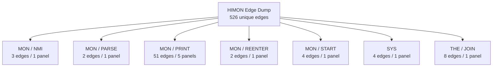

### Family Detail

#### CMD / AP

Panel 1 of 3: `CMD_AP` through `CMD_AP_BANKED`.

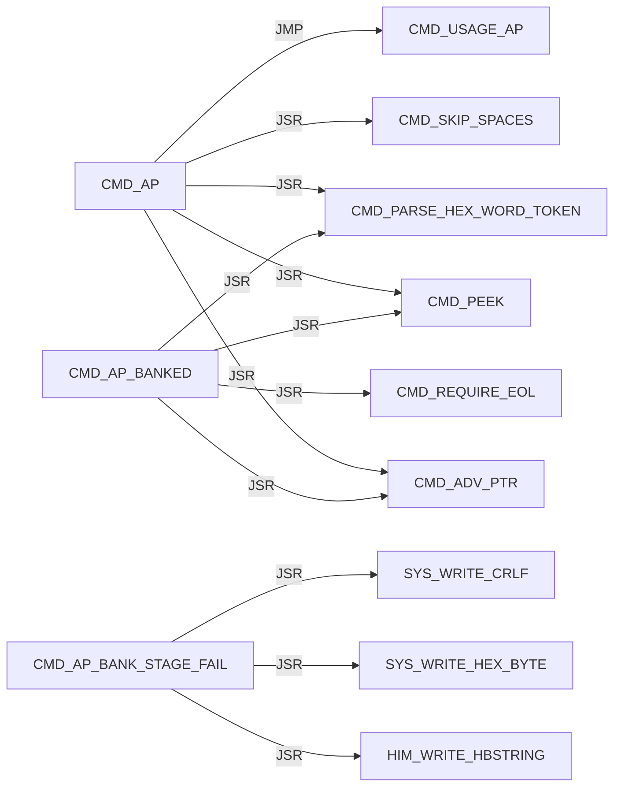

Panel 2 of 3: `CMD_AP_BANKED` through `CMD_AP_LOAD_REQUEST`.

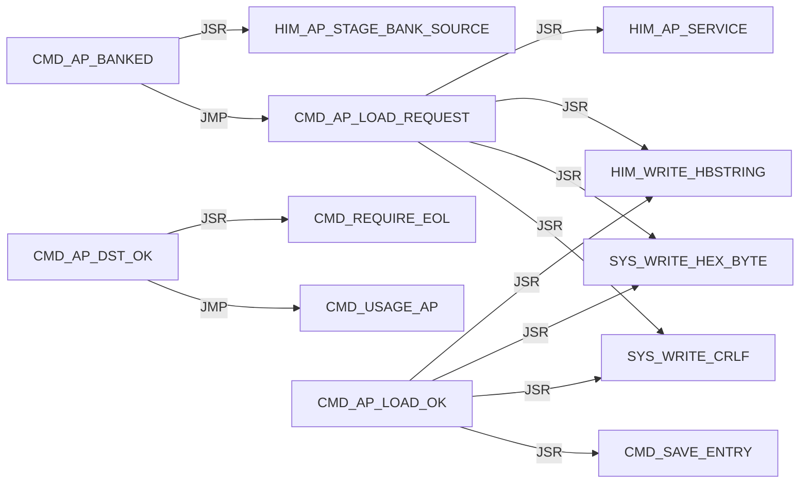

Panel 3 of 3: `CMD_AP_SRC_OK` through `CMD_AP_SRC_OK`.

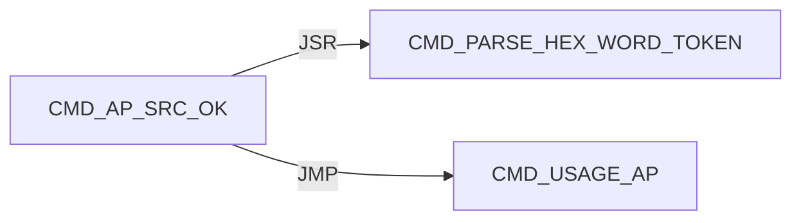

#### CMD / D

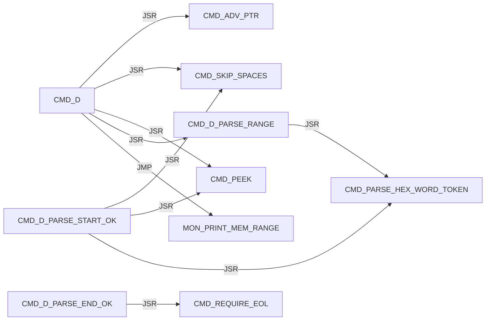

#### CMD / DISPATCH

Panel 1 of 2: `CMD_DISPATCH_DONE` through `CMD_DISPATCH_SCAN_MISS`.

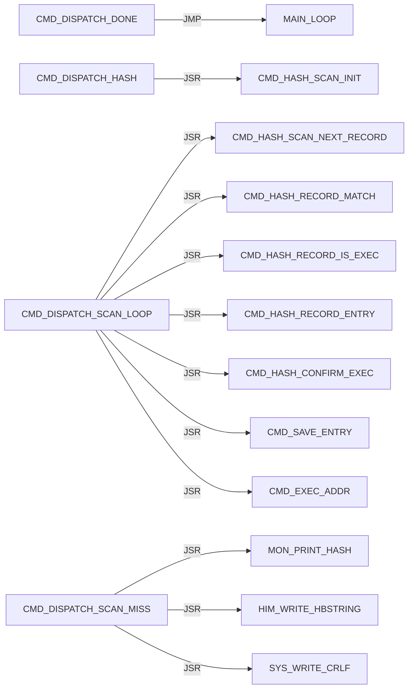

Panel 2 of 2: `CMD_DISPATCH_SCAN_MISS` through `CMD_DISPATCH_SCAN_NEXT`.

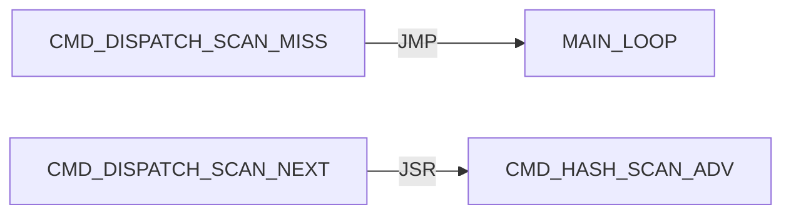

#### CMD / EXEC

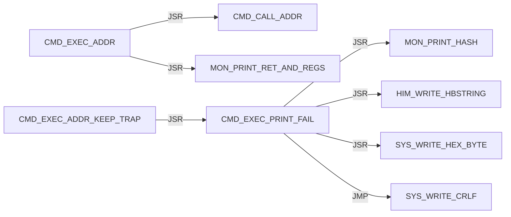

#### CMD / G

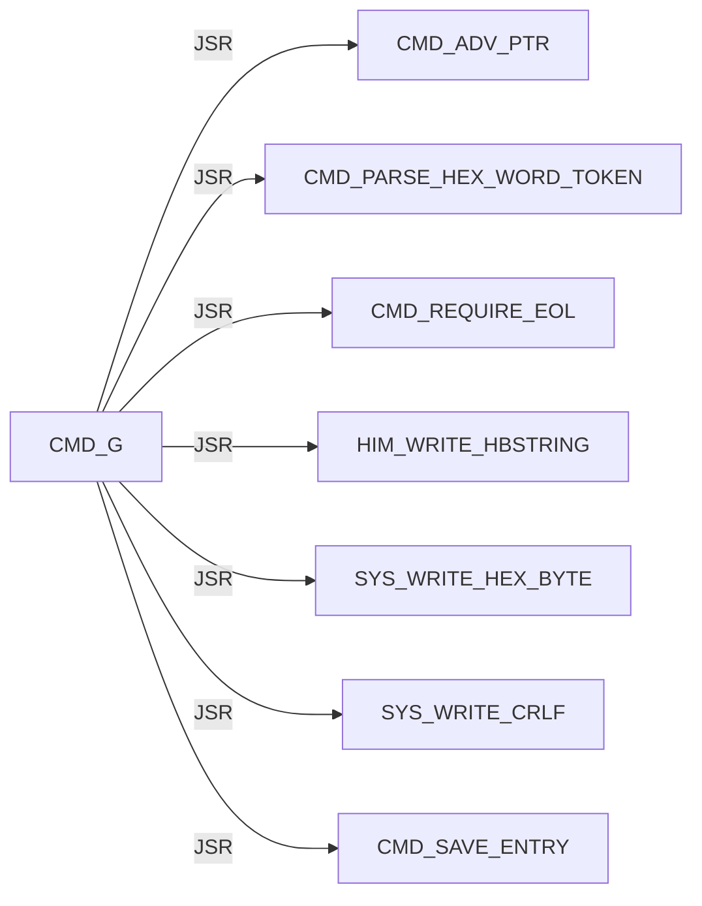

#### CMD / HASH

Panel 1 of 7: `CMD_HASH_CONFIRM_ADDR` through `CMD_HASH_FIND_LOOP`.

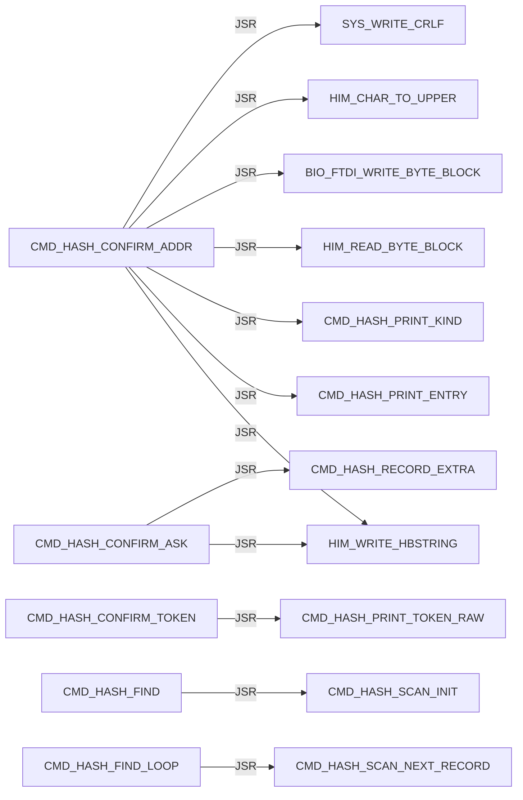

Panel 2 of 7: `CMD_HASH_FIND_LOOP` through `CMD_HASH_INFO_FOUND`.

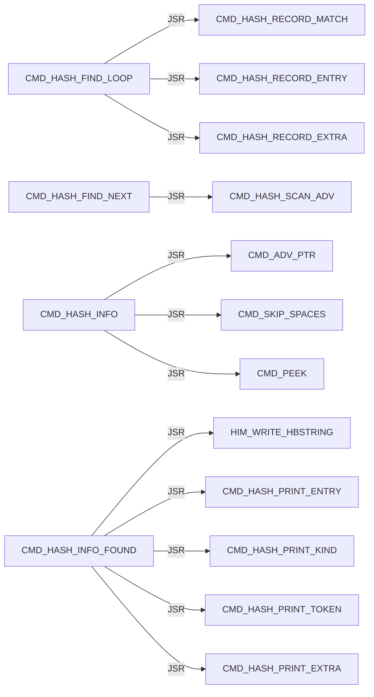

Panel 3 of 7: `CMD_HASH_INFO_FOUND` through `CMD_HASH_INFO_LOOKUP`.

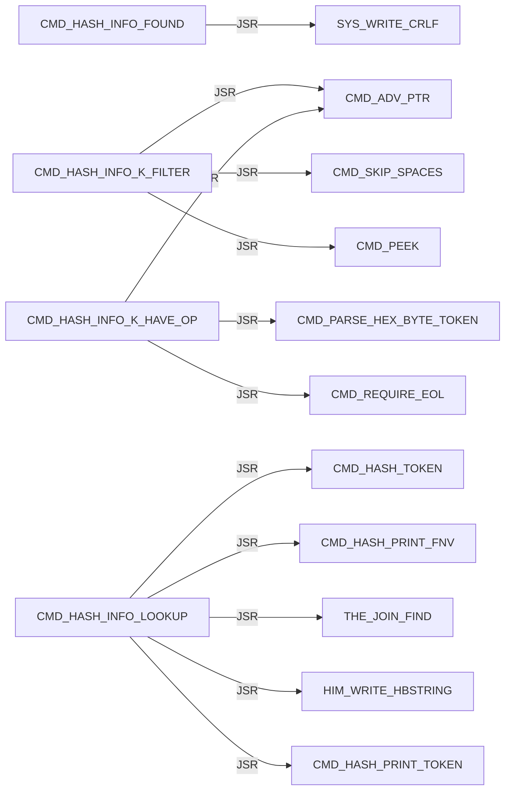

Panel 4 of 7: `CMD_HASH_INFO_LOOKUP` through `CMD_HASH_PRINT_EXTRA`.

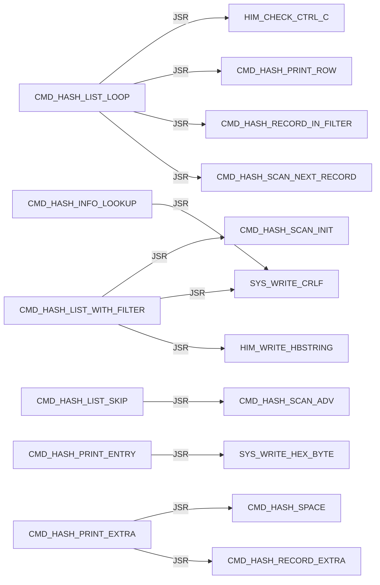

Panel 5 of 7: `CMD_HASH_PRINT_EXTRA` through `CMD_HASH_PRINT_TOKEN`.

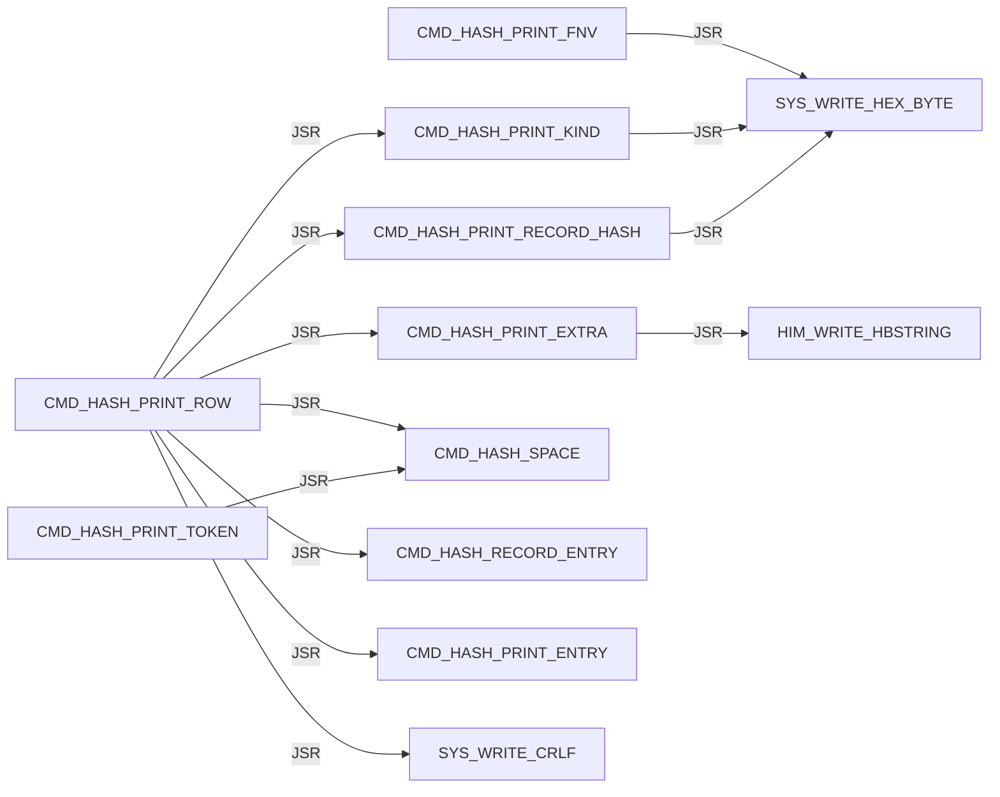

Panel 6 of 7: `CMD_HASH_PRINT_TOKEN_LOOP` through `CMD_HASH_TOKEN_LOOP`.

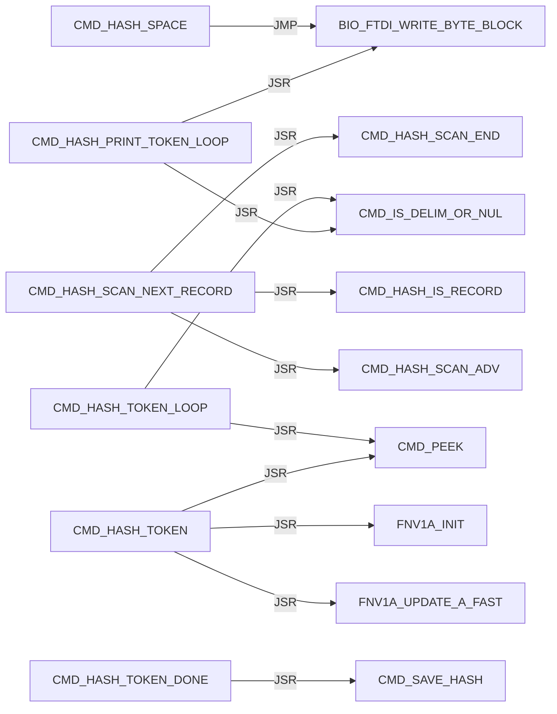

Panel 7 of 7: `CMD_HASH_TOKEN_LOOP` through `CMD_HASH_USAGE`.

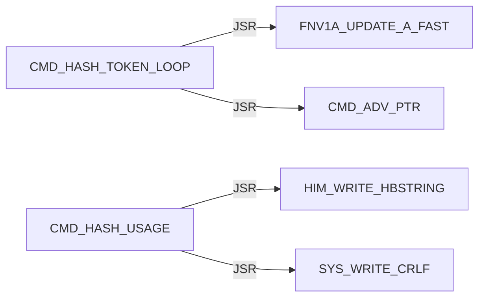

#### CMD / HELP


#### CMD / L

Panel 1 of 4: `CMD_L` through `CMD_L_DONE_PRINT`.

```mermaid
flowchart LR
    N0["CMD_L"] -->|JSR| N1["CMD_ADV_PTR"]
    N0["CMD_L"] -->|JSR| N2["CMD_SKIP_SPACES"]
    N0["CMD_L"] -->|JSR| N3["CMD_PEEK"]
    N4["CMD_L_ARG_F"] -->|JSR| N1["CMD_ADV_PTR"]
    N4["CMD_L_ARG_F"] -->|JSR| N5["CMD_REQUIRE_EOL"]
    N6["CMD_L_ARG_G"] -->|JSR| N1["CMD_ADV_PTR"]
    N6["CMD_L_ARG_G"] -->|JSR| N5["CMD_REQUIRE_EOL"]
    N7["CMD_L_ARGS_OK"] -->|JSR| N8["L_STR8_REQUIRE_SERVICE"]
    N7["CMD_L_ARGS_OK"] -->|JSR| N9["CMD_L_PRINT_FAIL"]
    N10["CMD_L_DONE_PRINT"] -->|JSR| N11["HIM_WRITE_HBSTRING"]
    N10["CMD_L_DONE_PRINT"] -->|JSR| N12["SYS_WRITE_HEX_BYTE"]
    N10["CMD_L_DONE_PRINT"] -->|JSR| N13["SYS_WRITE_CRLF"]
```

Panel 2 of 4: `CMD_L_FLASH_FAIL_DRAIN` through `CMD_L_PRINT_FAIL_ERASE`.

```mermaid
flowchart LR
    N0["CMD_L_FLASH_FAIL_DRAIN"] -->|JSR| N1["CMD_L_LATCH_FLASH_FAIL"]
    N2["CMD_L_HAVE_LINE"] -->|JSR| N3["CMD_PEEK"]
    N4["CMD_L_KEEP_FAIL_CODE"] -->|JSR| N5["L_PARSE_RECORD_STR8"]
    N4["CMD_L_KEEP_FAIL_CODE"] -->|JSR| N6["CMD_L_PRINT_FAIL"]
    N4["CMD_L_KEEP_FAIL_CODE"] -->|JMP| N7["CMD_L_FAIL_EXIT"]
    N6["CMD_L_PRINT_FAIL"] -->|JSR| N8["HIM_WRITE_HBSTRING"]
    N6["CMD_L_PRINT_FAIL"] -->|JSR| N9["SYS_WRITE_HEX_BYTE"]
    N6["CMD_L_PRINT_FAIL"] -->|JMP| N10["SYS_WRITE_CRLF"]
    N11["CMD_L_PRINT_FAIL_ERASE"] -->|JSR| N8["HIM_WRITE_HBSTRING"]
    N11["CMD_L_PRINT_FAIL_ERASE"] -->|JSR| N12["CMD_L_PRINT_LOAD_DST"]
    N11["CMD_L_PRINT_FAIL_ERASE"] -->|JSR| N9["SYS_WRITE_HEX_BYTE"]
    N11["CMD_L_PRINT_FAIL_ERASE"] -->|JMP| N10["SYS_WRITE_CRLF"]
```

Panel 3 of 4: `CMD_L_PRINT_FAIL_PROTECT` through `CMD_L_PRINT_LOAD_DST`.

```mermaid
flowchart LR
    N0["CMD_L_PRINT_FAIL_PROTECT"] -->|JSR| N1["HIM_WRITE_HBSTRING"]
    N0["CMD_L_PRINT_FAIL_PROTECT"] -->|JSR| N2["CMD_L_PRINT_LOAD_DST"]
    N0["CMD_L_PRINT_FAIL_PROTECT"] -->|JMP| N3["SYS_WRITE_CRLF"]
    N4["CMD_L_PRINT_FAIL_WRITE"] -->|JSR| N1["HIM_WRITE_HBSTRING"]
    N4["CMD_L_PRINT_FAIL_WRITE"] -->|JSR| N2["CMD_L_PRINT_LOAD_DST"]
    N4["CMD_L_PRINT_FAIL_WRITE"] -->|JSR| N5["SYS_WRITE_HEX_BYTE"]
    N4["CMD_L_PRINT_FAIL_WRITE"] -->|JMP| N3["SYS_WRITE_CRLF"]
    N6["CMD_L_PRINT_FLASH_FAIL_DONE"] -->|JSR| N1["HIM_WRITE_HBSTRING"]
    N6["CMD_L_PRINT_FLASH_FAIL_DONE"] -->|JSR| N5["SYS_WRITE_HEX_BYTE"]
    N6["CMD_L_PRINT_FLASH_FAIL_DONE"] -->|JSR| N3["SYS_WRITE_CRLF"]
    N6["CMD_L_PRINT_FLASH_FAIL_DONE"] -->|JMP| N7["CMD_L_FAIL_EXIT"]
    N2["CMD_L_PRINT_LOAD_DST"] -->|JSR| N5["SYS_WRITE_HEX_BYTE"]
```

Panel 4 of 4: `CMD_L_PRINT_LOAD_DST` through `CMD_L_SERVICE_OK`.

```mermaid
flowchart LR
    N0["CMD_L_PRINT_LOAD_DST"] -->|JMP| N1["SYS_WRITE_HEX_BYTE"]
    N2["CMD_L_READ_LOOP"] -->|JSR| N3["HIM_READ_LINE_UPPER"]
    N2["CMD_L_READ_LOOP"] -->|JSR| N4["HIM_WRITE_HBSTRING"]
    N2["CMD_L_READ_LOOP"] -->|JSR| N1["SYS_WRITE_HEX_BYTE"]
    N2["CMD_L_READ_LOOP"] -->|JSR| N5["SYS_WRITE_CRLF"]
    N6["CMD_L_READY_PRINT"] -->|JSR| N4["HIM_WRITE_HBSTRING"]
    N6["CMD_L_READY_PRINT"] -->|JSR| N5["SYS_WRITE_CRLF"]
    N7["CMD_L_SERVICE_OK"] -->|JSR| N8["DBG_CLEAR_ALL"]
```

#### CMD / M

```mermaid
flowchart LR
    N0["CMD_M"] -->|JSR| N1["CMD_ADV_PTR"]
    N0["CMD_M"] -->|JSR| N2["CMD_PARSE_RANGE_REQUIRED"]
    N0["CMD_M"] -->|JSR| N3["MON_MODIFY_RANGE_WRITABLE"]
    N0["CMD_M"] -->|JSR| N4["MON_MODIFY_RANGE"]
    N5["CMD_M_PROTECT"] -->|JSR| N6["HIM_WRITE_HBSTRING"]
    N5["CMD_M_PROTECT"] -->|JSR| N7["SYS_WRITE_HEX_BYTE"]
    N5["CMD_M_PROTECT"] -->|JSR| N8["SYS_WRITE_CRLF"]
```

#### CMD / PARSE

Panel 1 of 2: `CMD_PARSE_HEX_BYTE_TOKEN` through `CMD_PARSE_RANGE_PLUS`.

```mermaid
flowchart LR
    N0["CMD_PARSE_HEX_BYTE_TOKEN"] -->|JSR| N1["CMD_PARSE_HEX_WORD_TOKEN"]
    N2["CMD_PARSE_HEX_WORD_DONE"] -->|JSR| N3["CMD_PEEK"]
    N2["CMD_PARSE_HEX_WORD_DONE"] -->|JSR| N4["CMD_IS_DELIM_OR_NUL"]
    N5["CMD_PARSE_HEX_WORD_LOOP"] -->|JSR| N3["CMD_PEEK"]
    N5["CMD_PARSE_HEX_WORD_LOOP"] -->|JSR| N6["CMD_HEX_ASCII_TO_NIBBLE"]
    N5["CMD_PARSE_HEX_WORD_LOOP"] -->|JSR| N7["CMD_ADV_PTR"]
    N1["CMD_PARSE_HEX_WORD_TOKEN"] -->|JSR| N8["CMD_SKIP_SPACES"]
    N1["CMD_PARSE_HEX_WORD_TOKEN"] -->|JSR| N9["CMD_SKIP_OPTIONAL_DOLLAR"]
    N10["CMD_PARSE_RANGE_COUNT_OK"] -->|JMP| N11["CMD_PARSE_RANGE_FAIL"]
    N12["CMD_PARSE_RANGE_HAVE_END"] -->|JSR| N13["CMD_REQUIRE_EOL"]
    N14["CMD_PARSE_RANGE_PLUS"] -->|JSR| N7["CMD_ADV_PTR"]
    N14["CMD_PARSE_RANGE_PLUS"] -->|JSR| N1["CMD_PARSE_HEX_WORD_TOKEN"]
```

Panel 2 of 2: `CMD_PARSE_RANGE_PLUS` through `CMD_PARSE_RANGE_START_OK`.

```mermaid
flowchart LR
    N0["CMD_PARSE_RANGE_PLUS"] -->|JMP| N1["CMD_PARSE_RANGE_FAIL"]
    N2["CMD_PARSE_RANGE_REQUIRED"] -->|JSR| N3["CMD_PARSE_HEX_WORD_TOKEN"]
    N2["CMD_PARSE_RANGE_REQUIRED"] -->|JMP| N1["CMD_PARSE_RANGE_FAIL"]
    N4["CMD_PARSE_RANGE_START_OK"] -->|JSR| N5["CMD_SKIP_SPACES"]
    N4["CMD_PARSE_RANGE_START_OK"] -->|JSR| N6["CMD_PEEK"]
    N4["CMD_PARSE_RANGE_START_OK"] -->|JSR| N3["CMD_PARSE_HEX_WORD_TOKEN"]
    N4["CMD_PARSE_RANGE_START_OK"] -->|JMP| N1["CMD_PARSE_RANGE_FAIL"]
```

#### CMD / Q

```mermaid
flowchart LR
    N0["CMD_Q"] -->|JMP| N1["MON_REENTER"]
```

#### CMD / R

```mermaid
flowchart LR
    N0["CMD_R"] -->|JSR| N1["MON_CTX_REQUIRE_VALID"]
    N2["CMD_R_HAVE_CTX"] -->|JSR| N3["CMD_ADV_PTR"]
    N2["CMD_R_HAVE_CTX"] -->|JSR| N4["MON_CTX_PARSE_ASSIGN_LIST"]
    N2["CMD_R_HAVE_CTX"] -->|JSR| N5["MON_PRINT_STOP_AND_REGS"]
```

#### CMD / REQUIRE

```mermaid
flowchart LR
    N0["CMD_REQUIRE_EOL"] -->|JSR| N1["CMD_SKIP_SPACES"]
    N0["CMD_REQUIRE_EOL"] -->|JSR| N2["CMD_PEEK"]
```

#### CMD / SKIP

```mermaid
flowchart LR
    N0["CMD_SKIP_OPTIONAL_DOLLAR"] -->|JSR| N1["CMD_PEEK"]
    N0["CMD_SKIP_OPTIONAL_DOLLAR"] -->|JSR| N2["CMD_ADV_PTR"]
    N3["CMD_SKIP_SPACES"] -->|JSR| N1["CMD_PEEK"]
    N4["CMD_SKIP_SPACES_ADV"] -->|JSR| N2["CMD_ADV_PTR"]
```

#### CMD / UNKNOWN

```mermaid
flowchart LR
    N0["CMD_UNKNOWN"] -->|JSR| N1["HIM_WRITE_HBSTRING"]
    N0["CMD_UNKNOWN"] -->|JSR| N2["SYS_WRITE_CRLF"]
    N0["CMD_UNKNOWN"] -->|JMP| N3["MAIN_LOOP"]
```

#### CMD / USAGE

Panel 1 of 2: `CMD_USAGE_AP` through `CMD_USAGE_R`.

```mermaid
flowchart LR
    N0["CMD_USAGE_AP"] -->|JSR| N1["HIM_WRITE_HBSTRING"]
    N0["CMD_USAGE_AP"] -->|JSR| N2["SYS_WRITE_CRLF"]
    N3["CMD_USAGE_D"] -->|JSR| N1["HIM_WRITE_HBSTRING"]
    N3["CMD_USAGE_D"] -->|JSR| N2["SYS_WRITE_CRLF"]
    N4["CMD_USAGE_G"] -->|JSR| N1["HIM_WRITE_HBSTRING"]
    N4["CMD_USAGE_G"] -->|JSR| N2["SYS_WRITE_CRLF"]
    N5["CMD_USAGE_L"] -->|JSR| N1["HIM_WRITE_HBSTRING"]
    N5["CMD_USAGE_L"] -->|JSR| N2["SYS_WRITE_CRLF"]
    N6["CMD_USAGE_L_JMP"] -->|JMP| N5["CMD_USAGE_L"]
    N7["CMD_USAGE_M"] -->|JSR| N1["HIM_WRITE_HBSTRING"]
    N7["CMD_USAGE_M"] -->|JSR| N2["SYS_WRITE_CRLF"]
    N8["CMD_USAGE_R"] -->|JSR| N1["HIM_WRITE_HBSTRING"]
```

Panel 2 of 2: `CMD_USAGE_R` through `CMD_USAGE_X`.

```mermaid
flowchart LR
    N0["CMD_USAGE_R"] -->|JSR| N1["SYS_WRITE_CRLF"]
    N2["CMD_USAGE_X"] -->|JSR| N3["HIM_WRITE_HBSTRING"]
    N2["CMD_USAGE_X"] -->|JSR| N1["SYS_WRITE_CRLF"]
```

#### CMD / X

```mermaid
flowchart LR
    N0["CMD_X"] -->|JSR| N1["MON_CTX_REQUIRE_VALID"]
    N2["CMD_X_HAVE_CTX"] -->|JSR| N3["CMD_ADV_PTR"]
    N2["CMD_X_HAVE_CTX"] -->|JSR| N4["MON_CTX_PARSE_ASSIGN_LIST"]
    N2["CMD_X_HAVE_CTX"] -->|JSR| N5["HIM_WRITE_HBSTRING"]
    N2["CMD_X_HAVE_CTX"] -->|JSR| N6["SYS_WRITE_HEX_BYTE"]
    N2["CMD_X_HAVE_CTX"] -->|JSR| N7["SYS_WRITE_CRLF"]
    N2["CMD_X_HAVE_CTX"] -->|JMP| N8["MON_CTX_RESUME_RTI"]
```

#### ENTRY / unprefixed

```mermaid
flowchart LR
    N0["START"] -->|JMP| N1["HIMON_WARM_START_BODY"]
```

#### FNV1A

```mermaid
flowchart LR
    N0["FNV1A_MUL_PRIME"] -->|JSR| N1["MATH_COPY_HASH_TO_TERM"]
    N0["FNV1A_MUL_PRIME"] -->|JSR| N2["MATH_SHLADD_TERM_N"]
    N0["FNV1A_MUL_PRIME"] -->|JMP| N3["MATH_ADD_TERM1_TO_HASH3"]
    N4["FNV1A_MUL_PRIME_FAST"] -->|JSR| N1["MATH_COPY_HASH_TO_TERM"]
    N4["FNV1A_MUL_PRIME_FAST"] -->|JSR| N5["MATH_ADD_TERM_TO_HASH"]
    N4["FNV1A_MUL_PRIME_FAST"] -->|JMP| N3["MATH_ADD_TERM1_TO_HASH3"]
    N6["FNV1A_UPDATE_A"] -->|JMP| N0["FNV1A_MUL_PRIME"]
    N7["FNV1A_UPDATE_A_FAST"] -->|JMP| N4["FNV1A_MUL_PRIME_FAST"]
```

#### HIM / AP

Panel 1 of 9: `HIM_AP_ADVANCE_A` through `HIM_AP_LINK_HASH_CODE_UPDATE`.

```mermaid
flowchart LR
    N0["HIM_AP_ADVANCE_A"] -->|JSR| N1["HIM_AP_NEED_A"]
    N2["HIM_AP_CHECK_RELOC_COUNT_OK"] -->|JMP| N3["HIM_AP_BAD_LINE"]
    N4["HIM_AP_CHECK_RELOC_REC"] -->|JMP| N3["HIM_AP_BAD_LINE"]
    N5["HIM_AP_FIND_HOLE_LOOP"] -->|JSR| N6["HIM_AP_HOLE_AT_SCAN"]
    N7["HIM_AP_FIND_HOLE_NEXT"] -->|JMP| N8["HIM_AP_BAD_RANGE"]
    N9["HIM_AP_IMPORT_LINK"] -->|JSR| N10["HIM_AP_LINK_RELOAD_REL_PTR"]
    N11["HIM_AP_LINK_CAPTURE_ROW_X"] -->|JSR| N12["HIM_AP_RELOC_KIND_X"]
    N11["HIM_AP_LINK_CAPTURE_ROW_X"] -->|JSR| N13["HIM_AP_RELOC_SITE_LO_X"]
    N11["HIM_AP_LINK_CAPTURE_ROW_X"] -->|JSR| N14["HIM_AP_RELOC_SITE_HI_X"]
    N15["HIM_AP_LINK_DONE"] -->|JSR| N16["HIM_AP_LINK_RESTORE_COUNTS"]
    N17["HIM_AP_LINK_FAIL"] -->|JSR| N16["HIM_AP_LINK_RESTORE_COUNTS"]
    N18["HIM_AP_LINK_HASH_CODE_UPDATE"] -->|JSR| N19["FNV1A_UPDATE_A_FAST"]
```

Panel 2 of 9: `HIM_AP_LINK_HASH_LOOP` through `HIM_AP_LINK_RESOLVE_ROW_X`.

```mermaid
flowchart LR
    N0["HIM_AP_LINK_HASH_LOOP"] -->|JSR| N1["HIM_AP_LINK_UNPACK_NEXT3"]
    N0["HIM_AP_LINK_HASH_LOOP"] -->|JSR| N2["HIM_AP_LINK_HASH_CODE_A"]
    N3["HIM_AP_LINK_HASH_PACK_PTR_OK"] -->|JSR| N4["FNV1A_INIT"]
    N5["HIM_AP_LINK_HASH_SLOT_X"] -->|JSR| N6["HIM_AP_LINK_IMPORT_ROW_PTR_X"]
    N7["HIM_AP_LINK_IMPORT_ROW_LOOP"] -->|JSR| N8["HIM_AP_LINK_IMPORT_ROW_BYTES_A"]
    N9["HIM_AP_LINK_PATCH"] -->|JSR| N10["HIM_AP_LINK_RELOAD_REL_PTR"]
    N9["HIM_AP_LINK_PATCH"] -->|JSR| N11["HIM_AP_RELOC_KIND_X"]
    N9["HIM_AP_LINK_PATCH"] -->|JSR| N12["HIM_AP_IMPORT_KIND_A"]
    N9["HIM_AP_LINK_PATCH"] -->|JSR| N13["HIM_AP_LINK_CAPTURE_ROW_X"]
    N9["HIM_AP_LINK_PATCH"] -->|JSR| N14["HIM_AP_LINK_RESOLVE_ROW_X"]
    N9["HIM_AP_LINK_PATCH"] -->|JSR| N15["HIM_AP_LINK_PATCH_CAPTURED"]
    N14["HIM_AP_LINK_RESOLVE_ROW_X"] -->|JSR| N16["HIM_AP_RELOC_TARGET_HI_X"]
```

Panel 3 of 9: `HIM_AP_LINK_RESOLVE_ROW_X` through `HIM_AP_LOAD_LAST_NO_CARRY`.

```mermaid
flowchart LR
    N0["HIM_AP_LINK_RESOLVE_ROW_X"] -->|JSR| N1["HIM_AP_RELOC_TARGET_LO_X"]
    N0["HIM_AP_LINK_RESOLVE_ROW_X"] -->|JSR| N2["HIM_AP_LINK_RESOLVE_SLOT_X"]
    N2["HIM_AP_LINK_RESOLVE_SLOT_X"] -->|JSR| N3["HIM_AP_LINK_HASH_SLOT_X"]
    N2["HIM_AP_LINK_RESOLVE_SLOT_X"] -->|JSR| N4["THE_JOIN_EXEC_XY"]
    N5["HIM_AP_LINK_VALIDATE"] -->|JSR| N6["HIM_AP_LINK_RELOAD_REL_PTR"]
    N5["HIM_AP_LINK_VALIDATE"] -->|JSR| N7["HIM_AP_RELOC_KIND_X"]
    N5["HIM_AP_LINK_VALIDATE"] -->|JSR| N8["HIM_AP_IMPORT_KIND_A"]
    N5["HIM_AP_LINK_VALIDATE"] -->|JSR| N9["HIM_AP_RELOC_SITE_OK_X"]
    N5["HIM_AP_LINK_VALIDATE"] -->|JSR| N0["HIM_AP_LINK_RESOLVE_ROW_X"]
    N10["HIM_AP_LOAD_BASE_GE_20"] -->|JMP| N11["HIM_AP_BAD_RANGE"]
    N12["HIM_AP_LOAD_BASE_LT_50"] -->|JMP| N11["HIM_AP_BAD_RANGE"]
    N13["HIM_AP_LOAD_LAST_NO_CARRY"] -->|JMP| N11["HIM_AP_BAD_RANGE"]
```

Panel 4 of 9: `HIM_AP_LOAD_LEN_NONZERO` through `HIM_AP_LOAD_RANGE_OK`.

```mermaid
flowchart LR
    N0["HIM_AP_LOAD_LEN_NONZERO"] -->|JMP| N1["HIM_AP_BAD_RANGE"]
    N2["HIM_AP_LOAD_NO_OVERLAP"] -->|JSR| N3["HIM_AP_COPY_BODY_TO_DST"]
    N2["HIM_AP_LOAD_NO_OVERLAP"] -->|JSR| N4["HIM_AP_IMPORT_LINK"]
    N5["HIM_AP_LOAD_OVERLAP_BAD"] -->|JMP| N1["HIM_AP_BAD_RANGE"]
    N6["HIM_AP_LOAD_PARSED"] -->|JSR| N7["HIM_AP_LOAD_RANGE_OK"]
    N8["HIM_AP_LOAD_PATCH_LOOP"] -->|JSR| N9["HIM_AP_RELOC_KIND_X"]
    N8["HIM_AP_LOAD_PATCH_LOOP"] -->|JSR| N10["HIM_AP_INTERNAL_KIND_A"]
    N8["HIM_AP_LOAD_PATCH_LOOP"] -->|JSR| N11["HIM_AP_IMPORT_KIND_A"]
    N8["HIM_AP_LOAD_PATCH_LOOP"] -->|JMP| N12["HIM_AP_BAD_FIX"]
    N13["HIM_AP_LOAD_PATCH_ROW"] -->|JSR| N14["HIM_AP_RELOC_SITE_OK_X"]
    N15["HIM_AP_LOAD_PATCH_SITE_OK"] -->|JSR| N16["HIM_AP_RELOC_PATCH_ROW_X"]
    N7["HIM_AP_LOAD_RANGE_OK"] -->|JMP| N1["HIM_AP_BAD_RANGE"]
```

Panel 5 of 9: `HIM_AP_NEED_A` through `HIM_AP_PARSE_IMPORT_LEN_OK`.

```mermaid
flowchart LR
    N0["HIM_AP_NEED_A"] -->|JMP| N1["HIM_AP_BAD_RANGE"]
    N2["HIM_AP_PARSE_BODY"] -->|JSR| N0["HIM_AP_NEED_A"]
    N3["HIM_AP_PARSE_BODY_HDR_ROOM"] -->|JMP| N4["HIM_AP_BAD_LINE"]
    N5["HIM_AP_PARSE_BODY_LEFT_LO_OK"] -->|JMP| N4["HIM_AP_BAD_LINE"]
    N6["HIM_AP_PARSE_BODY_LEFT_OK"] -->|JMP| N4["HIM_AP_BAD_LINE"]
    N7["HIM_AP_PARSE_BODY_SAVE"] -->|JMP| N4["HIM_AP_BAD_LINE"]
    N8["HIM_AP_PARSE_BODY_TAG_OK"] -->|JSR| N9["HIM_AP_ADVANCE_A"]
    N10["HIM_AP_PARSE_EXPORT"] -->|JSR| N11["HIM_AP_TAG_LEN"]
    N12["HIM_AP_PARSE_EXPORT_TAG_OK"] -->|JSR| N9["HIM_AP_ADVANCE_A"]
    N13["HIM_AP_PARSE_HEADER_RANGE"] -->|JMP| N4["HIM_AP_BAD_LINE"]
    N14["HIM_AP_PARSE_IMPORT"] -->|JSR| N11["HIM_AP_TAG_LEN"]
    N15["HIM_AP_PARSE_IMPORT_LEN_OK"] -->|JSR| N0["HIM_AP_NEED_A"]
```

Panel 6 of 9: `HIM_AP_PARSE_IMPORT_ROOM_OK` through `HIM_AP_PARSE_SEAL_LEN_OK`.

```mermaid
flowchart LR
    N0["HIM_AP_PARSE_IMPORT_ROOM_OK"] -->|JSR| N1["HIM_AP_ADVANCE_A"]
    N2["HIM_AP_PARSE_IMPORT_TAG_OK"] -->|JMP| N3["HIM_AP_BAD_LINE"]
    N4["HIM_AP_PARSE_LEN_NONZERO"] -->|JSR| N5["HIM_AP_SOURCE_RANGE_OK"]
    N6["HIM_AP_PARSE_MIN"] -->|JSR| N5["HIM_AP_SOURCE_RANGE_OK"]
    N7["HIM_AP_PARSE_RANGE_SAFE"] -->|JMP| N3["HIM_AP_BAD_LINE"]
    N8["HIM_AP_PARSE_RELOC"] -->|JSR| N9["HIM_AP_TAG_LEN"]
    N10["HIM_AP_PARSE_RELOC_LEN_OK"] -->|JSR| N11["HIM_AP_NEED_A"]
    N12["HIM_AP_PARSE_RELOC_ROOM_OK"] -->|JSR| N13["HIM_AP_CHECK_RELOC_REC"]
    N14["HIM_AP_PARSE_RELOC_SHAPE_OK"] -->|JSR| N1["HIM_AP_ADVANCE_A"]
    N15["HIM_AP_PARSE_RELOC_TAG_OK"] -->|JMP| N3["HIM_AP_BAD_LINE"]
    N16["HIM_AP_PARSE_SEAL"] -->|JSR| N9["HIM_AP_TAG_LEN"]
    N17["HIM_AP_PARSE_SEAL_LEN_OK"] -->|JSR| N1["HIM_AP_ADVANCE_A"]
```

Panel 7 of 9: `HIM_AP_PARSE_SEAL_TAG_OK` through `HIM_AP_RELOC_SITE_HI_EQ`.

```mermaid
flowchart LR
    N0["HIM_AP_PARSE_SEAL_TAG_OK"] -->|JMP| N1["HIM_AP_BAD_LINE"]
    N2["HIM_AP_PARSE_SIG0_OK"] -->|JMP| N1["HIM_AP_BAD_LINE"]
    N3["HIM_AP_PARSE_SIG1_OK"] -->|JMP| N1["HIM_AP_BAD_LINE"]
    N4["HIM_AP_PARSE_VER_OK"] -->|JMP| N1["HIM_AP_BAD_LINE"]
    N5["HIM_AP_RELOC_PATCH_ROW_X"] -->|JSR| N6["HIM_AP_RELOC_SITE_LO_X"]
    N5["HIM_AP_RELOC_PATCH_ROW_X"] -->|JSR| N7["HIM_AP_RELOC_SITE_HI_X"]
    N5["HIM_AP_RELOC_PATCH_ROW_X"] -->|JSR| N8["HIM_AP_RELOC_TARGET_LO_X"]
    N5["HIM_AP_RELOC_PATCH_ROW_X"] -->|JSR| N9["HIM_AP_RELOC_TARGET_HI_X"]
    N10["HIM_AP_RELOC_SITE_HAVE_ADD"] -->|JSR| N6["HIM_AP_RELOC_SITE_LO_X"]
    N10["HIM_AP_RELOC_SITE_HAVE_ADD"] -->|JSR| N7["HIM_AP_RELOC_SITE_HI_X"]
    N10["HIM_AP_RELOC_SITE_HAVE_ADD"] -->|JMP| N11["HIM_AP_BAD_FIX"]
    N12["HIM_AP_RELOC_SITE_HI_EQ"] -->|JMP| N11["HIM_AP_BAD_FIX"]
```

Panel 8 of 9: `HIM_AP_RELOC_SITE_NO_CARRY` through `HIM_AP_SOURCE_BASE_SAFE`.

```mermaid
flowchart LR
    N0["HIM_AP_RELOC_SITE_NO_CARRY"] -->|JMP| N1["HIM_AP_BAD_FIX"]
    N2["HIM_AP_RELOC_SITE_OK_X"] -->|JSR| N3["HIM_AP_RELOC_KIND_X"]
    N4["HIM_AP_SERVICE"] -->|JMP| N5["HIM_AP_SERVICE_SUGGEST"]
    N6["HIM_AP_SERVICE_BAD_OP"] -->|JMP| N7["HIM_AP_BAD_LINE"]
    N8["HIM_AP_SERVICE_LINK"] -->|JMP| N9["HIM_AP_IMPORT_LINK"]
    N10["HIM_AP_SERVICE_LOAD"] -->|JSR| N11["HIM_AP_PARSE_MIN"]
    N12["HIM_AP_SERVICE_PARSE"] -->|JMP| N11["HIM_AP_PARSE_MIN"]
    N5["HIM_AP_SERVICE_SUGGEST"] -->|JSR| N11["HIM_AP_PARSE_MIN"]
    N13["HIM_AP_SOURCE_BASE_BAD"] -->|JMP| N14["HIM_AP_BAD_RANGE"]
    N15["HIM_AP_SOURCE_BASE_GE_20"] -->|JMP| N14["HIM_AP_BAD_RANGE"]
    N16["HIM_AP_SOURCE_BASE_GE_80"] -->|JMP| N14["HIM_AP_BAD_RANGE"]
    N17["HIM_AP_SOURCE_BASE_SAFE"] -->|JMP| N14["HIM_AP_BAD_RANGE"]
```

Panel 9 of 9: `HIM_AP_SOURCE_LAST_NO_CARRY` through `HIM_AP_TAG_LEN_TAG_OK`.

```mermaid
flowchart LR
    N0["HIM_AP_SOURCE_LAST_NO_CARRY"] -->|JMP| N1["HIM_AP_BAD_RANGE"]
    N2["HIM_AP_SOURCE_LEN_NONZERO"] -->|JSR| N3["HIM_AP_SOURCE_BASE_OK"]
    N4["HIM_AP_SOURCE_RAM_RANGE"] -->|JMP| N1["HIM_AP_BAD_RANGE"]
    N5["HIM_AP_SOURCE_RANGE_OK"] -->|JMP| N1["HIM_AP_BAD_RANGE"]
    N6["HIM_AP_SOURCE_STAGE_RANGE"] -->|JMP| N1["HIM_AP_BAD_RANGE"]
    N7["HIM_AP_STAGE_BANK_BAD"] -->|JMP| N1["HIM_AP_BAD_RANGE"]
    N8["HIM_AP_STAGE_BANK_SOURCE"] -->|JSR| N9["STR8_RUN_WORKER_SERVICE"]
    N10["HIM_AP_SUGGEST_PARSED"] -->|JSR| N11["HIM_AP_FIND_HOLE"]
    N12["HIM_AP_TAG_LEN"] -->|JSR| N13["HIM_AP_NEED_A"]
    N14["HIM_AP_TAG_LEN_ROOM_OK"] -->|JMP| N15["HIM_AP_BAD_LINE"]
    N16["HIM_AP_TAG_LEN_TAG_OK"] -->|JMP| N17["HIM_AP_ADVANCE_A"]
```

#### HIM / CHECK

```mermaid
flowchart LR
    N0["HIM_CHECK_CTRL_C"] -->|JSR| N1["BIO_FTDI_READ_BYTE_NONBLOCK"]
```

#### HIM / FLASH

```mermaid
flowchart LR
    N0["HIM_FLASH_INSTALL_BAD_JMP"] -->|JMP| N1["HIM_FLASH_INSTALL_BAD"]
    N2["HIM_FLASH_INSTALL_LOOP"] -->|JSR| N3["L_FLASH_SET_PTR"]
    N2["HIM_FLASH_INSTALL_LOOP"] -->|JSR| N4["FLASH_WRITE_BYTE_AXY"]
```

#### HIM / PACK40

```mermaid
flowchart LR
    N0["HIM_PACK40_ASCII_TO_CODE"] -->|JSR| N1["HIM_CHAR_TO_UPPER"]
    N2["HIM_PACK40_PACK3"] -->|JSR| N3["HIM_PACK40_MUL40"]
    N2["HIM_PACK40_PACK3"] -->|JSR| N4["HIM_PACK40_ADD_A"]
```

#### HIM / READ

```mermaid
flowchart LR
    N0["HIM_READ_BYTE_HW"] -->|JSR| N1["BIO_FTDI_READ_BYTE_BLOCK"]
    N2["HIM_READ_LINE_ABORT"] -->|JSR| N3["SYS_WRITE_CRLF"]
    N4["HIM_READ_LINE_BS_DEC"] -->|JSR| N5["BIO_FTDI_WRITE_BYTE_BLOCK"]
    N6["HIM_READ_LINE_DONE"] -->|JSR| N3["SYS_WRITE_CRLF"]
    N7["HIM_READ_LINE_LOOP"] -->|JSR| N8["HIM_READ_BYTE_BLOCK"]
    N7["HIM_READ_LINE_LOOP"] -->|JSR| N9["HIM_CHAR_TO_UPPER"]
    N7["HIM_READ_LINE_LOOP"] -->|JSR| N10["CMD_ADV_PTR"]
    N7["HIM_READ_LINE_LOOP"] -->|JSR| N5["BIO_FTDI_WRITE_BYTE_BLOCK"]
```

#### HIM / WRITE

```mermaid
flowchart LR
    N0["HIM_WRITE_HBSTRING_LAST"] -->|JSR| N1["BIO_FTDI_WRITE_BYTE_BLOCK"]
    N2["HIM_WRITE_HBSTRING_LOOP"] -->|JSR| N1["BIO_FTDI_WRITE_BYTE_BLOCK"]
```

#### HIMON

```mermaid
flowchart LR
    N0["HIMON_WARM_START_BODY"] -->|JSR| N1["DBG_CLEAR_ALL"]
    N0["HIMON_WARM_START_BODY"] -->|JMP| N2["MON_START_INIT"]
```

#### L

```mermaid
flowchart LR
    N0["L_NOTE_S1_ADDR_PRINT"] -->|JSR| N1["BIO_FTDI_WRITE_BYTE_BLOCK"]
    N0["L_NOTE_S1_ADDR_PRINT"] -->|JSR| N2["SYS_WRITE_HEX_BYTE"]
    N0["L_NOTE_S1_ADDR_PRINT"] -->|JSR| N3["SYS_WRITE_CRLF"]
    N4["L_PARSE_RECORD_STR8"] -->|JSR| N5["STR8_RECORD_SERVICE"]
    N6["L_PARSE_RECORD_STR8_DATA"] -->|JMP| N7["L_PARSE_RECORD_STR8_FLASH_DATA"]
    N8["L_PARSE_RECORD_STR8_DATA_NORMAL"] -->|JMP| N9["L_PARSE_RECORD_STR8_DATA_DONE"]
    N10["L_PARSE_RECORD_STR8_FLASH_APPLY"] -->|JSR| N5["STR8_RECORD_SERVICE"]
    N7["L_PARSE_RECORD_STR8_FLASH_DATA"] -->|JSR| N11["L_NOTE_S1_ADDR"]
    N12["L_PARSE_RECORD_STR8_NONEMPTY"] -->|JMP| N13["L_PARSE_RECORD_STR8_RAM_DATA"]
    N14["L_PARSE_RECORD_STR8_SPAN_OK"] -->|JSR| N11["L_NOTE_S1_ADDR"]
```

#### MAIN

```mermaid
flowchart LR
    N0["MAIN_HAVE_LINE"] -->|JSR| N1["CMD_SKIP_SPACES"]
    N0["MAIN_HAVE_LINE"] -->|JSR| N2["CMD_PEEK"]
    N0["MAIN_HAVE_LINE"] -->|JSR| N3["CMD_HASH_TOKEN"]
    N0["MAIN_HAVE_LINE"] -->|JMP| N4["CMD_DISPATCH_HASH"]
    N5["MAIN_LOOP"] -->|JSR| N6["HIM_WRITE_HBSTRING"]
    N5["MAIN_LOOP"] -->|JSR| N7["HIM_READ_LINE_ECHO_UPPER"]
    N5["MAIN_LOOP"] -->|JMP| N5["MAIN_LOOP"]
```

#### MATH

```mermaid
flowchart LR
    N0["MATH_SHLADD_TERM_N"] -->|JSR| N1["MATH_SHL_TERM_N"]
    N0["MATH_SHLADD_TERM_N"] -->|JMP| N2["MATH_ADD_TERM_TO_HASH"]
```

#### MON / AFTER

```mermaid
flowchart LR
    N0["MON_AFTER_BANNER"] -->|JSR| N1["MON_PRINT_STOP_AND_REGS"]
```

#### MON / BRK

```mermaid
flowchart LR
    N0["MON_BRK_TRAP"] -->|JSR| N1["DBG_HANDLE_BRK"]
    N0["MON_BRK_TRAP"] -->|JMP| N2["MON_REENTER"]
    N3["MON_BRK_TRAP_NORMAL"] -->|JMP| N2["MON_REENTER"]
```

#### MON / CLEAR

```mermaid
flowchart LR
    N0["MON_CLEAR_RAM_ZP"] -->|JMP| N1["MON_START_INIT"]
```

#### MON / COLD

```mermaid
flowchart LR
    N0["MON_COLD_RESET"] -->|JMP| N1["MON_CLEAR_RAM"]
```

#### MON / CTX

Panel 1 of 3: `MON_CTX_PARSE_A` through `MON_CTX_PARSE_P_OR_PC`.

```mermaid
flowchart LR
    N0["MON_CTX_PARSE_A"] -->|JSR| N1["CMD_ADV_PTR"]
    N0["MON_CTX_PARSE_A"] -->|JSR| N2["MON_PARSE_EQ"]
    N0["MON_CTX_PARSE_A"] -->|JSR| N3["CMD_PARSE_HEX_BYTE_TOKEN"]
    N4["MON_CTX_PARSE_ASSIGN"] -->|JSR| N5["CMD_PEEK"]
    N6["MON_CTX_PARSE_ASSIGN_LIST"] -->|JSR| N7["CMD_SKIP_SPACES"]
    N6["MON_CTX_PARSE_ASSIGN_LIST"] -->|JSR| N5["CMD_PEEK"]
    N8["MON_CTX_PARSE_ASSIGN_LOOP"] -->|JSR| N4["MON_CTX_PARSE_ASSIGN"]
    N8["MON_CTX_PARSE_ASSIGN_LOOP"] -->|JSR| N7["CMD_SKIP_SPACES"]
    N8["MON_CTX_PARSE_ASSIGN_LOOP"] -->|JSR| N5["CMD_PEEK"]
    N9["MON_CTX_PARSE_P_OR_PC"] -->|JSR| N1["CMD_ADV_PTR"]
    N9["MON_CTX_PARSE_P_OR_PC"] -->|JSR| N5["CMD_PEEK"]
    N9["MON_CTX_PARSE_P_OR_PC"] -->|JSR| N2["MON_PARSE_EQ"]
```

Panel 2 of 3: `MON_CTX_PARSE_P_OR_PC` through `MON_CTX_PARSE_Y`.

```mermaid
flowchart LR
    N0["MON_CTX_PARSE_P_OR_PC"] -->|JSR| N1["CMD_PARSE_HEX_BYTE_TOKEN"]
    N2["MON_CTX_PARSE_PC"] -->|JSR| N3["CMD_ADV_PTR"]
    N2["MON_CTX_PARSE_PC"] -->|JSR| N4["MON_PARSE_EQ"]
    N2["MON_CTX_PARSE_PC"] -->|JSR| N5["CMD_PARSE_HEX_WORD_TOKEN"]
    N6["MON_CTX_PARSE_S"] -->|JSR| N3["CMD_ADV_PTR"]
    N6["MON_CTX_PARSE_S"] -->|JSR| N4["MON_PARSE_EQ"]
    N6["MON_CTX_PARSE_S"] -->|JSR| N1["CMD_PARSE_HEX_BYTE_TOKEN"]
    N7["MON_CTX_PARSE_X"] -->|JSR| N3["CMD_ADV_PTR"]
    N7["MON_CTX_PARSE_X"] -->|JSR| N4["MON_PARSE_EQ"]
    N7["MON_CTX_PARSE_X"] -->|JSR| N1["CMD_PARSE_HEX_BYTE_TOKEN"]
    N8["MON_CTX_PARSE_Y"] -->|JSR| N3["CMD_ADV_PTR"]
    N8["MON_CTX_PARSE_Y"] -->|JSR| N4["MON_PARSE_EQ"]
```

Panel 3 of 3: `MON_CTX_PARSE_Y` through `MON_CTX_REQUIRE_VALID`.

```mermaid
flowchart LR
    N0["MON_CTX_PARSE_Y"] -->|JSR| N1["CMD_PARSE_HEX_BYTE_TOKEN"]
    N2["MON_CTX_REQUIRE_VALID"] -->|JSR| N3["HIM_WRITE_HBSTRING"]
    N2["MON_CTX_REQUIRE_VALID"] -->|JSR| N4["SYS_WRITE_CRLF"]
```

#### MON / INIT

```mermaid
flowchart LR
    N0["MON_INIT_COMMON"] -->|JSR| N1["MON_INIT_SERVICE_VECTORS"]
    N0["MON_INIT_COMMON"] -->|JSR| N2["SYS_INIT"]
    N0["MON_INIT_COMMON"] -->|JSR| N3["SYS_FLUSH_RX"]
    N0["MON_INIT_COMMON"] -->|JSR| N4["SYS_VEC_SET_NMI_XY"]
    N0["MON_INIT_COMMON"] -->|JSR| N5["SYS_VEC_SET_IRQ_BRK_XY"]
    N0["MON_INIT_COMMON"] -->|JSR| N6["SYS_VEC_SET_IRQ_NONBRK_XY"]
```

#### MON / MODIFY

```mermaid
flowchart LR
    N0["MON_MODIFY_BAD"] -->|JSR| N1["HIM_WRITE_HBSTRING"]
    N0["MON_MODIFY_BAD"] -->|JSR| N2["SYS_WRITE_CRLF"]
    N3["MON_MODIFY_LOOP"] -->|JSR| N4["MON_CURR_GT_END"]
    N3["MON_MODIFY_LOOP"] -->|JSR| N5["SYS_WRITE_HEX_BYTE"]
    N3["MON_MODIFY_LOOP"] -->|JSR| N6["BIO_FTDI_WRITE_BYTE_BLOCK"]
    N3["MON_MODIFY_LOOP"] -->|JSR| N7["HIM_READ_LINE_ECHO_UPPER"]
    N3["MON_MODIFY_LOOP"] -->|JSR| N8["CMD_SKIP_SPACES"]
    N3["MON_MODIFY_LOOP"] -->|JSR| N9["CMD_PEEK"]
    N3["MON_MODIFY_LOOP"] -->|JSR| N10["CMD_PARSE_HEX_BYTE_TOKEN"]
    N3["MON_MODIFY_LOOP"] -->|JSR| N11["CMD_REQUIRE_EOL"]
    N12["MON_MODIFY_NEXT"] -->|JSR| N13["CMD_INC_RANGE_TMP"]
```

#### MON / NMI

```mermaid
flowchart LR
    N0["MON_NMI_TRAP"] -->|JMP| N1["MON_REENTER"]
    N2["MON_NMI_TRAP_DEBOUNCE_CAPTURE"] -->|JSR| N3["MON_NMI_DEBOUNCE_DELAY"]
    N2["MON_NMI_TRAP_DEBOUNCE_CAPTURE"] -->|JMP| N1["MON_REENTER"]
```

#### MON / PARSE

```mermaid
flowchart LR
    N0["MON_PARSE_EQ"] -->|JSR| N1["CMD_PEEK"]
    N0["MON_PARSE_EQ"] -->|JSR| N2["CMD_ADV_PTR"]
```

#### MON / PRINT

Panel 1 of 5: `MON_PRINT_BOX` through `MON_PRINT_MEM_IO_SKIP`.

```mermaid
flowchart LR
    N0["MON_PRINT_BOX"] -->|JSR| N1["BIO_FTDI_WRITE_BYTE_BLOCK"]
    N0["MON_PRINT_BOX"] -->|JSR| N2["HIM_WRITE_HBSTRING"]
    N3["MON_PRINT_EXEC_ID"] -->|JMP| N4["MON_PRINT_HASH"]
    N5["MON_PRINT_FLAG_OUT"] -->|JSR| N1["BIO_FTDI_WRITE_BYTE_BLOCK"]
    N6["MON_PRINT_FLAGS"] -->|JSR| N7["MON_PRINT_FLAG_CHAR"]
    N6["MON_PRINT_FLAGS"] -->|JSR| N1["BIO_FTDI_WRITE_BYTE_BLOCK"]
    N4["MON_PRINT_HASH"] -->|JSR| N1["BIO_FTDI_WRITE_BYTE_BLOCK"]
    N4["MON_PRINT_HASH"] -->|JSR| N8["SYS_WRITE_HEX_BYTE"]
    N9["MON_PRINT_MEM_ABORT"] -->|JSR| N10["SYS_WRITE_CRLF"]
    N11["MON_PRINT_MEM_ASCII"] -->|JSR| N1["BIO_FTDI_WRITE_BYTE_BLOCK"]
    N12["MON_PRINT_MEM_ASCII_OUT"] -->|JSR| N1["BIO_FTDI_WRITE_BYTE_BLOCK"]
    N13["MON_PRINT_MEM_IO_SKIP"] -->|JSR| N14["MON_CURR_IS_IO"]
```

Panel 2 of 5: `MON_PRINT_MEM_IO_SKIP_YES` through `MON_PRINT_MEM_NOT_END`.

```mermaid
flowchart LR
    N0["MON_PRINT_MEM_IO_SKIP_YES"] -->|JSR| N1["SYS_PRINT_IO_SLOT_SKIP"]
    N2["MON_PRINT_MEM_LAST_LINE"] -->|JSR| N3["MON_PRINT_MEM_ASCII"]
    N4["MON_PRINT_MEM_LINE_LOOP"] -->|JSR| N5["HIM_CHECK_CTRL_C"]
    N4["MON_PRINT_MEM_LINE_LOOP"] -->|JSR| N6["MON_CURR_GT_END"]
    N4["MON_PRINT_MEM_LINE_LOOP"] -->|JSR| N7["MON_CURR_IS_IO"]
    N4["MON_PRINT_MEM_LINE_LOOP"] -->|JSR| N3["MON_PRINT_MEM_ASCII"]
    N4["MON_PRINT_MEM_LINE_LOOP"] -->|JSR| N8["SYS_WRITE_CRLF"]
    N4["MON_PRINT_MEM_LINE_LOOP"] -->|JMP| N9["MON_PRINT_MEM_NEXT_LINE"]
    N9["MON_PRINT_MEM_NEXT_LINE"] -->|JSR| N6["MON_CURR_GT_END"]
    N9["MON_PRINT_MEM_NEXT_LINE"] -->|JMP| N10["MON_PRINT_MEM_DONE"]
    N11["MON_PRINT_MEM_NOT_END"] -->|JSR| N12["CMD_INC_RANGE_TMP"]
    N11["MON_PRINT_MEM_NOT_END"] -->|JSR| N3["MON_PRINT_MEM_ASCII"]
```

Panel 3 of 5: `MON_PRINT_MEM_NOT_END` through `MON_PRINT_REGS_BODY`.

```mermaid
flowchart LR
    N0["MON_PRINT_MEM_NOT_END"] -->|JSR| N1["SYS_WRITE_CRLF"]
    N0["MON_PRINT_MEM_NOT_END"] -->|JMP| N2["MON_PRINT_MEM_NEXT_LINE"]
    N3["MON_PRINT_MEM_RANGE_ACTIVE"] -->|JSR| N4["MON_PRINT_MEM_IO_SKIP"]
    N3["MON_PRINT_MEM_RANGE_ACTIVE"] -->|JSR| N5["SYS_WRITE_HEX_BYTE"]
    N3["MON_PRINT_MEM_RANGE_ACTIVE"] -->|JSR| N6["BIO_FTDI_WRITE_BYTE_BLOCK"]
    N7["MON_PRINT_MEM_READ_BYTE"] -->|JSR| N6["BIO_FTDI_WRITE_BYTE_BLOCK"]
    N8["MON_PRINT_MEM_SPACE"] -->|JSR| N6["BIO_FTDI_WRITE_BYTE_BLOCK"]
    N8["MON_PRINT_MEM_SPACE"] -->|JSR| N5["SYS_WRITE_HEX_BYTE"]
    N9["MON_PRINT_REGS"] -->|JSR| N1["SYS_WRITE_CRLF"]
    N10["MON_PRINT_REGS_BODY"] -->|JSR| N11["HIM_WRITE_HBSTRING"]
    N10["MON_PRINT_REGS_BODY"] -->|JSR| N5["SYS_WRITE_HEX_BYTE"]
    N10["MON_PRINT_REGS_BODY"] -->|JSR| N6["BIO_FTDI_WRITE_BYTE_BLOCK"]
```

Panel 4 of 5: `MON_PRINT_REGS_BODY` through `MON_PRINT_STOP_DBG`.

```mermaid
flowchart LR
    N0["MON_PRINT_REGS_BODY"] -->|JSR| N1["MON_PRINT_FLAGS"]
    N0["MON_PRINT_REGS_BODY"] -->|JSR| N2["SYS_WRITE_CRLF"]
    N3["MON_PRINT_RET_AND_REGS"] -->|JSR| N2["SYS_WRITE_CRLF"]
    N3["MON_PRINT_RET_AND_REGS"] -->|JSR| N4["MON_PRINT_EXEC_ID"]
    N3["MON_PRINT_RET_AND_REGS"] -->|JSR| N5["HIM_WRITE_HBSTRING"]
    N3["MON_PRINT_RET_AND_REGS"] -->|JSR| N6["SYS_WRITE_HEX_BYTE"]
    N3["MON_PRINT_RET_AND_REGS"] -->|JMP| N0["MON_PRINT_REGS_BODY"]
    N7["MON_PRINT_STOP_AND_REGS"] -->|JSR| N2["SYS_WRITE_CRLF"]
    N7["MON_PRINT_STOP_AND_REGS"] -->|JSR| N5["HIM_WRITE_HBSTRING"]
    N8["MON_PRINT_STOP_BRK"] -->|JSR| N5["HIM_WRITE_HBSTRING"]
    N8["MON_PRINT_STOP_BRK"] -->|JSR| N6["SYS_WRITE_HEX_BYTE"]
    N9["MON_PRINT_STOP_DBG"] -->|JSR| N10["BIO_FTDI_WRITE_BYTE_BLOCK"]
```

Panel 5 of 5: `MON_PRINT_STOP_DBG` through `MON_PRINT_STOP_PC`.

```mermaid
flowchart LR
    N0["MON_PRINT_STOP_DBG"] -->|JSR| N1["SYS_WRITE_HEX_BYTE"]
    N0["MON_PRINT_STOP_DBG"] -->|JMP| N2["MON_PRINT_REGS_BODY"]
    N3["MON_PRINT_STOP_PC"] -->|JSR| N1["SYS_WRITE_HEX_BYTE"]
```

#### MON / REENTER

```mermaid
flowchart LR
    N0["MON_REENTER"] -->|JSR| N1["MON_INIT_COMMON"]
    N0["MON_REENTER"] -->|JMP| N2["MON_AFTER_BANNER"]
```

#### MON / START

```mermaid
flowchart LR
    N0["MON_START_INIT"] -->|JSR| N1["MON_INIT_COMMON"]
    N0["MON_START_INIT"] -->|JSR| N2["MON_BOOTLOG_RESET"]
    N0["MON_START_INIT"] -->|JSR| N3["HIM_WRITE_HBSTRING"]
    N0["MON_START_INIT"] -->|JSR| N4["SYS_WRITE_CRLF"]
```

#### SYS

```mermaid
flowchart LR
    N0["SYS_PRINT_IO_SLOT_SKIP"] -->|JSR| N1["SYS_WRITE_HEX_BYTE"]
    N0["SYS_PRINT_IO_SLOT_SKIP"] -->|JSR| N2["BIO_FTDI_WRITE_BYTE_BLOCK"]
    N0["SYS_PRINT_IO_SLOT_SKIP"] -->|JSR| N3["HIM_WRITE_HBSTRING"]
    N0["SYS_PRINT_IO_SLOT_SKIP"] -->|JMP| N4["SYS_WRITE_CRLF"]
```

#### THE / JOIN

```mermaid
flowchart LR
    N0["THE_JOIN_EXEC"] -->|JSR| N1["CMD_HASH_SCAN_INIT"]
    N2["THE_JOIN_EXEC_LOOP"] -->|JSR| N3["CMD_HASH_SCAN_NEXT_RECORD"]
    N2["THE_JOIN_EXEC_LOOP"] -->|JSR| N4["CMD_HASH_RECORD_MATCH"]
    N2["THE_JOIN_EXEC_LOOP"] -->|JSR| N5["CMD_HASH_RECORD_IS_EXEC"]
    N2["THE_JOIN_EXEC_LOOP"] -->|JSR| N6["CMD_HASH_RECORD_ENTRY"]
    N2["THE_JOIN_EXEC_LOOP"] -->|JSR| N7["CMD_HASH_RECORD_EXTRA"]
    N8["THE_JOIN_EXEC_NEXT"] -->|JSR| N9["CMD_HASH_SCAN_ADV"]
    N10["THE_JOIN_EXEC_XY"] -->|JSR| N11["THE_JOIN_LOAD_HASH_XY"]
```

## External Targets

These targets are not labels in this source file; most are `XREF` providers from sibling ROM modules.

```text
BIO_FTDI_READ_BYTE_BLOCK
BIO_FTDI_READ_BYTE_NONBLOCK
BIO_FTDI_WRITE_BYTE_BLOCK
DBG_CLEAR_ALL
DBG_HANDLE_BRK
FLASH_WRITE_BYTE_AXY
MON_BOOTLOG_RESET
STR8_RECORD_SERVICE
STR8_RUN_WORKER_SERVICE
SYS_FLUSH_RX
SYS_INIT
SYS_VEC_SET_IRQ_BRK_XY
SYS_VEC_SET_IRQ_NONBRK_XY
SYS_VEC_SET_NMI_XY
SYS_WRITE_CRLF
SYS_WRITE_HEX_BYTE
```

## Unique Direct Edges By Source Label

Each block is one source label. Indented lines are outgoing direct edges.
Blank lines are source-level breaks; they do not imply call depth.

```text
CMD_AP
    JSR CMD_ADV_PTR
    JSR CMD_SKIP_SPACES
    JSR CMD_PEEK
    JSR CMD_PARSE_HEX_WORD_TOKEN
    JMP CMD_USAGE_AP

CMD_AP_BANK_STAGE_FAIL
    JSR HIM_WRITE_HBSTRING
    JSR SYS_WRITE_HEX_BYTE
    JSR SYS_WRITE_CRLF

CMD_AP_BANKED
    JSR CMD_ADV_PTR
    JSR CMD_PEEK
    JSR CMD_PARSE_HEX_WORD_TOKEN
    JSR CMD_REQUIRE_EOL
    JSR HIM_AP_STAGE_BANK_SOURCE
    JMP CMD_AP_LOAD_REQUEST

CMD_AP_DST_OK
    JSR CMD_REQUIRE_EOL
    JMP CMD_USAGE_AP

CMD_AP_LOAD_OK
    JSR HIM_WRITE_HBSTRING
    JSR SYS_WRITE_HEX_BYTE
    JSR SYS_WRITE_CRLF
    JSR CMD_SAVE_ENTRY

CMD_AP_LOAD_REQUEST
    JSR HIM_AP_SERVICE
    JSR HIM_WRITE_HBSTRING
    JSR SYS_WRITE_HEX_BYTE
    JSR SYS_WRITE_CRLF

CMD_AP_SRC_OK
    JSR CMD_PARSE_HEX_WORD_TOKEN
    JMP CMD_USAGE_AP

CMD_D
    JSR CMD_ADV_PTR
    JSR CMD_SKIP_SPACES
    JSR CMD_PEEK
    JSR CMD_D_PARSE_RANGE
    JMP MON_PRINT_MEM_RANGE

CMD_D_PARSE_END_OK
    JSR CMD_REQUIRE_EOL

CMD_D_PARSE_RANGE
    JSR CMD_PARSE_HEX_WORD_TOKEN

CMD_D_PARSE_START_OK
    JSR CMD_SKIP_SPACES
    JSR CMD_PEEK
    JSR CMD_PARSE_HEX_WORD_TOKEN

CMD_DISPATCH_DONE
    JMP MAIN_LOOP

CMD_DISPATCH_HASH
    JSR CMD_HASH_SCAN_INIT

CMD_DISPATCH_SCAN_LOOP
    JSR CMD_HASH_SCAN_NEXT_RECORD
    JSR CMD_HASH_RECORD_MATCH
    JSR CMD_HASH_RECORD_IS_EXEC
    JSR CMD_HASH_RECORD_ENTRY
    JSR CMD_HASH_CONFIRM_EXEC
    JSR CMD_SAVE_ENTRY
    JSR CMD_EXEC_ADDR

CMD_DISPATCH_SCAN_MISS
    JSR MON_PRINT_HASH
    JSR HIM_WRITE_HBSTRING
    JSR SYS_WRITE_CRLF
    JMP MAIN_LOOP

CMD_DISPATCH_SCAN_NEXT
    JSR CMD_HASH_SCAN_ADV

CMD_EXEC_ADDR
    JSR CMD_CALL_ADDR
    JSR MON_PRINT_RET_AND_REGS

CMD_EXEC_ADDR_KEEP_TRAP
    JSR CMD_EXEC_PRINT_FAIL

CMD_EXEC_PRINT_FAIL
    JSR MON_PRINT_HASH
    JSR HIM_WRITE_HBSTRING
    JSR SYS_WRITE_HEX_BYTE
    JMP SYS_WRITE_CRLF

CMD_G
    JSR CMD_ADV_PTR
    JSR CMD_PARSE_HEX_WORD_TOKEN
    JSR CMD_REQUIRE_EOL
    JSR HIM_WRITE_HBSTRING
    JSR SYS_WRITE_HEX_BYTE
    JSR SYS_WRITE_CRLF
    JSR CMD_SAVE_ENTRY

CMD_HASH_CONFIRM_ADDR
    JSR HIM_WRITE_HBSTRING
    JSR CMD_HASH_PRINT_ENTRY
    JSR CMD_HASH_PRINT_KIND
    JSR HIM_READ_BYTE_BLOCK
    JSR BIO_FTDI_WRITE_BYTE_BLOCK
    JSR HIM_CHAR_TO_UPPER
    JSR SYS_WRITE_CRLF

CMD_HASH_CONFIRM_ASK
    JSR HIM_WRITE_HBSTRING
    JSR CMD_HASH_RECORD_EXTRA

CMD_HASH_CONFIRM_TOKEN
    JSR CMD_HASH_PRINT_TOKEN_RAW

CMD_HASH_FIND
    JSR CMD_HASH_SCAN_INIT

CMD_HASH_FIND_LOOP
    JSR CMD_HASH_SCAN_NEXT_RECORD
    JSR CMD_HASH_RECORD_MATCH
    JSR CMD_HASH_RECORD_ENTRY
    JSR CMD_HASH_RECORD_EXTRA

CMD_HASH_FIND_NEXT
    JSR CMD_HASH_SCAN_ADV

CMD_HASH_INFO
    JSR CMD_ADV_PTR
    JSR CMD_SKIP_SPACES
    JSR CMD_PEEK

CMD_HASH_INFO_FOUND
    JSR HIM_WRITE_HBSTRING
    JSR CMD_HASH_PRINT_ENTRY
    JSR CMD_HASH_PRINT_KIND
    JSR CMD_HASH_PRINT_TOKEN
    JSR CMD_HASH_PRINT_EXTRA
    JSR SYS_WRITE_CRLF

CMD_HASH_INFO_K_FILTER
    JSR CMD_ADV_PTR
    JSR CMD_SKIP_SPACES
    JSR CMD_PEEK

CMD_HASH_INFO_K_HAVE_OP
    JSR CMD_ADV_PTR
    JSR CMD_PARSE_HEX_BYTE_TOKEN
    JSR CMD_REQUIRE_EOL

CMD_HASH_INFO_LOOKUP
    JSR CMD_HASH_TOKEN
    JSR CMD_HASH_PRINT_FNV
    JSR THE_JOIN_FIND
    JSR HIM_WRITE_HBSTRING
    JSR CMD_HASH_PRINT_TOKEN
    JSR SYS_WRITE_CRLF

CMD_HASH_LIST_LOOP
    JSR CMD_HASH_SCAN_NEXT_RECORD
    JSR CMD_HASH_RECORD_IN_FILTER
    JSR CMD_HASH_PRINT_ROW
    JSR HIM_CHECK_CTRL_C

CMD_HASH_LIST_SKIP
    JSR CMD_HASH_SCAN_ADV

CMD_HASH_LIST_WITH_FILTER
    JSR HIM_WRITE_HBSTRING
    JSR SYS_WRITE_CRLF
    JSR CMD_HASH_SCAN_INIT

CMD_HASH_PRINT_ENTRY
    JSR SYS_WRITE_HEX_BYTE

CMD_HASH_PRINT_EXTRA
    JSR CMD_HASH_RECORD_EXTRA
    JSR CMD_HASH_SPACE
    JSR HIM_WRITE_HBSTRING

CMD_HASH_PRINT_FNV
    JSR SYS_WRITE_HEX_BYTE

CMD_HASH_PRINT_KIND
    JSR SYS_WRITE_HEX_BYTE

CMD_HASH_PRINT_RECORD_HASH
    JSR SYS_WRITE_HEX_BYTE

CMD_HASH_PRINT_ROW
    JSR CMD_HASH_PRINT_RECORD_HASH
    JSR CMD_HASH_SPACE
    JSR CMD_HASH_RECORD_ENTRY
    JSR CMD_HASH_PRINT_ENTRY
    JSR CMD_HASH_PRINT_KIND
    JSR CMD_HASH_PRINT_EXTRA
    JSR SYS_WRITE_CRLF

CMD_HASH_PRINT_TOKEN
    JSR CMD_HASH_SPACE

CMD_HASH_PRINT_TOKEN_LOOP
    JSR CMD_IS_DELIM_OR_NUL
    JSR BIO_FTDI_WRITE_BYTE_BLOCK

CMD_HASH_SCAN_NEXT_RECORD
    JSR CMD_HASH_SCAN_END
    JSR CMD_HASH_IS_RECORD
    JSR CMD_HASH_SCAN_ADV

CMD_HASH_SPACE
    JMP BIO_FTDI_WRITE_BYTE_BLOCK

CMD_HASH_TOKEN
    JSR FNV1A_INIT
    JSR CMD_PEEK
    JSR FNV1A_UPDATE_A_FAST

CMD_HASH_TOKEN_DONE
    JSR CMD_SAVE_HASH

CMD_HASH_TOKEN_LOOP
    JSR CMD_PEEK
    JSR CMD_IS_DELIM_OR_NUL
    JSR FNV1A_UPDATE_A_FAST
    JSR CMD_ADV_PTR

CMD_HASH_USAGE
    JSR HIM_WRITE_HBSTRING
    JSR SYS_WRITE_CRLF

CMD_HELP
    JSR HIM_WRITE_HBSTRING
    JSR SYS_WRITE_CRLF

CMD_L
    JSR CMD_ADV_PTR
    JSR CMD_SKIP_SPACES
    JSR CMD_PEEK

CMD_L_ARG_F
    JSR CMD_ADV_PTR
    JSR CMD_REQUIRE_EOL

CMD_L_ARG_G
    JSR CMD_ADV_PTR
    JSR CMD_REQUIRE_EOL

CMD_L_ARGS_OK
    JSR L_STR8_REQUIRE_SERVICE
    JSR CMD_L_PRINT_FAIL

CMD_L_DONE_PRINT
    JSR HIM_WRITE_HBSTRING
    JSR SYS_WRITE_HEX_BYTE
    JSR SYS_WRITE_CRLF

CMD_L_FLASH_FAIL_DRAIN
    JSR CMD_L_LATCH_FLASH_FAIL

CMD_L_HAVE_LINE
    JSR CMD_PEEK

CMD_L_KEEP_FAIL_CODE
    JSR L_PARSE_RECORD_STR8
    JSR CMD_L_PRINT_FAIL
    JMP CMD_L_FAIL_EXIT

CMD_L_PRINT_FAIL
    JSR HIM_WRITE_HBSTRING
    JSR SYS_WRITE_HEX_BYTE
    JMP SYS_WRITE_CRLF

CMD_L_PRINT_FAIL_ERASE
    JSR HIM_WRITE_HBSTRING
    JSR CMD_L_PRINT_LOAD_DST
    JSR SYS_WRITE_HEX_BYTE
    JMP SYS_WRITE_CRLF

CMD_L_PRINT_FAIL_PROTECT
    JSR HIM_WRITE_HBSTRING
    JSR CMD_L_PRINT_LOAD_DST
    JMP SYS_WRITE_CRLF

CMD_L_PRINT_FAIL_WRITE
    JSR HIM_WRITE_HBSTRING
    JSR CMD_L_PRINT_LOAD_DST
    JSR SYS_WRITE_HEX_BYTE
    JMP SYS_WRITE_CRLF

CMD_L_PRINT_FLASH_FAIL_DONE
    JSR HIM_WRITE_HBSTRING
    JSR SYS_WRITE_HEX_BYTE
    JSR SYS_WRITE_CRLF
    JMP CMD_L_FAIL_EXIT

CMD_L_PRINT_LOAD_DST
    JSR SYS_WRITE_HEX_BYTE
    JMP SYS_WRITE_HEX_BYTE

CMD_L_READ_LOOP
    JSR HIM_READ_LINE_UPPER
    JSR HIM_WRITE_HBSTRING
    JSR SYS_WRITE_HEX_BYTE
    JSR SYS_WRITE_CRLF

CMD_L_READY_PRINT
    JSR HIM_WRITE_HBSTRING
    JSR SYS_WRITE_CRLF

CMD_L_SERVICE_OK
    JSR DBG_CLEAR_ALL

CMD_M
    JSR CMD_ADV_PTR
    JSR CMD_PARSE_RANGE_REQUIRED
    JSR MON_MODIFY_RANGE_WRITABLE
    JSR MON_MODIFY_RANGE

CMD_M_PROTECT
    JSR HIM_WRITE_HBSTRING
    JSR SYS_WRITE_HEX_BYTE
    JSR SYS_WRITE_CRLF

CMD_PARSE_HEX_BYTE_TOKEN
    JSR CMD_PARSE_HEX_WORD_TOKEN

CMD_PARSE_HEX_WORD_DONE
    JSR CMD_PEEK
    JSR CMD_IS_DELIM_OR_NUL

CMD_PARSE_HEX_WORD_LOOP
    JSR CMD_PEEK
    JSR CMD_HEX_ASCII_TO_NIBBLE
    JSR CMD_ADV_PTR

CMD_PARSE_HEX_WORD_TOKEN
    JSR CMD_SKIP_SPACES
    JSR CMD_SKIP_OPTIONAL_DOLLAR

CMD_PARSE_RANGE_COUNT_OK
    JMP CMD_PARSE_RANGE_FAIL

CMD_PARSE_RANGE_HAVE_END
    JSR CMD_REQUIRE_EOL

CMD_PARSE_RANGE_PLUS
    JSR CMD_ADV_PTR
    JSR CMD_PARSE_HEX_WORD_TOKEN
    JMP CMD_PARSE_RANGE_FAIL

CMD_PARSE_RANGE_REQUIRED
    JSR CMD_PARSE_HEX_WORD_TOKEN
    JMP CMD_PARSE_RANGE_FAIL

CMD_PARSE_RANGE_START_OK
    JSR CMD_SKIP_SPACES
    JSR CMD_PEEK
    JSR CMD_PARSE_HEX_WORD_TOKEN
    JMP CMD_PARSE_RANGE_FAIL

CMD_Q
    JMP MON_REENTER

CMD_R
    JSR MON_CTX_REQUIRE_VALID

CMD_R_HAVE_CTX
    JSR CMD_ADV_PTR
    JSR MON_CTX_PARSE_ASSIGN_LIST
    JSR MON_PRINT_STOP_AND_REGS

CMD_REQUIRE_EOL
    JSR CMD_SKIP_SPACES
    JSR CMD_PEEK

CMD_SKIP_OPTIONAL_DOLLAR
    JSR CMD_PEEK
    JSR CMD_ADV_PTR

CMD_SKIP_SPACES
    JSR CMD_PEEK

CMD_SKIP_SPACES_ADV
    JSR CMD_ADV_PTR

CMD_UNKNOWN
    JSR HIM_WRITE_HBSTRING
    JSR SYS_WRITE_CRLF
    JMP MAIN_LOOP

CMD_USAGE_AP
    JSR HIM_WRITE_HBSTRING
    JSR SYS_WRITE_CRLF

CMD_USAGE_D
    JSR HIM_WRITE_HBSTRING
    JSR SYS_WRITE_CRLF

CMD_USAGE_G
    JSR HIM_WRITE_HBSTRING
    JSR SYS_WRITE_CRLF

CMD_USAGE_L
    JSR HIM_WRITE_HBSTRING
    JSR SYS_WRITE_CRLF

CMD_USAGE_L_JMP
    JMP CMD_USAGE_L

CMD_USAGE_M
    JSR HIM_WRITE_HBSTRING
    JSR SYS_WRITE_CRLF

CMD_USAGE_R
    JSR HIM_WRITE_HBSTRING
    JSR SYS_WRITE_CRLF

CMD_USAGE_X
    JSR HIM_WRITE_HBSTRING
    JSR SYS_WRITE_CRLF

CMD_X
    JSR MON_CTX_REQUIRE_VALID

CMD_X_HAVE_CTX
    JSR CMD_ADV_PTR
    JSR MON_CTX_PARSE_ASSIGN_LIST
    JSR HIM_WRITE_HBSTRING
    JSR SYS_WRITE_HEX_BYTE
    JSR SYS_WRITE_CRLF
    JMP MON_CTX_RESUME_RTI

FNV1A_MUL_PRIME
    JSR MATH_COPY_HASH_TO_TERM
    JSR MATH_SHLADD_TERM_N
    JMP MATH_ADD_TERM1_TO_HASH3

FNV1A_MUL_PRIME_FAST
    JSR MATH_COPY_HASH_TO_TERM
    JSR MATH_ADD_TERM_TO_HASH
    JMP MATH_ADD_TERM1_TO_HASH3

FNV1A_UPDATE_A
    JMP FNV1A_MUL_PRIME

FNV1A_UPDATE_A_FAST
    JMP FNV1A_MUL_PRIME_FAST

HIM_AP_ADVANCE_A
    JSR HIM_AP_NEED_A

HIM_AP_CHECK_RELOC_COUNT_OK
    JMP HIM_AP_BAD_LINE

HIM_AP_CHECK_RELOC_REC
    JMP HIM_AP_BAD_LINE

HIM_AP_FIND_HOLE_LOOP
    JSR HIM_AP_HOLE_AT_SCAN

HIM_AP_FIND_HOLE_NEXT
    JMP HIM_AP_BAD_RANGE

HIM_AP_IMPORT_LINK
    JSR HIM_AP_LINK_RELOAD_REL_PTR

HIM_AP_LINK_CAPTURE_ROW_X
    JSR HIM_AP_RELOC_KIND_X
    JSR HIM_AP_RELOC_SITE_LO_X
    JSR HIM_AP_RELOC_SITE_HI_X

HIM_AP_LINK_DONE
    JSR HIM_AP_LINK_RESTORE_COUNTS

HIM_AP_LINK_FAIL
    JSR HIM_AP_LINK_RESTORE_COUNTS

HIM_AP_LINK_HASH_CODE_UPDATE
    JSR FNV1A_UPDATE_A_FAST

HIM_AP_LINK_HASH_LOOP
    JSR HIM_AP_LINK_UNPACK_NEXT3
    JSR HIM_AP_LINK_HASH_CODE_A

HIM_AP_LINK_HASH_PACK_PTR_OK
    JSR FNV1A_INIT

HIM_AP_LINK_HASH_SLOT_X
    JSR HIM_AP_LINK_IMPORT_ROW_PTR_X

HIM_AP_LINK_IMPORT_ROW_LOOP
    JSR HIM_AP_LINK_IMPORT_ROW_BYTES_A

HIM_AP_LINK_PATCH
    JSR HIM_AP_LINK_RELOAD_REL_PTR
    JSR HIM_AP_RELOC_KIND_X
    JSR HIM_AP_IMPORT_KIND_A
    JSR HIM_AP_LINK_CAPTURE_ROW_X
    JSR HIM_AP_LINK_RESOLVE_ROW_X
    JSR HIM_AP_LINK_PATCH_CAPTURED

HIM_AP_LINK_RESOLVE_ROW_X
    JSR HIM_AP_RELOC_TARGET_HI_X
    JSR HIM_AP_RELOC_TARGET_LO_X
    JSR HIM_AP_LINK_RESOLVE_SLOT_X

HIM_AP_LINK_RESOLVE_SLOT_X
    JSR HIM_AP_LINK_HASH_SLOT_X
    JSR THE_JOIN_EXEC_XY

HIM_AP_LINK_VALIDATE
    JSR HIM_AP_LINK_RELOAD_REL_PTR
    JSR HIM_AP_RELOC_KIND_X
    JSR HIM_AP_IMPORT_KIND_A
    JSR HIM_AP_RELOC_SITE_OK_X
    JSR HIM_AP_LINK_RESOLVE_ROW_X

HIM_AP_LOAD_BASE_GE_20
    JMP HIM_AP_BAD_RANGE

HIM_AP_LOAD_BASE_LT_50
    JMP HIM_AP_BAD_RANGE

HIM_AP_LOAD_LAST_NO_CARRY
    JMP HIM_AP_BAD_RANGE

HIM_AP_LOAD_LEN_NONZERO
    JMP HIM_AP_BAD_RANGE

HIM_AP_LOAD_NO_OVERLAP
    JSR HIM_AP_COPY_BODY_TO_DST
    JSR HIM_AP_IMPORT_LINK

HIM_AP_LOAD_OVERLAP_BAD
    JMP HIM_AP_BAD_RANGE

HIM_AP_LOAD_PARSED
    JSR HIM_AP_LOAD_RANGE_OK

HIM_AP_LOAD_PATCH_LOOP
    JSR HIM_AP_RELOC_KIND_X
    JSR HIM_AP_INTERNAL_KIND_A
    JSR HIM_AP_IMPORT_KIND_A
    JMP HIM_AP_BAD_FIX

HIM_AP_LOAD_PATCH_ROW
    JSR HIM_AP_RELOC_SITE_OK_X

HIM_AP_LOAD_PATCH_SITE_OK
    JSR HIM_AP_RELOC_PATCH_ROW_X

HIM_AP_LOAD_RANGE_OK
    JMP HIM_AP_BAD_RANGE

HIM_AP_NEED_A
    JMP HIM_AP_BAD_RANGE

HIM_AP_PARSE_BODY
    JSR HIM_AP_NEED_A

HIM_AP_PARSE_BODY_HDR_ROOM
    JMP HIM_AP_BAD_LINE

HIM_AP_PARSE_BODY_LEFT_LO_OK
    JMP HIM_AP_BAD_LINE

HIM_AP_PARSE_BODY_LEFT_OK
    JMP HIM_AP_BAD_LINE

HIM_AP_PARSE_BODY_SAVE
    JMP HIM_AP_BAD_LINE

HIM_AP_PARSE_BODY_TAG_OK
    JSR HIM_AP_ADVANCE_A

HIM_AP_PARSE_EXPORT
    JSR HIM_AP_TAG_LEN

HIM_AP_PARSE_EXPORT_TAG_OK
    JSR HIM_AP_ADVANCE_A

HIM_AP_PARSE_HEADER_RANGE
    JMP HIM_AP_BAD_LINE

HIM_AP_PARSE_IMPORT
    JSR HIM_AP_TAG_LEN

HIM_AP_PARSE_IMPORT_LEN_OK
    JSR HIM_AP_NEED_A

HIM_AP_PARSE_IMPORT_ROOM_OK
    JSR HIM_AP_ADVANCE_A

HIM_AP_PARSE_IMPORT_TAG_OK
    JMP HIM_AP_BAD_LINE

HIM_AP_PARSE_LEN_NONZERO
    JSR HIM_AP_SOURCE_RANGE_OK

HIM_AP_PARSE_MIN
    JSR HIM_AP_SOURCE_RANGE_OK

HIM_AP_PARSE_RANGE_SAFE
    JMP HIM_AP_BAD_LINE

HIM_AP_PARSE_RELOC
    JSR HIM_AP_TAG_LEN

HIM_AP_PARSE_RELOC_LEN_OK
    JSR HIM_AP_NEED_A

HIM_AP_PARSE_RELOC_ROOM_OK
    JSR HIM_AP_CHECK_RELOC_REC

HIM_AP_PARSE_RELOC_SHAPE_OK
    JSR HIM_AP_ADVANCE_A

HIM_AP_PARSE_RELOC_TAG_OK
    JMP HIM_AP_BAD_LINE

HIM_AP_PARSE_SEAL
    JSR HIM_AP_TAG_LEN

HIM_AP_PARSE_SEAL_LEN_OK
    JSR HIM_AP_ADVANCE_A

HIM_AP_PARSE_SEAL_TAG_OK
    JMP HIM_AP_BAD_LINE

HIM_AP_PARSE_SIG0_OK
    JMP HIM_AP_BAD_LINE

HIM_AP_PARSE_SIG1_OK
    JMP HIM_AP_BAD_LINE

HIM_AP_PARSE_VER_OK
    JMP HIM_AP_BAD_LINE

HIM_AP_RELOC_PATCH_ROW_X
    JSR HIM_AP_RELOC_SITE_LO_X
    JSR HIM_AP_RELOC_SITE_HI_X
    JSR HIM_AP_RELOC_TARGET_LO_X
    JSR HIM_AP_RELOC_TARGET_HI_X

HIM_AP_RELOC_SITE_HAVE_ADD
    JSR HIM_AP_RELOC_SITE_LO_X
    JSR HIM_AP_RELOC_SITE_HI_X
    JMP HIM_AP_BAD_FIX

HIM_AP_RELOC_SITE_HI_EQ
    JMP HIM_AP_BAD_FIX

HIM_AP_RELOC_SITE_NO_CARRY
    JMP HIM_AP_BAD_FIX

HIM_AP_RELOC_SITE_OK_X
    JSR HIM_AP_RELOC_KIND_X

HIM_AP_SERVICE
    JMP HIM_AP_SERVICE_SUGGEST

HIM_AP_SERVICE_BAD_OP
    JMP HIM_AP_BAD_LINE

HIM_AP_SERVICE_LINK
    JMP HIM_AP_IMPORT_LINK

HIM_AP_SERVICE_LOAD
    JSR HIM_AP_PARSE_MIN

HIM_AP_SERVICE_PARSE
    JMP HIM_AP_PARSE_MIN

HIM_AP_SERVICE_SUGGEST
    JSR HIM_AP_PARSE_MIN

HIM_AP_SOURCE_BASE_BAD
    JMP HIM_AP_BAD_RANGE

HIM_AP_SOURCE_BASE_GE_20
    JMP HIM_AP_BAD_RANGE

HIM_AP_SOURCE_BASE_GE_80
    JMP HIM_AP_BAD_RANGE

HIM_AP_SOURCE_BASE_SAFE
    JMP HIM_AP_BAD_RANGE

HIM_AP_SOURCE_LAST_NO_CARRY
    JMP HIM_AP_BAD_RANGE

HIM_AP_SOURCE_LEN_NONZERO
    JSR HIM_AP_SOURCE_BASE_OK

HIM_AP_SOURCE_RAM_RANGE
    JMP HIM_AP_BAD_RANGE

HIM_AP_SOURCE_RANGE_OK
    JMP HIM_AP_BAD_RANGE

HIM_AP_SOURCE_STAGE_RANGE
    JMP HIM_AP_BAD_RANGE

HIM_AP_STAGE_BANK_BAD
    JMP HIM_AP_BAD_RANGE

HIM_AP_STAGE_BANK_SOURCE
    JSR STR8_RUN_WORKER_SERVICE

HIM_AP_SUGGEST_PARSED
    JSR HIM_AP_FIND_HOLE

HIM_AP_TAG_LEN
    JSR HIM_AP_NEED_A

HIM_AP_TAG_LEN_ROOM_OK
    JMP HIM_AP_BAD_LINE

HIM_AP_TAG_LEN_TAG_OK
    JMP HIM_AP_ADVANCE_A

HIM_CHECK_CTRL_C
    JSR BIO_FTDI_READ_BYTE_NONBLOCK

HIM_FLASH_INSTALL_BAD_JMP
    JMP HIM_FLASH_INSTALL_BAD

HIM_FLASH_INSTALL_LOOP
    JSR L_FLASH_SET_PTR
    JSR FLASH_WRITE_BYTE_AXY

HIM_PACK40_ASCII_TO_CODE
    JSR HIM_CHAR_TO_UPPER

HIM_PACK40_PACK3
    JSR HIM_PACK40_MUL40
    JSR HIM_PACK40_ADD_A

HIM_READ_BYTE_HW
    JSR BIO_FTDI_READ_BYTE_BLOCK

HIM_READ_LINE_ABORT
    JSR SYS_WRITE_CRLF

HIM_READ_LINE_BS_DEC
    JSR BIO_FTDI_WRITE_BYTE_BLOCK

HIM_READ_LINE_DONE
    JSR SYS_WRITE_CRLF

HIM_READ_LINE_LOOP
    JSR HIM_READ_BYTE_BLOCK
    JSR HIM_CHAR_TO_UPPER
    JSR CMD_ADV_PTR
    JSR BIO_FTDI_WRITE_BYTE_BLOCK

HIM_WRITE_HBSTRING_LAST
    JSR BIO_FTDI_WRITE_BYTE_BLOCK

HIM_WRITE_HBSTRING_LOOP
    JSR BIO_FTDI_WRITE_BYTE_BLOCK

HIMON_WARM_START_BODY
    JSR DBG_CLEAR_ALL
    JMP MON_START_INIT

L_NOTE_S1_ADDR_PRINT
    JSR BIO_FTDI_WRITE_BYTE_BLOCK
    JSR SYS_WRITE_HEX_BYTE
    JSR SYS_WRITE_CRLF

L_PARSE_RECORD_STR8
    JSR STR8_RECORD_SERVICE

L_PARSE_RECORD_STR8_DATA
    JMP L_PARSE_RECORD_STR8_FLASH_DATA

L_PARSE_RECORD_STR8_DATA_NORMAL
    JMP L_PARSE_RECORD_STR8_DATA_DONE

L_PARSE_RECORD_STR8_FLASH_APPLY
    JSR STR8_RECORD_SERVICE

L_PARSE_RECORD_STR8_FLASH_DATA
    JSR L_NOTE_S1_ADDR

L_PARSE_RECORD_STR8_NONEMPTY
    JMP L_PARSE_RECORD_STR8_RAM_DATA

L_PARSE_RECORD_STR8_SPAN_OK
    JSR L_NOTE_S1_ADDR

MAIN_HAVE_LINE
    JSR CMD_SKIP_SPACES
    JSR CMD_PEEK
    JSR CMD_HASH_TOKEN
    JMP CMD_DISPATCH_HASH

MAIN_LOOP
    JSR HIM_WRITE_HBSTRING
    JSR HIM_READ_LINE_ECHO_UPPER
    JMP MAIN_LOOP

MATH_SHLADD_TERM_N
    JSR MATH_SHL_TERM_N
    JMP MATH_ADD_TERM_TO_HASH

MON_AFTER_BANNER
    JSR MON_PRINT_STOP_AND_REGS

MON_BRK_TRAP
    JSR DBG_HANDLE_BRK
    JMP MON_REENTER

MON_BRK_TRAP_NORMAL
    JMP MON_REENTER

MON_CLEAR_RAM_ZP
    JMP MON_START_INIT

MON_COLD_RESET
    JMP MON_CLEAR_RAM

MON_CTX_PARSE_A
    JSR CMD_ADV_PTR
    JSR MON_PARSE_EQ
    JSR CMD_PARSE_HEX_BYTE_TOKEN

MON_CTX_PARSE_ASSIGN
    JSR CMD_PEEK

MON_CTX_PARSE_ASSIGN_LIST
    JSR CMD_SKIP_SPACES
    JSR CMD_PEEK

MON_CTX_PARSE_ASSIGN_LOOP
    JSR MON_CTX_PARSE_ASSIGN
    JSR CMD_SKIP_SPACES
    JSR CMD_PEEK

MON_CTX_PARSE_P_OR_PC
    JSR CMD_ADV_PTR
    JSR CMD_PEEK
    JSR MON_PARSE_EQ
    JSR CMD_PARSE_HEX_BYTE_TOKEN

MON_CTX_PARSE_PC
    JSR CMD_ADV_PTR
    JSR MON_PARSE_EQ
    JSR CMD_PARSE_HEX_WORD_TOKEN

MON_CTX_PARSE_S
    JSR CMD_ADV_PTR
    JSR MON_PARSE_EQ
    JSR CMD_PARSE_HEX_BYTE_TOKEN

MON_CTX_PARSE_X
    JSR CMD_ADV_PTR
    JSR MON_PARSE_EQ
    JSR CMD_PARSE_HEX_BYTE_TOKEN

MON_CTX_PARSE_Y
    JSR CMD_ADV_PTR
    JSR MON_PARSE_EQ
    JSR CMD_PARSE_HEX_BYTE_TOKEN

MON_CTX_REQUIRE_VALID
    JSR HIM_WRITE_HBSTRING
    JSR SYS_WRITE_CRLF

MON_INIT_COMMON
    JSR MON_INIT_SERVICE_VECTORS
    JSR SYS_INIT
    JSR SYS_FLUSH_RX
    JSR SYS_VEC_SET_NMI_XY
    JSR SYS_VEC_SET_IRQ_BRK_XY
    JSR SYS_VEC_SET_IRQ_NONBRK_XY

MON_MODIFY_BAD
    JSR HIM_WRITE_HBSTRING
    JSR SYS_WRITE_CRLF

MON_MODIFY_LOOP
    JSR MON_CURR_GT_END
    JSR SYS_WRITE_HEX_BYTE
    JSR BIO_FTDI_WRITE_BYTE_BLOCK
    JSR HIM_READ_LINE_ECHO_UPPER
    JSR CMD_SKIP_SPACES
    JSR CMD_PEEK
    JSR CMD_PARSE_HEX_BYTE_TOKEN
    JSR CMD_REQUIRE_EOL

MON_MODIFY_NEXT
    JSR CMD_INC_RANGE_TMP

MON_NMI_TRAP
    JMP MON_REENTER

MON_NMI_TRAP_DEBOUNCE_CAPTURE
    JSR MON_NMI_DEBOUNCE_DELAY
    JMP MON_REENTER

MON_PARSE_EQ
    JSR CMD_PEEK
    JSR CMD_ADV_PTR

MON_PRINT_BOX
    JSR BIO_FTDI_WRITE_BYTE_BLOCK
    JSR HIM_WRITE_HBSTRING

MON_PRINT_EXEC_ID
    JMP MON_PRINT_HASH

MON_PRINT_FLAG_OUT
    JSR BIO_FTDI_WRITE_BYTE_BLOCK

MON_PRINT_FLAGS
    JSR MON_PRINT_FLAG_CHAR
    JSR BIO_FTDI_WRITE_BYTE_BLOCK

MON_PRINT_HASH
    JSR BIO_FTDI_WRITE_BYTE_BLOCK
    JSR SYS_WRITE_HEX_BYTE

MON_PRINT_MEM_ABORT
    JSR SYS_WRITE_CRLF

MON_PRINT_MEM_ASCII
    JSR BIO_FTDI_WRITE_BYTE_BLOCK

MON_PRINT_MEM_ASCII_OUT
    JSR BIO_FTDI_WRITE_BYTE_BLOCK

MON_PRINT_MEM_IO_SKIP
    JSR MON_CURR_IS_IO

MON_PRINT_MEM_IO_SKIP_YES
    JSR SYS_PRINT_IO_SLOT_SKIP

MON_PRINT_MEM_LAST_LINE
    JSR MON_PRINT_MEM_ASCII

MON_PRINT_MEM_LINE_LOOP
    JSR HIM_CHECK_CTRL_C
    JSR MON_CURR_GT_END
    JSR MON_CURR_IS_IO
    JSR MON_PRINT_MEM_ASCII
    JSR SYS_WRITE_CRLF
    JMP MON_PRINT_MEM_NEXT_LINE

MON_PRINT_MEM_NEXT_LINE
    JSR MON_CURR_GT_END
    JMP MON_PRINT_MEM_DONE

MON_PRINT_MEM_NOT_END
    JSR CMD_INC_RANGE_TMP
    JSR MON_PRINT_MEM_ASCII
    JSR SYS_WRITE_CRLF
    JMP MON_PRINT_MEM_NEXT_LINE

MON_PRINT_MEM_RANGE_ACTIVE
    JSR MON_PRINT_MEM_IO_SKIP
    JSR SYS_WRITE_HEX_BYTE
    JSR BIO_FTDI_WRITE_BYTE_BLOCK

MON_PRINT_MEM_READ_BYTE
    JSR BIO_FTDI_WRITE_BYTE_BLOCK

MON_PRINT_MEM_SPACE
    JSR BIO_FTDI_WRITE_BYTE_BLOCK
    JSR SYS_WRITE_HEX_BYTE

MON_PRINT_REGS
    JSR SYS_WRITE_CRLF

MON_PRINT_REGS_BODY
    JSR HIM_WRITE_HBSTRING
    JSR SYS_WRITE_HEX_BYTE
    JSR BIO_FTDI_WRITE_BYTE_BLOCK
    JSR MON_PRINT_FLAGS
    JSR SYS_WRITE_CRLF

MON_PRINT_RET_AND_REGS
    JSR SYS_WRITE_CRLF
    JSR MON_PRINT_EXEC_ID
    JSR HIM_WRITE_HBSTRING
    JSR SYS_WRITE_HEX_BYTE
    JMP MON_PRINT_REGS_BODY

MON_PRINT_STOP_AND_REGS
    JSR SYS_WRITE_CRLF
    JSR HIM_WRITE_HBSTRING

MON_PRINT_STOP_BRK
    JSR HIM_WRITE_HBSTRING
    JSR SYS_WRITE_HEX_BYTE

MON_PRINT_STOP_DBG
    JSR BIO_FTDI_WRITE_BYTE_BLOCK
    JSR SYS_WRITE_HEX_BYTE
    JMP MON_PRINT_REGS_BODY

MON_PRINT_STOP_PC
    JSR SYS_WRITE_HEX_BYTE

MON_REENTER
    JSR MON_INIT_COMMON
    JMP MON_AFTER_BANNER

MON_START_INIT
    JSR MON_INIT_COMMON
    JSR MON_BOOTLOG_RESET
    JSR HIM_WRITE_HBSTRING
    JSR SYS_WRITE_CRLF

START
    JMP HIMON_WARM_START_BODY

SYS_PRINT_IO_SLOT_SKIP
    JSR SYS_WRITE_HEX_BYTE
    JSR BIO_FTDI_WRITE_BYTE_BLOCK
    JSR HIM_WRITE_HBSTRING
    JMP SYS_WRITE_CRLF

THE_JOIN_EXEC
    JSR CMD_HASH_SCAN_INIT

THE_JOIN_EXEC_LOOP
    JSR CMD_HASH_SCAN_NEXT_RECORD
    JSR CMD_HASH_RECORD_MATCH
    JSR CMD_HASH_RECORD_IS_EXEC
    JSR CMD_HASH_RECORD_ENTRY
    JSR CMD_HASH_RECORD_EXTRA

THE_JOIN_EXEC_NEXT
    JSR CMD_HASH_SCAN_ADV

THE_JOIN_EXEC_XY
    JSR THE_JOIN_LOAD_HASH_XY

```

## Raw Direct Edge Sites By Source Label

Each line is a direct call/jump site with source line number.

```text
CMD_AP
      682  JSR CMD_ADV_PTR
      683  JSR CMD_ADV_PTR
      684  JSR CMD_SKIP_SPACES
      685  JSR CMD_PEEK
      688  JSR CMD_PARSE_HEX_WORD_TOKEN
      690  JMP CMD_USAGE_AP

CMD_AP_BANK_STAGE_FAIL
      770  JSR HIM_WRITE_HBSTRING
      772  JSR SYS_WRITE_HEX_BYTE
      773  JSR SYS_WRITE_CRLF

CMD_AP_BANKED
      740  JSR CMD_ADV_PTR
      741  JSR CMD_PEEK
      749  JSR CMD_ADV_PTR
      750  JSR CMD_PARSE_HEX_WORD_TOKEN
      756  JSR CMD_PARSE_HEX_WORD_TOKEN
      758  JSR CMD_REQUIRE_EOL
      764  JSR HIM_AP_STAGE_BANK_SOURCE
      766  JMP CMD_AP_LOAD_REQUEST

CMD_AP_DST_OK
      700  JSR CMD_REQUIRE_EOL
      702  JMP CMD_USAGE_AP

CMD_AP_LOAD_OK
      725  JSR HIM_WRITE_HBSTRING
      727  JSR SYS_WRITE_HEX_BYTE
      729  JSR SYS_WRITE_HEX_BYTE
      730  JSR SYS_WRITE_CRLF
      731  JSR CMD_SAVE_ENTRY

CMD_AP_LOAD_REQUEST
      711  JSR HIM_AP_SERVICE
      715  JSR HIM_WRITE_HBSTRING
      717  JSR SYS_WRITE_HEX_BYTE
      718  JSR SYS_WRITE_CRLF

CMD_AP_SRC_OK
      696  JSR CMD_PARSE_HEX_WORD_TOKEN
      698  JMP CMD_USAGE_AP

CMD_D
      492  JSR CMD_ADV_PTR
      493  JSR CMD_SKIP_SPACES
      494  JSR CMD_PEEK
      496  JSR CMD_D_PARSE_RANGE
      498  JMP MON_PRINT_MEM_RANGE

CMD_D_PARSE_END_OK
      523  JSR CMD_REQUIRE_EOL

CMD_D_PARSE_RANGE
      501  JSR CMD_PARSE_HEX_WORD_TOKEN

CMD_D_PARSE_START_OK
      513  JSR CMD_SKIP_SPACES
      514  JSR CMD_PEEK
      516  JSR CMD_PARSE_HEX_WORD_TOKEN

CMD_DISPATCH_DONE
     3886  JMP MAIN_LOOP

CMD_DISPATCH_HASH
     3871  JSR CMD_HASH_SCAN_INIT

CMD_DISPATCH_SCAN_LOOP
     3873  JSR CMD_HASH_SCAN_NEXT_RECORD
     3875  JSR CMD_HASH_RECORD_MATCH
     3877  JSR CMD_HASH_RECORD_IS_EXEC
     3879  JSR CMD_HASH_RECORD_ENTRY
     3880  JSR CMD_HASH_CONFIRM_EXEC
     3882  JSR CMD_SAVE_ENTRY
     3884  JSR CMD_EXEC_ADDR

CMD_DISPATCH_SCAN_MISS
     3891  JSR MON_PRINT_HASH
     3894  JSR HIM_WRITE_HBSTRING
     3895  JSR SYS_WRITE_CRLF
     3896  JMP MAIN_LOOP

CMD_DISPATCH_SCAN_NEXT
     3888  JSR CMD_HASH_SCAN_ADV

CMD_EXEC_ADDR
     4286  JSR CMD_CALL_ADDR
     4306  JSR MON_PRINT_RET_AND_REGS

CMD_EXEC_ADDR_KEEP_TRAP
     4319  JSR CMD_EXEC_PRINT_FAIL

CMD_EXEC_PRINT_FAIL
     4328  JSR MON_PRINT_HASH
     4331  JSR HIM_WRITE_HBSTRING
     4333  JSR SYS_WRITE_HEX_BYTE
     4334  JMP SYS_WRITE_CRLF

CMD_G
      646  JSR CMD_ADV_PTR
      647  JSR CMD_PARSE_HEX_WORD_TOKEN
      649  JSR CMD_REQUIRE_EOL
      653  JSR HIM_WRITE_HBSTRING
      655  JSR SYS_WRITE_HEX_BYTE
      657  JSR SYS_WRITE_HEX_BYTE
      658  JSR SYS_WRITE_CRLF
      659  JSR CMD_SAVE_ENTRY

CMD_HASH_CONFIRM_ADDR
     4174  JSR HIM_WRITE_HBSTRING
     4175  JSR CMD_HASH_PRINT_ENTRY
     4178  JSR HIM_WRITE_HBSTRING
     4179  JSR CMD_HASH_PRINT_KIND
     4182  JSR HIM_WRITE_HBSTRING
     4183  JSR HIM_READ_BYTE_BLOCK
     4184  JSR BIO_FTDI_WRITE_BYTE_BLOCK
     4185  JSR HIM_CHAR_TO_UPPER
     4188  JSR SYS_WRITE_CRLF

CMD_HASH_CONFIRM_ASK
     4160  JSR HIM_WRITE_HBSTRING
     4161  JSR CMD_HASH_RECORD_EXTRA
     4167  JSR HIM_WRITE_HBSTRING

CMD_HASH_CONFIRM_TOKEN
     4170  JSR CMD_HASH_PRINT_TOKEN_RAW

CMD_HASH_FIND
     3954  JSR CMD_HASH_SCAN_INIT

CMD_HASH_FIND_LOOP
     3957  JSR CMD_HASH_SCAN_NEXT_RECORD
     3959  JSR CMD_HASH_RECORD_MATCH
     3961  JSR CMD_HASH_RECORD_ENTRY
     3962  JSR CMD_HASH_RECORD_EXTRA

CMD_HASH_FIND_NEXT
     3969  JSR CMD_HASH_SCAN_ADV

CMD_HASH_INFO
      395  JSR CMD_ADV_PTR
      396  JSR CMD_SKIP_SPACES
      401  JSR CMD_PEEK

CMD_HASH_INFO_FOUND
      419  JSR HIM_WRITE_HBSTRING
      420  JSR CMD_HASH_PRINT_ENTRY
      423  JSR HIM_WRITE_HBSTRING
      424  JSR CMD_HASH_PRINT_KIND
      425  JSR CMD_HASH_PRINT_TOKEN
      426  JSR CMD_HASH_PRINT_EXTRA
      427  JSR SYS_WRITE_CRLF

CMD_HASH_INFO_K_FILTER
      431  JSR CMD_ADV_PTR
      432  JSR CMD_SKIP_SPACES
      433  JSR CMD_PEEK

CMD_HASH_INFO_K_HAVE_OP
      442  JSR CMD_ADV_PTR
      443  JSR CMD_PARSE_HEX_BYTE_TOKEN
      446  JSR CMD_REQUIRE_EOL

CMD_HASH_INFO_LOOKUP
      406  JSR CMD_HASH_TOKEN
      407  JSR CMD_HASH_PRINT_FNV
      408  JSR THE_JOIN_FIND
      412  JSR HIM_WRITE_HBSTRING
      413  JSR CMD_HASH_PRINT_TOKEN
      414  JSR SYS_WRITE_CRLF

CMD_HASH_LIST_LOOP
      471  JSR CMD_HASH_SCAN_NEXT_RECORD
      473  JSR CMD_HASH_RECORD_IN_FILTER
      475  JSR CMD_HASH_PRINT_ROW
      476  JSR HIM_CHECK_CTRL_C

CMD_HASH_LIST_SKIP
      479  JSR CMD_HASH_SCAN_ADV

CMD_HASH_LIST_WITH_FILTER
      467  JSR HIM_WRITE_HBSTRING
      468  JSR SYS_WRITE_CRLF
      469  JSR CMD_HASH_SCAN_INIT

CMD_HASH_PRINT_ENTRY
     4236  JSR SYS_WRITE_HEX_BYTE
     4238  JSR SYS_WRITE_HEX_BYTE

CMD_HASH_PRINT_EXTRA
     4248  JSR CMD_HASH_RECORD_EXTRA
     4252  JSR CMD_HASH_SPACE
     4255  JSR HIM_WRITE_HBSTRING

CMD_HASH_PRINT_FNV
     4210  JSR SYS_WRITE_HEX_BYTE
     4212  JSR SYS_WRITE_HEX_BYTE
     4214  JSR SYS_WRITE_HEX_BYTE
     4216  JSR SYS_WRITE_HEX_BYTE

CMD_HASH_PRINT_KIND
     4244  JSR SYS_WRITE_HEX_BYTE

CMD_HASH_PRINT_RECORD_HASH
     4222  JSR SYS_WRITE_HEX_BYTE
     4225  JSR SYS_WRITE_HEX_BYTE
     4228  JSR SYS_WRITE_HEX_BYTE
     4231  JSR SYS_WRITE_HEX_BYTE

CMD_HASH_PRINT_ROW
     4198  JSR CMD_HASH_PRINT_RECORD_HASH
     4199  JSR CMD_HASH_SPACE
     4200  JSR CMD_HASH_RECORD_ENTRY
     4201  JSR CMD_HASH_PRINT_ENTRY
     4202  JSR CMD_HASH_SPACE
     4203  JSR CMD_HASH_PRINT_KIND
     4204  JSR CMD_HASH_PRINT_EXTRA
     4205  JSR SYS_WRITE_CRLF

CMD_HASH_PRINT_TOKEN
     4260  JSR CMD_HASH_SPACE

CMD_HASH_PRINT_TOKEN_LOOP
     4265  JSR CMD_IS_DELIM_OR_NUL
     4268  JSR BIO_FTDI_WRITE_BYTE_BLOCK

CMD_HASH_SCAN_NEXT_RECORD
     4009  JSR CMD_HASH_SCAN_END
     4011  JSR CMD_HASH_IS_RECORD
     4013  JSR CMD_HASH_SCAN_ADV

CMD_HASH_SPACE
     4276  JMP BIO_FTDI_WRITE_BYTE_BLOCK

CMD_HASH_TOKEN
     3838  JSR FNV1A_INIT
     3839  JSR CMD_PEEK
     3843  JSR FNV1A_UPDATE_A_FAST

CMD_HASH_TOKEN_DONE
     3858  JSR CMD_SAVE_HASH

CMD_HASH_TOKEN_LOOP
     3846  JSR CMD_PEEK
     3847  JSR CMD_IS_DELIM_OR_NUL
     3850  JSR FNV1A_UPDATE_A_FAST
     3851  JSR CMD_ADV_PTR

CMD_HASH_USAGE
      458  JSR HIM_WRITE_HBSTRING
      459  JSR SYS_WRITE_CRLF

CMD_HELP
      385  JSR HIM_WRITE_HBSTRING
      386  JSR SYS_WRITE_CRLF

CMD_L
      789  JSR CMD_ADV_PTR
      792  JSR CMD_SKIP_SPACES
      793  JSR CMD_PEEK

CMD_L_ARG_F
      808  JSR CMD_ADV_PTR
      811  JSR CMD_REQUIRE_EOL

CMD_L_ARG_G
      801  JSR CMD_ADV_PTR
      804  JSR CMD_REQUIRE_EOL

CMD_L_ARGS_OK
      816  JSR L_STR8_REQUIRE_SERVICE
      820  JSR CMD_L_PRINT_FAIL

CMD_L_DONE_PRINT
      959  JSR HIM_WRITE_HBSTRING
      961  JSR SYS_WRITE_HEX_BYTE
      963  JSR SYS_WRITE_HEX_BYTE
      966  JSR HIM_WRITE_HBSTRING
      968  JSR SYS_WRITE_HEX_BYTE
      970  JSR SYS_WRITE_HEX_BYTE
      971  JSR SYS_WRITE_CRLF

CMD_L_FLASH_FAIL_DRAIN
      893  JSR CMD_L_LATCH_FLASH_FAIL

CMD_L_HAVE_LINE
      872  JSR CMD_PEEK

CMD_L_KEEP_FAIL_CODE
      881  JSR L_PARSE_RECORD_STR8
      885  JSR CMD_L_PRINT_FAIL
      891  JMP CMD_L_FAIL_EXIT

CMD_L_PRINT_FAIL
     3778  JSR HIM_WRITE_HBSTRING
     3780  JSR SYS_WRITE_HEX_BYTE
     3781  JMP SYS_WRITE_CRLF

CMD_L_PRINT_FAIL_ERASE
     3793  JSR HIM_WRITE_HBSTRING
     3794  JSR CMD_L_PRINT_LOAD_DST
     3797  JSR HIM_WRITE_HBSTRING
     3799  JSR SYS_WRITE_HEX_BYTE
     3802  JSR HIM_WRITE_HBSTRING
     3804  JSR SYS_WRITE_HEX_BYTE
     3805  JMP SYS_WRITE_CRLF

CMD_L_PRINT_FAIL_PROTECT
     3786  JSR HIM_WRITE_HBSTRING
     3787  JSR CMD_L_PRINT_LOAD_DST
     3788  JMP SYS_WRITE_CRLF

CMD_L_PRINT_FAIL_WRITE
     3810  JSR HIM_WRITE_HBSTRING
     3811  JSR CMD_L_PRINT_LOAD_DST
     3814  JSR HIM_WRITE_HBSTRING
     3816  JSR SYS_WRITE_HEX_BYTE
     3819  JSR HIM_WRITE_HBSTRING
     3821  JSR SYS_WRITE_HEX_BYTE
     3822  JMP SYS_WRITE_CRLF

CMD_L_PRINT_FLASH_FAIL_DONE
      929  JSR HIM_WRITE_HBSTRING
      931  JSR SYS_WRITE_HEX_BYTE
      934  JSR HIM_WRITE_HBSTRING
      936  JSR SYS_WRITE_HEX_BYTE
      938  JSR SYS_WRITE_HEX_BYTE
      941  JSR HIM_WRITE_HBSTRING
      943  JSR SYS_WRITE_HEX_BYTE
      945  JSR SYS_WRITE_HEX_BYTE
      948  JSR HIM_WRITE_HBSTRING
      950  JSR SYS_WRITE_HEX_BYTE
      952  JSR SYS_WRITE_HEX_BYTE
      953  JSR SYS_WRITE_CRLF
      954  JMP CMD_L_FAIL_EXIT

CMD_L_PRINT_LOAD_DST
     3826  JSR SYS_WRITE_HEX_BYTE
     3828  JMP SYS_WRITE_HEX_BYTE

CMD_L_READ_LOOP
      855  JSR HIM_READ_LINE_UPPER
      860  JSR HIM_WRITE_HBSTRING
      862  JSR SYS_WRITE_HEX_BYTE
      863  JSR SYS_WRITE_CRLF

CMD_L_READY_PRINT
      849  JSR HIM_WRITE_HBSTRING
      850  JSR SYS_WRITE_CRLF

CMD_L_SERVICE_OK
      827  JSR DBG_CLEAR_ALL

CMD_M
      561  JSR CMD_ADV_PTR
      562  JSR CMD_PARSE_RANGE_REQUIRED
      564  JSR MON_MODIFY_RANGE_WRITABLE
      566  JSR MON_MODIFY_RANGE

CMD_M_PROTECT
      579  JSR HIM_WRITE_HBSTRING
      581  JSR SYS_WRITE_HEX_BYTE
      583  JSR SYS_WRITE_HEX_BYTE
      584  JSR SYS_WRITE_CRLF

CMD_PARSE_HEX_BYTE_TOKEN
     4553  JSR CMD_PARSE_HEX_WORD_TOKEN

CMD_PARSE_HEX_WORD_DONE
     4539  JSR CMD_PEEK
     4540  JSR CMD_IS_DELIM_OR_NUL
     4542  JSR CMD_PEEK

CMD_PARSE_HEX_WORD_LOOP
     4513  JSR CMD_PEEK
     4514  JSR CMD_HEX_ASCII_TO_NIBBLE
     4534  JSR CMD_ADV_PTR

CMD_PARSE_HEX_WORD_TOKEN
     4507  JSR CMD_SKIP_SPACES
     4508  JSR CMD_SKIP_OPTIONAL_DOLLAR

CMD_PARSE_RANGE_COUNT_OK
     2015  JMP CMD_PARSE_RANGE_FAIL

CMD_PARSE_RANGE_HAVE_END
     2039  JSR CMD_REQUIRE_EOL

CMD_PARSE_RANGE_PLUS
     2007  JSR CMD_ADV_PTR
     2008  JSR CMD_PARSE_HEX_WORD_TOKEN
     2010  JMP CMD_PARSE_RANGE_FAIL

CMD_PARSE_RANGE_REQUIRED
     1967  JSR CMD_PARSE_HEX_WORD_TOKEN
     1969  JMP CMD_PARSE_RANGE_FAIL

CMD_PARSE_RANGE_START_OK
     1980  JSR CMD_SKIP_SPACES
     1981  JSR CMD_PEEK
     1986  JSR CMD_PARSE_HEX_WORD_TOKEN
     1988  JMP CMD_PARSE_RANGE_FAIL

CMD_Q
     1032  JMP MON_REENTER

CMD_R
      593  JSR MON_CTX_REQUIRE_VALID

CMD_R_HAVE_CTX
      597  JSR CMD_ADV_PTR
      598  JSR MON_CTX_PARSE_ASSIGN_LIST
      600  JSR MON_PRINT_STOP_AND_REGS

CMD_REQUIRE_EOL
     4474  JSR CMD_SKIP_SPACES
     4475  JSR CMD_PEEK

CMD_SKIP_OPTIONAL_DOLLAR
     4565  JSR CMD_PEEK
     4568  JSR CMD_ADV_PTR

CMD_SKIP_SPACES
     4484  JSR CMD_PEEK

CMD_SKIP_SPACES_ADV
     4491  JSR CMD_ADV_PTR

CMD_UNKNOWN
      376  JSR HIM_WRITE_HBSTRING
      377  JSR SYS_WRITE_CRLF
      378  JMP MAIN_LOOP

CMD_USAGE_AP
      779  JSR HIM_WRITE_HBSTRING
      780  JSR SYS_WRITE_CRLF

CMD_USAGE_D
      551  JSR HIM_WRITE_HBSTRING
      552  JSR SYS_WRITE_CRLF

CMD_USAGE_G
      671  JSR HIM_WRITE_HBSTRING
      672  JSR SYS_WRITE_CRLF

CMD_USAGE_L
     1022  JSR HIM_WRITE_HBSTRING
     1023  JSR SYS_WRITE_CRLF

CMD_USAGE_L_JMP
      814  JMP CMD_USAGE_L

CMD_USAGE_M
      572  JSR HIM_WRITE_HBSTRING
      573  JSR SYS_WRITE_CRLF

CMD_USAGE_R
      606  JSR HIM_WRITE_HBSTRING
      607  JSR SYS_WRITE_CRLF

CMD_USAGE_X
      636  JSR HIM_WRITE_HBSTRING
      637  JSR SYS_WRITE_CRLF

CMD_X
      616  JSR MON_CTX_REQUIRE_VALID

CMD_X_HAVE_CTX
      620  JSR CMD_ADV_PTR
      621  JSR MON_CTX_PARSE_ASSIGN_LIST
      625  JSR HIM_WRITE_HBSTRING
      627  JSR SYS_WRITE_HEX_BYTE
      629  JSR SYS_WRITE_HEX_BYTE
      630  JSR SYS_WRITE_CRLF
      631  JMP MON_CTX_RESUME_RTI

FNV1A_MUL_PRIME
     4358  JSR MATH_COPY_HASH_TO_TERM
     4360  JSR MATH_SHLADD_TERM_N
     4362  JSR MATH_SHLADD_TERM_N
     4364  JSR MATH_SHLADD_TERM_N
     4366  JSR MATH_SHLADD_TERM_N
     4367  JMP MATH_ADD_TERM1_TO_HASH3

FNV1A_MUL_PRIME_FAST
     4427  JSR MATH_COPY_HASH_TO_TERM
     4433  JSR MATH_ADD_TERM_TO_HASH
     4447  JSR MATH_ADD_TERM_TO_HASH
     4461  JSR MATH_ADD_TERM_TO_HASH
     4467  JSR MATH_ADD_TERM_TO_HASH
     4468  JMP MATH_ADD_TERM1_TO_HASH3

FNV1A_UPDATE_A
     4355  JMP FNV1A_MUL_PRIME

FNV1A_UPDATE_A_FAST
     4424  JMP FNV1A_MUL_PRIME_FAST

HIM_AP_ADVANCE_A
     2929  JSR HIM_AP_NEED_A

HIM_AP_CHECK_RELOC_COUNT_OK
     2900  JMP HIM_AP_BAD_LINE

HIM_AP_CHECK_RELOC_REC
     2890  JMP HIM_AP_BAD_LINE

HIM_AP_FIND_HOLE_LOOP
     3650  JSR HIM_AP_HOLE_AT_SCAN

HIM_AP_FIND_HOLE_NEXT
     3659  JMP HIM_AP_BAD_RANGE

HIM_AP_IMPORT_LINK
     3302  JSR HIM_AP_LINK_RELOAD_REL_PTR

HIM_AP_LINK_CAPTURE_ROW_X
     3598  JSR HIM_AP_RELOC_KIND_X
     3600  JSR HIM_AP_RELOC_SITE_LO_X
     3602  JSR HIM_AP_RELOC_SITE_HI_X

HIM_AP_LINK_DONE
     3345  JSR HIM_AP_LINK_RESTORE_COUNTS

HIM_AP_LINK_FAIL
     3350  JSR HIM_AP_LINK_RESTORE_COUNTS

HIM_AP_LINK_HASH_CODE_UPDATE
     3593  JSR FNV1A_UPDATE_A_FAST

HIM_AP_LINK_HASH_LOOP
     3423  JSR HIM_AP_LINK_UNPACK_NEXT3
     3426  JSR HIM_AP_LINK_HASH_CODE_A
     3433  JSR HIM_AP_LINK_HASH_CODE_A
     3440  JSR HIM_AP_LINK_HASH_CODE_A

HIM_AP_LINK_HASH_PACK_PTR_OK
     3417  JSR FNV1A_INIT

HIM_AP_LINK_HASH_SLOT_X
     3403  JSR HIM_AP_LINK_IMPORT_ROW_PTR_X

HIM_AP_LINK_IMPORT_ROW_LOOP
     3468  JSR HIM_AP_LINK_IMPORT_ROW_BYTES_A

HIM_AP_LINK_PATCH
     3332  JSR HIM_AP_LINK_RELOAD_REL_PTR
     3333  JSR HIM_AP_RELOC_KIND_X
     3334  JSR HIM_AP_IMPORT_KIND_A
     3336  JSR HIM_AP_LINK_CAPTURE_ROW_X
     3337  JSR HIM_AP_LINK_RESOLVE_ROW_X
     3339  JSR HIM_AP_LINK_PATCH_CAPTURED

HIM_AP_LINK_RESOLVE_ROW_X
     3371  JSR HIM_AP_RELOC_TARGET_HI_X
     3373  JSR HIM_AP_RELOC_TARGET_LO_X
     3377  JSR HIM_AP_LINK_RESOLVE_SLOT_X

HIM_AP_LINK_RESOLVE_SLOT_X
     3388  JSR HIM_AP_LINK_HASH_SLOT_X
     3392  JSR THE_JOIN_EXEC_XY

HIM_AP_LINK_VALIDATE
     3313  JSR HIM_AP_LINK_RELOAD_REL_PTR
     3314  JSR HIM_AP_RELOC_KIND_X
     3315  JSR HIM_AP_IMPORT_KIND_A
     3317  JSR HIM_AP_RELOC_SITE_OK_X
     3319  JSR HIM_AP_LINK_RESOLVE_ROW_X

HIM_AP_LOAD_BASE_GE_20
     3049  JMP HIM_AP_BAD_RANGE

HIM_AP_LOAD_BASE_LT_50
     3065  JMP HIM_AP_BAD_RANGE

HIM_AP_LOAD_LAST_NO_CARRY
     3070  JMP HIM_AP_BAD_RANGE

HIM_AP_LOAD_LEN_NONZERO
     3045  JMP HIM_AP_BAD_RANGE

HIM_AP_LOAD_NO_OVERLAP
     2629  JSR HIM_AP_COPY_BODY_TO_DST
     2630  JSR HIM_AP_IMPORT_LINK

HIM_AP_LOAD_OVERLAP_BAD
     2627  JMP HIM_AP_BAD_RANGE

HIM_AP_LOAD_PARSED
     2597  JSR HIM_AP_LOAD_RANGE_OK

HIM_AP_LOAD_PATCH_LOOP
     2642  JSR HIM_AP_RELOC_KIND_X
     2643  JSR HIM_AP_INTERNAL_KIND_A
     2645  JSR HIM_AP_IMPORT_KIND_A
     2647  JMP HIM_AP_BAD_FIX

HIM_AP_LOAD_PATCH_ROW
     2649  JSR HIM_AP_RELOC_SITE_OK_X

HIM_AP_LOAD_PATCH_SITE_OK
     2653  JSR HIM_AP_RELOC_PATCH_ROW_X

HIM_AP_LOAD_RANGE_OK
     3040  JMP HIM_AP_BAD_RANGE

HIM_AP_NEED_A
     2957  JMP HIM_AP_BAD_RANGE

HIM_AP_PARSE_BODY
     2837  JSR HIM_AP_NEED_A

HIM_AP_PARSE_BODY_HDR_ROOM
     2845  JMP HIM_AP_BAD_LINE

HIM_AP_PARSE_BODY_LEFT_LO_OK
     2866  JMP HIM_AP_BAD_LINE

HIM_AP_PARSE_BODY_LEFT_OK
     2861  JMP HIM_AP_BAD_LINE

HIM_AP_PARSE_BODY_SAVE
     2871  JMP HIM_AP_BAD_LINE

HIM_AP_PARSE_BODY_TAG_OK
     2854  JSR HIM_AP_ADVANCE_A

HIM_AP_PARSE_EXPORT
     2799  JSR HIM_AP_TAG_LEN

HIM_AP_PARSE_EXPORT_TAG_OK
     2804  JSR HIM_AP_ADVANCE_A

HIM_AP_PARSE_HEADER_RANGE
     2707  JMP HIM_AP_BAD_LINE

HIM_AP_PARSE_IMPORT
     2810  JSR HIM_AP_TAG_LEN

HIM_AP_PARSE_IMPORT_LEN_OK
     2819  JSR HIM_AP_NEED_A

HIM_AP_PARSE_IMPORT_ROOM_OK
     2831  JSR HIM_AP_ADVANCE_A

HIM_AP_PARSE_IMPORT_TAG_OK
     2817  JMP HIM_AP_BAD_LINE

HIM_AP_PARSE_LEN_NONZERO
     2731  JSR HIM_AP_SOURCE_RANGE_OK

HIM_AP_PARSE_MIN
     2695  JSR HIM_AP_SOURCE_RANGE_OK

HIM_AP_PARSE_RANGE_SAFE
     2750  JMP HIM_AP_BAD_LINE

HIM_AP_PARSE_RELOC
     2770  JSR HIM_AP_TAG_LEN

HIM_AP_PARSE_RELOC_LEN_OK
     2780  JSR HIM_AP_NEED_A

HIM_AP_PARSE_RELOC_ROOM_OK
     2788  JSR HIM_AP_CHECK_RELOC_REC

HIM_AP_PARSE_RELOC_SHAPE_OK
     2793  JSR HIM_AP_ADVANCE_A

HIM_AP_PARSE_RELOC_TAG_OK
     2776  JMP HIM_AP_BAD_LINE

HIM_AP_PARSE_SEAL
     2754  JSR HIM_AP_TAG_LEN

HIM_AP_PARSE_SEAL_LEN_OK
     2764  JSR HIM_AP_ADVANCE_A

HIM_AP_PARSE_SEAL_TAG_OK
     2761  JMP HIM_AP_BAD_LINE

HIM_AP_PARSE_SIG0_OK
     2713  JMP HIM_AP_BAD_LINE

HIM_AP_PARSE_SIG1_OK
     2719  JMP HIM_AP_BAD_LINE

HIM_AP_PARSE_VER_OK
     2729  JMP HIM_AP_BAD_LINE

HIM_AP_RELOC_PATCH_ROW_X
     3243  JSR HIM_AP_RELOC_SITE_LO_X
     3245  JSR HIM_AP_RELOC_SITE_HI_X
     3254  JSR HIM_AP_RELOC_TARGET_LO_X
     3256  JSR HIM_AP_RELOC_TARGET_HI_X

HIM_AP_RELOC_SITE_HAVE_ADD
     3215  JSR HIM_AP_RELOC_SITE_LO_X
     3217  JSR HIM_AP_RELOC_SITE_HI_X
     3226  JMP HIM_AP_BAD_FIX

HIM_AP_RELOC_SITE_HI_EQ
     3237  JMP HIM_AP_BAD_FIX

HIM_AP_RELOC_SITE_NO_CARRY
     3232  JMP HIM_AP_BAD_FIX

HIM_AP_RELOC_SITE_OK_X
     3203  JSR HIM_AP_RELOC_KIND_X

HIM_AP_SERVICE
     2577  JMP HIM_AP_SERVICE_SUGGEST

HIM_AP_SERVICE_BAD_OP
     2582  JMP HIM_AP_BAD_LINE

HIM_AP_SERVICE_LINK
     2590  JMP HIM_AP_IMPORT_LINK

HIM_AP_SERVICE_LOAD
     2593  JSR HIM_AP_PARSE_MIN

HIM_AP_SERVICE_PARSE
     2585  JMP HIM_AP_PARSE_MIN

HIM_AP_SERVICE_SUGGEST
     2666  JSR HIM_AP_PARSE_MIN

HIM_AP_SOURCE_BASE_BAD
     3021  JMP HIM_AP_BAD_RANGE

HIM_AP_SOURCE_BASE_GE_20
     3027  JMP HIM_AP_BAD_RANGE

HIM_AP_SOURCE_BASE_GE_80
     3031  JMP HIM_AP_BAD_RANGE

HIM_AP_SOURCE_BASE_SAFE
     2986  JMP HIM_AP_BAD_RANGE

HIM_AP_SOURCE_LAST_NO_CARRY
     2997  JMP HIM_AP_BAD_RANGE

HIM_AP_SOURCE_LEN_NONZERO
     2968  JSR HIM_AP_SOURCE_BASE_OK

HIM_AP_SOURCE_RAM_RANGE
     3007  JMP HIM_AP_BAD_RANGE

HIM_AP_SOURCE_RANGE_OK
     2966  JMP HIM_AP_BAD_RANGE

HIM_AP_SOURCE_STAGE_RANGE
     3002  JMP HIM_AP_BAD_RANGE

HIM_AP_STAGE_BANK_BAD
     2565  JMP HIM_AP_BAD_RANGE

HIM_AP_STAGE_BANK_SOURCE
     2553  JSR STR8_RUN_WORKER_SERVICE

HIM_AP_SUGGEST_PARSED
     2670  JSR HIM_AP_FIND_HOLE

HIM_AP_TAG_LEN
     2910  JSR HIM_AP_NEED_A

HIM_AP_TAG_LEN_ROOM_OK
     2918  JMP HIM_AP_BAD_LINE

HIM_AP_TAG_LEN_TAG_OK
     2925  JMP HIM_AP_ADVANCE_A

HIM_CHECK_CTRL_C
     1843  JSR BIO_FTDI_READ_BYTE_NONBLOCK

HIM_FLASH_INSTALL_BAD_JMP
     2351  JMP HIM_FLASH_INSTALL_BAD

HIM_FLASH_INSTALL_LOOP
     2393  JSR L_FLASH_SET_PTR
     2401  JSR FLASH_WRITE_BYTE_AXY
     2403  JSR L_FLASH_SET_PTR

HIM_PACK40_ASCII_TO_CODE
     2432  JSR HIM_CHAR_TO_UPPER

HIM_PACK40_PACK3
     2489  JSR HIM_PACK40_MUL40
     2491  JSR HIM_PACK40_ADD_A
     2492  JSR HIM_PACK40_MUL40
     2494  JSR HIM_PACK40_ADD_A

HIM_READ_BYTE_HW
     1296  JSR BIO_FTDI_READ_BYTE_BLOCK

HIM_READ_LINE_ABORT
     1274  JSR SYS_WRITE_CRLF

HIM_READ_LINE_BS_DEC
     1254  JSR BIO_FTDI_WRITE_BYTE_BLOCK
     1256  JSR BIO_FTDI_WRITE_BYTE_BLOCK
     1258  JSR BIO_FTDI_WRITE_BYTE_BLOCK

HIM_READ_LINE_DONE
     1267  JSR SYS_WRITE_CRLF

HIM_READ_LINE_LOOP
     1215  JSR HIM_READ_BYTE_BLOCK
     1226  JSR HIM_CHAR_TO_UPPER
     1234  JSR CMD_ADV_PTR
     1239  JSR BIO_FTDI_WRITE_BYTE_BLOCK

HIM_WRITE_HBSTRING_LAST
     1323  JSR BIO_FTDI_WRITE_BYTE_BLOCK

HIM_WRITE_HBSTRING_LOOP
     1316  JSR BIO_FTDI_WRITE_BYTE_BLOCK

HIMON_WARM_START_BODY
      226  JSR DBG_CLEAR_ALL
      231  JMP MON_START_INIT

L_NOTE_S1_ADDR_PRINT
     3751  JSR BIO_FTDI_WRITE_BYTE_BLOCK
     3753  JSR BIO_FTDI_WRITE_BYTE_BLOCK
     3755  JSR BIO_FTDI_WRITE_BYTE_BLOCK
     3757  JSR SYS_WRITE_HEX_BYTE
     3759  JSR SYS_WRITE_HEX_BYTE
     3760  JSR SYS_WRITE_CRLF

L_PARSE_RECORD_STR8
     2094  JSR STR8_RECORD_SERVICE

L_PARSE_RECORD_STR8_DATA
     2148  JMP L_PARSE_RECORD_STR8_FLASH_DATA

L_PARSE_RECORD_STR8_DATA_NORMAL
     2152  JMP L_PARSE_RECORD_STR8_DATA_DONE

L_PARSE_RECORD_STR8_FLASH_APPLY
     2261  JSR STR8_RECORD_SERVICE

L_PARSE_RECORD_STR8_FLASH_DATA
     2255  JSR L_NOTE_S1_ADDR

L_PARSE_RECORD_STR8_NONEMPTY
     2154  JMP L_PARSE_RECORD_STR8_RAM_DATA

L_PARSE_RECORD_STR8_SPAN_OK
     2199  JSR L_NOTE_S1_ADDR

MAIN_HAVE_LINE
      367  JSR CMD_SKIP_SPACES
      368  JSR CMD_PEEK
      370  JSR CMD_HASH_TOKEN
      371  JMP CMD_DISPATCH_HASH

MAIN_LOOP
      347  JSR HIM_WRITE_HBSTRING
      353  JSR HIM_READ_LINE_ECHO_UPPER
      359  JMP MAIN_LOOP

MATH_SHLADD_TERM_N
     4379  JSR MATH_SHL_TERM_N
     4380  JMP MATH_ADD_TERM_TO_HASH

MON_AFTER_BANNER
      342  JSR MON_PRINT_STOP_AND_REGS

MON_BRK_TRAP
     1130  JSR DBG_HANDLE_BRK
     1132  JMP MON_REENTER

MON_BRK_TRAP_NORMAL
     1145  JMP MON_REENTER

MON_CLEAR_RAM_ZP
     1199  JMP MON_START_INIT

MON_COLD_RESET
      212  JMP MON_CLEAR_RAM

MON_CTX_PARSE_A
     1376  JSR CMD_ADV_PTR
     1377  JSR MON_PARSE_EQ
     1379  JSR CMD_PARSE_HEX_BYTE_TOKEN

MON_CTX_PARSE_ASSIGN
     1361  JSR CMD_PEEK

MON_CTX_PARSE_ASSIGN_LIST
     1344  JSR CMD_SKIP_SPACES
     1345  JSR CMD_PEEK

MON_CTX_PARSE_ASSIGN_LOOP
     1348  JSR MON_CTX_PARSE_ASSIGN
     1350  JSR CMD_SKIP_SPACES
     1351  JSR CMD_PEEK

MON_CTX_PARSE_P_OR_PC
     1416  JSR CMD_ADV_PTR
     1417  JSR CMD_PEEK
     1420  JSR MON_PARSE_EQ
     1422  JSR CMD_PARSE_HEX_BYTE_TOKEN

MON_CTX_PARSE_PC
     1429  JSR CMD_ADV_PTR
     1430  JSR MON_PARSE_EQ
     1432  JSR CMD_PARSE_HEX_WORD_TOKEN

MON_CTX_PARSE_S
     1406  JSR CMD_ADV_PTR
     1407  JSR MON_PARSE_EQ
     1409  JSR CMD_PARSE_HEX_BYTE_TOKEN

MON_CTX_PARSE_X
     1386  JSR CMD_ADV_PTR
     1387  JSR MON_PARSE_EQ
     1389  JSR CMD_PARSE_HEX_BYTE_TOKEN

MON_CTX_PARSE_Y
     1396  JSR CMD_ADV_PTR
     1397  JSR MON_PARSE_EQ
     1399  JSR CMD_PARSE_HEX_BYTE_TOKEN

MON_CTX_REQUIRE_VALID
     1335  JSR HIM_WRITE_HBSTRING
     1336  JSR SYS_WRITE_CRLF

MON_INIT_COMMON
      250  JSR MON_INIT_SERVICE_VECTORS
      251  JSR SYS_INIT
      252  JSR SYS_FLUSH_RX
      257  JSR SYS_VEC_SET_NMI_XY
      260  JSR SYS_VEC_SET_IRQ_BRK_XY
      263  JSR SYS_VEC_SET_IRQ_NONBRK_XY

MON_MODIFY_BAD
     1905  JSR HIM_WRITE_HBSTRING
     1906  JSR SYS_WRITE_CRLF

MON_MODIFY_LOOP
     1860  JSR MON_CURR_GT_END
     1863  JSR SYS_WRITE_HEX_BYTE
     1865  JSR SYS_WRITE_HEX_BYTE
     1867  JSR BIO_FTDI_WRITE_BYTE_BLOCK
     1869  JSR BIO_FTDI_WRITE_BYTE_BLOCK
     1872  JSR SYS_WRITE_HEX_BYTE
     1874  JSR BIO_FTDI_WRITE_BYTE_BLOCK
     1878  JSR HIM_READ_LINE_ECHO_UPPER
     1884  JSR CMD_SKIP_SPACES
     1885  JSR CMD_PEEK
     1889  JSR CMD_PARSE_HEX_BYTE_TOKEN
     1892  JSR CMD_REQUIRE_EOL

MON_MODIFY_NEXT
     1899  JSR CMD_INC_RANGE_TMP

MON_NMI_TRAP
     1061  JMP MON_REENTER

MON_NMI_TRAP_DEBOUNCE_CAPTURE
     1094  JSR MON_NMI_DEBOUNCE_DELAY
     1096  JMP MON_REENTER

MON_PARSE_EQ
     1446  JSR CMD_PEEK
     1449  JSR CMD_ADV_PTR

MON_PRINT_BOX
     1584  JSR BIO_FTDI_WRITE_BYTE_BLOCK
     1585  JSR HIM_WRITE_HBSTRING
     1587  JSR BIO_FTDI_WRITE_BYTE_BLOCK

MON_PRINT_EXEC_ID
     1574  JMP MON_PRINT_HASH

MON_PRINT_FLAG_OUT
     1674  JSR BIO_FTDI_WRITE_BYTE_BLOCK

MON_PRINT_FLAGS
     1609  JSR MON_PRINT_FLAG_CHAR
     1615  JSR MON_PRINT_FLAG_CHAR
     1617  JSR BIO_FTDI_WRITE_BYTE_BLOCK
     1625  JSR MON_PRINT_FLAG_CHAR
     1634  JSR MON_PRINT_FLAG_CHAR
     1644  JSR MON_PRINT_FLAG_CHAR
     1655  JSR MON_PRINT_FLAG_CHAR

MON_PRINT_HASH
     1592  JSR BIO_FTDI_WRITE_BYTE_BLOCK
     1594  JSR SYS_WRITE_HEX_BYTE
     1596  JSR SYS_WRITE_HEX_BYTE
     1598  JSR SYS_WRITE_HEX_BYTE
     1600  JSR SYS_WRITE_HEX_BYTE
     1602  JSR BIO_FTDI_WRITE_BYTE_BLOCK

MON_PRINT_MEM_ABORT
     1743  JSR SYS_WRITE_CRLF

MON_PRINT_MEM_ASCII
     1749  JSR BIO_FTDI_WRITE_BYTE_BLOCK
     1751  JSR BIO_FTDI_WRITE_BYTE_BLOCK
     1753  JSR BIO_FTDI_WRITE_BYTE_BLOCK

MON_PRINT_MEM_ASCII_OUT
     1768  JSR BIO_FTDI_WRITE_BYTE_BLOCK

MON_PRINT_MEM_IO_SKIP
     1785  JSR MON_CURR_IS_IO

MON_PRINT_MEM_IO_SKIP_YES
     1791  JSR SYS_PRINT_IO_SLOT_SKIP

MON_PRINT_MEM_LAST_LINE
     1741  JSR MON_PRINT_MEM_ASCII

MON_PRINT_MEM_LINE_LOOP
     1698  JSR HIM_CHECK_CTRL_C
     1700  JSR MON_CURR_GT_END
     1702  JSR MON_CURR_IS_IO
     1706  JSR MON_PRINT_MEM_ASCII
     1707  JSR SYS_WRITE_CRLF
     1708  JMP MON_PRINT_MEM_NEXT_LINE

MON_PRINT_MEM_NEXT_LINE
     1679  JSR MON_CURR_GT_END
     1681  JMP MON_PRINT_MEM_DONE

MON_PRINT_MEM_NOT_END
     1732  JSR CMD_INC_RANGE_TMP
     1736  JSR MON_PRINT_MEM_ASCII
     1737  JSR SYS_WRITE_CRLF
     1738  JMP MON_PRINT_MEM_NEXT_LINE

MON_PRINT_MEM_RANGE_ACTIVE
     1683  JSR MON_PRINT_MEM_IO_SKIP
     1686  JSR SYS_WRITE_HEX_BYTE
     1688  JSR SYS_WRITE_HEX_BYTE
     1690  JSR BIO_FTDI_WRITE_BYTE_BLOCK

MON_PRINT_MEM_READ_BYTE
     1715  JSR BIO_FTDI_WRITE_BYTE_BLOCK
     1717  JSR BIO_FTDI_WRITE_BYTE_BLOCK

MON_PRINT_MEM_SPACE
     1720  JSR BIO_FTDI_WRITE_BYTE_BLOCK
     1723  JSR SYS_WRITE_HEX_BYTE

MON_PRINT_REGS
     1508  JSR SYS_WRITE_CRLF

MON_PRINT_REGS_BODY
     1512  JSR HIM_WRITE_HBSTRING
     1514  JSR SYS_WRITE_HEX_BYTE
     1517  JSR HIM_WRITE_HBSTRING
     1519  JSR SYS_WRITE_HEX_BYTE
     1522  JSR HIM_WRITE_HBSTRING
     1524  JSR SYS_WRITE_HEX_BYTE
     1527  JSR HIM_WRITE_HBSTRING
     1529  JSR SYS_WRITE_HEX_BYTE
     1532  JSR HIM_WRITE_HBSTRING
     1534  JSR SYS_WRITE_HEX_BYTE
     1536  JSR BIO_FTDI_WRITE_BYTE_BLOCK
     1537  JSR MON_PRINT_FLAGS
     1538  JSR SYS_WRITE_CRLF

MON_PRINT_RET_AND_REGS
     1553  JSR SYS_WRITE_CRLF
     1554  JSR MON_PRINT_EXEC_ID
     1557  JSR HIM_WRITE_HBSTRING
     1559  JSR SYS_WRITE_HEX_BYTE
     1561  JSR SYS_WRITE_HEX_BYTE
     1562  JSR SYS_WRITE_CRLF
     1565  JSR HIM_WRITE_HBSTRING
     1566  JMP MON_PRINT_REGS_BODY

MON_PRINT_STOP_AND_REGS
     1482  JSR SYS_WRITE_CRLF
     1490  JSR HIM_WRITE_HBSTRING

MON_PRINT_STOP_BRK
     1495  JSR HIM_WRITE_HBSTRING
     1497  JSR SYS_WRITE_HEX_BYTE
     1500  JSR HIM_WRITE_HBSTRING

MON_PRINT_STOP_DBG
     1543  JSR BIO_FTDI_WRITE_BYTE_BLOCK
     1545  JSR SYS_WRITE_HEX_BYTE
     1547  JSR SYS_WRITE_HEX_BYTE
     1549  JSR BIO_FTDI_WRITE_BYTE_BLOCK
     1550  JMP MON_PRINT_REGS_BODY

MON_PRINT_STOP_PC
     1503  JSR SYS_WRITE_HEX_BYTE
     1505  JSR SYS_WRITE_HEX_BYTE

MON_REENTER
      238  JSR MON_INIT_COMMON
      239  JMP MON_AFTER_BANNER

MON_START_INIT
      330  JSR MON_INIT_COMMON
      331  JSR MON_BOOTLOG_RESET
      335  JSR HIM_WRITE_HBSTRING
      336  JSR SYS_WRITE_CRLF

START
      200  JMP HIMON_WARM_START_BODY

SYS_PRINT_IO_SLOT_SKIP
     1816  JSR SYS_WRITE_HEX_BYTE
     1818  JSR SYS_WRITE_HEX_BYTE
     1820  JSR BIO_FTDI_WRITE_BYTE_BLOCK
     1822  JSR BIO_FTDI_WRITE_BYTE_BLOCK
     1834  JSR HIM_WRITE_HBSTRING
     1837  JSR HIM_WRITE_HBSTRING
     1838  JMP SYS_WRITE_CRLF

THE_JOIN_EXEC
     3913  JSR CMD_HASH_SCAN_INIT

THE_JOIN_EXEC_LOOP
     3915  JSR CMD_HASH_SCAN_NEXT_RECORD
     3917  JSR CMD_HASH_RECORD_MATCH
     3919  JSR CMD_HASH_RECORD_IS_EXEC
     3921  JSR CMD_HASH_RECORD_ENTRY
     3922  JSR CMD_HASH_RECORD_EXTRA

THE_JOIN_EXEC_NEXT
     3928  JSR CMD_HASH_SCAN_ADV

THE_JOIN_EXEC_XY
     3911  JSR THE_JOIN_LOAD_HASH_XY

```
