# HIMON Edge Dump

Generated-style edge dump for `HIMON/himon.asm`.

For the readable subsystem/capability view, see
[HIMON_MAP.md](HIMON_MAP.md).

Scope: direct `JSR target` and `JMP target` edges only. Relative branches, fallthrough, data labels, indirect calls, and computed jumps are not included. Source is the nearest preceding global label.

## Summary

```text
source file:     HIMON/himon.asm
global labels:   653
raw call sites:  620
unique edges:    529
external targets:18
```

## Mermaid Direct-Edge Atlas

Every unique direct edge is present in this atlas. Source routines are grouped by command/subsystem stem, then split into independent Mermaid panels of at most 12 edges. The text sections below remain the complete audit-oriented evidence.

### Family Overview (part 1 of 4)


### Family Overview (part 2 of 4)

```mermaid
flowchart TD
    EDGE_ATLAS_ROOT_1["HIMON Edge Dump<br/>529 unique edges"] --> EDGE_FAMILY_1_0["CMD / REQUIRE<br/>2 edges / 1 panel"]
    EDGE_ATLAS_ROOT_1["HIMON Edge Dump<br/>529 unique edges"] --> EDGE_FAMILY_1_1["CMD / SKIP<br/>4 edges / 1 panel"]
    EDGE_ATLAS_ROOT_1["HIMON Edge Dump<br/>529 unique edges"] --> EDGE_FAMILY_1_2["CMD / UNKNOWN<br/>3 edges / 1 panel"]
    EDGE_ATLAS_ROOT_1["HIMON Edge Dump<br/>529 unique edges"] --> EDGE_FAMILY_1_3["CMD / USAGE<br/>15 edges / 2 panels"]
    EDGE_ATLAS_ROOT_1["HIMON Edge Dump<br/>529 unique edges"] --> EDGE_FAMILY_1_4["CMD / X<br/>7 edges / 1 panel"]
    EDGE_ATLAS_ROOT_1["HIMON Edge Dump<br/>529 unique edges"] --> EDGE_FAMILY_1_5["ENTRY / unprefixed<br/>1 edge / 1 panel"]
    EDGE_ATLAS_ROOT_1["HIMON Edge Dump<br/>529 unique edges"] --> EDGE_FAMILY_1_6["FNV1A<br/>8 edges / 1 panel"]
    EDGE_ATLAS_ROOT_1["HIMON Edge Dump<br/>529 unique edges"] --> EDGE_FAMILY_1_7["HIM / AP<br/>109 edges / 10 panels"]
    EDGE_ATLAS_ROOT_1["HIMON Edge Dump<br/>529 unique edges"] --> EDGE_FAMILY_1_8["HIM / CHECK<br/>1 edge / 1 panel"]
    EDGE_ATLAS_ROOT_1["HIMON Edge Dump<br/>529 unique edges"] --> EDGE_FAMILY_1_9["HIM / FLASH<br/>3 edges / 1 panel"]
    EDGE_ATLAS_ROOT_1["HIMON Edge Dump<br/>529 unique edges"] --> EDGE_FAMILY_1_10["HIM / PACK40<br/>3 edges / 1 panel"]
    EDGE_ATLAS_ROOT_1["HIMON Edge Dump<br/>529 unique edges"] --> EDGE_FAMILY_1_11["HIM / READ<br/>8 edges / 1 panel"]
```

### Family Overview (part 3 of 4)


### Family Overview (part 4 of 4)


### Family Detail

#### CMD / AP

Panel 1 of 3: `CMD_AP` through `CMD_AP_BANKED`.

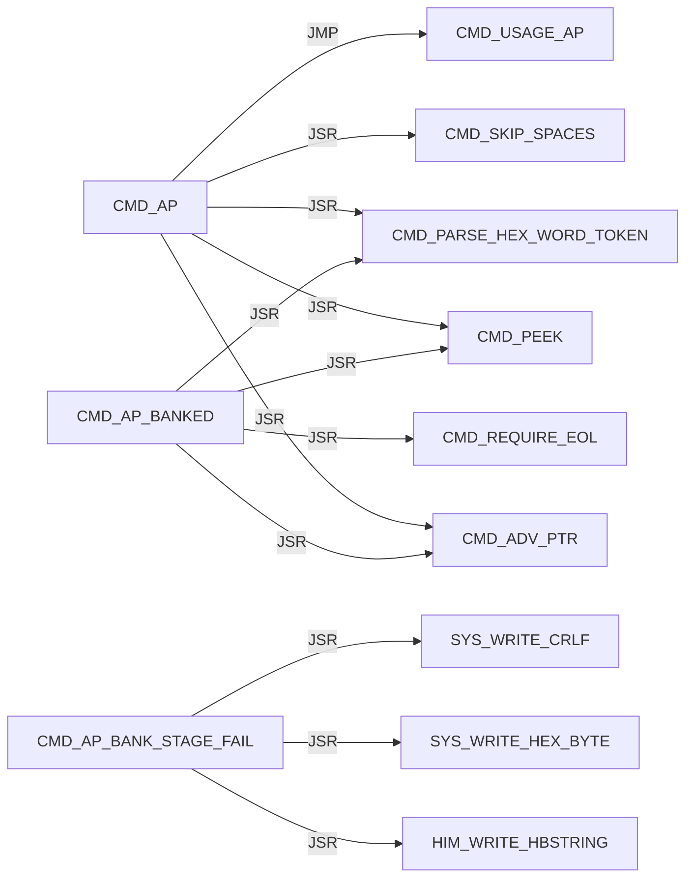

Panel 2 of 3: `CMD_AP_BANKED` through `CMD_AP_LOAD_REQUEST`.

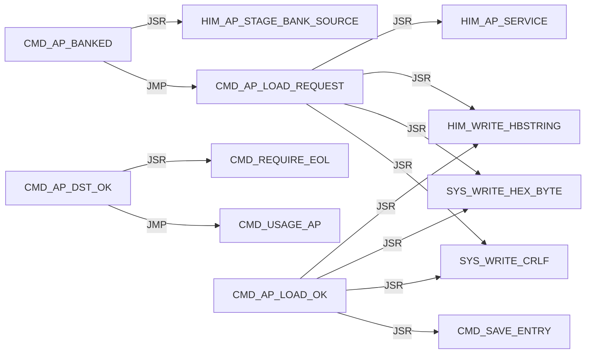

Panel 3 of 3: `CMD_AP_SRC_OK` through `CMD_AP_SRC_OK`.

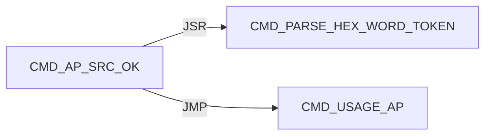

#### CMD / D

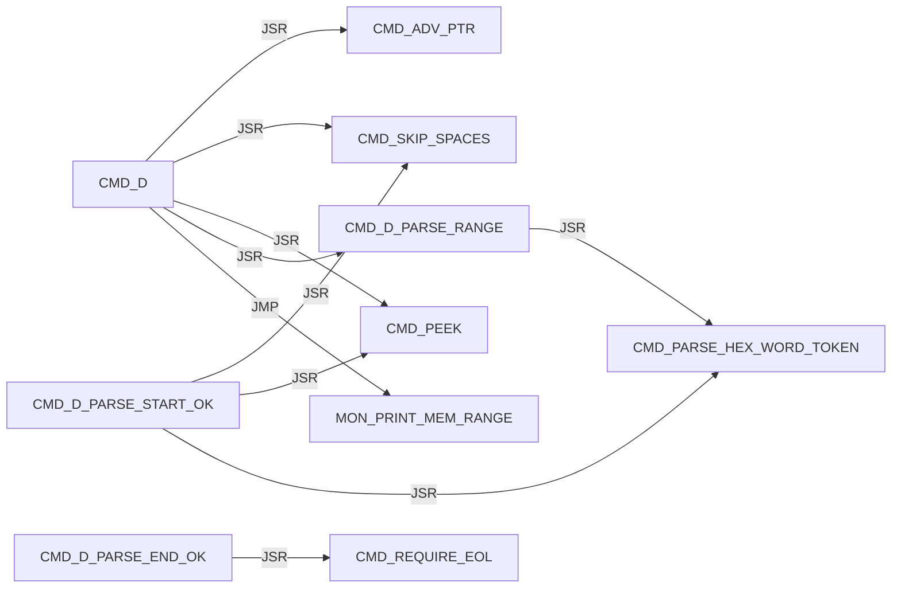

#### CMD / DISPATCH

Panel 1 of 2: `CMD_DISPATCH_DONE` through `CMD_DISPATCH_SCAN_MISS`.

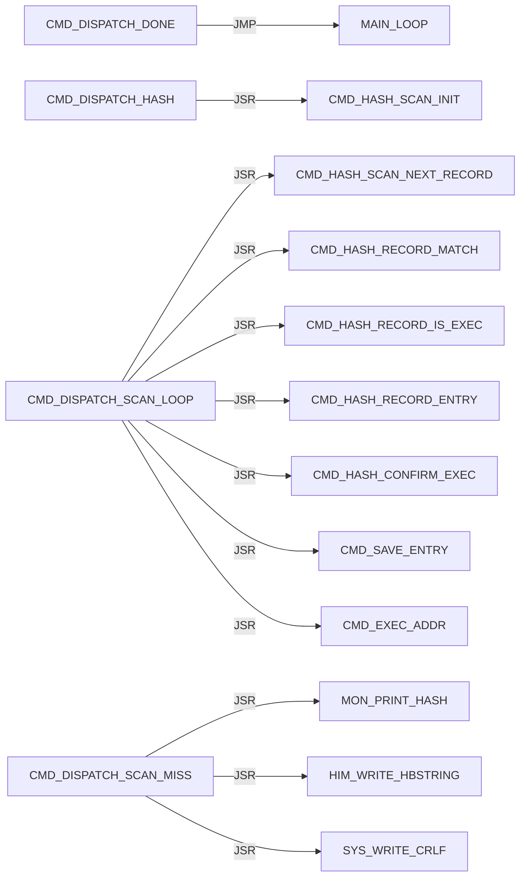

Panel 2 of 2: `CMD_DISPATCH_SCAN_MISS` through `CMD_DISPATCH_SCAN_NEXT`.

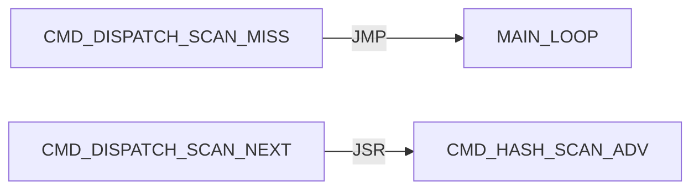

#### CMD / EXEC

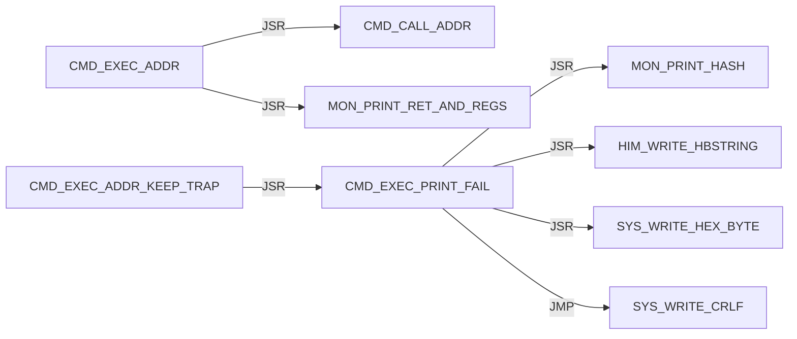

#### CMD / G

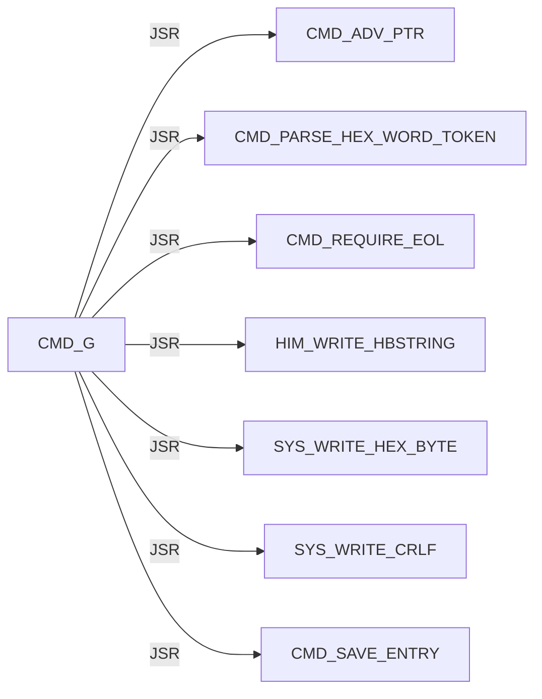

#### CMD / HASH

Panel 1 of 7: `CMD_HASH_CONFIRM_ADDR` through `CMD_HASH_FIND_LOOP`.

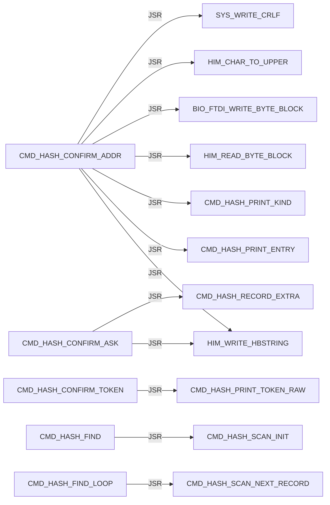

Panel 2 of 7: `CMD_HASH_FIND_LOOP` through `CMD_HASH_INFO_FOUND`.

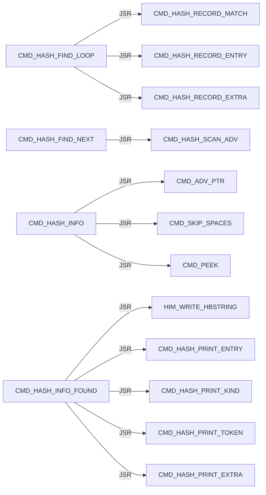

Panel 3 of 7: `CMD_HASH_INFO_FOUND` through `CMD_HASH_INFO_LOOKUP`.

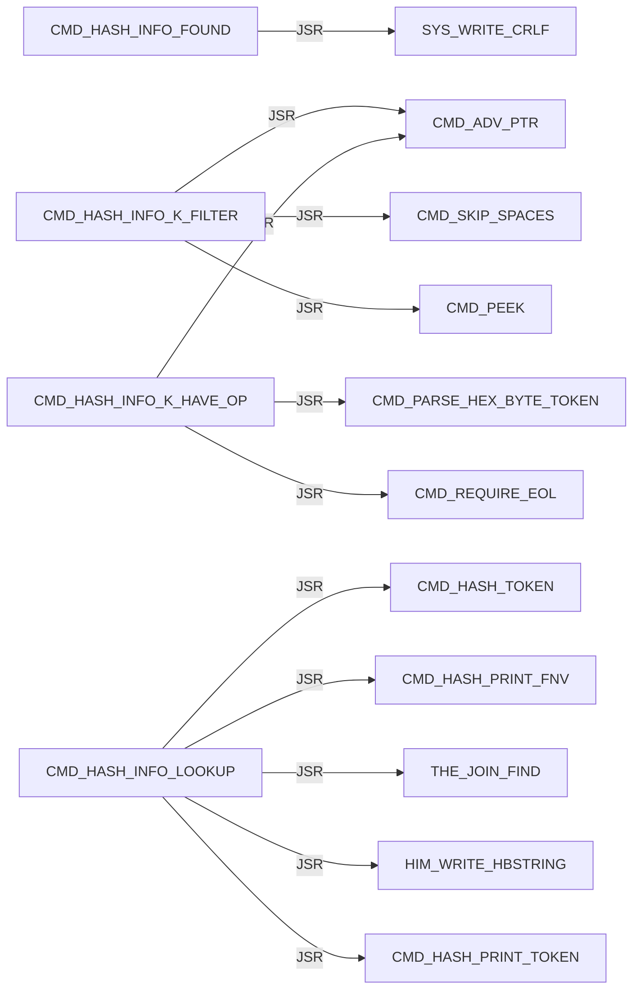

Panel 4 of 7: `CMD_HASH_INFO_LOOKUP` through `CMD_HASH_PRINT_EXTRA`.

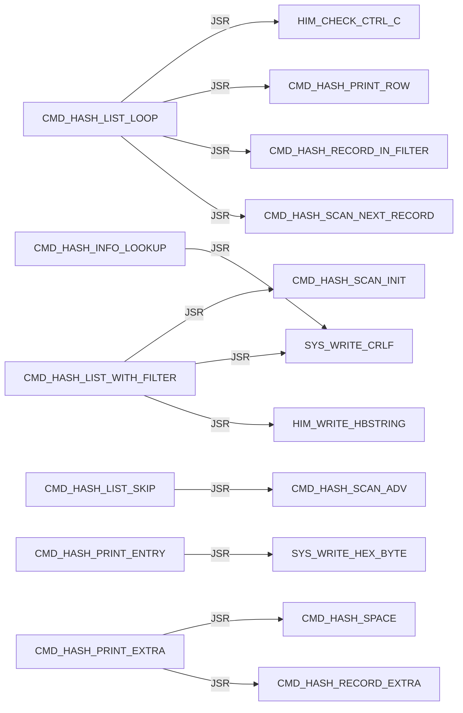

Panel 5 of 7: `CMD_HASH_PRINT_EXTRA` through `CMD_HASH_PRINT_TOKEN`.

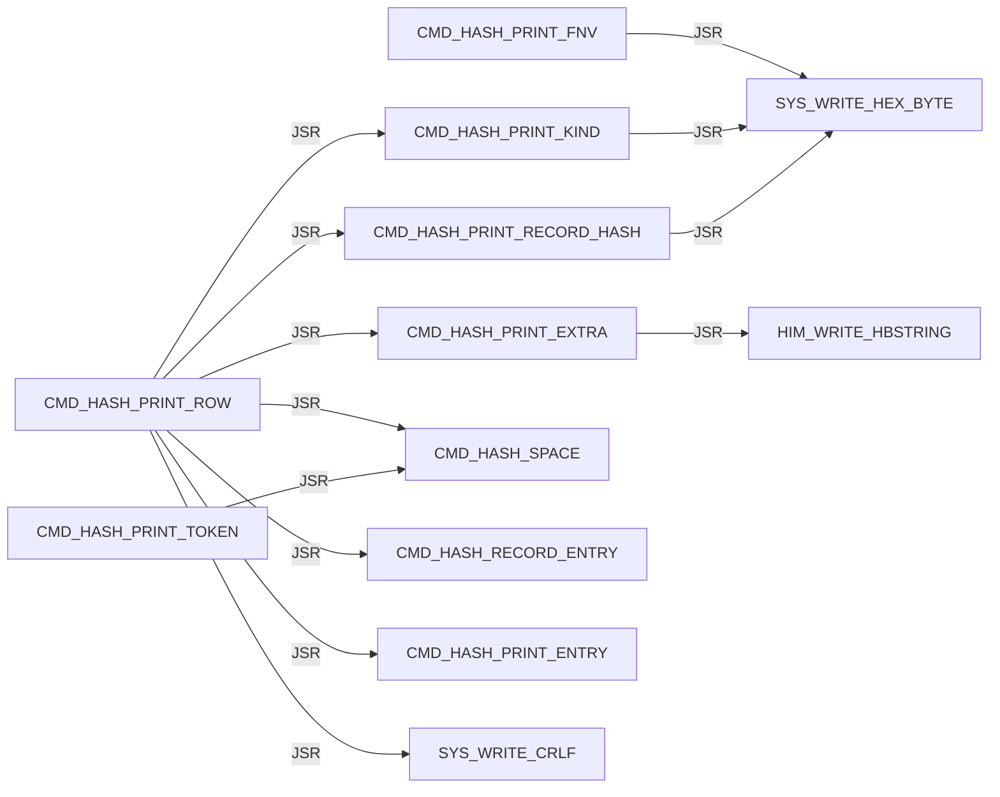

Panel 6 of 7: `CMD_HASH_PRINT_TOKEN_LOOP` through `CMD_HASH_TOKEN_LOOP`.

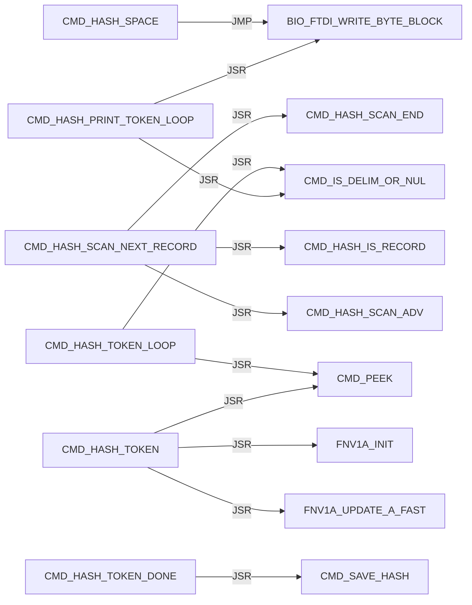

Panel 7 of 7: `CMD_HASH_TOKEN_LOOP` through `CMD_HASH_USAGE`.

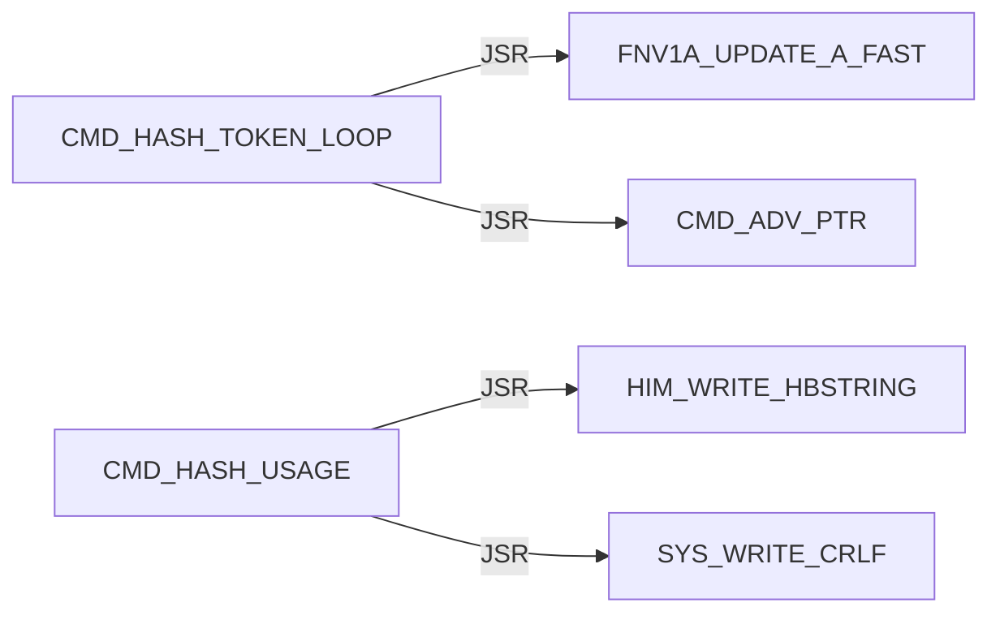

#### CMD / HELP


#### CMD / L

Panel 1 of 4: `CMD_L` through `CMD_L_DONE_PRINT`.

```mermaid
flowchart LR
    N0["CMD_L"] -->|JSR| N1["CMD_ADV_PTR"]
    N0["CMD_L"] -->|JSR| N2["CMD_SKIP_SPACES"]
    N0["CMD_L"] -->|JSR| N3["CMD_PEEK"]
    N4["CMD_L_ARG_F"] -->|JSR| N1["CMD_ADV_PTR"]
    N4["CMD_L_ARG_F"] -->|JSR| N5["CMD_REQUIRE_EOL"]
    N6["CMD_L_ARG_G"] -->|JSR| N1["CMD_ADV_PTR"]
    N6["CMD_L_ARG_G"] -->|JSR| N5["CMD_REQUIRE_EOL"]
    N7["CMD_L_ARGS_OK"] -->|JSR| N8["L_STR8_REQUIRE_SERVICE"]
    N7["CMD_L_ARGS_OK"] -->|JSR| N9["CMD_L_PRINT_FAIL"]
    N10["CMD_L_DONE_PRINT"] -->|JSR| N11["HIM_WRITE_HBSTRING"]
    N10["CMD_L_DONE_PRINT"] -->|JSR| N12["SYS_WRITE_HEX_BYTE"]
    N10["CMD_L_DONE_PRINT"] -->|JSR| N13["SYS_WRITE_CRLF"]
```

Panel 2 of 4: `CMD_L_FLASH_FAIL_DRAIN` through `CMD_L_PRINT_FAIL_ERASE`.

```mermaid
flowchart LR
    N0["CMD_L_FLASH_FAIL_DRAIN"] -->|JSR| N1["CMD_L_LATCH_FLASH_FAIL"]
    N2["CMD_L_HAVE_LINE"] -->|JSR| N3["CMD_PEEK"]
    N4["CMD_L_KEEP_FAIL_CODE"] -->|JSR| N5["L_PARSE_RECORD_STR8"]
    N4["CMD_L_KEEP_FAIL_CODE"] -->|JSR| N6["CMD_L_PRINT_FAIL"]
    N4["CMD_L_KEEP_FAIL_CODE"] -->|JMP| N7["CMD_L_FAIL_EXIT"]
    N6["CMD_L_PRINT_FAIL"] -->|JSR| N8["HIM_WRITE_HBSTRING"]
    N6["CMD_L_PRINT_FAIL"] -->|JSR| N9["SYS_WRITE_HEX_BYTE"]
    N6["CMD_L_PRINT_FAIL"] -->|JMP| N10["SYS_WRITE_CRLF"]
    N11["CMD_L_PRINT_FAIL_ERASE"] -->|JSR| N8["HIM_WRITE_HBSTRING"]
    N11["CMD_L_PRINT_FAIL_ERASE"] -->|JSR| N12["CMD_L_PRINT_LOAD_DST"]
    N11["CMD_L_PRINT_FAIL_ERASE"] -->|JSR| N9["SYS_WRITE_HEX_BYTE"]
    N11["CMD_L_PRINT_FAIL_ERASE"] -->|JMP| N10["SYS_WRITE_CRLF"]
```

Panel 3 of 4: `CMD_L_PRINT_FAIL_PROTECT` through `CMD_L_PRINT_LOAD_DST`.

```mermaid
flowchart LR
    N0["CMD_L_PRINT_FAIL_PROTECT"] -->|JSR| N1["HIM_WRITE_HBSTRING"]
    N0["CMD_L_PRINT_FAIL_PROTECT"] -->|JSR| N2["CMD_L_PRINT_LOAD_DST"]
    N0["CMD_L_PRINT_FAIL_PROTECT"] -->|JMP| N3["SYS_WRITE_CRLF"]
    N4["CMD_L_PRINT_FAIL_WRITE"] -->|JSR| N1["HIM_WRITE_HBSTRING"]
    N4["CMD_L_PRINT_FAIL_WRITE"] -->|JSR| N2["CMD_L_PRINT_LOAD_DST"]
    N4["CMD_L_PRINT_FAIL_WRITE"] -->|JSR| N5["SYS_WRITE_HEX_BYTE"]
    N4["CMD_L_PRINT_FAIL_WRITE"] -->|JMP| N3["SYS_WRITE_CRLF"]
    N6["CMD_L_PRINT_FLASH_FAIL_DONE"] -->|JSR| N1["HIM_WRITE_HBSTRING"]
    N6["CMD_L_PRINT_FLASH_FAIL_DONE"] -->|JSR| N5["SYS_WRITE_HEX_BYTE"]
    N6["CMD_L_PRINT_FLASH_FAIL_DONE"] -->|JSR| N3["SYS_WRITE_CRLF"]
    N6["CMD_L_PRINT_FLASH_FAIL_DONE"] -->|JMP| N7["CMD_L_FAIL_EXIT"]
    N2["CMD_L_PRINT_LOAD_DST"] -->|JSR| N5["SYS_WRITE_HEX_BYTE"]
```

Panel 4 of 4: `CMD_L_PRINT_LOAD_DST` through `CMD_L_SERVICE_OK`.

```mermaid
flowchart LR
    N0["CMD_L_PRINT_LOAD_DST"] -->|JMP| N1["SYS_WRITE_HEX_BYTE"]
    N2["CMD_L_READ_LOOP"] -->|JSR| N3["HIM_READ_LINE_UPPER"]
    N2["CMD_L_READ_LOOP"] -->|JSR| N4["HIM_WRITE_HBSTRING"]
    N2["CMD_L_READ_LOOP"] -->|JSR| N1["SYS_WRITE_HEX_BYTE"]
    N2["CMD_L_READ_LOOP"] -->|JSR| N5["SYS_WRITE_CRLF"]
    N6["CMD_L_READY_PRINT"] -->|JSR| N4["HIM_WRITE_HBSTRING"]
    N6["CMD_L_READY_PRINT"] -->|JSR| N5["SYS_WRITE_CRLF"]
    N7["CMD_L_SERVICE_OK"] -->|JSR| N8["DBG_CLEAR_ALL"]
```

#### CMD / M

```mermaid
flowchart LR
    N0["CMD_M"] -->|JSR| N1["CMD_ADV_PTR"]
    N0["CMD_M"] -->|JSR| N2["CMD_PARSE_RANGE_REQUIRED"]
    N0["CMD_M"] -->|JSR| N3["MON_MODIFY_RANGE_WRITABLE"]
    N0["CMD_M"] -->|JSR| N4["MON_MODIFY_RANGE"]
    N5["CMD_M_PROTECT"] -->|JSR| N6["HIM_WRITE_HBSTRING"]
    N5["CMD_M_PROTECT"] -->|JSR| N7["SYS_WRITE_HEX_BYTE"]
    N5["CMD_M_PROTECT"] -->|JSR| N8["SYS_WRITE_CRLF"]
```

#### CMD / PARSE

Panel 1 of 2: `CMD_PARSE_HEX_BYTE_TOKEN` through `CMD_PARSE_RANGE_PLUS`.

```mermaid
flowchart LR
    N0["CMD_PARSE_HEX_BYTE_TOKEN"] -->|JSR| N1["CMD_PARSE_HEX_WORD_TOKEN"]
    N2["CMD_PARSE_HEX_WORD_DONE"] -->|JSR| N3["CMD_PEEK"]
    N2["CMD_PARSE_HEX_WORD_DONE"] -->|JSR| N4["CMD_IS_DELIM_OR_NUL"]
    N5["CMD_PARSE_HEX_WORD_LOOP"] -->|JSR| N3["CMD_PEEK"]
    N5["CMD_PARSE_HEX_WORD_LOOP"] -->|JSR| N6["CMD_HEX_ASCII_TO_NIBBLE"]
    N5["CMD_PARSE_HEX_WORD_LOOP"] -->|JSR| N7["CMD_ADV_PTR"]
    N1["CMD_PARSE_HEX_WORD_TOKEN"] -->|JSR| N8["CMD_SKIP_SPACES"]
    N1["CMD_PARSE_HEX_WORD_TOKEN"] -->|JSR| N9["CMD_SKIP_OPTIONAL_DOLLAR"]
    N10["CMD_PARSE_RANGE_COUNT_OK"] -->|JMP| N11["CMD_PARSE_RANGE_FAIL"]
    N12["CMD_PARSE_RANGE_HAVE_END"] -->|JSR| N13["CMD_REQUIRE_EOL"]
    N14["CMD_PARSE_RANGE_PLUS"] -->|JSR| N7["CMD_ADV_PTR"]
    N14["CMD_PARSE_RANGE_PLUS"] -->|JSR| N1["CMD_PARSE_HEX_WORD_TOKEN"]
```

Panel 2 of 2: `CMD_PARSE_RANGE_PLUS` through `CMD_PARSE_RANGE_START_OK`.

```mermaid
flowchart LR
    N0["CMD_PARSE_RANGE_PLUS"] -->|JMP| N1["CMD_PARSE_RANGE_FAIL"]
    N2["CMD_PARSE_RANGE_REQUIRED"] -->|JSR| N3["CMD_PARSE_HEX_WORD_TOKEN"]
    N2["CMD_PARSE_RANGE_REQUIRED"] -->|JMP| N1["CMD_PARSE_RANGE_FAIL"]
    N4["CMD_PARSE_RANGE_START_OK"] -->|JSR| N5["CMD_SKIP_SPACES"]
    N4["CMD_PARSE_RANGE_START_OK"] -->|JSR| N6["CMD_PEEK"]
    N4["CMD_PARSE_RANGE_START_OK"] -->|JSR| N3["CMD_PARSE_HEX_WORD_TOKEN"]
    N4["CMD_PARSE_RANGE_START_OK"] -->|JMP| N1["CMD_PARSE_RANGE_FAIL"]
```

#### CMD / Q

```mermaid
flowchart LR
    N0["CMD_Q"] -->|JMP| N1["MON_REENTER"]
```

#### CMD / R

```mermaid
flowchart LR
    N0["CMD_R"] -->|JSR| N1["MON_CTX_REQUIRE_VALID"]
    N2["CMD_R_HAVE_CTX"] -->|JSR| N3["CMD_ADV_PTR"]
    N2["CMD_R_HAVE_CTX"] -->|JSR| N4["MON_CTX_PARSE_ASSIGN_LIST"]
    N2["CMD_R_HAVE_CTX"] -->|JSR| N5["MON_PRINT_STOP_AND_REGS"]
```

#### CMD / REQUIRE

```mermaid
flowchart LR
    N0["CMD_REQUIRE_EOL"] -->|JSR| N1["CMD_SKIP_SPACES"]
    N0["CMD_REQUIRE_EOL"] -->|JSR| N2["CMD_PEEK"]
```

#### CMD / SKIP

```mermaid
flowchart LR
    N0["CMD_SKIP_OPTIONAL_DOLLAR"] -->|JSR| N1["CMD_PEEK"]
    N0["CMD_SKIP_OPTIONAL_DOLLAR"] -->|JSR| N2["CMD_ADV_PTR"]
    N3["CMD_SKIP_SPACES"] -->|JSR| N1["CMD_PEEK"]
    N4["CMD_SKIP_SPACES_ADV"] -->|JSR| N2["CMD_ADV_PTR"]
```

#### CMD / UNKNOWN

```mermaid
flowchart LR
    N0["CMD_UNKNOWN"] -->|JSR| N1["HIM_WRITE_HBSTRING"]
    N0["CMD_UNKNOWN"] -->|JSR| N2["SYS_WRITE_CRLF"]
    N0["CMD_UNKNOWN"] -->|JMP| N3["MAIN_LOOP"]
```

#### CMD / USAGE

Panel 1 of 2: `CMD_USAGE_AP` through `CMD_USAGE_R`.

```mermaid
flowchart LR
    N0["CMD_USAGE_AP"] -->|JSR| N1["HIM_WRITE_HBSTRING"]
    N0["CMD_USAGE_AP"] -->|JSR| N2["SYS_WRITE_CRLF"]
    N3["CMD_USAGE_D"] -->|JSR| N1["HIM_WRITE_HBSTRING"]
    N3["CMD_USAGE_D"] -->|JSR| N2["SYS_WRITE_CRLF"]
    N4["CMD_USAGE_G"] -->|JSR| N1["HIM_WRITE_HBSTRING"]
    N4["CMD_USAGE_G"] -->|JSR| N2["SYS_WRITE_CRLF"]
    N5["CMD_USAGE_L"] -->|JSR| N1["HIM_WRITE_HBSTRING"]
    N5["CMD_USAGE_L"] -->|JSR| N2["SYS_WRITE_CRLF"]
    N6["CMD_USAGE_L_JMP"] -->|JMP| N5["CMD_USAGE_L"]
    N7["CMD_USAGE_M"] -->|JSR| N1["HIM_WRITE_HBSTRING"]
    N7["CMD_USAGE_M"] -->|JSR| N2["SYS_WRITE_CRLF"]
    N8["CMD_USAGE_R"] -->|JSR| N1["HIM_WRITE_HBSTRING"]
```

Panel 2 of 2: `CMD_USAGE_R` through `CMD_USAGE_X`.

```mermaid
flowchart LR
    N0["CMD_USAGE_R"] -->|JSR| N1["SYS_WRITE_CRLF"]
    N2["CMD_USAGE_X"] -->|JSR| N3["HIM_WRITE_HBSTRING"]
    N2["CMD_USAGE_X"] -->|JSR| N1["SYS_WRITE_CRLF"]
```

#### CMD / X

```mermaid
flowchart LR
    N0["CMD_X"] -->|JSR| N1["MON_CTX_REQUIRE_VALID"]
    N2["CMD_X_HAVE_CTX"] -->|JSR| N3["CMD_ADV_PTR"]
    N2["CMD_X_HAVE_CTX"] -->|JSR| N4["MON_CTX_PARSE_ASSIGN_LIST"]
    N2["CMD_X_HAVE_CTX"] -->|JSR| N5["HIM_WRITE_HBSTRING"]
    N2["CMD_X_HAVE_CTX"] -->|JSR| N6["SYS_WRITE_HEX_BYTE"]
    N2["CMD_X_HAVE_CTX"] -->|JSR| N7["SYS_WRITE_CRLF"]
    N2["CMD_X_HAVE_CTX"] -->|JMP| N8["MON_CTX_RESUME_RTI"]
```

#### ENTRY / unprefixed

```mermaid
flowchart LR
    N0["START"] -->|JMP| N1["HIMON_START_BODY"]
```

#### FNV1A

```mermaid
flowchart LR
    N0["FNV1A_MUL_PRIME"] -->|JSR| N1["MATH_COPY_HASH_TO_TERM"]
    N0["FNV1A_MUL_PRIME"] -->|JSR| N2["MATH_SHLADD_TERM_N"]
    N0["FNV1A_MUL_PRIME"] -->|JMP| N3["MATH_ADD_TERM1_TO_HASH3"]
    N4["FNV1A_MUL_PRIME_FAST"] -->|JSR| N1["MATH_COPY_HASH_TO_TERM"]
    N4["FNV1A_MUL_PRIME_FAST"] -->|JSR| N5["MATH_ADD_TERM_TO_HASH"]
    N4["FNV1A_MUL_PRIME_FAST"] -->|JMP| N3["MATH_ADD_TERM1_TO_HASH3"]
    N6["FNV1A_UPDATE_A"] -->|JMP| N0["FNV1A_MUL_PRIME"]
    N7["FNV1A_UPDATE_A_FAST"] -->|JMP| N4["FNV1A_MUL_PRIME_FAST"]
```

#### HIM / AP

Panel 1 of 10: `HIM_AP_ADVANCE_A` through `HIM_AP_LINK_DONE`.

```mermaid
flowchart LR
    N0["HIM_AP_ADVANCE_A"] -->|JSR| N1["HIM_AP_NEED_A"]
    N2["HIM_AP_BANK_STAGE_CODE"] -->|JSR| N3["STR8_BANK_SELECT_SERVICE"]
    N2["HIM_AP_BANK_STAGE_CODE"] -->|JSR| N4["STR8_BANK_SELECT_RAM"]
    N5["HIM_AP_CHECK_RELOC_COUNT_OK"] -->|JMP| N6["HIM_AP_BAD_LINE"]
    N7["HIM_AP_CHECK_RELOC_REC"] -->|JMP| N6["HIM_AP_BAD_LINE"]
    N8["HIM_AP_FIND_HOLE_LOOP"] -->|JSR| N9["HIM_AP_HOLE_AT_SCAN"]
    N10["HIM_AP_FIND_HOLE_NEXT"] -->|JMP| N11["HIM_AP_BAD_RANGE"]
    N12["HIM_AP_IMPORT_LINK"] -->|JSR| N13["HIM_AP_LINK_RELOAD_REL_PTR"]
    N14["HIM_AP_LINK_CAPTURE_ROW_X"] -->|JSR| N15["HIM_AP_RELOC_KIND_X"]
    N14["HIM_AP_LINK_CAPTURE_ROW_X"] -->|JSR| N16["HIM_AP_RELOC_SITE_LO_X"]
    N14["HIM_AP_LINK_CAPTURE_ROW_X"] -->|JSR| N17["HIM_AP_RELOC_SITE_HI_X"]
    N18["HIM_AP_LINK_DONE"] -->|JSR| N19["HIM_AP_LINK_RESTORE_COUNTS"]
```

Panel 2 of 10: `HIM_AP_LINK_FAIL` through `HIM_AP_LINK_PATCH`.

```mermaid
flowchart LR
    N0["HIM_AP_LINK_FAIL"] -->|JSR| N1["HIM_AP_LINK_RESTORE_COUNTS"]
    N2["HIM_AP_LINK_HASH_CODE_UPDATE"] -->|JSR| N3["FNV1A_UPDATE_A_FAST"]
    N4["HIM_AP_LINK_HASH_LOOP"] -->|JSR| N5["HIM_AP_LINK_UNPACK_NEXT3"]
    N4["HIM_AP_LINK_HASH_LOOP"] -->|JSR| N6["HIM_AP_LINK_HASH_CODE_A"]
    N7["HIM_AP_LINK_HASH_PACK_PTR_OK"] -->|JSR| N8["FNV1A_INIT"]
    N9["HIM_AP_LINK_HASH_SLOT_X"] -->|JSR| N10["HIM_AP_LINK_IMPORT_ROW_PTR_X"]
    N11["HIM_AP_LINK_IMPORT_ROW_LOOP"] -->|JSR| N12["HIM_AP_LINK_IMPORT_ROW_BYTES_A"]
    N13["HIM_AP_LINK_PATCH"] -->|JSR| N14["HIM_AP_LINK_RELOAD_REL_PTR"]
    N13["HIM_AP_LINK_PATCH"] -->|JSR| N15["HIM_AP_RELOC_KIND_X"]
    N13["HIM_AP_LINK_PATCH"] -->|JSR| N16["HIM_AP_IMPORT_KIND_A"]
    N13["HIM_AP_LINK_PATCH"] -->|JSR| N17["HIM_AP_LINK_CAPTURE_ROW_X"]
    N13["HIM_AP_LINK_PATCH"] -->|JSR| N18["HIM_AP_LINK_RESOLVE_ROW_X"]
```

Panel 3 of 10: `HIM_AP_LINK_PATCH` through `HIM_AP_LOAD_BASE_GE_20`.

```mermaid
flowchart LR
    N0["HIM_AP_LINK_PATCH"] -->|JSR| N1["HIM_AP_LINK_PATCH_CAPTURED"]
    N2["HIM_AP_LINK_RESOLVE_ROW_X"] -->|JSR| N3["HIM_AP_RELOC_TARGET_HI_X"]
    N2["HIM_AP_LINK_RESOLVE_ROW_X"] -->|JSR| N4["HIM_AP_RELOC_TARGET_LO_X"]
    N2["HIM_AP_LINK_RESOLVE_ROW_X"] -->|JSR| N5["HIM_AP_LINK_RESOLVE_SLOT_X"]
    N5["HIM_AP_LINK_RESOLVE_SLOT_X"] -->|JSR| N6["HIM_AP_LINK_HASH_SLOT_X"]
    N5["HIM_AP_LINK_RESOLVE_SLOT_X"] -->|JSR| N7["THE_JOIN_EXEC_XY"]
    N8["HIM_AP_LINK_VALIDATE"] -->|JSR| N9["HIM_AP_LINK_RELOAD_REL_PTR"]
    N8["HIM_AP_LINK_VALIDATE"] -->|JSR| N10["HIM_AP_RELOC_KIND_X"]
    N8["HIM_AP_LINK_VALIDATE"] -->|JSR| N11["HIM_AP_IMPORT_KIND_A"]
    N8["HIM_AP_LINK_VALIDATE"] -->|JSR| N12["HIM_AP_RELOC_SITE_OK_X"]
    N8["HIM_AP_LINK_VALIDATE"] -->|JSR| N2["HIM_AP_LINK_RESOLVE_ROW_X"]
    N13["HIM_AP_LOAD_BASE_GE_20"] -->|JMP| N14["HIM_AP_BAD_RANGE"]
```

Panel 4 of 10: `HIM_AP_LOAD_BASE_LT_50` through `HIM_AP_LOAD_PATCH_ROW`.

```mermaid
flowchart LR
    N0["HIM_AP_LOAD_BASE_LT_50"] -->|JMP| N1["HIM_AP_BAD_RANGE"]
    N2["HIM_AP_LOAD_LAST_NO_CARRY"] -->|JMP| N1["HIM_AP_BAD_RANGE"]
    N3["HIM_AP_LOAD_LEN_NONZERO"] -->|JMP| N1["HIM_AP_BAD_RANGE"]
    N4["HIM_AP_LOAD_NO_OVERLAP"] -->|JSR| N5["HIM_AP_COPY_BODY_TO_DST"]
    N4["HIM_AP_LOAD_NO_OVERLAP"] -->|JSR| N6["HIM_AP_IMPORT_LINK"]
    N7["HIM_AP_LOAD_OVERLAP_BAD"] -->|JMP| N1["HIM_AP_BAD_RANGE"]
    N8["HIM_AP_LOAD_PARSED"] -->|JSR| N9["HIM_AP_LOAD_RANGE_OK"]
    N10["HIM_AP_LOAD_PATCH_LOOP"] -->|JSR| N11["HIM_AP_RELOC_KIND_X"]
    N10["HIM_AP_LOAD_PATCH_LOOP"] -->|JSR| N12["HIM_AP_INTERNAL_KIND_A"]
    N10["HIM_AP_LOAD_PATCH_LOOP"] -->|JSR| N13["HIM_AP_IMPORT_KIND_A"]
    N10["HIM_AP_LOAD_PATCH_LOOP"] -->|JMP| N14["HIM_AP_BAD_FIX"]
    N15["HIM_AP_LOAD_PATCH_ROW"] -->|JSR| N16["HIM_AP_RELOC_SITE_OK_X"]
```

Panel 5 of 10: `HIM_AP_LOAD_PATCH_SITE_OK` through `HIM_AP_PARSE_HEADER_RANGE`.

```mermaid
flowchart LR
    N0["HIM_AP_LOAD_PATCH_SITE_OK"] -->|JSR| N1["HIM_AP_RELOC_PATCH_ROW_X"]
    N2["HIM_AP_LOAD_RANGE_OK"] -->|JMP| N3["HIM_AP_BAD_RANGE"]
    N4["HIM_AP_NEED_A"] -->|JMP| N3["HIM_AP_BAD_RANGE"]
    N5["HIM_AP_PARSE_BODY"] -->|JSR| N4["HIM_AP_NEED_A"]
    N6["HIM_AP_PARSE_BODY_HDR_ROOM"] -->|JMP| N7["HIM_AP_BAD_LINE"]
    N8["HIM_AP_PARSE_BODY_LEFT_LO_OK"] -->|JMP| N7["HIM_AP_BAD_LINE"]
    N9["HIM_AP_PARSE_BODY_LEFT_OK"] -->|JMP| N7["HIM_AP_BAD_LINE"]
    N10["HIM_AP_PARSE_BODY_SAVE"] -->|JMP| N7["HIM_AP_BAD_LINE"]
    N11["HIM_AP_PARSE_BODY_TAG_OK"] -->|JSR| N12["HIM_AP_ADVANCE_A"]
    N13["HIM_AP_PARSE_EXPORT"] -->|JSR| N14["HIM_AP_TAG_LEN"]
    N15["HIM_AP_PARSE_EXPORT_TAG_OK"] -->|JSR| N12["HIM_AP_ADVANCE_A"]
    N16["HIM_AP_PARSE_HEADER_RANGE"] -->|JMP| N7["HIM_AP_BAD_LINE"]
```

Panel 6 of 10: `HIM_AP_PARSE_IMPORT` through `HIM_AP_PARSE_RELOC_TAG_OK`.

```mermaid
flowchart LR
    N0["HIM_AP_PARSE_IMPORT"] -->|JSR| N1["HIM_AP_TAG_LEN"]
    N2["HIM_AP_PARSE_IMPORT_LEN_OK"] -->|JSR| N3["HIM_AP_NEED_A"]
    N4["HIM_AP_PARSE_IMPORT_ROOM_OK"] -->|JSR| N5["HIM_AP_ADVANCE_A"]
    N6["HIM_AP_PARSE_IMPORT_TAG_OK"] -->|JMP| N7["HIM_AP_BAD_LINE"]
    N8["HIM_AP_PARSE_LEN_NONZERO"] -->|JSR| N9["HIM_AP_SOURCE_RANGE_OK"]
    N10["HIM_AP_PARSE_MIN"] -->|JSR| N9["HIM_AP_SOURCE_RANGE_OK"]
    N11["HIM_AP_PARSE_RANGE_SAFE"] -->|JMP| N7["HIM_AP_BAD_LINE"]
    N12["HIM_AP_PARSE_RELOC"] -->|JSR| N1["HIM_AP_TAG_LEN"]
    N13["HIM_AP_PARSE_RELOC_LEN_OK"] -->|JSR| N3["HIM_AP_NEED_A"]
    N14["HIM_AP_PARSE_RELOC_ROOM_OK"] -->|JSR| N15["HIM_AP_CHECK_RELOC_REC"]
    N16["HIM_AP_PARSE_RELOC_SHAPE_OK"] -->|JSR| N5["HIM_AP_ADVANCE_A"]
    N17["HIM_AP_PARSE_RELOC_TAG_OK"] -->|JMP| N7["HIM_AP_BAD_LINE"]
```

Panel 7 of 10: `HIM_AP_PARSE_SEAL` through `HIM_AP_RELOC_SITE_HAVE_ADD`.

```mermaid
flowchart LR
    N0["HIM_AP_PARSE_SEAL"] -->|JSR| N1["HIM_AP_TAG_LEN"]
    N2["HIM_AP_PARSE_SEAL_LEN_OK"] -->|JSR| N3["HIM_AP_ADVANCE_A"]
    N4["HIM_AP_PARSE_SEAL_TAG_OK"] -->|JMP| N5["HIM_AP_BAD_LINE"]
    N6["HIM_AP_PARSE_SIG0_OK"] -->|JMP| N5["HIM_AP_BAD_LINE"]
    N7["HIM_AP_PARSE_SIG1_OK"] -->|JMP| N5["HIM_AP_BAD_LINE"]
    N8["HIM_AP_PARSE_VER_OK"] -->|JMP| N5["HIM_AP_BAD_LINE"]
    N9["HIM_AP_RELOC_PATCH_ROW_X"] -->|JSR| N10["HIM_AP_RELOC_SITE_LO_X"]
    N9["HIM_AP_RELOC_PATCH_ROW_X"] -->|JSR| N11["HIM_AP_RELOC_SITE_HI_X"]
    N9["HIM_AP_RELOC_PATCH_ROW_X"] -->|JSR| N12["HIM_AP_RELOC_TARGET_LO_X"]
    N9["HIM_AP_RELOC_PATCH_ROW_X"] -->|JSR| N13["HIM_AP_RELOC_TARGET_HI_X"]
    N14["HIM_AP_RELOC_SITE_HAVE_ADD"] -->|JSR| N10["HIM_AP_RELOC_SITE_LO_X"]
    N14["HIM_AP_RELOC_SITE_HAVE_ADD"] -->|JSR| N11["HIM_AP_RELOC_SITE_HI_X"]
```

Panel 8 of 10: `HIM_AP_RELOC_SITE_HAVE_ADD` through `HIM_AP_SOURCE_BASE_GE_20`.

```mermaid
flowchart LR
    N0["HIM_AP_RELOC_SITE_HAVE_ADD"] -->|JMP| N1["HIM_AP_BAD_FIX"]
    N2["HIM_AP_RELOC_SITE_HI_EQ"] -->|JMP| N1["HIM_AP_BAD_FIX"]
    N3["HIM_AP_RELOC_SITE_NO_CARRY"] -->|JMP| N1["HIM_AP_BAD_FIX"]
    N4["HIM_AP_RELOC_SITE_OK_X"] -->|JSR| N5["HIM_AP_RELOC_KIND_X"]
    N6["HIM_AP_SERVICE"] -->|JMP| N7["HIM_AP_SERVICE_SUGGEST"]
    N8["HIM_AP_SERVICE_BAD_OP"] -->|JMP| N9["HIM_AP_BAD_LINE"]
    N10["HIM_AP_SERVICE_LINK"] -->|JMP| N11["HIM_AP_IMPORT_LINK"]
    N12["HIM_AP_SERVICE_LOAD"] -->|JSR| N13["HIM_AP_PARSE_MIN"]
    N14["HIM_AP_SERVICE_PARSE"] -->|JMP| N13["HIM_AP_PARSE_MIN"]
    N7["HIM_AP_SERVICE_SUGGEST"] -->|JSR| N13["HIM_AP_PARSE_MIN"]
    N15["HIM_AP_SOURCE_BASE_BAD"] -->|JMP| N16["HIM_AP_BAD_RANGE"]
    N17["HIM_AP_SOURCE_BASE_GE_20"] -->|JMP| N16["HIM_AP_BAD_RANGE"]
```

Panel 9 of 10: `HIM_AP_SOURCE_BASE_GE_80` through `HIM_AP_TAG_LEN_ROOM_OK`.

```mermaid
flowchart LR
    N0["HIM_AP_SOURCE_BASE_GE_80"] -->|JMP| N1["HIM_AP_BAD_RANGE"]
    N2["HIM_AP_SOURCE_BASE_SAFE"] -->|JMP| N1["HIM_AP_BAD_RANGE"]
    N3["HIM_AP_SOURCE_LAST_NO_CARRY"] -->|JMP| N1["HIM_AP_BAD_RANGE"]
    N4["HIM_AP_SOURCE_LEN_NONZERO"] -->|JSR| N5["HIM_AP_SOURCE_BASE_OK"]
    N6["HIM_AP_SOURCE_RAM_RANGE"] -->|JMP| N1["HIM_AP_BAD_RANGE"]
    N7["HIM_AP_SOURCE_RANGE_OK"] -->|JMP| N1["HIM_AP_BAD_RANGE"]
    N8["HIM_AP_SOURCE_STAGE_RANGE"] -->|JMP| N1["HIM_AP_BAD_RANGE"]
    N9["HIM_AP_STAGE_BANK_BAD"] -->|JMP| N1["HIM_AP_BAD_RANGE"]
    N10["HIM_AP_STAGE_BANK_SOURCE"] -->|JSR| N11["HIM_AP_BANK_STAGE_RAM"]
    N12["HIM_AP_SUGGEST_PARSED"] -->|JSR| N13["HIM_AP_FIND_HOLE"]
    N14["HIM_AP_TAG_LEN"] -->|JSR| N15["HIM_AP_NEED_A"]
    N16["HIM_AP_TAG_LEN_ROOM_OK"] -->|JMP| N17["HIM_AP_BAD_LINE"]
```

Panel 10 of 10: `HIM_AP_TAG_LEN_TAG_OK` through `HIM_AP_TAG_LEN_TAG_OK`.

```mermaid
flowchart LR
    N0["HIM_AP_TAG_LEN_TAG_OK"] -->|JMP| N1["HIM_AP_ADVANCE_A"]
```

#### HIM / CHECK

```mermaid
flowchart LR
    N0["HIM_CHECK_CTRL_C"] -->|JSR| N1["BIO_FTDI_READ_BYTE_NONBLOCK"]
```

#### HIM / FLASH

```mermaid
flowchart LR
    N0["HIM_FLASH_INSTALL_BAD_JMP"] -->|JMP| N1["HIM_FLASH_INSTALL_BAD"]
    N2["HIM_FLASH_INSTALL_LOOP"] -->|JSR| N3["L_FLASH_SET_PTR"]
    N2["HIM_FLASH_INSTALL_LOOP"] -->|JSR| N4["FLASH_WRITE_BYTE_AXY"]
```

#### HIM / PACK40

```mermaid
flowchart LR
    N0["HIM_PACK40_ASCII_TO_CODE"] -->|JSR| N1["HIM_CHAR_TO_UPPER"]
    N2["HIM_PACK40_PACK3"] -->|JSR| N3["HIM_PACK40_MUL40"]
    N2["HIM_PACK40_PACK3"] -->|JSR| N4["HIM_PACK40_ADD_A"]
```

#### HIM / READ

```mermaid
flowchart LR
    N0["HIM_READ_BYTE_HW"] -->|JSR| N1["BIO_FTDI_READ_BYTE_BLOCK"]
    N2["HIM_READ_LINE_ABORT"] -->|JSR| N3["SYS_WRITE_CRLF"]
    N4["HIM_READ_LINE_BS_DEC"] -->|JSR| N5["BIO_FTDI_WRITE_BYTE_BLOCK"]
    N6["HIM_READ_LINE_DONE"] -->|JSR| N3["SYS_WRITE_CRLF"]
    N7["HIM_READ_LINE_LOOP"] -->|JSR| N8["HIM_READ_BYTE_BLOCK"]
    N7["HIM_READ_LINE_LOOP"] -->|JSR| N9["HIM_CHAR_TO_UPPER"]
    N7["HIM_READ_LINE_LOOP"] -->|JSR| N10["CMD_ADV_PTR"]
    N7["HIM_READ_LINE_LOOP"] -->|JSR| N5["BIO_FTDI_WRITE_BYTE_BLOCK"]
```

#### HIM / WRITE

```mermaid
flowchart LR
    N0["HIM_WRITE_HBSTRING_LAST"] -->|JSR| N1["BIO_FTDI_WRITE_BYTE_BLOCK"]
    N2["HIM_WRITE_HBSTRING_LOOP"] -->|JSR| N1["BIO_FTDI_WRITE_BYTE_BLOCK"]
```

#### HIMON

```mermaid
flowchart LR
    N0["HIMON_START_BODY"] -->|JMP| N1["HIMON_WARM_START_BODY"]
    N1["HIMON_WARM_START_BODY"] -->|JSR| N2["DBG_CLEAR_ALL"]
    N1["HIMON_WARM_START_BODY"] -->|JMP| N3["MON_START_INIT"]
```

#### L

```mermaid
flowchart LR
    N0["L_NOTE_S1_ADDR_PRINT"] -->|JSR| N1["BIO_FTDI_WRITE_BYTE_BLOCK"]
    N0["L_NOTE_S1_ADDR_PRINT"] -->|JSR| N2["SYS_WRITE_HEX_BYTE"]
    N0["L_NOTE_S1_ADDR_PRINT"] -->|JSR| N3["SYS_WRITE_CRLF"]
    N4["L_PARSE_RECORD_STR8"] -->|JSR| N5["STR8_RECORD_SERVICE"]
    N6["L_PARSE_RECORD_STR8_DATA"] -->|JMP| N7["L_PARSE_RECORD_STR8_FLASH_DATA"]
    N8["L_PARSE_RECORD_STR8_DATA_NORMAL"] -->|JMP| N9["L_PARSE_RECORD_STR8_DATA_DONE"]
    N10["L_PARSE_RECORD_STR8_FLASH_APPLY"] -->|JSR| N5["STR8_RECORD_SERVICE"]
    N7["L_PARSE_RECORD_STR8_FLASH_DATA"] -->|JSR| N11["L_NOTE_S1_ADDR"]
    N12["L_PARSE_RECORD_STR8_NONEMPTY"] -->|JMP| N13["L_PARSE_RECORD_STR8_RAM_DATA"]
    N14["L_PARSE_RECORD_STR8_SPAN_OK"] -->|JSR| N11["L_NOTE_S1_ADDR"]
```

#### MAIN

```mermaid
flowchart LR
    N0["MAIN_HAVE_LINE"] -->|JSR| N1["CMD_SKIP_SPACES"]
    N0["MAIN_HAVE_LINE"] -->|JSR| N2["CMD_PEEK"]
    N0["MAIN_HAVE_LINE"] -->|JSR| N3["CMD_HASH_TOKEN"]
    N0["MAIN_HAVE_LINE"] -->|JMP| N4["CMD_DISPATCH_HASH"]
    N5["MAIN_LOOP"] -->|JSR| N6["HIM_WRITE_HBSTRING"]
    N5["MAIN_LOOP"] -->|JSR| N7["HIM_READ_LINE_ECHO_UPPER"]
    N5["MAIN_LOOP"] -->|JMP| N5["MAIN_LOOP"]
```

#### MATH

```mermaid
flowchart LR
    N0["MATH_SHLADD_TERM_N"] -->|JSR| N1["MATH_SHL_TERM_N"]
    N0["MATH_SHLADD_TERM_N"] -->|JMP| N2["MATH_ADD_TERM_TO_HASH"]
```

#### MON / AFTER

```mermaid
flowchart LR
    N0["MON_AFTER_BANNER"] -->|JSR| N1["MON_PRINT_STOP_AND_REGS"]
```

#### MON / BRK

```mermaid
flowchart LR
    N0["MON_BRK_TRAP"] -->|JSR| N1["DBG_HANDLE_BRK"]
    N0["MON_BRK_TRAP"] -->|JMP| N2["MON_REENTER"]
    N3["MON_BRK_TRAP_NORMAL"] -->|JMP| N2["MON_REENTER"]
```

#### MON / CLEAR

```mermaid
flowchart LR
    N0["MON_CLEAR_RAM_ZP"] -->|JMP| N1["MON_START_INIT"]
```

#### MON / COLD

```mermaid
flowchart LR
    N0["MON_COLD_RESET"] -->|JMP| N1["MON_CLEAR_RAM"]
```

#### MON / CTX

Panel 1 of 3: `MON_CTX_PARSE_A` through `MON_CTX_PARSE_P_OR_PC`.

```mermaid
flowchart LR
    N0["MON_CTX_PARSE_A"] -->|JSR| N1["CMD_ADV_PTR"]
    N0["MON_CTX_PARSE_A"] -->|JSR| N2["MON_PARSE_EQ"]
    N0["MON_CTX_PARSE_A"] -->|JSR| N3["CMD_PARSE_HEX_BYTE_TOKEN"]
    N4["MON_CTX_PARSE_ASSIGN"] -->|JSR| N5["CMD_PEEK"]
    N6["MON_CTX_PARSE_ASSIGN_LIST"] -->|JSR| N7["CMD_SKIP_SPACES"]
    N6["MON_CTX_PARSE_ASSIGN_LIST"] -->|JSR| N5["CMD_PEEK"]
    N8["MON_CTX_PARSE_ASSIGN_LOOP"] -->|JSR| N4["MON_CTX_PARSE_ASSIGN"]
    N8["MON_CTX_PARSE_ASSIGN_LOOP"] -->|JSR| N7["CMD_SKIP_SPACES"]
    N8["MON_CTX_PARSE_ASSIGN_LOOP"] -->|JSR| N5["CMD_PEEK"]
    N9["MON_CTX_PARSE_P_OR_PC"] -->|JSR| N1["CMD_ADV_PTR"]
    N9["MON_CTX_PARSE_P_OR_PC"] -->|JSR| N5["CMD_PEEK"]
    N9["MON_CTX_PARSE_P_OR_PC"] -->|JSR| N2["MON_PARSE_EQ"]
```

Panel 2 of 3: `MON_CTX_PARSE_P_OR_PC` through `MON_CTX_PARSE_Y`.

```mermaid
flowchart LR
    N0["MON_CTX_PARSE_P_OR_PC"] -->|JSR| N1["CMD_PARSE_HEX_BYTE_TOKEN"]
    N2["MON_CTX_PARSE_PC"] -->|JSR| N3["CMD_ADV_PTR"]
    N2["MON_CTX_PARSE_PC"] -->|JSR| N4["MON_PARSE_EQ"]
    N2["MON_CTX_PARSE_PC"] -->|JSR| N5["CMD_PARSE_HEX_WORD_TOKEN"]
    N6["MON_CTX_PARSE_S"] -->|JSR| N3["CMD_ADV_PTR"]
    N6["MON_CTX_PARSE_S"] -->|JSR| N4["MON_PARSE_EQ"]
    N6["MON_CTX_PARSE_S"] -->|JSR| N1["CMD_PARSE_HEX_BYTE_TOKEN"]
    N7["MON_CTX_PARSE_X"] -->|JSR| N3["CMD_ADV_PTR"]
    N7["MON_CTX_PARSE_X"] -->|JSR| N4["MON_PARSE_EQ"]
    N7["MON_CTX_PARSE_X"] -->|JSR| N1["CMD_PARSE_HEX_BYTE_TOKEN"]
    N8["MON_CTX_PARSE_Y"] -->|JSR| N3["CMD_ADV_PTR"]
    N8["MON_CTX_PARSE_Y"] -->|JSR| N4["MON_PARSE_EQ"]
```

Panel 3 of 3: `MON_CTX_PARSE_Y` through `MON_CTX_REQUIRE_VALID`.

```mermaid
flowchart LR
    N0["MON_CTX_PARSE_Y"] -->|JSR| N1["CMD_PARSE_HEX_BYTE_TOKEN"]
    N2["MON_CTX_REQUIRE_VALID"] -->|JSR| N3["HIM_WRITE_HBSTRING"]
    N2["MON_CTX_REQUIRE_VALID"] -->|JSR| N4["SYS_WRITE_CRLF"]
```

#### MON / INIT

```mermaid
flowchart LR
    N0["MON_INIT_COMMON"] -->|JSR| N1["MON_INIT_SERVICE_VECTORS"]
    N0["MON_INIT_COMMON"] -->|JSR| N2["SYS_INIT"]
    N0["MON_INIT_COMMON"] -->|JSR| N3["SYS_FLUSH_RX"]
    N0["MON_INIT_COMMON"] -->|JSR| N4["SYS_VEC_SET_NMI_XY"]
    N0["MON_INIT_COMMON"] -->|JSR| N5["SYS_VEC_SET_IRQ_BRK_XY"]
    N0["MON_INIT_COMMON"] -->|JSR| N6["SYS_VEC_SET_IRQ_NONBRK_XY"]
```

#### MON / MODIFY

```mermaid
flowchart LR
    N0["MON_MODIFY_BAD"] -->|JSR| N1["HIM_WRITE_HBSTRING"]
    N0["MON_MODIFY_BAD"] -->|JSR| N2["SYS_WRITE_CRLF"]
    N3["MON_MODIFY_LOOP"] -->|JSR| N4["MON_CURR_GT_END"]
    N3["MON_MODIFY_LOOP"] -->|JSR| N5["SYS_WRITE_HEX_BYTE"]
    N3["MON_MODIFY_LOOP"] -->|JSR| N6["BIO_FTDI_WRITE_BYTE_BLOCK"]
    N3["MON_MODIFY_LOOP"] -->|JSR| N7["HIM_READ_LINE_ECHO_UPPER"]
    N3["MON_MODIFY_LOOP"] -->|JSR| N8["CMD_SKIP_SPACES"]
    N3["MON_MODIFY_LOOP"] -->|JSR| N9["CMD_PEEK"]
    N3["MON_MODIFY_LOOP"] -->|JSR| N10["CMD_PARSE_HEX_BYTE_TOKEN"]
    N3["MON_MODIFY_LOOP"] -->|JSR| N11["CMD_REQUIRE_EOL"]
    N12["MON_MODIFY_NEXT"] -->|JSR| N13["CMD_INC_RANGE_TMP"]
```

#### MON / NMI

```mermaid
flowchart LR
    N0["MON_NMI_TRAP"] -->|JMP| N1["MON_REENTER"]
    N2["MON_NMI_TRAP_DEBOUNCE_CAPTURE"] -->|JSR| N3["MON_NMI_DEBOUNCE_DELAY"]
    N2["MON_NMI_TRAP_DEBOUNCE_CAPTURE"] -->|JMP| N1["MON_REENTER"]
```

#### MON / PARSE

```mermaid
flowchart LR
    N0["MON_PARSE_EQ"] -->|JSR| N1["CMD_PEEK"]
    N0["MON_PARSE_EQ"] -->|JSR| N2["CMD_ADV_PTR"]
```

#### MON / PRINT

Panel 1 of 5: `MON_PRINT_BOX` through `MON_PRINT_MEM_IO_SKIP`.

```mermaid
flowchart LR
    N0["MON_PRINT_BOX"] -->|JSR| N1["BIO_FTDI_WRITE_BYTE_BLOCK"]
    N0["MON_PRINT_BOX"] -->|JSR| N2["HIM_WRITE_HBSTRING"]
    N3["MON_PRINT_EXEC_ID"] -->|JMP| N4["MON_PRINT_HASH"]
    N5["MON_PRINT_FLAG_OUT"] -->|JSR| N1["BIO_FTDI_WRITE_BYTE_BLOCK"]
    N6["MON_PRINT_FLAGS"] -->|JSR| N7["MON_PRINT_FLAG_CHAR"]
    N6["MON_PRINT_FLAGS"] -->|JSR| N1["BIO_FTDI_WRITE_BYTE_BLOCK"]
    N4["MON_PRINT_HASH"] -->|JSR| N1["BIO_FTDI_WRITE_BYTE_BLOCK"]
    N4["MON_PRINT_HASH"] -->|JSR| N8["SYS_WRITE_HEX_BYTE"]
    N9["MON_PRINT_MEM_ABORT"] -->|JSR| N10["SYS_WRITE_CRLF"]
    N11["MON_PRINT_MEM_ASCII"] -->|JSR| N1["BIO_FTDI_WRITE_BYTE_BLOCK"]
    N12["MON_PRINT_MEM_ASCII_OUT"] -->|JSR| N1["BIO_FTDI_WRITE_BYTE_BLOCK"]
    N13["MON_PRINT_MEM_IO_SKIP"] -->|JSR| N14["MON_CURR_IS_IO"]
```

Panel 2 of 5: `MON_PRINT_MEM_IO_SKIP_YES` through `MON_PRINT_MEM_NOT_END`.

```mermaid
flowchart LR
    N0["MON_PRINT_MEM_IO_SKIP_YES"] -->|JSR| N1["SYS_PRINT_IO_SLOT_SKIP"]
    N2["MON_PRINT_MEM_LAST_LINE"] -->|JSR| N3["MON_PRINT_MEM_ASCII"]
    N4["MON_PRINT_MEM_LINE_LOOP"] -->|JSR| N5["HIM_CHECK_CTRL_C"]
    N4["MON_PRINT_MEM_LINE_LOOP"] -->|JSR| N6["MON_CURR_GT_END"]
    N4["MON_PRINT_MEM_LINE_LOOP"] -->|JSR| N7["MON_CURR_IS_IO"]
    N4["MON_PRINT_MEM_LINE_LOOP"] -->|JSR| N3["MON_PRINT_MEM_ASCII"]
    N4["MON_PRINT_MEM_LINE_LOOP"] -->|JSR| N8["SYS_WRITE_CRLF"]
    N4["MON_PRINT_MEM_LINE_LOOP"] -->|JMP| N9["MON_PRINT_MEM_NEXT_LINE"]
    N9["MON_PRINT_MEM_NEXT_LINE"] -->|JSR| N6["MON_CURR_GT_END"]
    N9["MON_PRINT_MEM_NEXT_LINE"] -->|JMP| N10["MON_PRINT_MEM_DONE"]
    N11["MON_PRINT_MEM_NOT_END"] -->|JSR| N12["CMD_INC_RANGE_TMP"]
    N11["MON_PRINT_MEM_NOT_END"] -->|JSR| N3["MON_PRINT_MEM_ASCII"]
```

Panel 3 of 5: `MON_PRINT_MEM_NOT_END` through `MON_PRINT_REGS_BODY`.

```mermaid
flowchart LR
    N0["MON_PRINT_MEM_NOT_END"] -->|JSR| N1["SYS_WRITE_CRLF"]
    N0["MON_PRINT_MEM_NOT_END"] -->|JMP| N2["MON_PRINT_MEM_NEXT_LINE"]
    N3["MON_PRINT_MEM_RANGE_ACTIVE"] -->|JSR| N4["MON_PRINT_MEM_IO_SKIP"]
    N3["MON_PRINT_MEM_RANGE_ACTIVE"] -->|JSR| N5["SYS_WRITE_HEX_BYTE"]
    N3["MON_PRINT_MEM_RANGE_ACTIVE"] -->|JSR| N6["BIO_FTDI_WRITE_BYTE_BLOCK"]
    N7["MON_PRINT_MEM_READ_BYTE"] -->|JSR| N6["BIO_FTDI_WRITE_BYTE_BLOCK"]
    N8["MON_PRINT_MEM_SPACE"] -->|JSR| N6["BIO_FTDI_WRITE_BYTE_BLOCK"]
    N8["MON_PRINT_MEM_SPACE"] -->|JSR| N5["SYS_WRITE_HEX_BYTE"]
    N9["MON_PRINT_REGS"] -->|JSR| N1["SYS_WRITE_CRLF"]
    N10["MON_PRINT_REGS_BODY"] -->|JSR| N11["HIM_WRITE_HBSTRING"]
    N10["MON_PRINT_REGS_BODY"] -->|JSR| N5["SYS_WRITE_HEX_BYTE"]
    N10["MON_PRINT_REGS_BODY"] -->|JSR| N6["BIO_FTDI_WRITE_BYTE_BLOCK"]
```

Panel 4 of 5: `MON_PRINT_REGS_BODY` through `MON_PRINT_STOP_DBG`.

```mermaid
flowchart LR
    N0["MON_PRINT_REGS_BODY"] -->|JSR| N1["MON_PRINT_FLAGS"]
    N0["MON_PRINT_REGS_BODY"] -->|JSR| N2["SYS_WRITE_CRLF"]
    N3["MON_PRINT_RET_AND_REGS"] -->|JSR| N2["SYS_WRITE_CRLF"]
    N3["MON_PRINT_RET_AND_REGS"] -->|JSR| N4["MON_PRINT_EXEC_ID"]
    N3["MON_PRINT_RET_AND_REGS"] -->|JSR| N5["HIM_WRITE_HBSTRING"]
    N3["MON_PRINT_RET_AND_REGS"] -->|JSR| N6["SYS_WRITE_HEX_BYTE"]
    N3["MON_PRINT_RET_AND_REGS"] -->|JMP| N0["MON_PRINT_REGS_BODY"]
    N7["MON_PRINT_STOP_AND_REGS"] -->|JSR| N2["SYS_WRITE_CRLF"]
    N7["MON_PRINT_STOP_AND_REGS"] -->|JSR| N5["HIM_WRITE_HBSTRING"]
    N8["MON_PRINT_STOP_BRK"] -->|JSR| N5["HIM_WRITE_HBSTRING"]
    N8["MON_PRINT_STOP_BRK"] -->|JSR| N6["SYS_WRITE_HEX_BYTE"]
    N9["MON_PRINT_STOP_DBG"] -->|JSR| N10["BIO_FTDI_WRITE_BYTE_BLOCK"]
```

Panel 5 of 5: `MON_PRINT_STOP_DBG` through `MON_PRINT_STOP_PC`.

```mermaid
flowchart LR
    N0["MON_PRINT_STOP_DBG"] -->|JSR| N1["SYS_WRITE_HEX_BYTE"]
    N0["MON_PRINT_STOP_DBG"] -->|JMP| N2["MON_PRINT_REGS_BODY"]
    N3["MON_PRINT_STOP_PC"] -->|JSR| N1["SYS_WRITE_HEX_BYTE"]
```

#### MON / REENTER

```mermaid
flowchart LR
    N0["MON_REENTER"] -->|JSR| N1["MON_INIT_COMMON"]
    N0["MON_REENTER"] -->|JMP| N2["MON_AFTER_BANNER"]
```

#### MON / START

```mermaid
flowchart LR
    N0["MON_START_INIT"] -->|JSR| N1["MON_INIT_COMMON"]
    N0["MON_START_INIT"] -->|JSR| N2["MON_BOOTLOG_RESET"]
    N0["MON_START_INIT"] -->|JSR| N3["HIM_WRITE_HBSTRING"]
    N0["MON_START_INIT"] -->|JSR| N4["SYS_WRITE_CRLF"]
```

#### SYS

```mermaid
flowchart LR
    N0["SYS_PRINT_IO_SLOT_SKIP"] -->|JSR| N1["SYS_WRITE_HEX_BYTE"]
    N0["SYS_PRINT_IO_SLOT_SKIP"] -->|JSR| N2["BIO_FTDI_WRITE_BYTE_BLOCK"]
    N0["SYS_PRINT_IO_SLOT_SKIP"] -->|JSR| N3["HIM_WRITE_HBSTRING"]
    N0["SYS_PRINT_IO_SLOT_SKIP"] -->|JMP| N4["SYS_WRITE_CRLF"]
```

#### THE / JOIN

```mermaid
flowchart LR
    N0["THE_JOIN_EXEC"] -->|JSR| N1["CMD_HASH_SCAN_INIT"]
    N2["THE_JOIN_EXEC_LOOP"] -->|JSR| N3["CMD_HASH_SCAN_NEXT_RECORD"]
    N2["THE_JOIN_EXEC_LOOP"] -->|JSR| N4["CMD_HASH_RECORD_MATCH"]
    N2["THE_JOIN_EXEC_LOOP"] -->|JSR| N5["CMD_HASH_RECORD_IS_EXEC"]
    N2["THE_JOIN_EXEC_LOOP"] -->|JSR| N6["CMD_HASH_RECORD_ENTRY"]
    N2["THE_JOIN_EXEC_LOOP"] -->|JSR| N7["CMD_HASH_RECORD_EXTRA"]
    N8["THE_JOIN_EXEC_NEXT"] -->|JSR| N9["CMD_HASH_SCAN_ADV"]
    N10["THE_JOIN_EXEC_XY"] -->|JSR| N11["THE_JOIN_LOAD_HASH_XY"]
```

## External Targets

These targets are not labels in this source file; most are `XREF` providers from sibling ROM modules.

```text
BIO_FTDI_READ_BYTE_BLOCK
BIO_FTDI_READ_BYTE_NONBLOCK
BIO_FTDI_WRITE_BYTE_BLOCK
DBG_CLEAR_ALL
DBG_HANDLE_BRK
FLASH_WRITE_BYTE_AXY
HIM_AP_BANK_STAGE_RAM
MON_BOOTLOG_RESET
STR8_BANK_SELECT_RAM
STR8_BANK_SELECT_SERVICE
STR8_RECORD_SERVICE
SYS_FLUSH_RX
SYS_INIT
SYS_VEC_SET_IRQ_BRK_XY
SYS_VEC_SET_IRQ_NONBRK_XY
SYS_VEC_SET_NMI_XY
SYS_WRITE_CRLF
SYS_WRITE_HEX_BYTE
```

## Unique Direct Edges By Source Label

Each block is one source label. Indented lines are outgoing direct edges.
Blank lines are source-level breaks; they do not imply call depth.

```text
CMD_AP
    JSR CMD_ADV_PTR
    JSR CMD_SKIP_SPACES
    JSR CMD_PEEK
    JSR CMD_PARSE_HEX_WORD_TOKEN
    JMP CMD_USAGE_AP

CMD_AP_BANK_STAGE_FAIL
    JSR HIM_WRITE_HBSTRING
    JSR SYS_WRITE_HEX_BYTE
    JSR SYS_WRITE_CRLF

CMD_AP_BANKED
    JSR CMD_ADV_PTR
    JSR CMD_PEEK
    JSR CMD_PARSE_HEX_WORD_TOKEN
    JSR CMD_REQUIRE_EOL
    JSR HIM_AP_STAGE_BANK_SOURCE
    JMP CMD_AP_LOAD_REQUEST

CMD_AP_DST_OK
    JSR CMD_REQUIRE_EOL
    JMP CMD_USAGE_AP

CMD_AP_LOAD_OK
    JSR HIM_WRITE_HBSTRING
    JSR SYS_WRITE_HEX_BYTE
    JSR SYS_WRITE_CRLF
    JSR CMD_SAVE_ENTRY

CMD_AP_LOAD_REQUEST
    JSR HIM_AP_SERVICE
    JSR HIM_WRITE_HBSTRING
    JSR SYS_WRITE_HEX_BYTE
    JSR SYS_WRITE_CRLF

CMD_AP_SRC_OK
    JSR CMD_PARSE_HEX_WORD_TOKEN
    JMP CMD_USAGE_AP

CMD_D
    JSR CMD_ADV_PTR
    JSR CMD_SKIP_SPACES
    JSR CMD_PEEK
    JSR CMD_D_PARSE_RANGE
    JMP MON_PRINT_MEM_RANGE

CMD_D_PARSE_END_OK
    JSR CMD_REQUIRE_EOL

CMD_D_PARSE_RANGE
    JSR CMD_PARSE_HEX_WORD_TOKEN

CMD_D_PARSE_START_OK
    JSR CMD_SKIP_SPACES
    JSR CMD_PEEK
    JSR CMD_PARSE_HEX_WORD_TOKEN

CMD_DISPATCH_DONE
    JMP MAIN_LOOP

CMD_DISPATCH_HASH
    JSR CMD_HASH_SCAN_INIT

CMD_DISPATCH_SCAN_LOOP
    JSR CMD_HASH_SCAN_NEXT_RECORD
    JSR CMD_HASH_RECORD_MATCH
    JSR CMD_HASH_RECORD_IS_EXEC
    JSR CMD_HASH_RECORD_ENTRY
    JSR CMD_HASH_CONFIRM_EXEC
    JSR CMD_SAVE_ENTRY
    JSR CMD_EXEC_ADDR

CMD_DISPATCH_SCAN_MISS
    JSR MON_PRINT_HASH
    JSR HIM_WRITE_HBSTRING
    JSR SYS_WRITE_CRLF
    JMP MAIN_LOOP

CMD_DISPATCH_SCAN_NEXT
    JSR CMD_HASH_SCAN_ADV

CMD_EXEC_ADDR
    JSR CMD_CALL_ADDR
    JSR MON_PRINT_RET_AND_REGS

CMD_EXEC_ADDR_KEEP_TRAP
    JSR CMD_EXEC_PRINT_FAIL

CMD_EXEC_PRINT_FAIL
    JSR MON_PRINT_HASH
    JSR HIM_WRITE_HBSTRING
    JSR SYS_WRITE_HEX_BYTE
    JMP SYS_WRITE_CRLF

CMD_G
    JSR CMD_ADV_PTR
    JSR CMD_PARSE_HEX_WORD_TOKEN
    JSR CMD_REQUIRE_EOL
    JSR HIM_WRITE_HBSTRING
    JSR SYS_WRITE_HEX_BYTE
    JSR SYS_WRITE_CRLF
    JSR CMD_SAVE_ENTRY

CMD_HASH_CONFIRM_ADDR
    JSR HIM_WRITE_HBSTRING
    JSR CMD_HASH_PRINT_ENTRY
    JSR CMD_HASH_PRINT_KIND
    JSR HIM_READ_BYTE_BLOCK
    JSR BIO_FTDI_WRITE_BYTE_BLOCK
    JSR HIM_CHAR_TO_UPPER
    JSR SYS_WRITE_CRLF

CMD_HASH_CONFIRM_ASK
    JSR HIM_WRITE_HBSTRING
    JSR CMD_HASH_RECORD_EXTRA

CMD_HASH_CONFIRM_TOKEN
    JSR CMD_HASH_PRINT_TOKEN_RAW

CMD_HASH_FIND
    JSR CMD_HASH_SCAN_INIT

CMD_HASH_FIND_LOOP
    JSR CMD_HASH_SCAN_NEXT_RECORD
    JSR CMD_HASH_RECORD_MATCH
    JSR CMD_HASH_RECORD_ENTRY
    JSR CMD_HASH_RECORD_EXTRA

CMD_HASH_FIND_NEXT
    JSR CMD_HASH_SCAN_ADV

CMD_HASH_INFO
    JSR CMD_ADV_PTR
    JSR CMD_SKIP_SPACES
    JSR CMD_PEEK

CMD_HASH_INFO_FOUND
    JSR HIM_WRITE_HBSTRING
    JSR CMD_HASH_PRINT_ENTRY
    JSR CMD_HASH_PRINT_KIND
    JSR CMD_HASH_PRINT_TOKEN
    JSR CMD_HASH_PRINT_EXTRA
    JSR SYS_WRITE_CRLF

CMD_HASH_INFO_K_FILTER
    JSR CMD_ADV_PTR
    JSR CMD_SKIP_SPACES
    JSR CMD_PEEK

CMD_HASH_INFO_K_HAVE_OP
    JSR CMD_ADV_PTR
    JSR CMD_PARSE_HEX_BYTE_TOKEN
    JSR CMD_REQUIRE_EOL

CMD_HASH_INFO_LOOKUP
    JSR CMD_HASH_TOKEN
    JSR CMD_HASH_PRINT_FNV
    JSR THE_JOIN_FIND
    JSR HIM_WRITE_HBSTRING
    JSR CMD_HASH_PRINT_TOKEN
    JSR SYS_WRITE_CRLF

CMD_HASH_LIST_LOOP
    JSR CMD_HASH_SCAN_NEXT_RECORD
    JSR CMD_HASH_RECORD_IN_FILTER
    JSR CMD_HASH_PRINT_ROW
    JSR HIM_CHECK_CTRL_C

CMD_HASH_LIST_SKIP
    JSR CMD_HASH_SCAN_ADV

CMD_HASH_LIST_WITH_FILTER
    JSR HIM_WRITE_HBSTRING
    JSR SYS_WRITE_CRLF
    JSR CMD_HASH_SCAN_INIT

CMD_HASH_PRINT_ENTRY
    JSR SYS_WRITE_HEX_BYTE

CMD_HASH_PRINT_EXTRA
    JSR CMD_HASH_RECORD_EXTRA
    JSR CMD_HASH_SPACE
    JSR HIM_WRITE_HBSTRING

CMD_HASH_PRINT_FNV
    JSR SYS_WRITE_HEX_BYTE

CMD_HASH_PRINT_KIND
    JSR SYS_WRITE_HEX_BYTE

CMD_HASH_PRINT_RECORD_HASH
    JSR SYS_WRITE_HEX_BYTE

CMD_HASH_PRINT_ROW
    JSR CMD_HASH_PRINT_RECORD_HASH
    JSR CMD_HASH_SPACE
    JSR CMD_HASH_RECORD_ENTRY
    JSR CMD_HASH_PRINT_ENTRY
    JSR CMD_HASH_PRINT_KIND
    JSR CMD_HASH_PRINT_EXTRA
    JSR SYS_WRITE_CRLF

CMD_HASH_PRINT_TOKEN
    JSR CMD_HASH_SPACE

CMD_HASH_PRINT_TOKEN_LOOP
    JSR CMD_IS_DELIM_OR_NUL
    JSR BIO_FTDI_WRITE_BYTE_BLOCK

CMD_HASH_SCAN_NEXT_RECORD
    JSR CMD_HASH_SCAN_END
    JSR CMD_HASH_IS_RECORD
    JSR CMD_HASH_SCAN_ADV

CMD_HASH_SPACE
    JMP BIO_FTDI_WRITE_BYTE_BLOCK

CMD_HASH_TOKEN
    JSR FNV1A_INIT
    JSR CMD_PEEK
    JSR FNV1A_UPDATE_A_FAST

CMD_HASH_TOKEN_DONE
    JSR CMD_SAVE_HASH

CMD_HASH_TOKEN_LOOP
    JSR CMD_PEEK
    JSR CMD_IS_DELIM_OR_NUL
    JSR FNV1A_UPDATE_A_FAST
    JSR CMD_ADV_PTR

CMD_HASH_USAGE
    JSR HIM_WRITE_HBSTRING
    JSR SYS_WRITE_CRLF

CMD_HELP
    JSR HIM_WRITE_HBSTRING
    JSR SYS_WRITE_CRLF

CMD_L
    JSR CMD_ADV_PTR
    JSR CMD_SKIP_SPACES
    JSR CMD_PEEK

CMD_L_ARG_F
    JSR CMD_ADV_PTR
    JSR CMD_REQUIRE_EOL

CMD_L_ARG_G
    JSR CMD_ADV_PTR
    JSR CMD_REQUIRE_EOL

CMD_L_ARGS_OK
    JSR L_STR8_REQUIRE_SERVICE
    JSR CMD_L_PRINT_FAIL

CMD_L_DONE_PRINT
    JSR HIM_WRITE_HBSTRING
    JSR SYS_WRITE_HEX_BYTE
    JSR SYS_WRITE_CRLF

CMD_L_FLASH_FAIL_DRAIN
    JSR CMD_L_LATCH_FLASH_FAIL

CMD_L_HAVE_LINE
    JSR CMD_PEEK

CMD_L_KEEP_FAIL_CODE
    JSR L_PARSE_RECORD_STR8
    JSR CMD_L_PRINT_FAIL
    JMP CMD_L_FAIL_EXIT

CMD_L_PRINT_FAIL
    JSR HIM_WRITE_HBSTRING
    JSR SYS_WRITE_HEX_BYTE
    JMP SYS_WRITE_CRLF

CMD_L_PRINT_FAIL_ERASE
    JSR HIM_WRITE_HBSTRING
    JSR CMD_L_PRINT_LOAD_DST
    JSR SYS_WRITE_HEX_BYTE
    JMP SYS_WRITE_CRLF

CMD_L_PRINT_FAIL_PROTECT
    JSR HIM_WRITE_HBSTRING
    JSR CMD_L_PRINT_LOAD_DST
    JMP SYS_WRITE_CRLF

CMD_L_PRINT_FAIL_WRITE
    JSR HIM_WRITE_HBSTRING
    JSR CMD_L_PRINT_LOAD_DST
    JSR SYS_WRITE_HEX_BYTE
    JMP SYS_WRITE_CRLF

CMD_L_PRINT_FLASH_FAIL_DONE
    JSR HIM_WRITE_HBSTRING
    JSR SYS_WRITE_HEX_BYTE
    JSR SYS_WRITE_CRLF
    JMP CMD_L_FAIL_EXIT

CMD_L_PRINT_LOAD_DST
    JSR SYS_WRITE_HEX_BYTE
    JMP SYS_WRITE_HEX_BYTE

CMD_L_READ_LOOP
    JSR HIM_READ_LINE_UPPER
    JSR HIM_WRITE_HBSTRING
    JSR SYS_WRITE_HEX_BYTE
    JSR SYS_WRITE_CRLF

CMD_L_READY_PRINT
    JSR HIM_WRITE_HBSTRING
    JSR SYS_WRITE_CRLF

CMD_L_SERVICE_OK
    JSR DBG_CLEAR_ALL

CMD_M
    JSR CMD_ADV_PTR
    JSR CMD_PARSE_RANGE_REQUIRED
    JSR MON_MODIFY_RANGE_WRITABLE
    JSR MON_MODIFY_RANGE

CMD_M_PROTECT
    JSR HIM_WRITE_HBSTRING
    JSR SYS_WRITE_HEX_BYTE
    JSR SYS_WRITE_CRLF

CMD_PARSE_HEX_BYTE_TOKEN
    JSR CMD_PARSE_HEX_WORD_TOKEN

CMD_PARSE_HEX_WORD_DONE
    JSR CMD_PEEK
    JSR CMD_IS_DELIM_OR_NUL

CMD_PARSE_HEX_WORD_LOOP
    JSR CMD_PEEK
    JSR CMD_HEX_ASCII_TO_NIBBLE
    JSR CMD_ADV_PTR

CMD_PARSE_HEX_WORD_TOKEN
    JSR CMD_SKIP_SPACES
    JSR CMD_SKIP_OPTIONAL_DOLLAR

CMD_PARSE_RANGE_COUNT_OK
    JMP CMD_PARSE_RANGE_FAIL

CMD_PARSE_RANGE_HAVE_END
    JSR CMD_REQUIRE_EOL

CMD_PARSE_RANGE_PLUS
    JSR CMD_ADV_PTR
    JSR CMD_PARSE_HEX_WORD_TOKEN
    JMP CMD_PARSE_RANGE_FAIL

CMD_PARSE_RANGE_REQUIRED
    JSR CMD_PARSE_HEX_WORD_TOKEN
    JMP CMD_PARSE_RANGE_FAIL

CMD_PARSE_RANGE_START_OK
    JSR CMD_SKIP_SPACES
    JSR CMD_PEEK
    JSR CMD_PARSE_HEX_WORD_TOKEN
    JMP CMD_PARSE_RANGE_FAIL

CMD_Q
    JMP MON_REENTER

CMD_R
    JSR MON_CTX_REQUIRE_VALID

CMD_R_HAVE_CTX
    JSR CMD_ADV_PTR
    JSR MON_CTX_PARSE_ASSIGN_LIST
    JSR MON_PRINT_STOP_AND_REGS

CMD_REQUIRE_EOL
    JSR CMD_SKIP_SPACES
    JSR CMD_PEEK

CMD_SKIP_OPTIONAL_DOLLAR
    JSR CMD_PEEK
    JSR CMD_ADV_PTR

CMD_SKIP_SPACES
    JSR CMD_PEEK

CMD_SKIP_SPACES_ADV
    JSR CMD_ADV_PTR

CMD_UNKNOWN
    JSR HIM_WRITE_HBSTRING
    JSR SYS_WRITE_CRLF
    JMP MAIN_LOOP

CMD_USAGE_AP
    JSR HIM_WRITE_HBSTRING
    JSR SYS_WRITE_CRLF

CMD_USAGE_D
    JSR HIM_WRITE_HBSTRING
    JSR SYS_WRITE_CRLF

CMD_USAGE_G
    JSR HIM_WRITE_HBSTRING
    JSR SYS_WRITE_CRLF

CMD_USAGE_L
    JSR HIM_WRITE_HBSTRING
    JSR SYS_WRITE_CRLF

CMD_USAGE_L_JMP
    JMP CMD_USAGE_L

CMD_USAGE_M
    JSR HIM_WRITE_HBSTRING
    JSR SYS_WRITE_CRLF

CMD_USAGE_R
    JSR HIM_WRITE_HBSTRING
    JSR SYS_WRITE_CRLF

CMD_USAGE_X
    JSR HIM_WRITE_HBSTRING
    JSR SYS_WRITE_CRLF

CMD_X
    JSR MON_CTX_REQUIRE_VALID

CMD_X_HAVE_CTX
    JSR CMD_ADV_PTR
    JSR MON_CTX_PARSE_ASSIGN_LIST
    JSR HIM_WRITE_HBSTRING
    JSR SYS_WRITE_HEX_BYTE
    JSR SYS_WRITE_CRLF
    JMP MON_CTX_RESUME_RTI

FNV1A_MUL_PRIME
    JSR MATH_COPY_HASH_TO_TERM
    JSR MATH_SHLADD_TERM_N
    JMP MATH_ADD_TERM1_TO_HASH3

FNV1A_MUL_PRIME_FAST
    JSR MATH_COPY_HASH_TO_TERM
    JSR MATH_ADD_TERM_TO_HASH
    JMP MATH_ADD_TERM1_TO_HASH3

FNV1A_UPDATE_A
    JMP FNV1A_MUL_PRIME

FNV1A_UPDATE_A_FAST
    JMP FNV1A_MUL_PRIME_FAST

HIM_AP_ADVANCE_A
    JSR HIM_AP_NEED_A

HIM_AP_BANK_STAGE_CODE
    JSR STR8_BANK_SELECT_SERVICE
    JSR STR8_BANK_SELECT_RAM

HIM_AP_CHECK_RELOC_COUNT_OK
    JMP HIM_AP_BAD_LINE

HIM_AP_CHECK_RELOC_REC
    JMP HIM_AP_BAD_LINE

HIM_AP_FIND_HOLE_LOOP
    JSR HIM_AP_HOLE_AT_SCAN

HIM_AP_FIND_HOLE_NEXT
    JMP HIM_AP_BAD_RANGE

HIM_AP_IMPORT_LINK
    JSR HIM_AP_LINK_RELOAD_REL_PTR

HIM_AP_LINK_CAPTURE_ROW_X
    JSR HIM_AP_RELOC_KIND_X
    JSR HIM_AP_RELOC_SITE_LO_X
    JSR HIM_AP_RELOC_SITE_HI_X

HIM_AP_LINK_DONE
    JSR HIM_AP_LINK_RESTORE_COUNTS

HIM_AP_LINK_FAIL
    JSR HIM_AP_LINK_RESTORE_COUNTS

HIM_AP_LINK_HASH_CODE_UPDATE
    JSR FNV1A_UPDATE_A_FAST

HIM_AP_LINK_HASH_LOOP
    JSR HIM_AP_LINK_UNPACK_NEXT3
    JSR HIM_AP_LINK_HASH_CODE_A

HIM_AP_LINK_HASH_PACK_PTR_OK
    JSR FNV1A_INIT

HIM_AP_LINK_HASH_SLOT_X
    JSR HIM_AP_LINK_IMPORT_ROW_PTR_X

HIM_AP_LINK_IMPORT_ROW_LOOP
    JSR HIM_AP_LINK_IMPORT_ROW_BYTES_A

HIM_AP_LINK_PATCH
    JSR HIM_AP_LINK_RELOAD_REL_PTR
    JSR HIM_AP_RELOC_KIND_X
    JSR HIM_AP_IMPORT_KIND_A
    JSR HIM_AP_LINK_CAPTURE_ROW_X
    JSR HIM_AP_LINK_RESOLVE_ROW_X
    JSR HIM_AP_LINK_PATCH_CAPTURED

HIM_AP_LINK_RESOLVE_ROW_X
    JSR HIM_AP_RELOC_TARGET_HI_X
    JSR HIM_AP_RELOC_TARGET_LO_X
    JSR HIM_AP_LINK_RESOLVE_SLOT_X

HIM_AP_LINK_RESOLVE_SLOT_X
    JSR HIM_AP_LINK_HASH_SLOT_X
    JSR THE_JOIN_EXEC_XY

HIM_AP_LINK_VALIDATE
    JSR HIM_AP_LINK_RELOAD_REL_PTR
    JSR HIM_AP_RELOC_KIND_X
    JSR HIM_AP_IMPORT_KIND_A
    JSR HIM_AP_RELOC_SITE_OK_X
    JSR HIM_AP_LINK_RESOLVE_ROW_X

HIM_AP_LOAD_BASE_GE_20
    JMP HIM_AP_BAD_RANGE

HIM_AP_LOAD_BASE_LT_50
    JMP HIM_AP_BAD_RANGE

HIM_AP_LOAD_LAST_NO_CARRY
    JMP HIM_AP_BAD_RANGE

HIM_AP_LOAD_LEN_NONZERO
    JMP HIM_AP_BAD_RANGE

HIM_AP_LOAD_NO_OVERLAP
    JSR HIM_AP_COPY_BODY_TO_DST
    JSR HIM_AP_IMPORT_LINK

HIM_AP_LOAD_OVERLAP_BAD
    JMP HIM_AP_BAD_RANGE

HIM_AP_LOAD_PARSED
    JSR HIM_AP_LOAD_RANGE_OK

HIM_AP_LOAD_PATCH_LOOP
    JSR HIM_AP_RELOC_KIND_X
    JSR HIM_AP_INTERNAL_KIND_A
    JSR HIM_AP_IMPORT_KIND_A
    JMP HIM_AP_BAD_FIX

HIM_AP_LOAD_PATCH_ROW
    JSR HIM_AP_RELOC_SITE_OK_X

HIM_AP_LOAD_PATCH_SITE_OK
    JSR HIM_AP_RELOC_PATCH_ROW_X

HIM_AP_LOAD_RANGE_OK
    JMP HIM_AP_BAD_RANGE

HIM_AP_NEED_A
    JMP HIM_AP_BAD_RANGE

HIM_AP_PARSE_BODY
    JSR HIM_AP_NEED_A

HIM_AP_PARSE_BODY_HDR_ROOM
    JMP HIM_AP_BAD_LINE

HIM_AP_PARSE_BODY_LEFT_LO_OK
    JMP HIM_AP_BAD_LINE

HIM_AP_PARSE_BODY_LEFT_OK
    JMP HIM_AP_BAD_LINE

HIM_AP_PARSE_BODY_SAVE
    JMP HIM_AP_BAD_LINE

HIM_AP_PARSE_BODY_TAG_OK
    JSR HIM_AP_ADVANCE_A

HIM_AP_PARSE_EXPORT
    JSR HIM_AP_TAG_LEN

HIM_AP_PARSE_EXPORT_TAG_OK
    JSR HIM_AP_ADVANCE_A

HIM_AP_PARSE_HEADER_RANGE
    JMP HIM_AP_BAD_LINE

HIM_AP_PARSE_IMPORT
    JSR HIM_AP_TAG_LEN

HIM_AP_PARSE_IMPORT_LEN_OK
    JSR HIM_AP_NEED_A

HIM_AP_PARSE_IMPORT_ROOM_OK
    JSR HIM_AP_ADVANCE_A

HIM_AP_PARSE_IMPORT_TAG_OK
    JMP HIM_AP_BAD_LINE

HIM_AP_PARSE_LEN_NONZERO
    JSR HIM_AP_SOURCE_RANGE_OK

HIM_AP_PARSE_MIN
    JSR HIM_AP_SOURCE_RANGE_OK

HIM_AP_PARSE_RANGE_SAFE
    JMP HIM_AP_BAD_LINE

HIM_AP_PARSE_RELOC
    JSR HIM_AP_TAG_LEN

HIM_AP_PARSE_RELOC_LEN_OK
    JSR HIM_AP_NEED_A

HIM_AP_PARSE_RELOC_ROOM_OK
    JSR HIM_AP_CHECK_RELOC_REC

HIM_AP_PARSE_RELOC_SHAPE_OK
    JSR HIM_AP_ADVANCE_A

HIM_AP_PARSE_RELOC_TAG_OK
    JMP HIM_AP_BAD_LINE

HIM_AP_PARSE_SEAL
    JSR HIM_AP_TAG_LEN

HIM_AP_PARSE_SEAL_LEN_OK
    JSR HIM_AP_ADVANCE_A

HIM_AP_PARSE_SEAL_TAG_OK
    JMP HIM_AP_BAD_LINE

HIM_AP_PARSE_SIG0_OK
    JMP HIM_AP_BAD_LINE

HIM_AP_PARSE_SIG1_OK
    JMP HIM_AP_BAD_LINE

HIM_AP_PARSE_VER_OK
    JMP HIM_AP_BAD_LINE

HIM_AP_RELOC_PATCH_ROW_X
    JSR HIM_AP_RELOC_SITE_LO_X
    JSR HIM_AP_RELOC_SITE_HI_X
    JSR HIM_AP_RELOC_TARGET_LO_X
    JSR HIM_AP_RELOC_TARGET_HI_X

HIM_AP_RELOC_SITE_HAVE_ADD
    JSR HIM_AP_RELOC_SITE_LO_X
    JSR HIM_AP_RELOC_SITE_HI_X
    JMP HIM_AP_BAD_FIX

HIM_AP_RELOC_SITE_HI_EQ
    JMP HIM_AP_BAD_FIX

HIM_AP_RELOC_SITE_NO_CARRY
    JMP HIM_AP_BAD_FIX

HIM_AP_RELOC_SITE_OK_X
    JSR HIM_AP_RELOC_KIND_X

HIM_AP_SERVICE
    JMP HIM_AP_SERVICE_SUGGEST

HIM_AP_SERVICE_BAD_OP
    JMP HIM_AP_BAD_LINE

HIM_AP_SERVICE_LINK
    JMP HIM_AP_IMPORT_LINK

HIM_AP_SERVICE_LOAD
    JSR HIM_AP_PARSE_MIN

HIM_AP_SERVICE_PARSE
    JMP HIM_AP_PARSE_MIN

HIM_AP_SERVICE_SUGGEST
    JSR HIM_AP_PARSE_MIN

HIM_AP_SOURCE_BASE_BAD
    JMP HIM_AP_BAD_RANGE

HIM_AP_SOURCE_BASE_GE_20
    JMP HIM_AP_BAD_RANGE

HIM_AP_SOURCE_BASE_GE_80
    JMP HIM_AP_BAD_RANGE

HIM_AP_SOURCE_BASE_SAFE
    JMP HIM_AP_BAD_RANGE

HIM_AP_SOURCE_LAST_NO_CARRY
    JMP HIM_AP_BAD_RANGE

HIM_AP_SOURCE_LEN_NONZERO
    JSR HIM_AP_SOURCE_BASE_OK

HIM_AP_SOURCE_RAM_RANGE
    JMP HIM_AP_BAD_RANGE

HIM_AP_SOURCE_RANGE_OK
    JMP HIM_AP_BAD_RANGE

HIM_AP_SOURCE_STAGE_RANGE
    JMP HIM_AP_BAD_RANGE

HIM_AP_STAGE_BANK_BAD
    JMP HIM_AP_BAD_RANGE

HIM_AP_STAGE_BANK_SOURCE
    JSR HIM_AP_BANK_STAGE_RAM

HIM_AP_SUGGEST_PARSED
    JSR HIM_AP_FIND_HOLE

HIM_AP_TAG_LEN
    JSR HIM_AP_NEED_A

HIM_AP_TAG_LEN_ROOM_OK
    JMP HIM_AP_BAD_LINE

HIM_AP_TAG_LEN_TAG_OK
    JMP HIM_AP_ADVANCE_A

HIM_CHECK_CTRL_C
    JSR BIO_FTDI_READ_BYTE_NONBLOCK

HIM_FLASH_INSTALL_BAD_JMP
    JMP HIM_FLASH_INSTALL_BAD

HIM_FLASH_INSTALL_LOOP
    JSR L_FLASH_SET_PTR
    JSR FLASH_WRITE_BYTE_AXY

HIM_PACK40_ASCII_TO_CODE
    JSR HIM_CHAR_TO_UPPER

HIM_PACK40_PACK3
    JSR HIM_PACK40_MUL40
    JSR HIM_PACK40_ADD_A

HIM_READ_BYTE_HW
    JSR BIO_FTDI_READ_BYTE_BLOCK

HIM_READ_LINE_ABORT
    JSR SYS_WRITE_CRLF

HIM_READ_LINE_BS_DEC
    JSR BIO_FTDI_WRITE_BYTE_BLOCK

HIM_READ_LINE_DONE
    JSR SYS_WRITE_CRLF

HIM_READ_LINE_LOOP
    JSR HIM_READ_BYTE_BLOCK
    JSR HIM_CHAR_TO_UPPER
    JSR CMD_ADV_PTR
    JSR BIO_FTDI_WRITE_BYTE_BLOCK

HIM_WRITE_HBSTRING_LAST
    JSR BIO_FTDI_WRITE_BYTE_BLOCK

HIM_WRITE_HBSTRING_LOOP
    JSR BIO_FTDI_WRITE_BYTE_BLOCK

HIMON_START_BODY
    JMP HIMON_WARM_START_BODY

HIMON_WARM_START_BODY
    JSR DBG_CLEAR_ALL
    JMP MON_START_INIT

L_NOTE_S1_ADDR_PRINT
    JSR BIO_FTDI_WRITE_BYTE_BLOCK
    JSR SYS_WRITE_HEX_BYTE
    JSR SYS_WRITE_CRLF

L_PARSE_RECORD_STR8
    JSR STR8_RECORD_SERVICE

L_PARSE_RECORD_STR8_DATA
    JMP L_PARSE_RECORD_STR8_FLASH_DATA

L_PARSE_RECORD_STR8_DATA_NORMAL
    JMP L_PARSE_RECORD_STR8_DATA_DONE

L_PARSE_RECORD_STR8_FLASH_APPLY
    JSR STR8_RECORD_SERVICE

L_PARSE_RECORD_STR8_FLASH_DATA
    JSR L_NOTE_S1_ADDR

L_PARSE_RECORD_STR8_NONEMPTY
    JMP L_PARSE_RECORD_STR8_RAM_DATA

L_PARSE_RECORD_STR8_SPAN_OK
    JSR L_NOTE_S1_ADDR

MAIN_HAVE_LINE
    JSR CMD_SKIP_SPACES
    JSR CMD_PEEK
    JSR CMD_HASH_TOKEN
    JMP CMD_DISPATCH_HASH

MAIN_LOOP
    JSR HIM_WRITE_HBSTRING
    JSR HIM_READ_LINE_ECHO_UPPER
    JMP MAIN_LOOP

MATH_SHLADD_TERM_N
    JSR MATH_SHL_TERM_N
    JMP MATH_ADD_TERM_TO_HASH

MON_AFTER_BANNER
    JSR MON_PRINT_STOP_AND_REGS

MON_BRK_TRAP
    JSR DBG_HANDLE_BRK
    JMP MON_REENTER

MON_BRK_TRAP_NORMAL
    JMP MON_REENTER

MON_CLEAR_RAM_ZP
    JMP MON_START_INIT

MON_COLD_RESET
    JMP MON_CLEAR_RAM

MON_CTX_PARSE_A
    JSR CMD_ADV_PTR
    JSR MON_PARSE_EQ
    JSR CMD_PARSE_HEX_BYTE_TOKEN

MON_CTX_PARSE_ASSIGN
    JSR CMD_PEEK

MON_CTX_PARSE_ASSIGN_LIST
    JSR CMD_SKIP_SPACES
    JSR CMD_PEEK

MON_CTX_PARSE_ASSIGN_LOOP
    JSR MON_CTX_PARSE_ASSIGN
    JSR CMD_SKIP_SPACES
    JSR CMD_PEEK

MON_CTX_PARSE_P_OR_PC
    JSR CMD_ADV_PTR
    JSR CMD_PEEK
    JSR MON_PARSE_EQ
    JSR CMD_PARSE_HEX_BYTE_TOKEN

MON_CTX_PARSE_PC
    JSR CMD_ADV_PTR
    JSR MON_PARSE_EQ
    JSR CMD_PARSE_HEX_WORD_TOKEN

MON_CTX_PARSE_S
    JSR CMD_ADV_PTR
    JSR MON_PARSE_EQ
    JSR CMD_PARSE_HEX_BYTE_TOKEN

MON_CTX_PARSE_X
    JSR CMD_ADV_PTR
    JSR MON_PARSE_EQ
    JSR CMD_PARSE_HEX_BYTE_TOKEN

MON_CTX_PARSE_Y
    JSR CMD_ADV_PTR
    JSR MON_PARSE_EQ
    JSR CMD_PARSE_HEX_BYTE_TOKEN

MON_CTX_REQUIRE_VALID
    JSR HIM_WRITE_HBSTRING
    JSR SYS_WRITE_CRLF

MON_INIT_COMMON
    JSR MON_INIT_SERVICE_VECTORS
    JSR SYS_INIT
    JSR SYS_FLUSH_RX
    JSR SYS_VEC_SET_NMI_XY
    JSR SYS_VEC_SET_IRQ_BRK_XY
    JSR SYS_VEC_SET_IRQ_NONBRK_XY

MON_MODIFY_BAD
    JSR HIM_WRITE_HBSTRING
    JSR SYS_WRITE_CRLF

MON_MODIFY_LOOP
    JSR MON_CURR_GT_END
    JSR SYS_WRITE_HEX_BYTE
    JSR BIO_FTDI_WRITE_BYTE_BLOCK
    JSR HIM_READ_LINE_ECHO_UPPER
    JSR CMD_SKIP_SPACES
    JSR CMD_PEEK
    JSR CMD_PARSE_HEX_BYTE_TOKEN
    JSR CMD_REQUIRE_EOL

MON_MODIFY_NEXT
    JSR CMD_INC_RANGE_TMP

MON_NMI_TRAP
    JMP MON_REENTER

MON_NMI_TRAP_DEBOUNCE_CAPTURE
    JSR MON_NMI_DEBOUNCE_DELAY
    JMP MON_REENTER

MON_PARSE_EQ
    JSR CMD_PEEK
    JSR CMD_ADV_PTR

MON_PRINT_BOX
    JSR BIO_FTDI_WRITE_BYTE_BLOCK
    JSR HIM_WRITE_HBSTRING

MON_PRINT_EXEC_ID
    JMP MON_PRINT_HASH

MON_PRINT_FLAG_OUT
    JSR BIO_FTDI_WRITE_BYTE_BLOCK

MON_PRINT_FLAGS
    JSR MON_PRINT_FLAG_CHAR
    JSR BIO_FTDI_WRITE_BYTE_BLOCK

MON_PRINT_HASH
    JSR BIO_FTDI_WRITE_BYTE_BLOCK
    JSR SYS_WRITE_HEX_BYTE

MON_PRINT_MEM_ABORT
    JSR SYS_WRITE_CRLF

MON_PRINT_MEM_ASCII
    JSR BIO_FTDI_WRITE_BYTE_BLOCK

MON_PRINT_MEM_ASCII_OUT
    JSR BIO_FTDI_WRITE_BYTE_BLOCK

MON_PRINT_MEM_IO_SKIP
    JSR MON_CURR_IS_IO

MON_PRINT_MEM_IO_SKIP_YES
    JSR SYS_PRINT_IO_SLOT_SKIP

MON_PRINT_MEM_LAST_LINE
    JSR MON_PRINT_MEM_ASCII

MON_PRINT_MEM_LINE_LOOP
    JSR HIM_CHECK_CTRL_C
    JSR MON_CURR_GT_END
    JSR MON_CURR_IS_IO
    JSR MON_PRINT_MEM_ASCII
    JSR SYS_WRITE_CRLF
    JMP MON_PRINT_MEM_NEXT_LINE

MON_PRINT_MEM_NEXT_LINE
    JSR MON_CURR_GT_END
    JMP MON_PRINT_MEM_DONE

MON_PRINT_MEM_NOT_END
    JSR CMD_INC_RANGE_TMP
    JSR MON_PRINT_MEM_ASCII
    JSR SYS_WRITE_CRLF
    JMP MON_PRINT_MEM_NEXT_LINE

MON_PRINT_MEM_RANGE_ACTIVE
    JSR MON_PRINT_MEM_IO_SKIP
    JSR SYS_WRITE_HEX_BYTE
    JSR BIO_FTDI_WRITE_BYTE_BLOCK

MON_PRINT_MEM_READ_BYTE
    JSR BIO_FTDI_WRITE_BYTE_BLOCK

MON_PRINT_MEM_SPACE
    JSR BIO_FTDI_WRITE_BYTE_BLOCK
    JSR SYS_WRITE_HEX_BYTE

MON_PRINT_REGS
    JSR SYS_WRITE_CRLF

MON_PRINT_REGS_BODY
    JSR HIM_WRITE_HBSTRING
    JSR SYS_WRITE_HEX_BYTE
    JSR BIO_FTDI_WRITE_BYTE_BLOCK
    JSR MON_PRINT_FLAGS
    JSR SYS_WRITE_CRLF

MON_PRINT_RET_AND_REGS
    JSR SYS_WRITE_CRLF
    JSR MON_PRINT_EXEC_ID
    JSR HIM_WRITE_HBSTRING
    JSR SYS_WRITE_HEX_BYTE
    JMP MON_PRINT_REGS_BODY

MON_PRINT_STOP_AND_REGS
    JSR SYS_WRITE_CRLF
    JSR HIM_WRITE_HBSTRING

MON_PRINT_STOP_BRK
    JSR HIM_WRITE_HBSTRING
    JSR SYS_WRITE_HEX_BYTE

MON_PRINT_STOP_DBG
    JSR BIO_FTDI_WRITE_BYTE_BLOCK
    JSR SYS_WRITE_HEX_BYTE
    JMP MON_PRINT_REGS_BODY

MON_PRINT_STOP_PC
    JSR SYS_WRITE_HEX_BYTE

MON_REENTER
    JSR MON_INIT_COMMON
    JMP MON_AFTER_BANNER

MON_START_INIT
    JSR MON_INIT_COMMON
    JSR MON_BOOTLOG_RESET
    JSR HIM_WRITE_HBSTRING
    JSR SYS_WRITE_CRLF

START
    JMP HIMON_START_BODY

SYS_PRINT_IO_SLOT_SKIP
    JSR SYS_WRITE_HEX_BYTE
    JSR BIO_FTDI_WRITE_BYTE_BLOCK
    JSR HIM_WRITE_HBSTRING
    JMP SYS_WRITE_CRLF

THE_JOIN_EXEC
    JSR CMD_HASH_SCAN_INIT

THE_JOIN_EXEC_LOOP
    JSR CMD_HASH_SCAN_NEXT_RECORD
    JSR CMD_HASH_RECORD_MATCH
    JSR CMD_HASH_RECORD_IS_EXEC
    JSR CMD_HASH_RECORD_ENTRY
    JSR CMD_HASH_RECORD_EXTRA

THE_JOIN_EXEC_NEXT
    JSR CMD_HASH_SCAN_ADV

THE_JOIN_EXEC_XY
    JSR THE_JOIN_LOAD_HASH_XY

```

## Raw Direct Edge Sites By Source Label

Each line is a direct call/jump site with source line number.

```text
CMD_AP
      688  JSR CMD_ADV_PTR
      689  JSR CMD_ADV_PTR
      690  JSR CMD_SKIP_SPACES
      691  JSR CMD_PEEK
      694  JSR CMD_PARSE_HEX_WORD_TOKEN
      696  JMP CMD_USAGE_AP

CMD_AP_BANK_STAGE_FAIL
      776  JSR HIM_WRITE_HBSTRING
      778  JSR SYS_WRITE_HEX_BYTE
      779  JSR SYS_WRITE_CRLF

CMD_AP_BANKED
      746  JSR CMD_ADV_PTR
      747  JSR CMD_PEEK
      755  JSR CMD_ADV_PTR
      756  JSR CMD_PARSE_HEX_WORD_TOKEN
      762  JSR CMD_PARSE_HEX_WORD_TOKEN
      764  JSR CMD_REQUIRE_EOL
      770  JSR HIM_AP_STAGE_BANK_SOURCE
      772  JMP CMD_AP_LOAD_REQUEST

CMD_AP_DST_OK
      706  JSR CMD_REQUIRE_EOL
      708  JMP CMD_USAGE_AP

CMD_AP_LOAD_OK
      731  JSR HIM_WRITE_HBSTRING
      733  JSR SYS_WRITE_HEX_BYTE
      735  JSR SYS_WRITE_HEX_BYTE
      736  JSR SYS_WRITE_CRLF
      737  JSR CMD_SAVE_ENTRY

CMD_AP_LOAD_REQUEST
      717  JSR HIM_AP_SERVICE
      721  JSR HIM_WRITE_HBSTRING
      723  JSR SYS_WRITE_HEX_BYTE
      724  JSR SYS_WRITE_CRLF

CMD_AP_SRC_OK
      702  JSR CMD_PARSE_HEX_WORD_TOKEN
      704  JMP CMD_USAGE_AP

CMD_D
      498  JSR CMD_ADV_PTR
      499  JSR CMD_SKIP_SPACES
      500  JSR CMD_PEEK
      502  JSR CMD_D_PARSE_RANGE
      504  JMP MON_PRINT_MEM_RANGE

CMD_D_PARSE_END_OK
      529  JSR CMD_REQUIRE_EOL

CMD_D_PARSE_RANGE
      507  JSR CMD_PARSE_HEX_WORD_TOKEN

CMD_D_PARSE_START_OK
      519  JSR CMD_SKIP_SPACES
      520  JSR CMD_PEEK
      522  JSR CMD_PARSE_HEX_WORD_TOKEN

CMD_DISPATCH_DONE
     3929  JMP MAIN_LOOP

CMD_DISPATCH_HASH
     3914  JSR CMD_HASH_SCAN_INIT

CMD_DISPATCH_SCAN_LOOP
     3916  JSR CMD_HASH_SCAN_NEXT_RECORD
     3918  JSR CMD_HASH_RECORD_MATCH
     3920  JSR CMD_HASH_RECORD_IS_EXEC
     3922  JSR CMD_HASH_RECORD_ENTRY
     3923  JSR CMD_HASH_CONFIRM_EXEC
     3925  JSR CMD_SAVE_ENTRY
     3927  JSR CMD_EXEC_ADDR

CMD_DISPATCH_SCAN_MISS
     3934  JSR MON_PRINT_HASH
     3937  JSR HIM_WRITE_HBSTRING
     3938  JSR SYS_WRITE_CRLF
     3939  JMP MAIN_LOOP

CMD_DISPATCH_SCAN_NEXT
     3931  JSR CMD_HASH_SCAN_ADV

CMD_EXEC_ADDR
     4329  JSR CMD_CALL_ADDR
     4349  JSR MON_PRINT_RET_AND_REGS

CMD_EXEC_ADDR_KEEP_TRAP
     4362  JSR CMD_EXEC_PRINT_FAIL

CMD_EXEC_PRINT_FAIL
     4371  JSR MON_PRINT_HASH
     4374  JSR HIM_WRITE_HBSTRING
     4376  JSR SYS_WRITE_HEX_BYTE
     4377  JMP SYS_WRITE_CRLF

CMD_G
      652  JSR CMD_ADV_PTR
      653  JSR CMD_PARSE_HEX_WORD_TOKEN
      655  JSR CMD_REQUIRE_EOL
      659  JSR HIM_WRITE_HBSTRING
      661  JSR SYS_WRITE_HEX_BYTE
      663  JSR SYS_WRITE_HEX_BYTE
      664  JSR SYS_WRITE_CRLF
      665  JSR CMD_SAVE_ENTRY

CMD_HASH_CONFIRM_ADDR
     4217  JSR HIM_WRITE_HBSTRING
     4218  JSR CMD_HASH_PRINT_ENTRY
     4221  JSR HIM_WRITE_HBSTRING
     4222  JSR CMD_HASH_PRINT_KIND
     4225  JSR HIM_WRITE_HBSTRING
     4226  JSR HIM_READ_BYTE_BLOCK
     4227  JSR BIO_FTDI_WRITE_BYTE_BLOCK
     4228  JSR HIM_CHAR_TO_UPPER
     4231  JSR SYS_WRITE_CRLF

CMD_HASH_CONFIRM_ASK
     4203  JSR HIM_WRITE_HBSTRING
     4204  JSR CMD_HASH_RECORD_EXTRA
     4210  JSR HIM_WRITE_HBSTRING

CMD_HASH_CONFIRM_TOKEN
     4213  JSR CMD_HASH_PRINT_TOKEN_RAW

CMD_HASH_FIND
     3997  JSR CMD_HASH_SCAN_INIT

CMD_HASH_FIND_LOOP
     4000  JSR CMD_HASH_SCAN_NEXT_RECORD
     4002  JSR CMD_HASH_RECORD_MATCH
     4004  JSR CMD_HASH_RECORD_ENTRY
     4005  JSR CMD_HASH_RECORD_EXTRA

CMD_HASH_FIND_NEXT
     4012  JSR CMD_HASH_SCAN_ADV

CMD_HASH_INFO
      401  JSR CMD_ADV_PTR
      402  JSR CMD_SKIP_SPACES
      407  JSR CMD_PEEK

CMD_HASH_INFO_FOUND
      425  JSR HIM_WRITE_HBSTRING
      426  JSR CMD_HASH_PRINT_ENTRY
      429  JSR HIM_WRITE_HBSTRING
      430  JSR CMD_HASH_PRINT_KIND
      431  JSR CMD_HASH_PRINT_TOKEN
      432  JSR CMD_HASH_PRINT_EXTRA
      433  JSR SYS_WRITE_CRLF

CMD_HASH_INFO_K_FILTER
      437  JSR CMD_ADV_PTR
      438  JSR CMD_SKIP_SPACES
      439  JSR CMD_PEEK

CMD_HASH_INFO_K_HAVE_OP
      448  JSR CMD_ADV_PTR
      449  JSR CMD_PARSE_HEX_BYTE_TOKEN
      452  JSR CMD_REQUIRE_EOL

CMD_HASH_INFO_LOOKUP
      412  JSR CMD_HASH_TOKEN
      413  JSR CMD_HASH_PRINT_FNV
      414  JSR THE_JOIN_FIND
      418  JSR HIM_WRITE_HBSTRING
      419  JSR CMD_HASH_PRINT_TOKEN
      420  JSR SYS_WRITE_CRLF

CMD_HASH_LIST_LOOP
      477  JSR CMD_HASH_SCAN_NEXT_RECORD
      479  JSR CMD_HASH_RECORD_IN_FILTER
      481  JSR CMD_HASH_PRINT_ROW
      482  JSR HIM_CHECK_CTRL_C

CMD_HASH_LIST_SKIP
      485  JSR CMD_HASH_SCAN_ADV

CMD_HASH_LIST_WITH_FILTER
      473  JSR HIM_WRITE_HBSTRING
      474  JSR SYS_WRITE_CRLF
      475  JSR CMD_HASH_SCAN_INIT

CMD_HASH_PRINT_ENTRY
     4279  JSR SYS_WRITE_HEX_BYTE
     4281  JSR SYS_WRITE_HEX_BYTE

CMD_HASH_PRINT_EXTRA
     4291  JSR CMD_HASH_RECORD_EXTRA
     4295  JSR CMD_HASH_SPACE
     4298  JSR HIM_WRITE_HBSTRING

CMD_HASH_PRINT_FNV
     4253  JSR SYS_WRITE_HEX_BYTE
     4255  JSR SYS_WRITE_HEX_BYTE
     4257  JSR SYS_WRITE_HEX_BYTE
     4259  JSR SYS_WRITE_HEX_BYTE

CMD_HASH_PRINT_KIND
     4287  JSR SYS_WRITE_HEX_BYTE

CMD_HASH_PRINT_RECORD_HASH
     4265  JSR SYS_WRITE_HEX_BYTE
     4268  JSR SYS_WRITE_HEX_BYTE
     4271  JSR SYS_WRITE_HEX_BYTE
     4274  JSR SYS_WRITE_HEX_BYTE

CMD_HASH_PRINT_ROW
     4241  JSR CMD_HASH_PRINT_RECORD_HASH
     4242  JSR CMD_HASH_SPACE
     4243  JSR CMD_HASH_RECORD_ENTRY
     4244  JSR CMD_HASH_PRINT_ENTRY
     4245  JSR CMD_HASH_SPACE
     4246  JSR CMD_HASH_PRINT_KIND
     4247  JSR CMD_HASH_PRINT_EXTRA
     4248  JSR SYS_WRITE_CRLF

CMD_HASH_PRINT_TOKEN
     4303  JSR CMD_HASH_SPACE

CMD_HASH_PRINT_TOKEN_LOOP
     4308  JSR CMD_IS_DELIM_OR_NUL
     4311  JSR BIO_FTDI_WRITE_BYTE_BLOCK

CMD_HASH_SCAN_NEXT_RECORD
     4052  JSR CMD_HASH_SCAN_END
     4054  JSR CMD_HASH_IS_RECORD
     4056  JSR CMD_HASH_SCAN_ADV

CMD_HASH_SPACE
     4319  JMP BIO_FTDI_WRITE_BYTE_BLOCK

CMD_HASH_TOKEN
     3881  JSR FNV1A_INIT
     3882  JSR CMD_PEEK
     3886  JSR FNV1A_UPDATE_A_FAST

CMD_HASH_TOKEN_DONE
     3901  JSR CMD_SAVE_HASH

CMD_HASH_TOKEN_LOOP
     3889  JSR CMD_PEEK
     3890  JSR CMD_IS_DELIM_OR_NUL
     3893  JSR FNV1A_UPDATE_A_FAST
     3894  JSR CMD_ADV_PTR

CMD_HASH_USAGE
      464  JSR HIM_WRITE_HBSTRING
      465  JSR SYS_WRITE_CRLF

CMD_HELP
      391  JSR HIM_WRITE_HBSTRING
      392  JSR SYS_WRITE_CRLF

CMD_L
      795  JSR CMD_ADV_PTR
      798  JSR CMD_SKIP_SPACES
      799  JSR CMD_PEEK

CMD_L_ARG_F
      814  JSR CMD_ADV_PTR
      817  JSR CMD_REQUIRE_EOL

CMD_L_ARG_G
      807  JSR CMD_ADV_PTR
      810  JSR CMD_REQUIRE_EOL

CMD_L_ARGS_OK
      822  JSR L_STR8_REQUIRE_SERVICE
      826  JSR CMD_L_PRINT_FAIL

CMD_L_DONE_PRINT
      965  JSR HIM_WRITE_HBSTRING
      967  JSR SYS_WRITE_HEX_BYTE
      969  JSR SYS_WRITE_HEX_BYTE
      972  JSR HIM_WRITE_HBSTRING
      974  JSR SYS_WRITE_HEX_BYTE
      976  JSR SYS_WRITE_HEX_BYTE
      977  JSR SYS_WRITE_CRLF

CMD_L_FLASH_FAIL_DRAIN
      899  JSR CMD_L_LATCH_FLASH_FAIL

CMD_L_HAVE_LINE
      878  JSR CMD_PEEK

CMD_L_KEEP_FAIL_CODE
      887  JSR L_PARSE_RECORD_STR8
      891  JSR CMD_L_PRINT_FAIL
      897  JMP CMD_L_FAIL_EXIT

CMD_L_PRINT_FAIL
     3821  JSR HIM_WRITE_HBSTRING
     3823  JSR SYS_WRITE_HEX_BYTE
     3824  JMP SYS_WRITE_CRLF

CMD_L_PRINT_FAIL_ERASE
     3836  JSR HIM_WRITE_HBSTRING
     3837  JSR CMD_L_PRINT_LOAD_DST
     3840  JSR HIM_WRITE_HBSTRING
     3842  JSR SYS_WRITE_HEX_BYTE
     3845  JSR HIM_WRITE_HBSTRING
     3847  JSR SYS_WRITE_HEX_BYTE
     3848  JMP SYS_WRITE_CRLF

CMD_L_PRINT_FAIL_PROTECT
     3829  JSR HIM_WRITE_HBSTRING
     3830  JSR CMD_L_PRINT_LOAD_DST
     3831  JMP SYS_WRITE_CRLF

CMD_L_PRINT_FAIL_WRITE
     3853  JSR HIM_WRITE_HBSTRING
     3854  JSR CMD_L_PRINT_LOAD_DST
     3857  JSR HIM_WRITE_HBSTRING
     3859  JSR SYS_WRITE_HEX_BYTE
     3862  JSR HIM_WRITE_HBSTRING
     3864  JSR SYS_WRITE_HEX_BYTE
     3865  JMP SYS_WRITE_CRLF

CMD_L_PRINT_FLASH_FAIL_DONE
      935  JSR HIM_WRITE_HBSTRING
      937  JSR SYS_WRITE_HEX_BYTE
      940  JSR HIM_WRITE_HBSTRING
      942  JSR SYS_WRITE_HEX_BYTE
      944  JSR SYS_WRITE_HEX_BYTE
      947  JSR HIM_WRITE_HBSTRING
      949  JSR SYS_WRITE_HEX_BYTE
      951  JSR SYS_WRITE_HEX_BYTE
      954  JSR HIM_WRITE_HBSTRING
      956  JSR SYS_WRITE_HEX_BYTE
      958  JSR SYS_WRITE_HEX_BYTE
      959  JSR SYS_WRITE_CRLF
      960  JMP CMD_L_FAIL_EXIT

CMD_L_PRINT_LOAD_DST
     3869  JSR SYS_WRITE_HEX_BYTE
     3871  JMP SYS_WRITE_HEX_BYTE

CMD_L_READ_LOOP
      861  JSR HIM_READ_LINE_UPPER
      866  JSR HIM_WRITE_HBSTRING
      868  JSR SYS_WRITE_HEX_BYTE
      869  JSR SYS_WRITE_CRLF

CMD_L_READY_PRINT
      855  JSR HIM_WRITE_HBSTRING
      856  JSR SYS_WRITE_CRLF

CMD_L_SERVICE_OK
      833  JSR DBG_CLEAR_ALL

CMD_M
      567  JSR CMD_ADV_PTR
      568  JSR CMD_PARSE_RANGE_REQUIRED
      570  JSR MON_MODIFY_RANGE_WRITABLE
      572  JSR MON_MODIFY_RANGE

CMD_M_PROTECT
      585  JSR HIM_WRITE_HBSTRING
      587  JSR SYS_WRITE_HEX_BYTE
      589  JSR SYS_WRITE_HEX_BYTE
      590  JSR SYS_WRITE_CRLF

CMD_PARSE_HEX_BYTE_TOKEN
     4596  JSR CMD_PARSE_HEX_WORD_TOKEN

CMD_PARSE_HEX_WORD_DONE
     4582  JSR CMD_PEEK
     4583  JSR CMD_IS_DELIM_OR_NUL
     4585  JSR CMD_PEEK

CMD_PARSE_HEX_WORD_LOOP
     4556  JSR CMD_PEEK
     4557  JSR CMD_HEX_ASCII_TO_NIBBLE
     4577  JSR CMD_ADV_PTR

CMD_PARSE_HEX_WORD_TOKEN
     4550  JSR CMD_SKIP_SPACES
     4551  JSR CMD_SKIP_OPTIONAL_DOLLAR

CMD_PARSE_RANGE_COUNT_OK
     2021  JMP CMD_PARSE_RANGE_FAIL

CMD_PARSE_RANGE_HAVE_END
     2045  JSR CMD_REQUIRE_EOL

CMD_PARSE_RANGE_PLUS
     2013  JSR CMD_ADV_PTR
     2014  JSR CMD_PARSE_HEX_WORD_TOKEN
     2016  JMP CMD_PARSE_RANGE_FAIL

CMD_PARSE_RANGE_REQUIRED
     1973  JSR CMD_PARSE_HEX_WORD_TOKEN
     1975  JMP CMD_PARSE_RANGE_FAIL

CMD_PARSE_RANGE_START_OK
     1986  JSR CMD_SKIP_SPACES
     1987  JSR CMD_PEEK
     1992  JSR CMD_PARSE_HEX_WORD_TOKEN
     1994  JMP CMD_PARSE_RANGE_FAIL

CMD_Q
     1038  JMP MON_REENTER

CMD_R
      599  JSR MON_CTX_REQUIRE_VALID

CMD_R_HAVE_CTX
      603  JSR CMD_ADV_PTR
      604  JSR MON_CTX_PARSE_ASSIGN_LIST
      606  JSR MON_PRINT_STOP_AND_REGS

CMD_REQUIRE_EOL
     4517  JSR CMD_SKIP_SPACES
     4518  JSR CMD_PEEK

CMD_SKIP_OPTIONAL_DOLLAR
     4608  JSR CMD_PEEK
     4611  JSR CMD_ADV_PTR

CMD_SKIP_SPACES
     4527  JSR CMD_PEEK

CMD_SKIP_SPACES_ADV
     4534  JSR CMD_ADV_PTR

CMD_UNKNOWN
      382  JSR HIM_WRITE_HBSTRING
      383  JSR SYS_WRITE_CRLF
      384  JMP MAIN_LOOP

CMD_USAGE_AP
      785  JSR HIM_WRITE_HBSTRING
      786  JSR SYS_WRITE_CRLF

CMD_USAGE_D
      557  JSR HIM_WRITE_HBSTRING
      558  JSR SYS_WRITE_CRLF

CMD_USAGE_G
      677  JSR HIM_WRITE_HBSTRING
      678  JSR SYS_WRITE_CRLF

CMD_USAGE_L
     1028  JSR HIM_WRITE_HBSTRING
     1029  JSR SYS_WRITE_CRLF

CMD_USAGE_L_JMP
      820  JMP CMD_USAGE_L

CMD_USAGE_M
      578  JSR HIM_WRITE_HBSTRING
      579  JSR SYS_WRITE_CRLF

CMD_USAGE_R
      612  JSR HIM_WRITE_HBSTRING
      613  JSR SYS_WRITE_CRLF

CMD_USAGE_X
      642  JSR HIM_WRITE_HBSTRING
      643  JSR SYS_WRITE_CRLF

CMD_X
      622  JSR MON_CTX_REQUIRE_VALID

CMD_X_HAVE_CTX
      626  JSR CMD_ADV_PTR
      627  JSR MON_CTX_PARSE_ASSIGN_LIST
      631  JSR HIM_WRITE_HBSTRING
      633  JSR SYS_WRITE_HEX_BYTE
      635  JSR SYS_WRITE_HEX_BYTE
      636  JSR SYS_WRITE_CRLF
      637  JMP MON_CTX_RESUME_RTI

FNV1A_MUL_PRIME
     4401  JSR MATH_COPY_HASH_TO_TERM
     4403  JSR MATH_SHLADD_TERM_N
     4405  JSR MATH_SHLADD_TERM_N
     4407  JSR MATH_SHLADD_TERM_N
     4409  JSR MATH_SHLADD_TERM_N
     4410  JMP MATH_ADD_TERM1_TO_HASH3

FNV1A_MUL_PRIME_FAST
     4470  JSR MATH_COPY_HASH_TO_TERM
     4476  JSR MATH_ADD_TERM_TO_HASH
     4490  JSR MATH_ADD_TERM_TO_HASH
     4504  JSR MATH_ADD_TERM_TO_HASH
     4510  JSR MATH_ADD_TERM_TO_HASH
     4511  JMP MATH_ADD_TERM1_TO_HASH3

FNV1A_UPDATE_A
     4398  JMP FNV1A_MUL_PRIME

FNV1A_UPDATE_A_FAST
     4467  JMP FNV1A_MUL_PRIME_FAST

HIM_AP_ADVANCE_A
     2972  JSR HIM_AP_NEED_A

HIM_AP_BANK_STAGE_CODE
     2579  JSR STR8_BANK_SELECT_SERVICE
     2599  JSR STR8_BANK_SELECT_RAM

HIM_AP_CHECK_RELOC_COUNT_OK
     2943  JMP HIM_AP_BAD_LINE

HIM_AP_CHECK_RELOC_REC
     2933  JMP HIM_AP_BAD_LINE

HIM_AP_FIND_HOLE_LOOP
     3693  JSR HIM_AP_HOLE_AT_SCAN

HIM_AP_FIND_HOLE_NEXT
     3702  JMP HIM_AP_BAD_RANGE

HIM_AP_IMPORT_LINK
     3345  JSR HIM_AP_LINK_RELOAD_REL_PTR

HIM_AP_LINK_CAPTURE_ROW_X
     3641  JSR HIM_AP_RELOC_KIND_X
     3643  JSR HIM_AP_RELOC_SITE_LO_X
     3645  JSR HIM_AP_RELOC_SITE_HI_X

HIM_AP_LINK_DONE
     3388  JSR HIM_AP_LINK_RESTORE_COUNTS

HIM_AP_LINK_FAIL
     3393  JSR HIM_AP_LINK_RESTORE_COUNTS

HIM_AP_LINK_HASH_CODE_UPDATE
     3636  JSR FNV1A_UPDATE_A_FAST

HIM_AP_LINK_HASH_LOOP
     3466  JSR HIM_AP_LINK_UNPACK_NEXT3
     3469  JSR HIM_AP_LINK_HASH_CODE_A
     3476  JSR HIM_AP_LINK_HASH_CODE_A
     3483  JSR HIM_AP_LINK_HASH_CODE_A

HIM_AP_LINK_HASH_PACK_PTR_OK
     3460  JSR FNV1A_INIT

HIM_AP_LINK_HASH_SLOT_X
     3446  JSR HIM_AP_LINK_IMPORT_ROW_PTR_X

HIM_AP_LINK_IMPORT_ROW_LOOP
     3511  JSR HIM_AP_LINK_IMPORT_ROW_BYTES_A

HIM_AP_LINK_PATCH
     3375  JSR HIM_AP_LINK_RELOAD_REL_PTR
     3376  JSR HIM_AP_RELOC_KIND_X
     3377  JSR HIM_AP_IMPORT_KIND_A
     3379  JSR HIM_AP_LINK_CAPTURE_ROW_X
     3380  JSR HIM_AP_LINK_RESOLVE_ROW_X
     3382  JSR HIM_AP_LINK_PATCH_CAPTURED

HIM_AP_LINK_RESOLVE_ROW_X
     3414  JSR HIM_AP_RELOC_TARGET_HI_X
     3416  JSR HIM_AP_RELOC_TARGET_LO_X
     3420  JSR HIM_AP_LINK_RESOLVE_SLOT_X

HIM_AP_LINK_RESOLVE_SLOT_X
     3431  JSR HIM_AP_LINK_HASH_SLOT_X
     3435  JSR THE_JOIN_EXEC_XY

HIM_AP_LINK_VALIDATE
     3356  JSR HIM_AP_LINK_RELOAD_REL_PTR
     3357  JSR HIM_AP_RELOC_KIND_X
     3358  JSR HIM_AP_IMPORT_KIND_A
     3360  JSR HIM_AP_RELOC_SITE_OK_X
     3362  JSR HIM_AP_LINK_RESOLVE_ROW_X

HIM_AP_LOAD_BASE_GE_20
     3092  JMP HIM_AP_BAD_RANGE

HIM_AP_LOAD_BASE_LT_50
     3108  JMP HIM_AP_BAD_RANGE

HIM_AP_LOAD_LAST_NO_CARRY
     3113  JMP HIM_AP_BAD_RANGE

HIM_AP_LOAD_LEN_NONZERO
     3088  JMP HIM_AP_BAD_RANGE

HIM_AP_LOAD_NO_OVERLAP
     2672  JSR HIM_AP_COPY_BODY_TO_DST
     2673  JSR HIM_AP_IMPORT_LINK

HIM_AP_LOAD_OVERLAP_BAD
     2670  JMP HIM_AP_BAD_RANGE

HIM_AP_LOAD_PARSED
     2640  JSR HIM_AP_LOAD_RANGE_OK

HIM_AP_LOAD_PATCH_LOOP
     2685  JSR HIM_AP_RELOC_KIND_X
     2686  JSR HIM_AP_INTERNAL_KIND_A
     2688  JSR HIM_AP_IMPORT_KIND_A
     2690  JMP HIM_AP_BAD_FIX

HIM_AP_LOAD_PATCH_ROW
     2692  JSR HIM_AP_RELOC_SITE_OK_X

HIM_AP_LOAD_PATCH_SITE_OK
     2696  JSR HIM_AP_RELOC_PATCH_ROW_X

HIM_AP_LOAD_RANGE_OK
     3083  JMP HIM_AP_BAD_RANGE

HIM_AP_NEED_A
     3000  JMP HIM_AP_BAD_RANGE

HIM_AP_PARSE_BODY
     2880  JSR HIM_AP_NEED_A

HIM_AP_PARSE_BODY_HDR_ROOM
     2888  JMP HIM_AP_BAD_LINE

HIM_AP_PARSE_BODY_LEFT_LO_OK
     2909  JMP HIM_AP_BAD_LINE

HIM_AP_PARSE_BODY_LEFT_OK
     2904  JMP HIM_AP_BAD_LINE

HIM_AP_PARSE_BODY_SAVE
     2914  JMP HIM_AP_BAD_LINE

HIM_AP_PARSE_BODY_TAG_OK
     2897  JSR HIM_AP_ADVANCE_A

HIM_AP_PARSE_EXPORT
     2842  JSR HIM_AP_TAG_LEN

HIM_AP_PARSE_EXPORT_TAG_OK
     2847  JSR HIM_AP_ADVANCE_A

HIM_AP_PARSE_HEADER_RANGE
     2750  JMP HIM_AP_BAD_LINE

HIM_AP_PARSE_IMPORT
     2853  JSR HIM_AP_TAG_LEN

HIM_AP_PARSE_IMPORT_LEN_OK
     2862  JSR HIM_AP_NEED_A

HIM_AP_PARSE_IMPORT_ROOM_OK
     2874  JSR HIM_AP_ADVANCE_A

HIM_AP_PARSE_IMPORT_TAG_OK
     2860  JMP HIM_AP_BAD_LINE

HIM_AP_PARSE_LEN_NONZERO
     2774  JSR HIM_AP_SOURCE_RANGE_OK

HIM_AP_PARSE_MIN
     2738  JSR HIM_AP_SOURCE_RANGE_OK

HIM_AP_PARSE_RANGE_SAFE
     2793  JMP HIM_AP_BAD_LINE

HIM_AP_PARSE_RELOC
     2813  JSR HIM_AP_TAG_LEN

HIM_AP_PARSE_RELOC_LEN_OK
     2823  JSR HIM_AP_NEED_A

HIM_AP_PARSE_RELOC_ROOM_OK
     2831  JSR HIM_AP_CHECK_RELOC_REC

HIM_AP_PARSE_RELOC_SHAPE_OK
     2836  JSR HIM_AP_ADVANCE_A

HIM_AP_PARSE_RELOC_TAG_OK
     2819  JMP HIM_AP_BAD_LINE

HIM_AP_PARSE_SEAL
     2797  JSR HIM_AP_TAG_LEN

HIM_AP_PARSE_SEAL_LEN_OK
     2807  JSR HIM_AP_ADVANCE_A

HIM_AP_PARSE_SEAL_TAG_OK
     2804  JMP HIM_AP_BAD_LINE

HIM_AP_PARSE_SIG0_OK
     2756  JMP HIM_AP_BAD_LINE

HIM_AP_PARSE_SIG1_OK
     2762  JMP HIM_AP_BAD_LINE

HIM_AP_PARSE_VER_OK
     2772  JMP HIM_AP_BAD_LINE

HIM_AP_RELOC_PATCH_ROW_X
     3286  JSR HIM_AP_RELOC_SITE_LO_X
     3288  JSR HIM_AP_RELOC_SITE_HI_X
     3297  JSR HIM_AP_RELOC_TARGET_LO_X
     3299  JSR HIM_AP_RELOC_TARGET_HI_X

HIM_AP_RELOC_SITE_HAVE_ADD
     3258  JSR HIM_AP_RELOC_SITE_LO_X
     3260  JSR HIM_AP_RELOC_SITE_HI_X
     3269  JMP HIM_AP_BAD_FIX

HIM_AP_RELOC_SITE_HI_EQ
     3280  JMP HIM_AP_BAD_FIX

HIM_AP_RELOC_SITE_NO_CARRY
     3275  JMP HIM_AP_BAD_FIX

HIM_AP_RELOC_SITE_OK_X
     3246  JSR HIM_AP_RELOC_KIND_X

HIM_AP_SERVICE
     2620  JMP HIM_AP_SERVICE_SUGGEST

HIM_AP_SERVICE_BAD_OP
     2625  JMP HIM_AP_BAD_LINE

HIM_AP_SERVICE_LINK
     2633  JMP HIM_AP_IMPORT_LINK

HIM_AP_SERVICE_LOAD
     2636  JSR HIM_AP_PARSE_MIN

HIM_AP_SERVICE_PARSE
     2628  JMP HIM_AP_PARSE_MIN

HIM_AP_SERVICE_SUGGEST
     2709  JSR HIM_AP_PARSE_MIN

HIM_AP_SOURCE_BASE_BAD
     3064  JMP HIM_AP_BAD_RANGE

HIM_AP_SOURCE_BASE_GE_20
     3070  JMP HIM_AP_BAD_RANGE

HIM_AP_SOURCE_BASE_GE_80
     3074  JMP HIM_AP_BAD_RANGE

HIM_AP_SOURCE_BASE_SAFE
     3029  JMP HIM_AP_BAD_RANGE

HIM_AP_SOURCE_LAST_NO_CARRY
     3040  JMP HIM_AP_BAD_RANGE

HIM_AP_SOURCE_LEN_NONZERO
     3011  JSR HIM_AP_SOURCE_BASE_OK

HIM_AP_SOURCE_RAM_RANGE
     3050  JMP HIM_AP_BAD_RANGE

HIM_AP_SOURCE_RANGE_OK
     3009  JMP HIM_AP_BAD_RANGE

HIM_AP_SOURCE_STAGE_RANGE
     3045  JMP HIM_AP_BAD_RANGE

HIM_AP_STAGE_BANK_BAD
     2570  JMP HIM_AP_BAD_RANGE

HIM_AP_STAGE_BANK_SOURCE
     2558  JSR HIM_AP_BANK_STAGE_RAM

HIM_AP_SUGGEST_PARSED
     2713  JSR HIM_AP_FIND_HOLE

HIM_AP_TAG_LEN
     2953  JSR HIM_AP_NEED_A

HIM_AP_TAG_LEN_ROOM_OK
     2961  JMP HIM_AP_BAD_LINE

HIM_AP_TAG_LEN_TAG_OK
     2968  JMP HIM_AP_ADVANCE_A

HIM_CHECK_CTRL_C
     1849  JSR BIO_FTDI_READ_BYTE_NONBLOCK

HIM_FLASH_INSTALL_BAD_JMP
     2357  JMP HIM_FLASH_INSTALL_BAD

HIM_FLASH_INSTALL_LOOP
     2399  JSR L_FLASH_SET_PTR
     2407  JSR FLASH_WRITE_BYTE_AXY
     2409  JSR L_FLASH_SET_PTR

HIM_PACK40_ASCII_TO_CODE
     2438  JSR HIM_CHAR_TO_UPPER

HIM_PACK40_PACK3
     2495  JSR HIM_PACK40_MUL40
     2497  JSR HIM_PACK40_ADD_A
     2498  JSR HIM_PACK40_MUL40
     2500  JSR HIM_PACK40_ADD_A

HIM_READ_BYTE_HW
     1302  JSR BIO_FTDI_READ_BYTE_BLOCK

HIM_READ_LINE_ABORT
     1280  JSR SYS_WRITE_CRLF

HIM_READ_LINE_BS_DEC
     1260  JSR BIO_FTDI_WRITE_BYTE_BLOCK
     1262  JSR BIO_FTDI_WRITE_BYTE_BLOCK
     1264  JSR BIO_FTDI_WRITE_BYTE_BLOCK

HIM_READ_LINE_DONE
     1273  JSR SYS_WRITE_CRLF

HIM_READ_LINE_LOOP
     1221  JSR HIM_READ_BYTE_BLOCK
     1232  JSR HIM_CHAR_TO_UPPER
     1240  JSR CMD_ADV_PTR
     1245  JSR BIO_FTDI_WRITE_BYTE_BLOCK

HIM_WRITE_HBSTRING_LAST
     1329  JSR BIO_FTDI_WRITE_BYTE_BLOCK

HIM_WRITE_HBSTRING_LOOP
     1322  JSR BIO_FTDI_WRITE_BYTE_BLOCK

HIMON_START_BODY
      206  JMP HIMON_WARM_START_BODY

HIMON_WARM_START_BODY
      232  JSR DBG_CLEAR_ALL
      237  JMP MON_START_INIT

L_NOTE_S1_ADDR_PRINT
     3794  JSR BIO_FTDI_WRITE_BYTE_BLOCK
     3796  JSR BIO_FTDI_WRITE_BYTE_BLOCK
     3798  JSR BIO_FTDI_WRITE_BYTE_BLOCK
     3800  JSR SYS_WRITE_HEX_BYTE
     3802  JSR SYS_WRITE_HEX_BYTE
     3803  JSR SYS_WRITE_CRLF

L_PARSE_RECORD_STR8
     2100  JSR STR8_RECORD_SERVICE

L_PARSE_RECORD_STR8_DATA
     2154  JMP L_PARSE_RECORD_STR8_FLASH_DATA

L_PARSE_RECORD_STR8_DATA_NORMAL
     2158  JMP L_PARSE_RECORD_STR8_DATA_DONE

L_PARSE_RECORD_STR8_FLASH_APPLY
     2267  JSR STR8_RECORD_SERVICE

L_PARSE_RECORD_STR8_FLASH_DATA
     2261  JSR L_NOTE_S1_ADDR

L_PARSE_RECORD_STR8_NONEMPTY
     2160  JMP L_PARSE_RECORD_STR8_RAM_DATA

L_PARSE_RECORD_STR8_SPAN_OK
     2205  JSR L_NOTE_S1_ADDR

MAIN_HAVE_LINE
      373  JSR CMD_SKIP_SPACES
      374  JSR CMD_PEEK
      376  JSR CMD_HASH_TOKEN
      377  JMP CMD_DISPATCH_HASH

MAIN_LOOP
      353  JSR HIM_WRITE_HBSTRING
      359  JSR HIM_READ_LINE_ECHO_UPPER
      365  JMP MAIN_LOOP

MATH_SHLADD_TERM_N
     4422  JSR MATH_SHL_TERM_N
     4423  JMP MATH_ADD_TERM_TO_HASH

MON_AFTER_BANNER
      348  JSR MON_PRINT_STOP_AND_REGS

MON_BRK_TRAP
     1136  JSR DBG_HANDLE_BRK
     1138  JMP MON_REENTER

MON_BRK_TRAP_NORMAL
     1151  JMP MON_REENTER

MON_CLEAR_RAM_ZP
     1205  JMP MON_START_INIT

MON_COLD_RESET
      218  JMP MON_CLEAR_RAM

MON_CTX_PARSE_A
     1382  JSR CMD_ADV_PTR
     1383  JSR MON_PARSE_EQ
     1385  JSR CMD_PARSE_HEX_BYTE_TOKEN

MON_CTX_PARSE_ASSIGN
     1367  JSR CMD_PEEK

MON_CTX_PARSE_ASSIGN_LIST
     1350  JSR CMD_SKIP_SPACES
     1351  JSR CMD_PEEK

MON_CTX_PARSE_ASSIGN_LOOP
     1354  JSR MON_CTX_PARSE_ASSIGN
     1356  JSR CMD_SKIP_SPACES
     1357  JSR CMD_PEEK

MON_CTX_PARSE_P_OR_PC
     1422  JSR CMD_ADV_PTR
     1423  JSR CMD_PEEK
     1426  JSR MON_PARSE_EQ
     1428  JSR CMD_PARSE_HEX_BYTE_TOKEN

MON_CTX_PARSE_PC
     1435  JSR CMD_ADV_PTR
     1436  JSR MON_PARSE_EQ
     1438  JSR CMD_PARSE_HEX_WORD_TOKEN

MON_CTX_PARSE_S
     1412  JSR CMD_ADV_PTR
     1413  JSR MON_PARSE_EQ
     1415  JSR CMD_PARSE_HEX_BYTE_TOKEN

MON_CTX_PARSE_X
     1392  JSR CMD_ADV_PTR
     1393  JSR MON_PARSE_EQ
     1395  JSR CMD_PARSE_HEX_BYTE_TOKEN

MON_CTX_PARSE_Y
     1402  JSR CMD_ADV_PTR
     1403  JSR MON_PARSE_EQ
     1405  JSR CMD_PARSE_HEX_BYTE_TOKEN

MON_CTX_REQUIRE_VALID
     1341  JSR HIM_WRITE_HBSTRING
     1342  JSR SYS_WRITE_CRLF

MON_INIT_COMMON
      256  JSR MON_INIT_SERVICE_VECTORS
      257  JSR SYS_INIT
      258  JSR SYS_FLUSH_RX
      263  JSR SYS_VEC_SET_NMI_XY
      266  JSR SYS_VEC_SET_IRQ_BRK_XY
      269  JSR SYS_VEC_SET_IRQ_NONBRK_XY

MON_MODIFY_BAD
     1911  JSR HIM_WRITE_HBSTRING
     1912  JSR SYS_WRITE_CRLF

MON_MODIFY_LOOP
     1866  JSR MON_CURR_GT_END
     1869  JSR SYS_WRITE_HEX_BYTE
     1871  JSR SYS_WRITE_HEX_BYTE
     1873  JSR BIO_FTDI_WRITE_BYTE_BLOCK
     1875  JSR BIO_FTDI_WRITE_BYTE_BLOCK
     1878  JSR SYS_WRITE_HEX_BYTE
     1880  JSR BIO_FTDI_WRITE_BYTE_BLOCK
     1884  JSR HIM_READ_LINE_ECHO_UPPER
     1890  JSR CMD_SKIP_SPACES
     1891  JSR CMD_PEEK
     1895  JSR CMD_PARSE_HEX_BYTE_TOKEN
     1898  JSR CMD_REQUIRE_EOL

MON_MODIFY_NEXT
     1905  JSR CMD_INC_RANGE_TMP

MON_NMI_TRAP
     1067  JMP MON_REENTER

MON_NMI_TRAP_DEBOUNCE_CAPTURE
     1100  JSR MON_NMI_DEBOUNCE_DELAY
     1102  JMP MON_REENTER

MON_PARSE_EQ
     1452  JSR CMD_PEEK
     1455  JSR CMD_ADV_PTR

MON_PRINT_BOX
     1590  JSR BIO_FTDI_WRITE_BYTE_BLOCK
     1591  JSR HIM_WRITE_HBSTRING
     1593  JSR BIO_FTDI_WRITE_BYTE_BLOCK

MON_PRINT_EXEC_ID
     1580  JMP MON_PRINT_HASH

MON_PRINT_FLAG_OUT
     1680  JSR BIO_FTDI_WRITE_BYTE_BLOCK

MON_PRINT_FLAGS
     1615  JSR MON_PRINT_FLAG_CHAR
     1621  JSR MON_PRINT_FLAG_CHAR
     1623  JSR BIO_FTDI_WRITE_BYTE_BLOCK
     1631  JSR MON_PRINT_FLAG_CHAR
     1640  JSR MON_PRINT_FLAG_CHAR
     1650  JSR MON_PRINT_FLAG_CHAR
     1661  JSR MON_PRINT_FLAG_CHAR

MON_PRINT_HASH
     1598  JSR BIO_FTDI_WRITE_BYTE_BLOCK
     1600  JSR SYS_WRITE_HEX_BYTE
     1602  JSR SYS_WRITE_HEX_BYTE
     1604  JSR SYS_WRITE_HEX_BYTE
     1606  JSR SYS_WRITE_HEX_BYTE
     1608  JSR BIO_FTDI_WRITE_BYTE_BLOCK

MON_PRINT_MEM_ABORT
     1749  JSR SYS_WRITE_CRLF

MON_PRINT_MEM_ASCII
     1755  JSR BIO_FTDI_WRITE_BYTE_BLOCK
     1757  JSR BIO_FTDI_WRITE_BYTE_BLOCK
     1759  JSR BIO_FTDI_WRITE_BYTE_BLOCK

MON_PRINT_MEM_ASCII_OUT
     1774  JSR BIO_FTDI_WRITE_BYTE_BLOCK

MON_PRINT_MEM_IO_SKIP
     1791  JSR MON_CURR_IS_IO

MON_PRINT_MEM_IO_SKIP_YES
     1797  JSR SYS_PRINT_IO_SLOT_SKIP

MON_PRINT_MEM_LAST_LINE
     1747  JSR MON_PRINT_MEM_ASCII

MON_PRINT_MEM_LINE_LOOP
     1704  JSR HIM_CHECK_CTRL_C
     1706  JSR MON_CURR_GT_END
     1708  JSR MON_CURR_IS_IO
     1712  JSR MON_PRINT_MEM_ASCII
     1713  JSR SYS_WRITE_CRLF
     1714  JMP MON_PRINT_MEM_NEXT_LINE

MON_PRINT_MEM_NEXT_LINE
     1685  JSR MON_CURR_GT_END
     1687  JMP MON_PRINT_MEM_DONE

MON_PRINT_MEM_NOT_END
     1738  JSR CMD_INC_RANGE_TMP
     1742  JSR MON_PRINT_MEM_ASCII
     1743  JSR SYS_WRITE_CRLF
     1744  JMP MON_PRINT_MEM_NEXT_LINE

MON_PRINT_MEM_RANGE_ACTIVE
     1689  JSR MON_PRINT_MEM_IO_SKIP
     1692  JSR SYS_WRITE_HEX_BYTE
     1694  JSR SYS_WRITE_HEX_BYTE
     1696  JSR BIO_FTDI_WRITE_BYTE_BLOCK

MON_PRINT_MEM_READ_BYTE
     1721  JSR BIO_FTDI_WRITE_BYTE_BLOCK
     1723  JSR BIO_FTDI_WRITE_BYTE_BLOCK

MON_PRINT_MEM_SPACE
     1726  JSR BIO_FTDI_WRITE_BYTE_BLOCK
     1729  JSR SYS_WRITE_HEX_BYTE

MON_PRINT_REGS
     1514  JSR SYS_WRITE_CRLF

MON_PRINT_REGS_BODY
     1518  JSR HIM_WRITE_HBSTRING
     1520  JSR SYS_WRITE_HEX_BYTE
     1523  JSR HIM_WRITE_HBSTRING
     1525  JSR SYS_WRITE_HEX_BYTE
     1528  JSR HIM_WRITE_HBSTRING
     1530  JSR SYS_WRITE_HEX_BYTE
     1533  JSR HIM_WRITE_HBSTRING
     1535  JSR SYS_WRITE_HEX_BYTE
     1538  JSR HIM_WRITE_HBSTRING
     1540  JSR SYS_WRITE_HEX_BYTE
     1542  JSR BIO_FTDI_WRITE_BYTE_BLOCK
     1543  JSR MON_PRINT_FLAGS
     1544  JSR SYS_WRITE_CRLF

MON_PRINT_RET_AND_REGS
     1559  JSR SYS_WRITE_CRLF
     1560  JSR MON_PRINT_EXEC_ID
     1563  JSR HIM_WRITE_HBSTRING
     1565  JSR SYS_WRITE_HEX_BYTE
     1567  JSR SYS_WRITE_HEX_BYTE
     1568  JSR SYS_WRITE_CRLF
     1571  JSR HIM_WRITE_HBSTRING
     1572  JMP MON_PRINT_REGS_BODY

MON_PRINT_STOP_AND_REGS
     1488  JSR SYS_WRITE_CRLF
     1496  JSR HIM_WRITE_HBSTRING

MON_PRINT_STOP_BRK
     1501  JSR HIM_WRITE_HBSTRING
     1503  JSR SYS_WRITE_HEX_BYTE
     1506  JSR HIM_WRITE_HBSTRING

MON_PRINT_STOP_DBG
     1549  JSR BIO_FTDI_WRITE_BYTE_BLOCK
     1551  JSR SYS_WRITE_HEX_BYTE
     1553  JSR SYS_WRITE_HEX_BYTE
     1555  JSR BIO_FTDI_WRITE_BYTE_BLOCK
     1556  JMP MON_PRINT_REGS_BODY

MON_PRINT_STOP_PC
     1509  JSR SYS_WRITE_HEX_BYTE
     1511  JSR SYS_WRITE_HEX_BYTE

MON_REENTER
      244  JSR MON_INIT_COMMON
      245  JMP MON_AFTER_BANNER

MON_START_INIT
      336  JSR MON_INIT_COMMON
      337  JSR MON_BOOTLOG_RESET
      341  JSR HIM_WRITE_HBSTRING
      342  JSR SYS_WRITE_CRLF

START
      185  JMP HIMON_START_BODY

SYS_PRINT_IO_SLOT_SKIP
     1822  JSR SYS_WRITE_HEX_BYTE
     1824  JSR SYS_WRITE_HEX_BYTE
     1826  JSR BIO_FTDI_WRITE_BYTE_BLOCK
     1828  JSR BIO_FTDI_WRITE_BYTE_BLOCK
     1840  JSR HIM_WRITE_HBSTRING
     1843  JSR HIM_WRITE_HBSTRING
     1844  JMP SYS_WRITE_CRLF

THE_JOIN_EXEC
     3956  JSR CMD_HASH_SCAN_INIT

THE_JOIN_EXEC_LOOP
     3958  JSR CMD_HASH_SCAN_NEXT_RECORD
     3960  JSR CMD_HASH_RECORD_MATCH
     3962  JSR CMD_HASH_RECORD_IS_EXEC
     3964  JSR CMD_HASH_RECORD_ENTRY
     3965  JSR CMD_HASH_RECORD_EXTRA

THE_JOIN_EXEC_NEXT
     3971  JSR CMD_HASH_SCAN_ADV

THE_JOIN_EXEC_XY
     3954  JSR THE_JOIN_LOAD_HASH_XY

```
