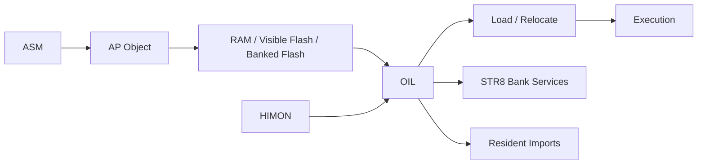
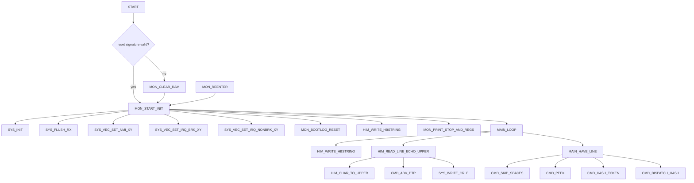
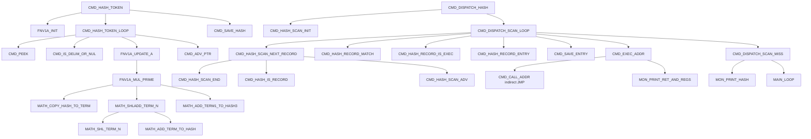
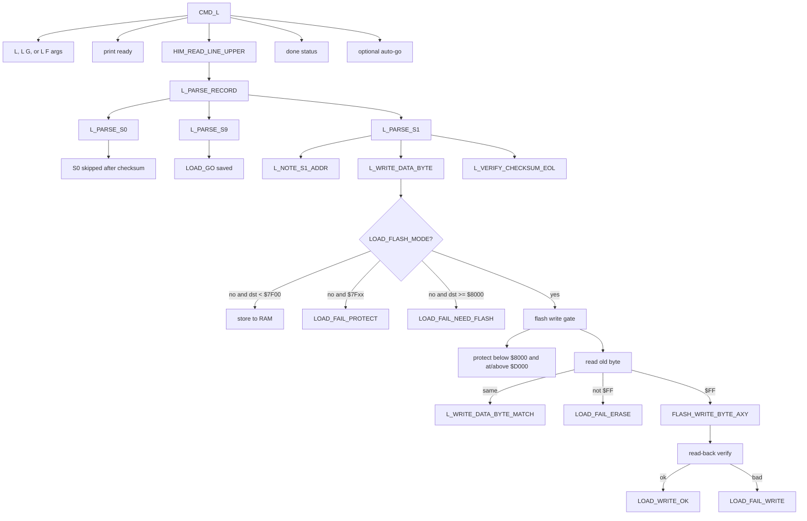
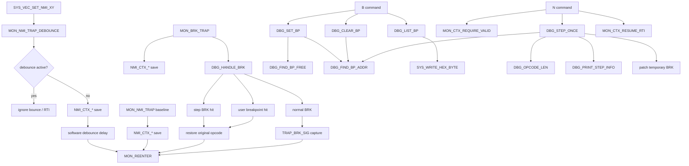
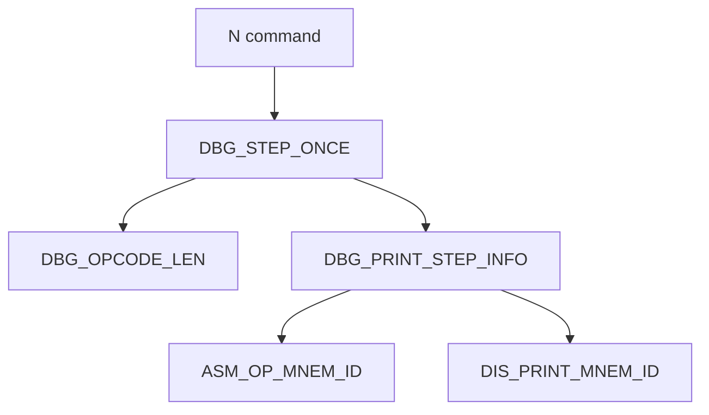
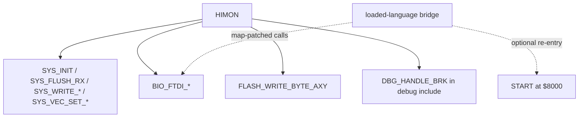

# HIMON Map

This is the human map for current HIMON. The raw edge list lives in
[HIMON_EDGE_DUMP.md](HIMON_EDGE_DUMP.md); this file groups those
edges into readable subsystems and capability surfaces.

Scope is the current HIMON build path:

```text
HIMON/himon.asm
HIMON/himon-debug.inc
HIMON/himon-disasm.inc
HIMON/himon-shared-eq.inc
```

Direct `JSR` and `JMP` edges are the hard evidence. Some package-to-package
arrows below are summaries so the map is readable.

## OIL Subsystem Boundary

OIL means **Overlay Integration Layer**. This top-level view keeps the runtime
contract visible; the routine-level edge evidence remains below.



## Edge Map

### Boot, Vectors, And Main Loop



### FNV Catalog Dispatch



### Command Surface

```mermaid
flowchart TD
    DISPATCH[CMD_DISPATCH_HASH] --> HELP[? CMD_HELP]
    DISPATCH --> HASHINFO[# CMD_HASH_INFO]
    DISPATCH --> D[D CMD_D]
    DISPATCH --> M[M CMD_M]
    DISPATCH --> R[R CMD_R]
    DISPATCH --> X[X CMD_X]
    DISPATCH --> G[G CMD_G]
    DISPATCH --> AP[AP CMD_AP]
    DISPATCH --> L[L CMD_L]
    DISPATCH --> B[B CMD_B]
    DISPATCH --> N[N CMD_N]
    DISPATCH --> Q[Q CMD_Q]

    HASHINFO --> HASHFIND[CMD_HASH_FIND]
    HASHINFO --> HASHLIST[CMD_HASH_LIST]
    HASHLIST --> HASHROW[CMD_HASH_PRINT_ROW]

    D --> DRANGE[CMD_D_PARSE_RANGE]
    D --> MEMPRINT[MON_PRINT_MEM_RANGE]
    M --> RANGE
    M --> MEMMOD[MON_MODIFY_RANGE]

    R --> CTXREQ[MON_CTX_REQUIRE_VALID]
    R --> CTXPARSE[MON_CTX_PARSE_ASSIGN_LIST]
    R --> STOPREGS[MON_PRINT_STOP_AND_REGS]
    X --> CTXREQ
    X --> CTXPARSE
    X --> RESUME[MON_CTX_RESUME_RTI]

    G --> HEXWORD[CMD_PARSE_HEX_WORD_TOKEN]
    G --> SAVEENTRY[CMD_SAVE_ENTRY]
    G --> GOINDIRECT[indirect JMP to target]

    L --> LOADMAP[S19 loader map]
    B --> DBGMAP[breakpoint map]
    N --> STEPMAP[step map]
    Q --> QUIESCE[SEI / WAI / MON_REENTER]
```



### Loader And Flash Write Edges



Future loader direction: `L F` may grow an auto-place relocatable mode. In that
mode HIMON would first validate and measure the S19 image, find an erased block
inside the HIMON flash-load guard, rebase S-record addresses to the chosen
block, write/verify the relocated bytes, and report the selected base plus go
address. This is not current behavior, and it is not STR8 backup/restore or
protected-window update.

Relocation is deliberately narrow: plain S19 can be address-rebased, but it
does not describe absolute operands embedded inside code. A future auto-place
payload must be position-safe, rely on RJOIN/fixed external contracts, or carry
explicit relocation metadata from ASM or host tooling.

### Trap, Breakpoint, And Step Edges



### Debug Opcode Display Edges



The old resident `U` unassemble command has been removed. HIMON keeps the
compact opcode length and mnemonic data needed for `N` step diagnostics and
debug register dumps.

### External Boundary



The old fixed HIMONIA entry slots at `$F00D`, `$FADE`, and `$FEED` have been
removed. Current local bridge builds may patch against `himon-rom-c000.map`, but
there is no promised fixed high-ROM ABI.

## Full Capability Map

Command-safety mandate: destructive commands require 4 or more characters.
Current short mutators are implementation debt until the command surface is
revised; new bulk mutation should use full words such as `COPY`, `FILL`,
`MOVE`, `FLASH`, `BACKUP`, `RESTORE`, and `ERASE`.

| Capability | User surface | Main labels | Current behavior | Notes |
| --- | --- | --- | --- | --- |
| Boot/re-enter monitor | reset, trap return, `$8000` handoff | `START`, `MON_REENTER`, `MON_START_INIT` | Owns hardware stack on entry, initializes system I/O, installs active vectors, enters prompt. | This is the normal HIMON path today. STR8 hands normal boot here. |
| Cold RAM clear | reset path | `MON_COLD_RESET`, `MON_CLEAR_RAM` | Clears RAM through `SYS_RAM_END` (`$7EFF`), then sets reset signature and starts monitor. | `SYS_IO_BASE` (`$7F00`) is the hard stop before memory-mapped I/O. |
| Vector/trap install | boot-time | `SYS_VEC_SET_NMI_XY`, `SYS_VEC_SET_IRQ_BRK_XY`, `SYS_VEC_SET_IRQ_NONBRK_XY` | Installs HIMON NMI, BRK, and IRQ handlers through system vector helpers. | STR8 should own physical vectors later, with HIMON installing active RAM vectors. |
| Line input | prompt and loaders | `HIM_READ_LINE_ECHO_UPPER`, `HIM_READ_LINE_UPPER` | Blocking FTDI read, uppercases input, supports backspace, Ctrl-C abort, and NUL termination. | `L` uses non-echo upper input for S-record streams. |
| Hi-bit string output | all command messages | `HIM_WRITE_HBSTRING` | Writes high-bit terminated strings through FTDI. | Current compact text format for monitor messages. |
| FNV-era command hashing | every command token | `CMD_HASH_TOKEN`, `FNV1A_*`, `MATH_*` | Computes the current HIMON command hash and saves it in command exec state. | FNV32 remains the public command/export identity hash; CRC16 is for compact local/scoped tables and checks. |
| Catalog scan/dispatch | command execution | `CMD_DISPATCH_HASH`, `CMD_HASH_SCAN_*`, `CMD_HASH_RECORD_*`, `CMD_EXEC_ADDR` | Scans `$8000` through vector boundary for `FN(V\|$80)` records, matches hash, requires executable kind, calls entry. | Current record entry is immediate after kind byte. Future records can grow an explicit entry pointer. |
| Catalog inspection | `#`, `# token` | `CMD_HASH_INFO`, `CMD_HASH_LIST`, `CMD_HASH_FIND`, `CMD_HASH_PRINT_*` | Lists catalog records or shows one token hash/entry/kind. | This is the master runtime catalog view. |
| PACK40 service | service vectors | `HIM_PACK40_ASCII_TO_CODE`, `HIM_PACK40_PACK3` | Converts ASCII to base-40 codes and packs three base-40 codes into the AP metadata word. | Published through `$7E1F-$7E22`; flash ASM calls this for IMPORT/EXPORT metadata so the encoder is not duplicated in low flash. |
| Help | `?` | `CMD_HELP` | Prints current command list. | Help text includes built-in commands: `# ? D M R X G AP L B N Q STR8`. |
| Memory dump | `D start [end]` | `CMD_D`, `CMD_D_PARSE_RANGE`, `MON_PRINT_MEM_RANGE` | Dumps one byte when `end` is omitted, or an inclusive absolute range when `end` is present. | Bare `D`, short relative end tokens, continuation, and byte/text search were removed in the resident-size pass. An explicit end must be greater than start; `$7F00-$7FFF` is still reported as I/O rather than read as ordinary RAM. |
| Memory modify | `M start [end|+count]` | `CMD_M`, `MON_MODIFY_RANGE` | Prompts each byte, writes only below monitor workspace, `.` aborts. | Protected ranges from `$7A00` upward report `M PROT=$hhhh`; this is stricter than the hard `$7EFF` RAM ceiling. Current short mutator remains under review; future bulk fill should be `FILL start end|+count bb`, not an `M` subform. |
| Register display/edit | `R [regs]` | `CMD_R`, `MON_CTX_REQUIRE_VALID`, `MON_CTX_PARSE_ASSIGN_LIST`, `MON_PRINT_STOP_AND_REGS` | Requires trapped context, optionally updates A/X/Y/P/S/PC, then prints context. | Context comes from NMI/BRK capture; the active POC NMI vector eats bounce during a short software debounce window. |
| Resume trapped context | `X [regs]` | `CMD_X`, `MON_CTX_RESUME_RTI` | Requires context, optionally edits regs, rebuilds stack frame, then `RTI`s. | This is why HIMON must be disciplined about the hardware stack. |
| Go to address | `G start` | `CMD_G` | Parses address, saves exec entry, prints go address, jumps indirectly. | Return reporting only happens if called through command record or loader-go path. |
| AP package run | `AP pkg dst` | `CMD_AP`, `HIM_AP_SERVICE` | Loads an AP v1 envelope from RAM or visible flash to `$2000-$4FFF`, applies current internal relocations, then runs `dst`. | V0 keeps the ROM cost low by requiring the package entry to be BODY offset zero. It is not a package-name registry yet. |
| Enter STR8 | `STR8` | `CMD_STR8_FNV` | Hash-record alias for `$F000`; confirms, then jumps into the resident STR8 entry without typing `G F000`. | Token hash is `$A2AD0E18`; kind is `K03`; display text is `STR8: BOOTLOADER`. STR8's separate identity marker remains `#5F6A0F7A`. |
| S-record load to RAM | `L` | `CMD_L`, `L_PARSE_RECORD`, `L_PARSE_S1`, `L_WRITE_DATA_BYTE` | Accepts S0/S1/S9, writes S1 data below `$7F00`, tracks count and go address. | `$7F00-$7FFF` reports `LERR=$02`; `$8000+` without `F` fails with `LERR=$05`. |
| S-record load and go | `L G` | `CMD_L` | Same as `L`, then jumps to S9 address or first data address fallback. | Sets exec kind to LOADGO before jump. |
| S-record flash load | `L F` | `L_WRITE_DATA_BYTE_FLASH`, `FLASH_WRITE_BYTE_AXY` | Writes only blank `$FF` bytes in `$8000-$CFFF`, verifies readback, skips after first flash failure. | Protects HIMON fixed-entry area at `$D000+`; no sector erase yet. |
| AP package service | service vector/request block | `HIM_AP_SERVICE`, `HIM_AP_PARSE_MIN`, `HIM_AP_LOAD_*`, `HIM_AP_IMPORT_LINK`, `HIM_AP_FIND_HOLE` | Parses AP v1 envelopes, loads BODY to `$2000-$4FFF`, resolves RJOIN imports, applies internal/import relocation rows, and suggests erased flash holes. | Published through `$7E2D-$7E40`; flash ASM `LOAD`/`INSTALL` and HIMON `AP pkg dst` call this so AP package consumption and linking survive after ASM exits. STR8 `$F006` is only a compatibility doorway. |
| Future relocatable flash placement | future `L F` mode | future loader staging and flash-block scan | Would measure a relocatable S19 image, choose an erased block, rebase record addresses, write/verify, and report relocated entry. | Not current behavior; plain S19 cannot patch absolute operands inside code without relocation metadata. |
| Breakpoint set/clear/list | `B start`, `B C start`, `B L` | `CMD_B`, `DBG_SET_BP`, `DBG_CLEAR_BP`, `DBG_LIST_BP` | Replaces target byte with `BRK` and stores original opcode in monitor workspace. | Patch targets are limited to user program RAM below `$7A00`, so monitor RAM and `$7F00-$7FFF` I/O stay protected. |
| BRK handling | BRK trap | `MON_BRK_TRAP`, `DBG_HANDLE_BRK` | Detects step breakpoint or user breakpoint, restores original opcode, rewinds PC to trapped opcode. | Plain BRK captures signature byte and re-enters monitor. |
| Single step | `N` | `CMD_N`, `DBG_STEP_ONCE`, `DBG_OPCODE_LEN`, `MON_CTX_RESUME_RTI` | Computes next PC by packed opcode length, prints mnemonic-only step diagnostics, plants a temporary BRK, resumes with `RTI`. | Temporary trap targets use the same patchable-RAM guard as `B`; monitor RAM and I/O are not patched. |
| Flash ASM | `ASM` when the flash ASM image is present | flash-resident FNV record | Enters the ASM v1 source-line assembler loaded by `L F`. | The legacy HIMON `A` mini-assembler has been removed from the core. |
| Quiesce | `Q` | `CMD_Q` | Executes `SEI`, `WAI`, then re-enters HIMON. | IRQ wakes cleanly to monitor re-entry; NMI still follows the trap path through the debounce POC vector. |
| Loaded-language bridge I/O | map-patched call addresses | `BIO_FTDI_READ_BYTE_BLOCK`, `BIO_FTDI_WRITE_BYTE_BLOCK` | Local composite images may patch direct calls from the current HIMON map. | Not a stable fixed-address ABI; rebuild patches must track the map. |
| Loaded-language return | `$8000` handoff for current composites | `START` | Re-enters HIMON through its reset/monitor entry. | A cleaner app-return contract is future work. |

## Size Evidence

2026-07-06 normal HIMON map after removing resident `S` and folding search into
`D`:

```text
CODE     $2192 /  8594
DATA     $05C4 /  1476
TOTAL    $2756 / 10070
_END_DATA = $E756
```

The previous resident-`S` map was about `$28A5` total, so this slice saves about
`$014F` / 335 bytes while adding D-local search, compacting I/O skip messages,
and adding a HIMON-local one-byte RX lookahead for abort polling.
`CMD_SEARCH_FNV`,
`CMD_SEARCH`, and `MSG_SEARCH_*` are absent from the normal HIMON map; `D`
search enters through `CMD_D_SEARCH_RANGE`.

2026-07-07 normal HIMON map after adding the resident AP package service:

```text
CODE     $27EB / 10219
DATA     $05C4 /  1476
TOTAL    $2DAF / 11695
_END_DATA = $EDAF
HIM_AP_SERVICE = $D6B2
AP service cells = $7E2D-$7E40
```

This consumes most of the previous HIMON-to-`$F000` gap, leaving `$0251` bytes
below the STR8 handoff line, but frees flash ASM by moving AP package
parse/load/suggest into resident monitor code.

2026-07-07 normal HIMON map after adding the resident hashed `AP pkg dst`
runner:

```text
CODE     $286E / 10350
DATA     $05D9 /  1497
TOTAL    $2E47 / 11847
_END_DATA = $EE47
CMD_AP = $C66D
HIM_AP_SERVICE = $D735
AP command hash = $3AD53794
AP service cells = $7E2D-$7E40
```

This leaves `$01B9` bytes below `$F000`. The command intentionally reuses the
resident AP `LOAD` service and does not add a package-name registry or ENTRY
export parser yet; v0 runs packages whose entry is at BODY offset zero.

2026-07-07 normal HIMON map after adding the resident PACK40 encode service
used by flash ASM:

```text
CODE     $2925 / 10533
DATA     $05D9 /  1497
TOTAL    $2EFE / 12030
_END_DATA = $EEFE
CMD_AP = $C681
HIM_PACK40_ASCII_TO_CODE = $D749
HIM_PACK40_PACK3 = $D789
HIM_AP_SERVICE = $D7EC
PACK40 service cells = $7E1F-$7E22
AP service cells = $7E2D-$7E40
```

This leaves `$0102` bytes below `$F000`. The PACK40 service only publishes the
two pure primitives flash ASM needs (`ASCII_TO_CODE` and `PACK3`); ASM still
owns symbol/name iteration and non-flash ASM builds keep their local PACK40
implementation.

2026-07-10 normal HIMON map after removing the resident `ASMREPORT` wrapped AP
runner and keeping the reporter AP out of Bank 3:

```text
CODE     $2A0B / 10763
DATA     $05D9 /  1497
TOTAL    $2FE4 / 12260
_END_DATA = $EFE4
CMD_AP = $C687
HIM_AP_SERVICE = $D88E
AP command hash = $3AD53794
AP service cells = $7E2D-$7E40
```

This leaves `$001C` bytes below `$F000`. The reporter AP is now a separate
Bank 0 package and Bank 3 keeps `$B969-$BFFF` as low-flash headroom after
ASM-F2.

2026-07-18 normal HIMON map after the resident-size pass and moving AP import
linking out of STR8-N:

```text
CODE     $2997 / 10647
DATA     $0596 /  1430
TOTAL    $2F2D / 12077
_END_DATA = $EF2D
CMD_AP = $C3B8
HIM_AP_SERVICE = $D5BF
HIM_AP_IMPORT_LINK = $DAEF
AP command hash = $3AD53794
AP service cells = $7E2D-$7E40
```

This leaves `$00D3` bytes below `$F000`. The size pass removed quoted hashing
and the resident `D` continuation/search forms, then used the released space
for HIMON-owned AP import linking. STR8 `$F006` remains stable but now contains
only a compatibility adapter into the resident AP service.

## Edge Evidence Rules

- Raw edge truth stays in `HIMON_EDGE_DUMP.md`.
- This map may collapse many repeated print edges into one package edge.
- Indirect targets such as `CMD_CALL_ADDR`, `G`, and `L G` are intentionally
  shown as indirect because the concrete target is runtime data.
- Relative branches and fallthrough are control-flow facts, but not direct call
  edges. They are described only when they explain capability behavior.
- Include files are part of the HIMON capability surface even when the raw
  source line lives outside `himon.asm`.
- Debug is a HIMON subsystem/include. A small build may omit it to save flash,
  but the related command records, help text, BRK hook behavior, and build docs
  must be omitted or revised together. NMI trap capture may remain without the
  breakpoint/`N` stepping subsystem.
