# HIMON Map

This is the human map for current HIMON. The generated raw edge list lives in
[HIMON_EDGE_DUMP.md](../../GENERATED/HIMON_EDGE_DUMP.md); this file groups those
edges into readable subsystems and capability surfaces.

Scope is the current HIMON build path:

```text
HIMON/himon.asm
HIMON/himon-debug.inc
HIMON/himon-disasm.inc
HIMON/himon-led-eq.inc
HIMON/himon-shared-eq.inc
```

Direct `JSR` and `JMP` edges are the hard evidence. Some package-to-package
arrows below are summaries so the map is readable.

## Top-Level Routine Guide

This first view describes the principal control routines in
`SRC/HIMON/himon.asm` and its active includes. Each node carries a real routine
label plus its top-level purpose. Arrows summarize the main control and service
routes; the smaller diagrams below and
[HIMON_EDGE_DUMP.md](../../GENERATED/HIMON_EDGE_DUMP.md) provides direct-edge detail.

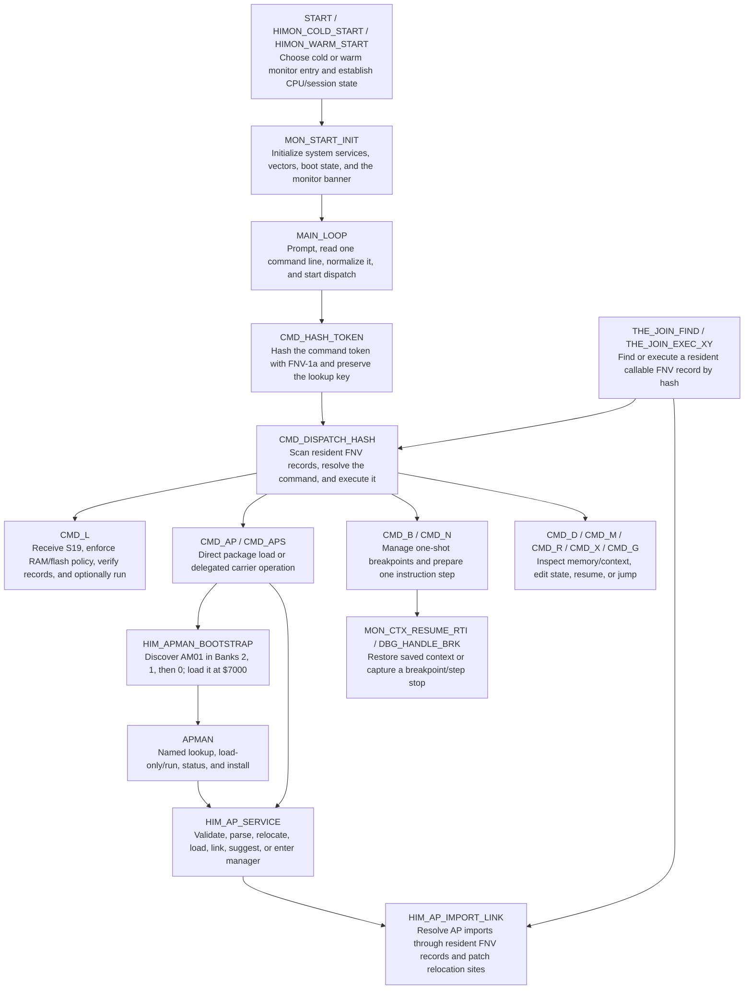
```mermaid
flowchart TD
    RESET["START / HIMON_COLD_START / HIMON_WARM_START<br/>Choose cold or warm monitor entry and establish CPU/session state"] --> INIT["MON_START_INIT<br/>Initialize system services, vectors, boot state, and the monitor banner"]
    INIT --> LOOP["MAIN_LOOP<br/>Prompt, read one command line, normalize it, and start dispatch"]
    LOOP --> HASH["CMD_HASH_TOKEN<br/>Hash the command token with FNV-1a and preserve the lookup key"]
    HASH --> DISPATCH["CMD_DISPATCH_HASH<br/>Scan resident FNV records, resolve the command, and execute it"]

    DISPATCH --> LOAD["CMD_L<br/>Receive S19, enforce RAM/flash policy, verify records, and optionally run"]
    DISPATCH --> AP["CMD_AP / CMD_APS<br/>Direct package load or delegated carrier operation"]
    DISPATCH --> DEBUG["CMD_B / CMD_N<br/>Manage one-shot breakpoints and prepare one instruction step"]
    DISPATCH --> MEM["CMD_D / CMD_M / CMD_R / CMD_X / CMD_G<br/>Inspect memory/context, edit state, resume, or jump"]

    AP --> BOOT["HIM_APMAN_BOOTSTRAP<br/>Discover AM01 in Banks 2, 1, then 0; load it at $7000"]
    BOOT --> APMAN["APMAN<br/>Named lookup, load-only/run, status, and install"]
    AP --> APSVC["HIM_AP_SERVICE<br/>Validate, parse, relocate, load, link, suggest, or enter manager"]
    APMAN --> APSVC
    APSVC --> LINK["HIM_AP_IMPORT_LINK<br/>Resolve AP imports through resident FNV records and patch relocation sites"]
    DEBUG --> CTX["MON_CTX_RESUME_RTI / DBG_HANDLE_BRK<br/>Restore saved context or capture a breakpoint/step stop"]

    JOIN["THE_JOIN_FIND / THE_JOIN_EXEC_XY<br/>Find or execute a resident callable FNV record by hash"] --> DISPATCH
    JOIN --> LINK
```

## OIL Subsystem Boundary

OIL means **Overlay Integration Layer**. This top-level view keeps the runtime
contract visible; the routine-level edge evidence remains below.

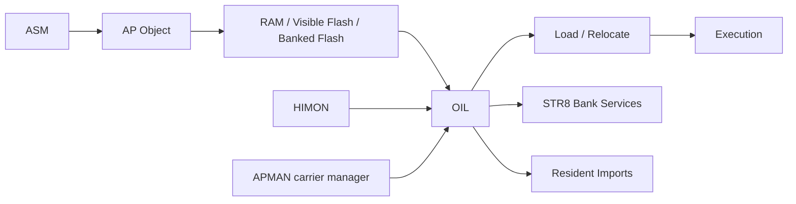
```mermaid
flowchart LR
    ASM[ASM] --> AP[AP Object]
    STORE[RAM / Visible Flash / Banked Flash] --> OIL[OIL]
    AP --> STORE
    HIMON[HIMON] --> OIL
    APMAN[APMAN carrier manager] --> OIL
    OIL --> LOAD[Load / Relocate]
    OIL --> STR8[STR8 Bank Services]
    OIL --> RJOIN[Resident Imports]
    LOAD --> RUN[Execution]
```

## Edge Map

### Boot, Vectors, And Main Loop

#### Reset And Service Initialization

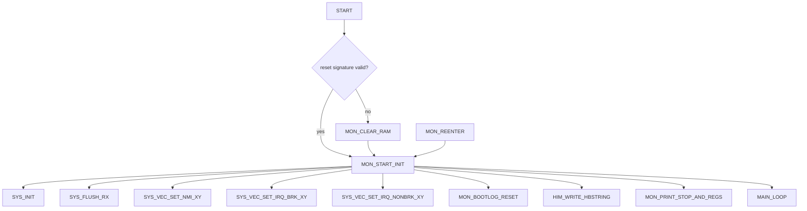
```mermaid
flowchart TD
    START[START] --> COLD{reset signature valid?}
    COLD -->|no| CLEAR[MON_CLEAR_RAM]
    COLD -->|yes| INIT[MON_START_INIT]
    CLEAR --> INIT
    REENTER[MON_REENTER] --> INIT
    INIT --> SYSINIT[SYS_INIT]
    INIT --> FLUSH[SYS_FLUSH_RX]
    INIT --> VECNMI[SYS_VEC_SET_NMI_XY]
    INIT --> VECBRK[SYS_VEC_SET_IRQ_BRK_XY]
    INIT --> VECIRQ[SYS_VEC_SET_IRQ_NONBRK_XY]
    INIT --> BOOTLOG[MON_BOOTLOG_RESET]
    INIT --> BANNER[HIM_WRITE_HBSTRING]
    INIT --> STOPREGS[MON_PRINT_STOP_AND_REGS]
    INIT --> LOOP[MAIN_LOOP]
```

#### Prompt, Read, And Dispatch

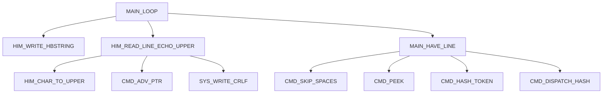
```mermaid
flowchart TD
    LOOP[MAIN_LOOP] --> PROMPT[HIM_WRITE_HBSTRING]
    LOOP --> READ[HIM_READ_LINE_ECHO_UPPER]
    READ --> UPPER[HIM_CHAR_TO_UPPER]
    READ --> ADV[CMD_ADV_PTR]
    READ --> CRLF[SYS_WRITE_CRLF]
    LOOP --> HAVE[MAIN_HAVE_LINE]
    HAVE --> SKIP[CMD_SKIP_SPACES]
    HAVE --> PEEK[CMD_PEEK]
    HAVE --> HASH[CMD_HASH_TOKEN]
    HAVE --> DISPATCH[CMD_DISPATCH_HASH]
```

### FNV Catalog Dispatch

#### Token Hash And FNV Math

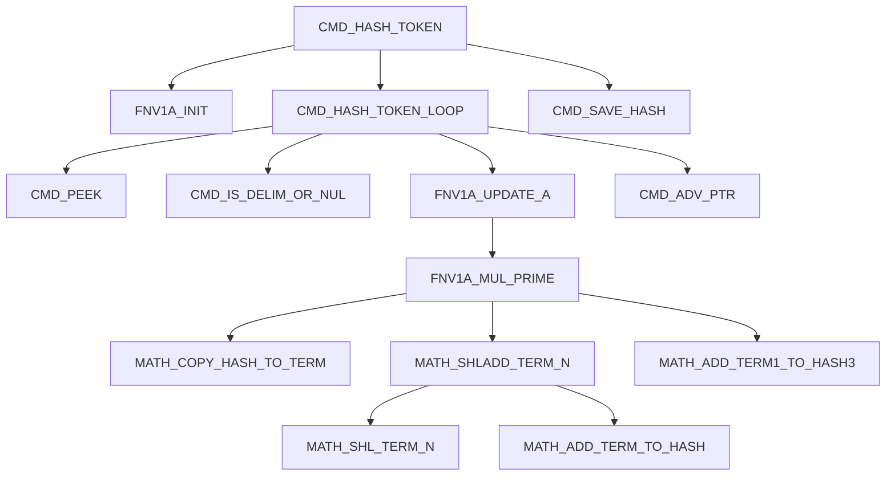
```mermaid
flowchart TD
    HASH[CMD_HASH_TOKEN] --> FNVINIT[FNV1A_INIT]
    HASH --> TOKENLOOP[CMD_HASH_TOKEN_LOOP]
    TOKENLOOP --> PEEK[CMD_PEEK]
    TOKENLOOP --> DELIM[CMD_IS_DELIM_OR_NUL]
    TOKENLOOP --> UPDATE[FNV1A_UPDATE_A]
    TOKENLOOP --> ADV[CMD_ADV_PTR]
    HASH --> SAVEHASH[CMD_SAVE_HASH]
    UPDATE --> MUL[FNV1A_MUL_PRIME]
    MUL --> COPY[MATH_COPY_HASH_TO_TERM]
    MUL --> SHLADD[MATH_SHLADD_TERM_N]
    SHLADD --> SHL[MATH_SHL_TERM_N]
    SHLADD --> ADD[MATH_ADD_TERM_TO_HASH]
    MUL --> ADD1[MATH_ADD_TERM1_TO_HASH3]
```

#### Catalog Scan And Execute

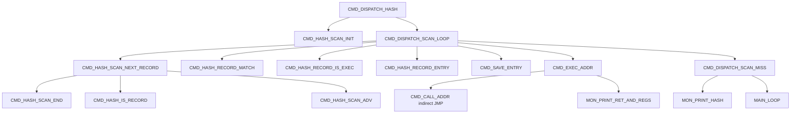
```mermaid
flowchart TD
    DISPATCH[CMD_DISPATCH_HASH] --> SCANINIT[CMD_HASH_SCAN_INIT]
    DISPATCH --> LOOP[CMD_DISPATCH_SCAN_LOOP]
    LOOP --> NEXTREC[CMD_HASH_SCAN_NEXT_RECORD]
    NEXTREC --> END[CMD_HASH_SCAN_END]
    NEXTREC --> ISREC[CMD_HASH_IS_RECORD]
    NEXTREC --> ADVREC[CMD_HASH_SCAN_ADV]
    LOOP --> MATCH[CMD_HASH_RECORD_MATCH]
    LOOP --> ISEXEC[CMD_HASH_RECORD_IS_EXEC]
    LOOP --> ENTRY[CMD_HASH_RECORD_ENTRY]
    LOOP --> SAVEENTRY[CMD_SAVE_ENTRY]
    LOOP --> EXEC[CMD_EXEC_ADDR]
    EXEC --> CALL[CMD_CALL_ADDR indirect JMP]
    EXEC --> RETPRINT[MON_PRINT_RET_AND_REGS]
    LOOP --> MISS[CMD_DISPATCH_SCAN_MISS]
    MISS --> PRHASH[MON_PRINT_HASH]
    MISS --> MAIN[MAIN_LOOP]
```

### Command Surface

#### Command Index

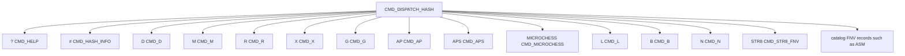
```mermaid
flowchart TD
    DISPATCH[CMD_DISPATCH_HASH] --> HELP[? CMD_HELP]
    DISPATCH --> HASHINFO[# CMD_HASH_INFO]
    DISPATCH --> D[D CMD_D]
    DISPATCH --> M[M CMD_M]
    DISPATCH --> R[R CMD_R]
    DISPATCH --> X[X CMD_X]
    DISPATCH --> G[G CMD_G]
    DISPATCH --> AP[AP CMD_AP]
    DISPATCH --> APS[APS CMD_APS]
    DISPATCH --> MICRO[MICROCHESS CMD_MICROCHESS]
    DISPATCH --> L[L CMD_L]
    DISPATCH --> B[B CMD_B]
    DISPATCH --> N[N CMD_N]
    DISPATCH --> STR8[STR8 CMD_STR8_FNV]
    DISPATCH --> EXTERNAL[catalog FNV records such as ASM]
```

#### Hash And Memory Commands

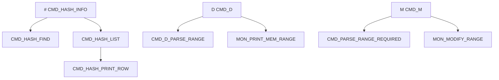
```mermaid
flowchart TD
    HASHINFO[# CMD_HASH_INFO] --> HASHFIND[CMD_HASH_FIND]
    HASHINFO --> HASHLIST[CMD_HASH_LIST]
    HASHLIST --> HASHROW[CMD_HASH_PRINT_ROW]
    D[D CMD_D] --> DRANGE[CMD_D_PARSE_RANGE]
    D --> MEMPRINT[MON_PRINT_MEM_RANGE]
    M[M CMD_M] --> RANGE[CMD_PARSE_RANGE_REQUIRED]
    M --> MEMMOD[MON_MODIFY_RANGE]
```

#### Context And Go Commands

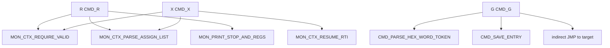
```mermaid
flowchart TD
    R[R CMD_R] --> CTXREQ[MON_CTX_REQUIRE_VALID]
    R --> CTXPARSE[MON_CTX_PARSE_ASSIGN_LIST]
    R --> STOPREGS[MON_PRINT_STOP_AND_REGS]
    X[X CMD_X] --> CTXREQ
    X --> CTXPARSE
    X --> RESUME[MON_CTX_RESUME_RTI]
    G[G CMD_G] --> HEXWORD[CMD_PARSE_HEX_WORD_TOKEN]
    G --> SAVEENTRY[CMD_SAVE_ENTRY]
    G --> GOINDIRECT[indirect JMP to target]
```

#### Loader, Debug, And STR8 Commands

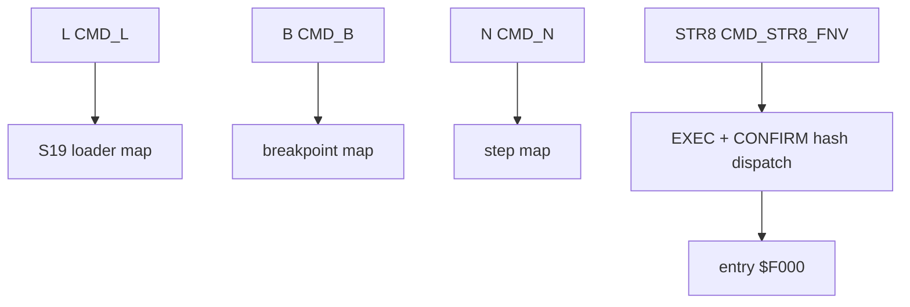
```mermaid
flowchart TD
    L[L CMD_L] --> LOADMAP[S19 loader map]
    B[B CMD_B] --> DBGMAP[breakpoint map]
    N[N CMD_N] --> STEPMAP[step map]
    STR8[STR8 CMD_STR8_FNV] --> CONFIRM[EXEC + CONFIRM hash dispatch]
    CONFIRM --> RESETOWNER[entry $F000]
```

### RAM Loader Edges

#### Receive And Record Types

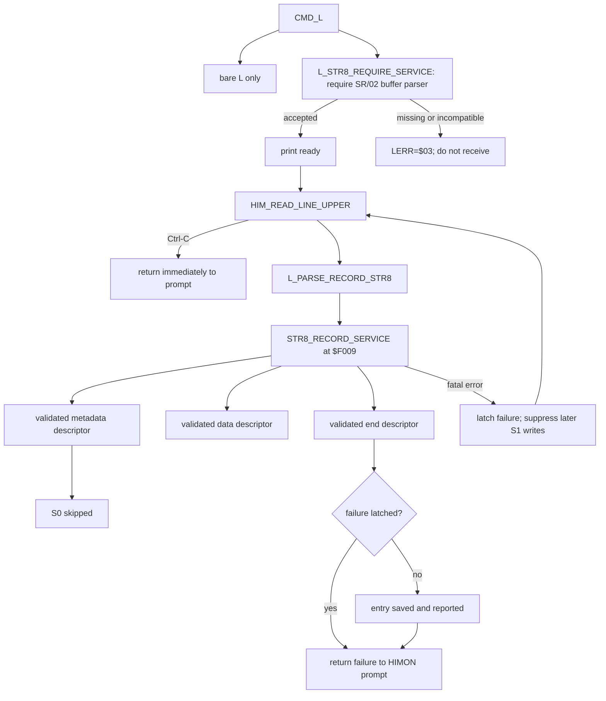
```mermaid
flowchart TD
    L[CMD_L] --> ARGS[bare L only]
    L --> ABI[L_STR8_REQUIRE_SERVICE: require SR/02 buffer parser]
    ABI -->|accepted| READY[print ready]
    READY --> READ[HIM_READ_LINE_UPPER]
    READ -->|Ctrl-C| ABORT[return immediately to prompt]
    ABI -->|missing or incompatible| HARDFAIL[LERR=$03; do not receive]
    READ --> ADAPTER[L_PARSE_RECORD_STR8]
    ADAPTER --> PARSE[STR8_RECORD_SERVICE at $F009]
    PARSE --> S0[validated metadata descriptor]
    PARSE --> S1[validated data descriptor]
    PARSE --> S9[validated end descriptor]
    S0 --> SKIP[S0 skipped]
    PARSE -->|fatal error| POISON[latch failure; suppress later S1 writes]
    POISON --> READ
    S9 --> END{failure latched?}
    END -->|no| ENTRYSAVE[entry saved and reported]
    END -->|yes| RETURN[return failure to HIMON prompt]
    ENTRYSAVE --> RETURN
```

#### Destination Policy

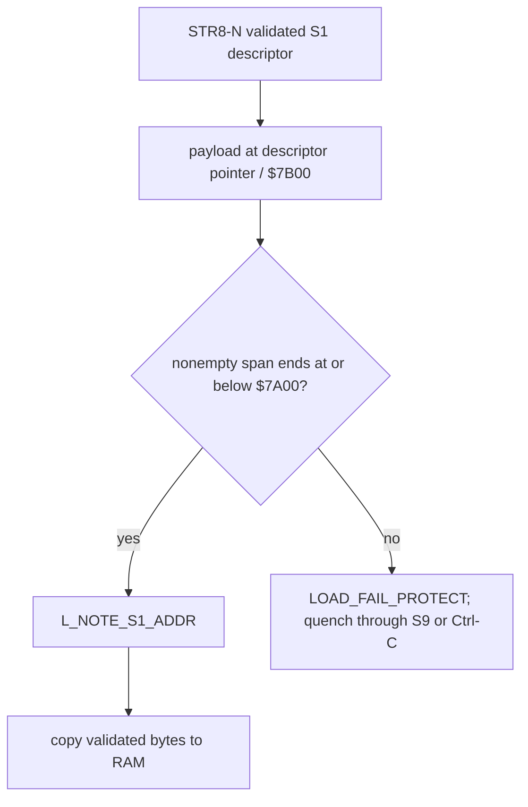
```mermaid
flowchart TD
    S1[STR8-N validated S1 descriptor] --> DECODE[payload at descriptor pointer / $7B00]
    DECODE --> SPAN{nonempty span ends at or below $7A00?}
    SPAN -->|yes| NOTE[L_NOTE_S1_ADDR]
    NOTE --> RAMWRITE[copy validated bytes to RAM]
    SPAN -->|no| RAMPROTECT[LOAD_FAIL_PROTECT; quench through S9 or Ctrl-C]
```

#### Finish

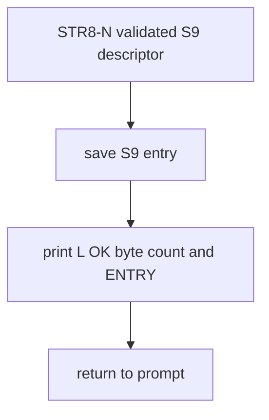
```mermaid
flowchart TD
    S9[STR8-N validated S9 descriptor] --> SAVE[save S9 entry]
    SAVE --> DONE[print L OK byte count and ENTRY]
    DONE --> PROMPT[return to prompt]
```

HIMON has no S19 flash-write or load-and-run form. STR8-N owns S19 parsing and
persistent installation; HIMON applies only validated records under its
narrower RAM policy.

### Trap, Breakpoint, And Step Edges

#### NMI Paths

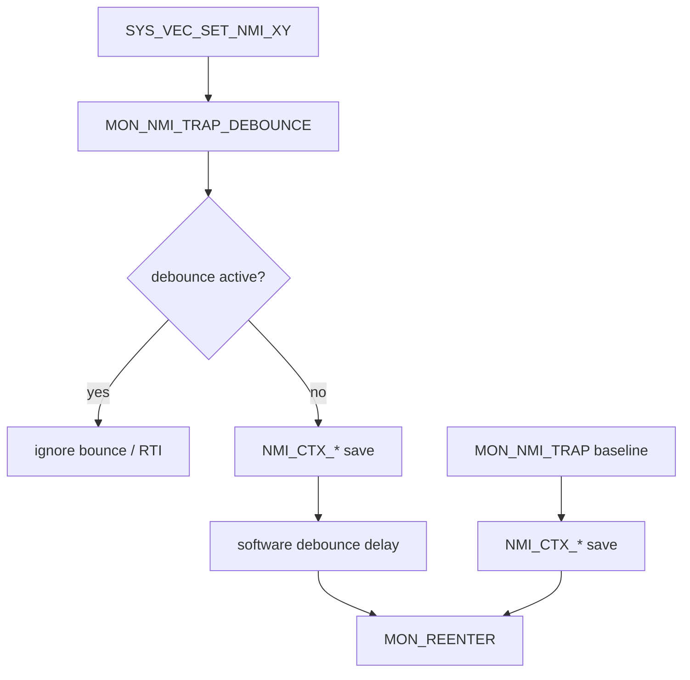
```mermaid
flowchart TD
    SETNMI[SYS_VEC_SET_NMI_XY] --> POC[MON_NMI_TRAP_DEBOUNCE]
    POC --> ACTIVE{debounce active?}
    ACTIVE -->|yes| RTI[ignore bounce / RTI]
    ACTIVE -->|no| NMISAVE[NMI_CTX_* save]
    NMISAVE --> DELAY[software debounce delay]
    DELAY --> REENTER[MON_REENTER]
    BASE[MON_NMI_TRAP baseline] --> BASESAVE[NMI_CTX_* save]
    BASESAVE --> REENTER
```

#### BRK Trap Path

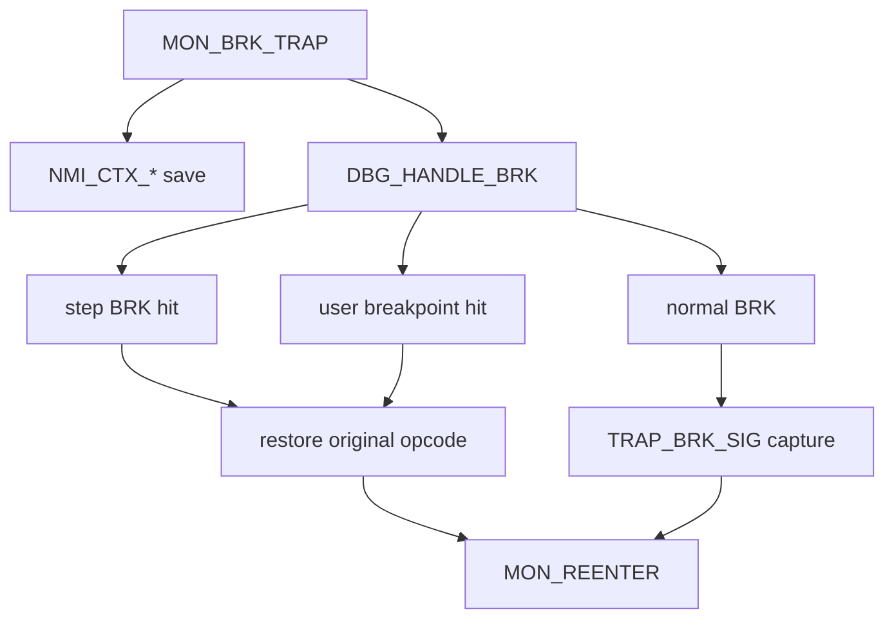
```mermaid
flowchart TD
    BRK[MON_BRK_TRAP] --> BRKSAVE[NMI_CTX_* save]
    BRK --> HANDLE[DBG_HANDLE_BRK]
    HANDLE --> STEPHIT[step BRK hit]
    HANDLE --> BPHIT[user breakpoint hit]
    HANDLE --> NONE[normal BRK]
    STEPHIT --> RESTORE[restore original opcode]
    BPHIT --> RESTORE
    RESTORE --> REENTER[MON_REENTER]
    NONE --> SIG[TRAP_BRK_SIG capture]
    SIG --> REENTER
```

#### Breakpoint Command

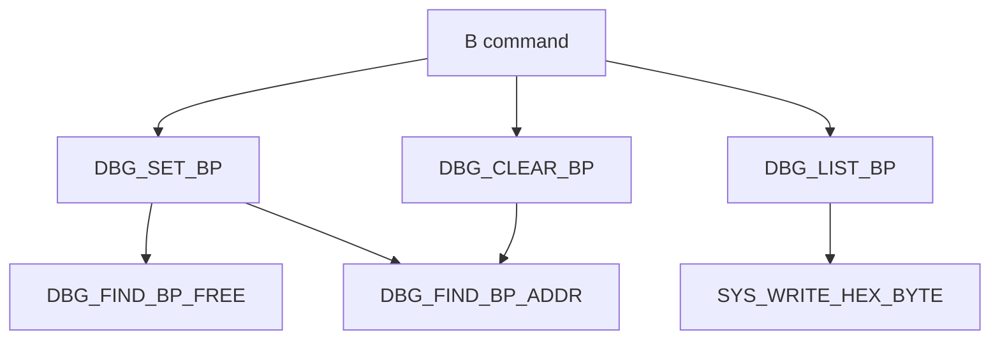
```mermaid
flowchart TD
    CMD_B[B command] --> SET[DBG_SET_BP]
    CMD_B --> CLR[DBG_CLEAR_BP]
    CMD_B --> LIST[DBG_LIST_BP]
    SET --> FINDFREE[DBG_FIND_BP_FREE]
    SET --> FINDADDR[DBG_FIND_BP_ADDR]
    CLR --> FINDADDR
    LIST --> PRINT[SYS_WRITE_HEX_BYTE]
```

#### Single-Step Command

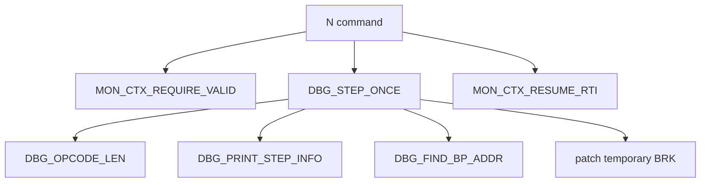
```mermaid
flowchart TD
    CMD_N[N command] --> CTX[MON_CTX_REQUIRE_VALID]
    CMD_N --> STEP[DBG_STEP_ONCE]
    STEP --> OPLEN[DBG_OPCODE_LEN]
    STEP --> STEPINFO[DBG_PRINT_STEP_INFO]
    STEP --> FINDADDR[DBG_FIND_BP_ADDR]
    STEP --> PATCH[patch temporary BRK]
    CMD_N --> RESUME[MON_CTX_RESUME_RTI]
```

### Debug Opcode Display Edges

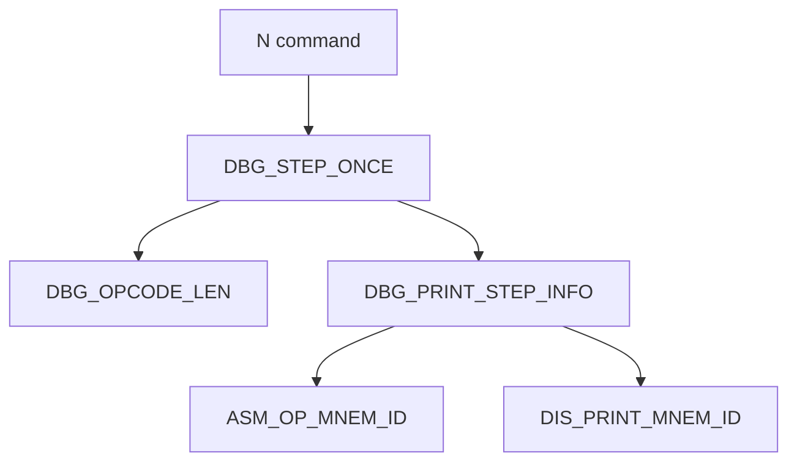
```mermaid
flowchart TD
    CMD_N[N command] --> STEP[DBG_STEP_ONCE]
    STEP --> LEN[DBG_OPCODE_LEN]
    STEP --> INFO[DBG_PRINT_STEP_INFO]
    INFO --> MNEMID[ASM_OP_MNEM_ID]
    INFO --> PMNEM[DIS_PRINT_MNEM_ID]
```

The old resident `U` unassemble command has been removed. HIMON keeps the
compact opcode length and mnemonic data needed for `N` step diagnostics and
debug register dumps.

### External Boundary

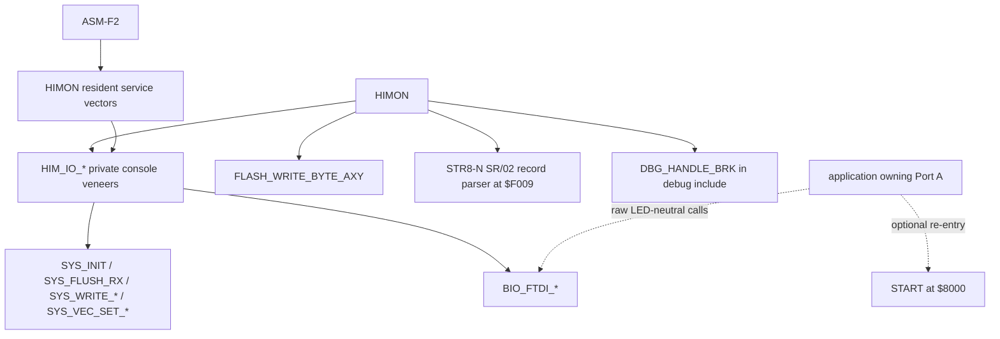
```mermaid
flowchart TD
    HIMON[HIMON] --> HIMIO[HIM_IO_* private console veneers]
    ASM[ASM-F2] --> SVC[HIMON resident service vectors]
    SVC --> HIMIO
    HIMIO --> SYS[SYS_INIT / SYS_FLUSH_RX / SYS_WRITE_* / SYS_VEC_SET_*]
    HIMIO --> BIO[BIO_FTDI_*]
    HIMON --> FLASH[FLASH_WRITE_BYTE_AXY]
    HIMON --> STR8REC[STR8-N SR/02 record parser at $F009]
    HIMON --> DBGEXT[DBG_HANDLE_BRK in debug include]
    APP[application owning Port A] -.raw LED-neutral calls.-> BIO
    APP -.optional re-entry.-> START[START at $8000]
```

The old fixed HIMONIA entry slots at `$F00D`, `$FADE`, and `$FEED` have been
removed. Current local bridge builds may patch against `himon-rom-c000.map`, but
there is no promised fixed high-ROM ABI.

STR8-N is the primary board owner. HIMON has no private S19 fallback: the
integration lock proves the exact STR8-N top image at build time, and `L`
checks the `SR/02` discovery face at runtime. A damaged STR8-N image that no
longer satisfies the complete service contract is a board repair condition,
not a supported degraded configuration.

## Full Capability Map

Command-safety mandate: destructive commands require 4 or more characters.
Current short mutators are implementation debt until the command surface is
revised; new bulk mutation should use full words such as `COPY`, `FILL`,
`MOVE`, `FLASH`, `BACKUP`, `RESTORE`, and `ERASE`.

| Capability | User surface | Main labels | Current behavior | Notes |
| --- | --- | --- | --- | --- |
| Boot/re-enter monitor | reset, trap return, `$8000` handoff | `START`, `MON_REENTER`, `MON_START_INIT` | Owns hardware stack on entry, initializes system I/O, installs active vectors, enters prompt. | This is the normal HIMON path today. STR8 hands normal boot here. |
| Cold RAM clear | reset path | `MON_COLD_RESET`, `MON_CLEAR_RAM` | Clears RAM through `SYS_RAM_END` (`$7EFF`), then sets reset signature and starts monitor. | `SYS_IO_BASE` (`$7F00`) is the hard stop before memory-mapped I/O. |
| Vector/trap install | boot-time | `SYS_VEC_SET_NMI_XY`, `SYS_VEC_SET_IRQ_BRK_XY`, `SYS_VEC_SET_IRQ_NONBRK_XY` | Installs HIMON NMI, BRK, and IRQ handlers through system vector helpers. | STR8 should own physical vectors later, with HIMON installing active RAM vectors. |
| Line input | prompt, loaders, confirmations, and ASM service vector | `HIM_READ_LINE_ECHO`, `HIM_READ_LINE_ECHO_UPPER`, `HIM_READ_LINE_UPPER`, `HIM_READ_BYTE_BLOCK`, `HIM_IO_PUBLISH_INPUT_WAIT`, `HIM_IO_REFRESH_INPUT_WAIT`, `HIM_IO_RX_ACTIVITY_A` | Private cooperative FTDI polling with exact-case echoed or uppercase line modes, backspace, Ctrl-C abort, NUL termination, live `$21`/`$43` PWE# transitions, and latched `$07` RX status. | HIMON commands and `L` retain uppercase input; the ASM-facing vector uses exact-case echo so quoted source bytes survive. `$07` remains latched while the host remains present and changes to `$21` only if PWE# deasserts. Raw FTDI entries remain unchanged. |
| Console output | HIMON messages, ASM service vectors, and `BIO_FTDI_PUT_CSTR` | `HIM_IO_TX_ACTIVITY_A`, `HIM_IO_WRITE_*_ACTIVITY`, `HIM_WRITE_HBSTRING` | Publishes `$0B` before entering the raw blocking FTDI output path. | The raw `BIO_FTDI_READ_BYTE_BLOCK` and `BIO_FTDI_WRITE_BYTE_BLOCK` records remain LED-neutral so an application can own all eight Port A bits. |
| FNV-era command hashing | every command token | `CMD_HASH_TOKEN`, `FNV1A_*`, `MATH_*` | Computes the current HIMON command hash and saves it in command exec state. | FNV32 remains the public command/export identity hash; CRC16 is for compact local/scoped tables and checks. |
| Catalog scan/dispatch | command execution | `CMD_DISPATCH_HASH`, `CMD_HASH_SCAN_*`, `CMD_HASH_RECORD_*`, `CMD_EXEC_ADDR` | Scans `$8000` through vector boundary for `FN(V\|$80)` records, matches hash, requires executable kind, calls entry. | Current record entry is immediate after kind byte. Future records can grow an explicit entry pointer. |
| Catalog inspection | `#`, `# token` | `CMD_HASH_INFO`, `CMD_HASH_LIST`, `CMD_HASH_FIND`, `CMD_HASH_PRINT_*` | Lists catalog records or shows one token hash/entry/kind. | This is the master runtime catalog view. |
| PACK40 service | service vectors | `HIM_PACK40_ASCII_TO_CODE`, `HIM_PACK40_PACK3` | Converts ASCII to base-40 codes and packs three base-40 codes into the AP metadata word. | Published through `$7E1F-$7E22`; flash ASM calls this for IMPORT/EXPORT metadata so the encoder is not duplicated in low flash. |
| Help | `?` | `CMD_HELP` | Prints current command list. | Help text includes built-in commands: `# ? D M R X G AP APS L B N STR8`; named catalog entries belong in `#`. |
| Memory dump | `D start [end]` | `CMD_D`, `CMD_D_PARSE_RANGE`, `MON_PRINT_MEM_RANGE` | Dumps one byte when `end` is omitted, or an inclusive absolute range when `end` is present. | Bare `D`, short relative end tokens, continuation, and byte/text search were removed in the resident-size pass. An explicit end must be greater than start; `$7F00-$7FFF` is still reported as I/O rather than read as ordinary RAM. |
| Memory modify | `M start [end|+count]` | `CMD_M`, `MON_MODIFY_RANGE` | Prompts each byte, writes only below monitor workspace, `.` aborts. | Protected ranges from `$7A00` upward report `M PROT=$hhhh`; this is stricter than the hard `$7EFF` RAM ceiling. Current short mutator remains under review; future bulk fill should be `FILL start end|+count bb`, not an `M` subform. |
| Register display/edit | `R [regs]` | `CMD_R`, `MON_CTX_REQUIRE_VALID`, `MON_CTX_PARSE_ASSIGN_LIST`, `MON_PRINT_STOP_AND_REGS` | Requires trapped context, optionally updates A/X/Y/P/S/PC, then prints context. | Context comes from NMI/BRK capture; the active POC NMI vector eats bounce during a short software debounce window. |
| Resume trapped context | `X [regs]` | `CMD_X`, `MON_CTX_RESUME_RTI` | Requires context, optionally edits regs, rebuilds stack frame, then `RTI`s. | This is why HIMON must be disciplined about the hardware stack. |
| Go to address | `G start` | `CMD_G` | Parses address, saves exec entry, prints go address, jumps indirectly. | Return reporting only happens if called through command record or loader-go path. |
| AP package/carrier run | `AP pkg dst`; `AP Bn name\|s000 [dst]`; `AP L ...` | `CMD_AP`, `HIM_APMAN_BOOTSTRAP`, APMAN `APMAN_COMMAND_AP` | The direct form validates and loads a visible envelope. Bank/name/address forms discover APMAN, stage and validate one bank sector, load/link the body below `$7000`, and either run it or return after load-only. | APMAN rejects its own `AM01` carrier as a child and restores Bank 3 around bank access. Named carrier execution is board-accepted. |
| MicroChess launcher | `MICROCHESS` | `CMD_MICROCHESS_FNV`, `CMD_MICROCHESS` | Copies `AP B1 MICROCHESS` into the command page and tail-enters `CMD_AP`. | FNV `$34EBE8D5`, K05 EXEC+TEXT so bare `#` names it; fixed to Bank 1 and inherits the normal APMAN validation/failure path. |
| AP status/list/detail | `APS`; `APS Bn`; `APS Bn name\|s000` | `CMD_APS`, `HIM_APMAN_BOOTSTRAP`, APMAN `APMAN_COMMAND_APS` | Delegates to APMAN. Bare `APS` prints the 24 Bank 0-2 storage sectors with erased/unmanaged/managed/APC/WORK/backup states. Bank/detail forms list or inspect validated carriers. | Read-only. The accepted board has APMAN at B2:8 and BANKDUMP at B2:9; BANKDUMP `M` supplies the complete Bank 0-3 physical map. |
| Enter STR8 | `STR8` | `CMD_STR8_FNV` | Hash-record alias for `$F000`; confirms, then jumps into the resident STR8 entry without typing `G F000`. | Token hash is `$A2AD0E18`; kind is `K03`; display text is `STR8: BOOTLOADER`. STR8's separate identity marker remains `#5F6A0F7A`. |
| S-record load to RAM | `L` | `CMD_L`, `L_STR8_REQUIRE_SERVICE`, `L_PARSE_RECORD_STR8`, `L_VALIDATE_RAM_SPAN` | Requires STR8-N `SR/02`, submits each complete line to `$F009`, copies only a validated S1 descriptor, tracks the byte count, and reports the S9 entry without executing it. A fatal error latches failure, suppresses later S1 writes, and quenches through S9 or Ctrl-C; earlier accepted records remain in RAM. | Missing/incompatible STR8-N reports `LERR=$03` before receive. Every nonempty span touching `$7A00-$FFFF` reports `LERR=$02`; `L G` and `L F` remain invalid. |
| AP package service | service vector/request block | `HIM_AP_SERVICE`, `HIM_AP_PARSE_MIN`, `HIM_AP_LOAD_*`, `HIM_AP_IMPORT_LINK`, `HIM_AP_FIND_HOLE`, `HIM_APMAN_BOOTSTRAP` | Parses AP-v2 envelopes, loads BODY into an allowed application/tool lane, resolves kind-matched RJOIN imports, applies relocation rows, derives the entry, suggests holes, or discovers/starts APMAN for manager operation `$04`. | Published through `$7E2D-$7E40`; ASM and APMAN share it. AP-v2 uses 16-bit section lengths and accepts 64 relocation/export/import rows. STR8 carries no AP/FNV linker code. |
| Breakpoint set/clear/list | `B start`, `B C start`, `B L` | `CMD_B`, `DBG_SET_BP`, `DBG_CLEAR_BP`, `DBG_LIST_BP` | Replaces target byte with `BRK` and stores original opcode in monitor workspace. | Patch targets are limited to user program RAM below `$7A00`, so monitor RAM and `$7F00-$7FFF` I/O stay protected. |
| BRK handling | BRK trap | `MON_BRK_TRAP`, `DBG_HANDLE_BRK` | Detects step breakpoint or user breakpoint, restores original opcode, rewinds PC to trapped opcode. | Plain BRK captures signature byte and re-enters monitor. |
| Single step | `N` | `CMD_N`, `DBG_STEP_ONCE`, `DBG_OPCODE_LEN`, `MON_CTX_RESUME_RTI` | Computes next PC by packed opcode length, prints mnemonic-only step diagnostics, plants a temporary BRK, resumes with `RTI`. | Temporary trap targets use the same patchable-RAM guard as `B`; monitor RAM and I/O are not patched. |
| Flash ASM | `ASM` when the flash ASM image is present | flash-resident FNV record | Enters the ASM v1 source-line assembler installed through the STR8-N persistent-image path. | HIMON `L` never writes flash. The legacy HIMON `A` mini-assembler has been removed from the core. |
| Loaded-language bridge I/O | map-patched call addresses | `BIO_FTDI_READ_BYTE_BLOCK`, `BIO_FTDI_WRITE_BYTE_BLOCK` | Local composite images may patch direct calls from the current HIMON map. | Not a stable fixed-address ABI; rebuild patches must track the map. |
| Loaded-language return | `$8000` handoff for current composites | `START` | Re-enters HIMON through its reset/monitor entry. | A cleaner app-return contract is future work. |

## Size Evidence

2026-07-06 normal HIMON map after removing resident `S` and folding search into
`D`:

```text
CODE     $2192 /  8594
DATA     $05C4 /  1476
TOTAL    $2756 / 10070
_END_DATA = $E756
```

The previous resident-`S` map was about `$28A5` total, so this slice saves about
`$014F` / 335 bytes while adding D-local search, compacting I/O skip messages,
and adding a HIMON-local one-byte RX lookahead for abort polling.
`CMD_SEARCH_FNV`,
`CMD_SEARCH`, and `MSG_SEARCH_*` are absent from the normal HIMON map; `D`
search enters through `CMD_D_SEARCH_RANGE`.

2026-07-07 normal HIMON map after adding the resident AP package service:

```text
CODE     $27EB / 10219
DATA     $05C4 /  1476
TOTAL    $2DAF / 11695
_END_DATA = $EDAF
HIM_AP_SERVICE = $D6B2
AP service cells = $7E2D-$7E40
```

This consumes most of the previous HIMON-to-`$F000` gap, leaving `$0251` bytes
below the STR8 handoff line, but frees flash ASM by moving AP package
parse/load/suggest into resident monitor code.

2026-07-07 normal HIMON map after adding the resident hashed `AP pkg dst`
runner:

```text
CODE     $286E / 10350
DATA     $05D9 /  1497
TOTAL    $2E47 / 11847
_END_DATA = $EE47
CMD_AP = $C66D
HIM_AP_SERVICE = $D735
AP command hash = $3AD53794
AP service cells = $7E2D-$7E40
```

This leaves `$01B9` bytes below `$F000`. The command intentionally reuses the
resident AP `LOAD` service and does not add a package-name registry or ENTRY
export parser yet; v0 runs packages whose entry is at BODY offset zero.

2026-07-07 normal HIMON map after adding the resident PACK40 encode service
used by flash ASM:

```text
CODE     $2925 / 10533
DATA     $05D9 /  1497
TOTAL    $2EFE / 12030
_END_DATA = $EEFE
CMD_AP = $C681
HIM_PACK40_ASCII_TO_CODE = $D749
HIM_PACK40_PACK3 = $D789
HIM_AP_SERVICE = $D7EC
PACK40 service cells = $7E1F-$7E22
AP service cells = $7E2D-$7E40
```

This leaves `$0102` bytes below `$F000`. The PACK40 service only publishes the
two pure primitives flash ASM needs (`ASCII_TO_CODE` and `PACK3`); ASM still
owns symbol/name iteration and non-flash ASM builds keep their local PACK40
implementation.

2026-07-10 normal HIMON map after removing the resident `ASMREPORT` wrapped AP
runner and keeping the reporter AP out of Bank 3:

```text
CODE     $2A0B / 10763
DATA     $05D9 /  1497
TOTAL    $2FE4 / 12260
_END_DATA = $EFE4
CMD_AP = $C687
HIM_AP_SERVICE = $D88E
AP command hash = $3AD53794
AP service cells = $7E2D-$7E40
```

This leaves `$001C` bytes below `$F000`. The reporter AP is now a separate
Bank 0 package and Bank 3 keeps `$B969-$BFFF` as low-flash headroom after
ASM-F2.

2026-07-18 normal HIMON map after the resident-size pass and moving AP import
linking out of STR8-N:

```text
CODE     $2997 / 10647
DATA     $0596 /  1430
TOTAL    $2F2D / 12077
_END_DATA = $EF2D
CMD_AP = $C3B8
HIM_AP_SERVICE = $D5BF
HIM_AP_IMPORT_LINK = $DAEF
AP command hash = $3AD53794
AP service cells = $7E2D-$7E40
```

This leaves `$00D3` bytes below `$F000`. The size pass removed quoted hashing
and the resident `D` continuation/search forms, then used the released space
for HIMON-owned AP import linking. STR8 `$F006` remains stable but now contains
only a compatibility adapter into the resident AP service.

2026-08-14 accepted HIMON/AP v2 map used with ASM-F2 `00.0814(0654)`:

```text
CODE     $290A / 10506
DATA     $0527 /  1319
TOTAL    $2E31 / 11825
_END_DATA = $EE31
CMD_AP = $C3BF
HIM_PACK40_ASCII_TO_CODE = $D3A6
HIM_PACK40_PACK3 = $D3E6
HIM_AP_SERVICE = $D4AF
HIM_AP_IMPORT_LINK = $DC37
AP service cells = $7E2D-$7E40
```

This leaves `$01CF` bytes below `$F000`. The compiled host gate exercises all
64 AP v2 relocation rows and the second-page target lanes; installed-board
cards accept 64 exports, 64 imports, typed import matching, named package
identity, and relocated execution.

Earlier accepted HIMON/ASM-F2 `00.0814(1303)` map:

```text
CODE     $28A2 / 10402
DATA     $0512 /  1298
TOTAL    $2DB4 / 11700
_END_DATA = $EDB4
CMD_AP = $C387
HIM_PACK40_ASCII_TO_CODE = $D34E
HIM_PACK40_PACK3 = $D38D
HIM_AP_SERVICE = $D456
HIM_AP_IMPORT_LINK = $DBDB
AP service cells = $7E2D-$7E40
```

This leaves `$024C` bytes below `$F000`. The current board proof accepts the
same `1303` HIMON bytes in the standalone Bank-3 `8-E` payload and the final
STR8-N-composed image, including physical-reset persistence, the fixed `$C000`
head, ASM-F2 identity, and synthetic `J3` return.

Earlier 2026-08-19 case-preserving source-input host candidate:

```text
CODE     $28AA / 10410
DATA     $0529 /  1321
TOTAL    $2DD3 / 11731
_END_DATA = $EDD3
```

This leaves `$022D` bytes below `$F000`. The 31-byte growth supplies the
case-preserving echoed input entry and its resident `SYS_READ_CSTRING` record;
board acceptance is still pending.

Earlier board-accepted HIMON/ASM-F2 `00.0826(1510)` map:

```text
CODE     $292F / 10543
DATA     $054A /  1354
TOTAL    $2E79 / 11897
_END_DATA = $EE79
CMD_AP = $C387
CMD_APS = $C427
HIM_PACK40_ASCII_TO_CODE = $D316
HIM_PACK40_PACK3 = $D355
HIM_APMAN_BOOTSTRAP = $D3B8
HIM_AP_SERVICE = $D4A3
HIM_AP_IMPORT_LINK = $DC4B
AP service cells = $7E2D-$7E40
```

This leaves `$0187` bytes below `$F000`. The accepted board proof includes
APMAN discovery at B2:8, `$7000` loading, named carrier installation and
execution, detailed/list `APS`, BANKAUDIT execution, and BANKDUMP's complete
read-only physical-sector map with Bank 3 restored.

2026-09-02 STR8-N-owned S19 parser host candidate:

```text
CODE     $28C8 / 10440
DATA     $054A /  1354
TOTAL    $2E12 / 11794
_END_DATA = $EE12
L_STR8_REQUIRE_SERVICE = $D0BB
L_PARSE_RECORD_STR8 = $D0DD
L_VALIDATE_RAM_SPAN = $D1AC
```

This leaves `$01EE` bytes below STR8-N at `$F000`. A private S19 parser is
absent; HIMON calls the checked `SR/02` buffer service and retains only its
RAM-span/copy/session adapter. Host gates pass; the complete board card and
physical-reset ownership gate passed on COM4 on 2026-09-02.

2026-09-06 board-accepted HIMON/ASM-F2 I/O LED slice:

```text
CODE     $2928 / 10536
DATA     $054A /  1354
TOTAL    $2E72 / 11890
_END_DATA = $EE72
HIM_IO_PUBLISH_INPUT_WAIT = $CB9E
HIM_IO_RX_ACTIVITY_A = $CB95
HIM_IO_TX_ACTIVITY_A = $CBAD
HIM_IO_WRITE_BYTE_ACTIVITY = $CBB5
```

This leaves `$018E` bytes below STR8-N at `$F000`. HIMON samples PWE# at the
start of each line and publishes `$21` without a host or `$43` with a host.
An accepted byte latches `$07`; private HIMON output and all four ASM-F2
resident output vectors publish `$0B`. The service-vector addresses and ABI
version do not move. The raw BIO FTDI FNV records still resolve directly to
their LED-neutral entries, so standalone applications can own Port A. The
focused linked-byte check and full ASM-F2 host regression pass. The COM4 board
run accepted the guarded Bank-3 C-E install, `$43` HIMON and ASM waits, `$07`
partial-line receive activity in both programs, `$0B` from an ASM program using
the `$7E08` output vector, and physical-reset recovery to the same HIMON
identity and `$43` prompt.

2026-09-10 board-accepted live-enumeration slice:

```text
CODE     $2955 / 10581
DATA     $0540 /  1344
TOTAL    $2E95 / 11925
_END_DATA = $EE95
HIM_READ_BYTE_HW = $CBA3
HIM_IO_RX_ACTIVITY_A = $CBAD
HIM_IO_REFRESH_INPUT_WAIT = $CBC5
```

This adds 35 bytes and leaves `$016B` bytes below STR8-N. The private blocking
wait now loops over the nonblocking BIO receive entry and resamples PWE# after
each empty result. It rewrites the display only on a host-state transition,
so `$07` remains latched while the host stays present but changes immediately
to `$21` on disconnect; reconnect changes it to `$43`. The focused linked-byte
check and complete ASM host suite pass. STR8-N, fixed RAM, service-vector
shape, and the raw LED-neutral FTDI entries are unchanged. COM4 accepted the
guarded C-E install, live HIMON wait and latched-RX transitions, inherited
ASM-F2 transitions, the single-character wait, and physical-reset recovery to
the same identity and `$43` prompt.

2026-09-10 board-proven MicroChess launcher slice:

```text
CODE     $29AA / 10666
DATA     $054C /  1356
TOTAL    $2EF6 / 12022
_END_DATA = $EEF6
CMD_MICROCHESS_FNV = $C390
CMD_MICROCHESS = $C39C
MICROCHESS command hash = $34EBE8D5
```

The K05 launcher consumes 66 bytes: a 12-byte record with entry/text pointers,
27-byte copy/tail dispatcher, 17-byte NUL-terminated `AP B1 MICROCHESS`
command, and 10-byte high-bit-terminated catalog name. The resulting image
leaves `$010A` (266) bytes below STR8-N at `$F000`. Host checks compare the
exact record, pointers, catalog text, launcher instructions, and command
bytes. COM4 acceptance requires bare `#` to print `MICROCHESS`, direct lookup,
bare launch through B1:9, MicroChess `H`, and `Q` return. Physical-reset
repetition remains open.

### Proposed shared FNV AP-alias launcher

The current MicroChess alias is intentionally self-contained. Before adding a
second AP alias, replace its dedicated command-copy body with one shared
resident launcher. This is a documented design, not a current ABI or accepted
command surface.

Each alias uses a K05 EXEC+TEXT record whose entry pointer names the common
launcher and whose extra pointer names the high-bit-terminated catalog/AP
name. For a launcher that can target any application bank, store one bank
digit immediately before the text while keeping the extra pointer on the text:

```text
ALIAS_FNV:
  FN(V|$80), hash32, K05, DW AP_ALIAS_LAUNCH, DW ALIAS_TEXT
ALIAS_META:
  DB '1'
ALIAS_TEXT:
  DB "NAM",('E'|$80)
```

This preserves the catalog behavior: bare `#` prints `NAME`, `# NAME` shows
the same K05 entry, and `?` remains only the compact built-in help. The first
version of this contract requires the command token, catalog text, and AP
export name to be identical uppercase ASCII. The metadata bank must be `0`,
`1`, or `2`.

Direct hash dispatch does not currently promise `CMD_HASH_EXTRA_LO/HI` to a
called command, although `THE_JOIN_EXEC` does. The refactor must therefore
make direct dispatch call `CMD_HASH_RECORD_EXTRA` before `CMD_EXEC_ADDR` and
document that pointer as part of the internal command-entry contract. The
shared launcher then:

1. rejects a missing/non-K05 extra pointer, invalid bank, overlong name, or
   missing high-bit terminator;
2. writes `AP Bn ` plus the catalog name, with bit 7 removed, and a NUL into
   `CMD_BUF`;
3. sets `CMD_LEN` and `CMDP_PTR_LO/HI`; and
4. tail-enters `CMD_AP`, preserving the existing APMAN validation, load,
   linking, error, Bank-3 restoration, and return behavior.

Do not let the shared path execute arbitrary text or bypass the AP parser.
The metadata is immutable resident data associated with the matched FNV
record; user-supplied trailing arguments are not part of the generated AP
command.

Per-alias storage is exactly 12 bytes for the K05 record, one bank byte, and
`N` bytes for an `N`-character name: `13+N` bytes, or 23 bytes for a
ten-character name such as `MICROCHESS`. If every alias is permanently Bank
1, the bank byte can be omitted and the cost is `12+N`. The common launcher's
one-time linked size must be measured rather than estimated before accepting
the refactor; the existing dedicated MicroChess form remains the size and
hardware authority until then.

Acceptance requires exact-byte checks for every record/pointer/metadata row,
duplicate-hash and name-bound tests, invalid bank/name/termination failures,
two or more aliases proving the same entry with distinct metadata, `#` and
direct lookup output, successful launch/return for each carrier, missing and
malformed carrier failures, Bank-3 restoration, full host regression, and a
physical-reset board run.

An install-time `ALIAS` option requires persistent provider metadata in
addition to this fixed-image launcher. That lifecycle is owned by the sibling
R-YORS II (Junior) architecture repository; current R-YORS `INSTALL` does not
create an alias.

### Future heartbeat ownership

The future heartbeat overlay is specified in the adjacent STR8-N repository's
`docs/LED_STATUS_PROPOSAL.md`. A periodic interrupt would pulse Port A bit 7
over HIMON's base status: `$21/$A1`, `$43/$C3`, `$07/$87`, or `$0B/$8B`.
`$F0` remains solid during flash mutation, and `$00` disables the overlay.

HIMON must keep a private base-status shadow and an explicit ownership flag.
It disables the heartbeat before `G` or another application handoff, then
reclaims it only if the program returns. ASM-F2 remains inside HIMON ownership
and inherits the overlay. Raw FTDI records stay LED-neutral, so a user program
may continue to control all eight Port A bits. No heartbeat code or periodic
interrupt source is implemented or board-accepted yet.

## Edge Evidence Rules

- Raw edge truth stays in `DOC/GENERATED/HIMON_EDGE_DUMP.md`.
- This map may collapse many repeated print edges into one package edge.
- Indirect targets such as `CMD_CALL_ADDR` and `G` are intentionally
  shown as indirect because the concrete target is runtime data.
- Relative branches and fallthrough are control-flow facts, but not direct call
  edges. They are described only when they explain capability behavior.
- Include files are part of the HIMON capability surface even when the raw
  source line lives outside `himon.asm`.
- Debug is a HIMON subsystem/include. A small build may omit it to save flash,
  but the related command records, help text, BRK hook behavior, and build docs
  must be omitted or revised together. NMI trap capture may remain without the
  breakpoint/`N` stepping subsystem.
