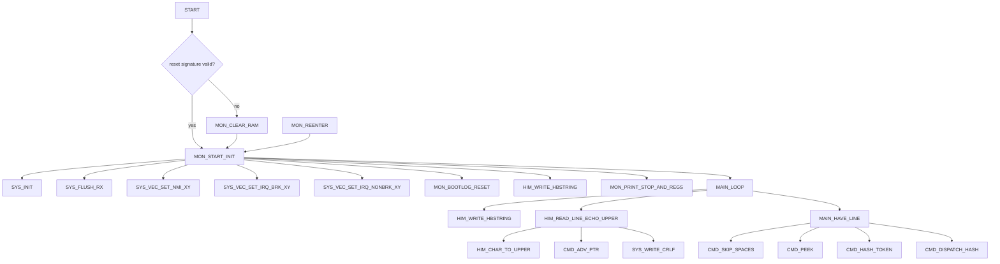
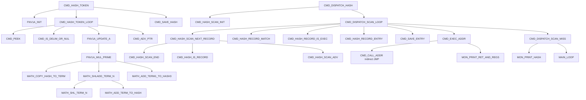
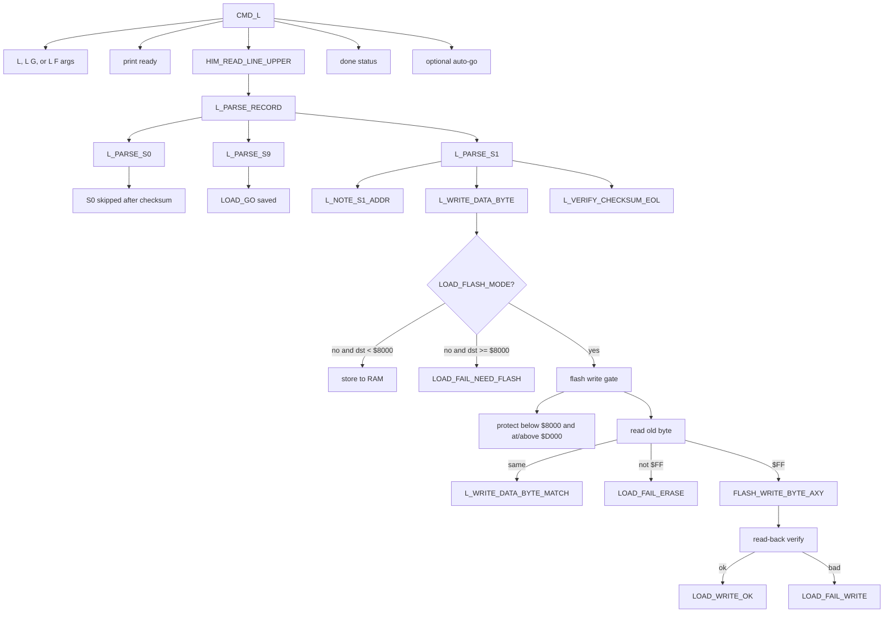
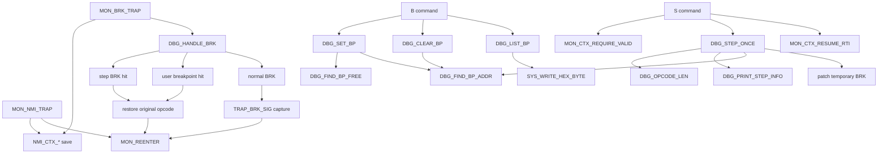
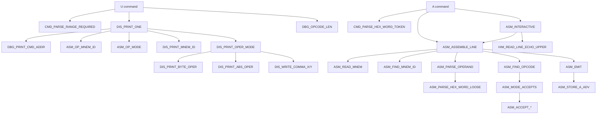
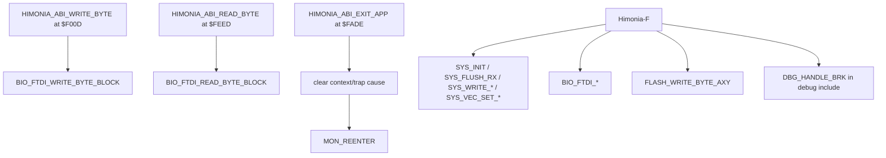

# Himonia-F Map

This is the human map for Himonia-F. The raw edge list lives in
[HIMONIA_F_EDGE_DUMP.md](./HIMONIA_F_EDGE_DUMP.md); this file groups those
edges into readable subsystems and capability surfaces.

Scope is the current Himonia-F build path:

```text
SRC/TEST/apps/himon/himon.asm
SRC/TEST/apps/himon/himonia-debug.inc
SRC/TEST/apps/himon/himonia-disasm.inc
SRC/TEST/apps/himon/himonia-asm.inc
SRC/TEST/apps/himon/himon-shared-eq.inc
```

Direct `JSR` and `JMP` edges are the hard evidence. Some package-to-package
arrows below are summaries so the map is readable.

## Edge Map

### Boot, Vectors, And Main Loop



### FNV Catalog Dispatch



### Command Surface

```mermaid
flowchart TD
    DISPATCH[CMD_DISPATCH_HASH] --> HELP[? CMD_HELP]
    DISPATCH --> HASHINFO[# CMD_HASH_INFO]
    DISPATCH --> D[D CMD_D]
    DISPATCH --> M[M CMD_M]
    DISPATCH --> U[U CMD_U]
    DISPATCH --> R[R CMD_R]
    DISPATCH --> X[X CMD_X]
    DISPATCH --> G[G CMD_G]
    DISPATCH --> L[L CMD_L]
    DISPATCH --> B[B CMD_B]
    DISPATCH --> S[S CMD_S]
    DISPATCH --> A[A CMD_A]
    DISPATCH --> Q[Q CMD_Q]

    HASHINFO --> HASHFIND[CMD_HASH_FIND]
    HASHINFO --> HASHLIST[CMD_HASH_LIST]
    HASHLIST --> HASHROW[CMD_HASH_PRINT_ROW]

    D --> RANGE[CMD_PARSE_RANGE_REQUIRED]
    D --> MEMPRINT[MON_PRINT_MEM_RANGE]
    M --> RANGE
    M --> MEMMOD[MON_MODIFY_RANGE]
    U --> RANGE
    U --> DISONE[DIS_PRINT_ONE]

    R --> CTXREQ[MON_CTX_REQUIRE_VALID]
    R --> CTXPARSE[MON_CTX_PARSE_ASSIGN_LIST]
    R --> STOPREGS[MON_PRINT_STOP_AND_REGS]
    X --> CTXREQ
    X --> CTXPARSE
    X --> RESUME[MON_CTX_RESUME_RTI]

    G --> HEXWORD[CMD_PARSE_HEX_WORD_TOKEN]
    G --> SAVEENTRY[CMD_SAVE_ENTRY]
    G --> GOINDIRECT[indirect JMP to target]

    L --> LOADMAP[S19 loader map]
    B --> DBGMAP[breakpoint map]
    S --> STEPMAP[step map]
    A --> ASMMAP[assembler map]
    Q --> BRK65[BRK $65]
```



### Loader And Flash Write Edges



### Trap, Breakpoint, And Step Edges



### Disassembler And Assembler Edges



### ABI And External Boundary



## Full Capability Map

| Capability | User surface | Main labels | Current behavior | Notes |
| --- | --- | --- | --- | --- |
| Boot/re-enter monitor | reset, ABI exit, trap return | `START`, `MON_REENTER`, `MON_START_INIT` | Owns hardware stack on entry, initializes system I/O, installs active vectors, enters prompt. | This is the normal HIMON path today. STR8 is not implemented here yet. |
| Cold RAM clear | reset path | `MON_COLD_RESET`, `MON_CLEAR_RAM` | Clears RAM through `$7EFF`, then sets reset signature and starts monitor. | Preserves the idea that Himonia-F owns monitor RAM after cold boot. |
| Vector/trap install | boot-time | `SYS_VEC_SET_NMI_XY`, `SYS_VEC_SET_IRQ_BRK_XY`, `SYS_VEC_SET_IRQ_NONBRK_XY` | Installs Himonia-F NMI, BRK, and IRQ handlers through system vector helpers. | STR8 should own physical vectors later, with HIMON installing active RAM vectors. |
| Line input | prompt and loaders | `HIM_READ_LINE_ECHO_UPPER`, `HIM_READ_LINE_UPPER` | Blocking FTDI read, uppercases input, supports backspace, Ctrl-C abort, and NUL termination. | `L` uses non-echo upper input for S-record streams. |
| Hi-bit string output | all command messages | `HIM_WRITE_HBSTRING` | Writes high-bit terminated strings through FTDI. | Current compact text format for monitor messages. |
| FNV-1a command hashing | every command token | `CMD_HASH_TOKEN`, `FNV1A_*`, `MATH_*` | Computes the single supported runtime hash and saves it in command exec state. | FNV-1a is the only catalog hash. |
| Catalog scan/dispatch | command execution | `CMD_DISPATCH_HASH`, `CMD_HASH_SCAN_*`, `CMD_HASH_RECORD_*`, `CMD_EXEC_ADDR` | Scans `$9000` through vector boundary for `FN(V|$80)` records, matches hash, requires executable kind, calls entry. | Current record entry is immediate after kind byte. Future records can grow an explicit entry pointer. |
| Catalog inspection | `#`, `# token` | `CMD_HASH_INFO`, `CMD_HASH_LIST`, `CMD_HASH_FIND`, `CMD_HASH_PRINT_*` | Lists catalog records or shows one token hash/entry/kind. | This is the master runtime catalog view. |
| Help | `?` | `CMD_HELP` | Prints current command list. | Help text includes commands from includes: `# ? D M U R X G L B S A Q`. |
| Memory dump | `D start [end|+n]` | `CMD_D`, `CMD_PARSE_RANGE_REQUIRED`, `MON_PRINT_MEM_RANGE` | Prints hex rows plus printable ASCII, abortable with Ctrl-C. | Uses shared range parser. |
| Memory modify | `M start [end|+n]` | `CMD_M`, `MON_MODIFY_RANGE` | Prompts each byte, writes RAM byte directly, `.` aborts. | Flash-safe modify is not current behavior. |
| Disassemble | `U start [end|+n]` | `CMD_U`, `DIS_PRINT_ONE`, `DBG_OPCODE_LEN` | Prints W65C02S opcode, mnemonic, and operand using opcode tables. | Shares the same opcode mode tables as assembler/step. |
| Register display/edit | `R [regs]` | `CMD_R`, `MON_CTX_REQUIRE_VALID`, `MON_CTX_PARSE_ASSIGN_LIST`, `MON_PRINT_STOP_AND_REGS` | Requires trapped context, optionally updates A/X/Y/P/S/PC, then prints context. | Context comes from NMI/BRK capture. |
| Resume trapped context | `X [regs]` | `CMD_X`, `MON_CTX_RESUME_RTI` | Requires context, optionally edits regs, rebuilds stack frame, then `RTI`s. | This is why Himonia-F must be disciplined about the hardware stack. |
| Go to address | `G start` | `CMD_G` | Parses address, saves exec entry, prints go address, jumps indirectly. | Return reporting only happens if called through command record or loader-go path. |
| S-record load to RAM | `L` | `CMD_L`, `L_PARSE_RECORD`, `L_PARSE_S1`, `L_WRITE_DATA_BYTE` | Accepts S0/S1/S9, writes S1 data below `$8000`, tracks count and go address. | Loading to flash without `F` fails with `HINT L F`. |
| S-record load and go | `L G` | `CMD_L` | Same as `L`, then jumps to S9 address or first data address fallback. | Sets exec kind to LOADGO before jump. |
| S-record flash load | `L F` | `L_WRITE_DATA_BYTE_FLASH`, `FLASH_WRITE_BYTE_AXY` | Writes only blank `$FF` bytes in `$8000-$CFFF`, verifies readback, skips after first flash failure. | Protects Himonia-F/ABI area at `$D000+`; no sector erase yet. |
| Breakpoint set/clear/list | `B start`, `B C start`, `B L` | `CMD_B`, `DBG_SET_BP`, `DBG_CLEAR_BP`, `DBG_LIST_BP` | Replaces target byte with `BRK` and stores original opcode in monitor workspace. | Current patch is direct memory write, so RAM code is the sane target. |
| BRK handling | BRK trap | `MON_BRK_TRAP`, `DBG_HANDLE_BRK` | Detects step breakpoint or user breakpoint, restores original opcode, rewinds PC to trapped opcode. | Plain BRK captures signature byte and re-enters monitor. |
| Single step | `S` | `CMD_S`, `DBG_STEP_ONCE`, `DBG_OPCODE_LEN`, `MON_CTX_RESUME_RTI` | Computes next PC by opcode length, plants a temporary BRK, resumes with `RTI`. | Does not emulate branch-taken paths yet. |
| Mini assembler | `A start [mne op]`, interactive `A start` | `CMD_A`, `ASM_ASSEMBLE_LINE`, `ASM_FIND_OPCODE`, `ASM_EMIT` | Assembles one W65C02S instruction to the current address; interactive exits on `.` or Ctrl-C. | Current version is numeric-only and direct-write. Future hashed ASM adds labels/fixups. |
| Quit/test trap | `Q` | `CMD_Q` | Executes `BRK $65`. | Useful to exercise BRK capture path. |
| ABI write byte | fixed entry `$F00D` | `HIMONIA_ABI_WRITE_BYTE` | Trampoline to `BIO_FTDI_WRITE_BYTE_BLOCK`. | Intended stable external call point. |
| ABI read byte | fixed entry `$FEED` | `HIMONIA_ABI_READ_BYTE` | Trampoline to `BIO_FTDI_READ_BYTE_BLOCK`. | Intended stable external call point. |
| ABI exit app | fixed entry `$FADE` | `HIMONIA_ABI_EXIT_APP` | Clears monitor trap state and re-enters monitor. | External code can return to HIMON without knowing internal labels. |

## Edge Evidence Rules

- Raw edge truth stays in `HIMONIA_F_EDGE_DUMP.md`.
- This map may collapse many repeated print edges into one package edge.
- Indirect targets such as `CMD_CALL_ADDR`, `G`, and `L G` are intentionally
  shown as indirect because the concrete target is runtime data.
- Relative branches and fallthrough are control-flow facts, but not direct call
  edges. They are described only when they explain capability behavior.
- Include files are part of the Himonia-F capability surface even when the raw
  source line lives outside `himon.asm`.
