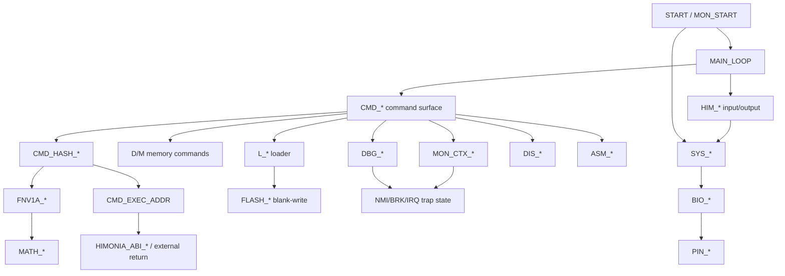

# HIMON Stages And Classes

This is a reconstruction of HIMON's design stages and routine-class families.
It is not a new implementation plan by itself. It is the map that explains how
the current HIMON shape emerged from earlier monitor experiments, and how the
major routine prefixes/classes should be read.

In this document, "class" means a routine family or subsystem class, usually
visible through label prefixes such as `CMD_*`, `MON_*`, `HIM_*`, `FNV1A_*`,
`ASM_*`, and `DIS_*`. It does not mean an object-oriented class.

## Evidence

Current local evidence:

```text
SRC/TEST/apps/himon/himon-parent.asm
SRC/TEST/apps/himon/mon.asm
SRC/TEST/apps/himon/mon-cmd-*.inc
SRC/TEST/apps/himon/himonia.asm
SRC/TEST/apps/himon/fnv1a-hbstr.asm
SRC/TEST/apps/himon/himonia-f.asm
SRC/TEST/apps/himon/himon.asm
SRC/TEST/apps/himon/himon-shared-eq.inc
SRC/TEST/apps/himon/himonia-asm.inc
SRC/TEST/apps/himon/himonia-debug.inc
SRC/TEST/apps/himon/himonia-disasm.inc
SRC/TEST/apps/himon/himonia-bootlog.inc
```

Guide evidence:

```text
DOC/GUIDES/HISTORICAL_DOCUMENTS.md
DOC/GUIDES/HIMON_MAP.md
DOC/GUIDES/MEMORY_MAP.md
DOC/GUIDES/HASHED_ASM.md
DOC/GUIDES/HASH_MAP.md
DOC/GUIDES/DYNAMIC_MEMORY_FIRST_STEPS.md
DOC/GENERATED/ROUTINE_CLASS_DIAGRAM.md
DOC/GENERATED/ROUTINE_COMPONENTS.md
```

Visible git history in this checkout is shallow around the Himon files, but it
does show the current tracked turn:

```text
2026-04-28  himonia-f is flashable
2026-05-01  bring documentation up to date
2026-05-01  various minor cleanup, renames
2026-05-01  banner change
```

Older dates and names below come from `HISTORICAL_DOCUMENTS.md` and from the
source files still present in the tree.

## Stage Ladder

```text
WDCMON/WDC board monitor context
  -> BSO2 monolithic board monitor proof
  -> R-YORS layered routine library
  -> Himon parent shell
  -> Himon split command monitor
  -> Himonia compact supervisor
  -> FNV1A/HBSTR proving tool
  -> Himonia-F hash-dispatched monitor
  -> HIMON current path behind future STR8
```

Short meaning:

```text
BSO2 proved the full board-monitor behavior.
R-YORS split the behavior into layers.
Himon pulled the monitor back into a smaller shell.
Himonia made it a compact supervisor/debug environment.
Himonia-F made commands discoverable FNV records.
HIMON keeps the Himonia-F line and becomes the normal monitor behind STR8.
```

## Stage 0: Board Monitor Ground

Source class:

```text
external/local WDCMON and BSO2 material
```

Primary idea:

```text
the board must always be able to talk, load, inspect, and recover
```

BSO2 was the large proof: command table, memory tools, S-record load/go,
debug stops, vector hooks, mini assembler/disassembler, and board demos. The
lesson was capability first, but not monolith forever.

Class residue carried forward:

```text
command dispatch
memory inspect/modify
S-record load/go
NMI/BRK/debug context
vector routing
assembly/disassembly helpers
recoverable monitor entry
```

## Stage 1: R-YORS Layer Split

Source class:

```text
PIN_*  direct hardware/register boundary
BIO_*  board I/O abstraction
COR_*  reusable core/backend glue
SYS_*  monitor/app-facing services
APP_*  tests, monitors, and loaded programs
```

Primary idea:

```text
turn one capable monitor into reusable routines on routines
```

This is where BSO2's behavior stops being one program and starts becoming a
library surface. Himon/Himonia can then be compact because they call `SYS_*`,
`BIO_*`, and later `FLASH_*` services instead of owning all board behavior
inline.

## Stage 2: Himon Parent Shell

Primary file:

```text
SRC/TEST/apps/himon/himon-parent.asm
```

Source classes:

```text
START_*  reset/warm detection and RAM clear
CMDP_*   command parser/table helpers
CMD_*    shell command loop and hook setup
MON_*    command handlers imported from split monitor command modules
MSG_*    HBSTR message text
```

Primary idea:

```text
HBSTR command table -> hook vector cell -> monitor command routine
```

The parent shell reads one line, uppercases it, parses a token, and dispatches
through an HBSTR command table. The table entries point at RAM hook cells, not
always directly at final routines. That makes command bodies replaceable and is
an early form of dynamic command binding, though still table-based rather than
hash/catalog-based.

Representative command table surface:

```text
DISPLAY
FILL
COPY
MODIFY
HELP
LOAD
KEYTEST
GO
RESUME
QUIT
```

Important reconstruction point:

```text
CMDP_* is the older parser class.
CMD_* becomes the current command class.
MON_* holds command behavior and monitor context behavior.
```

## Stage 3: Split Himon Command Monitor

Primary files:

```text
SRC/TEST/apps/himon/mon.asm
SRC/TEST/apps/himon/mon-cmd-core.inc
SRC/TEST/apps/himon/mon-cmd-memory.inc
SRC/TEST/apps/himon/mon-cmd-debug.inc
SRC/TEST/apps/himon/mon-cmd-load.inc
```

Source classes:

```text
MON_CMD_*   command bodies
MON_LOAD_*  S-record loader session
MON_CTX_*   saved context display/edit/resume
CMDP_*      parser helpers still owned by the shell path
```

Primary idea:

```text
keep the shell small and move command behavior into callable pieces
```

This stage is the bridge from a single shell file into reusable monitor
classes. It preserves the command-table world, but begins isolating the work by
behavior: core, memory, debug, and load.

Design result:

```text
HIMON can be small because command classes can be factored,
but the current final image can still include them directly when compactness
or fixed placement matters.
```

## Stage 4: Himonia Compact Supervisor

Primary file:

```text
SRC/TEST/apps/himon/himonia.asm
```

Source classes:

```text
START / MON_START_INIT  boot and re-entry
MAIN_LOOP               prompt and read/eval loop
CMD_*                   direct one-letter command dispatch
HIM_*                   tiny input/output helpers
MON_CTX_*               trap context validation/edit/resume
MON_PRINT_*             monitor output helpers
L_*                     S-record parser/loader
DBG_*                   breakpoint/step workspace via include
DIS_*                   disassembler via include
ASM_*                   assembler via include
```

Primary idea:

```text
compact supervisor, direct command dispatch, monitor-owned stack
```

Himonia resets the hardware stack on monitor entry, owns NMI/BRK trap capture,
and uses concise single-letter commands:

```text
? D M U R X G L B S A Q
```

This is the point where the monitor becomes less like a command shell and more
like a small supervisory environment:

```text
reset/re-enter
trap capture
register edit/resume
memory tools
loader
assembler/disassembler
debug break/step
```

The direct dispatch is intentionally simple:

```text
peek first command byte
compare against known letters
jump to command routine
```

## Stage 5: FNV1A/HBSTR Proving Tool

Primary file:

```text
SRC/TEST/apps/himon/fnv1a-hbstr.asm
```

Source classes:

```text
FNV1A_*  FNV-1a hash lifecycle
MATH_*   32-bit multiply-by-prime support
APP_*    standalone tool UI
```

Primary idea:

```text
prove FNV-1a and HBSTR text as executable W65C02 code
```

This stage matters because the hash stops being only a documentation idea.
The code hashes high-bit-terminated text into a 32-bit little-endian FNV-1a
value:

```text
FNV_HASH0..3 = hash low byte through high byte
```

Design result:

```text
command names, symbols, routine names, and future catalog records can share
one compact lookup method
```

## Stage 6: Himonia-F Hash-Dispatched Monitor

Primary files:

```text
SRC/TEST/apps/himon/himonia-f.asm
SRC/TEST/apps/himon/himon.asm
```

Source classes:

```text
CMD_HASH_*     token hashing, record scan, record match, entry lookup
FNV1A_*        runtime hash calculation
MATH_*         hash multiply support
CMD_*          command bodies exposed through FNV records
L_*            RAM/flash S-record loader
HIM_*          line input and HBSTR output
MON_*          boot, trap, context, print, return-status helpers
DBG_*          breakpoints and step
DIS_*          disassembler
ASM_*          mini assembler
HIMONIA_ABI_*  fixed external ABI slots
```

Primary idea:

```text
token -> FNV-1a hash -> scan record -> executable entry
```

Current proving record shape:

```text
'F','N',('V'|$80),hash0,hash1,hash2,hash3,kind,entry...
```

This stage is the conceptual break from "the monitor has commands" to "the
runtime can discover executable records." The `#` command exposes that lookup
path without executing the command.

Important boundary:

```text
himonia-f.asm is the named FNV experiment.
himon.asm is the promoted current HIMON path.
They should not be treated as permanently separate products.
```

## Stage 7: Current HIMON Behind Future STR8

Primary current role:

```text
HIMON = normal monitor/debug/catalog/assembler environment
STR8  = protected recovery/update owner
```

Current HIMON owns:

```text
prompt and command dispatch
FNV command records
loader and flash blank-write path
debug trap context
break/step
assembler/disassembler helpers
fixed ABI slots
runtime catalog direction
```

Future STR8 should own:

```text
selected STR8 protected window in bank 3 top sector and hardware vectors
top-sector read/stage/erase/full-sector-write/verify policy for non-STR8 bytes
catalog/FNV ownership after V0
recovery/update policy
flash erase/write/verify/commit guardrails
known-good identity and recovery surface
V0 image-oriented bank recovery before catalog/FNV ownership
```

Future `MEM_*` should own dynamic memory if HIMON adopts it:

```text
RAM range policy
zero-page pointer lanes
bump allocation
mark/release
pools
any later free-list heap
```

## Class Family Reconstruction

| Class | First clear stage | Current status | Meaning |
| --- | --- | --- | --- |
| `START_*` / `START` | Himon parent | Current boot entry | Reset classification, cold clear, warm entry, initial monitor transfer. |
| `MON_START_*` / `MON_REENTER` | Himonia | Current supervisor core | Monitor-owned hardware stack, re-entry after trap or ABI exit, system init. |
| `HIM_*` | Himonia | Current small monitor I/O | Local line input, uppercase handling, HBSTR output, Ctrl-C checks. |
| `CMDP_*` | Himon parent | Older/split shell parser | Table parser, hex token parser, HBSTR command table traversal. |
| `CMD_*` | Himonia | Current command surface | Single-letter command handlers and current FNV dispatch support. |
| `CMD_HASH_*` | Himonia-F | Current catalog dispatch | Hash token, scan records, compare hash, derive executable entry. |
| `MON_CMD_*` | Split Himon | Older modular command bodies | Full-word shell commands such as display/fill/copy/load/go/resume. |
| `MON_CTX_*` | Himon parent/Himonia | Current debug context | Saved A/X/Y/P/S/PC, edit, print, and `RTI` resume. |
| `MON_PRINT_*` | Himonia | Current monitor output | Stop reports, register reports, memory dump formatting, return-status display. |
| `L_*` / `MON_LOAD_*` | Himon parent/Himonia | Current loader behavior | S-record session, RAM write, flash blank-write gate, load/go. |
| `DBG_*` | Himonia | Current debug include | Breakpoint slots, temporary step breakpoint, opcode-length support. |
| `DIS_*` | Himonia | Current disassembler include | Opcode/mode tables rendered into readable W65C02 mnemonics. |
| `ASM_*` | Himonia | Current assembler include | Numeric mini assembler; future hash assembler adds symbols/fixups. |
| `FNV1A_*` | FNV tool | Current runtime hash | 32-bit little-endian FNV-1a over command/name text. |
| `MATH_*` | FNV tool | Current hash support | 32-bit shift/add math used by FNV prime multiply. |
| `FLASH_*` | Himonia-F | Current imported service | Byte write helper used by `L F`; STR8 should own safer erase/update later. |
| `HIMONIA_ABI_*` | Himonia-F | Current ROM ABI names | Fixed `$F00D`, `$FEED`, `$FADE` external entry slots. Names lag the final HIMON name. |
| `MEM_*` | Future HIMON dynamic stage | Planned only | Dynamic memory ownership layer; not STR8, not current HIMON. |

## Class Map



## Current Command-Class Surface

Current short commands group naturally like this:

```text
?      help
#      FNV/catalog list or lookup
D M    memory display and modify
U A    disassemble and assemble
R X    register/context view, edit, and resume
G L    execute, load, load/go, flash load
B S    breakpoints and single step
Q      controlled BRK test/quit
```

The command class split is important:

```text
CMD_* command names and command entry routines
CMD_HASH_* runtime lookup and dispatch machinery
MON_* monitor state/context/output helpers
HIM_* local character/string I/O helpers
```

## Naming Cleanup Direction

Keep this reading:

```text
Himonia-F -> current HIMON implementation path
HIMONIA_ABI_* -> historical ABI symbol names still present in code
HIMON -> final normal monitor name
STR8 -> recovery/update guard
```

Do not fork the docs into separate Himonia-F and HIMON product stories. The
current source promotes the FNV-driven Himonia-F line into HIMON.

## Open Reconstruction Notes

- The current checkout keeps the important stage files, but older git history
  before the tracked Himonia-F import is partly represented by documentation
  rather than direct commit ancestry.
- Himon4 is mentioned as a short-lived variant in historical notes, but there is
  no current tracked source file for it in `SRC/TEST/apps/himon`.
- The current generated class diagram is useful for prefix frequency, but this
  guide is the human reconstruction of what those classes mean.
- Any future `MEM_*` dynamic-memory stage should update this document together
  with `DYNAMIC_MEMORY_FIRST_STEPS.md`, `MEMORY_MAP.md`, and `DECISIONS.md`.
