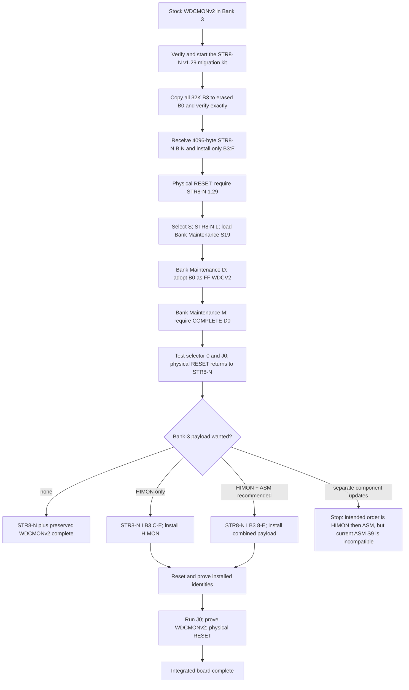

# WDCMONv2 To STR8-N, HIMON, And ASM-F2 Installation Flow

This is the ordered onboarding runbook for a stock W65C02SXB or
W65C02SXB/EDU. It covers:

1. preserving the factory WDCMONv2 system in Bank 0;
2. installing STR8-N 1.29 in protected Bank-3 sector F;
3. using Bank Maintenance to publish the preserved Bank-0 system;
4. optionally installing HIMON, ASM-F2, or both in Bank 3; and
5. proving that both the new Bank-3 environment and the preserved factory
   system remain reachable.

This guide is a sequence map, not a replacement for the exact prompts,
failure handling, and release hashes in the standalone
[STR8-N migration guide](../../../STR8-N/docs/WDCMONV2_MIGRATION.md) and
[STR8-N operator guide](../../../STR8-N/docs/OPERATORS_GUIDE.md). If a prompt
or version differs, stop and use the documentation shipped with that exact
release.

## Final Intended Layout

```text
Bank 0  $8000-$FFFF  byte-exact preserved factory WDCMONv2 guest
Bank 1  available according to current role policy; B1:E WORK and B1:F is
        reserved for a protected B3:F backup (it may still be erased)
Bank 2  available for qualified guests and AP carriers
Bank 3  $8000-$BFFF  optional ASM-F2
        $C000-$EFFF  optional HIMON
        $F000-$FFFF  STR8-N 1.29, directory, configuration, vectors
```

The Bank-0 copy remains an opaque 32K guest. `J0` or reset selector `0` hands
the machine completely to it. Physical RESET is the designed route back to
Bank-3 STR8-N.

## How The WORK/TWS Role And Bank-3 Sector F Are Set

There is no current `TWS` symbol or published acronym in R-YORS or STR8-N. If
“TWS” means the temporary/work sector, the current name is **WORK**, and its
locator is one byte in the Bank-3 configuration pocket:

```text
B3:$FFF0 = $1E  WORK is Bank 1 sector E
B3:$FFF1 = $1F  protected B3:F backup location is Bank 1 sector F
B3:$FFF2 = $FF  automatic external FNV-bank search disabled
B3:$FFF3-$FFF9  reserved/erased
```

`$1E` and `$1F` are packed bank/sector locators, not data copied into those
sectors. Installing the canonical top merely declares the roles. It does not
erase, initialize, or copy anything into B1:E or B1:F. B1:F becomes a real
backup only when a guarded top-sector operation copies and verifies B3:F
there.

These bytes are built into the canonical 4096-byte STR8-N top BIN by
`../STR8-N/tools/build_str8n_top_bin.ps1`. The same BIN contains the STR8-N
resident and stored RAM worker, empty initial directory, configuration pocket,
and hardware vectors:

```text
B3:$F000-$FD55  STR8-N resident
B3:$FD5C-$FFAF  stored unified worker
B3:$FFB0-$FFEF  directory and install journals
B3:$FFF0-$FFF9  configuration pocket
B3:$FFFA-$FFFF  NMI, RESET, and IRQ/BRK vectors
```

The current RESET vector is `$F000`. CPU or physical RESET does **not** erase,
rewrite, or reset any flash byte: hardware selects Bank 3, reads the vector at
`$FFFC-$FFFD`, and enters STR8-N at `$F000`.

### Operations That Write Or Reconstruct B3:F

| Operation | Effect on B3:F | Directory | WORK/backup locators |
| --- | --- | --- | --- |
| Factory migration | Receives and verifies the exact canonical 4K BIN, then erases/programs/verifies B3:F | Starts empty | Installs `$1E/$1F` from the canonical image |
| External programmer | Programs the 4K BIN at device offset `$1F000-$1FFFF` | The canonical BIN starts with an empty directory | Installs canonical `$1E/$1F` |
| Normal STR8-N top update, standalone tool or Bank Maintenance `U` | Backs up live B3:F to B1:F, then replaces and verifies the whole sector | Preserves live `$FFB0-$FFEF` | Installs the candidate image's configuration pocket |
| Directory refresh | Backs up live B3:F to B1:F, then replaces and verifies the whole sector | Deliberately resets `$FFB0-$FFEF` to erased | Reinstalls canonical `$1E/$1F`; `$FFF2-$FFF9` become `$FF` |
| Bank Maintenance `D` | Programs a previously erased directory row with START, identity, and COMPLETE in commit-last order | Adopts only the selected empty row | Preserves the configuration bytes |
| Bank Maintenance `N` or `R` | Uses backup/staging and a guarded whole-sector rewrite when directory bits must return from 0 to 1 | Renames/reclaims only the requested directory state | Preserves the unrelated configuration bytes |
| STR8-N `I` | Never writes B3:F | Journals B3 installs through protected services | Cannot change these locators or sector-F code |

The practical meanings of “reset” are therefore different:

- **Reset the CPU:** press physical RESET; flash remains unchanged.
- **Reset the STR8-N directory/install journals:** run the guarded directory
  refresh, which rewrites all of B3:F and then requires desired banks to be
  adopted or installed again.
- **Restore canonical STR8-N code/configuration:** use the guarded top updater
  when a healthy STR8-N still runs, or program the verified 4K BIN at physical
  `$1F000-$1FFFF` with an external programmer.
- **Change WORK or backup role locators:** there is no ordinary operator
  command for `$FFF0/$FFF1`; they are canonical image policy. Changing a
  programmed locator can require a complete guarded B3:F erase/rewrite because
  SST39 flash cannot change a bit from 0 back to 1 without erasing the sector.

During the factory migration, recovery source and long-term backup are not the
same thing. Before the first top write, the proven copy of old B3:F is B0:F as
part of the complete preserved WDCMONv2 bank. The live RAM migrator can use
`O` to restore it after an active write failure. B1:F is not populated by that
migration; later top-update or directory-refresh tooling explicitly creates
and verifies the B1:F backup before erasing B3:F.

## Whole Flow



## Before Starting

Use this runbook only when the initial state is understood:

| Initial state | Starting point |
| --- | --- |
| Stock WDCMONv2 in Bank 3, Bank 0 erased | Begin at Phase 1 |
| STR8-N 1.29 already boots and `D0 FF WDCV2 FFFF FCFFFFFF` exists | Skip to Phase 4 |
| STR8-N 1.29 boots, B0 contains the verified factory copy, but D0 is erased | Begin at Phase 3 |
| Another STR8-N version or a partly completed install | Stop; use that release's recovery/update guide before this flow |
| Bank 0 is used and differs from Bank 3 | Stop; archive and identify both banks before authorizing any copy |

Required before a factory migration:

- the extracted STR8-N 1.29 WDCMONv2 migration kit;
- Windows PowerShell 5.1 for the board-accepted reference path;
- the correct free COM port at 115200 8N1 after migration;
- stable board and USB power, and access to physical RESET;
- the canonical 4096-byte STR8-N top BIN from the kit; and
- an external-programmer recovery path or equivalent verified backup.

Do not paste an S19 into stock WDCMONv2. Its initial host connection is a
binary protocol and must be driven by the packaged migration wrapper.

Throughout every flash operation: do not press RESET or NMI, disconnect USB,
remove power, or remove the flash device while erase/program activity is in
progress.

## Phase 0: Prepare And Verify Artifacts

Packaged onboarding does not require a source build. Use the verifier and
checksums shipped with the extracted STR8-N migration/release kit, then keep
these artifact roles distinct:

| Artifact | Used by | Purpose |
| --- | --- | --- |
| `STR8-iN65-LOADER.ps1` | Host under stock WDCMONv2 | Drives the binary protocol and entire migration dialogue |
| `STR8-N-v1-29.bin` | Factory RAM migrator | Exact 4096-byte Bank-3 top sector |
| `STR8-iN65-BANK-MAINT-2000.s19` | STR8-N `L` | Temporary RAM Bank Maintenance tool used to adopt B0 |
| `ryors-v1.2-himon-asm-bank3-8-e.s19` | STR8-N `I` | Combined HIMON and ASM-F2 Bank-3 payload |
| `ryors-v1.2-himon-bank3-c-e.s19` | STR8-N `I` | HIMON-only Bank-3 payload |
| `ryors-v1.2-asm-bank3-8-b.s19` | Do not send in the current release | Intended ASM-F2 component; currently blocked by its S9 mismatch |

From sibling source checkouts, the current builds are:

```text
make all
make -C ../STR8-N wdcmonv2-package
make -C ../STR8-N release-package
```

`make all` at the R-YORS root builds the R-YORS component images and verifies
the locked STR8-N integration. The standalone STR8-N targets build and verify
the factory migration kit and full release bundle. Do not mix component files
from different releases merely because their filenames have the same v1.2
product prefix; use the supplied hashes and integration manifest.

## Phase 1: Start The Factory Migration

From the extracted kit on the board-accepted Windows path:

```powershell
powershell.exe -NoProfile -ExecutionPolicy Bypass `
  -File .\STR8-iN65-LOADER.ps1
```

The wrapper asks for the COM port when one was not supplied. Keep the same
host session open: it begins with WDCMONv2 binary traffic and later becomes
the ASCII terminal and file-transfer path.

When instructed:

1. Press physical RESET and let the wrapper verify the `SXB2` board identity.
2. Require the flash identity and Bank-0 policy checks to pass.
3. If and only if Bank 0 is reported erased and disposable, type:

   ```text
   COPY B3 TO B0
   ```

4. Require all eight sectors and the complete 32K byte comparison to pass.
5. When the board prints `SEND STR8-N TOP BIN; 4096 BYTES; START $F000`, press
   `Ctrl+U` exactly once. Do not send the file early.
6. Require the received BIN length and build-time FNV check to pass.
7. Type the separate exact confirmation:

   ```text
   INSTALL STR8-N 1.29
   ```

Only Bank-3 sector F is replaced. The verified factory Bank-3 image has
already been copied to Bank 0; Banks 1 and 2 are not migration destinations.

### Phase 1 checkpoint

Require physical RESET to print:

```text
RESET
STR8-N 1.29
0-2 C W S:
```

Select `S` to remain at `STR8-N>`. At this point STR8-N is installed, but its
new directory is intentionally empty. The preserved Bank-0 system is not yet
launchable through `J0` until Phase 3 commits D0.

## Phase 2: Load Bank Maintenance

The migration wrapper packages the production Bank Maintenance S19 as the
second transfer. At `STR8-N>`:

1. Enter `L`.
2. Wait for `S19`.
3. Press `Ctrl+D` exactly once when the wrapper asks for it.
4. Require STR8-N to validate the RAM image and automatically execute its S9
   entry at `$2000`.

The equivalent artifact in a STR8-N build tree is:

```text
BUILD/v1.29/s19/str8n-v1.29-bank-maint-2000.s19
```

`L` loads and executes a temporary RAM tool. It does not itself write flash.
Within Bank Maintenance, `M` is read-only; `C`, `D`, `E`, `N`, `P`, and `R`
are flash-changing operations with their own gates.

Bank Maintenance has a larger lifecycle role, but only `D` and `M` are needed
for the factory-migration path:

| Command | Purpose in this flow |
| --- | --- |
| `D` | Adopt the already-copied Bank-0 payload into an empty D0 row |
| `M` | Verify the four-bank map and exact directory record |
| `Q` or empty main-menu line | Return to STR8-N |

Do not use `C`: the byte-exact B3-to-B0 copy was already completed by the
factory migrator. Do not use `P`: it is the narrow legacy AP carrier path, not
the HIMON/ASM installer. Do not use `E`, `N`, or `R` during ordinary onboarding.

## Phase 3: Publish And Prove Preserved WDCMONv2

At the Bank Maintenance prompt:

1. Enter `D`.
2. Select Bank `0`.
3. Enter TYPE `FF`.
4. Enter the five-character description `WDCV2`.
5. Inspect the proposed D0 bytes and require:

   ```text
   PROPOSED D0 B3:$FFB0: FF FF FF FF 57 44 43 56 32 FE FF FF FC FF FF FF
   ```

6. Type the exact confirmation:

   ```text
   ADOPT B0
   ```

7. Enter `M` and require the directory row:

   ```text
   D0 FF WDCV2 FFFF FCFFFFFF
   ```

8. Use `Q` to return to STR8-N.

Test both launch paths separately:

1. At physical RESET, select `0`; require the retained factory identity.
2. Press physical RESET to return to STR8-N.
3. Select `S`, enter `J0`, and again require the factory identity.
4. Press physical RESET and require `STR8-N 1.29` again.

The WDCMONv2-to-STR8-N migration is complete here. HIMON and ASM-F2 are
optional payloads and should be installed only after this recovery baseline
has passed.

## Phase 4: Choose The Bank-3 Payload

Obtain the components from either the migration kit's
`OPTIONAL/HIMON-ASM/` directory or the matching R-YORS release. Verify their
hashes against the release that supplied them.

| Desired Bank-3 environment | File | STR8-N `I` range | New-row identity | Notes |
| --- | --- | --- | --- | --- |
| HIMON + ASM-F2 | `ryors-v1.2-himon-asm-bank3-8-e.s19` | `8-E` | TYPE `FF`, DESC `RYORS` | Recommended first R-YORS payload; one transaction |
| HIMON only | `ryors-v1.2-himon-bank3-c-e.s19` | `C-E` | TYPE `48`, DESC `HIMON` | Establishes S9/entry `$C000` |
| ASM-F2 added to existing HIMON | `ryors-v1.2-asm-bank3-8-b.s19` | Do not install the current artifact | Existing D3 identity is `$C000` | Intended as a later component update, but the current artifact has incompatible S9 `$8000`; see Option C |
| No R-YORS payload | none | none | none | STR8-N plus preserved WDCMONv2 remains valid |

Do not send the full Bank-0/1/2 image
`ryors-v1.2-str8n-himon-asm-bank0-2-8-f.s19` to Bank 3. It includes sector F,
and STR8-N `I` deliberately refuses Bank-3 sector F.

### Option A: Install HIMON And ASM-F2 Together

This is the simplest fresh Bank-3 install. At `STR8-N>`:

```text
I
B0-3: 3
RANGE: 8-E
TYPE: FF
DESC: RYORS
I B3 8-E WRITE? Y: Y
S19
```

Send:

```text
ryors-v1.2-himon-asm-bank3-8-e.s19
```

Require seven sector dots, accept `COMMIT? Y` only after the complete stream
and S9 have been accepted, and require `OK`. Its S9 is `$C000`, so successful
completion enters HIMON.

### Option B: Install HIMON Only

At `STR8-N>`:

```text
I
B0-3: 3
RANGE: C-E
TYPE: 48
DESC: HIMON
I B3 C-E WRITE? Y: Y
S19
```

Send `ryors-v1.2-himon-bank3-c-e.s19`. Require three sector dots, the final
commit, `OK`, and the exact `HIMON V` banner.

### Option C: Install The Components Separately

The intended ordering is HIMON `C-E` first, then ASM-F2 `8-B`. HIMON
establishes immutable Bank-3 entry `$C000`; a later ASM-only stream must
therefore end with S9 `$FFFF` (retain the entry) or `$C000` (exact match).

**Do not run the separate ASM step from the current 2026-09-02 artifacts.**
Direct inspection shows that both copies below end in `S90380007C`, which is
S9 `$8000`:

```text
RELEASE/ARTIFACTS/COMPONENT-IMAGES/ryors-v1.2-asm-bank3-8-b.s19
../STR8-N/BUILD/v1.29/str8n-v1.29-release/OPTIONAL/HIMON-ASM/
  ryors-v1.2-asm-bank3-8-b.s19
```

That S9 does not equal HIMON's existing `$C000` entry and is not the documented
`$FFFF` no-change value. The live STR8-N gate must reject it with an entry
error. The packaged optional-install card and some current prose still call
this artifact `$FFFF`; the bytes, R-YORS Makefile, and STR8-N release verifier
currently agree on `$8000` instead.

Until the generator, identity check, packaged artifact, and documentation all
agree on an accepted S9, use the combined `8-E` image for HIMON + ASM-F2. The
HIMON-only path remains valid. Do not hand-edit the S9 record as an operating
workaround because that would bypass the release identity and checksum gates.

## Phase 5: Final Acceptance Sequence

After installing the chosen payload:

1. Press physical RESET and require `STR8-N 1.29`.
2. Select `C`; require the expected HIMON version and prompt.
3. Enter `ASM`; require the expected ASM-F2 identity if ASM was installed.
4. Exit ASM with `.` and return to STR8-N with `STR8`.
5. Enter `J0`; require the preserved WDCMONv2 identity and normal board face.
6. Press physical RESET; require Bank-3 `STR8-N 1.29` again.
7. Optionally select `W` or allow the selector timeout; require warm HIMON
   entry and preserved RAM behavior.

Record the exact STR8-N, HIMON, and ASM-F2 banners and retain the migration
wrapper's raw transcript and timestamped event log.

## What Runs In What Order

```text
stock WDCMONv2
  -> host migration wrapper
  -> RAM factory migrator
  -> copy B3 to B0
  -> install STR8-N only in B3:F
  -> physical RESET into STR8-N
  -> STR8-N L loads/runs Bank Maintenance
  -> Bank Maintenance D adopts B0 as WDCV2
  -> Bank Maintenance M verifies D0 COMPLETE
  -> J0/selector-0/physical-RESET proof
  -> STR8-N I installs Bank-3 payload:
       combined 8-E, or
       HIMON C-E only; separate ASM 8-B is blocked until its S9 is corrected
  -> physical RESET / HIMON / ASM / J0 / physical RESET proof
```

Bank Maintenance is therefore used between STR8-N installation and R-YORS
payload installation to make the preserved factory Bank 0 bootable. It is not
used to install HIMON or ASM-F2.

## Recovery And Stop Conditions

- If Bank 0 is not erased or byte-identical to the expected factory source,
  do not authorize `COPY B3 TO B0`.
- If the 32K copy or exact verify fails, do not install STR8-N over B3:F.
- If the top-BIN length/FNV check fails, do not type the install confirmation.
- If STR8-N boots but D0 adoption fails, do not use `J0`; inspect with Bank
  Maintenance `M` and retain Bank 0 unchanged.
- If an `I` transaction is interrupted, do not boot that incomplete bank.
  Retry Bank 3 with the complete `8-E` recovery range; a smaller retry may be
  refused because earlier sectors are no longer trustworthy.
- During any active B3:F failure recovery, do not reset. Follow the exact
  retry/restore prompt in the STR8-N release guide or use the retained
  external-programmer recovery image.
- Do not use historical HIMON `L F`, HIMON `L G`, ASM TopWriter, or old Bank
  Maintenance `P` procedures as substitutes for the current owner-specific
  paths.
- Do not attempt the current separate ASM-only `8-B` artifact after a HIMON
  install; its S9 `$8000` conflicts with the established D3 entry `$C000`.

## Current Authorities

- [R-YORS Capability Matrix](CAPABILITIES.md)
- [R-YORS Operator's Guide](OPERATORS_GUIDE.md)
- [STR8-N WDCMONv2 Migration](../../../STR8-N/docs/WDCMONV2_MIGRATION.md)
- [STR8-N Load HIMON And ASM-F2](../../../STR8-N/docs/HIMON_ASMF2_AFTER_STR8N.md)
- [STR8-N Operator's Guide](../../../STR8-N/docs/OPERATORS_GUIDE.md)
